# Casos de Uso del Sistema

**Proyecto:** SPLG — Sistema de Pedidos y Logística de Garrafas de Gas
**Metodología:** Proceso Unificado (UP)
**Versión:** 2.2
**Fecha:** 2026-10-03

---

## Contenido

Este documento reúne, para los **249 casos de uso**, los cuatro artefactos que exige la
cátedra, más los artefactos de contexto que los acompañan:

1. **Actores del sistema** — quiénes interactúan con él.
2. **Diagrama de casos de uso** — los límites del sistema.
3. **Catálogo y calificación** — la lista completa con su importancia relativa.
4. **Casos de uso de alto nivel** — la descripción breve de cada uno.
5. **Casos de uso expandidos** — la especificación completa: precondición, secuencia
   normal, postcondición, excepciones, rendimiento, frecuencia y estabilidad.
6. **Diagramas de secuencia del sistema** — el comportamiento como caja negra.
7. **Diagramas de interacción de diseño** — qué clases participan y en qué orden.

Los casos **CU-001 a CU-051** provienen del relevamiento inicial. Los casos **CU-052 a
CU-104** se incorporaron al contrastar la documentación contra el sistema construido:
describen comportamientos que el sistema ya ejecuta y que el relevamiento no había
registrado.

### Convención de prioridad

| Símbolo | Calificación | Significado |
|:---:|---|---|
| C | Crítico | El sistema no puede operar sin este caso de uso. |
| I | Importante | Aporta valor significativo; forma parte del producto mínimo viable. |
| S | Secundario | Deseable, pero no bloquea la operación. |
| M | Menor | Comodidad puntual: su ausencia no le impide al usuario conseguir lo mismo por otro camino. |
| A | — | El caso lo ejecuta el sistema por iniciativa propia, sin actor humano. |

---

## 1. Actores del Sistema

| Código | Actor | Tipo | Descripción |
|--------|-------|:----:|-------------|
| ACT-01 | Cliente | Humano | Usuario final que realiza pedidos de garrafas mediante la App Cliente (Flutter). |
| ACT-02 | Chofer | Humano | Repartidor que gestiona entregas mediante la App Chofer (Flutter). |
| ACT-03 | Administrador | Humano | Operador del distribuidor que accede al Panel Web (React/Vite). |
| ACT-04 | Sistema Automático | Automático | Procesos que el backend ejecuta por iniciativa propia, sin que ningún usuario los solicite y sin interfaz. Es el actor de los cinco procesos automatizados del sistema: la negociación secuencial de asignación de pedidos (M1), la planificación predictiva de mantenimiento y habilitaciones de flota (M2), la anticipación de recompra por consumo estimado (M3), la agrupación inteligente de pedidos por recorrido (M4) y la recuperación de envases no devueltos (M5). Las tareas de mantenimiento del propio sistema —vencer una oferta, activar una reserva que llegó a su fecha, liberar el stock de un pedido caducado— no son procesos automatizados: son la ejecución programada de esos circuitos. Es un actor interno de disparo temporal —el equivalente al actor «Tiempo» de Larman—: representa el reloj y los eventos internos que inician casos de uso sin que los inicie una persona ni un sistema externo. |
| ACT-05 | Administrador General | Humano | Operador de la plataforma, con alcance sobre todas las distribuidoras. Da de alta las empresas comercializadoras y designa a sus administradores. Es el único actor cuyo alcance no está limitado a una distribuidora. |
| ACT-06 | MercadoPago | Secundario (sistema externo) | Pasarela de cobro. El sistema le crea el checkout de cada pedido o seña que se paga por MercadoPago y recibe de ella el aviso de pago aprobado. No inicia ningún caso de uso. Participa en CU-005, CU-048, CU-072 y CU-147. |
| ACT-07 | Firebase | Secundario (sistema externo) | Identidad y mensajería. El sistema le pide crear y deshabilitar cuentas, verificar el token de identidad y generar el enlace de recuperación de contraseña, y le entrega las notificaciones push que llegan a los dispositivos. No inicia ningún caso de uso. Participa en CU-001, CU-004, CU-005, CU-013, CU-014, CU-015, CU-016, CU-018, CU-019, CU-020, CU-021, CU-047, CU-072, CU-079, CU-082, CU-085, CU-091, CU-100, CU-101 y CU-147. |
| ACT-08 | Servicio de correo | Secundario (sistema externo) | Envía los correos transaccionales del sistema: bienvenida al cliente, recuperación de contraseña, prueba del servicio y aviso de vencimientos de la flota. No inicia ningún caso de uso. Participa en CU-002, CU-047, CU-102, CU-142, CU-211 y CU-224. |
| ACT-09 | Plataforma de despliegue | Primario (sistema externo) | Orquestador de contenedores, balanceador de carga o servicio de monitoreo que sondea el estado del backend para decidir si le envía tráfico o si reinicia la instancia. Es quien inicia CU-104. |

**Figura — Actores del sistema y el canal por el que operan**

> Los cuatro actores humanos (Cliente, Chofer, Administrador y Administrador General) operan
> siempre a través de una aplicación; ninguno accede directamente al backend. El Sistema
> Automático no tiene interfaz: son los procesos que el backend dispara por sí mismo, y es el
> actor principal de los casos de uso que la documentación marca como automáticos.
> MercadoPago, Firebase y el servicio de correo son sistemas externos que el backend invoca:
> participan como actores secundarios y no inician ningún caso de uso. La plataforma de
> despliegue es un sistema externo que, al revés, es quien consulta el estado del backend.

> **Generalización.** El Administrador General (ACT-05) es una especialización del Administrador (ACT-03): hace todo lo que hace éste y además lo que es exclusivo de la plataforma. Por eso, en los diagramas, ACT-05 se asocia sólo a los casos de uso que son exclusivos suyos; los demás los hereda. ACT-06, ACT-07 y ACT-08 son actores secundarios: el sistema los invoca para completar un caso que inició otro actor.

---

## 2. Diagrama de Casos de Uso del Sistema

El sistema comprende 249 casos de uso agrupados en 21 subsistemas. Se presentan tres vistas
complementarias, todas en notación UML: el **mapa del sistema**, de una página, que muestra
los 21 paquetes con su cantidad de casos y qué actor participa en cuál; el **diagrama de
contexto**, que delimita el sistema; y el **diagrama completo**, que abre los 249 casos uno
por uno dentro de su paquete.

**Figura — Mapa del sistema: paquetes y actores**

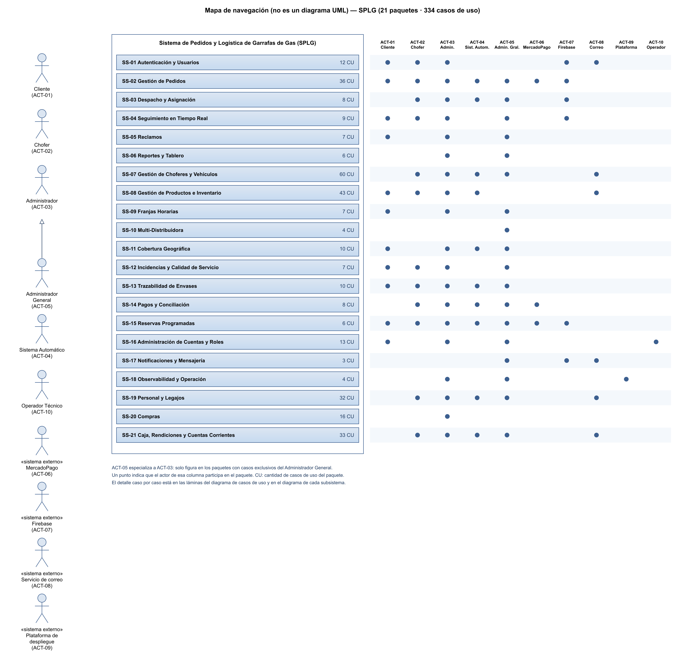

**Figura — Diagrama de contexto: actores contra subsistemas**

**Figura — Diagrama completo: los 249 casos de uso**

> Notación UML. Cada actor se dibuja una sola vez y fuera del límite del sistema: los humanos
> a la izquierda; a la derecha, el Sistema Automático y los tres sistemas externos. Los 18
> subsistemas son paquetes dentro del límite. El Administrador General (ACT-05) especializa
> al Administrador (ACT-03), de modo que sólo se asocia a los casos que son exclusivos suyos
> y hereda el resto. Las flechas punteadas son las relaciones `«include»` (del caso base al
> incluido) y `«extend»` (de la extensión al caso base), las mismas que muestran los diagramas
> por subsistema; cada `«extend»` lleva un número de punto de extensión (PE) que se explica
> al pie de la lámina. El color de la línea identifica al actor; el color de fondo, al
> subsistema. Es una lámina pensada para imprimir apaisada: en A1 el texto de los casos se
> lee a distancia de lectura y en A0 con comodidad; el archivo vectorial `.svg` admite
> cualquier ampliación.

Los diagramas por subsistema, con las relaciones `<<include>>` y `<<extend>>` entre casos,
están en el documento 1 — Requisitos, §4.3.

## 3. Catálogo y Calificación de los Casos de Uso

| Caso de Uso | Subsistema | Actor Principal | Calificación | Estado |
|-------------|------------|-----------------|:------------:|-------------|
| CU-001 Iniciar Sesión | SS-01 | ACT-01, ACT-02, ACT-03 | Crítico | Implementado |
| CU-002 Registrarse como Cliente | SS-01 | ACT-01 | Crítico | Implementado |
| CU-003 Registrar Chofer | SS-01 | ACT-03 | Crítico | Implementado |
| CU-004 Gestionar Perfil de Usuario | SS-01 | ACT-01, ACT-02 | Importante | Implementado |
| CU-005 Crear Pedido | SS-02 | ACT-01 | Crítico | Implementado |
| CU-006 Consultar Detalle de Pedido | SS-02 | ACT-01, ACT-02, ACT-03 | Crítico | Implementado |
| CU-007 Consultar Historial de Pedidos | SS-02 | ACT-01 | Importante | Implementado |
| CU-008 Cancelar Pedido (Cliente) | SS-02 | ACT-01 | Importante | Implementado, con funcionalidad planificada (I-1, I-7) |
| CU-009 Cancelar Pedido (Chofer) | SS-02 | ACT-02 | Importante | Implementado |
| CU-010 Cancelar Pedido (Administrador) | SS-02 | ACT-03 | Importante | Implementado, con funcionalidad planificada (I-7) |
| CU-011 Listar Todos los Pedidos | SS-02 | ACT-03 | Importante | Implementado |
| CU-012 Asignar Chofer Manualmente | SS-03 | ACT-03 | Secundario | Implementado, con funcionalidad planificada (I-11, I-13) |
| CU-013 Asignar Pedido Automáticamente por Proximidad | SS-03 | ACT-04 | Crítico | Implementado, con funcionalidad planificada (I-11, I-13) |
| CU-014 Reintentar Asignación con Radio Expandido (Cron) | SS-03 | ACT-04 | Crítico | Implementado |
| CU-015 Aceptar Pedido | SS-03 | ACT-02 | Crítico | Implementado, con funcionalidad planificada (I-11, I-13) |
| CU-016 Rechazar / Ignorar Pedido | SS-03 | ACT-02 | Importante | Implementado |
| CU-017 Actualizar Ubicación GPS del Chofer | SS-04 | ACT-02 | Crítico | Implementado, con funcionalidad planificada |
| CU-018 Marcar Pedido "En Camino" | SS-04 | ACT-02 | Crítico | Implementado |
| CU-019 Avisar Llegada al Cliente | SS-04 | ACT-02 | Importante | Implementado |
| CU-020 Confirmar Entrega | SS-04 | ACT-02 | Crítico | Implementado, con funcionalidad planificada (I-13) |
| CU-021 Recibir Notificaciones en Tiempo Real | SS-04 | ACT-01 | Crítico | Implementado |
| CU-022 Activar / Desactivar Disponibilidad | SS-04 | ACT-02 | Crítico | Implementado |
| CU-023 Registrar Reclamo | SS-05 | ACT-01 | Importante | Implementado |
| CU-024 Listar Reclamos | SS-05 | ACT-03 | Importante | Implementado |
| CU-025 Resolver Reclamo | SS-05 | ACT-03 | Importante | Implementado |
| CU-026 Ver Dashboard General | SS-06 | ACT-03 | Importante | Implementado |
| CU-027 Ver Reporte de Ventas por Chofer | SS-06 | ACT-03 | Importante | Implementado |
| CU-028 Ver Reporte de Ventas por Producto | SS-06 | ACT-03 | Importante | Implementado |
| CU-029 Ver Reporte por Método de Pago | SS-06 | ACT-03 | Secundario | Implementado |
| CU-030 Ver Gráfico de Ventas (últimos 7 días) | SS-06 | ACT-03 | Secundario | Implementado |
| CU-031 Registrar Chofer | SS-07 | ACT-03 | Crítico | Implementado |
| CU-032 Validar / Invalidar Chofer | SS-07 | ACT-03 | Crítico | Implementado |
| CU-033 Activar / Desactivar Chofer (Admin) | SS-07 | ACT-03 | Importante | Implementado |
| CU-034 Registrar Vehículo del Chofer | SS-07 | ACT-03 | Importante | Implementado |
| CU-035 Consultar Listado de Choferes | SS-07 | ACT-03 | Importante | Implementado |
| CU-036 Crear Producto (Garrafa) | SS-08 | ACT-03 | Crítico | Implementado |
| CU-037 Actualizar Precio de Producto | SS-08 | ACT-03 | Crítico | Implementado |
| CU-038 Actualizar Stock de Producto | SS-08 | ACT-03 | Crítico | Implementado, con funcionalidad planificada (I-13) |
| CU-039 Configurar Promociones por Cantidad | SS-08 | ACT-03 | Importante | Implementado |
| CU-040 Activar / Desactivar Producto | SS-08 | ACT-03 | Importante | Implementado, con funcionalidad planificada (I-1) |
| CU-041 Consultar Catálogo de Productos | SS-08 | ACT-01, ACT-03 | Crítico | Implementado |
| CU-042 Crear Franja Horaria | SS-09 | ACT-03 | Importante | Implementado |
| CU-043 Modificar Capacidad de Franja Horaria | SS-09 | ACT-03 | Importante | Planificado (I-1) |
| CU-044 Seleccionar Franja Horaria al Crear Pedido | SS-09 | ACT-01 | Importante | Implementado |
| CU-045 Consultar Franjas Horarias Disponibles | SS-09 | ACT-01 | Importante | Implementado |
| CU-046 Consultar Direcciones de Entrega del Cliente | SS-02 | ACT-01 | Importante | Implementado |
| CU-047 Recuperar Contraseña | SS-01 | ACT-01, ACT-02, ACT-03 | Importante | Implementado |
| CU-048 Procesar Pago con MercadoPago | SS-14 | ACT-04 | Crítico | Implementado |
| CU-049 Consultar Balance / Ganancias del Chofer | SS-07 | ACT-02, ACT-03 | Importante | Implementado |
| CU-050 Bloquear / Desbloquear Usuario | SS-01 | ACT-03 | Secundario | Implementado |
| CU-051 Consultar Listado de Vehículos | SS-07 | ACT-03 | Importante | Implementado |
| CU-052 Registrar Distribuidora | SS-10 | ACT-05 | Crítico | Implementado |
| CU-053 Consultar Distribuidoras | SS-10 | ACT-05 | Crítico | Implementado |
| CU-054 Modificar Datos de la Distribuidora | SS-10 | ACT-05 | Crítico | Implementado |
| CU-055 Dar de Baja una Distribuidora | SS-10 | ACT-05 | Importante | Implementado |
| CU-056 Definir Zona de Cobertura | SS-11 | ACT-03, ACT-05 | Importante | Implementado |
| CU-057 Consultar Zonas de Cobertura | SS-11 | ACT-03, ACT-05 | Secundario | Implementado |
| CU-058 Validar Cobertura de una Dirección | SS-11 | ACT-01, ACT-03, ACT-05 | Crítico | Implementado |
| CU-059 Eliminar Zona de Cobertura | SS-11 | ACT-03, ACT-05 | Secundario | Implementado |
| CU-060 Registrar Incidencia de Entrega | SS-12 | ACT-02, ACT-03, ACT-05 | Crítico | Implementado |
| CU-061 Listar Incidencias | SS-12 | ACT-03, ACT-05 | Importante | Implementado |
| CU-062 Consultar Incidencias de un Pedido | SS-12 | ACT-02, ACT-03, ACT-05 | Secundario | Implementado |
| CU-063 Resolver Incidencia | SS-12 | ACT-03, ACT-05 | Importante | Implementado |
| CU-064 Calificar Pedido (cliente↔chofer) | SS-12 | ACT-01, ACT-02 | Crítico | Implementado |
| CU-065 Consultar Promedio de Calificaciones de un Usuario | SS-12 | ACT-01, ACT-02, ACT-03, ACT-05 | Secundario | Implementado |
| CU-066 Consultar Historial de Calificaciones Recibidas | SS-12 | ACT-03, ACT-05 | Secundario | Implementado |
| CU-067 Dar de Alta un Envase Físico | SS-13 | ACT-03, ACT-05 | Importante | Implementado |
| CU-068 Asignar Envases a un Pedido | SS-13 | ACT-02, ACT-03, ACT-05 | Crítico | Implementado |
| CU-069 Consultar el Parque de Envases | SS-13 | ACT-03, ACT-05 | Importante | Implementado |
| CU-070 Registrar Movimiento de Envase (cambio de estado) | SS-13 | ACT-02, ACT-03, ACT-05 | Crítico | Implementado |
| CU-071 Consultar Historial de Movimientos de un Envase | SS-13 | ACT-03, ACT-05 | Importante | Implementado |
| CU-072 Crear Reserva Programada con Seña | SS-15 | ACT-01, ACT-02, ACT-03 | Crítico | Implementado |
| CU-073 Listar Reservas y Estado de la Seña | SS-15 | ACT-03, ACT-05 | Importante | Implementado |
| CU-074 Confirmar Seña Cobrada en Efectivo | SS-15 | ACT-03, ACT-05 | Crítico | Implementado |
| CU-075 Activar Reservas Vencidas Automaticamente (Cron) | SS-15 | ACT-04 | Crítico | Implementado |
| CU-076 Expirar Reservas sin Seña Pagada (Cron) | SS-15 | ACT-04 | Importante | Implementado |
| CU-077 Expirar Pedidos de MercadoPago sin Pagar (Cron) | SS-15 | ACT-04 | Importante | Implementado |
| CU-078 Obtener el Código de Entrega (QR del chofer) | SS-04 | ACT-02, ACT-03, ACT-05 | Crítico | Implementado |
| CU-079 Confirmar Entrega Escaneando el QR (cliente) | SS-04 | ACT-01, ACT-03, ACT-05 | Crítico | Implementado, con funcionalidad planificada (I-13) |
| CU-080 Consultar el Pool de Pedidos Disponibles | SS-02 | ACT-02, ACT-03, ACT-05 | Crítico | Implementado |
| CU-081 Consultar los Pedidos Asignados al Chofer | SS-02 | ACT-02, ACT-03, ACT-05 | Crítico | Implementado |
| CU-082 Crear Usuario Base | SS-01 | ACT-01, ACT-02, ACT-03, ACT-04 | Importante | Implementado |
| CU-083 Buscar / Listar Usuarios | SS-01 | ACT-03 | Importante | Implementado |
| CU-084 Verificar Existencia de Usuario (pre-registro) | SS-01 | ACT-01, ACT-02, ACT-03, ACT-04 | Importante | Implementado |
| CU-085 Eliminar Usuario (baja lógica) | SS-01 | ACT-03 | Importante | Implementado |
| CU-086 Registrar Administrador | SS-16 | ACT-03 | Importante | Implementado |
| CU-087 Crear el Primer Super Administrador (bootstrap) | SS-16 | ACT-01, ACT-02, ACT-03, ACT-04 | Importante | Implementado |
| CU-088 Consultar Administradores | SS-16 | ACT-03 | Secundario | Implementado |
| CU-089 Gestionar Roles del Sistema | SS-16 | ACT-05 | Importante | Implementado |
| CU-090 Sembrar los Roles Iniciales | SS-16 | ACT-05 | Importante | Implementado |
| CU-091 Validar Vigencia del Token de Sesión | SS-01 | ACT-01, ACT-02, ACT-03, ACT-05 | Secundario | Implementado |
| CU-092 Consultar Listado de Clientes | SS-16 | ACT-03 | Importante | Implementado |
| CU-094 Actualizar Ubicación del Cliente | SS-16 | ACT-03 | Secundario | Implementado |
| CU-095 Eliminar Cliente (baja lógica) | SS-16 | ACT-05 | Importante | Implementado |
| CU-096 Actualizar Perfil del Chofer | SS-07 | ACT-03 | Importante | Implementado |
| CU-097 Eliminar Chofer (baja lógica) | SS-07 | ACT-03 | Importante | Implementado |
| CU-098 Registrar el Token de Notificaciones del Dispositivo | SS-17 | ACT-01, ACT-02, ACT-03, ACT-05 | Crítico | Implementado |
| CU-099 Consultar los Tokens de un Usuario | SS-17 | ACT-05; ACT-01, ACT-02 y ACT-03 sobre sí mismos | Secundario | Implementado |
| CU-100 Enviar Notificación de Prueba | SS-17 | ACT-05 | Secundario | Implementado |
| CU-101 Reenviar Notificación de Confirmación de Pedido | SS-17 | ACT-05 | Secundario | Implementado |
| CU-102 Probar el Servicio de Correo | SS-17 | ACT-05 | Secundario | Implementado |
| CU-103 Eliminar Franja Horaria | SS-09 | ACT-03, ACT-05 | Importante | Implementado |
| CU-104 Verificar la Salud del Sistema (liveness / readiness) | SS-18 | ACT-09 | Importante | Implementado |
| CU-105 Planificar el mantenimiento y las habilitaciones de la flota | SS-07 | ACT-04, ACT-03 | Importante | Planificado (I-10) |
| CU-106 Anticipar la recompra por consumo estimado | SS-02 | ACT-04, ACT-03 | Importante | Planificado (I-6) |
| CU-107 Agrupar pedidos por recorrido | SS-03 | ACT-04, ACT-03 | Importante | Planificado (I-9) |
| CU-108 Recuperar envases no devueltos | SS-13 | ACT-04, ACT-03 | Importante | Planificado (I-8) |
| CU-109 Consultar Detalle del Chofer | SS-07 | ACT-03 | Importante | Implementado |
| CU-110 Buscar Chofer por Usuario | SS-07 | ACT-03 | Importante | Implementado |
| CU-111 Editar Vehículo | SS-07 | ACT-03 | Importante | Implementado |
| CU-112 Eliminar Vehículo | SS-07 | ACT-03 | Importante | Implementado |
| CU-113 Consultar Detalle del Vehículo | SS-07 | ACT-03 | Importante | Implementado |
| CU-114 Buscar Vehículo por Patente | SS-07 | ACT-03 | Importante | Implementado |
| CU-115 Consultar Vehículos de un Chofer | SS-07 | ACT-03, ACT-02 | Importante | Implementado |
| CU-116 Registrar Dirección de Entrega | SS-02 | ACT-01 | Importante | Implementado, con funcionalidad planificada |
| CU-117 Consultar Detalle de una Dirección de Entrega | SS-02 | ACT-01 | Importante | Implementado |
| CU-118 Editar Dirección de Entrega | SS-02 | ACT-01 | Importante | Implementado, con funcionalidad planificada |
| CU-119 Eliminar Dirección de Entrega | SS-02 | ACT-01 | Importante | Implementado |
| CU-120 Marcar una Dirección como Predeterminada | SS-02 | ACT-01 | Importante | Implementado |
| CU-121 Consultar la Dirección Predeterminada | SS-02 | ACT-01 | Importante | Implementado |
| CU-122 Agregar Ítem al Carrito | SS-02 | ACT-01 | Importante | Planificado (I-3) |
| CU-123 Modificar la Cantidad de un Ítem del Carrito | SS-02 | ACT-01 | Importante | Planificado (I-3) |
| CU-124 Quitar Ítem del Carrito | SS-02 | ACT-01 | Importante | Planificado (I-3) |
| CU-125 Consultar el Carrito | SS-02 | ACT-01 | Importante | Planificado (I-3) |
| CU-126 Vaciar el Carrito | SS-02 | ACT-01 | Menor | Planificado (I-3) |
| CU-127 Cambiar la Dirección de Entrega del Pedido | SS-02 | ACT-01 | Importante | Planificado (I-4) |
| CU-128 Indicar Quién Recibe el Pedido | SS-02 | ACT-01 | Importante | Planificado (I-4) |
| CU-129 Consultar Detalle del Cliente | SS-16 | ACT-03 | Importante | Implementado |
| CU-130 Buscar Cliente por Usuario | SS-16 | ACT-03 | Importante | Implementado |
| CU-131 Editar Datos del Cliente | SS-16 | ACT-03 | Importante | Implementado |
| CU-132 Registrar la Revisión Periódica de un Envase | SS-13 | ACT-03 | Crítico | Planificado (I-2) |
| CU-133 Consultar la Vigencia de un Envase | SS-13 | ACT-03 | Importante | Planificado (I-2) |
| CU-134 Consultar los Envases Próximos a Vencer | SS-13 | ACT-03 | Importante | Planificado (I-2) |
| CU-135 Bloquear el Despacho de un Envase Vencido | SS-13 | ACT-04 | Crítico | Planificado (I-2) |
| CU-136 Registrar el Seguro del Vehículo | SS-07 | ACT-03 | Crítico | Implementado |
| CU-137 Registrar la Verificación Técnica Vehicular | SS-07 | ACT-03 | Crítico | Implementado |
| CU-138 Registrar la Licencia de Conducir del Chofer | SS-07 | ACT-03 | Crítico | Implementado |
| CU-139 Consultar los Vencimientos de la Flota | SS-07 | ACT-03 | Importante | Implementado |
| CU-140 Programar un Mantenimiento de Vehículo | SS-07 | ACT-03 | Importante | Implementado |
| CU-141 Registrar un Mantenimiento Realizado | SS-07 | ACT-03 | Importante | Implementado |
| CU-142 Avisar los Vencimientos Próximos de la Flota | SS-07 | ACT-04 | Importante | Implementado |
| CU-143 Declarar el Consumo Promedio al Registrarse | SS-02 | ACT-01 | Importante | Planificado (I-5) |
| CU-144 Actualizar el Consumo Promedio Declarado | SS-02 | ACT-01 | Importante | Planificado (I-5) |
| CU-145 Configurar los Días de Aviso Previo a la Recompra | SS-02 | ACT-01 | Menor | Planificado (I-5) |
| CU-146 Consultar la Fecha Estimada de Recompra | SS-02 | ACT-03 | Importante | Planificado (I-5) |
| CU-147 Realizar una Compra Express | SS-02 | ACT-01 | Crítico | Planificado (I-7) |
| CU-148 Elegir la Modalidad de Entrega del Pedido | SS-02 | ACT-01 | Importante | Planificado (I-7) |
| CU-149 Despachar un Pedido Express a un Chofer en Moto | SS-03 | ACT-04 | Crítico | Planificado (I-7) |
| CU-150 Programar la Vigencia de una Zona de Cobertura | SS-11 | ACT-03, ACT-05 | Importante | Implementado |
| CU-151 Desactivar las Zonas de Cobertura Vencidas | SS-11 | ACT-04 | Importante | Planificado (I-1) |
| CU-152 Consultar el Registro de Auditoría | SS-18 | ACT-03, ACT-05 | Importante | Implementado |
| CU-153 Registrar Toda Operación de Escritura | SS-18 | ACT-04 | Crítico | Implementado |
| CU-154 Consultar Listado de Franjas Horarias | SS-09 | ACT-03, ACT-05 | Importante | Implementado |
| CU-155 Adjuntar Archivo a una Tarea de Flota | SS-07 | ACT-03 | Importante | Implementado |
| CU-156 Consultar Adjuntos de una Tarea de Flota | SS-07 | ACT-03 | Secundario | Implementado |
| CU-157 Descargar un Adjunto de Flota | SS-07 | ACT-03 | Secundario | Implementado |
| CU-158 Eliminar un Adjunto de Flota | SS-07 | ACT-03 | Secundario | Implementado |
| CU-159 Almacenar Archivo | SS-07 | — | Importante | Implementado |
| CU-160 Recuperar Archivo | SS-07 | — | Secundario | Implementado |
| CU-161 Poner un Vehículo en Uso para un Chofer | SS-07 | ACT-03, ACT-05 | Importante | Implementado |
| CU-162 Liberar el Vehículo en Uso de un Chofer | SS-07 | ACT-03, ACT-05 | Secundario | Implementado |
| CU-163 Consultar el Vehículo en Uso de un Chofer | SS-07 | ACT-03, ACT-05, ACT-02 | Secundario | Implementado |
| CU-164 Consultar el Historial de Vehículos de un Chofer | SS-07 | ACT-03, ACT-05 | Secundario | Implementado |
| CU-165 Consultar el Historial de Choferes de un Vehículo | SS-07 | ACT-03, ACT-05 | Secundario | Implementado |
| CU-166 Tomar un Reclamo Pendiente | SS-05 | ACT-03, ACT-05 | Importante | Implementado |
| CU-167 Reabrir un Reclamo | SS-05 | ACT-03, ACT-05 | Importante | Implementado |
| CU-168 Reintegrar el Pago de un Pedido | SS-14 | ACT-04, ACT-03 | Importante | Planificado (I-7) |
| CU-169 Registrar el Cambio de Estado de un Pedido | SS-02 | ACT-04 | Importante | Planificado (I-4) |
| CU-170 Consultar el Historial de Estados de un Pedido | SS-02 | ACT-01, ACT-03, ACT-05 | Secundario | Planificado (I-4) |
| CU-171 Configurar los Parámetros de Despacho de la Distribuidora | SS-03 | ACT-03, ACT-05 | Crítico | Planificado (I-1) |
| CU-172 Configurar los Parámetros de un Proceso Automático | SS-18 | ACT-03, ACT-05 | Importante | Planificado (I-1) |
| CU-173 Configurar la Frecuencia de las Tareas Programadas | SS-18 | ACT-03, ACT-05 | Importante | Planificado (I-1) |
| CU-174 Adjuntar la Fotografía de un Reclamo | SS-05 | ACT-01, ACT-03, ACT-05 | Importante | Implementado |
| CU-175 Consultar la Fotografía de un Reclamo | SS-05 | ACT-01, ACT-03, ACT-05 | Secundario | Implementado |
| CU-176 Gestionar los Puestos de Trabajo | SS-19 | ACT-03 | Importante | Planificado (I-11) |
| CU-177 Registrar el Legajo de un Empleado | SS-19 | ACT-03 | Crítico | Planificado (I-11) |
| CU-178 Modificar el Legajo de un Empleado | SS-19 | ACT-03 | Importante | Planificado (I-11) |
| CU-179 Consultar el Legajo de un Empleado | SS-19 | ACT-03, ACT-05 | Importante | Planificado (I-11) |
| CU-180 Consultar el Listado de Empleados | SS-19 | ACT-03, ACT-05 | Importante | Planificado (I-11) |
| CU-181 Registrar el Egreso de un Empleado | SS-19 | ACT-03 | Crítico | Planificado (I-11) |
| CU-182 Otorgar una Cuenta de Acceso a un Empleado | SS-19 | ACT-03 | Importante | Planificado (I-11) |
| CU-183 Registrar el Curso de Transporte de Mercancías Peligrosas del Empleado | SS-19 | ACT-03 | Crítico | Planificado (I-11) |
| CU-184 Registrar el Examen Psicofísico del Empleado | SS-19 | ACT-03 | Crítico | Planificado (I-11) |
| CU-185 Registrar el Alta en la ART del Empleado | SS-19 | ACT-03 | Importante | Planificado (I-11) |
| CU-186 Adjuntar un Archivo al Legajo | SS-19 | ACT-03 | Secundario | Planificado (I-11) |
| CU-187 Consultar los Vencimientos del Personal | SS-19 | ACT-03 | Importante | Planificado (I-11) |
| CU-188 Avisar los Vencimientos Próximos del Personal | SS-19 | ACT-04 | Importante | Planificado (I-11) |
| CU-189 Registrar la Asistencia de un Empleado | SS-19 | ACT-03 | Importante | Planificado (I-11) |
| CU-190 Registrar el Inicio y el Fin de la Jornada | SS-19 | ACT-02 | Secundario | Planificado (I-11) |
| CU-191 Registrar una Licencia o Ausencia | SS-19 | ACT-03 | Importante | Planificado (I-11) |
| CU-192 Resolver una Solicitud de Licencia | SS-19 | ACT-03 | Importante | Planificado (I-11) |
| CU-193 Consultar el Saldo de Vacaciones de un Empleado | SS-19 | ACT-03 | Secundario | Planificado (I-11) |
| CU-194 Consultar el Tablero de Personal | SS-19 | ACT-03 | Secundario | Planificado (I-11) |
| CU-195 Registrar una Carga de Combustible | SS-07 | ACT-03, ACT-02 | Importante | Planificado (I-12) |
| CU-196 Consultar el Consumo de Combustible de un Vehículo | SS-07 | ACT-03 | Importante | Planificado (I-12) |
| CU-197 Registrar la Habilitación para Transportar Mercancías Peligrosas | SS-07 | ACT-03 | Crítico | Planificado (I-12) |
| CU-198 Registrar una Multa de Tránsito | SS-07 | ACT-03, ACT-04 | Importante | Planificado (I-12) |
| CU-199 Registrar el Pago de una Multa | SS-07 | ACT-03 | Secundario | Planificado (I-12) |
| CU-200 Imputar una Multa al Chofer | SS-07 | ACT-03 | Secundario | Planificado (I-12) |
| CU-201 Registrar un Siniestro | SS-07 | ACT-03, ACT-02 | Importante | Planificado (I-12) |
| CU-202 Cerrar un Siniestro | SS-07 | ACT-03 | Secundario | Planificado (I-12) |
| CU-203 Consultar el Costo Total de un Vehículo | SS-07 | ACT-03 | Importante | Planificado (I-12) |
| CU-204 Consultar el Tablero de Costos de la Flota | SS-07 | ACT-03 | Importante | Planificado (I-12) |
| CU-205 Registrar un Neumático | SS-07 | ACT-03 | Secundario | Planificado (I-12) |
| CU-206 Registrar un Movimiento de Neumático | SS-07 | ACT-03 | Secundario | Planificado (I-12) |
| CU-207 Gestionar los Depósitos | SS-08 | ACT-03 | Importante | Planificado (I-13) |
| CU-208 Consultar el Stock por Ubicación | SS-08 | ACT-03 | Crítico | Planificado (I-13) |
| CU-209 Consultar los Movimientos de Stock | SS-08 | ACT-03 | Importante | Planificado (I-13) |
| CU-210 Configurar el Stock Mínimo | SS-08 | ACT-03 | Secundario | Planificado (I-13) |
| CU-211 Avisar el Stock Bajo | SS-08 | ACT-04 | Importante | Planificado (I-13) |
| CU-212 Transferir Stock entre Depósitos | SS-08 | ACT-03 | Secundario | Planificado (I-13) |
| CU-213 Registrar un Ajuste o una Merma de Stock | SS-08 | ACT-03 | Importante | Planificado (I-13) |
| CU-214 Gestionar los Proveedores | SS-20 | ACT-03 | Importante | Planificado (I-13) |
| CU-215 Emitir una Orden de Compra | SS-20 | ACT-03 | Importante | Planificado (I-13) |
| CU-216 Cancelar una Orden de Compra | SS-20 | ACT-03 | Secundario | Planificado (I-13) |
| CU-217 Registrar la Recepción de una Compra | SS-20 | ACT-03 | Crítico | Planificado (I-13) |
| CU-218 Registrar la Carga del Camión | SS-08 | ACT-03 | Crítico | Planificado (I-13) |
| CU-219 Registrar la Salida del Camión | SS-08 | ACT-02, ACT-03 | Importante | Planificado (I-13) |
| CU-220 Descontar del Camión lo Entregado | SS-08 | ACT-04 | Crítico | Planificado (I-13) |
| CU-221 Registrar el Regreso del Camión | SS-08 | ACT-02, ACT-03 | Importante | Planificado (I-13) |
| CU-222 Cerrar la Rendición de Stock del Camión | SS-08 | ACT-03 | Crítico | Planificado (I-13) |
| CU-223 Consultar la Carga Actual del Camión | SS-08 | ACT-02 | Secundario | Planificado (I-13) |
| CU-224 Conciliar el Stock Vendible con el Físico | SS-08 | ACT-03, ACT-04 | Importante | Planificado (I-13) |
| CU-225 Gestionar las Cajas | SS-21 | ACT-03 | Importante | Planificado (I-14) |
| CU-226 Abrir la Caja | SS-21 | ACT-03 | Importante | Planificado (I-14) |
| CU-227 Cerrar la Caja con Arqueo | SS-21 | ACT-03 | Crítico | Planificado (I-14) |
| CU-228 Registrar un Ingreso o Egreso de Caja | SS-21 | ACT-03 | Crítico | Planificado (I-14) |
| CU-229 Anular un Movimiento de Caja | SS-21 | ACT-03 | Importante | Planificado (I-14) |
| CU-230 Gestionar las Categorías de Ingresos y Gastos | SS-21 | ACT-03 | Secundario | Planificado (I-14) |
| CU-231 Generar la Rendición Diaria del Chofer | SS-21 | ACT-04 | Importante | Planificado (I-14) |
| CU-232 Declarar el Efectivo Rendido | SS-21 | ACT-02, ACT-03 | Crítico | Planificado (I-14) |
| CU-233 Aprobar la Rendición del Chofer | SS-21 | ACT-03 | Crítico | Planificado (I-14) |
| CU-234 Avisar las Rendiciones sin Cerrar | SS-21 | ACT-04 | Importante | Planificado (I-14) |
| CU-235 Habilitar la Cuenta Corriente de un Cliente | SS-21 | ACT-03 | Importante | Planificado (I-14) |
| CU-236 Vender a Cuenta Corriente | SS-21 | ACT-03, ACT-04 | Crítico | Planificado (I-14) |
| CU-237 Registrar un Pago de Cuenta Corriente | SS-21 | ACT-03, ACT-02 | Crítico | Planificado (I-14) |
| CU-238 Consultar el Estado de Cuenta de un Cliente | SS-21 | ACT-03 | Importante | Planificado (I-14) |
| CU-239 Consultar la Antigüedad de la Deuda | SS-21 | ACT-03 | Secundario | Planificado (I-14) |
| CU-240 Configurar las Comisiones por Entrega | SS-21 | ACT-03 | Importante | Planificado (I-14) |
| CU-241 Registrar la Comisión de una Entrega | SS-21 | ACT-04 | Importante | Planificado (I-14) |
| CU-242 Liquidar las Comisiones de un Chofer | SS-21 | ACT-03 | Importante | Planificado (I-14) |
| CU-243 Registrar el Pago de una Liquidación | SS-21 | ACT-03 | Importante | Planificado (I-14) |
| CU-244 Consultar Mis Comisiones | SS-21 | ACT-02 | Secundario | Planificado (I-14) |
| CU-245 Consultar el Tablero Financiero | SS-21 | ACT-03 | Importante | Planificado (I-14) |
| CU-246 Verificar la Habilitación Laboral del Chofer | SS-19 | ACT-02, ACT-03, ACT-04 | Importante | Planificado (I-11) |
| CU-247 Reactivar un Vehículo | SS-07 | ACT-03 | Importante | Planificado (I-12) |
| CU-248 Verificar la Carga de Camión Abierta del Chofer | SS-08 | ACT-02, ACT-03, ACT-04 | Importante | Planificado (I-13) |
| CU-249 Configurar el Control de Carga de Camión Abierta | SS-08 | ACT-03 | Secundario | Planificado (I-13) |
| CU-250 Aplicar un Movimiento de Stock | SS-08 | ACT-03, ACT-04 | Crítico | Planificado (I-13) |

### Resumen

| Calificación | Cantidad | CU |
|:------------:|:--------:|-----|
| **Crítico** | 49 | CU-001, CU-002, CU-003, CU-005, CU-006, CU-013, CU-014, CU-015, CU-017, CU-018, CU-020, CU-021, CU-022, CU-031, CU-032, CU-036, CU-037, CU-038, CU-041, CU-048, CU-052, CU-053, CU-054, CU-058, CU-060, CU-064, CU-068, CU-070, CU-072, CU-074, CU-075, CU-078, CU-079, CU-080, CU-081, CU-098, CU-132, CU-135, CU-136, CU-137, CU-138, CU-147, CU-149, CU-153, CU-171, CU-177, CU-181, CU-183, CU-184 |
| **Importante** | 113 | CU-004, CU-007, CU-008, CU-009, CU-010, CU-011, CU-016, CU-019, CU-023, CU-024, CU-025, CU-026, CU-027, CU-028, CU-033, CU-034, CU-035, CU-039, CU-040, CU-042, CU-043, CU-044, CU-045, CU-046, CU-047, CU-049, CU-051, CU-055, CU-056, CU-061, CU-063, CU-067, CU-069, CU-071, CU-073, CU-076, CU-077, CU-082, CU-083, CU-084, CU-085, CU-086, CU-087, CU-089, CU-090, CU-092, CU-095, CU-096, CU-097, CU-103, CU-104, CU-105, CU-106, CU-107, CU-108, CU-109, CU-110, CU-111, CU-112, CU-113, CU-114, CU-115, CU-116, CU-117, CU-118, CU-119, CU-120, CU-121, CU-122, CU-123, CU-124, CU-125, CU-127, CU-128, CU-129, CU-130, CU-131, CU-133, CU-134, CU-139, CU-140, CU-141, CU-142, CU-143, CU-144, CU-146, CU-148, CU-150, CU-151, CU-152, CU-154, CU-155, CU-159, CU-161, CU-166, CU-167, CU-168, CU-169, CU-172, CU-173, CU-174, CU-176, CU-178, CU-179, CU-180, CU-182, CU-185, CU-187, CU-188, CU-189, CU-191, CU-192, CU-246 |
| **Secundario** | 30 | CU-012, CU-029, CU-030, CU-050, CU-057, CU-059, CU-062, CU-065, CU-066, CU-088, CU-091, CU-094, CU-099, CU-100, CU-101, CU-102, CU-156, CU-157, CU-158, CU-160, CU-162, CU-163, CU-164, CU-165, CU-170, CU-175, CU-186, CU-190, CU-193, CU-194 |
| **Menor** | 2 | CU-126, CU-145 |
| **Total** | **194** | CU-001 a CU-194 y CU-246, sin CU-093 |

> **CU-093 (Validar o Invalidar Cliente) se dio de baja el 26/09/2026.** Los clientes se registran y compran sin aprobación previa: la marca no condicionaba ningún pedido y sólo sumaba trabajo al administrador. El número queda reservado para no renumerar los demás casos. Los choferes siguen validándose (CU-032).

Los recuentos salen del catálogo de arriba y se verifican contra él: los 194
códigos son únicos y salvo CU-246, entre CU-001 y CU-194 el único hueco es CU-093, dado de baja.

---

## 4. Casos de Uso de Alto Nivel

### SS-01 — Autenticación y Usuarios

**Código:** CU-001 | **Caso de Uso:** Iniciar Sesión  
**Actor/es:** Cliente (ACT-01), Chofer (ACT-02), Administrador (ACT-03)  
**Subsistema:** SS-01 Autenticación y Usuarios  
**Calificación:** Crítico  
**Descripción:** El usuario ingresa sus credenciales (email y contraseña) en la app correspondiente. El sistema verifica la identidad contra Firebase Auth y devuelve el token de identidad que Firebase emite, sin generar credencial propia. El rol del usuario no viaja en el token: se resuelve contra la base en cada solicitud. El ingreso no consulta la habilitación del chofer: se exige al ponerse en línea (CU-022).

---

**Código:** CU-002 | **Caso de Uso:** Registrarse como Cliente  
**Actor/es:** Cliente (ACT-01)  
**Subsistema:** SS-01 Autenticación y Usuarios  
**Calificación:** Crítico  
**Descripción:** Un nuevo usuario descarga la App Cliente y completa el formulario de registro con nombre completo, email, teléfono y contraseña. El sistema crea la cuenta en Firebase Auth y registra el perfil en la base de datos con rol cliente. El registro no deja al usuario con la sesión abierta: para empezar a operar tiene que iniciar sesión a continuación (CU-001). La creación de la cuenta la resuelve CU-082, que este caso incluye.

---

**Código:** CU-003 | **Caso de Uso:** Registrar Chofer  
**Actor/es:** Administrador (ACT-03)  
**Subsistema:** SS-01 Autenticación y Usuarios  
**Calificación:** Crítico  
**Descripción:** El administrador crea un nuevo usuario chofer desde el panel web, ingresando sus datos personales y de contacto y una contraseña temporal. La cuenta queda a la espera de que el administrador la marque como validada (CU-032), aunque esa marca no condiciona por sí sola que el chofer pueda operar: el control real sobre si puede recibir pedidos es su estado de actividad (CU-033). Es el mismo alta que CU-031, documentada acá desde el flujo de autenticación. Incluye CU-082.

---

**Código:** CU-004 | **Caso de Uso:** Gestionar Perfil de Usuario  
**Actor/es:** Cliente (ACT-01), Chofer (ACT-02)  
**Subsistema:** SS-01 Autenticación y Usuarios  
**Calificación:** Importante  
**Descripción:** El usuario actualiza su información personal desde la app: nombre completo y número de teléfono. Los cambios se persisten en la base de datos y se reflejan inmediatamente en las apps y en el panel del administrador.

---

**Código:** CU-047 | **Caso de Uso:** Recuperar Contraseña  
**Actor/es:** Cliente (ACT-01), Chofer (ACT-02), Administrador (ACT-03)  
**Subsistema:** SS-01 Autenticación y Usuarios  
**Calificación:** Importante  
**Descripción:** Un usuario que olvidó su contraseña solicita el restablecimiento ingresando su email. El sistema envía un correo (vía Resend) con las instrucciones de recuperación. El usuario define una nueva contraseña y recupera el acceso al sistema.

---

**Código:** CU-050 | **Caso de Uso:** Bloquear / Desbloquear Usuario  
**Actor/es:** Administrador (ACT-03)  
**Subsistema:** SS-01 Autenticación y Usuarios  
**Calificación:** Secundario  
**Descripción:** El administrador marca o desmarca a un usuario —cliente o chofer— como bloqueado desde el panel web, por motivos de moderación o seguridad. Un usuario bloqueado no puede iniciar sesión ni operar: la guardia de autenticación rechaza toda solicitud de su cuenta mientras la marca esté puesta.

---

**Código:** CU-082 | **Caso de Uso:** Crear Usuario Base  
**Actor/es:** Ninguno directo: es un caso incluido, lo inician CU-002, CU-003, CU-031, CU-086 y CU-087  
**Subsistema:** SS-01 Autenticación y Usuarios  
**Calificación:** Importante  
**Descripción:** Es el alta común a todos los usuarios. Decide si quien pide puede crear ese rol, controla que el correo y el teléfono estén libres, crea la cuenta de acceso y guarda el usuario con el perfil de su rol en una sola operación. Si algo falla, deshace sólo lo que creó.

---

**Código:** CU-083 | **Caso de Uso:** Buscar / Listar Usuarios  
**Actor/es:** ACT-03 Administrador  
**Subsistema:** SS-01 Autenticación y Usuarios  
**Calificación:** Importante  
**Descripción:** El sistema busca usuarios globales aplicando filtros públicos como email o celular.

---

**Código:** CU-084 | **Caso de Uso:** Verificar Existencia de Usuario (pre-registro)  
**Actor/es:** ACT-01 Cliente, ACT-02 Chofer, ACT-03 Administrador, ACT-04 Sistema Automático  
**Subsistema:** SS-01 Autenticación y Usuarios  
**Calificación:** Importante  
**Descripción:** El sistema chequea pasivamente si un email determinado pertenece a un usuario existente sin requerir tokens.

---

**Código:** CU-085 | **Caso de Uso:** Eliminar Usuario (baja lógica)  
**Actor/es:** ACT-03 Administrador  
**Subsistema:** SS-01 Autenticación y Usuarios  
**Calificación:** Importante  
**Descripción:** El administrador da de baja la cuenta de un usuario. La baja es lógica: el usuario, su perfil de cliente o de chofer, y sus direcciones dejan de aparecer pero se conservan para el historial y la auditoría, y la cuenta del proveedor de identidad queda deshabilitada, no borrada. Los vehículos no se dan de baja: la flota es de la distribuidora. Si el usuario es un chofer, la baja se rechaza mientras tenga pedidos aceptados o en camino y, si no los tiene, libera el vehículo que tenía en uso.

---

**Código:** CU-091 | **Caso de Uso:** Validar Vigencia del Token de Sesión  
**Actor/es:** ACT-01 Cliente, ACT-02 Chofer, ACT-03 Administrador, ACT-05 Administrador General  
**Subsistema:** SS-01 Autenticación y Usuarios  
**Calificación:** Secundario  
**Descripción:** El sistema responde confirmando la vigencia criptografica o validez de un bearer token enviado.

---

### SS-02 — Gestión de Pedidos

**Código:** CU-005 | **Caso de Uso:** Crear Pedido  
**Actor/es:** Cliente (ACT-01)  
**Subsistema:** SS-02 Gestión de Pedidos  
**Calificación:** Crítico  
**Descripción:** El cliente selecciona uno o más productos del catálogo, la cantidad, una dirección de entrega y, opcionalmente, una fecha y franja horaria de entrega; también elige el método de pago (efectivo, MercadoPago o transferencia; con MercadoPago o transferencia el servidor suma un recargo del 10 %). El sistema comprueba que la dirección esté dentro de la zona de cobertura, reserva el stock y, si corresponde, el cupo de la franja de forma atómica, calcula el total con promociones y recargos, y registra el pedido. Salvo que el pago sea por MercadoPago o que el pedido sea una reserva a futuro, el sistema abre de inmediato la oferta al chofer más cercano disponible (CU-013).

---

**Código:** CU-006 | **Caso de Uso:** Consultar Detalle de Pedido  
**Actor/es:** Cliente (ACT-01), Chofer (ACT-02), Administrador (ACT-03)  
**Subsistema:** SS-02 Gestión de Pedidos  
**Calificación:** Crítico  
**Descripción:** El usuario accede al detalle completo de un pedido específico: ítems y cantidades, precios, descuentos aplicados, estado actual, datos del chofer asignado, dirección de entrega, franja horaria, método de pago y timestamps de cada cambio de estado (creado, aceptado, en camino, entregado/cancelado).

---

**Código:** CU-007 | **Caso de Uso:** Consultar Historial de Pedidos  
**Actor/es:** Cliente (ACT-01)  
**Subsistema:** SS-02 Gestión de Pedidos  
**Calificación:** Importante  
**Descripción:** El cliente accede al listado completo de sus pedidos anteriores, sin filtro por estado ni por fecha: la consulta trae siempre la totalidad del historial. Cada ítem del listado muestra el resumen del pedido (fecha, total, estado) con acceso al detalle completo.

---

**Código:** CU-169 | **Caso de Uso:** Registrar el Cambio de Estado de un Pedido  
**Actor/es:** Sistema Automático (ACT-04)  
**Subsistema:** SS-02 Gestión de Pedidos  
**Calificación:** Importante  
**Descripción:** Cada vez que un pedido cambia de estado, el sistema agrega una fila al historial de estados con el estado anterior, el estado nuevo, quién lo provocó, el motivo si lo hubo y el momento. El registro se hace dentro de la misma transacción que el cambio: nunca hay un cambio sin su fila ni una fila sin su cambio.

---

**Código:** CU-170 | **Caso de Uso:** Consultar el Historial de Estados de un Pedido  
**Actor/es:** Cliente (ACT-01), Administrador (ACT-03), Administrador General (ACT-05)  
**Subsistema:** SS-02 Gestión de Pedidos  
**Calificación:** Secundario  
**Descripción:** El cliente, desde el detalle de su pedido, y el administrador, desde el panel, ven la secuencia de estados por la que pasó el pedido, con el momento de cada cambio, el rol de quien lo provocó y el motivo cuando lo hubo. Endpoint: `GET /orders/:id/history`.

---

**Código:** CU-143 | **Caso de Uso:** Declarar el Consumo Promedio al Registrarse  
**Actor/es:** Cliente (ACT-01)  
**Subsistema:** SS-02 Gestión de Pedidos  
**Calificación:** Importante  
**Descripción:** Al crear su cuenta, el cliente declara cuántos kilos de gas consume por mes y qué tipo de garrafa usa habitualmente. Con ese dato el sistema puede estimar cuándo se le va a acabar y avisarle antes, sin esperar a tener historial de compras.

---

**Código:** CU-144 | **Caso de Uso:** Actualizar el Consumo Promedio Declarado  
**Actor/es:** Cliente (ACT-01)  
**Subsistema:** SS-02 Gestión de Pedidos  
**Calificación:** Importante  
**Descripción:** El cliente corrige cuánto gas consume por mes cuando su situación cambia: se mudó, sumó gente en la casa o cambió de estufa. El sistema recalcula la fecha estimada de la próxima recompra con el valor nuevo.

---

**Código:** CU-145 | **Caso de Uso:** Configurar los Días de Aviso Previo a la Recompra  
**Actor/es:** Cliente (ACT-01)  
**Subsistema:** SS-02 Gestión de Pedidos  
**Calificación:** Menor  
**Descripción:** El cliente elige con cuántos días de anticipación quiere que le avisen que se le está por acabar la garrafa, o desactiva el aviso. Sin esto, la anticipación sería la misma para todos y el aviso terminaría siendo ruido.

---

**Código:** CU-146 | **Caso de Uso:** Consultar la Fecha Estimada de Recompra  
**Actor/es:** Administrador (ACT-03)  
**Subsistema:** SS-02 Gestión de Pedidos  
**Calificación:** Importante  
**Descripción:** El administrador ve qué clientes están por quedarse sin gas dentro de una ventana de tiempo, con su consumo declarado y su última compra. Es lo que le permite anticipar la demanda de la semana y, si quiere, salir a ofrecer antes de que el cliente pida.

---

**Código:** CU-147 | **Caso de Uso:** Realizar una Compra Express  
**Actor/es:** Cliente (ACT-01)  
**Subsistema:** SS-02 Gestión de Pedidos  
**Calificación:** Crítico  
**Descripción:** El cliente que necesita una garrafa ya compra en un solo paso: una garrafa, su dirección predeterminada y listo, sin elegir franja horaria. El pedido sale a un chofer en moto y se entrega dentro de la hora. Es el segundo flujo de compra, en paralelo al que arma un pedido con franja (CU-005).

---

**Código:** CU-148 | **Caso de Uso:** Elegir la Modalidad de Entrega del Pedido  
**Actor/es:** Cliente (ACT-01)  
**Subsistema:** SS-02 Gestión de Pedidos  
**Calificación:** Importante  
**Descripción:** Antes de confirmar, el cliente elige cómo quiere recibir el pedido: programado, eligiendo una franja horaria, o express, dentro de la hora y con recargo. El sistema le muestra las dos con su precio y su tiempo estimado, y sólo ofrece la express si hay cobertura, horario y chofer.

---

**Código:** CU-008 | **Caso de Uso:** Cancelar Pedido (Cliente)  
**Actor/es:** Cliente (ACT-01)  
**Subsistema:** SS-02 Gestión de Pedidos  
**Calificación:** Importante  
**Descripción:** El cliente cancela un pedido propio que todavía no fue despachado (estado pendiente, reservado o aceptado). El sistema valida que sea posible cancelar, cambia el estado a cancelado, restituye el stock de cada ítem al inventario y avisa en tiempo real al chofer asignado, si lo había.

---

**Código:** CU-009 | **Caso de Uso:** Cancelar Pedido (Chofer)  
**Actor/es:** Chofer (ACT-02)  
**Subsistema:** SS-02 Gestión de Pedidos  
**Calificación:** Importante  
**Descripción:** El chofer que ya aceptó un pedido decide no poder realizarlo. El sistema cambia el estado del pedido de ACCEPTED de vuelta a PENDING (no cancela definitivamente) para que otro chofer pueda aceptarlo. El stock no se restituye porque el pedido sigue activo.

---

**Código:** CU-010 | **Caso de Uso:** Cancelar Pedido (Administrador)  
**Actor/es:** Administrador (ACT-03)  
**Subsistema:** SS-02 Gestión de Pedidos  
**Calificación:** Importante  
**Descripción:** El administrador puede cancelar cualquier pedido activo (en cualquier estado previo a DELIVERED) desde el panel web, indicando obligatoriamente un motivo. El sistema marca el pedido como CANCELLED, restituye el stock y notifica tanto al cliente como al chofer asignado.

---

**Código:** CU-011 | **Caso de Uso:** Listar Todos los Pedidos  
**Actor/es:** Administrador (ACT-03)  
**Subsistema:** SS-02 Gestión de Pedidos  
**Calificación:** Importante  
**Descripción:** El administrador visualiza en el panel web todos los pedidos del sistema, ordenados del más reciente al más antiguo, con paginación. El filtrado por estado, por fecha o por chofer asignado no es un parámetro de la consulta al servidor: si hace falta acotar el listado, eso se resuelve del lado del panel sobre la página ya traída. Cada registro muestra el resumen del pedido con acceso al detalle.

---

**Código:** CU-046 | **Caso de Uso:** Consultar Direcciones de Entrega del Cliente  
**Actor/es:** Cliente (ACT-01)  
**Subsistema:** SS-02 Gestión de Pedidos  
**Calificación:** Importante  
**Descripción:** El cliente abre su libreta de direcciones y ve todas las que tiene registradas, con la predeterminada primero y el resto ordenado de la más nueva a la más vieja. Es la consulta del listado: el alta, la edición, la baja y la marca de predeterminada son los casos CU-116 a CU-121. Endpoint: `GET /user-address/user/:userId`.

---

**Código:** CU-116 | **Caso de Uso:** Registrar Dirección de Entrega  
**Actor/es:** Cliente (ACT-01)  
**Subsistema:** SS-02 Gestión de Pedidos  
**Calificación:** Importante  
**Descripción:** El cliente da de alta una dirección donde quiere recibir sus garrafas: calle, ciudad, código postal, coordenadas e indicaciones adicionales, y puede marcarla como predeterminada en el mismo acto. Es el alta del ABM de direcciones que hasta ahora estaba dentro de CU-046. Endpoint: `POST /user-address`.

---

**Código:** CU-117 | **Caso de Uso:** Consultar Detalle de una Dirección de Entrega  
**Actor/es:** Cliente (ACT-01)  
**Subsistema:** SS-02 Gestión de Pedidos  
**Calificación:** Importante  
**Descripción:** El cliente abre una dirección puntual y ve todos sus datos. Es la lectura de la que dependen la edición, la baja y la marca de predeterminada, y la que aplica el control de pertenencia. Endpoint: `GET /user-address/:id`.

---

**Código:** CU-118 | **Caso de Uso:** Editar Dirección de Entrega  
**Actor/es:** Cliente (ACT-01)  
**Subsistema:** SS-02 Gestión de Pedidos  
**Calificación:** Importante  
**Descripción:** El cliente corrige los datos de una dirección ya registrada: la calle, la ciudad, el código postal, las coordenadas o las indicaciones para el repartidor. Es la modificación del ABM de direcciones. Endpoint: `PATCH /user-address/:id`.

---

**Código:** CU-119 | **Caso de Uso:** Eliminar Dirección de Entrega  
**Actor/es:** Cliente (ACT-01)  
**Subsistema:** SS-02 Gestión de Pedidos  
**Calificación:** Importante  
**Descripción:** El cliente da de baja una dirección que ya no usa. La baja es lógica: la dirección deja de aparecer, pero los pedidos que la usaron la siguen mostrando. Si la que da de baja era la predeterminada, el sistema promueve a predeterminada la más reciente de las que quedan, para que el cliente nunca se quede sin una. Endpoint: `DELETE /user-address/:id`.

---

**Código:** CU-120 | **Caso de Uso:** Marcar una Dirección como Predeterminada  
**Actor/es:** Cliente (ACT-01)  
**Subsistema:** SS-02 Gestión de Pedidos  
**Calificación:** Importante  
**Descripción:** El cliente elige cuál de sus direcciones se propone sola al armar un pedido. El sistema marca esa y desmarca las demás, de modo que siempre hay exactamente una. Endpoint: `PATCH /user-address/:id/set-default`.

---

**Código:** CU-121 | **Caso de Uso:** Consultar la Dirección Predeterminada  
**Actor/es:** Cliente (ACT-01)  
**Subsistema:** SS-02 Gestión de Pedidos  
**Calificación:** Importante  
**Descripción:** La aplicación recupera la dirección que el cliente dejó marcada, para proponerla sola cuando arranca un pedido. Es la lectura que evita que el cliente tenga que elegir dirección en cada compra. Endpoint: `GET /user-address/user/:userId/default`.

---

**Código:** CU-122 | **Caso de Uso:** Agregar Ítem al Carrito  
**Actor/es:** Cliente (ACT-01)  
**Subsistema:** SS-02 Gestión de Pedidos  
**Calificación:** Importante  
**Descripción:** El cliente elige un tipo de garrafa del catálogo y lo suma a su carrito con una cantidad. El carrito sobrevive al cierre de la aplicación y al cambio de dispositivo, de modo que el cliente puede armar la compra en varios momentos. Es el primer paso del proceso de compra que termina en CU-005 Crear Pedido.

---

**Código:** CU-123 | **Caso de Uso:** Modificar la Cantidad de un Ítem del Carrito  
**Actor/es:** Cliente (ACT-01)  
**Subsistema:** SS-02 Gestión de Pedidos  
**Calificación:** Importante  
**Descripción:** El cliente cambia cuántas garrafas de un tipo quiere, sin tener que sacar el ítem y volver a agregarlo. Es la modificación dentro del proceso de compra.

---

**Código:** CU-124 | **Caso de Uso:** Quitar Ítem del Carrito  
**Actor/es:** Cliente (ACT-01)  
**Subsistema:** SS-02 Gestión de Pedidos  
**Calificación:** Importante  
**Descripción:** El cliente saca del carrito un tipo de garrafa que había agregado. Es la baja dentro del proceso de compra, la contracara de CU-122.

---

**Código:** CU-125 | **Caso de Uso:** Consultar el Carrito  
**Actor/es:** Cliente (ACT-01)  
**Subsistema:** SS-02 Gestión de Pedidos  
**Calificación:** Importante  
**Descripción:** El cliente ve lo que lleva armado: los tipos de garrafa, las cantidades, el precio unitario de cada uno y el total. Es la lectura que incluye CU-005 Crear Pedido para saber qué se está comprando.

---

**Código:** CU-126 | **Caso de Uso:** Vaciar el Carrito  
**Actor/es:** Cliente (ACT-01)  
**Subsistema:** SS-02 Gestión de Pedidos  
**Calificación:** Menor  
**Descripción:** El cliente descarta de una vez todo lo que había armado, en lugar de quitar los ítems de a uno. El sistema también vacía el carrito por su cuenta cuando la compra se confirma, para que el cliente no arranque la próxima con lo que ya compró.

---

**Código:** CU-127 | **Caso de Uso:** Cambiar la Dirección de Entrega del Pedido  
**Actor/es:** Cliente (ACT-01)  
**Subsistema:** SS-02 Gestión de Pedidos  
**Calificación:** Importante  
**Descripción:** El cliente cambia a dónde quiere que le lleven un pedido ya confirmado, mientras todavía no salió el repartidor. El sistema comprueba que la dirección nueva sea suya y esté dentro de la zona de cobertura, y guarda el cambio con su motivo para que el chofer y el administrador vean qué pasó.

---

**Código:** CU-128 | **Caso de Uso:** Indicar Quién Recibe el Pedido  
**Actor/es:** Cliente (ACT-01)  
**Subsistema:** SS-02 Gestión de Pedidos  
**Calificación:** Importante  
**Descripción:** El cliente aclara que la garrafa la va a recibir otra persona: un familiar, el encargado del edificio o un vecino. Registra su nombre, su documento y qué relación tiene con él, para que el chofer sepa a quién puede entregarle y quede asentado quién recibió.

---

**Código:** CU-080 | **Caso de Uso:** Consultar el Pool de Pedidos Disponibles  
**Actor/es:** ACT-02 Chofer, ACT-03 Administrador, ACT-05 Administrador General  
**Subsistema:** SS-02 Gestión de Pedidos  
**Calificación:** Crítico  
**Descripción:** El sistema enlista pedidos en estado pendiente y limitados por la sucursal del chofer o administrador consultante.

---

**Código:** CU-081 | **Caso de Uso:** Consultar los Pedidos Asignados al Chofer  
**Actor/es:** ACT-02 Chofer, ACT-03 Administrador, ACT-05 Administrador General  
**Subsistema:** SS-02 Gestión de Pedidos  
**Calificación:** Crítico  
**Descripción:** El sistema lista los pedidos acotados por el identificador del repartidor y por distribuidora.

---

**Código:** CU-106 | **Caso de Uso:** Anticipar la recompra por consumo estimado  
**Actor/es:** Sistema Automático (ACT-04), Cliente (ACT-01)  
**Subsistema:** SS-02 Gestión de Pedidos  
**Calificación:** Importante  
**Descripción:** A partir del historial de compras de cada cliente, un proceso temporal diario estima su ritmo de consumo —los días que en promedio pasan entre pedidos, ponderados por el kilaje de cada compra y corregidos por estacionalidad— y proyecta la fecha en que se le agotaría el gas. Con la anticipación configurada, le manda una invitación a reponer con el pedido ya precargado y vigencia limitada. Si el cliente acepta, el pedido se crea e ingresa al circuito normal de despacho; si la vigencia pasa sin respuesta, la invitación caduca y el sistema respeta el intervalo mínimo configurado antes de volver a ofrecerle.

---

### SS-03 — Despacho y Asignación

**Código:** CU-012 | **Caso de Uso:** Asignar Chofer Manualmente  
**Actor/es:** Administrador (ACT-03)  
**Subsistema:** SS-03 Despacho y Asignación  
**Calificación:** Secundario  
**Descripción:** Cuando el despacho automático agota los candidatos disponibles y el pedido queda pendiente sin que ningún chofer lo tome, el administrador puede intervenir desde el panel web y asignar manualmente un chofer activo al pedido.

---

**Código:** CU-149 | **Caso de Uso:** Despachar un Pedido Express a un Chofer en Moto  
**Actor/es:** Sistema Automático (ACT-04)  
**Subsistema:** SS-03 Despacho y Asignación  
**Calificación:** Crítico  
**Descripción:** El sistema ofrece el pedido express al chofer en moto más cercano y le da menos tiempo para aceptarlo que en el despacho normal, porque la promesa de entrega es dentro de la hora. Si nadie acepta, no expande el radio como en CU-014: cancela la modalidad express y pasa el pedido al flujo programado.

---

**Código:** CU-013 | **Caso de Uso:** Asignar Pedido Automáticamente por Proximidad  
**Actor/es:** Sistema (ACT-04)  
**Subsistema:** SS-03 Despacho y Asignación  
**Calificación:** Crítico  
**Descripción:** Al crearse un pedido, el sistema no lo ofrece a todos los choferes cercanos a la vez: abre una negociación secuencial, ofreciéndoselo a un solo chofer por vez —el más cercano al domicilio de entrega entre los que todavía no fueron contactados— con una ventana acotada para aceptar. Si acepta, el pedido queda asignado a él (CU-015); si no responde a tiempo o lo rechaza, la oferta pasa al siguiente candidato. La elegibilidad de un chofer depende de que esté presente en el radar de posiciones (con su disponibilidad encendida y su ubicación emitida) y de que pertenezca a la distribuidora del pedido; la habilitación que le otorga el administrador no interviene en esta selección.

---

**Código:** CU-014 | **Caso de Uso:** Reintentar Asignación con Radio Expandido (Cron)  
**Actor/es:** Sistema (ACT-04)  
**Subsistema:** SS-03 Despacho y Asignación  
**Calificación:** Crítico  
**Descripción:** Un proceso automático que corre cada quince segundos revisa las ofertas de pedido cuya ventana de aceptación venció: las cierra y, si el pedido sigue sin chofer, abre la oferta para el siguiente candidato disponible. El mismo proceso vuelve a poner en circulación los pedidos que quedaron sin ninguna oferta activa, por ejemplo porque al crearse no había ningún chofer cerca o porque el chofer que lo tenía lo liberó. Si se agotan los candidatos, el pedido no pasa a ningún estado especial ni genera una alerta automática: permanece pendiente hasta que el administrador lo asigne a mano (CU-012) o aparezca un chofer disponible.

---

**Código:** CU-171 | **Caso de Uso:** Configurar los Parámetros de Despacho de la Distribuidora  
**Actor/es:** Administrador (ACT-03), Administrador General (ACT-05)  
**Subsistema:** SS-03 Despacho y Asignación  
**Calificación:** Crítico  
**Descripción:** El administrador define para su distribuidora los pasos de radio con que el despacho busca choferes y la ventana de tiempo que cada chofer tiene para aceptar una oferta. Los valores vigentes del sistema (cuatro pasos de 5, 10, 15 y 20 km, y 30 segundos) quedan como valores por omisión. Endpoint: `PUT /module-config/dispatch`.

---

**Código:** CU-015 | **Caso de Uso:** Aceptar Pedido  
**Actor/es:** Chofer (ACT-02)  
**Subsistema:** SS-03 Despacho y Asignación  
**Calificación:** Crítico  
**Descripción:** El chofer recibe la oferta de un pedido y decide aceptarla. El sistema se la asigna, genera el código secreto de entrega, registra el timestamp de aceptación y avisa al cliente en tiempo real y por notificación push, con el mismo texto genérico de confirmación de pedido que usan el resto de los avisos del ciclo.

---

**Código:** CU-016 | **Caso de Uso:** Rechazar / Ignorar Pedido  
**Actor/es:** Chofer (ACT-02)  
**Subsistema:** SS-03 Despacho y Asignación  
**Calificación:** Importante  
**Descripción:** El chofer que recibió la oferta de un pedido decide no tomarlo, ya sea rechazándolo explícitamente o dejando vencer la ventana de aceptación. El sistema cierra esa oferta y la ofrece al siguiente chofer más cercano que todavía no haya sido contactado. El rechazo no afecta el estado del pedido ni el stock.

---

**Código:** CU-107 | **Caso de Uso:** Agrupar pedidos por recorrido  
**Actor/es:** Sistema Automático (ACT-04), Chofer (ACT-02)  
**Subsistema:** SS-03 Despacho y Asignación  
**Calificación:** Importante  
**Descripción:** En lugar de asignar cada pedido por separado, un proceso temporal evalúa los pedidos pendientes y programados y agrupa los compatibles —misma zona de cobertura, franjas horarias cercanas y capacidad de carga disponible del vehículo— en un único recorrido ordenado por secuencia de entrega. Ofrece el lote completo a un chofer por vez con vigencia limitada; si rechaza o no responde, pasa al siguiente disponible. Si ningún chofer toma el lote, se deshace y los pedidos vuelven al circuito de asignación individual de M1.

---

### SS-04 — Seguimiento en Tiempo Real

**Código:** CU-017 | **Caso de Uso:** Actualizar Ubicación GPS del Chofer  
**Actor/es:** Chofer (ACT-02)  
**Subsistema:** SS-04 Seguimiento en Tiempo Real  
**Calificación:** Crítico  
**Descripción:** La App Chofer envía periódicamente (cada vez que el GPS detecta un desplazamiento de 10 metros) la posición geográfica al servidor por WebSocket (evento `driver:update-location`). El sistema ejecuta GEOADD en Redis, manteniendo la ubicación disponible tanto para el algoritmo de asignación (CU-013) como para el mapa en tiempo real de la App Cliente.

---

**Código:** CU-018 | **Caso de Uso:** Marcar Pedido "En Camino"  
**Actor/es:** Chofer (ACT-02)  
**Subsistema:** SS-04 Seguimiento en Tiempo Real  
**Calificación:** Crítico  
**Descripción:** El chofer indica que salió hacia el domicilio del cliente. El sistema pasa el pedido a estado en camino, registra el timestamp del cambio, avisa al cliente en tiempo real y abre el seguimiento en vivo de su posición. La notificación push que recibe el cliente usa el mismo texto genérico de confirmación de pedido, no un mensaje propio de este estado.

---

**Código:** CU-019 | **Caso de Uso:** Avisar Llegada al Cliente  
**Actor/es:** Chofer (ACT-02)  
**Subsistema:** SS-04 Seguimiento en Tiempo Real  
**Calificación:** Importante  
**Descripción:** El chofer avisa, antes de confirmar la entrega, que llegó al domicilio del cliente, para que este esté preparado a recibirlo. El aviso viaja por la conexión en tiempo real y como notificación al dispositivo, de modo que llega aunque el cliente tenga la app cerrada. No queda registrado como un estado ni como una marca de tiempo del pedido.

---

**Código:** CU-020 | **Caso de Uso:** Confirmar Entrega  
**Actor/es:** Chofer (ACT-02)  
**Subsistema:** SS-04 Seguimiento en Tiempo Real  
**Calificación:** Crítico  
**Descripción:** El chofer entrega el producto y marca el pedido como entregado. El sistema cierra el ciclo del pedido, registra el timestamp de entrega, da por cobrado el pago si el método era efectivo y avisa al cliente en tiempo real y por notificación push, con el mismo texto genérico de confirmación de pedido y no uno de agradecimiento. Existe además una vía alternativa en la que es el propio cliente quien confirma la entrega escaneando el código que le muestra el chofer.

---

**Código:** CU-021 | **Caso de Uso:** Recibir Notificaciones en Tiempo Real  
**Actor/es:** Cliente (ACT-01)  
**Subsistema:** SS-04 Seguimiento en Tiempo Real  
**Calificación:** Crítico  
**Descripción:** El cliente recibe avisos automáticos ante los principales cambios de estado de su pedido: creación, asignación de chofer, salida hacia el domicilio y entrega. El sistema emite siempre los dos canales a la vez —aviso en tiempo real y notificación push al dispositivo—, sin elegir uno según si la app está abierta o cerrada; el aviso de llegada del repartidor y el de cancelación no generan notificación push, y el texto de la notificación push es el mismo para todos los estados que sí la tienen.

---

**Código:** CU-022 | **Caso de Uso:** Activar / Desactivar Disponibilidad (Chofer)  
**Actor/es:** Chofer (ACT-02)  
**Subsistema:** SS-04 Seguimiento en Tiempo Real  
**Calificación:** Crítico  
**Descripción:** El chofer activa o desactiva su disponibilidad para recibir pedidos mediante un interruptor en la app. Al desactivarse, el sistema lo retira del radar geográfico que usa el despacho para elegir candidatos. Al activarse, en cambio, no se lo reinserta de inmediato: recién vuelve a aparecer en el radar cuando su app emite una nueva posición.

---

**Código:** CU-078 | **Caso de Uso:** Obtener el Código de Entrega (QR del chofer)  
**Actor/es:** ACT-02 Chofer, ACT-03 Administrador, ACT-05 Administrador General  
**Subsistema:** SS-04 Seguimiento en Tiempo Real  
**Calificación:** Crítico  
**Descripción:** El chofer recupera el código secreto de entrega del pedido que está llevando, para mostrarlo como QR al cliente al llegar al domicilio. El código se genera cuando el pedido es aceptado y no cambia mientras el pedido conserve el mismo chofer; el sistema no verifica que quien lo solicita sea efectivamente el chofer asignado al pedido.

---

**Código:** CU-079 | **Caso de Uso:** Confirmar Entrega Escaneando el QR (cliente)  
**Actor/es:** ACT-01 Cliente, ACT-03 Administrador, ACT-05 Administrador General  
**Subsistema:** SS-04 Seguimiento en Tiempo Real  
**Calificación:** Crítico  
**Descripción:** El sistema registra la entrega del pedido previa comprobación entre el código secreto entregado por el cliente y el almacenado.

---

### SS-05 — Reclamos

**Código:** CU-023 | **Caso de Uso:** Registrar Reclamo  
**Actor/es:** Cliente (ACT-01)  
**Subsistema:** SS-05 Reclamos  
**Calificación:** Importante  
**Descripción:** El cliente registra un reclamo sobre un pedido propio indicando el motivo (por ejemplo, "Fuga de gas" o "Garrafa incorrecta"), una descripción detallada y, opcionalmente, una foto como evidencia. El sistema valida que el pedido le pertenezca y crea el reclamo con estado pendiente, sin exigir que esté entregado: también puede reclamarse uno pendiente, aceptado o incluso cancelado.

---

**Código:** CU-024 | **Caso de Uso:** Listar Reclamos  
**Actor/es:** Administrador (ACT-03)  
**Subsistema:** SS-05 Reclamos  
**Calificación:** Importante  
**Descripción:** El administrador visualiza en el panel web todos los reclamos de su distribuidora, ordenados del más reciente al más antiguo, sin filtro por estado ni por fecha: la consulta trae siempre la totalidad de los reclamos. Cada registro muestra el cliente, el pedido asociado, el motivo y el estado actual, que puede ser pendiente, en proceso, resuelto o rechazado.

---

**Código:** CU-025 | **Caso de Uso:** Resolver Reclamo  
**Actor/es:** Administrador (ACT-03)  
**Subsistema:** SS-05 Reclamos  
**Calificación:** Importante  
**Descripción:** El administrador revisa un reclamo pendiente o en proceso y define su resolución —dejándolo resuelto o rechazado— ingresando obligatoriamente una nota que explique la decisión tomada. La transición se valida contra una máquina de estados: un reclamo ya resuelto o rechazado no se "re-resuelve" sin reabrirlo antes (CU-167). El sistema no avisa al cliente del resultado: este no tiene forma de enterarse por el sistema si no vuelve a consultar el estado de su reclamo.

---

**Código:** CU-166 | **Caso de Uso:** Tomar un Reclamo Pendiente  
**Actor/es:** Administrador (ACT-03), Administrador General (ACT-05)  
**Subsistema:** SS-05 Reclamos  
**Calificación:** Importante  
**Descripción:** El administrador marca un reclamo pendiente como en proceso para que el resto del equipo sepa que ya lo está revisando. No exige nota: se la pide recién al resolverlo (CU-025). Endpoint: `PATCH /claims/:id/take`.

---

**Código:** CU-167 | **Caso de Uso:** Reabrir un Reclamo  
**Actor/es:** Administrador (ACT-03), Administrador General (ACT-05)  
**Subsistema:** SS-05 Reclamos  
**Calificación:** Importante  
**Descripción:** El administrador reabre un reclamo ya resuelto o rechazado, con un motivo obligatorio, y lo deja en proceso. Es el único camino para cambiar un cierre: un reclamo cerrado no se vuelve a resolver sin reabrirlo antes. Endpoint: `PATCH /claims/:id/reopen`.

---

**Código:** CU-174 | **Caso de Uso:** Adjuntar la Fotografía de un Reclamo  
**Actor/es:** Cliente (ACT-01), Administrador (ACT-03), Administrador General (ACT-05)  
**Subsistema:** SS-05 Reclamos  
**Calificación:** Importante  
**Descripción:** El cliente adjunta una fotografía como evidencia de su reclamo, al registrarlo o después, mientras el reclamo no esté resuelto ni rechazado. La imagen (JPG, PNG o WEBP, de hasta 10 MB, validada por su contenido) se guarda en el almacenamiento de archivos del sistema y el reclamo conserva su referencia. Endpoint: `POST /claims/:id/photo`, con la imagen en un formulario multipart.

---

**Código:** CU-175 | **Caso de Uso:** Consultar la Fotografía de un Reclamo  
**Actor/es:** Cliente (ACT-01), Administrador (ACT-03), Administrador General (ACT-05)  
**Subsistema:** SS-05 Reclamos  
**Calificación:** Secundario  
**Descripción:** El cliente y el administrador ven la fotografía que respalda un reclamo, aunque el reclamo esté cerrado. El sistema la entrega por una URL firmada del proveedor de almacenamiento o, con el disco local, sirviendo el archivo; con `?modo=url` devuelve el enlace en JSON. Endpoint: `GET /claims/:id/photo`.

---

### SS-06 — Reportes y Dashboard

**Código:** CU-026 | **Caso de Uso:** Ver Dashboard General  
**Actor/es:** Administrador (ACT-03)  
**Subsistema:** SS-06 Reportes y Dashboard  
**Calificación:** Importante  
**Descripción:** El administrador visualiza en el panel web el estado operativo en tiempo real: cantidad de pedidos por estado (PENDING, ACCEPTED, ON_THE_WAY, DELIVERED), total de ventas del día / semana / mes, cantidad de choferes activos en este momento, valor promedio de pedido y gráfico de ventas de los últimos 7 días.

---

**Código:** CU-027 | **Caso de Uso:** Ver Reporte de Ventas por Chofer  
**Actor/es:** Administrador (ACT-03)  
**Subsistema:** SS-06 Reportes y Dashboard  
**Calificación:** Importante  
**Descripción:** El administrador consulta el total de pedidos entregados y el monto vendido por cada chofer en un rango de fechas configurable. El reporte se puede ordenar por cantidad de pedidos o por monto total.

---

**Código:** CU-028 | **Caso de Uso:** Ver Reporte de Ventas por Producto  
**Actor/es:** Administrador (ACT-03)  
**Subsistema:** SS-06 Reportes y Dashboard  
**Calificación:** Importante  
**Descripción:** El administrador consulta la cantidad de unidades vendidas y el monto total por tipo de garrafa (10kg, 15kg, 45kg) en un rango de fechas configurable. Permite identificar qué producto tiene mayor demanda.

---

**Código:** CU-029 | **Caso de Uso:** Ver Reporte por Método de Pago  
**Actor/es:** Administrador (ACT-03)  
**Subsistema:** SS-06 Reportes y Dashboard  
**Calificación:** Secundario  
**Descripción:** El administrador consulta, para un rango de fechas, cómo se distribuyen los pedidos entregados y sus montos entre los métodos de pago (efectivo, MercadoPago y transferencia bancaria), para analizar el comportamiento de pago de sus clientes. El reporte mide entregas concretadas y no pedidos creados: uno pagado por MercadoPago y luego cancelado no queda reflejado en ninguna fila.

---

**Código:** CU-030 | **Caso de Uso:** Ver Gráfico de Ventas (últimos 7 días)  
**Actor/es:** Administrador (ACT-03)  
**Subsistema:** SS-06 Reportes y Dashboard  
**Calificación:** Secundario  
**Descripción:** Dentro del Dashboard, el administrador visualiza un gráfico de barras con el monto total de ventas de cada uno de los últimos 7 días. Los días sin ventas muestran barra en cero (no se omiten).

---

### SS-07 — Gestión de Choferes y Vehículos

**Código:** CU-031 | **Caso de Uso:** Registrar Chofer  
**Actor/es:** Administrador (ACT-03)  
**Subsistema:** SS-07 Gestión de Choferes y Vehículos  
**Calificación:** Crítico  
**Descripción:** El administrador da de alta a un repartidor de su distribuidora, cargando sus datos personales y de contacto. El sistema crea la cuenta con el rol de chofer y el perfil operativo asociado, que queda a la espera de la habilitación. Es el mismo caso de uso que CU-003, visto desde el flujo de gestión de la flota; su especificación expandida es canónica bajo este código. Incluye CU-082.

---

**Código:** CU-032 | **Caso de Uso:** Validar / Invalidar Chofer  
**Actor/es:** Administrador (ACT-03)  
**Subsistema:** SS-07 Gestión de Choferes y Vehículos  
**Calificación:** Crítico  
**Descripción:** El administrador marca a un chofer como validado o le retira esa marca desde el panel web. Es un dato declarativo que queda registrado y alimenta el conteo de choferes habilitados del panel de control, pero no condiciona la operación real del chofer: invalidar a un chofer no le impide seguir apareciendo en el radar de asignación ni seguir aceptando pedidos. El único control que sí tiene efecto sobre si un chofer puede operar es su estado de actividad (CU-033).

---

**Código:** CU-033 | **Caso de Uso:** Activar / Desactivar Chofer (Admin)  
**Actor/es:** Administrador (ACT-03)  
**Subsistema:** SS-07 Gestión de Choferes y Vehículos  
**Calificación:** Importante  
**Descripción:** El administrador puede activar o desactivar un chofer desde el panel web independientemente de la disponibilidad que el chofer declare desde su app. Útil para suspender temporalmente a un chofer sin revocar su validación.

---

**Código:** CU-034 | **Caso de Uso:** Registrar Vehículo del Chofer  
**Actor/es:** Administrador (ACT-03)  
**Subsistema:** SS-07 Gestión de Choferes y Vehículos  
**Calificación:** Importante  
**Descripción:** El administrador registra el vehículo del chofer indicando tipo (auto, moto, camioneta), patente, marca, modelo, año, color y capacidad de carga. El vehículo queda asociado al usuario del chofer. Un chofer puede tener múltiples vehículos registrados.

---

**Código:** CU-035 | **Caso de Uso:** Consultar Listado de Choferes  
**Actor/es:** Administrador (ACT-03)  
**Subsistema:** SS-07 Gestión de Choferes y Vehículos  
**Calificación:** Importante  
**Descripción:** El administrador consulta el listado paginado de choferes de su distribuidora, con sus datos de contacto, su marca de validación, su estado de actividad y su calificación promedio. El listado no incluye el vehículo asignado a cada chofer: para conocerlo hay que consultarlo aparte, chofer por chofer (CU-051).

---

**Código:** CU-049 | **Caso de Uso:** Consultar Balance / Ganancias del Chofer  
**Actor/es:** Chofer (ACT-02), Administrador (ACT-03)  
**Subsistema:** SS-07 Gestión de Choferes y Vehículos  
**Calificación:** Importante  
**Descripción:** El chofer consulta desde su app el saldo acumulado de sus ganancias. El administrador consulta ese mismo saldo desde el panel y lo ajusta manualmente cuando corresponde liquidar o descontar. El saldo no se actualiza al confirmarse una entrega: la única forma de modificarlo es el ajuste manual del administrador, sin un cálculo automático de comisión por pedido entregado.

---

**Código:** CU-051 | **Caso de Uso:** Consultar Listado de Vehículos  
**Actor/es:** Administrador (ACT-03)  
**Subsistema:** SS-07 Gestión de Choferes y Vehículos  
**Calificación:** Importante  
**Descripción:** Complementa a CU-034 (Registrar Vehículo). El administrador edita los datos de un vehículo, lo elimina, consulta el listado completo o busca un vehículo por patente. El sistema mantiene la relación vehículo–chofer.

---

**Código:** CU-096 | **Caso de Uso:** Actualizar Perfil del Chofer  
**Actor/es:** ACT-03 Administrador  
**Subsistema:** SS-07 Gestión de Choferes y Vehículos  
**Calificación:** Importante  
**Descripción:** El sistema inyecta modificaciones parciales en los campos operativos de un perfil delivery.

---

**Código:** CU-097 | **Caso de Uso:** Eliminar Chofer (baja lógica)  
**Actor/es:** ACT-03 Administrador  
**Subsistema:** SS-07 Gestión de Choferes y Vehículos  
**Calificación:** Importante  
**Descripción:** El sistema descarta un perfil delivery aplicando eliminación lógica para prevenir fallos referenciales.

---

**Código:** CU-109 | **Caso de Uso:** Consultar Detalle del Chofer  
**Actor/es:** Administrador (ACT-03)  
**Subsistema:** SS-07 Gestión de Choferes y Vehículos  
**Calificación:** Importante  
**Descripción:** El administrador abre la ficha de un chofer y ve sus datos personales, su vehículo, su marca de validación, su estado de actividad y su calificación. Es la lectura puntual que el listado (CU-035) no cubre, y de la que dependen la edición y la baja. Endpoint: `GET /delivery/:id`.

---

**Código:** CU-110 | **Caso de Uso:** Buscar Chofer por Usuario  
**Actor/es:** Administrador (ACT-03)  
**Subsistema:** SS-07 Gestión de Choferes y Vehículos  
**Calificación:** Importante  
**Descripción:** El administrador ubica el perfil de chofer a partir de la cuenta de usuario, que es el dato con el que llega desde el resto del panel —un pedido, un reclamo, una calificación—. Es la búsqueda que incluyen las demás operaciones del ABM. Endpoint: `GET /delivery/user/:userId`.

---

**Código:** CU-111 | **Caso de Uso:** Editar Vehículo  
**Actor/es:** Administrador (ACT-03)  
**Subsistema:** SS-07 Gestión de Choferes y Vehículos  
**Calificación:** Importante  
**Descripción:** El administrador corrige los datos del vehículo de un chofer: tipo, patente, marca, modelo, año, color o capacidad de carga. Sale de CU-051, que agrupaba editar, eliminar y consultar en un solo caso. Endpoint: `PATCH /car/:id`.

---

**Código:** CU-112 | **Caso de Uso:** Eliminar Vehículo  
**Actor/es:** Administrador (ACT-03)  
**Subsistema:** SS-07 Gestión de Choferes y Vehículos  
**Calificación:** Importante  
**Descripción:** El administrador da de baja el vehículo de un chofer. Sale de CU-051. La baja es lógica: el vehículo deja de aparecer, se conserva para el historial y su patente puede volver a registrarse. Endpoint: `DELETE /car/:id`.

---

**Código:** CU-113 | **Caso de Uso:** Consultar Detalle del Vehículo  
**Actor/es:** Administrador (ACT-03)  
**Subsistema:** SS-07 Gestión de Choferes y Vehículos  
**Calificación:** Importante  
**Descripción:** El administrador abre la ficha de un vehículo y ve su tipo, patente, marca, modelo, año, color, capacidad de carga y el chofer al que pertenece. Sale de CU-051. Endpoint: `GET /car/:id`.

---

**Código:** CU-114 | **Caso de Uso:** Buscar Vehículo por Patente  
**Actor/es:** Administrador (ACT-03)  
**Subsistema:** SS-07 Gestión de Choferes y Vehículos  
**Calificación:** Importante  
**Descripción:** El administrador ubica un vehículo por su patente, que es el dato con el que se lo nombra en la operación diaria. Es la búsqueda que incluyen la edición y la baja. Endpoint: `GET /car/patent/:patent`.

---

**Código:** CU-115 | **Caso de Uso:** Consultar Vehículos de un Chofer  
**Actor/es:** Administrador (ACT-03), Chofer (ACT-02)  
**Subsistema:** SS-07 Gestión de Choferes y Vehículos  
**Calificación:** Importante  
**Descripción:** Se listan los vehículos registrados a nombre de un chofer. El administrador lo usa desde la ficha del chofer; el propio chofer, para ver los suyos. Sale de CU-051. Endpoint: `GET /car/user/:userId`.

---

**Código:** CU-136 | **Caso de Uso:** Registrar el Seguro del Vehículo  
**Actor/es:** Administrador (ACT-03)  
**Subsistema:** SS-07 Gestión de Choferes y Vehículos  
**Calificación:** Crítico  
**Descripción:** El administrador carga la compañía, el número de póliza y la fecha de vencimiento del seguro de un vehículo de la flota. Un vehículo sin seguro vigente no puede salir a repartir, así que el dato es una condición de habilitación, no un adjunto.

---

**Código:** CU-137 | **Caso de Uso:** Registrar la Verificación Técnica Vehicular  
**Actor/es:** Administrador (ACT-03)  
**Subsistema:** SS-07 Gestión de Choferes y Vehículos  
**Calificación:** Crítico  
**Descripción:** El administrador carga la fecha hasta la que vale la verificación técnica de un vehículo. Es obligatoria para circular y, en el transporte de gas licuado, es lo que habilita al vehículo a llevar la carga.

---

**Código:** CU-138 | **Caso de Uso:** Registrar la Licencia de Conducir del Chofer  
**Actor/es:** Administrador (ACT-03)  
**Subsistema:** SS-07 Gestión de Choferes y Vehículos  
**Calificación:** Crítico  
**Descripción:** El administrador carga el número, la categoría y el vencimiento de la licencia de conducir de un chofer. La categoría importa: no es la misma la que habilita una moto que la que habilita un camión de reparto.

---

**Código:** CU-139 | **Caso de Uso:** Consultar los Vencimientos de la Flota  
**Actor/es:** Administrador (ACT-03)  
**Subsistema:** SS-07 Gestión de Choferes y Vehículos  
**Calificación:** Importante  
**Descripción:** El administrador ve en una sola pantalla qué seguros, verificaciones técnicas y licencias vencen dentro de una ventana de tiempo, y cuáles ya vencieron. Es la vista de control de la flota, la contracara de CU-134 para los envases.

---

**Código:** CU-140 | **Caso de Uso:** Programar un Mantenimiento de Vehículo  
**Actor/es:** Administrador (ACT-03)  
**Subsistema:** SS-07 Gestión de Choferes y Vehículos  
**Calificación:** Importante  
**Descripción:** El administrador agenda un service, un cambio de cubiertas o una reparación para un vehículo, con la fecha prevista y el tipo de trabajo. El vehículo queda anotado como comprometido para ese día, para que el despacho no cuente con él.

---

**Código:** CU-141 | **Caso de Uso:** Registrar un Mantenimiento Realizado  
**Actor/es:** Administrador (ACT-03)  
**Subsistema:** SS-07 Gestión de Choferes y Vehículos  
**Calificación:** Importante  
**Descripción:** El administrador cierra un mantenimiento: anota cuándo se hizo, con cuántos kilómetros, cuánto costó y qué se hizo. Es lo que construye el historial del vehículo, del que sale el costo de mantenimiento por unidad y el intervalo real entre services.

---

**Código:** CU-142 | **Caso de Uso:** Avisar los Vencimientos Próximos de la Flota  
**Actor/es:** Sistema Automático (ACT-04)  
**Subsistema:** SS-07 Gestión de Choferes y Vehículos  
**Calificación:** Importante  
**Descripción:** El sistema revisa todos los días qué tareas de mantenimiento de la flota están por vencer o ya vencieron, con la anticipación propia de cada plan, y avisa por correo a los administradores de cada distribuidora. Es lo que convierte el tablero de CU-139 en algo que no depende de que alguien se acuerde de mirarlo.

---

**Código:** CU-155 | **Caso de Uso:** Adjuntar Archivo a una Tarea de Flota  
**Actor/es:** Administrador (ACT-03)  
**Subsistema:** SS-07 Gestión de Choferes y Vehículos  
**Calificación:** Importante  
**Descripción:** El administrador sube un archivo —la foto o el PDF de una póliza, una VTV o una licencia— como adjunto de una tarea de mantenimiento de la flota (CU-136 a CU-141).

---

**Código:** CU-156 | **Caso de Uso:** Consultar Adjuntos de una Tarea de Flota  
**Actor/es:** Administrador (ACT-03)  
**Subsistema:** SS-07 Gestión de Choferes y Vehículos  
**Calificación:** Secundario  
**Descripción:** El administrador lista los archivos adjuntos de una tarea de mantenimiento de la flota.

---

**Código:** CU-157 | **Caso de Uso:** Descargar un Adjunto de Flota  
**Actor/es:** Administrador (ACT-03)  
**Subsistema:** SS-07 Gestión de Choferes y Vehículos  
**Calificación:** Secundario  
**Descripción:** El administrador descarga un archivo adjunto de una tarea de mantenimiento de la flota.

---

**Código:** CU-158 | **Caso de Uso:** Eliminar un Adjunto de Flota  
**Actor/es:** Administrador (ACT-03)  
**Subsistema:** SS-07 Gestión de Choferes y Vehículos  
**Calificación:** Secundario  
**Descripción:** El administrador borra un archivo adjunto de una tarea de mantenimiento de la flota.

---

**Código:** CU-159 | **Caso de Uso:** Almacenar Archivo  
**Actor/es:** — (caso incluido)  
**Subsistema:** SS-07 Gestión de Choferes y Vehículos  
**Calificación:** Importante  
**Descripción:** Guarda el contenido de un archivo en el almacenamiento activo —disco local o Amazon S3, según la configuración— detrás de un puerto único. Lo incluye CU-155.

---

**Código:** CU-160 | **Caso de Uso:** Recuperar Archivo  
**Actor/es:** — (caso incluido)  
**Subsistema:** SS-07 Gestión de Choferes y Vehículos  
**Calificación:** Secundario  
**Descripción:** Resuelve cómo servir el contenido de un archivo ya guardado: una URL firmada si el almacenamiento la ofrece (S3), o un flujo de lectura servido por este backend si no (disco local). Lo incluye CU-157.

---

**Código:** CU-161 | **Caso de Uso:** Poner un Vehículo en Uso para un Chofer  
**Actor/es:** Administrador (ACT-03), Administrador General (ACT-05)  
**Subsistema:** SS-07 Gestión de Choferes y Vehículos  
**Calificación:** Importante  
**Descripción:** El administrador define qué vehículo de la flota de su distribuidora usa un chofer. La flota es de la distribuidora y cualquier chofer puede usar cualquiera de sus vehículos: el vehículo registrado a nombre del chofer (CU-034) queda como dato informativo y el que cuenta para el despacho es el que está en uso. La operación cierra la asignación abierta anterior del chofer y la del vehículo, y abre la nueva. Endpoint: `PUT /delivery/:id/vehicle`.

---

**Código:** CU-162 | **Caso de Uso:** Liberar el Vehículo en Uso de un Chofer  
**Actor/es:** Administrador (ACT-03), Administrador General (ACT-05)  
**Subsistema:** SS-07 Gestión de Choferes y Vehículos  
**Calificación:** Secundario  
**Descripción:** El administrador deja al chofer sin vehículo en uso. El vehículo queda libre para otro chofer y el período de uso se conserva en el historial. Endpoint: `DELETE /delivery/:id/vehicle`.

---

**Código:** CU-163 | **Caso de Uso:** Consultar el Vehículo en Uso de un Chofer  
**Actor/es:** Administrador (ACT-03), Administrador General (ACT-05), Chofer (ACT-02)  
**Subsistema:** SS-07 Gestión de Choferes y Vehículos  
**Calificación:** Secundario  
**Descripción:** Se consulta qué vehículo tiene en uso un chofer. El administrador lo usa desde la ficha del chofer; el propio chofer, para ver el suyo. La respuesta indica además si el vehículo está inhabilitado por documentación vencida. Endpoints: `GET /delivery/:id/vehicle` y `GET /delivery/me/vehicle`.

---

**Código:** CU-164 | **Caso de Uso:** Consultar el Historial de Vehículos de un Chofer  
**Actor/es:** Administrador (ACT-03), Administrador General (ACT-05)  
**Subsistema:** SS-07 Gestión de Choferes y Vehículos  
**Calificación:** Secundario  
**Descripción:** El administrador lista los vehículos que un chofer usó, del más reciente al más antiguo, con las fechas de asignación y liberación. Endpoint: `GET /delivery/:id/vehicle-history`, paginado.

---

**Código:** CU-165 | **Caso de Uso:** Consultar el Historial de Choferes de un Vehículo  
**Actor/es:** Administrador (ACT-03), Administrador General (ACT-05)  
**Subsistema:** SS-07 Gestión de Choferes y Vehículos  
**Calificación:** Secundario  
**Descripción:** El administrador lista los choferes que usaron un vehículo, del más reciente al más antiguo. Un vehículo dado de baja conserva su historial. Endpoint: `GET /car/:id/assignments`, paginado.

---

**Código:** CU-195 | **Caso de Uso:** Registrar una Carga de Combustible  
**Actor/es:** Administrador (ACT-03), Chofer (ACT-02)  
**Subsistema:** SS-07 Gestión de Choferes y Vehículos  
**Calificación:** Importante  
**Descripción:** El administrador, o el chofer desde su aplicación con el vehículo que tiene en uso, registra una carga de combustible: fecha y hora, tipo de combustible, litros, precio por litro, importe, kilometraje del tablero, si se llenó el tanque, estación, medio de pago y comprobante. El sistema impide que el kilometraje retroceda, actualiza el kilometraje del vehículo y marca la carga como anómala si su consumo se aparta del promedio, con aviso a los administradores. El administrador también modifica una carga, la anula y consulta las cargas con filtros. Endpoints: `POST /fleet/fuel-loads`, `POST /fleet/fuel-loads/mine`, `PATCH /fleet/fuel-loads/:id`, `DELETE /fleet/fuel-loads/:id` y `GET /fleet/fuel-loads`.

---

**Código:** CU-196 | **Caso de Uso:** Consultar el Consumo de Combustible de un Vehículo  
**Actor/es:** Administrador (ACT-03)  
**Subsistema:** SS-07 Gestión de Choferes y Vehículos  
**Calificación:** Importante  
**Descripción:** El administrador consulta cuánto rinde un vehículo en un período: kilómetros por litro, costo por kilómetro, tramos entre cargas de tanque lleno y las cargas anómalas. Endpoint: `GET /cars/:carId/fuel-efficiency?from&to`.

---

**Código:** CU-197 | **Caso de Uso:** Registrar la Habilitación para Transportar Mercancías Peligrosas  
**Actor/es:** Administrador (ACT-03)  
**Subsistema:** SS-07 Gestión de Choferes y Vehículos  
**Calificación:** Crítico  
**Descripción:** El administrador registra la habilitación del vehículo para transportar mercancías peligrosas, que es la que exige el reparto de gas licuado: número, autoridad que la otorga, inicio de vigencia y vencimiento. Se carga con la misma operación que el seguro, como una tarea de mantenimiento contra un plan bloqueante: un vehículo con la habilitación vencida queda inhabilitado y no recibe pedidos. Endpoint: `POST /fleet/tasks`.

---

**Código:** CU-198 | **Caso de Uso:** Registrar una Multa de Tránsito  
**Actor/es:** Administrador (ACT-03), Sistema Automático (ACT-04)  
**Subsistema:** SS-07 Gestión de Choferes y Vehículos  
**Calificación:** Importante  
**Descripción:** El administrador registra una multa de tránsito de un vehículo: fecha y hora de la infracción, jurisdicción, número de acta, infracción, importe, importe con pago voluntario y vencimiento. El sistema sugiere el chofer que usaba el vehículo en ese momento. El administrador también modifica la multa, la anula y las consulta con filtros; cada día el sistema avisa de las que están por vencer. Endpoints: `POST /fleet/fines`, `PATCH /fleet/fines/:id`, `PATCH /fleet/fines/:id/void` y `GET /fleet/fines`. El administrador anula con un motivo obligatorio.

---

**Código:** CU-199 | **Caso de Uso:** Registrar el Pago de una Multa  
**Actor/es:** Administrador (ACT-03)  
**Subsistema:** SS-07 Gestión de Choferes y Vehículos  
**Calificación:** Secundario  
**Descripción:** El administrador registra que una multa se pagó: fecha de pago e importe pagado. La multa pasa a pagada, desde pendiente o desde apelada. Endpoint: `PATCH /fleet/fines/:id/pay`.

---

**Código:** CU-200 | **Caso de Uso:** Imputar una Multa al Chofer  
**Actor/es:** Administrador (ACT-03)  
**Subsistema:** SS-07 Gestión de Choferes y Vehículos  
**Calificación:** Secundario  
**Descripción:** El administrador imputa una multa al chofer que conducía el vehículo, para que se le descuente en la liquidación. Mientras no exista el módulo de caja queda la marca de imputación. Endpoint: `PATCH /fleet/fines/:id/charge-to-employee`.

---

**Código:** CU-201 | **Caso de Uso:** Registrar un Siniestro  
**Actor/es:** Administrador (ACT-03), Chofer (ACT-02)  
**Subsistema:** SS-07 Gestión de Choferes y Vehículos  
**Calificación:** Importante  
**Descripción:** El administrador, o el chofer desde su aplicación, registra un siniestro de un vehículo: fecha, lugar, descripción, si hubo heridos o terceros, si hubo derrame de gas, denuncia policial y reclamo al seguro. Si el vehículo no puede circular, queda fuera de servicio. El administrador también modifica el siniestro y los consulta con filtros. Endpoints: `POST /fleet/accidents`, `POST /fleet/accidents/mine`, `PATCH /fleet/accidents/:id` y `GET /fleet/accidents`.

---

**Código:** CU-202 | **Caso de Uso:** Cerrar un Siniestro  
**Actor/es:** Administrador (ACT-03)  
**Subsistema:** SS-07 Gestión de Choferes y Vehículos  
**Calificación:** Secundario  
**Descripción:** El administrador cierra un siniestro cuando se resolvió: asienta el costo de la reparación, el reintegro del seguro y la franquicia. Endpoint: `PATCH /fleet/accidents/:id/close`.

---

**Código:** CU-203 | **Caso de Uso:** Consultar el Costo Total de un Vehículo  
**Actor/es:** Administrador (ACT-03)  
**Subsistema:** SS-07 Gestión de Choferes y Vehículos  
**Calificación:** Importante  
**Descripción:** El administrador consulta cuánto cuesta un vehículo en un período, por rubro —mantenimiento, seguros, combustible, multas y siniestros—, los kilómetros recorridos y el costo por kilómetro, con la evolución mes a mes. Endpoint: `GET /cars/:carId/costs?from&to`.

---

**Código:** CU-204 | **Caso de Uso:** Consultar el Tablero de Costos de la Flota  
**Actor/es:** Administrador (ACT-03)  
**Subsistema:** SS-07 Gestión de Choferes y Vehículos  
**Calificación:** Importante  
**Descripción:** El administrador consulta el costo de toda la flota en un período, con un renglón por vehículo —rubros, kilómetros y costo por kilómetro— ordenados por costo por kilómetro. Endpoint: `GET /fleet/costs?from&to`.

---

**Código:** CU-205 | **Caso de Uso:** Registrar un Neumático  
**Actor/es:** Administrador (ACT-03)  
**Subsistema:** SS-07 Gestión de Choferes y Vehículos  
**Calificación:** Secundario  
**Descripción:** El administrador da de alta un neumático de la distribuidora: número de serie, marca, medida y costo. Queda en depósito hasta que se lo monta en un vehículo. Es una funcionalidad opcional del módulo. Endpoint: `POST /fleet/tires`.

---

**Código:** CU-206 | **Caso de Uso:** Registrar un Movimiento de Neumático  
**Actor/es:** Administrador (ACT-03)  
**Subsistema:** SS-07 Gestión de Choferes y Vehículos  
**Calificación:** Secundario  
**Descripción:** El administrador registra un movimiento de un neumático: montaje en un vehículo, desmontaje, rotación de posición, recapado o baja, con el kilometraje del vehículo. Es una funcionalidad opcional del módulo. Endpoint: `POST /fleet/tires/:id/events`.

---

**Código:** CU-247 | **Caso de Uso:** Reactivar un Vehículo  
**Actor/es:** Administrador (ACT-03)  
**Subsistema:** SS-07 Gestión de Choferes y Vehículos  
**Calificación:** Importante  
**Descripción:** El administrador devuelve a la flota activa un vehículo que estaba fuera de servicio, por ejemplo por un siniestro, siempre que su documentación bloqueante esté en regla. Si alguna sigue vencida, el sistema lo rechaza y dice cuál. Endpoint: `PATCH /car/:id/reactivate`.

---

**Código:** CU-105 | **Caso de Uso:** Planificar el mantenimiento y las habilitaciones de la flota  
**Actor/es:** Sistema Automático (ACT-04), Administrador (ACT-03)  
**Subsistema:** SS-07 Gestión de Choferes y Vehículos  
**Calificación:** Importante  
**Descripción:** A partir del recorrido que el sistema ya registra en cada entrega, un proceso temporal estima el consumo diario de kilómetros de cada vehículo y proyecta cuándo vence cada mantenimiento por kilometraje y cada habilitación por fecha. Con la anticipación configurada para cada tipo, arma las ventanas de taller de menor impacto operativo —las de menor demanda histórica, y solo aquellas que no dejan la zona de cobertura por debajo del mínimo de vehículos activos— y se las propone al chofer asignado de a una por vez, con vigencia limitada. Agotadas las alternativas, escala el caso al administrador, que es quien confirma el gasto.

---

### SS-08 — Gestión de Productos e Inventario

**Código:** CU-036 | **Caso de Uso:** Crear Producto (Garrafa)  
**Actor/es:** Administrador (ACT-03)  
**Subsistema:** SS-08 Gestión de Productos e Inventario  
**Calificación:** Crítico  
**Descripción:** El administrador registra un tipo de garrafa con tipo (ej: "10kg"), peso, precio de venta, stock inicial y descripción opcional. El producto queda activo y disponible en el catálogo de la App Cliente. Opcionalmente puede configurar promociones por volumen en el mismo formulario.

---

**Código:** CU-037 | **Caso de Uso:** Actualizar Precio de Producto  
**Actor/es:** Administrador (ACT-03)  
**Subsistema:** SS-08 Gestión de Productos e Inventario  
**Calificación:** Crítico  
**Descripción:** El administrador modifica el precio de venta de un producto. El cambio aplica únicamente a los pedidos futuros; los pedidos ya existentes mantienen el precio al que fueron creados (almacenado en `OrderItem.unitPrice`).

---

**Código:** CU-038 | **Caso de Uso:** Actualizar Stock de Producto  
**Actor/es:** Administrador (ACT-03)  
**Subsistema:** SS-08 Gestión de Productos e Inventario  
**Calificación:** Crítico  
**Descripción:** El administrador ajusta manualmente el stock de un producto para reflejar una reposición de inventario o una corrección. El valor que ingresa no reemplaza el stock existente sino que se suma a él: un valor positivo repone unidades y uno negativo las descuenta.

---

**Código:** CU-039 | **Caso de Uso:** Configurar Promociones por Cantidad  
**Actor/es:** Administrador (ACT-03)  
**Subsistema:** SS-08 Gestión de Productos e Inventario  
**Calificación:** Importante  
**Descripción:** El administrador define descuentos automáticos por volumen para un producto, indicando para cada regla la cantidad mínima de unidades y el porcentaje de descuento a aplicar. Cada regla se guarda como una promoción propia del producto, una por cantidad, con la cantidad mínima desde dos unidades y el descuento mayor que cero y hasta cien. Las reglas se aplican automáticamente al calcular el subtotal de cada ítem del pedido.

---

**Código:** CU-040 | **Caso de Uso:** Activar / Desactivar Producto  
**Actor/es:** Administrador (ACT-03)  
**Subsistema:** SS-08 Gestión de Productos e Inventario  
**Calificación:** Importante  
**Descripción:** El administrador puede dar de baja un producto del catálogo. El producto deja de aparecer en la App Cliente y no puede seleccionarse en nuevos pedidos, aunque el stock y el resto de sus datos se conservan intactos. La operación no tiene reversa: la reactivación de un producto dado de baja y la vista para localizarlo desde el panel están planificadas (I-1).

---

**Código:** CU-041 | **Caso de Uso:** Consultar Catálogo de Productos  
**Actor/es:** Cliente (ACT-01), Administrador (ACT-03)  
**Subsistema:** SS-08 Gestión de Productos e Inventario  
**Calificación:** Crítico  
**Descripción:** El cliente visualiza en la app el catálogo de garrafas de una distribuidora: el listado de productos activos y, aparte, el de productos disponibles, que exige stock y acompaña cada uno con los métodos de pago y su recargo. El administrador no cuenta con una vista de catálogo completo que incluya los productos dados de baja: el listado del panel filtra siempre por producto activo, igual que el de la app.

---

### SS-09 — Franjas Horarias

**Código:** CU-042 | **Caso de Uso:** Crear Franja Horaria  
**Actor/es:** Administrador (ACT-03)  
**Subsistema:** SS-09 Franjas Horarias  
**Calificación:** Importante  
**Descripción:** El administrador crea una franja horaria de entrega con nombre (ej: "Mañana"), hora de inicio (ej: 09:00), hora de fin (ej: 13:00) y capacidad máxima diaria de pedidos. La franja queda activa y disponible para selección al crear pedidos.

---

**Código:** CU-043 | **Caso de Uso:** Modificar Capacidad de Franja Horaria  
**Actor/es:** Administrador (ACT-03)  
**Subsistema:** SS-09 Franjas Horarias  
**Calificación:** Importante  
**Descripción:** El administrador necesita poder modificar la capacidad máxima diaria de una franja horaria ya creada, para ajustarla a la disponibilidad operativa real. Esa operación todavía no existe: la única forma de corregir la capacidad de una franja es darla de baja y crear una nueva, lo que desvincula el cupo corregido de los pedidos ya agendados en la franja original.

---

**Código:** CU-044 | **Caso de Uso:** Seleccionar Franja Horaria al Crear Pedido  
**Actor/es:** Cliente (ACT-01)  
**Subsistema:** SS-09 Franjas Horarias  
**Calificación:** Importante  
**Descripción:** Durante la creación de un pedido, el cliente puede elegir una fecha de entrega y una franja horaria; si no indica ninguna de las dos, el pedido se despacha de inmediato. Cuando sí las indica, el sistema controla el cupo disponible de esa franja para esa fecha antes de registrar el pedido, con un bloqueo que evita que se supere la capacidad bajo carga concurrente.

---

**Código:** CU-045 | **Caso de Uso:** Consultar Franjas Horarias Disponibles  
**Actor/es:** Cliente (ACT-01)  
**Subsistema:** SS-09 Franjas Horarias  
**Calificación:** Importante  
**Descripción:** El cliente puede consultar qué franjas horarias están disponibles para una fecha específica antes de confirmar su pedido. El sistema devuelve las franjas activas con capacidad remanente para esa fecha.

---

**Código:** CU-103 | **Caso de Uso:** Eliminar Franja Horaria  
**Actor/es:** ACT-03 Administrador, ACT-05 Administrador General  
**Subsistema:** SS-09 Franjas Horarias  
**Calificación:** Importante  
**Descripción:** El administrador retira del uso una franja horaria de entrega. La operación es una desactivación, no un borrado: la franja queda inactiva y deja de ofrecerse al agendar pedidos nuevos, pero el registro se conserva para no romper los pedidos históricos que ya la referencian.

---

**Código:** CU-154 | **Caso de Uso:** Consultar Listado de Franjas Horarias  
**Actor/es:** ACT-03 Administrador, ACT-05 Administrador General  
**Subsistema:** SS-09 Franjas Horarias  
**Calificación:** Importante  
**Descripción:** El administrador consulta el listado completo de franjas horarias de su distribuidora, para seleccionar la que va a modificar o dar de baja. Es el caso propio de búsqueda del ABM de franjas, que se separó del resto de las operaciones del ABM: hasta ahora sólo existía la consulta de disponibilidad de cara al cliente (CU-045).

---

### SS-10 — Multi-Distribuidora

**Código:** CU-052 | **Caso de Uso:** Registrar Distribuidora  
**Actor/es:** ACT-05 Administrador General  
**Subsistema:** SS-10 Multi-Distribuidora  
**Calificación:** Crítico  
**Descripción:** El sistema registra una nueva distribuidora tras validar su nombre y slug (tenant) por el administrador general.

---

**Código:** CU-053 | **Caso de Uso:** Consultar Distribuidoras  
**Actor/es:** ACT-05 Administrador General  
**Subsistema:** SS-10 Multi-Distribuidora  
**Calificación:** Crítico  
**Descripción:** El sistema lista todas las distribuidoras o el detalle de una específica a petición del administrador general.

---

**Código:** CU-054 | **Caso de Uso:** Modificar Datos de la Distribuidora  
**Actor/es:** ACT-05 Administrador General  
**Subsistema:** SS-10 Multi-Distribuidora  
**Calificación:** Crítico  
**Descripción:** El sistema actualiza los datos de la distribuidora y su estado o plan, con previa validación.

---

**Código:** CU-055 | **Caso de Uso:** Dar de Baja una Distribuidora  
**Actor/es:** ACT-05 Administrador General  
**Subsistema:** SS-10 Multi-Distribuidora  
**Calificación:** Importante  
**Descripción:** El sistema marca lógicamente como eliminada (soft delete) a una distribuidora en base de datos.

---

### SS-11 — Cobertura Geográfica

**Código:** CU-056 | **Caso de Uso:** Definir Zona de Cobertura  
**Actor/es:** ACT-03 Administrador, ACT-05 Administrador General  
**Subsistema:** SS-11 Cobertura Geográfica  
**Calificación:** Importante  
**Descripción:** El sistema registra un nuevo poligono de zona de cobertura vinculado a la distribuidora actual.

---

**Código:** CU-057 | **Caso de Uso:** Consultar Zonas de Cobertura  
**Actor/es:** ACT-03 Administrador, ACT-05 Administrador General  
**Subsistema:** SS-11 Cobertura Geográfica  
**Calificación:** Secundario  
**Descripción:** El sistema retorna el listado de las zonas de cobertura asociadas a la distribuidora.

---

**Código:** CU-058 | **Caso de Uso:** Validar Cobertura de una Dirección  
**Actor/es:** ACT-01 Cliente, ACT-03 Administrador, ACT-05 Administrador General  
**Subsistema:** SS-11 Cobertura Geográfica  
**Calificación:** Crítico  
**Descripción:** El sistema evalua coordenadas contra los poligonos de la distribuidora y devuelve estado de cobertura y recargo.

---

**Código:** CU-059 | **Caso de Uso:** Eliminar Zona de Cobertura  
**Actor/es:** ACT-03 Administrador, ACT-05 Administrador General  
**Subsistema:** SS-11 Cobertura Geográfica  
**Calificación:** Secundario  
**Descripción:** El administrador da de baja una zona de cobertura de su distribuidora. La baja es lógica: la zona se conserva, pero deja de aparecer y de contar para la validación de cobertura.

---

**Código:** CU-150 | **Caso de Uso:** Programar la Vigencia de una Zona de Cobertura  
**Actor/es:** ACT-03 Administrador, ACT-05 Administrador General  
**Subsistema:** SS-11 Cobertura Geográfica  
**Calificación:** Importante  
**Descripción:** El administrador le pone fecha de fin a una zona de cobertura, para que su recargo valga solo por un tiempo. Sirve para las situaciones que son transitorias por naturaleza: una calle cortada por obra, un barrio anegado después de una tormenta, un fin de semana largo. Sin esto, el administrador tiene que acordarse de volver a entrar al panel para desactivar la zona a mano, y mientras tanto se le sigue cobrando el recargo al cliente.

---

**Código:** CU-151 | **Caso de Uso:** Desactivar las Zonas de Cobertura Vencidas  
**Actor/es:** Sistema (ACT-04)  
**Subsistema:** SS-11 Cobertura Geográfica  
**Calificación:** Importante  
**Descripción:** Un proceso automático desactiva las zonas cuya fecha de fin ya pasó, de modo que su recargo deje de aplicarse sin que nadie tenga que intervenir. La zona no se borra: queda inactiva y con su historia intacta, porque los pedidos que ya se cobraron con ese recargo tienen que poder explicarse después.

---

### SS-12 — Incidencias y Calidad de Servicio

**Código:** CU-060 | **Caso de Uso:** Registrar Incidencia de Entrega  
**Actor/es:** ACT-02 Chofer, ACT-03 Administrador, ACT-05 Administrador General  
**Subsistema:** SS-12 Incidencias y Calidad de Servicio  
**Calificación:** Crítico  
**Descripción:** El sistema registra un nuevo reporte de incidencia originado durante un reparto, enlazado al pedido actual.

---

**Código:** CU-061 | **Caso de Uso:** Listar Incidencias  
**Actor/es:** ACT-03 Administrador, ACT-05 Administrador General  
**Subsistema:** SS-12 Incidencias y Calidad de Servicio  
**Calificación:** Importante  
**Descripción:** El sistema devuelve el conjunto de incidencias registradas en la distribuidora en curso.

---

**Código:** CU-062 | **Caso de Uso:** Consultar Incidencias de un Pedido  
**Actor/es:** ACT-02 Chofer, ACT-03 Administrador, ACT-05 Administrador General  
**Subsistema:** SS-12 Incidencias y Calidad de Servicio  
**Calificación:** Secundario  
**Descripción:** El sistema consulta la base de datos y lista las incidencias ocurridas en un pedido específico de la distribuidora.

---

**Código:** CU-063 | **Caso de Uso:** Resolver Incidencia  
**Actor/es:** ACT-03 Administrador, ACT-05 Administrador General  
**Subsistema:** SS-12 Incidencias y Calidad de Servicio  
**Calificación:** Importante  
**Descripción:** El sistema actualiza el estado de la incidencia a resuelta tras recibir la solucion por parte del administrador.

---

**Código:** CU-064 | **Caso de Uso:** Calificar Pedido (cliente↔chofer)  
**Actor/es:** ACT-01 Cliente, ACT-02 Chofer  
**Subsistema:** SS-12 Incidencias y Calidad de Servicio  
**Calificación:** Crítico  
**Descripción:** El sistema almacena la valoracion cruzada de una entrega tras verificar que el pedido esta entregado y corresponde al emisor.

---

**Código:** CU-065 | **Caso de Uso:** Consultar Promedio de Calificaciones de un Usuario  
**Actor/es:** ACT-01 Cliente, ACT-02 Chofer, ACT-03 Administrador, ACT-05 Administrador General  
**Subsistema:** SS-12 Incidencias y Calidad de Servicio  
**Calificación:** Secundario  
**Descripción:** El sistema calcula y retorna el promedio de estrellas y la cantidad de votos de un usuario determinado.

---

**Código:** CU-066 | **Caso de Uso:** Consultar Historial de Calificaciones Recibidas  
**Actor/es:** ACT-03 Administrador, ACT-05 Administrador General  
**Subsistema:** SS-12 Incidencias y Calidad de Servicio  
**Calificación:** Secundario  
**Descripción:** El sistema extrae y lista las calificaciones textuales y puntuaciones recibidas por un usuario.

---

### SS-13 — Trazabilidad de Envases

**Código:** CU-067 | **Caso de Uso:** Dar de Alta un Envase Físico  
**Actor/es:** ACT-03 Administrador, ACT-05 Administrador General  
**Subsistema:** SS-13 Trazabilidad de Envases  
**Calificación:** Importante  
**Descripción:** El sistema guarda un nuevo envase físico en estado inicial validando la unicidad del número de serie por distribuidora.

---

**Código:** CU-068 | **Caso de Uso:** Asignar Envases a un Pedido  
**Actor/es:** ACT-02 Chofer, ACT-03 Administrador, ACT-05 Administrador General  
**Subsistema:** SS-13 Trazabilidad de Envases  
**Calificación:** Crítico  
**Descripción:** El sistema vincula seriales de envases llenos a una orden, despachandolos, previo control de estado de los envases.

---

**Código:** CU-069 | **Caso de Uso:** Consultar el Parque de Envases  
**Actor/es:** ACT-03 Administrador, ACT-05 Administrador General  
**Subsistema:** SS-13 Trazabilidad de Envases  
**Calificación:** Importante  
**Descripción:** El sistema lista el inventario actual de envases de la distribuidora, opcionalmente filtrando por estado del cilindro.

---

**Código:** CU-070 | **Caso de Uso:** Registrar Movimiento de Envase (cambio de estado)  
**Actor/es:** ACT-02 Chofer, ACT-03 Administrador, ACT-05 Administrador General  
**Subsistema:** SS-13 Trazabilidad de Envases  
**Calificación:** Crítico  
**Descripción:** El sistema avanza el estado del envase validando las restricciones de la maquina de estados interna.

---

**Código:** CU-071 | **Caso de Uso:** Consultar Historial de Movimientos de un Envase  
**Actor/es:** ACT-03 Administrador, ACT-05 Administrador General  
**Subsistema:** SS-13 Trazabilidad de Envases  
**Calificación:** Importante  
**Descripción:** El sistema expone el historial de transferencias y estados por los cuales paso un determinado envase.

---

**Código:** CU-132 | **Caso de Uso:** Registrar la Revisión Periódica de un Envase  
**Actor/es:** Administrador (ACT-03)  
**Subsistema:** SS-13 Trazabilidad de Envases  
**Calificación:** Crítico  
**Descripción:** El administrador asienta la prueba hidráulica de un envase: la fecha en que se hizo, el resultado y cuándo vence. Las garrafas de gas licuado tienen una vida útil regulada y no se pueden llenar ni despachar una vez vencida la revisión, así que el sistema necesita saber la fecha de cada una.

---

**Código:** CU-133 | **Caso de Uso:** Consultar la Vigencia de un Envase  
**Actor/es:** Administrador (ACT-03)  
**Subsistema:** SS-13 Trazabilidad de Envases  
**Calificación:** Importante  
**Descripción:** El administrador consulta hasta cuándo puede circular un envase y cuándo fue su última revisión. Es la lectura que necesita antes de llenarlo, de despacharlo o de decidir si lo manda al taller.

---

**Código:** CU-134 | **Caso de Uso:** Consultar los Envases Próximos a Vencer  
**Actor/es:** Administrador (ACT-03)  
**Subsistema:** SS-13 Trazabilidad de Envases  
**Calificación:** Importante  
**Descripción:** El administrador ve qué envases de su parque vencen dentro de una ventana de tiempo, para mandarlos a revisar antes de que queden fuera de circulación. Es la vista que convierte el dato de vencimiento en una acción de mantenimiento.

---

**Código:** CU-135 | **Caso de Uso:** Bloquear el Despacho de un Envase Vencido  
**Actor/es:** Sistema Automático (ACT-04)  
**Subsistema:** SS-13 Trazabilidad de Envases  
**Calificación:** Crítico  
**Descripción:** El sistema impide que un envase con la revisión vencida se asigne a un pedido. Es el control que le da sentido a registrar las fechas: sin él, el dato existe pero no evita que salga a la calle un envase fuera de norma.

---

**Código:** CU-108 | **Caso de Uso:** Recuperar envases no devueltos  
**Actor/es:** Sistema Automático (ACT-04), Administrador (ACT-03)  
**Subsistema:** SS-13 Trazabilidad de Envases  
**Calificación:** Importante  
**Descripción:** Sobre el historial de movimientos del ciclo de envase, un proceso temporal detecta los botellones que siguen en poder de un cliente por encima del plazo de tolerancia configurado y abre para cada caso una secuencia escalonada de gestión: primero un recordatorio de devolución, después un aviso con el detalle del depósito comprometido, y en el medio la oferta de devolver el envase en la próxima entrega ya programada del cliente. Si al cabo de los plazos el envase sigue sin volver, el caso se escala al administrador con el legajo armado, y es él quien decide el cobro del depósito o la baja del envase.

---

### SS-14 — Pagos y Conciliación

**Código:** CU-048 | **Caso de Uso:** Procesar Pago con MercadoPago  
**Actor/es:** Sistema Automático (ACT-04)  
**Subsistema:** SS-14 Pagos y Conciliación
**Calificación:** Crítico  
**Descripción:** Cuando un pedido se paga con MercadoPago, la pasarela notifica al backend mediante un webhook. El sistema consulta el estado real del pago contra MercadoPago, marca el pedido como pagado si corresponde y recién entonces dispara el despacho automático, de forma idempotente ante notificaciones repetidas. El camino de pago rechazado no está resuelto en este flujo: el pedido queda pendiente con su stock reservado hasta que un proceso automático posterior lo cancela por vencimiento y recién ahí libera el stock.

---

**Código:** CU-168 | **Caso de Uso:** Reintegrar el Pago de un Pedido  
**Actor/es:** Sistema Automático (ACT-04), Administrador (ACT-03)  
**Subsistema:** SS-14 Pagos y Conciliación  
**Calificación:** Importante  
**Descripción:** Cuando se cancela un pedido que el cliente ya pagó por una pasarela, o cuando un pedido express pasa al reparto común y deja de corresponder su recargo, el sistema le pide a la pasarela que devuelva el importe y deja constancia en el registro de pagos. Si la pasarela rechaza la devolución, avisa al panel y el administrador puede reintentarla. Se dispara desde la cancelación del cliente (CU-008) y del administrador (CU-010) y desde el despacho express (CU-149).

---

### SS-15 — Reservas Programadas

**Código:** CU-072 | **Caso de Uso:** Crear Reserva Programada con Seña  
**Actor/es:** ACT-01 Cliente, ACT-02 Chofer, ACT-03 Administrador  
**Subsistema:** SS-15 Reservas Programadas  
**Calificación:** Crítico  
**Descripción:** El cliente aparta garrafas para una fecha futura dejando una seña, indicando explícitamente que se trata de una reserva. El pedido nace en estado reservado y no se ofrece a ningún chofer: el stock se descuenta en el acto y la entrega espera al día agendado, cuando un proceso automático la devuelve al circuito normal. Lo que determina que el pedido nazca reservado es ese indicador explícito y no el solo hecho de traer una fecha futura: un pedido con fecha agendada pero sin ese indicador se despacha de inmediato como cualquier otro.

---

**Código:** CU-073 | **Caso de Uso:** Listar Reservas y Estado de la Seña  
**Actor/es:** ACT-03 Administrador, ACT-05 Administrador General  
**Subsistema:** SS-15 Reservas Programadas  
**Calificación:** Importante  
**Descripción:** El sistema retorna las reservas programadas indicando si el depósito previo fue abonado.

---

**Código:** CU-074 | **Caso de Uso:** Confirmar Seña Cobrada en Efectivo  
**Actor/es:** ACT-03 Administrador, ACT-05 Administrador General  
**Subsistema:** SS-15 Reservas Programadas  
**Calificación:** Crítico  
**Descripción:** El sistema marca la seña de una reserva como abonada (deposit_paid).

---

**Código:** CU-075 | **Caso de Uso:** Activar Reservas Vencidas Automaticamente (Cron)  
**Actor/es:** ACT-04 Sistema Automático  
**Subsistema:** SS-15 Reservas Programadas  
**Calificación:** Crítico  
**Descripción:** El sistema transforma las reservas programadas del día que estan pagadas en ordenes pendientes despachables de modo autonomo.

---

**Código:** CU-076 | **Caso de Uso:** Expirar Reservas sin Seña Pagada (Cron)  
**Actor/es:** ACT-04 Sistema Automático  
**Subsistema:** SS-15 Reservas Programadas  
**Calificación:** Importante  
**Descripción:** El sistema clausura reservas historicas cuya seña nunca fue depositada, restituyendo el stock inmovilizado atómicamente.

---

**Código:** CU-077 | **Caso de Uso:** Expirar Pedidos de MercadoPago sin Pagar (Cron)  
**Actor/es:** ACT-04 Sistema Automático  
**Subsistema:** SS-15 Reservas Programadas  
**Calificación:** Importante  
**Descripción:** El sistema anula pedidos varados por MercadoPago en espera larga, garantizando la devolución del stock al no recibir aprobacion.

---

### SS-16 — Administración de Cuentas y Roles

**Código:** CU-086 | **Caso de Uso:** Registrar Administrador  
**Actor/es:** ACT-03 Administrador, ACT-05 Administrador General  
**Subsistema:** SS-16 Administración de Cuentas y Roles  
**Calificación:** Importante  
**Descripción:** Un administrador da de alta a otro administrador. Un administrador de empresa sólo puede crear administradores de su distribuidora; el Administrador General, en cualquier distribuidora, y también otros administradores generales. Incluye CU-082.

---

**Código:** CU-087 | **Caso de Uso:** Crear el Primer Super Administrador (bootstrap)  
**Actor/es:** ACT-05 Administrador General  
**Subsistema:** SS-16 Administración de Cuentas y Roles  
**Calificación:** Importante  
**Descripción:** En la puesta en marcha, el Administrador General crea la primera cuenta de administrador general ejecutando un comando en el servidor. No existe una operación pública para esto. Incluye CU-082.

---

**Código:** CU-088 | **Caso de Uso:** Consultar Administradores  
**Actor/es:** ACT-03 Administrador  
**Subsistema:** SS-16 Administración de Cuentas y Roles  
**Calificación:** Secundario  
**Descripción:** El sistema retorna el inventario de usuarios administrativos de una organizacion específica.

---

**Código:** CU-089 | **Caso de Uso:** Gestionar Roles del Sistema  
**Actor/es:** ACT-05 Administrador General  
**Subsistema:** SS-16 Administración de Cuentas y Roles  
**Calificación:** Importante  
**Descripción:** El sistema crea, edita, muestra o da de baja roles nativos de la plataforma mediante el ABM.

---

**Código:** CU-090 | **Caso de Uso:** Sembrar los Roles Iniciales  
**Actor/es:** ACT-05 Administrador General  
**Subsistema:** SS-16 Administración de Cuentas y Roles  
**Calificación:** Importante  
**Descripción:** El sistema inicializa la tabla de base de datos plantando los roles estaticos primarios por defecto.

---

**Código:** CU-092 | **Caso de Uso:** Consultar Listado de Clientes  
**Actor/es:** ACT-03 Administrador  
**Subsistema:** SS-16 Administración de Cuentas y Roles  
**Calificación:** Importante  
**Descripción:** El sistema devuelve el conjunto de todos los clientes empadronados para una consulta general.

---

**Código:** CU-094 | **Caso de Uso:** Actualizar Ubicación del Cliente  
**Actor/es:** ACT-03 Administrador  
**Subsistema:** SS-16 Administración de Cuentas y Roles  
**Calificación:** Secundario  
**Descripción:** El sistema aplica una modificación a las coordenadas de referencia del perfil del cliente.

---

**Código:** CU-095 | **Caso de Uso:** Eliminar Cliente (baja lógica)  
**Actor/es:** ACT-05 Administrador General  
**Subsistema:** SS-16 Administración de Cuentas y Roles  
**Calificación:** Importante  
**Descripción:** El Administrador General da de baja lógica el perfil de un cliente: deja de aparecer en las consultas, pero se conserva con su historial. Un administrador de empresa no puede hacerlo, porque un cliente puede comprarle a varias distribuidoras.

---

**Código:** CU-129 | **Caso de Uso:** Consultar Detalle del Cliente  
**Actor/es:** Administrador (ACT-03)  
**Subsistema:** SS-16 Administración de Cuentas y Roles  
**Calificación:** Importante  
**Descripción:** El administrador abre la ficha de un cliente y ve sus datos, su marca de validación y su última ubicación conocida. Es la lectura puntual que el listado (CU-092) no cubre y de la que dependen la edición, la validación y la baja. Endpoint: `GET /customers/:id`.

---

**Código:** CU-130 | **Caso de Uso:** Buscar Cliente por Usuario  
**Actor/es:** Administrador (ACT-03)  
**Subsistema:** SS-16 Administración de Cuentas y Roles  
**Calificación:** Importante  
**Descripción:** El administrador ubica la ficha de cliente a partir de la cuenta de usuario, que es el dato con el que llega desde el resto del panel: un pedido, un reclamo o una calificación. Es la búsqueda que incluyen las demás operaciones del ABM. Endpoint: `GET /customers/user/:userId`.

---

**Código:** CU-131 | **Caso de Uso:** Editar Datos del Cliente  
**Actor/es:** Administrador (ACT-03)  
**Subsistema:** SS-16 Administración de Cuentas y Roles  
**Calificación:** Importante  
**Descripción:** El administrador corrige los datos de la ficha de un cliente. Es la modificación del ABM de clientes, separada de la actualización de ubicación (CU-094) y de la baja (CU-095), que son operaciones distintas sobre la misma ficha. Endpoint: `PATCH /customers/:id`.

---

### SS-17 — Notificaciones y Mensajería

**Código:** CU-098 | **Caso de Uso:** Registrar el Token de Notificaciones del Dispositivo  
**Actor/es:** ACT-01 Cliente, ACT-02 Chofer, ACT-03 Administrador, ACT-05 Administrador General  
**Subsistema:** SS-17 Notificaciones y Mensajería  
**Calificación:** Crítico  
**Descripción:** El sistema ata el token de Firebase al usuario autenticado previniendo cruces entre cuentas.

---

**Código:** CU-099 | **Caso de Uso:** Consultar los Tokens de un Usuario  
**Actor/es:** ACT-05 Administrador General; ACT-01 Cliente, ACT-02 Chofer y ACT-03 Administrador, cada uno sobre su propio usuario  
**Subsistema:** SS-17 Notificaciones y Mensajería  
**Calificación:** Secundario  
**Descripción:** El Administrador General consulta el token de notificaciones push registrado para cualquier usuario, o cada usuario consulta el suyo, como herramienta de diagnóstico cuando no le llegan las notificaciones. La consulta solo revisa el perfil de cliente: para un chofer con token registrado, siempre devuelve vacío.

---

**Código:** CU-100 | **Caso de Uso:** Enviar Notificación de Prueba  
**Actor/es:** ACT-05 Administrador General  
**Subsistema:** SS-17 Notificaciones y Mensajería  
**Calificación:** Secundario  
**Descripción:** El Administrador General envía una notificación push de prueba a un token concreto, para verificar de punta a punta el canal de notificaciones.

---

**Código:** CU-101 | **Caso de Uso:** Reenviar Notificación de Confirmación de Pedido  
**Actor/es:** ACT-05 Administrador General  
**Subsistema:** SS-17 Notificaciones y Mensajería  
**Calificación:** Secundario  
**Descripción:** El Administrador General vuelve a enviarle a un cliente la notificación de confirmación de un pedido, cuando la original no llegó.

---

**Código:** CU-102 | **Caso de Uso:** Probar el Servicio de Correo  
**Actor/es:** ACT-05 Administrador General  
**Subsistema:** SS-17 Notificaciones y Mensajería  
**Calificación:** Secundario  
**Descripción:** El Administrador General le pide al sistema que mande un correo de prueba a una dirección, para verificar de punta a punta la configuración del servicio de correo.

---

### SS-18 — Observabilidad y Operación

**Código:** CU-104 | **Caso de Uso:** Verificar la Salud del Sistema (liveness / readiness)  
**Actor/es:** Plataforma de despliegue (ACT-09)  
**Subsistema:** SS-18 Observabilidad y Operación  
**Calificación:** Importante  
**Descripción:** El sistema verifica Redis, bases de datos y memoria, arrojando el informe Liveness/Readiness.

---

**Código:** CU-152 | **Caso de Uso:** Consultar el Registro de Auditoría  
**Actor/es:** ACT-03 Administrador, ACT-05 Administrador General  
**Subsistema:** SS-18 Observabilidad y Operación  
**Calificación:** Importante  
**Descripción:** El administrador consulta qué se hizo en el sistema: quién realizó cada operación que modificó datos, sobre qué, cuándo, desde qué aplicación y con qué resultado. Puede filtrar por persona, por tipo de recurso, por un recurso puntual, por período y por resultado. Es la respuesta a "¿quién canceló este pedido?" o "¿quién le cambió el precio a esta garrafa?". El administrador de una distribuidora ve sólo los asientos de ella; el Administrador General, los de todas o los de la distribuidora que elija.

---

**Código:** CU-153 | **Caso de Uso:** Registrar Toda Operación de Escritura  
**Actor/es:** Sistema (ACT-04)  
**Subsistema:** SS-18 Observabilidad y Operación  
**Calificación:** Crítico  
**Descripción:** El sistema deja constancia, por iniciativa propia y sin que nadie lo pida, de cada operación que modifica datos —alta, modificación o baja—, exitosa o rechazada: quién la hizo, sobre qué recurso, desde qué aplicación y con qué resultado. El registro no se puede modificar ni borrar, y la propia base de datos lo impide, porque un registro editable no prueba nada. Las credenciales nunca se guardan: de una operación de acceso queda que ocurrió y si fue exitosa, nunca la contraseña.

---

**Código:** CU-172 | **Caso de Uso:** Configurar los Parámetros de un Proceso Automático  
**Actor/es:** Administrador (ACT-03), Administrador General (ACT-05)  
**Subsistema:** SS-18 Observabilidad y Operación  
**Calificación:** Importante  
**Descripción:** El administrador consulta y modifica los parámetros de cada proceso automático de su distribuidora: el planificador de flota (CU-105), la anticipación de recompra (CU-106), la agrupación por recorrido (CU-107), la recuperación de envases (CU-108) y el despacho express (CU-148, CU-149). Cada proceso lleva sus propios parámetros —plazos, umbrales, vigencias y hora de ejecución— y todos se guardan en la configuración de la distribuidora. Endpoint: `PUT /module-config/:process`.

---

**Código:** CU-173 | **Caso de Uso:** Configurar la Frecuencia de las Tareas Programadas  
**Actor/es:** Administrador (ACT-03), Administrador General (ACT-05)  
**Subsistema:** SS-18 Observabilidad y Operación  
**Calificación:** Importante  
**Descripción:** El administrador define cada cuánto corre, para su distribuidora, cada tarea programada del sistema: el ciclo de reintentos del despacho, la activación y el vencimiento de reservas, el vencimiento de pedidos de MercadoPago sin pagar y el aviso diario de vencimientos de flota. Las frecuencias vigentes son constantes del programa. Endpoint: `PUT /module-config/scheduled_tasks`.

---

### SS-19 — Personal y Legajos

**Código:** CU-176 | **Caso de Uso:** Gestionar los Puestos de Trabajo  
**Actor/es:** Administrador (ACT-03)  
**Subsistema:** SS-19 Personal y Legajos  
**Calificación:** Importante  
**Descripción:** El administrador mantiene el catálogo de puestos de trabajo de su distribuidora (chofer, ayudante, depósito, administración, vendedor y los que agregue), cada uno con una categoría que gobierna las reglas que se le aplican al personal que lo ocupa; el nombre del puesto es libre. Puede consultarlos, crearlos, modificarlos y darlos de baja mientras no tengan empleados activos.

---

**Código:** CU-177 | **Caso de Uso:** Registrar el Legajo de un Empleado  
**Actor/es:** Administrador (ACT-03)  
**Subsistema:** SS-19 Personal y Legajos  
**Calificación:** Crítico  
**Descripción:** El administrador da de alta el legajo de una persona que trabaja en su distribuidora, sea chofer, ayudante, personal de depósito, administrativo o vendedor: sus datos personales, su puesto, su fecha de ingreso y su modalidad de contratación. Tenga o no cuenta de acceso al sistema, todo empleado existe como legajo.

---

**Código:** CU-178 | **Caso de Uso:** Modificar el Legajo de un Empleado  
**Actor/es:** Administrador (ACT-03)  
**Subsistema:** SS-19 Personal y Legajos  
**Calificación:** Importante  
**Descripción:** El administrador corrige los datos de un legajo —domicilio, teléfono, puesto, modalidad de contratación— o lo elimina si fue una alta equivocada. La salida normal de una persona no es la eliminación sino el egreso.

---

**Código:** CU-179 | **Caso de Uso:** Consultar el Legajo de un Empleado  
**Actor/es:** Administrador (ACT-03), Administrador General (ACT-05)  
**Subsistema:** SS-19 Personal y Legajos  
**Calificación:** Importante  
**Descripción:** El administrador abre la ficha completa de un empleado: sus datos personales, su puesto, su fecha de ingreso, su estado, si tiene cuenta de acceso y, si es chofer, el vínculo con su ficha de reparto.

---

**Código:** CU-180 | **Caso de Uso:** Consultar el Listado de Empleados  
**Actor/es:** Administrador (ACT-03), Administrador General (ACT-05)  
**Subsistema:** SS-19 Personal y Legajos  
**Calificación:** Importante  
**Descripción:** El administrador consulta el listado de empleados de su distribuidora, con filtros por nombre, puesto, categoría, estado, cuenta de acceso y estado de la documentación, y con el peor vencimiento de cada persona.

---

**Código:** CU-181 | **Caso de Uso:** Registrar el Egreso de un Empleado  
**Actor/es:** Administrador (ACT-03)  
**Subsistema:** SS-19 Personal y Legajos  
**Calificación:** Crítico  
**Descripción:** El administrador da de baja a una persona de la distribuidora con su fecha y su motivo (renuncia, despido, fin de contrato, jubilación u otro). Si tenía cuenta de acceso queda bloqueada y, si era chofer, queda deshabilitado y se le libera el vehículo. También puede reingresarla más adelante.

---

**Código:** CU-182 | **Caso de Uso:** Otorgar una Cuenta de Acceso a un Empleado  
**Actor/es:** Administrador (ACT-03)  
**Subsistema:** SS-19 Personal y Legajos  
**Calificación:** Importante  
**Descripción:** El administrador le da acceso al sistema a un empleado que tiene legajo y no tiene cuenta. El rol de la cuenta lo decide la categoría de su puesto: los choferes entran con el rol chofer y la administración con el rol administrador; el resto del personal no tiene cuenta.

---

**Código:** CU-183 | **Caso de Uso:** Registrar el Curso de Transporte de Mercancías Peligrosas del Empleado  
**Actor/es:** Administrador (ACT-03)  
**Subsistema:** SS-19 Personal y Legajos  
**Calificación:** Crítico  
**Descripción:** El administrador registra el curso de transporte de mercancías peligrosas que habilita a un chofer a llevar gas licuado, con el número de certificado y su fecha de vencimiento. Mientras el curso esté vencido, el chofer no recibe pedidos.

---

**Código:** CU-184 | **Caso de Uso:** Registrar el Examen Psicofísico del Empleado  
**Actor/es:** Administrador (ACT-03)  
**Subsistema:** SS-19 Personal y Legajos  
**Calificación:** Crítico  
**Descripción:** El administrador registra el examen psicofísico de un chofer con su fecha de vencimiento. Mientras esté vencido, el chofer no recibe pedidos.

---

**Código:** CU-185 | **Caso de Uso:** Registrar el Alta en la ART del Empleado  
**Actor/es:** Administrador (ACT-03)  
**Subsistema:** SS-19 Personal y Legajos  
**Calificación:** Importante  
**Descripción:** El administrador registra la cobertura de la aseguradora de riesgos del trabajo de un empleado, con la aseguradora, el número de póliza y la fecha en que vence la cobertura. A diferencia de los documentos del chofer, aplica a todo el personal y no inhabilita para el despacho.

---

**Código:** CU-186 | **Caso de Uso:** Adjuntar un Archivo al Legajo  
**Actor/es:** Administrador (ACT-03)  
**Subsistema:** SS-19 Personal y Legajos  
**Calificación:** Secundario  
**Descripción:** El administrador adjunta un archivo al legajo de un empleado —el escaneo del documento, el contrato, un certificado— con una etiqueta que dice qué es.

---

**Código:** CU-187 | **Caso de Uso:** Consultar los Vencimientos del Personal  
**Actor/es:** Administrador (ACT-03)  
**Subsistema:** SS-19 Personal y Legajos  
**Calificación:** Importante  
**Descripción:** El administrador ve qué documentación del personal vence dentro de una ventana de días —licencia de conducir, curso de mercancías peligrosas, examen psicofísico, alta en la ART— y, para cada empleado, qué documentos le faltan y si está inhabilitado para el despacho.

---

**Código:** CU-188 | **Caso de Uso:** Avisar los Vencimientos Próximos del Personal  
**Actor/es:** Sistema Automático (ACT-04)  
**Subsistema:** SS-19 Personal y Legajos  
**Calificación:** Importante  
**Descripción:** Todos los días el sistema revisa qué documentación del personal está por vencer, ya venció o falta cargar, y avisa por correo a los administradores de cada distribuidora. Reutiliza el aviso diario de los vencimientos de la flota.

---

**Código:** CU-189 | **Caso de Uso:** Registrar la Asistencia de un Empleado  
**Actor/es:** Administrador (ACT-03)  
**Subsistema:** SS-19 Personal y Legajos  
**Calificación:** Importante  
**Descripción:** El administrador carga a mano la jornada de un empleado —hora de ingreso y de egreso—, la corrige dejando una nota que explique el cambio y consulta las jornadas de un día o de un período, con los empleados que están presentes y los que tienen una jornada sin cerrar.

---

**Código:** CU-190 | **Caso de Uso:** Registrar el Inicio y el Fin de la Jornada  
**Actor/es:** Chofer (ACT-02)  
**Subsistema:** SS-19 Personal y Legajos  
**Calificación:** Secundario  
**Descripción:** El chofer marca desde su aplicación cuándo empieza y cuándo termina su jornada de trabajo.

---

**Código:** CU-191 | **Caso de Uso:** Registrar una Licencia o Ausencia  
**Actor/es:** Administrador (ACT-03)  
**Subsistema:** SS-19 Personal y Legajos  
**Calificación:** Importante  
**Descripción:** El administrador registra una licencia o ausencia de un empleado —vacaciones, enfermedad, accidente de trabajo, estudio, casamiento, nacimiento, duelo, licencia sin goce, suspensión o ausencia injustificada— con su período, la modifica mientras está solicitada y la cancela.

---

**Código:** CU-192 | **Caso de Uso:** Resolver una Solicitud de Licencia  
**Actor/es:** Administrador (ACT-03)  
**Subsistema:** SS-19 Personal y Legajos  
**Calificación:** Importante  
**Descripción:** El administrador consulta las licencias de su distribuidora, con la bandeja de las pendientes, y las aprueba o las rechaza con un motivo.

---

**Código:** CU-193 | **Caso de Uso:** Consultar el Saldo de Vacaciones de un Empleado  
**Actor/es:** Administrador (ACT-03)  
**Subsistema:** SS-19 Personal y Legajos  
**Calificación:** Secundario  
**Descripción:** El administrador consulta cuántos días de vacaciones le corresponden a un empleado en un año, cuántos tomó y cuántos le quedan.

---

**Código:** CU-194 | **Caso de Uso:** Consultar el Tablero de Personal  
**Actor/es:** Administrador (ACT-03)  
**Subsistema:** SS-19 Personal y Legajos  
**Calificación:** Secundario  
**Descripción:** El administrador ve, en una sola tarjeta de su pantalla de inicio, cuántos empleados activos tiene por puesto, cuántos están presentes hoy, cuántos de licencia y cómo está la documentación del personal.

---

**Código:** CU-246 | **Caso de Uso:** Verificar la Habilitación Laboral del Chofer  
**Actor/es:** Ninguno directo: es un caso incluido, lo inician CU-012, CU-013 y CU-015  
**Subsistema:** SS-19 Personal y Legajos  
**Calificación:** Importante  
**Descripción:** Antes de asignarle o aceptarle un pedido a un chofer, el sistema comprueba que su situación laboral lo habilite: que su legajo esté activo, que no tenga una licencia aprobada que cubra el día de hoy y que no tenga vencida una documentación bloqueante cuyo dueño es su empleado.

---

### SS-08 — Gestión de Productos e Inventario (ampliación: stock físico y carga del camión, I-13)

**Código:** CU-207 | **Caso de Uso:** Gestionar los Depósitos  
**Actor/es:** Administrador (ACT-03)  
**Subsistema:** SS-08 Gestión de Productos e Inventario  
**Calificación:** Importante  
**Descripción:** El administrador da de alta, edita, consulta y da de baja los depósitos y sucursales de su distribuidora, que son los lugares donde se guarda el stock físico. El primer depósito que se crea queda como predeterminado. Endpoints: `GET /warehouses`, `POST /warehouses`, `PATCH /warehouses/:id` y `DELETE /warehouses/:id`.

---

**Código:** CU-208 | **Caso de Uso:** Consultar el Stock por Ubicación  
**Actor/es:** Administrador (ACT-03)  
**Subsistema:** SS-08 Gestión de Productos e Inventario  
**Calificación:** Crítico  
**Descripción:** El administrador consulta cuántas garrafas llenas, vacías y defectuosas hay en cada depósito y en cada camión, y el resumen por tipo de garrafa con lo reservado, lo vendible y el mínimo. Endpoints: `GET /stock` y `GET /stock/summary`.

---

**Código:** CU-209 | **Caso de Uso:** Consultar los Movimientos de Stock  
**Actor/es:** Administrador (ACT-03)  
**Subsistema:** SS-08 Gestión de Productos e Inventario  
**Calificación:** Importante  
**Descripción:** El administrador consulta el libro de movimientos de stock (kardex) con filtros por tipo de garrafa, ubicación, motivo y fechas. Endpoint: `GET /stock/movements`.

---

**Código:** CU-210 | **Caso de Uso:** Configurar el Stock Mínimo  
**Actor/es:** Administrador (ACT-03)  
**Subsistema:** SS-08 Gestión de Productos e Inventario  
**Calificación:** Secundario  
**Descripción:** El administrador define, para cada depósito y tipo de garrafa, el mínimo de unidades llenas por debajo del cual el sistema avisa. Endpoints: `GET /stock/thresholds` y `PUT /stock/thresholds`.

---

**Código:** CU-211 | **Caso de Uso:** Avisar el Stock Bajo  
**Actor/es:** Sistema Automático (ACT-04)  
**Subsistema:** SS-08 Gestión de Productos e Inventario  
**Calificación:** Importante  
**Descripción:** El sistema revisa cada hora los depósitos que bajaron de su mínimo de unidades llenas y avisa por correo a los administradores de la distribuidora, una sola vez hasta que el stock se recupere.

---

**Código:** CU-212 | **Caso de Uso:** Transferir Stock entre Depósitos  
**Actor/es:** Administrador (ACT-03)  
**Subsistema:** SS-08 Gestión de Productos e Inventario  
**Calificación:** Secundario  
**Descripción:** El administrador traslada unidades de un tipo de garrafa y condición de un depósito a otro de la misma distribuidora. Endpoint: `POST /stock/transfers`.

---

**Código:** CU-213 | **Caso de Uso:** Registrar un Ajuste o una Merma de Stock  
**Actor/es:** Administrador (ACT-03)  
**Subsistema:** SS-08 Gestión de Productos e Inventario  
**Calificación:** Importante  
**Descripción:** El administrador corrige el stock de una ubicación por un recuento, una merma, una pérdida o un hallazgo, con una nota obligatoria, y consulta los ajustes registrados. Endpoints: `POST /stock/adjustments`, `GET /stock/adjustments` y `PATCH /cylinders/stock`.

---

**Código:** CU-218 | **Caso de Uso:** Registrar la Carga del Camión  
**Actor/es:** Administrador (ACT-03)  
**Subsistema:** SS-08 Gestión de Productos e Inventario  
**Calificación:** Crítico  
**Descripción:** El administrador abre la hoja de carga de un camión con las garrafas llenas (y los vacíos para canje) que salen del depósito, repone en ruta, cancela una carga que no salió y consulta las cargas. Endpoints: `POST /truck-loads`, `PATCH /truck-loads/:id/reload`, `PATCH /truck-loads/:id/cancel` y `GET /truck-loads`.

---

**Código:** CU-219 | **Caso de Uso:** Registrar la Salida del Camión  
**Actor/es:** Chofer (ACT-02), Administrador (ACT-03)  
**Subsistema:** SS-08 Gestión de Productos e Inventario  
**Calificación:** Importante  
**Descripción:** El chofer, desde su aplicación, o el administrador marcan que el camión salió a repartir. Endpoint: `PATCH /truck-loads/:id/depart`.

---

**Código:** CU-220 | **Caso de Uso:** Descontar del Camión lo Entregado  
**Actor/es:** Sistema Automático (ACT-04)  
**Subsistema:** SS-08 Gestión de Productos e Inventario  
**Calificación:** Crítico  
**Descripción:** Cuando se confirma la entrega de un pedido, el sistema descuenta del camión las garrafas llenas entregadas y acredita los envases vacíos recolectados, en una relación de uno a uno.

---

**Código:** CU-221 | **Caso de Uso:** Registrar el Regreso del Camión  
**Actor/es:** Chofer (ACT-02), Administrador (ACT-03)  
**Subsistema:** SS-08 Gestión de Productos e Inventario  
**Calificación:** Importante  
**Descripción:** El chofer, desde su aplicación, o el administrador declaran lo que el camión devuelve al regresar: garrafas llenas, vacías y defectuosas por tipo. Endpoint: `PATCH /truck-loads/:id/return`.

---

**Código:** CU-222 | **Caso de Uso:** Cerrar la Rendición de Stock del Camión  
**Actor/es:** Administrador (ACT-03)  
**Subsistema:** SS-08 Gestión de Productos e Inventario  
**Calificación:** Crítico  
**Descripción:** El administrador revisa lo declarado frente a lo esperado, devuelve el stock del camión al depósito y cierra la carga, con una nota si hay diferencia. Endpoint: `PATCH /truck-loads/:id/close`.

---

**Código:** CU-223 | **Caso de Uso:** Consultar la Carga Actual del Camión  
**Actor/es:** Chofer (ACT-02)  
**Subsistema:** SS-08 Gestión de Productos e Inventario  
**Calificación:** Secundario  
**Descripción:** El chofer consulta desde su aplicación la hoja de carga abierta del vehículo que tiene en uso, con lo cargado, lo entregado y lo esperado. Endpoint: `GET /truck-loads/mine`.

---

**Código:** CU-224 | **Caso de Uso:** Conciliar el Stock Vendible con el Físico  
**Actor/es:** Administrador (ACT-03), Sistema Automático (ACT-04)  
**Subsistema:** SS-08 Gestión de Productos e Inventario  
**Calificación:** Importante  
**Descripción:** Cada noche el sistema aplica las entregas que quedaron sin movimiento de stock y compara el stock vendible con el físico menos lo reservado, y avisa de la diferencia; el administrador consulta la conciliación. Endpoint: `GET /stock/reconciliation`.

---

**Código:** CU-248 | **Caso de Uso:** Verificar la Carga de Camión Abierta del Chofer  
**Actor/es:** Ninguno directo: es un caso incluido, lo inician CU-012, CU-013 y CU-015  
**Subsistema:** SS-08 Gestión de Productos e Inventario  
**Calificación:** Importante  
**Descripción:** Antes de asignarle o aceptarle un pedido a un chofer, el sistema comprueba, si la distribuidora lo exige, que tenga una carga de camión abierta.

---

**Código:** CU-249 | **Caso de Uso:** Configurar el Control de Carga de Camión Abierta  
**Actor/es:** Administrador (ACT-03)  
**Subsistema:** SS-08 Gestión de Productos e Inventario  
**Calificación:** Secundario  
**Descripción:** El administrador prende o apaga, para su distribuidora, la exigencia de que un chofer tenga una carga de camión abierta para recibir pedidos. Endpoint: `PUT /module-config/stock_control`.

---

**Código:** CU-250 | **Caso de Uso:** Aplicar un Movimiento de Stock  
**Actor/es:** Ninguno directo: es un caso incluido, lo inician CU-212, CU-213, CU-217, CU-218, CU-220 y CU-222  
**Subsistema:** SS-08 Gestión de Productos e Inventario  
**Calificación:** Crítico  
**Descripción:** Cada vez que el stock físico cambia, el sistema asienta un movimiento con su origen y su destino y mueve los saldos de las ubicaciones, sin dejar ninguno negativo.

---

### SS-20 — Compras (I-13)

**Código:** CU-214 | **Caso de Uso:** Gestionar los Proveedores  
**Actor/es:** Administrador (ACT-03)  
**Subsistema:** SS-20 Compras  
**Calificación:** Importante  
**Descripción:** El administrador da de alta, edita, consulta y da de baja a los proveedores de la distribuidora, principalmente las plantas de llenado a las que se compra gas. Endpoints: `GET /suppliers`, `POST /suppliers`, `PATCH /suppliers/:id` y `DELETE /suppliers/:id`.

---

**Código:** CU-215 | **Caso de Uso:** Emitir una Orden de Compra  
**Actor/es:** Administrador (ACT-03)  
**Subsistema:** SS-20 Compras  
**Calificación:** Importante  
**Descripción:** El administrador prepara una orden de compra a un proveedor, con los tipos de garrafa, cantidades, costos y los envases vacíos que se entregan en canje, la envía y consulta las órdenes emitidas. Endpoints: `POST /purchase-orders`, `PATCH /purchase-orders/:id/send` y `GET /purchase-orders`.

---

**Código:** CU-216 | **Caso de Uso:** Cancelar una Orden de Compra  
**Actor/es:** Administrador (ACT-03)  
**Subsistema:** SS-20 Compras  
**Calificación:** Secundario  
**Descripción:** El administrador cancela una orden de compra en borrador o enviada que no se va a cumplir, con el motivo. Endpoint: `PATCH /purchase-orders/:id/cancel`.

---

**Código:** CU-217 | **Caso de Uso:** Registrar la Recepción de una Compra  
**Actor/es:** Administrador (ACT-03)  
**Subsistema:** SS-20 Compras  
**Calificación:** Crítico  
**Descripción:** El administrador registra el remito de ingreso de una compra: lo recibido de la planta, los vacíos que ésta se llevó y el costo, y el stock del depósito sube. También puede anular una recepción y consultarlas. Endpoints: `POST /purchase-receipts`, `PATCH /purchase-receipts/:id/void` y `GET /purchase-receipts`.

---

### SS-21 — Caja, Rendiciones y Cuentas Corrientes

**Código:** CU-225 | **Caso de Uso:** Gestionar las Cajas  
**Actor/es:** Administrador (ACT-03)  
**Subsistema:** SS-21 Caja, Rendiciones y Cuentas Corrientes  
**Calificación:** Importante  
**Descripción:** El administrador da de alta, edita y desactiva desde el panel las cajas de su distribuidora —efectivo, banco o billetera—. Cada caja lleva su saldo, que sólo cambia por movimientos del libro. Cada distribuidora tiene sembrada una «Caja central». Endpoints: `GET /cash-boxes`, `POST /cash-boxes` y `PATCH /cash-boxes/:id`.

---

**Código:** CU-226 | **Caso de Uso:** Abrir la Caja  
**Actor/es:** Administrador (ACT-03)  
**Subsistema:** SS-21 Caja, Rendiciones y Cuentas Corrientes  
**Calificación:** Importante  
**Descripción:** El administrador abre la sesión de una caja de efectivo con el monto con que empieza el turno. La sesión es el período entre una apertura y un cierre, y es la unidad del arqueo. Endpoint: `POST /cash-boxes/:id/sessions`.

---

**Código:** CU-227 | **Caso de Uso:** Cerrar la Caja con Arqueo  
**Actor/es:** Administrador (ACT-03)  
**Subsistema:** SS-21 Caja, Rendiciones y Cuentas Corrientes  
**Calificación:** Crítico  
**Descripción:** El administrador cierra la sesión de una caja contando el efectivo que hay y comparándolo con lo que el libro dice que debería haber. La diferencia queda registrada y el saldo se ajusta a lo contado. Endpoint: `PATCH /cash-sessions/:id/close`.

---

**Código:** CU-228 | **Caso de Uso:** Registrar un Ingreso o Egreso de Caja  
**Actor/es:** Administrador (ACT-03)  
**Subsistema:** SS-21 Caja, Rendiciones y Cuentas Corrientes  
**Calificación:** Crítico  
**Descripción:** El administrador asienta en el libro de una caja un ingreso o un egreso manual, con su categoría y su medio, o mueve fondos entre dos cajas. Es el único camino por el que cambia un saldo. Endpoints: `POST /cash-movements` y `POST /cash-movements/transfer`.

---

**Código:** CU-229 | **Caso de Uso:** Anular un Movimiento de Caja  
**Actor/es:** Administrador (ACT-03)  
**Subsistema:** SS-21 Caja, Rendiciones y Cuentas Corrientes  
**Calificación:** Importante  
**Descripción:** El administrador corrige un movimiento de caja asentando otro de sentido contrario que lo anula, sin tocar el original. Un movimiento se anula una sola vez. Endpoint: `POST /cash-movements/:id/reverse`.

---

**Código:** CU-230 | **Caso de Uso:** Gestionar las Categorías de Ingresos y Gastos  
**Actor/es:** Administrador (ACT-03)  
**Subsistema:** SS-21 Caja, Rendiciones y Cuentas Corrientes  
**Calificación:** Secundario  
**Descripción:** El administrador mantiene las categorías con que se clasifican los movimientos de caja: las da de alta, las renombra y las desactiva. Las categorías de sistema no se pueden modificar. Endpoints: `GET /cash-categories`, `POST /cash-categories`, `PATCH /cash-categories/:id` y `DELETE /cash-categories/:id`.

---

**Código:** CU-231 | **Caso de Uso:** Generar la Rendición Diaria del Chofer  
**Actor/es:** Sistema Automático (ACT-04)  
**Subsistema:** SS-21 Caja, Rendiciones y Cuentas Corrientes  
**Calificación:** Importante  
**Descripción:** Un proceso temporal abre, al cierre de cada día, la rendición de cada chofer que entregó pedidos cobrados en efectivo y todavía no los rindió. La rendición reúne esos pedidos y los cobros de cuenta corriente hechos en la calle.

---

**Código:** CU-232 | **Caso de Uso:** Declarar el Efectivo Rendido  
**Actor/es:** Chofer (ACT-02), Administrador (ACT-03)  
**Subsistema:** SS-21 Caja, Rendiciones y Cuentas Corrientes  
**Calificación:** Crítico  
**Descripción:** El chofer declara cuánto efectivo entrega y qué gastos pagó con la cobranza, desde la App Chofer; el administrador puede hacerlo por él desde el panel. La rendición queda presentada con su diferencia. Endpoint: `POST /driver-settlements/:id/submit`.

---

**Código:** CU-233 | **Caso de Uso:** Aprobar la Rendición del Chofer  
**Actor/es:** Administrador (ACT-03)  
**Subsistema:** SS-21 Caja, Rendiciones y Cuentas Corrientes  
**Calificación:** Crítico  
**Descripción:** El administrador revisa la rendición presentada por el chofer, resuelve la diferencia y la aprueba: el efectivo entra a la caja que elige. También puede reabrirla para que se corrija. Endpoints: `PATCH /driver-settlements/:id/approve` y `PATCH /driver-settlements/:id/reopen`.

---

**Código:** CU-234 | **Caso de Uso:** Avisar las Rendiciones sin Cerrar  
**Actor/es:** Sistema Automático (ACT-04)  
**Subsistema:** SS-21 Caja, Rendiciones y Cuentas Corrientes  
**Calificación:** Importante  
**Descripción:** Un proceso temporal avisa por correo a los administradores de cada distribuidora de las rendiciones de días anteriores que siguen abiertas o presentadas sin aprobar. Cada rendición se marca como avisada para no repetir el mismo correo.

---

**Código:** CU-235 | **Caso de Uso:** Habilitar la Cuenta Corriente de un Cliente  
**Actor/es:** Administrador (ACT-03)  
**Subsistema:** SS-21 Caja, Rendiciones y Cuentas Corrientes  
**Calificación:** Importante  
**Descripción:** El administrador abre la cuenta corriente de un cliente en su distribuidora, con la razón social, la condición fiscal, el límite de crédito y el plazo de pago, y después la modifica o la bloquea. Endpoints: `POST /customer-accounts` y `PATCH /customer-accounts/:id`.

---

**Código:** CU-236 | **Caso de Uso:** Vender a Cuenta Corriente  
**Actor/es:** Administrador (ACT-03), Sistema Automático (ACT-04)  
**Subsistema:** SS-21 Caja, Rendiciones y Cuentas Corrientes  
**Calificación:** Crítico  
**Descripción:** El administrador crea desde el panel un pedido pagado a cuenta corriente, después de verificar que el cliente tenga crédito. Cuando el pedido se entrega, el sistema asienta el cargo en la cuenta. Es un caso de pedido con el medio de pago «cuenta corriente», en `POST /orders`.

---

**Código:** CU-237 | **Caso de Uso:** Registrar un Pago de Cuenta Corriente  
**Actor/es:** Administrador (ACT-03), Chofer (ACT-02)  
**Subsistema:** SS-21 Caja, Rendiciones y Cuentas Corrientes  
**Calificación:** Crítico  
**Descripción:** El administrador registra el cobro de un cliente a cuenta corriente, o el chofer lo registra al cobrarlo en la calle. El pago se aplica a las deudas más antiguas. El administrador también corrige el saldo con notas de crédito y de débito. Endpoints: `POST /customer-accounts/:id/payments` y `POST /customer-accounts/:id/adjustments`.

---

**Código:** CU-238 | **Caso de Uso:** Consultar el Estado de Cuenta de un Cliente  
**Actor/es:** Administrador (ACT-03)  
**Subsistema:** SS-21 Caja, Rendiciones y Cuentas Corrientes  
**Calificación:** Importante  
**Descripción:** El administrador consulta el estado de cuenta de un cliente: los cargos, los pagos y los ajustes de un período, con el saldo corrido, el crédito disponible y la antigüedad de su deuda. Endpoints: `GET /customer-accounts` y `GET /customer-accounts/:id/entries`.

---

**Código:** CU-239 | **Caso de Uso:** Consultar la Antigüedad de la Deuda  
**Actor/es:** Administrador (ACT-03)  
**Subsistema:** SS-21 Caja, Rendiciones y Cuentas Corrientes  
**Calificación:** Secundario  
**Descripción:** El administrador consulta cuánto se le debe a la distribuidora y desde cuándo, repartido en tramos de antigüedad: de 0 a 30 días, de 31 a 60, de 61 a 90 y más de 90. Endpoint: `GET /customer-accounts/aging`.

---

**Código:** CU-240 | **Caso de Uso:** Configurar las Comisiones por Entrega  
**Actor/es:** Administrador (ACT-03)  
**Subsistema:** SS-21 Caja, Rendiciones y Cuentas Corrientes  
**Calificación:** Importante  
**Descripción:** El administrador define cuánto gana un chofer por entrega: por unidad, por pedido o como porcentaje del total, para un chofer, un producto o todos, con su vigencia. Endpoints: `GET /commission-rules`, `POST /commission-rules` y `PATCH /commission-rules/:id`.

---

**Código:** CU-241 | **Caso de Uso:** Registrar la Comisión de una Entrega  
**Actor/es:** Sistema Automático (ACT-04)  
**Subsistema:** SS-21 Caja, Rendiciones y Cuentas Corrientes  
**Calificación:** Importante  
**Descripción:** Cuando un pedido se entrega, el sistema calcula y asienta la comisión que gana el chofer con la regla vigente en ese momento. Es automático y se dispara con el evento «pedido entregado»; el proceso de conciliación nocturno genera las que falten.

---

**Código:** CU-242 | **Caso de Uso:** Liquidar las Comisiones de un Chofer  
**Actor/es:** Administrador (ACT-03)  
**Subsistema:** SS-21 Caja, Rendiciones y Cuentas Corrientes  
**Calificación:** Importante  
**Descripción:** El administrador reúne las comisiones y las deducciones de un chofer en un período en una liquidación, la aprueba y, si hace falta, la anula. Endpoints: `POST /driver-liquidations`, `PATCH /driver-liquidations/:id/approve` y `PATCH /driver-liquidations/:id/void`.

---

**Código:** CU-243 | **Caso de Uso:** Registrar el Pago de una Liquidación  
**Actor/es:** Administrador (ACT-03)  
**Subsistema:** SS-21 Caja, Rendiciones y Cuentas Corrientes  
**Calificación:** Importante  
**Descripción:** El administrador paga una liquidación aprobada: el neto sale de la caja que elige y la liquidación queda pagada. Endpoint: `PATCH /driver-liquidations/:id/pay`.

---

**Código:** CU-244 | **Caso de Uso:** Consultar Mis Comisiones  
**Actor/es:** Chofer (ACT-02)  
**Subsistema:** SS-21 Caja, Rendiciones y Cuentas Corrientes  
**Calificación:** Secundario  
**Descripción:** El chofer consulta desde la App Chofer sus comisiones y sus deducciones de un período, y cuánto tiene sin liquidar. Endpoint: `GET /commissions/mine`.

---

**Código:** CU-245 | **Caso de Uso:** Consultar el Tablero Financiero  
**Actor/es:** Administrador (ACT-03)  
**Subsistema:** SS-21 Caja, Rendiciones y Cuentas Corrientes  
**Calificación:** Importante  
**Descripción:** El administrador ve en una sola pantalla el estado de la plata de su distribuidora: el saldo por caja, las rendiciones pendientes, la deuda total y vencida de las cuentas corrientes y las comisiones a liquidar. Endpoint: `GET /finance/dashboard`.

---

## 5. Casos de Uso Expandidos

### SS-01 — Autenticación y Usuarios

#### Crítico CU-001 — Iniciar Sesión

| Campo | Detalle |
|-------|---------|
| **Objetivos asociados** | OBJ-01, OBJ-02, OBJ-05 |
| **Requisitos asociados** | IRQ-01 |
| **Descripción** | El usuario ingresa sus credenciales en la app correspondiente. El sistema verifica la identidad contra Firebase Auth y le devuelve el token de identidad que Firebase emite. Ese token es la única credencial de sesión del sistema: no se genera ninguna credencial propia, y el rol del usuario no viaja dentro del token sino que se resuelve contra la base en cada solicitud. |
| **Precondición** | El usuario está registrado en el sistema y tiene conexión a internet. |
| **Estado** | Implementado |

**Secuencia Normal**

| Paso | Acción |
|------|--------|
| 1 | El usuario abre la app que le corresponde —Cliente, Chofer o Panel Web— e ingresa email y contraseña. |
| 2 | El sistema envía las credenciales a Firebase Auth para que verifique la identidad. |
| 3 | Firebase confirma la identidad y devuelve el token de identidad del usuario. |
| 4 | El sistema devuelve ese token a la aplicación sin transformarlo ni firmar nada propio. |
| 5 | En el ingreso al Panel Web, el sistema verifica además que el email corresponda a un administrador registrado y deja el token en una cookie de sesión de una hora, marcada como no accesible desde el navegador. |
| 6 | En cada solicitud posterior la app envía el token junto con un encabezado que identifica de qué aplicación proviene. El sistema valida el token contra Firebase, resuelve el usuario local por su email, comprueba que el rol de ese usuario corresponda a la aplicación que envía la solicitud y adjunta a la solicitud su identificador, su rol y su distribuidora. |
| 7 | El usuario accede a las funcionalidades habilitadas para su rol. |

**Postcondición:** El usuario tiene en su poder un token de identidad de Firebase válido y opera con las funcionalidades de su rol. El sistema no conserva una sesión propia: cada solicitud se valida de nuevo contra Firebase.

**Excepciones**

| Paso | Acción |
|------|--------|
| 2 | Si las credenciales son incorrectas, Firebase rechaza la verificación y el sistema responde con un error de solicitud incorrecta que transporta el mensaje devuelto por Firebase. El caso de uso termina sin efecto. |
| 2 | El sistema admite como máximo ocho intentos de ingreso por minuto y por origen; superado ese límite, rechaza los siguientes. |
| 5 | Si el email con el que se ingresa al Panel Web no corresponde a un administrador registrado, el sistema deniega el acceso. |
| 6 | Si falta el encabezado que identifica la aplicación de origen, o si el rol del usuario no corresponde a esa aplicación —un cliente entrando por la app de choferes, por ejemplo—, el sistema deniega la solicitud. |
| 6 | Si el token de Firebase expiró o fue revocado, el sistema deniega la solicitud y la app debe pedir un nuevo inicio de sesión. |
| — | Si hay error de red, el sistema informa "Sin conexión a internet. Verificá tu conexión e intentá de nuevo." |

| Campo | Detalle |
|-------|---------|
| **Rendimiento** | El inicio de sesión se completa en menos de 3 segundos en condiciones normales de red. |
| **Frecuencia** | Múltiples veces por día por usuario. Varía según la duración de la sesión. |
| **Estabilidad** | Alta |
| **Comentarios** | El sistema no emite una credencial propia con el rol adentro: la validación del token y la resolución del rol se hacen contra Firebase y contra la base en cada solicitud, lo que ata la disponibilidad del sistema a la de Firebase. El sistema no impide el ingreso del chofer no habilitado: la marca de validación que otorga el administrador (CU-032) y la habilitación (CU-033) no se consultan en el inicio de sesión sino cuando el chofer quiere ponerse en línea (CU-022) y al elegirlo como candidato en el despacho. |

---

#### Crítico CU-002 — Registrarse como Cliente

| Campo | Detalle |
|-------|---------|
| **Objetivos asociados** | OBJ-01 |
| **Requisitos asociados** | IRQ-01 |
| **Descripción** | Un nuevo usuario se registra como Cliente desde la App Cliente ingresando sus datos personales. Es la única alta que no requiere sesión: la puerta pública siempre crea un cliente y nunca otro rol. La creación de la identidad la resuelve el caso incluido CU-082. El registro no abre sesión: para operar, el usuario inicia sesión a continuación. Endpoint: `POST /auth/registro`. |
| **Precondición** | El usuario no tiene cuenta con el mismo correo ni con el mismo teléfono, tampoco una dada de baja. Tiene conexión a internet. |
| **Estado** | Implementado |

**Secuencia Normal**

| Paso | Acción |
|------|--------|
| 1 | El usuario abre la App Cliente y selecciona "Registrarse". |
| 2 | Ingresa nombre completo, correo, teléfono y contraseña. La app puede acompañar el envío con el token de notificaciones del dispositivo y la ubicación del usuario. |
| 3 | El sistema controla el cupo de altas del origen: hasta diez por minuto. |
| 4 | El sistema valida los datos: correo con formato de correo, contraseña de al menos seis caracteres, nombre de al menos dos y teléfono en formato internacional (`+549…`). Rechaza cualquier dato que no forme parte del registro de un cliente, como un rol o una distribuidora. |
| 5 | **Incluye CU-082 Crear Usuario Base** con rol cliente: el sistema controla que el correo y el teléfono estén libres, crea la cuenta de acceso y guarda el usuario junto con su perfil de cliente, sin validar, en una sola transacción. |
| 6 | El sistema devuelve los datos del usuario creado con su rol y su perfil. No emite ninguna credencial. |
| 7 | El sistema envía el correo de bienvenida. Si el envío falla, el registro queda hecho igual y sólo se deja rastro del fallo. |

**Postcondición:** Existe un nuevo usuario con rol CLIENTE, su cuenta de acceso y su perfil de cliente. El usuario todavía no tiene sesión: para realizar pedidos debe iniciar sesión con las mismas credenciales (CU-001).

**Excepciones**

| Paso | Acción |
|------|--------|
| 3 | Si el origen superó el cupo de altas, el sistema responde 429 y pide reintentar más tarde. |
| 4 | Si algún campo falta, no tiene el formato esperado o sobra, el sistema responde 400 indicando el campo. |
| 5 | Si el correo o el teléfono ya están en uso, el sistema responde 409 "Email o teléfono ya en uso" e invita a iniciar sesión. La cuenta existente no se modifica. |
| 5 | Si el proveedor de identidad rechaza la cuenta, el sistema responde 400 con el motivo y no crea nada. |
| 5 | Si falla la persistencia, el sistema revierte la transacción y elimina sólo la cuenta de acceso que creó en este mismo registro. |

| Campo | Detalle |
|-------|---------|
| **Rendimiento** | El registro se completa en menos de 5 segundos, tiempo dominado por la creación de la cuenta en el proveedor de identidad. |
| **Frecuencia** | Una vez por cliente, en el alta. A nivel del sistema, varias veces por día según el ritmo de registros nuevos. |
| **Estabilidad** | Alta |
| **Comentarios** | El sistema no autentica automáticamente al usuario recién registrado: la app encadena el inicio de sesión por su cuenta. La ruta anterior `POST /users/customer-registration` sigue respondiendo igual para las versiones ya publicadas de la app y se retira cuando la versión nueva esté en las tiendas. |

---

#### Crítico CU-003 — Registrar Chofer *(ver CU-031)*

> **Nota de consolidación:** El alta de un chofer la realiza siempre el Administrador y pertenece al subsistema **SS-07 (Gestión de Choferes y Vehículos)**. Para evitar duplicación, su especificación expandida es **canónica en [CU-031 — Registrar Chofer](#-cu-031--registrar-chofer)**. Este código (CU-003) se conserva por las referencias cruzadas existentes en SS-01 y en la matriz de rastreabilidad, pero **no se expande aquí**: es el mismo caso de uso visto desde el flujo de gestión de usuarios.

| Campo | Detalle |
|-------|---------|
| **Estabilidad** | Alta |
| **Comentarios** | Este caso de uso no se expande acá. El alta de un chofer la realiza siempre el Administrador y pertenece al subsistema SS-07, por lo que su especificación expandida es canónica en CU-031. El código CU-003 se conserva porque las referencias cruzadas de SS-01 y la matriz de rastreabilidad lo citan. **Planificado (I-11):** el alta de un chofer **incluye CU-177 Registrar el Legajo de un Empleado**: crea el legajo en la misma transacción, o vincula el existente. |
| **Objetivos asociados** | OBJ-02, OBJ-05 |
| **Requisitos asociados** | IRQ-01, IRQ-03 |
| **Especificación expandida** | Idéntica a **CU-031**, que **incluye CU-082 Crear Usuario Base** en su paso 6. |
| **Estado** | Implementado. Ver el estado y la especificación completa en CU-031. |

---

#### Importante CU-004 — Gestionar Perfil de Usuario

| Campo | Detalle |
|-------|---------|
| **Objetivos asociados** | OBJ-01, OBJ-02 |
| **Requisitos asociados** | IRQ-01 |
| **Descripción** | El usuario actualiza datos de su perfil —nombre completo, número de teléfono y foto— desde la sección "Mi Perfil" de su app. El sistema comprueba que solo se modifique a sí mismo y descarta cualquier campo fuera de esos tres. Los cambios se persisten de inmediato. |
| **Precondición** | El usuario está autenticado en la app que le corresponde. |
| **Estado** | Implementado |

**Secuencia Normal**

| Paso | Acción |
|------|--------|
| 1 | El usuario accede a "Mi Perfil" desde el menú principal de su app. |
| 2 | Edita su nombre completo, su número de teléfono o su foto de perfil. |
| 3 | Presiona "Guardar cambios". |
| 4 | La app envía la modificación indicando el identificador del propio usuario junto con los campos editados. |
| 5 | El sistema comprueba que el identificador indicado sea el del usuario autenticado. Un administrador puede modificar a cualquier usuario; el resto, solo a sí mismo. |
| 6 | Si quien edita no es administrador, el sistema conserva únicamente nombre completo, teléfono y foto, y descarta el resto de los campos recibidos: email, rol, bloqueo, marcas de verificación e identificador de Firebase quedan reservados al administrador. |
| 7 | Actualiza el registro del usuario y devuelve los datos actualizados. |
| 8 | La app muestra el perfil actualizado. |

**Postcondición:** El perfil del usuario quedó actualizado con los nuevos datos de contacto.

**Excepciones**

| Paso | Acción |
|------|--------|
| 5 | Si el identificador indicado no es el del usuario autenticado y este no es administrador, el sistema deniega la operación con "No podés modificar a otro usuario". |
| 7 | Si el usuario indicado no existe, el sistema informa que no lo encontró. |

| Campo | Detalle |
|-------|---------|
| **Rendimiento** | La actualización del perfil se completa en menos de 1 segundo. |
| **Frecuencia** | Esporádica: el usuario la usa solo cuando necesita corregir su nombre, su teléfono o su foto. |
| **Estabilidad** | Alta |
| **Comentarios** | El sistema no valida el contenido de los campos del perfil: un nombre vacío se acepta y se guarda, y el teléfono se admite con cualquier formato. Las dos comprobaciones que la especificación original prometía —nombre no vacío y formato de teléfono— quedan pendientes. |

---

#### Importante CU-047 — Recuperar Contraseña

| Campo | Detalle |
|-------|---------|
| **Objetivos asociados** | OBJ-01 |
| **Requisitos asociados** | IRQ-01 |
| **Descripción** | Un usuario que olvidó su contraseña solicita restablecerla ingresando su email. El sistema genera un enlace de restablecimiento contra Firebase Authentication y se lo envía por correo. El usuario define la nueva contraseña siguiendo ese enlace y recupera el acceso. El caso contempla también la variante de cambio de email del usuario autenticado. |
| **Precondición** | El usuario conoce el email con el que se registró. El proveedor de correo y las credenciales de Firebase están configurados. |
| **Estado** | Implementado |

**Secuencia Normal**

| Paso | Acción |
|------|--------|
| 1 | El usuario toca "Olvidé mi contraseña" en la App Cliente, la App Chofer o el Panel Web e ingresa su email. |
| 2 | La aplicación invoca el endpoint público de restablecimiento; no hace falta sesión ni token. |
| 3 | El sistema aplica un límite de solicitudes compartido entre instancias, almacenado en Redis por combinación de email y operación: hasta 10 pedidos por hora. |
| 4 | El sistema verifica que exista un usuario registrado con ese email. |
| 5 | El sistema pide a Firebase Authentication un enlace de restablecimiento y lo guarda en Redis por 30 minutos, de modo que las solicitudes repetidas del mismo usuario reutilicen el enlace en vez de volver a golpear a Firebase. |
| 6 | El sistema renderiza la plantilla de correo de restablecimiento y la envía a través del proveedor de correo. |
| 7 | El sistema responde confirmando el envío. |
| 8 | El usuario abre el correo, sigue el enlace y define su nueva contraseña en el formulario de Firebase. |
| 9 | El usuario inicia sesión con la contraseña nueva (CU-001). |
| 10 | **Variante — cambio de email:** el usuario autenticado envía su email actual, el nuevo y su token de identidad de Firebase. |
| 11 | El sistema verifica el token contra Firebase, comprueba que el email del token coincida con el email actual declarado y que el email nuevo no esté ya registrado. |
| 12 | El sistema actualiza el email en Firebase Authentication y en la base local, y marca el correo como no verificado. |
| 13 | El sistema envía dos correos: uno de verificación a la dirección nueva y un aviso de cambio a la anterior. |

**Postcondición:** El usuario recibió en su casilla el enlace para definir una contraseña nueva. La contraseña no cambia hasta que el usuario completa el formulario de Firebase: el sistema no almacena ni modifica contraseñas. En la variante de cambio de email, la cuenta queda asociada a la dirección nueva, pendiente de verificación.

**Excepciones**

| Paso | Acción |
|------|--------|
| 3 | Si se superan las 10 solicitudes en la ventana de una hora, el sistema retorna error 400 con el mensaje "Too many password_reset attempts. Please try again later." |
| 4 | Si el email no corresponde a ningún usuario, el sistema responde igualmente con éxito y el mensaje genérico "If the email exists, a password reset link has been sent", para no revelar qué direcciones están registradas. |
| 5 | Si Firebase rechaza la generación del enlace por exceso de intentos y no hay ninguno en caché, el sistema retorna error 400 pidiendo reintentar en unos minutos. |
| 6 | Si el envío del correo falla, el sistema registra una advertencia en el log y **no** interrumpe el flujo: el usuario recibe una respuesta exitosa aunque el correo no haya salido. |
| 11 | Si el token de identidad es inválido o expiró, el sistema retorna error 400 con el mensaje "Invalid token". |
| 11 | Si el email del token no coincide con el email actual declarado, el sistema retorna error 400. |
| 11 | Si el email nuevo ya pertenece a otra cuenta, el sistema retorna error 400 con el mensaje "New email already exists". |

| Campo | Detalle |
|-------|---------|
| **Rendimiento** | La respuesta depende de Firebase y del proveedor de correo; se espera menos de 3 segundos. El correo llega a la casilla en el orden de los segundos. |
| **Frecuencia** | Baja y esporádica: unos pocos pedidos por semana sobre el total de usuarios. |
| **Estabilidad** | Alta |
| **Comentarios** | Las credenciales viven en Firebase Authentication, no en la base del sistema: el backend solo dispara el correo y nunca ve la contraseña, ni la vieja ni la nueva. El límite de solicitudes y la caché del enlace se guardan en Redis y no en memoria del proceso, para que sigan valiendo con más de una instancia del backend corriendo. El envío es best-effort por diseño —un fallo del proveedor de correo no tumba el flujo que lo dispara—, pero eso implica que el usuario no se entera de que el correo no salió. El enlace de restablecimiento se genera con una URL de continuación que sale de `APP_URL` o, si falta, del dominio del proyecto de Firebase; y el endpoint de diagnóstico del servicio de correo exige rol de Administrador General y no forma parte de este caso de uso. |

---

#### Secundario CU-050 — Bloquear / Desbloquear Usuario

| Campo | Detalle |
|-------|---------|
| **Objetivos asociados** | OBJ-05 |
| **Requisitos asociados** | IRQ-01 |
| **Descripción** | El administrador marca o desmarca a un usuario —cliente o chofer— como bloqueado desde el Panel Web, por motivos de moderación o seguridad. La operación es un interruptor bidireccional: la misma llamada bloquea o desbloquea según el valor enviado. |
| **Precondición** | El administrador está autenticado con rol ADMIN o SUPER_ADMIN. El usuario destino existe. |
| **Estado** | Implementado |

**Secuencia Normal**

| Paso | Acción |
|------|--------|
| 1 | El administrador abre el listado de usuarios en el Panel Web y selecciona un cliente o un chofer: **incluye CU-083 Buscar y Listar Usuarios**, la búsqueda de la que sale el usuario objetivo. |
| 2 | Elige la acción "Bloquear" o "Desbloquear". |
| 3 | El panel envía la solicitud sobre el usuario indicado con el valor booleano correspondiente. |
| 4 | El sistema verifica el rol del solicitante y busca el usuario por su identificador. |
| 5 | El sistema escribe el campo de bloqueo con el valor recibido y persiste el usuario. |
| 6 | El sistema devuelve el identificador, el email, el estado de bloqueo resultante y un mensaje de confirmación. |
| 7 | El panel refresca el listado mostrando el nuevo estado. |

**Postcondición:** El campo de bloqueo del usuario quedó con el valor indicado por el administrador. La operación es reversible enviando el valor contrario.

**Excepciones**

| Paso | Acción |
|------|--------|
| 3 | Si el identificador del usuario no es un UUID válido, el sistema retorna error 400. |
| 4 | Si el solicitante no tiene rol ADMIN ni SUPER_ADMIN, el sistema retorna error 403. |
| 4 | Si el usuario no existe, el sistema retorna error 404 con el mensaje "Usuario no encontrado". |

| Campo | Detalle |
|-------|---------|
| **Rendimiento** | Es una lectura y una escritura por clave primaria; se resuelve en menos de 1 segundo. |
| **Frecuencia** | Excepcional. Solo ante un episodio de moderación o una sospecha de seguridad. |
| **Estabilidad** | Media |
| **Comentarios** | El bloqueo tiene efecto real sobre el acceso. La guardia de autenticación (`AuthGuard`), por la que pasan el panel y las dos aplicaciones en cada solicitud, rechaza con 401 «La cuenta está bloqueada. Comuníquese con la distribuidora.» a toda cuenta marcada, y también la rechazan el inicio de sesión (`POST /auth`) y la conexión por WebSocket. El bloqueo no deshabilita la cuenta en Firebase Authentication: el usuario puede seguir obteniendo tokens de Firebase, pero ninguno le sirve para operar con el sistema. El campo no guarda quién ejecutó el bloqueo ni por qué motivo; la operación queda en el registro de auditoría (CU-153), que registra quién la hizo y cuándo. |

---

#### Importante CU-082 — Crear Usuario Base

| Campo | Detalle |
|-------|---------|
| **Objetivos asociados** | OBJ-01 |
| **Requisitos asociados** | IRQ-01 |
| **Descripción** | Caso de uso **incluido** (`«include»`) por todas las altas de usuarios: CU-002, CU-003, CU-031, CU-086 y CU-087. Decide si quien pide puede crear ese rol, controla que el correo y el teléfono estén libres, crea la cuenta de acceso en el proveedor de identidad y guarda, en una sola transacción, el usuario con su rol y el perfil que corresponde a ese rol. No lo inicia un actor por sí solo: siempre llega desde uno de los casos que lo incluyen. |
| **Precondición** | El caso que lo incluye ya validó el formato de los datos y trae el rol pedido y quién lo pide. |
| **Estado** | Implementado |

**Quién puede crear qué**

| Solicitante | Roles que puede crear | Distribuidora del perfil |
|---|---|---|
| Sin sesión (App Cliente) | Cliente | Ninguna |
| Administrador de empresa | Cliente, Chofer, Administrador | La suya; no puede indicar otra |
| Administrador General | Cualquiera | La que indique; ninguna para un Administrador General |
| Herramientas del servidor (arranque, carga inicial) | Cualquiera | La que indiquen |

Cliente y Administrador General no pertenecen a ninguna distribuidora; Chofer y Administrador, siempre a una.

**Secuencia Normal**

| Paso | Acción |
|------|--------|
| 1 | El sistema aplica la tabla anterior al solicitante y al rol pedido, y resuelve la distribuidora del perfil. |
| 2 | Si el perfil pertenece a una distribuidora, el sistema controla que exista y esté activa. |
| 3 | El sistema controla que el correo y el teléfono no estén en uso por ningún usuario, tampoco por uno dado de baja. |
| 4 | El sistema crea la cuenta de acceso en el proveedor de identidad. |
| 5 | En una sola transacción, el sistema guarda el usuario con su rol y el identificador de la cuenta, y crea su perfil: de cliente, de chofer o de administrador. |
| 6 | Confirmada la transacción, el sistema avisa que se registró un usuario nuevo, para lo que tenga que ocurrir después (el correo de bienvenida de CU-002). |
| 7 | El sistema devuelve el usuario con su rol y su perfil, sin el identificador de la cuenta de acceso. |

**Postcondición:** Existe un usuario con cuenta de acceso, rol y perfil. Nunca queda un usuario sin perfil ni una cuenta de acceso sin usuario.

**Excepciones**

| Paso | Acción |
|------|--------|
| 1 | Si el solicitante no puede crear ese rol, o pide una distribuidora que no le corresponde, el sistema responde 403. |
| 1 | Si el rol necesita distribuidora y no se indicó ninguna, el sistema responde 400. |
| 2 | Si la distribuidora no existe, está dada de baja o no está activa, el sistema responde 404. |
| 3 | Si el correo o el teléfono ya están en uso, el sistema responde 409 "Email o teléfono ya en uso" sin crear nada. |
| 4 | Si el proveedor de identidad rechaza la cuenta —correo ya usado allí, contraseña débil, teléfono inválido—, el sistema responde 400 con el motivo sin crear nada. |
| 5 | Si falla el guardado del usuario o del perfil, el sistema revierte la transacción y elimina la cuenta de acceso creada en el paso 4. Nunca elimina una cuenta que no haya creado esta misma alta. |

| Campo | Detalle |
|-------|---------|
| **Rendimiento** | Dos lecturas de control, una llamada al proveedor de identidad y una transacción con dos escrituras. |
| **Frecuencia** | La suma de las altas de los casos que lo incluyen. |
| **Estabilidad** | Alta |
| **Comentarios** | Unifica en una sola operación los caminos de alta, con las mismas reglas y compensaciones: un alta repetida nunca borra la cuenta del usuario existente. Los usuarios creados antes de esta unificación pueden no tener cuenta de acceso. |

---

#### Importante CU-083 — Buscar y Listar Usuarios

| Campo | Detalle |
|-------|---------|
| **Objetivos asociados** | OBJ-05 |
| **Requisitos asociados** | IRQ-01 |
| **Descripción** | El administrador (ACT-03) lista los usuarios del sistema con paginación y búsqueda por texto libre, y consulta un usuario puntual por correo o por teléfono. Es la base de las pantallas de gestión de cuentas del panel. Endpoints: `GET /users`, `GET /users/email/:email` (`:55`) y `GET /users/phone/:phoneNumber` (`:139`). |
| **Precondición** | Para el listado, el solicitante está autenticado con rol ADMIN o SUPER_ADMIN. La búsqueda por correo es pública y la búsqueda por teléfono exige sesión. |
| **Estado** | Implementado |

**Secuencia Normal**

| Paso | Acción |
|------|--------|
| 1 | El administrador abre la pantalla de usuarios del panel y opcionalmente escribe un texto de búsqueda. |
| 2 | El panel envía `GET /users` con `limit`, `offset` y el parámetro `term`. |
| 3 | El sistema arma la consulta con las relaciones de rol, perfil de cliente y perfil de chofer. |
| 4 | Si hay término de búsqueda, el sistema filtra por coincidencia parcial e insensible a mayúsculas sobre correo, nombre completo y teléfono. |
| 5 | El sistema devuelve los usuarios de la página junto con el total bajo la clave `maxUsers`. |
| 6 | Para una búsqueda puntual, el panel envía `GET /users/email/:email` o `GET /users/phone/:phoneNumber` y el sistema devuelve el usuario con rol, perfiles, vehículos y direcciones. |

**Postcondición:** El administrador obtiene el listado o el usuario buscado. No hay cambios de estado.

**Excepciones**

| Paso | Acción |
|------|--------|
| 2 | Si el solicitante no es administrador, el guard de roles rechaza el listado con error 403. |
| 6 | Si la búsqueda por correo no encuentra nada, el sistema retorna error 404 "User with email: … not found". |
| 6 | Si la búsqueda por teléfono no encuentra nada, el sistema devuelve `null` con estado 200: la asimetría con la búsqueda por correo es real y está en el código. |

| Campo | Detalle |
|-------|---------|
| **Rendimiento** | El listado usa un constructor de consultas con paginación y tres relaciones; la búsqueda por texto aplica tres `ILIKE` con comodín inicial, que no aprovechan índice. |
| **Frecuencia** | Media: cada vez que el administrador abre o filtra la pantalla de usuarios. |
| **Estabilidad** | Alta |
| **Comentarios** | `GET /users/email/:email` exige token: un usuario sólo consulta su propia cuenta y el personal administrativo consulta las de su distribuidora; un administrador de empresa no ve las de otra. Para saber si un correo ya está en uso existe `POST /users/check-exists`, que contesta sólo booleanos. |

---

#### Importante CU-084 — Verificar Existencia de Usuario

| Campo | Detalle |
|-------|---------|
| **Objetivos asociados** | OBJ-01 |
| **Requisitos asociados** | IRQ-01 |
| **Descripción** | Antes de completar el formulario de registro, la app consulta si un correo o un teléfono ya están tomados, para avisarle al usuario en el momento en lugar de fallar al enviar el alta. Endpoint: `POST /users/check-exists`. |
| **Precondición** | Ninguna: el endpoint está marcado `@Public()` porque se usa durante el registro, cuando todavía no hay sesión. |
| **Estado** | Implementado |

**Secuencia Normal**

| Paso | Acción |
|------|--------|
| 1 | El usuario completa el campo de correo o el de teléfono en la pantalla de registro. |
| 2 | La app envía `POST /users/check-exists` con `{ email }`, `{ phoneNumber }` o ambos. El cuerpo se valida con `CheckUserExistsDto`: hace falta al menos uno de los dos, el correo con formato de correo y el teléfono en formato E.164. |
| 3 | El sistema consulta por separado si el correo está en uso y si el teléfono está en uso; un dato que no vino se informa como no usado. |
| 4 | Las dos consultas corren en paralelo y cada una mira sólo su propia columna, incluidas las cuentas dadas de baja: la regla es la misma que aplica el alta, de modo que un dato que el alta rechazaría se informa como usado. |
| 5 | El sistema devuelve `{ exists, email, phoneNumber }`: `email` indica si el correo está en uso, `phoneNumber` si lo está el teléfono, y `exists` si lo está alguno de los dos. |
| 6 | La app muestra el aviso correspondiente y habilita o bloquea el envío del formulario. |

**Postcondición:** La app sabe si el correo o el teléfono están disponibles para el alta, con el mismo criterio que ésta. No hay cambios de estado.

**Excepciones**

| Paso | Acción |
|------|--------|
| 2 | Si el cuerpo no trae ni correo ni teléfono, o el correo o el teléfono que trae no tienen un formato válido, el sistema responde 400 sin consultar la base. |

| Campo | Detalle |
|-------|---------|
| **Rendimiento** | Hasta dos lecturas de existencia en paralelo, cada una sobre una columna con índice único. |
| **Frecuencia** | Alta durante el registro: la app la invoca por cada intento de alta. |
| **Estabilidad** | Alta |
| **Comentarios** | Al ser público, permite sondear si un correo o un teléfono están registrados. Lo alcanza sólo el límite global de solicitudes por IP: no tiene un límite propio más estricto, como el del inicio de sesión (limitación conocida). |

---

#### Importante CU-085 — Eliminar Usuario

| Campo | Detalle |
|-------|---------|
| **Objetivos asociados** | OBJ-05 |
| **Requisitos asociados** | IRQ-01 |
| **Descripción** | El administrador (ACT-03) da de baja una cuenta de usuario. La baja es lógica: el usuario, su perfil de cliente o de chofer y sus direcciones quedan con fecha de baja, dejan de aparecer y se conservan para el historial y la auditoría. Sus vehículos no se dan de baja: la flota es de la distribuidora, no del usuario. Si es un chofer, la baja se rechaza mientras tenga pedidos aceptados o en camino y, si no los tiene, libera en la misma transacción el vehículo que tenía en uso (CU-162). La cuenta del proveedor de identidad se deshabilita, no se borra. Endpoint: `DELETE /users/:id`. |
| **Precondición** | El solicitante está autenticado con rol ADMIN o SUPER_ADMIN. El usuario existe y, si hay una distribuidora en contexto, pertenece a ella. Un administrador de empresa sólo da de baja a su personal: la cuenta de un cliente la da de baja el Administrador General. |
| **Estado** | Implementado |

**Secuencia Normal**

| Paso | Acción |
|------|--------|
| 1 | El administrador elige eliminar un usuario desde el panel: **incluye CU-083 Buscar y Listar Usuarios**, la búsqueda de la que sale el usuario objetivo. |
| 2 | El panel envía `DELETE /users/:id`. |
| 3 | El sistema valida el formato UUID. Si hay una distribuidora en contexto, comprueba que el usuario sea de ella; si quien da de baja es un administrador de empresa, comprueba además que la cuenta no sea la de un cliente. |
| 4 | El sistema recupera el usuario con su perfil de cliente o de chofer y sus direcciones. |
| 5 | En una sola transacción, el sistema comprueba —si el usuario es un chofer— que no tenga pedidos aceptados o en camino, da de baja lógica al usuario y, en cascada, a su perfil de cliente o de chofer y a sus direcciones —no a sus vehículos— y, si es un chofer, libera el vehículo que tenía en uso: los registros dados de baja quedan con fecha de baja y dejan de aparecer. Los pedidos, pagos, calificaciones y demás registros que lo referencian se conservan. |
| 6 | Confirmada la transacción, si el usuario es un chofer, el sistema lo saca del radar de despacho: deja de recibir ofertas de pedidos. |
| 7 | Si el usuario tiene cuenta de acceso, el sistema la deshabilita en el proveedor de identidad, sin borrarla. |
| 8 | El sistema devuelve el mensaje "Usuario dado de baja". |

**Postcondición:** El usuario, su perfil de cliente o de chofer y sus direcciones están dados de baja lógica: no aparecen en las consultas, pero siguen en la base y los historiales que los referencian los siguen mostrando. Los vehículos siguen vigentes y, si el usuario era un chofer, el que tenía en uso quedó libre y el chofer salió del radar de despacho. La cuenta del proveedor de identidad está deshabilitada: un ingreso posterior con esas credenciales responde "La cuenta no está habilitada" (401), y el correo sigue ocupado, de modo que no puede registrarse otra cuenta con él.

**Excepciones**

| Paso | Acción |
|------|--------|
| 3 | Si el identificador no es un UUID válido, el sistema retorna error 400 por el `ParseUUIDPipe`. |
| 3 | Si el usuario no existe, o si hay una distribuidora en contexto y el usuario no es de ella, el sistema retorna error 404 "User with ID: … not found", sin revelar que existe. |
| 3 | Si quien da de baja es un administrador de empresa y la cuenta es la de un cliente, el sistema rechaza la operación con "La cuenta de un cliente la administra el administrador general" (403). |
| 5 | Si el usuario es un chofer con pedidos aceptados o en camino, el sistema responde 409 "El chofer tiene N pedido(s) en curso: cancelalos o reasignalos antes de darlo de baja" y no da de baja nada. Si liberar el vehículo en uso falla, la baja completa se revierte. |
| 7 | Si deshabilitar la cuenta en el proveedor de identidad falla, el sistema reintenta unas veces y, si persiste, la baja lógica igual queda hecha: registra en el log qué cuenta hay que deshabilitar a mano y no la revierte. El ingreso de ese usuario ya queda rechazado por el sistema, porque la cuenta dada de baja no aparece. |
| 2 | Si el solicitante no es administrador, el guard de roles rechaza la petición con error 403. |

| Campo | Detalle |
|-------|---------|
| **Rendimiento** | Una escritura en base, que marca la baja del usuario y de lo que depende de él, más una llamada de red al proveedor de identidad. |
| **Frecuencia** | Baja: es una operación excepcional de mantenimiento de cuentas. |
| **Estabilidad** | Media |
| **Comentarios** | El sistema no ofrece una operación para revertir la baja: reactivar una cuenta dada de baja requiere intervenir la base y el proveedor de identidad. |

---

#### Secundario CU-091 — Validar Vigencia del Token de Sesión

| Campo | Detalle |
|-------|---------|
| **Objetivos asociados** | OBJ-01 |
| **Requisitos asociados** | IRQ-01 |
| **Descripción** | Una aplicación cliente comprueba si su token de sesión sigue siendo válido antes de dejar entrar al usuario a la pantalla principal. La validación real la hace el guard de autenticación al resolver la petición: si el token no sirve, la llamada no llega siquiera al controlador. Endpoint: `POST /auth`. |
| **Precondición** | La aplicación tiene guardado un token de sesión de una autenticación previa. |
| **Estado** | Implementado |

**Secuencia Normal**

| Paso | Acción |
|------|--------|
| 1 | La aplicación arranca y recupera el token guardado en el dispositivo. |
| 2 | La aplicación envía `POST /auth` con ese token. |
| 3 | El guard de autenticación verifica el token y resuelve el usuario y su distribuidora. |
| 4 | El controlador responde el mensaje "token valid". |
| 5 | La aplicación mantiene la sesión y navega a la pantalla principal. |

**Postcondición:** La aplicación sabe si puede seguir usando el token o si tiene que pedir credenciales otra vez. No hay cambios de estado.

**Excepciones**

| Paso | Acción |
|------|--------|
| 3 | Si el token falta, venció o es inválido, el guard de autenticación rechaza la petición con error 401 y la aplicación vuelve al inicio de sesión. |

| Campo | Detalle |
|-------|---------|
| **Rendimiento** | Sin acceso a base propio: todo el costo está en la verificación del token que hace el guard. |
| **Frecuencia** | Alta: cada arranque de cada aplicación. |
| **Estabilidad** | Alta |
| **Comentarios** | La validación real ocurre en el guard de autenticación antes de llegar al controlador: si el token no es válido, la petición nunca alcanza esta operación y el rechazo lo entrega el propio mecanismo de autenticación, no un chequeo explícito de este caso de uso. |

---

#### SS-16 — Administración de Cuentas y Roles

---

### SS-02 — Gestión de Pedidos

#### Crítico CU-005 — Crear Pedido

| Campo | Detalle |
|-------|---------|
| **Objetivos asociados** | OBJ-01, OBJ-02, OBJ-06, OBJ-07 |
| **Requisitos asociados** | IRQ-02, IRQ-04, IRQ-05, IRQ-07, IRQ-08 |
| **Descripción** | El cliente selecciona productos, cantidad, dirección de entrega y franja horaria. El sistema verifica la cobertura de la dirección, reserva el stock y el cupo de la franja de forma atómica, calcula el total con promociones y recargos, registra el pedido y —salvo que el pago sea por MercadoPago o el pedido sea una pre-reserva— abre la oferta a un chofer. |
| **Precondición** | El cliente está autenticado. Existe al menos un producto activo con stock disponible en la distribuidora elegida. El cliente tiene al menos una dirección de entrega registrada. |
| **Estado** | Implementado |

**Secuencia Normal**

| Paso | Acción |
|------|--------|
| 1 | El cliente accede al catálogo de productos de la distribuidora en la App Cliente. |
| 2 | Selecciona uno o más productos e indica la cantidad de cada uno. La app muestra el subtotal con los descuentos por volumen aplicados. |
| 3 | Selecciona la dirección de entrega desde su lista guardada. |
| 4 | Selecciona la fecha de entrega y una franja horaria disponible para esa fecha, o bien marca el pedido como pre-reserva a futuro indicando la fecha agendada y el monto de la seña. |
| 5 | Selecciona el método de pago: EFECTIVO, MERCADOPAGO o TRANSFERENCIA. Con MERCADOPAGO o TRANSFERENCIA el sistema aplica un recargo del 10 % sobre el total; el pago en efectivo no tiene recargo. |
| 6 | Revisa el resumen —ítems, descuentos, subtotal, recargos y total— y confirma el pedido. La app acompaña el envío con una clave de idempotencia, de modo que un reintento por corte de red no genere un segundo pedido. |
| 7 | El sistema comprueba que el pedido se cree a nombre del propio cliente autenticado. Un administrador o un chofer sí pueden cargarlo a nombre de un cliente. |
| 8 | El sistema abre una transacción y, dentro de ella: comprueba que el cliente exista y que la dirección elegida sea suya; verifica que la dirección caiga dentro de alguna zona de cobertura de la distribuidora y toma el recargo por zona que esa zona tenga definido; reserva con bloqueo el cupo de la franja horaria elegida para esa fecha; y, por cada ítem, bloquea la garrafa, comprueba que alcance el stock y lo descuenta, lee sus promociones, comprueba que pertenezca a la distribuidora del pedido, aplica los descuentos por volumen configurados, redondea el precio unitario a centavos y calcula el subtotal como cantidad por ese precio, tomando el precio de la base y nunca el que envía el cliente. |
| 9 | Suma al total el recargo por zona de cobertura y, si el pago es online, el recargo del 10 %. |
| 10 | Persiste el pedido y sus ítems con estado PENDING —o con estado RESERVED si es una pre-reserva— y confirma la transacción. |
| 11 | Si el pago es en efectivo o por transferencia, abre la oferta del pedido a un único chofer (CU-013). Si el pago es por MercadoPago, genera el enlace de cobro y **no ofrece el pedido a nadie**: el despacho lo dispara la confirmación del cobro. Si el pedido es una pre-reserva, tampoco se ofrece: lo activa el proceso temporal el día agendado, y si la seña es por MercadoPago se genera un cobro solo por ese monto. |
| 12 | Envía al cliente una notificación al dispositivo confirmando la creación del pedido y avisa del alta al panel de administración. |
| 13 | La app navega a la pantalla de seguimiento del pedido. |

**Postcondición:** Existe un pedido con estado PENDING, o RESERVED si es una pre-reserva. El stock de cada ítem y el cupo de la franja fueron descontados dentro de la misma transacción. Salvo en pago con MercadoPago y en pre-reserva, existe además una oferta abierta a un único chofer.

**Excepciones**

| Paso | Acción |
|------|--------|
| 6 | Si el pedido se marca como pre-reserva sin indicar la fecha agendada, el sistema lo rechaza antes de abrir la transacción. |
| 7 | Si un cliente intenta crear un pedido a nombre de otro cliente, el sistema deniega la operación. |
| 8 | Si el cliente no existe, el sistema revierte e informa "Cliente no encontrado" (404). |
| 8 | Si la dirección no existe o no es del cliente, el sistema revierte e informa "Dirección no encontrada" (404). |
| 8 | Si la dirección cae fuera de todas las zonas de cobertura de la distribuidora, el sistema rechaza el pedido antes de tocar el stock. |
| 8 | Si la franja horaria elegida no tiene cupo para esa fecha, el sistema revierte y rechaza el pedido. |
| 8 | Si algún producto del pedido no existe, el sistema revierte por completo e informa "Garrafa no encontrada", con el identificador del producto (404). |
| 8 | Si el stock de cualquier ítem es menor que la cantidad pedida, el sistema revierte por completo e informa "Stock insuficiente para <producto>" (400). El pedido no se crea y el inventario no se altera. |
| 8 | Si alguna garrafa no pertenece a la distribuidora del pedido, el sistema revierte y rechaza el pedido. |
| 8 | Ante un choque de bloqueos entre dos pedidos concurrentes sobre las mismas garrafas, el sistema revierte y reintenta la operación completa antes de dar error. |
| 8 | Ante cualquier otro error durante la transacción, el sistema revierte por completo e informa "Error al crear el pedido" (500). |
| 11 | Si no hay ningún chofer elegible en ninguno de los pasos de radio, el pedido queda pendiente sin oferta y lo retoma el proceso temporal de CU-014. |
| 12 | Si el envío de la notificación falla, el pedido queda creado igual. |

| Campo | Detalle |
|-------|---------|
| **Rendimiento** | La creación del pedido se completa en menos de 5 segundos. |
| **Frecuencia** | Variable según la demanda del distribuidor (estimado: 10–50 pedidos/día en Fase 1). |
| **Estabilidad** | Alta |
| **Comentarios** | La precisión del cálculo de totales se garantiza con aritmética decimal. Las promociones por volumen se aplican según la cantidad mínima configurada en el producto. El sistema no le avisa al cliente cuando no encontró repartidor: si ningún chofer resulta elegible, el pedido queda pendiente en silencio y el cliente no ve ninguna diferencia. El sistema no restringe la creación de pedidos a los clientes: el punto de entrada no declara rol, de modo que cualquier usuario autenticado puede crear un pedido, aunque un cliente solo puede hacerlo para sí mismo. El proceso de compra con carrito persistente (CU-122 a CU-126, I-3) y la elección explícita de modalidad (CU-148, frente a la express de CU-147, I-7) están planificados; este caso no los usa, porque la app resuelve ítems y dirección de antemano y los envía ya armados en un único `POST /orders`. Por eso no incluye a CU-125 ni a CU-148. Tampoco incluye CU-121: el endpoint `GET /user-address/user/:userId/default` existe y funciona, pero ninguna app lo invoca; el cliente elige la dirección de una lista completa que ya trae marcada la predeterminada. |

---

#### Crítico CU-006 — Consultar Detalle de Pedido

| Campo | Detalle |
|-------|---------|
| **Objetivos asociados** | OBJ-01, OBJ-03, OBJ-04 |
| **Requisitos asociados** | IRQ-02, IRQ-03 |
| **Descripción** | El usuario accede al detalle completo de un pedido. Cada rol ve la misma información con acciones distintas. El acceso está acotado por distribuidora y, para el cliente, además por propiedad del pedido. |
| **Precondición** | El usuario está autenticado. El pedido existe. Si es Cliente, el pedido le pertenece. |
| **Estado** | Implementado |

**Secuencia Normal**

| Paso | Acción |
|------|--------|
| 1 | El usuario selecciona un pedido desde su listado —historial del cliente o listado del panel—. |
| 2 | El sistema recupera el pedido con todos sus datos: ítems —cada uno con el precio unitario y el subtotal que quedaron guardados en su renglón al crear el pedido—, total, estado, distribuidora a la que pertenece (`distributor_id`), chofer asignado si lo hay, dirección de entrega, franja horaria, método y estado del pago, y las marcas de tiempo de cada transición. |
| 3 | Si hay una distribuidora en el contexto de la solicitud, el sistema comprueba que el pedido pertenezca a esa distribuidora. Si quien consulta es un cliente, comprueba además que el pedido sea suyo. |
| 4 | El sistema devuelve la vista detallada del pedido. |
| 5 | La app muestra las acciones disponibles según el rol: el cliente puede cancelar mientras el pedido esté pendiente o aceptado; el administrador puede cancelar o asignar chofer manualmente. |

**Postcondición:** El usuario visualizó el detalle completo del pedido. No se modifica ningún dato.

**Excepciones**

| Paso | Acción |
|------|--------|
| 3 | Si el pedido no existe, si pertenece a otra distribuidora o si es de otro cliente, el sistema responde exactamente lo mismo en los tres casos —que el pedido no existe— para no revelar la existencia del recurso. |

| Campo | Detalle |
|-------|---------|
| **Rendimiento** | La consulta del detalle se completa en menos de 1 segundo. |
| **Frecuencia** | Alta: se ejecuta cada vez que el usuario abre un pedido desde su listado, varias veces por pedido activo. |
| **Estabilidad** | Alta |
| **Comentarios** | La vista de detalle no incorpora las incidencias ni las calificaciones asociadas al pedido: para consultarlas hace falta recurrir por separado a CU-062 y a CU-065/CU-066. El precio unitario y el subtotal de cada ítem son los del momento de pedir, con las promociones por volumen ya aplicadas, y no el precio vigente del catálogo: si el administrador cambia el precio después, el detalle y el remito impreso del pedido siguen mostrando lo que se cobró. La respuesta informa además `distributor_id`, la distribuidora dueña del pedido, que el Administrador General usa para operar sobre el pedido sin elegir una distribuidora con «Ver como» (por ejemplo, CU-012). |

---

#### Importante CU-007 — Consultar Historial de Pedidos

| Campo | Detalle |
|-------|---------|
| **Objetivos asociados** | OBJ-01, OBJ-04 |
| **Requisitos asociados** | IRQ-02 |
| **Descripción** | El cliente accede al listado de todos sus pedidos anteriores con posibilidad de filtrado y acceso al detalle. |
| **Precondición** | El cliente está autenticado. |
| **Estado** | Implementado |

**Secuencia Normal**

| Paso | Acción |
|------|--------|
| 1 | El cliente accede a la sección "Mis Pedidos" en la App Cliente. |
| 2 | El sistema consulta todos los pedidos donde `customer_id = clienteAutenticado`, ordenados por `createdAt` descendente. |
| 3 | Retorna la lista con datos resumidos: fecha, ítems, total, estado. |
| 4 | El cliente puede tocar cualquier pedido para ver el detalle completo (CU-006). |

**Postcondición:** El cliente visualizó su historial de pedidos.

**Excepciones**

| Paso | Acción |
|------|--------|
| 2 | Si el cliente todavía no registró ningún pedido, el sistema devuelve una lista vacía sin que se considere un error. |
| — | Si el token de sesión venció o hay un error de red, la solicitud se rechaza por el mismo circuito de autenticación que gobierna el resto de las operaciones (CU-001), y la app debe pedir un nuevo inicio de sesión o reintentar. |

| Campo | Detalle |
|-------|---------|
| **Rendimiento** | El listado se completa en menos de 2 segundos. |
| **Frecuencia** | Varias veces por semana por cliente, según la frecuencia con la que hace pedidos. |
| **Estabilidad** | Alta |
| **Comentarios** | El listado no admite paginación ni filtro por estado o por rango de fechas: trae siempre la totalidad de los pedidos del cliente en una sola consulta, lo que puede volverse costoso para un cliente con historial extenso. |

---

#### Importante · automático CU-169 — Registrar el Cambio de Estado de un Pedido

| Campo | Detalle |
|-------|---------|
| **Objetivos asociados** | OBJ-04 |
| **Requisitos asociados** | IRQ-02 |
| **Descripción** | El sistema asienta en el historial de estados del pedido cada transición: la creación, la aceptación, el paso a en camino, la entrega, la cancelación, la liberación por parte del chofer, la activación de una reserva y el vencimiento de un pedido sin pagar. La fila lleva el estado anterior (vacío en la creación), el estado nuevo, el usuario que originó el cambio, el motivo y la marca de tiempo. |
| **Precondición** | El pedido está cambiando de estado por la creación (CU-005), la aceptación (CU-015), el paso a en camino (CU-018), la entrega (CU-020), la cancelación o liberación (CU-008, CU-009, CU-010), la activación de una reserva (CU-075) o el vencimiento de un pedido sin pagar (CU-077). |
| **Estado** | Planificado (I-4). Registrado en el Documento 0, plan de construcción de los casos de uso planificados. |

**Secuencia Normal**

| Paso | Acción |
|------|--------|
| 1 | Una operación del sistema cambia el estado de un pedido aplicando la máquina de estados del pedido. |
| 2 | Dentro de la misma transacción, el sistema registra en el historial el estado anterior, el estado nuevo, el usuario que originó el cambio y el motivo, si la operación lo trae (por ejemplo, el motivo de una cancelación). |
| 3 | El sistema confirma la transacción: el pedido con su nuevo estado y la fila del historial se guardan juntos. |

**Postcondición:** El historial del pedido tiene una fila más, con la marca de tiempo del cambio. Las filas ya escritas no se modifican ni se borran.

**Excepciones**

| Paso | Acción |
|------|--------|
| 2 | Si el cambio lo origina un proceso programado (CU-075, CU-077), no hay usuario: el sistema registra el cambio sin autor. |
| 2 | En la creación del pedido el estado anterior queda vacío: es la primera fila del historial. |
| 3 | Si no se puede escribir la fila del historial, la transacción completa se revierte y el estado del pedido no cambia. |

| Campo | Detalle |
|-------|---------|
| **Rendimiento** | Una inserción dentro de la transacción que ya existe: no agrega una conexión ni un viaje a la base. |
| **Frecuencia** | Alta: entre tres y seis filas por pedido (creación, aceptación, en camino y entrega, o cancelación). |
| **Estabilidad** | Alta |
| **Comentarios** | La tabla `order_status_history` existe en la base, con sus claves foráneas, y ningún servicio la escribe. El resultado esperado es reconstruir el instante de cada cambio de estado que pide OBJ-04: el pedido guarda sólo las marcas de tiempo de tres estados (`acceptedAt`, `onTheWayAt` y `deliveredAt`) y pierde las reasignaciones y las liberaciones, que devuelven el pedido a pendiente. Se escribe desde cada punto que aplica una transición y no desde un disparador de base de datos, para poder registrar el autor y el motivo, que la base no conoce. El registro de auditoría (CU-153) cubre otra cosa: guarda cada petición que escribe, sin el estado anterior, y su consulta es administrativa; el historial de estados es un dato del pedido que ve también el cliente (CU-170). |

---

#### Secundario CU-170 — Consultar el Historial de Estados de un Pedido

| Campo | Detalle |
|-------|---------|
| **Objetivos asociados** | OBJ-04, OBJ-05 |
| **Requisitos asociados** | IRQ-02 |
| **Descripción** | El usuario ve la línea de tiempo de un pedido: cada cambio de estado con el estado anterior, el nuevo, el momento, el rol de quien lo provocó (cliente, chofer, administrador o sistema) y el motivo. Es el dato que permite explicar un reclamo sin reconstruirlo a mano. Endpoint: `GET /orders/:id/history`. |
| **Precondición** | El solicitante está autenticado como cliente (sólo sus pedidos), Administrador o Administrador General (los de su distribuidora). El pedido existe. |
| **Estado** | Planificado (I-4). Registrado en el Documento 0, plan de construcción de los casos de uso planificados. |

**Secuencia Normal**

| Paso | Acción |
|------|--------|
| 1 | El usuario abre el detalle del pedido —**incluye CU-006 Consultar Detalle de Pedido**— y elige ver el historial. |
| 2 | La aplicación envía `GET /orders/:id/history`. |
| 3 | El sistema comprueba que el pedido exista y que el solicitante pueda verlo: un cliente sólo ve los suyos; el personal sólo los de su distribuidora. |
| 4 | El sistema lee las filas del historial del pedido, ordenadas de la más antigua a la más reciente. |
| 5 | El sistema devuelve, por cada fila, el estado anterior, el estado nuevo, el momento, el rol de quien provocó el cambio y el motivo. |

**Postcondición:** Ninguna: es una consulta de sólo lectura. El solicitante ve la línea de tiempo del pedido.

**Excepciones**

| Paso | Acción |
|------|--------|
| 3 | Si el pedido no existe, es de otro cliente o es de otra distribuidora, el sistema responde 404 sin distinguir los casos. |
| 4 | Si el pedido es anterior al registro del historial (CU-169) y no tiene filas, el sistema devuelve una lista vacía. |

| Campo | Detalle |
|-------|---------|
| **Rendimiento** | Una lectura del pedido y una del historial, ambas por índice. Responde en menos de 1 segundo. |
| **Frecuencia** | Media: el cliente la consulta mientras espera la entrega y el administrador ante un reclamo. |
| **Estabilidad** | Alta |
| **Comentarios** | La respuesta no expone la identidad del autor del cambio, sólo su rol: el cliente no tiene por qué saber qué empleado canceló o reasignó su pedido. El administrador que necesite el nombre lo encuentra en el registro de auditoría (CU-152). Los pedidos creados antes de que el historial se registrara no tienen filas. |

---

#### Importante CU-143 — Declarar el Consumo Promedio al Registrarse

| Campo | Detalle |
|-------|---------|
| **Objetivos asociados** | OBJ-01 |
| **Requisitos asociados** | IRQ-01 |
| **Descripción** | Al crear su cuenta, el cliente declara cuántos kilos de gas consume por mes y qué tipo de garrafa usa habitualmente. Con ese dato el sistema puede estimar cuándo se le va a acabar y avisarle antes, sin esperar a tener historial de compras. |
| **Precondición** | El cliente está completando su registro (CU-002). |
| **Estado** | Planificado (I-5). Registrado en el Documento 0, plan de construcción de los casos de uso planificados. |

**Secuencia Normal**

| Paso | Acción |
|------|--------|
| 1 | Durante el registro, el cliente elige su tipo de garrafa habitual y declara cuántas consume por mes. |
| 2 | El sistema convierte la declaración a kilos por mes usando el peso del tipo de garrafa elegido. |
| 3 | El sistema comprueba que el valor esté dentro de un rango razonable. |
| 4 | El sistema guarda el consumo declarado y el tipo de garrafa habitual en la ficha del cliente. |
| 5 | El sistema calcula la fecha estimada de la primera recompra, suponiendo como fecha de inicio la del registro con la garrafa llena, y la guarda. |

**Postcondición:** La ficha del cliente tiene su consumo declarado y una fecha estimada de recompra.

**Excepciones**

| Paso | Acción |
|------|--------|
| 1 | Si el cliente prefiere no declararlo, el sistema continúa el registro y deja el campo vacío: el aviso de recompra queda inactivo hasta que haya historial. |
| 3 | Si el valor declarado está fuera de rango, el sistema lo rechaza con un código propio (422) y pide confirmación; si la solicitud vuelve con la confirmación, lo acepta. |

| Campo | Detalle |
|-------|---------|
| **Rendimiento** | Una escritura, dentro de la transacción del registro. |
| **Frecuencia** | Una vez por cliente. |
| **Estabilidad** | Media |
| **Comentarios** | El consumo promedio se declara en el registro para poder avisar la recompra. El módulo inteligente M3 (CU-106) ya anticipa la recompra, pero lo hace sobre el historial de pedidos: hasta la tercera o cuarta compra no tiene con qué estimar. El dato declarado cubre justamente esa ventana inicial. Los campos del consumo existen en `customer` desde el 25/09/2026; faltan el servicio y el paso del registro. El tipo de garrafa habitual pertenece al catálogo de una distribuidora, pero el cliente se registra sin distribuidora y los clientes se comparten entre distribuidoras: la app ofrece los tipos de la distribuidora en contexto y el cálculo usa el peso. |

---

#### Importante CU-144 — Actualizar el Consumo Promedio Declarado

| Campo | Detalle |
|-------|---------|
| **Objetivos asociados** | OBJ-01 |
| **Requisitos asociados** | IRQ-01 |
| **Descripción** | El cliente corrige cuánto gas consume por mes cuando su situación cambia: se mudó, sumó gente en la casa o cambió de estufa. El sistema recalcula la fecha estimada de la próxima recompra con el valor nuevo. |
| **Precondición** | El cliente está autenticado. |
| **Estado** | Planificado (I-5). Registrado en el Documento 0, plan de construcción de los casos de uso planificados. |

**Secuencia Normal**

| Paso | Acción |
|------|--------|
| 1 | El cliente abre su perfil y edita su consumo declarado. |
| 2 | El sistema comprueba que el valor esté dentro de un rango razonable. |
| 3 | El sistema guarda el consumo nuevo. |
| 4 | El sistema recalcula la fecha estimada de la próxima recompra a partir de la última compra y del consumo nuevo —**incluye CU-146 Consultar la Fecha Estimada de Recompra**, en el cálculo que comparten, no en la pantalla administrativa—. |

**Postcondición:** El cliente tiene su consumo actualizado y la estimación de recompra recalculada.

**Excepciones**

| Paso | Acción |
|------|--------|
| 2 | Si el valor está fuera de rango, el sistema lo rechaza y pide confirmación. |
| 4 | Si el cliente nunca compró, el sistema estima desde la fecha de la declaración. |

| Campo | Detalle |
|-------|---------|
| **Rendimiento** | Una lectura y una escritura. |
| **Frecuencia** | Baja: se cambia cuando el cliente lo nota. |
| **Estabilidad** | Alta |
| **Comentarios** | Se separa del alta porque son dos momentos distintos: uno es parte del registro y el otro es una corrección posterior, que además obliga a recalcular la estimación. |

---

#### Menor CU-145 — Configurar los Días de Aviso Previo a la Recompra

| Campo | Detalle |
|-------|---------|
| **Objetivos asociados** | OBJ-01 |
| **Requisitos asociados** | IRQ-01 |
| **Descripción** | El cliente elige con cuántos días de anticipación quiere que le avisen que se le está por acabar la garrafa, o desactiva el aviso. Sin esto, la anticipación sería la misma para todos y el aviso terminaría siendo ruido. |
| **Precondición** | El cliente está autenticado. |
| **Estado** | Planificado (I-5). Registrado en el Documento 0, plan de construcción de los casos de uso planificados. |

**Secuencia Normal**

| Paso | Acción |
|------|--------|
| 1 | El cliente abre sus preferencias de aviso. |
| 2 | El cliente elige los días de anticipación, o desactiva el aviso. |
| 3 | El sistema comprueba que el valor esté entre uno y treinta días. |
| 4 | El sistema guarda la preferencia. |

**Postcondición:** El cliente recibe el aviso de recompra con la anticipación que eligió, o no lo recibe.

**Excepciones**

| Paso | Acción |
|------|--------|
| 3 | Si el valor está fuera del rango permitido, el sistema lo rechaza. |

| Campo | Detalle |
|-------|---------|
| **Rendimiento** | Una escritura. |
| **Frecuencia** | Muy baja. |
| **Estabilidad** | Alta |
| **Comentarios** | Un valor nulo en la ficha significa que el cliente no eligió y rige el valor de la distribuidora, que se guarda en la configuración del proceso de recompra (CU-172). El valor por omisión son tres días, que es el tiempo que tarda una entrega en el peor caso más un margen. Desactivar el aviso no borra la estimación: el administrador sigue viéndola en sus reportes. |

---

#### Importante CU-146 — Consultar la Fecha Estimada de Recompra

| Campo | Detalle |
|-------|---------|
| **Objetivos asociados** | OBJ-04 |
| **Requisitos asociados** | IRQ-06 |
| **Descripción** | El administrador ve qué clientes están por quedarse sin gas dentro de una ventana de tiempo, con su consumo declarado y su última compra. Es lo que le permite anticipar la demanda de la semana y, si quiere, salir a ofrecer antes de que el cliente pida. |
| **Precondición** | El administrador está autenticado. |
| **Estado** | Planificado (I-5). Registrado en el Documento 0, plan de construcción de los casos de uso planificados. |

**Secuencia Normal**

| Paso | Acción |
|------|--------|
| 1 | El administrador abre el listado de recompras estimadas y elige una ventana de días. |
| 2 | El sistema busca los clientes de su distribuidora cuya fecha estimada cae en esa ventana. |
| 3 | El sistema arma el listado con el consumo declarado, la última compra y la estimación. |
| 4 | El sistema devuelve el listado ordenado por fecha estimada. |

**Postcondición:** El administrador sabe qué demanda esperar y a qué clientes conviene contactar.

**Excepciones**

| Paso | Acción |
|------|--------|
| 2 | Los clientes sin consumo declarado y sin historial suficiente no aparecen: no hay con qué estimarlos. |
| 2 | Los clientes que declararon su consumo pero nunca le compraron a la distribuidora tampoco aparecen: un cliente pertenece a una distribuidora desde su primera compra. |

| Campo | Detalle |
|-------|---------|
| **Rendimiento** | Una lectura por rango sobre la fecha estimada. |
| **Frecuencia** | Media: semanal. |
| **Estabilidad** | Media |
| **Comentarios** | Es la cara operativa del módulo inteligente M3 (CU-106), que avisa al cliente. El consumo promedio sirve para notificar la recompra; este caso es el que lo pone también del lado del negocio. |

---

#### Crítico CU-147 — Realizar una Compra Express

| Campo | Detalle |
|-------|---------|
| **Objetivos asociados** | OBJ-02 |
| **Requisitos asociados** | IRQ-01 |
| **Descripción** | El cliente que necesita una garrafa ya compra en un solo paso: una garrafa, su dirección predeterminada y listo, sin elegir franja horaria. El pedido sale a un chofer en moto y se entrega dentro de la hora. Es el segundo flujo de compra, en paralelo al que arma un pedido con franja (CU-005). |
| **Precondición** | El cliente está autenticado y tiene una dirección predeterminada dentro de la zona de cobertura. |
| **Estado** | Planificado (I-7). Registrado en el Documento 0, plan de construcción de los casos de uso planificados. |

**Secuencia Normal**

| Paso | Acción |
|------|--------|
| 1 | El cliente elige la compra express desde la pantalla principal. |
| 2 | **Incluye CU-121 Consultar la Dirección Predeterminada** y recupera el tipo de garrafa habitual del cliente. |
| 3 | El sistema comprueba que la dirección esté dentro de la zona de cobertura de la distribuidora y que sea horario de servicio. |
| 4 | El sistema comprueba que haya al menos un chofer en moto disponible, con habilitación vigente y dentro del radio express. |
| 5 | El sistema muestra el precio final, incluido el recargo express, y pide confirmación. |
| 6 | El cliente confirma y elige el medio de pago. |
| 7 | El sistema crea el pedido con modalidad express y sin franja horaria. |
| 8 | El sistema despacha el pedido al chofer en moto más cercano (CU-149). |

**Postcondición:** El pedido queda creado en modalidad express y en camino a un chofer en moto, o convertido en un pedido de reparto común sin el recargo express.

**Excepciones**

| Paso | Acción |
|------|--------|
| 2 | Si el cliente no tiene dirección predeterminada, el sistema lo lleva a elegir una. |
| 3 | Si no hay cobertura express o está fuera de horario, el sistema ofrece el flujo con franja horaria. |
| 4 | Si no hay ningún chofer en moto disponible, el sistema ofrece el flujo con franja horaria. |
| 5 | Si el cliente no confirma, no se crea ningún pedido. |
| 8 | Si ningún chofer en moto acepta, el pedido pasa a reparto común: el sistema descuenta el recargo express del total, avisa al cliente en ese momento y, si el cliente ya pagó en línea, reintegra esa parte (CU-168). |

| Campo | Detalle |
|-------|---------|
| **Rendimiento** | Cuatro lecturas antes de mostrar el precio; el cliente espera esa respuesta. |
| **Frecuencia** | Media, con picos en los días de frío. |
| **Estabilidad** | Media |
| **Comentarios** | El sistema incorpora un segundo flujo de compra, directo y por moto. Se documenta como caso aparte y no como una variante de CU-005 porque cambian los pasos, los controles y el actor que lo atiende. Requiere la modalidad de entrega en el pedido y el recargo express en la configuración de la distribuidora. La modalidad (`delivery_mode`) existe en `order` desde el 25/09/2026; falta el servicio. El recargo express se calcula en el servidor y se guarda en el pedido (columna `express_surcharge_amount`, planificada en I-7) para poder explicar el total después; no repite el patrón del recargo por pago en línea, que el servidor suma al total sin guardarlo aparte. La cobertura express no es una zona aparte: es un radio máximo en la configuración del proceso `express_dispatch` (CU-172). Entre la comprobación de disponibilidad y el pago el último chofer puede ocuparse: la degradación con aviso es el camino previsto y no un caso raro. Este caso no incluye CU-148: el cliente elige la compra express desde la pantalla principal (paso 1), sin pasar por el paso donde CU-148 ofrece a elegir entre programada y express. |

---

#### Importante CU-148 — Elegir la Modalidad de Entrega del Pedido

| Campo | Detalle |
|-------|---------|
| **Objetivos asociados** | OBJ-02 |
| **Requisitos asociados** | IRQ-01 |
| **Descripción** | Antes de confirmar, el cliente elige cómo quiere recibir el pedido: programado, eligiendo una franja horaria, o express, dentro de la hora y con recargo. El sistema le muestra las dos con su precio y su tiempo estimado, y sólo ofrece la express si hay cobertura, horario y chofer. |
| **Precondición** | El cliente está armando un pedido y tiene una dirección elegida. |
| **Estado** | Planificado (I-7). Registrado en el Documento 0, plan de construcción de los casos de uso planificados. |

**Secuencia Normal**

| Paso | Acción |
|------|--------|
| 1 | El cliente llega al paso de elegir cómo recibir el pedido. |
| 2 | El sistema evalúa si la dirección tiene cobertura express y si es horario de servicio. |
| 3 | El sistema evalúa si hay choferes en moto disponibles. |
| 4 | El sistema muestra la modalidad programada siempre, y la express sólo si las dos condiciones se cumplen. |
| 5 | El sistema muestra el precio y el tiempo estimado de cada una. |
| 6 | El cliente elige una. La modalidad no se guarda al mostrar las opciones —el pedido todavía no existe—: se persiste al crear el pedido (CU-005), que vuelve a evaluar la disponibilidad. |

**Postcondición:** El cliente conoce las modalidades disponibles con su precio y su tiempo estimado; el pedido que crea a continuación queda con la modalidad elegida y con el precio que corresponde.

**Excepciones**

| Paso | Acción |
|------|--------|
| 4 | Si no se cumple alguna condición, el sistema muestra sólo la modalidad programada y explica por qué. |
| 6 | Si el cliente cambia de dirección después de elegir, el sistema vuelve a evaluar las condiciones. |

| Campo | Detalle |
|-------|---------|
| **Rendimiento** | Dos lecturas, dentro del armado del pedido. |
| **Frecuencia** | Alta: se ejecuta en cada compra. |
| **Estabilidad** | Media |
| **Comentarios** | Consultar las opciones no escribe nada: la modalidad se guarda al crear el pedido, y la disponibilidad express se vuelve a evaluar en ese momento, porque entre una cosa y la otra el último chofer pudo ocuparse. La express se decide por tres condiciones: dirección dentro de la zona de cobertura, horario de servicio y un chofer en moto dentro del radio express; el radio, el recargo, el horario y el tiempo estimado son parámetros del proceso `express_dispatch` (CU-172). Para reconocer una moto, `Car.typeCar` —texto libre— pasa a un tipo enumerado (columna `vehicle_type`, con relleno desde `type_car`, planificada en I-7). Es el punto donde los dos flujos de compra se encuentran. Documentarlo aparte evita que la modalidad quede escondida como una bandera dentro del alta del pedido, que es justamente lo que se evita en los casos que agrupaban varias operaciones. |

---

#### Importante CU-008 — Cancelar Pedido (Cliente)

| Campo | Detalle |
|-------|---------|
| **Objetivos asociados** | OBJ-01, OBJ-06 |
| **Requisitos asociados** | IRQ-02, IRQ-04 |
| **Descripción** | El cliente cancela un pedido propio que todavía no salió hacia su domicilio. El sistema marca el pedido como cancelado y restituye el stock de todos sus ítems al inventario. |
| **Precondición** | El cliente está autenticado. El pedido le pertenece y su estado es RESERVED, PENDING o ACCEPTED. |
| **Estado** | Implementado, con funcionalidad planificada (I-1, I-7): la App Cliente invoca `PATCH /orders/:id/status`, ruta reservada al chofer y al administrador que responde 403 a un cliente, en lugar de `PATCH /orders/:id/cancel`; y el reintegro del pago aprobado por la pasarela (CU-168). |

**Secuencia Normal**

| Paso | Acción |
|------|--------|
| 1 | El cliente accede al detalle del pedido —**incluye CU-006 Consultar Detalle de Pedido**— y selecciona "Cancelar pedido". |
| 2 | Puede ingresar un motivo de cancelación. La solicitud (`PATCH /orders/:id/cancel`) lleva una clave de idempotencia, de modo que un reintento no vuelve a procesar la cancelación. **(Planificado, I-1)** La App Cliente invoca `PATCH /orders/:id/status` con `cancelled`, ruta que el sistema reserva al chofer y al administrador y que responde 403 a un cliente: tiene que pasar a `/cancel`, que admite al cliente. |
| 3 | El sistema verifica, en este orden: que el pedido le pertenezca al cliente que lo solicita, que no esté ya entregado ni cancelado y que no esté en camino. |
| 4 | Marca el pedido como CANCELLED con el motivo recibido; si el cliente no indicó ninguno, registra que lo canceló el cliente. |
| 5 | Dentro de la misma transacción y bloqueando cada garrafa, devuelve al inventario la cantidad de cada ítem del pedido. |
| 6 | Persiste el pedido cancelado y confirma la transacción: la lectura con bloqueo del pedido, el cambio de estado, la restitución del stock y el guardado se confirman juntos. |
| 7 | Avisa al cliente en tiempo real de la cancelación, avisa al panel de administración y, si había chofer asignado, le avisa también a él que ya no hace falta ir. |
| 8 | **(Planificado, I-7)** Si el pedido tenía un pago aprobado por una pasarela, el sistema lo reintegra: **CU-168 Reintegrar el Pago de un Pedido extiende este caso**. |

**Postcondición:** El pedido tiene estado CANCELLED con su motivo. El stock de todos los ítems fue restituido al inventario con bloqueo sobre cada garrafa. Ambos efectos se confirmaron en una única transacción con bloqueo del pedido: dos cancelaciones simultáneas no devuelven el stock dos veces. **(Planificado, I-7)** Si el pedido estaba pagado por una pasarela, el pago fue reintegrado (CU-168).

**Excepciones**

| Paso | Acción |
|------|--------|
| 3 | Si el pedido no existe, el sistema informa que no lo encontró. |
| 3 | Si el pedido no pertenece al cliente autenticado, o es de una distribuidora distinta de la que el cliente tiene elegida, el sistema informa que no lo encontró, sin revelar que existe. Este control se hace antes de mirar el estado del pedido. |
| 3 | Si el pedido ya está entregado o cancelado, el sistema informa "No se puede cancelar un pedido finalizado". |
| 3 | Si el pedido ya está en camino, el sistema informa "El pedido ya está en camino. Contacte al soporte." |

| Campo | Detalle |
|-------|---------|
| **Rendimiento** | La cancelación, con su transacción de restitución de stock, se completa en menos de 3 segundos. |
| **Frecuencia** | Baja: solo cuando el cliente necesita cancelar un pedido excepcionalmente, se estima menos de una vez cada varios pedidos por cliente. |
| **Estabilidad** | Alta |
| **Comentarios** | La cancelación del cliente es una de las tres vías de cancelación (CU-008, CU-009 y CU-010) que comparten el mismo caso de uso del servidor; lo que cambia es el actor, que sale siempre del token. El sistema no envía notificación al dispositivo en la cancelación: el aviso viaja sólo por la conexión en tiempo real, con lo que un chofer con la app cerrada puede no enterarse. La App Cliente cancela por una ruta que el servidor no le permite (`/status`, que exige rol de chofer o administrador) y no por `/cancel`, de modo que el cliente ve el error "No se pudo cancelar"; corregirlo es un cambio de la app, no del servidor (I-1). |

---

#### Importante CU-009 — Cancelar Pedido (Chofer)

| Campo | Detalle |
|-------|---------|
| **Objetivos asociados** | OBJ-02 |
| **Requisitos asociados** | IRQ-02 |
| **Descripción** | El chofer que tomó un pedido decide que no puede realizarlo. El pedido vuelve a estado pendiente y sin chofer para que otro lo tome. El stock no se restituye, porque el pedido sigue vivo. |
| **Precondición** | El chofer está autenticado. El pedido es de la distribuidora del chofer, está asignado a él y su estado es ACCEPTED u ON_THE_WAY. |
| **Estado** | Implementado |

**Secuencia Normal**

| Paso | Acción |
|------|--------|
| 1 | El chofer accede al detalle del pedido —**incluye CU-006 Consultar Detalle de Pedido**— y selecciona "No puedo realizarlo". |
| 2 | Puede ingresar un motivo. Para este actor el motivo **no se persiste**: el pedido vuelve al circuito sin razón registrada. |
| 3 | El sistema verifica que el pedido esté asignado al chofer que lo libera, que no esté ya entregado ni cancelado, y que su estado admita la vuelta a pendiente. |
| 4 | Devuelve el pedido a estado PENDING, le quita el chofer asignado y borra las marcas de aceptación y de salida. |
| 5 | No restituye stock: el pedido sigue vigente y sus unidades siguen comprometidas. |
| 6 | Avisa al cliente en tiempo real de que se está buscando un nuevo repartidor. |
| 7 | El pedido queda pendiente y sin ninguna oferta abierta. |

**Postcondición:** El pedido tiene estado PENDING sin chofer asignado y sin oferta vigente. El stock no varía. El re-despacho no es inmediato: lo retoma el proceso temporal de CU-014 en su siguiente ejecución, que además solo considera pedidos con más de sesenta segundos de antigüedad.

**Excepciones**

| Paso | Acción |
|------|--------|
| 3 | Si el pedido no existe, el sistema informa que no lo encontró. |
| 3 | Si el pedido pertenece a otra distribuidora que la del chofer, el sistema informa que no lo encontró, sin revelar que existe. |
| 3 | Si el pedido no está asignado al chofer que lo libera, el sistema rechaza la operación: sólo el chofer asignado puede liberarlo. |
| 3 | Si el pedido ya está entregado o cancelado, el sistema informa "No se puede cancelar un pedido finalizado". |
| 3 | Si el estado del pedido no admite la vuelta a pendiente, el sistema rechaza la operación por transición no permitida. |

| Campo | Detalle |
|-------|---------|
| **Rendimiento** | La liberación del pedido se completa en menos de 1 segundo, al no abrir transacción ni restituir stock. |
| **Frecuencia** | Baja por chofer: solo cuando no puede completar un reparto ya aceptado. |
| **Estabilidad** | Alta |
| **Comentarios** | El sistema no guarda el motivo por el que el chofer libera el pedido, con lo que se pierde la información que permitiría medir la calidad del servicio. El sistema no dispara un re-despacho inmediato al liberarse el pedido: el cliente puede quedar hasta un minuto y medio sin que se ofrezca su pedido a nadie. |

---

#### Importante CU-010 — Cancelar Pedido (Administrador)

| Campo | Detalle |
|-------|---------|
| **Objetivos asociados** | OBJ-05, OBJ-06 |
| **Requisitos asociados** | IRQ-02, IRQ-04 |
| **Descripción** | El administrador cancela cualquier pedido activo de su distribuidora. El sistema restituye el stock de todos sus ítems y avisa al cliente y al chofer si lo había. |
| **Precondición** | El administrador está autenticado. El pedido existe y su estado es RESERVED, PENDING, ACCEPTED u ON_THE_WAY. |
| **Estado** | Implementado, con funcionalidad planificada (I-7): el reintegro del pago aprobado por la pasarela (CU-168). |

**Secuencia Normal**

| Paso | Acción |
|------|--------|
| 1 | El administrador accede al detalle del pedido en el Panel Web —**incluye CU-006 Consultar Detalle de Pedido**— y selecciona cancelarlo. |
| 2 | Puede ingresar el motivo de cancelación. Si lo omite, el sistema registra que fue cancelado por el administrador. |
| 3 | El sistema verifica que el pedido no esté ya entregado ni cancelado. |
| 4 | Marca el pedido como CANCELLED con el motivo. |
| 5 | Dentro de la misma transacción y bloqueando cada garrafa, devuelve al inventario la cantidad de cada ítem del pedido. |
| 6 | Persiste el pedido cancelado y confirma la transacción: la lectura con bloqueo del pedido, el cambio de estado, la restitución del stock y el guardado se confirman juntos. |
| 7 | Avisa al cliente en tiempo real de la cancelación con el motivo, avisa al panel de administración y, si había chofer asignado, le avisa a él que no es necesario ir. |
| 8 | **(Planificado, I-7)** Si el pedido tenía un pago aprobado por una pasarela, el sistema lo reintegra: **CU-168 Reintegrar el Pago de un Pedido extiende este caso**. |

**Postcondición:** El pedido tiene estado CANCELLED con su motivo. El stock fue restituido en la misma transacción. **(Planificado, I-7)** Si el pedido estaba pagado por una pasarela, el pago fue reintegrado (CU-168).

**Excepciones**

| Paso | Acción |
|------|--------|
| 3 | Si el pedido no existe, el sistema informa que no lo encontró. |
| 3 | Si el pedido pertenece a otra distribuidora que la del administrador, el sistema informa que no lo encontró, sin revelar que existe. |
| 3 | Si el pedido ya está entregado o cancelado, el sistema informa "No se puede cancelar un pedido finalizado". |

| Campo | Detalle |
|-------|---------|
| **Rendimiento** | La cancelación, con su transacción de restitución de stock, se completa en menos de 3 segundos. |
| **Frecuencia** | Baja: a demanda del administrador, ante reclamos o pedidos que no se pueden cumplir. |
| **Estabilidad** | Alta |
| **Comentarios** | El panel dispone de dos vías equivalentes para cancelar: la cancelación con motivo y una cancelación forzada que no lo pide. El sistema no envía notificación al dispositivo del cliente al cancelar: el aviso viaja sólo por la conexión en tiempo real, de modo que un cliente con la app cerrada no se entera hasta abrirla. La restitución del stock y el guardado del pedido se ejecutan en una única transacción con bloqueo, igual que en CU-008. |

---

#### Importante CU-011 — Listar Todos los Pedidos

| Campo | Detalle |
|-------|---------|
| **Objetivos asociados** | OBJ-05 |
| **Requisitos asociados** | IRQ-02 |
| **Descripción** | El administrador visualiza los pedidos de su distribuidora con paginación, ordenados del más reciente al más antiguo. Admite filtrar por estado, por rango de fechas y por un término de búsqueda. |
| **Precondición** | El administrador está autenticado. |
| **Punto de extensión** | *Filtrar por Estado*, *Filtrar por Fecha* y *Buscar por Término*: el listado admite los parámetros `status`, `from`/`to` (formato `YYYY-MM-DD`, días en hora argentina y `to` inclusivo) y `term` (`GET /orders?status=&from=&to=&term=`). |
| **Estado** | Implementado |

**Secuencia Normal**

| Paso | Acción |
|------|--------|
| 1 | El administrador accede a la sección "Pedidos" del Panel Web. |
| 2 | El sistema devuelve los pedidos de su distribuidora ordenados por fecha de creación descendente, recortados por los parámetros de paginación —cantidad y desplazamiento, con diez y cero por omisión— y, opcionalmente, por estado (`status`), por rango de fechas (`from`/`to`) y por un término de búsqueda (`term`): **«extend» Filtrar por Estado, Filtrar por Fecha, Buscar por Término**. |
| 3 | Cada ítem del listado muestra la fecha, el cliente, el total, el estado y el chofer asignado. |
| 4 | El administrador puede acceder al detalle de cualquier pedido (CU-006). |

**Postcondición:** El administrador visualizó la página solicitada del listado de pedidos. No se modifica ningún dato.

**Excepciones**

| Paso | Acción |
|------|--------|
| 2 | Si el administrador de la plataforma consulta sin indicar distribuidora, el listado abarca los pedidos de todas las distribuidoras. |
| 2 | Si `status` no es uno de los estados válidos del pedido, el sistema responde 400 "status debe ser un estado de pedido válido". |
| 2 | Si `from` o `to` no respetan el formato `YYYY-MM-DD` o no son una fecha que exista, el sistema responde 400. |
| 2 | Los días `from` y `to` se interpretan en hora argentina (America/Argentina/Buenos_Aires) y `to` es inclusivo: el filtro toma los pedidos creados desde el inicio de `from` hasta el inicio del día siguiente a `to`. Filtra por la fecha de creación del pedido, a diferencia de los reportes de ventas (CU-027 a CU-030), que cuentan por la fecha de entrega. Si `from` es posterior a `to`, el sistema responde 400 «from no puede ser posterior a to», igual que los reportes. |
| 2 | El listado no admite un parámetro que filtre por cliente o por chofer asignado. |

| Campo | Detalle |
|-------|---------|
| **Rendimiento** | El listado paginado se completa en menos de 2 segundos. |
| **Frecuencia** | Alta: es la pantalla principal de gestión de pedidos del administrador, se consulta varias veces por día. |
| **Estabilidad** | Alta |
| **Comentarios** | El listado admite filtrar por estado (`status`), por rango de fechas (`from`/`to`) y por término de búsqueda (`term`), además de la paginación. No ofrece un filtro por chofer asignado. |

---

#### Importante CU-046 — Consultar Direcciones de Entrega del Cliente

| Campo | Detalle |
|-------|---------|
| **Objetivos asociados** | OBJ-01, OBJ-02 |
| **Requisitos asociados** | IRQ-01, IRQ-07 |
| **Descripción** | El cliente abre su libreta de direcciones y ve todas las que tiene registradas, con la predeterminada primero y el resto ordenado de la más nueva a la más vieja. Es la consulta del listado: el alta, la edición, la baja y la marca de predeterminada son los casos CU-116 a CU-121. Endpoint: `GET /user-address/user/:userId`. Un administrador con distribuidora en contexto sólo llega a las direcciones de los usuarios de su distribuidora. El sistema acota la consulta a las direcciones del propio cliente: si quien pide no es administrador ni Administrador General, el identificador de usuario que venga en la petición se ignora y se usa el de la sesión. |
| **Precondición** | El cliente está autenticado. |
| **Estado** | Implementado |

**Secuencia Normal**

| Paso | Acción |
|------|--------|
| 1 | El cliente abre la sección de direcciones en la aplicación. |
| 2 | La aplicación envía `GET /user-address/user/:userId`. |
| 3 | El sistema valida el formato del identificador de usuario. |
| 4 | El sistema determina el alcance: si quien pide no es administrador, comprueba que el usuario pedido sea el de la sesión. Si es un administrador con distribuidora en contexto, comprueba que el usuario sea de ella: chofer o administrador de ella, o cliente que le compró alguna vez. |
| 5 | El sistema recupera las direcciones de ese usuario, ordenadas con la predeterminada primero y luego por fecha de alta descendente. |
| 6 | El sistema devuelve el listado. |

**Postcondición:** El cliente tiene a la vista todas sus direcciones y sabe cuál es la predeterminada.

**Excepciones**

| Paso | Acción |
|------|--------|
| 3 | Si el identificador no es un UUID válido, el sistema retorna error 400 antes de llegar al servicio. |
| 4 | Si un cliente pide las direcciones de otro usuario, el sistema rechaza la solicitud con error 403 "No autorizado a acceder a direcciones de otro usuario". |
| 4 | Si quien pide es un administrador con distribuidora en contexto y el usuario no es de ella, el sistema retorna error 404 "Dirección no encontrada", sin revelar que existe. |
| 5 | Si el cliente no tiene ninguna dirección, el sistema devuelve un listado vacío, no un error. |

| Campo | Detalle |
|-------|---------|
| **Rendimiento** | Una lectura por índice sobre el identificador de usuario. |
| **Frecuencia** | Muy alta: se ejecuta cada vez que el cliente arma un pedido y cada vez que abre su libreta. |
| **Estabilidad** | Alta |
| **Comentarios** | Este caso agrupaba siete operaciones distintas sobre la libreta de direcciones. Cada operación de un ABM figura como caso de uso propio, de modo que quedó acotado a la consulta del listado y las otras seis pasaron a ser CU-116, CU-117, CU-118, CU-119, CU-120 y CU-121. Es el mismo criterio que se aplicó en CU-051 con el listado de vehículos. |

---

#### Importante CU-116 — Registrar Dirección de Entrega

| Campo | Detalle |
|-------|---------|
| **Objetivos asociados** | OBJ-02 |
| **Requisitos asociados** | IRQ-01 |
| **Descripción** | El cliente da de alta una dirección donde quiere recibir sus garrafas: calle, altura, piso y departamento, ciudad, código postal, coordenadas e indicaciones adicionales, y puede marcarla como predeterminada en el mismo acto. El sistema resuelve la dirección contra el servicio de mapas para quedarse con el mejor punto disponible, sin bloquear el alta. Es el alta del ABM de direcciones que hasta ahora estaba dentro de CU-046. Endpoint: `POST /user-address`. |
| **Precondición** | El cliente está autenticado. La cuenta de usuario existe. Si quien opera es un administrador, es el Administrador General: un administrador de empresa no modifica direcciones. |
| **Estado** | Implementado, con funcionalidad planificada: la resolución automática de la dirección contra el servicio de mapas. |

**Secuencia Normal**

| Paso | Acción |
|------|--------|
| 1 | El cliente completa el formulario de dirección en la aplicación, incluyendo piso y departamento si corresponde. |
| 2 | La aplicación envía `POST /user-address` con los datos de la dirección: calle, ciudad, latitud y longitud obligatorias, y opcionalmente código postal, piso, departamento, identificador del lugar en el mapa, precisión, dirección normalizada e indicaciones. |
| 3 | El sistema fuerza el titular de la dirección al usuario de la sesión, sin tomar el que venga en el cuerpo del mensaje. Si quien opera es un administrador con distribuidora en contexto, el sistema comprueba primero que el titular indicado sea de ella y, si el administrador es de empresa, rechaza la operación. |
| 4 | El sistema comprueba que la cuenta de usuario exista. |
| 5 | El sistema consulta al servicio de mapas la dirección escrita y guarda, junto con el punto, la dirección normalizada que le devuelve y el identificador estable del lugar. |
| 6 | El sistema registra con qué precisión quedó resuelta: exacta, aproximada a la cuadra, o sin resolver. |
| 7 | Si la dirección viene marcada como predeterminada, el sistema quita esa marca de las demás direcciones del cliente. |
| 8 | El sistema guarda la dirección y la devuelve con su identificador y la precisión con que quedó. |

**Postcondición:** El cliente tiene una dirección más disponible para elegir al armar un pedido, con el mejor punto que se haya podido resolver y con constancia de cuán preciso es.

**Excepciones**

| Paso | Acción |
|------|--------|
| 3 | Si quien opera es un administrador con distribuidora en contexto y el titular indicado no es de ella, el sistema retorna error 404 "Dirección no encontrada", sin revelar que existe. |
| 3 | Si quien opera es un administrador de empresa y el titular es de su distribuidora, el sistema retorna error 403 "Las direcciones de un usuario las administra el administrador general": las direcciones las administra el cliente o el Administrador General. |
| 2 | Si falta la latitud o la longitud, o alguna no es una coordenada válida, el sistema retorna error 400; lo mismo si la precisión no es exacta, aproximada o sin resolver. |
| 4 | Si la cuenta de usuario no existe, el sistema retorna error 404 "User with ID: … not found". |
| 5 | Si el servicio de mapas no responde, o responde con un error, el alta **continúa igual** con las coordenadas que mandó la aplicación, y la dirección queda registrada como sin resolver. El fallo se registra en el log; el cliente no ve ningún error. |
| 5 | Si el servicio de mapas ubica la calle pero no la altura exacta, el alta **continúa** con el punto aproximado y queda registrada como aproximada. |
| 6 | En ningún caso el sistema rechaza el alta porque la dirección escrita y el punto no coincidan: guarda lo mejor que tenga y deja constancia. Rechazarla dejaría al cliente sin poder pedir, que es peor que una entrega con una llamada de por medio. |
| 8 | Si la base rechaza el registro por duplicado o por integridad referencial, el sistema retorna error 400. |

| Campo | Detalle |
|-------|---------|
| **Rendimiento** | Una escritura, más una actualización si la dirección entra como predeterminada, más una consulta al servicio de mapas. Esa consulta tiene un tiempo máximo de espera corto: si se agota, el alta sigue sin resolver. |
| **Frecuencia** | Media: una o dos por cliente, y alguna más cuando se muda o pide para un tercero. |
| **Estabilidad** | Alta |
| **Comentarios** | El paso 3 es el que impide que un cliente cree direcciones a nombre de otro. El Administrador General, en cambio, puede indicar el titular; un administrador de empresa no da de alta direcciones. La resolución contra el mapa es **best-effort y nunca bloqueante**, como hacen las aplicaciones de reparto conocidas: la dirección aproximada sirve, y el chofer termina de resolverla con las indicaciones adicionales o llamando. La precisión registrada es lo que después permite priorizar cuáles direcciones conviene revisar. Piso y departamento son campos propios y no texto libre dentro de la calle, porque son datos operativos que el chofer necesita leer aparte. La dirección guarda la latitud y la longitud como un único punto geográfico, y ya tiene los campos del identificador del lugar y de la precisión, que nace como sin resolver si no se indica otra. La consulta al servicio de mapas está planificada: los pasos 5 y 6 no se ejecutan, de modo que el punto es el que manda la aplicación y la precisión es la que ella indique. |

---

#### Importante CU-117 — Consultar Detalle de una Dirección de Entrega

| Campo | Detalle |
|-------|---------|
| **Objetivos asociados** | OBJ-02 |
| **Requisitos asociados** | IRQ-01 |
| **Descripción** | El cliente abre una dirección puntual y ve todos sus datos. Es la lectura de la que dependen la edición, la baja y la marca de predeterminada, y la que aplica el control de pertenencia. Endpoint: `GET /user-address/:id`. |
| **Precondición** | El cliente está autenticado. La dirección existe. |
| **Estado** | Implementado |

**Secuencia Normal**

| Paso | Acción |
|------|--------|
| 1 | El cliente elige una dirección de su listado. |
| 2 | La aplicación envía `GET /user-address/:id`. |
| 3 | El sistema valida el formato del identificador. Si quien pide es un administrador con distribuidora en contexto, comprueba que el titular de la dirección sea de ella: chofer o administrador de ella, o cliente que le compró alguna vez. |
| 4 | El sistema recupera la dirección junto con su titular. |
| 5 | El sistema comprueba que la dirección pertenezca a quien la pide. |
| 6 | El sistema devuelve la dirección completa. |

**Postcondición:** El cliente tiene a la vista los datos de la dirección.

**Excepciones**

| Paso | Acción |
|------|--------|
| 3 | Si el identificador no es un UUID válido, el sistema retorna error 400. |
| 3 | Si quien pide es un administrador con distribuidora en contexto y el titular de la dirección no es de ella, el sistema retorna error 404 "Dirección no encontrada", sin revelar que existe. |
| 4 | Si la dirección no existe, el sistema retorna error 404 "Address with ID: … not found". |
| 5 | Si la dirección es de otro cliente, el sistema rechaza la operación. |

| Campo | Detalle |
|-------|---------|
| **Rendimiento** | Una lectura con una relación. |
| **Frecuencia** | Alta: es el paso previo de las otras tres operaciones. |
| **Estabilidad** | Alta |
| **Comentarios** | Este caso estaba implícito dentro de CU-046. Es además el punto donde vive el control que impide leer la dirección de otro cliente. |

---

#### Importante CU-118 — Editar Dirección de Entrega

| Campo | Detalle |
|-------|---------|
| **Objetivos asociados** | OBJ-02 |
| **Requisitos asociados** | IRQ-01 |
| **Descripción** | El cliente corrige los datos de una dirección ya registrada: la calle, la altura, el piso y departamento, la ciudad, el código postal, las coordenadas o las indicaciones para el repartidor. Si cambia algo que afecta la ubicación, el sistema vuelve a resolverla contra el servicio de mapas. Es la modificación del ABM de direcciones. Endpoint: `PATCH /user-address/:id`. |
| **Precondición** | El cliente está autenticado. La dirección existe y le pertenece. Si quien opera es un administrador, es el Administrador General: un administrador de empresa no modifica direcciones. |
| **Estado** | Implementado, con funcionalidad planificada: la resolución automática de la dirección contra el servicio de mapas. |

**Secuencia Normal**

| Paso | Acción |
|------|--------|
| 1 | El cliente edita los campos que quiere cambiar. |
| 2 | La aplicación envía `PATCH /user-address/:id` con los campos modificados. |
| 3 | Si quien opera es un administrador con distribuidora en contexto, el sistema comprueba primero que el titular sea de ella y, si el administrador es de empresa, rechaza la operación. Después recupera la dirección y comprueba que sea del cliente (CU-117). |
| 4 | El sistema arma la dirección con los campos nuevos sobre los existentes. La latitud y la longitud forman un único punto, de modo que se cambian juntas. |
| 5 | Si cambió algún dato que afecta la ubicación —calle, altura, ciudad, código postal o coordenadas—, el sistema la resuelve de nuevo contra el servicio de mapas y actualiza el punto, la dirección normalizada y la precisión. Si sólo cambiaron el piso, el departamento o las indicaciones, no vuelve a consultar. |
| 6 | Si la dirección pasa a ser la predeterminada, el sistema quita esa marca de las demás. |
| 7 | El sistema guarda los cambios y devuelve la dirección actualizada. |

**Postcondición:** La dirección queda con los datos corregidos y, si cambió su ubicación, con el mejor punto que se haya podido resolver.

**Excepciones**

| Paso | Acción |
|------|--------|
| 3 | Si quien opera es un administrador con distribuidora en contexto y el titular de la dirección no es de ella, el sistema retorna error 404 "Dirección no encontrada", sin revelar que existe. |
| 3 | Si quien opera es un administrador de empresa y el titular es de su distribuidora, el sistema retorna error 403 "Las direcciones de un usuario las administra el administrador general": las direcciones las administra el cliente o el Administrador General. |
| 3 | Si la dirección no existe o es de otro cliente, el sistema rechaza la operación. |
| 4 | Si viene la latitud sin la longitud, o al revés, el sistema retorna error 400 "latitude y longitude se cambian juntas". |
| 4 | Si la dirección desapareció entre la lectura y la escritura, el sistema retorna error 404. |
| 5 | Si el servicio de mapas no responde o no ubica la dirección nueva, la edición **continúa igual** con las coordenadas que haya, y la precisión pasa a aproximada o sin resolver. La edición nunca se rechaza por esto, por la misma razón que en CU-116. |

| Campo | Detalle |
|-------|---------|
| **Rendimiento** | Una lectura y una escritura, más una actualización si cambia la predeterminada. |
| **Frecuencia** | Baja: se edita cuando el cliente detecta un error o cambia una indicación. |
| **Estabilidad** | Alta |
| **Comentarios** | El caso incluye a CU-117 porque necesita saber de qué dirección se habla y de quién es antes de escribir. El piso, el departamento, el identificador del lugar y la precisión ya son campos editables de la dirección. La nueva consulta al servicio de mapas está planificada: el paso 5 no se ejecuta, de modo que el punto es el que manda la aplicación y la precisión es la que ella indique. |

---

#### Importante CU-119 — Eliminar Dirección de Entrega

| Campo | Detalle |
|-------|---------|
| **Objetivos asociados** | OBJ-02 |
| **Requisitos asociados** | IRQ-01 |
| **Descripción** | El cliente da de baja una dirección que ya no usa. La baja es lógica: la dirección deja de aparecer, pero se conserva, y los pedidos que la usaron la siguen mostrando. Si la que da de baja era la predeterminada, el sistema promueve a predeterminada la más reciente de las que quedan, para que el cliente nunca se quede sin una. Endpoint: `DELETE /user-address/:id`. |
| **Precondición** | El cliente está autenticado. La dirección existe y le pertenece. Si quien opera es un administrador, es el Administrador General: un administrador de empresa no modifica direcciones. |
| **Estado** | Implementado |

**Secuencia Normal**

| Paso | Acción |
|------|--------|
| 1 | El cliente pide dar de baja una dirección. |
| 2 | La aplicación envía `DELETE /user-address/:id`. |
| 3 | Si quien opera es un administrador con distribuidora en contexto, el sistema comprueba primero que el titular sea de ella y, si el administrador es de empresa, rechaza la operación. Después recupera la dirección y comprueba que sea del cliente (CU-117). |
| 4 | Si la dirección era la predeterminada, el sistema busca las demás direcciones del cliente y marca como predeterminada a la más reciente. |
| 5 | El sistema da de baja lógica la dirección: registra la fecha de baja y la fila se conserva. |
| 6 | El sistema confirma la baja. |

**Postcondición:** La dirección está dada de baja: no aparece entre las direcciones del cliente ni puede elegirse para un pedido nuevo, pero sigue en la base, y los pedidos que la usaron la siguen mostrando. El cliente conserva una dirección predeterminada si tenía otras.

**Excepciones**

| Paso | Acción |
|------|--------|
| 3 | Si quien opera es un administrador con distribuidora en contexto y el titular de la dirección no es de ella, el sistema retorna error 404 "Dirección no encontrada", sin revelar que existe. |
| 3 | Si quien opera es un administrador de empresa y el titular es de su distribuidora, el sistema retorna error 403 "Las direcciones de un usuario las administra el administrador general": las direcciones las administra el cliente o el Administrador General. |
| 3 | Si la dirección no existe o es de otro cliente, el sistema rechaza la operación. |

| Campo | Detalle |
|-------|---------|
| **Rendimiento** | Una lectura, una escritura que marca la baja y, en el peor caso, una consulta y una escritura más. |
| **Frecuencia** | Baja. |
| **Estabilidad** | Media |
| **Comentarios** | El sistema no ofrece una operación para revertir la baja de una dirección: para volver a usarla el cliente la registra de nuevo (CU-116). |

---

#### Importante CU-120 — Marcar una Dirección como Predeterminada

| Campo | Detalle |
|-------|---------|
| **Objetivos asociados** | OBJ-02 |
| **Requisitos asociados** | IRQ-01 |
| **Descripción** | El cliente elige cuál de sus direcciones se propone sola al armar un pedido. El sistema marca esa y desmarca las demás, de modo que siempre hay exactamente una. Endpoint: `PATCH /user-address/:id/set-default`. |
| **Precondición** | El cliente está autenticado. La dirección existe y le pertenece. Si quien opera es un administrador, es el Administrador General: un administrador de empresa no modifica direcciones. |
| **Estado** | Implementado |

**Secuencia Normal**

| Paso | Acción |
|------|--------|
| 1 | El cliente elige una dirección de su listado y la marca como predeterminada. |
| 2 | La aplicación envía `PATCH /user-address/:id/set-default`. |
| 3 | Si quien opera es un administrador con distribuidora en contexto, el sistema comprueba primero que el titular sea de ella y, si el administrador es de empresa, rechaza la operación. Después recupera la dirección y comprueba que sea del cliente (CU-117). |
| 4 | El sistema quita la marca de predeterminada de las demás direcciones del cliente. |
| 5 | El sistema marca la dirección elegida y la devuelve. |

**Postcondición:** El cliente tiene una única dirección predeterminada, la que eligió.

**Excepciones**

| Paso | Acción |
|------|--------|
| 3 | Si quien opera es un administrador con distribuidora en contexto y el titular de la dirección no es de ella, el sistema retorna error 404 "Dirección no encontrada", sin revelar que existe. |
| 3 | Si quien opera es un administrador de empresa y el titular es de su distribuidora, el sistema retorna error 403 "Las direcciones de un usuario las administra el administrador general": las direcciones las administra el cliente o el Administrador General. |
| 3 | Si la dirección no existe o es de otro cliente, el sistema rechaza la operación. |

| Campo | Detalle |
|-------|---------|
| **Rendimiento** | Una lectura y dos escrituras. |
| **Frecuencia** | Baja: se cambia cuando el cliente se muda o cambia su dirección habitual. |
| **Estabilidad** | Alta |
| **Comentarios** | Esta operación estaba dentro de CU-046 y no se distinguía de la edición, aunque no cambia ningún dato de la dirección sino su papel entre las demás. |

---

#### Importante CU-121 — Consultar la Dirección Predeterminada

| Campo | Detalle |
|-------|---------|
| **Objetivos asociados** | OBJ-02 |
| **Requisitos asociados** | IRQ-01 |
| **Descripción** | La aplicación recupera la dirección que el cliente dejó marcada, para proponerla sola cuando arranca un pedido. Es la lectura que evita que el cliente tenga que elegir dirección en cada compra. Endpoint: `GET /user-address/user/:userId/default`. |
| **Precondición** | El cliente está autenticado. |
| **Estado** | Implementado |

**Secuencia Normal**

| Paso | Acción |
|------|--------|
| 1 | El cliente abre la pantalla de armado del pedido. |
| 2 | La aplicación envía `GET /user-address/user/:userId/default`. |
| 3 | El sistema valida el formato del identificador de usuario. Si quien pide es un administrador con distribuidora en contexto, comprueba que el usuario sea de ella: chofer o administrador de ella, o cliente que le compró alguna vez. |
| 4 | El sistema busca la dirección del cliente que tenga la marca de predeterminada. |
| 5 | El sistema devuelve la dirección encontrada. |

**Postcondición:** La aplicación tiene la dirección con la que va a proponer la entrega.

**Excepciones**

| Paso | Acción |
|------|--------|
| 3 | Si el identificador no es un UUID válido, el sistema retorna error 400. |
| 3 | Si quien pide es un administrador con distribuidora en contexto y el usuario no es de ella, el sistema retorna error 404 "Dirección no encontrada", sin revelar que existe. |
| 4 | Si el cliente no tiene ninguna dirección, el sistema retorna error 404 "No addresses found for user: …". |

| Campo | Detalle |
|-------|---------|
| **Rendimiento** | Una lectura por índice. |
| **Frecuencia** | Muy alta: se ejecuta al inicio de cada compra. |
| **Estabilidad** | Alta |
| **Comentarios** | El mensaje de error no distingue entre un cliente sin direcciones y uno que tiene direcciones pero ninguna marcada; en los dos casos dice que no encontró direcciones. El endpoint está implementado y responde correctamente, pero ninguna app lo consume (ver CU-005 y CU-147): queda disponible para cuando el proceso de compra lo adopte. |

---

#### Importante CU-122 — Agregar Ítem al Carrito

| Campo | Detalle |
|-------|---------|
| **Objetivos asociados** | OBJ-01 |
| **Requisitos asociados** | IRQ-02 |
| **Descripción** | El cliente elige un tipo de garrafa del catálogo y lo suma a su carrito con una cantidad. El carrito sobrevive al cierre de la aplicación y al cambio de dispositivo, de modo que el cliente puede armar la compra en varios momentos. Es el primer paso del proceso de compra que termina en CU-005 Crear Pedido. |
| **Precondición** | El cliente está autenticado. El tipo de garrafa existe, está activo y pertenece a la distribuidora. |
| **Estado** | Planificado (I-3). Registrado en el Documento 0, plan de construcción de los casos de uso planificados. |

**Secuencia Normal**

| Paso | Acción |
|------|--------|
| 1 | El cliente elige un tipo de garrafa del catálogo y una cantidad. |
| 2 | La aplicación envía la petición de alta del ítem. |
| 3 | El sistema recupera el carrito abierto del cliente o crea uno vacío si no lo tiene. |
| 4 | El sistema comprueba que el tipo de garrafa exista, esté activo y sea de la distribuidora del carrito. |
| 5 | Si el tipo de garrafa ya está en el carrito, el sistema suma la cantidad al ítem existente; si no, agrega un ítem nuevo. |
| 6 | El sistema guarda en el ítem el precio unitario vigente en el catálogo, como referencia del precio que vio el cliente. |
| 7 | El sistema devuelve el carrito con su total recalculado. |

**Postcondición:** El carrito del cliente contiene el tipo de garrafa y el total actualizado: con la cantidad pedida si el tipo de garrafa no estaba, o con la cantidad que ya tenía más la pedida si estaba.

**Excepciones**

| Paso | Acción |
|------|--------|
| 4 | Si el tipo de garrafa no existe o está dado de baja, el sistema rechaza la operación. |
| 4 | Si el tipo de garrafa es de otra distribuidora, el sistema rechaza la operación. |
| 5 | Si la cantidad pedida no es un entero positivo, el sistema rechaza la operación. |

| Campo | Detalle |
|-------|---------|
| **Rendimiento** | Una lectura del carrito y una escritura del ítem. |
| **Frecuencia** | Muy alta: es la operación más repetida del proceso de compra. |
| **Estabilidad** | Alta |
| **Comentarios** | El carrito vive en memoria de la aplicación del cliente y no se guarda en el servidor: si el cliente cierra la aplicación, pierde lo que había armado. Agregar y quitar ítems son casos de uso del proceso de compra, y eso supone persistir el carrito. Las tablas `cart` y `cart_item` existen desde el 25/09/2026, con una restricción única por cliente y distribuidora y otra por carrito y tipo de garrafa; faltan el servicio y los endpoints. **Decisión de diseño sobre el precio:** el pedido se cobra al precio vigente del catálogo en el momento de confirmar, no al guardado en el carrito, y el sistema le avisa al cliente la diferencia antes de confirmar (CU-125). El precio guardado en el ítem sirve para detectar el cambio y no para fijarlo: respetar el del carrito permitiría comprar indefinidamente con un precio viejo. El carrito no reserva stock: el stock se sigue controlando al crear el pedido, con el bloqueo que ya existe. |

---

#### Importante CU-123 — Modificar la Cantidad de un Ítem del Carrito

| Campo | Detalle |
|-------|---------|
| **Objetivos asociados** | OBJ-01 |
| **Requisitos asociados** | IRQ-02 |
| **Descripción** | El cliente cambia cuántas garrafas de un tipo quiere, sin tener que sacar el ítem y volver a agregarlo. Es la modificación dentro del proceso de compra. |
| **Precondición** | El cliente está autenticado y el ítem está en su carrito. |
| **Estado** | Planificado (I-3). Registrado en el Documento 0, plan de construcción de los casos de uso planificados. |

**Secuencia Normal**

| Paso | Acción |
|------|--------|
| 1 | El cliente cambia la cantidad de un ítem del carrito. |
| 2 | La aplicación envía la petición de modificación. |
| 3 | El sistema recupera el carrito del cliente —**incluye CU-125 Consultar el Carrito**— y comprueba que el ítem le pertenezca. |
| 4 | El sistema valida que la cantidad nueva sea un entero positivo. |
| 5 | El sistema guarda la cantidad y devuelve el carrito con el total recalculado. |

**Postcondición:** El ítem queda con la cantidad pedida y el total del carrito refleja el cambio.

**Excepciones**

| Paso | Acción |
|------|--------|
| 3 | Si el ítem no está en el carrito del cliente, el sistema rechaza la operación. |
| 4 | Si la cantidad es cero o negativa, el sistema rechaza la operación e indica que para dejarlo en cero hay que quitar el ítem (CU-124). |

| Campo | Detalle |
|-------|---------|
| **Rendimiento** | Una lectura y una escritura. |
| **Frecuencia** | Alta. |
| **Estabilidad** | Alta |
| **Comentarios** | Se separa de la baja a propósito: poner la cantidad en cero y quitar el ítem son dos intenciones distintas del cliente y conviene que el sistema no las confunda. |

---

#### Importante CU-124 — Quitar Ítem del Carrito

| Campo | Detalle |
|-------|---------|
| **Objetivos asociados** | OBJ-01 |
| **Requisitos asociados** | IRQ-02 |
| **Descripción** | El cliente saca del carrito un tipo de garrafa que había agregado. Es la baja dentro del proceso de compra, la contracara de CU-122. |
| **Precondición** | El cliente está autenticado y el ítem está en su carrito. |
| **Estado** | Planificado (I-3). Registrado en el Documento 0, plan de construcción de los casos de uso planificados. |

**Secuencia Normal**

| Paso | Acción |
|------|--------|
| 1 | El cliente pide quitar un ítem del carrito. |
| 2 | La aplicación envía la petición de baja del ítem. |
| 3 | El sistema recupera el carrito del cliente —**incluye CU-125 Consultar el Carrito**— y comprueba que el ítem le pertenezca. |
| 4 | El sistema borra el ítem. |
| 5 | El sistema devuelve el carrito con el total recalculado. |

**Postcondición:** El ítem ya no está en el carrito y el total refleja la baja.

**Excepciones**

| Paso | Acción |
|------|--------|
| 3 | Si el ítem no está en el carrito del cliente, el sistema rechaza la operación. |

| Campo | Detalle |
|-------|---------|
| **Rendimiento** | Una lectura y un borrado. |
| **Frecuencia** | Media. |
| **Estabilidad** | Alta |
| **Comentarios** | El ítem se borra físicamente: un carrito no es un documento contable y no hay nada que auditar en lo que el cliente descartó antes de comprar. |

---

#### Importante CU-125 — Consultar el Carrito

| Campo | Detalle |
|-------|---------|
| **Objetivos asociados** | OBJ-01 |
| **Requisitos asociados** | IRQ-02 |
| **Descripción** | El cliente ve lo que lleva armado: los tipos de garrafa, las cantidades, el precio unitario de cada uno y el total. Es la lectura de la que dependen las otras operaciones del carrito (CU-123, CU-124, CU-126) para saber sobre qué ítem actúan. |
| **Precondición** | El cliente está autenticado. |
| **Estado** | Planificado (I-3). Registrado en el Documento 0, plan de construcción de los casos de uso planificados. |

**Secuencia Normal**

| Paso | Acción |
|------|--------|
| 1 | El cliente abre el carrito. |
| 2 | La aplicación pide el carrito abierto del cliente. |
| 3 | El sistema recupera el carrito con sus ítems y el tipo de garrafa de cada uno. |
| 4 | El sistema calcula el total sobre los precios vigentes del catálogo y, por cada ítem cuyo precio guardado difiere del vigente, informa la diferencia. |
| 5 | El sistema devuelve el carrito. |

**Postcondición:** El cliente tiene a la vista el detalle y el total de lo que va a comprar.

**Excepciones**

| Paso | Acción |
|------|--------|
| 3 | Si el cliente no tiene carrito, el sistema devuelve un carrito vacío en vez de un error. |
| 4 | Si el tipo de garrafa de un ítem se dio de baja después de agregarlo, el sistema devuelve el ítem marcado como no disponible en lugar de ocultarlo. |

| Campo | Detalle |
|-------|---------|
| **Rendimiento** | Una lectura con dos relaciones. |
| **Frecuencia** | Muy alta. |
| **Estabilidad** | Alta |
| **Comentarios** | Devolver un carrito vacío y no un error simplifica la aplicación del cliente, que no tiene que distinguir entre no tener carrito y tenerlo sin ítems. Es el punto donde el cliente se entera de una diferencia de precio antes de confirmar el pedido (CU-005), que se cobra al precio vigente. |

---

#### Menor CU-126 — Vaciar el Carrito

| Campo | Detalle |
|-------|---------|
| **Objetivos asociados** | OBJ-01 |
| **Requisitos asociados** | IRQ-02 |
| **Descripción** | El cliente descarta de una vez todo lo que había armado, en lugar de quitar los ítems de a uno. El sistema también vacía el carrito por su cuenta cuando la compra se confirma, para que el cliente no arranque la próxima con lo que ya compró. |
| **Precondición** | El cliente está autenticado y tiene un carrito con ítems. |
| **Estado** | Planificado (I-3). Registrado en el Documento 0, plan de construcción de los casos de uso planificados. |

**Secuencia Normal**

| Paso | Acción |
|------|--------|
| 1 | El cliente pide vaciar el carrito. |
| 2 | La aplicación envía la petición. |
| 3 | El sistema recupera el carrito del cliente —**incluye CU-125 Consultar el Carrito**—. |
| 4 | El sistema borra todos sus ítems. |
| 5 | El sistema devuelve el carrito vacío. |

**Postcondición:** El carrito del cliente queda sin ítems y con total en cero.

**Excepciones**

| Paso | Acción |
|------|--------|
| 3 | Si el cliente no tiene carrito, el sistema devuelve un carrito vacío sin hacer nada. |

| Campo | Detalle |
|-------|---------|
| **Rendimiento** | Un borrado por lote. |
| **Frecuencia** | Baja como acción del cliente; alta como paso final de cada compra confirmada. |
| **Estabilidad** | Alta |
| **Comentarios** | El actor principal es el cliente, pero el caso también lo dispara CU-005 Crear Pedido una vez que el pedido quedó registrado. Cuando se construya el carrito (I-3), la creación del pedido desde el carrito (`CreateOrderUseCase`) deberá leer los ítems del carrito dentro de la transacción del pedido, cobrar el precio vigente del catálogo y vaciar el carrito en la misma transacción; hasta entonces, `CreateOrderUseCase` no lee ningún carrito. |

---

#### Importante CU-127 — Cambiar la Dirección de Entrega del Pedido

| Campo | Detalle |
|-------|---------|
| **Objetivos asociados** | OBJ-01 |
| **Requisitos asociados** | IRQ-02 |
| **Descripción** | El cliente cambia a dónde quiere que le lleven un pedido ya confirmado, mientras todavía no salió el repartidor. El sistema comprueba que la dirección nueva sea suya y esté dentro de la zona de cobertura, y guarda el cambio con su motivo para que el chofer y el administrador vean qué pasó. |
| **Precondición** | El cliente está autenticado, el pedido es suyo y está en estado pendiente o aceptado. |
| **Estado** | Planificado (I-4). Registrado en el Documento 0, plan de construcción de los casos de uso planificados. |

**Secuencia Normal**

| Paso | Acción |
|------|--------|
| 1 | El cliente abre un pedido en curso —**incluye CU-006 Consultar Detalle de Pedido**— y pide cambiar la dirección de entrega. |
| 2 | El cliente elige otra de sus direcciones registradas —**incluye CU-046 Consultar Direcciones de Entrega del Cliente**—. |
| 3 | El sistema comprueba que el pedido sea del cliente y esté en un estado que admita el cambio. |
| 4 | El sistema comprueba que la dirección nueva sea del cliente. |
| 5 | El sistema comprueba que la dirección nueva caiga dentro de una zona de cobertura de la distribuidora del pedido. |
| 6 | El sistema calcula el recargo de la zona de la dirección nueva y lo compara con el del pedido. Si el pedido está pagado en línea y el recargo cambia, rechaza el cambio; si se paga en efectivo, recalcula el total del pedido con el recargo nuevo. |
| 7 | El sistema guarda la dirección nueva y su punto de entrega en el pedido y registra el cambio con la dirección anterior, quién lo hizo y el motivo. |
| 8 | El sistema avisa al chofer asignado, si ya lo hay, y al panel. |

**Postcondición:** El pedido queda con la dirección nueva y con el cambio asentado en su historial. Si se paga en efectivo y el recargo cambió, el total del pedido quedó recalculado; el pedido pagado en línea conserva su total.

**Excepciones**

| Paso | Acción |
|------|--------|
| 3 | Si el pedido ya está en camino o entregado, el sistema rechaza el cambio. |
| 4 | Si la dirección es de otro cliente, el sistema rechaza la operación. |
| 5 | Si la dirección queda fuera de la zona de cobertura, el sistema rechaza el cambio e indica el motivo. |
| 6 | Si el pedido está pagado en línea y el recargo de la zona nueva es distinto del de la zona original, el sistema rechaza el cambio e indica que el cliente debe cancelar el pedido y hacerlo de nuevo con la dirección que quiere. |

| Campo | Detalle |
|-------|---------|
| **Rendimiento** | Tres lecturas y dos escrituras. |
| **Frecuencia** | Baja, pero de mucho impacto operativo cuando ocurre. |
| **Estabilidad** | Media |
| **Comentarios** | La dirección se fija al crear el pedido y no hay ninguna operación que la cambie: el cliente tiene que cancelar y volver a pedir. El caso se documenta como parte del flujo del proceso de compra. La tabla `order_address_change` existe desde el 25/09/2026; faltan el caso de uso y su endpoint. **Decisión de diseño sobre el dinero:** el recargo de zona depende de la dirección. En un pedido pagado en línea el importe ya lo cobró la pasarela: si el recargo de la zona nueva es distinto, el sistema rechaza el cambio en lugar de cobrar de más o devolver una parte; en efectivo, donde no se cobró nada, recalcula el total. El punto de entrega (`deliveryPoint`) del pedido se actualiza con la dirección nueva, porque es contra el que se compara la llegada del chofer. |

---

#### Importante CU-128 — Indicar Quién Recibe el Pedido

| Campo | Detalle |
|-------|---------|
| **Objetivos asociados** | OBJ-01, OBJ-04 |
| **Requisitos asociados** | IRQ-02 |
| **Descripción** | El cliente aclara que la garrafa la va a recibir otra persona: un familiar, el encargado del edificio o un vecino. Registra su nombre, su documento y qué relación tiene con él, para que el chofer sepa a quién puede entregarle y quede asentado quién recibió. |
| **Precondición** | El cliente está autenticado, el pedido es suyo y todavía no fue entregado. |
| **Estado** | Planificado (I-4). Registrado en el Documento 0, plan de construcción de los casos de uso planificados. |

**Secuencia Normal**

| Paso | Acción |
|------|--------|
| 1 | El cliente indica, al armar el pedido o después, que lo va a recibir otra persona; si lo indica después, lo hace desde el detalle del pedido ya creado —**incluye CU-006 Consultar Detalle de Pedido**—. |
| 2 | El cliente carga el nombre, el documento y la relación de quien recibe. |
| 3 | El sistema comprueba que el pedido sea del cliente y no esté entregado. |
| 4 | El sistema guarda los datos de quien recibe en el pedido. |
| 5 | El sistema muestra esos datos al chofer en la pantalla del pedido. |
| 6 | Vencido el plazo de reclamo del pedido, un proceso diario anula el nombre, el documento y la relación de quien recibió. |

**Postcondición:** El pedido dice quién está autorizado a recibirlo y el chofer lo tiene a la vista. Los datos se conservan hasta que vence el plazo de reclamo del pedido y después quedan anulados.

**Excepciones**

| Paso | Acción |
|------|--------|
| 3 | Si el pedido ya fue entregado, el sistema rechaza la operación. |
| 4 | Si el documento no tiene un formato válido, el sistema rechaza la operación. |

| Campo | Detalle |
|-------|---------|
| **Rendimiento** | Una lectura y una escritura. |
| **Frecuencia** | Media: es frecuente en horario laboral, cuando el titular no está en su casa. |
| **Estabilidad** | Media |
| **Comentarios** | La entrega se confirma escaneando un código que el chofer muestra (CU-020). Ese control asegura que la entrega ocurrió, pero no dice quién la recibió. Este caso completa esa información. Los campos `receiver_name`, `receiver_document` y `receiver_relationship` existen en `order` desde el 25/09/2026; faltan el servicio, el endpoint (`PATCH /orders/:id/receiver`) y la exposición en las respuestas. **Datos personales de un tercero:** (1) se conservan hasta que vence el plazo de reclamo del pedido, porque un reclamo posterior necesita saber quién recibió, y después se anulan con un proceso diario, que es una tarea de mantenimiento del sistema; (2) el documento se excluye del registro de auditoría (CU-153), que es inmutable por un disparador de la base: se agrega `receiverdocument` a la lista de campos sensibles que se depuran antes de guardar el asiento (`SENSIBLES`, en `depurarCambios`), en el mismo cambio que expone el endpoint; (3) la respuesta del pedido los expone sólo al cliente dueño, al chofer asignado y al administrador de la distribuidora. |

---

#### Crítico CU-080 — Consultar el Pool de Pedidos Disponibles

| Campo | Detalle |
|-------|---------|
| **Objetivos asociados** | OBJ-02, OBJ-01 |
| **Requisitos asociados** | IRQ-02 |
| **Descripción** | El chofer (ACT-02) consulta la bolsa de pedidos pendientes que todavía no tienen repartidor asignado dentro de su distribuidora, para tomar trabajo por su cuenta cuando el despacho automático no lo alcanzó. La misma consulta alimenta el arranque del cron de despacho, que recorre este pool para ofrecer los pedidos sin oferta activa. Endpoint: `GET /orders/available`. |
| **Precondición** | El solicitante está autenticado con rol DELIVERY, ADMIN o SUPER_ADMIN. |
| **Estado** | Implementado |

**Secuencia Normal**

| Paso | Acción |
|------|--------|
| 1 | El chofer abre la pantalla de pedidos disponibles en su app. |
| 2 | La app envía `GET /orders/available` con los parámetros de paginación `limit` y `offset`. |
| 3 | El sistema resuelve la distribuidora efectiva del solicitante a partir de su perfil autenticado. |
| 4 | El sistema busca los pedidos con estado PENDING y `delivery_id` nulo, acotados a esa distribuidora. |
| 5 | El sistema ordena el resultado por fecha de creación ascendente, de modo que el pedido más antiguo aparece primero. |
| 6 | El sistema devuelve los pedidos con cliente, ítems, producto, dirección y franja horaria, junto con el total, el límite y el desplazamiento. |

**Postcondición:** El chofer ve la lista paginada de pedidos sin asignar de su distribuidora, ordenada del más viejo al más nuevo. No hay cambios de estado.

**Excepciones**

| Paso | Acción |
|------|--------|
| 2 | Si el solicitante tiene rol CUSTOMER, el guard de roles rechaza la petición con error 403. |
| 2 | Si `limit` u `offset` no son números válidos, la validación del DTO de paginación retorna error 400. |
| 3 | Si el chofer no tiene distribuidora resuelta en el contexto de la petición, el pool no se acota por empresa: ve los pedidos de todas. El aislamiento multi-empresa depende de que el perfil tenga distribuidora asociada. |

| Campo | Detalle |
|-------|---------|
| **Rendimiento** | Consulta paginada con conteo total y seis relaciones cargadas; el cron la ejecuta con un límite de 50 registros por vuelta. |
| **Frecuencia** | Alta: cada vez que el chofer abre o refresca la pantalla, más una vez por cada tick del cron de despacho. |
| **Estabilidad** | Alta |
| **Comentarios** | Cuando el perfil del chofer no tiene distribuidora resuelta, la consulta no queda acotada por empresa y el aislamiento multiempresa depende enteramente de que el perfil tenga la distribuidora bien cargada; conviene verificar que esa carga sea siempre obligatoria en el alta del chofer. |

---

#### Crítico CU-081 — Consultar los Pedidos Asignados al Chofer

| Campo | Detalle |
|-------|---------|
| **Objetivos asociados** | OBJ-02, OBJ-05 |
| **Requisitos asociados** | IRQ-02, IRQ-03 |
| **Descripción** | El chofer (ACT-02) consulta el listado de pedidos que tiene asignados, y el administrador (ACT-03) usa el mismo endpoint para auditar la carga de trabajo de un repartidor. Es la vista operativa de la jornada del chofer. Endpoint: `GET /orders/delivery/:deliveryId`. |
| **Precondición** | El solicitante está autenticado con rol DELIVERY, ADMIN o SUPER_ADMIN. El identificador de repartidor existe. |
| **Estado** | Implementado |

**Secuencia Normal**

| Paso | Acción |
|------|--------|
| 1 | El chofer abre la pantalla de "mis pedidos", o el administrador abre la ficha del repartidor en el panel. |
| 2 | La app o el panel envían `GET /orders/delivery/:deliveryId` con paginación. |
| 3 | El sistema valida el formato UUID del identificador del repartidor. Si el solicitante es un chofer, verifica además que ese identificador sea el de su propio perfil, ya sea el identificador de repartidor o el de usuario. |
| 4 | El sistema busca los pedidos con ese `delivery_id`, acotados a la distribuidora del solicitante. |
| 5 | El sistema ordena por fecha de creación descendente y carga cliente, ítems, producto, dirección y franja horaria. |
| 6 | El sistema devuelve la página de pedidos junto con el total. |

**Postcondición:** El solicitante ve los pedidos del repartidor, del más reciente al más antiguo, sin salir de su distribuidora. No hay cambios de estado.

**Excepciones**

| Paso | Acción |
|------|--------|
| 3 | Si el identificador no es un UUID válido, el sistema retorna error 400 por el `ParseUUIDPipe`. |
| 2 | Si el solicitante tiene rol CUSTOMER, el guard de roles rechaza la petición con error 403. |
| 4 | Si el repartidor no tiene pedidos, o pertenece a otra distribuidora, el sistema devuelve una lista vacía con total cero: no retorna 404. |
| 3 | Si el solicitante es un chofer y el identificador no corresponde a su propio perfil, el sistema retorna error 403 "Sólo podés ver tus propios pedidos": un chofer sólo consulta sus propios pedidos. |

| Campo | Detalle |
|-------|---------|
| **Rendimiento** | Consulta paginada con conteo total y seis relaciones cargadas. |
| **Frecuencia** | Alta durante la jornada: es la pantalla principal del chofer. |
| **Estabilidad** | Alta |
| **Comentarios** | Para el administrador, un repartidor de otra distribuidora y uno sin pedidos dan el mismo resultado: una lista vacía con total cero. |

---

#### SS-01 — Autenticación y Usuarios

---

#### Importante · automático CU-106 — Anticipar la recompra por consumo estimado

| Campo | Detalle |
|-------|---------|
| **Objetivos asociados** | OBJ-01 |
| **Requisitos asociados** | IRQ-01, IRQ-02, IRQ-04 |
| **Descripción** | El sistema recorre el padrón de clientes con historial suficiente, estima para cada uno cuándo se le termina el gas y le acerca la reposición antes de que la necesite, con el pedido armado y una vigencia acotada. El destinatario de la oferta es el propio cliente y la decisión es suya: el sistema no crea ningún pedido hasta que él acepta. La caducidad y el período de enfriamiento evitan que la invitación se convierta en insistencia. |
| **Precondición** | El cliente tiene al menos la cantidad mínima configurada de pedidos entregados en su historial, no tiene un pedido activo, y no recibió una invitación dentro del intervalo mínimo de reiteración. |
| **Estado** | Planificado (I-6). Registrado en el Documento 0, plan de construcción de los casos de uso planificados. |

**Secuencia Normal**

| Paso | Acción |
|------|--------|
| 1 | El proceso temporal se ejecuta una vez por día, a la hora que fija la configuración de la distribuidora. |
| 2 | Recorre los clientes que alcanzan el mínimo de pedidos configurado y arma para cada uno la serie de fechas de compra con el kilaje entregado en cada una. |
| 3 | Calcula el intervalo medio entre compras ponderado por kilaje: una carga de 45 kg dura más que una de 10 kg y pesa distinto en el promedio. |
| 4 | Corrige el intervalo con el coeficiente de estacionalidad del mes en curso, porque el consumo de gas del invierno no es el del verano. |
| 5 | Proyecta la fecha de agotamiento sumando el intervalo corregido a la última entrega registrada. |
| 6 | Se queda con los clientes cuya fecha proyectada cae dentro de la ventana de anticipación configurada. |
| 7 | Descarta a los que tienen un pedido activo sin entregar, a los que recibieron una entrega reciente y a los que ya fueron invitados dentro del intervalo mínimo de reiteración. |
| 8 | Para cada cliente que queda, arma el pedido precargado con los productos y las cantidades que su historial sugiere y sobre su última dirección de entrega, y emite la invitación con el momento de vencimiento fijado en la vigencia configurada. |
| 9 | Le avisa al cliente por notificación al dispositivo y, de forma complementaria, por correo. |
| 10 | Si el cliente acepta dentro de la vigencia, el sistema crea el pedido con los datos precargados, reserva el stock y lo entrega al circuito normal de despacho automático, que lo ofrece al chofer más cercano (CU-013). |
| 11 | Si el cliente rechaza la invitación, el sistema la cierra y registra el rechazo para no reiterarla antes del intervalo mínimo. |
| 12 | Si la vigencia pasa sin respuesta, el sistema da la invitación por caducada y guarda la fecha, que es la que gobierna cuándo puede volver a invitar al mismo cliente. |

**Postcondición:** Cada cliente dentro de la ventana de anticipación tiene a lo sumo una invitación vigente. Los pedidos que nacieron de una invitación aceptada están en estado pendiente dentro del circuito de despacho. Ninguna invitación caducada o rechazada se reitera antes del intervalo mínimo configurado.

**Excepciones**

| Paso | Acción |
|------|--------|
| 2 | Si el cliente no llega al mínimo de pedidos configurado, queda fuera de la evaluación: sin serie no hay estimación posible. |
| 5 | Si la serie de compras es demasiado irregular como para que el intervalo estimado tenga sentido, el cliente queda fuera de la invitación de esa corrida. |
| 8 | Si al momento de armar la invitación no hay stock del producto que el historial sugiere, la invitación no se emite y el cliente se reevalúa en la corrida siguiente. |
| 10 | Si al aceptar el cliente el stock ya no alcanza, el pedido no se crea: el sistema le avisa y la invitación se cierra sin efecto. |
| 10 | Si el precio del producto cambió entre la emisión y la aceptación, la invitación se muestra con el precio vigente al aceptar, y el cliente confirma sobre ese importe. |
| 12 | Si el cliente compró por su cuenta mientras la invitación corría, la invitación se cierra sin efecto y el conteo del intervalo se reinicia con esa compra. |

| Campo | Detalle |
|-------|---------|
| **Rendimiento** | La evaluación del padrón completo de una distribuidora se resuelve en una sola ejecución diaria, fuera del horario de mayor demanda. |
| **Frecuencia** | Automático, una vez por día. |
| **Estabilidad** | Media |
| **Comentarios** | **Módulo planificado (I-6).** La especificación completa está en el Documento 3 §6.3. Es el único de los cuatro que no reserva ninguna decisión al administrador: el destinatario de la oferta es el cliente y la decisión de comprar es suya. El sistema no crea el pedido hasta que él acepta. El mínimo de pedidos para estimar, la anticipación, la vigencia de la invitación, el intervalo mínimo de reiteración y los coeficientes de estacionalidad se leen de la configuración de la distribuidora (CU-172). La tabla `repurchase_invitation` existe desde el 25/09/2026, con los ítems sugeridos en un campo JSON; faltan los servicios, los endpoints y el proceso. El proceso vive en el módulo `repurchase`, que depende de `customer` y de la consulta de pedidos: `order` ya depende de `customer` y la dependencia inversa crearía un ciclo. Un cliente pertenece a una distribuidora desde su primera compra: la invitación se emite a nombre de la distribuidora de la última compra y un cliente sin compras no recibe invitación, aunque haya declarado su consumo (CU-146). |

---

### SS-03 — Despacho y Asignación

#### Secundario CU-012 — Asignar Chofer Manualmente

| Campo | Detalle |
|-------|---------|
| **Objetivos asociados** | OBJ-02, OBJ-05 |
| **Requisitos asociados** | IRQ-02, IRQ-03 |
| **Descripción** | El administrador asigna a mano un chofer habilitado y validado a un pedido pendiente, o reasigna a otro chofer un pedido que ya había aceptado uno. Es la salida cuando el despacho automático no encontró candidatos o cuando la logística exige una asignación específica. |
| **Precondición** | El administrador está autenticado. El pedido existe y está pendiente, o aceptado por otro chofer. El chofer está habilitado por el administrador y validado, tiene un vehículo en uso (CU-161) y ni su licencia ni ese vehículo tienen documentación vencida (CU-136 a CU-138). |
| **Estado** | Implementado, con funcionalidad planificada (I-11, I-13): antes de asignar el pedido, el sistema verifica la situación laboral del chofer (CU-246) y que tenga una carga de camión abierta si la distribuidora lo exige (CU-248). |

**Secuencia Normal**

| Paso | Acción |
|------|--------|
| 1 | El administrador accede a "Pedidos" en el Panel Web y selecciona el pedido sin asignar. |
| 2 | Elige asignar un chofer manualmente. |
| 3 | El panel muestra el listado de choferes de la distribuidora (CU-035). |
| 4 | El administrador selecciona uno y confirma. El chofer se identifica por su perfil de repartidor. |
| 5 | Dentro de una transacción con bloqueo del pedido, el sistema verifica que el repartidor exista, que sea de la misma distribuidora que el pedido, que esté habilitado y validado y que tenga un vehículo en uso habilitado (CU-161). |
| 6 | Le asigna el pedido, lo pasa a estado ACCEPTED, registra el momento de la aceptación, guarda en el pedido una copia de la patente, la marca y el modelo del vehículo en uso del chofer y genera un código de entrega nuevo, que deja sin efecto el anterior cuando se trata de una reasignación. |
| 7 | Cierra las ofertas de despacho que hubiera en curso sobre el pedido. |
| 8 | Avisa al chofer nuevo, que recibe el pedido con el mismo evento que una oferta; al chofer anterior, si lo hubo, que el pedido se reasignó y se le corta el seguimiento; y al panel de administración. |

**Postcondición:** El pedido tiene estado ACCEPTED con el chofer seleccionado y con un código de entrega propio. Las ofertas de despacho en curso quedaron cerradas. Si el pedido tenía otro chofer, ese chofer quedó sin seguimiento.

**Excepciones**

| Paso | Acción |
|------|--------|
| 4 | Si el pedido pertenece a otra distribuidora que la del administrador, el sistema informa que no lo encontró, sin revelar que existe. |
| 5 | Si el repartidor indicado no existe o es de otra distribuidora que la del pedido, el sistema informa "Repartidor no encontrado". |
| 5 | Si el repartidor fue deshabilitado entre la consulta del listado y la confirmación, el sistema responde 400 "El repartidor está deshabilitado"; si no está validado, 400 "El repartidor no está validado". |
| 5 | Si el chofer no tiene un vehículo en uso, o su licencia o ese vehículo tienen documentación vencida, el sistema rechaza la asignación con 400 "No se puede asignar: …" (por ejemplo, "no tiene un vehículo asignado"). |
| 6 | Si el pedido cambió de estado —por ejemplo, si ya fue cancelado, está en camino o fue entregado— y ya no admite la transición a aceptado, el sistema rechaza la asignación por transición no permitida (400). Un pedido aceptado por otro chofer no es un error: se reasigna. |

| Campo | Detalle |
|-------|---------|
| **Rendimiento** | La asignación manual se completa en menos de 1 segundo. |
| **Frecuencia** | Baja: es la vía de excepción cuando el despacho automático no encontró candidatos. |
| **Estabilidad** | Alta |
| **Comentarios** | La asignación manual tiene los mismos efectos que la aceptación del chofer (CU-015): genera el código de entrega, cierra las ofertas de despacho abiertas, guarda la copia del vehículo y avisa. Un pedido aceptado se puede reasignar a otro chofer: el código nuevo deja sin efecto el del anterior y el anterior se entera por la conexión en tiempo real. El chofer nuevo recibe el pedido con el mismo evento de una oferta y puede "aceptarla", sin efecto porque ya está asignado; si la rechaza o deja vencer el aviso, el pedido no se libera: queda asignado y se avisa al panel para que un administrador decida. El cliente no recibe un aviso de la asignación manual. Al asignar, el sistema aplica la misma regla de flota que al aceptar (CU-015): un chofer sin vehículo en uso no recibe pedidos, ni siquiera por asignación manual. **Planificado (I-11):** incluye **CU-246 Verificar la Habilitación Laboral del Chofer**: la asignación manual comprueba además el legajo y las licencias del chofer. 3):** antes de asignarle el pedido al chofer, el sistema verifica —**incluye CU-248 Verificar la Carga de Camión Abierta del Chofer**— que tenga una carga de camión abierta si la distribuidora lo exige; el control viene apagado y se prende con CU-249. |

---

#### Crítico CU-149 — Despachar un Pedido Express a un Chofer en Moto

| Campo | Detalle |
|-------|---------|
| **Objetivos asociados** | OBJ-03 |
| **Requisitos asociados** | IRQ-02 |
| **Descripción** | El sistema ofrece el pedido express al chofer en moto más cercano y le da menos tiempo para aceptarlo que en el despacho normal, porque la promesa de entrega es dentro de la hora. Si nadie acepta, no expande el radio como en CU-014: cancela la modalidad express y pasa el pedido al flujo programado. |
| **Precondición** | Existe un pedido en modalidad express sin chofer asignado. |
| **Estado** | Planificado (I-7). Registrado en el Documento 0, plan de construcción de los casos de uso planificados. |

**Secuencia Normal**

| Paso | Acción |
|------|--------|
| 1 | El sistema toma el pedido express recién creado. |
| 2 | El sistema busca los choferes en moto disponibles, habilitados y dentro del radio express. |
| 3 | El sistema los ordena por distancia a la dirección de entrega. |
| 4 | El sistema le ofrece el pedido al más cercano, con una ventana de aceptación más corta que la del despacho normal. |
| 5 | Si acepta, el sistema repite la aceptación de CU-015 Aceptar Pedido —**incluye CU-015**—: le asigna el pedido, genera el código de entrega y avisa al cliente. |
| 6 | Si rechaza o se vence la ventana, el sistema le ofrece al siguiente. |
| 7 | Si se agota la lista, el sistema cancela la modalidad express, descuenta el recargo express del total del pedido, avisa al cliente en ese momento y pasa el pedido al flujo de reparto común. |
| 8 | Si el cliente ya había pagado en línea, el sistema reintegra la parte del recargo express (**CU-168 Reintegrar el Pago de un Pedido extiende este caso**). |

**Postcondición:** El pedido express queda asignado a un chofer en moto, o convertido en un pedido de reparto común, con el recargo express descontado del total y reintegrado si ya estaba pagado en línea.

**Excepciones**

| Paso | Acción |
|------|--------|
| 2 | Si ningún chofer en moto tiene la licencia vigente, el sistema no ofrece el pedido y va directo al paso 7. |
| 7 | Si el cliente ya pagó en línea, el sistema reintegra por la pasarela sólo la parte del recargo express, con el circuito de CU-168; si paga en efectivo, basta con descontarlo del total. |

| Campo | Detalle |
|-------|---------|
| **Rendimiento** | Una consulta espacial por ciclo de oferta, con la ventana más corta que el despacho normal. |
| **Frecuencia** | Alta durante el horario express. |
| **Estabilidad** | Media |
| **Comentarios** | Se separa de CU-013 porque la política es distinta: el despacho normal expande el radio y reintenta (CU-014), y acá expandir el radio rompería la promesa de la hora. Lo que corresponde no es buscar más lejos sino bajar la promesa. |

---

#### Crítico · automático CU-013 — Asignar Pedido Automáticamente por Proximidad

| Campo | Detalle |
|-------|---------|
| **Objetivos asociados** | OBJ-02 |
| **Requisitos asociados** | IRQ-02, IRQ-03 |
| **Descripción** | Al crearse un pedido, el sistema abre un proceso de negociación con los choferes disponibles en lugar de avisarles a todos a la vez. Ofrece el pedido **a un solo chofer**, el más cercano al domicilio de entrega que todavía no haya sido contactado, y le otorga una ventana de aceptación acotada. La oferta se registra de forma durable, de modo que sobrevive a un reinicio del servidor y queda auditable. |
| **Precondición** | Existe un pedido en estado PENDING sin chofer asignado, con sus coordenadas de entrega cargadas. Al menos un chofer de la misma distribuidora tiene su posición registrada en el radar. |
| **Estado** | Implementado, con funcionalidad planificada (I-11, I-13): admitir como candidatos a los choferes que están por terminar su entrega (paso 3.a), verificar la situación laboral del chofer (CU-246) y que tenga una carga de camión abierta si la distribuidora lo exige (CU-248). |

**Secuencia Normal**

| Paso | Acción |
|------|--------|
| 1 | El sistema recibe el aviso de que se creó un pedido, una vez confirmada la transacción del alta. |
| 2 | Recupera el conjunto de choferes a los que ya se le ofreció este pedido, para no volver a contactarlos. |
| 3 | Busca el siguiente candidato recorriendo los pasos de radio de menor a mayor —5, 10, 15 y 20 km—: en cada paso obtiene los choferes presentes en el radar ordenados por cercanía, los restringe a los de la distribuidora dueña del pedido y descarta los ya contactados y a los que no tienen un vehículo en uso o tienen vencida la licencia o la documentación del vehículo en uso (CU-161, CU-136 a CU-138). Se queda con el primero que aparece y corta la búsqueda. |
| 3.a | *(Planificado, todavía sin iteración asignada en el plan de construcción.)* Entre los candidatos admite tanto a los choferes libres como a los que están por terminar su entrega en curso, pero descarta a los que tienen una entrega en pleno recorrido. Así un chofer que está entregando la última garrafa puede recibir el pedido siguiente sin que quede un hueco muerto entre uno y otro. |
| 4 | Registra la oferta a nombre de ese chofer, con su momento de vencimiento fijado en la ventana de aceptación, que es de 30 segundos. |
| 5 | Le avisa al chofer por la conexión en tiempo real, con el detalle del pedido y la hora en que la oferta pierde vigencia. |
| 6 | Le envía además una notificación al dispositivo, para el caso de que tenga la aplicación cerrada. El envío no bloquea el proceso. |

**Postcondición:** Existe una oferta vigente a nombre de un único chofer. El pedido permanece en estado PENDING hasta que ese chofer la acepte, la rechace o la deje vencer.

**Excepciones**

| Paso | Acción |
|------|--------|
| 3 | Si ningún paso de radio arroja un candidato nuevo, el sistema no emite oferta alguna y el pedido queda a la espera. El proceso temporal de CU-014 lo reintentará cuando aparezcan choferes disponibles. |
| 3 | Si los únicos choferes cercanos pertenecen a otra distribuidora, quedan descartados: un chofer nunca recibe ofertas de una empresa que no es la suya. |
| 3 | Si el chofer no tiene un vehículo en uso, o su licencia o ese vehículo tienen documentación vencida, queda descartado como candidato y la oferta pasa al siguiente. |
| 6 | Si el envío de la notificación al dispositivo falla, el proceso continúa: la oferta ya fue registrada y el aviso en tiempo real ya se emitió. |

| Campo | Detalle |
|-------|---------|
| **Rendimiento** | La búsqueda del candidato se completa en menos de 500 ms. |
| **Frecuencia** | Una vez por cada pedido creado, y nuevamente por cada rechazo o vencimiento. |
| **Estabilidad** | Alta |
| **Comentarios** | La elegibilidad del chofer (`choferesElegibles`) exige que esté presente en el radar de posiciones, que pertenezca a la distribuidora dueña del pedido, que esté habilitado por el administrador (`isEnabled`) y validado (`validated`), y que pase la regla de flota: sin vehículo en uso (CU-161), o con la licencia o la documentación del vehículo vencida, no se recibe ninguna oferta. La habilitación que otorga el administrador en CU-032 y CU-033 tiene así efecto sobre el despacho. Un chofer entra al radar al emitir su posición y sale al apagar su disponibilidad o al desconectarse. La oferta a un único chofer por vez —en lugar de la difusión a todos— es el núcleo del módulo inteligente M1 y lo que permite que el pedido recorra la lista de candidatos de forma ordenada. Estar presente en el radar significa tener la aplicación abierta y reportando posición, no estar libre. Un chofer "por terminar" es el que ya avisó su llegada al domicilio y sólo le falta la confirmación; considerarlo elegible es deliberado, porque esperar a que confirme deja al pedido siguiente esperando sin motivo. **Planificado (I-11):** incluye **CU-246 Verificar la Habilitación Laboral del Chofer**: un chofer con el legajo egresado, con una licencia aprobada que cubre hoy o con documentación bloqueante vencida no recibe la oferta. 3):** antes de ofrecerle el pedido al chofer, el sistema verifica —**incluye CU-248 Verificar la Carga de Camión Abierta del Chofer**— que tenga una carga de camión abierta si la distribuidora lo exige; el control viene apagado y se prende con CU-249. |

---

#### Crítico · automático CU-014 — Vencer la Oferta y Ofrecer al Siguiente Chofer

| Campo | Detalle |
|-------|---------|
| **Objetivos asociados** | OBJ-02 |
| **Requisitos asociados** | IRQ-02, IRQ-03 |
| **Descripción** | Un proceso temporal revisa periódicamente las ofertas cuya ventana de aceptación ya pasó. Las da por vencidas y, si el pedido sigue sin chofer, lo ofrece al siguiente candidato. El mismo proceso reingresa al circuito los pedidos que quedaron sin ninguna oferta activa, por ejemplo porque al crearse no había ningún chofer cerca o porque el chofer que lo tenía lo liberó. |
| **Precondición** | Existe al menos una oferta vencida, o un pedido en estado PENDING sin oferta vigente. |
| **Estado** | Implementado |

**Secuencia Normal**

| Paso | Acción |
|------|--------|
| 1 | El proceso temporal se ejecuta automáticamente cada 15 segundos. |
| 2 | Toma un cerrojo distribuido antes de empezar; si otra instancia ya lo tiene, esta ejecución se saltea sin hacer nada. |
| 3 | Obtiene las ofertas cuya vigencia ya expiró y todavía figuran como ofrecidas, y marca cada una como vencida. |
| 4 | Vuelve a leer el pedido desde la base, porque pudo haber sido aceptado o cancelado por otra vía mientras la oferta corría. |
| 5 | Si el pedido sigue en estado PENDING y sin chofer asignado, ejecuta CU-013 para ofrecerlo al siguiente candidato. |
| 6 | Recorre además hasta **50** pedidos pendientes sin oferta vigente **y con más de 60 segundos de antigüedad** —los recién creados ya fueron ofrecidos al crearse— y les abre una oferta sin pisar las que estén en curso. |

**Postcondición:** Ninguna oferta vencida permanece abierta. Cada pedido pendiente tiene a lo sumo una oferta vigente.

**Excepciones**

| Paso | Acción |
|------|--------|
| 4 | Si el pedido ya fue aceptado o cancelado, no se re-ofrece y el ciclo continúa con la oferta siguiente. |
| 5 | Si no quedan candidatos nuevos en ningún paso de radio, el pedido queda a la espera hasta la próxima ejecución. |
| — | Si la ejecución falla, el error se registra y el cerrojo se libera igual, de modo que la ejecución siguiente pueda tomarlo. |

| Campo | Detalle |
|-------|---------|
| **Rendimiento** | Cada ejecución del barrido, acotada a 50 pedidos, se completa en menos de 3 segundos. |
| **Frecuencia** | Automático, cada 15 segundos. |
| **Estabilidad** | Alta |
| **Comentarios** | El cerrojo distribuido vence a los 12 segundos, es decir antes del siguiente ciclo, para que una instancia que caiga sin liberarlo no bloquee el proceso. Con varias instancias del backend corriendo, solo una procesa cada ciclo. El barrido de pendientes está acotado a 50 pedidos por ciclo: con una cola mayor, la cola se drena de a 50 cada 15 segundos. El rechazo explícito del chofer no espera a este proceso: cierra la oferta y dispara la siguiente de inmediato. El sistema **no** escala al administrador cuando se agotan los candidatos; el pedido simplemente permanece pendiente. Los pasos de radio y la ventana de aceptación son constantes del programa (`RADIUS_STEPS_KM` y `OFFER_TTL_SECONDS`): llevarlos a configuración por distribuidora es un pendiente registrado en el Documento 3. |

---

#### Crítico CU-171 — Configurar los Parámetros de Despacho de la Distribuidora

| Campo | Detalle |
|-------|---------|
| **Objetivos asociados** | OBJ-02, OBJ-05 |
| **Requisitos asociados** | IRQ-09 |
| **Descripción** | El administrador consulta y modifica los parámetros del módulo inteligente M1 de su distribuidora: la lista de pasos de radio, en kilómetros, con que se amplía la búsqueda de choferes (CU-013, CU-014), y la ventana de aceptación de cada oferta, en segundos. Los valores se guardan por distribuidora. Endpoints: `GET /module-config/dispatch` y `PUT /module-config/dispatch`. |
| **Precondición** | El solicitante está autenticado con rol Administrador (ACT-03) o Administrador General (ACT-05); el Administrador General indica la distribuidora con el encabezado `X-Distributor` y, sin ella, el sistema responde 400 "Falta la distribuidora: enviá el header X-Distributor (slug o id)". |
| **Estado** | Planificado (I-1). Registrado en el Documento 0, plan de construcción de los casos de uso planificados. |

**Secuencia Normal**

| Paso | Acción |
|------|--------|
| 1 | El administrador abre la sección de parámetros del despacho; el panel consulta los valores vigentes con `GET /module-config/dispatch`, que devuelve los de la distribuidora o, si no configuró ninguno, los valores por omisión. |
| 2 | El administrador modifica la lista de pasos de radio y la ventana de aceptación y confirma. |
| 3 | El panel envía `PUT /module-config/dispatch` con `radiusStepsKm` y `offerTtlSeconds`. |
| 4 | El sistema valida los valores: de uno a ocho pasos, cada uno entre 1 y 100 km y estrictamente mayor que el anterior; una ventana entre 10 y 300 segundos. |
| 5 | El sistema guarda los parámetros de la distribuidora con el usuario que los modificó y descarta la copia en memoria de esa distribuidora. |
| 6 | El sistema devuelve la configuración guardada. |

**Postcondición:** La distribuidora tiene configurados sus pasos de radio y su ventana de aceptación. Las ofertas que se creen a partir de ese momento los usan; las ofertas ya enviadas conservan su vencimiento original.

**Excepciones**

| Paso | Acción |
|------|--------|
| 3 | Si el Administrador General no indica la distribuidora con `X-Distributor`, el sistema responde 400 "Falta la distribuidora: enviá el header X-Distributor (slug o id)". |
| 4 | Si la lista está vacía, tiene más de ocho pasos, repite o desordena valores, o algún valor está fuera de rango, el sistema responde 400 con el detalle del campo. |
| 4 | Si la ventana de aceptación está fuera del rango permitido, el sistema responde 400 con el detalle del campo. |

| Campo | Detalle |
|-------|---------|
| **Rendimiento** | Una lectura y una escritura. Responde en menos de 1 segundo. |
| **Frecuencia** | Muy baja: al incorporar la distribuidora y cuando ajusta su cobertura. |
| **Estabilidad** | Media |
| **Comentarios** | Cumple el criterio de parametrización del proyecto para el módulo M1 (Documento 3, §6.1): los pasos de radio y la ventana de aceptación, que hasta ahora son constantes del programa (`RADIUS_STEPS_KM` y `OFFER_TTL_SECONDS` de `DispatchOrchestratorService`), pasan a ser configurables por distribuidora. Se guardan en `module_config`, en la fila de la distribuidora para el proceso `dispatch`, un valor que se agrega a `configurable_process_enum` (los cinco actuales corresponden a CU-105 a CU-108 y CU-149). Los valores por omisión son los de las constantes actuales, de modo que una distribuidora que no configura nada se comporta igual. El orquestador lee la configuración en cada oferta, con una copia en memoria de un minuto por distribuidora para no consultar la base en cada ciclo de 15 segundos: un cambio rige, como máximo, un minuto después de guardado en las demás instancias. La asignación manual (CU-012) usa la misma ventana. Los límites de validación son una propuesta de diseño. La frecuencia con que corre el ciclo de reintentos es otro parámetro, que se configura en CU-173. |

---

#### Crítico CU-015 — Aceptar Pedido

| Campo | Detalle |
|-------|---------|
| **Objetivos asociados** | OBJ-02, OBJ-03 |
| **Requisitos asociados** | IRQ-02, IRQ-03 |
| **Descripción** | El chofer recibe la oferta de un pedido y la acepta. El sistema se lo asigna, genera el código secreto de entrega, cierra la oferta y avisa al cliente. |
| **Precondición** | El chofer está autenticado y conectado. El pedido está en estado PENDING. El chofer está habilitado por el administrador y validado, tiene un vehículo en uso (CU-161), y ni su licencia ni ese vehículo tienen documentación vencida (CU-136 a CU-138). |
| **Estado** | Implementado, con funcionalidad planificada (I-11, I-13): antes de aceptar el pedido, el sistema verifica la situación laboral del chofer (CU-246) y que tenga una carga de camión abierta si la distribuidora lo exige (CU-248). |

**Secuencia Normal**

| Paso | Acción |
|------|--------|
| 1 | El chofer recibe en su app la oferta del pedido y presiona "Aceptar". |
| 2 | La app pide el paso del pedido a estado ACCEPTED. La identidad del chofer sale de su token: cualquier identificador de repartidor que venga en el cuerpo de la solicitud se ignora. Un administrador sí puede indicar a qué chofer asignarlo. |
| 3 | Si quien acepta es un chofer y el pedido ya tiene un chofer asignado, el sistema comprueba que sea él mismo. Luego comprueba que la transición desde el estado actual sea legal, es decir que el pedido siga pendiente. |
| 4 | Busca el perfil de repartidor de quien acepta y comprueba que exista, que sea de la misma distribuidora que el pedido, que esté habilitado y validado y que tenga un vehículo en uso habilitado (CU-161). |
| 5 | Le asigna el pedido, lo pasa a estado ACCEPTED, registra el momento de la aceptación, guarda en el pedido una copia de la patente, la marca y el modelo del vehículo en uso del chofer y genera el código secreto de entrega que se usará en la confirmación por código QR (CU-020). |
| 6 | Cierra como aceptada la oferta de despacho que ese chofer tenía abierta sobre el pedido. |
| 7 | Avisa al cliente en tiempo real de la aceptación, con el nombre y el teléfono del chofer, y avisa también al panel de administración. |
| 8 | Envía al cliente una notificación al dispositivo. El texto es el genérico de confirmación de pedido y no menciona ni la aceptación ni al chofer. |

**Postcondición:** El pedido tiene estado ACCEPTED con el chofer asignado y con su código de entrega generado.

**Excepciones**

| Paso | Acción |
|------|--------|
| 2 | Si el pedido no existe, el sistema informa que no lo encontró. |
| 2 | Si el pedido pertenece a otra distribuidora que la de quien acepta, el sistema informa que no lo encontró, sin revelar que existe. |
| 3 | Si el pedido está en un estado desde el que no se puede aceptar —entregado o cancelado—, el sistema rechaza la operación por transición no permitida. |
| 3 | Si el pedido ya tiene asignado a otro chofer, el sistema rechaza la aceptación con "Este pedido no está asignado a tu usuario" (403), antes de mirar la transición: una aceptación tardía no desplaza al chofer que ya lo tomó. Este control no alcanza al administrador, que puede reasignar el pedido indicando otro chofer. |
| 3 | Si el mismo chofer que ya tiene el pedido vuelve a aceptarlo, la operación no falla y no cambia nada: reaplicar el mismo estado es idempotente y conserva el código de entrega y el momento de aceptación que ya tenía. |
| 4 | Si quien acepta no tiene perfil de repartidor, o el repartidor es de otra distribuidora que la del pedido, el sistema informa que no encontró al repartidor. |
| 4 | Si el repartidor está deshabilitado, el sistema responde 400 "El repartidor está deshabilitado"; si no está validado, 400 "El repartidor no está validado". |
| 4 | Si el chofer no tiene un vehículo en uso, o su licencia o ese vehículo tienen documentación vencida, el sistema rechaza la aceptación con 400 "No se puede asignar: …" (por ejemplo, "no tiene un vehículo asignado"). Un chofer sin vehículo en uso tampoco recibe la oferta (CU-013). |

| Campo | Detalle |
|-------|---------|
| **Rendimiento** | La aceptación se completa en menos de 1 segundo. |
| **Frecuencia** | Alta por chofer: se repite cada vez que le llega una oferta, varias veces por jornada. |
| **Estabilidad** | Alta |
| **Comentarios** | La copia del vehículo (patente, marca y modelo) queda en el pedido aunque el vehículo se reasigne después, de modo que el historial no cambia; si el pedido vuelve a pendiente —el chofer lo libera o un administrador lo destraba—, la copia se borra junto con el chofer asignado. La aceptación de un pedido que ya tiene chofer se rechaza cuando la intenta otro chofer, de modo que un segundo chofer no puede quedarse con un pedido ajeno. El sistema no envía un texto de notificación propio de cada estado: el mensaje específico por estado está escrito pero no se usa en ninguna parte, y al cliente le llega siempre el de creación de pedido. **Planificado (I-11):** incluye **CU-246 Verificar la Habilitación Laboral del Chofer**: la aceptación repite la comprobación de la situación laboral del chofer. 3):** antes de aceptarle el pedido al chofer, el sistema verifica —**incluye CU-248 Verificar la Carga de Camión Abierta del Chofer**— que tenga una carga de camión abierta si la distribuidora lo exige; el control viene apagado y se prende con CU-249. |

---

#### Importante CU-016 — Rechazar / Ignorar Pedido

| Campo | Detalle |
|-------|---------|
| **Objetivos asociados** | OBJ-02 |
| **Requisitos asociados** | IRQ-02, IRQ-04 |
| **Descripción** | El chofer decide no tomar el pedido que le fue ofrecido. Puede rechazarlo explícitamente o dejar vencer la ventana de aceptación. El sistema cierra su oferta y ofrece el pedido al siguiente chofer más cercano que no haya sido contactado. |
| **Precondición** | El chofer recibió la oferta del pedido por la conexión en tiempo real, o la notificación complementaria en su dispositivo. El pedido está en estado PENDING. |
| **Estado** | Implementado |

**Secuencia Normal**

| Paso | Acción |
|------|--------|
| 1 | El chofer recibe la oferta con los datos del pedido y el momento en que pierde vigencia. |
| 2 | Presiona "Rechazar", o deja vencer la ventana de 30 segundos. |
| 3 | Ante el rechazo explícito, la app avisa al sistema. La solicitud **no lleva contenido**: el chofer se identifica por su token y el pedido, por el identificador de la solicitud. |
| 4 | El sistema cierra como rechazada la oferta que ese chofer tenía abierta sobre el pedido. El registro de ofertas es lo que impide volver a ofrecerle el mismo pedido: no existe una lista de rechazos guardada en el pedido. |
| 5 | El pedido continúa en estado PENDING. |
| 6 | Si el pedido sigue pendiente y sin chofer asignado, el sistema busca de inmediato al siguiente chofer más cercano, descartando a todos los que ya tienen una oferta registrada para ese pedido (CU-013). |
| 7 | Si el chofer deja vencer la ventana en lugar de rechazar, la app no avisa nada: el vencimiento lo detecta el proceso temporal de CU-014. |

**Postcondición:** El pedido permanece en estado PENDING. Ese chofer queda excluido de futuras ofertas de ese pedido, porque ya figura en el registro de ofertas.

**Excepciones**

| Paso | Acción |
|------|--------|
| 3 | Si el pedido no existe, el sistema responde que no hubo rechazo y no hace nada más. |
| 3 | Si el pedido pertenece a otra distribuidora que la del chofer, el sistema informa que no lo encontró, sin revelar que existe. |
| 6 | Si el pedido ya fue aceptado por otro chofer o ya fue cancelado, la operación termina bien y en silencio: la oferta se cierra y el pedido no se re-ofrece. El sistema no distingue esos casos con un error propio. |
| 6 | Si no aparece ningún candidato nuevo en ningún paso de radio, el pedido queda a la espera y lo retoma el proceso temporal de CU-014. |

| Campo | Detalle |
|-------|---------|
| **Rendimiento** | El rechazo, incluida la búsqueda inmediata del siguiente candidato, se completa en menos de 1 segundo. |
| **Frecuencia** | Media por chofer: ocurre cada vez que recibe una oferta que no puede o no quiere tomar. |
| **Estabilidad** | Alta |
| **Comentarios** | El sistema no acepta ni guarda un motivo de rechazo: la solicitud no admite cuerpo, con lo que se pierde la información sobre por qué los choferes rechazan pedidos. La exclusión del chofer ya contactado se sostiene únicamente en la tabla de ofertas de despacho; el pedido no guarda ninguna lista de choferes rechazados. |

---

#### Importante · automático CU-107 — Agrupar pedidos por recorrido

| Campo | Detalle |
|-------|---------|
| **Objetivos asociados** | OBJ-02, OBJ-08 |
| **Requisitos asociados** | IRQ-02, IRQ-03, IRQ-05 |
| **Descripción** | El sistema arma lotes de pedidos que se pueden entregar en un mismo viaje sin incumplir el compromiso horario de ninguno ni exceder la capacidad del vehículo, y los negocia con los choferes de a uno por vez, igual que M1 negocia un pedido suelto. La diferencia está en el objeto de la oferta: no es un pedido, es un recorrido con sus paradas ya ordenadas. El lote nunca se impone; ante el silencio o el rechazo generalizado, los pedidos siguen su camino individual y ninguno queda retenido por la agrupación. |
| **Precondición** | Hay al menos dos pedidos programados con franja futura, de la misma distribuidora, dentro del radio de agrupación configurado y con franjas horarias compatibles, y hay al menos un chofer activo con capacidad de carga disponible. |
| **Estado** | Planificado (I-9). Registrado en el Documento 0, plan de construcción de los casos de uso planificados. |

**Secuencia Normal**

| Paso | Acción |
|------|--------|
| 1 | El proceso temporal se ejecuta con la frecuencia que fija la configuración de la distribuidora. |
| 2 | Recupera los pedidos programados con franja futura que no tienen chofer asignado, acotados a la distribuidora y a su zona de cobertura. |
| 3 | Agrupa los candidatos por proximidad geográfica, sin superar el radio de agrupación configurado entre paradas del mismo lote. |
| 4 | Dentro de cada grupo, descarta las combinaciones cuyas franjas horarias comprometidas difieren más que la tolerancia configurada: el lote no puede hacer que un cliente reciba fuera de la franja que eligió. |
| 5 | Arma los lotes candidatos respetando el tamaño máximo configurado y la capacidad de carga del vehículo en uso del chofer al que se le va a ofrecer (CU-161). |
| 6 | Ordena las paradas de cada lote por secuencia de entrega, de manera que el recorrido cumpla las franjas comprometidas y minimice la distancia entre paradas. |
| 7 | Ofrece el lote completo al primer chofer candidato —el más cercano al punto de partida del recorrido que no fue contactado por este lote—, con el detalle de las paradas, el peso total y la vigencia configurada para la oferta. |
| 8 | Si el chofer acepta dentro de la vigencia, el sistema le asigna los pedidos del lote en el orden establecido y cada uno sigue su ciclo de entrega normal. |
| 9 | Si el chofer rechaza, la oferta se cierra y el lote pasa de inmediato al siguiente candidato, sin esperar el vencimiento. |
| 10 | Si la vigencia pasa sin respuesta, la oferta se da por vencida y el lote pasa al siguiente candidato. |
| 11 | Agotados los candidatos, el sistema deshace el lote y devuelve los pedidos al circuito de asignación individual, donde cada uno se ofrece por separado (CU-013). |

**Postcondición:** Cada lote armado está asignado a un único chofer con sus paradas ordenadas, o fue deshecho y sus pedidos volvieron al circuito individual. Ningún pedido queda retenido por la agrupación ni asignado dos veces.

**Excepciones**

| Paso | Acción |
|------|--------|
| 2 | Si no hay pedidos suficientes para armar un lote, el proceso no hace nada y los pedidos siguen su curso individual. |
| 5 | Si ningún vehículo disponible tiene capacidad para el peso total del lote candidato, el lote se recorta hasta que entre, o se descarta si con dos paradas ya excede la capacidad. |
| 7 | Si un pedido del lote es aceptado o cancelado por otra vía mientras la oferta corre, el sistema recalcula el lote antes de ofrecerlo al candidato siguiente. |
| 8 | Si al aceptar el chofer alguno de los pedidos ya no está disponible, se le asigna el resto del lote y el faltante se descuenta del recorrido. |
| 11 | Si al deshacer el lote los pedidos ya superaron su franja comprometida, vuelven al circuito individual con la prioridad que corresponde a su demora. |

| Campo | Detalle |
|-------|---------|
| **Rendimiento** | El armado de los lotes de una distribuidora se resuelve dentro del intervalo de ejecución configurado, sin retrasar el despacho individual de los pedidos que no entran en ningún lote. |
| **Frecuencia** | Automático, con la periodicidad configurada por la distribuidora. |
| **Estabilidad** | Media |
| **Comentarios** | **Módulo planificado (I-9).** La especificación completa está en el Documento 3 §6.4. No reserva ninguna decisión al administrador: el destinatario de la oferta es el chofer, que acepta o rechaza el recorrido. Convive con M1 sin reemplazarlo —el lote que nadie toma se disuelve y sus pedidos vuelven a la asignación individual—, de modo que la agrupación optimiza el costo por entrega pero nunca es condición para que un pedido salga. El tamaño máximo de lote, el radio de agrupación, la tolerancia de franja horaria, la vigencia de la oferta y la frecuencia de evaluación se leen de la configuración de la distribuidora. Las tablas `route_batch`, `route_batch_stop` y `route_batch_offer` existen desde el 25/09/2026; faltan los servicios, los endpoints y el proceso. **Decisión de diseño:** se agrupan sólo los pedidos programados con franja futura y los inmediatos quedan a cargo de M1, porque un pedido pendiente se ofrece individualmente apenas se crea, antes de que el agrupador lo vea (carrera con M1); la única modificación al núcleo del despacho es la guarda de no ofrecer por separado un pedido que está dentro de un lote con oferta activa. |

---

### SS-04 — Seguimiento en Tiempo Real

#### Crítico · automático CU-017 — Actualizar Ubicación GPS del Chofer

| Campo | Detalle |
|-------|---------|
| **Objetivos asociados** | OBJ-02, OBJ-03 |
| **Requisitos asociados** | IRQ-03 |
| **Descripción** | Mientras el chofer está en línea, su app envía periódicamente la posición del dispositivo por la conexión en tiempo real. El sistema la escribe en el radar geográfico que usa el despacho y, si el chofer está entregando un pedido, la reenvía al cliente de ese pedido y al panel. |
| **Precondición** | El chofer está autenticado y conectado por la conexión en tiempo real de choferes. El dispositivo tiene el GPS activo y los permisos de ubicación concedidos. |
| **Estado** | Implementado, con funcionalidad planificada: el cálculo del tiempo estimado de llegada (pasos 6 y 7). |

**Secuencia Normal**

| Paso | Acción |
|------|--------|
| 1 | La app del chofer detecta un desplazamiento de al menos 10 metros y emite una nueva posición. |
| 2 | La app envía por la conexión en tiempo real el identificador del chofer junto con la latitud y la longitud. |
| 3 | El sistema recibe el mensaje y guarda el identificador del chofer en la conexión, para poder retirarlo del radar cuando se desconecte. |
| 4 | Escribe la posición en el radar geográfico de choferes, que es la fuente que consulta el despacho (CU-013). |
| 5 | Consulta si ese chofer tiene un pedido en curso. El vínculo entre chofer y pedido se registra al pasar el pedido a en camino y se borra al confirmarse la entrega. |
| 6 | Si lo tiene, calcula cuánto falta para llegar al domicilio —distancia restante y tiempo estimado— y reenvía la posición junto con ese dato al cliente de ese pedido, para que actualice el mapa de seguimiento, y también al panel de administración. |
| 7 | El tiempo estimado no se recalcula en cada posición: se reutiliza el último calculado mientras siga vigente, y se rehace sólo cuando pasó un intervalo o el chofer se movió lo suficiente. |

**Postcondición:** La posición del chofer en el radar está actualizada y el despacho puede encontrarlo. Si el chofer está entregando, el cliente y el panel ven la posición nueva y cuánto falta para que llegue.

**Excepciones**

| Paso | Acción |
|------|--------|
| 2 | Si falta el identificador del chofer o alguna de las dos coordenadas es nula, el sistema registra el error y descarta el mensaje. Las coordenadas de valor cero son válidas y no se descartan. |
| 2 | Si la conexión en tiempo real se interrumpe, la app reintenta la reconexión automáticamente. |
| 5 | Si el chofer no tiene ningún pedido en curso, la posición se guarda igual en el radar pero no se reenvía a nadie. |
| 6 | Si el tiempo estimado no se puede calcular, la posición se reenvía igual, sin ese dato: el cliente sigue viendo el mapa moverse. El seguimiento nunca se interrumpe por no poder estimar. |

| Campo | Detalle |
|-------|---------|
| **Rendimiento** | La actualización en el radar se completa en menos de 100 ms. |
| **Frecuencia** | Cada vez que el GPS detecta un desplazamiento de 10 metros o más mientras el chofer está en línea. |
| **Estabilidad** | Alta |
| **Comentarios** | La posición se almacena solo en el almacén en memoria y no en la base relacional, para maximizar la velocidad de la búsqueda por cercanía; como contrapartida, no queda histórico de recorridos. De quién es la posición lo decide el token de la conexión, no el mensaje: un identificador de otro chofer dentro del mensaje se ignora (la posición queda a nombre de quien emite). El sistema no valida que las coordenadas estén dentro de rango: el almacén en memoria rechaza un par imposible y no escribe nada, pero el error llega sin mensaje propio y el chofer no se entera. | El tiempo estimado se agrega al aviso que ya existía y no es un caso de uso aparte: el cliente no lo pide, lo recibe junto con la posición. Se calcula del lado del servidor y se reutiliza a propósito, porque rehacerlo en cada posición significaría una consulta externa por cada movimiento del GPS y por cada chofer en la calle, que es un costo que crece con la operación y no aporta precisión: entre dos posiciones separadas por diez metros el tiempo estimado es el mismo.

---

#### Crítico CU-018 — Marcar Pedido "En Camino"

| Campo | Detalle |
|-------|---------|
| **Objetivos asociados** | OBJ-03 |
| **Requisitos asociados** | IRQ-02 |
| **Descripción** | El chofer indica que salió hacia el domicilio del cliente. El sistema pasa el pedido a en camino, abre el seguimiento en vivo de la posición del chofer y avisa al cliente. |
| **Precondición** | El pedido tiene estado ACCEPTED. Si quien lo mueve es un chofer, es el asignado al pedido. |
| **Estado** | Implementado |

**Secuencia Normal**

| Paso | Acción |
|------|--------|
| 1 | El chofer presiona "En camino" en su app. |
| 2 | La app pide el paso del pedido a estado ON_THE_WAY. |
| 3 | Si quien lo mueve es un chofer, el sistema comprueba que el pedido esté asignado a él. Después comprueba que la transición sea legal, pasa el pedido a ON_THE_WAY y registra el momento de la salida. |
| 4 | Recupera el chofer **asignado al pedido** —no el que dispara la operación— y abre el seguimiento en vivo: a partir de ese momento, cada posición que emita ese chofer se reenvía al cliente del pedido (CU-017). |
| 5 | Avisa al cliente en tiempo real del cambio de estado y avisa también al panel de administración. |
| 6 | Envía al cliente una notificación al dispositivo con el texto genérico de confirmación de pedido. |

**Postcondición:** El pedido tiene estado ON_THE_WAY con la marca de la salida registrada. El seguimiento en vivo está abierto.

**Excepciones**

| Paso | Acción |
|------|--------|
| 2 | Si el pedido no existe, el sistema informa que no lo encontró. |
| 2 | Si el pedido pertenece a otra distribuidora que la de quien lo mueve, el sistema informa que no lo encontró, sin revelar que existe. |
| 3 | Si quien lo mueve es un chofer y el pedido está asignado a otro, el sistema rechaza la operación con "Este pedido no está asignado a tu usuario" (403), antes de mirar la transición. |
| 3 | Si el pedido no está en estado ACCEPTED, el sistema rechaza la operación por transición no permitida. |
| 4 | Si el pedido no tiene chofer asignado, el estado cambia igual pero no se abre ningún seguimiento. |

| Campo | Detalle |
|-------|---------|
| **Rendimiento** | La transición a en camino se completa en menos de 1 segundo. |
| **Frecuencia** | Alta por chofer: una vez por cada pedido aceptado, varias veces por jornada. |
| **Estabilidad** | Alta |
| **Comentarios** | El sistema verifica que el chofer que marca la salida sea el asignado al pedido: un chofer no puede poner en camino el pedido de otro. El control no alcanza al administrador, que puede mover cualquier pedido de su distribuidora. El sistema no envía un texto de notificación propio de este estado: al cliente le llega el mensaje de creación de pedido y no "tu pedido está en camino". |

---

#### Importante CU-019 — Avisar Llegada al Cliente

| Campo | Detalle |
|-------|---------|
| **Objetivos asociados** | OBJ-03 |
| **Requisitos asociados** | IRQ-02 |
| **Descripción** | El chofer avisa que llegó al domicilio, antes de confirmar la entrega, para que el cliente esté preparado. El aviso viaja en tiempo real y como notificación al dispositivo del cliente: no es un estado del pedido ni deja registro. |
| **Precondición** | El pedido está en estado ON_THE_WAY. Si quien avisa es un chofer, es el asignado al pedido. |
| **Estado** | Implementado |

**Secuencia Normal**

| Paso | Acción |
|------|--------|
| 1 | El chofer llega al domicilio y presiona "Llegué" en su app. |
| 2 | El sistema recupera el pedido; si quien avisa es un chofer, comprueba que el pedido esté asignado a él, y después comprueba que esté en camino. |
| 3 | Avisa al cliente en tiempo real de que el repartidor está afuera, con el nombre del repartidor, y le envía además una notificación al dispositivo, "¡Tu pedido llegó!", para que el aviso le llegue aunque tenga la aplicación cerrada. |
| 4 | El pedido no cambia de estado ni registra ninguna marca de tiempo: la llegada no queda asentada en ninguna parte. |

**Postcondición:** El cliente fue avisado de la llegada. El pedido sigue en estado ON_THE_WAY y no queda constancia del aviso.

**Excepciones**

| Paso | Acción |
|------|--------|
| 2 | Si el pedido no existe, el sistema informa que no lo encontró. |
| 2 | Si el pedido pertenece a otra distribuidora que la de quien avisa, el sistema informa que no lo encontró, sin revelar que existe. |
| 2 | Si quien avisa es un chofer y el pedido está asignado a otro, el sistema rechaza la operación con "Este pedido no está asignado a tu usuario" (403). |
| 2 | Si el pedido no está en camino, el sistema informa "El pedido debe estar en camino para avisar llegada". |
| 3 | Si el cliente no está conectado en ese momento, el aviso en tiempo real no le llega, pero sí la notificación al dispositivo. |
| 3 | Si el cliente no registró un dispositivo, o el envío de la notificación falla, el sistema lo registra en el log y el aviso se da por hecho igual: el chofer recibe la confirmación. |

| Campo | Detalle |
|-------|---------|
| **Rendimiento** | El aviso se completa en menos de 1 segundo: no escribe ningún dato persistente, y la notificación al dispositivo es una sola llamada al servicio de mensajería. |
| **Frecuencia** | Alta por chofer: una vez por cada pedido en camino, varias veces por jornada. |
| **Estabilidad** | Alta |
| **Comentarios** | El sistema no tiene un estado ARRIVED ni un campo con la hora de llegada: el ciclo de vida del pedido tiene cinco estados operativos y no seis, y el tiempo entre la llegada y la entrega no es medible. Incorporar ese estado con su marca de tiempo es un pendiente registrado en el Documento 3. El sistema verifica que el chofer que avisa la llegada sea el asignado al pedido; la operación además está habilitada para el administrador, sobre el que no se aplica ese control. |

---

#### Crítico CU-020 — Confirmar Entrega

| Campo | Detalle |
|-------|---------|
| **Objetivos asociados** | OBJ-03, OBJ-04 |
| **Requisitos asociados** | IRQ-02, IRQ-08 |
| **Descripción** | El chofer entrega la mercadería y marca el pedido como entregado. El sistema cierra el ciclo del pedido, da por cobrado el pago en efectivo, corta el seguimiento en vivo, avanza los envases al cliente y avisa. Existe además una segunda vía en la que quien confirma es el cliente, leyendo un código. |
| **Precondición** | El pedido tiene estado ON_THE_WAY. Si lo confirma un chofer, es el asignado al pedido. |
| **Estado** | Implementado, con funcionalidad planificada (I-13): al confirmarse la entrega el sistema descuenta del camión lo entregado y acredita los vacíos recolectados (CU-220). |

**Secuencia Normal**

| Paso | Acción |
|------|--------|
| 1 | El chofer presiona "Confirmar entrega" en su app. |
| 2 | La app pide el paso del pedido a estado DELIVERED. La solicitud lleva una clave de idempotencia, de modo que un reintento por corte de red no vuelve a procesar la entrega. |
| 3 | Si quien confirma es un chofer, el sistema comprueba que el pedido esté asignado a él. Después comprueba que la transición sea legal, pasa el pedido a DELIVERED y registra el momento de la entrega. |
| 4 | Si el método de pago es efectivo, marca el pago como cobrado. |
| 5 | Corta el seguimiento en vivo del chofer asignado al pedido. |
| 6 | Avanza los envases despachados en el pedido al estado "con el cliente". Si ese paso falla, se registra la advertencia y la entrega no se revierte. |
| 7 | Avisa al cliente en tiempo real del cierre del pedido y avisa también al panel de administración. |
| 8 | Envía al cliente una notificación al dispositivo con el texto genérico de confirmación de pedido. |

**Postcondición:** El pedido tiene estado DELIVERED con la marca de la entrega. Si el pago era en efectivo, queda cobrado. Los envases del pedido figuran en poder del cliente y el seguimiento en vivo está cerrado.

**Excepciones**

| Paso | Acción |
|------|--------|
| 2 | Si el pedido no existe, el sistema informa que no lo encontró. |
| 2 | Si el pedido pertenece a otra distribuidora que la de quien lo mueve, el sistema informa que no lo encontró, sin revelar que existe. |
| 3 | Si quien confirma es un chofer y el pedido está asignado a otro, el sistema rechaza la operación con "Este pedido no está asignado a tu usuario" (403), antes de mirar la transición. |
| 3 | Si el pedido está cancelado, o si está en un estado desde el que no se puede entregar, el sistema rechaza la operación por transición no permitida. |
| 3 | Reconfirmar un pedido ya entregado no falla: la reaplicación del mismo estado se considera idempotente y vuelve a registrar el momento de la entrega. |
| 6 | Si la distribuidora no trabaja con envases retornables, el avance de envases no hace nada y la entrega se completa igual. |

**Secuencia Alternativa — Confirmación verificada por código (anti-fraude)**

El sistema ofrece un segundo camino para cerrar la entrega, en el que **la confirmación
no la hace el chofer sino el cliente**. Se incorporó para que el cierre del pedido tenga
una prueba de que el cliente efectivamente recibió la mercadería.

| Paso | Acción |
|------|--------|
| 1 | Al aceptarse el pedido, el sistema genera un código secreto de entrega y lo guarda asociado al pedido. |
| 2 | Al llegar al domicilio, el chofer solicita ese código y su aplicación lo muestra en pantalla como código QR (CU-078). |
| 3 | El cliente escanea el código con su propia aplicación. |
| 4 | La aplicación del cliente envía el código leído (CU-079). |
| 5 | El sistema verifica que el código coincida con el del pedido y que el pedido esté en camino. |
| 6 | Si coincide, marca el pedido como entregado y sigue el circuito de cierre descripto en la secuencia normal, desde el paso 3. |

**Postcondición de la secuencia alternativa:** El pedido queda entregado, y el cierre está
respaldado por la lectura del código en poder del cliente.

**Excepciones de la secuencia alternativa**

| Paso | Acción |
|------|--------|
| 2 | Si el pedido todavía no fue aceptado, no existe código y el sistema rechaza el pedido de código. |
| 2 | Si el chofer solicita el código de un pedido que no le fue asignado, el sistema deniega el acceso. |
| 5 | Si el código no coincide, o el pedido no está en camino, el sistema rechaza la confirmación. |
| 5 | Si quien confirma no es el cliente dueño del pedido, el sistema deniega la operación. |
| — | La operación es idempotente: un reintento por corte de red no vuelve a procesar la entrega. |

> **Nota sobre el actor.** Esta variante **invierte el actor** respecto de la secuencia
> normal: allí el chofer declara la entrega, acá el cliente la constata. Las dos vías
> conviven en el sistema; la del código es la que aporta la prueba.

| Campo | Detalle |
|-------|---------|
| **Rendimiento** | La confirmación se procesa en menos de 3 segundos. |
| **Frecuencia** | Alta por chofer: una vez por cada pedido entregado, en el pico de cada franja horaria de reparto. |
| **Estabilidad** | Alta |
| **Comentarios** | En la secuencia normal, el sistema verifica que el chofer que confirma la entrega sea el asignado al pedido: un chofer no puede cerrar el pedido de otro ni, si el pago es en efectivo, darlo por cobrado. El control no alcanza al administrador. La secuencia alternativa agrega una prueba más fuerte, porque la confirmación la hace el cliente dueño del pedido. El sistema no envía un texto de notificación propio de este estado: al cliente le llega el mensaje de creación de pedido y no el de entrega. Un pedido asignado manualmente por el administrador no tiene código de entrega (CU-012), de modo que sobre él la secuencia alternativa no es posible. **Planificado (I-13):** después de confirmada la transición a entregado, el sistema emite el evento de pedido entregado y CU-220 descuenta del stock físico lo entregado; no cambia la respuesta al chofer ni la transacción de la entrega. |

---

#### Crítico CU-021 — Recibir Notificaciones en Tiempo Real

| Campo | Detalle |
|-------|---------|
| **Objetivos asociados** | OBJ-01, OBJ-03 |
| **Requisitos asociados** | IRQ-02 |
| **Descripción** | El cliente recibe automáticamente aviso de cada cambio de estado de su pedido activo. El sistema emite siempre los dos canales a la vez —el aviso en tiempo real y la notificación al dispositivo—; cuál de los dos ve el usuario lo resuelve el dispositivo, no el backend. |
| **Precondición** | El cliente está autenticado. Existe un pedido activo asociado al cliente. El dispositivo tiene los permisos de notificación concedidos y el cliente tiene su token de notificaciones registrado. |
| **Estado** | Implementado |

**Secuencia Normal**

| Paso | Acción |
|------|--------|
| 1 | Ocurre un evento sobre el pedido activo del cliente: la creación del pedido, la aceptación por un chofer, la salida hacia el domicilio, el aviso de llegada, la confirmación de la entrega, la cancelación o la aprobación del pago (evento `order:payment-approved`, que se emite una sola vez, en la primera confirmación del pago). |
| 2 | En cada cambio de estado el sistema emite el aviso a la sala en tiempo real del cliente y, acto seguido, envía la notificación al dispositivo. Los dos canales son incondicionales y simultáneos: el sistema no consulta ni puede saber si la app está abierta. |
| 3 | Si la app está abierta y conectada, recibe el aviso y actualiza la pantalla de seguimiento sin recargar. |
| 4 | Si la app está cerrada o en segundo plano, el dispositivo muestra la notificación recibida. |
| 5 | En la creación del pedido el cliente recibe **solo** la notificación al dispositivo: el aviso en tiempo real del alta va al panel de administración, no al cliente. |
| 6 | El cliente lee la notificación y puede tocarla para ir directamente al seguimiento del pedido. |

**Postcondición:** El cliente está informado del estado actual de su pedido y la pantalla de seguimiento refleja el último estado recibido.

**Excepciones**

| Paso | Acción |
|------|--------|
| 2 | Si el envío del aviso en tiempo real falla, el cambio de estado del pedido queda hecho igual y solo se registra la advertencia. |
| 2 | Si el cliente no tiene token de notificaciones registrado, el envío al dispositivo se descarta y queda registrado. |
| 3 | Si la conexión en tiempo real se interrumpe, la app reintenta la reconexión automáticamente. |
| 4 | Si el token de notificaciones es inválido o expiró, el envío falla en silencio. El cliente puede reiniciar la app para regenerarlo. |
| — | Si el cliente no concedió permisos de notificación, las notificaciones no se entregan. El canal en tiempo real sigue funcionando mientras la app esté abierta. |
| — | La cancelación y el aviso de llegada viajan solo por el canal en tiempo real: en esos dos eventos no hay notificación al dispositivo. |

| Campo | Detalle |
|-------|---------|
| **Rendimiento** | El aviso en tiempo real llega al cliente en menos de 500 ms desde que ocurre el cambio de estado. |
| **Frecuencia** | Por cada cambio de estado del pedido activo (estimado 4–5 eventos por pedido). |
| **Estabilidad** | Alta |
| **Comentarios** | El texto de todas las notificaciones al dispositivo es el mismo, el de confirmación de creación del pedido: el sistema no envía un mensaje propio de cada estado, de modo que el cliente recibe "tu pedido ha sido creado" también cuando el pedido fue aceptado, salió o se entregó. Tampoco elige el canal según el estado de la aplicación —duplica siempre los dos— ni cubre con notificación al dispositivo los eventos de llegada y de cancelación. Son limitaciones conocidas del sistema (§10 del Documento 3). |

---

#### Crítico CU-022 — Activar / Desactivar Disponibilidad (Chofer)

| Campo | Detalle |
|-------|---------|
| **Objetivos asociados** | OBJ-02 |
| **Requisitos asociados** | IRQ-03 |
| **Descripción** | El chofer indica si está disponible para recibir pedidos. El sistema asigna el valor recibido a su indicador de actividad y, al ponerse no disponible, lo retira del radar geográfico para que el despacho deje de considerarlo. |
| **Precondición** | El usuario está autenticado con rol de chofer o de administrador y el chofer indicado tiene perfil de repartidor. Un chofer sólo cambia su propia disponibilidad; un administrador, la de los choferes de su distribuidora. Para ponerse disponible, el chofer tiene que estar habilitado por el administrador (CU-033) y validado (CU-032). |
| **Estado** | Implementado |

**Secuencia Normal**

| Paso | Acción |
|------|--------|
| 1 | El chofer enciende o apaga su disponibilidad desde la pantalla principal de su app. |
| 2 | La app envía el valor deseado —disponible o no disponible— junto con el identificador del usuario chofer. No se pide alternar el valor actual: se envía el valor que debe quedar. |
| 3 | El sistema busca el perfil de repartidor de ese usuario. |
| 4 | Si el valor recibido es disponible, comprueba que el chofer esté habilitado y validado. Asigna a su indicador de actividad el valor recibido y lo guarda. |
| 5 | Si el chofer pasó a no disponible, lo elimina del radar geográfico por su identificador de usuario, con lo que deja de aparecer en la búsqueda de candidatos del despacho. |
| 6 | Si pasó a disponible, no hace nada sobre el radar: el chofer reingresa recién cuando su app emite la siguiente posición (CU-017). |
| 7 | Devuelve el nuevo estado de disponibilidad para que la app lo refleje. |

**Postcondición:** El indicador de actividad del chofer quedó con el valor enviado. Si quedó no disponible, ya no recibe ofertas de pedidos.

**Excepciones**

| Paso | Acción |
|------|--------|
| 2 | Si quien pide es otro chofer, el sistema responde 403 "No podés cambiar la disponibilidad de otro chofer"; si es un cliente, el guard de roles responde 403. |
| 3 | Si el usuario indicado no tiene perfil de repartidor, o es de otra distribuidora que la del administrador, el sistema informa "Perfil de repartidor no encontrado para este usuario". |
| 4 | Si el chofer quiere ponerse disponible y está deshabilitado o sin validar, el sistema responde 403 y no cambia nada. Desconectarse se permite siempre. |

| Campo | Detalle |
|-------|---------|
| **Rendimiento** | El cambio de disponibilidad se completa en menos de 1 segundo. |
| **Frecuencia** | Alta por chofer: varias veces por jornada, al empezar y terminar turno o al hacer una pausa. |
| **Estabilidad** | Alta |
| **Comentarios** | La operación es del propio chofer, o del administrador sobre los choferes de su distribuidora: el controlador compara el usuario autenticado con el chofer indicado, de modo que un chofer no puede sacar a otro del radar. Ponerse en línea exige habilitación y validación, y desconectarse siempre se permite. Poner el indicador en disponible no reinserta al chofer en el radar: reingresa con la siguiente posición que emita su app (CU-017), y hasta entonces no recibe ofertas. |

---

#### Crítico CU-078 — Obtener el Código de Entrega

| Campo | Detalle |
|-------|---------|
| **Objetivos asociados** | OBJ-04 |
| **Requisitos asociados** | IRQ-02 |
| **Descripción** | El chofer (ACT-02) recupera el código secreto de entrega del pedido que está llevando, para renderizarlo como QR en su app y mostrárselo al cliente al llegar al domicilio. El código se genera cuando el pedido es aceptado y es la mitad emisora del mecanismo anti-fraude que se completa en CU-079. Endpoint: `GET /orders/:id/delivery-code`. |
| **Precondición** | El chofer está autenticado con rol DELIVERY (o el solicitante es ADMIN / SUPER_ADMIN). El pedido existe y ya fue aceptado, por lo que tiene `deliveryCode` cargado. El chofer solicitante es el asignado al pedido. |
| **Estado** | Implementado |

**Secuencia Normal**

| Paso | Acción |
|------|--------|
| 1 | El chofer abre en su app el detalle del pedido que está por entregar y pide el QR de entrega. |
| 2 | La app envía `GET /orders/:id/delivery-code` con el token de sesión. |
| 3 | El sistema valida el formato UUID del identificador del pedido y recupera el pedido. |
| 4 | Si el solicitante tiene rol DELIVERY, el sistema resuelve su perfil de chofer por `user_id` y verifica que `order.delivery_id` coincida con ese perfil. |
| 5 | El sistema verifica que el pedido tenga `deliveryCode` cargado. |
| 6 | El sistema devuelve `{ orderId, deliveryCode }`. |
| 7 | La app del chofer renderiza el código como QR en pantalla. |

**Postcondición:** El chofer dispone del código secreto de diez caracteres hexadecimales del pedido y lo muestra como QR. El estado del pedido no cambia: la operación es de solo lectura.

**Excepciones**

| Paso | Acción |
|------|--------|
| 3 | Si el identificador no es un UUID válido, el sistema retorna error 400 por el `ParseUUIDPipe`. |
| 3 | Si el pedido no existe, el sistema retorna error 404 "Order with ID: … not found". |
| 3 | Si el pedido pertenece a otra distribuidora que la del solicitante, el sistema retorna el mismo error 404, sin revelar que existe. |
| 4 | Si el chofer no tiene perfil de repartidor o el pedido no está asignado a él, el sistema retorna error 403 "Este pedido no está asignado a tu usuario". |
| 5 | Si el pedido todavía no fue aceptado y por lo tanto no tiene código, el sistema retorna error 400 "El pedido todavía no tiene código de entrega (debe estar aceptado)". |
| 2 | Si el solicitante tiene rol CUSTOMER, el guard de roles rechaza la petición con error 403: el cliente nunca conoce el código por API, solo escaneando el QR físico. |

| Campo | Detalle |
|-------|---------|
| **Rendimiento** | Una única lectura del pedido por clave primaria, sin escrituras ni llamadas externas. |
| **Frecuencia** | Una vez por cada pedido que llega al domicilio; el chofer puede repetirla si la pantalla se cierra. |
| **Estabilidad** | Alta |
| **Comentarios** | El código de entrega no se regenera si el chofer lo solicita varias veces: siempre es el mismo mientras el pedido no cambie de chofer, lo cual es intencional para que el QR mostrado en pantalla sea estable durante todo el trayecto. |

---

#### Crítico CU-079 — Confirmar Entrega Escaneando el QR

| Campo | Detalle |
|-------|---------|
| **Objetivos asociados** | OBJ-03, OBJ-04, OBJ-07 |
| **Requisitos asociados** | IRQ-02, IRQ-08 |
| **Descripción** | El **cliente** (ACT-01) escanea con su app el QR que le muestra el chofer y envía el código leído; si coincide con el guardado en el pedido, el sistema da la entrega por realizada. Es un mecanismo anti-fraude que **invierte el actor de CU-020**: allí el chofer se autodeclara entregado, acá la entrega la confirma quien recibe. Como el cliente solo puede conocer el código habiendo visto el QR en la mano del chofer, la confirmación prueba que el chofer estuvo presente. Endpoint: `POST /orders/:id/confirm-delivery`. |
| **Precondición** | El cliente está autenticado y es el titular del pedido. El pedido está en estado ON_THE_WAY y tiene `deliveryCode` generado desde su aceptación. El chofer está en el domicilio mostrando el QR. |
| **Estado** | Implementado, con funcionalidad planificada (I-13): al confirmarse la entrega el sistema descuenta del camión lo entregado y acredita los vacíos recolectados (CU-220). |

**Secuencia Normal**

| Paso | Acción |
|------|--------|
| 1 | El chofer llega al domicilio y muestra en su app el QR obtenido en CU-078. |
| 2 | El cliente lo escanea con su app, que extrae el código de diez caracteres. |
| 3 | La app envía `POST /orders/:id/confirm-delivery` con `{ code }` y la cabecera `Idempotency-Key`. |
| 4 | El sistema recupera el pedido completo y valida la pertenencia: si el rol es CUSTOMER, `order.customer_id` tiene que ser el usuario autenticado. |
| 5 | El sistema verifica que el pedido esté en estado ON_THE_WAY. |
| 6 | El sistema compara el código recibido contra `order.deliveryCode` con una comparación de tiempo constante que evita ataques de temporización. |
| 7 | Con el código válido, el sistema delega en el mismo caso de uso de cambio de estado que usa el chofer, y el pedido pasa a DELIVERED con `deliveredAt = now()`. |
| 8 | Si el método de pago es efectivo, el sistema marca `paymentStatus = PAID`. |
| 9 | El sistema corta el seguimiento GPS en vivo del chofer que entregó (`stopTracking`). |
| 10 | El sistema avanza a WITH_CUSTOMER los envases despachados en ese pedido, en modo best-effort: si falla, la entrega igual se completa. |
| 11 | El sistema emite el evento de tiempo real del nuevo estado al cliente, avisa a los administradores y dispara la notificación push, todo best-effort. |

**Postcondición:** El pedido queda en estado DELIVERED con evidencia de que el cliente validó la entrega. Si el pago era en efectivo, queda registrado como pagado. El chofer sale del seguimiento en vivo y los envases del pedido figuran en poder del cliente.

**Excepciones**

| Paso | Acción |
|------|--------|
| 3 | Si el cuerpo no trae `code` o viene vacío, la validación del DTO retorna error 400. |
| 4 | Si el pedido no existe, el sistema retorna error 404 "Order with ID: … not found". |
| 4 | Si el pedido pertenece a una distribuidora distinta de la que está en contexto —la del administrador que confirma una entrega asistida, o la que eligió el cliente—, el sistema retorna el mismo error 404, sin revelar que existe. |
| 4 | Si el pedido pertenece a otro cliente, el sistema retorna error 403 "No autorizado a confirmar la entrega de otro cliente". |
| 5 | Si el pedido ya está en DELIVERED, el sistema **no** lo trata como error: devuelve el pedido tal cual, sin reprocesar ni volver a exigir el código, para tolerar el doble escaneo y el reintento de red. |
| 5 | Si el pedido está en cualquier otro estado que no sea ON_THE_WAY, el sistema retorna error 400 "El pedido no está en camino, no se puede confirmar la entrega". |
| 6 | Si el código no coincide, o el pedido no tiene código cargado, o los largos difieren, el sistema retorna error 400 "Código de entrega inválido". |

| Campo | Detalle |
|-------|---------|
| **Rendimiento** | La validación del código es local y de costo despreciable; el peso está en la transición de estado y en sus efectos, que ya son los de CU-020. Los efectos de tiempo real y notificación son best-effort y no bloquean la respuesta. |
| **Frecuencia** | Una vez por pedido entregado, en el pico de la franja horaria de entrega. |
| **Estabilidad** | Alta |
| **Comentarios** | El espacio del código es de 16^10 combinaciones y solo es válido mientras el pedido está en camino, por lo que adivinarlo a fuerza bruta es inviable. Los roles ADMIN y SUPER_ADMIN también pueden confirmar, para entregas asistidas telefónicamente desde soporte. **Planificado (I-13):** después de confirmada la transición a entregado, el sistema emite el evento de pedido entregado y CU-220 descuenta del stock físico lo entregado; no cambia la respuesta al chofer ni la transacción de la entrega. |

---

#### SS-02 — Gestión de Pedidos (vistas operativas)

---

### SS-05 — Reclamos

#### Importante CU-023 — Registrar Reclamo

| Campo | Detalle |
|-------|---------|
| **Objetivos asociados** | OBJ-04 |
| **Requisitos asociados** | IRQ-06 |
| **Descripción** | El cliente registra un reclamo sobre un pedido propio, indicando el motivo, una descripción y opcionalmente una foto. El reclamo nace pendiente y hereda la distribuidora del pedido reclamado. |
| **Precondición** | El cliente está autenticado. El pedido existe y le pertenece. Si el reclamo lo registra un administrador con distribuidora en contexto, el pedido es de ella. El sistema no exige que el pedido esté entregado. |
| **Estado** | Implementado |

**Secuencia Normal**

| Paso | Acción |
|------|--------|
| 1 | El cliente accede a su historial de pedidos y selecciona uno. |
| 2 | Selecciona "Registrar reclamo". |
| 3 | Ingresa el motivo, una descripción detallada y, si quiere, adjunta una foto. La imagen se sube con **CU-174 Adjuntar la Fotografía de un Reclamo, que extiende este caso**; el alta recibe sólo una dirección de imagen como texto. |
| 4 | Confirma el envío. |
| 5 | El sistema fuerza como reclamante al cliente autenticado, ignorando cualquier identificador que venga en la solicitud. Un administrador sí puede registrar el reclamo a nombre de un cliente, para soporte. |
| 6 | Si quien registra es un administrador con distribuidora en contexto, comprueba primero que el pedido sea de ella. Después comprueba que el pedido exista y que pertenezca al cliente indicado. |
| 7 | Crea el reclamo en estado PENDING y le asigna la distribuidora tomada del pedido reclamado, no del contexto de la solicitud. |

**Postcondición:** Existe un reclamo con estado PENDING asociado al pedido, al cliente y a la distribuidora del pedido. El administrador no fue notificado: lo descubre al consultar el listado (CU-024).

**Excepciones**

| Paso | Acción |
|------|--------|
| 6 | Si el pedido no existe, el sistema informa "Order with ID: … not found" (404). |
| 6 | Si quien registra es un administrador y el pedido pertenece a otra distribuidora que la suya, el sistema informa que no lo encontró, sin revelar que existe. |
| 6 | Si el pedido no pertenece al cliente indicado, el sistema informa "Esta orden no pertenece al cliente indicado" con un error de solicitud incorrecta, no de acceso denegado. |

| Campo | Detalle |
|-------|---------|
| **Rendimiento** | El alta del reclamo se completa en menos de 1 segundo. |
| **Frecuencia** | Baja por cliente: esporádica, solo ante un problema con un pedido. |
| **Estabilidad** | Alta |
| **Comentarios** | El sistema no exige que el pedido esté entregado para admitir un reclamo: se puede reclamar un pedido pendiente, aceptado o incluso cancelado, con lo que la regla de negocio que daba sentido al caso de uso no está implementada. El sistema no avisa al administrador de que entró un reclamo nuevo, de modo que el vínculo entre este caso de uso y CU-024 depende de que alguien mire el listado. La carga de la fotografía y su consulta (CU-174 y CU-175) están planificadas (I-5): el reclamo guarda la columna de la imagen, pero no existe un camino para subirla. |

---

#### Importante CU-024 — Listar Reclamos

| Campo | Detalle |
|-------|---------|
| **Objetivos asociados** | OBJ-04, OBJ-05 |
| **Requisitos asociados** | IRQ-06 |
| **Descripción** | El administrador visualiza los reclamos de su distribuidora, ordenados del más reciente al más antiguo, y accede al detalle de cualquiera para resolverlo (CU-025). |
| **Precondición** | El administrador está autenticado en el Panel Web. |
| **Estado** | Implementado |

**Secuencia Normal**

| Paso | Acción |
|------|--------|
| 1 | El administrador accede a la sección "Reclamos" del Panel Web. |
| 2 | El sistema devuelve **el listado completo** de los reclamos de su distribuidora, ordenado por fecha de creación descendente, con el pedido y el cliente asociados. La consulta no admite ningún parámetro. |
| 3 | Cada ítem del listado muestra el cliente, el pedido, el motivo, el estado y la fecha de creación. |
| 4 | El administrador abre el detalle de un reclamo para ver la descripción y la foto adjunta, y desde ahí puede resolverlo (CU-025). |

**Postcondición:** El administrador visualizó los reclamos de su distribuidora. No se modifica ningún dato.

**Excepciones**

| Paso | Acción |
|------|--------|
| 2 | Si el administrador de la plataforma consulta sin indicar distribuidora, el listado abarca los reclamos de todas. |

| Campo | Detalle |
|-------|---------|
| **Rendimiento** | El listado se completa en menos de 2 segundos en operación normal; al no estar paginado, el tiempo crece con el volumen histórico de reclamos de la distribuidora. |
| **Frecuencia** | Media: el administrador la consulta varias veces por semana, según el volumen de reclamos que recibe. |
| **Estabilidad** | Alta |
| **Comentarios** | Los estados posibles de un reclamo son PENDING, IN_PROCESS, RESOLVED y REJECTED; la especificación original mencionaba solo tres. El sistema no pagina el listado ni permite filtrar por estado o por rango de fechas: trae todos los reclamos de la distribuidora en una sola consulta y el recorte se resuelve en el panel. Además de ser la funcionalidad que este caso de uso describía, es un problema de escala: la consulta crece sin límite con la antigüedad de la distribuidora. |

---

#### Importante CU-025 — Resolver Reclamo

| Campo | Detalle |
|-------|---------|
| **Objetivos asociados** | OBJ-04, OBJ-05 |
| **Requisitos asociados** | IRQ-06 |
| **Descripción** | El administrador revisa un reclamo pendiente o en proceso y define su resolución, dejándolo resuelto o rechazado, con una nota de resolución obligatoria. La transición se valida contra la máquina de estados del reclamo: un reclamo ya resuelto o rechazado no admite esta operación sin reabrirlo antes (CU-167 Reabrir un Reclamo). |
| **Precondición** | El solicitante está autenticado con rol Administrador (ACT-03) o Administrador General (ACT-05); el Administrador General indica la distribuidora con el encabezado `X-Distributor` y, sin ella, el sistema responde 400 "Falta la distribuidora: enviá el header X-Distributor (slug o id)". El reclamo existe y pertenece a su distribuidora, y su estado actual admite la transición pedida (pendiente o en proceso → resuelto o rechazado). |
| **Estado** | Implementado |

**Secuencia Normal**

| Paso | Acción |
|------|--------|
| 1 | El administrador accede al detalle del reclamo desde la sección "Reclamos": **incluye CU-024 Listar Reclamos**. Si ya lo tomó antes, el reclamo está en proceso (CU-166 Tomar un Reclamo Pendiente); también puede resolver uno todavía pendiente sin tomarlo primero. |
| 2 | Lee el motivo, la descripción y la foto adjunta si la hay. |
| 3 | Elige el estado de cierre —resuelto o rechazado— e ingresa la nota de resolución. |
| 4 | Confirma la acción. |
| 5 | El sistema comprueba que el reclamo exista y pertenezca a su distribuidora, que la nota de resolución no esté vacía, y que la transición de su estado actual al elegido sea válida según la máquina de estados del reclamo, que no admite repetir el estado actual. |
| 6 | Guarda el nuevo estado y la nota de resolución. |

**Postcondición:** El reclamo quedó con el estado elegido y su nota de resolución registrada. No queda constancia de cuándo se resolvió ni de quién lo resolvió, y el cliente no fue notificado.

**Excepciones**

| Paso | Acción |
|------|--------|
| 5 | Si la nota de resolución falta, está vacía o está hecha sólo de espacios, el sistema responde 400 por dato obligatorio. |
| 3 | Si el estado indicado no es resuelto ni rechazado —por ejemplo en proceso o pendiente—, el sistema responde 400 "status debe ser uno de: resolved, rejected". Pasar un reclamo a en proceso es CU-166 y ningún camino lo devuelve a pendiente. |
| 5 | Si el reclamo no existe, o pertenece a otra distribuidora, el sistema informa "Reclamo no encontrado", sin distinguir ambos casos. |
| 5 | Si el reclamo ya está resuelto o rechazado, el sistema rechaza la transición con el detalle (por ejemplo, "Transición de reclamo inválida: resolved → rejected") y no pisa la nota anterior; hay que reabrirlo primero (CU-167). Repetir el mismo estado también se rechaza. |

| Campo | Detalle |
|-------|---------|
| **Rendimiento** | La resolución se completa en menos de 1 segundo. |
| **Frecuencia** | Media: acompaña la frecuencia de ingreso de reclamos nuevos. |
| **Estabilidad** | Alta |
| **Comentarios** | La transición se valida contra una máquina de estados explícita (`claim-status.machine.ts`, CU-025, CU-166 y CU-167): pendiente y en proceso admiten resolución directa (sólo a resuelto o rechazado); resuelto y rechazado sólo se modifican reabriéndolos antes; la transición al mismo estado y de en proceso a pendiente se rechazan con 400. El servicio lee el reclamo con bloqueo de la fila, de modo que dos resoluciones simultáneas se serializan y la segunda se valida contra el estado que dejó la primera. El sistema no registra la fecha de la resolución ni el administrador que la firmó: el modelo del reclamo no tiene esos campos, con lo que el circuito de reclamos no es auditable por sí mismo (el registro de auditoría, CU-153, conserva la operación). El sistema no notifica al cliente el resultado de su reclamo, de modo que el cliente no tiene forma de enterarse si no vuelve a preguntar. |

---

#### Importante CU-166 — Tomar un Reclamo Pendiente

| Campo | Detalle |
|-------|---------|
| **Objetivos asociados** | OBJ-04, OBJ-05 |
| **Requisitos asociados** | IRQ-06 |
| **Descripción** | El administrador toma un reclamo que está pendiente y lo pasa a en proceso, sin ingresar ninguna nota. Sólo señala que alguien ya lo está mirando; la decisión y su nota quedan para CU-025. Endpoint: `PATCH /claims/:id/take`. |
| **Precondición** | El solicitante está autenticado con rol Administrador (ACT-03) o Administrador General (ACT-05); el Administrador General indica la distribuidora con el encabezado `X-Distributor` y, sin ella, el sistema responde 400 "Falta la distribuidora: enviá el header X-Distributor (slug o id)". El reclamo existe, pertenece a su distribuidora y está pendiente. |
| **Estado** | Implementado |

**Secuencia Normal**

| Paso | Acción |
|------|--------|
| 1 | El administrador abre el detalle de un reclamo pendiente desde la sección "Reclamos" (CU-024) y elige tomarlo. |
| 2 | El panel envía `PATCH /claims/:id/take`. |
| 3 | El sistema comprueba que el reclamo exista y pertenezca a la distribuidora del administrador. |
| 4 | El sistema comprueba que el reclamo esté pendiente y que la máquina de estados admita pasarlo a en proceso. |
| 5 | El sistema guarda el estado en proceso. |
| 6 | El sistema devuelve el reclamo actualizado. |

**Postcondición:** El reclamo quedó en proceso. No se registró quién lo tomó ni cuándo, y el cliente no fue notificado.

**Excepciones**

| Paso | Acción |
|------|--------|
| 3 | Si el reclamo no existe, o pertenece a otra distribuidora, el sistema responde 404 "Reclamo no encontrado", sin distinguir los dos casos. |
| 4 | Si el reclamo ya está en proceso, resuelto o rechazado, el sistema responde 400 "Sólo se puede tomar un reclamo pendiente". |

| Campo | Detalle |
|-------|---------|
| **Rendimiento** | Una lectura y una escritura. Responde en menos de 1 segundo. |
| **Frecuencia** | Media: acompaña la frecuencia de ingreso de reclamos nuevos. |
| **Estabilidad** | Alta |
| **Comentarios** | **Máquina de estados del reclamo** (`claim-status.machine.ts`): pendiente pasa a en proceso, resuelto o rechazado; en proceso pasa a resuelto o rechazado; resuelto y rechazado sólo pasan a en proceso, reabriéndolos (CU-167). Ningún camino vuelve a pendiente: es el estado de alta (CU-023). El modelo del reclamo no guarda quién lo tomó ni cuándo, de modo que el circuito sigue sin ser auditable por sí mismo; el registro de auditoría (CU-153) conserva la operación. |

---

#### Importante CU-167 — Reabrir un Reclamo

| Campo | Detalle |
|-------|---------|
| **Objetivos asociados** | OBJ-04, OBJ-05 |
| **Requisitos asociados** | IRQ-06 |
| **Descripción** | El administrador reabre un reclamo resuelto o rechazado cuando el cierre fue un error o el cliente aportó datos nuevos. El reclamo vuelve a en proceso, nunca a pendiente, y el motivo de la reapertura reemplaza la nota de resolución anterior. Endpoint: `PATCH /claims/:id/reopen`, con `reason` en el cuerpo. |
| **Precondición** | El solicitante está autenticado con rol Administrador (ACT-03) o Administrador General (ACT-05); el Administrador General indica la distribuidora con el encabezado `X-Distributor` y, sin ella, el sistema responde 400 "Falta la distribuidora: enviá el header X-Distributor (slug o id)". El reclamo existe, pertenece a su distribuidora y está resuelto o rechazado. |
| **Estado** | Implementado |

**Secuencia Normal**

| Paso | Acción |
|------|--------|
| 1 | El administrador abre el detalle de un reclamo resuelto o rechazado (CU-024) y elige reabrirlo. |
| 2 | El administrador ingresa el motivo de la reapertura y confirma. |
| 3 | El panel envía `PATCH /claims/:id/reopen` con el motivo. |
| 4 | El sistema comprueba que el reclamo exista y pertenezca a la distribuidora del administrador. |
| 5 | El sistema comprueba que el reclamo esté resuelto o rechazado y que la máquina de estados admita pasarlo a en proceso. |
| 6 | El sistema guarda el estado en proceso y el motivo en lugar de la nota de resolución. |
| 7 | El sistema devuelve el reclamo actualizado. |

**Postcondición:** El reclamo quedó en proceso, con el motivo de la reapertura como nota. La nota de resolución anterior ya no figura en el reclamo. No se registró quién lo reabrió ni cuándo, y el cliente no fue notificado.

**Excepciones**

| Paso | Acción |
|------|--------|
| 3 | Si el motivo falta, está vacío o está hecho sólo de espacios, el sistema responde 400 por dato obligatorio. |
| 4 | Si el reclamo no existe, o pertenece a otra distribuidora, el sistema responde 404 "Reclamo no encontrado", sin distinguir los dos casos. |
| 5 | Si el reclamo está pendiente o ya en proceso, el sistema responde 400 "Sólo se puede reabrir un reclamo resuelto o rechazado". |

| Campo | Detalle |
|-------|---------|
| **Rendimiento** | Una lectura y una escritura. Responde en menos de 1 segundo. |
| **Frecuencia** | Baja: sólo ante un cierre equivocado o un dato nuevo del cliente. |
| **Estabilidad** | Alta |
| **Comentarios** | La nota de resolución anterior se pisa: el reclamo no guarda el historial de sus notas. La nota anterior sólo queda en el registro de auditoría (CU-153), con los textos recortados a 500 caracteres. El modelo del reclamo no guarda quién reabrió ni cuándo, y el cliente no es notificado. |

---

#### Importante CU-174 — Adjuntar la Fotografía de un Reclamo

| Campo | Detalle |
|-------|---------|
| **Objetivos asociados** | OBJ-04 |
| **Requisitos asociados** | IRQ-06 |
| **Descripción** | El cliente sube una imagen JPG, PNG o WEBP de hasta 10 MB que respalda su reclamo; el tipo se valida por el contenido del archivo y no por lo que declara el cliente. El sistema la guarda por el mismo puerto de almacenamiento que los adjuntos de flota y deja la referencia en el reclamo. El reclamo tiene una única fotografía: subir otra reemplaza la anterior, y sólo se puede subir o reemplazar mientras el reclamo no esté resuelto ni rechazado. El personal puede adjuntarla en nombre del cliente, para soporte. |
| **Precondición** | El solicitante está autenticado como cliente, Administrador o Administrador General. El reclamo existe; si lo adjunta un cliente, es suyo; si lo adjunta personal, pertenece a su distribuidora, y el Administrador General la indica con el encabezado `X-Distributor`. |
| **Estado** | Implementado |

**Secuencia Normal**

| Paso | Acción |
|------|--------|
| 1 | El cliente, al registrar el reclamo (CU-023) o desde el detalle de un reclamo suyo, elige una imagen del dispositivo o la toma con la cámara. |
| 2 | La App Cliente envía `POST /claims/:id/photo` con el archivo en un formulario multipart. |
| 3 | El sistema comprueba que el reclamo exista y que el solicitante pueda modificarlo. |
| 4 | El sistema comprueba que venga un archivo, que sea una imagen JPG, PNG o WEBP —según su contenido— y que no supere 10 MB, y que el reclamo no esté resuelto ni rechazado. |
| 5 | El sistema reserva la clave de la imagen y la guarda en el almacenamiento —**incluye CU-159 Almacenar Archivo**— bajo una clave que incluye la distribuidora y el reclamo, no el nombre original. |
| 6 | El sistema guarda la clave en el reclamo y, si ya tenía una fotografía, borra la anterior del almacenamiento. |
| 7 | El sistema devuelve el reclamo actualizado. |

**Postcondición:** El reclamo tiene una única fotografía, cuya referencia es la clave guardada. La fotografía anterior, si la había, ya no está en el almacenamiento.

**Excepciones**

| Paso | Acción |
|------|--------|
| 3 | Si el reclamo no existe, es de otro cliente o es de otra distribuidora, el sistema responde 404 "Reclamo no encontrado", sin distinguir los casos. |
| 4 | Si no viene ningún archivo, el sistema responde 400 "Falta el archivo". |
| 4 | Si el tipo del archivo no es JPG, PNG ni WEBP, o su contenido no coincide con el tipo declarado, el sistema responde 415. |
| 4 | Si el archivo supera 10 MB, el sistema responde 413. |
| 4 | Si el reclamo está resuelto o rechazado, el sistema responde 409: hay que reabrirlo antes. |
| 6 | Si falla guardar la referencia en la base, el sistema borra la imagen recién subida: no queda un archivo sin reclamo. |

| Campo | Detalle |
|-------|---------|
| **Rendimiento** | Una lectura, una escritura al almacenamiento y una a la base. Depende del tamaño de la imagen. |
| **Frecuencia** | Media: acompaña la frecuencia de los reclamos que llevan evidencia. |
| **Estabilidad** | Media |
| **Comentarios** | El alta del reclamo (CU-023) recibe la fotografía como una dirección de texto (`photoUrl`); este caso es el camino para subir la imagen. Al subirla, el reclamo guarda la clave del almacenamiento (`photo_key`) y deja `photoUrl` vacío; la consulta (CU-175) la resuelve. Si el reclamo ya tenía fotografía, la anterior se anota en la cola de archivos pendientes de borrar (`storage_orphan`) en la misma transacción y se borra en segundo plano; una subida abandonada la limpia una tarea horaria. El reclamo admite una sola fotografía, como el modelo. El límite de 10 MB y los tres formatos son los del sistema; el adjunto de flota (CU-155) admite también PDF. |

---

#### Secundario CU-175 — Consultar la Fotografía de un Reclamo

| Campo | Detalle |
|-------|---------|
| **Objetivos asociados** | OBJ-04 |
| **Requisitos asociados** | IRQ-06 |
| **Descripción** | El usuario abre la fotografía de un reclamo desde su detalle. El sistema comprueba que pueda verlo, la recupera del almacenamiento —redirige a una URL firmada de corta duración o sirve el archivo, según el adaptador activo— y la devuelve con su tipo original. |
| **Precondición** | El solicitante está autenticado como cliente (sólo sus reclamos), Administrador o Administrador General (los de su distribuidora). El reclamo existe; puede estar abierto o cerrado. |
| **Estado** | Implementado |

**Secuencia Normal**

| Paso | Acción |
|------|--------|
| 1 | El usuario abre el detalle del reclamo —el administrador desde **CU-024 Listar Reclamos**— y elige ver la fotografía. |
| 2 | La aplicación envía `GET /claims/:id/photo`. |
| 3 | El sistema comprueba que el reclamo exista y que el solicitante pueda verlo. |
| 4 | El sistema determina de dónde sale la fotografía: la que el reclamo tiene guardada en el almacenamiento o, si sólo tiene la dirección externa del alta, esa dirección. |
| 5 | El sistema recupera la imagen del almacenamiento —**incluye CU-160 Recuperar Archivo**—. |
| 6 | Por omisión, con S3 el sistema redirige (302) a una URL firmada de corta duración y, con el disco local, devuelve el archivo con su tipo original. Con `?modo=url` responde 200 con `{ url, expiresAt, requiresAuth }`: la URL firmada si el reclamo tiene fotografía propia, la dirección externa si sólo tiene esa, o `url: null` si no tiene ninguna. |

**Postcondición:** Ninguna: es una consulta de sólo lectura. El solicitante ve la fotografía.

**Excepciones**

| Paso | Acción |
|------|--------|
| 3 | Si el reclamo no existe, es de otro cliente o es de otra distribuidora, el sistema responde 404 "Reclamo no encontrado", sin distinguir los casos. |
| 4 | Con `?modo=url`, si el reclamo no tiene fotografía el sistema responde 200 con `url: null`; sólo responde 404 si el reclamo no existe. |
| 5 | Si la fotografía es una dirección externa registrada con el alta (CU-023), el sistema la entrega tal cual, sin pasar por el almacenamiento. |

| Campo | Detalle |
|-------|---------|
| **Rendimiento** | Una lectura del reclamo y una del almacenamiento. Con S3 el archivo no pasa por el servidor. |
| **Frecuencia** | Media: cada vez que se revisa un reclamo con evidencia. |
| **Estabilidad** | Media |
| **Comentarios** | Es la contracara de CU-174 y sigue el mismo diseño que la descarga de adjuntos de flota (CU-157): la referencia guardada en el reclamo es una clave, no una dirección, de modo que la dirección que ve el usuario es temporal y no se puede compartir indefinidamente. Los reclamos registrados con una dirección de imagen en texto, desde el alta, devuelven esa dirección tal cual. El detalle del reclamo trae además `photoUrl` con la URL firmada vigente cuando la fotografía está guardada en el almacenamiento. |

---

### SS-06 — Reportes y Dashboard

#### Importante CU-026 — Ver Dashboard General

| Campo | Detalle |
|-------|---------|
| **Objetivos asociados** | OBJ-05, OBJ-07 |
| **Requisitos asociados** | IRQ-07 |
| **Descripción** | El administrador accede al panel de control con los indicadores principales de su distribuidora: pedidos por estado, entregas del día, ventas del día, la semana, el mes y acumuladas, choferes en línea y la evolución de los últimos siete días. Los valores se calculan en el momento de la consulta con agregados sobre la base. |
| **Precondición** | El administrador está autenticado en el Panel Web. |
| **Estado** | Implementado |

**Secuencia Normal**

| Paso | Acción |
|------|--------|
| 1 | El administrador accede al panel de control. |
| 2 | El panel pide en paralelo el resumen de indicadores y la serie de ventas de los últimos siete días (CU-030). |
| 3 | El sistema calcula el resumen con consultas agregadas, acotado a la distribuidora del administrador: cantidad de pedidos pendientes, aceptados y en camino; pedidos entregados en el día; ventas del día, de la semana, del mes y acumuladas —el día, la semana y el mes se cuentan en hora argentina, y la semana es la ISO, de lunes a domingo, no los últimos siete días—; cantidad de choferes activos **y habilitados**; valor promedio del pedido entregado en el día; y el reparto entre efectivo y MercadoPago de los pedidos entregados del mes. |
| 4 | Devuelve el resumen y, en la segunda consulta, la serie de siete días. |
| 5 | El panel dibuja las tarjetas de indicadores y el gráfico de evolución. |
| 6 | Los datos se refrescan volviendo a pedirlos. |

**Postcondición:** El administrador visualizó el resumen operativo de su distribuidora. No se modifica ningún dato.

**Excepciones**

| Paso | Acción |
|------|--------|
| 3 | Si no hubo entregas en el día, el valor promedio del pedido se informa como cero en lugar de quedar indefinido. |
| 3 | Si el administrador de la plataforma consulta sin indicar distribuidora, los indicadores consolidan todas las distribuidoras. |

| Campo | Detalle |
|-------|---------|
| **Rendimiento** | La carga del panel de control se completa en menos de 3 segundos. |
| **Frecuencia** | Alta: cada vez que el administrador entra al Panel Web. |
| **Estabilidad** | Alta |
| **Comentarios** | El conteo de choferes en línea es más estricto que el resto del circuito: exige que el chofer esté activo **y** habilitado por el administrador, condición que ni el despacho ni la aceptación de pedidos comprueban (CU-013, CU-015). El panel puede así mostrar menos choferes de los que efectivamente están recibiendo pedidos. El sistema no calcula un ranking de productos más vendidos para el panel de control: ese dato se obtiene por separado del reporte por producto (CU-028). |

---

#### Importante CU-027 — Ver Reporte de Ventas por Chofer

| Campo | Detalle |
|-------|---------|
| **Objetivos asociados** | OBJ-05, OBJ-07 |
| **Requisitos asociados** | IRQ-07 |
| **Descripción** | El administrador genera, para un rango de fechas, la cantidad de pedidos entregados y el monto vendido por cada chofer de su distribuidora. |
| **Precondición** | El administrador está autenticado. Existen pedidos entregados en el rango de fechas. |
| **Estado** | Implementado |

**Secuencia Normal**

| Paso | Acción |
|------|--------|
| 1 | El administrador accede a "Reportes" y elige el reporte por chofer. |
| 2 | Configura el rango de fechas. Las fechas son días `YYYY-MM-DD` en hora argentina (America/Argentina/Buenos_Aires) y la de fin es inclusiva: el rango va desde el inicio del día de inicio hasta el inicio del día siguiente al de fin. Si indica una sola, el rango es ese día; si no indica ninguna, el reporte cubre **el día en curso**. |
| 3 | Solicita la generación del reporte. |
| 4 | El sistema toma los pedidos entregados de su distribuidora cuya fecha de entrega cae dentro del rango, los agrupa por chofer y, con aritmética decimal, cuenta los pedidos y suma los importes. |
| 5 | Devuelve, por cada chofer, su identificador, su nombre, la cantidad de pedidos entregados y el monto total vendido. |
| 6 | El panel arma la tabla, ordenada por monto vendido, y ofrece exportarla. |

**Postcondición:** El administrador visualizó las entregas y el monto vendido por chofer en el período seleccionado. No se modifica ningún dato.

**Excepciones**

| Paso | Acción |
|------|--------|
| 3 | Si alguna de las dos fechas no se puede interpretar, el sistema la rechaza indicando el formato esperado. |
| 4 | Si no hay pedidos entregados en el rango, el sistema devuelve una lista vacía y el panel muestra que no hay datos. |
| 3 | Si el rango está invertido —la fecha de inicio es posterior a la de fin—, el sistema responde 400 «from no puede ser posterior a to». |
| 4 | Los pedidos entregados por un chofer que ya no tenga perfil de repartidor o usuario asociado quedan fuera del reporte. |

| Campo | Detalle |
|-------|---------|
| **Rendimiento** | El reporte, con su agregación por chofer, se completa en menos de 2 segundos. |
| **Frecuencia** | Baja: el administrador lo consulta esporádicamente, por lo general al cierre de un período. |
| **Estabilidad** | Alta |
| **Comentarios** | El sistema no calcula la calificación promedio ni el tiempo promedio de entrega por chofer, que son las dos métricas que convertirían este listado en un reporte de rendimiento; tal como está, informa volumen y facturación pero no desempeño. El reporte cuenta los pedidos por su fecha de entrega y no por la de creación, y suma el total del pedido, con los recargos incluidos. |

---

#### Importante CU-028 — Ver Reporte de Ventas por Producto

| Campo | Detalle |
|-------|---------|
| **Objetivos asociados** | OBJ-05, OBJ-07 |
| **Requisitos asociados** | IRQ-07 |
| **Descripción** | El administrador genera, para un rango de fechas, las unidades vendidas y el monto facturado agrupados por tipo de garrafa. |
| **Precondición** | El administrador está autenticado. Existen pedidos entregados en el rango. |
| **Estado** | Implementado |

**Secuencia Normal**

| Paso | Acción |
|------|--------|
| 1 | El administrador accede a "Reportes" y elige el reporte por producto. |
| 2 | Configura el rango de fechas y solicita el reporte. Las fechas son días `YYYY-MM-DD` en hora argentina y la de fin es inclusiva; si indica una sola, el rango es ese día, y si no indica rango, cubre el día en curso. |
| 3 | El sistema toma los ítems de los pedidos entregados de su distribuidora cuya fecha de entrega cae dentro del rango. |
| 4 | Los agrupa **por tipo y descripción de la garrafa** —no por el identificador del producto— y suma las cantidades y los subtotales. |
| 5 | Devuelve, por cada agrupación, el tipo, la descripción, las unidades vendidas y el monto total. |
| 6 | El panel arma la tabla y el gráfico de participación, calculando por su cuenta los porcentajes sobre el total. |

**Postcondición:** El administrador visualizó las ventas por tipo de garrafa en el período seleccionado. No se modifica ningún dato.

**Excepciones**

| Paso | Acción |
|------|--------|
| 2 | Si alguna de las dos fechas no se puede interpretar, el sistema la rechaza indicando el formato esperado. |
| 2 | Si la fecha de inicio es posterior a la de fin, el sistema responde 400 «from no puede ser posterior a to». |
| 3 | Si no hay pedidos entregados en el rango, el sistema devuelve una lista vacía y el panel muestra que no hay datos. |

| Campo | Detalle |
|-------|---------|
| **Rendimiento** | El reporte, con su agregación por producto, se completa en menos de 2 segundos. |
| **Frecuencia** | Baja: esporádica, por lo general al cierre de un período o al analizar el mix de ventas. |
| **Estabilidad** | Alta |
| **Comentarios** | El sistema no informa el monto de los descuentos aplicados, y con el modelo de datos actual **no puede**: el descuento por volumen se absorbe al calcular el precio unitario del ítem y el importe descontado no se guarda en ninguna parte. Informarlo exige primero un cambio en el modelo, y así conviene declararlo en la tesis. El sistema no calcula el porcentaje de participación de cada producto sobre el total: ese cálculo queda del lado del panel. La agrupación por tipo y descripción reúne bajo una misma fila productos distintos que compartan ambos valores, y no permite volver desde el reporte al producto concreto. El monto se arma con los subtotales guardados en los renglones, sin el recargo de zona ni el del método de pago: por eso el total de este reporte puede ser menor que el de los reportes por chofer y por método de pago, que suman el total del pedido. |

---

#### Secundario CU-029 — Ver Reporte por Método de Pago

| Campo | Detalle |
|-------|---------|
| **Objetivos asociados** | OBJ-05, OBJ-07 |
| **Requisitos asociados** | IRQ-07 |
| **Descripción** | El administrador visualiza cómo se reparten los **pedidos entregados** y sus montos entre los métodos de pago —efectivo, MercadoPago y transferencia— en un rango de fechas, para analizar las preferencias de sus clientes. |
| **Precondición** | El administrador está autenticado. Existen pedidos **entregados** en el rango de fechas. |
| **Estado** | Implementado |

**Secuencia Normal**

| Paso | Acción |
|------|--------|
| 1 | El administrador accede a "Reportes" y elige el reporte por método de pago. |
| 2 | Configura el rango de fechas y solicita el reporte. Las fechas son días `YYYY-MM-DD` en hora argentina y la de fin es inclusiva; si indica una sola, el rango es ese día, y si no indica rango, cubre el día en curso. |
| 3 | El sistema toma los pedidos **entregados** de su distribuidora cuya fecha de entrega cae dentro del rango. |
| 4 | Los agrupa por método de pago y suma la cantidad de pedidos y el importe total de cada grupo. |
| 5 | Devuelve, por cada método, su nombre, la cantidad de pedidos y el monto total. |
| 6 | El panel arma la tabla y el gráfico de torta, calculando por su cuenta los porcentajes sobre el total. |

**Postcondición:** El administrador visualizó el reparto de las entregas por método de pago en el período. No se modifica ningún dato.

**Excepciones**

| Paso | Acción |
|------|--------|
| 2 | Si alguna de las dos fechas no se puede interpretar, el sistema la rechaza indicando el formato esperado. |
| 2 | Si la fecha de inicio es posterior a la de fin, el sistema responde 400 «from no puede ser posterior a to». |
| 3 | Si no hay pedidos entregados en el rango, el sistema devuelve una lista vacía y el panel muestra que no hay datos. |

| Campo | Detalle |
|-------|---------|
| **Rendimiento** | El reporte se completa en menos de 2 segundos. |
| **Frecuencia** | Baja: esporádica, a demanda del administrador. |
| **Estabilidad** | Alta |
| **Comentarios** | El reporte mide entregas y no pedidos: un pedido pagado por MercadoPago y luego cancelado no aparece en ninguna fila, de modo que el reporte no sirve para conciliar cobros. El sistema no calcula el porcentaje de cada método sobre el total: ese cálculo queda del lado del panel. El importe de cada método es la suma del total de los pedidos, con los recargos incluidos. |

---

#### Secundario CU-030 — Ver Gráfico de Ventas (últimos 7 días)

| Campo | Detalle |
|-------|---------|
| **Objetivos asociados** | OBJ-05, OBJ-07 |
| **Requisitos asociados** | IRQ-07 |
| **Descripción** | El panel de control muestra automáticamente la evolución de las ventas diarias de los últimos siete días de la distribuidora, para identificar tendencias de demanda y picos recientes. Además, desde la sección de reportes el administrador pide la evolución de las ventas para un rango de fechas y una granularidad —día, semana o mes—. |
| **Precondición** | El administrador está autenticado y accedió al panel de control. |
| **Estado** | Implementado |

**Secuencia Normal**

| Paso | Acción |
|------|--------|
| 1 | El administrador accede al panel de control (CU-026). |
| 2 | El panel pide automáticamente la serie de ventas. La ventana de siete días está fija en el sistema y no se puede parametrizar. |
| 3 | El sistema suma, en una única consulta agregada, el importe de los pedidos entregados de su distribuidora agrupados por día de entrega, desde el comienzo del día de hace seis jornadas hasta el final del día en curso, en hora argentina. |
| 4 | Rellena con cero los días sin ventas y devuelve, por cada uno de los siete días, el nombre abreviado del día de la semana en español, la fecha y el monto vendido. |
| 5 | El panel dibuja el gráfico de evolución diaria. |
| 6 | Desde "Reportes", el administrador elige un rango de fechas y una granularidad —día, semana ISO (de lunes a domingo) o mes— y pide la evolución de ventas. Sin granularidad, el sistema agrupa por día. |
| 7 | El sistema toma los pedidos entregados de su distribuidora cuya fecha de entrega cae dentro del rango (días `YYYY-MM-DD` en hora argentina, fecha de fin inclusiva, y el día en curso si no se indica rango), los agrupa por período en hora argentina y devuelve, en orden cronológico, el instante en que arranca cada período, la cantidad de pedidos y el monto vendido, que es el total del pedido con los recargos incluidos. |

**Postcondición:** El administrador visualizó la serie de ventas de los últimos siete días. No se modifica ningún dato.

**Excepciones**

| Paso | Acción |
|------|--------|
| 3 | Si no hubo entregas en toda la ventana, el sistema devuelve igual los siete días, todos en cero: la serie nunca vuelve vacía. |
| 3 | Si el administrador de la plataforma consulta sin indicar distribuidora, la serie consolida todas. |
| 7 | Si una fecha no se puede interpretar, si la de inicio es posterior a la de fin o si la granularidad no es `day`, `week` o `month`, el sistema responde 400. |
| 7 | Los períodos sin entregas no aparecen en la serie de la evolución por rango: a diferencia de la serie fija de siete días, no se rellenan con cero. |

| Campo | Detalle |
|-------|---------|
| **Rendimiento** | La serie de siete días se completa en menos de 2 segundos. |
| **Frecuencia** | Alta: se recalcula cada vez que el administrador entra al panel de control, junto con CU-026. |
| **Estabilidad** | Alta |
| **Comentarios** | El sistema no informa la cantidad de pedidos por día: la serie trae únicamente el importe vendido, con lo que no se puede distinguir un día de pocas ventas grandes de uno de muchas ventas chicas. El sistema no permite elegir la cantidad de días de la ventana. El corte de los días se hace en hora argentina (America/Argentina/Buenos_Aires) tanto en el agrupamiento que resuelve la base sobre la fecha de entrega como en el relleno de los días sin ventas, de modo que los bordes de cada día coinciden sin importar la zona horaria del servidor. |

---

### SS-07 — Gestión de Choferes y Vehículos

#### Crítico CU-031 — Registrar Chofer

| Campo | Detalle |
|-------|---------|
| **Objetivos asociados** | OBJ-05 |
| **Requisitos asociados** | IRQ-01, IRQ-03 |
| **Descripción** | El administrador da de alta un chofer desde el Panel Web. El chofer queda asociado a una distribuidora, que decide la política de alta según quién registra. La creación de la identidad la resuelve el caso incluido CU-082. El alta admite fijar en el mismo momento la marca de validación y el estado de actividad. Endpoint: `POST /users` con rol `delivery`. |
| **Precondición** | El administrador está autenticado. Si no es Administrador General, su usuario tiene una distribuidora asociada. El correo y el teléfono no están en uso. |
| **Estado** | Implementado |

**Secuencia Normal**

| Paso | Acción |
|------|--------|
| 1 | El administrador accede a la sección "Choferes" del Panel Web y elige dar de alta uno nuevo. |
| 2 | Completa nombre completo, teléfono, correo y contraseña inicial. De manera opcional indica el estado de validación y el estado de actividad; el Administrador General, además, la distribuidora. |
| 3 | El sistema valida el formato de lo recibido, como en CU-002. |
| 4 | El sistema resuelve la distribuidora: un administrador de empresa da de alta siempre en la suya; el Administrador General, en la que indique o en la que tenga en contexto. |
| 5 | El sistema controla que la distribuidora exista y esté activa. |
| 6 | **Incluye CU-082 Crear Usuario Base** con rol chofer: el perfil de reparto se crea con la marca de validación en falso y el estado de actividad en verdadero salvo que el alta indique otra cosa, calificación y balance en cero. |
| 7 | El sistema devuelve el usuario creado junto con su rol y su perfil de reparto. |

**Postcondición:** Existe un usuario con rol chofer y su perfil de reparto, asociado a la distribuidora que corresponde. Con el estado de actividad en verdadero, el chofer puede ponerse en línea y entrar al radar de asignación sin que medie otra validación.

**Excepciones**

| Paso | Acción |
|------|--------|
| 3 | Si falta un campo obligatorio, el formato es inválido o se envía un dato que no forma parte del alta, el sistema responde 400 indicando el campo. |
| 4 | Si un administrador de empresa no tiene distribuidora asociada, o indica una distribuidora que no es la suya, el sistema responde 403. |
| 4 | Si el Administrador General no indica distribuidora ni tiene una en contexto, el sistema responde 400 "Falta la distribuidora". |
| 5 | Si la distribuidora no existe, está dada de baja o no está activa, el sistema responde 404. |
| 6 | Si el correo o el teléfono ya están en uso, el sistema responde 409. Las demás fallas del alta se tratan como en CU-082. |

| Campo | Detalle |
|-------|---------|
| **Rendimiento** | El alta se completa en menos de 5 segundos, tiempo dominado por la creación de la cuenta en el proveedor de identidad. |
| **Frecuencia** | Baja: al incorporar un chofer a la flota. |
| **Estabilidad** | Alta |
| **Comentarios** | No existe el auto-registro de choferes: el alta la hace siempre un administrador. CU-003 describe el mismo caso visto desde la gestión de usuarios. Planificado (I-11): el alta de un chofer crea también su legajo (CU-177), en la misma transacción. |

---

#### Crítico CU-032 — Validar / Invalidar Chofer

| Campo | Detalle |
|-------|---------|
| **Objetivos asociados** | OBJ-02, OBJ-05 |
| **Requisitos asociados** | IRQ-03 |
| **Descripción** | El administrador marca a un chofer como validado o le retira esa marca desde dos operaciones dedicadas del Panel Web. La marca deja registrada la habilitación administrativa del chofer y alimenta el contador de choferes habilitados del panel de control. **Es un dato declarativo: no condiciona la operación del chofer.** |
| **Precondición** | El administrador está autenticado. El chofer existe en el sistema y, si hay una distribuidora en contexto, pertenece a ella. |
| **Estado** | Implementado |

**Secuencia Normal**

| Paso | Acción |
|------|--------|
| 1 | El administrador accede a "Choferes" en el Panel Web y selecciona el chofer a habilitar o deshabilitar: **incluye CU-110 Buscar Chofer por Usuario**. |
| 2 | Presiona "Validar" o "Invalidar", según corresponda. |
| 3 | Si hay una distribuidora en contexto, el sistema comprueba primero que el chofer sea de ella. Después busca el perfil de reparto por su identificador y trae al usuario y su rol. |
| 4 | El sistema fija la marca de validación en verdadero si se validó, o en falso si se invalidó. No la invierte: asigna el valor de la operación elegida. |
| 5 | El sistema persiste el cambio y devuelve el perfil actualizado. |

**Postcondición:** La marca de validación del chofer quedó actualizada. El chofer validado suma al contador de choferes habilitados del panel de control; el invalidado deja de sumar. **En ningún caso cambia lo que el chofer puede hacer:** si estaba en línea sigue en el radar de asignación, sigue recibiendo ofertas y sigue pudiendo aceptar pedidos.

**Excepciones**

| Paso | Acción |
|------|--------|
| 3 | Si el identificador no es un identificador único válido, el sistema responde 400 antes de llegar al servicio. |
| 3 | Si no existe un chofer con ese identificador, el sistema responde 404. |
| 3 | Si el chofer pertenece a otra distribuidora que la del administrador, el sistema responde 404, sin revelar que existe. |

| Campo | Detalle |
|-------|---------|
| **Rendimiento** | Una lectura y una escritura sobre la tabla de choferes; se resuelve en menos de un segundo. |
| **Frecuencia** | Baja. Se ejecuta al incorporar un chofer y de manera excepcional al suspenderlo. |
| **Estabilidad** | Alta |
| **Comentarios** | Operación distinta de CU-022 (disponibilidad que el propio chofer controla desde su app) y de CU-033 (activación administrativa). Limitaciones registradas: (a) la marca de validación se exige cuando el chofer quiere ponerse en línea (CU-022) y al elegir candidatos en el despacho, pero no al aceptar un pedido, así que invalidar a un chofer que ya está en línea no interrumpe lo que ya tiene en curso; (b) al invalidar, el sistema no lo saca del conjunto geoespacial que alimenta el radar, de modo que el chofer invalidado permanece ahí hasta que él mismo se ponga fuera de línea; (c) el sistema no verifica si el chofer tiene una entrega en curso antes de invalidarlo; (d) además de estas dos operaciones dedicadas, la actualización general del perfil de chofer (`PATCH /delivery/:id`, CU-096) también cambia la marca de validación, con las mismas reglas: exige rol administrador, el de empresa sólo llega a los choferes de su distribuidora, y el cuerpo no admite otros campos que la validación. |

---

#### Importante CU-033 — Activar / Desactivar Chofer (Admin)

| Campo | Detalle |
|-------|---------|
| **Objetivos asociados** | OBJ-02, OBJ-05 |
| **Requisitos asociados** | IRQ-03 |
| **Descripción** | El administrador fija desde el Panel Web el estado de actividad de un chofer. Es la única marca del chofer que el sistema consulta efectivamente: un chofer inactivo no puede aceptar un pedido. La operación es independiente del interruptor de disponibilidad que el propio chofer maneja desde su app (CU-022). |
| **Precondición** | El administrador está autenticado. El chofer existe en el sistema y, si hay una distribuidora en contexto, pertenece a ella. |
| **Estado** | Implementado |

**Secuencia Normal**

| Paso | Acción |
|------|--------|
| 1 | El administrador accede a "Choferes" en el Panel Web y selecciona el chofer: **incluye CU-110 Buscar Chofer por Usuario**. |
| 2 | Elige activarlo o desactivarlo. |
| 3 | El panel envía el valor deseado del estado de actividad, verdadero o falso. El cuerpo se valida con `ToggleDeliveryStatusDto`, que exige un valor sí/no. |
| 4 | Si hay una distribuidora en contexto, el sistema comprueba que el chofer sea de ella. Después busca el perfil de reparto y le **asigna** el valor recibido. No invierte el estado anterior. Si el valor es falso, también lo deja fuera de línea y lo saca del radar de despacho. |
| 5 | El sistema persiste el cambio y devuelve el perfil actualizado. |

**Postcondición:** La habilitación del chofer quedó en el valor indicado. Deshabilitado, el chofer ya no puede aceptar pedidos: la aceptación se rechaza con "El repartidor está deshabilitado". Además queda fuera de línea y sale del radar de asignación, de modo que el despacho deja de ofrecerle pedidos.

**Excepciones**

| Paso | Acción |
|------|--------|
| 3 | Si el identificador del chofer no es un identificador único válido, el sistema responde 400. |
| 3 | Si el estado de actividad falta o no es verdadero o falso, el sistema responde 400 "isEnabled tiene que ser true o false"; si se envía una propiedad no declarada, también responde 400. En los dos casos el perfil no se toca. |
| 4 | Si no existe un chofer con ese identificador, el sistema responde 404. |
| 4 | Si el chofer pertenece a otra distribuidora que la del administrador, el sistema responde 404, sin revelar que existe. |

| Campo | Detalle |
|-------|---------|
| **Rendimiento** | Una lectura y una escritura sobre la tabla de choferes; se resuelve en menos de un segundo. |
| **Frecuencia** | Baja. Suspensiones operativas puntuales. |
| **Estabilidad** | Alta |
| **Comentarios** | Al desactivar, el sistema deja al chofer fuera de línea y lo saca del radar de despacho, de modo que deja de recibir ofertas. Limitación registrada: el sistema no verifica si el chofer tiene una entrega en curso antes de desactivarlo, de modo que un pedido aceptado puede quedar en manos de un chofer que ya no puede operar. Este estado se cambia únicamente por esta operación: la actualización general del perfil de chofer (CU-096) sólo admite la marca de validación. |

---

#### Importante CU-034 — Registrar Vehículo del Chofer

| Campo | Detalle |
|-------|---------|
| **Objetivos asociados** | OBJ-02, OBJ-05 |
| **Requisitos asociados** | IRQ-03 |
| **Descripción** | El administrador registra el vehículo operativo de un chofer. El único dato obligatorio es el chofer al que pertenece; el tipo, la patente, la marca, el modelo, el año, el color y la capacidad de carga son todos opcionales. El vehículo queda asociado al usuario del chofer y a la distribuidora del administrador que lo carga. |
| **Precondición** | El administrador está autenticado y tiene una distribuidora en contexto. El chofer existe en el sistema. |
| **Estado** | Implementado |

**Secuencia Normal**

| Paso | Acción |
|------|--------|
| 1 | El administrador accede a "Choferes" en el Panel Web, selecciona el chofer y elige registrar un vehículo: **incluye CU-110 Buscar Chofer por Usuario**, la búsqueda de la que sale el chofer. |
| 2 | Completa el formulario. El identificador del chofer es obligatorio; el tipo de vehículo, la patente, la marca, el modelo, el año, el color y la capacidad de carga son opcionales. El tipo, si viene, tiene al menos dos caracteres, y la patente, si viene, al menos cuatro. |
| 3 | El sistema toma la distribuidora del contexto de la petición y exige que haya una. |
| 4 | El sistema verifica que el usuario indicado exista. |
| 5 | Si el alta trae patente, el sistema verifica que ninguna otra unidad —de ninguna distribuidora— la tenga registrada. |
| 6 | El sistema crea el vehículo asociándolo al usuario del chofer y a la distribuidora del contexto, y lo devuelve. |

**Postcondición:** El vehículo queda registrado, asociado al chofer indicado y acotado a la distribuidora del administrador que lo cargó.

**Excepciones**

| Paso | Acción |
|------|--------|
| 2 | Si falta el identificador del chofer, no es un identificador único válido, o se envía una propiedad no declarada, el sistema responde 400 detallando el campo. La ausencia de cualquiera de los datos opcionales no produce error. |
| 3 | Si el administrador no tiene distribuidora en contexto, el sistema responde 400 pidiendo que se indique la distribuidora. |
| 4 | Si el usuario indicado no existe, el sistema responde 404. |
| 5 | Si la patente ya está registrada, el sistema responde **400** con el mensaje "La patente del vehículo ya está registrada". |

| Campo | Detalle |
|-------|---------|
| **Rendimiento** | Dos lecturas de verificación y una escritura; se resuelve en menos de un segundo. |
| **Frecuencia** | Baja. Se ejecuta al incorporar un chofer o al cambiar su unidad. |
| **Estabilidad** | Alta |
| **Comentarios** | La unicidad de la patente es global al sistema, no por distribuidora: dos empresas no pueden registrar la misma patente, y el mensaje de conflicto revela indirectamente que esa patente existe en otro tenant. El sistema no exige ninguno de los datos descriptivos del vehículo, de modo que es posible registrar una unidad sin patente, sin tipo y sin capacidad; si el negocio requiere esos datos, la restricción está pendiente de implementación. El conflicto de patente se informa como error de petición inválida y no como conflicto de recurso. |

---

#### Importante CU-035 — Consultar Listado de Choferes

| Campo | Detalle |
|-------|---------|
| **Objetivos asociados** | OBJ-02, OBJ-05 |
| **Requisitos asociados** | IRQ-03 |
| **Descripción** | El administrador consulta el listado de choferes de su distribuidora con sus datos de contacto, su marca de validación, su estado de actividad y su calificación promedio. La consulta admite paginación por límite y desplazamiento, y un término de búsqueda que filtra por nombre o correo. |
| **Precondición** | El administrador está autenticado en el Panel Web. |
| **Punto de extensión** | *Filtrar por Término*: el listado admite el parámetro `term` (`GET /delivery?term=`), y filtra por nombre o correo del chofer. |
| **Estado** | Implementado |

**Secuencia Normal**

| Paso | Acción |
|------|--------|
| 1 | El administrador accede a la sección "Choferes" del Panel Web. |
| 2 | El panel pide el listado indicando, si quiere, el límite de resultados —hasta cien—, el desplazamiento y un término de búsqueda (`term`) que filtra por nombre o correo: **«extend» Filtrar por Término**. |
| 3 | El sistema acota la consulta a la distribuidora del administrador y devuelve los perfiles de reparto con su usuario y el rol de ese usuario. |
| 4 | El sistema devuelve la página de choferes junto con el total de registros en el encabezado `X-Total-Count`. |
| 5 | El panel muestra por cada chofer su nombre, correo, teléfono, marca de validación, estado de actividad y calificación promedio. |
| 6 | Desde el listado, el administrador accede al detalle de un chofer para gestionarlo (CU-032, CU-033, CU-034). |

**Postcondición:** El administrador visualizó el listado de choferes de su distribuidora. No se producen modificaciones de datos.

**Excepciones**

| Paso | Acción |
|------|--------|
| 2 | Si la consulta incluye un parámetro que no forma parte de los datos declarados —por ejemplo, un filtro por validación o por estado de actividad—, la validación global rechaza la petición con **400**. |
| 2 | Si el límite no es un número positivo o supera cien, el sistema responde 400. |
| 3 | Si el administrador no tiene distribuidora en contexto, la consulta no se acota y devuelve los choferes de todas las distribuidoras. |

| Campo | Detalle |
|-------|---------|
| **Rendimiento** | Una consulta paginada con dos relaciones; se resuelve en menos de un segundo para el volumen esperado. |
| **Frecuencia** | Alta. Es la pantalla de entrada a la gestión de choferes. |
| **Estabilidad** | Alta |
| **Comentarios** | Limitaciones registradas. El sistema no ofrece filtros por marca de validación ni por estado de actividad: enviarlos como parámetros produce un error, así que ese filtrado debe resolverse en el cliente sobre el listado ya recibido. El sistema no incluye el vehículo asignado en esta respuesta; el panel debe consultarlo aparte por chofer (CU-051). El listado admite el parámetro `term` y devuelve el total de registros en el encabezado `X-Total-Count`. |

---

#### Importante CU-049 — Consultar Balance / Ganancias del Chofer

| Campo | Detalle |
|-------|---------|
| **Objetivos asociados** | OBJ-05 |
| **Requisitos asociados** | IRQ-03 |
| **Descripción** | El chofer consulta desde su app el saldo acumulado de sus ganancias. El administrador consulta ese mismo saldo desde el Panel Web y lo ajusta cuando corresponde liquidar o descontar. El saldo se almacena en el perfil del chofer. |
| **Precondición** | El chofer o el administrador está autenticado. Existe un perfil de chofer asociado al usuario consultado. Para ajustar el saldo, el solicitante tiene rol ADMIN o SUPER_ADMIN. |
| **Estado** | Implementado |

**Secuencia Normal**

| Paso | Acción |
|------|--------|
| 1 | El chofer abre la sección de ganancias en la App Chofer. |
| 2 | La aplicación consulta el perfil de chofer asociado a su usuario. |
| 3 | El sistema comprueba que el perfil consultado sea el del propio chofer y devuelve el perfil del chofer con los datos de usuario y rol, armado por el mapeador de respuestas; el saldo viaja incluido en esa respuesta. |
| 4 | La aplicación muestra el saldo acumulado. |
| 5 | El administrador, desde el Panel Web, consulta el listado de choferes de su distribuidora o el detalle de uno en particular, y ve el mismo saldo en cada perfil. |
| 6 | Cuando corresponde liquidar o ajustar, el administrador envía el monto del ajuste sobre el perfil del chofer. |
| 7 | Si hay una distribuidora en contexto, el sistema comprueba que el chofer sea de ella. Después recupera el perfil, **suma** el monto recibido al saldo existente —un monto negativo descuenta— y persiste el resultado. |
| 8 | El sistema devuelve el perfil con el saldo actualizado y el panel refresca la vista. |

**Postcondición:** El saldo del chofer refleja el ajuste aplicado por el administrador. La consulta por sí sola no modifica ningún dato.

**Excepciones**

| Paso | Acción |
|------|--------|
| 2 | Si el identificador recibido no es un UUID válido, el sistema retorna error 400. |
| 2 | Si no existe perfil de chofer para ese usuario, el sistema retorna error 404. |
| 3 | Si quien consulta es un chofer y el perfil es de otro chofer, el sistema retorna error 403 "No podés operar sobre otro chofer". |
| 3 | Si quien consulta es un administrador con distribuidora en contexto y el chofer es de otra, el sistema retorna error 404, sin revelar que existe. |
| 6 | Si el solicitante no tiene rol ADMIN ni SUPER_ADMIN, el sistema retorna error 403. |
| 6 | Si el perfil de chofer indicado no existe, el sistema retorna error 404. |
| 7 | Si el chofer pertenece a otra distribuidora que la del administrador, el sistema retorna el mismo error 404, sin revelar que existe. |
| 6 | El cuerpo del ajuste se valida con `UpdateDeliveryBalanceDto`: si el monto falta, no es un número con hasta dos decimales o está fuera del rango de ±1.000.000, o si se envía una propiedad no declarada, el sistema retorna error 400 sin tocar el saldo. |

| Campo | Detalle |
|-------|---------|
| **Rendimiento** | Tanto la consulta como el ajuste son accesos directos por clave y se resuelven en menos de 1 segundo. |
| **Frecuencia** | El chofer consulta su saldo varias veces por semana. El ajuste del administrador es esporádico y sigue el ciclo de liquidación acordado con cada chofer. |
| **Estabilidad** | Media |
| **Comentarios** | **Limitación importante:** el saldo **no se actualiza automáticamente al confirmar una entrega**. La única escritura del campo es el ajuste manual del administrador; ni el flujo de confirmación de entrega ni ningún otro punto del backend lo modifican, y no existe cálculo de comisión por pedido. En términos prácticos, es un saldo que el administrador lleva a mano, no una liquidación derivada de las entregas realizadas, a diferencia de lo que sugiere la descripción de alto nivel. Tampoco hay endpoint dedicado de consulta —el chofer lo lee dentro de su perfil— ni historial de movimientos: solo se conoce el saldo acumulado actual, sin trazabilidad de cómo se llegó a ese número, lo que impide auditar una liquidación discutida. Las consultas de perfil de chofer, tanto por identificador de chofer como por identificador de usuario, están restringidas a los roles de chofer y de administrador, y controlan el alcance: un chofer sólo lee su propio perfil y un administrador sólo los choferes de su distribuidora. |

---

#### Importante CU-051 — Consultar Listado de Vehículos

| Campo | Detalle |
|-------|---------|
| **Objetivos asociados** | OBJ-02, OBJ-05 |
| **Requisitos asociados** | IRQ-03 |
| **Descripción** | El administrador consulta el listado de vehículos de su distribuidora, con el tipo, la patente y el chofer al que pertenece cada uno. Endpoint: `GET /car`. Este caso agrupaba antes seis operaciones distintas; cada una quedó como caso propio: el detalle en CU-113, la edición en CU-111, la baja en CU-112, la búsqueda por patente en CU-114 y los vehículos de un chofer en CU-115. |
| **Precondición** | El administrador está autenticado y tiene una distribuidora en contexto. |
| **Estado** | Implementado |

**Secuencia Normal**

| Paso | Acción |
|------|--------|
| 1 | El administrador accede a la sección de vehículos del Panel Web. |
| 2 | El sistema devuelve los vehículos de su distribuidora —derivada de su propio perfil, nunca de un parámetro enviado por el cliente— junto con el chofer asignado y el perfil de ese chofer. |
| 3 | Para ver el detalle de una unidad, el administrador la selecciona; el sistema la recupera exigiendo además que pertenezca a la distribuidora en contexto. |
| 4 | Para localizar una unidad por patente, el administrador ingresa la patente y el sistema la busca dentro de su distribuidora. |
| 5 | Para ver la flota asignada a un chofer, el administrador consulta los vehículos de ese usuario, también acotados a la distribuidora. |
| 6 | Para modificar una unidad, el administrador edita tipo, capacidad de carga, patente, marca, modelo, año o color. |
| 7 | El sistema verifica primero que el vehículo pertenezca a su distribuidora, precarga la entidad con los valores nuevos y, si la patente cambió, comprueba que ninguna otra unidad la tenga registrada. |
| 8 | El sistema persiste los cambios y devuelve el vehículo actualizado. |
| 9 | Para dar de baja una unidad, el administrador la elimina; el sistema verifica la pertenencia a la distribuidora, borra el registro y devuelve un mensaje de confirmación. |

**Postcondición:** Los datos del vehículo quedaron actualizados, o el vehículo fue eliminado de la base. La relación entre el vehículo y su chofer se mantiene a través del identificador de usuario del vehículo.

**Excepciones**

| Paso | Acción |
|------|--------|
| 2 | Si el solicitante no tiene rol ADMIN ni SUPER_ADMIN, el sistema retorna error 403. |
| 3 | Si el identificador del vehículo no es un UUID válido, el sistema retorna error 400. |
| 3 | Si el vehículo no existe, o existe pero pertenece a otra distribuidora, el sistema retorna el mismo error 404 en ambos casos, sin distinguirlos, para no revelar la existencia de unidades de otro comercio. |
| 4 | Si ninguna unidad tiene esa patente, el sistema responde con éxito y contenido vacío en lugar de un error 404 (ver Comentarios). |
| 7 | Si la patente nueva ya está registrada en otro vehículo, el sistema retorna error 400 con el mensaje "La patente del vehículo ya está registrada". |
| 7, 9 | Si el administrador no tiene ninguna distribuidora en contexto —caso del administrador general sin la cabecera de distribuidora—, el sistema retorna error 400 pidiendo indicarla. |

| Campo | Detalle |
|-------|---------|
| **Rendimiento** | Todas las operaciones son accesos directos sobre la tabla de vehículos y se resuelven en menos de 1 segundo. |
| **Frecuencia** | Baja. Solo al incorporar, reemplazar o dar de baja una unidad de la flota. |
| **Estabilidad** | Alta |
| **Comentarios** | El aislamiento entre distribuidoras es consistente en todo el módulo: las lecturas filtran por la distribuidora en contexto y las escrituras la exigen, de modo que un administrador no puede leer ni tocar la flota de otro comercio; el administrador general es el único que opera sin ese filtro. La unicidad de la patente está garantizada en dos niveles —una consulta previa en la aplicación que devuelve un mensaje entendible, y una restricción única en la base, sólo entre los vehículos vigentes, que cubre las escrituras concurrentes—. La baja de un vehículo es lógica, como la de un chofer (CU-112): la unidad se conserva con su historial y su patente puede volver a registrarse. Una asimetría vale la pena señalar: la búsqueda por patente devuelve contenido vacío cuando no encuentra nada, en lugar del error 404 que devuelven las demás consultas, así que el panel debe contemplar ese caso en particular. |

---

---

#### Importante CU-096 — Actualizar Perfil del Chofer

| Campo | Detalle |
|-------|---------|
| **Objetivos asociados** | OBJ-05, OBJ-02 |
| **Requisitos asociados** | IRQ-03 |
| **Descripción** | El administrador (ACT-03) cambia desde el panel la marca de validación del perfil de un chofer. Es el único campo que la operación acepta: los datos de la persona —nombre, correo, contraseña— se cambian por `PATCH /users/:id`, y la ubicación, el saldo, la disponibilidad y el estado de actividad tienen cada uno su propia operación (este último, `cambiarEstadoDelChofer`, CU-033). Endpoint: `PATCH /delivery/:id`. |
| **Precondición** | El solicitante está autenticado con rol ADMIN o SUPER_ADMIN. El chofer existe y, si hay una distribuidora en contexto, pertenece a ella. |
| **Estado** | Implementado |

**Secuencia Normal**

| Paso | Acción |
|------|--------|
| 1 | El administrador abre la ficha del chofer y cambia su validación: **incluye CU-110 Buscar Chofer por Usuario**, la búsqueda de la que sale el perfil. |
| 2 | El panel envía `PATCH /delivery/:id` con `validated`. |
| 3 | El sistema valida el formato UUID del identificador y el cuerpo: sólo admite el campo `validated`, que tiene que ser verdadero o falso. |
| 4 | Si hay una distribuidora en contexto, el sistema comprueba que el chofer sea de ella. Después precarga la entidad del chofer con los cambios recibidos. |
| 5 | El sistema guarda la entidad. |
| 6 | El sistema devuelve el chofer recargado con sus relaciones. |

**Postcondición:** La validación del chofer queda en el valor enviado. Ningún otro dato del perfil cambia, incluido el estado de actividad.

**Excepciones**

| Paso | Acción |
|------|--------|
| 3 | Si el identificador no es un UUID válido, el sistema retorna error 400 por el `ParseUUIDPipe`. |
| 3 | Si el cuerpo trae cualquier otro campo —correo, contraseña, nombre, calificación, distribuidora o estado de actividad—, el sistema retorna error 400 y no modifica nada. |
| 3 | Si `validated` no es verdadero o falso, el sistema retorna error 400. |
| 4 | Si el chofer no existe, el sistema retorna error 404 "Delivery with ID: … not found". |
| 4 | Si el chofer pertenece a otra distribuidora que la del administrador, el sistema retorna el mismo error 404, sin revelar que existe. |
| 2 | Si el solicitante no es administrador, el guard de roles rechaza la petición con error 403. |

| Campo | Detalle |
|-------|---------|
| **Rendimiento** | Una precarga, una escritura y una lectura de relectura con relaciones. |
| **Frecuencia** | Baja: corrección puntual de datos del repartidor. |
| **Estabilidad** | Media |
| **Comentarios** | La operación cambia el mismo dato que CU-032 cambia por su operación dedicada, con las mismas reglas de rol y de distribuidora. El estado de actividad se cambia únicamente por CU-033, que además saca al chofer del radar al deshabilitarlo: por eso este caso no lo acepta. Un campo distinto de la validación se rechaza en lugar de descartarse en silencio, para que el panel no dé por cambiado un dato que no cambió. |

---

#### Importante CU-097 — Eliminar Chofer

| Campo | Detalle |
|-------|---------|
| **Objetivos asociados** | OBJ-05 |
| **Requisitos asociados** | IRQ-03 |
| **Descripción** | El administrador (ACT-03) da de baja a un chofer: su perfil y su cuenta de usuario se marcan como borrados y salen de las consultas, pero se conservan con su historial de entregas. Se rechaza mientras tenga pedidos aceptados o en camino; si no los tiene, el chofer sale del radar de posiciones y se libera el vehículo que tenía en uso. Endpoint: `DELETE /delivery/:id`. |
| **Precondición** | El solicitante está autenticado con rol ADMIN o SUPER_ADMIN. El chofer existe y, si hay una distribuidora en contexto, pertenece a ella. |
| **Estado** | Implementado |

**Secuencia Normal**

| Paso | Acción |
|------|--------|
| 1 | El administrador elige eliminar un chofer desde el panel: **incluye CU-110 Buscar Chofer por Usuario**, la búsqueda de la que sale el perfil. |
| 2 | El panel envía `DELETE /delivery/:id`. |
| 3 | El sistema valida el formato UUID y recupera el chofer para confirmar que existe. Si hay una distribuidora en contexto, comprueba además que el chofer sea de ella. |
| 4 | El sistema comprueba que el chofer no tenga pedidos aceptados o en camino y da de baja su cuenta de usuario (CU-085): en una sola transacción el usuario, el perfil de chofer y las direcciones quedan con fecha de baja y se libera el vehículo que tenía en uso (CU-162). Confirmada la baja, el sistema deshabilita la cuenta del proveedor de identidad y retira al chofer del radar de posiciones; ninguno de esos dos pasos forma parte de la transacción. |
| 5 | El sistema responde 200 con el mensaje "Delivery deleted successfully". |

**Postcondición:** El perfil del chofer y su cuenta de usuario quedan marcados como borrados y no aparecen en las consultas. Sus pedidos históricos se conservan. El chofer ya no figura en el radar de posiciones y no tiene vehículo en uso; el vehículo sigue vigente y puede asignarse a otro chofer.

**Excepciones**

| Paso | Acción |
|------|--------|
| 3 | Si el identificador no es un UUID válido, el sistema retorna error 400 por el `ParseUUIDPipe`. |
| 3 | Si el chofer no existe, el sistema retorna error 404 "Delivery with ID: … not found". |
| 3 | Si el chofer pertenece a otra distribuidora que la del administrador, el sistema retorna el mismo error 404, sin revelar que existe. |
| 2 | Si el solicitante no es administrador, el guard de roles rechaza la petición con error 403. |
| 4 | Si el proveedor de identidad o el radar de posiciones fallan después de confirmada la baja, la baja queda hecha: el sistema registra el error y no la revierte. |
| 4 | Si el chofer tiene pedidos aceptados o en camino, el sistema responde 409 "El chofer tiene N pedido(s) en curso: cancelalos o reasignalos antes de darlo de baja" y no da de baja nada: esos pedidos quedarían sin quien los entregue. |

| Campo | Detalle |
|-------|---------|
| **Rendimiento** | Una lectura, un conteo de pedidos en curso y una transacción corta de bajas, más una llamada de red al proveedor de identidad. |
| **Frecuencia** | Baja: es una operación excepcional de mantenimiento de la flota. |
| **Estabilidad** | Alta |
| **Comentarios** | Un chofer es de una sola distribuidora, así que darlo de baja es dar de baja su cuenta: borrar sólo el perfil dejaba al usuario vivo y sin rol utilizable. Sus vehículos no se dan de baja (la flota es de la distribuidora); sólo se libera el que tenía en uso. |

---

#### Importante CU-109 — Consultar Detalle del Chofer

| Campo | Detalle |
|-------|---------|
| **Objetivos asociados** | OBJ-05 |
| **Requisitos asociados** | IRQ-03 |
| **Descripción** | El administrador abre la ficha de un chofer y ve sus datos personales, su vehículo, su marca de validación, su estado de actividad y su calificación. Es la lectura puntual que el listado (CU-035) no cubre, y de la que dependen la edición y la baja. Endpoint: `GET /delivery/:id`. |
| **Precondición** | El solicitante está autenticado. El chofer existe. |
| **Estado** | Implementado |

**Secuencia Normal**

| Paso | Acción |
|------|--------|
| 1 | El administrador elige un chofer del listado, o llega desde otra pantalla con la cuenta de usuario del chofer: en ese segundo caso, **incluye CU-110 Buscar Chofer por Usuario** para resolver el perfil a partir de la cuenta. |
| 2 | El panel envía `GET /delivery/:id`. |
| 3 | El sistema valida el formato UUID del identificador. |
| 4 | El sistema recupera el chofer con sus relaciones `user` y `user.role`. |
| 5 | El sistema devuelve la ficha completa del chofer. |

**Postcondición:** El administrador tiene a la vista los datos del chofer.

**Excepciones**

| Paso | Acción |
|------|--------|
| 3 | Si el identificador no es un UUID válido, el sistema retorna error 400 por el `ParseUUIDPipe`. |
| 4 | Si el chofer no existe, el sistema retorna error 404 "Delivery with ID: … not found". |

| Campo | Detalle |
|-------|---------|
| **Rendimiento** | Una lectura con dos relaciones. |
| **Frecuencia** | Alta: es la puerta de entrada a editar y a dar de baja. |
| **Estabilidad** | Alta |
| **Comentarios** | Este caso estaba implícito dentro de la gestión del chofer. Cada operación del ABM figura por separado, y ésta es la lectura puntual. |

---

#### Importante CU-110 — Buscar Chofer por Usuario

| Campo | Detalle |
|-------|---------|
| **Objetivos asociados** | OBJ-05 |
| **Requisitos asociados** | IRQ-03 |
| **Descripción** | El administrador ubica el perfil de chofer a partir de la cuenta de usuario, que es el dato con el que llega desde el resto del panel —un pedido, un reclamo, una calificación—. Es la búsqueda que incluyen las demás operaciones del ABM. Endpoint: `GET /delivery/user/:userId`. |
| **Precondición** | El solicitante está autenticado. La cuenta de usuario existe. |
| **Estado** | Implementado |

**Secuencia Normal**

| Paso | Acción |
|------|--------|
| 1 | El administrador llega con el identificador de usuario desde otra pantalla. |
| 2 | El panel envía `GET /delivery/user/:userId`. |
| 3 | El sistema valida el formato UUID del identificador. |
| 4 | El sistema busca el perfil de chofer asociado a esa cuenta. |
| 5 | El sistema devuelve el perfil encontrado. |

**Postcondición:** El administrador tiene el perfil de chofer que corresponde a esa cuenta.

**Excepciones**

| Paso | Acción |
|------|--------|
| 3 | Si el identificador no es un UUID válido, el sistema retorna error 400 por el `ParseUUIDPipe`. |
| 4 | Si la cuenta no tiene perfil de chofer, el sistema retorna error 404. |

| Campo | Detalle |
|-------|---------|
| **Rendimiento** | Una lectura por clave foránea. |
| **Frecuencia** | Alta: la usan las pantallas que parten del usuario. |
| **Estabilidad** | Alta |
| **Comentarios** | Es el caso incluido por editar, eliminar, validar y activar: todas necesitan primero resolver de qué chofer se está hablando. |

---

#### Importante CU-111 — Editar Vehículo

| Campo | Detalle |
|-------|---------|
| **Objetivos asociados** | OBJ-05 |
| **Requisitos asociados** | IRQ-03 |
| **Descripción** | El administrador corrige los datos del vehículo de un chofer: tipo, patente, marca, modelo, año, color o capacidad de carga. Sale de CU-051, que agrupaba editar, eliminar y consultar en un solo caso. Endpoint: `PATCH /car/:id`. |
| **Precondición** | El solicitante está autenticado y opera sobre una distribuidora. El vehículo existe. Para cambiar su patente o su tipo, ningún chofer lo tiene en uso. |
| **Estado** | Implementado |

**Secuencia Normal**

| Paso | Acción |
|------|--------|
| 1 | El administrador abre la ficha del vehículo y edita los campos: **incluye CU-113 Consultar Detalle del Vehículo**, la ficha desde la que actúa. |
| 2 | El panel envía `PATCH /car/:id` con los campos a cambiar. |
| 3 | El sistema comprueba que el vehículo exista y pertenezca a la distribuidora. |
| 4 | El sistema precarga la entidad con los cambios recibidos. |
| 5 | Si cambió la patente, el sistema comprueba que no esté usada por otro vehículo. |
| 6 | Si cambió la patente o el tipo, el sistema comprueba que ningún chofer tenga el vehículo en uso. |
| 7 | El sistema guarda el vehículo y lo devuelve. |

**Postcondición:** El vehículo refleja los cambios enviados y su patente sigue siendo única.

**Excepciones**

| Paso | Acción |
|------|--------|
| 3 | Si el identificador no es un UUID válido, el sistema retorna error 400 por el `ParseUUIDPipe`. |
| 3 | Si el vehículo no existe o es de otra distribuidora, el sistema retorna error 404 "Car with ID: … not found". |
| 5 | Si la patente nueva ya pertenece a otro vehículo, el sistema rechaza el cambio. |
| 6 | Si cambia la patente o el tipo de un vehículo que un chofer tiene en uso, el sistema responde 409 "El vehículo está en uso: liberalo primero" y no modifica nada. |

| Campo | Detalle |
|-------|---------|
| **Rendimiento** | Una lectura de control, una precarga y una escritura. |
| **Frecuencia** | Baja: corrección puntual de los datos del vehículo. |
| **Estabilidad** | Media |
| **Comentarios** | La comprobación de patente repetida es la misma que hace el alta (CU-034): la patente identifica al vehículo y no puede duplicarse dentro de la distribuidora. La restricción por uso es la misma que aplica la baja (CU-112), pero sólo a los datos que identifican al vehículo —patente y tipo—: marca, modelo, año, color y capacidad de carga se corrigen aunque el vehículo esté asignado. |

---

#### Importante CU-112 — Eliminar Vehículo

| Campo | Detalle |
|-------|---------|
| **Objetivos asociados** | OBJ-05 |
| **Requisitos asociados** | IRQ-03 |
| **Descripción** | El administrador da de baja un vehículo de la flota. Sale de CU-051. La baja es lógica: el vehículo queda con fecha de baja, deja de aparecer y se conserva para el historial. Un vehículo que algún chofer tiene en uso no se puede dar de baja: primero hay que liberarlo (CU-162). Endpoint: `DELETE /car/:id`. |
| **Precondición** | El solicitante está autenticado y opera sobre una distribuidora. El vehículo existe y ningún chofer lo tiene en uso. |
| **Estado** | Implementado |

**Secuencia Normal**

| Paso | Acción |
|------|--------|
| 1 | El administrador elige eliminar un vehículo: **incluye CU-113 Consultar Detalle del Vehículo**, la ficha desde la que se dispara la baja. |
| 2 | El panel envía `DELETE /car/:id`. |
| 3 | El sistema abre una transacción, bloquea la fila del vehículo y comprueba que exista y pertenezca a la distribuidora. |
| 4 | Con la fila bloqueada, el sistema comprueba que ningún chofer tenga el vehículo en uso. |
| 5 | El sistema da de baja lógica el vehículo: registra la fecha de baja y la fila se conserva. |
| 6 | El sistema confirma la transacción y la baja. |

**Postcondición:** El vehículo está dado de baja: no aparece en las consultas, pero sigue en la base y los registros que lo referencian lo siguen mostrando. Su patente queda libre: la unicidad de la patente se exige sólo entre los vehículos vigentes, de modo que puede volver a registrarse en un vehículo nuevo.

**Excepciones**

| Paso | Acción |
|------|--------|
| 3 | Si el identificador no es un UUID válido, el sistema retorna error 400 por el `ParseUUIDPipe`. |
| 3 | Si el vehículo no existe o es de otra distribuidora, el sistema retorna error 404. |
| 4 | Si algún chofer tiene el vehículo en uso, el sistema responde 409 "El vehículo está en uso: liberalo primero" y no lo da de baja. |

| Campo | Detalle |
|-------|---------|
| **Rendimiento** | Dos lecturas de control y una escritura que marca la baja. |
| **Frecuencia** | Baja. |
| **Estabilidad** | Media |
| **Comentarios** | La comprobación y la baja se hacen en una sola transacción, con el mismo bloqueo de la fila del vehículo que toma CU-161: un pedido de poner el vehículo en uso que llegue a la vez espera, y si la baja gana no encuentra el vehículo (404), mientras que si gana el pedido de uso la baja ve el vehículo en uso y responde 409. El sistema no ofrece una operación para revertir la baja de un vehículo: para volver a usarlo se registra uno nuevo con la misma patente. |

---

#### Importante CU-113 — Consultar Detalle del Vehículo

| Campo | Detalle |
|-------|---------|
| **Objetivos asociados** | OBJ-05 |
| **Requisitos asociados** | IRQ-03 |
| **Descripción** | El administrador abre la ficha de un vehículo y ve su tipo, patente, marca, modelo, año, color, capacidad de carga y el chofer al que pertenece. Sale de CU-051. Endpoint: `GET /car/:id`. |
| **Precondición** | El solicitante está autenticado. El vehículo existe. |
| **Estado** | Implementado |

**Secuencia Normal**

| Paso | Acción |
|------|--------|
| 1 | El administrador elige un vehículo del listado. |
| 2 | El panel envía `GET /car/:id`. |
| 3 | El sistema valida el formato UUID y acota la lectura a la distribuidora. |
| 4 | El sistema devuelve el vehículo con su usuario asociado. |

**Postcondición:** El administrador tiene a la vista los datos del vehículo.

**Excepciones**

| Paso | Acción |
|------|--------|
| 3 | Si el identificador no es un UUID válido, el sistema retorna error 400 por el `ParseUUIDPipe`. |
| 4 | Si el vehículo no existe o es de otra distribuidora, el sistema retorna error 404 "Car with ID: … not found". |

| Campo | Detalle |
|-------|---------|
| **Rendimiento** | Una lectura con una relación. |
| **Frecuencia** | Media. |
| **Estabilidad** | Alta |
| **Comentarios** | Es la lectura que la edición y la baja hacen primero para acotar la escritura a la distribuidora. |

---

#### Importante CU-114 — Buscar Vehículo por Patente

| Campo | Detalle |
|-------|---------|
| **Objetivos asociados** | OBJ-05 |
| **Requisitos asociados** | IRQ-03 |
| **Descripción** | El administrador ubica un vehículo por su patente, que es el dato con el que se lo nombra en la operación diaria. Es una vía alternativa de búsqueda, independiente del listado (CU-051) y del detalle por identificador (CU-113): la edición (CU-111) y la baja (CU-112) incluyen CU-113, no este caso. Endpoint: `GET /car/patent/:patent`. |
| **Precondición** | El solicitante está autenticado. |
| **Estado** | Implementado |

**Secuencia Normal**

| Paso | Acción |
|------|--------|
| 1 | El administrador escribe la patente, como forma alternativa de ubicar el vehículo sin pasar por el listado. |
| 2 | El panel envía `GET /car/patent/:patent`. |
| 3 | El sistema busca el vehículo por patente dentro de la distribuidora. |
| 4 | El sistema devuelve el vehículo encontrado. |

**Postcondición:** El administrador tiene el vehículo que corresponde a esa patente.

**Excepciones**

| Paso | Acción |
|------|--------|
| 4 | Si ninguna patente coincide dentro de la distribuidora, el sistema retorna error 404. |

| Campo | Detalle |
|-------|---------|
| **Rendimiento** | Una lectura por columna indexada. |
| **Frecuencia** | Alta: es la forma natural de nombrar un vehículo. |
| **Estabilidad** | Alta |
| **Comentarios** | La patente es única dentro de la distribuidora, y esa unicidad la sostienen el alta (CU-034) y la edición (CU-111). |

---

#### Importante CU-115 — Consultar Vehículos de un Chofer

| Campo | Detalle |
|-------|---------|
| **Objetivos asociados** | OBJ-05 |
| **Requisitos asociados** | IRQ-03 |
| **Descripción** | Se listan los vehículos registrados a nombre de un chofer. El administrador lo usa desde la ficha del chofer; el propio chofer, para ver los suyos. Sale de CU-051. Endpoint: `GET /car/user/:userId`. |
| **Precondición** | El solicitante está autenticado. La cuenta de usuario existe. |
| **Estado** | Implementado |

**Secuencia Normal**

| Paso | Acción |
|------|--------|
| 1 | Se abre la ficha del chofer, o el chofer entra a sus vehículos. |
| 2 | La aplicación envía `GET /car/user/:userId`. |
| 3 | El sistema valida el formato UUID y acota la consulta a la distribuidora. |
| 4 | El sistema devuelve los vehículos de esa cuenta. |

**Postcondición:** Quien consulta tiene la lista de vehículos del chofer.

**Excepciones**

| Paso | Acción |
|------|--------|
| 3 | Si el identificador no es un UUID válido, el sistema retorna error 400 por el `ParseUUIDPipe`. |
| 4 | Si la cuenta no tiene vehículos, el sistema devuelve una lista vacía, no un error. |

| Campo | Detalle |
|-------|---------|
| **Rendimiento** | Una lectura por clave foránea. |
| **Frecuencia** | Media. |
| **Estabilidad** | Alta |
| **Comentarios** | Un chofer puede tener más de un vehículo, como ya lo declara el alta (CU-034); por eso esta consulta devuelve una lista y no una ficha. |

---

#### Crítico CU-136 — Registrar el Seguro del Vehículo

| Campo | Detalle |
|-------|---------|
| **Objetivos asociados** | OBJ-05 |
| **Requisitos asociados** | IRQ-03 |
| **Descripción** | El administrador registra el seguro de un vehículo de la flota como una tarea de mantenimiento contra el plan "Seguro del vehículo" (bloqueante, con treinta días de anticipación): carga la aseguradora, el número de póliza y la fecha de vencimiento. Un vehículo con el seguro vencido queda inhabilitado, tal como pedía la especificación original, pero por el mecanismo genérico de planes y tareas (CU-105) y no por campos propios en la ficha del vehículo. Endpoint: `POST /fleet/tasks` con el `planId` del plan "Seguro del vehículo" y `carId`. |
| **Precondición** | El administrador está autenticado. El vehículo existe y es de su distribuidora. El plan "Seguro del vehículo" existe y está activo: toda distribuidora lo tiene sembrado de alta. |
| **Punto de extensión** | Ninguno propio; comparte el mecanismo con CU-137 y CU-138, que son la misma operación contra otro plan. |
| **Estado** | Implementado |

**Secuencia Normal**

| Paso | Acción |
|------|--------|
| 1 | El administrador abre la ficha del vehículo y carga los datos del seguro: **incluye CU-113 Consultar Detalle del Vehículo**. |
| 2 | El panel envía `POST /fleet/tasks` con el `planId` del plan "Seguro del vehículo", el `carId`, la fecha de vencimiento (`dueAt`), la aseguradora (`provider`) y el número de póliza (`referenceNumber`). |
| 3 | El sistema busca el plan por su identificador dentro de la distribuidora y comprueba que su `subject` sea `vehicle`. |
| 4 | El sistema comprueba que el vehículo exista y sea de la distribuidora, y que el pedido no traiga además un `deliveryId`. |
| 5 | El sistema crea la tarea en estado `scheduled`, asociada al vehículo y al plan. |
| 6 | El sistema devuelve la tarea creada, con su estado de vencimiento (`current`, `due_soon` o `expired`) y si bloquea (`blocks`) calculados a partir de la fecha, la anticipación del plan y su criticidad. |

**Postcondición:** El vehículo tiene una tarea de seguro con su vencimiento asentado. Si la fecha ya venció, la tarea queda creada igual y el vehículo aparece inhabilitado en CU-139 y en la ficha de documentación del vehículo (`GET /cars/:carId/documents`).

**Excepciones**

| Paso | Acción |
|------|--------|
| 3 | Si el plan no existe o pertenece a otra distribuidora, el sistema responde 404 "Plan … no encontrado". |
| 4 | Si el vehículo no existe o es de otra distribuidora, el sistema responde 404. |
| 4 | Si el plan es de vehículo y no se envía `carId`, o se envía además `deliveryId`, el sistema responde 400 "Un plan de vehículo necesita carId (y no deliveryId)". |

| Campo | Detalle |
|-------|---------|
| **Rendimiento** | Dos lecturas de verificación y una escritura; se resuelve en menos de un segundo. |
| **Frecuencia** | Baja: una vez por año por vehículo, más las renovaciones. |
| **Estabilidad** | Alta |
| **Comentarios** | El seguro, la verificación técnica y la licencia se modelan con una abstracción general: planes de mantenimiento (`MaintenancePlan`) y tareas (`MaintenanceTask`), en el subsistema `fleet`, con una sola operación parametrizada por plan; la compañía, la póliza y el vencimiento no son campos propios de la ficha del vehículo. El estado de habilitación no se persiste: se deriva en cada consulta a partir de la fecha límite, la anticipación del plan (`leadTimeDays`) y su criticidad (`blocking`/`non_blocking`). El despacho consulta ese estado: un chofer con la licencia vencida, o cuyo vehículo en uso tenga el seguro o la verificación técnica vencidos, no recibe ofertas ni puede aceptar pedidos (CU-013, CU-015). Planificado (I-12): la póliza guardará además el inicio de su vigencia y un detalle (cobertura, franquicia y cantidad de cuotas), que el costo total del vehículo (CU-203) usa para prorratear la prima; el seguro sigue registrándose por este mismo caso. |

---

#### Crítico CU-137 — Registrar la Verificación Técnica Vehicular

| Campo | Detalle |
|-------|---------|
| **Objetivos asociados** | OBJ-05 |
| **Requisitos asociados** | IRQ-03 |
| **Descripción** | El administrador registra la verificación técnica vehicular (VTV) de un vehículo como una tarea contra el plan "VTV" (bloqueante, con treinta días de anticipación), la misma operación genérica de CU-136 aplicada a otro plan. Endpoint: `POST /fleet/tasks` con el `planId` del plan "VTV" y `carId`. |
| **Precondición** | El administrador está autenticado. El vehículo existe y es de su distribuidora. El plan "VTV" existe y está activo. |
| **Estado** | Implementado |

**Secuencia Normal**

| Paso | Acción |
|------|--------|
| 1 | El administrador abre la ficha del vehículo y carga la fecha de vencimiento de la verificación: **incluye CU-113 Consultar Detalle del Vehículo**. |
| 2 | El panel envía `POST /fleet/tasks` con el `planId` del plan "VTV", el `carId` y la fecha de vencimiento (`dueAt`). |
| 3 | El sistema busca el plan y comprueba que su `subject` sea `vehicle`. |
| 4 | El sistema comprueba que el vehículo exista y sea de la distribuidora. |
| 5 | El sistema crea la tarea en estado `scheduled`. |
| 6 | El sistema devuelve la tarea con su estado de vencimiento y si bloquea, calculados igual que en CU-136. |

**Postcondición:** El vehículo tiene una tarea de VTV con su vencimiento asentado.

**Excepciones**

| Paso | Acción |
|------|--------|
| 3 | Si el plan no existe o pertenece a otra distribuidora, el sistema responde 404. |
| 4 | Si el vehículo no existe o es de otra distribuidora, el sistema responde 404. |

| Campo | Detalle |
|-------|---------|
| **Rendimiento** | Dos lecturas de verificación y una escritura. |
| **Frecuencia** | Baja: una vez por año por vehículo. |
| **Estabilidad** | Alta |
| **Comentarios** | Se separa del seguro (CU-136) por el plan que usa, no por una operación propia: es el mismo endpoint genérico de tareas de flota. Comparte con CU-136 y CU-138 el mismo cálculo de habilitación. |

---

#### Crítico CU-138 — Registrar la Licencia de Conducir del Chofer

| Campo | Detalle |
|-------|---------|
| **Objetivos asociados** | OBJ-05 |
| **Requisitos asociados** | IRQ-03 |
| **Descripción** | El administrador registra la licencia de conducir de un chofer como una tarea contra el plan "Licencia de conducir" (bloqueante, con treinta días de anticipación), la misma operación genérica de CU-136 y CU-137 aplicada al chofer en lugar del vehículo. La categoría de la licencia viaja en el campo `category` de la tarea. Endpoint: `POST /fleet/tasks` con el `planId` del plan "Licencia de conducir" y `deliveryId`. |
| **Precondición** | El administrador está autenticado. El chofer existe y es de su distribuidora. El plan "Licencia de conducir" existe y está activo. |
| **Estado** | Implementado |

**Secuencia Normal**

| Paso | Acción |
|------|--------|
| 1 | El administrador abre la ficha del chofer y carga los datos de la licencia: **incluye CU-110 Buscar Chofer por Usuario**. |
| 2 | El panel envía `POST /fleet/tasks` con el `planId` del plan "Licencia de conducir", el `deliveryId`, el número de licencia (`referenceNumber`), la categoría (`category`) y la fecha de vencimiento (`dueAt`). |
| 3 | El sistema busca el plan y comprueba que su `subject` sea `driver`. |
| 4 | El sistema comprueba que el chofer exista y sea de la distribuidora, y que el pedido no traiga además un `carId`. |
| 5 | El sistema crea la tarea en estado `scheduled`. |
| 6 | El sistema devuelve la tarea con su estado de vencimiento y si bloquea, calculados igual que en CU-136. |

**Postcondición:** El chofer tiene una tarea de licencia con su vencimiento asentado.

**Excepciones**

| Paso | Acción |
|------|--------|
| 3 | Si el plan no existe o pertenece a otra distribuidora, el sistema responde 404. |
| 4 | Si el chofer no existe o es de otra distribuidora, el sistema responde 404. |
| 4 | Si el plan es de chofer y no se envía `deliveryId`, o se envía además `carId`, el sistema responde 400 "Un plan de chofer necesita deliveryId (y no carId)". |

| Campo | Detalle |
|-------|---------|
| **Rendimiento** | Dos lecturas de verificación y una escritura. |
| **Frecuencia** | Baja: cada varios años por chofer, más las renovaciones. |
| **Estabilidad** | Alta |
| **Comentarios** | La categoría se guarda como texto libre en la tarea (`category`, hasta diez caracteres); el sistema no verifica que la categoría alcance para el tipo de vehículo asignado al chofer: no existe una tabla de equivalencias entre categoría y tipo de vehículo, y esa compatibilidad no está implementada. Planificado (I-11): la documentación personal del chofer pasa a colgar de su legajo (CU-183 a CU-185, con el empleado como dueño de la tarea); el chofer queda como dueño sólo de lo existente, y la migración traslada las tareas de licencia al empleado. |

---

#### Importante CU-139 — Consultar los Vencimientos de la Flota

| Campo | Detalle |
|-------|---------|
| **Objetivos asociados** | OBJ-05 |
| **Requisitos asociados** | IRQ-03 |
| **Descripción** | El administrador ve en una sola pantalla qué tareas de mantenimiento —seguros, VTV, licencias y services— vencen dentro de una ventana de días, agrupadas por vehículo y por chofer, con la marca de si cada uno queda inhabilitado. Es la vista de control de la flota, la contracara de CU-134 para los envases. Endpoint: `GET /fleet/expirations`. |
| **Precondición** | El administrador está autenticado. |
| **Estado** | Implementado |

**Secuencia Normal**

| Paso | Acción |
|------|--------|
| 1 | El administrador abre el tablero de la flota y elige una ventana de días (`withinDays`). |
| 2 | El panel envía `GET /fleet/expirations?withinDays=` con la ventana elegida. |
| 3 | El sistema busca, dentro de su distribuidora, las tareas abiertas (no hechas ni canceladas) con fecha límite dentro de esa ventana o ya vencida. |
| 4 | El sistema agrupa las tareas por vehículo y por chofer, calculando para cada tarea su estado de vencimiento (`current`, `due_soon`, `expired`) y, para cada vehículo y cada chofer, si queda inhabilitado por tener alguna tarea bloqueante vencida. |
| 5 | El sistema devuelve dos listas —vehículos y choferes—, cada una con sus tareas ordenadas de la más urgente a la menos. |

**Postcondición:** El administrador sabe qué habilitaciones tiene que renovar, con cuánta urgencia y quién queda inhabilitado.

**Excepciones**

| Paso | Acción |
|------|--------|
| 3 | Las tareas sin fecha límite (`dueAt` nulo, típicamente un service por kilometraje sin fecha estimada) no entran en el listado: no hay fecha con la cual compararlas contra la ventana. |
| 3 | Si no hay ninguna tarea que cumpla el criterio, el sistema devuelve las dos listas vacías. |

| Campo | Detalle |
|-------|---------|
| **Rendimiento** | Una consulta con tres relaciones (plan, vehículo, chofer); se resuelve en menos de un segundo con el volumen esperado. |
| **Frecuencia** | Media: semanal. |
| **Estabilidad** | Alta |
| **Comentarios** | El sistema hace una sola consulta sobre las tareas de mantenimiento y las agrupa después por vehículo y por chofer; no hay dos consultas separadas sobre columnas propias de cada ficha. La agrupación es la misma sobre la que trabajará el módulo inteligente M2 (CU-105), planificado (I-10). Planificado (I-11): el listado de personal (CU-187) es el mismo cálculo con el empleado como dueño; las tareas que hoy cuelgan del chofer pasan al empleado, de modo que cada documento tiene un solo dueño. |

---

#### Importante CU-140 — Programar un Mantenimiento de Vehículo

| Campo | Detalle |
|-------|---------|
| **Objetivos asociados** | OBJ-05 |
| **Requisitos asociados** | IRQ-03 |
| **Descripción** | El administrador agenda un service (u otro trabajo no bloqueante) para un vehículo, contra un plan de mantenimiento propio de la distribuidora —el que viene sembrado de fábrica es "Service / cambio de aceite", cada 10.000 km—, indicando el turno previsto (`scheduledAt`) o el kilometraje al que corresponde (`dueKm`). Es la misma operación genérica de crear una tarea que usan CU-136 a CU-138, aplicada a un plan no bloqueante. Endpoint: `POST /fleet/tasks` con el `planId` del plan de service y `carId`. |
| **Precondición** | El administrador está autenticado. El vehículo existe y es de su distribuidora. Existe un plan de mantenimiento sobre vehículo en su distribuidora. |
| **Estado** | Implementado |

**Secuencia Normal**

| Paso | Acción |
|------|--------|
| 1 | El administrador elige un vehículo y agenda un mantenimiento: **incluye CU-113 Consultar Detalle del Vehículo**. |
| 2 | El administrador indica el plan (por ejemplo, "Service / cambio de aceite"), el turno previsto o el kilometraje al que corresponde, el proveedor y una observación. |
| 3 | El panel envía `POST /fleet/tasks` con el `planId`, el `carId`, `scheduledAt` y/o `dueKm`, `provider` y `notes`. |
| 4 | El sistema comprueba que el plan exista, sea de la distribuidora y su `subject` sea `vehicle`. |
| 5 | El sistema comprueba que el vehículo exista y sea de la distribuidora. |
| 6 | El sistema crea la tarea en estado `scheduled`. |
| 7 | El sistema devuelve la tarea creada. |

**Postcondición:** El mantenimiento queda agendado sobre el vehículo, en estado `scheduled`.

**Excepciones**

| Paso | Acción |
|------|--------|
| 4 | Si el plan no existe o pertenece a otra distribuidora, el sistema responde 404. |
| 5 | Si el vehículo no existe o es de otra distribuidora, el sistema responde 404. |

| Campo | Detalle |
|-------|---------|
| **Rendimiento** | Dos lecturas de verificación y una escritura. |
| **Frecuencia** | Media: mensual por vehículo. |
| **Estabilidad** | Media |
| **Comentarios** | El sistema no valida que la fecha prevista sea posterior a hoy, ni excluye al vehículo del despacho mientras el mantenimiento está agendado, ni avisa al chofer asignado: la exclusión y el aviso quedan para el planificador de flota (CU-105), planificado (I-10). Programar (esta operación, estado `scheduled`) y registrar (CU-141, estado `done`) son la misma entidad `MaintenanceTask` en dos momentos de su ciclo de vida, no dos mecanismos distintos. |

---

#### Importante CU-141 — Registrar un Mantenimiento Realizado

| Campo | Detalle |
|-------|---------|
| **Objetivos asociados** | OBJ-05 |
| **Requisitos asociados** | IRQ-03 |
| **Descripción** | El administrador cierra una tarea de mantenimiento agendada (CU-136 a CU-140): anota cuándo se hizo, el kilometraje, el costo y el proveedor. Es lo que construye el historial del vehículo o del chofer. Endpoint: `PATCH /fleet/tasks/:id/close`. |
| **Precondición** | El administrador está autenticado. La tarea existe, es de su distribuidora y está abierta (no está hecha ni cancelada). |
| **Estado** | Implementado |

**Secuencia Normal**

| Paso | Acción |
|------|--------|
| 1 | El administrador abre una tarea agendada. |
| 2 | Carga la fecha de realización (`performedAt`), y opcionalmente el kilometraje (`odometerKm`), el costo (`cost`), el proveedor (`provider`) y observaciones (`notes`). |
| 3 | El panel envía `PATCH /fleet/tasks/:id/close`. |
| 4 | El sistema comprueba que la tarea exista, sea de la distribuidora y esté abierta. |
| 5 | El sistema guarda los datos recibidos y pasa la tarea a estado `done`. |
| 6 | El sistema devuelve la tarea cerrada. |

**Postcondición:** La tarea queda cerrada (`done`) con la fecha de realización y los datos cargados. Deja de aparecer entre las habilitaciones vencidas o por vencer de CU-139.

**Excepciones**

| Paso | Acción |
|------|--------|
| 4 | Si la tarea no existe o es de otra distribuidora, el sistema responde 404 "Tarea … no encontrada". |
| 4 | Si la tarea ya estaba hecha o cancelada, el sistema responde 400 "La tarea ya está hecha o cancelada". |

| Campo | Detalle |
|-------|---------|
| **Rendimiento** | Una lectura y una escritura. |
| **Frecuencia** | Media: acompaña la frecuencia de cada tipo de habilitación o mantenimiento. |
| **Estabilidad** | Media |
| **Comentarios** | El sistema no controla que el kilometraje cargado sea mayor al del último mantenimiento del vehículo, ni actualiza el kilometraje del vehículo en su ficha (`Car`): el dato queda sólo en la tarea cerrada. El control de kilometraje regresivo y la actualización del odómetro no están implementados. |

---

#### Importante CU-142 — Avisar los Vencimientos Próximos de la Flota

| Campo | Detalle |
|-------|---------|
| **Objetivos asociados** | OBJ-05 |
| **Requisitos asociados** | IRQ-03 |
| **Descripción** | El sistema revisa todos los días a las 8 de la mañana qué tareas de mantenimiento abiertas están por vencer o ya vencieron, con la anticipación propia de cada plan (`leadTimeDays`), y avisa por correo a los administradores de cada distribuidora. Es lo que convierte el tablero de CU-139 en algo que no depende de que alguien se acuerde de mirarlo. Implementado en `FleetAlertsCron`. |
| **Precondición** | Ninguna: el proceso corre por iniciativa del sistema. |
| **Estado** | Implementado |

**Secuencia Normal**

| Paso | Acción |
|------|--------|
| 1 | El proceso temporal se dispara una vez por día, a las 8 de la mañana hora del servidor. |
| 2 | El sistema busca, en todas las distribuidoras, las tareas abiertas (no hechas ni canceladas), con fecha límite, que todavía no fueron avisadas (`alertedAt` nulo). |
| 3 | Para cada una, calcula su estado de vencimiento con la anticipación de su propio plan y descarta las que todavía están en estado "vigente". |
| 4 | El sistema agrupa las tareas restantes por distribuidora. |
| 5 | Para cada distribuidora, busca los administradores con correo cargado y les envía un único correo con el detalle de lo que vence o venció. |
| 6 | El sistema marca cada tarea avisada (`alertedAt` con el instante del envío), para no repetir el aviso al día siguiente. |

**Postcondición:** Cada administrador con correo cargado recibe, una sola vez, el aviso de cada tarea que entró en "por vencer" o "vencida".

**Excepciones**

| Paso | Acción |
|------|--------|
| 5 | Si el envío falla para una distribuidora, el sistema no marca sus tareas como avisadas y las reintenta en el ciclo siguiente. |
| 5 | Si una distribuidora no tiene ningún administrador con correo cargado, el sistema marca las tareas como avisadas igual: no hay a quién reintentarle. |

| Campo | Detalle |
|-------|---------|
| **Rendimiento** | Una consulta de tareas y, por cada distribuidora con tareas pendientes, una consulta de administradores y el envío de los correos; corre una vez al día, fuera del horario de mayor uso. |
| **Frecuencia** | Diaria. |
| **Estabilidad** | Media |
| **Comentarios** | La anticipación es `leadTimeDays`, un atributo de cada plan: no hay una configuración a nivel de distribuidora, y la frecuencia del `@Cron` está fija en el código (su configuración es CU-173, planificado en I-1). El envío es por correo (`EmailSenderPort`), no una notificación push ni en tiempo real. Planificado (I-11): el mismo proceso avisa también los vencimientos del personal y los documentos faltantes (CU-188), con la misma operación del sistema. |

---

#### Importante CU-155 — Adjuntar Archivo a una Tarea de Flota

| Campo | Detalle |
|-------|---------|
| **Objetivos asociados** | OBJ-05 |
| **Requisitos asociados** | IRQ-03 |
| **Descripción** | El administrador sube un archivo —la foto o el PDF de una póliza, una VTV, una licencia o un comprobante— como adjunto de una tarea de mantenimiento de la flota (CU-136 a CU-141). El sistema acepta PDF, JPG, PNG o WEBP, de hasta diez megabytes. Endpoint: `POST /fleet/tasks/:id/attachments`, con el archivo como `multipart/form-data`. |
| **Precondición** | El administrador está autenticado. La tarea existe y es de su distribuidora. |
| **Estado** | Implementado |

**Secuencia Normal**

| Paso | Acción |
|------|--------|
| 1 | El administrador abre una tarea de mantenimiento y elige adjuntar un archivo. |
| 2 | El panel envía `POST /fleet/tasks/:id/attachments` con el archivo. |
| 3 | El sistema comprueba que la tarea exista y sea de la distribuidora. |
| 4 | El sistema comprueba que se haya enviado un archivo, que su tipo sea uno de los permitidos (PDF, JPG, PNG, WEBP) y que su tamaño no supere el máximo. |
| 5 | El sistema genera una clave única para el archivo, dentro de una carpeta propia de la distribuidora y de la tarea: **incluye CU-159 Almacenar Archivo**. |
| 6 | El sistema guarda la referencia del adjunto: la clave, el nombre original, el tipo, el tamaño y quién lo subió. |
| 7 | El sistema devuelve el adjunto creado. |

**Postcondición:** La tarea tiene un adjunto más, con su contenido guardado en el almacenamiento activo y su referencia en la base.

**Excepciones**

| Paso | Acción |
|------|--------|
| 3 | Si la tarea no existe o es de otra distribuidora, el sistema responde 404 "Tarea … no encontrada". |
| 4 | Si no se envía ningún archivo, el sistema responde 400 "Falta el archivo". |
| 4 | Si el tipo de archivo no es uno de los permitidos, el sistema responde 415, con el tipo recibido en el mensaje. |
| 4 | Si el archivo supera los diez megabytes, el sistema responde 413. |
| 6 | Si guardar la referencia en la base falla después de subir el archivo, el sistema borra el archivo ya subido, para no dejarlo huérfano en el almacenamiento. |

| Campo | Detalle |
|-------|---------|
| **Rendimiento** | Una lectura de verificación, una escritura al almacenamiento y una escritura en la base; depende del tamaño del archivo y de la latencia del almacenamiento activo. |
| **Frecuencia** | Baja: acompaña la carga de cada habilitación o mantenimiento. |
| **Estabilidad** | Alta |
| **Comentarios** | El adjunto se sube, se lista, se descarga y se da de baja; un archivo `image/gif` se rechaza con 415. El límite de Multer es el doble del límite de negocio (veinte megabytes): es un techo técnico contra abuso, y el que rechaza con 413 es el control de tamaño de esta operación. |

---

#### Secundario CU-156 — Consultar Adjuntos de una Tarea de Flota

| Campo | Detalle |
|-------|---------|
| **Objetivos asociados** | OBJ-05 |
| **Requisitos asociados** | IRQ-03 |
| **Descripción** | El administrador lista los adjuntos de una tarea de mantenimiento, ordenados del más reciente al más antiguo. Endpoint: `GET /fleet/tasks/:id/attachments`. |
| **Precondición** | El administrador está autenticado. La tarea existe y es de su distribuidora. |
| **Estado** | Implementado |

**Secuencia Normal**

| Paso | Acción |
|------|--------|
| 1 | El administrador abre una tarea de mantenimiento: **incluye CU-141 Registrar un Mantenimiento Realizado** o cualquiera de CU-136 a CU-140, según de qué tarea se trate. |
| 2 | El panel envía `GET /fleet/tasks/:id/attachments`. |
| 3 | El sistema comprueba que la tarea exista y sea de la distribuidora. |
| 4 | El sistema devuelve los adjuntos de la tarea, del más reciente al más antiguo. |

**Postcondición:** El administrador ve los adjuntos de la tarea. No se producen modificaciones de datos.

**Excepciones**

| Paso | Acción |
|------|--------|
| 3 | Si la tarea no existe o es de otra distribuidora, el sistema responde 404. |
| 4 | Si la tarea no tiene adjuntos, el sistema devuelve una lista vacía, no un error. |

| Campo | Detalle |
|-------|---------|
| **Rendimiento** | Una lectura de verificación y una lectura de la lista. |
| **Frecuencia** | Media: se consulta cada vez que se abre el detalle de una tarea. |
| **Estabilidad** | Alta |
| **Comentarios** | El detalle de una tarea (`GET /fleet/tasks/:id`) ya trae sus adjuntos incluidos, así que el panel normalmente no necesita llamar a este endpoint por separado; queda disponible para refrescar sólo la lista de adjuntos sin releer la tarea completa. |

---

#### Secundario CU-157 — Descargar un Adjunto de Flota

| Campo | Detalle |
|-------|---------|
| **Objetivos asociados** | OBJ-05 |
| **Requisitos asociados** | IRQ-03 |
| **Descripción** | El administrador descarga el contenido de un adjunto de una tarea de mantenimiento. Endpoint: `GET /fleet/tasks/:id/attachments/:attachmentId/download`. |
| **Precondición** | El administrador está autenticado. La tarea y el adjunto existen y son de su distribuidora. |
| **Estado** | Implementado |

**Secuencia Normal**

| Paso | Acción |
|------|--------|
| 1 | El administrador elige descargar un adjunto: **incluye CU-156 Consultar Adjuntos de una Tarea de Flota**, el listado del que sale. |
| 2 | El panel envía `GET /fleet/tasks/:id/attachments/:attachmentId/download`. |
| 3 | El sistema comprueba que la tarea y el adjunto existan y sean de la distribuidora. |
| 4 | El sistema resuelve cómo servir el archivo: **incluye CU-160 Recuperar Archivo**. |
| 5 | Si el almacenamiento ofrece una URL directa, el sistema redirige a ella (302). Si no, el sistema transmite el archivo con su tipo de contenido y su nombre original. |

**Postcondición:** El administrador recibe el archivo, sea por redirección o por transmisión directa.

**Excepciones**

| Paso | Acción |
|------|--------|
| 3 | Si la tarea o el adjunto no existen, o son de otra distribuidora, el sistema responde 404. |

| Campo | Detalle |
|-------|---------|
| **Rendimiento** | Una lectura de verificación y, según el almacenamiento activo, la generación de una URL firmada o la apertura de un flujo de lectura. |
| **Frecuencia** | Baja: sólo cuando alguien necesita ver o reenviar el documento. |
| **Estabilidad** | Alta |
| **Comentarios** | Con `STORAGE_DRIVER` en `local` la descarga responde 200 con el archivo completo, su `Content-Type` y su `Content-Disposition` de adjunto. Con `STORAGE_DRIVER` en `s3` el sistema responde 302 a una URL firmada de corta duración en lugar de transmitir el archivo; ese camino está probado con el cliente de S3 simulado. |

---

#### Secundario CU-158 — Eliminar un Adjunto de Flota

| Campo | Detalle |
|-------|---------|
| **Objetivos asociados** | OBJ-05 |
| **Requisitos asociados** | IRQ-03 |
| **Descripción** | El administrador borra un adjunto de una tarea de mantenimiento, por ejemplo si lo subió equivocado. Endpoint: `DELETE /fleet/tasks/:id/attachments/:attachmentId`. |
| **Precondición** | El administrador está autenticado. La tarea y el adjunto existen y son de su distribuidora. |
| **Estado** | Implementado |

**Secuencia Normal**

| Paso | Acción |
|------|--------|
| 1 | El administrador elige borrar un adjunto: **incluye CU-156 Consultar Adjuntos de una Tarea de Flota**, el listado del que sale. |
| 2 | El panel envía `DELETE /fleet/tasks/:id/attachments/:attachmentId`. |
| 3 | El sistema comprueba que la tarea y el adjunto existan y sean de la distribuidora. |
| 4 | El sistema borra la referencia del adjunto en la base. |
| 5 | El sistema borra el contenido en el almacenamiento activo. |
| 6 | El sistema responde sin contenido (204). |

**Postcondición:** El adjunto deja de existir, tanto su referencia como su contenido.

**Excepciones**

| Paso | Acción |
|------|--------|
| 3 | Si la tarea o el adjunto no existen, o son de otra distribuidora, el sistema responde 404. |

| Campo | Detalle |
|-------|---------|
| **Rendimiento** | Una lectura de verificación, una escritura en la base y una escritura en el almacenamiento. |
| **Frecuencia** | Baja: corrección puntual de un adjunto cargado por error. |
| **Estabilidad** | Alta |
| **Comentarios** | La baja responde 204 y el adjunto deja de listarse. La baja es física, no lógica: ni la referencia ni el contenido se conservan; a diferencia de otras bajas del sistema (clientes, choferes, vehículos), acá no hay historial que preservar porque el documento sigue vigente en otro lado (la aseguradora, el municipio). El borrado de la base ocurre antes que el del almacenamiento: si el segundo falla, queda un archivo huérfano en el almacenamiento sin que nada lo referencie; el sistema no revierte el primero ni reintenta el segundo. |

---

#### Importante CU-159 — Almacenar Archivo

| Campo | Detalle |
|-------|---------|
| **Objetivos asociados** | OBJ-05 |
| **Requisitos asociados** | IRQ-03 |
| **Descripción** | **Caso de uso incluido** (`«include»`) por CU-155 y, planificado en I-5, por CU-174. Guarda el contenido de un archivo en el almacenamiento activo de la distribuidora, detrás de un puerto único (`StoragePort`) con dos implementaciones intercambiables: disco local (por omisión) o Amazon S3 (por configuración). Quien lo incluye no sabe cuál de las dos está activa. |
| **Precondición** | El archivo ya pasó los controles de tipo y tamaño de quien lo incluye. |
| **Estado** | Implementado, con el adaptador de disco local activo por omisión (`STORAGE_DRIVER`). El adaptador de S3 está implementado y probado contra MinIO en el entorno de desarrollo, con los objetos cifrados en reposo (SSE-S3) y el depósito privado; el depósito real de AWS está pendiente. |

**Secuencia Normal**

| Paso | Acción |
|------|--------|
| 1 | Quien incluye este caso arma una clave única para el archivo, con la distribuidora, la tarea y un identificador aleatorio, y la extensión que corresponde al tipo de archivo. |
| 2 | El sistema resuelve, por configuración, cuál adaptador de almacenamiento está activo. |
| 3 | **Si el adaptador activo es el de disco local:** el sistema crea la carpeta necesaria dentro de la raíz de almacenamiento configurada, escribe el archivo en esa clave y, junto a él, un archivo auxiliar con su tipo de contenido original. |
| 4 | **Si el adaptador activo es el de S3:** el sistema sube el archivo al depósito configurado, con esa misma clave, su tipo de contenido y el cifrado en reposo (SSE-S3). |
| 5 | El sistema devuelve el éxito de la operación a quien la incluyó, que recién ahí guarda la referencia (la clave) en la base. |

**Postcondición:** El contenido del archivo existe en el almacenamiento activo, bajo la clave generada. Nada fuera de este caso conoce si el almacenamiento es un disco o un depósito de S3.

**Excepciones**

| Paso | Acción |
|------|--------|
| 3 | En el disco local, la clave se normaliza y se exige que el resultado siga dentro de la raíz configurada: una clave con `..` no puede escribir fuera del almacenamiento. Como la clave siempre la genera el propio sistema, no la escribe nadie de afuera, esta comprobación es una defensa en profundidad, no una validación de un dato de usuario. |
| 4 | Si S3 rechaza la subida —credenciales inválidas, depósito inexistente—, la excepción sube sin traducir a quien incluyó el caso. |

| Campo | Detalle |
|-------|---------|
| **Rendimiento** | Una escritura, de duración variable según el tamaño del archivo y, en S3, la latencia de red. |
| **Frecuencia** | Igual que CU-155 y CU-174 (este último planificado, I-5), que son los casos que lo incluyen. |
| **Estabilidad** | Alta |
| **Comentarios** | Antes de subir, quien incluye el caso reserva la clave en una cola de reintento (la tabla `storage_orphan`, una tabla técnica del almacenamiento) y la confirma en la misma transacción que guarda la referencia: si el proceso cae entre la subida y la confirmación, una tarea horaria borra el objeto sin dueño pasada la hora de gracia. Lo mismo vale para el borrado y el reemplazo de un archivo, que se reintentan con espera creciente. El disco local no tiene URL pública: por eso `Recuperar Archivo` (CU-160) necesita una segunda operación para servir el contenido a través de este backend. El módulo de almacenamiento está escrito para que cualquier otro servicio del sistema pueda guardar archivos por el mismo puerto; `fleet` es el único servicio construido que lo usa; el de reclamos lo usará con CU-174 y CU-175 (I-5). |

---

#### Secundario CU-160 — Recuperar Archivo

| Campo | Detalle |
|-------|---------|
| **Objetivos asociados** | OBJ-05 |
| **Requisitos asociados** | IRQ-03 |
| **Descripción** | **Caso de uso incluido** (`«include»`) por CU-157 y, planificado en I-5, por CU-175. Resuelve cómo servir el contenido de un archivo ya guardado, según el adaptador de almacenamiento activo. |
| **Precondición** | El archivo existe en el almacenamiento, bajo la clave que guarda el adjunto. |
| **Estado** | Implementado, con el adaptador de disco local activo por omisión (`STORAGE_DRIVER`). Con S3 el sistema entrega una URL firmada de corta vigencia y el archivo no pasa por el backend; el camino de S3 está probado contra MinIO en el entorno de desarrollo y el depósito real de AWS está pendiente. |

**Secuencia Normal**

| Paso | Acción |
|------|--------|
| 1 | Quien incluye este caso pide recuperar el archivo de una clave. |
| 2 | El sistema le pide al adaptador activo una URL de descarga directa. |
| 3 | **Si el adaptador es el de S3**, devuelve una URL firmada, con una vigencia corta (cinco minutos por omisión, o menos si vencen antes las credenciales temporales) y con el nombre de descarga si se pidió, para que quien la reciba descargue el archivo directo del depósito, sin pasar por este backend. |
| 4 | **Si el adaptador es el de disco local**, no hay URL directa: devuelve nada en su lugar. |
| 5 | Si no hubo URL, el sistema le pide al adaptador un flujo de lectura del archivo, con su tipo de contenido y su tamaño si el adaptador los conoce. |
| 6 | El sistema le devuelve a quien incluyó el caso, o bien la URL para redirigir, o bien el flujo para transmitir él mismo. |

**Postcondición:** Quien incluyó el caso tiene lo que necesita para que el solicitante reciba el archivo, por redirección o por transmisión.

**Excepciones**

| Paso | Acción |
|------|--------|
| 5 | Si la clave no corresponde a ningún archivo existente, la excepción del adaptador sube sin traducir a quien incluyó el caso. |

| Campo | Detalle |
|-------|---------|
| **Rendimiento** | Inmediato para la URL firmada; para el flujo de lectura, depende del tamaño del archivo. |
| **Frecuencia** | Igual que CU-157 y CU-175 (este último planificado, I-5), que son los casos que lo incluyen. |
| **Estabilidad** | Alta |
| **Comentarios** | La firma de la URL de S3 se probó contra MinIO en el entorno de desarrollo; falta probarla contra el depósito de AWS. El enlace que recibe el cliente trae la URL y su vencimiento; con el disco local trae la ruta del propio backend y exige el token de siempre. |

---

#### Importante CU-161 — Poner un Vehículo en Uso para un Chofer

| Campo | Detalle |
|-------|---------|
| **Objetivos asociados** | OBJ-02, OBJ-05 |
| **Requisitos asociados** | IRQ-03 |
| **Descripción** | El administrador elige qué vehículo de la flota de su distribuidora pasa a usar un chofer, con una nota opcional. El sistema cierra la asignación abierta anterior del chofer (si usaba otro vehículo) y la del vehículo (si lo usaba otro chofer), y abre la nueva, de modo que cada chofer tenga a lo sumo un vehículo en uso y cada vehículo a lo sumo un chofer. Endpoint: `PUT /delivery/:id/vehicle`, con `carId` y `note` en el cuerpo. |
| **Precondición** | El solicitante está autenticado con rol Administrador (ACT-03) o Administrador General (ACT-05); el Administrador General indica la distribuidora con el encabezado `X-Distributor` y, sin ella, el sistema responde 400 "Falta la distribuidora: enviá el header X-Distributor (slug o id)". El chofer y el vehículo existen y son de esa distribuidora. El vehículo no está inhabilitado por documentación vencida (CU-136 y CU-137). |
| **Estado** | Implementado |

**Secuencia Normal**

| Paso | Acción |
|------|--------|
| 1 | El administrador abre la ficha del chofer y elige el vehículo que va a usar, con una nota opcional. |
| 2 | El panel envía `PUT /delivery/:id/vehicle` con el identificador del vehículo y la nota. |
| 3 | El sistema comprueba que el chofer exista y sea de la distribuidora del administrador. |
| 4 | El sistema comprueba que el vehículo exista, sea de la distribuidora y no esté inhabilitado por documentación vencida (seguro o verificación técnica). |
| 5 | Si el chofer ya tiene en uso ese mismo vehículo, el sistema no cierra ni abre nada: devuelve la asignación abierta y el historial no cambia. |
| 6 | El sistema comprueba que el chofer no tenga un pedido aceptado o en camino y que, si otro chofer usa ese vehículo en ese momento, tampoco lo tenga. |
| 7 | En una sola transacción, el sistema cierra la asignación abierta del chofer y la del vehículo, con la fecha y el administrador que la cerró, y abre la nueva con el administrador que la hizo y la nota. |
| 8 | El sistema devuelve el vehículo en uso del chofer: patente, marca, modelo, tipo, si está inhabilitado, desde cuándo lo usa y la nota. |

**Postcondición:** El chofer tiene exactamente un vehículo en uso y ese vehículo no lo usa ningún otro chofer; repetir la operación con el mismo vehículo no agrega historial. Las asignaciones que quedaron cerradas conservan su fecha de cierre y el administrador que las cerró, y siguen en el historial.

**Excepciones**

| Paso | Acción |
|------|--------|
| 3 | Si el chofer no existe o es de otra distribuidora, el sistema responde 404 con el mismo mensaje en castellano ("Chofer … no encontrado"), sin distinguir los dos casos. |
| 4 | Si el vehículo no existe o es de otra distribuidora, el sistema responde 404 "Vehículo … no encontrado"; lo mismo si desaparece entre la comprobación del paso 4 y el bloqueo del paso 7. |
| 4 | Si el vehículo está inhabilitado por documentación vencida, el controlador responde 400 "No se puede asignar: …", con el motivo de cada vencimiento (la comprobación la hace `FleetTaskService`, no el servicio de asignaciones). |
| 4 | Si el identificador del vehículo no tiene formato de UUID o falta, el sistema responde 400 por dato inválido. |
| 6 | Si el chofer, o el que usa el vehículo en ese momento, tiene un pedido aceptado o en camino, el sistema responde 409 "No se puede modificar el vehículo de un chofer con un pedido en curso (aceptado o en camino)". |
| 7 | Si dos pedidos simultáneos chocan por el mismo vehículo o el mismo chofer y la base rechaza la inserción por unicidad (23505), el sistema responde 409 de inmediato: dos índices únicos parciales garantizan que no queden dos asignaciones abiertas. Si el choque es un deadlock, reintenta la transacción (dos reintentos, tres intentos en total) y, si persiste, responde 409 "Dos operaciones chocaron al mismo tiempo". |

| Campo | Detalle |
|-------|---------|
| **Rendimiento** | Una transacción corta: una actualización y una inserción. Responde en menos de 1 segundo. |
| **Frecuencia** | Baja: al incorporar un chofer a la flota o cuando cambia de vehículo. |
| **Estabilidad** | Alta |
| **Comentarios** | **Reglas que introduce el vehículo en uso:** (1) un chofer sin vehículo en uso, con la licencia vencida o con el vehículo en uso inhabilitado no recibe ofertas ni puede aceptar pedidos (CU-013, CU-015, CU-138); el sistema le informa "no tiene un vehículo asignado" como motivo. (2) Al aceptar un pedido, el sistema guarda en el pedido una copia de la patente, la marca y el modelo del vehículo en uso, de modo que el historial del pedido no cambia si el vehículo se reasigna después. (3) Al dar de baja a un chofer el sistema libera su vehículo en uso (CU-162). (4) Un vehículo en uso no puede darse de baja: primero hay que liberarlo. El respaldo inicial es la migración `BackfillVehiculoEnUsoInicial`, que abrió una asignación inicial para cada chofer vigente que tenía exactamente un vehículo a su nombre; los demás quedan sin vehículo en uso hasta que un administrador lo defina. |

---

#### Secundario CU-162 — Liberar el Vehículo en Uso de un Chofer

| Campo | Detalle |
|-------|---------|
| **Objetivos asociados** | OBJ-02, OBJ-05 |
| **Requisitos asociados** | IRQ-03 |
| **Descripción** | El administrador libera el vehículo que un chofer tiene en uso. La asignación no se borra: se cierra con la fecha y el administrador que la liberó, y el período queda en el historial (CU-164 y CU-165). Mientras el chofer no tenga otro vehículo en uso, no recibe ofertas ni puede aceptar pedidos. Endpoint: `DELETE /delivery/:id/vehicle`. |
| **Precondición** | El solicitante está autenticado con rol Administrador (ACT-03) o Administrador General (ACT-05); el Administrador General indica la distribuidora con el encabezado `X-Distributor` y, sin ella, el sistema responde 400 "Falta la distribuidora: enviá el header X-Distributor (slug o id)". El chofer existe, es de esa distribuidora y tiene un vehículo en uso. |
| **Estado** | Implementado |

**Secuencia Normal**

| Paso | Acción |
|------|--------|
| 1 | El administrador abre la ficha del chofer y elige liberar su vehículo en uso. |
| 2 | El panel envía `DELETE /delivery/:id/vehicle`. |
| 3 | El sistema comprueba que el chofer exista y sea de la distribuidora del administrador. |
| 4 | El sistema comprueba que el chofer no tenga un pedido aceptado o en camino. |
| 5 | El sistema busca la asignación abierta del chofer. |
| 6 | El sistema la cierra, registrando la fecha y el administrador que la liberó. |
| 7 | El sistema responde "Vehículo liberado". |

**Postcondición:** El chofer no tiene vehículo en uso. El vehículo quedó libre y el período de uso cerrado figura en el historial.

**Excepciones**

| Paso | Acción |
|------|--------|
| 3 | Si el chofer no existe o es de otra distribuidora, el sistema responde 404 con el mismo mensaje en castellano ("Chofer … no encontrado"). |
| 4 | Si el chofer tiene un pedido aceptado o en camino, el sistema responde 409 "No se puede modificar el vehículo de un chofer con un pedido en curso (aceptado o en camino)". |
| 5 | Si el chofer no tiene un vehículo en uso, el sistema responde 404 "El chofer no tiene un vehículo en uso". |

| Campo | Detalle |
|-------|---------|
| **Rendimiento** | Una lectura y una escritura. Responde en menos de 1 segundo. |
| **Frecuencia** | Baja: cuando un chofer deja de usar un vehículo sin que otro lo reemplace. |
| **Estabilidad** | Alta |
| **Comentarios** | **Liberación automática:** cuando se da de baja a un chofer, el sistema emite un evento y libera su vehículo en uso sin intervención del administrador; en ese caso la asignación cierra con la nota "Liberado automáticamente: el chofer fue dado de baja" y sin administrador responsable, porque nadie la liberó a mano. Por la misma regla, un vehículo en uso no puede darse de baja: el sistema responde 409 "El vehículo está en uso: liberalo primero". Poner en uso otro vehículo (CU-161) libera el anterior sin pasar por este caso. |

---

#### Secundario CU-163 — Consultar el Vehículo en Uso de un Chofer

| Campo | Detalle |
|-------|---------|
| **Objetivos asociados** | OBJ-02, OBJ-05 |
| **Requisitos asociados** | IRQ-03 |
| **Descripción** | Se consulta el vehículo que un chofer tiene en uso: patente, marca, modelo, tipo, desde cuándo lo usa, la nota de la asignación y si el vehículo está inhabilitado por documentación vencida (CU-136 y CU-137). El administrador consulta el de cualquier chofer de su distribuidora; el chofer, el propio. Endpoints: `GET /delivery/:id/vehicle` (administrador) y `GET /delivery/me/vehicle` (chofer). |
| **Precondición** | El solicitante está autenticado: un Administrador (ACT-03) o un Administrador General (ACT-05) —éste indica la distribuidora con el encabezado `X-Distributor` y, sin ella, el sistema responde 400 "Falta la distribuidora: enviá el header X-Distributor (slug o id)"—, o un chofer (ACT-02). Si consulta un administrador, el chofer existe y es de su distribuidora. |
| **Estado** | Implementado |

**Secuencia Normal**

| Paso | Acción |
|------|--------|
| 1 | El administrador abre la ficha de un chofer, o el chofer abre su perfil en la aplicación. |
| 2 | La aplicación envía `GET /delivery/:id/vehicle`, o `GET /delivery/me/vehicle` si es el chofer. |
| 3 | Si es el chofer, el sistema resuelve su perfil a partir de su usuario autenticado. |
| 4 | El sistema comprueba que el chofer exista y sea de la distribuidora. |
| 5 | El sistema busca la asignación abierta del chofer, con los datos de su vehículo. |
| 6 | El sistema calcula si el vehículo está inhabilitado por documentación vencida. |
| 7 | El sistema devuelve el vehículo en uso, o una respuesta sin cuerpo si el chofer no tiene ninguno. |

**Postcondición:** No se modificó nada. El solicitante conoce el vehículo en uso del chofer y si está inhabilitado, o sabe que no tiene.

**Excepciones**

| Paso | Acción |
|------|--------|
| 3 | Si quien consulta es un chofer y su usuario no tiene perfil de chofer, el sistema responde 404. |
| 4 | Si el chofer no existe o es de otra distribuidora, el sistema responde 404 con el mismo mensaje en castellano ("Chofer … no encontrado"). |
| 7 | Si el chofer no tiene un vehículo en uso, el sistema responde 200 sin cuerpo: no es un error. |

| Campo | Detalle |
|-------|---------|
| **Rendimiento** | Dos lecturas, más el cálculo de vencimientos. Responde en menos de 1 segundo. |
| **Frecuencia** | Media: cada vez que se abre la ficha del chofer o el perfil de la aplicación. |
| **Estabilidad** | Alta |
| **Comentarios** | El administrador sólo accede a choferes de su distribuidora: uno de otra responde 404, sin revelar que existe. La respuesta sin cuerpo cuando no hay vehículo en uso es un contrato que el panel y la aplicación tienen que contemplar. |

---

#### Secundario CU-164 — Consultar el Historial de Vehículos de un Chofer

| Campo | Detalle |
|-------|---------|
| **Objetivos asociados** | OBJ-02, OBJ-05 |
| **Requisitos asociados** | IRQ-03 |
| **Descripción** | El administrador consulta todos los períodos en que un chofer usó un vehículo: patente, marca, modelo, fecha de asignación, fecha de liberación (vacía si sigue en uso) y la nota. El listado va del más reciente al más antiguo y es paginado; el total sin paginar viaja en la cabecera `X-Total-Count`. Endpoint: `GET /delivery/:id/vehicle-history`. |
| **Precondición** | El solicitante está autenticado con rol Administrador (ACT-03) o Administrador General (ACT-05); el Administrador General indica la distribuidora con el encabezado `X-Distributor` y, sin ella, el sistema responde 400 "Falta la distribuidora: enviá el header X-Distributor (slug o id)". El chofer existe y es de esa distribuidora. |
| **Estado** | Implementado |

**Secuencia Normal**

| Paso | Acción |
|------|--------|
| 1 | El administrador abre la ficha de un chofer y elige ver el historial de vehículos. |
| 2 | El panel envía `GET /delivery/:id/vehicle-history`, con el límite y el desplazamiento de la página. |
| 3 | El sistema comprueba que el chofer exista y sea de la distribuidora. |
| 4 | El sistema lee las asignaciones del chofer, abiertas y cerradas, con los datos del vehículo, ordenadas de la más reciente a la más antigua. |
| 5 | El sistema devuelve la página y el total en la cabecera `X-Total-Count`. |

**Postcondición:** No se modificó nada. El administrador conoce los vehículos que usó el chofer y cuándo.

**Excepciones**

| Paso | Acción |
|------|--------|
| 3 | Si el chofer no existe o es de otra distribuidora, el sistema responde 404 con el mismo mensaje en castellano ("Chofer … no encontrado"). |
| 2 | Si el límite o el desplazamiento no son números enteros válidos, el sistema responde 400 por dato inválido. |

| Campo | Detalle |
|-------|---------|
| **Rendimiento** | Una lectura paginada: diez filas por omisión. Responde en menos de 1 segundo. |
| **Frecuencia** | Baja: se consulta para revisar el uso de la flota o ante un siniestro. |
| **Estabilidad** | Alta |
| **Comentarios** | La paginación es de diez filas por omisión. El historial conserva los datos aunque el vehículo esté dado de baja: se leen con la baja lógica incluida. Las asignaciones del respaldo inicial de la migración figuran con la nota "Asignación inicial (backfill de vehículo en uso)". |

---

#### Secundario CU-165 — Consultar el Historial de Choferes de un Vehículo

| Campo | Detalle |
|-------|---------|
| **Objetivos asociados** | OBJ-05 |
| **Requisitos asociados** | IRQ-03 |
| **Descripción** | El administrador consulta todos los períodos en que un vehículo fue usado por un chofer: nombre del chofer, fecha de asignación, fecha de liberación y nota. El listado va del más reciente al más antiguo y es paginado, con el total en la cabecera `X-Total-Count`. Un vehículo dado de baja sigue siendo consultable. Endpoint: `GET /car/:id/assignments`. |
| **Precondición** | El solicitante está autenticado con rol Administrador (ACT-03) o Administrador General (ACT-05); el Administrador General indica la distribuidora con el encabezado `X-Distributor` y, sin ella, el sistema responde 400 "Falta la distribuidora: enviá el header X-Distributor (slug o id)". El vehículo existe, o existió, y es de esa distribuidora. |
| **Estado** | Implementado |

**Secuencia Normal**

| Paso | Acción |
|------|--------|
| 1 | El administrador abre la ficha de un vehículo y elige ver quién lo usó. |
| 2 | El panel envía `GET /car/:id/assignments`, con el límite y el desplazamiento de la página. |
| 3 | El sistema comprueba que el vehículo sea de la distribuidora, aunque esté dado de baja. |
| 4 | El sistema lee las asignaciones del vehículo, con el chofer y su nombre, ordenadas de la más reciente a la más antigua. |
| 5 | El sistema devuelve la página y el total en la cabecera `X-Total-Count`. |

**Postcondición:** No se modificó nada. El administrador conoce los choferes que usaron el vehículo y cuándo.

**Excepciones**

| Paso | Acción |
|------|--------|
| 3 | Si el vehículo no existe o es de otra distribuidora, el sistema responde 404 "Vehículo … no encontrado". |
| 2 | Si el identificador no tiene formato de UUID o el límite o el desplazamiento no son válidos, el sistema responde 400. |

| Campo | Detalle |
|-------|---------|
| **Rendimiento** | Una lectura paginada: diez filas por omisión. Responde en menos de 1 segundo. |
| **Frecuencia** | Baja: se consulta ante un siniestro, una multa o una auditoría de la flota. |
| **Estabilidad** | Alta |
| **Comentarios** | Un vehículo en uso no puede darse de baja, pero uno ya liberado sí, y su historial sigue siendo consultable: la búsqueda incluye los vehículos dados de baja. El historial conserva también el nombre del chofer aunque éste haya sido dado de baja. |

---

#### Importante CU-195 — Registrar una Carga de Combustible

| Campo | Detalle |
|-------|---------|
| **Objetivos asociados** | OBJ-05 |
| **Requisitos asociados** | IRQ-03 |
| **Descripción** | El administrador registra una carga de combustible de un vehículo de la flota; el chofer puede registrar la de su propio vehículo en uso desde la aplicación. La carga guarda cuándo se hizo, el tipo de combustible, los litros, el precio por litro, el importe, el kilometraje del tablero, si se llenó el tanque, la estación, el medio de pago (caja, efectivo del chofer, tarjeta o cuenta corriente de combustible), el comprobante y las observaciones. Con cada carga el kilometraje del vehículo se mantiene al día, lo que alimenta los planes de mantenimiento por kilometraje (CU-105), y el sistema evalúa si el consumo del tramo se aparta del habitual. El administrador puede además modificar una carga, anularla y consultar las cargas por vehículo, chofer, rango de fechas y anomalía. Endpoints: `POST /fleet/fuel-loads` (administrador), `POST /fleet/fuel-loads/mine` (chofer), `PATCH /fleet/fuel-loads/:id`, `DELETE /fleet/fuel-loads/:id` y `GET /fleet/fuel-loads`. |
| **Precondición** | El solicitante está autenticado con rol Administrador (ACT-03) o Administrador General (ACT-05), o con rol Chofer (ACT-02). El vehículo existe y es de su distribuidora; si quien carga es un chofer, el vehículo es el que tiene en uso (CU-163). El Administrador General indica la distribuidora con `X-Distributor`. |
| **Estado** | Planificado (I-12). Registrado en el Documento 0, plan de construcción de los casos de uso planificados. |

**Secuencia Normal**

| Paso | Acción |
|------|--------|
| 1 | El administrador abre la ficha del vehículo y elige cargar combustible: **incluye CU-113 Consultar Detalle del Vehículo**. El chofer parte del vehículo que tiene en uso. |
| 2 | El panel, o la aplicación del chofer, sugiere el kilometraje de la última carga y envía `POST /fleet/fuel-loads` —o `POST /fleet/fuel-loads/mine`, donde el vehículo es el que el chofer tiene en uso— con los datos de la carga. |
| 3 | El sistema comprueba que el importe coincida con los litros por el precio por litro, con una tolerancia del 1 %, y que los litros no superen en más de un 5 % la capacidad del tanque, si está cargada. |
| 4 | El sistema comprueba que el kilometraje no sea menor que el de la última carga vigente del vehículo. |
| 5 | El sistema crea la carga, con el tipo de combustible del vehículo si no se indicó otro, y actualiza el kilometraje del vehículo al mayor entre el que tenía y el de la carga. |
| 6 | El sistema calcula el consumo del tramo desde la carga de tanque lleno anterior y lo compara con el promedio de las últimas cinco cargas; si se aparta más de un 25 %, marca la carga como anómala y avisa por correo a los administradores de la distribuidora. |
| 7 | El sistema devuelve la carga creada. |

**Postcondición:** El vehículo tiene la carga registrada y su kilometraje no es menor que el de la carga. Si el consumo del tramo es anómalo, la carga queda marcada y los administradores de la distribuidora fueron avisados.

**Excepciones**

| Paso | Acción |
|------|--------|
| 2 | Si el vehículo no existe o es de otra distribuidora, el sistema responde 404 "Vehículo … no encontrado". |
| 2 | Si quien registra es un chofer y no tiene un vehículo en uso, el sistema responde 409 "No tenés un vehículo en uso". |
| 3 | Si el importe no coincide con los litros por el precio por litro, o los litros superan la capacidad del tanque, el sistema responde 400 con el detalle del campo. |
| 4 | Si el kilometraje es menor que el de la última carga, el sistema responde 400 "El kilometraje es menor que el de la última carga". Sólo el administrador puede corregirlo con `odometerCorrection` y una nota. |

| Campo | Detalle |
|-------|---------|
| **Rendimiento** | Una lectura de las últimas cargas del vehículo y dos escrituras —la carga y el kilometraje del vehículo— dentro de una transacción que bloquea el vehículo. Responde en menos de 1 segundo. |
| **Frecuencia** | Alta: una carga por vehículo cada pocos días. |
| **Estabilidad** | Media |
| **Comentarios** | La carga no es un campo del vehículo sino un registro propio, de modo que cada carga conserva su fecha, su precio y su kilometraje y se pueden calcular consumos y costos por tramo. El kilometraje del vehículo se actualiza desde un único punto, que toma el mayor entre el valor vigente y el de la carga: así lo comparten la carga de combustible y el cierre de las tareas de mantenimiento, sin que uno pise al otro. El consumo se calcula con el método del tanque lleno: entre dos cargas de tanque lleno, los kilómetros recorridos sobre los litros cargados en el tramo; la carga es anómala si el tramo se aparta más de un 25 % del promedio de las últimas cinco. **Modificar** una carga (`PATCH`) revalida las mismas reglas; **anular** una carga (`DELETE`) es una baja lógica que la deja fuera de los cálculos y recalcula el kilometraje del vehículo si era la última; **consultar** (`GET`, por vehículo, chofer, fechas y anomalía) devuelve las cargas vigentes y el total, y la lectura por identificador es el mismo caso con un solo resultado. El vehículo gana dos datos, el tipo de combustible y la capacidad del tanque, que se cargan con el alta y la edición del vehículo (CU-034, CU-111). La referencia al movimiento de caja se completa cuando exista el módulo de caja. Las cargas llevan comprobantes por el mecanismo de adjuntos genéricos. Módulo planificado: `fleet-expense`. |

---

#### Importante CU-196 — Consultar el Consumo de Combustible de un Vehículo

| Campo | Detalle |
|-------|---------|
| **Objetivos asociados** | OBJ-05 |
| **Requisitos asociados** | IRQ-03 |
| **Descripción** | El administrador consulta el rendimiento de combustible de un vehículo entre dos fechas. El sistema arma los tramos entre cargas de tanque lleno y devuelve, por tramo y en total, los kilómetros recorridos, los litros, el rendimiento en kilómetros por litro, el costo por kilómetro y las cargas marcadas como anómalas. Endpoint: `GET /cars/:carId/fuel-efficiency?from&to`. |
| **Precondición** | El solicitante está autenticado con rol Administrador (ACT-03) o Administrador General (ACT-05); el Administrador General indica la distribuidora con el encabezado `X-Distributor` y, sin ella, el sistema responde 400 "Falta la distribuidora: enviá el header X-Distributor (slug o id)". El vehículo existe y es de esa distribuidora. |
| **Estado** | Planificado (I-12). Registrado en el Documento 0, plan de construcción de los casos de uso planificados. |

**Secuencia Normal**

| Paso | Acción |
|------|--------|
| 1 | El administrador abre la ficha del vehículo y elige la pestaña de combustible: **incluye CU-113 Consultar Detalle del Vehículo**. |
| 2 | El panel envía `GET /cars/:carId/fuel-efficiency` con el rango de fechas. |
| 3 | El sistema comprueba que el vehículo sea de la distribuidora y que `from` no sea posterior a `to`. |
| 4 | El sistema lee las cargas vigentes del vehículo en el rango —las anuladas no cuentan— ordenadas por kilometraje. |
| 5 | El sistema arma los tramos entre cargas de tanque lleno consecutivas y calcula, por tramo, los kilómetros sobre los litros y el importe sobre los kilómetros. |
| 6 | El sistema devuelve los tramos, los totales del período y las anomalías. |

**Postcondición:** No se modificó nada. El administrador conoce el rendimiento y el costo por kilómetro del vehículo en el período.

**Excepciones**

| Paso | Acción |
|------|--------|
| 3 | Si el vehículo no existe o es de otra distribuidora, el sistema responde 404 "Vehículo … no encontrado". |
| 3 | Si `from` es posterior a `to` o alguna de las fechas no es válida, el sistema responde 400. |

| Campo | Detalle |
|-------|---------|
| **Rendimiento** | Una lectura de las cargas del vehículo en el rango y un cálculo en memoria. Responde en menos de 1 segundo. |
| **Frecuencia** | Media: se consulta al revisar la flota, y con más frecuencia cuando una carga se marca como anómala. |
| **Estabilidad** | Media |
| **Comentarios** | Si en el rango hay menos de dos cargas de tanque lleno no hay tramos que medir: el sistema devuelve la lista vacía y los totales en cero, no un error. El cálculo es una función pura del módulo `fleet-expense`, sin acceso a la base, y es el mismo que usa CU-195 para decidir si una carga es anómala. El rendimiento se mide entre cargas de tanque lleno porque es lo único que permite saber cuánto combustible se gastó realmente entre dos lecturas del tablero. |

---

#### Crítico CU-197 — Registrar la Habilitación para Transportar Mercancías Peligrosas

| Campo | Detalle |
|-------|---------|
| **Objetivos asociados** | OBJ-05 |
| **Requisitos asociados** | IRQ-03 |
| **Descripción** | El administrador registra la habilitación de un vehículo para transportar mercancías peligrosas. Se modela, igual que el seguro y la verificación técnica, como una tarea de mantenimiento contra el plan "Habilitación para transporte de mercancías peligrosas" (de vehículo, de fecha fija, con treinta días de anticipación y bloqueante): carga el número de habilitación, la autoridad que la otorga, el inicio de la vigencia y el vencimiento. Un vehículo con la habilitación vencida queda inhabilitado y deja de recibir ofertas de pedidos. Endpoint: `POST /fleet/tasks` con el `planId` del plan y el `carId`. |
| **Precondición** | El solicitante está autenticado con rol Administrador (ACT-03) o Administrador General (ACT-05); el Administrador General indica la distribuidora con el encabezado `X-Distributor` y, sin ella, el sistema responde 400 "Falta la distribuidora: enviá el header X-Distributor (slug o id)". El vehículo existe y es de esa distribuidora. El plan de habilitación para transportar mercancías peligrosas existe y está activo: toda distribuidora lo tiene sembrado. |
| **Punto de extensión** | Ninguno propio; comparte el mecanismo con CU-136, CU-137 y CU-138, que son la misma operación contra otro plan. |
| **Estado** | Planificado (I-12). Registrado en el Documento 0, plan de construcción de los casos de uso planificados. |

**Secuencia Normal**

| Paso | Acción |
|------|--------|
| 1 | El administrador abre la ficha del vehículo y carga los datos de la habilitación: **incluye CU-113 Consultar Detalle del Vehículo**. |
| 2 | El panel envía `POST /fleet/tasks` con el `planId` del plan de mercancías peligrosas, el `carId`, el inicio de la vigencia (`validFrom`), el vencimiento (`dueAt`), la autoridad que la otorga (`provider`) y el número de habilitación (`referenceNumber`). |
| 3 | El sistema busca el plan dentro de la distribuidora y comprueba que su sujeto sea un vehículo. |
| 4 | El sistema comprueba que el vehículo exista y sea de la distribuidora. |
| 5 | El sistema crea la tarea en estado `scheduled`, asociada al vehículo y al plan, con el detalle de la habilitación. |
| 6 | El sistema devuelve la tarea, con su estado de vencimiento (`current`, `due_soon` o `expired`) y si bloquea (`blocks`), calculados a partir del vencimiento, la anticipación del plan y su criticidad. |

**Postcondición:** El vehículo tiene una tarea de habilitación para transportar mercancías peligrosas con su vigencia asentada. Si el vencimiento ya pasó, la tarea queda creada igual y el vehículo aparece inhabilitado en CU-139 y en la ficha de documentación del vehículo.

**Excepciones**

| Paso | Acción |
|------|--------|
| 3 | Si el plan no existe o es de otra distribuidora, el sistema responde 404 "Plan … no encontrado". |
| 4 | Si el vehículo no existe o es de otra distribuidora, el sistema responde 404. |
| 2 | Si falta el vencimiento, o el inicio de la vigencia es posterior al vencimiento, el sistema responde 400 con el detalle del campo. |

| Campo | Detalle |
|-------|---------|
| **Rendimiento** | Dos lecturas de verificación y una escritura; se resuelve en menos de un segundo. |
| **Frecuencia** | Baja: una vez por año por vehículo, más las renovaciones. |
| **Estabilidad** | Alta |
| **Comentarios** | Es obligatoria para todo vehículo que transporta gas licuado, por eso el caso es crítico: sin ella el vehículo no puede repartir. El plan es un plan base nuevo, que se siembra al crear una distribuidora y mediante una migración para las que ya existen. Se registra con `crearTareaDeFlota`, la misma operación de CU-136, CU-137 y CU-138: cambia el plan y el detalle, no el flujo. El inicio de la vigencia y el detalle de la tarea son columnas que agrega el módulo de personal (iteración I-11) a las tareas de mantenimiento; este caso las usa. La habilitación del vehículo entra sola en el aviso diario de vencimientos de CU-142, sin cambios, porque es una tarea más. |

---

#### Importante · automático CU-198 — Registrar una Multa de Tránsito

| Campo | Detalle |
|-------|---------|
| **Objetivos asociados** | OBJ-05 |
| **Requisitos asociados** | IRQ-03 |
| **Descripción** | El administrador registra una multa de tránsito de un vehículo: cuándo ocurrió la infracción, la jurisdicción que la labró, el número de acta, la infracción, el importe, el importe con pago voluntario —el descuento por pagar antes— y la fecha de vencimiento. El sistema propone como responsable al chofer que tenía el vehículo en uso en el instante de la infracción, y el administrador puede cambiarlo. La multa nace pendiente. El administrador puede modificarla, anularla y consultar las multas por vehículo, chofer, estado y fechas; además, el sistema avisa cada día a los administradores de las multas pendientes que vencen en siete días o menos, o ya vencidas. Endpoints: `POST /fleet/fines`, `PATCH /fleet/fines/:id`, `PATCH /fleet/fines/:id/void`, `GET /fleet/fines` y `GET /fleet/fines/:id`. |
| **Precondición** | El solicitante está autenticado con rol Administrador (ACT-03) o Administrador General (ACT-05); el Administrador General indica la distribuidora con el encabezado `X-Distributor` y, sin ella, el sistema responde 400 "Falta la distribuidora: enviá el header X-Distributor (slug o id)". El vehículo existe y es de esa distribuidora. |
| **Estado** | Planificado (I-12). Registrado en el Documento 0, plan de construcción de los casos de uso planificados. |

**Secuencia Normal**

| Paso | Acción |
|------|--------|
| 1 | El administrador abre la ficha del vehículo y elige cargar una multa: **incluye CU-113 Consultar Detalle del Vehículo**. |
| 2 | El panel envía `POST /fleet/fines` con el vehículo y los datos de la multa. |
| 3 | El sistema comprueba que no exista otra multa de la distribuidora con la misma jurisdicción y el mismo número de acta. |
| 4 | Si no se indicó el chofer, el sistema lo deduce de la asignación de vehículo abierta en el instante de la infracción. |
| 5 | El sistema crea la multa en estado `pending`, asociada al vehículo y, si se lo identificó, al chofer. |
| 6 | El sistema devuelve la multa creada. |

**Postcondición:** El vehículo tiene la multa registrada, pendiente de pago y, si se identificó al conductor, asociada a él. El acta de la multa es única dentro de la distribuidora y la jurisdicción.

**Excepciones**

| Paso | Acción |
|------|--------|
| 2 | Si el vehículo no existe o es de otra distribuidora, el sistema responde 404 "Vehículo … no encontrado". |
| 3 | Si ya existe una multa con esa jurisdicción y ese número de acta, el sistema responde 409 "La multa ya está registrada". |
| 2 | Si falta un dato obligatorio o el importe no es positivo, el sistema responde 400 con el detalle del campo. |
| 2 | Al anular, si no se indica el motivo, el sistema responde 400. |

| Campo | Detalle |
|-------|---------|
| **Rendimiento** | Una lectura de verificación del acta, una de la asignación de vehículo y una escritura; se resuelve en menos de un segundo. El aviso diario recorre las multas pendientes con vencimiento próximo. |
| **Frecuencia** | Media: unas pocas multas por mes; el aviso corre una vez por día. |
| **Estabilidad** | Media |
| **Comentarios** | El ciclo de la multa es `pending` → `appealed` → `paid` o `voided`; una multa pagada o anulada no vuelve atrás. **Modificar** (`PATCH`) corrige los datos o la pasa a apelada; **anular** (`PATCH …/void`) la da de baja sin borrarla y exige un motivo, que queda guardado; **consultar** (`GET`) devuelve las multas con filtros y el total. El **aviso diario** (`FleetExpenseAlertsCron`, 08:00 hora argentina) envía por correo a los administradores de cada distribuidora las multas pendientes con vencimiento en siete días o menos, o vencidas, que aún no fueron avisadas, y marca cada una para no repetir el aviso, igual que el aviso de vencimientos de la flota (CU-142). Registrar el pago es CU-199 y descontar la multa al chofer es CU-200. Los adjuntos de la multa —la copia del acta— usan el mecanismo de adjuntos genéricos. El chofer es un legajo del módulo de personal (iteración I-11): una multa puede asociarse a un empleado sin cuenta de acceso. Módulo planificado: `fleet-expense`. |

---

#### Secundario CU-199 — Registrar el Pago de una Multa

| Campo | Detalle |
|-------|---------|
| **Objetivos asociados** | OBJ-05 |
| **Requisitos asociados** | IRQ-03 |
| **Descripción** | El administrador registra el pago de una multa de tránsito con la fecha en que se pagó y el importe efectivamente pagado, que puede ser el del pago voluntario con descuento o el importe completo. La multa pasa a estado pagada. Endpoint: `PATCH /fleet/fines/:id/pay`. |
| **Precondición** | El solicitante está autenticado con rol Administrador (ACT-03) o Administrador General (ACT-05); el Administrador General indica la distribuidora con el encabezado `X-Distributor` y, sin ella, el sistema responde 400 "Falta la distribuidora: enviá el header X-Distributor (slug o id)". La multa existe, es de esa distribuidora y está pendiente o apelada. |
| **Estado** | Planificado (I-12). Registrado en el Documento 0, plan de construcción de los casos de uso planificados. |

**Secuencia Normal**

| Paso | Acción |
|------|--------|
| 1 | El administrador abre la multa desde el listado de multas (CU-198) y elige registrar el pago. |
| 2 | El panel envía `PATCH /fleet/fines/:id/pay` con la fecha de pago y el importe pagado. |
| 3 | El sistema busca la multa dentro de la distribuidora y comprueba que su estado permita el pago. |
| 4 | El sistema pasa la multa a `paid` y asienta la fecha de pago y el importe pagado. |
| 5 | El sistema devuelve la multa. |

**Postcondición:** La multa está pagada, con su fecha de pago y su importe pagado asentados. Deja de figurar entre las que vencen.

**Excepciones**

| Paso | Acción |
|------|--------|
| 3 | Si la multa no existe o es de otra distribuidora, el sistema responde 404 "Multa … no encontrada". |
| 3 | Si la multa ya está pagada o anulada, el sistema responde 400 "La multa no admite el pago". |
| 2 | Si la fecha de pago es posterior a hoy o el importe no es positivo, el sistema responde 400 con el detalle del campo. |

| Campo | Detalle |
|-------|---------|
| **Rendimiento** | Una lectura y una escritura; se resuelve en menos de un segundo. |
| **Frecuencia** | Media: una vez por multa. |
| **Estabilidad** | Media |
| **Comentarios** | El importe pagado se guarda aparte del importe de la multa porque suele ser menor: es el del pago voluntario. El movimiento de caja que corresponde al pago se vincula cuando exista el módulo de caja. El costo de la multa entra en el costo total del vehículo (CU-203) sólo cuando está pagada y no se imputó al chofer. |

---

#### Secundario CU-200 — Imputar una Multa al Chofer

| Campo | Detalle |
|-------|---------|
| **Objetivos asociados** | OBJ-05 |
| **Requisitos asociados** | IRQ-03 |
| **Descripción** | El administrador decide que la multa la asume el chofer y no la distribuidora: elige el empleado responsable —por omisión, el chofer deducido al registrarla— y la multa queda marcada como imputada. La imputación es la base de un descuento en la liquidación del empleado, que se arma con el módulo de caja. Endpoint: `PATCH /fleet/fines/:id/charge-to-employee`. |
| **Precondición** | El solicitante está autenticado con rol Administrador (ACT-03) o Administrador General (ACT-05); el Administrador General indica la distribuidora con el encabezado `X-Distributor` y, sin ella, el sistema responde 400 "Falta la distribuidora: enviá el header X-Distributor (slug o id)". La multa existe, es de esa distribuidora y no está anulada: una multa pagada también se imputa, porque la distribuidora la paga y se la cobra al chofer. El empleado existe y es de la distribuidora. |
| **Estado** | Planificado (I-12). Registrado en el Documento 0, plan de construcción de los casos de uso planificados. |

**Secuencia Normal**

| Paso | Acción |
|------|--------|
| 1 | El administrador abre la multa desde el listado de multas (CU-198) y elige imputarla al chofer. |
| 2 | El panel envía `PATCH /fleet/fines/:id/charge-to-employee` con el empleado responsable. |
| 3 | El sistema busca la multa y el empleado dentro de la distribuidora. |
| 4 | El sistema asocia la multa al empleado y la marca como imputada. |
| 5 | El sistema devuelve la multa. |

**Postcondición:** La multa está asociada al empleado responsable y marcada como imputada: no se cuenta como costo de la distribuidora.

**Excepciones**

| Paso | Acción |
|------|--------|
| 3 | Si la multa o el empleado no existen o son de otra distribuidora, el sistema responde 404. |
| 3 | Si la multa está anulada, el sistema responde 400 "La multa anulada no se puede imputar". |

| Campo | Detalle |
|-------|---------|
| **Rendimiento** | Dos lecturas y una escritura; se resuelve en menos de un segundo. |
| **Frecuencia** | Baja: sólo para las multas que se le cargan al chofer. |
| **Estabilidad** | Media |
| **Comentarios** | Mientras no exista el módulo de caja, la imputación es sólo una marca en la multa: no genera ningún descuento. Cuando exista, la imputación crea el asiento de deducción en el libro de comisiones del empleado. Una multa imputada, pagada o no, no suma al costo del vehículo de CU-203. |

---

#### Importante CU-201 — Registrar un Siniestro

| Campo | Detalle |
|-------|---------|
| **Objetivos asociados** | OBJ-05 |
| **Requisitos asociados** | IRQ-03 |
| **Descripción** | El administrador o el chofer registran un siniestro de un vehículo: cuándo y dónde ocurrió —con el punto en el mapa—, qué pasó, si hubo heridos, si hubo terceros involucrados, si hubo fuga o derrame de gas, el número de denuncia policial y el de reclamo al seguro. El siniestro nace denunciado. Si el vehículo quedó inutilizable, el sistema lo pasa a fuera de servicio y deja de recibir pedidos; si hubo derrame de gas, avisa de inmediato a los administradores. El administrador puede modificar el siniestro, que avanza de denunciado a en revisión y a en reparación, y consultar los siniestros por vehículo, estado y fechas. Endpoints: `POST /fleet/accidents` (administrador), `POST /fleet/accidents/mine` (chofer), `PATCH /fleet/accidents/:id`, `GET /fleet/accidents` y `GET /fleet/accidents/:id`. |
| **Precondición** | El solicitante está autenticado con rol Administrador (ACT-03) o Administrador General (ACT-05), o con rol Chofer (ACT-02). El vehículo existe y es de su distribuidora; si quien registra es un chofer, el vehículo es el que tiene en uso (CU-163). El Administrador General indica la distribuidora con `X-Distributor`. |
| **Estado** | Planificado (I-12). Registrado en el Documento 0, plan de construcción de los casos de uso planificados. |

**Secuencia Normal**

| Paso | Acción |
|------|--------|
| 1 | El administrador abre la ficha del vehículo y elige registrar un siniestro: **incluye CU-113 Consultar Detalle del Vehículo**. El chofer parte del vehículo que tiene en uso. |
| 2 | El panel, o la aplicación del chofer, envía `POST /fleet/accidents` —o `POST /fleet/accidents/mine`— con los datos del siniestro. |
| 3 | El sistema crea el siniestro en estado `reported`, asociado al vehículo y al empleado que conducía, si se lo identifica. |
| 4 | Si el vehículo quedó inutilizable, el sistema lo pasa a fuera de servicio (`grounded`) y, si lo tenía en uso un chofer, lo libera de su asignación. |
| 5 | Si hubo derrame de gas, el sistema avisa por correo a los administradores de la distribuidora. |
| 6 | El sistema devuelve el siniestro creado. |

**Postcondición:** El vehículo tiene el siniestro registrado y denunciado. Si quedó inutilizable, está fuera de servicio, la asignación abierta de su chofer se cerró y no recibe ofertas de pedidos; si hubo derrame de gas, los administradores fueron avisados.

**Excepciones**

| Paso | Acción |
|------|--------|
| 2 | Si el vehículo no existe o es de otra distribuidora, el sistema responde 404 "Vehículo … no encontrado". |
| 2 | Si quien registra es un chofer y no tiene un vehículo en uso, el sistema responde 409 "No tenés un vehículo en uso". |
| 2 | Si falta la fecha o la descripción, o el punto no es una coordenada válida, el sistema responde 400 con el detalle del campo. |

| Campo | Detalle |
|-------|---------|
| **Rendimiento** | Dos escrituras —el siniestro y, si corresponde, el estado del vehículo— en una transacción; se resuelve en menos de un segundo. |
| **Frecuencia** | Baja: unos pocos siniestros por año en toda la flota. |
| **Estabilidad** | Media |
| **Comentarios** | El siniestro no se mezcla con la incidencia, que es el contratiempo de calidad de un pedido (CU-060): es un hecho del vehículo. El ciclo es `reported` → `under_review` → `repairing` → `closed`. **Modificar** (`PATCH`) corrige los datos y hace avanzar el estado de denunciado a en revisión y a en reparación; el cierre es CU-202. **Consultar** (`GET`) devuelve los siniestros con filtros y el total. La fuga o derrame de gas obliga a avisar: es un incidente de seguridad, no sólo un costo. Un vehículo inutilizable pasa a fuera de servicio por el mismo estado que usa la flota (`fleet_status`), y el despacho ya excluye a los choferes sin vehículo habilitado. El vehículo no vuelve solo al servicio al cerrar el siniestro, y se lo devuelve a la flota activa con CU-247 Reactivar un Vehículo, que exige la documentación en regla. Los adjuntos —fotos, denuncia— usan el mecanismo de adjuntos genéricos. Módulo planificado: `fleet-expense`. |

---

#### Secundario CU-202 — Cerrar un Siniestro

| Campo | Detalle |
|-------|---------|
| **Objetivos asociados** | OBJ-05 |
| **Requisitos asociados** | IRQ-03 |
| **Descripción** | El administrador cierra un siniestro con el costo de la reparación, lo que reintegró el seguro y la franquicia que pagó la distribuidora. El siniestro pasa a cerrado y su costo neto entra en el costo total del vehículo (CU-203). Endpoint: `PATCH /fleet/accidents/:id/close`. |
| **Precondición** | El solicitante está autenticado con rol Administrador (ACT-03) o Administrador General (ACT-05); el Administrador General indica la distribuidora con el encabezado `X-Distributor` y, sin ella, el sistema responde 400 "Falta la distribuidora: enviá el header X-Distributor (slug o id)". El siniestro existe, es de esa distribuidora y no está cerrado. |
| **Estado** | Planificado (I-12). Registrado en el Documento 0, plan de construcción de los casos de uso planificados. |

**Secuencia Normal**

| Paso | Acción |
|------|--------|
| 1 | El administrador abre el siniestro desde el listado (CU-201) y elige cerrarlo. |
| 2 | El panel envía `PATCH /fleet/accidents/:id/close` con el costo de la reparación, el reintegro del seguro y la franquicia. |
| 3 | El sistema busca el siniestro dentro de la distribuidora y comprueba que no esté cerrado. |
| 4 | El sistema pasa el siniestro a `closed` y asienta los importes y la fecha de cierre. |
| 5 | El sistema devuelve el siniestro. |

**Postcondición:** El siniestro está cerrado, con el costo de reparación, el reintegro del seguro, la franquicia y la fecha de cierre asentados.

**Excepciones**

| Paso | Acción |
|------|--------|
| 3 | Si el siniestro no existe o es de otra distribuidora, el sistema responde 404 "Siniestro … no encontrado". |
| 3 | Si el siniestro ya está cerrado, el sistema responde 400 "El siniestro ya está cerrado". |
| 2 | Si algún importe es negativo, el sistema responde 400 con el detalle del campo. |

| Campo | Detalle |
|-------|---------|
| **Rendimiento** | Una lectura y una escritura; se resuelve en menos de un segundo. |
| **Frecuencia** | Baja: una vez por siniestro. |
| **Estabilidad** | Media |
| **Comentarios** | El costo neto del siniestro es el costo de reparación menos el reintegro del seguro. Cerrar el siniestro no reactiva el vehículo: si estaba fuera de servicio, sigue así hasta que se lo devuelva a la flota activa con CU-247 Reactivar un Vehículo. |

---

#### Importante CU-203 — Consultar el Costo Total de un Vehículo

| Campo | Detalle |
|-------|---------|
| **Objetivos asociados** | OBJ-05 |
| **Requisitos asociados** | IRQ-03 |
| **Descripción** | El administrador consulta el costo total de un vehículo entre dos fechas. El sistema suma cinco rubros: el mantenimiento (tareas hechas con su costo), los seguros (la prima prorrateada por los días del período), el combustible, las multas pagadas que no se imputaron a un chofer y los siniestros (costo de reparación menos reintegro del seguro). Devuelve los rubros, los kilómetros recorridos, el costo por kilómetro y la evolución mensual. Endpoint: `GET /cars/:carId/costs?from&to`. |
| **Precondición** | El solicitante está autenticado con rol Administrador (ACT-03) o Administrador General (ACT-05); el Administrador General indica la distribuidora con el encabezado `X-Distributor` y, sin ella, el sistema responde 400 "Falta la distribuidora: enviá el header X-Distributor (slug o id)". El vehículo existe y es de esa distribuidora. |
| **Estado** | Planificado (I-12). Registrado en el Documento 0, plan de construcción de los casos de uso planificados. |

**Secuencia Normal**

| Paso | Acción |
|------|--------|
| 1 | El administrador abre la ficha del vehículo y elige la pestaña de costos: **incluye CU-113 Consultar Detalle del Vehículo**. |
| 2 | El panel envía `GET /cars/:carId/costs` con el rango de fechas. |
| 3 | El sistema comprueba que el vehículo sea de la distribuidora y que el rango sea válido. |
| 4 | El sistema suma el costo de las tareas de mantenimiento hechas en el rango, sin contar los seguros. |
| 5 | El sistema prorratea la prima de cada seguro por los días en que su vigencia se solapa con el rango. |
| 6 | El sistema suma el importe de las cargas de combustible vigentes, las multas pagadas no imputadas y el costo neto de los siniestros del rango. |
| 7 | El sistema obtiene los kilómetros del rango y calcula el costo por kilómetro. |
| 8 | El sistema devuelve los rubros, los kilómetros, el costo por kilómetro y la evolución mensual. |

**Postcondición:** No se modificó nada. El administrador conoce el costo del vehículo en el período, por rubro y por kilómetro.

**Excepciones**

| Paso | Acción |
|------|--------|
| 3 | Si el vehículo no existe o es de otra distribuidora, el sistema responde 404 "Vehículo … no encontrado". |
| 3 | Si `from` es posterior a `to` o alguna de las fechas no es válida, el sistema responde 400. |

| Campo | Detalle |
|-------|---------|
| **Rendimiento** | Lecturas de las tareas, cargas, multas y siniestros del vehículo en el rango, agregadas en memoria. Responde en menos de 2 segundos para un año de datos. |
| **Frecuencia** | Media: se consulta al revisar la flota y al decidir la baja o el reemplazo de una unidad. |
| **Estabilidad** | Media |
| **Comentarios** | Es un modelo de lectura: no tiene tabla propia, se calcula en cada consulta desde los registros de cada rubro. Los kilómetros del rango salen del registro de uso diario del vehículo (CU-105) y, si no hay, de la diferencia de kilometraje entre las cargas de combustible. Una póliza sin inicio de vigencia —las anteriores a que se registrara— se prorratea con un año hacia atrás desde su vencimiento, y la respuesta lo indica como estimado. Una multa imputada al chofer no es un costo de la distribuidora y no se suma. |

---

#### Importante CU-204 — Consultar el Tablero de Costos de la Flota

| Campo | Detalle |
|-------|---------|
| **Objetivos asociados** | OBJ-05 |
| **Requisitos asociados** | IRQ-03 |
| **Descripción** | El administrador consulta el tablero de costos de la flota entre dos fechas: un renglón por vehículo con los mismos rubros de CU-203, los kilómetros y el costo por kilómetro, ordenado de mayor a menor costo por kilómetro para ver qué unidades conviene revisar. Endpoint: `GET /fleet/costs?from&to`. |
| **Precondición** | El solicitante está autenticado con rol Administrador (ACT-03) o Administrador General (ACT-05); el Administrador General indica la distribuidora con el encabezado `X-Distributor` y, sin ella, el sistema responde 400 "Falta la distribuidora: enviá el header X-Distributor (slug o id)". |
| **Estado** | Planificado (I-12). Registrado en el Documento 0, plan de construcción de los casos de uso planificados. |

**Secuencia Normal**

| Paso | Acción |
|------|--------|
| 1 | El administrador abre el tablero de costos de la flota desde el menú de flota. |
| 2 | El panel envía `GET /fleet/costs` con el rango de fechas. |
| 3 | El sistema comprueba que el rango sea válido. |
| 4 | El sistema recorre los vehículos activos de la distribuidora y calcula el costo de cada uno como en CU-203. |
| 5 | El sistema ordena los vehículos por costo por kilómetro, de mayor a menor. |
| 6 | El sistema devuelve un renglón por vehículo. |

**Postcondición:** No se modificó nada. El administrador conoce el costo de cada vehículo de la flota en el período.

**Excepciones**

| Paso | Acción |
|------|--------|
| 3 | Si `from` es posterior a `to` o alguna de las fechas no es válida, el sistema responde 400. |

| Campo | Detalle |
|-------|---------|
| **Rendimiento** | Agrega el costo de cada vehículo activo; con una flota de unas decenas de unidades responde en menos de 3 segundos. |
| **Frecuencia** | Media: una vez por mes, al cierre. |
| **Estabilidad** | Media |
| **Comentarios** | Un vehículo sin kilómetros en el período aparece con el costo total y sin costo por kilómetro, y va al final del orden. El cálculo de cada vehículo es el de CU-203: el tablero no tiene reglas propias. |

---

#### Secundario CU-205 — Registrar un Neumático

| Campo | Detalle |
|-------|---------|
| **Objetivos asociados** | OBJ-05 |
| **Requisitos asociados** | IRQ-03 |
| **Descripción** | El administrador registra un neumático nuevo con su número de serie, marca, medida y costo. El neumático nace en depósito, sin vehículo ni posición. Es una funcionalidad opcional del módulo de flota ampliada, que se puede construir aparte. Endpoint: `POST /fleet/tires`. |
| **Precondición** | El solicitante está autenticado con rol Administrador (ACT-03) o Administrador General (ACT-05); el Administrador General indica la distribuidora con el encabezado `X-Distributor` y, sin ella, el sistema responde 400 "Falta la distribuidora: enviá el header X-Distributor (slug o id)". |
| **Estado** | Planificado (I-12). Registrado en el Documento 0, plan de construcción de los casos de uso planificados. |

**Secuencia Normal**

| Paso | Acción |
|------|--------|
| 1 | El administrador abre el listado de neumáticos y elige agregar uno. |
| 2 | El panel envía `POST /fleet/tires` con el número de serie, la marca, la medida y el costo. |
| 3 | El sistema comprueba que no exista un neumático de la distribuidora con el mismo número de serie. |
| 4 | El sistema crea el neumático en estado `in_stock`. |
| 5 | El sistema devuelve el neumático creado. |

**Postcondición:** La distribuidora tiene un neumático nuevo, en depósito, que se puede montar en un vehículo con CU-206.

**Excepciones**

| Paso | Acción |
|------|--------|
| 3 | Si ya existe un neumático con ese número de serie, el sistema responde 409 "El neumático ya está registrado". |
| 2 | Si falta un dato obligatorio o el costo es negativo, el sistema responde 400 con el detalle del campo. |

| Campo | Detalle |
|-------|---------|
| **Rendimiento** | Una lectura de verificación y una escritura; se resuelve en menos de un segundo. |
| **Frecuencia** | Baja: cuando se compran neumáticos. |
| **Estabilidad** | Baja |
| **Comentarios** | Funcionalidad opcional, que se puede cortar sin afectar al resto del módulo. El número de serie es único por distribuidora. El neumático guarda el kilometraje del vehículo en el montaje para calcular después los kilómetros que recorrió. |

---

#### Secundario CU-206 — Registrar un Movimiento de Neumático

| Campo | Detalle |
|-------|---------|
| **Objetivos asociados** | OBJ-05 |
| **Requisitos asociados** | IRQ-03 |
| **Descripción** | El administrador registra un movimiento de un neumático: montaje en un vehículo y una posición, desmontaje, rotación a otra posición, recapado o baja definitiva, siempre con el kilometraje del vehículo. El movimiento es un asiento que no se modifica, y deja al neumático en el estado que corresponde: en depósito, montado o dado de baja. Es una funcionalidad opcional. Endpoint: `POST /fleet/tires/:id/events`. |
| **Precondición** | El solicitante está autenticado con rol Administrador (ACT-03) o Administrador General (ACT-05); el Administrador General indica la distribuidora con el encabezado `X-Distributor` y, sin ella, el sistema responde 400 "Falta la distribuidora: enviá el header X-Distributor (slug o id)". El neumático existe, es de esa distribuidora y su estado admite el movimiento. Si es un montaje, el vehículo existe y es de la distribuidora. |
| **Estado** | Planificado (I-12). Registrado en el Documento 0, plan de construcción de los casos de uso planificados. |

**Secuencia Normal**

| Paso | Acción |
|------|--------|
| 1 | El administrador abre el neumático, o la ficha del vehículo, y elige registrar un movimiento. |
| 2 | El panel envía `POST /fleet/tires/:id/events` con el tipo de movimiento, el kilometraje y, si es un montaje, el vehículo y la posición. |
| 3 | El sistema busca el neumático dentro de la distribuidora y, si es un montaje, el vehículo. |
| 4 | El sistema comprueba que el movimiento sea válido para el estado del neumático: sólo se monta uno en depósito, y sólo se desmonta o rota uno montado. |
| 5 | El sistema crea el movimiento y pasa el neumático al estado que corresponde. |
| 6 | El sistema devuelve el movimiento creado. |

**Postcondición:** El neumático tiene el movimiento asentado y su estado, su vehículo y su posición reflejan el movimiento. El asiento no se modifica después.

**Excepciones**

| Paso | Acción |
|------|--------|
| 3 | Si el neumático o el vehículo no existen o son de otra distribuidora, el sistema responde 404. |
| 4 | Si el movimiento no es válido para el estado del neumático, por ejemplo montar uno ya montado, el sistema responde 400 "Movimiento inválido para el estado del neumático". |
| 2 | Si falta el kilometraje o, en un montaje, el vehículo o la posición, el sistema responde 400 con el detalle del campo. |

| Campo | Detalle |
|-------|---------|
| **Rendimiento** | Dos lecturas y dos escrituras en una transacción; se resuelve en menos de un segundo. |
| **Frecuencia** | Baja: unas pocas veces por neumático. |
| **Estabilidad** | Baja |
| **Comentarios** | Funcionalidad opcional. Los movimientos son `mount`, `unmount`, `rotate`, `retread` y `retire`; la baja es definitiva. La posición del neumático en el vehículo se expresa con un código corto (por ejemplo, delantero izquierdo). El historial de movimientos permite saber cuántos kilómetros recorrió cada neumático y en qué vehículos. |

---

#### Importante CU-247 — Reactivar un Vehículo

| Campo | Detalle |
|-------|---------|
| **Objetivos asociados** | OBJ-05 |
| **Requisitos asociados** | IRQ-03 |
| **Descripción** | El administrador pasa un vehículo fuera de servicio (`grounded`) al estado activo. Antes de hacerlo el sistema comprueba la documentación del vehículo con el mismo control que usa al asignarlo a un chofer: si el seguro, la verificación técnica o la habilitación para transportar mercancías peligrosas están vencidos, rechaza la reactivación e indica cuál. Es la operación que cierra el ciclo de un siniestro que dejó al vehículo inutilizable (CU-201 y CU-202). Endpoint: `PATCH /car/:id/reactivate`. |
| **Precondición** | El solicitante está autenticado con rol Administrador (ACT-03) o Administrador General (ACT-05); el Administrador General indica la distribuidora con el encabezado `X-Distributor` y, sin ella, el sistema responde 400 "Falta la distribuidora: enviá el header X-Distributor (slug o id)". El vehículo existe, es de esa distribuidora y está fuera de servicio. |
| **Estado** | Planificado (I-12). Registrado en el Documento 0, plan de construcción de los casos de uso planificados. |

**Secuencia Normal**

| Paso | Acción |
|------|--------|
| 1 | El administrador abre la ficha del vehículo y elige reactivarlo: **incluye CU-113 Consultar Detalle del Vehículo**. |
| 2 | El panel envía `PATCH /car/:id/reactivate`. |
| 3 | El sistema busca el vehículo dentro de la distribuidora y comprueba que esté fuera de servicio. |
| 4 | El sistema comprueba que el vehículo no tenga una tarea bloqueante vencida: seguro, verificación técnica o habilitación para transportar mercancías peligrosas. |
| 5 | El sistema pasa el vehículo al estado activo. |
| 6 | El sistema devuelve el vehículo. |

**Postcondición:** El vehículo está activo y vuelve a poder asignarse a un chofer y recibir ofertas de pedidos.

**Excepciones**

| Paso | Acción |
|------|--------|
| 3 | Si el vehículo no existe o es de otra distribuidora, el sistema responde 404 "Vehículo … no encontrado". |
| 3 | Si el vehículo no está fuera de servicio, el sistema responde 400 "El vehículo no está fuera de servicio". |
| 4 | Si alguna documentación bloqueante está vencida, el sistema responde 400 con el documento vencido y no reactiva el vehículo. |

| Campo | Detalle |
|-------|---------|
| **Rendimiento** | Una lectura del vehículo, una de sus tareas y una escritura; se resuelve en menos de un segundo. |
| **Frecuencia** | Baja: una vez por cada vehículo que quedó fuera de servicio. |
| **Estabilidad** | Media |
| **Comentarios** | Comparte con CU-161 el control de documentación del vehículo (`FleetTaskService.assertVehiculoHabilitado`): no hay dos reglas de habilitación. El vehículo puede quedar fuera de servicio por un siniestro (CU-201) o, planificado, por el planificador de flota (CU-105); este caso es el camino de vuelta de los dos. Reactivar no asigna el vehículo a ningún chofer: eso es CU-161. |

---

#### SS-17 — Notificaciones y Mensajería

---

#### Importante · automático CU-105 — Planificar el mantenimiento y las habilitaciones de la flota

| Campo | Detalle |
|-------|---------|
| **Objetivos asociados** | OBJ-02, OBJ-05 |
| **Requisitos asociados** | IRQ-02, IRQ-03 |
| **Descripción** | El sistema proyecta el vencimiento de cada tarea de mantenimiento y de cada habilitación de la flota, y planifica la ventana de taller que menos perjudica a la operación. La ventana no se impone: se negocia con el chofer asignado, ofreciéndole una alternativa por vez con vigencia acotada. Cuando ninguna alternativa prospera, el caso queda a resolución del administrador con el cuadro completo a la vista. En paralelo, el vehículo cuya habilitación bloqueante está vencida deja de recibir ofertas de pedidos: el módulo alimenta al despacho automático de M1. |
| **Precondición** | El vehículo existe y pertenece a una distribuidora activa. Tiene al menos una regla de mantenimiento o de habilitación aplicable. Hay historial de uso suficiente para estimar el consumo, o bien está disponible el promedio de la flota del mismo tipo de vehículo como respaldo. |
| **Estado** | Planificado (I-10). Registrado en el Documento 0, plan de construcción de los casos de uso planificados. |

**Secuencia Normal**

| Paso | Acción |
|------|--------|
| 1 | El proceso temporal se ejecuta a la hora que fija la configuración de la distribuidora, una vez por día. |
| 2 | Recorre la flota activa —**incluye CU-051 Consultar Listado de Vehículos**— y, para cada vehículo, recupera el historial de uso de los últimos días y estima el consumo diario de kilómetros con una media ponderada que da más peso a las semanas recientes y corrige el resultado por el coeficiente estacional del mes en curso. Si el historial no alcanza la muestra mínima configurada, toma el promedio de la flota del mismo tipo. |
| 3 | Proyecta la fecha de vencimiento de cada tarea sobre la misma agrupación por vehículo y por chofer que expone CU-139 Consultar los Vencimientos de la Flota —**incluye CU-139**—: las de kilometraje, cruzando los kilómetros que faltan contra el consumo estimado; las de fecha fija —revisión técnica, seguro, matafuegos, licencia del chofer—, directamente contra su fecha. |
| 4 | Selecciona las tareas cuya fecha proyectada entra dentro de la ventana de anticipación que la configuración define para ese tipo, en días o en kilómetros según corresponda. |
| 5 | Para cada tarea seleccionada, enumera las ventanas de taller posibles entre hoy y la fecha proyectada, y descarta las que dejarían la zona de cobertura del vehículo por debajo del mínimo de unidades activas configurado. La zona del vehículo no es un dato del vehículo: se deriva de las zonas donde entregó en los últimos días. |
| 6 | Ordena las ventanas factibles por demanda histórica proyectada de menor a mayor y se queda con las mejores, en la cantidad que fija la configuración. |
| 7 | Propone la primera ventana al chofer asignado al vehículo, con el momento de vencimiento fijado en la vigencia de propuesta configurada, y le avisa por notificación al dispositivo y por correo. |
| 8 | Espera la respuesta. Si el chofer acepta, la tarea queda pendiente de confirmación del administrador, que confirma el gasto del taller (paso 11); recién entonces el sistema bloquea la agenda del vehículo para esa fecha y da la tarea por programada. |
| 9 | Si el chofer rechaza, o si la vigencia pasa sin respuesta, la propuesta se cierra y el proceso ofrece la ventana siguiente de la lista, repitiendo el paso 7. |
| 10 | Agotadas las alternativas sin acuerdo, el sistema arma el cuadro con la tarea, el vehículo, todas las ventanas evaluadas y el motivo de descarte de cada una, y lo escala al administrador. |
| 11 | El administrador revisa el cuadro, elige una ventana o define otra por su cuenta, y confirma la contratación del taller. El sistema registra la tarea como programada con esa ventana. |
| 12 | Al detectar una habilitación bloqueante vencida, el sistema deja el vehículo fuera de servicio y lo excluye del conjunto de candidatos del despacho automático, sin esperar ninguna confirmación. |

**Postcondición:** Toda tarea dentro de la ventana de anticipación tiene su fecha de vencimiento proyectada. Cada tarea alertada queda con una ventana acordada con el chofer y confirmada por el administrador, programada con la ventana que resolvió el administrador, o pendiente de su decisión. Ningún vehículo con una habilitación bloqueante vencida recibe ofertas de pedidos.

**Excepciones**

| Paso | Acción |
|------|--------|
| 2 | Si el vehículo no tiene historial de uso ni existe promedio de flota para su tipo, la proyección por kilometraje no se calcula: la tarea queda en observación y solo se evalúan sus habilitaciones por fecha fija. |
| 5 | Si ninguna ventana resulta factible porque toda opción deja la zona bajo el mínimo, el proceso salta la negociación con el chofer y escala directamente al administrador, indicando que la restricción de cobertura es la que impide programar. |
| 7 | Si el vehículo no tiene chofer asignado, no hay con quién negociar: el caso se escala al administrador desde el primer momento. |
| 8 | Si la tarea llega a su fecha proyectada sin ventana acordada, el sistema la marca vencida. Si es bloqueante, deja el vehículo fuera de servicio. |
| 11 | Si el administrador no resuelve antes del vencimiento proyectado, el caso permanece abierto y se reitera en cada ejecución del proceso, sin que el sistema contrate nada por su cuenta. |

| Campo | Detalle |
|-------|---------|
| **Rendimiento** | La planificación de la flota completa de una distribuidora se resuelve en una sola ejecución nocturna, fuera del horario de operación. |
| **Frecuencia** | Automático, una vez por día a la hora configurada. La acumulación de kilómetros por vehículo se actualiza además con cada entrega confirmada. |
| **Estabilidad** | Media |
| **Comentarios** | **Módulo planificado (I-10).** La especificación completa está en el Documento 3 §6.2. El módulo `fleet` ya tiene las reglas y las tareas de mantenimiento (CU-136 a CU-142), las tablas `maintenance_window_proposal` y `vehicle_usage_log` existen desde el 25/09/2026 y `Car` lleva el kilometraje (`odometer_km`) y el estado de flota (`fleet_status`); faltan los servicios, los endpoints y el proceso. Ningún proceso calcula la distancia recorrida: la fuente de kilómetros es la distancia acumulada entre los pings de ubicación del chofer durante cada entrega, por vehículo en uso y por día, con la lectura manual del odómetro como ancla. **Decisiones de diseño:** el chofer acepta la ventana y el administrador confirma el gasto, de modo que la aceptación deja la tarea pendiente de confirmación; la zona del vehículo se deriva de las entregas de los últimos días. La decisión que compromete dinero —la contratación del taller— queda siempre en manos del administrador: el sistema arma el cuadro de opciones y lo presenta, nunca contrata. Todos los plazos, la anticipación por tipo, el mínimo de vehículos por zona, la vigencia de la propuesta y la cantidad de ventanas alternativas se leen de la configuración de la distribuidora. |

---

### SS-08 — Gestión de Productos e Inventario

#### Crítico CU-036 — Crear Producto (Garrafa)

| Campo | Detalle |
|-------|---------|
| **Objetivos asociados** | OBJ-05, OBJ-06 |
| **Requisitos asociados** | IRQ-04 |
| **Descripción** | El administrador registra un nuevo tipo de garrafa en el catálogo de su distribuidora indicando tipo, peso en kilogramos y precio de venta, y opcionalmente stock inicial, descripción y promociones por cantidad. El producto nace activo y se publica en el catálogo de la App Cliente. |
| **Precondición** | El administrador está autenticado y tiene una distribuidora en contexto. |
| **Estado** | Implementado |

**Secuencia Normal**

| Paso | Acción |
|------|--------|
| 1 | El administrador accede a "Productos" en el Panel Web y elige dar de alta uno nuevo. |
| 2 | Completa el tipo (por ejemplo "10kg", "15kg", "45kg"), el peso en kilogramos y el precio de venta, que son obligatorios, y opcionalmente el stock inicial, la descripción y las promociones por cantidad. |
| 3 | El sistema valida que el tipo sea un texto no vacío de hasta 50 caracteres, y que el peso y el precio sean números mayores que cero. Si vienen, valida que el stock sea un entero no negativo y que las promociones sean una lista de reglas válidas (CU-039), sin dos reglas para la misma cantidad. |
| 4 | El sistema toma la distribuidora del contexto y verifica que no exista ya un producto de ese mismo tipo en esa distribuidora. |
| 5 | El sistema crea el producto asociado a la distribuidora. Queda activo por el valor por omisión de ese atributo. |
| 6 | Si el stock es mayor a cero, el producto aparece de inmediato en el listado de productos disponibles de la App Cliente. |
| 7 | El sistema devuelve el producto creado. |

**Postcondición:** Existe un nuevo producto activo en el catálogo de la distribuidora. La unicidad del tipo es por distribuidora: dos empresas distintas pueden tener cada una su "10kg".

**Excepciones**

| Paso | Acción |
|------|--------|
| 3 | Si falta el tipo, el peso o el precio, o alguno no es del tipo esperado, el sistema responde 400 detallando el campo. Enviar una propiedad no declarada también produce 400. |
| 4 | Si el administrador no tiene distribuidora en contexto, el sistema responde 400 pidiendo que se indique la distribuidora. |
| 4 | Si ya existe un producto de ese tipo en la distribuidora —esté activo o dado de baja—, el sistema responde 400 con el mensaje "Ya existe una garrafa con este tipo en tu distribuidora". |
| 5 | Si dos altas simultáneas del mismo tipo pasan ese control, la base rechaza la segunda, porque el tipo es único por distribuidora, y el sistema responde 409 "Ya existe un registro con esos datos (productos)". |

| Campo | Detalle |
|-------|---------|
| **Rendimiento** | Una lectura de unicidad y una escritura; se resuelve en menos de un segundo. |
| **Frecuencia** | Muy baja. El catálogo de tipos de garrafa es estable en el tiempo. |
| **Estabilidad** | Alta |
| **Comentarios** | El control de tipo duplicado no distingue producto activo de producto dado de baja; como CU-040 tampoco ofrece reactivación, dar de baja un producto deja ese nombre de tipo bloqueado de forma permanente para la distribuidora. |

---

#### Crítico CU-037 — Actualizar Precio de Producto

| Campo | Detalle |
|-------|---------|
| **Objetivos asociados** | OBJ-05, OBJ-07 |
| **Requisitos asociados** | IRQ-04 |
| **Descripción** | El administrador modifica el precio de venta vigente de un producto de su distribuidora. El cambio rige solo para los pedidos futuros: los pedidos ya registrados conservan el precio con el que se compraron, porque cada ítem del pedido guarda su propio precio unitario al momento de la compra. |
| **Precondición** | El administrador está autenticado, tiene una distribuidora en contexto y el producto pertenece a esa distribuidora. |
| **Estado** | Implementado |

**Secuencia Normal**

| Paso | Acción |
|------|--------|
| 1 | El administrador accede a "Productos" en el Panel Web y selecciona el producto a modificar: **incluye CU-041 Consultar Catálogo de Productos**, el listado del que sale. |
| 2 | Edita el precio e ingresa el nuevo valor. |
| 3 | El sistema valida que el precio recibido sea un número mayor que cero. |
| 4 | El sistema verifica que el producto exista y pertenezca a la distribuidora del administrador. |
| 5 | El sistema precarga el producto con los valores nuevos y persiste el cambio. |
| 6 | El nuevo precio queda vigente en el catálogo para los pedidos que se creen a partir de ese momento. |
| 7 | El sistema devuelve el producto actualizado. |

**Postcondición:** El precio del producto quedó actualizado. Todos los pedidos futuros usan el nuevo precio. Los pedidos ya registrados no se modifican.

**Excepciones**

| Paso | Acción |
|------|--------|
| 3 | Si el precio no es un número mayor que cero, o se envía una propiedad no declarada, el sistema responde 400. |
| 4 | Si el administrador no tiene distribuidora en contexto, el sistema responde 400 pidiendo que se indique la distribuidora. |
| 4 | Si el producto no existe, o existe pero pertenece a otra distribuidora, el sistema responde 404 sin distinguir entre ambos casos. |
| 5 | Si en la misma edición se cambia el tipo al de otro producto de la distribuidora, la base lo rechaza, porque el tipo es único por distribuidora, y el sistema responde 409 "Ya existe un registro con esos datos (productos)". |

| Campo | Detalle |
|-------|---------|
| **Rendimiento** | Una verificación de pertenencia, una precarga y una escritura; se resuelve en menos de un segundo. |
| **Frecuencia** | Media. El precio del gas envasado se actualiza con regularidad. |
| **Estabilidad** | Alta |
| **Comentarios** | La inmutabilidad del precio en pedidos existentes se sostiene porque cada ítem del pedido guarda el precio unitario al momento de la compra, independiente del precio actual del producto. Como la operación es una actualización parcial del producto, esta misma llamada permite modificar también el tipo, el peso, el stock, la descripción y las promociones; el tipo sigue siendo único por distribuidora. |

---

#### Crítico CU-038 — Actualizar Stock de Producto

| Campo | Detalle |
|-------|---------|
| **Objetivos asociados** | OBJ-05, OBJ-06 |
| **Requisitos asociados** | IRQ-04 |
| **Descripción** | El administrador ajusta el stock de un producto para reflejar una reposición de inventario o una corrección. **El valor que ingresa es un ajuste, no el stock final: el sistema lo suma al stock existente.** Un valor positivo repone y uno negativo descuenta. |
| **Precondición** | El administrador está autenticado, tiene una distribuidora en contexto y el producto pertenece a esa distribuidora. |
| **Estado** | Implementado, con funcionalidad planificada (I-13): el ajuste manual pasa a registrarse como un ajuste de stock de corrección en el depósito predeterminado (CU-213), con la misma ruta y el mismo contrato. |

**Secuencia Normal**

| Paso | Acción |
|------|--------|
| 1 | El administrador accede a "Productos" en el Panel Web y selecciona el producto: **incluye CU-041 Consultar Catálogo de Productos**, el listado del que sale. |
| 2 | Ingresa la **cantidad a ajustar**: las unidades que se suman al stock actual. Un valor negativo descuenta. **No es el stock total resultante.** |
| 3 | El sistema valida con `UpdateStockDto` que la cantidad sea un número entero entre -100.000 y 100.000, y verifica que el producto exista y pertenezca a la distribuidora del administrador. |
| 4 | El sistema **suma** la cantidad recibida al stock actual del producto. |
| 5 | El sistema comprueba que el stock resultante no quede por debajo de cero. |
| 6 | El sistema persiste el nuevo stock y devuelve el producto actualizado. |
| 7 | Si el stock pasó de cero a un valor positivo, el producto vuelve a aparecer en el listado de productos disponibles de la App Cliente. |

**Postcondición:** El stock del producto quedó incrementado, o decrementado, en la cantidad indicada. Si correspondía, el producto volvió a estar disponible en el catálogo.

**Excepciones**

| Paso | Acción |
|------|--------|
| 3 | Si la cantidad falta, no es un número entero o está fuera de rango, o se envía una propiedad no declarada, el sistema responde 400 sin tocar el stock. |
| 3 | Si el administrador no tiene distribuidora en contexto, el sistema responde 400 pidiendo que se indique la distribuidora. |
| 3 | Si el producto no existe, o pertenece a otra distribuidora, el sistema responde 404 sin distinguir entre ambos casos. |
| 5 | Si el ajuste dejaría el stock resultante por debajo de cero, el sistema responde 400 con el mensaje `Stock cannot be negative` y no persiste el cambio. |

| Campo | Detalle |
|-------|---------|
| **Rendimiento** | Una verificación de pertenencia y una escritura; se resuelve en menos de un segundo. |
| **Frecuencia** | Alta. Cada reposición física de inventario pasa por esta operación. |
| **Estabilidad** | Alta |
| **Comentarios** | Este caso de uso cubre únicamente el ajuste manual de inventario. El descuento automático al crear un pedido lo resuelve CU-005 dentro de la transacción del pedido. El sistema no bloquea el producto durante el ajuste manual: dos ajustes simultáneos sobre el mismo producto pueden pisarse. El ajuste es incremental: el valor enviado se suma al stock actual, de modo que una pantalla que lo trate como el nuevo valor absoluto corrompe el inventario. **Planificado (I-13):** `PATCH /cylinders/stock` deja de escribir el número en el catálogo y crea un ajuste de corrección en el depósito predeterminado (CU-213), que mueve el stock vendible y exige una nota; la ruta y el contrato no cambian. Con ello se resuelve la limitación descripta arriba: el ajuste pasa a hacerse bajo bloqueo. |

---

#### Importante CU-039 — Configurar Promociones por Cantidad

| Campo | Detalle |
|-------|---------|
| **Objetivos asociados** | OBJ-05, OBJ-06 |
| **Requisitos asociados** | IRQ-04 |
| **Descripción** | El administrador define descuentos por volumen sobre un producto de su distribuidora, indicando para cada regla la cantidad mínima de unidades y el porcentaje de descuento. Cada regla se guarda como una promoción propia del producto, en su propia tabla, con una sola promoción por cantidad; el motor de precios aplica la mejor regla alcanzable al calcular el subtotal de cada ítem del pedido. |
| **Precondición** | El administrador está autenticado, tiene una distribuidora en contexto y el producto pertenece a esa distribuidora. |
| **Estado** | Implementado |

**Secuencia Normal**

| Paso | Acción |
|------|--------|
| 1 | El administrador accede a "Productos" en el Panel Web, selecciona un producto y abre la configuración de promociones: **incluye CU-041 Consultar Catálogo de Productos**, el listado del que sale. |
| 2 | Define las reglas de descuento por cantidad, por ejemplo tres unidades con cinco por ciento y diez unidades con diez por ciento. |
| 3 | Confirma el cambio como una actualización parcial del producto que incluye la lista de promociones. |
| 4 | El sistema valida cada regla de la lista: la cantidad mínima es un entero desde 2 y el descuento es mayor que 0 y no supera 100. Comprueba además que no haya dos reglas para la misma cantidad. |
| 5 | El sistema verifica que el producto exista y pertenezca a la distribuidora del administrador y guarda el producto con sus promociones: la lista recibida reemplaza a las promociones anteriores, y las que no vienen en ella se borran. |
| 6 | Al crear un pedido, las promociones del producto se leen después de bloquear su stock, dentro de la transacción del pedido (CU-005). Al calcular el precio de un ítem, el motor de precios busca la mejor regla aplicable a la cantidad pedida y descuenta ese porcentaje del precio unitario. |

**Postcondición:** Las promociones quedan vigentes para el producto. Los pedidos siguientes aplican el descuento en cuanto la cantidad pedida alcanza la cantidad mínima de alguna regla.

**Excepciones**

| Paso | Acción |
|------|--------|
| 4 | Si lo recibido no es una lista, alguna regla tiene una cantidad menor que 2 o no entera, un descuento que no es mayor que 0 o que supera 100, o se envía una propiedad no declarada, el sistema responde 400. |
| 4 | Si hay dos reglas para la misma cantidad de unidades, el sistema responde 400 "Hay dos promociones para la misma cantidad de unidades". |
| 5 | Si el administrador no tiene distribuidora en contexto, el sistema responde 400 pidiendo que se indique la distribuidora. |
| 5 | Si el producto no existe, o pertenece a otra distribuidora, el sistema responde 404 sin distinguir entre ambos casos. |

| Campo | Detalle |
|-------|---------|
| **Rendimiento** | Una verificación de pertenencia y una escritura; se resuelve en menos de un segundo. |
| **Frecuencia** | Baja. Las campañas de descuento por volumen se configuran de manera esporádica. |
| **Estabilidad** | Media. La regla es una estructura declarada: un cambio de forma lo rechaza la validación, y la base repite los controles de rango y de unicidad. |
| **Comentarios** | El sistema no ofrece una operación para agregar o quitar una sola promoción: la configuración se hace siempre enviando la lista completa, que reemplaza a la anterior. El sistema no acota el descuento por debajo del 100 %: una promoción del 100 % se acepta y deja en cero el precio del ítem. |

---

#### Importante CU-040 — Activar / Desactivar Producto

| Campo | Detalle |
|-------|---------|
| **Objetivos asociados** | OBJ-05, OBJ-06 |
| **Requisitos asociados** | IRQ-04 |
| **Descripción** | El administrador retira un producto del catálogo de su distribuidora mediante una baja lógica. El producto deja de figurar en el listado de catálogo y en el de productos disponibles, y por lo tanto no puede seleccionarse en nuevos pedidos. El stock y el resto de los datos se conservan intactos. |
| **Precondición** | El administrador está autenticado, tiene una distribuidora en contexto y el producto pertenece a esa distribuidora. |
| **Estado** | Implementado, con funcionalidad planificada (I-1): la reactivación de un producto dado de baja y el listado de productos inactivos. |

**Secuencia Normal**

| Paso | Acción |
|------|--------|
| 1 | El administrador accede a "Productos" en el Panel Web y selecciona el producto que quiere retirar: **incluye CU-041 Consultar Catálogo de Productos**, el listado del que sale. |
| 2 | Confirma la baja del producto del catálogo. |
| 3 | El sistema verifica que el producto exista y pertenezca a la distribuidora del administrador. |
| 4 | El sistema **asigna** el estado inactivo al producto. No invierte el estado anterior: siempre lo deja inactivo. |
| 5 | El sistema persiste el cambio y devuelve la confirmación de la desactivación con el identificador del producto. |
| 6 | El catálogo de la App Cliente deja de incluir el producto en su siguiente consulta. |
| 7 | **(Planificado, I-1)** Para reactivar un producto, el administrador activa en el listado del catálogo el filtro de productos dados de baja (`GET /gascylinder/inactive`) y selecciona el producto: **incluye CU-041 Consultar Catálogo de Productos**. |
| 8 | **(Planificado, I-1)** Confirma la reactivación (`PATCH /gascylinder/:id/activate`). |
| 9 | **(Planificado, I-1)** El sistema verifica que el producto exista y pertenezca a la distribuidora del administrador. |
| 10 | **(Planificado, I-1)** El sistema **asigna** el estado activo al producto: no invierte el estado anterior, siempre lo deja activo. |
| 11 | **(Planificado, I-1)** El catálogo de la App Cliente vuelve a incluir el producto en su siguiente consulta. |

**Postcondición:** El producto quedó inactivo y no es visible en el catálogo del cliente ni seleccionable en nuevos pedidos. El stock y el historial se conservan. Los pedidos ya creados con ese producto no se ven afectados. **(Planificado, I-1)** Tras la reactivación, el producto vuelve a ser visible y seleccionable, con su stock y sus promociones intactos.

**Excepciones**

| Paso | Acción |
|------|--------|
| 3 | Si el administrador no tiene distribuidora en contexto, el sistema responde 400 pidiendo que se indique la distribuidora. |
| 3 | Si el producto no existe, o pertenece a otra distribuidora, el sistema responde 404 sin distinguir entre ambos casos. |
| 9 | **(Planificado, I-1)** Si el producto no existe o es de otra distribuidora, el sistema responde 404 sin distinguir entre ambos casos; si ya estaba activo, responde igual con el producto sin cambios. |

| Campo | Detalle |
|-------|---------|
| **Rendimiento** | Una verificación de pertenencia y una escritura; se resuelve en menos de un segundo. |
| **Frecuencia** | Muy baja. |
| **Estabilidad** | Alta |
| **Comentarios** | El sistema ofrece la desactivación; la reactivación y el listado de productos dados de baja están planificados (I-1). El atributo `isActive` no forma parte de los datos que aceptan el alta ni la modificación y la validación global rechaza toda propiedad no declarada, de modo que un producto desactivado no vuelve al catálogo sin intervención directa sobre la base. El listado administrativo filtra siempre por producto activo (CU-041), así que el administrador no puede ni ubicarlo, y como el control de tipo duplicado (CU-036) no distingue activo de inactivo, el nombre de tipo del producto dado de baja queda bloqueado para esa distribuidora hasta que se lo reactive. La reactivación se ofrece como operación propia y no como campo de la modificación, para que dar de baja y reactivar sean dos intenciones distintas y explícitas. Reactivar y listar los inactivos son dos piezas de la misma funcionalidad. |

---

#### Crítico CU-041 — Consultar Catálogo de Productos

| Campo | Detalle |
|-------|---------|
| **Objetivos asociados** | OBJ-01, OBJ-05, OBJ-06 |
| **Requisitos asociados** | IRQ-04 |
| **Descripción** | El sistema publica el catálogo de garrafas de una distribuidora. La consulta es abierta: no requiere autenticación ni rol, y la distribuidora se indica por su nombre corto o su identificador. Hay dos lecturas distintas: el listado paginado de productos activos y el listado de productos disponibles, que además exige stock y acompaña los métodos de pago con su recargo. |
| **Precondición** | Ninguna. La consulta es pública. |
| **Punto de extensión** | *Filtrar por Término*: el listado paginado admite el parámetro `term` (`GET /gascylinder?term=`), y filtra por tipo de producto. |
| **Estado** | Implementado |

**Secuencia Normal — Actor: Cliente (ACT-01)**

| Paso | Acción |
|------|--------|
| 1 | El cliente abre la App Cliente y accede a la pantalla de catálogo. |
| 2 | La app consulta el listado de productos disponibles indicando la distribuidora elegida. |
| 3 | El sistema resuelve la distribuidora a partir del nombre corto o del identificador recibido; si no se indica ninguna, cae en la distribuidora por omisión del sistema. |
| 4 | El sistema devuelve los productos activos y con stock mayor a cero de esa distribuidora, ordenados por tipo, junto con los métodos de pago disponibles y el recargo de cada uno. |
| 5 | Cada producto llega con su tipo, peso, precio vigente, stock, descripción y sus promociones por cantidad. |
| 6 | El cliente selecciona productos y ajusta cantidades. La app muestra el descuento por volumen aplicado al alcanzar la cantidad mínima de cada promoción. |
| 7 | El cliente accede al carrito para proceder al checkout (CU-005). |

**Secuencia Normal — Actor: Administrador (ACT-03)**

| Paso | Acción |
|------|--------|
| 1 | El administrador accede a la sección "Productos" del Panel Web. |
| 2 | El panel consulta el listado paginado del catálogo indicando la distribuidora, con límite y desplazamiento, y opcionalmente un término de búsqueda (`term`) que filtra por tipo de producto: **«extend» Filtrar por Término**. |
| 3 | El sistema devuelve **solo los productos activos** de esa distribuidora, ordenados por tipo, junto con el total de registros, el límite y el desplazamiento aplicados. A diferencia del listado del cliente, este no filtra por stock: incluye los productos activos con stock cero. |
| 4 | Cada producto muestra tipo, precio actual y stock actual. |
| 5 | Desde el listado, el administrador accede al detalle para editar precio (CU-037), ajustar stock (CU-038), configurar promociones (CU-039) o darlo de baja (CU-040). |

**Postcondición:** El usuario visualizó el catálogo. No se producen modificaciones de datos.

**Excepciones**

| Paso | Acción |
|------|--------|
| 3 | Si el nombre corto o el identificador de distribuidora indicado no corresponde a ninguna distribuidora activa, el sistema responde con el error de la resolución de distribuidora. |
| 3 | En el listado paginado, si la consulta incluye un parámetro no declarado, o el límite no es un número positivo o supera cien, el sistema responde 400. |
| 4 | Si no hay productos que cumplan las condiciones, el sistema devuelve una lista vacía y la app informa que no hay productos disponibles en este momento. |

| Campo | Detalle |
|-------|---------|
| **Rendimiento** | La carga del catálogo se completa en menos de dos segundos. |
| **Frecuencia** | Muy alta. Es la primera pantalla de la App Cliente. |
| **Estabilidad** | Alta |
| **Comentarios** | Al ser una consulta abierta, el catálogo, los precios y el stock de cualquier distribuidora son legibles sin credenciales por quien conozca su nombre corto; es una decisión deliberada para que la app muestre productos antes del registro, pero conviene dejarla asentada. La vista de catálogo completo del administrador, que incluye los productos dados de baja, está planificada junto con la reactivación (CU-040, I-1). El único listado disponible filtra siempre por producto activo, de modo que el panel no puede ver ni recuperar un producto dado de baja; el único acceso a un producto inactivo es la consulta por identificador, conociéndolo de antemano. Esa vista y la reactivación de CU-040 son la misma pieza pendiente. La consulta por identificador, además, no exige rol ni acota por distribuidora, así que cualquier usuario autenticado que conozca el identificador puede leer un producto de otra distribuidora. |

---

### SS-09 — Franjas Horarias

#### Importante CU-042 — Crear Franja Horaria

| Campo | Detalle |
|-------|---------|
| **Objetivos asociados** | OBJ-04, OBJ-05 |
| **Requisitos asociados** | IRQ-05 |
| **Descripción** | El administrador crea una franja horaria de entrega para su distribuidora indicando un nombre descriptivo, la hora de inicio, la hora de fin y, opcionalmente, la capacidad máxima de pedidos por día. Las franjas activas con cupo remanente son las que el cliente puede elegir al agendar un pedido. |
| **Precondición** | El administrador está autenticado y tiene una distribuidora en contexto. |
| **Estado** | Implementado |

**Secuencia Normal**

| Paso | Acción |
|------|--------|
| 1 | El administrador accede a "Franjas Horarias" en el Panel Web y elige crear una nueva. |
| 2 | Completa el nombre —por ejemplo "Mañana 9 a 13"—, la hora de inicio y la hora de fin. La capacidad es opcional: si se omite, la franja toma la capacidad por omisión de cincuenta pedidos diarios. |
| 3 | El sistema valida que el nombre no esté vacío, que ambas horas respeten el formato de horas y minutos de veinticuatro horas, y que la capacidad, si viene, sea un número entero. |
| 4 | El sistema toma la distribuidora del contexto y exige que haya una. |
| 5 | El sistema crea la franja asociada a esa distribuidora. Queda activa por el valor por omisión de ese atributo. |
| 6 | El sistema devuelve la franja creada. |

**Postcondición:** La franja horaria queda activa y disponible para que los clientes la elijan al agendar un pedido, y para que el sistema controle su cupo diario.

**Excepciones**

| Paso | Acción |
|------|--------|
| 3 | Si el nombre viene vacío, si alguna de las horas no respeta el formato de horas y minutos, si la capacidad no es un número entero, o si se envía una propiedad no declarada, el sistema responde 400 detallando el campo. |
| 4 | Si el administrador no tiene distribuidora en contexto, el sistema responde 400 pidiendo que se indique la distribuidora. |

| Campo | Detalle |
|-------|---------|
| **Rendimiento** | Una única escritura; se resuelve en menos de un segundo. |
| **Frecuencia** | Muy baja. Las franjas se definen una vez y se ajustan de manera excepcional. |
| **Estabilidad** | Alta |
| **Comentarios** | Limitaciones registradas sobre una entidad que gobierna la capacidad diaria de entrega. El sistema no valida que la hora de fin sea posterior a la de inicio: una franja invertida se persiste sin error y se ofrece al cliente como cualquier otra. El sistema no valida que la capacidad sea mayor a cero: una franja con capacidad cero o negativa se persiste y queda permanentemente sin cupo, apareciendo en la consulta de disponibilidad con cero lugares libres sin que nada explique por qué. Ambas validaciones quedan pendientes de implementación. Se agrava por CU-043: como no existe forma de modificar una franja, una franja mal creada solo se corrige dándola de baja y creando otra. |

---

#### Importante CU-043 — Modificar Capacidad de Franja Horaria

| Campo | Detalle |
|-------|---------|
| **Objetivos asociados** | OBJ-04, OBJ-05 |
| **Requisitos asociados** | IRQ-05 |
| **Descripción** | El administrador actualiza la capacidad máxima de pedidos por día de una franja horaria existente, para ajustarla a la disponibilidad operativa real: sumar cupo al incorporar choferes, o recortarlo cuando baja la capacidad logística. |
| **Precondición** | El administrador está autenticado, tiene una distribuidora en contexto y la franja pertenece a esa distribuidora. |
| **Estado** | Planificado (I-1). Registrado en el Documento 0, plan de construcción de los casos de uso planificados. |

**Secuencia Normal**

| Paso | Acción |
|------|--------|
| 1 | El administrador accede a "Franjas Horarias" en el Panel Web y selecciona una franja: **incluye CU-154 Consultar Listado de Franjas Horarias**, el listado administrativo del que sale. |
| 2 | Edita la capacidad e ingresa el nuevo valor. |
| 3 | Confirma el cambio. |
| 4 | El sistema valida que la capacidad sea un número entero mayor a cero. |
| 5 | El sistema verifica que la franja exista y pertenezca a la distribuidora del administrador. |
| 6 | El sistema actualiza la capacidad de la franja y persiste el cambio. |
| 7 | Las consultas de disponibilidad posteriores (CU-045) y el control de cupo al agendar un pedido (CU-044) usan el nuevo límite. |

**Postcondición:** La capacidad de la franja quedó actualizada. Los pedidos que se agenden a partir de ese momento se validan contra el nuevo límite. Los pedidos ya agendados se conservan, aun cuando superen la capacidad recién fijada.

**Excepciones**

| Paso | Acción |
|------|--------|
| 4 | Si la capacidad no es un número entero mayor a cero, el sistema responde 400 indicando que la capacidad debe ser mayor a cero. |
| 5 | Si el administrador no tiene distribuidora en contexto, el sistema responde 400 pidiendo que se indique la distribuidora. |
| 5 | Si la franja no existe, o pertenece a otra distribuidora, el sistema responde 404 sin distinguir entre ambos casos. |
| 6 | Si para alguna fecha próxima la franja ya tiene más pedidos agendados que la nueva capacidad, el sistema guarda igual el cambio y devuelve, junto con la franja, las fechas sobrecargadas y la cantidad de pedidos de cada una: advierte la sobrecarga y no bloquea la operación. |

| Campo | Detalle |
|-------|---------|
| **Rendimiento** | Una verificación de pertenencia y una escritura; se espera resolución en menos de un segundo. |
| **Frecuencia** | Baja. Ajustes estacionales o por cambios en la flota. |
| **Estabilidad** | Alta |
| **Comentarios** | La entidad `TimeSlot` no expone una operación de actualización: la capacidad se fija en el alta y se lee para controlar el cupo diario (`assertSlotAvailableTx` y `getAvailability`). Sin esta operación, la única forma de cambiar la capacidad de una franja es darla de baja y crear otra, lo que arrastra los pedidos ya agendados en la franja original y desacopla el cupo del histórico. La validación de capacidad mayor a cero del paso 4 no existe en el alta (CU-042): conviene construir ambas juntas y compartir la regla. **Decisión de diseño:** cuando la capacidad nueva es menor que lo ya comprometido, el sistema advierte y no bloquea, porque bloquear obligaría al administrador a cancelar pedidos para poder recortar cupo; los pedidos ya agendados se conservan y es el administrador quien decide qué hacer con las fechas sobrecargadas. |

---

#### Importante CU-044 — Seleccionar Franja Horaria al Crear Pedido

| Campo | Detalle |
|-------|---------|
| **Objetivos asociados** | OBJ-01, OBJ-04 |
| **Requisitos asociados** | IRQ-05 |
| **Descripción** | Durante el checkout, el cliente **puede** elegir una fecha de entrega y una franja horaria. Omitir ambas produce un pedido de entrega inmediata; indicar las dos agenda el pedido y hace que el sistema controle el cupo de esa franja para ese día antes de registrarlo. |
| **Precondición** | El cliente está autenticado y se encuentra en el checkout con ítems en el carrito. |
| **Estado** | Implementado |

**Secuencia Normal**

| Paso | Acción |
|------|--------|
| 1 | El cliente accede al checkout y, si quiere agendar la entrega, selecciona una fecha. |
| 2 | La app consulta la disponibilidad de franjas para esa fecha (CU-045). |
| 3 | La app muestra las franjas con cupo remanente mayor a cero. |
| 4 | El cliente elige una franja. |
| 5 | La app incorpora al pedido la fecha agendada y la franja elegida. |
| 6 | Al confirmar el pedido (CU-005), y solo si vienen la fecha y la franja, el sistema toma la fila de la franja con bloqueo exclusivo dentro de la misma transacción que inserta el pedido, verifica que la franja exista, esté activa y pertenezca a la distribuidora, que la fecha no sea pasada, y que los pedidos no cancelados ya agendados a esa franja y fecha sean menos que su capacidad. |
| 7 | Superado el control, el pedido queda registrado con su franja y su fecha agendada. |

**Postcondición:** El pedido quedó asociado a la franja y a la fecha elegidas, y el cupo remanente de esa franja para ese día disminuyó en uno. Si el cliente no eligió fecha ni franja, el pedido es de entrega inmediata y no consume cupo de ninguna franja.

**Excepciones**

| Paso | Acción |
|------|--------|
| 5 | Si la franja indicada no es un identificador único válido, o la fecha no tiene formato de fecha, el sistema responde 400. |
| 6 | Si la franja no existe, está inactiva o pertenece a otra distribuidora, el sistema responde 400 con "Franja horaria inválida o inactiva". |
| 6 | Si la fecha agendada es anterior a hoy, el sistema responde 400 con "No se puede agendar en una fecha pasada". El mismo día se admite. |
| 6 | Si entre el paso 4 y el 6 la franja se llenó, el sistema responde **400** con el mensaje "La franja «nombre» del «fecha» está completa". La carrera está resuelta: el bloqueo exclusivo sobre la fila de la franja serializa las reservas concurrentes de la misma franja y fecha, de modo que el conteo de la segunda transacción ya ve el pedido insertado por la primera. |

| Campo | Detalle |
|-------|---------|
| **Rendimiento** | El control de cupo agrega una lectura con bloqueo y un conteo dentro de la transacción del pedido; el impacto está por debajo de los doscientos milisegundos. |
| **Frecuencia** | Media. Depende de qué proporción de los pedidos se agende en lugar de pedirse para entrega inmediata. |
| **Estabilidad** | Alta |
| **Comentarios** | El control de concurrencia es la parte sólida de este caso: el bloqueo pesimista sobre la fila de la franja se sostiene hasta el commit de la transacción que inserta el pedido, así que la capacidad no se supera bajo carga. Limitaciones registradas. El sistema no exige la franja: es un dato opcional, de modo que la promesa de que "el cliente debe elegir una franja" no rige. El control de cupo se dispara **solo si vienen la fecha y la franja juntas**: un pedido que trae la franja sin fecha agendada guarda igual la referencia a la franja pero no pasa por ninguna verificación de capacidad, lo que deja la franja asociada a un pedido que no cuenta contra su cupo. El conflicto de cupo se informa como error de petición inválida y no como conflicto de recurso, de modo que el frontend no puede distinguirlo por código de un dato mal formado y debe leer el mensaje. |

---

#### Importante CU-045 — Consultar Franjas Horarias Disponibles

| Campo | Detalle |
|-------|---------|
| **Objetivos asociados** | OBJ-01, OBJ-04 |
| **Requisitos asociados** | IRQ-05 |
| **Descripción** | El sistema informa, para una fecha dada, cuántos lugares quedan en cada franja horaria activa de una distribuidora. Es la consulta que alimenta la elección de franja en el checkout. Es abierta: no requiere autenticación ni rol, y la distribuidora se indica por su nombre corto o su identificador. |
| **Precondición** | Ninguna. La consulta es pública. |
| **Estado** | Implementado |

**Secuencia Normal**

| Paso | Acción |
|------|--------|
| 1 | El cliente selecciona una fecha de entrega en el checkout. |
| 2 | La app consulta la disponibilidad de franjas indicando la fecha, en formato año, mes y día, y la distribuidora. |
| 3 | El sistema resuelve la distribuidora a partir del nombre corto o del identificador recibido y obtiene sus franjas activas, ordenadas por hora de inicio. |
| 4 | Para cada franja, el sistema cuenta los pedidos no cancelados agendados a esa franja y esa fecha. |
| 5 | Para cada franja, el sistema calcula los lugares libres como la capacidad menos los reservados, sin bajar de cero. |
| 6 | El sistema devuelve, por franja, su identificador, su nombre, su hora de inicio, su hora de fin, su capacidad, los reservados y los lugares libres. |
| 7 | El frontend muestra únicamente las franjas con lugares libres mayores a cero. |

**Postcondición:** El cliente visualizó las opciones de franja para la fecha elegida. No se producen modificaciones de datos.

**Excepciones**

| Paso | Acción |
|------|--------|
| 3 | Si el nombre corto o el identificador de distribuidora no corresponde a ninguna distribuidora activa, el sistema responde con el error de la resolución de distribuidora. |
| 7 | Si todas las franjas están completas, el sistema devuelve la lista con cero lugares libres en cada una y la app informa que no hay franjas disponibles para esa fecha. |

| Campo | Detalle |
|-------|---------|
| **Rendimiento** | El cálculo emite un conteo por franja; con el número esperado de franjas se resuelve en menos de un segundo. |
| **Frecuencia** | Alta. Se consulta en cada checkout que agenda entrega, y en cada cambio de fecha dentro del mismo checkout. |
| **Estabilidad** | Alta |
| **Comentarios** | La consulta es una foto del momento y no reserva nada: el cupo se confirma recién al crear el pedido, con bloqueo, según CU-044. Limitaciones registradas. El sistema no valida la fecha recibida: ni su formato ni que sea igual o posterior a hoy. Una fecha pasada devuelve el conteo histórico con normalidad, y una fecha mal formada produce conteos vacíos en lugar de un error; el rechazo de fechas pasadas ocurre recién al crear el pedido. Si la consulta se hace sin indicar distribuidora, el sistema no cae en una distribuidora por omisión —a diferencia del catálogo de CU-041—, sino que devuelve las franjas de **todas** las distribuidoras mezcladas, contando sus reservas sin acotar por tenant. Ambas validaciones quedan pendientes de implementación. |

---

#### Importante CU-103 — Eliminar Franja Horaria

| Campo | Detalle |
|-------|---------|
| **Objetivos asociados** | OBJ-08, OBJ-05 |
| **Requisitos asociados** | IRQ-05 |
| **Descripción** | El administrador (ACT-03) retira del uso una franja horaria de entrega de su distribuidora. La operación es una desactivación: la franja queda inactiva y deja de ofrecerse al agendar pedidos, pero el registro se conserva para no romper los pedidos históricos que la referencian. Endpoint: `DELETE /time-slot/:id`. |
| **Precondición** | El solicitante está autenticado con rol ADMIN o SUPER_ADMIN y tiene distribuidora resuelta en el contexto de la petición. La franja existe y pertenece a esa distribuidora. |
| **Estado** | Implementado |

**Secuencia Normal**

| Paso | Acción |
|------|--------|
| 1 | El administrador elige eliminar una franja horaria desde el panel: **incluye CU-154 Consultar Listado de Franjas Horarias**, el listado administrativo del que sale. |
| 2 | El panel envía `DELETE /time-slot/:id`. |
| 3 | El sistema valida el formato UUID y exige que haya distribuidora en el contexto. |
| 4 | El sistema recupera la franja acotando la búsqueda a esa distribuidora, lo que impide operar sobre franjas de otra empresa. |
| 5 | El sistema fija `isActive = false` y guarda. |
| 6 | El sistema devuelve la franja desactivada. |

**Postcondición:** La franja queda inactiva y desaparece del listado y de la consulta de disponibilidad, que solo consideran franjas activas. Los pedidos ya agendados a esa franja conservan su referencia.

**Excepciones**

| Paso | Acción |
|------|--------|
| 3 | Si el identificador no es un UUID válido, el sistema retorna error 400 por el `ParseUUIDPipe`. |
| 3 | Si no hay distribuidora en el contexto, el sistema retorna error 400 "Falta la distribuidora: enviá el header X-Distributor (slug o id)". |
| 4 | Si la franja no existe o pertenece a otra distribuidora, el sistema retorna error 404 "Time slot not found". |
| 2 | Si el solicitante no es administrador, el guard de roles rechaza la petición con error 403. |
| 5 | La desactivación no comprueba si hay pedidos futuros ya agendados a esa franja: esos pedidos conservan su franja, ahora inactiva, y la franja deja de ofrecerse para agendar. |

| Campo | Detalle |
|-------|---------|
| **Rendimiento** | Una lectura acotada por tenant y una escritura. |
| **Frecuencia** | Baja: solo al reorganizar los horarios de entrega. |
| **Estabilidad** | Alta |
| **Comentarios** | Persiste la asimetría señalada en `docs/TRAZABILIDAD-CU-CODIGO.md` §3.14: el código permite crear y desactivar una franja, pero no modificarla, que es justamente el CU-043 documentado y no implementado. |

---

#### Importante CU-154 — Consultar Listado de Franjas Horarias

| Campo | Detalle |
|-------|---------|
| **Objetivos asociados** | OBJ-04, OBJ-05 |
| **Requisitos asociados** | IRQ-05 |
| **Descripción** | El administrador consulta el listado completo de las franjas horarias de su distribuidora, para seleccionar la que va a modificar (CU-043) o dar de baja (CU-103). Es el caso propio de búsqueda del ABM de franjas: hasta ahora sólo existía la consulta de disponibilidad de cara al cliente (CU-045), que resuelve otra cosa —cupo restante por fecha— y no sirve para elegir la franja a editar. Endpoint: `GET /time-slot`. |
| **Precondición** | El solicitante está autenticado. |
| **Estado** | Implementado |

**Secuencia Normal**

| Paso | Acción |
|------|--------|
| 1 | El administrador accede a "Franjas Horarias" en el Panel Web. |
| 2 | El panel envía `GET /time-slot`. |
| 3 | El sistema devuelve el listado de franjas horarias. |
| 4 | Cada franja muestra su nombre, su hora de inicio, su hora de fin, su capacidad y si está activa. |
| 5 | Desde el listado, el administrador selecciona una franja para modificar su capacidad (CU-043) o darla de baja (CU-103). |

**Postcondición:** El administrador visualizó el listado de franjas horarias. No se producen modificaciones de datos.

**Excepciones**

| Paso | Acción |
|------|--------|
| 2 | Si el solicitante no está autenticado, el sistema retorna error 401. |
| 2 | Si la consulta incluye un parámetro no declarado, el sistema responde 400: el endpoint no admite paginación ni filtros (`limit`, `offset` y `term` responden "should not exist"). |

| Campo | Detalle |
|-------|---------|
| **Rendimiento** | Una lectura sin paginar; se resuelve en menos de un segundo con el volumen esperado de franjas por distribuidora. |
| **Frecuencia** | Baja: se consulta al entrar a la sección de franjas horarias. |
| **Estabilidad** | Alta |
| **Comentarios** | El endpoint `GET /time-slot` es el listado administrativo del que parten CU-043 y CU-103: sin él no hay franja que modificar o eliminar. El listado incluye sólo las franjas vigentes (`isActive`), no pagina ni admite término de búsqueda, razonable dado que el número de franjas por distribuidora es naturalmente acotado, igual que las zonas de cobertura (CU-057). |

---

#### SS-18 — Observabilidad y Operación

---

### SS-10 — Multi-Distribuidora

#### Crítico CU-052 — Registrar Distribuidora

| Campo | Detalle |
|-------|---------|
| **Objetivos asociados** | OBJ-09 |
| **Requisitos asociados** | IRQ-09 |
| **Descripción** | El sistema registra una nueva distribuidora (tenant) validando sus campos de entrada, particularmente que el slug sea único. |
| **Precondición** | El usuario debe ser un Administrador General (SUPER_ADMIN) autenticado. |
| **Estado** | Implementado |

**Secuencia Normal**

| Paso | Acción |
|------|--------|
| 1 | El usuario envia una petición con los datos de la distribuidora (nombre, slug, email, tax_id, teléfono, status). |
| 2 | El sistema valida el formato de los datos mediante el DTO (ej. slug alfanumérico con guiones). |
| 3 | El sistema comprueba si ya existe otra distribuidora registrada con el mismo slug. |
| 4 | El sistema guarda la nueva distribuidora y responde con código 201. |

**Postcondición:** La distribuidora se registra en el sistema y se encuentra lista para operar.

**Excepciones**

| Paso | Acción |
|------|--------|
| 2 | Si los parámetros ingresados no cumplen con el formato, el sistema responde con error 400 Bad Request. |
| 3 | Si el slug ingresado ya existe, el sistema lanza una excepción y responde 409 Conflict. |

| Campo | Detalle |
|-------|---------|
| **Rendimiento** | Inmediato. |
| **Frecuencia** | Muy baja. |
| **Estabilidad** | Alta |
| **Comentarios** | El alta no envía ningún aviso ni credencial inicial a la distribuidora registrada: la puesta en marcha operativa (usuarios, catálogo, franjas horarias) corre por fuera de este caso de uso y depende de pasos posteriores a cargo del Administrador General. |

---

#### Crítico CU-053 — Consultar Distribuidoras

| Campo | Detalle |
|-------|---------|
| **Objetivos asociados** | OBJ-09 |
| **Requisitos asociados** | IRQ-09 |
| **Descripción** | El Administrador General lista todas las distribuidoras del sistema, ordenadas por fecha de creación ascendente, o consulta una en particular a partir de su identificador. |
| **Precondición** | El usuario tiene rol Administrador General y se encuentra autenticado. |
| **Estado** | Implementado |

**Secuencia Normal**

| Paso | Acción |
|------|--------|
| 1 | El usuario solicita el listado completo de distribuidoras, o bien el detalle de una indicando su identificador. |
| 2 | El sistema recupera de la base la totalidad de las distribuidoras, ordenadas por fecha de creación de la más antigua a la más reciente, o bien la solicitada. |
| 3 | El sistema devuelve lo encontrado. |

**Postcondición:** Se devuelve el listado de distribuidoras o el detalle de la solicitada. No se producen modificaciones de datos.

**Excepciones**

| Paso | Acción |
|------|--------|
| 1 | Si el identificador recibido no es un identificador único válido, el sistema responde 400 antes de llegar al servicio. |
| 2 | Si se pide una distribuidora en particular y no existe, el sistema responde 404 con un mensaje propio. |
| — | Si el usuario no tiene rol Administrador General, el sistema responde 403: la restricción está declarada a nivel de todo el módulo de distribuidoras. |

| Campo | Detalle |
|-------|---------|
| **Rendimiento** | Inmediato. |
| **Frecuencia** | Baja. |
| **Estabilidad** | Alta |
| **Comentarios** | La búsqueda de una distribuidora por su nombre corto existe internamente y la usan los resolvedores de tenant de los endpoints públicos de catálogo (CU-041) y de disponibilidad de franjas (CU-045) para interpretar el parámetro de distribuidora. Limitación registrada: el sistema no expone esa búsqueda como operación del Administrador General, de modo que desde el panel una distribuidora solo se consulta por su identificador. Conocer el nombre corto de una distribuidora no alcanza para llegar a su ficha desde la administración. |

---

#### Crítico CU-054 — Modificar Datos de la Distribuidora

| Campo | Detalle |
|-------|---------|
| **Objetivos asociados** | OBJ-09 |
| **Requisitos asociados** | IRQ-09 |
| **Descripción** | El sistema actualiza parcialmente la información o configuración (status, plan, etc.) de una distribuidora. |
| **Precondición** | El usuario tiene rol Administrador General (SUPER_ADMIN) y esta autenticado. La distribuidora debe existir. |
| **Estado** | Implementado |

**Secuencia Normal**

| Paso | Acción |
|------|--------|
| 1 | El usuario solicita actualizar una distribuidora, enviando su ID y los campos modificados: **incluye CU-053 Consultar Distribuidoras**, la consulta por identificador de la que sale la distribuidora. |
| 2 | El sistema comprueba la existencia de la distribuidora según ID. |
| 3 | El sistema aplica los cambios en el objeto y lo guarda en base de datos. |
| 4 | El sistema devuelve la entidad distribuidora actualizada. |

**Postcondición:** La distribuidora queda modificada permanentemente en el sistema.

**Excepciones**

| Paso | Acción |
|------|--------|
| 2 | Si la distribuidora no existe en los registros, el sistema responde 404 Not Found. |

| Campo | Detalle |
|-------|---------|
| **Rendimiento** | Inmediato. |
| **Frecuencia** | Baja. |
| **Estabilidad** | Alta |
| **Comentarios** | El sistema no valida qué combinación de campos resulta coherente entre sí -por ejemplo, un cambio de plan sin ajustar el status- ni registra quién hizo el cambio ni cuándo, con lo que la operación no queda auditable. |

---

#### Importante CU-055 — Dar de Baja una Distribuidora

| Campo | Detalle |
|-------|---------|
| **Objetivos asociados** | OBJ-09 |
| **Requisitos asociados** | IRQ-09 |
| **Descripción** | El sistema ejecuta una baja lógica (soft remove) sobre una distribuidora evitando su borrado físico. |
| **Precondición** | El usuario posee rol Administrador General (SUPER_ADMIN) y esta autenticado. La distribuidora referida debe existir. |
| **Estado** | Implementado |

**Secuencia Normal**

| Paso | Acción |
|------|--------|
| 1 | El usuario manda la solicitud de eliminación de una distribuidora enviando su ID: **incluye CU-053 Consultar Distribuidoras**, la consulta por identificador de la que sale la distribuidora. |
| 2 | El sistema comprueba que la distribuidora este presente en la plataforma. |
| 3 | El sistema efectua una remocion suave o lógica del registro en la base de datos. |
| 4 | El sistema procesa de forma exitosa y responde. |

**Postcondición:** El registro de la distribuidora se oculta logicamente para evitar conflictos referenciales.

**Excepciones**

| Paso | Acción |
|------|--------|
| 2 | Si el identificador apunta a una entidad inexistente, el sistema responde 404 Not Found. |

| Campo | Detalle |
|-------|---------|
| **Rendimiento** | Inmediato. |
| **Frecuencia** | Muy baja. |
| **Estabilidad** | Alta |
| **Comentarios** | La baja lógica no desactiva en cascada a los usuarios, choferes ni pedidos de la distribuidora: quedan con su estado tal cual estaban, de modo que la baja no interrumpe por sí sola la actividad de la empresa dada de baja. |

---

#### SS-11 — Cobertura Geográfica

---

### SS-11 — Cobertura Geográfica

#### Importante CU-056 — Definir Zona de Cobertura

| Campo | Detalle |
|-------|---------|
| **Objetivos asociados** | OBJ-10 |
| **Requisitos asociados** | IRQ-09, IRQ-10 |
| **Descripción** | El sistema registra una nueva zona de cobertura delimitada, asociandola al tenant activo en el encabezado de la petición. El recargo de la zona puede expresarse como un monto fijo o como un porcentaje del pedido. |
| **Precondición** | El usuario tiene rol Administrador o Administrador General. Posee el encabezado con distribuidora actual. |
| **Estado** | Implementado |

**Secuencia Normal**

| Paso | Acción |
|------|--------|
| 1 | El usuario remite información para crear una zona: polígono, nombre, recargo —fijo o porcentual— y, si quiere, una etiqueta y un color para distinguirla en el mapa del panel. |
| 2 | El sistema intercepta el identificador de la distribuidora en el decorador (@CurrentDistributor). |
| 3 | El sistema guarda la entidad enlazando la zona a dicha distribuidora. |
| 4 | El sistema confirma respondiendo con 201. |

**Postcondición:** Una nueva demarcacion de cobertura se hace activa para la distribuidora.

**Excepciones**

| Paso | Acción |
|------|--------|
| 1 | Si falla la validación DTO de coordenadas o campos, el sistema lanza 400 Bad Request. |
| 2 | Si no se provee la distribuidora en el contexto obligatorio, el sistema lanza una excepción de contexto (403 o 400). |

| Campo | Detalle |
|-------|---------|
| **Rendimiento** | Inmediato. |
| **Frecuencia** | Muy baja. |
| **Estabilidad** | Alta |
| **Comentarios** | El sistema no valida que el polígono ingresado sea geométricamente correcto -por ejemplo, que no se autointersecte- más allá del formato de sus coordenadas, ni comprueba superposición con zonas ya existentes de la misma distribuidora. El recargo admite las dos formas porque un monto fijo se desactualiza con la inflación y obliga a reeditar zona por zona, mientras que un porcentaje acompaña al precio del producto; una zona usa una u otra, nunca las dos a la vez. La etiqueta y el color son datos de presentación: los define quien conoce las zonas y los usa el panel para pintarlas, en vez de que el front invente una paleta que nadie eligió. La fecha de fin de vigencia de la zona se programa aparte, en CU-150. |

---

#### Secundario CU-057 — Consultar Zonas de Cobertura

| Campo | Detalle |
|-------|---------|
| **Objetivos asociados** | OBJ-10 |
| **Requisitos asociados** | IRQ-09, IRQ-10 |
| **Descripción** | El sistema filtra y devuelve exclusivamente el inventario de zonas de cobertura correspondientes a la distribuidora activa. |
| **Precondición** | El usuario posee rol Administrador o Administrador General y esta autenticado. Tiene distribuidora asignada. |
| **Estado** | Implementado |

**Secuencia Normal**

| Paso | Acción |
|------|--------|
| 1 | El usuario peticiona las zonas de cobertura. |
| 2 | El sistema obtiene el identificador del tenant activo mediante el decorador CurrentDistributor. |
| 3 | El sistema realiza la query restringida al tenant. |
| 4 | El sistema responde entregando los resultados correspondientes. |

**Postcondición:** El administrador obtiene las regiones validas donde distribuye.

**Excepciones**

| Paso | Acción |
|------|--------|
| 2 | Si la distribuidora requerida en el contexto falla, se bloquea la consulta. |

| Campo | Detalle |
|-------|---------|
| **Rendimiento** | Inmediato. |
| **Frecuencia** | Baja. |
| **Estabilidad** | Alta |
| **Comentarios** | El listado no pagina ni admite filtro alguno: devuelve siempre todas las zonas de la distribuidora en una sola consulta, lo cual es razonable dado que el número de zonas por distribuidora es naturalmente acotado. |

---

#### Crítico CU-058 — Validar Cobertura de una Dirección

| Campo | Detalle |
|-------|---------|
| **Objetivos asociados** | OBJ-02 |
| **Requisitos asociados** | IRQ-07, IRQ-10 |
| **Descripción** | El sistema computa un test geo-espacial para corroborar si unas coordenadas dadas recaen dentro del area operable de una distribuidora, reportando recargo. |
| **Precondición** | Cualquier rol aplicable (Cliente, Administrador, Administrador General) y distribuidora cargada en encabezado. |
| **Estado** | Implementado |

**Secuencia Normal**

| Paso | Acción |
|------|--------|
| 1 | El usuario solicita validación pasandole latitud y longitud por parámetro. |
| 2 | El sistema recaba el ID de distribuidora del contexto. |
| 3 | El sistema computa si el punto se halla en algún polígono de la distribuidora, considerando sólo las zonas activas y no dadas de baja (CU-059): una zona dada de baja no cubre ningún punto. |
| 4 | Si la empresa no tiene ninguna zona activa y vigente, asume total cobertura con 0 recargo. |
| 5 | El sistema responde indicando boolean de cobertura, nombre zona y plus de precio. |

**Postcondición:** El usuario tiene un veredicto seguro para poder iniciar o vetar el pedido según alcance geográfico.

**Excepciones**

| Paso | Acción |
|------|--------|
| 3 | Si el punto cae fuera del mapa trazado (y existen zonas), el sistema informa covered=false pacíficamente sin error HTTP. |

| Campo | Detalle |
|-------|---------|
| **Rendimiento** | Inmediato. |
| **Frecuencia** | Alta. |
| **Estabilidad** | Alta |
| **Comentarios** | Cuando la distribuidora no configuró ninguna zona, el sistema asume cobertura total sin recargo: es un valor por omisión permisivo que conviene tener presente al dar de alta una distribuidora nueva, porque hasta que no defina sus zonas admite pedidos en cualquier punto. |

---

#### Secundario CU-059 — Eliminar Zona de Cobertura

| Campo | Detalle |
|-------|---------|
| **Objetivos asociados** | OBJ-10 |
| **Requisitos asociados** | IRQ-09, IRQ-10 |
| **Descripción** | El administrador da de baja una zona de cobertura de su distribuidora. La baja es lógica: la zona queda con fecha de baja, deja de contar para la validación de cobertura y se conserva para el historial. |
| **Precondición** | El usuario es Administrador o Administrador General. Zona existe y le pertenece al tenant en curso. |
| **Estado** | Implementado |

**Secuencia Normal**

| Paso | Acción |
|------|--------|
| 1 | El administrador demanda la eliminación pasando el UUID de la zona: **incluye CU-057 Consultar Zonas de Cobertura**, el listado del que sale. |
| 2 | El sistema autentica que la zona en cuestion efectivamente milite bajo el ID de su distribuidora. |
| 3 | El sistema da de baja lógica la zona: registra la fecha de baja y la fila se conserva. |
| 4 | El sistema devuelve la confirmación de la baja. |

**Postcondición:** La zona está dada de baja: no aparece en las consultas y la validación de cobertura (CU-058) la ignora, pero sigue en la base. Si era la última zona vigente de la distribuidora, la validación vuelve a considerar cubierta cualquier dirección, sin recargo.

**Excepciones**

| Paso | Acción |
|------|--------|
| 2 | Si la zona referida no pertenece a esa distribuidora (o es inexistente), el sistema lanza excepción NotFound 404. |

| Campo | Detalle |
|-------|---------|
| **Rendimiento** | Inmediato. |
| **Frecuencia** | Muy baja. |
| **Estabilidad** | Alta |
| **Comentarios** | El sistema no ofrece una operación para revertir la baja de una zona. El pedido guarda sólo su total, con el recargo de zona incluido, y no la zona que lo originó: la baja lógica conserva la zona, pero ningún pedido queda vinculado a ella. |

---

#### Importante CU-150 — Programar la Vigencia de una Zona de Cobertura

| Campo | Detalle |
|-------|---------|
| **Objetivos asociados** | OBJ-10 |
| **Requisitos asociados** | IRQ-09, IRQ-10 |
| **Descripción** | El administrador le fija a una zona de cobertura la fecha y hora en que debe dejar de aplicarse. Desde ese momento la zona deja de sumar su recargo, sin que nadie tenga que entrar al panel a desactivarla. Está pensado para los recargos transitorios: una calle cortada por obra, un barrio anegado, un fin de semana largo. |
| **Precondición** | El usuario tiene rol Administrador o Administrador General y la zona pertenece a su distribuidora. |
| **Estado** | Implementado |

**Secuencia Normal**

| Paso | Acción |
|------|--------|
| 1 | El administrador elige una zona de cobertura de su distribuidora e indica hasta cuándo debe regir y, si quiere, desde cuándo. |
| 2 | El panel envía `PATCH /coverage-zones/:id` con `validUntil` (y `validFrom`, opcional). |
| 3 | El sistema comprueba que la zona pertenezca a la distribuidora del administrador. |
| 4 | El sistema comprueba que la fecha de fin sea posterior a la de inicio, cuando hay de las dos. |
| 5 | El sistema guarda las fechas en la zona y confirma la operación. |

**Postcondición:** La zona rige entre las fechas indicadas: el cálculo de cobertura (`checkCoverage`) sólo la considera dentro de ese período. Cuando la fecha de fin pasa, la zona deja de aplicarse sin intervención; su desactivación efectiva, con `isActive` en falso, es el barrido de CU-151.

**Excepciones**

| Paso | Acción |
|------|--------|
| 3 | Si la zona no existe o es de otra distribuidora, el sistema responde 404. |
| 4 | Si la fecha de fin no es posterior a la de inicio, el sistema responde 400 "validUntil tiene que ser posterior a validFrom". |
| 5 | Si el administrador envía `null` en una de las fechas, la zona deja de tener ese límite: sin fecha de fin rige hasta que se la desactive a mano. Es la manera de dar marcha atrás. |

| Campo | Detalle |
|-------|---------|
| **Rendimiento** | Inmediato. |
| **Frecuencia** | Baja: solo cuando aparece una situación transitoria. |
| **Estabilidad** | Alta |
| **Comentarios** | La vigencia no cambia cómo se calcula el recargo, solo hasta cuándo se aplica: mientras la zona esté vigente se comporta igual que cualquier otra. El comienzo de la vigencia (`validFrom`) se programa con el mismo endpoint, de modo que se puede dejar cargada de antemano una zona que va a regir recién el fin de semana. El caso no rechaza una fecha de fin pasada: la zona simplemente deja de aplicarse. |

---

#### Importante · automático CU-151 — Desactivar las Zonas de Cobertura Vencidas

| Campo | Detalle |
|-------|---------|
| **Objetivos asociados** | OBJ-10 |
| **Requisitos asociados** | IRQ-09, IRQ-10 |
| **Descripción** | Un proceso temporal busca las zonas de cobertura cuya fecha de fin ya pasó y las deja inactivas, para que su recargo deje de aplicarse a los pedidos nuevos. |
| **Precondición** | Existe al menos una zona activa con fecha de fin anterior al momento actual. |
| **Estado** | Planificado (I-1). Registrado en el Documento 0, plan de construcción de los casos de uso planificados. |

**Secuencia Normal**

| Paso | Acción |
|------|--------|
| 1 | El proceso temporal se ejecuta automáticamente cada cinco minutos. |
| 2 | Toma un cerrojo distribuido antes de empezar; si otra instancia ya lo tiene, esta ejecución se saltea sin hacer nada. |
| 3 | Obtiene las zonas que siguen activas y cuya fecha de fin ya pasó, de todas las distribuidoras. |
| 4 | Marca cada una como inactiva, sin borrarla ni tocar su polígono ni su recargo. |
| 5 | Deja registro de cuáles desactivó. |

**Postcondición:** Ninguna zona vencida sigue activa. Los pedidos que se creen a partir de ese momento no reciben su recargo. Los pedidos ya cobrados no se modifican.

**Excepciones**

| Paso | Acción |
|------|--------|
| 3 | Si no hay ninguna zona vencida, la ejecución termina sin hacer nada. Es el caso habitual. |
| — | Si la ejecución falla, el error se registra y el cerrojo se libera igual, de modo que la ejecución siguiente pueda tomarlo. |

| Campo | Detalle |
|-------|---------|
| **Rendimiento** | Cada ejecución se completa en menos de un segundo: son pocas zonas y la consulta va por índice. |
| **Frecuencia** | Automático, cada cinco minutos. |
| **Estabilidad** | Alta |
| **Comentarios** | El intervalo de cinco minutos es deliberado: una zona que se apaga hasta cinco minutos tarde no perjudica a nadie —a lo sumo un pedido paga un recargo que ya no correspondía—, y revisar más seguido sería consultar la base sin necesidad. La zona se desactiva y **no** se borra, porque los pedidos que se cobraron con ese recargo tienen que poder explicarse después; es la misma razón por la que CU-059 (borrado físico) quedó señalado como un problema de auditoría. El proceso es de mantenimiento del sistema, no uno de los cinco procesos automatizados de la tesis. Es un único barrido sobre todas las distribuidoras, con frecuencia fija: no figura entre las tareas cuya frecuencia se configura por distribuidora (CU-173). La edición de una zona rechaza reactivarla con una fecha de fin ya vencida, para que el barrido no la apague de nuevo. |

---

#### SS-12 — Incidencias y Calidad de Servicio

---

### SS-12 — Incidencias y Calidad de Servicio

#### Crítico CU-060 — Registrar Incidencia de Entrega

| Campo | Detalle |
|-------|---------|
| **Objetivos asociados** | OBJ-04 |
| **Requisitos asociados** | IRQ-02, IRQ-11 |
| **Descripción** | El chofer, o un administrador, deja asentada una incidencia sobre un pedido: una demora, un siniestro o cualquier inconveniente surgido durante el reparto. La incidencia queda abierta, con el pedido afectado, el tipo, la descripción, una foto opcional y el usuario que la reporta, a la espera de resolución (CU-062). |
| **Precondición** | El usuario está autenticado con rol Chofer, Administrador o Administrador General. El pedido sobre el que se reporta existe y, si hay una distribuidora en contexto, es de ella. Si reporta un chofer, el pedido está asignado a él. |
| **Estado** | Implementado |

**Secuencia Normal**

| Paso | Acción |
|------|--------|
| 1 | El usuario indica el pedido afectado, el tipo de incidencia, una descripción y, opcionalmente, una foto. |
| 2 | El sistema toma el identificador del usuario que reporta desde el token de la sesión, y la distribuidora del contexto de la petición, que sólo sirve para acotar la búsqueda del pedido. |
| 3 | El sistema verifica que el pedido exista y, si hay una distribuidora en contexto, que sea de ella. Si quien reporta es un chofer, verifica además que el pedido esté asignado a él. |
| 4 | El sistema crea la incidencia en estado abierto, tomando la distribuidora del propio pedido referenciado y no de quien la reporta. |
| 5 | El sistema devuelve la incidencia creada con estado 201. |

**Postcondición:** La incidencia queda registrada en estado abierto, asociada al pedido, a la distribuidora de ese pedido y al usuario que la reportó. Aparece en el listado de incidencias de esa distribuidora (CU-061) a la espera de resolución.

**Excepciones**

| Paso | Acción |
|------|--------|
| 1 | Si el pedido no es un identificador único válido, si el tipo no es uno de los tipos previstos, si falta la descripción, o si se envía una propiedad no declarada, el sistema responde 400. |
| 3 | Si el pedido no existe, el sistema responde 404 con el mensaje "Pedido no encontrado". |
| 3 | Si el pedido pertenece a otra distribuidora que la de quien reporta, el sistema responde el mismo 404, sin revelar que existe. |
| 3 | Si quien reporta es un chofer y el pedido no está asignado a él, el sistema responde 403 "Este pedido no está asignado a tu usuario". |
| — | Si el usuario no tiene rol Chofer, Administrador ni Administrador General, el sistema responde 403. |

| Campo | Detalle |
|-------|---------|
| **Rendimiento** | Inmediato: una lectura del pedido y una escritura. |
| **Frecuencia** | Media. Depende de la conflictividad del reparto. |
| **Estabilidad** | Alta |
| **Comentarios** | La distribuidora de la incidencia sale siempre del pedido referenciado y no de quien la reporta: la del contexto de la petición sólo acota la búsqueda del pedido, de modo que un pedido de otra distribuidora no existe para quien reporta y la incidencia nunca queda asentada bajo una distribuidora ajena. Un chofer sólo reporta sobre el pedido que tiene asignado. El Administrador General sin distribuidora en contexto puede reportar sobre cualquier pedido. |

---

#### Importante CU-061 — Listar Incidencias

| Campo | Detalle |
|-------|---------|
| **Objetivos asociados** | OBJ-05, OBJ-11 |
| **Requisitos asociados** | IRQ-02, IRQ-11 |
| **Descripción** | El administrador consulta la grilla completa de incidencias de entrega reportadas por los choferes, con el pedido afectado y su cliente, para atenderlas desde el panel de back-office. |
| **Precondición** | El usuario está autenticado con rol de Administrador o de Administrador General. |
| **Estado** | Implementado |

**Secuencia Normal**

| Paso | Acción |
|------|--------|
| 1 | El administrador solicita el listado de incidencias. |
| 2 | El sistema resuelve la distribuidora del contexto de la petición: para un Administrador es la propia, derivada de su perfil; para un Administrador General es la que llega en la cabecera de distribuidora, que puede venir vacía. |
| 3 | El sistema consulta las incidencias filtrando por esa distribuidora cuando hay una en contexto, y trae junto a cada incidencia el pedido afectado y el cliente de ese pedido, para que el panel muestre a quién perjudica cada una sin consultas adicionales. |
| 4 | El sistema devuelve el listado ordenado de la incidencia más reciente a la más antigua. |

**Postcondición:** El panel muestra las incidencias de la distribuidora activa, ordenadas de la más reciente a la más antigua. Si quien consulta es un Administrador General que no indicó distribuidora, la consulta no se acota y devuelve las incidencias de todas las distribuidoras.

**Excepciones**

| Paso | Acción |
|------|--------|
| 1 | Sin credencial válida el sistema responde 401 Unauthorized; con un rol distinto de Administrador o Administrador General, 403 Forbidden. |
| 4 | Si no hay incidencias que cumplan el criterio, el sistema devuelve una lista vacía con estado 200: la ausencia de resultados no es un error. |

| Campo | Detalle |
|-------|---------|
| **Rendimiento** | Inmediato. |
| **Frecuencia** | Baja. |
| **Estabilidad** | Alta. |
| **Comentarios** | La lectura sin acotar del Administrador General es deliberada y coincide con la de otros listados globales del panel; queda documentada acá para que no se lea como una fuga de aislamiento accidental. Limitación: el listado no admite paginación, filtro por estado ni rango de fechas, de modo que devuelve la tabla entera en cada llamada; conviene incorporarlos antes de que el volumen histórico crezca. |

---

#### Secundario CU-062 — Consultar Incidencias de un Pedido

| Campo | Detalle |
|-------|---------|
| **Objetivos asociados** | OBJ-04 |
| **Requisitos asociados** | IRQ-02, IRQ-11 |
| **Descripción** | El sistema recupera estrictamente aquellos partes de novedad atados a un identificador de orden particular. |
| **Precondición** | Rol apto (Chofer, Administrador, Administrador General). Pedido pertenece a la distribuidora del sesionante. |
| **Estado** | Implementado |

**Secuencia Normal**

| Paso | Acción |
|------|--------|
| 1 | El usuario pide listar los incidentes pasando el ID de la orden. |
| 2 | El sistema toma el scope del tenant (CurrentDistributor). |
| 3 | El sistema comprueba que el pedido exista y, si hay una distribuidora en contexto, que sea de ella. Después efectúa la selección contra la base de datos limitando por orden y tenant. |
| 4 | El sistema envia el paquete de respuestas conteniendo las incidencias puntuales. |

**Postcondición:** Se obtiene la traza de obstaculos referentes a un envio individual.

**Excepciones**

| Paso | Acción |
|------|--------|
| 3 | Si el pedido no existe, o pertenece a otra distribuidora que la del solicitante, el sistema retorna el mismo error 404 "Pedido no encontrado", sin revelar que existe. |
| 3 | Si el pedido existe pero no tiene incidencias registradas, el sistema devuelve una lista vacía, no un error. |

| Campo | Detalle |
|-------|---------|
| **Rendimiento** | Inmediato. |
| **Frecuencia** | Baja. |
| **Estabilidad** | Alta |
| **Comentarios** | Un pedido inexistente y uno de otra distribuidora responden el mismo 404: una lista vacía para uno y un error para el otro revelaría que el ajeno existe. |

---

#### Importante CU-063 — Resolver Incidencia

| Campo | Detalle |
|-------|---------|
| **Objetivos asociados** | OBJ-05, OBJ-11 |
| **Requisitos asociados** | IRQ-11 |
| **Descripción** | El administrador cierra una incidencia de entrega dejando asentada la nota de resolución y el momento en que la resolvió, para que deje de figurar entre las pendientes del panel. |
| **Precondición** | El usuario está autenticado con rol de Administrador o de Administrador General, y la incidencia existe en la distribuidora del contexto. |
| **Estado** | Implementado |

**Secuencia Normal**

| Paso | Acción |
|------|--------|
| 1 | El administrador ordena resolver la incidencia indicando su identificador y la nota de resolución, que es obligatoria y se valida como texto: **incluye CU-061 Listar Incidencias**, la grilla de la que sale. |
| 2 | El sistema exige una distribuidora en el contexto de la petición y rechaza la operación si no la hay. |
| 3 | El sistema busca la incidencia acotando la consulta a esa distribuidora. |
| 4 | El sistema fija el estado de la incidencia en resuelta, graba la nota de resolución y sella la fecha y hora de resolución con el instante de la operación. |
| 5 | El sistema persiste el registro y lo devuelve ya actualizado. |

**Postcondición:** La incidencia queda cerrada con su nota y su marca temporal de resolución, y deja de sumar al contador de incidencias abiertas del panel.

**Excepciones**

| Paso | Acción |
|------|--------|
| 1 | Si falta la nota de resolución o no es texto, el sistema responde 400 Bad Request con el detalle de validación. |
| 2 | Si no hay distribuidora en el contexto —caso típico del Administrador General que no envía la cabecera de distribuidora—, el sistema responde 400 Bad Request con el mensaje «Falta la distribuidora: enviá el header X-Distributor (slug o id)». |
| 3 | Si la incidencia no existe o pertenece a otra distribuidora, el sistema responde 404 Not Found con el mensaje «Incidencia no encontrada». |

| Campo | Detalle |
|-------|---------|
| **Rendimiento** | Inmediato. |
| **Frecuencia** | Baja. |
| **Estabilidad** | Alta. |
| **Comentarios** | El sellado de la fecha de resolución es un efecto real de la operación y forma parte de la postcondición: es el dato con el que después se mide el tiempo de atención de las incidencias. Limitación: la operación no registra qué administrador resolvió la incidencia, de modo que la trazabilidad de la resolución queda incompleta; convendría guardar el identificador del usuario que la cerró. Tampoco es reversible: no existe una operación para reabrir una incidencia cerrada por error. |

---

#### Crítico CU-064 — Calificar Pedido (cliente↔chofer)

| Campo | Detalle |
|-------|---------|
| **Objetivos asociados** | OBJ-04 |
| **Requisitos asociados** | IRQ-02, IRQ-03, IRQ-12 |
| **Descripción** | El cliente y el chofer se califican mutuamente una vez que el pedido quedó entregado. El emisor sale siempre del token y el destinatario se deriva del pedido, de modo que nadie puede calificar en nombre de otro. Se admite una calificación por pedido y por lado. |
| **Precondición** | El usuario está autenticado con rol de Cliente o de Chofer, y el pedido que quiere calificar está en estado entregado. |
| **Estado** | Implementado |

**Secuencia Normal**

| Paso | Acción |
|------|--------|
| 1 | El cliente o el chofer envía el identificador del pedido, la puntuación en estrellas y, si quiere, un comentario. |
| 2 | El sistema toma la identidad y el rol del emisor del token de la sesión, y nunca del cuerpo del mensaje, para impedir suplantaciones. |
| 3 | El sistema recupera el pedido junto con su entrega, de la que obtiene el chofer que la realizó. |
| 4 | El sistema comprueba que el pedido esté efectivamente entregado. |
| 5 | Si quien califica es el cliente, el sistema verifica que el pedido sea suyo y que tenga un chofer asociado, y dirige la calificación hacia ese chofer. Si quien califica es el chofer, verifica que haya sido él quien entregó el pedido y dirige la calificación hacia el cliente. |
| 6 | El sistema arma la calificación con el emisor, el destinatario, el lado que la emite y la distribuidora heredada del pedido, e intenta persistirla. La unicidad queda delegada en el índice único de la base sobre pedido y lado emisor: si la escritura lo viola, el sistema la traduce en un conflicto. |
| 7 | Si la calificación la emitió el cliente, el sistema recalcula el promedio de estrellas del chofer y lo guarda en su perfil, para que las lecturas del panel no tengan que recalcularlo. |
| 8 | El sistema responde 201 con la calificación registrada. |

**Postcondición:** El pedido queda con la calificación de ese lado registrada y, cuando la emitió el cliente, el promedio del chofer queda actualizado en su perfil.

**Excepciones**

| Paso | Acción |
|------|--------|
| 1 | Si la puntuación falta o cae fuera del rango admitido, el sistema responde 400 Bad Request con el detalle de validación. |
| 3 | Si el pedido no existe, el sistema responde 404 Not Found con el mensaje «Pedido no encontrado». |
| 4 | Si el pedido no está entregado —porque sigue en curso o fue cancelado—, el sistema responde 400 Bad Request con el mensaje «Solo se puede calificar un pedido entregado». |
| 5 | Si el cliente intenta calificar un pedido que no es suyo, el sistema responde 403 Forbidden con el mensaje «No podés calificar un pedido de otro cliente». Si el pedido no tiene chofer asociado, responde 400 Bad Request con el mensaje «El pedido no tiene chofer para calificar»; este control existe solo en la rama del cliente. Si el chofer intenta calificar un pedido que no entregó él, responde 403 Forbidden con el mensaje «No podés calificar un pedido que no entregaste». Si el rol no es ni cliente ni chofer, responde 403 Forbidden con el mensaje «Solo cliente o chofer pueden calificar». |
| 6 | Si ya existe una calificación de ese mismo lado para ese pedido, el sistema responde 409 Conflict con el mensaje «Ya calificaste este pedido». |

| Campo | Detalle |
|-------|---------|
| **Rendimiento** | Inmediato. |
| **Frecuencia** | Alta. |
| **Estabilidad** | Alta. |
| **Comentarios** | El control de duplicados es optimista: no hay consulta previa, el sistema intenta escribir y traduce la violación del índice único al conflicto. Es la estrategia correcta frente a dos envíos simultáneos, porque una verificación previa dejaría una ventana de carrera entre la lectura y la escritura. El rechazo del paso 5 por rol distinto de cliente o chofer es una defensa en profundidad: el filtro de roles del endpoint ya bloquea antes a los administradores. El alta no se acota por distribuidora, sino que hereda la del pedido; el aislamiento efectivo lo dan los controles de pertenencia. Limitación: el promedio se recalcula únicamente cuando califica el cliente, así que el chofer acumula calificaciones del cliente sin que exista un promedio equivalente del lado del cliente. |

---

#### Secundario CU-065 — Consultar Promedio de Calificaciones de un Usuario

| Campo | Detalle |
|-------|---------|
| **Objetivos asociados** | OBJ-12 |
| **Requisitos asociados** | IRQ-03, IRQ-12 |
| **Descripción** | El sistema expone las metricas sintetizadas de calidad de un individuo calculando sus puntuaciones totales. |
| **Precondición** | El solicitante esta enrolado con un token valido y remite la petición. |
| **Estado** | Implementado |

**Secuencia Normal**

| Paso | Acción |
|------|--------|
| 1 | El usuario invoca el endpoint entregando el ID del target de escrutinio. |
| 2 | El sistema busca en el dominio de las revisiones además de aplicar filtro multi-tenant. |
| 3 | El sistema realiza un agregado o busca en el record pre-calculado del perfil. |
| 4 | El sistema emite resultado (rating global, count). |

**Postcondición:** El front-end dibuja las estrellas resultantes que reflejan la fiabilidad.

**Excepciones**

| Paso | Acción |
|------|--------|
| 2 | Si el cliente o el chofer no tiene calificaciones, el sistema responde un promedio en cero y una cantidad en cero: no es un error. |

| Campo | Detalle |
|-------|---------|
| **Rendimiento** | Inmediato. |
| **Frecuencia** | Alta. |
| **Estabilidad** | Alta |
| **Comentarios** | Conviene confirmar si el promedio devuelto surge de un campo precalculado en el perfil del chofer -que CU-064 actualiza solo cuando califica el cliente- o de un cálculo agregado en el momento de la consulta, para no dar por sentada una consistencia entre ambos caminos que el código no garantice. |

---

#### Secundario CU-066 — Consultar Historial de Calificaciones Recibidas

| Campo | Detalle |
|-------|---------|
| **Objetivos asociados** | OBJ-05, OBJ-12 |
| **Requisitos asociados** | IRQ-12 |
| **Descripción** | El sistema compendia a modo de lectura directa todas las sentencias (reviews) hechas en torno a una ID puntual. |
| **Precondición** | Rol jerarquico (Administrador, Administrador General). |
| **Estado** | Implementado |

**Secuencia Normal**

| Paso | Acción |
|------|--------|
| 1 | El administrador insta a revisar el background de criticas de un perfil. |
| 2 | El sistema localiza los objetos en el esquema acotando las fronteras con su CurrentDistributor. |
| 3 | El sistema despliega todos los registros text-rating recuperados. |

**Postcondición:** Se conforma visual de auditoria interna para performance laboral o trato.

**Excepciones**

| Paso | Acción |
|------|--------|
| 2 | Si el usuario no recibió calificaciones, el sistema devuelve un listado vacío: no es un error. |

| Campo | Detalle |
|-------|---------|
| **Rendimiento** | Inmediato. |
| **Frecuencia** | Baja. |
| **Estabilidad** | Alta |
| **Comentarios** | El listado no está acotado por rango de fechas ni pagina sus resultados: trae siempre el historial completo de calificaciones recibidas por el usuario consultado. |

---

#### SS-13 — Trazabilidad de Envases

---

### SS-13 — Trazabilidad de Envases

#### Importante CU-067 — Dar de Alta un Envase Físico

| Campo | Detalle |
|-------|---------|
| **Objetivos asociados** | OBJ-04 |
| **Requisitos asociados** | IRQ-04, IRQ-13 |
| **Descripción** | El administrador incorpora al inventario un envase físico identificado por su número de serie, que nace en depósito y con su primer movimiento asentado, para poder seguirlo a lo largo de todo su ciclo de vida. |
| **Precondición** | El usuario está autenticado con rol de Administrador o de Administrador General y hay una distribuidora en el contexto de la petición. |
| **Estado** | Implementado |

**Secuencia Normal**

| Paso | Acción |
|------|--------|
| 1 | El administrador ingresa el número de serie del envase y, si corresponde, el producto de catálogo al que pertenece y el importe del depósito en garantía. |
| 2 | El sistema exige una distribuidora en el contexto y rechaza la operación si no la hay. |
| 3 | El sistema valida que el serial sea una cadena de texto y, cuando vienen informados, que el producto sea un identificador con formato válido y que el depósito sea un número no negativo. |
| 4 | El sistema arma el envase a nombre de la distribuidora del contexto, con depósito en cero si no se informó, y le asigna el estado inicial de en depósito. |
| 5 | El sistema lo persiste. La unicidad del serial dentro de la distribuidora la garantiza el índice único compuesto de la base sobre distribuidora y serial: no hay consulta previa, y si la escritura viola ese índice el sistema la traduce en un conflicto. |
| 6 | El sistema asienta en el historial del envase el movimiento inicial, sin estado de origen y con destino en depósito. |
| 7 | El sistema responde 201 con el envase creado. |

**Postcondición:** La distribuidora suma un envase físico trazable, en estado de depósito y con su primer movimiento registrado en el historial.

**Excepciones**

| Paso | Acción |
|------|--------|
| 2 | Si no hay distribuidora en el contexto —Administrador General que no envía la cabecera de distribuidora—, el sistema responde 400 Bad Request con el mensaje «Falta la distribuidora: enviá el header X-Distributor (slug o id)». |
| 3 | Si el serial no es una cadena, o el producto o el depósito informados no cumplen su formato, el sistema responde 400 Bad Request con el detalle de validación. |
| 5 | Si el serial ya está en uso dentro de la misma distribuidora, el sistema responde 409 Conflict con el mensaje «El serial ya existe en tu distribuidora». Un serial repetido en otra distribuidora es válido y no genera conflicto. |

| Campo | Detalle |
|-------|---------|
| **Rendimiento** | Inmediato. |
| **Frecuencia** | Media. |
| **Estabilidad** | Alta. |
| **Comentarios** | El sistema no impone ningún formato al serial más allá de que sea texto: no valida longitud, patrón ni que no esté vacío, de modo que admite cadenas sin sentido. Si el negocio exige un formato de grabado, hay que incorporarlo a la validación. La unicidad se resuelve de forma optimista contra el índice, lo cual es correcto frente a altas concurrentes. Limitación: el alta del envase y su movimiento inicial son dos escrituras sucesivas sin transacción que las abarque; si la segunda falla, el envase queda creado sin su primer movimiento y el historial arranca incompleto. Convendría envolver ambas en una única transacción. |

---

#### Crítico CU-068 — Asignar Envases a un Pedido

| Campo | Detalle |
|-------|---------|
| **Objetivos asociados** | OBJ-04 |
| **Requisitos asociados** | IRQ-02, IRQ-13 |
| **Descripción** | El administrador o el chofer ata al pedido los envases llenos que salen a repartir y los despacha uno por uno, dejando cada movimiento asentado con la firma de quien lo ejecutó. El vínculo queda registrado en el envase para que, al confirmar la entrega, el sistema los avance solo hacia el cliente. |
| **Precondición** | El usuario está autenticado con rol de Administrador, Administrador General o Chofer, hay una distribuidora en el contexto de la petición y el pedido destino existe. |
| **Estado** | Implementado |

**Secuencia Normal**

| Paso | Acción |
|------|--------|
| 1 | El operario, el administrador o el chofer envía el identificador del pedido destino y la lista de seriales de los envases que carga en el camión para ese pedido. La lista se valida como un arreglo de textos no vacío. |
| 2 | El sistema exige una distribuidora en el contexto y toma del token la identidad de quien ejecuta la operación, para firmar los movimientos. |
| 3 | El sistema recupera el pedido únicamente por su identificador, sin acotarlo a la distribuidora del solicitante. |
| 4 | El sistema recorre los seriales de a uno. Por cada serial busca el envase dentro de la distribuidora del solicitante, le anota el pedido destino, consulta la máquina de estados del envase para confirmar que la transición a despachado sea admisible desde su estado actual —solo lo es desde lleno—, guarda el envase con su nuevo estado y asienta el movimiento en el historial con el estado previo, el pedido, la firma del ejecutor y una nota que deja constancia de la asignación. Recién entonces pasa al serial siguiente. |
| 5 | El sistema responde 201 con la lista de envases asignados y despachados. |

**Postcondición:** Los envases recorridos quedan atados al pedido, en estado despachado y con su movimiento asentado en el historial. Si el recorrido se interrumpe a mitad de camino, los envases ya procesados conservan esa marca: nada se revierte y el inventario queda parcialmente modificado.

**Excepciones**

| Paso | Acción |
|------|--------|
| 1 | Si el identificador del pedido no tiene formato válido o la lista de seriales viene vacía, el sistema responde 400 Bad Request con el detalle de validación. |
| 2 | Si no hay distribuidora en el contexto, el sistema responde 400 Bad Request con el mensaje «Falta la distribuidora: enviá el header X-Distributor (slug o id)». |
| 3 | Si el pedido no existe, el sistema responde 404 Not Found con el mensaje «Pedido no encontrado». |
| 4 | Si un serial no corresponde a ningún envase de la distribuidora del solicitante, el sistema responde 404 Not Found con el mensaje «Envase no encontrado». Si un envase no está lleno, la máquina de estados rechaza la transición y el sistema responde 400 Bad Request indicando el paso inválido. En ambos casos la interrupción es parcial: los envases anteriores de la lista ya quedaron guardados como despachados, atados al pedido y con su movimiento registrado, porque el recorrido no corre dentro de una transacción. |

| Campo | Detalle |
|-------|---------|
| **Rendimiento** | Inmediato. |
| **Frecuencia** | Alta. |
| **Estabilidad** | Alta. |
| **Comentarios** | El pedido se busca dentro de la distribuidora del solicitante, igual que los envases: un pedido de otra distribuidora responde 404 y no se puede asignar un envase propio a un pedido ajeno. La operación tampoco es atómica: el recorrido escribe envase por envase fuera de toda transacción, de modo que la promesa de abortar el tramo completo ante un envase inválido no se cumple. Corresponde envolver el recorrido en una única transacción para que un serial fallido revierta los ya procesados, o bien validar los estados de todos los envases antes de escribir el primero. Mientras eso no ocurra, la respuesta 400 puede convivir con envases ya despachados, y un reintento de la misma lista fallará porque esos envases ya no están llenos. El control de vigencia que especifica CU-135 Bloquear el Despacho de un Envase Vencido está planificado (I-2): el paso 4 de este caso no descarta un envase por tener la revisión vencida, porque toda la trazabilidad de vencimientos (CU-132 a CU-135) sigue sin construirse. |

---

#### Importante CU-069 — Consultar el Parque de Envases

| Campo | Detalle |
|-------|---------|
| **Objetivos asociados** | OBJ-05, OBJ-13 |
| **Requisitos asociados** | IRQ-13 |
| **Descripción** | El sistema despliega el total de garrafas inventariadas con capacidad facultativa de filtro estadual. |
| **Precondición** | Administrador empadronado al mando. |
| **Estado** | Implementado |

**Secuencia Normal**

| Paso | Acción |
|------|--------|
| 1 | El solicitante dispara el Get incluyendo posible parámetro del enum state. |
| 2 | El sistema asocia el request al tenant ID (CurrentDistributor). |
| 3 | El sistema empaqueta los cilindros compatibles hallados. |
| 4 | El sistema finaliza la ejecución satisfactoriamente. |

**Postcondición:** La administracion revisa la metrica global de estado (vacias, llenas, en clientes).

**Excepciones**

| Paso | Acción |
|------|--------|
| 2 | Si no hay envases que cumplan el filtro, el sistema devuelve un listado vacío: no es un error. |

| Campo | Detalle |
|-------|---------|
| **Rendimiento** | Inmediato. |
| **Frecuencia** | Media. |
| **Estabilidad** | Alta |
| **Comentarios** | El listado no pagina sus resultados: trae siempre el parque completo de envases de la distribuidora, filtrado únicamente por estado cuando se lo indica, lo que puede volverse costoso a medida que crece la flota de envases. |

---

#### Crítico CU-070 — Registrar Movimiento de Envase (cambio de estado)

| Campo | Detalle |
|-------|---------|
| **Objetivos asociados** | OBJ-04 |
| **Requisitos asociados** | IRQ-02, IRQ-13 |
| **Descripción** | El administrador o el chofer hace avanzar un envase por su ciclo de vida físico —de depósito a lleno, de lleno a despachado, de despachado al cliente, del cliente a vacío devuelto y de vuelta a depósito—, con la máquina de estados decidiendo si el paso es admisible y con la titularidad del envase ajustada en consecuencia. |
| **Precondición** | El usuario está autenticado con rol de Administrador, Administrador General o Chofer, hay una distribuidora en el contexto y el envase existe dentro de ella. |
| **Estado** | Implementado |

**Secuencia Normal**

| Paso | Acción |
|------|--------|
| 1 | El solicitante indica el envase y el estado al que quiere llevarlo y, si corresponde, el pedido en cuyo contexto ocurre el movimiento y una nota aclaratoria. |
| 2 | El sistema exige una distribuidora en el contexto y toma del token la identidad de quien ejecuta el movimiento. |
| 3 | El sistema recupera el envase acotando la búsqueda a esa distribuidora. |
| 4 | Si el estado destino es con el cliente y se informó un pedido, el sistema recupera ese pedido para saber a nombre de qué cliente queda el envase. |
| 5 | El sistema consulta la máquina de estados para determinar si el paso desde el estado actual al destino está entre los admisibles. |
| 6 | Si lo está, ajusta la titularidad del envase: le asigna el cliente al pasar a con el cliente, y la limpia al volver a vacío devuelto o a depósito. Luego guarda el envase con su nuevo estado. |
| 7 | El sistema asienta el movimiento en el historial, que solo admite altas, con el estado de origen, el destino, el pedido asociado, la firma del ejecutor y la nota. |
| 8 | El sistema devuelve el envase ya actualizado. |

**Postcondición:** El envase queda en su nuevo estadio logístico —en planta, en el camión, en poder del cliente, devuelto vacío o reingresado a depósito—, con su titularidad ajustada al estadio y con el movimiento asentado en el historial.

**Excepciones**

| Paso | Acción |
|------|--------|
| 1 | Si el estado destino no pertenece al conjunto conocido, o el pedido informado no tiene formato válido, el sistema responde 400 Bad Request con el detalle de validación. |
| 2 | Si no hay distribuidora en el contexto, el sistema responde 400 Bad Request con el mensaje «Falta la distribuidora: enviá el header X-Distributor (slug o id)». |
| 3 | Si el envase no existe o pertenece a otra distribuidora, el sistema responde 404 Not Found con el mensaje «Envase no encontrado». |
| 4 | Si el pedido informado no existe, el sistema no interrumpe la operación: deja la titularidad del envase sin cliente y continúa con la transición. Es un comportamiento silencioso que queda por definir con el negocio. |
| 5 | Si la transición no figura entre las admisibles desde el estado actual, el sistema responde 400 Bad Request indicando el paso rechazado. |

| Campo | Detalle |
|-------|---------|
| **Rendimiento** | Inmediato. |
| **Frecuencia** | Alta. |
| **Estabilidad** | Alta. |
| **Comentarios** | El ajuste de la titularidad del envase es un efecto real de la transición y forma parte de la postcondición: es lo que permite saber en cualquier momento qué cliente tiene en su poder cada envase de la flota, dato del que depende el control de los depósitos en garantía. Limitación: el pedido informado no se valida contra la distribuidora del contexto ni contra el envase que se está moviendo, de modo que es posible atar un movimiento a un pedido ajeno; conviene acotarlo y rechazar el caso. Limitación: el guardado del envase y el asiento del movimiento son dos escrituras sin transacción común, así que una falla entre ambas deja el estado cambiado sin rastro en el historial, justamente en la tabla que sostiene la trazabilidad. |

---

#### Importante CU-071 — Consultar Historial de Movimientos de un Envase

| Campo | Detalle |
|-------|---------|
| **Objetivos asociados** | OBJ-04 |
| **Requisitos asociados** | IRQ-13 |
| **Descripción** | El sistema exhibe la linea de tiempo y transición cronologica para inspeccionar incidencias o retrasos del bien físico. |
| **Precondición** | El usuario detenta privilegios gerenciales y token autentico. |
| **Estado** | Implementado |

**Secuencia Normal**

| Paso | Acción |
|------|--------|
| 1 | El administrador requiere la auditoria pasando UUID de la garrafa. |
| 2 | El sistema verifica el activo contra el límite jurisdiccional (CurrentDistributor). |
| 3 | El sistema ordena y extrae la matriz de historiales guardada al transicionar. |
| 4 | El sistema emite la cascada de transacciones historicas. |

**Postcondición:** El manager recibe trazabilidad absoluta en la palma de su mano.

**Excepciones**

| Paso | Acción |
|------|--------|
| 2 | De mediar error UUID o choque de tenant, se interrumpe y levanta error NotFoundException. |

| Campo | Detalle |
|-------|---------|
| **Rendimiento** | Inmediato. |
| **Frecuencia** | Media. |
| **Estabilidad** | Alta |
| **Comentarios** | El historial de movimientos solo admite altas y nunca se corrige ni se borra, por lo que crece de forma indefinida con la vida útil del envase; el listado tampoco pagina ni filtra por rango de fechas. |

---

#### Crítico CU-132 — Registrar la Revisión Periódica de un Envase

| Campo | Detalle |
|-------|---------|
| **Objetivos asociados** | OBJ-06 |
| **Requisitos asociados** | IRQ-05 |
| **Descripción** | El administrador asienta la prueba hidráulica de un envase: la fecha en que se hizo, el resultado y cuándo vence. Las garrafas de gas licuado tienen una vida útil regulada y no se pueden llenar ni despachar una vez vencida la revisión, así que el sistema necesita saber la fecha de cada una. |
| **Precondición** | El administrador está autenticado. El envase existe y es de su distribuidora. |
| **Estado** | Planificado (I-2). Registrado en el Documento 0, plan de construcción de los casos de uso planificados. |

**Secuencia Normal**

| Paso | Acción |
|------|--------|
| 1 | El administrador abre la ficha del envase y registra una revisión. |
| 2 | El administrador carga la fecha de la revisión, el resultado y la fecha del próximo vencimiento, obligatoria salvo que el resultado sea de rechazo. |
| 3 | El sistema comprueba que el envase exista y sea de la distribuidora del administrador. |
| 4 | El sistema comprueba que la fecha de la revisión no sea futura y que el vencimiento sea posterior a ella. |
| 5 | El sistema guarda la revisión en el historial del envase. |
| 6 | El sistema copia la fecha de la última revisión y la del vencimiento en la ficha del envase. |
| 7 | Si el resultado es de rechazo, el sistema fija el vencimiento del envase en la fecha de la revisión: así queda alcanzado por el bloqueo de CU-135 sin otra regla. |

**Postcondición:** El envase queda con su revisión asentada y con la fecha hasta la que puede circular.

**Excepciones**

| Paso | Acción |
|------|--------|
| 3 | Si el envase no existe o es de otra distribuidora, el sistema rechaza la operación. |
| 4 | Si la fecha de revisión es futura o el vencimiento es anterior a ella, el sistema rechaza la operación. |
| 7 | Si el envase está en poder de un cliente al momento del rechazo, el sistema lo marca para retirarlo y no lo saca de circulación hasta que vuelva. |

| Campo | Detalle |
|-------|---------|
| **Rendimiento** | Una lectura y dos escrituras. |
| **Frecuencia** | Baja por envase: la revisión es periódica y se hace por lote en el taller. |
| **Estabilidad** | Alta |
| **Comentarios** | El sistema debe conocer las fechas de vencimiento de las garrafas. La tabla `cylinder_inspection` y las columnas `manufactured_at`, `last_inspection_at` y `expires_at` de `cylinder` existen desde el 25/09/2026; faltan el servicio, los endpoints (`POST /cylinders/:id/inspections` y `GET /cylinders/:id/inspections`) y la exposición de `expires_at` en la respuesta del envase. **Decisión de diseño (envase rechazado):** el modelo no dice qué pasa con un envase rechazado en la revisión; se fija su vencimiento en la fecha de la revisión para que el control de despacho lo alcance sin una regla aparte. **Alcance:** la descripción del caso dice que un envase vencido tampoco se puede llenar, pero CU-135 bloquea sólo el despacho; bloquear también la transición a lleno queda fuera del alcance y se anota sin ampliarlo. La periodicidad legal de la prueba hidráulica no está fijada en la documentación: la fecha de vencimiento la carga el administrador. |

---

#### Importante CU-133 — Consultar la Vigencia de un Envase

| Campo | Detalle |
|-------|---------|
| **Objetivos asociados** | OBJ-06 |
| **Requisitos asociados** | IRQ-05 |
| **Descripción** | El administrador consulta hasta cuándo puede circular un envase y cuándo fue su última revisión. Es la lectura que necesita antes de llenarlo, de despacharlo o de decidir si lo manda al taller. |
| **Precondición** | El administrador está autenticado. El envase existe. |
| **Estado** | Planificado (I-2). Registrado en el Documento 0, plan de construcción de los casos de uso planificados. |

**Secuencia Normal**

| Paso | Acción |
|------|--------|
| 1 | El administrador escanea o busca el envase por su número de serie. |
| 2 | El sistema recupera el envase con su fecha de fabricación, su última revisión y su vencimiento. |
| 3 | El sistema calcula cuántos días faltan para el vencimiento. |
| 4 | El sistema devuelve la vigencia junto con el historial de revisiones. |

**Postcondición:** El administrador sabe si el envase está en condiciones de circular y por cuánto tiempo más.

**Excepciones**

| Paso | Acción |
|------|--------|
| 2 | Si el envase no existe, el sistema retorna error 404. |
| 2 | Si el envase no tiene ninguna revisión registrada, el sistema lo informa como sin vigencia acreditada. |

| Campo | Detalle |
|-------|---------|
| **Rendimiento** | Una lectura con una relación. |
| **Frecuencia** | Alta: se consulta en cada llenado y en cada despacho. |
| **Estabilidad** | Alta |
| **Comentarios** | El envase sin revisión registrada no es lo mismo que el envase vencido: el primero puede estar en regla y sin cargar el dato. El sistema los distingue para no bloquear el parque entero el día que se active el control. |

---

#### Importante CU-134 — Consultar los Envases Próximos a Vencer

| Campo | Detalle |
|-------|---------|
| **Objetivos asociados** | OBJ-06 |
| **Requisitos asociados** | IRQ-05 |
| **Descripción** | El administrador ve qué envases de su parque vencen dentro de una ventana de tiempo, para mandarlos a revisar antes de que queden fuera de circulación. Es la vista que convierte el dato de vencimiento en una acción de mantenimiento. |
| **Precondición** | El administrador está autenticado. |
| **Estado** | Planificado (I-2). Registrado en el Documento 0, plan de construcción de los casos de uso planificados. |

**Secuencia Normal**

| Paso | Acción |
|------|--------|
| 1 | El administrador abre el listado de vencimientos y elige una ventana de días. |
| 2 | El sistema busca los envases de su distribuidora cuyo vencimiento cae dentro de esa ventana. |
| 3 | El sistema separa los ya vencidos de los que están por vencer, con el mismo cálculo de vigencia que CU-133 Consultar la Vigencia de un Envase aplica a un envase individual —**incluye CU-133**, en el cálculo—. |
| 4 | El sistema devuelve el listado ordenado por fecha de vencimiento, del más urgente al menos. |

**Postcondición:** El administrador tiene la lista de envases a revisar, ordenada por urgencia.

**Excepciones**

| Paso | Acción |
|------|--------|
| 2 | Si ningún envase cae en la ventana, el sistema devuelve un listado vacío. |
| 2 | Los envases sin revisión registrada se listan aparte, porque no tienen fecha con la cual comparar. |

| Campo | Detalle |
|-------|---------|
| **Rendimiento** | Una lectura por rango sobre la fecha de vencimiento, que conviene indexar. |
| **Frecuencia** | Media: semanal, como parte de la rutina de mantenimiento del parque. |
| **Estabilidad** | Alta |
| **Comentarios** | La ventana la elige el administrador y no está fija en el código, para que cada distribuidora se maneje con la anticipación que le sirve. |

---

#### Crítico CU-135 — Bloquear el Despacho de un Envase Vencido

| Campo | Detalle |
|-------|---------|
| **Objetivos asociados** | OBJ-06 |
| **Requisitos asociados** | IRQ-05 |
| **Descripción** | El sistema impide que un envase con la revisión vencida se asigne a un pedido. El envase lo elige una persona —el chofer al entregar o el administrador desde el panel— por su número de serie; el control del sistema rechaza la asignación completa si alguno de los envases elegidos está vencido. Es lo que le da sentido a registrar las fechas: sin él, el dato existe pero no evita que salga a la calle un envase fuera de norma. |
| **Precondición** | Una persona está asignando envases, por número de serie, a un pedido de su distribuidora (CU-068). |
| **Estado** | Planificado (I-2). Registrado en el Documento 0, plan de construcción de los casos de uso planificados. |

**Secuencia Normal**

| Paso | Acción |
|------|--------|
| 1 | Una persona asigna envases a un pedido por número de serie (CU-068), desde la App Chofer o desde el panel. |
| 2 | El sistema carga todos los envases pedidos y consulta la vigencia de cada uno (CU-133). |
| 3 | Si alguno tiene la fecha de vencimiento pasada, el sistema rechaza la operación completa, informa la lista de series vencidas y no asigna ninguno. |
| 4 | El sistema avisa al administrador por el canal de notificaciones del panel. |
| 5 | La persona elige otros envases: el listado de envases admite filtrar por tipo y por vigentes, para buscar uno que reemplace al vencido. |
| 6 | Si todos están vigentes o sin fecha cargada, el sistema los asigna en una sola transacción y sigue el flujo normal. |

**Postcondición:** Ningún pedido sale con un envase cuya revisión está vencida. Una asignación rechazada no deja envases asignados a medias.

**Excepciones**

| Paso | Acción |
|------|--------|
| 2 | Si un envase no tiene revisión registrada, el sistema lo deja pasar y lo anota, para no bloquear la operación cuando el dato no está cargado. |
| 2 | Si el pedido o algún envase no existe o es de otra distribuidora, el sistema responde 404. |
| 6 | Si no hay envases vigentes del tipo pedido, el pedido no se cancela: queda a la espera de que el administrador resuelva. |

| Campo | Detalle |
|-------|---------|
| **Rendimiento** | Una lectura más por envase candidato. |
| **Frecuencia** | Muy alta: se ejecuta en cada asignación de envases. |
| **Estabilidad** | Media |
| **Comentarios** | La excepción de los envases sin fecha es deliberada: si el control bloqueara también los envases sin fecha cargada, el día que se active quedaría todo el parque frenado hasta terminar de cargar las revisiones. **Decisión de diseño (selección manual):** el sistema no elige el envase, lo elige una persona por número de serie; por eso el control es una validación de la asignación y no una búsqueda de reemplazo. La asignación actual recorre las series de a una y, si la tercera falla, las dos primeras ya quedaron despachadas: el caso la vuelve transaccional. El contrato de error de `POST /cylinders/assign` cambia: el rechazo informa la lista de series vencidas. Bloquear también la transición a lleno de un envase vencido queda fuera de este caso (CU-132, Comentarios). |

---

#### SS-15 — Reservas Programadas

---

#### Importante · automático CU-108 — Recuperar envases no devueltos

| Campo | Detalle |
|-------|---------|
| **Objetivos asociados** | OBJ-04, OBJ-05 |
| **Requisitos asociados** | IRQ-01, IRQ-02 |
| **Descripción** | Detectar el envase retenido es una consulta; lo que este caso de uso especifica es la secuencia de gestión que se abre después. Cada escalón tiene su propio plazo, el caso se reevalúa antes de cada paso —el envase puede haber vuelto mientras tanto— y el sistema aprovecha cualquier entrega ya planificada al mismo cliente como oportunidad de recupero sin costo adicional. Agotada la secuencia, el legajo completo queda a resolución del administrador: el sistema nunca cobra un depósito por su cuenta. |
| **Precondición** | Existe al menos un envase cuyo último movimiento registrado lo deja en poder de un cliente, con antigüedad mayor al plazo de tolerancia de devolución configurado. |
| **Estado** | Planificado (I-8). Registrado en el Documento 0, plan de construcción de los casos de uso planificados. |

**Secuencia Normal**

| Paso | Acción |
|------|--------|
| 1 | El proceso temporal se ejecuta con la frecuencia que fija la configuración de la distribuidora. |
| 2 | Recorre el historial de movimientos de envases —el mismo que expone CU-071 Consultar Historial de Movimientos de un Envase, **incluye CU-071**— y selecciona los que permanecen en poder de un cliente por encima del plazo de tolerancia configurado. |
| 3 | Para cada envase retenido, abre un caso de recupero con el cliente, el envase, la fecha de entrega y el importe del depósito comprometido, o retoma el caso abierto si ya existe. |
| 4 | Antes de cada escalón, vuelve a leer el estado del envase: si registró su devolución mientras el caso corría, lo cierra sin más gestión. |
| 5 | Primer escalón: le envía al cliente un recordatorio de devolución, con la vigencia que corresponde a ese escalón. |
| 6 | Si el cliente tiene una entrega programada dentro de la ventana del caso, le ofrece devolver el envase en ese mismo viaje, aprovechando un recorrido ya planificado, con la vigencia de oferta de retiro configurada. |
| 7 | Cumplido el plazo del escalón sin devolución, pasa al siguiente: un aviso con el detalle del depósito comprometido y las consecuencias de no devolver. |
| 8 | Si el cliente acepta la devolución en la próxima entrega, el sistema la suma al recorrido del chofer y espera la confirmación del movimiento de retorno. |
| 9 | Confirmado el retorno del envase, el caso se cierra y el depósito queda liberado. |
| 10 | Agotados los escalones sin devolución, y si el importe en juego supera el umbral configurado para escalar, el sistema arma el legajo con el cliente, el historial completo del envase, los avisos enviados y el importe, y lo escala al administrador. |
| 11 | El administrador revisa el legajo y decide: cobrar el depósito, dar el envase de baja del inventario o cerrar el caso sin cargo. El sistema registra la decisión y el importe; el cobro del depósito se hace aparte, en el próximo pedido o en efectivo, sin pasarela. |

**Postcondición:** Cada envase retenido tiene un caso de recupero abierto en algún escalón, cerrado por devolución, o escalado al administrador con el legajo completo. Ningún depósito se cobra ni ningún envase se da de baja sin una decisión registrada del administrador.

**Excepciones**

| Paso | Acción |
|------|--------|
| 2 | Si el último movimiento del envase no permite determinar en poder de quién está, el envase queda marcado para revisión manual y no ingresa a la secuencia. |
| 4 | Si el envase vuelve en cualquier punto de la secuencia, el caso se cierra de inmediato y los escalones pendientes no se ejecutan. |
| 6 | Si el cliente no tiene ninguna entrega programada, el escalón de oferta de retiro se saltea y la secuencia continúa con el escalón siguiente. |
| 8 | Si el chofer no logra retirar el envase en la entrega acordada, el caso vuelve al escalón en el que estaba y la secuencia continúa. |
| 10 | Si el importe en juego no supera el umbral de escalamiento configurado, el caso no se eleva: queda registrado como envase perdido con su historial, y se informa en el reporte de la distribuidora. |
| 11 | Si el administrador no resuelve, el caso permanece abierto y se reitera en el reporte, sin que el sistema ejecute cobro alguno. |

| Campo | Detalle |
|-------|---------|
| **Rendimiento** | La revisión del parque de envases de una distribuidora se resuelve en una sola ejecución, fuera del horario de operación. |
| **Frecuencia** | Automático, con la periodicidad configurada por la distribuidora. |
| **Estabilidad** | Media |
| **Comentarios** | **Módulo planificado (I-8).** La especificación completa está en el Documento 3 §6.5. El plazo de tolerancia de devolución, el plazo de cada escalón, el umbral de importe para escalar y la vigencia de la oferta de retiro se leen de la configuración de la distribuidora. La decisión que compromete dinero —cobrar el depósito o dar el envase de baja— la asume siempre el administrador: el sistema prepara el legajo, nunca ejecuta el cobro. **Decisión de diseño sobre el depósito:** cobrar el depósito significa registrar la decisión del administrador y el importe, y el cobro se hace aparte, en el próximo pedido del cliente o en efectivo, sin pasarela de pago. Las tablas `cylinder_recovery_case` y `cylinder_recovery_notice` existen desde el 25/09/2026; faltan los servicios, los endpoints y el proceso. El modelo necesita además tres cambios planificados: el aviso de recupero guarda el pedido al que se ató la oferta de retiro (`cylinder_recovery_notice.order_id`), un único caso abierto o escalado por envase, y una baja lógica del envase (`cylinder.decommissioned_at`), porque `CylinderState` no tiene un estado de baja. El módulo sólo sirve si el chofer registra el envase vacío que retira en cada entrega: con el canje de envase por envase como práctica habitual, sin ese registro todos los clientes figuran reteniendo uno; conviene medirlo sobre los datos antes de construirlo. El ciclo del envase no tiene un requisito de información propio en el Documento 1: se documenta como subsistema SS-13 y en el modelo de datos del Documento 3 §7.4. |

---

### SS-14 — Pagos y Conciliación

#### Crítico CU-048 — Procesar Pago con MercadoPago

| Campo | Detalle |
|-------|---------|
| **Objetivos asociados** | OBJ-02, OBJ-07 |
| **Requisitos asociados** | IRQ-02, IRQ-08 |
| **Descripción** | Cuando un pedido se paga con MercadoPago, la pasarela notifica al backend mediante un webhook. El sistema valida la firma de la notificación, consulta el estado real del pago en MercadoPago —sin confiar nunca en el contenido recibido—, actualiza el registro de pagos, marca el pedido como pagado y recién entonces dispara el despacho automático. Todo el procesamiento es idempotente: la misma notificación repetida no produce efectos nuevos. Complementa a CU-005, donde el cliente solo elige el método de pago. |
| **Precondición** | Existe un pedido con método de pago MERCADOPAGO y un intento de cobro registrado en estado pendiente, cuya referencia externa es el identificador del pedido. La clave secreta del webhook y la URL de notificación están configuradas y apuntan al endpoint del backend. |
| **Estado** | Implementado |

**Secuencia Normal**

| Paso | Acción |
|------|--------|
| 1 | El cliente completa el pago en la pantalla de Checkout Pro de MercadoPago. |
| 2 | MercadoPago envía una notificación al endpoint público del backend con el tipo de evento y el identificador del pago como parámetros de consulta, más las cabeceras de firma y de identificación de la solicitud. El endpoint está exento del límite global de peticiones, porque la pasarela puede notificar en ráfaga. |
| 3 | El sistema tolera los dos formatos que usa MercadoPago para nombrar esos parámetros y normaliza el identificador del pago y el tipo de evento. |
| 4 | El sistema valida la firma HMAC de la notificación con la clave secreta configurada. |
| 5 | El sistema descarta toda notificación cuyo tipo no sea de pago o que llegue sin identificador de pago. |
| 6 | El sistema consulta el pago real en la API de MercadoPago; el cliente HTTP tiene un tiempo máximo de espera de 5 segundos para no retener conexiones. |
| 7 | El sistema actualiza su registro de pagos: busca el intento por el identificador de pago de la pasarela y, si es la primera notificación, toma el intento pendiente más reciente de esa misma referencia externa que aún no tenga identificador asignado. Le graba el identificador y traduce el estado crudo de la pasarela a aprobado, rechazado, cancelado, reintegrado o pendiente. |
| 8 | El sistema recupera el pedido usando la referencia externa del pago. |
| 9 | Si el estado del pago es aprobado, el sistema abre una transacción y vuelve a leer el pedido con bloqueo pesimista, para que dos notificaciones simultáneas del mismo pago no atraviesen ambas el control de idempotencia. |
| 10 | Si el pedido está en un estado terminal, o ya tiene grabado un identificador de pago, o su estado de pago ya es PAGADO, el sistema confirma la transacción sin modificar nada y termina. |
| 11 | Si el pedido está en estado RESERVADO, el pago corresponde a la seña de una reserva: el sistema marca la seña como pagada, graba el identificador del pago, confirma la transacción y **no** despacha, porque la reserva la activa el proceso programado el día agendado. |
| 12 | En el caso general, el sistema marca el estado de pago del pedido como PAGADO, graba el identificador del pago de la pasarela y confirma la transacción. |
| 13 | Recién después del commit, y fuera de la transacción, el sistema le avisa al Cliente que su pago fue aprobado, por tiempo real (evento `order:payment-approved`) y por notificación push, en modo best-effort. El aviso sale sólo en la primera confirmación del pago: los reintentos de la misma notificación no lo repiten. |
| 14 | Si el pedido no es una reserva, el sistema dispara el despacho del pedido al siguiente chofer candidato (CU-013) en modo best-effort. |
| 15 | El sistema responde 200 a MercadoPago acusando recibo. |

**Postcondición:** El registro de pagos refleja el estado real informado por la pasarela. Si el pago fue aprobado, el pedido quedó con estado de pago PAGADO y con el identificador del pago de la pasarela grabado —o con la seña marcada como pagada, si era una reserva— y el despacho se disparó exactamente una vez. Repetir la misma notificación no vuelve a marcar el pedido, ni a notificar al Cliente, ni a despacharlo.

**Excepciones**

| Paso | Acción |
|------|--------|
| 4 | Si la firma es inválida, falta, o la clave secreta del webhook no está configurada, el sistema registra la advertencia, **no** procesa la notificación y responde 200 de todas formas, para no revelar si el pago o el pedido existen. |
| 6 | Si la consulta del pago a MercadoPago falla o supera el tiempo de espera, el sistema registra el error y aborta el procesamiento sin tocar el pedido. |
| 6 | Si el pago devuelto por la pasarela no trae referencia externa, el sistema registra la advertencia y lo ignora. |
| 7 | Si no se encuentra ningún intento de cobro asociado a ese pago, el sistema registra la advertencia y **continúa igual** con la confirmación del pedido: el registro de pagos queda incompleto pero el pedido sí se actualiza. |
| 8 | Si la referencia externa no corresponde a ningún pedido, el sistema registra la advertencia y aborta. |
| 9 | Si el pedido desaparece entre la consulta inicial y la toma del bloqueo, el sistema confirma la transacción, registra la advertencia y aborta. |
| 9–12 | Ante cualquier error dentro de la transacción, el sistema hace rollback y propaga el error; el controlador lo captura, lo registra y responde 200 igualmente, para que MercadoPago no reintente en bucle contra una respuesta de error. |
| 13 | Si el aviso al Cliente falla, el sistema registra el error y sigue: el pago no se revierte ni se detiene el despacho. |
| 14 | Si el despacho falla, el sistema registra el error y el pedido queda pagado a la espera del proceso de reintento de despacho: el pago **no** se revierte. |
| 12 | Si el pago llega en estado rechazado o cancelado, el sistema únicamente lo registra en el log, no realiza ninguna acción sobre el pedido y no le avisa al Cliente (ver Comentarios). |
| 12 | Si el pago llega en un estado no definitivo, el sistema lo registra como tal y no actúa. |

| Campo | Detalle |
|-------|---------|
| **Rendimiento** | El procesamiento completo de una notificación se resuelve en menos de 3 segundos; la consulta a MercadoPago está acotada a 5 segundos de espera máxima. |
| **Frecuencia** | Una o más notificaciones por cada pedido pagado con MercadoPago. La pasarela reintenta la misma notificación ante cualquier respuesta que no sea exitosa, y a veces incluso cuando lo es. |
| **Estabilidad** | Alta |
| **Comentarios** | La idempotencia no descansa en un solo mecanismo sino en tres, encadenados: un índice único parcial sobre el identificador de pago en el registro de pagos, un índice análogo sobre el identificador de pago del pedido, y el bloqueo pesimista sobre el pedido dentro de la transacción, que serializa dos notificaciones concurrentes del mismo pago. La validación de la firma vive en el controlador y no en el caso de uso, para poder registrar el intento inválido sin exponer detalles del dominio. **Limitación conocida:** el camino de pago rechazado o cancelado **no está implementado**; en el código figura como un pendiente marcado explícitamente. El sistema solo lo deja registrado en el log: no le avisa al Cliente, no libera el stock reservado ni cancela el pedido, que queda pendiente con su pago pendiente. Quien termina resolviendo esa situación es un proceso temporal que corre cada 30 minutos y cancela los pedidos de MercadoPago sin pago confirmado más antiguos que el plazo configurado, restituyendo el stock recién en ese momento. Es decir, entre el rechazo del pago y el paso de ese proceso, el stock permanece reservado sin necesidad. Ese proceso, además, vuelve a tomar el pedido con bloqueo pesimista y solo lo cancela si sigue pendiente y sin identificador de pago, de modo que la carrera entre el pago tardío y la expiración está resuelta en ambas direcciones. El reembolso por cancelación está planificado (CU-168, I-7); el contracargo no se contempla: el registro de pagos sabe traducir ese estado, pero el pedido no reacciona a él. Por último, si la pasarela está caída al crear el pedido, este queda sin URL de pago y no existe un endpoint para regenerar el checkout. La creación del enlace de pago (`crearCheckoutDePago`) no tiene endpoint propio: la invoca la creación del pedido (CU-005) cuando el medio de pago es MercadoPago, y la creación de la reserva (CU-072) para su seña. Rechaza con 409 el pedido que ya está pago, cancelado o entregado, y con 404 el que no existe. |

---

#### Importante · automático CU-168 — Reintegrar el Pago de un Pedido

| Campo | Detalle |
|-------|---------|
| **Objetivos asociados** | OBJ-07 |
| **Requisitos asociados** | IRQ-08 |
| **Descripción** | El sistema devuelve por la misma pasarela el importe que el cliente pagó: completo cuando el pedido se cancela (CU-008, CU-010) y sólo el recargo express cuando el pedido pasa a reparto común (CU-149). Deja constancia en el registro de pagos y avisa al panel y al cliente. Si la devolución falla, el administrador puede reintentarla desde el detalle del pedido con `POST /orders/:id/refund`. |
| **Precondición** | El pedido está cancelado, o es un pedido express pasado a reparto común, y tiene en el registro de pagos al menos un pago aprobado por una pasarela, con su identificador de la pasarela. Para el reintento manual, el administrador está autenticado y el pedido es de su distribuidora. |
| **Estado** | Planificado (I-7). Registrado en el Documento 0, plan de construcción de los casos de uso planificados. |

**Secuencia Normal**

| Paso | Acción |
|------|--------|
| 1 | Al confirmarse la cancelación de un pedido (CU-008 o CU-010), y una vez cerrada la transacción de la cancelación, el sistema publica el evento de pedido cancelado. En el caso del pedido express degradado (CU-149) el sistema invoca la devolución con el importe del recargo. |
| 2 | El sistema busca en el registro de pagos los pagos del pedido que estén aprobados y hayan pasado por una pasarela. |
| 3 | Si no hay ninguno —pago en efectivo, por transferencia o que nunca se aprobó—, el proceso termina sin hacer nada. |
| 4 | Por cada pago aprobado, el sistema le pide a la pasarela la devolución del importe que corresponde (el total, o el del recargo express). Usa el identificador del pago como clave de idempotencia, de modo que repetir la solicitud no devuelva el dinero dos veces. |
| 5 | Si la pasarela acepta la devolución, el sistema marca el pago como reintegrado en el registro de pagos. |
| 6 | El sistema avisa al panel de administración y al cliente, en tiempo real, que el pago fue reintegrado. |

**Postcondición:** Cada pago aprobado alcanzado por la cancelación quedó reintegrado en la pasarela y marcado como reintegrado en el registro de pagos. El estado del pago del pedido no se modifica: sigue indicando que el pedido se cobró.

**Excepciones**

| Paso | Acción |
|------|--------|
| 4 | Si la pasarela rechaza la devolución o no responde, el pago queda aprobado, el sistema registra el error y avisa al panel con el evento de devolución fallida. El pedido sigue cancelado y con su stock restituido: la devolución es un efecto posterior que no revierte la cancelación. |
| 4 | Si la pasarela informa que el pago ya había sido devuelto, el sistema lo marca como reintegrado sin repetir la solicitud. |
| — | El administrador puede reintentar una devolución fallida con `POST /orders/:id/refund`: el sistema repite desde el paso 2, responde 404 si el pedido no existe o es de otra distribuidora y 409 si el pedido no está cancelado. |

| Campo | Detalle |
|-------|---------|
| **Rendimiento** | Una consulta al registro de pagos y una llamada a la pasarela por cada pago. La cancelación no espera la devolución: responde antes. |
| **Frecuencia** | Baja: sólo los pedidos pagados en línea que se cancelan o que pierden la modalidad express. |
| **Estabilidad** | Media |
| **Comentarios** | La devolución es una consecuencia posterior a la cancelación y no forma parte de su transacción: llamar a una pasarela dentro de una transacción de base de datos la mantendría abierta mientras se espera a un tercero, y un fallo de la pasarela no debe impedir que el cliente cancele; por eso existe el reintento manual. La pasarela se abstrae detrás de `PaymentGatewayPort`, que implementa MercadoPago; incorporar otra (por ejemplo Stripe) sólo agrega un adaptador con su propia operación de devolución. El registro de pagos ya admite el estado reintegrado; el identificador de la devolución no se guarda, porque se recupera de la pasarela con el del pago. La seña de una reserva pagada en línea figura en el registro como un pago más y se reintegra de la misma manera; si la distribuidora quisiera retenerla ante una cancelación tardía, es una política que este caso no define. El cobro del depósito de un envase no devuelto (CU-108) no usa este circuito: se registra y se cobra aparte, sin pasarela. |

---

### SS-15 — Reservas Programadas

#### Crítico CU-072 — Crear Reserva Programada con Seña

| Campo | Detalle |
|-------|---------|
| **Objetivos asociados** | OBJ-01, OBJ-06 |
| **Requisitos asociados** | IRQ-02, IRQ-08 |
| **Descripción** | El cliente aparta garrafas para una fecha futura dejando una seña. El pedido nace reservado y no se ofrece a ningún chofer: el stock queda descontado en el acto y la entrega espera al día agendado, cuando el proceso automático lo devuelve al circuito normal. El alta es idempotente y descuenta el stock dentro de una transacción con bloqueo pesimista. |
| **Precondición** | El solicitante está autenticado. El alta de pedidos no declara restricción de roles, de modo que la pueden invocar tanto un cliente como un administrador o un chofer autenticado; un cliente solo puede crear pedidos a su propio nombre. El cuerpo trae el indicador de reserva, la fecha agendada y el monto de la seña. |
| **Estado** | Implementado |

**Secuencia Normal**

| Paso | Acción |
|------|--------|
| 1 | El solicitante envía el pedido con el indicador de reserva, la fecha agendada, el monto de la seña, los ítems, la dirección, el método de pago y, si corresponde, la franja horaria. |
| 2 | El sistema toma el rol y la identidad del solicitante del token y, si es un cliente, verifica que el pedido sea a su propio nombre. |
| 3 | El sistema resuelve la idempotencia por la clave que llega en la cabecera: si esa clave ya se resolvió, devuelve la respuesta guardada sin volver a crear nada. |
| 4 | El sistema comprueba que la reserva traiga fecha agendada, antes de abrir ninguna transacción. |
| 5 | El sistema resuelve la distribuidora a la que se ata el pedido: la del contexto de la petición o, si no llega ninguna, la distribuidora por defecto. |
| 6 | El sistema abre la transacción y recupera al cliente y la dirección de entrega, que debe pertenecerle. |
| 7 | El sistema verifica que la dirección caiga dentro de alguna zona de cobertura de la distribuidora y toma el recargo por lejanía de esa zona. Si la distribuidora no definió zonas, el control no se aplica. |
| 8 | Si el pedido trae fecha y franja horaria, el sistema bloquea la franja dentro de la misma transacción y valida que quede cupo para ese día. |
| 9 | Por cada ítem, el sistema bloquea la garrafa con un bloqueo pesimista, descuenta el stock, comprueba que la garrafa pertenezca exactamente a la distribuidora del pedido y calcula el precio con la lista y las promociones por volumen leídas de esa misma fila bloqueada, nunca de lo que envió el cliente. |
| 10 | El sistema suma el recargo de zona y luego el recargo por método de pago. |
| 11 | El sistema crea el pedido en estado reservado, porque el cuerpo trae el indicador de reserva, con el monto de la seña registrado, la seña marcada como no cobrada y la fecha agendada guardada. Sin ese indicador el pedido nace pendiente aunque traiga fecha agendada. |
| 12 | El sistema confirma la transacción. |
| 13 | Fuera de la transacción y sin ofrecer el pedido a ningún chofer, si la seña es por MercadoPago y tiene monto, el sistema genera un enlace de pago solo por el importe de la seña, que el webhook usará para marcarla cobrada. Si la seña es en efectivo, queda pendiente de confirmación manual por parte de un administrador. |
| 14 | El sistema envía la confirmación al cliente, avisa al panel en vivo del nuevo pedido y responde 201 con el pedido y, cuando corresponde, el enlace de pago de la seña. |

**Postcondición:** El stock queda descontado y el pedido en estado reservado, con su seña registrada como no cobrada y su fecha de entrega agendada. El pedido no se ofrece a ningún chofer hasta que el proceso automático de activación lo devuelva al circuito, el día agendado y con la seña cobrada.

**Excepciones**

| Paso | Acción |
|------|--------|
| 2 | Si un cliente intenta crear el pedido a nombre de otro, el sistema responde 403 Forbidden con el mensaje «No autorizado a crear pedidos para otro cliente». |
| 3 | Si la clave de idempotencia no tiene el formato exigido, el sistema responde 400 Bad Request. Si otra petición con la misma clave todavía está en curso, responde 409 Conflict pidiendo reintentar más tarde. |
| 4 | Si el pedido se declara reserva pero no trae fecha agendada, el sistema responde 400 Bad Request con el mensaje «Una reserva requiere scheduledDate (fecha de entrega agendada)». |
| 6 | Si el cliente no existe o no tiene perfil de cliente, el sistema responde 404 Not Found. Si la dirección no existe o no le pertenece, responde 404 Not Found. |
| 7 | Si la dirección queda fuera de toda zona de cobertura, el sistema revierte la transacción y responde 400 Bad Request. |
| 9 | Si la garrafa pedida pertenece a otra distribuidora, el sistema revierte y responde 400 Bad Request. Si no queda stock suficiente, el dominio levanta un error de stock insuficiente que no lleva código HTTP asociado; el manejador del alta solo repropaga los errores que ya traen 404 o 400, así que ese error termina convertido en 500 Internal Server Error con el mensaje genérico «Error al crear el pedido» y el cliente nunca se entera del motivo real. Lo mismo ocurre cuando la garrafa pedida no existe, caso que debería resolverse como 404. |
| 12 | Si dos altas concurrentes toman los bloqueos en distinto orden y la base detecta un bloqueo cruzado, el sistema revierte y reintenta la operación completa; agotados los reintentos, la respuesta también termina siendo 500 Internal Server Error. |

| Campo | Detalle |
|-------|---------|
| **Rendimiento** | Medio: la operación abre una transacción con bloqueos pesimistas sobre las garrafas y, si hay agenda, sobre la franja horaria. |
| **Frecuencia** | Media. |
| **Estabilidad** | Alta. |
| **Comentarios** | Lo que decide que el pedido nazca reservado es el indicador de reserva del cuerpo, no la presencia de una fecha agendada: un pedido con fecha futura y sin ese indicador nace pendiente y se despacha en el acto, con lo cual la fecha agendada queda registrada pero sin efecto sobre el circuito. La relación es la inversa: la reserva exige fecha, pero la fecha no implica reserva. La seña arranca siempre marcada como no cobrada, nunca sin valor. El mapeo de los errores de dominio se pierde en el camino: el filtro global de excepciones traduciría el error de stock insuficiente a 400 y el de garrafa inexistente a 404, pero el manejador del alta los convierte en 500 antes de que lleguen a él. Corresponde corregirlo dejando pasar los errores de dominio hacia el filtro, para que la falta de stock vuelva a ser un 400 con mensaje de negocio. Limitación: ningún test cubre el camino de stock insuficiente, que es justamente el que devuelve mal el código. Limitación: el alta de pedidos no declara restricción de roles, de modo que un chofer autenticado también puede crear la reserva; el único control es el que impide a un cliente pedir a nombre de otro. Conviene declarar los roles admitidos en el endpoint. |

---

#### Importante CU-073 — Listar Reservas y Estado de la Seña

| Campo | Detalle |
|-------|---------|
| **Objetivos asociados** | OBJ-05, OBJ-14 |
| **Requisitos asociados** | IRQ-02 |
| **Descripción** | El sistema proporciona un panel listando todos los apartados o reservas indicando sus fechas de vencimiento y liquidez. |
| **Precondición** | Rol valido superior (Administrador, Administrador General). |
| **Estado** | Implementado |

**Secuencia Normal**

| Paso | Acción |
|------|--------|
| 1 | El administrador manda a llamar los pedidos suspendidos en RESERVED. |
| 2 | El sistema procesa select de BD y ordena los pedidos por próximo cronograma. |
| 3 | El sistema compila y recalcula en memoria saldo restante a cancelar por el cliente e items implicados. |
| 4 | El sistema entrega listado json pre-formateado. |

**Postcondición:** El manager visualiza que día reanudaran actividad ciertos repartos pre-pagos.

**Excepciones**

| Paso | Acción |
|------|--------|
| 2 | Si no hay reservas, el sistema devuelve un listado vacío: no es un error. |

| Campo | Detalle |
|-------|---------|
| **Rendimiento** | Inmediato. |
| **Frecuencia** | Media. |
| **Estabilidad** | Alta |
| **Comentarios** | El saldo pendiente de cada reserva se recalcula en memoria en cada consulta a partir de los ítems del pedido, en lugar de leerse de un campo persistido, con lo que cualquier cambio futuro en la lógica de precios debe revisarse también acá para no desalinear lo mostrado. |

---

#### Crítico CU-074 — Confirmar Seña Cobrada en Efectivo

| Campo | Detalle |
|-------|---------|
| **Objetivos asociados** | OBJ-07 |
| **Requisitos asociados** | IRQ-08 |
| **Descripción** | El sistema registra contablemente por autoridad de un admin que la seña fue abonada off-line. |
| **Precondición** | Usuario jerarquico logueado. Pedido reserva existente. |
| **Estado** | Implementado |

**Secuencia Normal**

| Paso | Acción |
|------|--------|
| 1 | El administrador indica la UUID via PATCH para dar el alta de confirmación. |
| 2 | El sistema valida la reserva frente a la jurisdiccion de su tenant. |
| 3 | El sistema verifica la salud (que su status siga siendo RESERVED). |
| 4 | El sistema altera el flag interno deposit_paid a true y guarda. |
| 5 | El sistema retorna el echo final al admin. |

**Postcondición:** El pedido queda legitimado para su futura promocion en crontab.

**Excepciones**

| Paso | Acción |
|------|--------|
| 2 | Un UUID trunco o desasociado reporta 404 Not Found. |
| 3 | Si el pedido no clasifica (no es una reserva pendiente) expulsa Bad Request 400. |

| Campo | Detalle |
|-------|---------|
| **Rendimiento** | Inmediato. |
| **Frecuencia** | Baja. |
| **Estabilidad** | Alta |
| **Comentarios** | La operación no deja registro de qué administrador confirmó el cobro de la seña ni la marca de tiempo de esa confirmación, con lo que ese tramo del circuito de reservas con seña en efectivo no queda auditable. |

---

#### Crítico CU-075 — Activar Reservas Vencidas Automáticamente (Cron)

| Campo | Detalle |
|-------|---------|
| **Objetivos asociados** | OBJ-02 |
| **Requisitos asociados** | IRQ-02, IRQ-14 |
| **Descripción** | Un proceso automático vigila las reservas cuyo día de entrega llegó y que ya tienen la seña cobrada, las devuelve al circuito normal como pedidos pendientes y las ofrece al chofer más cercano, sin ninguna intervención humana. |
| **Precondición** | Existen pedidos en estado reservado, con la seña cobrada y con fecha agendada anterior o igual a la del día en curso. |
| **Estado** | Implementado |

**Secuencia Normal**

| Paso | Acción |
|------|--------|
| 1 | El proceso automático se ejecuta cada cinco minutos en segundo plano. |
| 2 | El sistema busca hasta cincuenta pedidos en estado reservado que tengan la seña cobrada y una fecha agendada anterior o igual a la de hoy, sin acotar la búsqueda por distribuidora. |
| 3 | Si no encuentra ninguno, el proceso termina sin hacer nada. Si encuentra, deja registrado en el log cuántas reservas va a activar. |
| 4 | Por cada reserva, y de forma secuencial, el sistema valida contra la máquina de estados del pedido el paso de reservado a pendiente, guarda el pedido, recupera su versión completa con coordenadas e ítems y se la entrega al orquestador de despacho para que la ofrezca al chofer más cercano. El ofrecimiento se hace en modo best-effort: si falla, no interrumpe nada. |
| 5 | El sistema deja constancia en el log de cada reserva activada. |

**Postcondición:** Las reservas cuyo día llegó vuelven al flujo normal como pedidos pendientes y quedan ofrecidas a los choferes. Las que excedan las cincuenta de la vuelta esperan la corrida siguiente, cinco minutos después.

**Excepciones**

| Paso | Acción |
|------|--------|
| 4 | Si la activación de una reserva falla —por ejemplo porque su estado ya no admite el paso a pendiente—, el sistema captura el error, lo registra en el log y continúa con la reserva siguiente: la falla de una no interrumpe el barrido ni deja el proceso caído. |
| 4 | Si falla el ofrecimiento al chofer, el sistema lo descarta en silencio y el pedido queda igualmente en pendiente, disponible para que lo tome un chofer por su cuenta o para que lo levante el proceso de reoferta. |

| Campo | Detalle |
|-------|---------|
| **Rendimiento** | En diferido y automático, sin usuario esperando la respuesta. |
| **Frecuencia** | Cada cinco minutos (proceso automático). |
| **Estabilidad** | Alta. |
| **Comentarios** | El barrido no se acota por distribuidora, y es correcto que así sea: es un proceso de plataforma que atiende a todas las empresas por igual. El despacho ocurre dentro del mismo recorrido secuencial, una reserva después de otra, y no en paralelo. Limitación: el tope de cincuenta reservas por vuelta está fijo en el código y no es configurable; en una instalación con más de cincuenta reservas vencidas simultáneas la activación de las restantes se difiere a las corridas siguientes, a razón de cincuenta cada cinco minutos. Limitación: el fallo del ofrecimiento al chofer se descarta sin dejar rastro en el log, con lo cual una caída sostenida del orquestador de despacho pasaría inadvertida en este proceso. Limitación: el barrido no distingue una reserva vencida hace horas de una vencida hace días, de modo que no hay priorización por antigüedad cuando el tope se satura. |

---

#### Importante CU-076 — Expirar Reservas sin Seña Pagada (Cron)

| Campo | Detalle |
|-------|---------|
| **Objetivos asociados** | OBJ-06 |
| **Requisitos asociados** | IRQ-02, IRQ-04, IRQ-14 |
| **Descripción** | El sistema aborta a modo barredora las ordenes inescrupulosas que nunca depositaron dinero superando el TTL de gracia. |
| **Precondición** | Reservas RESERVED impagas (deposit_paid = false) que han sido generadas pre-umbral max. |
| **Estado** | Implementado |

**Secuencia Normal**

| Paso | Acción |
|------|--------|
| 1 | El daemon @Cron ejecuta el barrido del servicio. |
| 2 | El sistema busca hasta cincuenta reservas con la seña sin pagar creadas antes del plazo configurado. El plazo en horas lo lee de la configuración al arrancar (`RESERVATION_DEPOSIT_TTL_HOURS`, 48 horas por defecto). |
| 3 | Por cada reserva, abre una transacción y pasa el pedido a CANCELLED. |
| 4 | Dentro de la misma transacción, el servicio de productos devuelve al inventario la cantidad de cada ítem, bloqueando cada producto; un producto que ya no existe se ignora. |
| 5 | El sistema confirma la transacción, de modo que la cancelación y la devolución del stock quedan hechas juntas o no quedan. |

**Postcondición:** La orden muere logicamente, impidiendo que el cliente acapare mercaderia que no pagará jamas.

**Excepciones**

| Paso | Acción |
|------|--------|
| 3 | Si falla la expiración de una reserva, el sistema revierte su transacción, registra el error en el log y sigue con la siguiente: el pedido y el stock de esa reserva quedan como estaban. |

| Campo | Detalle |
|-------|---------|
| **Rendimiento** | En diferido, Automático. |
| **Frecuencia** | Hora a hora (cron). |
| **Estabilidad** | Alta |
| **Comentarios** | El vencimiento por TTL configurado corre dentro de una transacción propia que revierte el pedido y restituye el stock de forma atómica, a diferencia de la cancelación manual de CU-008 y CU-010, que no comparten esa garantía. |

---

#### Importante CU-077 — Expirar Pedidos de MercadoPago sin Pagar (Cron)

| Campo | Detalle |
|-------|---------|
| **Objetivos asociados** | OBJ-06 |
| **Requisitos asociados** | IRQ-02, IRQ-04, IRQ-08 |
| **Descripción** | El sistema desestima ordenes standard (checkout online) que caducaron su espera de notificación de pasarela IPN. |
| **Precondición** | Ordenes PENDING cuyo motor de pago era MERCADOPAGO sin acreditacion (gatewayPaymentId en null) transcurrido su TTL veloz. |
| **Estado** | Implementado |

**Secuencia Normal**

| Paso | Acción |
|------|--------|
| 1 | El background task es gatillado iterativamente cada media hora. |
| 2 | El sistema busca hasta cincuenta pedidos pendientes, pagados con MercadoPago y sin pago acreditado, creados antes del plazo configurado. El plazo en minutos lo lee de la configuración al arrancar (`ORDER_MERCADOPAGO_PENDING_TTL_MINUTES`, 60 minutos por defecto). |
| 3 | El sistema asegura con lock DB (pessimistic_write) el pedido para bloquear concurrencia fortuita (un ping del webhook IPN ingresando identico microsegundo). |
| 4 | El sistema re-chequea condición, transiciona la petición a un CANCELLED irrecuperable con reason. |
| 5 | Dentro de la misma transacción, el servicio de productos devuelve al inventario la cantidad de cada ítem, bloqueando cada producto, y el sistema confirma la transacción. |

**Postcondición:** El capital inventariado recobra vida eximiendo perdidas por caidas en gateways externos.

**Excepciones**

| Paso | Acción |
|------|--------|
| 4 | Si el registro lockeado ya mutó (acaba de entrar el pago), el sistema aborta de inmediato perdonandolo sin rollback agresivo. |
| 4 | Si falla la expiración de un pedido, el sistema revierte su transacción, registra el error en el log y sigue con el siguiente. |

| Campo | Detalle |
|-------|---------|
| **Rendimiento** | En diferido, Automático. |
| **Frecuencia** | Cada 30 min (cron). |
| **Estabilidad** | Alta |
| **Comentarios** | El bloqueo pesimista sobre el pedido antes de cancelarlo es lo que evita la carrera con un webhook de MercadoPago que confirme el pago casi al mismo tiempo que el proceso decide expirarlo; si el pago llega primero, el proceso descarta la cancelación de ese pedido sin reintentarla. |

---

#### SS-04 — Seguimiento en Tiempo Real (entrega verificada)

---

### SS-16 — Administración de Cuentas y Roles

#### Importante CU-086 — Registrar Administrador

| Campo | Detalle |
|-------|---------|
| **Objetivos asociados** | OBJ-05 |
| **Requisitos asociados** | IRQ-01 |
| **Descripción** | Se da de alta un administrador de empresa o un Administrador General desde el Panel Web. Las reglas dependen de quién registra: el Administrador General (ACT-05) crea administradores en cualquier distribuidora y también otros administradores generales; un administrador de empresa (ACT-03) sólo crea administradores de su propia distribuidora y nunca administradores generales. La creación de la identidad la resuelve el caso incluido CU-082. Endpoint: `POST /users` con rol `admin` o `super_admin`. |
| **Precondición** | El solicitante está autenticado con rol de administrador. Si es administrador de empresa, su usuario tiene distribuidora asociada. El correo y el teléfono no están en uso. |
| **Estado** | Implementado |

**Secuencia Normal**

| Paso | Acción |
|------|--------|
| 1 | El administrador completa en el panel los datos del nuevo administrador: nombre, correo, teléfono, contraseña y rol (administrador o, sólo para el Administrador General, administrador general). |
| 2 | Si quien registra es el Administrador General, indica la distribuidora del nuevo administrador. |
| 3 | El sistema valida el formato de los datos, como en CU-002. |
| 4 | El sistema resuelve el alcance: un administrador de empresa sólo da de alta en su distribuidora; un administrador general nuevo no pertenece a ninguna. |
| 5 | **Incluye CU-082 Crear Usuario Base** con el rol pedido: el perfil de administrador queda con ese rol y esa distribuidora. |
| 6 | El sistema devuelve el usuario creado con su rol. |

**Postcondición:** Existe un administrador con cuenta de acceso y perfil, asociado a la distribuidora que corresponde según quién lo creó. Un administrador de empresa siempre tiene distribuidora: sin ella no podría operar.

**Excepciones**

| Paso | Acción |
|------|--------|
| 3 | Si falta un dato o su formato es inválido, el sistema responde 400. |
| 4 | Si un administrador de empresa intenta crear un administrador general, el sistema responde 403 "No podés crear un super administrador". |
| 4 | Si un administrador de empresa indica otra distribuidora, o no tiene una asociada, el sistema responde 403. |
| 4 | Si el Administrador General pide un administrador de empresa sin indicar distribuidora, el sistema responde 400. |
| 5 | Si el correo o el teléfono ya están en uso, el sistema responde 409. Las demás fallas se tratan como en CU-082. |
| — | Si el solicitante no tiene rol de administrador, el sistema responde 403 antes de evaluar el alta. |

**Secuencia Alternativa — Alta directa del perfil sobre un usuario existente**

El Administrador General puede crear sólo el perfil de administrador de un usuario que ya existe, sin pasar por CU-082. Endpoint: `POST /admin`.

| Paso | Acción |
|------|--------|
| 1 | El Administrador General indica el usuario y, si se trata de un administrador de empresa, su distribuidora. La solicitud no lleva rol. |
| 2 | El sistema busca el usuario y su rol: el rol del perfil es el del usuario. |
| 3 | El sistema verifica que el usuario tenga rol admin o super_admin, que la distribuidora venga sólo si es un administrador de empresa, y que el usuario no tenga ya un perfil de administrador. |
| 4 | El sistema crea el perfil de administrador y lo devuelve. |

**Excepciones de la secuencia alternativa**

| Paso | Acción |
|------|--------|
| 1 | Si el solicitante no es el Administrador General, el sistema responde 403. |
| 2 | Si el usuario no existe, el sistema responde 404. |
| 3 | Si el usuario no tiene rol admin ni super_admin, el sistema responde 400 "Sólo un usuario con rol admin o super_admin tiene perfil de administrador". |
| 3 | Si falta la distribuidora para un administrador de empresa, o viene para un administrador general, el sistema responde 400 "Un admin de empresa lleva distribuidora y el super administrador no". |
| 3 | Si el usuario ya tiene perfil de administrador, el sistema responde 409 "El usuario ya tiene perfil de administrador". |

| Campo | Detalle |
|-------|---------|
| **Rendimiento** | El de CU-082. |
| **Frecuencia** | Baja: sólo al incorporar personal administrativo. |
| **Estabilidad** | Alta |
| **Comentarios** | Antes de la unificación, el Administrador General podía crear un administrador de empresa sin distribuidora, que después no podía entrar: el acceso rechaza a un administrador sin distribuidora. El alta directa de un perfil de administrador sobre un usuario existente (`POST /admin`) la hace sólo el Administrador General y se describe en la secuencia alternativa. |

---

#### Importante CU-087 — Crear el Primer Administrador General

| Campo | Detalle |
|-------|---------|
| **Objetivos asociados** | OBJ-05 |
| **Requisitos asociados** | IRQ-01 |
| **Descripción** | Puesta en marcha del sistema: el Administrador General crea la primera cuenta de administrador general ejecutando un comando en el servidor. No hay una operación pública para esto: sólo puede hacerlo quien tiene acceso a la máquina donde corre el sistema. La creación de la identidad la resuelve el caso incluido CU-082. Comando: `npm run crear-superadmin`. |
| **Precondición** | No existe ningún administrador general. Quien lo ejecuta tiene acceso al servidor. |
| **Estado** | Implementado |

**Secuencia Normal**

| Paso | Acción |
|------|--------|
| 1 | El Administrador General ejecuta el comando con correo, nombre y teléfono. |
| 2 | El comando toma la contraseña de una variable de entorno o la pide por teclado sin mostrarla, para que no quede en el historial de la terminal. |
| 3 | El sistema verifica que no exista ningún administrador general. |
| 4 | **Incluye CU-082 Crear Usuario Base** con rol administrador general y sin distribuidora. |
| 5 | El comando informa el correo y el identificador del administrador creado. |

**Postcondición:** El sistema tiene su primer administrador general, que ya puede entrar al Panel Web y crear el resto de las cuentas (CU-086).

**Excepciones**

| Paso | Acción |
|------|--------|
| 1 | Si falta algún dato, el comando lo indica y termina sin crear nada. |
| 3 | Si ya existe un administrador general, el comando lo avisa y termina con error sin crear nada. |
| 4 | Si el correo o el teléfono ya están en uso, o el proveedor de identidad rechaza la cuenta, el comando informa el motivo. Las demás fallas se tratan como en CU-082. |

| Campo | Detalle |
|-------|---------|
| **Rendimiento** | El de CU-082 más una consulta de conteo. |
| **Frecuencia** | Una única vez en la vida de la instalación. |
| **Estabilidad** | Alta |
| **Comentarios** | Reemplaza al endpoint público `POST /admin/first-superadmin`, que quedaba expuesto en internet durante toda la vida del sistema aunque sólo sirviera una vez. |

---

#### Secundario CU-088 — Consultar Administradores

| Campo | Detalle |
|-------|---------|
| **Objetivos asociados** | OBJ-05 |
| **Requisitos asociados** | IRQ-01 |
| **Descripción** | El administrador (ACT-03) lista las cuentas administrativas de su distribuidora, o busca una puntual por identificador o correo. El Administrador General (ACT-05) sin empresa en contexto ve las de todas las distribuidoras. Endpoints: `GET /admin` y `GET /admin/term/:term`. |
| **Precondición** | El solicitante está autenticado con rol ADMIN o SUPER_ADMIN. |
| **Estado** | Implementado |

**Secuencia Normal**

| Paso | Acción |
|------|--------|
| 1 | El administrador abre la pantalla de cuentas administrativas del panel. |
| 2 | El panel envía `GET /admin`. |
| 3 | El sistema resuelve la distribuidora del solicitante. |
| 4 | Si hay distribuidora en contexto, el sistema filtra por ella; si no la hay, devuelve todas las cuentas. |
| 5 | El sistema devuelve cada administrador con su usuario, su rol y su distribuidora. |
| 6 | Para una búsqueda puntual, el panel envía `GET /admin/term/:term`: si el término es un UUID el sistema busca por identificador de administrador y, si no, por correo del usuario. Si hay una distribuidora en contexto, sólo da por encontrado a un administrador de ella. |
| 7 | El sistema devuelve un objeto reducido con identificador, correo, nombre y rol; no incluye el identificador del proveedor de identidad. |

**Postcondición:** El administrador obtiene el listado o la ficha buscada. No hay cambios de estado.

**Excepciones**

| Paso | Acción |
|------|--------|
| 6 | Si la búsqueda no encuentra nada, el sistema retorna error 404 "Admin with … not found". |
| 6 | Si el administrador encontrado es de otra distribuidora que la del solicitante, el sistema retorna el mismo error 404, sin revelar que existe. |
| 2 | Si el solicitante no tiene rol administrativo, el guard de roles rechaza la petición con error 403. |

| Campo | Detalle |
|-------|---------|
| **Rendimiento** | Listado sin paginación con tres relaciones cargadas: el volumen esperado de cuentas administrativas es bajo. |
| **Frecuencia** | Baja: solo al gestionar el personal administrativo. |
| **Estabilidad** | Alta |
| **Comentarios** | La búsqueda por término está acotada por distribuidora igual que el listado: un administrador de empresa no recupera la ficha de un administrador de otra empresa aunque conozca su correo o su identificador. El Administrador General sin distribuidora en contexto encuentra a cualquiera. |

---

#### Importante CU-089 — Gestionar Roles del Sistema

| Campo | Detalle |
|-------|---------|
| **Objetivos asociados** | OBJ-05 |
| **Requisitos asociados** | IRQ-01 |
| **Descripción** | El Administrador General (ACT-05) administra el catálogo de roles que gobierna toda la autorización del sistema: los crea, los lista, los consulta, los modifica y los elimina. Todo el controlador es exclusivo de SUPER_ADMIN. Endpoints: `POST /role` (`:23`), `GET /role` (`:28`), `GET /role/:id` (`:33`), `PATCH /role/:id` (`:39`) y `DELETE /role/:id` (`:47`). |
| **Precondición** | El solicitante está autenticado con rol SUPER_ADMIN. |
| **Estado** | Implementado |

**Secuencia Normal**

| Paso | Acción |
|------|--------|
| 1 | El Administrador General abre la pantalla de roles. |
| 2 | El panel envía `GET /role` y el sistema devuelve el catálogo completo. |
| 3 | Para dar de alta un rol, el panel envía `POST /role` con el tipo y el sistema lo persiste. |
| 4 | Para consultar uno puntual, el panel envía `GET /role/:id` con el identificador validado como UUID. |
| 5 | Para modificarlo, el panel envía `PATCH /role/:id`; el sistema precarga la entidad con los cambios y la guarda. |
| 6 | Para eliminarlo, el panel envía `DELETE /role/:id`; el sistema recupera el rol y lo borra físicamente. |
| 7 | El sistema devuelve el rol resultante o el mensaje "Role deleted successfully". |

**Postcondición:** El catálogo de roles refleja la operación realizada. Como el rol determina los permisos de cada cuenta, el cambio impacta de inmediato en la autorización de los usuarios que lo tienen asignado.

**Excepciones**

| Paso | Acción |
|------|--------|
| 4 | Si el identificador no es un UUID válido, el sistema retorna error 400 por el `ParseUUIDPipe`. |
| 4 | Si el rol no existe, el sistema retorna error 404 "Role with ID: … not found". |
| 5 | Si el rol a modificar no existe, el sistema retorna error 404 "Role with ID: … not found". |
| 6 | Si el rol tiene usuarios asignados, la clave foránea impide el borrado y el sistema responde 409 con el motivo. |
| 2 | Si el solicitante no es Administrador General, el guard de roles rechaza la petición con error 403. |

| Campo | Detalle |
|-------|---------|
| **Rendimiento** | Operaciones puntuales sobre una tabla de cardinalidad mínima. |
| **Frecuencia** | Muy baja: los cuatro roles se definen al instalar y prácticamente no cambian. |
| **Estabilidad** | Alta |
| **Comentarios** | El borrado de un rol con usuarios asignados no está protegido con un mensaje propio: la restricción de integridad de la base lo impide, pero el error sube sin traducir a un conflicto legible, lo que conviene corregir para que el Administrador General reciba un mensaje claro en lugar de un error interno. |

---

#### Importante CU-090 — Sembrar los Roles Iniciales

| Campo | Detalle |
|-------|---------|
| **Objetivos asociados** | OBJ-05 |
| **Requisitos asociados** | IRQ-01 |
| **Descripción** | El Administrador General (ACT-05) inicializa el catálogo de roles del sistema con los cuatro roles que la autorización necesita: cliente, chofer, administrador y administrador general. La operación es repetible sin efectos secundarios: los roles que ya existen no se duplican. Endpoint: `POST /role/seed`. |
| **Precondición** | El solicitante está autenticado con rol SUPER_ADMIN. |
| **Estado** | Implementado |

**Secuencia Normal**

| Paso | Acción |
|------|--------|
| 1 | El Administrador General ejecuta la siembra de roles al poner en marcha la instalación. |
| 2 | El panel envía `POST /role/seed`. |
| 3 | El sistema recorre la lista fija `customer`, `delivery`, `admin`, `super_admin`. |
| 4 | Para cada tipo, el sistema busca si ya existe un rol con ese nombre. |
| 5 | Si no existe, lo crea; si existe, lo saltea. |
| 6 | El sistema devuelve el mensaje "Roles seeded successfully". |

**Postcondición:** El catálogo contiene los cuatro roles del sistema. Ejecutar la siembra otra vez deja el catálogo igual.

**Excepciones**

| Paso | Acción |
|------|--------|
| 2 | Si el solicitante no es Administrador General, el guard de roles rechaza la petición con error 403. |
| 5 | Si la escritura de algún rol falla, el error de base sube sin mapear y el sistema responde con error 500; los roles creados antes de la falla quedan persistidos, porque el recorrido no es transaccional. |

| Campo | Detalle |
|-------|---------|
| **Rendimiento** | Cuatro lecturas y, como máximo, cuatro escrituras. |
| **Frecuencia** | Una vez por instalación, más los reintentos de puesta en marcha. |
| **Estabilidad** | Alta |
| **Comentarios** | Hay un huevo y una gallina entre este caso y CU-087: el alta del primer administrador exige que el rol exista —si falta, el sistema responde con un error que pide correr la siembra—, así que los roles tienen que sembrarse antes de crear el primer Administrador General con el comando de arranque (CU-087). |

---

#### Importante CU-092 — Consultar Listado de Clientes

| Campo | Detalle |
|-------|---------|
| **Objetivos asociados** | OBJ-05 |
| **Requisitos asociados** | IRQ-01 |
| **Descripción** | El administrador (ACT-03) consulta la cartera de clientes de su distribuidora. El recorte multi-empresa no se hace por un campo del cliente sino por su actividad: un cliente aparece si tiene al menos un pedido hecho a esa distribuidora. Es el equivalente para clientes del CU-035 de choferes, que la documentación sí tenía. Endpoint: `GET /customers`. |
| **Precondición** | El solicitante está autenticado con rol ADMIN o SUPER_ADMIN. |
| **Punto de extensión** | *Filtrar por Término*: el listado admite el parámetro `term` (`GET /customers?term=`), y filtra por nombre o correo del cliente. |
| **Estado** | Implementado |

**Secuencia Normal**

| Paso | Acción |
|------|--------|
| 1 | El administrador abre la pantalla de clientes del panel. |
| 2 | El panel envía `GET /customers` con `limit` y `offset`, y opcionalmente un término de búsqueda (`term`) que filtra por nombre o correo: **«extend» Filtrar por Término**. |
| 3 | El sistema arma la consulta con las relaciones de usuario, rol y direcciones. |
| 4 | Si hay distribuidora en contexto, el sistema agrega una condición de existencia sobre pedidos de ese cliente a esa distribuidora. |
| 5 | El sistema devuelve la página de clientes junto con el total de registros en el encabezado `X-Total-Count`. |

**Postcondición:** El administrador ve los clientes que le pidieron a su distribuidora. No hay cambios de estado.

**Excepciones**

| Paso | Acción |
|------|--------|
| 2 | Si el solicitante no es administrador, el guard de roles rechaza la petición con error 403. |
| 4 | Si el solicitante es Administrador General sin empresa en contexto, la consulta no se acota y devuelve los clientes de todas las distribuidoras. |

| Campo | Detalle |
|-------|---------|
| **Rendimiento** | Consulta paginada con tres relaciones y una subconsulta de existencia sobre pedidos por cada cliente. |
| **Frecuencia** | Media: cada vez que el administrador abre la pantalla de clientes. |
| **Estabilidad** | Alta |
| **Comentarios** | Un cliente que se registró pero nunca pidió no aparece en el listado de ninguna distribuidora. |

---

#### Secundario CU-094 — Actualizar Ubicación del Cliente

| Campo | Detalle |
|-------|---------|
| **Objetivos asociados** | OBJ-01, OBJ-02 |
| **Requisitos asociados** | IRQ-01, IRQ-07 |
| **Descripción** | Se actualiza la coordenada de referencia guardada en el perfil del cliente. El cliente (ACT-01) puede actualizar la propia y el administrador (ACT-03) la de los clientes que le compraron a su distribuidora; la pertenencia se controla en el servicio. Endpoint: `PATCH /customers/:id/location`. |
| **Precondición** | El solicitante está autenticado. Si no es administrador, el cliente indicado es el suyo. Si es un administrador con distribuidora en contexto, el cliente le compró alguna vez a ella. |
| **Estado** | Implementado |

**Secuencia Normal**

| Paso | Acción |
|------|--------|
| 1 | El cliente ajusta su ubicación en el mapa de la app, o el administrador la corrige desde el panel: en ese caso, **incluye CU-129 Consultar Detalle del Cliente**, la ficha desde la que actúa. |
| 2 | La app envía `PATCH /customers/:id/location` con `{ latLng }`, un texto "latitud,longitud". El cuerpo se valida con `UpdateCustomerLocationDto`, que exige un par de coordenadas válido. |
| 3 | El sistema valida el formato UUID y determina el alcance: un administrador con distribuidora en contexto sólo llega a los clientes que le compraron a ella, y el resto de los usuarios queda atado a su propio identificador de usuario. |
| 4 | El sistema recupera el cliente y verifica la pertenencia. |
| 5 | El sistema convierte el texto en un punto geográfico y lo guarda como la ubicación del cliente. |
| 6 | El sistema devuelve el cliente actualizado. |

**Postcondición:** El perfil del cliente tiene la coordenada de referencia actualizada.

**Excepciones**

| Paso | Acción |
|------|--------|
| 3 | Si el identificador no es un UUID válido, el sistema retorna error 400 por el `ParseUUIDPipe`. |
| 3 | Si quien pide es un administrador y el cliente nunca le compró a su distribuidora, el sistema retorna error 404 "Customer with ID: … not found", sin revelar que existe. |
| 4 | Si el cliente no existe, el sistema retorna error 404 "Customer with ID: … not found". |
| 4 | Si un no administrador intenta modificar el perfil de otro cliente, el sistema retorna error 403 "No autorizado a acceder a datos de otro cliente". |
| 2 | Si `latLng` no es un par "latitud,longitud" válido, el sistema rechaza la solicitud con error 400, con el mensaje: latLng debe ser "latitud,longitud", por ejemplo -27.3671,-55.8961; también rechaza un cuerpo con campos que el DTO no declara. |

| Campo | Detalle |
|-------|---------|
| **Rendimiento** | Una lectura con tres relaciones y una escritura. |
| **Frecuencia** | Baja: solo cuando el cliente corrige su ubicación de referencia. |
| **Estabilidad** | Media |
| **Comentarios** | Esta coordenada del perfil es distinta de la dirección de entrega de cada pedido (IRQ-07), que vive en la entidad de direcciones. |

---

#### Importante CU-095 — Eliminar Cliente

| Campo | Detalle |
|-------|---------|
| **Objetivos asociados** | OBJ-05 |
| **Requisitos asociados** | IRQ-01 |
| **Descripción** | El Administrador General da de baja lógica el perfil de un cliente. Un administrador de empresa no puede hacerlo: un cliente puede comprarle a varias distribuidoras, y darlo de baja lo saca de todas. El registro se marca como borrado y deja de aparecer en las consultas, pero se conserva en la base junto con su historial. Endpoint: `DELETE /customers/:id`. |
| **Precondición** | El solicitante está autenticado como Administrador General. El cliente existe y, si hay una distribuidora en contexto, le compró alguna vez a ella. |
| **Estado** | Implementado |

**Secuencia Normal**

| Paso | Acción |
|------|--------|
| 1 | El Administrador General elige eliminar un cliente desde el panel: **incluye CU-129 Consultar Detalle del Cliente**, la ficha desde la que se dispara la baja. |
| 2 | El panel envía `DELETE /customers/:id`. |
| 3 | El sistema valida el formato UUID. Si hay una distribuidora en contexto, comprueba que el cliente le haya comprado alguna vez a ella; después comprueba que quien pide sea el Administrador General y recupera el cliente para confirmar que existe. |
| 4 | El sistema da de baja lógica el perfil de cliente: registra la fecha de baja y la fila se conserva. |
| 5 | El sistema responde 200 con el mensaje "Customer deleted successfully". |

**Postcondición:** El perfil del cliente queda marcado como borrado y no aparece en las consultas. El usuario base y los pedidos históricos se conservan.

**Excepciones**

| Paso | Acción |
|------|--------|
| 3 | Si el identificador no es un UUID válido, el sistema retorna error 400 por el `ParseUUIDPipe`. |
| 3 | Si el cliente no existe, el sistema retorna error 404 "Customer with ID: … not found". |
| 3 | Si el cliente nunca le compró a la distribuidora en contexto, el sistema retorna el mismo error 404, sin revelar que existe. Este control se hace antes que el de rol. |
| 3 | Si quien pide es un administrador de empresa, el sistema retorna error 403 "La cuenta de un cliente la administra el administrador general". |
| 2 | Si el solicitante no tiene rol administrativo, el guard de roles rechaza la petición con error 403. |

| Campo | Detalle |
|-------|---------|
| **Rendimiento** | Una lectura, un conteo de pedidos en curso y una transacción corta de bajas, más una llamada de red al proveedor de identidad. |
| **Frecuencia** | Baja: es una operación excepcional de mantenimiento. |
| **Estabilidad** | Alta |
| **Comentarios** | La baja alcanza al perfil de cliente, no al usuario base: la cuenta sigue existiendo y puede seguir autenticándose. Para impedir el acceso se da de baja al usuario (CU-085), que además da de baja el perfil en cascada, o se lo bloquea (CU-050). |

---

#### Importante CU-129 — Consultar Detalle del Cliente

| Campo | Detalle |
|-------|---------|
| **Objetivos asociados** | OBJ-05 |
| **Requisitos asociados** | IRQ-03 |
| **Descripción** | El administrador abre la ficha de un cliente y ve sus datos, su marca de validación y su última ubicación conocida. Es la lectura puntual que el listado (CU-092) no cubre y de la que dependen la edición, la validación y la baja. Endpoint: `GET /customers/:id`. |
| **Precondición** | El solicitante está autenticado. El cliente existe y, si quien pide es un administrador con distribuidora en contexto, le compró alguna vez a ella. |
| **Estado** | Implementado |

**Secuencia Normal**

| Paso | Acción |
|------|--------|
| 1 | El administrador elige un cliente del listado, o llega desde otra pantalla con la cuenta de usuario del cliente: en ese segundo caso, **incluye CU-130 Buscar Cliente por Usuario** para resolver la ficha a partir de la cuenta. |
| 2 | El panel envía `GET /customers/:id`. |
| 3 | El sistema valida el formato del identificador. Si quien pide es un administrador con distribuidora en contexto, comprueba que el cliente le haya comprado alguna vez a ella. |
| 4 | El sistema recupera el cliente con su cuenta de usuario. |
| 5 | El sistema comprueba que quien pide tenga alcance sobre ese cliente. |
| 6 | El sistema devuelve la ficha completa. |

**Postcondición:** El administrador tiene a la vista los datos del cliente.

**Excepciones**

| Paso | Acción |
|------|--------|
| 3 | Si el identificador no es un UUID válido, el sistema retorna error 400. |
| 3 | Si el cliente nunca le compró a la distribuidora del administrador, el sistema retorna el mismo error 404, sin revelar que existe. |
| 4 | Si el cliente no existe, el sistema retorna error 404 "Customer with ID: … not found". |

| Campo | Detalle |
|-------|---------|
| **Rendimiento** | Una lectura con una relación. |
| **Frecuencia** | Alta: es la puerta de entrada a validar, editar y dar de baja. |
| **Estabilidad** | Alta |
| **Comentarios** | Este caso estaba implícito dentro de la gestión del cliente. Cada operación del ABM figura por separado, y ésta es la lectura puntual, la contracara de CU-109 para el chofer. |

---

#### Importante CU-130 — Buscar Cliente por Usuario

| Campo | Detalle |
|-------|---------|
| **Objetivos asociados** | OBJ-05 |
| **Requisitos asociados** | IRQ-03 |
| **Descripción** | El administrador ubica la ficha de cliente a partir de la cuenta de usuario, que es el dato con el que llega desde el resto del panel: un pedido, un reclamo o una calificación. Es la búsqueda que incluyen las demás operaciones del ABM. Endpoint: `GET /customers/user/:userId`. |
| **Precondición** | El solicitante está autenticado. La cuenta de usuario existe y, si quien pide es un administrador con distribuidora en contexto, su cliente le compró alguna vez a ella. |
| **Estado** | Implementado |

**Secuencia Normal**

| Paso | Acción |
|------|--------|
| 1 | El administrador llega con el identificador de usuario desde otra pantalla. |
| 2 | El panel envía `GET /customers/user/:userId`. |
| 3 | El sistema valida el formato del identificador. Si quien pide es un administrador con distribuidora en contexto, comprueba que el cliente de esa cuenta le haya comprado alguna vez a ella. |
| 4 | El sistema busca la ficha de cliente asociada a esa cuenta. |
| 5 | El sistema devuelve la ficha encontrada. |

**Postcondición:** El administrador tiene la ficha de cliente que corresponde a esa cuenta.

**Excepciones**

| Paso | Acción |
|------|--------|
| 3 | Si el identificador no es un UUID válido, el sistema retorna error 400. |
| 3 | Si el cliente de esa cuenta nunca le compró a la distribuidora del administrador, el sistema retorna error 404, sin revelar que existe. |
| 4 | Si la cuenta no tiene ficha de cliente, el sistema retorna error 404 "Customer for user ID: … not found". |

| Campo | Detalle |
|-------|---------|
| **Rendimiento** | Una lectura por índice. |
| **Frecuencia** | Alta: es el salto habitual desde un pedido o un reclamo a la ficha del cliente. |
| **Estabilidad** | Alta |
| **Comentarios** | Es la búsqueda del ABM de clientes: la que figura como caso propio y que las demás operaciones incluyen con `«include»`. |

---

#### Importante CU-131 — Editar Datos del Cliente

| Campo | Detalle |
|-------|---------|
| **Objetivos asociados** | OBJ-05 |
| **Requisitos asociados** | IRQ-03 |
| **Descripción** | El administrador corrige los datos de la ficha de un cliente. Es la modificación del ABM de clientes, separada de la actualización de ubicación (CU-094) y de la baja (CU-095), que son operaciones distintas sobre la misma ficha. Endpoint: `PATCH /customers/:id`. |
| **Precondición** | El solicitante está autenticado. El cliente existe y, si quien pide es un administrador con distribuidora en contexto, le compró alguna vez a ella. |
| **Estado** | Implementado |

**Secuencia Normal**

| Paso | Acción |
|------|--------|
| 1 | El administrador edita los campos de la ficha: **incluye CU-129 Consultar Detalle del Cliente**, que es la que trajo esos campos. |
| 2 | El panel envía `PATCH /customers/:id` con los campos modificados. |
| 3 | El sistema valida el formato del identificador y de los campos. Si quien pide es un administrador con distribuidora en contexto, comprueba que el cliente le haya comprado alguna vez a ella. |
| 4 | El sistema arma la ficha con los campos nuevos sobre los existentes. |
| 5 | El sistema guarda los cambios y devuelve la ficha actualizada. |

**Postcondición:** La ficha del cliente queda con los datos corregidos.

**Excepciones**

| Paso | Acción |
|------|--------|
| 3 | Si el identificador no es un UUID válido, el sistema retorna error 400. |
| 3 | Si el cliente nunca le compró a la distribuidora del administrador, el sistema retorna el mismo error 404, sin revelar que existe. |
| 4 | Si el cliente no existe, el sistema retorna error 404 "Customer with ID: … not found". |
| 5 | Si la validación de entrada encuentra un campo no declarado, el sistema retorna error 400. |

| Campo | Detalle |
|-------|---------|
| **Rendimiento** | Una lectura de fusión y una escritura. |
| **Frecuencia** | Baja: se edita cuando el cliente informa un cambio o se detecta un error de carga. |
| **Estabilidad** | Alta |
| **Comentarios** | La edición usa `preload`, que trae la ficha y le superpone los cambios en un solo paso: si el cliente no existe, devuelve vacío y de ahí sale el error 404. |

---

#### SS-07 — Gestión de Choferes y Vehículos

---

### SS-17 — Notificaciones y Mensajería

#### Crítico CU-098 — Registrar el Token de Notificaciones del Dispositivo

| Campo | Detalle |
|-------|---------|
| **Objetivos asociados** | OBJ-03, OBJ-01 |
| **Requisitos asociados** | IRQ-01, IRQ-03 |
| **Descripción** | La app del cliente (ACT-01) o la del chofer (ACT-02) registran el token de notificaciones push del dispositivo contra el perfil del usuario. Es la **precondición técnica de CU-021**: sin token registrado, ninguna notificación push del sistema llega. El mismo endpoint sirve a las dos apps, porque el sistema busca al usuario primero como cliente y después como chofer. Endpoint: `POST /notifications/token`. |
| **Precondición** | El usuario está autenticado y su dispositivo le concedió permiso de notificaciones a la app. |
| **Estado** | Implementado |

**Secuencia Normal**

| Paso | Acción |
|------|--------|
| 1 | La app obtiene del servicio de mensajería el token del dispositivo al iniciar sesión o al rotarse el token. |
| 2 | La app envía `POST /notifications/token` con el token, la plataforma y el identificador de usuario. |
| 3 | El sistema aplica el control anti-secuestro: si el solicitante no es administrador, ignora el identificador del cuerpo y usa el de su propia sesión. |
| 4 | El sistema busca un perfil de cliente con ese identificador de usuario; si lo encuentra, guarda ahí el token y responde `{ success: true }`. |
| 5 | Si no hay perfil de cliente, el sistema busca un perfil de chofer y guarda el token en él. |
| 6 | El sistema registra la operación en el log indicando si el token quedó en un cliente o en un chofer, y la plataforma. |

**Postcondición:** El perfil del usuario tiene guardado el token del dispositivo, y a partir de ese momento puede recibir las notificaciones push del sistema. Cada perfil guarda un único token: registrar uno nuevo reemplaza al anterior.

**Excepciones**

| Paso | Acción |
|------|--------|
| 5 | Si el identificador no corresponde ni a un cliente ni a un chofer, el sistema responde `{ success: false, error: 'User not found' }` con estado 201: no lanza excepción HTTP. |
| 5 | Ante cualquier error de base, el sistema lo registra y responde `{ success: false, error }`, también sin error HTTP. |
| 2 | Si el token está vacío, el sistema responde 400 por dato inválido ("token no puede estar vacío"). |

| Campo | Detalle |
|-------|---------|
| **Rendimiento** | Una o dos lecturas y una escritura. |
| **Frecuencia** | Alta: en cada inicio de sesión y cada vez que el servicio de mensajería rota el token del dispositivo. |
| **Estabilidad** | Alta |
| **Comentarios** | Al guardarse un solo token por perfil, un usuario con dos dispositivos solo recibe las notificaciones en el último que registró. |

---

#### Secundario CU-099 — Consultar los Tokens de un Usuario

| Campo | Detalle |
|-------|---------|
| **Objetivos asociados** | OBJ-05 |
| **Requisitos asociados** | IRQ-01 |
| **Descripción** | El Administrador General (ACT-05) consulta el token de notificaciones registrado para cualquier usuario, o cada usuario consulta el suyo, para diagnosticar por qué no le llegan las notificaciones. Un administrador de empresa sólo consulta el propio: no tiene por qué leer los de usuarios de otra distribuidora. Endpoint: `GET /notifications/user/:userId`. |
| **Precondición** | El solicitante está autenticado. Si no es el Administrador General, consulta su propio identificador. |
| **Estado** | Implementado |

**Secuencia Normal**

| Paso | Acción |
|------|--------|
| 1 | El Administrador General abre el diagnóstico de notificaciones de un usuario, o la app consulta su propio registro. |
| 2 | Se envía `GET /notifications/user/:userId`. |
| 3 | El sistema verifica que el solicitante sea el Administrador General o que el identificador pedido sea el suyo. |
| 4 | El sistema busca el perfil de cliente de ese usuario y devuelve `{ tokens: [...] }` con el token guardado, o una lista vacía si no tiene. |

**Postcondición:** El solicitante sabe si el usuario tiene token registrado. No hay cambios de estado.

**Excepciones**

| Paso | Acción |
|------|--------|
| 3 | Si quien pide no es el Administrador General —incluido un administrador de empresa— y el identificador es de otro usuario, el sistema retorna error 403 "No autorizado a ver tokens de otro usuario". |
| 4 | Si no existe perfil de cliente para ese identificador, el sistema devuelve `{ tokens: [] }` sin error. |
| 4 | La consulta mira **solo** el perfil de cliente, mientras que CU-098 guarda el token también en el perfil de chofer: para un chofer con token registrado, este caso devuelve siempre una lista vacía: es una asimetría entre el alta y la consulta. |
| 4 | Ante un error de base, el sistema lo registra y devuelve `{ tokens: [] }`, sin distinguir la falla de la ausencia de token. |

| Campo | Detalle |
|-------|---------|
| **Rendimiento** | Una única lectura del perfil de cliente. |
| **Frecuencia** | Baja: solo en diagnóstico. |
| **Estabilidad** | Media |
| **Comentarios** | La consulta mira únicamente el perfil de cliente, mientras que el alta de CU-098 guarda el token también en el perfil de chofer: para un chofer con token registrado, esta consulta siempre devuelve una lista vacía, lo que le resta utilidad como herramienta de diagnóstico para ese rol. |

---

#### Secundario CU-100 — Enviar Notificación de Prueba

| Campo | Detalle |
|-------|---------|
| **Objetivos asociados** | OBJ-05, OBJ-03 |
| **Requisitos asociados** | IRQ-01, IRQ-15 |
| **Descripción** | El Administrador General (ACT-05) envía una notificación push arbitraria a un token concreto para verificar que el canal de notificaciones funciona de punta a punta. Es una herramienta de diagnóstico, no tráfico de usuario final: las notificaciones reales las dispara el propio flujo del pedido. Endpoint: `POST /notifications/send-test`. Es exclusiva del Administrador General: el envío usa el proyecto de mensajería de la plataforma y alcanza a cualquier dispositivo. |
| **Precondición** | El solicitante está autenticado con rol SUPER_ADMIN y conoce el token del dispositivo de destino. |
| **Estado** | Implementado |

**Secuencia Normal**

| Paso | Acción |
|------|--------|
| 1 | El Administrador General ingresa el token de destino, un título y un cuerpo de mensaje. |
| 2 | El panel envía `POST /notifications/send-test` con esos tres datos. El cuerpo se valida con `SendTestNotificationDto`: token, título y cuerpo son textos no vacíos, el título de hasta 100 caracteres y el cuerpo de hasta 500. |
| 3 | El sistema arma el mensaje con la marca de tipo `TEST` y una marca temporal. |
| 4 | El sistema lo envía al proveedor de mensajería contra ese token. |
| 5 | El sistema registra el envío en el log y responde `{ success: true, messageId }`. |

**Postcondición:** El dispositivo del token indicado recibió la notificación de prueba y el administrador tiene el identificador del mensaje para rastrearlo.

**Excepciones**

| Paso | Acción |
|------|--------|
| 4 | Si el token es inválido o el proveedor rechaza el envío, el sistema registra el error y responde `{ success: false, error }` con estado 201: nunca lanza un error HTTP. |
| 2 | Si el solicitante no es el Administrador General —incluido un administrador de empresa—, el guard de roles rechaza la petición con error 403. |
| 2 | Si falta el token, el título o el cuerpo, alguno está vacío o supera su largo máximo, o se envía una propiedad no declarada, el sistema responde 400 sin enviar nada. |

| Campo | Detalle |
|-------|---------|
| **Rendimiento** | Sin acceso a base: una única llamada de red al proveedor de mensajería. |
| **Frecuencia** | Esporádica, solo durante el diagnóstico del canal de notificaciones. |
| **Estabilidad** | Media |
| **Comentarios** | El envío nunca devuelve un error HTTP aunque el proveedor rechace la notificación: el resultado se informa siempre con estado 201 y un indicador de éxito en el cuerpo, de modo que el panel debe leer ese indicador y no el código de estado para saber si la prueba funcionó. |

---

#### Secundario CU-101 — Reenviar Notificación de Confirmación de Pedido

| Campo | Detalle |
|-------|---------|
| **Objetivos asociados** | OBJ-01, OBJ-05 |
| **Requisitos asociados** | IRQ-02 |
| **Descripción** | El Administrador General (ACT-05) vuelve a enviarle a un cliente la notificación de confirmación de un pedido, cuando la original no llegó. El envío automático de esa notificación ya lo hace el flujo de creación y de cambio de estado del pedido; este endpoint es el reenvío manual de soporte. Endpoint: `POST /notifications/order-confirmation`. Es exclusiva del Administrador General: recibe un cliente y un pedido cualquiera, de cualquier distribuidora. |
| **Precondición** | El solicitante está autenticado con rol SUPER_ADMIN. El pedido y el cliente existen y el cliente tiene token de notificaciones registrado (CU-098). |
| **Estado** | Implementado |

**Secuencia Normal**

| Paso | Acción |
|------|--------|
| 1 | El Administrador General identifica el pedido cuya confirmación no le llegó al cliente. |
| 2 | El panel envía `POST /notifications/order-confirmation` con el identificador del cliente, el del pedido y, opcionalmente, un token puntual. |
| 3 | El sistema busca el perfil de cliente por identificador de usuario, con su usuario asociado. |
| 4 | El sistema toma el token enviado en el cuerpo o, si no vino, el guardado en el perfil del cliente. |
| 5 | El sistema arma la notificación "¡Pedido Confirmado!" con los primeros ocho caracteres del identificador del pedido en el cuerpo. |
| 6 | El sistema la envía al proveedor de mensajería y responde `{ success: true, messageId }`. |

**Postcondición:** El cliente recibió otra vez la notificación de confirmación del pedido.

**Excepciones**

| Paso | Acción |
|------|--------|
| 3 | Si el cliente no existe, el sistema registra la advertencia y responde `{ success: false, error: 'Customer not found' }` sin error HTTP. |
| 4 | Si el cliente no tiene token y no se envió uno en el cuerpo, el sistema responde `{ success: false, error: 'No notification token' }`. |
| 6 | Si el proveedor rechaza el envío, el sistema registra el error y responde `{ success: false, error }`. |
| 2 | Si el solicitante no es el Administrador General —incluido un administrador de empresa—, el guard de roles rechaza la petición con error 403. |

| Campo | Detalle |
|-------|---------|
| **Rendimiento** | Una lectura del perfil de cliente y una llamada de red al proveedor de mensajería. |
| **Frecuencia** | Baja: solo ante un reclamo puntual por notificación no recibida. |
| **Estabilidad** | Media |
| **Comentarios** | El sistema no verifica que el pedido indicado exista ni que pertenezca a ese cliente: envía la notificación con el identificador que reciba. |

---

#### Secundario CU-102 — Probar el Servicio de Correo

| Campo | Detalle |
|-------|---------|
| **Objetivos asociados** | OBJ-05 |
| **Requisitos asociados** | IRQ-01, IRQ-15 |
| **Descripción** | Se ejecuta una prueba de punta a punta del servicio de correo contra una dirección dada: el sistema genera dos enlaces de recuperación de contraseña para comprobar el comportamiento de la caché, envía un correo de plantilla y devuelve un diagnóstico con el resultado de cada parte. Endpoint: `POST /email/test`, exclusivo del Administrador General (ACT-05). |
| **Precondición** | El solicitante está autenticado con rol SUPER_ADMIN. |
| **Estado** | Implementado |

**Secuencia Normal**

| Paso | Acción |
|------|--------|
| 1 | El Administrador General envía `POST /email/test` con `{ email }`. |
| 2 | El sistema valida que la dirección tenga formato de correo. |
| 3 | El sistema genera dos enlaces de recuperación de contraseña seguidos para la misma dirección. |
| 4 | El sistema envía un correo con la plantilla de verificación y el asunto "Test Email from Yeni Gass". |
| 5 | El sistema devuelve `{ success: true, message, emailSent, resendStatus, cacheStats }`, donde `cacheStats` indica si los dos enlaces generados resultaron iguales, es decir, si la caché respondió. |

**Postcondición:** La dirección indicada recibió un correo de prueba y el Administrador General tiene el resultado del envío y del comportamiento de la caché de enlaces.

**Excepciones**

| Paso | Acción |
|------|--------|
| 2 | Si la dirección no tiene formato de correo, la validación del DTO retorna error 400 "email debe ser un correo válido". |
| 4 | Si el envío falla, el sistema no interrumpe: devuelve `emailSent: false` y `resendStatus: 'failed: …'` con el detalle del error, y la respuesta sigue siendo exitosa. |
| 1 | Si el solicitante no está autenticado, el sistema responde 401; si no es el Administrador General —incluido un administrador de empresa—, el guard de roles responde 403 y no envía nada. |
| 3 | Si falla la generación de los enlaces de recuperación, el sistema devuelve `{ success: false, message: 'Email service test failed: …' }` con estado 201, sin lanzar error HTTP. |

| Campo | Detalle |
|-------|---------|
| **Rendimiento** | Dos generaciones de enlace contra el proveedor de identidad más un envío de correo: es la operación de diagnóstico más costosa del sistema en llamadas externas. |
| **Frecuencia** | Esporádica, solo durante el diagnóstico del servicio de correo. |
| **Estabilidad** | Baja |
| **Comentarios** | Es una herramienta de diagnóstico: manda un correo real a la dirección que se le indica, por eso exige sesión y es exclusiva del Administrador General. A diferencia del envío de recuperación de contraseña, esta operación no pasa por el límite de pedidos por dirección. |

---

#### SS-09 — Franjas Horarias

---

### SS-18 — Observabilidad y Operación

#### Importante CU-104 — Verificar la Salud del Sistema

| Campo | Detalle |
|-------|---------|
| **Objetivos asociados** | OBJ-15 |
| **Requisitos asociados** | IRQ-15 |
| **Descripción** | La plataforma de despliegue (ACT-09) —balanceador de carga, orquestador de contenedores o monitoreo externo— consulta el estado de salud del backend y de sus dependencias para decidir si le manda tráfico o si reinicia la instancia. Es el caso de uso que realiza los requisitos no funcionales de disponibilidad y escalabilidad, que ningún otro caso materializa. Endpoints: `GET /health`, `GET /health/live` y `GET /health/ready`. |
| **Precondición** | El proceso del backend está corriendo y aceptando conexiones. Los tres endpoints son públicos y están exceptuados del límite global de peticiones, porque el tráfico de sondeo no es tráfico de usuario. |
| **Estado** | Implementado |

**Secuencia Normal**

| Paso | Acción |
|------|--------|
| 1 | El balanceador o el orquestador consulta `GET /health/live` para saber si el proceso responde; el sistema devuelve `{ status: 'ok', timestamp }` sin tocar ninguna dependencia. |
| 2 | Antes de enviarle tráfico a la instancia, consulta `GET /health/ready`. |
| 3 | El sistema verifica la conexión con PostgreSQL y con Redis, que son las dependencias críticas. |
| 4 | Si ambas responden, el sistema devuelve estado 200 con el detalle por componente y la instancia entra en rotación. |
| 5 | El monitoreo externo consulta `GET /health`, que además de PostgreSQL y Redis verifica que la memoria residente del proceso esté por debajo de 300 MB y que el disco tenga margen libre. |
| 6 | El sistema devuelve el detalle de los cuatro indicadores. |

**Postcondición:** El orquestador sabe si la instancia está viva y si puede recibir tráfico. No hay cambios de estado en el sistema.

**Excepciones**

| Paso | Acción |
|------|--------|
| 3 | Si PostgreSQL no responde al ping, el sistema retorna error 503 con el detalle del componente que falló y la instancia sale de rotación. |
| 3 | Si Redis no responde, el sistema retorna error 503: sin Redis no hay despacho por proximidad ni seguimiento en vivo, así que la instancia no se considera lista. |
| 5 | Si la memoria residente supera los 300 MB o el disco supera el 90 % de ocupación, `GET /health` retorna error 503, mientras que `GET /health/ready` sigue devolviendo 200: la sobrecarga de recursos avisa al monitoreo sin sacar la instancia de rotación. |
| 1 | Si el proceso está caído o bloqueado, la sonda de vida no responde y el orquestador reinicia la instancia. |

| Campo | Detalle |
|-------|---------|
| **Rendimiento** | La sonda de vida no accede a ninguna dependencia; la de disponibilidad hace dos pings de red; la completa agrega la medición de memoria y de disco del proceso. |
| **Frecuencia** | Muy alta y periódica, pero la fija el orquestador o el balanceador, no el código: el intervalo lo configura el despliegue. |
| **Estabilidad** | Alta |
| **Comentarios** | Es el caso de soporte a NFR-03 (Disponibilidad) y NFR-04 (Escalabilidad). La separación entre sonda de vida y sonda de disponibilidad es lo que permite escalar en varias instancias sin que un reinicio deje al sistema sin servicio. |

---

#### Importante CU-152 — Consultar el Registro de Auditoría

| Campo | Detalle |
|-------|---------|
| **Objetivos asociados** | OBJ-04, OBJ-05 |
| **Requisitos asociados** | IRQ-16, NFR-09 |
| **Descripción** | El administrador consulta qué se hizo en el sistema y quién lo hizo. Puede acotar la búsqueda por persona, por tipo de recurso, por un recurso puntual, por período y por resultado. Cada asiento trae, además, el cuerpo de la operación con las credenciales depuradas. Endpoint: `GET /audit`. |
| **Precondición** | El solicitante está autenticado con rol ADMIN (Administrador) o SUPER_ADMIN (Administrador General). |
| **Estado** | Implementado |

**Secuencia Normal**

| Paso | Acción |
|------|--------|
| 1 | El administrador indica, si quiere, los filtros: quién hizo la operación (`actorUserId`), qué tipo de recurso (`resource`, por ejemplo `orders`), qué recurso puntual (`resourceId`), desde y hasta qué fecha (`desde`, `hasta`) y con qué resultado (`result`: `success` o `failure`). |
| 2 | Se envía `GET /audit` con los filtros y la página: `limit`, entre 1 y 200, 50 por defecto, y `offset`, 0 por defecto. |
| 3 | El sistema valida los filtros. Si hay una distribuidora en contexto —la del administrador de empresa, o la que eligió el Administrador General con "ver como"—, restringe la consulta a los asientos de esa distribuidora. El Administrador General sin distribuidora elegida ve los de todas. |
| 4 | El sistema devuelve los asientos que coinciden, del más reciente al más antiguo, junto con la cantidad total de coincidencias (`items` y `total`). |
| 5 | Por cada asiento informa quién lo originó y con qué rol, a qué distribuidora corresponde, qué operación fue (método y ruta), sobre qué recurso e identificador, cuándo, desde qué aplicación y desde qué dirección de red, con qué resultado y código de respuesta, el motivo si fue rechazada y el cuerpo depurado de la operación. |

**Postcondición:** Ninguna: la consulta no modifica nada. La propia consulta **no** genera un asiento, porque leer no es una operación de escritura.

**Excepciones**

| Paso | Acción |
|------|--------|
| 2 | Si el solicitante es un cliente o un chofer, el guard de roles rechaza la petición con error 403. |
| 3 | Si un filtro no tiene el formato esperado —un autor que no es UUID, un resultado distinto de `success` o `failure`, una fecha inválida, un `limit` fuera del rango de 1 a 200 o un parámetro no declarado—, el sistema responde error 400. |
| 3 | Si la fecha `desde` es posterior a `hasta`, el sistema no lo rechaza: ningún asiento cae en ese período y la respuesta es una lista vacía. |
| 4 | Si ningún asiento coincide con los filtros, el sistema devuelve una lista vacía con total 0. No es un error. |
| — | El sistema no expone ninguna operación de modificación ni de borrado sobre el registro, para ningún rol. Ver CU-153. |

| Campo | Detalle |
|-------|---------|
| **Rendimiento** | Una sola lectura paginada con su conteo, apoyada en los índices por fecha, por autor y por distribuidora de la tabla `audit_log`: sin ellos, la tabla crece hasta volver inusable la consulta. La meta es responder en menos de 3 segundos. |
| **Frecuencia** | Baja: se consulta ante una disputa o una sospecha, no a diario. |
| **Estabilidad** | Alta |
| **Comentarios** | El registro se consulta pero no se administra: no hay alta, modificación ni baja. El Panel de Administración ofrece la pantalla de consulta, en la sección de auditoría, sobre la misma API. La depuración por antigüedad no está construida; si llega a hacer falta, será una tarea programada del sistema y no una operación del administrador, justamente para que nadie pueda borrar el asiento que lo incrimina. |

---

#### Crítico · automático CU-153 — Registrar Toda Operación de Escritura

| Campo | Detalle |
|-------|---------|
| **Objetivos asociados** | OBJ-04, OBJ-05 |
| **Requisitos asociados** | IRQ-16 |
| **Descripción** | El sistema deja constancia de cada operación que modifica datos —toda petición `POST`, `PUT`, `PATCH` o `DELETE` de la API—, exitosa o rechazada, sin que ningún usuario lo solicite y sin que ninguna funcionalidad tenga que acordarse de hacerlo: lo hace un interceptor global. Es lo que sostiene la trazabilidad: sin este registro, una operación hecha y deshecha no deja rastro. |
| **Precondición** | La petición modifica datos y pasó la autenticación y la autorización. Lo que un guard rechaza —sin credencial válida, sin el rol requerido, fuera del cupo de peticiones— no llegó a ser una operación y no se registra. |
| **Estado** | Implementado |

**Secuencia Normal**

| Paso | Acción |
|------|--------|
| 1 | Una petición `POST`, `PUT`, `PATCH` o `DELETE` pasa la autenticación y la autorización. Las peticiones de sólo lectura siguen su curso sin registrarse. |
| 2 | El sistema toma quién la origina —usuario y rol— y la distribuidora en contexto de lo que resolvió la autenticación a partir de la credencial: nunca de lo que venga en el cuerpo del mensaje. |
| 3 | Deja pasar la operación y espera su resultado. |
| 4 | Arma el asiento: distribuidora, autor y rol, método, recurso (el primer segmento de la ruta después de `/api`, por ejemplo `orders`), identificador del recurso (el parámetro `:id` de la ruta o, si no lo tiene, el primero de sus parámetros), la ruta como patrón (`/api/users/email/:email`, de modo que un correo o un teléfono no quedan escritos en la ruta), la aplicación de origen (encabezado `X-Client-Source`), la dirección de red, el resultado (`success` o `failure`) y el código HTTP. |
| 5 | **Depura el cuerpo antes de guardarlo**: los valores de las claves `password`, `newPassword`, `currentPassword`, `token`, `idToken`, `accessToken`, `refreshToken`, `notification_token`, `code`, `deliveryCode` y `secret` se reemplazan por `"[depurado]"`, en cualquier nivel del cuerpo y sin distinguir mayúsculas de minúsculas; los textos de más de 500 caracteres se recortan y lo anidado a más de cuatro niveles queda como `"[recortado]"`. De una operación de acceso queda que ocurrió y si fue exitosa, nunca la clave. |
| 6 | Guarda el asiento en la tabla `audit_log` sin demorar la respuesta al usuario. |

**Postcondición:** Queda un asiento por cada operación de escritura que pasó la autenticación y la autorización, exitosa o rechazada. Las operaciones de sólo lectura no generan asiento. El asiento no puede modificarse ni borrarse: la base de datos rechaza todo `UPDATE` y `DELETE` sobre `audit_log` con el trigger `audit_log_inmutable`. La única modificación que admite es la que hace la propia base cuando se borra el usuario autor o la distribuidora (`ON DELETE SET NULL`): vacía esa referencia sin tocar el resto del asiento.

**Excepciones**

| Paso | Acción |
|------|--------|
| 1 | Si un guard rechaza la petición (401, 403 o 429), no se registra: no llegó a ser una operación. |
| 3 | Si la operación es rechazada —por la validación de los datos, por una regla del negocio o por un error—, **igual se registra**, con resultado `failure`, el código HTTP con el que responde el sistema y el motivo del rechazo; el error llega al usuario sin cambios. Un intento fallido de modificar algo ajeno es justamente lo que interesa ver. |
| 6 | Si la base no acepta el asiento, la operación del usuario **no se interrumpe** ni se deshace: el asiento completo queda en el registro de eventos del sistema, con los datos necesarios para reconstruirlo. Que la auditoría falle no puede impedir que se trabaje. |
| — | Las operaciones públicas —el ingreso, el registro de una cuenta, las notificaciones del proveedor de pagos— también se registran; si la petición no trae credencial, el asiento queda sin autor. Las verificaciones de estado del sistema son de sólo lectura y no generan asiento. |

| Campo | Detalle |
|-------|---------|
| **Rendimiento** | La respuesta al usuario no espera la escritura del asiento: la operación sólo suma armarlo y depurar el cuerpo, en memoria. La tabla lleva índices por fecha, por autor y por distribuidora para la consulta de CU-152. |
| **Frecuencia** | Automático, una vez por cada operación de escritura del sistema. |
| **Estabilidad** | Alta |
| **Comentarios** | Alcanza a **toda** escritura y no a una lista de operaciones elegidas: una lista se desactualiza apenas alguien agrega una funcionalidad y se olvida de incluirla, y el agujero no se nota hasta que hace falta el registro. Por eso se resuelve en el camino común de las peticiones y no en cada funcionalidad. La contracara es el volumen: la tabla crece con el uso y el plazo de conservación no está definido. La depuración por antigüedad no está construida; cuando exista será un proceso del sistema, nunca una operación disponible para un usuario, y tendrá que contemplar el trigger que impide borrar asientos. |

---

#### Importante CU-172 — Configurar los Parámetros de un Proceso Automático

| Campo | Detalle |
|-------|---------|
| **Objetivos asociados** | OBJ-05, OBJ-02 |
| **Requisitos asociados** | IRQ-09 |
| **Descripción** | El administrador elige uno de los cinco procesos automáticos configurables, ve sus parámetros vigentes (los propios o, si no configuró ninguno, los valores por omisión) y los modifica. Cada proceso valida sus parámetros con su propio esquema. Endpoints: `GET /module-config`, `GET /module-config/:process` y `PUT /module-config/:process`. |
| **Precondición** | El solicitante está autenticado con rol Administrador (ACT-03) o Administrador General (ACT-05); el Administrador General indica la distribuidora con el encabezado `X-Distributor` y, sin ella, el sistema responde 400 "Falta la distribuidora: enviá el header X-Distributor (slug o id)". |
| **Estado** | Planificado (I-1). Registrado en el Documento 0, plan de construcción de los casos de uso planificados. |

**Secuencia Normal**

| Paso | Acción |
|------|--------|
| 1 | El administrador abre la sección "Procesos automáticos" de la configuración; el panel consulta la lista con `GET /module-config` y elige un proceso. |
| 2 | El panel muestra los parámetros vigentes del proceso, con `GET /module-config/:process`. |
| 3 | El administrador modifica los parámetros y confirma. |
| 4 | El panel envía `PUT /module-config/:process` con el cuerpo que corresponde al proceso. |
| 5 | El sistema comprueba que el proceso sea uno de los cinco configurables y valida los parámetros contra el esquema de ese proceso. |
| 6 | El sistema guarda los parámetros de la distribuidora para ese proceso, con el usuario que los modificó. |
| 7 | El sistema devuelve la configuración guardada. |

**Postcondición:** La distribuidora tiene guardados los parámetros del proceso. La siguiente ejecución del proceso los lee; las ejecuciones en curso no se interrumpen.

**Excepciones**

| Paso | Acción |
|------|--------|
| 4 | Si el Administrador General no indica la distribuidora con `X-Distributor`, el sistema responde 400 "Falta la distribuidora: enviá el header X-Distributor (slug o id)". |
| 5 | Si el proceso indicado no es uno de los cinco configurables, el sistema responde 404. |
| 5 | Si algún parámetro falta, sobra o está fuera de rango para ese proceso, el sistema responde 400 con el detalle del campo. |

| Campo | Detalle |
|-------|---------|
| **Rendimiento** | Una lectura y una escritura. Responde en menos de 1 segundo. |
| **Frecuencia** | Muy baja: al poner en marcha cada proceso y cuando la distribuidora ajusta su operación. |
| **Estabilidad** | Media |
| **Comentarios** | Es el medio por el que los cuatro módulos inteligentes y la compra express cumplen el criterio de parametrización del proyecto: ningún parámetro de negocio nace como constante del programa. La tabla `module_config` ya existe, con una fila por distribuidora y proceso y los parámetros en un campo JSON; como el JSON no se valida solo, cada proceso trae su propio esquema de validación y un parámetro mal escrito se rechaza en vez de guardarse. Los parámetros de cada proceso están en la tabla de parámetros de su módulo, en el Documento 3, §6: el planificador de flota lleva la hora de ejecución, la vigencia de la propuesta, la cantidad de ventanas alternativas, el mínimo de vehículos por zona, los días mínimos de historial, el peso de las semanas recientes y los factores estacionales; la recompra, el mínimo de pedidos, la anticipación, la vigencia, el intervalo mínimo entre invitaciones, los coeficientes por mes y la hora; la agrupación por recorrido, el tamaño máximo del lote, el radio, la tolerancia de franja, la vigencia y la frecuencia; la recuperación de envases, la tolerancia, el plazo de cada escalón, el umbral de importe, la vigencia de la oferta de retiro y la hora; y el despacho express, el recargo, el radio, el horario de servicio, el tiempo estimado y la vigencia de la oferta. Los parámetros del despacho normal (CU-171) y la frecuencia de las tareas programadas (CU-173) se configuran con sus propios casos. |

---

#### Importante CU-173 — Configurar la Frecuencia de las Tareas Programadas

| Campo | Detalle |
|-------|---------|
| **Objetivos asociados** | OBJ-05, OBJ-15 |
| **Requisitos asociados** | IRQ-15 |
| **Descripción** | El administrador consulta y modifica la frecuencia de las tareas programadas de su distribuidora: los intervalos de las que corren cada pocos segundos o minutos y la hora de la que corre una vez por día. Los valores se guardan por distribuidora; cada tarea corre con un ciclo de base fijo y, en cada ciclo, atiende sólo a las distribuidoras cuyo intervalo se cumplió. |
| **Precondición** | El solicitante está autenticado con rol Administrador (ACT-03) o Administrador General (ACT-05); el Administrador General indica la distribuidora con el encabezado `X-Distributor` y, sin ella, el sistema responde 400 "Falta la distribuidora: enviá el header X-Distributor (slug o id)". |
| **Estado** | Planificado (I-1). Registrado en el Documento 0, plan de construcción de los casos de uso planificados. |

**Secuencia Normal**

| Paso | Acción |
|------|--------|
| 1 | El administrador abre la sección de tareas programadas; el panel consulta los valores vigentes con `GET /module-config/scheduled_tasks`, que devuelve los de la distribuidora o los valores por omisión. |
| 2 | El administrador modifica uno o más intervalos, o la hora del aviso de flota, y confirma. |
| 3 | El panel envía `PUT /module-config/scheduled_tasks` con el intervalo de cada tarea. |
| 4 | El sistema valida cada valor: un múltiplo entero del ciclo de base de su tarea, de hasta 24 horas, y una hora entre 0 y 23 para el aviso de flota. |
| 5 | El sistema guarda los parámetros de la distribuidora, con el usuario que los modificó. |
| 6 | El sistema borra las marcas de última ejecución de esa distribuidora, para que los intervalos nuevos rijan desde el ciclo siguiente. |
| 7 | El sistema devuelve la configuración guardada. |

**Postcondición:** La distribuidora tiene configurada la frecuencia de cada tarea. Desde el ciclo siguiente, cada tarea corre para esa distribuidora con el intervalo nuevo.

**Excepciones**

| Paso | Acción |
|------|--------|
| 3 | Si el Administrador General no indica la distribuidora con `X-Distributor`, el sistema responde 400 "Falta la distribuidora: enviá el header X-Distributor (slug o id)". |
| 4 | Si un intervalo no es múltiplo del ciclo de base de su tarea, supera las 24 horas o la hora está fuera de 0 a 23, el sistema responde 400 con el detalle del campo. |

| Campo | Detalle |
|-------|---------|
| **Rendimiento** | Una lectura, una escritura y el borrado de unas pocas claves. Responde en menos de 1 segundo. |
| **Frecuencia** | Muy baja: al poner en marcha la distribuidora. |
| **Estabilidad** | Media |
| **Comentarios** | Las frecuencias de las tareas están escritas en el código con el decorador `@Cron`, que no admite una expresión distinta por distribuidora: el ciclo de reintentos del despacho (15 segundos), la activación de reservas (5 minutos), el vencimiento de reservas sin seña (cada hora), el vencimiento de pedidos de MercadoPago sin pagar (30 minutos) y el aviso de vencimientos de flota (diario, a las 8). Para hacerlas configurables, cada tarea conserva su ciclo de base como tic fijo y, dentro de cada ciclo, consulta la configuración de cada distribuidora y la marca de su última ejecución, que se guarda en Redis con una expiración igual al intervalo; los intervalos son múltiplos del ciclo de base. Son tareas de mantenimiento del sistema y no procesos automatizados: avisan o aplican reglas, no deciden. Los parámetros de los procesos automatizados, incluida su hora de ejecución, se configuran con CU-172. El valor se agrega a `configurable_process_enum` como `scheduled_tasks`. Los valores por omisión son los vigentes. |

---

### SS-19 — Personal y Legajos

#### Importante CU-176 — Gestionar los Puestos de Trabajo

| Campo | Detalle |
|-------|---------|
| **Objetivos asociados** | OBJ-05 |
| **Requisitos asociados** | IRQ-17 |
| **Descripción** | El administrador consulta, crea, modifica y da de baja los puestos de su distribuidora. Cada puesto tiene un nombre y una categoría (`driver`, `helper`, `warehouse`, `administration`, `sales`, `management` u `other`): la categoría, y no el nombre, decide qué documentación con vencimiento se le exige al empleado y a qué rol de acceso puede aspirar. Cada distribuidora nace con cinco puestos sembrados (Chofer, Ayudante, Depósito, Administración y Vendedor). Endpoints: `GET`, `POST`, `PATCH` y `DELETE` sobre `/job-positions`. |
| **Precondición** | El administrador está autenticado y su usuario tiene una distribuidora asociada. |
| **Estado** | Planificado (I-11). Registrado en el Documento 0, plan de construcción de los casos de uso planificados. |

**Secuencia Normal**

| Paso | Acción |
|------|--------|
| 1 | El administrador abre «Empresa · Personal · Puestos» y el panel envía `GET /job-positions`; el sistema devuelve los puestos de su distribuidora con su categoría y la cantidad de empleados activos que tiene cada uno. |
| 2 | Para crear un puesto, el administrador indica el nombre y la categoría y el panel envía `POST /job-positions`. |
| 3 | El sistema comprueba que la distribuidora no tenga otro puesto vigente con el mismo nombre, sin distinguir mayúsculas de minúsculas. |
| 4 | El sistema crea el puesto, activo, y lo devuelve. |
| 5 | Para modificar un puesto, el panel envía `PATCH /job-positions/:id` con el nombre, la categoría o la marca de activo; el sistema repite el control de nombre y devuelve el puesto actualizado. |
| 6 | Para eliminar un puesto, el panel envía `DELETE /job-positions/:id`; el sistema comprueba que no tenga empleados activos y lo da de baja. |

**Postcondición:** El catálogo de puestos de la distribuidora refleja el alta, el cambio o la baja pedidos, y ningún empleado activo quedó sin puesto.

**Excepciones**

| Paso | Acción |
|------|--------|
| 3 | Si ya existe un puesto vigente con ese nombre en la distribuidora, el sistema responde 409. |
| 5 | Si el puesto no existe o es de otra distribuidora, el sistema responde 404. |
| 6 | Si el puesto tiene empleados activos, el sistema responde 409 con la cantidad de empleados que lo ocupan; hay que reasignarlos antes. |

| Campo | Detalle |
|-------|---------|
| **Rendimiento** | Una consulta con conteo de empleados por puesto y una escritura por operación. |
| **Frecuencia** | Baja: los cinco puestos iniciales se siembran al crear la distribuidora y casi no se tocan. |
| **Estabilidad** | Alta |
| **Comentarios** | Los cinco puestos iniciales se siembran con el mismo mecanismo que los planes base de la flota (un escuchador del alta de la distribuidora) y, para las distribuidoras que ya existen, por migración. La baja es lógica: el puesto deja de ofrecerse pero los legajos que lo ocuparon lo conservan. El nombre es único por distribuidora entre los puestos vigentes. |

---

#### Crítico CU-177 — Registrar el Legajo de un Empleado

| Campo | Detalle |
|-------|---------|
| **Objetivos asociados** | OBJ-05, OBJ-09 |
| **Requisitos asociados** | IRQ-17 |
| **Descripción** | El administrador registra el legajo de un empleado con su número de legajo, sus datos personales (nombre, apellido, documento, CUIL, fecha de nacimiento, domicilio, teléfono y contacto de emergencia), su puesto, su fecha de ingreso y su modalidad de contratación (`permanent`, `fixed_term`, `part_time` o `contractor`). El legajo no implica una cuenta de acceso: ayudantes, personal de depósito y vendedores son legajos sin cuenta, y el acceso se otorga después con CU-182. Endpoint: `POST /employees`. |
| **Precondición** | El administrador está autenticado y su usuario tiene una distribuidora asociada. El puesto elegido existe y está activo en su distribuidora. |
| **Estado** | Planificado (I-11). Registrado en el Documento 0, plan de construcción de los casos de uso planificados. |

**Secuencia Normal**

| Paso | Acción |
|------|--------|
| 1 | El administrador abre «Empresa · Personal» y elige dar de alta un empleado. |
| 2 | Completa nombre, apellido, tipo y número de documento, CUIL, fecha de nacimiento, domicilio, teléfono, contacto de emergencia, puesto, fecha de ingreso y modalidad de contratación, y el panel envía `POST /employees`. |
| 3 | El sistema valida el formato de lo recibido y comprueba el dígito verificador del CUIL. |
| 4 | El sistema comprueba que el puesto exista y sea de la distribuidora. |
| 5 | El sistema comprueba que el documento y el CUIL no pertenezcan a otro empleado vigente de la distribuidora. |
| 6 | El sistema asigna el siguiente número de legajo de la distribuidora, crea el empleado en estado `active` y lo devuelve. |

**Postcondición:** Existe un empleado activo en la distribuidora, con su puesto y su número de legajo, sin cuenta de acceso.

**Excepciones**

| Paso | Acción |
|------|--------|
| 3 | Si falta un dato obligatorio, el formato es inválido o el CUIL no tiene un dígito verificador correcto, el sistema responde 400 indicando el campo. |
| 4 | Si el puesto no existe o es de otra distribuidora, el sistema responde 404. |
| 5 | Si el documento o el CUIL ya pertenecen a otro empleado vigente de la distribuidora, el sistema responde 409. |

| Campo | Detalle |
|-------|---------|
| **Rendimiento** | Tres lecturas de verificación y una escritura; el número de legajo se toma con bloqueo para no repetirlo. |
| **Frecuencia** | Baja: al incorporar a cada persona. |
| **Estabilidad** | Alta |
| **Comentarios** | El alta de un chofer por `POST /users` (CU-031, CU-003) crea el legajo en la misma transacción por este mismo camino, o vincula el legajo existente si el pedido trae su identificador: un chofer es un empleado con cuenta y perfil de reparto. Los datos personales (documento, CUIL, domicilio y contacto de emergencia) sólo salen en la ficha (CU-179) y no en el listado (CU-180), por la Ley 25.326. El legajo que la migración genera para los choferes y administradores ya existentes lleva el documento marcado como pendiente y una observación para que el administrador lo complete. |

---

#### Importante CU-178 — Modificar el Legajo de un Empleado

| Campo | Detalle |
|-------|---------|
| **Objetivos asociados** | OBJ-05 |
| **Requisitos asociados** | IRQ-17 |
| **Descripción** | El administrador abre la ficha de un empleado y modifica sus datos, o elimina el legajo cuando fue un alta errónea, antes de que tenga jornadas o documentación cargadas. Endpoints: `PATCH /employees/:id` y `DELETE /employees/:id`. |
| **Precondición** | El administrador está autenticado. El empleado existe y es de su distribuidora. |
| **Estado** | Planificado (I-11). Registrado en el Documento 0, plan de construcción de los casos de uso planificados. |

**Secuencia Normal**

| Paso | Acción |
|------|--------|
| 1 | El administrador abre la ficha del empleado: **incluye CU-179 Consultar el Legajo de un Empleado**. |
| 2 | Para modificar, edita los datos y el panel envía `PATCH /employees/:id` con los campos cambiados. |
| 3 | El sistema valida el formato de lo recibido y, si cambió el CUIL, su dígito verificador. |
| 4 | Si cambió el puesto, el sistema comprueba que exista y sea de la distribuidora. |
| 5 | El sistema comprueba que el documento y el CUIL nuevos no pertenezcan a otro empleado vigente y guarda los cambios. |
| 6 | Para eliminar, el panel envía `DELETE /employees/:id`; el sistema comprueba que el legajo no tenga jornadas ni tareas de documentación y lo da de baja. |

**Postcondición:** El legajo tiene los datos corregidos, o quedó dado de baja si era un alta errónea.

**Excepciones**

| Paso | Acción |
|------|--------|
| 3 | Si el formato es inválido o el CUIL no tiene un dígito verificador correcto, el sistema responde 400 indicando el campo. |
| 4 | Si el puesto no existe o es de otra distribuidora, el sistema responde 404. |
| 5 | Si el documento o el CUIL ya pertenecen a otro empleado vigente de la distribuidora, el sistema responde 409. |
| 6 | Si el legajo tiene jornadas o tareas de documentación, el sistema responde 409: ya no es un alta errónea y corresponde registrar el egreso (CU-181). |

| Campo | Detalle |
|-------|---------|
| **Rendimiento** | Una lectura del legajo, las verificaciones de unicidad y una escritura. |
| **Frecuencia** | Baja: una modificación cada tanto por empleado. |
| **Estabilidad** | Alta |
| **Comentarios** | El estado del empleado, su fecha y su motivo de egreso no se editan por esta vía: sólo cambian con el egreso y el reingreso (CU-181). La baja lógica queda reservada a las altas erróneas; el historial de lo que se modificó queda en el registro de auditoría (CU-153), que sólo ven los administradores. |

---

#### Importante CU-179 — Consultar el Legajo de un Empleado

| Campo | Detalle |
|-------|---------|
| **Objetivos asociados** | OBJ-05 |
| **Requisitos asociados** | IRQ-17 |
| **Descripción** | El administrador consulta el legajo completo de un empleado, con sus datos personales, su puesto, su estado, el identificador de su cuenta de acceso si la tiene y el del perfil de reparto si es chofer. Es la pantalla de la que parten las demás operaciones sobre un empleado. Endpoint: `GET /employees/:id`. |
| **Precondición** | El administrador está autenticado. El empleado existe y es de su distribuidora. |
| **Estado** | Planificado (I-11). Registrado en el Documento 0, plan de construcción de los casos de uso planificados. |

**Secuencia Normal**

| Paso | Acción |
|------|--------|
| 1 | El administrador elige un empleado del listado (CU-180) y el panel envía `GET /employees/:id`. |
| 2 | El sistema busca el legajo dentro de la distribuidora del administrador. |
| 3 | El sistema arma la ficha con los datos personales, el puesto y el estado. |
| 4 | Si el empleado tiene cuenta de acceso, agrega el identificador de su usuario y, si esa cuenta tiene perfil de reparto, el de su ficha de chofer. |
| 5 | El sistema devuelve el legajo. |

**Postcondición:** El administrador ve el legajo completo del empleado. No cambió ningún dato.

**Excepciones**

| Paso | Acción |
|------|--------|
| 2 | Si el empleado no existe o es de otra distribuidora, el sistema responde 404. |

| Campo | Detalle |
|-------|---------|
| **Rendimiento** | Una lectura del legajo con su puesto y su cuenta; se resuelve en menos de un segundo. |
| **Frecuencia** | Alta: es el punto de entrada a toda la gestión del personal. |
| **Estabilidad** | Alta |
| **Comentarios** | El Administrador General, que especializa al Administrador, puede abrir el legajo de cualquier distribuidora con la función «ver como». Es el único lugar donde salen el documento, el CUIL, el domicilio y el contacto de emergencia: el listado no los trae. Para un chofer, la ficha enlaza con `/deliveries/details/:id`, y desde allí se vuelve al legajo. |

---

#### Importante CU-180 — Consultar el Listado de Empleados

| Campo | Detalle |
|-------|---------|
| **Objetivos asociados** | OBJ-05 |
| **Requisitos asociados** | IRQ-17 |
| **Descripción** | El administrador lista los empleados de su distribuidora, paginados, y los filtra por texto (nombre o legajo), puesto, categoría de puesto, estado (`active` o `terminated`), si tienen cuenta de acceso y estado de su documentación. Cada fila trae el nombre, el legajo, el puesto, el estado y el peor vencimiento de la documentación del empleado. Endpoint: `GET /employees`. |
| **Precondición** | El administrador está autenticado y su usuario tiene una distribuidora asociada. |
| **Estado** | Planificado (I-11). Registrado en el Documento 0, plan de construcción de los casos de uso planificados. |

**Secuencia Normal**

| Paso | Acción |
|------|--------|
| 1 | El administrador abre «Empresa · Personal» y, si quiere, elige filtros. |
| 2 | El panel envía `GET /employees` con los filtros, la página y el límite. |
| 3 | El sistema busca los empleados de la distribuidora que cumplen los filtros, ordenados por apellido y nombre. |
| 4 | Para cada empleado de la página, calcula el peor estado de vencimiento de su documentación (vigente, por vencer, vencido o faltante). |
| 5 | El sistema devuelve la página y el total, sin los datos personales sensibles. |

**Postcondición:** El administrador ve la página de empleados que pidió. No cambió ningún dato.

**Excepciones**

| Paso | Acción |
|------|--------|
| 2 | Si un filtro tiene un valor inválido, el sistema responde 400 indicando el filtro. |
| 3 | Si ningún empleado cumple los filtros, el sistema devuelve la página vacía. |

| Campo | Detalle |
|-------|---------|
| **Rendimiento** | Una consulta paginada con el puesto; el estado de la documentación se resuelve para los empleados de la página, no para todos. |
| **Frecuencia** | Alta: diaria. |
| **Estabilidad** | Alta |
| **Comentarios** | El listado no incluye documento, CUIL, domicilio ni contacto de emergencia (Ley 25.326): para verlos hay que abrir el legajo (CU-179). El filtro por estado de la documentación reutiliza el mismo cálculo de vencimientos que la flota (CU-139). |

---

#### Crítico CU-181 — Registrar el Egreso de un Empleado

| Campo | Detalle |
|-------|---------|
| **Objetivos asociados** | OBJ-02, OBJ-05 |
| **Requisitos asociados** | IRQ-17 |
| **Descripción** | El administrador registra el egreso de un empleado: el legajo pasa a `terminated` con su fecha y su motivo (`resignation`, `dismissal`, `end_of_contract`, `retirement` u `other`). En la misma transacción, si el empleado tiene cuenta de acceso se la bloquea y, si es chofer, se lo deshabilita y se libera el vehículo que tenía en uso, por el mismo camino con que se libera un vehículo cuando se da de baja a un chofer. El administrador puede reingresar al empleado, lo que limpia el egreso y fija una fecha de ingreso nueva. Endpoints: `POST /employees/:id/termination` y `POST /employees/:id/reinstatement`. |
| **Precondición** | El administrador está autenticado. El empleado existe, es de su distribuidora y, para el egreso, está activo; para el reingreso, está egresado. |
| **Estado** | Planificado (I-11). Registrado en el Documento 0, plan de construcción de los casos de uso planificados. |

**Secuencia Normal**

| Paso | Acción |
|------|--------|
| 1 | El administrador abre la ficha del empleado: **incluye CU-179 Consultar el Legajo de un Empleado**. |
| 2 | Elige «Registrar egreso» e indica la fecha de egreso y el motivo; el panel envía `POST /employees/:id/termination`. |
| 3 | El sistema comprueba que el empleado esté activo y que la fecha no sea anterior a la de ingreso. |
| 4 | El sistema pasa el legajo a `terminated` con la fecha y el motivo. |
| 5 | Si el empleado tiene cuenta de acceso, el sistema bloquea al usuario. |
| 6 | Si la cuenta tiene perfil de reparto, el sistema deshabilita al chofer y libera el vehículo que tenía en uso. |
| 7 | Para reingresar a un empleado egresado, el panel envía `POST /employees/:id/reinstatement` con la fecha de ingreso nueva; el sistema pasa el legajo a `active` y limpia la fecha y el motivo de egreso. |

**Postcondición:** El legajo quedó egresado con su fecha y su motivo, la cuenta de acceso bloqueada y, si era chofer, deshabilitado y sin vehículo en uso. En el reingreso, el legajo quedó activo con la fecha de ingreso nueva.

**Excepciones**

| Paso | Acción |
|------|--------|
| 3 | Si el empleado ya está egresado, el sistema responde 409; si la fecha de egreso es anterior a la de ingreso, responde 400. |
| 3 | Cuando existan la carga de camión y la rendición de cuentas del chofer, si tiene una carga abierta o una rendición pendiente, el sistema responde 409 con el detalle. |
| 7 | Si el empleado no está egresado, el sistema responde 409. |

| Campo | Detalle |
|-------|---------|
| **Rendimiento** | Una transacción con el legajo, el usuario, el chofer y su asignación de vehículo. |
| **Frecuencia** | Baja: al terminar la relación laboral de cada persona. |
| **Estabilidad** | Alta |
| **Comentarios** | El reingreso no desbloquea la cuenta de acceso: la reactivación de la cuenta es una decisión aparte del administrador (CU-050). Un chofer egresado sale del despacho (CU-013) porque su legajo no está activo, además de por tener la cuenta bloqueada. Los datos del empleado egresado se conservan: es una baja del vínculo laboral, no del legajo. Cambia el comportamiento de la baja de un chofer existente (CU-097): al construirse, el egreso del empleado es el camino que la origina. |

---

#### Importante CU-182 — Otorgar una Cuenta de Acceso a un Empleado

| Campo | Detalle |
|-------|---------|
| **Objetivos asociados** | OBJ-05 |
| **Requisitos asociados** | IRQ-17 |
| **Descripción** | El administrador otorga una cuenta de acceso a un empleado que no la tiene. El sistema delega el alta de la cuenta en el servicio de registro (el mismo camino de CU-082) con el rol que corresponde a la categoría del puesto —`driver` da el rol chofer; `administration` y `management`, el rol administrador— y vincula el usuario creado al legajo. Las demás categorías no admiten cuenta, porque el sistema no define roles para ellas. Endpoint: `POST /employees/:id/account`. |
| **Precondición** | El administrador está autenticado. El empleado existe, es de su distribuidora, está activo y no tiene cuenta de acceso. |
| **Estado** | Planificado (I-11). Registrado en el Documento 0, plan de construcción de los casos de uso planificados. |

**Secuencia Normal**

| Paso | Acción |
|------|--------|
| 1 | El administrador abre la ficha del empleado: **incluye CU-179 Consultar el Legajo de un Empleado**. |
| 2 | Elige «Otorgar acceso» e indica el correo de la cuenta; el panel envía `POST /employees/:id/account`. |
| 3 | El sistema comprueba que el empleado esté activo y que no tenga ya una cuenta. |
| 4 | El sistema resuelve el rol de acceso a partir de la categoría del puesto del empleado. |
| 5 | El sistema crea la cuenta con ese rol, en la distribuidora del empleado, por el mismo camino de CU-082. |
| 6 | El sistema vincula el usuario creado al legajo y devuelve el empleado. |

**Postcondición:** El empleado tiene una cuenta de acceso con el rol que corresponde a su puesto, vinculada a su legajo; si es un chofer, tiene además su perfil de reparto.

**Excepciones**

| Paso | Acción |
|------|--------|
| 3 | Si el empleado ya tiene cuenta o está egresado, el sistema responde 409. |
| 4 | Si la categoría del puesto no admite cuenta de acceso, el sistema responde 400 con la lista de categorías que la admiten. |
| 5 | Si el correo ya está en uso, el sistema responde 409. Las demás fallas del alta se tratan como en CU-082. |

| Campo | Detalle |
|-------|---------|
| **Rendimiento** | Una lectura del legajo y el alta de la cuenta, dominada por el proveedor de identidad. |
| **Frecuencia** | Baja: al dar acceso a cada persona que lo necesita. |
| **Estabilidad** | Media |
| **Comentarios** | El sistema mantiene sus cuatro roles: no hay roles de depósito, de caja ni de ventas. El personal administrativo que entra al panel es un administrador, y ayudantes, personal de depósito y vendedores son legajos sin cuenta. Si más adelante la distribuidora necesita permisos más finos, es una evolución que implica una matriz de autorización nueva en el sistema entero y queda fuera de este módulo. |

---

#### Crítico CU-183 — Registrar el Curso de Transporte de Mercancías Peligrosas del Empleado

| Campo | Detalle |
|-------|---------|
| **Objetivos asociados** | OBJ-02, OBJ-05 |
| **Requisitos asociados** | IRQ-17 |
| **Descripción** | El administrador carga, contra el plan «Curso de transporte de mercancías peligrosas (GLP)», el certificado de un chofer y su vencimiento. Es una tarea de mantenimiento cuyo dueño es el empleado, la misma operación genérica que usan CU-136 a CU-138 aplicada a una persona: el plan es de fecha fija, bloqueante, con sesenta días de anticipación y aplica sólo a los puestos de categoría chofer. El número de certificado y el emisor viajan en el detalle de la tarea. Endpoint: `POST /fleet/tasks` con el `planId` y el `employeeId`. |
| **Precondición** | El administrador está autenticado. El empleado existe, es de su distribuidora y está activo. El plan «Curso de transporte de mercancías peligrosas (GLP)» existe en su distribuidora, está activo y aplica a la categoría del puesto del empleado. |
| **Estado** | Planificado (I-11). Registrado en el Documento 0, plan de construcción de los casos de uso planificados. |

**Secuencia Normal**

| Paso | Acción |
|------|--------|
| 1 | El administrador abre la ficha del empleado: **incluye CU-179 Consultar el Legajo de un Empleado**. |
| 2 | En la pestaña «Documentación» elige la tarjeta «Curso de transporte de mercancías peligrosas (GLP)» y carga el número de certificado, el emisor y la fecha de vencimiento. |
| 3 | El panel envía `POST /fleet/tasks` con el `planId` del plan, el `employeeId` y los datos cargados. |
| 4 | El sistema busca el plan y comprueba que su sujeto sea `employee` y que aplique a la categoría del puesto del empleado. |
| 5 | El sistema comprueba que el empleado exista, sea de la distribuidora y esté activo. |
| 6 | El sistema crea la tarea en estado `scheduled`, con su vencimiento y su detalle, y la devuelve con su estado de vencimiento y si bloquea. |

**Postcondición:** El empleado tiene una tarea de «Curso de transporte de mercancías peligrosas (GLP)» con su vencimiento asentado.

**Excepciones**

| Paso | Acción |
|------|--------|
| 4 | Si el plan no existe, es de otra distribuidora o no aplica a la categoría del puesto del empleado, el sistema responde 404 en el primer caso y 400 en el segundo. |
| 5 | Si el empleado no existe o es de otra distribuidora, el sistema responde 404; si está egresado, responde 409. |
| 3 | Si el detalle no tiene la forma que exige este tipo de documento, el sistema responde 400 indicando el campo. |

| Campo | Detalle |
|-------|---------|
| **Rendimiento** | Dos lecturas de verificación y una escritura. |
| **Frecuencia** | Baja: cada dos años por chofer, más las renovaciones. |
| **Estabilidad** | Alta |
| **Comentarios** | Un chofer con este curso vencido queda inhabilitado para el despacho: el filtro que hoy sólo mira la licencia de conducir pasa a mirar toda tarea bloqueante vencida cuyo dueño es su empleado. El plan se siembra para las distribuidoras que ya existen por migración. No hay tabla de equivalencias con el tipo de vehículo, igual que con la licencia (CU-138). |

---

#### Crítico CU-184 — Registrar el Examen Psicofísico del Empleado

| Campo | Detalle |
|-------|---------|
| **Objetivos asociados** | OBJ-02, OBJ-05 |
| **Requisitos asociados** | IRQ-17 |
| **Descripción** | El administrador carga, contra el plan «Examen psicofísico», el resultado vigente del examen de un chofer y su vencimiento. Es una tarea de mantenimiento con dueño empleado: plan de fecha fija, bloqueante, con treinta días de anticipación, que aplica sólo a los puestos de categoría chofer. Endpoint: `POST /fleet/tasks` con el `planId` y el `employeeId`. |
| **Precondición** | El administrador está autenticado. El empleado existe, es de su distribuidora y está activo. El plan «Examen psicofísico» existe en su distribuidora, está activo y aplica a la categoría del puesto del empleado. |
| **Estado** | Planificado (I-11). Registrado en el Documento 0, plan de construcción de los casos de uso planificados. |

**Secuencia Normal**

| Paso | Acción |
|------|--------|
| 1 | El administrador abre la ficha del empleado: **incluye CU-179 Consultar el Legajo de un Empleado**. |
| 2 | En la pestaña «Documentación» elige la tarjeta «Examen psicofísico» y carga la fecha del examen y su fecha de vencimiento. |
| 3 | El panel envía `POST /fleet/tasks` con el `planId` del plan, el `employeeId` y los datos cargados. |
| 4 | El sistema busca el plan y comprueba que su sujeto sea `employee` y que aplique a la categoría del puesto del empleado. |
| 5 | El sistema comprueba que el empleado exista, sea de la distribuidora y esté activo. |
| 6 | El sistema crea la tarea en estado `scheduled`, con su vencimiento y su detalle, y la devuelve con su estado de vencimiento y si bloquea. |

**Postcondición:** El empleado tiene una tarea de «Examen psicofísico» con su vencimiento asentado.

**Excepciones**

| Paso | Acción |
|------|--------|
| 4 | Si el plan no existe, es de otra distribuidora o no aplica a la categoría del puesto del empleado, el sistema responde 404 en el primer caso y 400 en el segundo. |
| 5 | Si el empleado no existe o es de otra distribuidora, el sistema responde 404; si está egresado, responde 409. |
| 3 | Si el detalle no tiene la forma que exige este tipo de documento, el sistema responde 400 indicando el campo. |

| Campo | Detalle |
|-------|---------|
| **Rendimiento** | Dos lecturas de verificación y una escritura. |
| **Frecuencia** | Baja: anual por chofer. |
| **Estabilidad** | Alta |
| **Comentarios** | Es la misma operación que CU-183 y que la licencia de conducir (CU-138) apuntada a otro plan: no hay una entidad ni un endpoint propio del examen. Como el curso de mercancías peligrosas, bloquea el despacho al vencer. El plan se siembra por migración para las distribuidoras existentes. |

---

#### Importante CU-185 — Registrar el Alta en la ART del Empleado

| Campo | Detalle |
|-------|---------|
| **Objetivos asociados** | OBJ-05 |
| **Requisitos asociados** | IRQ-17 |
| **Descripción** | El administrador carga, contra el plan «Alta en ART», la cobertura de un empleado de cualquier categoría con la aseguradora, el número de póliza y el vencimiento. Es una tarea de mantenimiento con dueño empleado: plan de fecha fija, no bloqueante, con treinta días de anticipación, que aplica a todas las categorías de puesto. Endpoint: `POST /fleet/tasks` con el `planId` y el `employeeId`. |
| **Precondición** | El administrador está autenticado. El empleado existe, es de su distribuidora y está activo. El plan «Alta en ART» existe en su distribuidora, está activo y aplica a la categoría del puesto del empleado. |
| **Estado** | Planificado (I-11). Registrado en el Documento 0, plan de construcción de los casos de uso planificados. |

**Secuencia Normal**

| Paso | Acción |
|------|--------|
| 1 | El administrador abre la ficha del empleado: **incluye CU-179 Consultar el Legajo de un Empleado**. |
| 2 | En la pestaña «Documentación» elige la tarjeta «Alta en ART» y carga la aseguradora, el número de póliza y la fecha de vencimiento. |
| 3 | El panel envía `POST /fleet/tasks` con el `planId` del plan, el `employeeId` y los datos cargados. |
| 4 | El sistema busca el plan y comprueba que su sujeto sea `employee` y que aplique a la categoría del puesto del empleado. |
| 5 | El sistema comprueba que el empleado exista, sea de la distribuidora y esté activo. |
| 6 | El sistema crea la tarea en estado `scheduled`, con su vencimiento y su detalle, y la devuelve con su estado de vencimiento y si bloquea. |

**Postcondición:** El empleado tiene una tarea de «Alta en ART» con su vencimiento asentado.

**Excepciones**

| Paso | Acción |
|------|--------|
| 4 | Si el plan no existe, es de otra distribuidora o no aplica a la categoría del puesto del empleado, el sistema responde 404 en el primer caso y 400 en el segundo. |
| 5 | Si el empleado no existe o es de otra distribuidora, el sistema responde 404; si está egresado, responde 409. |
| 3 | Si el detalle no tiene la forma que exige este tipo de documento, el sistema responde 400 indicando el campo. |

| Campo | Detalle |
|-------|---------|
| **Rendimiento** | Dos lecturas de verificación y una escritura. |
| **Frecuencia** | Baja: una por empleado, más las renovaciones de la póliza. |
| **Estabilidad** | Alta |
| **Comentarios** | No bloquea el despacho, pero entra en el tablero de vencimientos (CU-187) y en el aviso diario (CU-188): una cobertura vencida es un riesgo legal de la distribuidora, no una inhabilitación operativa. Es la misma operación genérica de CU-183 y CU-184. |

---

#### Secundario CU-186 — Adjuntar un Archivo al Legajo

| Campo | Detalle |
|-------|---------|
| **Objetivos asociados** | OBJ-05 |
| **Requisitos asociados** | IRQ-17 |
| **Descripción** | El administrador sube un archivo (imagen o PDF, de hasta 10 MB) al legajo de un empleado y le pone una etiqueta («DNI frente», «Contrato 2026»). El archivo se guarda en el almacenamiento activo de la distribuidora y su referencia queda asociada al legajo. Endpoint: `POST /attachments/employee/:employeeId`. |
| **Precondición** | El administrador está autenticado. El empleado existe y es de su distribuidora. |
| **Estado** | Planificado (I-11). Registrado en el Documento 0, plan de construcción de los casos de uso planificados. |

**Secuencia Normal**

| Paso | Acción |
|------|--------|
| 1 | El administrador abre la pestaña «Archivos» de la ficha del empleado: **incluye CU-179 Consultar el Legajo de un Empleado**. |
| 2 | Elige el archivo, escribe la etiqueta y el panel envía `POST /attachments/employee/:employeeId` con el contenido. |
| 3 | El sistema comprueba que el empleado exista y sea de la distribuidora, y que el tipo y el tamaño del archivo estén permitidos. |
| 4 | El sistema guarda el contenido en el almacenamiento con una clave que incluye la distribuidora, el tipo de dueño y el empleado. |
| 5 | El sistema registra el adjunto en el legajo con su nombre original, su tipo, su etiqueta y su fecha de carga, y lo devuelve. |

**Postcondición:** El legajo tiene un adjunto más, cuyo contenido está guardado en el almacenamiento.

**Excepciones**

| Paso | Acción |
|------|--------|
| 3 | Si el empleado no existe o es de otra distribuidora, el sistema responde 404. |
| 3 | Si el tipo del archivo no es una imagen ni un PDF, o supera los 10 MB, el sistema responde 400. |

| Campo | Detalle |
|-------|---------|
| **Rendimiento** | Una lectura del legajo, la escritura del archivo y una escritura de la referencia. |
| **Frecuencia** | Baja: unos pocos archivos por empleado. |
| **Estabilidad** | Media |
| **Comentarios** | Los adjuntos del personal usan una tabla genérica de adjuntos con dueño (`owner_type`, `owner_id`) que otros módulos reutilizan; el dueño se valida por un puerto que registra cada módulo, y la referencia guardada es una clave de almacenamiento, no una dirección, igual que en CU-155. Guarda el contenido por el mismo puerto de almacenamiento que el caso incluido CU-159, pero no lo incluye formalmente: el alta del adjunto del legajo la hace un servicio propio del módulo de adjuntos. |

---

#### Importante CU-187 — Consultar los Vencimientos del Personal

| Campo | Detalle |
|-------|---------|
| **Objetivos asociados** | OBJ-02, OBJ-05 |
| **Requisitos asociados** | IRQ-17 |
| **Descripción** | El administrador consulta en una sola pantalla las tareas de documentación del personal que vencen dentro de una ventana de días, filtradas por categoría de puesto y ordenadas de la más urgente a la menos, con la marca de si cada empleado queda inhabilitado. Desde la ficha de un empleado ve además sus propias tarjetas de documentación: vigentes, por vencer, vencidas y faltantes, es decir, los planes que le aplican y no tiene cargados. Endpoints: `GET /fleet/expirations?subject=employee` y `GET /employees/:id/documents`. |
| **Precondición** | El administrador está autenticado. |
| **Estado** | Planificado (I-11). Registrado en el Documento 0, plan de construcción de los casos de uso planificados. |

**Secuencia Normal**

| Paso | Acción |
|------|--------|
| 1 | El administrador abre `/fleet/expirations`, elige el filtro «Personal» y una ventana de días; el panel envía `GET /fleet/expirations?subject=employee` con la ventana y, si quiere, la categoría de puesto. |
| 2 | El sistema busca las tareas abiertas de empleados de la distribuidora con fecha límite dentro de la ventana o ya vencidas. |
| 3 | Para cada tarea calcula su estado de vencimiento (`current`, `due_soon` o `expired`) y, para cada empleado, si queda inhabilitado por tener una tarea bloqueante vencida. |
| 4 | El sistema devuelve las tareas agrupadas por empleado, con su nombre, ordenadas de la más urgente a la menos. |
| 5 | Para ver la documentación de una persona, el administrador abre su ficha: **incluye CU-179 Consultar el Legajo de un Empleado**. |
| 6 | El panel envía `GET /employees/:id/documents`; el sistema devuelve las tareas del empleado con su estado de vencimiento, si está inhabilitado y los planes que le aplican y no tiene cargados. |

**Postcondición:** El administrador sabe qué documentación del personal tiene que renovar, con cuánta urgencia, qué le falta a cada empleado y quién queda inhabilitado. No cambió ningún dato.

**Excepciones**

| Paso | Acción |
|------|--------|
| 2 | Las tareas sin fecha límite no entran en el listado de la ventana: no hay fecha con la cual compararlas. |
| 2 | Si ninguna tarea cumple el criterio, el sistema devuelve la lista vacía. |
| 6 | Si el empleado no existe o es de otra distribuidora, el sistema responde 404. |

| Campo | Detalle |
|-------|---------|
| **Rendimiento** | Una consulta con tres relaciones (plan, empleado, puesto); se resuelve en menos de un segundo con el volumen esperado. |
| **Frecuencia** | Media: semanal. |
| **Estabilidad** | Alta |
| **Comentarios** | Es la contracara de CU-139 para el personal: usa la misma consulta y el mismo cálculo de estados de vencimiento, con el empleado como dueño de la tarea. Los «planes faltantes» son los planes activos que aplican a la categoría de su puesto y para los que el empleado no tiene ninguna tarea abierta; son los que alimentan el aviso diario (CU-188). |

---

#### Importante · automático CU-188 — Avisar los Vencimientos Próximos del Personal

| Campo | Detalle |
|-------|---------|
| **Objetivos asociados** | OBJ-05 |
| **Requisitos asociados** | IRQ-17 |
| **Descripción** | El sistema revisa todos los días qué tareas de documentación de empleados están por vencer o ya vencieron, con la anticipación propia de cada plan, y qué empleados activos de categoría chofer no tienen cargado un documento bloqueante que les aplica, y avisa por correo a los administradores de cada distribuidora. No es un cron nuevo: es el aviso de vencimientos de la flota (CU-142), `FleetAlertsCron`, generalizado a «vencimientos de flota y personal». |
| **Precondición** | Ninguna: el proceso corre por iniciativa del sistema. |
| **Estado** | Planificado (I-11). Registrado en el Documento 0, plan de construcción de los casos de uso planificados. |

**Secuencia Normal**

| Paso | Acción |
|------|--------|
| 1 | El proceso temporal del aviso de vencimientos se dispara una vez por día. |
| 2 | El sistema busca, en todas las distribuidoras, las tareas abiertas de empleados, con fecha límite, que todavía no fueron avisadas: **incluye CU-187 Consultar los Vencimientos del Personal** para calcular su estado. |
| 3 | Para cada una calcula su estado de vencimiento con la anticipación de su plan y descarta las que todavía están vigentes. |
| 4 | Para cada empleado activo de categoría chofer, calcula los planes bloqueantes que le aplican y no tiene cargados. |
| 5 | El sistema agrupa lo que encontró por distribuidora. |
| 6 | Para cada distribuidora, busca los administradores con correo cargado y les envía un único correo con el detalle, que nombra al empleado. |
| 7 | El sistema marca cada tarea avisada para no repetir el aviso al día siguiente. |

**Postcondición:** Cada administrador con correo cargado recibe, una sola vez, el aviso de cada documento del personal que entró en «por vencer» o «vencida», junto con la lista de los documentos que faltan.

**Excepciones**

| Paso | Acción |
|------|--------|
| 6 | Si el envío falla para una distribuidora, el sistema no marca sus tareas como avisadas y las reintenta en el ciclo siguiente. |
| 6 | Si una distribuidora no tiene ningún administrador con correo cargado, el sistema marca las tareas como avisadas igual: no hay a quién reintentarle. |

| Campo | Detalle |
|-------|---------|
| **Rendimiento** | Una consulta de tareas de empleados y, por cada distribuidora con pendientes, una consulta de administradores y un correo; corre una vez al día. |
| **Frecuencia** | Diaria. |
| **Estabilidad** | Media |
| **Comentarios** | Los documentos faltantes entran en el mismo correo que los vencimientos y no se marcan como avisados: se repiten cada día hasta que se carguen. Una segunda tarea programada, a las 7 de la mañana hora de Argentina, le avisa por correo a los administradores las jornadas que quedaron abiertas el día anterior (CU-189); no las cierra sola. Es la misma operación del sistema que CU-142, `avisarVencimientosPendientes`, con el alcance ampliado: el aviso de flota existente pasa a leer también las tareas cuyo dueño es un empleado y a informar los documentos faltantes. |

---

#### Importante CU-189 — Registrar la Asistencia de un Empleado

| Campo | Detalle |
|-------|---------|
| **Objetivos asociados** | OBJ-05 |
| **Requisitos asociados** | IRQ-17 |
| **Descripción** | El administrador registra la jornada de un empleado con su ingreso y, si ya terminó, su egreso, de origen `panel`; corrige una jornada ya cargada, lo que exige una nota; y consulta las jornadas por día, por período o por empleado, incluidas las que siguen abiertas. Hay una sola jornada abierta por empleado a la vez. Endpoints: `POST /employees/:id/attendance`, `PATCH /attendance/:id` y `GET /attendance`. |
| **Precondición** | El administrador está autenticado. Para registrar, el empleado existe, es de su distribuidora y está activo. |
| **Estado** | Planificado (I-11). Registrado en el Documento 0, plan de construcción de los casos de uso planificados. |

**Secuencia Normal**

| Paso | Acción |
|------|--------|
| 1 | El administrador abre `/attendance`, la grilla del día, y consulta las jornadas: el panel envía `GET /attendance` con la fecha o el período y, si quiere, el empleado o el filtro de jornadas abiertas. |
| 2 | Para cargar una jornada, el administrador elige al empleado e indica el ingreso y, opcionalmente, el egreso; el panel envía `POST /employees/:id/attendance`. |
| 3 | El sistema comprueba que el empleado esté activo, que el egreso sea posterior al ingreso y que no tenga otra jornada abierta. |
| 4 | El sistema crea la jornada con el día argentino del ingreso y origen `panel`, y la devuelve. |
| 5 | Para corregir una jornada, el administrador cambia el ingreso o el egreso y escribe una nota; el panel envía `PATCH /attendance/:id`. |
| 6 | El sistema comprueba que la nota exista y que el egreso siga siendo posterior al ingreso, guarda los cambios y devuelve la jornada. |

**Postcondición:** La jornada quedó registrada o corregida, con su nota si se corrigió. El administrador ve la asistencia del período pedido.

**Excepciones**

| Paso | Acción |
|------|--------|
| 3 | Si el empleado no existe o es de otra distribuidora, el sistema responde 404; si está egresado, 409. |
| 3 | Si el egreso no es posterior al ingreso, el sistema responde 400; si el empleado ya tiene una jornada abierta, responde 409. |
| 6 | Si falta la nota de la corrección, el sistema responde 400; si la jornada no existe o es de otra distribuidora, 404. |

| Campo | Detalle |
|-------|---------|
| **Rendimiento** | Una lectura y una escritura por jornada; la grilla del día es una consulta indexada por distribuidora y día. |
| **Frecuencia** | Alta: diaria. |
| **Estabilidad** | Media |
| **Comentarios** | El tablero de personal (CU-194) cuenta como «presentes hoy» los empleados con una jornada abierta. Una tarea programada a las 7 de la mañana hora de Argentina le avisa a los administradores las jornadas del día anterior que quedaron sin cerrar; el sistema no las cierra solo, porque no sabe a qué hora terminó la persona. La asistencia es un registro de presencia: no calcula horas extra ni liquidación de sueldos, que quedan fuera del alcance. |

---

#### Secundario CU-190 — Registrar el Inicio y el Fin de la Jornada

| Campo | Detalle |
|-------|---------|
| **Objetivos asociados** | OBJ-05 |
| **Requisitos asociados** | IRQ-17 |
| **Descripción** | El chofer marca el inicio de su jornada al comenzar el reparto y el fin al terminarlo, desde la App Chofer. La marca queda como una jornada de origen `driver_app` en el legajo del empleado que corresponde a su cuenta. Endpoints: `POST /attendance/mine/check-in` y `POST /attendance/mine/check-out`. |
| **Precondición** | El chofer está autenticado y su cuenta está vinculada a un legajo activo. |
| **Estado** | Planificado (I-11). Registrado en el Documento 0, plan de construcción de los casos de uso planificados. |

**Secuencia Normal**

| Paso | Acción |
|------|--------|
| 1 | El chofer elige «Iniciar jornada» en la App Chofer y la app envía `POST /attendance/mine/check-in`. |
| 2 | El sistema busca el legajo vinculado a la cuenta del chofer y comprueba que esté activo y que no tenga una jornada abierta. |
| 3 | El sistema crea la jornada con el instante actual como ingreso y origen `driver_app`, y la devuelve. |
| 4 | Al terminar, el chofer elige «Finalizar jornada» y la app envía `POST /attendance/mine/check-out`. |
| 5 | El sistema busca la jornada abierta del legajo, le asigna el instante actual como egreso y la devuelve. |

**Postcondición:** El legajo del chofer tiene una jornada abierta (al iniciar) o cerrada (al finalizar) con la hora de la marca.

**Excepciones**

| Paso | Acción |
|------|--------|
| 2 | Si la cuenta no está vinculada a un legajo, o el legajo está egresado, el sistema responde 409. |
| 2 | Si el chofer ya tiene una jornada abierta, el sistema responde 409. |
| 5 | Si el chofer no tiene ninguna jornada abierta, el sistema responde 409. |

| Campo | Detalle |
|-------|---------|
| **Rendimiento** | Una lectura del legajo y una escritura. |
| **Frecuencia** | Alta: dos marcas por chofer y por día. |
| **Estabilidad** | Media |
| **Comentarios** | La marca no condiciona la disponibilidad para el despacho: ponerse en línea (CU-022) y abrir la jornada son acciones independientes. Una jornada olvidada sin cerrar se detecta por el aviso del día siguiente (CU-189) y la corrige el administrador. La App Chofer necesita dos pantallas nuevas; el contrato `/attendance/mine/*` queda definido para cuando se construya. |

---

#### Importante CU-191 — Registrar una Licencia o Ausencia

| Campo | Detalle |
|-------|---------|
| **Objetivos asociados** | OBJ-05 |
| **Requisitos asociados** | IRQ-17 |
| **Descripción** | El administrador carga una licencia o ausencia de un empleado con su tipo, su período (desde y hasta, inclusive) y, si corresponde, un motivo. Nace solicitada; los días se calculan como días corridos. Mientras está solicitada se puede modificar, y mientras no haya terminado se puede cancelar. El sistema no admite dos licencias del mismo empleado que se superpongan, ni siquiera por una condición de carrera, porque lo impide una restricción de la base. Endpoints: `POST /employees/:id/leaves`, `PATCH /leaves/:id` y `PATCH /leaves/:id/cancel`. |
| **Precondición** | El administrador está autenticado. Para registrar, el empleado existe, es de su distribuidora y está activo. |
| **Estado** | Planificado (I-11). Registrado en el Documento 0, plan de construcción de los casos de uso planificados. |

**Secuencia Normal**

| Paso | Acción |
|------|--------|
| 1 | El administrador abre la pestaña «Licencias» de la ficha del empleado: **incluye CU-179 Consultar el Legajo de un Empleado**. |
| 2 | Elige «Registrar licencia», indica el tipo, el período y el motivo; el panel muestra antes de enviar si el período se superpone con otra licencia y envía `POST /employees/:id/leaves`. |
| 3 | El sistema comprueba que el empleado esté activo, que la fecha de fin no sea anterior a la de inicio y que el período no se superponga con otra licencia solicitada o aprobada del mismo empleado. |
| 4 | El sistema calcula los días corridos, crea la licencia en estado `requested` y la devuelve. |
| 5 | Para modificarla, el panel envía `PATCH /leaves/:id` con el tipo, el período o el motivo; el sistema comprueba que siga solicitada, repite el control de superposición y la devuelve. |
| 6 | Para cancelarla, el panel envía `PATCH /leaves/:id/cancel`; el sistema comprueba que no haya terminado y la pasa a `cancelled`. |

**Postcondición:** El empleado tiene la licencia registrada, modificada o cancelada que pidió el administrador, sin superposición con otra vigente.

**Excepciones**

| Paso | Acción |
|------|--------|
| 3 | Si el empleado no existe o es de otra distribuidora, el sistema responde 404; si está egresado, 409. |
| 3 | Si la fecha de fin es anterior a la de inicio, el sistema responde 400; si el período se superpone con otra licencia solicitada o aprobada, responde 409 indicando cuál. |
| 5 | Si la licencia no está solicitada, el sistema responde 409. |
| 6 | Si la licencia ya estaba rechazada o cancelada, o ya terminó, el sistema responde 409. |

| Campo | Detalle |
|-------|---------|
| **Rendimiento** | Una lectura del legajo y una escritura; el control de superposición lo resuelve un índice de exclusión de la base. |
| **Frecuencia** | Media: varias por empleado por año. |
| **Estabilidad** | Media |
| **Comentarios** | Una licencia aprobada que cubre el día de hoy inhabilita al chofer para el despacho: el empleado figura «de licencia» en el tablero (CU-194) y no recibe pedidos. Las vacaciones se computan como días corridos, según el artículo 150 de la Ley de Contrato de Trabajo; el saldo se calcula (CU-193) y no se guarda. Registrar una licencia no la aprueba: la decisión es de CU-192, incluso cuando la carga el mismo administrador. |

---

#### Importante CU-192 — Resolver una Solicitud de Licencia

| Campo | Detalle |
|-------|---------|
| **Objetivos asociados** | OBJ-05 |
| **Requisitos asociados** | IRQ-17 |
| **Descripción** | El administrador consulta las licencias por período, estado, tipo o empleado, abre la bandeja de las solicitadas y resuelve cada una: la aprueba, o la rechaza indicando el motivo, que es obligatorio. La decisión deja asentado quién la tomó y cuándo. Endpoints: `GET /leaves`, `PATCH /leaves/:id/approve` y `PATCH /leaves/:id/reject`. |
| **Precondición** | El administrador está autenticado. Para resolver, la licencia existe, es de su distribuidora y está solicitada. |
| **Estado** | Planificado (I-11). Registrado en el Documento 0, plan de construcción de los casos de uso planificados. |

**Secuencia Normal**

| Paso | Acción |
|------|--------|
| 1 | El administrador abre `/leaves`, la bandeja de las licencias pendientes, y el panel envía `GET /leaves` con el estado, el período, el tipo o el empleado. |
| 2 | El sistema devuelve las licencias de la distribuidora que cumplen los filtros, con el nombre del empleado. |
| 3 | Para aprobar, el administrador elige una licencia y el panel envía `PATCH /leaves/:id/approve`. |
| 4 | El sistema comprueba que la licencia esté solicitada, la pasa a `approved` y asienta quién la aprobó y cuándo. |
| 5 | Para rechazar, el administrador indica el motivo y el panel envía `PATCH /leaves/:id/reject`. |
| 6 | El sistema comprueba que el motivo exista y que la licencia esté solicitada, la pasa a `rejected` con el motivo y asienta quién la rechazó y cuándo. |

**Postcondición:** La licencia quedó aprobada o rechazada con su autor, su fecha y, si se rechazó, su motivo.

**Excepciones**

| Paso | Acción |
|------|--------|
| 1 | Si un filtro tiene un valor inválido, el sistema responde 400 indicando el filtro. |
| 4 | Si la licencia no existe o es de otra distribuidora, el sistema responde 404; si no está solicitada, responde 409. |
| 6 | Si el motivo falta o está vacío, el sistema responde 400. |

| Campo | Detalle |
|-------|---------|
| **Rendimiento** | Una consulta paginada para la bandeja; una lectura y una escritura para resolver. |
| **Frecuencia** | Media: acompaña la frecuencia de CU-191. |
| **Estabilidad** | Media |
| **Comentarios** | Una licencia aprobada no se puede volver a solicitar: si cambia el plan, se cancela (CU-191) y se registra otra. La licencia aprobada que cubre el día de hoy inhabilita al chofer para el despacho. La decisión se asienta como una transición del ciclo de vida de la licencia y el administrador que la toma queda en el registro de auditoría (CU-153). |

---

#### Secundario CU-193 — Consultar el Saldo de Vacaciones de un Empleado

| Campo | Detalle |
|-------|---------|
| **Objetivos asociados** | OBJ-05 |
| **Requisitos asociados** | IRQ-17 |
| **Descripción** | El administrador consulta el saldo de vacaciones de un empleado para un año: los días que le corresponden por antigüedad al 31 de diciembre (14, 21, 28 o 35 días corridos, según el artículo 150 de la Ley de Contrato de Trabajo), los que tomó —las licencias de vacaciones aprobadas del año— y la diferencia. El saldo se calcula en cada consulta y no se guarda. Endpoint: `GET /employees/:id/vacation-balance?year`. |
| **Precondición** | El administrador está autenticado. El empleado existe y es de su distribuidora. |
| **Estado** | Planificado (I-11). Registrado en el Documento 0, plan de construcción de los casos de uso planificados. |

**Secuencia Normal**

| Paso | Acción |
|------|--------|
| 1 | El administrador abre la pestaña «Licencias» de la ficha del empleado: **incluye CU-179 Consultar el Legajo de un Empleado**. |
| 2 | El panel envía `GET /employees/:id/vacation-balance` con el año (el actual, por omisión). |
| 3 | El sistema calcula los días que corresponden según la antigüedad del empleado al 31 de diciembre de ese año. |
| 4 | El sistema suma los días de las licencias de vacaciones aprobadas del año. |
| 5 | El sistema devuelve los días que corresponden, los tomados y el saldo. |

**Postcondición:** El administrador conoce el saldo de vacaciones del empleado en el año pedido. No cambió ningún dato.

**Excepciones**

| Paso | Acción |
|------|--------|
| 2 | Si el empleado no existe o es de otra distribuidora, el sistema responde 404; si el año es inválido, 400. |

| Campo | Detalle |
|-------|---------|
| **Rendimiento** | Una lectura del legajo y una suma sobre sus licencias del año. |
| **Frecuencia** | Baja: al aprobar vacaciones. |
| **Estabilidad** | Media |
| **Comentarios** | La regla de los días por antigüedad es una función pura del sistema, sin base: se prueba aislada. El cálculo no considera los períodos de licencia sin goce ni las ausencias en la antigüedad ni el proporcional de quien ingresó en el año, que la ley trata aparte; es una referencia para el administrador y no una liquidación. |

---

#### Secundario CU-194 — Consultar el Tablero de Personal

| Campo | Detalle |
|-------|---------|
| **Objetivos asociados** | OBJ-05 |
| **Requisitos asociados** | IRQ-17 |
| **Descripción** | El administrador consulta el tablero de personal de su distribuidora: los empleados activos por puesto, los presentes hoy (con jornada abierta), los que están de licencia hoy (con una licencia aprobada que cubre la fecha) y la cantidad de documentos por estado de vencimiento. Alimenta la tarjeta «Personal hoy» de la pantalla de inicio. Endpoint: `GET /employees/dashboard`. |
| **Precondición** | El administrador está autenticado y su usuario tiene una distribuidora asociada. |
| **Estado** | Planificado (I-11). Registrado en el Documento 0, plan de construcción de los casos de uso planificados. |

**Secuencia Normal**

| Paso | Acción |
|------|--------|
| 1 | El administrador abre la pantalla de inicio y el panel envía `GET /employees/dashboard`. |
| 2 | El sistema cuenta los empleados activos de la distribuidora por puesto. |
| 3 | El sistema cuenta los empleados con una jornada abierta. |
| 4 | El sistema cuenta los empleados con una licencia aprobada que cubre el día de hoy, según el día argentino. |
| 5 | El sistema cuenta las tareas de documentación abiertas por estado de vencimiento. |
| 6 | El sistema devuelve las cuatro cifras. |

**Postcondición:** El administrador ve el estado del personal de su distribuidora en el momento de la consulta. No cambió ningún dato.

**Excepciones**

| Paso | Acción |
|------|--------|
| 2 | Si la distribuidora no tiene empleados, el sistema devuelve las cifras en cero. |

| Campo | Detalle |
|-------|---------|
| **Rendimiento** | Cuatro consultas de conteo sobre tablas indexadas por distribuidora; se resuelve en menos de un segundo. |
| **Frecuencia** | Alta: cada vez que se abre el panel. |
| **Estabilidad** | Media |
| **Comentarios** | El día de hoy se calcula siempre en la zona horaria de Argentina, no en la del servidor. El tablero cuenta; no lista: para ver quiénes son, el administrador entra a la grilla de asistencia (CU-189), a la bandeja de licencias (CU-192) o al tablero de vencimientos (CU-187). |

---

#### Importante CU-246 — Verificar la Habilitación Laboral del Chofer

| Campo | Detalle |
|-------|---------|
| **Objetivos asociados** | OBJ-02, OBJ-05 |
| **Requisitos asociados** | IRQ-17 |
| **Descripción** | Caso de uso incluido por la asignación manual (CU-012), por la oferta automática (CU-013) y por la aceptación del chofer (CU-015). Amplía el bloqueo de despacho de la flota: además de las tareas vencidas del chofer y de su vehículo, resuelve si el legajo de su empleado está activo, si una licencia aprobada cubre el día de hoy y si una tarea bloqueante de su empleado está vencida. No lo inicia ningún actor y no tiene operación del sistema propia. |
| **Precondición** | El chofer tiene un legajo, o conserva el comportamiento vigente si no lo tiene. |
| **Estado** | Planificado (I-11). Registrado en el Documento 0, plan de construcción de los casos de uso planificados. |

**Secuencia Normal**

| Paso | Acción |
|------|--------|
| 1 | El caso base entrega el chofer candidato. |
| 2 | El sistema busca el legajo del empleado vinculado a la cuenta del chofer. |
| 3 | Comprueba que el legajo esté activo. |
| 4 | Comprueba que ninguna de sus licencias aprobadas cubra el día de hoy, según el día argentino. |
| 5 | Comprueba que no tenga una tarea abierta vencida de un plan bloqueante cuyo dueño sea su empleado. |
| 6 | El sistema devuelve al caso base si el chofer está habilitado. |

**Postcondición:** El caso base sabe si el chofer puede recibir el pedido; no cambió ningún dato.

**Excepciones**

| Paso | Acción |
|------|--------|
| 3 | Si el legajo está egresado, el chofer queda inhabilitado. |
| 4 | Si una licencia aprobada cubre hoy, el chofer queda inhabilitado. |
| 5 | Si hay una tarea bloqueante vencida, el chofer queda inhabilitado. |

| Campo | Detalle |
|-------|---------|
| **Rendimiento** | Una consulta en lote por ronda de despacho, con un `JOIN` al legajo y un `EXISTS` sobre las licencias; no una consulta por chofer. |
| **Frecuencia** | Muy alta: en cada ronda del despacho, cada 15 segundos. |
| **Estabilidad** | Media |
| **Comentarios** | Planificado (I-11). Es el gate de despacho de la flota (`FleetDispatchLockService`) ampliado: sigue siendo una consulta en lote, con una prueba de integración con cincuenta candidatos. No reescribe los casos base, que siguen describiendo lo construido. |

---

### SS-08 — Gestión de Productos e Inventario (ampliación: stock físico y carga del camión, I-13)

#### Importante CU-207 — Gestionar los Depósitos

| Campo | Detalle |
|-------|---------|
| **Objetivos asociados** | OBJ-05, OBJ-06 |
| **Requisitos asociados** | IRQ-18 |
| **Descripción** | El administrador mantiene los depósitos y sucursales de su distribuidora: nombre, código, tipo (depósito o sucursal), dirección y estado. Cada depósito tiene su propia ubicación de stock, sobre la que se guardan los saldos. La baja es lógica y sólo se admite cuando el depósito no tiene saldo. Endpoints: `GET /warehouses`, `POST /warehouses`, `PATCH /warehouses/:id` y `DELETE /warehouses/:id`. |
| **Precondición** | El solicitante está autenticado con rol Administrador (ACT-03) o Administrador General (ACT-05); el Administrador General indica la distribuidora con el encabezado `X-Distributor`. |
| **Estado** | Planificado (I-13). Registrado en el Documento 0, plan de construcción de los casos de uso planificados. |

**Secuencia Normal**

| Paso | Acción |
|------|--------|
| 1 | El administrador abre «Stock → Depósitos»; el panel consulta `GET /warehouses` y muestra los depósitos vigentes con su código, tipo y estado. |
| 2 | Para agregar uno, ingresa nombre, código, tipo y dirección y confirma; el panel envía `POST /warehouses`. |
| 3 | El sistema comprueba que el código no esté en uso entre los depósitos vigentes de la distribuidora, crea el depósito y su ubicación de stock y, si la distribuidora no tenía un depósito predeterminado, lo deja como tal. |
| 4 | Para modificarlo, el panel envía `PATCH /warehouses/:id` con los campos que cambian; el sistema aplica el cambio con la misma comprobación de código. |
| 5 | Para darlo de baja, el panel envía `DELETE /warehouses/:id`; el sistema comprueba que la ubicación de stock del depósito no tenga saldo distinto de cero y lo marca como dado de baja. |
| 6 | El sistema devuelve el depósito resultante o, en la baja, la confirmación. |

**Postcondición:** La distribuidora tiene el depósito dado de alta, modificado o dado de baja, según la operación. Un depósito nuevo tiene su ubicación de stock, sin saldo.

**Excepciones**

| Paso | Acción |
|------|--------|
| 3 | Si el código ya lo usa otro depósito vigente de la distribuidora, el sistema responde 409 con el detalle del campo. |
| 5 | Si la ubicación del depósito tiene algún saldo distinto de cero, el sistema responde 409: el stock se transfiere o se ajusta antes de la baja. |
| 5 | Si el depósito es el predeterminado y hay otros vigentes, el sistema responde 409 hasta que otro pase a ser el predeterminado. |
| 1 | Si el Administrador General no indica la distribuidora con `X-Distributor`, el sistema responde 400 "Falta la distribuidora: enviá el header X-Distributor (slug o id)". |

| Campo | Detalle |
|-------|---------|
| **Rendimiento** | Una lectura por listado y una escritura por alta, cambio o baja. Responde en menos de 1 segundo. |
| **Frecuencia** | Muy baja: al incorporar la distribuidora y al abrir o cerrar un depósito. |
| **Estabilidad** | Alta |
| **Comentarios** | Cada distribuidora nueva recibe un «Depósito central» predeterminado cuando se da de alta (listener de `distribuidora.creada`), de modo que el stock siempre tiene un lugar donde existir. El depósito es el lugar donde llegan las compras (CU-217) y de donde sale la carga de los camiones (CU-218). La regla sobre la baja del depósito predeterminado es una propuesta de diseño: el diseño funcional no la prevé. |

---

#### Crítico CU-208 — Consultar el Stock por Ubicación

| Campo | Detalle |
|-------|---------|
| **Objetivos asociados** | OBJ-05, OBJ-06 |
| **Requisitos asociados** | IRQ-18 |
| **Descripción** | El administrador ve el stock físico de la distribuidora por ubicación (depósitos y camiones) y por condición (llenas, vacías y defectuosas), y el resumen por tipo de garrafa con lo que está reservado por pedidos abiertos, lo que se puede vender y el mínimo configurado. Endpoints: `GET /stock?locationId&warehouseId&carId&gasCylinderId` y `GET /stock/summary`. |
| **Precondición** | El solicitante está autenticado con rol Administrador (ACT-03) o Administrador General (ACT-05); el Administrador General indica la distribuidora con el encabezado `X-Distributor`. |
| **Estado** | Planificado (I-13). Registrado en el Documento 0, plan de construcción de los casos de uso planificados. |

**Secuencia Normal**

| Paso | Acción |
|------|--------|
| 1 | El administrador abre el tablero «Stock»; el panel consulta `GET /stock/summary`. |
| 2 | El sistema arma, por cada tipo de garrafa vigente, las cantidades llenas, vacías y defectuosas en depósitos y en camiones, lo reservado por pedidos abiertos, lo vendible y el mínimo configurado, y lo devuelve. |
| 3 | El administrador elige una ubicación o un tipo de garrafa; el panel consulta `GET /stock` con los filtros que correspondan. |
| 4 | El sistema devuelve los saldos de la ubicación por tipo de garrafa y condición. |

**Postcondición:** Ninguna: es una consulta de sólo lectura. El administrador ve el stock físico y el vendible.

**Excepciones**

| Paso | Acción |
|------|--------|
| 3 | Si la ubicación indicada no existe o es de otra distribuidora, el sistema responde 404 sin distinguir los casos. |
| 1 | Si el Administrador General no indica la distribuidora con `X-Distributor`, el sistema responde 400 "Falta la distribuidora: enviá el header X-Distributor (slug o id)". |

| Campo | Detalle |
|-------|---------|
| **Rendimiento** | Lecturas por índice sobre los saldos materializados: el saldo es una fila por ubicación, tipo y condición, no una suma de movimientos. Responde en menos de 1 segundo. |
| **Frecuencia** | Alta: es la pantalla inicial del módulo. |
| **Estabilidad** | Alta |
| **Comentarios** | El stock **vendible** es `gas_cylinder.stock`, lo que ya reserva `CreateOrderUseCase`; el **físico** vive en los saldos por ubicación. La relación entre ambos es una invariante (vendible igual a lo lleno en depósitos y camiones menos lo reservado por pedidos abiertos) que CU-224 concilia. Es la base de CU-210, CU-212 y CU-213, que incluyen este caso porque modifican saldos que antes hay que ver. |

---

#### Importante CU-209 — Consultar los Movimientos de Stock

| Campo | Detalle |
|-------|---------|
| **Objetivos asociados** | OBJ-05, OBJ-06 |
| **Requisitos asociados** | IRQ-18 |
| **Descripción** | El administrador consulta el libro de movimientos de stock: cada entrada, salida o traslado de garrafas, con el tipo de garrafa, la cantidad, las ubicaciones y condiciones de origen y destino, el motivo, el documento que lo originó y quién lo hizo. Los movimientos no se editan ni se borran. Endpoint: `GET /stock/movements?gasCylinderId&locationId&reason&from&to&page`. |
| **Precondición** | El solicitante está autenticado con rol Administrador (ACT-03) o Administrador General (ACT-05); el Administrador General indica la distribuidora con el encabezado `X-Distributor`. |
| **Estado** | Planificado (I-13). Registrado en el Documento 0, plan de construcción de los casos de uso planificados. |

**Secuencia Normal**

| Paso | Acción |
|------|--------|
| 1 | El administrador abre «Stock → Movimientos» y elige los filtros que necesita. |
| 2 | El panel envía `GET /stock/movements` con los filtros y la página. |
| 3 | El sistema devuelve la página de movimientos de la distribuidora, ordenados del más reciente al más antiguo, y el total que cumple el filtro. |

**Postcondición:** Ninguna: es una consulta de sólo lectura.

**Excepciones**

| Paso | Acción |
|------|--------|
| 2 | Si el rango de fechas está invertido, el sistema responde 400 con el detalle del campo. |
| 1 | Si el Administrador General no indica la distribuidora con `X-Distributor`, el sistema responde 400 "Falta la distribuidora: enviá el header X-Distributor (slug o id)". |

| Campo | Detalle |
|-------|---------|
| **Rendimiento** | Una consulta paginada sobre índices por distribuidora y fecha, por tipo de garrafa y por ubicación. Responde en menos de 1 segundo. |
| **Frecuencia** | Media: ante una diferencia de stock o una auditoría. |
| **Estabilidad** | Alta |
| **Comentarios** | El libro es de sólo agregado y se corrige con contraasientos, como `cylinder_movement` y el registro de auditoría. Es la fuente contra la que se explica cualquier saldo: el saldo de una ubicación es la suma de sus movimientos. |

---

#### Secundario CU-210 — Configurar el Stock Mínimo

| Campo | Detalle |
|-------|---------|
| **Objetivos asociados** | OBJ-05, OBJ-06 |
| **Requisitos asociados** | IRQ-18 |
| **Descripción** | El administrador fija, por depósito y tipo de garrafa, el mínimo de garrafas llenas que tiene que haber. Cuando el depósito baja de ese mínimo, el proceso de CU-211 avisa a los administradores. La consulta de los umbrales vigentes es parte de CU-208, que este caso incluye. Endpoint: `PUT /stock/thresholds`. |
| **Precondición** | El solicitante está autenticado con rol Administrador (ACT-03) o Administrador General (ACT-05); el Administrador General indica la distribuidora con el encabezado `X-Distributor`. |
| **Estado** | Planificado (I-13). Registrado en el Documento 0, plan de construcción de los casos de uso planificados. |

**Secuencia Normal**

| Paso | Acción |
|------|--------|
| 1 | El administrador abre la ficha de un depósito en «Stock → Depósitos» —**incluye CU-208 Consultar el Stock por Ubicación**— y ve los saldos y los mínimos vigentes. |
| 2 | Modifica los mínimos de los tipos de garrafa que quiere controlar y confirma. |
| 3 | El panel envía `PUT /stock/thresholds` con la lista de pares depósito, tipo de garrafa y mínimo. |
| 4 | El sistema valida cada par y, por cada uno, crea el umbral si el depósito no lo tenía o actualiza su mínimo. |
| 5 | El sistema devuelve los umbrales vigentes del depósito. |

**Postcondición:** El depósito tiene los mínimos indicados.

**Excepciones**

| Paso | Acción |
|------|--------|
| 4 | Si un mínimo es negativo, el sistema responde 400 con el detalle del campo. |
| 4 | Si el depósito o el tipo de garrafa no existen o son de otra distribuidora, el sistema responde 404. |
| 3 | Si el Administrador General no indica la distribuidora con `X-Distributor`, el sistema responde 400 "Falta la distribuidora: enviá el header X-Distributor (slug o id)". |

| Campo | Detalle |
|-------|---------|
| **Rendimiento** | Una escritura por par, en una sola transacción. Responde en menos de 1 segundo. |
| **Frecuencia** | Baja: al configurar el depósito y al cambiar la demanda. |
| **Estabilidad** | Media |
| **Comentarios** | Es un alta o modificación en lote (upsert): hay un solo umbral por depósito y tipo de garrafa. El mínimo se compara contra las unidades **llenas del depósito** y no contra el stock vendible: el camión en ruta no cuenta. |

---

#### Importante CU-211 — Avisar el Stock Bajo

| Campo | Detalle |
|-------|---------|
| **Objetivos asociados** | OBJ-05, OBJ-06 |
| **Requisitos asociados** | IRQ-18 |
| **Descripción** | Cada hora el sistema compara las unidades llenas de cada depósito con el mínimo que el administrador configuró (CU-210). Si un depósito está por debajo y todavía no se avisó, envía un correo a los administradores de la distribuidora y marca el aviso. Cuando el depósito se recupera, el marcador se limpia para poder avisar de nuevo. |
| **Precondición** | Ninguna: el proceso corre por iniciativa del sistema. |
| **Estado** | Planificado (I-13). Registrado en el Documento 0, plan de construcción de los casos de uso planificados. |

**Secuencia Normal**

| Paso | Acción |
|------|--------|
| 1 | El proceso temporal se dispara cada hora. |
| 2 | El sistema busca los umbrales configurados y, por cada uno, cuenta las unidades llenas del depósito. |
| 3 | Si el depósito está por debajo del mínimo y el umbral no tiene aviso emitido, el sistema busca los administradores con correo cargado de la distribuidora y les envía un único correo con el detalle. |
| 4 | El sistema marca el umbral con el instante del aviso, para no repetirlo en el ciclo siguiente. |
| 5 | Si el depósito volvió a estar en el mínimo o por encima, el sistema limpia la marca del umbral. |

**Postcondición:** Cada administrador con correo cargado recibe, una sola vez, el aviso de cada depósito y tipo de garrafa que bajó de su mínimo.

**Excepciones**

| Paso | Acción |
|------|--------|
| 3 | Si el envío falla, el sistema no marca el umbral y reintenta en el ciclo siguiente. |
| 3 | Si la distribuidora no tiene ningún administrador con correo cargado, el sistema marca el umbral igual: no hay a quién reintentarle. |

| Campo | Detalle |
|-------|---------|
| **Rendimiento** | Una consulta de umbrales con sus saldos y, por cada distribuidora con faltantes, una consulta de administradores y el envío. Corre cada hora, con cerrojo para que una sola instancia lo ejecute. |
| **Frecuencia** | Cada hora. |
| **Estabilidad** | Media |
| **Comentarios** | Es la contraparte de CU-142 para el stock y usa el mismo puerto de correo (`EmailSenderPort`). El cron fija su zona horaria en `America/Argentina/Buenos_Aires`. Las órdenes de compra enviadas con fecha esperada vencida (CU-215) se suman al mismo correo diario, y los camiones sin rendir se avisan a las 22:00 con otro proceso (`TruckLoadOpenCron`, CU-222): ambos comparten el puerto, no este caso. |

---

#### Secundario CU-212 — Transferir Stock entre Depósitos

| Campo | Detalle |
|-------|---------|
| **Objetivos asociados** | OBJ-05, OBJ-06 |
| **Requisitos asociados** | IRQ-18 |
| **Descripción** | El administrador mueve cierta cantidad de un tipo de garrafa, en una condición (llena, vacía o defectuosa), de un depósito a otro de su distribuidora. La transferencia no cambia lo vendible: las unidades siguen en la distribuidora. Endpoint: `POST /stock/transfers`, con `Idempotency-Key`. |
| **Precondición** | El solicitante está autenticado con rol Administrador (ACT-03) o Administrador General (ACT-05); el Administrador General indica la distribuidora con el encabezado `X-Distributor`. |
| **Estado** | Planificado (I-13). Registrado en el Documento 0, plan de construcción de los casos de uso planificados. |

**Secuencia Normal**

| Paso | Acción |
|------|--------|
| 1 | El administrador abre el tablero «Stock» —**incluye CU-208 Consultar el Stock por Ubicación**— y elige «Transferir» desde un depósito. |
| 2 | Elige el depósito de destino, el tipo de garrafa, la condición y la cantidad. |
| 3 | El panel envía `POST /stock/transfers`. |
| 4 | El sistema comprueba que las dos ubicaciones existan y sean distintas, bloquea los saldos en un orden fijo y comprueba que el origen tenga la cantidad indicada. |
| 5 | El sistema registra un movimiento de motivo «traslado» con el origen y el destino —**incluye CU-250 Aplicar un Movimiento de Stock**— y actualiza los dos saldos en la misma transacción. |
| 6 | El sistema devuelve el resultado de la operación. |

**Postcondición:** El origen tiene menos unidades y el destino más, en la cantidad indicada, con el movimiento asentado.

**Excepciones**

| Paso | Acción |
|------|--------|
| 4 | Si el origen no tiene la cantidad indicada, el sistema responde 400 con el saldo disponible y no registra nada. |
| 4 | Si el origen y el destino son el mismo depósito, el sistema responde 400. |
| 3 | Si el `Idempotency-Key` ya fue usado, el sistema devuelve el resultado de la primera ejecución sin repetir el movimiento. |
| 4 | Si una de las dos ubicaciones no existe o es de otra distribuidora, el sistema responde 404. |
| 3 | Si el Administrador General no indica la distribuidora con `X-Distributor`, el sistema responde 400 "Falta la distribuidora: enviá el header X-Distributor (slug o id)". |

| Campo | Detalle |
|-------|---------|
| **Rendimiento** | Dos filas de saldo bloqueadas y dos movimientos insertados en una transacción. Responde en menos de 1 segundo. |
| **Frecuencia** | Baja: al reordenar el stock entre sucursales. |
| **Estabilidad** | Media |
| **Comentarios** | Los saldos se bloquean ordenados por ubicación, tipo de garrafa y condición para que dos transferencias cruzadas no se bloqueen entre sí (orden global de bloqueos del backend). La transferencia no tiene tabla propia: es un movimiento con ubicación de origen y de destino. |

---

#### Importante CU-213 — Registrar un Ajuste o una Merma de Stock

| Campo | Detalle |
|-------|---------|
| **Objetivos asociados** | OBJ-05, OBJ-06 |
| **Requisitos asociados** | IRQ-18 |
| **Descripción** | El administrador registra un ajuste de stock sobre un depósito o un camión: corrección de recuento, merma, fuga, daño, pérdida, hallazgo o recuento inicial. Cada ajuste lleva un número correlativo, una nota obligatoria y uno o más renglones con la diferencia por tipo de garrafa y condición. Si toca unidades llenas, el stock vendible se mueve en la misma medida. También consulta los ajustes de un período. Endpoints: `POST /stock/adjustments`, `GET /stock/adjustments` y, con el mismo contrato de siempre, `PATCH /cylinders/stock`, que pasa a crear un ajuste de corrección en el depósito predeterminado. |
| **Precondición** | El solicitante está autenticado con rol Administrador (ACT-03) o Administrador General (ACT-05); el Administrador General indica la distribuidora con el encabezado `X-Distributor`. |
| **Estado** | Planificado (I-13). Registrado en el Documento 0, plan de construcción de los casos de uso planificados. |

**Secuencia Normal**

| Paso | Acción |
|------|--------|
| 1 | El administrador abre «Stock → Ajustes y mermas» —**incluye CU-208 Consultar el Stock por Ubicación**— y elige «Nuevo ajuste». |
| 2 | Elige la ubicación, el motivo y, por cada tipo de garrafa y condición afectados, la diferencia; escribe la nota y, si quiere, adjunta un respaldo. |
| 3 | El panel envía `POST /stock/adjustments`. |
| 4 | El sistema toma el número correlativo, crea el ajuste con sus renglones y registra un movimiento por cada renglón —**incluye CU-250 Aplicar un Movimiento de Stock**. |
| 5 | El sistema actualiza los saldos de la ubicación y, por los renglones de unidades llenas, el stock vendible del tipo de garrafa, sin dejar ninguno de los dos en negativo. |
| 6 | El sistema devuelve el ajuste. Para consultar los ajustes de un período, el panel envía `GET /stock/adjustments` con el motivo y las fechas. |

**Postcondición:** El ajuste está registrado con su número y su nota, los saldos de la ubicación reflejan la diferencia y, si tocó unidades llenas, el stock vendible también.

**Excepciones**

| Paso | Acción |
|------|--------|
| 4 | Si la nota está vacía, el sistema responde 400: toda corrección tiene que poder explicarse. |
| 5 | Si algún saldo o el stock vendible quedarían negativos, el sistema responde 400 con el detalle y no registra nada. |
| 4 | Si la ubicación es de otra distribuidora o no existe, el sistema responde 404. |
| 3 | Si el Administrador General no indica la distribuidora con `X-Distributor`, el sistema responde 400 "Falta la distribuidora: enviá el header X-Distributor (slug o id)". |

| Campo | Detalle |
|-------|---------|
| **Rendimiento** | Bloqueos de las filas de tipo de garrafa y de saldo en el orden global y una transacción con el ajuste, los renglones y los movimientos. Responde en menos de 2 segundos. |
| **Frecuencia** | Baja a media: en cada toma de inventario y ante mermas. |
| **Estabilidad** | Media |
| **Comentarios** | Reemplaza a la edición directa del stock del catálogo (CU-039): el número deja de poder escribirse sin explicación. Un daño se registra como el pase de llenas a defectuosas dentro de la misma ubicación y no cambia lo vendible por sí solo. La toma de inventario inicial de cada distribuidora se hace con un ajuste de motivo «recuento inicial». |

---

#### Crítico CU-218 — Registrar la Carga del Camión

| Campo | Detalle |
|-------|---------|
| **Objetivos asociados** | OBJ-05, OBJ-06 |
| **Requisitos asociados** | IRQ-18 |
| **Descripción** | El administrador abre la hoja de carga de un vehículo: elige el camión, que tiene que estar en uso por un chofer, el depósito de salida, el ayudante y las garrafas que se cargan por tipo. Las garrafas pasan del depósito al camión. Mientras el camión está cargándose o en ruta puede reponerse más mercadería, y una carga que todavía no salió puede cancelarse. Un vehículo y un chofer tienen una sola carga abierta a la vez. Endpoints: `POST /truck-loads`, `PATCH /truck-loads/:id/reload`, `PATCH /truck-loads/:id/cancel` y `GET /truck-loads`. |
| **Precondición** | El solicitante está autenticado con rol Administrador (ACT-03) o Administrador General (ACT-05); el Administrador General indica la distribuidora con el encabezado `X-Distributor`. El vehículo está en uso por un chofer. |
| **Estado** | Planificado (I-13). Registrado en el Documento 0, plan de construcción de los casos de uso planificados. |

**Secuencia Normal**

| Paso | Acción |
|------|--------|
| 1 | El administrador abre «Reparto → Cargas de camión» y elige «Nueva carga». |
| 2 | Elige el camión —el chofer se completa solo con el que lo tiene en uso—, el depósito de salida, el ayudante, si lo hay, y las garrafas llenas y los vacíos que se cargan por tipo. |
| 3 | El panel envía `POST /truck-loads`. |
| 4 | El sistema comprueba que el vehículo esté en uso por un chofer y que ni el vehículo ni el chofer tengan otra carga abierta. |
| 5 | El sistema toma el número correlativo, crea la hoja de carga en estado «cargando» con sus renglones y traslada las garrafas del depósito al camión con sus movimientos —**incluye CU-250 Aplicar un Movimiento de Stock**. |
| 6 | El sistema devuelve la carga. Para reponer, el panel envía `PATCH /truck-loads/:id/reload` con las unidades adicionales; para cancelar una carga que no salió, `PATCH /truck-loads/:id/cancel`, que devuelve todo al depósito; para listar, `GET /truck-loads`. |

**Postcondición:** La hoja de carga está abierta y el camión tiene en su ubicación las garrafas cargadas, que el depósito dejó de tener. Si se canceló, el camión no tiene nada y el depósito recuperó todo.

**Excepciones**

| Paso | Acción |
|------|--------|
| 4 | Si el vehículo no está en uso por ningún chofer, el sistema responde 409. |
| 4 | Si el vehículo o el chofer ya tienen una carga abierta, el sistema responde 409. |
| 5 | Si el depósito no tiene las unidades pedidas, el sistema responde 400 con el saldo disponible y no registra nada. |
| 6 | Si la carga ya salió, la cancelación responde 409: se rinde con el regreso (CU-221). |
| 3 | Si el Administrador General no indica la distribuidora con `X-Distributor`, el sistema responde 400 "Falta la distribuidora: enviá el header X-Distributor (slug o id)". |

| Campo | Detalle |
|-------|---------|
| **Rendimiento** | Bloqueos de las filas de saldo en el orden global y una transacción con la carga, los renglones y los movimientos. Responde en menos de 2 segundos. |
| **Frecuencia** | Alta: una vez por camión y por jornada, más las reposiciones. |
| **Estabilidad** | Media |
| **Comentarios** | La carga es el turno del camión: abarca desde que se carga hasta que se rinde. Dos índices únicos parciales, uno por vehículo y otro por chofer, impiden dos cargas abiertas, con el mismo patrón que la asignación de vehículo. El bloqueo de despacho a un chofer sin carga abierta es una regla que cada distribuidora prende o apaga con CU-249 (parámetro `exigirCargaDeCamionAbierta` del proceso `stock_control` de `module_config`) y que aplican CU-012, CU-013 y CU-015 por medio de CU-248; viene apagada. El ayudante es un legajo del módulo de personal, sin cuenta de usuario. |

---

#### Importante CU-219 — Registrar la Salida del Camión

| Campo | Detalle |
|-------|---------|
| **Objetivos asociados** | OBJ-05, OBJ-06 |
| **Requisitos asociados** | IRQ-18 |
| **Descripción** | El chofer o el administrador declaran la salida del camión con la carga que tiene: la hoja pasa de «cargando» a «en ruta» y queda registrado el instante de la salida. Desde ese momento los pedidos que se entreguen descuentan del camión. Endpoint: `PATCH /truck-loads/:id/depart`. |
| **Precondición** | El solicitante está autenticado como Chofer (ACT-02), sólo de su propia carga, o como Administrador (ACT-03) de la distribuidora. La carga está en estado «cargando». |
| **Estado** | Planificado (I-13). Registrado en el Documento 0, plan de construcción de los casos de uso planificados. |

**Secuencia Normal**

| Paso | Acción |
|------|--------|
| 1 | El chofer abre su carga en la aplicación (CU-223) y elige «Salgo». |
| 2 | La aplicación envía `PATCH /truck-loads/:id/depart`. |
| 3 | El sistema comprueba que la carga sea del chofer, o de la distribuidora si la inicia el administrador, y que esté en estado «cargando». |
| 4 | El sistema pasa la carga a «en ruta» y guarda el instante de la salida. |
| 5 | El sistema devuelve la carga. |

**Postcondición:** La hoja de carga está en ruta y tiene el instante de salida.

**Excepciones**

| Paso | Acción |
|------|--------|
| 3 | Si la carga no está en estado «cargando», el sistema responde 409. |
| 3 | Si la carga es de otro chofer o de otra distribuidora, el sistema responde 404 sin distinguir los casos. |

| Campo | Detalle |
|-------|---------|
| **Rendimiento** | Una lectura y una escritura. Responde en menos de 1 segundo. |
| **Frecuencia** | Alta: una vez por camión y por jornada. |
| **Estabilidad** | Media |
| **Comentarios** | Es el mismo endpoint para las dos aplicaciones, con guardas distintas por rol. No mueve stock: la mercadería ya está en el camión desde CU-218. |

---

#### Crítico CU-220 — Descontar del Camión lo Entregado

| Campo | Detalle |
|-------|---------|
| **Objetivos asociados** | OBJ-05, OBJ-06 |
| **Requisitos asociados** | IRQ-18 |
| **Descripción** | Al confirmarse la entrega de un pedido (CU-020, CU-079), el sistema reacciona al evento de pedido entregado: por cada ítem del pedido descuenta del stock físico de la ubicación de origen las garrafas llenas entregadas y acredita en ella la misma cantidad de envases vacíos recolectados. La ubicación de origen es el camión del vehículo del pedido si tiene una carga abierta y, si no, el depósito predeterminado. No toca el stock vendible, que ya se descontó al reservar el pedido. |
| **Precondición** | Se confirmó la entrega de un pedido y se emitió el evento de pedido entregado. |
| **Estado** | Planificado (I-13). Registrado en el Documento 0, plan de construcción de los casos de uso planificados. |

**Secuencia Normal**

| Paso | Acción |
|------|--------|
| 1 | El sistema recibe el evento de pedido entregado, emitido después de confirmada la transición del pedido. |
| 2 | El sistema busca el vehículo del pedido y su carga abierta —cargando, en ruta o regresó—; si no tiene, usa el depósito predeterminado de la distribuidora como origen. |
| 3 | Por cada ítem del pedido, el sistema registra la salida de las llenas del origen hacia el cliente y la entrada de las vacías recolectadas, por la misma cantidad (canje de uno a uno) —**incluye CU-250 Aplicar un Movimiento de Stock**. |
| 4 | El sistema actualiza los saldos del origen en la misma transacción. |

**Postcondición:** El origen tiene menos garrafas llenas y más vacías, por lo entregado (una entrega confirmada después del regreso del camión se imputa a su carga hasta que se cierra la rendición), y los movimientos quedan asentados con el pedido como documento de origen. Si el evento se repite, no se descuenta dos veces.

**Excepciones**

| Paso | Acción |
|------|--------|
| 3 | Si el movimiento de ese pedido y tipo de garrafa ya existe, el sistema no hace nada: es idempotente por una clave única parcial. |
| 2 | Si el vehículo no tiene una carga abierta, el origen es el depósito predeterminado, de modo que el camión nunca queda en negativo; la falta de carga se ve en la conciliación (CU-224). |
| 3 | Si el camión tiene una carga abierta pero no alcanza lo entregado, el sistema no registra el movimiento y deja el pedido para el barrido de CU-224; se resuelve reponiendo la carga (CU-218). Es una propuesta de diseño: el diseño funcional no define este caso. |
| 1 | Si el proceso cae entre la confirmación y la escucha del evento, el barrido de CU-224 lo aplica después. |

| Campo | Detalle |
|-------|---------|
| **Rendimiento** | Una transacción por pedido, con los saldos bloqueados en el orden global. Se ejecuta fuera de la transacción de la entrega y no demora la respuesta al chofer. |
| **Frecuencia** | Una vez por pedido entregado. |
| **Estabilidad** | Media |
| **Comentarios** | El evento de pedido entregado lo emite `UpdateOrderStatusUseCase` después del commit, donde hoy llama al ciclo de vida del envase; lo escuchan también la comisión y la cuenta corriente del módulo de caja. Se eligió el evento en memoria con un barrido diario por sobre una tabla de salida transaccional: el resultado final es el mismo con una fracción del costo, y el barrido ya hace falta para conciliar. El canje de uno a uno es una inferencia: si el cliente entregó más o menos vacíos, la diferencia sale a la luz en la rendición del camión (CU-222). Los casos CU-020 y CU-079, que confirman la entrega, disparan este caso. |

---

#### Importante CU-221 — Registrar el Regreso del Camión

| Campo | Detalle |
|-------|---------|
| **Objetivos asociados** | OBJ-05, OBJ-06 |
| **Requisitos asociados** | IRQ-18 |
| **Descripción** | El chofer o el administrador declaran, por tipo de garrafa, cuántas llenas y cuántos vacíos trae el camión de vuelta. La hoja pasa de «en ruta» a «regresó» y el sistema muestra lo declarado frente a lo esperado, que es lo cargado y repuesto menos lo entregado, y lo vacío cargado más lo recolectado. Endpoint: `PATCH /truck-loads/:id/return`. |
| **Precondición** | El solicitante está autenticado como Chofer (ACT-02), sólo de su propia carga, o como Administrador (ACT-03) de la distribuidora. La carga está en estado «en ruta». |
| **Estado** | Planificado (I-13). Registrado en el Documento 0, plan de construcción de los casos de uso planificados. |

**Secuencia Normal**

| Paso | Acción |
|------|--------|
| 1 | El chofer abre su carga en la aplicación (CU-223) y elige «Regresé». |
| 2 | Declara, por tipo de garrafa, las llenas y los vacíos que trae; la aplicación envía `PATCH /truck-loads/:id/return`. |
| 3 | El sistema comprueba que la carga sea del chofer, o de la distribuidora si la inicia el administrador, y que esté «en ruta». |
| 4 | El sistema guarda lo declarado en cada renglón, calcula lo esperado y la diferencia y pasa la carga a «regresó» con el instante del regreso. |
| 5 | El sistema devuelve la carga con lo declarado, lo esperado y la diferencia por renglón. |

**Postcondición:** La hoja de carga está en estado «regresó», con lo declarado, lo esperado y la diferencia de cada tipo de garrafa. Todavía no se movió ningún stock.

**Excepciones**

| Paso | Acción |
|------|--------|
| 3 | Si la carga no está «en ruta», el sistema responde 409. |
| 4 | Si una cantidad declarada es negativa, el sistema responde 400 con el detalle del campo. |
| 3 | Si la carga es de otro chofer o de otra distribuidora, el sistema responde 404 sin distinguir los casos. |

| Campo | Detalle |
|-------|---------|
| **Rendimiento** | Una lectura y una escritura de la carga y sus renglones. Responde en menos de 1 segundo. |
| **Frecuencia** | Alta: una vez por camión y por jornada. |
| **Estabilidad** | Media |
| **Comentarios** | El regreso sólo declara: lo que vuelve al depósito se mueve al cerrar la rendición (CU-222), cuando el administrador revisa la diferencia. Así el chofer no puede inflar ni vaciar el stock desde la aplicación. Una entrega confirmada después del regreso se imputa a la misma carga y recalcula lo esperado hasta el cierre de la rendición; después del cierre la diferencia se corrige con un ajuste (CU-213). |

---

#### Crítico CU-222 — Cerrar la Rendición de Stock del Camión

| Campo | Detalle |
|-------|---------|
| **Objetivos asociados** | OBJ-05, OBJ-06 |
| **Requisitos asociados** | IRQ-18 |
| **Descripción** | El administrador cierra la rendición de stock de un camión que regresó: lo declarado vuelve del camión al depósito, el faltante se asienta como merma y el sobrante como ajuste, ambos con la carga como documento de origen, y la carga queda cerrada, con diferencia o sin ella. Al cerrar, el saldo del camión queda en cero. Endpoint: `PATCH /truck-loads/:id/close`. |
| **Precondición** | El solicitante está autenticado con rol Administrador (ACT-03) o Administrador General (ACT-05); el Administrador General indica la distribuidora con el encabezado `X-Distributor`. La carga está en estado «regresó». |
| **Estado** | Planificado (I-13). Registrado en el Documento 0, plan de construcción de los casos de uso planificados. |

**Secuencia Normal**

| Paso | Acción |
|------|--------|
| 1 | El administrador abre la carga desde «Reparto → Cargas de camión» y ve la pantalla de rendición: lo declarado frente a lo esperado, con la diferencia resaltada. |
| 2 | Si hay diferencia, escribe la nota que la explica; confirma el cierre. |
| 3 | El panel envía `PATCH /truck-loads/:id/close` con la nota. |
| 4 | El sistema comprueba que la carga esté en estado «regresó» y, si hay diferencia, que la nota no esté vacía. |
| 5 | El sistema traslada lo declarado del camión al depósito de origen y asienta el faltante como merma y el sobrante como ajuste —**incluye CU-250 Aplicar un Movimiento de Stock**. |
| 6 | Si faltaron garrafas llenas, el sistema descuenta el faltante del stock vendible del tipo de garrafa. |
| 7 | El sistema pasa la carga a cerrada, o a cerrada con diferencia, guarda el instante y la nota y la devuelve. |

**Postcondición:** La carga está cerrada, el saldo del camión es cero, lo declarado volvió al depósito y la diferencia, si la hubo, quedó asentada con su nota.

**Excepciones**

| Paso | Acción |
|------|--------|
| 4 | Si la carga no está en estado «regresó», el sistema responde 409. |
| 4 | Si hay diferencia y la nota está vacía, el sistema responde 400: toda diferencia tiene que poder explicarse. |
| 6 | Si descontar el faltante del vendible lo dejaría negativo, el sistema responde 400 y no cierra la carga. |
| 3 | Si el Administrador General no indica la distribuidora con `X-Distributor`, el sistema responde 400 "Falta la distribuidora: enviá el header X-Distributor (slug o id)". |

| Campo | Detalle |
|-------|---------|
| **Rendimiento** | Bloqueos de las filas de tipo de garrafa y de saldo en el orden global y una transacción con la carga, los renglones y los movimientos. Responde en menos de 2 segundos. |
| **Frecuencia** | Alta: una vez por camión y por jornada. |
| **Estabilidad** | Media |
| **Comentarios** | Una diferencia en la rendición puede generar un cargo al chofer en el módulo de caja (iteración I-14); este caso sólo la asienta. A las 22:00 un proceso aparte, `TruckLoadOpenCron`, avisa por correo los camiones con carga abierta sin rendir. La invariante que cierra el caso (saldo del camión en cero) es la que permite confiar en el stock por ubicación. |

---

#### Secundario CU-223 — Consultar la Carga Actual del Camión

| Campo | Detalle |
|-------|---------|
| **Objetivos asociados** | OBJ-05, OBJ-06 |
| **Requisitos asociados** | IRQ-18 |
| **Descripción** | El chofer ve la carga abierta del camión que tiene en uso: el estado, lo cargado por tipo de garrafa, lo repuesto, lo entregado hasta ahora y lo que debería quedarle. Si no tiene ninguna carga abierta, no ve ninguna. Endpoint: `GET /truck-loads/mine`. |
| **Precondición** | El solicitante está autenticado como Chofer (ACT-02) y tiene un vehículo en uso. |
| **Estado** | Planificado (I-13). Registrado en el Documento 0, plan de construcción de los casos de uso planificados. |

**Secuencia Normal**

| Paso | Acción |
|------|--------|
| 1 | El chofer abre la pantalla «Mi carga» de la aplicación. |
| 2 | La aplicación envía `GET /truck-loads/mine`. |
| 3 | El sistema resuelve el vehículo que el chofer tiene en uso y busca su carga abierta. |
| 4 | El sistema devuelve la carga con sus renglones y lo esperado en vivo, o ningún dato si no hay carga abierta. |

**Postcondición:** Ninguna: es una consulta de sólo lectura.

**Excepciones**

| Paso | Acción |
|------|--------|
| 3 | Si el chofer no tiene un vehículo en uso, el sistema responde que no hay carga: no es un error. |

| Campo | Detalle |
|-------|---------|
| **Rendimiento** | Dos lecturas por índice. Responde en menos de 1 segundo. |
| **Frecuencia** | Alta: varias veces durante la jornada. |
| **Estabilidad** | Media |
| **Comentarios** | Es la única consulta de stock a la que accede el chofer: no ve saldos de depósito ni de otros camiones. Es el punto de partida de CU-219 y CU-221 en la aplicación. |

---

#### Importante CU-224 — Conciliar el Stock Vendible con el Físico

| Campo | Detalle |
|-------|---------|
| **Objetivos asociados** | OBJ-05, OBJ-06 |
| **Requisitos asociados** | IRQ-18 |
| **Descripción** | Cada noche, a las 3:00, el sistema revisa los pedidos entregados que no tienen movimiento de stock y los aplica (idempotente), y compara el stock vendible de cada tipo de garrafa con lo lleno en depósitos y camiones menos lo reservado por pedidos abiertos. Si hay diferencia avisa a los administradores y no la corrige sola. El administrador consulta la misma conciliación a pedido. Endpoint: `GET /stock/reconciliation`. |
| **Precondición** | Para el proceso: ninguna, corre por iniciativa del sistema. Para la consulta: el solicitante está autenticado con rol Administrador (ACT-03) o Administrador General (ACT-05). |
| **Estado** | Planificado (I-13). Registrado en el Documento 0, plan de construcción de los casos de uso planificados. |

**Secuencia Normal**

| Paso | Acción |
|------|--------|
| 1 | El proceso temporal se dispara una vez por noche, a las 3:00 hora argentina. |
| 2 | El sistema busca los pedidos entregados sin movimiento de stock y aplica el descuento de cada uno —**ver CU-220 Descontar del Camión lo Entregado**. |
| 3 | Por cada tipo de garrafa, el sistema suma lo lleno en depósitos y camiones, resta lo reservado por pedidos abiertos y lo compara con el stock vendible. |
| 4 | Si hay diferencia, el sistema busca los administradores con correo cargado de la distribuidora y les envía el detalle. |
| 5 | El administrador puede ver el mismo resultado en «Stock → Conciliación», con `GET /stock/reconciliation`, que no escribe nada. |

**Postcondición:** Ningún pedido entregado queda sin su movimiento de stock y los administradores conocen cada diferencia entre el vendible y el físico.

**Excepciones**

| Paso | Acción |
|------|--------|
| 2 | Si la aplicación de una entrega falla, el sistema sigue con las demás y la reintenta la noche siguiente. |
| 4 | Si el envío del correo falla, la diferencia sigue visible en la pantalla de conciliación. |

| Campo | Detalle |
|-------|---------|
| **Rendimiento** | Una consulta de pedidos entregados sin movimiento y una agregación de saldos por tipo de garrafa, una vez por noche y fuera del horario de mayor uso, con cerrojo para que una sola instancia la ejecute. |
| **Frecuencia** | Diaria; la consulta del administrador, a demanda. |
| **Estabilidad** | Media |
| **Comentarios** | El barrido es lo que permite usar un evento en memoria en lugar de una tabla de salida transaccional: si el proceso cae entre la confirmación de la entrega y la escucha, la entrega se aplica de todos modos. No corrige el vendible por su cuenta: una diferencia puede ser un error de carga y se resuelve con un ajuste (CU-213). El caso lo inicia el Sistema Automático; el administrador sólo consulta. |

---

#### Importante CU-248 — Verificar la Carga de Camión Abierta del Chofer

| Campo | Detalle |
|-------|---------|
| **Objetivos asociados** | OBJ-05, OBJ-06 |
| **Requisitos asociados** | IRQ-18 |
| **Descripción** | Antes de asignarle un pedido a un chofer —al ofrecérselo, al aceptarlo él o al asignarlo el administrador a mano— el sistema lee el parámetro `exigirCargaDeCamionAbierta` de la distribuidora. Si está prendido, comprueba que el vehículo que el chofer tiene en uso tenga una hoja de carga abierta (cargando, en ruta o regresó); si no la tiene, rechaza el despacho. Si está apagado, que es el valor por omisión, el chofer queda habilitado. |
| **Precondición** | El despacho del pedido está en curso y el chofer tiene un vehículo en uso. |
| **Estado** | Planificado (I-13). Registrado en el Documento 0, plan de construcción de los casos de uso planificados. |

**Secuencia Normal**

| Paso | Acción |
|------|--------|
| 1 | El caso base (CU-012, CU-013 o CU-015) le pide al sistema que verifique al chofer. |
| 2 | El sistema lee la configuración del proceso de control de stock de la distribuidora. |
| 3 | Si el parámetro está apagado, el chofer queda habilitado. |
| 4 | Si está prendido, el sistema busca el vehículo que el chofer tiene en uso y su carga abierta. |
| 5 | Si hay carga abierta, el chofer queda habilitado; si no, el sistema lo rechaza. |

**Postcondición:** El chofer queda habilitado para recibir el pedido o rechazado, y el caso base sigue o se detiene según corresponda.

**Excepciones**

| Paso | Acción |
|------|--------|
| 4 | Si el chofer no tiene un vehículo en uso, el sistema lo trata como un chofer sin carga abierta. |
| 5 | Si el chofer no tiene carga abierta y el parámetro está prendido, el despacho automático lo saltea y pasa al siguiente candidato; la asignación manual responde 409. |

| Campo | Detalle |
|-------|---------|
| **Rendimiento** | Una lectura de la configuración, con copia en memoria de un minuto, y una consulta por índice. |
| **Frecuencia** | Cada vez que se asigna o se acepta un pedido. |
| **Estabilidad** | Media |
| **Comentarios** | Es un caso incluido: ningún actor lo inicia. Comparte el punto de enganche con la verificación de la habilitación laboral del chofer. El control es opcional y viene apagado para no romper el despacho de las distribuidoras que todavía no usan la carga del camión (CU-218); se prende con CU-249. |

---

#### Secundario CU-249 — Configurar el Control de Carga de Camión Abierta

| Campo | Detalle |
|-------|---------|
| **Objetivos asociados** | OBJ-05, OBJ-06 |
| **Requisitos asociados** | IRQ-18 |
| **Descripción** | El administrador define si su distribuidora exige que un chofer tenga una hoja de carga abierta para recibir o aceptar un pedido (parámetro `exigirCargaDeCamionAbierta`). Viene apagado. El valor se guarda en la configuración del proceso `stock_control`, un valor nuevo de `configurable_process_enum`. Endpoints: `GET /module-config/stock_control` y `PUT /module-config/stock_control`. |
| **Precondición** | El solicitante está autenticado con rol Administrador (ACT-03) o Administrador General (ACT-05); el Administrador General indica la distribuidora con el encabezado `X-Distributor`. |
| **Estado** | Planificado (I-13). Registrado en el Documento 0, plan de construcción de los casos de uso planificados. |

**Secuencia Normal**

| Paso | Acción |
|------|--------|
| 1 | El administrador abre la sección de control de stock de la configuración de procesos; el panel consulta `GET /module-config/stock_control`. |
| 2 | Prende o apaga la exigencia de carga abierta y confirma. |
| 3 | El panel envía `PUT /module-config/stock_control` con `exigirCargaDeCamionAbierta`. |
| 4 | El sistema guarda el valor para la distribuidora, con el usuario que lo modificó, y descarta la copia en memoria. |
| 5 | El sistema devuelve la configuración guardada. |

**Postcondición:** La distribuidora tiene configurado el control. Desde ese momento, CU-248 lo aplica al despachar.

**Excepciones**

| Paso | Acción |
|------|--------|
| 3 | Si el valor no es booleano, el sistema responde 400 con el detalle del campo. |
| 1 | Si el Administrador General no indica la distribuidora con `X-Distributor`, el sistema responde 400 "Falta la distribuidora: enviá el header X-Distributor (slug o id)". |

| Campo | Detalle |
|-------|---------|
| **Rendimiento** | Una lectura y una escritura. Responde en menos de 1 segundo. |
| **Frecuencia** | Muy baja. |
| **Estabilidad** | Media |
| **Comentarios** | Es un caso de la familia de CU-171 a CU-173: usa la misma tabla de configuración por distribuidora. Los pedidos ya asignados no se revisan al prender el control. |

---

#### Crítico CU-250 — Aplicar un Movimiento de Stock

| Campo | Detalle |
|-------|---------|
| **Objetivos asociados** | OBJ-05, OBJ-06 |
| **Requisitos asociados** | IRQ-18 |
| **Descripción** | Comportamiento común a todo cambio de stock físico: descuenta del saldo de la ubicación de origen, si la hay, acredita en el de la ubicación de destino, si la hay, y asienta el movimiento. Si el origen no tiene la cantidad, no registra nada y avisa de saldo insuficiente. Es lo que ejecutan CU-212, CU-213, CU-217, CU-218, CU-220 y CU-222 por cada renglón. |
| **Precondición** | El caso base tiene el tipo de garrafa, la condición, la cantidad y la o las ubicaciones. |
| **Estado** | Planificado (I-13). Registrado en el Documento 0, plan de construcción de los casos de uso planificados. |

**Secuencia Normal**

| Paso | Acción |
|------|--------|
| 1 | El caso base le pide al sistema aplicar un movimiento con su origen, su destino, el tipo de garrafa, las condiciones, la cantidad y el motivo. |
| 2 | Si el movimiento sale de una ubicación, el sistema bloquea y descuenta su saldo y comprueba que no quede negativo. |
| 3 | Si el movimiento entra en una ubicación, el sistema acredita su saldo, que crea si todavía no existía. |
| 4 | El sistema asienta el movimiento, de sólo agregado, con el motivo, el documento de origen y el autor. |

**Postcondición:** Los saldos reflejan el movimiento y el movimiento queda asentado; si el origen no tenía la cantidad, no cambia nada.

**Excepciones**

| Paso | Acción |
|------|--------|
| 2 | Si el origen no tiene la cantidad, el sistema devuelve saldo insuficiente al caso base, que decide cómo responder. |

| Campo | Detalle |
|-------|---------|
| **Rendimiento** | Dos filas de saldo bloqueadas en un orden fijo y una inserción, dentro de la transacción del caso base. |
| **Frecuencia** | Una vez por renglón de cada caso base. |
| **Estabilidad** | Alta |
| **Comentarios** | Es el único punto de escritura de saldos y movimientos. Cambiar el stock vendible no es parte de este caso: lo decide cada caso base. Para que dos operaciones cruzadas no se bloqueen entre sí, los saldos se toman ordenados por ubicación, tipo de garrafa y condición. |

---

### SS-20 — Compras (I-13)

#### Importante CU-214 — Gestionar los Proveedores

| Campo | Detalle |
|-------|---------|
| **Objetivos asociados** | OBJ-05, OBJ-06 |
| **Requisitos asociados** | IRQ-18 |
| **Descripción** | El administrador mantiene el padrón de proveedores de la distribuidora: razón social, CUIT, tipo (planta de llenado u otro), datos de contacto y plazo de pago. La baja es lógica. El CUIT es único entre los proveedores vigentes. Endpoints: `GET /suppliers`, `POST /suppliers`, `PATCH /suppliers/:id` y `DELETE /suppliers/:id`. |
| **Precondición** | El solicitante está autenticado con rol Administrador (ACT-03) o Administrador General (ACT-05); el Administrador General indica la distribuidora con el encabezado `X-Distributor`. |
| **Estado** | Planificado (I-13). Registrado en el Documento 0, plan de construcción de los casos de uso planificados. |

**Secuencia Normal**

| Paso | Acción |
|------|--------|
| 1 | El administrador abre «Compras → Proveedores»; el panel envía `GET /suppliers`, con o sin un término de búsqueda, y muestra los proveedores vigentes. |
| 2 | Para agregar uno, ingresa razón social, CUIT, tipo, contacto y plazo de pago; el panel envía `POST /suppliers`. |
| 3 | El sistema comprueba que el CUIT no pertenezca a otro proveedor vigente de la distribuidora y crea el proveedor. |
| 4 | Para modificarlo, el panel envía `PATCH /suppliers/:id` con los campos que cambian. |
| 5 | Para darlo de baja, el panel envía `DELETE /suppliers/:id` y el sistema lo marca como dado de baja. |
| 6 | El sistema devuelve el proveedor resultante. |

**Postcondición:** La distribuidora tiene el proveedor dado de alta, modificado o dado de baja. Las órdenes de compra y recepciones ya registradas conservan su vínculo con él.

**Excepciones**

| Paso | Acción |
|------|--------|
| 3 | Si el CUIT ya pertenece a otro proveedor vigente de la distribuidora, el sistema responde 409 con el detalle del campo. |
| 4 | Si el proveedor no existe o es de otra distribuidora, el sistema responde 404. |
| 1 | Si el Administrador General no indica la distribuidora con `X-Distributor`, el sistema responde 400 "Falta la distribuidora: enviá el header X-Distributor (slug o id)". |

| Campo | Detalle |
|-------|---------|
| **Rendimiento** | Una lectura por listado y una escritura por alta, cambio o baja. Responde en menos de 1 segundo. |
| **Frecuencia** | Baja: al empezar a comprar a un proveedor nuevo. |
| **Estabilidad** | Alta |
| **Comentarios** | La baja lógica conserva el historial de compras: una recepción de hace un año sigue mostrando a qué proveedor se le compró. El CUIT se valida con el dígito verificador y no se guarda con guiones. |

---

#### Importante CU-215 — Emitir una Orden de Compra

| Campo | Detalle |
|-------|---------|
| **Objetivos asociados** | OBJ-05, OBJ-06 |
| **Requisitos asociados** | IRQ-18 |
| **Descripción** | El administrador emite una orden de compra a un proveedor para un depósito destino: por cada tipo de garrafa indica la cantidad, el costo unitario y cuántos envases vacíos entrega a la planta en canje. La orden nace en borrador, con número correlativo, y pasa a enviada cuando el administrador la confirma. Consulta las órdenes por estado, proveedor y fechas. Endpoints: `POST /purchase-orders`, `PATCH /purchase-orders/:id/send` y `GET /purchase-orders`. |
| **Precondición** | El solicitante está autenticado con rol Administrador (ACT-03) o Administrador General (ACT-05); el Administrador General indica la distribuidora con el encabezado `X-Distributor`. |
| **Estado** | Planificado (I-13). Registrado en el Documento 0, plan de construcción de los casos de uso planificados. |

**Secuencia Normal**

| Paso | Acción |
|------|--------|
| 1 | El administrador abre «Compras → Órdenes de compra» y elige «Nueva orden». |
| 2 | Elige el proveedor y el depósito destino, la fecha esperada y, por cada tipo de garrafa, la cantidad, el costo unitario y los vacíos a canjear. |
| 3 | El panel envía `POST /purchase-orders`. |
| 4 | El sistema toma el número correlativo, crea la orden en borrador con sus renglones y calcula el total. |
| 5 | El administrador revisa la orden y la envía; el panel envía `PATCH /purchase-orders/:id/send`. |
| 6 | El sistema valida que la orden esté en borrador, la pasa a enviada con el instante de emisión y la devuelve. |
| 7 | Para ver las órdenes emitidas, el panel envía `GET /purchase-orders` con los filtros por estado, proveedor y fechas. |

**Postcondición:** La orden de compra está registrada en borrador o enviada, con su número, sus renglones y su total.

**Excepciones**

| Paso | Acción |
|------|--------|
| 4 | Si el proveedor o el depósito no existen o son de otra distribuidora, el sistema responde 404. |
| 4 | Si un renglón repite un tipo de garrafa o tiene una cantidad que no es positiva, el sistema responde 400 con el detalle del campo. |
| 6 | Si la orden ya no está en borrador, el sistema responde 409. |
| 3 | Si el `Idempotency-Key` ya fue usado, el sistema devuelve la orden creada la primera vez. |
| 1 | Si el Administrador General no indica la distribuidora con `X-Distributor`, el sistema responde 400 "Falta la distribuidora: enviá el header X-Distributor (slug o id)". |

| Campo | Detalle |
|-------|---------|
| **Rendimiento** | Una transacción con el número correlativo, la orden y sus renglones. Responde en menos de 1 segundo. |
| **Frecuencia** | Media: en cada reposición a la planta de llenado. |
| **Estabilidad** | Media |
| **Comentarios** | El número correlativo sale de la secuencia por distribuidora y documento, que se bloquea al final del orden global de bloqueos: no deja huecos salvo que la transacción se revierta. Una orden enviada cuya fecha esperada venció aparece en el correo diario del administrador. |

---

#### Secundario CU-216 — Cancelar una Orden de Compra

| Campo | Detalle |
|-------|---------|
| **Objetivos asociados** | OBJ-05, OBJ-06 |
| **Requisitos asociados** | IRQ-18 |
| **Descripción** | El administrador cancela una orden de compra que todavía no tiene recepciones, indicando el motivo. La orden queda en el estado cancelada y no se puede recibir contra ella. |
| **Precondición** | El solicitante está autenticado con rol Administrador (ACT-03) o Administrador General (ACT-05); el Administrador General indica la distribuidora con el encabezado `X-Distributor`. |
| **Estado** | Planificado (I-13). Registrado en el Documento 0, plan de construcción de los casos de uso planificados. |

**Secuencia Normal**

| Paso | Acción |
|------|--------|
| 1 | El administrador abre la orden desde «Compras → Órdenes de compra» y elige «Cancelar». |
| 2 | Escribe el motivo y confirma; el panel envía `PATCH /purchase-orders/:id/cancel`. |
| 3 | El sistema comprueba que la orden esté en borrador o enviada y que no tenga recepciones asentadas. |
| 4 | El sistema marca la orden como cancelada con el motivo y la devuelve. |

**Postcondición:** La orden está cancelada, con su motivo, y ya no admite recepciones.

**Excepciones**

| Paso | Acción |
|------|--------|
| 3 | Si la orden ya tiene recepciones, el sistema responde 409: lo recibido se anula primero (CU-217). |
| 3 | Si la orden ya está recibida o cancelada, el sistema responde 409. |
| 3 | Si la orden no existe o es de otra distribuidora, el sistema responde 404. |
| 2 | Si el Administrador General no indica la distribuidora con `X-Distributor`, el sistema responde 400 "Falta la distribuidora: enviá el header X-Distributor (slug o id)". |

| Campo | Detalle |
|-------|---------|
| **Rendimiento** | Una lectura de la orden y una escritura. Responde en menos de 1 segundo. |
| **Frecuencia** | Muy baja. |
| **Estabilidad** | Media |
| **Comentarios** | Una orden parcialmente recibida no se cancela: se cierra con lo recibido. La cancelación no mueve stock, porque una orden sin recepciones no movió ninguno. |

---

#### Crítico CU-217 — Registrar la Recepción de una Compra

| Campo | Detalle |
|-------|---------|
| **Objetivos asociados** | OBJ-05, OBJ-06 |
| **Requisitos asociados** | IRQ-18 |
| **Descripción** | El administrador registra la recepción de una compra, con o sin orden de compra: por cada tipo de garrafa, las unidades llenas recibidas, los vacíos entregados al proveedor y el costo unitario, con el comprobante del proveedor. El stock del depósito destino sube con las llenas, baja con los vacíos canjeados, el stock vendible aumenta y el costo promedio del tipo de garrafa se recalcula. Si la recepción cumple una orden, esta acumula lo recibido y pasa a parcialmente recibida o recibida. Puede anularse y consultarse. Endpoints: `POST /purchase-receipts`, `PATCH /purchase-receipts/:id/void` y `GET /purchase-receipts`. |
| **Precondición** | El solicitante está autenticado con rol Administrador (ACT-03) o Administrador General (ACT-05); el Administrador General indica la distribuidora con el encabezado `X-Distributor`. |
| **Estado** | Planificado (I-13). Registrado en el Documento 0, plan de construcción de los casos de uso planificados. |

**Secuencia Normal**

| Paso | Acción |
|------|--------|
| 1 | El administrador abre «Compras → Recepciones» y elige «Recibir», desde una orden —que precarga lo pendiente— o sin orden. |
| 2 | Completa el tipo y el número del comprobante del proveedor y, por cada tipo de garrafa, las llenas recibidas, los vacíos entregados y el costo; adjunta el remito. |
| 3 | El panel envía `POST /purchase-receipts` con la orden, si la hay, y los renglones. |
| 4 | El sistema comprueba que el comprobante no esté repetido para ese proveedor y toma el número interno correlativo. |
| 5 | El sistema crea la recepción con sus renglones y registra la entrada de las llenas y la salida de los vacíos canjeados en el depósito —**incluye CU-250 Aplicar un Movimiento de Stock**. |
| 6 | El sistema suma las llenas al stock vendible del tipo de garrafa, recalcula su costo promedio ponderado y, si hay orden, acumula lo recibido en ella y actualiza su estado. |
| 7 | El sistema devuelve la recepción. Para anularla, el panel envía `PATCH /purchase-receipts/:id/void` con el motivo; el sistema registra los contraasientos y deja la recepción anulada. Para listarlas, `GET /purchase-receipts`. |

**Postcondición:** La recepción está registrada y el depósito tiene las llenas recibidas y menos los vacíos entregados; el stock vendible aumentó en lo recibido, el costo promedio está al día y la orden, si la hay, refleja lo recibido.

**Excepciones**

| Paso | Acción |
|------|--------|
| 4 | Si el mismo comprobante ya se registró para ese proveedor, el sistema responde 409. |
| 5 | Si los vacíos entregados dejarían negativo el saldo de vacíos del depósito, el sistema responde 400 con el saldo disponible y no registra nada. |
| 5 | Si la orden no existe o es de otra distribuidora, el sistema responde 404; si está cancelada o ya recibida por completo, responde 409. |
| 5 | Si la compra no tiene orden de compra, el sistema registra la recepción con el depósito y el proveedor indicados y no actualiza ninguna orden. |
| 7 | Si el depósito ya no tiene las llenas que la recepción ingresó (se vendieron), la anulación responde 409: no se puede deshacer lo que ya salió. |
| 3 | Si el Administrador General no indica la distribuidora con `X-Distributor`, el sistema responde 400 "Falta la distribuidora: enviá el header X-Distributor (slug o id)". |

| Campo | Detalle |
|-------|---------|
| **Rendimiento** | Bloqueos de las filas de tipo de garrafa y de saldo en el orden global y una transacción con la recepción, los renglones, los movimientos y la orden. Responde en menos de 2 segundos. |
| **Frecuencia** | Media: en cada llegada de gas. |
| **Estabilidad** | Media |
| **Comentarios** | Es el camino por el que entran al sistema las garrafas llenas compradas. El costo promedio ponderado habilita el margen en los reportes. El pago al proveedor se reduce a un indicador de impago o pagado, con su egreso de caja en el módulo de caja (iteración I-14): este caso no mueve plata. La anulación deshace los movimientos con contraasientos y no borra nada. |

---

### SS-21 — Caja, Rendiciones y Cuentas Corrientes

#### Importante CU-225 — Gestionar las Cajas

| Campo | Detalle |
|-------|---------|
| **Objetivos asociados** | OBJ-05, OBJ-07 |
| **Requisitos asociados** | IRQ-19, IRQ-08 |
| **Descripción** | El administrador mantiene el catálogo de cajas de la distribuidora: las crea, cambia su nombre o su exigencia de sesión y las desactiva. Una caja es una cuenta de fondos con un saldo; no se borra, se desactiva. |
| **Precondición** | El solicitante está autenticado como Administrador o Administrador General. El Administrador General indica la distribuidora con `X-Distributor`. |
| **Estado** | Planificado (I-14). Registrado en el Documento 0, plan de construcción de los casos de uso planificados. |

**Secuencia Normal**

| Paso | Acción |
|------|--------|
| 1 | El administrador abre «Finanzas · Cajas» en el panel y ve las cajas de la distribuidora con su saldo: `GET /cash-boxes`. |
| 2 | Elige crear una caja e indica el nombre, el tipo —efectivo, banco o billetera— y si exige sesión. |
| 3 | El panel envía `POST /cash-boxes`. |
| 4 | El sistema valida que ninguna otra caja vigente de la distribuidora use el nombre. |
| 5 | El sistema crea la caja con saldo cero y activa, y la devuelve. |
| 6 | Para cambiar una caja, el administrador la edita y el panel envía `PATCH /cash-boxes/:id`; el sistema valida el cambio y devuelve la caja actualizada. |

**Postcondición:** La distribuidora cuenta con una caja nueva, de saldo cero, o con una caja existente actualizada. El saldo de ninguna caja cambia.

**Excepciones**

| Paso | Acción |
|------|--------|
| 4 | Si ya existe una caja vigente con ese nombre, el sistema responde 409. |
| 4 | Si el tipo no es efectivo, banco ni billetera, el sistema responde 400. |
| 6 | Si la caja no existe o es de otra distribuidora, el sistema responde 404. |
| 6 | Si se desactiva una caja con una sesión abierta, el sistema responde 409. |

| Campo | Detalle |
|-------|---------|
| **Rendimiento** | Una lectura y una escritura. Responde en menos de 1 segundo. |
| **Frecuencia** | Muy baja: al poner en marcha la distribuidora y cuando se suma una cuenta de fondos. |
| **Estabilidad** | Alta |
| **Comentarios** | Cada distribuidora tiene sembrada una «Caja central». Una caja no se borra: tiene movimientos en el libro, y borrarla borraría la historia. Una caja de banco o de billetera no exige sesión por omisión, porque no tiene arqueo físico. Una restricción de la base impide que una caja de efectivo tenga saldo negativo. La asociación opcional de la caja con un depósito del módulo de stock se resuelve al integrar los dos módulos. |

---

#### Importante CU-226 — Abrir la Caja

| Campo | Detalle |
|-------|---------|
| **Objetivos asociados** | OBJ-05, OBJ-07 |
| **Requisitos asociados** | IRQ-19 |
| **Descripción** | El administrador abre la sesión de trabajo de una caja con el monto inicial que hay en ella. Mientras la caja no tenga una sesión abierta, no admite movimientos. |
| **Precondición** | El administrador está autenticado. La caja pertenece a su distribuidora, está activa, exige sesión y no tiene una sesión abierta. |
| **Estado** | Planificado (I-14). Registrado en el Documento 0, plan de construcción de los casos de uso planificados. |

**Secuencia Normal**

| Paso | Acción |
|------|--------|
| 1 | El administrador abre la ficha de la caja y elige «Abrir caja». |
| 2 | Indica el monto inicial, que por lo general es lo contado en el cierre anterior. |
| 3 | El panel envía `POST /cash-boxes/:id/sessions`. |
| 4 | El sistema verifica que la caja pueda abrirse: que exija sesión y que no tenga otra abierta. |
| 5 | El sistema crea la sesión en estado abierta, con el monto inicial y el administrador que la abre. |
| 6 | Si el monto inicial no coincide con el saldo que el libro le da a la caja, el sistema asienta un ajuste de apertura, por el libro de movimientos (CU-228), para que el saldo sea el monto inicial. |
| 7 | El sistema devuelve la sesión. |

**Postcondición:** La caja tiene una sesión abierta, con un saldo igual al monto inicial, y admite movimientos hasta que se cierre.

**Excepciones**

| Paso | Acción |
|------|--------|
| 3 | Si la caja no existe o es de otra distribuidora, el sistema responde 404. |
| 4 | Si la caja ya tiene una sesión abierta, el sistema responde 409. |
| 4 | Si la caja no exige sesión, el sistema responde 400. |
| 2 | Si el monto inicial es negativo, el sistema responde 400. |

| Campo | Detalle |
|-------|---------|
| **Rendimiento** | Una lectura y una escritura. Responde en menos de 1 segundo. |
| **Frecuencia** | Media: una vez por turno de caja. |
| **Estabilidad** | Alta |
| **Comentarios** | Una caja tiene a lo sumo una sesión abierta: un índice único parcial sobre la caja con `WHERE status = 'open'` hace que dos aperturas simultáneas no puedan convivir. El monto inicial es lo que el administrador cuenta al abrir; si difiere del saldo del libro, la diferencia queda como un ajuste de apertura y la sesión arranca consistente. Un proceso diario de apoyo avisa de las sesiones abiertas hace más de 24 horas. |

---

#### Crítico CU-227 — Cerrar la Caja con Arqueo

| Campo | Detalle |
|-------|---------|
| **Objetivos asociados** | OBJ-05, OBJ-07 |
| **Requisitos asociados** | IRQ-19 |
| **Descripción** | El administrador cierra la sesión de la caja con un arqueo: cuenta el efectivo, lo compara con el monto esperado según el libro y deja asentada la diferencia, de modo que el saldo del sistema coincida con lo que hay. |
| **Precondición** | El administrador está autenticado. La sesión pertenece a su distribuidora y está abierta. |
| **Estado** | Planificado (I-14). Registrado en el Documento 0, plan de construcción de los casos de uso planificados. |

**Secuencia Normal**

| Paso | Acción |
|------|--------|
| 1 | El administrador abre la sesión actual de la caja y elige «Cerrar caja»: `GET /cash-sessions/:id` le muestra el monto inicial, los movimientos y el saldo. |
| 2 | Cuenta el efectivo e ingresa el monto contado. |
| 3 | El panel envía `PATCH /cash-sessions/:id/close`. |
| 4 | El sistema obtiene el saldo teórico de la caja, que es el monto esperado: el saldo que el libro le da al momento de cerrar. |
| 5 | El sistema calcula la diferencia: el monto contado menos el saldo teórico. |
| 6 | Si la diferencia no es cero, el sistema asienta primero un movimiento de ajuste con la categoría de sistema «diferencia de caja» —**incluye CU-228 Registrar un Ingreso o Egreso de Caja**—, para que el saldo quede igual a lo contado. |
| 7 | El sistema pasa la sesión a cerrada con el monto esperado, el contado y la diferencia, y la devuelve. |

**Postcondición:** La sesión queda cerrada con su arqueo. El saldo de la caja es igual al monto contado y la diferencia, si la hubo, queda registrada como un movimiento más del libro, anterior al cierre.

**Excepciones**

| Paso | Acción |
|------|--------|
| 3 | Si la sesión no existe o es de otra distribuidora, el sistema responde 404. |
| 3 | Si la sesión ya está cerrada, el sistema responde 409. |
| 2 | Si el monto contado es negativo, el sistema responde 400. |

| Campo | Detalle |
|-------|---------|
| **Rendimiento** | Una lectura, una suma sobre los movimientos de la sesión y dos escrituras. Responde en menos de 1 segundo. |
| **Frecuencia** | Media: una vez por turno de caja. |
| **Estabilidad** | Alta |
| **Comentarios** | El ajuste no es una excepción al libro sino un movimiento más, de modo que `saldo = Σ ingresos − Σ egresos` sigue siendo cierto después del cierre y la verificación nocturna del saldo no lo marca. Un faltante no se carga a nadie desde acá: si corresponde descontárselo a un chofer, se hace al aprobar su rendición (CU-233), donde está la persona responsable. La suma se hace con `decimal.js` y `numeric` en la base, nunca con punto flotante. |

---

#### Crítico CU-228 — Registrar un Ingreso o Egreso de Caja

| Campo | Detalle |
|-------|---------|
| **Objetivos asociados** | OBJ-05, OBJ-07 |
| **Requisitos asociados** | IRQ-19, IRQ-08 |
| **Descripción** | El administrador registra una entrada o una salida de plata en una caja —un gasto de la distribuidora, un aporte, un retiro— o una transferencia entre dos cajas. Cada movimiento queda en el libro con su categoría, y el saldo de la caja se actualiza en el mismo acto. |
| **Precondición** | El administrador está autenticado. La caja y la categoría pertenecen a su distribuidora, la caja está activa y, si exige sesión, tiene una abierta. |
| **Estado** | Planificado (I-14). Registrado en el Documento 0, plan de construcción de los casos de uso planificados. |

**Secuencia Normal**

| Paso | Acción |
|------|--------|
| 1 | El administrador abre «Finanzas · Movimientos» y elige «Nuevo movimiento». |
| 2 | Indica la caja, el sentido —ingreso o egreso—, el importe, la categoría, el medio y una descripción. |
| 3 | El panel envía `POST /cash-movements` con una clave de idempotencia. |
| 4 | El sistema bloquea la caja, verifica que la sesión esté abierta si la caja la exige y, en un egreso de efectivo, que el saldo alcance. |
| 5 | El sistema asienta el movimiento y actualiza el saldo de la caja en la misma transacción. |
| 6 | El sistema devuelve el movimiento. |
| 7 | Para mover fondos entre cajas, el administrador elige «Transferir»; el panel envía `POST /cash-movements/transfer` y el sistema asienta un egreso en la caja de origen y un ingreso en la de destino, con la categoría de sistema «transferencia entre cajas», en una sola transacción. |

**Postcondición:** El movimiento queda en el libro y el saldo de la caja refleja el importe. En una transferencia, el saldo de las dos cajas se actualiza, o ninguno.

**Excepciones**

| Paso | Acción |
|------|--------|
| 4 | Si la caja exige sesión y no la tiene abierta, el sistema responde 409. |
| 4 | Si el egreso de una caja de efectivo supera su saldo, el sistema responde 409. |
| 3 | Si el sentido de la categoría no es el del movimiento, el sistema responde 400. |
| 3 | Si el importe no es mayor que cero, el sistema responde 400. |
| 3 | Si la caja o la categoría no existen o son de otra distribuidora, el sistema responde 404. |
| 7 | Si la caja de origen y la de destino son la misma, el sistema responde 400. |

| Campo | Detalle |
|-------|---------|
| **Rendimiento** | Una escritura al libro y una al saldo, con bloqueo de la fila de la caja. Responde en menos de 1 segundo. |
| **Frecuencia** | Alta: varias veces por día, además de los movimientos que generan otros casos de uso. |
| **Estabilidad** | Alta |
| **Comentarios** | Es el punto único del dinero: la rendición de un chofer (CU-233), el pago de una cuenta corriente (CU-237) y el pago de una liquidación (CU-243) asientan sus movimientos por esta misma operación, en vez de escribir cada una su propio asiento. El libro es de sólo agregar: un disparador de la base rechaza todo `UPDATE` y todo `DELETE` sobre los movimientos, y una corrección es otro movimiento (CU-229). La clave de idempotencia evita que un reintento de la app por un corte de red duplique el asiento. En una transferencia, las dos cajas se bloquean en orden de identificador para que dos transferencias opuestas no se traben. El comprobante de un movimiento se adjunta por separado con el módulo de adjuntos genéricos. |

---

#### Importante CU-229 — Anular un Movimiento de Caja

| Campo | Detalle |
|-------|---------|
| **Objetivos asociados** | OBJ-05, OBJ-07 |
| **Requisitos asociados** | IRQ-19 |
| **Descripción** | El administrador anula un movimiento que se cargó mal. Como el libro no se edita, la anulación es un contraasiento: un movimiento de sentido contrario, que apunta al original y deja el saldo como si el original no hubiera ocurrido. |
| **Precondición** | El administrador está autenticado. El movimiento pertenece a su distribuidora, no fue anulado y no es a su vez una anulación. |
| **Estado** | Planificado (I-14). Registrado en el Documento 0, plan de construcción de los casos de uso planificados. |

**Secuencia Normal**

| Paso | Acción |
|------|--------|
| 1 | El administrador abre el movimiento en «Finanzas · Movimientos» y elige «Anular». |
| 2 | Indica el motivo. |
| 3 | El panel envía `POST /cash-movements/:id/reverse` con una clave de idempotencia. |
| 4 | El sistema verifica que el movimiento sea anulable. |
| 5 | El sistema bloquea la caja y asienta el contraasiento, con el sentido inverso y el motivo, asociado al original. |
| 6 | El sistema actualiza el saldo de la caja y devuelve el contraasiento. |

**Postcondición:** El libro conserva el movimiento original y suma el contraasiento; el saldo de la caja queda corregido. El movimiento original sigue en el libro y figura como anulado por su contraasiento.

**Excepciones**

| Paso | Acción |
|------|--------|
| 4 | Si el movimiento ya fue anulado o es a su vez una anulación, el sistema responde 409. |
| 5 | Si el contraasiento dejaría una caja de efectivo en saldo negativo, el sistema responde 409. |
| 2 | Si no se indica el motivo, el sistema responde 400. |
| 3 | Si el movimiento no existe o es de otra distribuidora, el sistema responde 404. |

| Campo | Detalle |
|-------|---------|
| **Rendimiento** | Dos lecturas y dos escrituras, con bloqueo de la caja. Responde en menos de 1 segundo. |
| **Frecuencia** | Baja: sólo cuando se detecta un error de carga. |
| **Estabilidad** | Alta |
| **Comentarios** | La unicidad de la anulación es de la base: el campo que apunta al movimiento original es único, de modo que dos anulaciones simultáneas no pueden convivir. Anular un movimiento que nació de otro caso de uso —una rendición aprobada, el pago de una liquidación— corrige el libro de caja pero no la entidad de origen: corregir la rendición o la liquidación es una decisión aparte, que se toma con el contraasiento a la vista. |

---

#### Secundario CU-230 — Gestionar las Categorías de Ingresos y Gastos

| Campo | Detalle |
|-------|---------|
| **Objetivos asociados** | OBJ-05, OBJ-07 |
| **Requisitos asociados** | IRQ-19 |
| **Descripción** | El administrador define las categorías de ingreso y de gasto de su distribuidora —alquiler, sueldos, insumos— para clasificar los movimientos y poder analizarlos. Las categorías que el sistema usa por su cuenta (rendiciones, cobros, combustible, multas, comisiones, diferencias y transferencias) vienen sembradas y no se tocan. |
| **Precondición** | El solicitante está autenticado como Administrador o Administrador General. |
| **Estado** | Planificado (I-14). Registrado en el Documento 0, plan de construcción de los casos de uso planificados. |

**Secuencia Normal**

| Paso | Acción |
|------|--------|
| 1 | El administrador abre «Finanzas · Categorías» y ve las categorías, con las de sistema marcadas. |
| 2 | Elige crear una e indica el nombre y el sentido, ingreso o egreso. |
| 3 | El panel envía `POST /cash-categories`. |
| 4 | El sistema valida que no exista otra con el mismo nombre y sentido, y crea la categoría activa, sin código de sistema. |
| 5 | Para renombrarla o desactivarla, el administrador la edita y el panel envía `PATCH /cash-categories/:id` o `DELETE /cash-categories/:id`. |
| 6 | El sistema valida que no sea de sistema y devuelve la categoría actualizada. |

**Postcondición:** La distribuidora cuenta con una categoría nueva, o con una existente renombrada o desactivada. Los movimientos ya asentados conservan su categoría.

**Excepciones**

| Paso | Acción |
|------|--------|
| 4 | Si ya existe una categoría con ese nombre y sentido, el sistema responde 409. |
| 6 | Si la categoría es de sistema, el sistema responde 409. |
| 6 | Si la categoría no existe o es de otra distribuidora, el sistema responde 404. |

| Campo | Detalle |
|-------|---------|
| **Rendimiento** | Una lectura y una escritura. Responde en menos de 1 segundo. |
| **Frecuencia** | Muy baja: al poner en marcha la distribuidora. |
| **Estabilidad** | Media |
| **Comentarios** | Desactivar no borra: la categoría deja de ofrecerse para movimientos nuevos y los anteriores siguen explicándose con ella. Las categorías de sistema las busca el código por su código y no por su nombre, y por eso no se renombran ni se desactivan. La baja que ofrece el panel con `DELETE` es una desactivación, la misma operación que `PATCH` con la categoría inactiva. |

---

#### Importante · automático CU-231 — Generar la Rendición Diaria del Chofer

| Campo | Detalle |
|-------|---------|
| **Objetivos asociados** | OBJ-05, OBJ-07 |
| **Requisitos asociados** | IRQ-19, IRQ-02, IRQ-03 |
| **Descripción** | Un proceso temporal arma, cada noche, la rendición de cada chofer con lo que debe entregar: los pedidos que entregó y cobró en efectivo ese día y lo que cobró de cuentas corrientes en la calle (CU-237). Es el punto de partida de la conciliación de la plata que anda por la calle. |
| **Precondición** | Existe al menos un chofer con pedidos entregados en efectivo en el día, o con cobros de cuenta corriente hechos en la calle, que todavía no integran ninguna rendición. |
| **Estado** | Planificado (I-14). Registrado en el Documento 0, plan de construcción de los casos de uso planificados. |

**Secuencia Normal**

| Paso | Acción |
|------|--------|
| 1 | El proceso temporal se ejecuta automáticamente todos los días a las 23:30, hora de Argentina. |
| 2 | Toma un bloqueo distribuido antes de empezar; si otra instancia ya lo tiene, esta ejecución se saltea. |
| 3 | Obtiene los choferes con pedidos entregados en efectivo en el día argentino, o con cobros de cuenta corriente hechos en la calle, que no figuran en ninguna rendición. |
| 4 | Por cada chofer abre una rendición con el día de negocio y un número correlativo de la distribuidora, o toma la que ya tiene abierta. |
| 5 | Agrega a la rendición cada pedido en efectivo sin rendir y cada cobro de cuenta corriente que el chofer hizo en la calle. |
| 6 | Calcula el efectivo esperado: la suma de los importes de esos pedidos y de esos cobros. |

**Postcondición:** Cada chofer con efectivo o cobros sin rendir tiene una rendición abierta, con sus pedidos, sus cobros y su efectivo esperado. Ningún pedido ni cobro figura en más de una rendición.

**Excepciones**

| Paso | Acción |
|------|--------|
| 3 | Si ningún chofer tiene efectivo ni cobros sin rendir, la ejecución termina sin hacer nada. Es el caso habitual en un día sin entregas. |
| 4 | Si el chofer ya tiene una rendición abierta, el sistema la completa con lo nuevo y no abre otra. |
| — | Si la ejecución falla, el error se registra y el bloqueo se libera, de modo que la ejecución siguiente pueda tomarlo. |

| Campo | Detalle |
|-------|---------|
| **Rendimiento** | Cada ejecución recorre los pedidos en efectivo del día. Se completa en pocos segundos. |
| **Frecuencia** | Automático, una vez por día, a las 23:30. |
| **Estabilidad** | Alta |
| **Comentarios** | El día de negocio es el día argentino de la entrega, calculado con la zona horaria de Argentina y no con la del servidor: un pedido entregado a las 23:50 pertenece a su día aunque el proceso corra después de la medianoche. Un pedido se rinde una sola vez: el campo que lo identifica en la rendición es único, y un pedido entregado después de presentada la rendición cae en la del día siguiente. Con el módulo de stock, la rendición se ata al turno del camión. Queda por verificar contra el cálculo del total del pedido si éste incluye la seña pagada en línea: la rendición tiene que esperar lo que el chofer efectivamente cobra. La conciliación nocturna de las 03:30 revisa, entre otras cosas, que ningún pedido en efectivo entregado haya quedado fuera de una rendición. |

---

#### Crítico CU-232 — Declarar el Efectivo Rendido

| Campo | Detalle |
|-------|---------|
| **Objetivos asociados** | OBJ-05, OBJ-07 |
| **Requisitos asociados** | IRQ-19, IRQ-03 |
| **Descripción** | El chofer entrega la cobranza del día y la declara: cuánto efectivo entrega y qué gastos pagó con esa plata —combustible, peaje—. El sistema compara lo declarado con lo que debería haber y registra la diferencia. |
| **Precondición** | El solicitante está autenticado como Chofer o como Administrador. La rendición está abierta; si la presenta un chofer, es la suya. |
| **Estado** | Planificado (I-14). Registrado en el Documento 0, plan de construcción de los casos de uso planificados. |

**Secuencia Normal**

| Paso | Acción |
|------|--------|
| 1 | El chofer abre «Mi rendición» en la App Chofer y ve los pedidos en efectivo del día, los cobros de cuenta corriente y el efectivo esperado: `GET /driver-settlements/mine`. |
| 2 | Ingresa el efectivo que entrega y, si los hubo, los gastos pagados con la cobranza, cada uno con su categoría, su importe y su comprobante. |
| 3 | La aplicación envía `POST /driver-settlements/:id/submit`. |
| 4 | El sistema bloquea la rendición y recalcula el efectivo esperado, para incluir lo entregado desde que se abrió. |
| 5 | El sistema registra los gastos y calcula la diferencia: lo declarado más los gastos, menos lo esperado. |
| 6 | El sistema pasa la rendición a presentada y la devuelve con el esperado, la diferencia y los gastos. |

**Postcondición:** La rendición queda presentada, con lo declarado, los gastos y la diferencia. No se puede editar hasta que el administrador la apruebe o la reabra.

**Excepciones**

| Paso | Acción |
|------|--------|
| 4 | Si la rendición no existe, es de otra distribuidora o, para un chofer, es de otro chofer, el sistema responde 404. |
| 4 | Si la rendición no está abierta, el sistema responde 409. |
| 2 | Si el efectivo declarado o algún gasto es negativo, el sistema responde 400. |
| 2 | Si un gasto no tiene una categoría de egreso, el sistema responde 400. |

| Campo | Detalle |
|-------|---------|
| **Rendimiento** | Una lectura, una suma y varias escrituras en una transacción. Responde en menos de 1 segundo. |
| **Frecuencia** | Alta: una vez por día y por chofer. |
| **Estabilidad** | Alta |
| **Comentarios** | La diferencia es `declarado + gastos − esperado`: negativa es faltante y positiva, sobrante. Los gastos entran sumando porque el chofer los pagó con plata que debía entregar. El recálculo del esperado al presentar evita comparar contra una cifra vieja si entró una entrega mientras tanto. Un gasto de combustible puede enlazarse con la carga registrada en el módulo de flota. El mismo caso lo atienden la App Chofer, para la rendición propia, y el panel, para la de cualquier chofer; lo único que cambia es la comprobación de pertenencia. |

---

#### Crítico CU-233 — Aprobar la Rendición del Chofer

| Campo | Detalle |
|-------|---------|
| **Objetivos asociados** | OBJ-05, OBJ-07 |
| **Requisitos asociados** | IRQ-19, IRQ-03 |
| **Descripción** | El administrador controla lo que el chofer rindió. Si cierra, aprueba la rendición, el efectivo declarado entra a una caja y la diferencia, si la hay, se resuelve: la absorbe la distribuidora o se descuenta al chofer. |
| **Precondición** | El administrador está autenticado. La rendición pertenece a su distribuidora y está presentada. La caja de destino está activa y, si exige sesión, la tiene abierta. |
| **Estado** | Planificado (I-14). Registrado en el Documento 0, plan de construcción de los casos de uso planificados. |

**Secuencia Normal**

| Paso | Acción |
|------|--------|
| 1 | El administrador abre «Rendiciones» y ve el tablero del día por chofer: esperado, declarado, diferencia y estado. |
| 2 | Abre una rendición presentada y revisa los pedidos en efectivo, los cobros en la calle y los gastos con su comprobante. |
| 3 | Elige la caja destino y, si hay diferencia, cómo se resuelve: absorbida por la distribuidora o a cargo del chofer. |
| 4 | El panel envía `PATCH /driver-settlements/:id/approve`. |
| 5 | El sistema verifica que la rendición esté presentada y asienta el ingreso del efectivo declarado, que incluye los cobros de cuenta corriente de la calle, en la caja destino, con la categoría de sistema «rendición de chofer» —**incluye CU-228 Registrar un Ingreso o Egreso de Caja**—. |
| 6 | Si la diferencia es un faltante a cargo del chofer, el sistema asienta un descuento negativo en el libro de comisiones de su empleado; si la absorbe la distribuidora, no asienta nada más. |
| 7 | El sistema pasa la rendición a aprobada con la resolución y la devuelve. |
| 8 | Si la rendición está mal, el administrador elige «Reabrir»; el panel envía `PATCH /driver-settlements/:id/reopen` y la rendición vuelve a estar abierta. |

**Postcondición:** La rendición queda aprobada, el efectivo declarado forma parte del saldo de la caja y la diferencia está resuelta. Una rendición reabierta vuelve a abierta para que el chofer la corrija.

**Excepciones**

| Paso | Acción |
|------|--------|
| 4 | Si la rendición no está presentada, el sistema responde 409. |
| 3 | Si hay diferencia y no se indica cómo se resuelve, el sistema responde 400. |
| 5 | Si la caja exige sesión y no la tiene abierta, el sistema responde 409. |
| 5 | Si la rendición está atada a un turno cuya carga no está cerrada, el sistema responde 409. |
| 4 | Si la rendición o la caja no existen o son de otra distribuidora, el sistema responde 404. |
| 8 | Si la rendición no está presentada, el sistema responde 409 y no la reabre. |

| Campo | Detalle |
|-------|---------|
| **Rendimiento** | Dos lecturas y varias escrituras en una transacción, con bloqueo de la rendición y de la caja. Responde en menos de 1 segundo. |
| **Frecuencia** | Alta: una por chofer y por día. |
| **Estabilidad** | Alta |
| **Comentarios** | El efectivo que entra es el declarado y no el esperado: lo que no llegó a la caja no se registra como ingreso. La resolución de la diferencia es una decisión humana: el sistema no descuenta nada al chofer por su cuenta, y el faltante a cargo del chofer lo resta la próxima liquidación (CU-242). En el orden global de bloqueos la rendición va antes que la caja. Una rendición aprobada no se reabre: si se aprobó mal, se anula el movimiento de caja (CU-229) y se corrige la deducción con un ajuste. La rendición de un chofer que entregó con un camión del módulo de stock se atiene a la carga cerrada. |

---

#### Importante · automático CU-234 — Avisar las Rendiciones sin Cerrar

| Campo | Detalle |
|-------|---------|
| **Objetivos asociados** | OBJ-05, OBJ-07 |
| **Requisitos asociados** | IRQ-19 |
| **Descripción** | Un proceso temporal le recuerda al administrador la plata que anda sin cerrar: las rendiciones de días anteriores que todavía no se aprobaron. El aviso se repite cada día hasta que se resuelven. |
| **Precondición** | Existe al menos una rendición de un día anterior abierta o presentada que todavía no fue avisada. |
| **Estado** | Planificado (I-14). Registrado en el Documento 0, plan de construcción de los casos de uso planificados. |

**Secuencia Normal**

| Paso | Acción |
|------|--------|
| 1 | El proceso temporal se ejecuta automáticamente todos los días a las 08:00, hora de Argentina. |
| 2 | Toma un bloqueo distribuido antes de empezar; si otra instancia ya lo tiene, esta ejecución se saltea. |
| 3 | Obtiene las rendiciones de días anteriores abiertas o presentadas. |
| 4 | Por cada distribuidora con rendiciones atrasadas, obtiene sus administradores y les envía un correo con la lista. |
| 5 | Marca cada rendición incluida como avisada. |

**Postcondición:** Los administradores de cada distribuidora con rendiciones atrasadas recibieron un correo con la lista, y cada una de esas rendiciones quedó marcada como avisada.

**Excepciones**

| Paso | Acción |
|------|--------|
| 3 | Si no hay rendiciones atrasadas, la ejecución termina sin hacer nada. |
| 4 | Si el correo no sale, el error se registra y la rendición queda sin marcar, de modo que se avisa al día siguiente. |
| — | Si la ejecución falla, el error se registra y el bloqueo se libera. |

| Campo | Detalle |
|-------|---------|
| **Rendimiento** | Una consulta y un correo por distribuidora. Se completa en pocos segundos. |
| **Frecuencia** | Automático, una vez por día, a las 08:00. |
| **Estabilidad** | Media |
| **Comentarios** | El aviso existe para que el administrador reclame la plata, no sólo para informar. La marca de aviso se pone después de enviar el correo, con el mismo criterio que el aviso de vencimientos de la flota, y el correo agrupa por distribuidora: un administrador recibe un solo mensaje con la lista. El correo sale por el puerto de envío y no por un cliente concreto. |

---

#### Importante CU-235 — Habilitar la Cuenta Corriente de un Cliente

| Campo | Detalle |
|-------|---------|
| **Objetivos asociados** | OBJ-05, OBJ-07 |
| **Requisitos asociados** | IRQ-19, IRQ-01 |
| **Descripción** | El administrador le da crédito a un cliente habitual, por lo general un comercio: abre su cuenta corriente con un límite y un plazo, para venderle y cobrarle después. También cambia esos términos y bloquea o cierra la cuenta. |
| **Precondición** | El administrador está autenticado. El cliente existe y no tiene una cuenta vigente en la distribuidora. |
| **Estado** | Planificado (I-14). Registrado en el Documento 0, plan de construcción de los casos de uso planificados. |

**Secuencia Normal**

| Paso | Acción |
|------|--------|
| 1 | El administrador abre la ficha del cliente en `/customers/details/:id` y elige «Habilitar cuenta corriente». |
| 2 | Indica la razón social, el CUIT, la condición fiscal, el límite de crédito y el plazo de pago en días. |
| 3 | El panel envía `POST /customer-accounts`. |
| 4 | El sistema verifica que el cliente no tenga una cuenta vigente en la distribuidora y que el CUIT sea válido. |
| 5 | El sistema crea la cuenta activa, con saldo cero, y la devuelve. |
| 6 | Para cambiar los términos o el estado, el administrador edita la cuenta y el panel envía `PATCH /customer-accounts/:id`; el sistema valida el cambio y devuelve la cuenta. |

**Postcondición:** El cliente tiene una cuenta corriente activa en la distribuidora, con saldo cero. Una cuenta modificada conserva su saldo y sus asientos.

**Excepciones**

| Paso | Acción |
|------|--------|
| 4 | Si el cliente ya tiene una cuenta vigente en la distribuidora, el sistema responde 409. |
| 4 | Si el CUIT no tiene once dígitos o su dígito verificador es inválido, el sistema responde 400. |
| 3 | Si el cliente no existe, el sistema responde 404. |
| 6 | Si se cierra una cuenta con saldo distinto de cero, el sistema responde 409. |
| 6 | Si el límite es negativo o el plazo no es un entero positivo, el sistema responde 400. |

| Campo | Detalle |
|-------|---------|
| **Rendimiento** | Una lectura y una escritura. Responde en menos de 1 segundo. |
| **Frecuencia** | Baja: cuando un cliente pasa a comprar a crédito. |
| **Estabilidad** | Media |
| **Comentarios** | La cuenta es de la distribuidora y no del cliente: el cliente de SPLG es una persona compartida entre distribuidoras, y la deuda, el límite y el plazo son de cada relación comercial; por eso la unicidad es por distribuidora y cliente, entre las cuentas vigentes. Bloquear impide las ventas nuevas a cuenta pero no los cobros ni los ajustes, y es reversible; cerrar exige saldo cero. La razón social y el CUIT son datos comerciales de esta relación y no del perfil del cliente. |

---

#### Crítico CU-236 — Vender a Cuenta Corriente

| Campo | Detalle |
|-------|---------|
| **Objetivos asociados** | OBJ-05, OBJ-07 |
| **Requisitos asociados** | IRQ-19, IRQ-02 |
| **Descripción** | El administrador vende a crédito: carga un pedido de un cliente con cuenta corriente, el sistema verifica que el total entre en el crédito disponible y, cuando el pedido se entrega, la venta pasa a ser deuda del cliente con su vencimiento. |
| **Precondición** | El administrador está autenticado. El cliente tiene una cuenta corriente activa en la distribuidora, y el pedido cumple las condiciones de CU-005. |
| **Estado** | Planificado (I-14). Registrado en el Documento 0, plan de construcción de los casos de uso planificados. |

**Secuencia Normal**

| Paso | Acción |
|------|--------|
| 1 | El administrador abre `/orders/new`, elige al cliente y los productos, y elige el medio de pago «Cuenta corriente»; el panel muestra el crédito disponible. |
| 2 | El panel envía `POST /orders` con el medio de pago `account`. |
| 3 | El sistema crea el pedido —**incluye CU-005 Crear Pedido**— y, en la misma transacción, bloquea la cuenta y verifica que esté activa y que el total no supere el crédito disponible. |
| 4 | El sistema devuelve el pedido, que entra al circuito de despacho como cualquier otro. |
| 5 | Cuando el pedido se entrega, un oyente del evento «pedido entregado» asienta el cargo de la venta en la cuenta, con vencimiento a la fecha de entrega más el plazo de pago, y actualiza el saldo. |

**Postcondición:** El pedido existe con el medio de pago «cuenta corriente» y ocupa crédito. Al entregarse, la cuenta tiene un cargo por su total, con su vencimiento, y su saldo aumentó en ese total.

**Excepciones**

| Paso | Acción |
|------|--------|
| 3 | Si el cliente no tiene cuenta corriente, o está bloqueada o cerrada, el sistema responde 409. |
| 3 | Si el total supera el crédito disponible, el sistema responde 409 e informa el disponible. |
| 3 | Si el pedido no cumple las condiciones de CU-005 (dirección, cobertura, stock), se aplican las excepciones de ese caso. |
| 5 | Si el cargo no se pudo asentar al entregar, el error se registra y el proceso de conciliación nocturno lo genera. |

| Campo | Detalle |
|-------|---------|
| **Rendimiento** | La creación del pedido, más una lectura y un bloqueo de la cuenta. Responde en menos de 1 segundo. El cargo se asienta de forma asíncrona. |
| **Frecuencia** | Alta, en las distribuidoras que venden a comercios. |
| **Estabilidad** | Alta |
| **Comentarios** | El medio de pago «cuenta corriente» sólo lo puede elegir el administrador desde el panel; la app del cliente no lo ofrece. La verificación de crédito corre en la misma transacción que la creación del pedido y bloquea la cuenta, para que dos pedidos simultáneos no superen el límite entre los dos. El crédito disponible resta los pedidos a cuenta todavía no entregados, porque su cargo aún no está en el saldo. El pedido no pasa por «pagado» al entregarse: es una venta a crédito y los reportes lo muestran «a cuenta». El valor se agrega a las dos enumeraciones del pedido en migraciones separadas. Los reportes de ventas por medio de pago suman el nuevo medio. |

---

#### Crítico CU-237 — Registrar un Pago de Cuenta Corriente

| Campo | Detalle |
|-------|---------|
| **Objetivos asociados** | OBJ-05, OBJ-07 |
| **Requisitos asociados** | IRQ-19, IRQ-08 |
| **Descripción** | El cliente paga lo que debe. El sistema registra el cobro, lo aplica a los cargos más viejos y, si el cobro entró a una caja, asienta el ingreso. Si lo cobró el chofer en la calle, la plata entra por su rendición. |
| **Precondición** | El solicitante está autenticado como Administrador o como Chofer. La cuenta pertenece a la distribuidora y no está cerrada. Si lo registra el administrador, la caja pertenece a su distribuidora. |
| **Estado** | Planificado (I-14). Registrado en el Documento 0, plan de construcción de los casos de uso planificados. |

**Secuencia Normal**

| Paso | Acción |
|------|--------|
| 1 | El administrador abre la ficha de la cuenta en «Cuentas corrientes» y elige «Registrar pago»; el chofer lo hace desde la App Chofer al cobrar. |
| 2 | Indica el importe, el medio y, el administrador, la caja en la que entra. |
| 3 | La aplicación envía `POST /customer-accounts/:id/payments` con una clave de idempotencia. |
| 4 | Si lo registra el administrador, el sistema asienta el ingreso en la caja, con la categoría de sistema «cobro de cuenta corriente» —**incluye CU-228 Registrar un Ingreso o Egreso de Caja**—. Si lo registra el chofer, no hay caja: el sistema toma la rendición abierta del chofer. |
| 5 | El sistema asienta el pago en la cuenta y actualiza el saldo. |
| 6 | El sistema aplica el pago a los cargos impagos, del más antiguo al más nuevo. |
| 7 | Si lo registró el chofer, el sistema vincula el asiento a su rendición abierta, que suma el cobro al efectivo esperado; la plata entra a la caja cuando el administrador aprueba la rendición (CU-233). El sistema devuelve el asiento del pago. |
| 8 | Para corregir el saldo, el administrador elige «Nota de crédito» o «Nota de débito»; el panel envía `POST /customer-accounts/:id/adjustments` y el sistema asienta el ajuste, con el motivo, y actualiza el saldo. |

**Postcondición:** El saldo de la cuenta disminuyó en el importe cobrado, y el pago quedó aplicado a los cargos más antiguos. Si el cobro entró a una caja, el saldo de la caja aumentó; si lo cobró el chofer, el cobro integra su rendición abierta y llega a la caja cuando se aprueba. Un ajuste queda como un asiento más del libro.

**Excepciones**

| Paso | Acción |
|------|--------|
| 4 | Si la caja exige sesión y no la tiene abierta, o el administrador no indica caja, el sistema responde 409. |
| 3 | Si lo registra un chofer e indica una caja, el sistema responde 400; si no tiene una rendición abierta, 409. |
| 2 | Si el importe no es mayor que cero, el sistema responde 400. |
| 3 | Si la cuenta no existe o es de otra distribuidora, el sistema responde 404. |
| 8 | Si el tipo del ajuste no es crédito ni débito, o falta el motivo, el sistema responde 400. |

| Campo | Detalle |
|-------|---------|
| **Rendimiento** | Una lectura, bloqueos de la caja y de la cuenta y varias escrituras en una transacción. Responde en menos de 1 segundo. |
| **Frecuencia** | Alta: varios cobros por día. |
| **Estabilidad** | Alta |
| **Comentarios** | Hay una sola puerta para la plata de la calle: un cobro de cuenta corriente que hace el chofer no genera movimiento de caja al registrarse, queda vinculado a su rendición abierta (CU-231) y entra a la caja al aprobarla (CU-233); si entrara dos veces, la misma plata se contaría dos veces. La imputación es automática y por orden de antigüedad, y alimenta la antigüedad de la deuda (CU-239) y la lista de comprobantes impagos. Se bloquean primero la caja y después la cuenta, que es el orden global del módulo. Un pago mayor que la deuda deja el saldo a favor del cliente y se aplica al cargo siguiente. El ajuste es la única forma de corregir un asiento, porque el libro no se edita. |

---

#### Importante CU-238 — Consultar el Estado de Cuenta de un Cliente

| Campo | Detalle |
|-------|---------|
| **Objetivos asociados** | OBJ-05, OBJ-07 |
| **Requisitos asociados** | IRQ-19 |
| **Descripción** | El administrador revisa la cuenta corriente de un cliente: qué se le vendió, qué pagó y cuánto debe, con el saldo después de cada asiento. Es lo que se muestra al cliente cuando discute una deuda. |
| **Precondición** | El administrador está autenticado. La cuenta pertenece a su distribuidora. |
| **Estado** | Planificado (I-14). Registrado en el Documento 0, plan de construcción de los casos de uso planificados. |

**Secuencia Normal**

| Paso | Acción |
|------|--------|
| 1 | El administrador abre «Cuentas corrientes» y ve el listado con el saldo, el crédito disponible y lo vencido de cada cuenta: `GET /customer-accounts`. |
| 2 | Abre la ficha de una cuenta e indica el período. |
| 3 | El panel envía `GET /customer-accounts/:id/entries?from&to`. |
| 4 | El sistema obtiene los asientos del período y calcula el saldo al comienzo. |
| 5 | El sistema devuelve los asientos con el saldo corrido de cada uno y el saldo inicial. |

**Postcondición:** Ninguna: es una consulta de sólo lectura. El administrador ve los asientos del período y el saldo.

**Excepciones**

| Paso | Acción |
|------|--------|
| 3 | Si la cuenta no existe o es de otra distribuidora, el sistema responde 404, sin distinguir los casos. |
| 4 | Si el período no tiene asientos, el sistema devuelve la lista vacía y el saldo inicial. |

| Campo | Detalle |
|-------|---------|
| **Rendimiento** | Una lectura de los asientos del período, acotada por la distribuidora y por la cuenta. Responde en menos de 1 segundo. |
| **Frecuencia** | Alta: cada vez que se revisa una deuda. |
| **Estabilidad** | Alta |
| **Comentarios** | El saldo inicial más los asientos del período da el saldo final, y el administrador lo puede comprobar a mano contra el saldo de la cuenta. Cada cargo trae el pedido que lo originó y cada pago, los cargos que cubrió. La ficha reúne además el crédito disponible y la antigüedad de la deuda de esa cuenta (CU-239). |

---

#### Secundario CU-239 — Consultar la Antigüedad de la Deuda

| Campo | Detalle |
|-------|---------|
| **Objetivos asociados** | OBJ-05, OBJ-07 |
| **Requisitos asociados** | IRQ-19 |
| **Descripción** | El administrador mira cuánto se le debe y qué tan atrasado está, para decidir a quién reclamarle y a quién cortarle el crédito. |
| **Precondición** | El administrador está autenticado. |
| **Estado** | Planificado (I-14). Registrado en el Documento 0, plan de construcción de los casos de uso planificados. |

**Secuencia Normal**

| Paso | Acción |
|------|--------|
| 1 | El administrador abre «Cuentas corrientes» y elige «Antigüedad de la deuda». |
| 2 | El panel envía `GET /customer-accounts/aging`. |
| 3 | El sistema obtiene las cuentas con saldo de la distribuidora. |
| 4 | Por cada cuenta, reparte su deuda por tramos de antigüedad, contados desde el vencimiento de cada cargo impago. |
| 5 | El sistema devuelve la deuda por cuenta y por tramo, y los totales. |

**Postcondición:** Ninguna: es una consulta de sólo lectura.

**Excepciones**

| Paso | Acción |
|------|--------|
| 3 | Si ninguna cuenta tiene saldo, el sistema devuelve los tramos en cero. |

| Campo | Detalle |
|-------|---------|
| **Rendimiento** | Una lectura de las cuentas con saldo y de sus cargos impagos. Responde en menos de 1 segundo con los volúmenes previstos. |
| **Frecuencia** | Baja: una o dos veces por semana. |
| **Estabilidad** | Media |
| **Comentarios** | Los tramos se calculan sobre las imputaciones y no sobre el saldo: un pago parcial reduce el cargo más viejo y no el más nuevo. Un cargo cubierto sale del tramo en el que estaba. Es de sólo lectura y no bloquea nada. |

---

#### Importante CU-240 — Configurar las Comisiones por Entrega

| Campo | Detalle |
|-------|---------|
| **Objetivos asociados** | OBJ-05, OBJ-07 |
| **Requisitos asociados** | IRQ-19, IRQ-03 |
| **Descripción** | El administrador fija las reglas de comisión de su distribuidora. Cada entrega devenga la comisión de la regla más específica que rige en el momento de entregar. |
| **Precondición** | El administrador está autenticado. Si la regla es de un empleado o de un producto, ambos pertenecen a su distribuidora. |
| **Estado** | Planificado (I-14). Registrado en el Documento 0, plan de construcción de los casos de uso planificados. |

**Secuencia Normal**

| Paso | Acción |
|------|--------|
| 1 | El administrador abre «Comisiones · Reglas» y ve las reglas vigentes. |
| 2 | Elige crear una e indica la base —por unidad, por pedido o porcentaje del total—, el valor, la vigencia y, si corresponde, el empleado y el producto. |
| 3 | El panel envía `POST /commission-rules`. |
| 4 | El sistema valida que la regla no se solape con otra vigente del mismo alcance y la crea activa. |
| 5 | Para cambiar una regla, el administrador la edita y el panel envía `PATCH /commission-rules/:id`; el sistema valida el cambio y la devuelve. |

**Postcondición:** La distribuidora cuenta con una regla de comisión nueva o modificada. Las comisiones ya devengadas no cambian.

**Excepciones**

| Paso | Acción |
|------|--------|
| 4 | Si la regla se solapa con otra vigente del mismo alcance, el sistema responde 409. |
| 2 | Si la base no es una de las tres, el valor es negativo o el porcentaje supera 100, el sistema responde 400. |
| 4 | Si el empleado o el producto no existen o son de otra distribuidora, el sistema responde 404. |
| 5 | Si la regla no existe o es de otra distribuidora, el sistema responde 404. |

| Campo | Detalle |
|-------|---------|
| **Rendimiento** | Una lectura y una escritura. Responde en menos de 1 segundo. |
| **Frecuencia** | Baja: cuando cambia el esquema de comisiones. |
| **Estabilidad** | Media |
| **Comentarios** | La precedencia es: chofer y producto, después chofer, después producto y por último la regla general. El solapamiento se valida en el dominio y en la base con una restricción de exclusión sobre el rango de fechas por alcance. Cada asiento devengado guarda una copia de la regla con que se calculó, de modo que modificar una regla no recalcula nada: para cambiar el valor hacia adelante conviene cerrar la regla vigente y crear otra. Las reglas y los libros de comisiones cuelgan del empleado (legajo del módulo de personal, I-11): un chofer cobra comisión como empleado. El saldo que hoy lleva el chofer en `delivery.balance` pasa a ser la suma de los asientos de este libro; la migración carga un asiento de «saldo heredado» por cada chofer con saldo distinto de cero. |

---

#### Importante · automático CU-241 — Registrar la Comisión de una Entrega

| Campo | Detalle |
|-------|---------|
| **Objetivos asociados** | OBJ-05, OBJ-07 |
| **Requisitos asociados** | IRQ-19, IRQ-02, IRQ-03 |
| **Descripción** | Cada entrega le devenga una comisión al chofer. El sistema la calcula con la regla más específica vigente al entregar y la asienta en el libro de comisiones del chofer, con una copia de la regla. |
| **Precondición** | Existe un pedido entregado por un chofer, con una regla de comisión aplicable a su fecha de entrega, que todavía no devengó comisión. |
| **Estado** | Planificado (I-14). Registrado en el Documento 0, plan de construcción de los casos de uso planificados. |

**Secuencia Normal**

| Paso | Acción |
|------|--------|
| 1 | El sistema recibe el evento «pedido entregado» y, de noche, el proceso de conciliación recorre los pedidos entregados sin comisión. |
| 2 | Obtiene el pedido, el chofer que lo entregó y su empleado. |
| 3 | Busca la regla aplicable a la fecha de entrega, por precedencia: chofer y producto, chofer, producto, general. |
| 4 | Verifica que el pedido no haya devengado ya su comisión. |
| 5 | Calcula el importe con la base y el valor de la regla. |
| 6 | Asienta la comisión en el libro del empleado, con el pedido, la regla y una copia de ella. |

**Postcondición:** El chofer tiene un asiento de comisión por la entrega, calculado con la regla vigente. Un pedido devenga una sola comisión.

**Excepciones**

| Paso | Acción |
|------|--------|
| 2 | Si el pedido no tiene chofer, se ignora. |
| 4 | Si el pedido ya devengó su comisión, la ejecución termina sin hacer nada. |
| 3 | Si no hay una regla vigente aplicable, no se asienta nada y se deja constancia. |

| Campo | Detalle |
|-------|---------|
| **Rendimiento** | Una consulta de reglas por pedido y una escritura. Se completa en pocos milisegundos. |
| **Frecuencia** | Automático, una vez por entrega. |
| **Estabilidad** | Alta |
| **Comentarios** | La idempotencia es de la base: el asiento de comisión por entrega es único por pedido. El importe de un porcentaje se calcula con `decimal.js` y se redondea a dos decimales; la suma de mil asientos tiene que coincidir con la de los importes redondeados. La fecha que cuenta es la de entrega y no la del momento en que corre el proceso. Las multas imputadas al chofer (módulo de flota) y los faltantes de rendición entran como asientos negativos de este mismo libro; este caso sólo genera las comisiones positivas. |

---

#### Importante CU-242 — Liquidar las Comisiones de un Chofer

| Campo | Detalle |
|-------|---------|
| **Objetivos asociados** | OBJ-05, OBJ-07 |
| **Requisitos asociados** | IRQ-19, IRQ-03 |
| **Descripción** | El administrador cierra el período de un chofer: junta lo que ganó por sus entregas y lo que se le descuenta, y obtiene el neto a pagar. La liquidación pasa por un borrador que se revisa antes de aprobarse. |
| **Precondición** | El administrador está autenticado. El empleado pertenece a su distribuidora y tiene asientos sin liquidar en el período. |
| **Estado** | Planificado (I-14). Registrado en el Documento 0, plan de construcción de los casos de uso planificados. |

**Secuencia Normal**

| Paso | Acción |
|------|--------|
| 1 | El administrador abre «Comisiones · Liquidaciones» y elige «Nueva liquidación». |
| 2 | Elige al empleado que reparte y el período. |
| 3 | El panel envía `POST /driver-liquidations`. |
| 4 | El sistema toma, bajo bloqueo, los asientos del empleado en el período que no pertenecen a otra liquidación y los asigna a la nueva. |
| 5 | El sistema calcula el bruto —las comisiones—, las deducciones —los asientos negativos— y el neto, y crea la liquidación en borrador, con un número correlativo. |
| 6 | El administrador revisa los asientos y elige «Aprobar»; el panel envía `PATCH /driver-liquidations/:id/approve`. Si el neto es mayor que cero, el sistema la pasa a aprobada; si es cero, la cierra sin pago; si es negativo, la cierra sin pago y asienta un arrastre por el saldo deudor, que resta en la liquidación siguiente. |
| 7 | Si la liquidación está mal, elige «Anular»; el panel envía `PATCH /driver-liquidations/:id/void` y el sistema la anula y libera sus asientos. |

**Postcondición:** La liquidación queda en borrador, aprobada, cerrada sin pago o anulada. Una liquidación aprobada o cerrada congela sus asientos; una anulada los libera para otra liquidación; un neto negativo deja un arrastre para la siguiente.

**Excepciones**

| Paso | Acción |
|------|--------|
| 4 | Si no hay asientos para liquidar en el período, el sistema responde 409. |
| 2 | Si el período no es válido —la fecha inicial es posterior a la final—, el sistema responde 400. |
| 3 | Si el empleado no existe o es de otra distribuidora, el sistema responde 404. |
| 6 | Si la liquidación no está en borrador, el sistema responde 409 y no la aprueba. |
| 7 | Si la liquidación ya está pagada o anulada, el sistema responde 409. |

| Campo | Detalle |
|-------|---------|
| **Rendimiento** | Una consulta de asientos y varias escrituras en una transacción, con bloqueo de los asientos. Responde en menos de 1 segundo. |
| **Frecuencia** | Baja: una vez por período de pago de cada chofer. |
| **Estabilidad** | Media |
| **Comentarios** | Dos liquidaciones simultáneas del mismo chofer no pueden tomar el mismo asiento: los asientos se toman con bloqueo. El número correlativo sale de la numeración por distribuidora, que se bloquea al final del orden global de bloqueos para que no haya huecos. El neto puede ser cero o negativo si las deducciones igualan o superan las comisiones: en ese caso no hay pago, la liquidación se cierra al aprobarla y el saldo deudor pasa a la liquidación siguiente como un asiento de arrastre. Una liquidación pagada no se anula desde acá, porque el pago ya sacó plata de una caja: se corrige anulando antes el movimiento de caja (CU-229). |

---

#### Importante CU-243 — Registrar el Pago de una Liquidación

| Campo | Detalle |
|-------|---------|
| **Objetivos asociados** | OBJ-05, OBJ-07 |
| **Requisitos asociados** | IRQ-19 |
| **Descripción** | El administrador le paga al chofer lo que le corresponde. El neto de la liquidación sale de una caja y queda asentado en el libro con la categoría «pago de comisiones». |
| **Precondición** | El administrador está autenticado. La liquidación pertenece a su distribuidora y está aprobada. La caja está activa y, si exige sesión, la tiene abierta. |
| **Estado** | Planificado (I-14). Registrado en el Documento 0, plan de construcción de los casos de uso planificados. |

**Secuencia Normal**

| Paso | Acción |
|------|--------|
| 1 | El administrador abre la liquidación aprobada y elige «Pagar». |
| 2 | Elige la caja de la que sale el dinero. |
| 3 | El panel envía `PATCH /driver-liquidations/:id/pay`. |
| 4 | El sistema verifica que la liquidación esté aprobada. |
| 5 | El sistema asienta el egreso del neto en la caja, con la categoría de sistema «pago de comisiones» —**incluye CU-228 Registrar un Ingreso o Egreso de Caja**—. |
| 6 | El sistema pasa la liquidación a pagada, con el momento del pago y el movimiento asociado, y la devuelve. |

**Postcondición:** La liquidación queda pagada y el saldo de la caja disminuyó en el neto.

**Excepciones**

| Paso | Acción |
|------|--------|
| 4 | Si la liquidación no está aprobada, el sistema responde 409. |
| 5 | Si la caja es de efectivo y su saldo no alcanza, o exige sesión y no la tiene abierta, el sistema responde 409. |
| 3 | Si la liquidación o la caja no existen o son de otra distribuidora, el sistema responde 404. |

| Campo | Detalle |
|-------|---------|
| **Rendimiento** | Dos lecturas y varias escrituras en una transacción, con bloqueo de la liquidación y de la caja. Responde en menos de 1 segundo. |
| **Frecuencia** | Baja: una vez por período de pago de cada chofer. |
| **Estabilidad** | Media |
| **Comentarios** | El pago reutiliza el punto único del libro: ni la liquidación ni el servicio escriben un saldo. Si la caja de efectivo no alcanza, el egreso falla y la liquidación sigue aprobada, sin pagar. Una liquidación se paga una sola vez. |

---

#### Secundario CU-244 — Consultar Mis Comisiones

| Campo | Detalle |
|-------|---------|
| **Objetivos asociados** | OBJ-05, OBJ-07 |
| **Requisitos asociados** | IRQ-19, IRQ-03 |
| **Descripción** | El chofer ve cuánto ganó por sus entregas, qué se le descontó y cuánto tiene todavía sin liquidar, sin tener que preguntarle al administrador. |
| **Precondición** | El chofer está autenticado. |
| **Estado** | Planificado (I-14). Registrado en el Documento 0, plan de construcción de los casos de uso planificados. |

**Secuencia Normal**

| Paso | Acción |
|------|--------|
| 1 | El chofer abre «Mis comisiones» en la App Chofer e indica el período. |
| 2 | La aplicación envía `GET /commissions/mine?from&to`. |
| 3 | El sistema resuelve al empleado por el usuario de la sesión. |
| 4 | El sistema obtiene los asientos del chofer en el período y calcula lo que tiene sin liquidar. |
| 5 | El sistema devuelve los asientos y el saldo sin liquidar. |

**Postcondición:** Ninguna: es una consulta de sólo lectura.

**Excepciones**

| Paso | Acción |
|------|--------|
| 3 | Si el usuario de la sesión no tiene perfil de chofer, el sistema responde 404. |
| 4 | Si el período no tiene asientos, el sistema devuelve la lista vacía y el saldo sin liquidar. |

| Campo | Detalle |
|-------|---------|
| **Rendimiento** | Una lectura de los asientos del chofer. Responde en menos de 1 segundo. |
| **Frecuencia** | Media: algunas veces por semana. |
| **Estabilidad** | Media |
| **Comentarios** | El chofer se resuelve por el usuario de la sesión y no por un identificador del cuerpo, de modo que no puede consultar el libro de otro. Las comisiones aparecen con su pedido, y las deducciones con su motivo —faltante de una rendición, multa—, para que entienda su saldo. La pestaña de saldo del detalle del chofer en el panel pasa a mostrar este mismo libro. |

---

#### Importante CU-245 — Consultar el Tablero Financiero

| Campo | Detalle |
|-------|---------|
| **Objetivos asociados** | OBJ-05, OBJ-07 |
| **Requisitos asociados** | IRQ-19 |
| **Descripción** | El administrador mira cada mañana cómo está la plata: cuánto hay en cada caja, qué rendiciones faltan cerrar, cuánto le deben los clientes y cuánto de eso está vencido, y qué comisiones están sin liquidar. |
| **Precondición** | El administrador está autenticado. |
| **Estado** | Planificado (I-14). Registrado en el Documento 0, plan de construcción de los casos de uso planificados. |

**Secuencia Normal**

| Paso | Acción |
|------|--------|
| 1 | El administrador abre «Finanzas · Tablero». |
| 2 | El panel envía `GET /finance/dashboard?date`. |
| 3 | El sistema obtiene las cajas activas con su saldo. |
| 4 | El sistema obtiene las rendiciones pendientes del día y de días anteriores. |
| 5 | El sistema obtiene las cuentas con saldo, con la deuda total y la vencida. |
| 6 | El sistema obtiene las comisiones sin liquidar y devuelve el tablero. |

**Postcondición:** Ninguna: es una consulta de sólo lectura.

**Excepciones**

| Paso | Acción |
|------|--------|
| 2 | Si la fecha no es válida, el sistema responde 400. |

| Campo | Detalle |
|-------|---------|
| **Rendimiento** | Cuatro lecturas acotadas por la distribuidora. Responde en menos de 1 segundo. |
| **Frecuencia** | Alta: varias veces por día. |
| **Estabilidad** | Media |
| **Comentarios** | El tablero es sólo lectura sobre los saldos guardados y no recalcula el libro. Si el proceso de conciliación nocturno detecta que el saldo de una caja o de una cuenta difiere de la suma de su libro, lo avisa por correo y no lo corrige en silencio. |

---

## 6. Diagramas de Secuencia del Sistema

Cada diagrama modela el sistema como **caja negra**: intervienen únicamente el actor y una
lifeline `:Sistema`. No aparecen controladores, servicios ni base de datos, porque eso
pertenece al diseño y no al análisis. Los mensajes son las **operaciones del sistema**, con
sus parámetros.

Se incluyen 243 diagramas, uno por caso de uso con un actor que lo inicia. Los tres casos
incluidos (CU-082, CU-159 y CU-160) no tienen diagrama propio: su operación forma parte
del diagrama de cada caso base.

### SS-01 — Autenticación y Usuarios

#### Crítico DSS — CU-001: Iniciar Sesión

**Actor:** Cliente (ACT-01), Chofer (ACT-02), Administrador (ACT-03)
**Operaciones del sistema:** `iniciarSesion(correo, contrasena)`

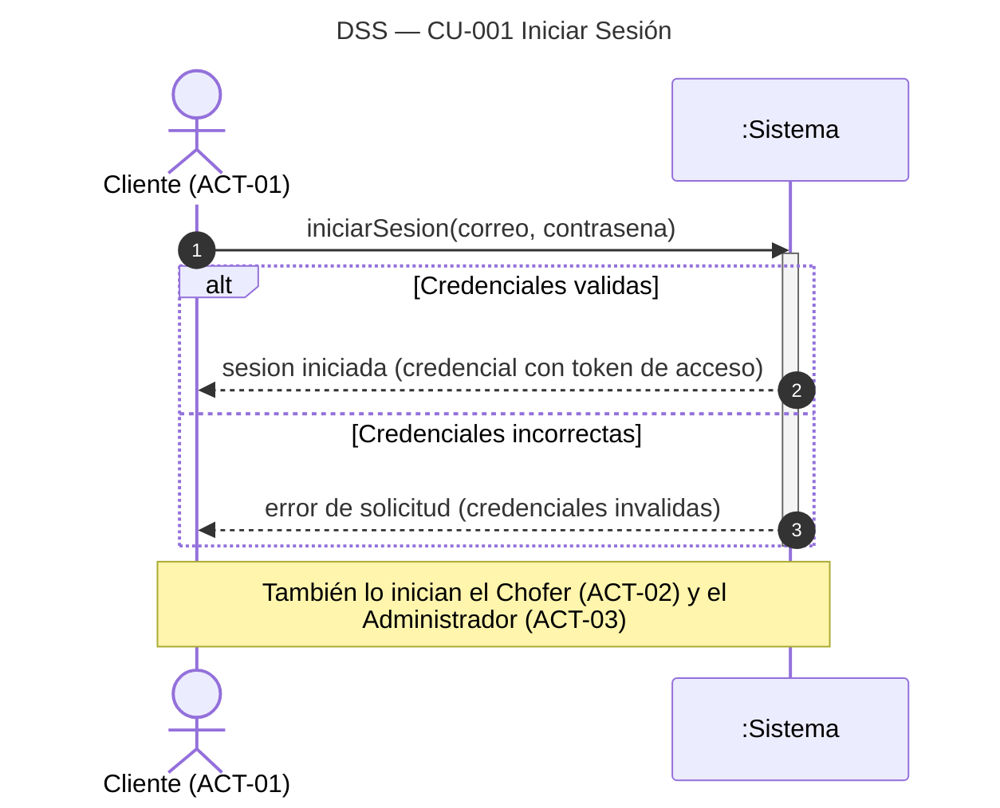
```mermaid
sequenceDiagram
    title DSS — CU-001 Iniciar Sesión
    autonumber
    actor USR as Cliente (ACT-01)
    participant SIS as :Sistema

    USR->>SIS: iniciarSesion(correo, contrasena)
    activate SIS
    alt Credenciales validas
        SIS-->>USR: sesion iniciada (credencial con token de acceso)
    else Credenciales incorrectas
        SIS-->>USR: error de solicitud (credenciales invalidas)
    end
    deactivate SIS
    Note over USR,SIS: También lo inician el Chofer (ACT-02) y el<br/>Administrador (ACT-03)
```

---

#### DSS — CU-002: Registrarse como Cliente

**Actor:** Cliente (ACT-01)
**Operaciones del sistema:** `registrarse(nombreCompleto, correo, telefono, contrasena, datosDelCliente)`

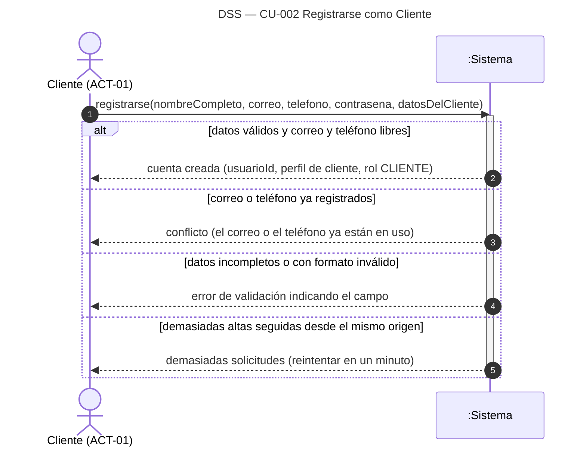
```mermaid
sequenceDiagram
    title DSS — CU-002 Registrarse como Cliente
    autonumber
    actor CLI as Cliente (ACT-01)
    participant SIS as :Sistema

    CLI->>SIS: registrarse(nombreCompleto, correo, telefono, contrasena, datosDelCliente)
    activate SIS
    alt datos válidos y correo y teléfono libres
        SIS-->>CLI: cuenta creada (usuarioId, perfil de cliente, rol CLIENTE)
    else correo o teléfono ya registrados
        SIS-->>CLI: conflicto (el correo o el teléfono ya están en uso)
    else datos incompletos o con formato inválido
        SIS-->>CLI: error de validación indicando el campo
    else demasiadas altas seguidas desde el mismo origen
        SIS-->>CLI: demasiadas solicitudes (reintentar en un minuto)
    end
    deactivate SIS
```

---

#### DSS — CU-003: Registrar Chofer

**Actor:** Administrador (ACT-03)
**Operaciones del sistema:** `registrarChofer(datosPersonales, datosDelChofer, distribuidoraId)`

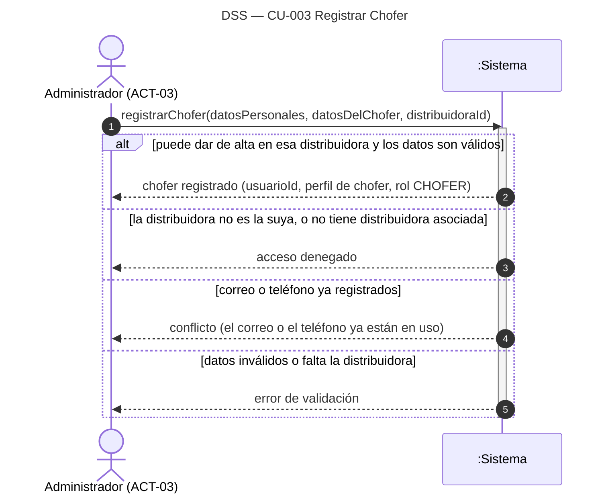
```mermaid
sequenceDiagram
    title DSS — CU-003 Registrar Chofer
    autonumber
    actor ADM as Administrador (ACT-03)
    participant SIS as :Sistema

    ADM->>SIS: registrarChofer(datosPersonales, datosDelChofer, distribuidoraId)
    activate SIS
    alt puede dar de alta en esa distribuidora y los datos son válidos
        SIS-->>ADM: chofer registrado (usuarioId, perfil de chofer, rol CHOFER)
    else la distribuidora no es la suya, o no tiene distribuidora asociada
        SIS-->>ADM: acceso denegado
    else correo o teléfono ya registrados
        SIS-->>ADM: conflicto (el correo o el teléfono ya están en uso)
    else datos inválidos o falta la distribuidora
        SIS-->>ADM: error de validación
    end
    deactivate SIS
```

> El chofer nace **no validado**: para poder operar necesita CU-032.

---

#### DSS — CU-004: Gestionar Perfil de Usuario

**Actor:** Cliente (ACT-01), Chofer (ACT-02)
**Operaciones del sistema:** `consultarPerfil(usuarioId)`, `consultarPerfilCliente(usuarioId)`, `actualizarPerfil(usuarioId, datos)`

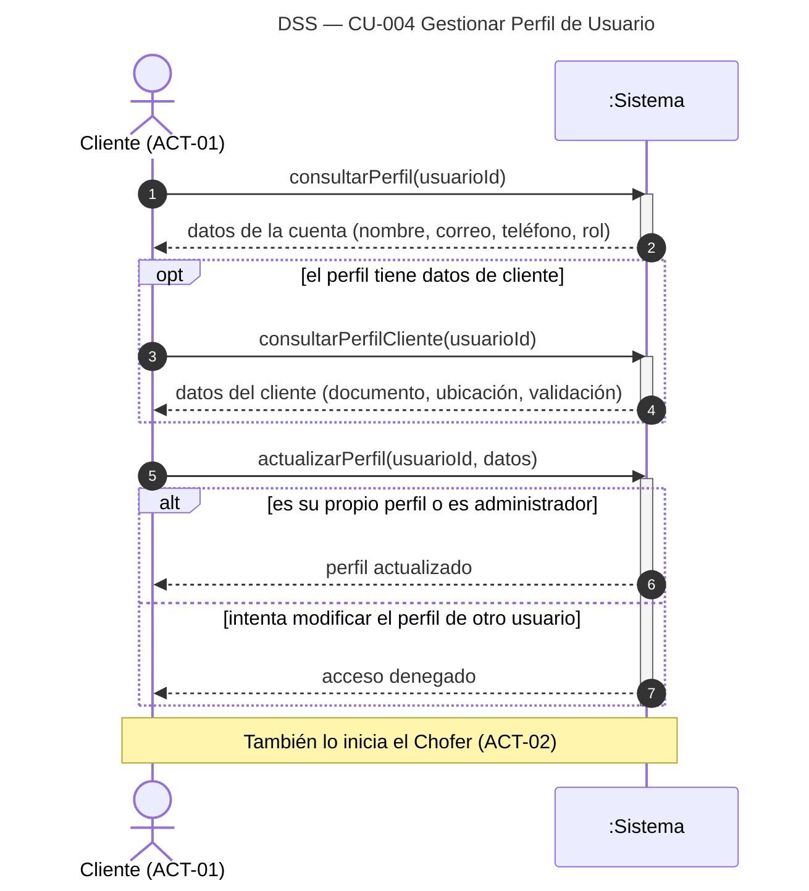
```mermaid
sequenceDiagram
    title DSS — CU-004 Gestionar Perfil de Usuario
    autonumber
    actor CLI as Cliente (ACT-01)
    participant SIS as :Sistema

    CLI->>SIS: consultarPerfil(usuarioId)
    activate SIS
    SIS-->>CLI: datos de la cuenta (nombre, correo, teléfono, rol)
    deactivate SIS

    opt el perfil tiene datos de cliente
        CLI->>SIS: consultarPerfilCliente(usuarioId)
        activate SIS
        SIS-->>CLI: datos del cliente (documento, ubicación, validación)
        deactivate SIS
    end

    CLI->>SIS: actualizarPerfil(usuarioId, datos)
    activate SIS
    alt es su propio perfil o es administrador
        SIS-->>CLI: perfil actualizado
    else intenta modificar el perfil de otro usuario
        SIS-->>CLI: acceso denegado
    end
    deactivate SIS
    Note over CLI,SIS: También lo inicia el Chofer (ACT-02)
```

---

### SS-02 — Gestión de Pedidos

#### Crítico DSS — CU-005: Crear Pedido

**Actor:** Cliente (ACT-01)
**Operaciones del sistema:** `crearPedido(items, direccionId, franjaId, fechaAgendada, metodoDePago)`

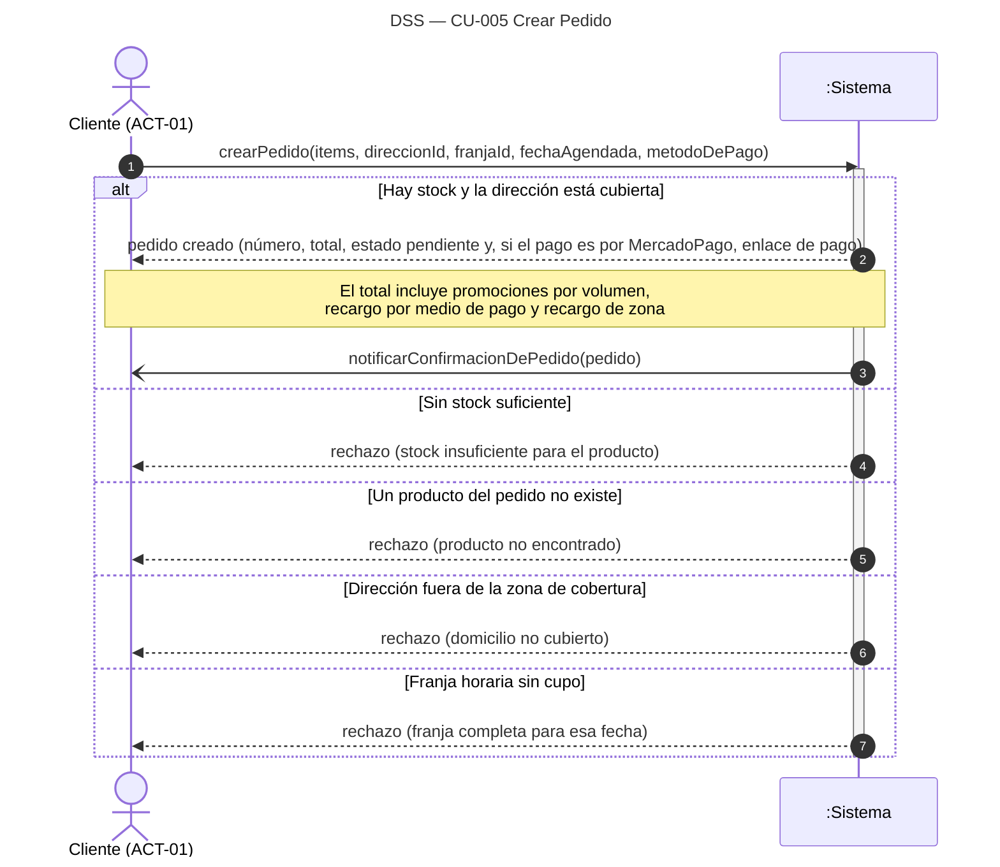
```mermaid
sequenceDiagram
    title DSS — CU-005 Crear Pedido
    autonumber
    actor CLI as Cliente (ACT-01)
    participant SIS as :Sistema

    CLI->>SIS: crearPedido(items, direccionId, franjaId, fechaAgendada, metodoDePago)
    activate SIS
    alt Hay stock y la dirección está cubierta
        SIS-->>CLI: pedido creado (número, total, estado pendiente y, si el pago es por MercadoPago, enlace de pago)
        Note over CLI,SIS: El total incluye promociones por volumen,<br/>recargo por medio de pago y recargo de zona
        SIS-)CLI: notificarConfirmacionDePedido(pedido)
    else Sin stock suficiente
        SIS-->>CLI: rechazo (stock insuficiente para el producto)
    else Un producto del pedido no existe
        SIS-->>CLI: rechazo (producto no encontrado)
    else Dirección fuera de la zona de cobertura
        SIS-->>CLI: rechazo (domicilio no cubierto)
    else Franja horaria sin cupo
        SIS-->>CLI: rechazo (franja completa para esa fecha)
    end
    deactivate SIS
```

---

#### DSS — CU-006: Consultar Detalle de Pedido

**Actor:** Cliente (ACT-01), Chofer (ACT-02), Administrador (ACT-03)
**Operaciones del sistema:** `consultarPedido(pedidoId)`

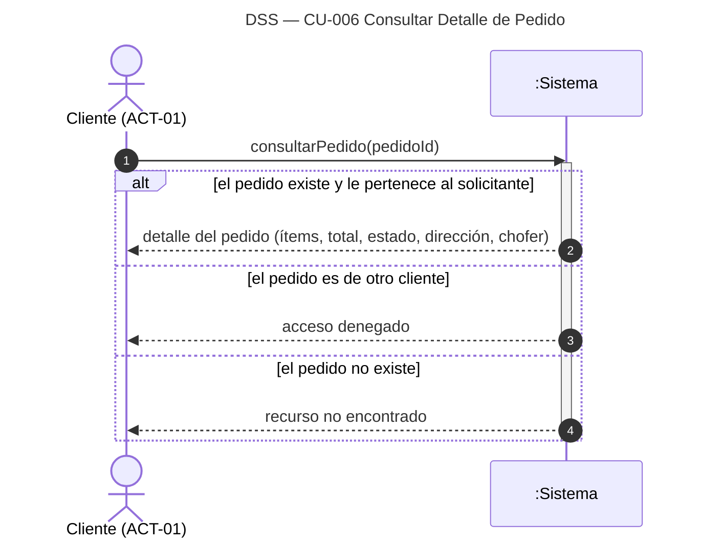
```mermaid
sequenceDiagram
    title DSS — CU-006 Consultar Detalle de Pedido
    autonumber
    actor CLI as Cliente (ACT-01)
    participant SIS as :Sistema

    CLI->>SIS: consultarPedido(pedidoId)
    activate SIS
    alt el pedido existe y le pertenece al solicitante
        SIS-->>CLI: detalle del pedido (ítems, total, estado, dirección, chofer)
    else el pedido es de otro cliente
        SIS-->>CLI: acceso denegado
    else el pedido no existe
        SIS-->>CLI: recurso no encontrado
    end
    deactivate SIS
```

---

#### DSS — CU-007: Consultar Historial de Pedidos

**Actor:** Cliente (ACT-01)
**Operaciones del sistema:** `consultarHistorialDePedidos(clienteId, pagina, limite)`

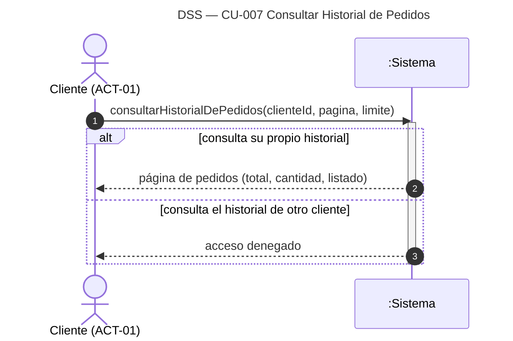
```mermaid
sequenceDiagram
    title DSS — CU-007 Consultar Historial de Pedidos
    autonumber
    actor CLI as Cliente (ACT-01)
    participant SIS as :Sistema

    CLI->>SIS: consultarHistorialDePedidos(clienteId, pagina, limite)
    activate SIS
    alt consulta su propio historial
        SIS-->>CLI: página de pedidos (total, cantidad, listado)
    else consulta el historial de otro cliente
        SIS-->>CLI: acceso denegado
    end
    deactivate SIS
```

> El cliente ve **todo** su historial aunque haya comprado a varias distribuidoras; el personal solo ve los pedidos de la suya.

---

#### DSS — CU-169: Registrar el Cambio de Estado de un Pedido

**Actor:** Sistema Automático (ACT-04)
**Operaciones del sistema:** `registrarCambioDeEstado(pedidoId, estadoAnterior, estadoNuevo, autor, motivo)`

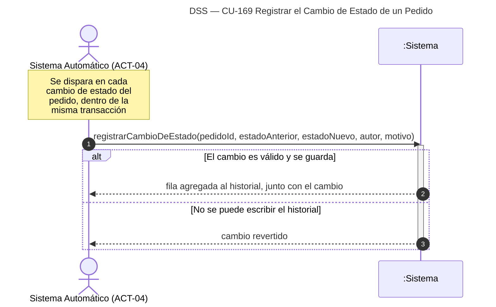
```mermaid
sequenceDiagram
    title DSS — CU-169 Registrar el Cambio de Estado de un Pedido
    autonumber
    actor SAU as Sistema Automático (ACT-04)
    participant SIS as :Sistema

    Note over SAU: Se dispara en cada<br/>cambio de estado del<br/>pedido, dentro de la<br/>misma transacción
    SAU->>SIS: registrarCambioDeEstado(pedidoId, estadoAnterior, estadoNuevo, autor, motivo)
    activate SIS
    alt El cambio es válido y se guarda
        SIS-->>SAU: fila agregada al historial, junto con el cambio
    else No se puede escribir el historial
        SIS-->>SAU: cambio revertido
    end
    deactivate SIS
```

---

#### DSS — CU-170: Consultar el Historial de Estados de un Pedido

**Actor:** Cliente (ACT-01), Administrador (ACT-03), Administrador General (ACT-05)
**Operaciones del sistema:** `consultarHistorialDeEstados(pedidoId)`

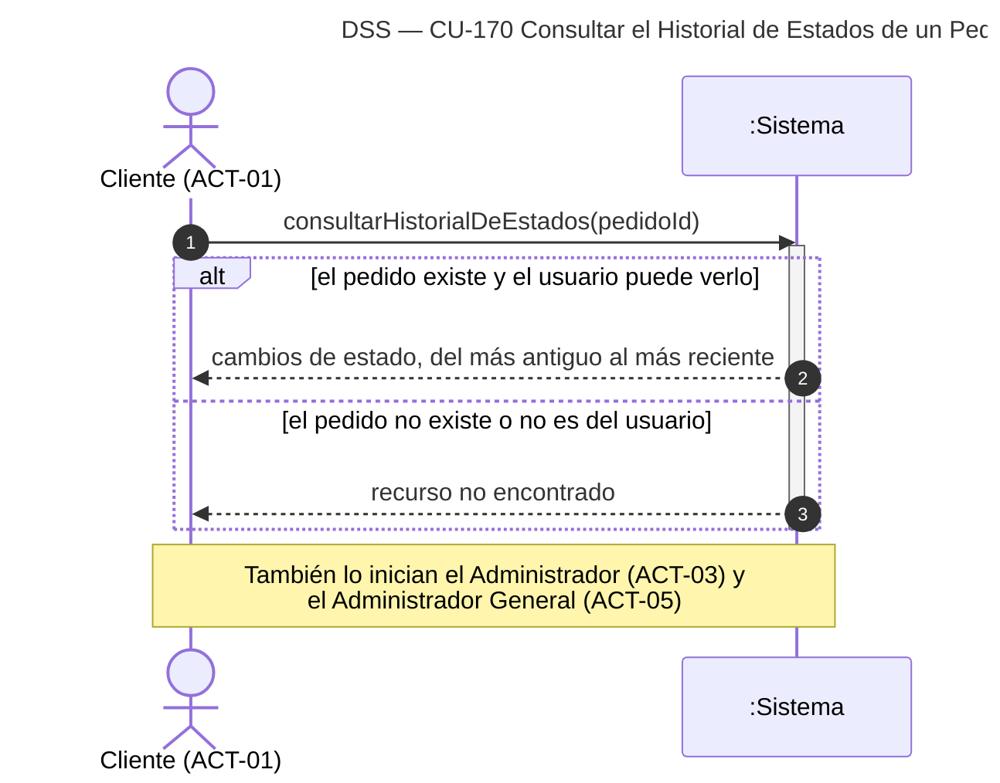
```mermaid
sequenceDiagram
    title DSS — CU-170 Consultar el Historial de Estados de un Pedido
    autonumber
    actor USR as Cliente (ACT-01)
    participant SIS as :Sistema

    USR->>SIS: consultarHistorialDeEstados(pedidoId)
    activate SIS
    alt el pedido existe y el usuario puede verlo
        SIS-->>USR: cambios de estado, del más antiguo al más reciente
    else el pedido no existe o no es del usuario
        SIS-->>USR: recurso no encontrado
    end
    deactivate SIS
    Note over USR,SIS: También lo inician el Administrador (ACT-03) y<br/>el Administrador General (ACT-05)
```

---

#### DSS — CU-143: Declarar el Consumo Promedio al Registrarse

**Actor:** Cliente (ACT-01)
**Operaciones del sistema:** `declararConsumoPromedio(tipoGarrafa, cantidadPorMes)`

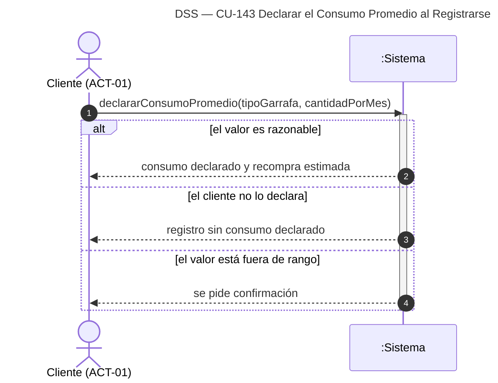
```mermaid
sequenceDiagram
    title DSS — CU-143 Declarar el Consumo Promedio al Registrarse
    autonumber
    actor CLI as Cliente (ACT-01)
    participant SIS as :Sistema

    CLI->>SIS: declararConsumoPromedio(tipoGarrafa, cantidadPorMes)
    activate SIS
    alt el valor es razonable
        SIS-->>CLI: consumo declarado y recompra estimada
    else el cliente no lo declara
        SIS-->>CLI: registro sin consumo declarado
    else el valor está fuera de rango
        SIS-->>CLI: se pide confirmación
    end
    deactivate SIS
```

---

#### DSS — CU-144: Actualizar el Consumo Promedio Declarado

**Actor:** Cliente (ACT-01)
**Operaciones del sistema:** `actualizarConsumoPromedio(cantidadPorMes)`

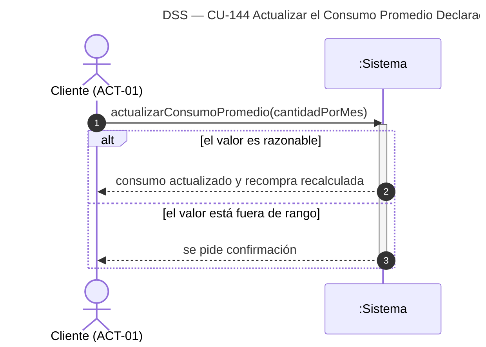
```mermaid
sequenceDiagram
    title DSS — CU-144 Actualizar el Consumo Promedio Declarado
    autonumber
    actor CLI as Cliente (ACT-01)
    participant SIS as :Sistema

    CLI->>SIS: actualizarConsumoPromedio(cantidadPorMes)
    activate SIS
    alt el valor es razonable
        SIS-->>CLI: consumo actualizado y recompra recalculada
    else el valor está fuera de rango
        SIS-->>CLI: se pide confirmación
    end
    deactivate SIS
```

---

#### DSS — CU-145: Configurar los Días de Aviso Previo a la Recompra

**Actor:** Cliente (ACT-01)
**Operaciones del sistema:** `configurarDiasDeAviso(dias)`

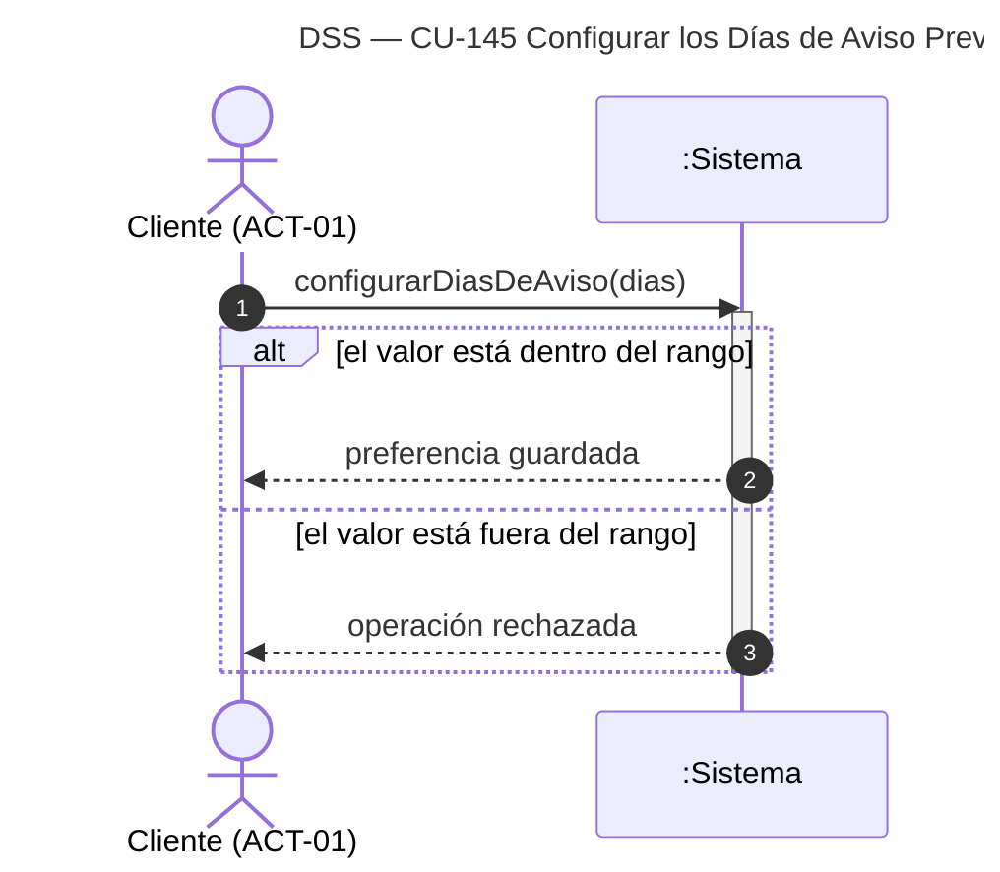
```mermaid
sequenceDiagram
    title DSS — CU-145 Configurar los Días de Aviso Previo a la Recompra
    autonumber
    actor CLI as Cliente (ACT-01)
    participant SIS as :Sistema

    CLI->>SIS: configurarDiasDeAviso(dias)
    activate SIS
    alt el valor está dentro del rango
        SIS-->>CLI: preferencia guardada
    else el valor está fuera del rango
        SIS-->>CLI: operación rechazada
    end
    deactivate SIS
```

---

#### DSS — CU-146: Consultar la Fecha Estimada de Recompra

**Actor:** Administrador (ACT-03)
**Operaciones del sistema:** `consultarRecomprasEstimadas(dias)`

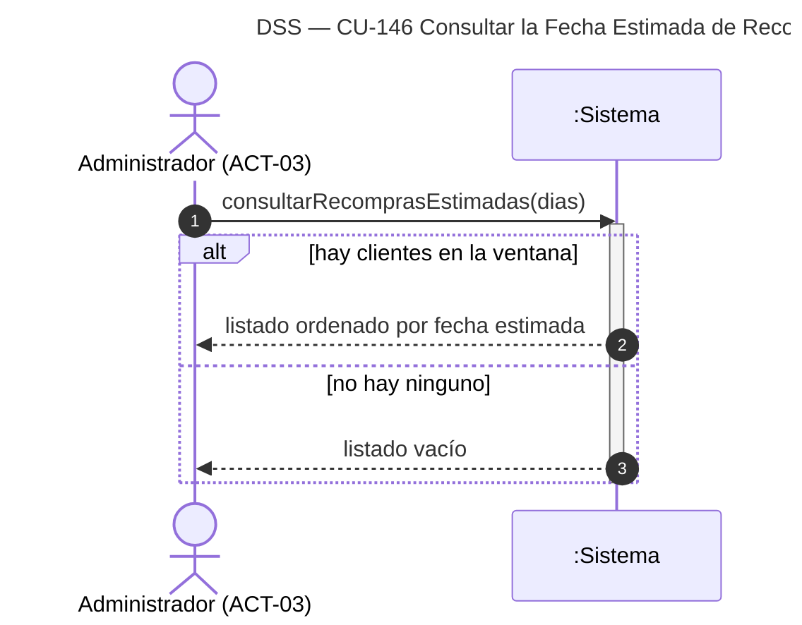
```mermaid
sequenceDiagram
    title DSS — CU-146 Consultar la Fecha Estimada de Recompra
    autonumber
    actor ADM as Administrador (ACT-03)
    participant SIS as :Sistema

    ADM->>SIS: consultarRecomprasEstimadas(dias)
    activate SIS
    alt hay clientes en la ventana
        SIS-->>ADM: listado ordenado por fecha estimada
    else no hay ninguno
        SIS-->>ADM: listado vacío
    end
    deactivate SIS
```

---

#### DSS — CU-147: Realizar una Compra Express

**Actor:** Cliente (ACT-01)
**Operaciones del sistema:** `realizarCompraExpress(tipoGarrafa, medioDePago)`

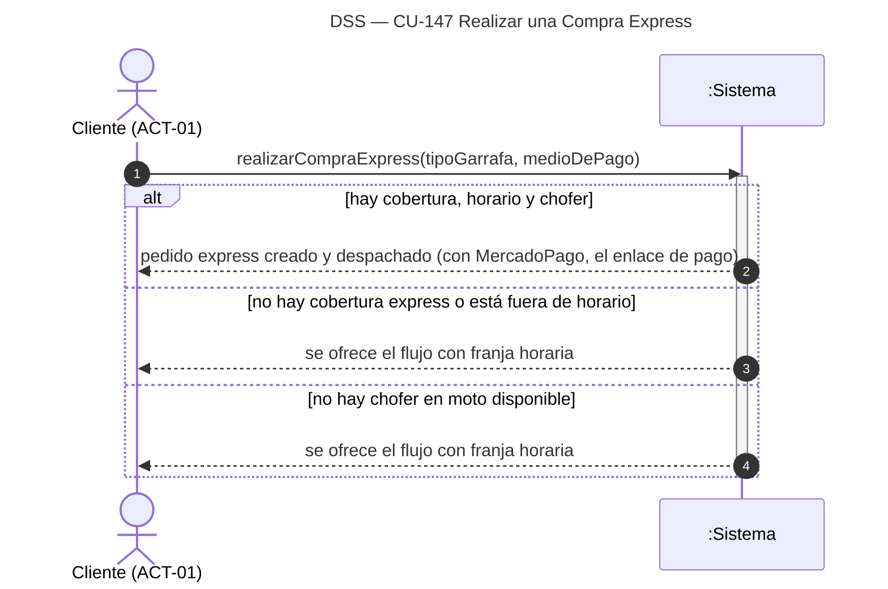
```mermaid
sequenceDiagram
    title DSS — CU-147 Realizar una Compra Express
    autonumber
    actor CLI as Cliente (ACT-01)
    participant SIS as :Sistema

    CLI->>SIS: realizarCompraExpress(tipoGarrafa, medioDePago)
    activate SIS
    alt hay cobertura, horario y chofer
        SIS-->>CLI: pedido express creado y despachado (con MercadoPago, el enlace de pago)
    else no hay cobertura express o está fuera de horario
        SIS-->>CLI: se ofrece el flujo con franja horaria
    else no hay chofer en moto disponible
        SIS-->>CLI: se ofrece el flujo con franja horaria
    end
    deactivate SIS
```

---

#### DSS — CU-148: Elegir la Modalidad de Entrega del Pedido

**Actor:** Cliente (ACT-01)
**Operaciones del sistema:** `consultarModalidadesDeEntrega(direccionId)`

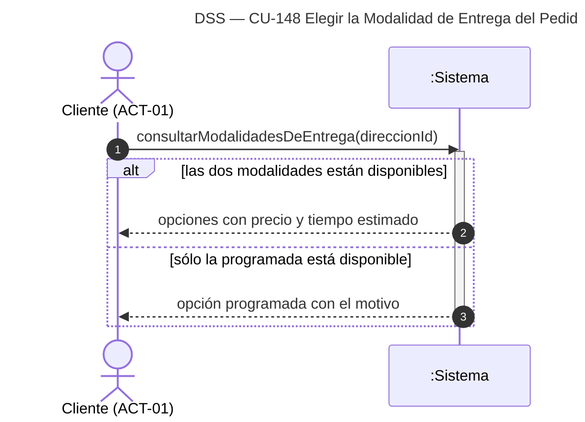
```mermaid
sequenceDiagram
    title DSS — CU-148 Elegir la Modalidad de Entrega del Pedido
    autonumber
    actor CLI as Cliente (ACT-01)
    participant SIS as :Sistema

    CLI->>SIS: consultarModalidadesDeEntrega(direccionId)
    activate SIS
    alt las dos modalidades están disponibles
        SIS-->>CLI: opciones con precio y tiempo estimado
    else sólo la programada está disponible
        SIS-->>CLI: opción programada con el motivo
    end
    deactivate SIS
```

---

#### DSS — CU-008: Cancelar Pedido (Cliente)

**Actor:** Cliente (ACT-01)
**Operaciones del sistema:** `cancelarPedido(pedidoId, motivo)`

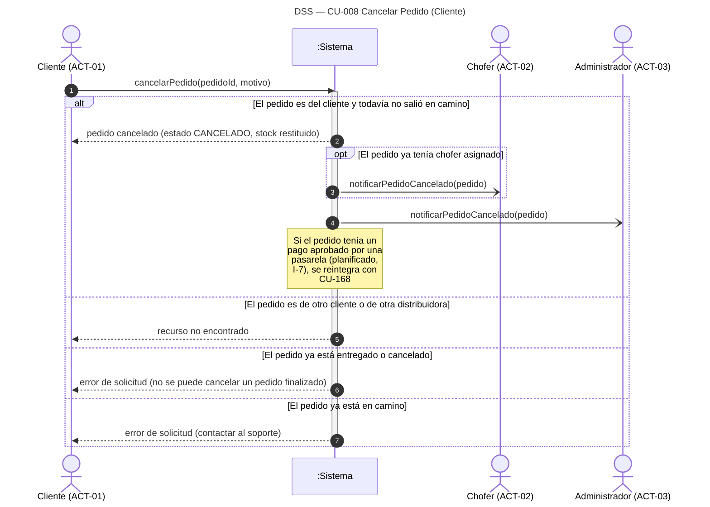
```mermaid
sequenceDiagram
    title DSS — CU-008 Cancelar Pedido (Cliente)
    autonumber
    actor CLI as Cliente (ACT-01)
    participant SIS as :Sistema
    actor CHO as Chofer (ACT-02)
    actor ADM as Administrador (ACT-03)

    CLI->>SIS: cancelarPedido(pedidoId, motivo)
    activate SIS
    alt El pedido es del cliente y todavía no salió en camino
        SIS-->>CLI: pedido cancelado (estado CANCELADO, stock restituido)
        opt El pedido ya tenía chofer asignado
            SIS-)CHO: notificarPedidoCancelado(pedido)
        end
        SIS-)ADM: notificarPedidoCancelado(pedido)
        Note over SIS: Si el pedido tenía un<br/>pago aprobado por una<br/>pasarela (planificado,<br/>I-7), se reintegra con<br/>CU-168
    else El pedido es de otro cliente o de otra distribuidora
        SIS-->>CLI: recurso no encontrado
    else El pedido ya está entregado o cancelado
        SIS-->>CLI: error de solicitud (no se puede cancelar un pedido finalizado)
    else El pedido ya está en camino
        SIS-->>CLI: error de solicitud (contactar al soporte)
    end
    deactivate SIS
```

> La identidad y el rol del cancelador salen **siempre** de la sesión, nunca del cuerpo del mensaje.

---

#### DSS — CU-009: Cancelar Pedido (Chofer)

**Actor:** Chofer (ACT-02)
**Operaciones del sistema:** `liberarPedido(pedidoId, motivo)`

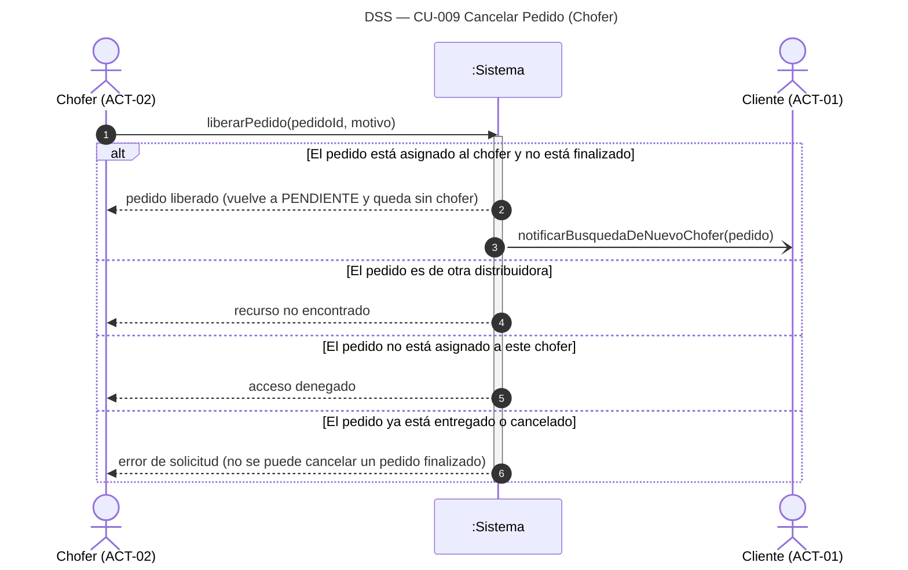
```mermaid
sequenceDiagram
    title DSS — CU-009 Cancelar Pedido (Chofer)
    autonumber
    actor CHO as Chofer (ACT-02)
    participant SIS as :Sistema
    actor CLI as Cliente (ACT-01)

    CHO->>SIS: liberarPedido(pedidoId, motivo)
    activate SIS
    alt El pedido está asignado al chofer y no está finalizado
        SIS-->>CHO: pedido liberado (vuelve a PENDIENTE y queda sin chofer)
        SIS-)CLI: notificarBusquedaDeNuevoChofer(pedido)
    else El pedido es de otra distribuidora
        SIS-->>CHO: recurso no encontrado
    else El pedido no está asignado a este chofer
        SIS-->>CHO: acceso denegado
    else El pedido ya está entregado o cancelado
        SIS-->>CHO: error de solicitud (no se puede cancelar un pedido finalizado)
    end
    deactivate SIS
```

---

#### DSS — CU-010: Cancelar Pedido (Administrador)

**Actor:** Administrador (ACT-03)
**Operaciones del sistema:** `cancelarPedido(pedidoId, motivo)`, `cancelarPedidoForzado(pedidoId)`

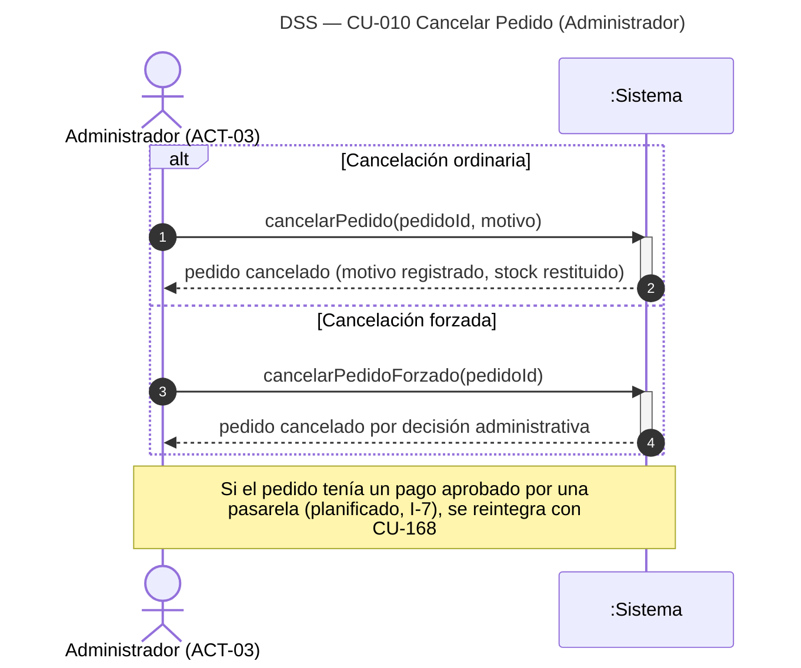
```mermaid
sequenceDiagram
    title DSS — CU-010 Cancelar Pedido (Administrador)
    autonumber
    actor ADM as Administrador (ACT-03)
    participant SIS as :Sistema

    alt Cancelación ordinaria
        ADM->>SIS: cancelarPedido(pedidoId, motivo)
        activate SIS
        SIS-->>ADM: pedido cancelado (motivo registrado, stock restituido)
        deactivate SIS
    else Cancelación forzada
        ADM->>SIS: cancelarPedidoForzado(pedidoId)
        activate SIS
        SIS-->>ADM: pedido cancelado por decisión administrativa
        deactivate SIS
    end
    Note over ADM,SIS: Si el pedido tenía un pago aprobado por una<br/>pasarela (planificado, I-7), se reintegra con<br/>CU-168
```

> El sistema ofrece **dos** vías para el administrador. La documentación previa describía una sola.

---

#### DSS — CU-011: Listar Todos los Pedidos

**Actor:** Administrador (ACT-03)
**Operaciones del sistema:** `listarPedidos(pagina, limite)`

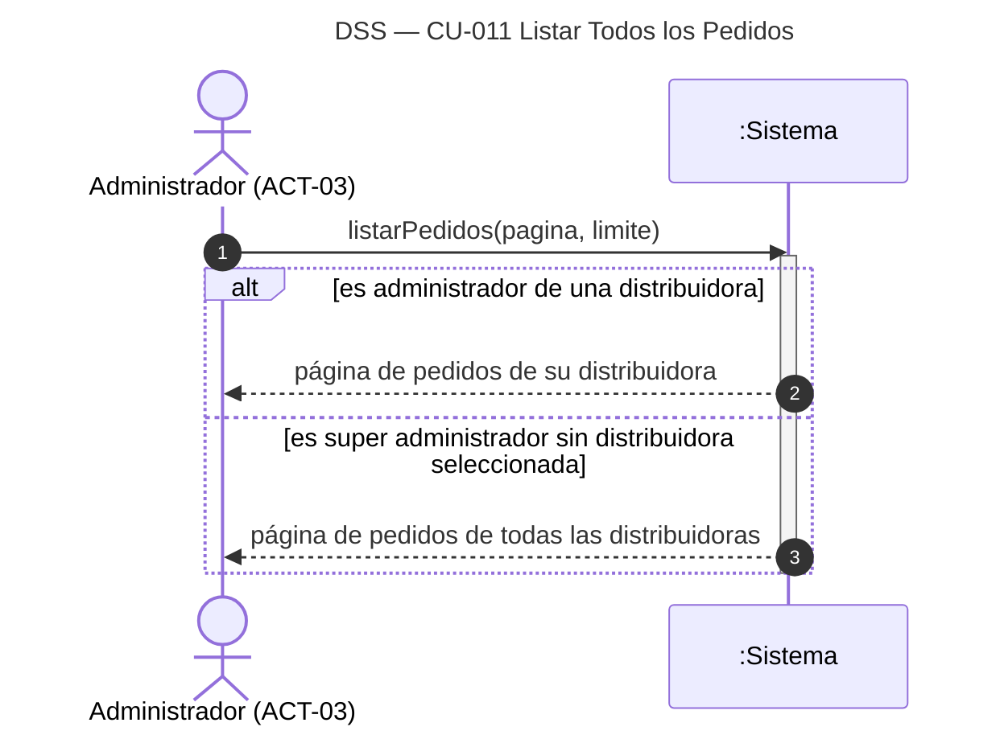
```mermaid
sequenceDiagram
    title DSS — CU-011 Listar Todos los Pedidos
    autonumber
    actor ADM as Administrador (ACT-03)
    participant SIS as :Sistema

    ADM->>SIS: listarPedidos(pagina, limite)
    activate SIS
    alt es administrador de una distribuidora
        SIS-->>ADM: página de pedidos de su distribuidora
    else es super administrador sin distribuidora seleccionada
        SIS-->>ADM: página de pedidos de todas las distribuidoras
    end
    deactivate SIS
```

---

### SS-03 — Despacho y Asignación

#### DSS — CU-012: Asignar Chofer Manualmente

**Actor:** Administrador (ACT-03)
**Operaciones del sistema:** `asignarChoferAPedido(pedidoId, choferId)`

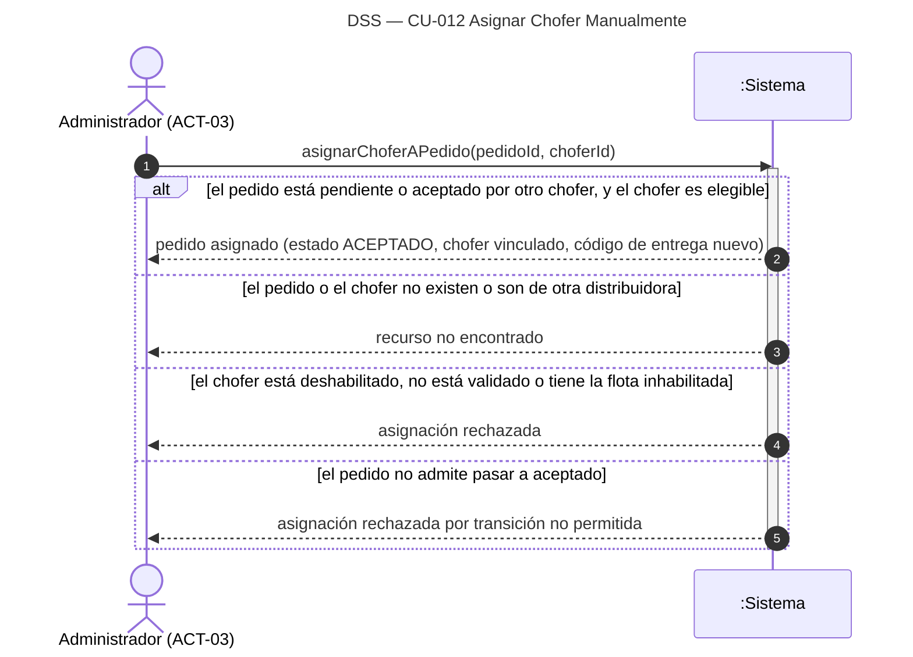
```mermaid
sequenceDiagram
    title DSS — CU-012 Asignar Chofer Manualmente
    autonumber
    actor ADM as Administrador (ACT-03)
    participant SIS as :Sistema

    ADM->>SIS: asignarChoferAPedido(pedidoId, choferId)
    activate SIS
    alt el pedido está pendiente o aceptado por otro chofer, y el chofer es elegible
        SIS-->>ADM: pedido asignado (estado ACEPTADO, chofer vinculado, código de entrega nuevo)
    else el pedido o el chofer no existen o son de otra distribuidora
        SIS-->>ADM: recurso no encontrado
    else el chofer está deshabilitado, no está validado o tiene la flota inhabilitada
        SIS-->>ADM: asignación rechazada
    else el pedido no admite pasar a aceptado
        SIS-->>ADM: asignación rechazada por transición no permitida
    end
    deactivate SIS
```

---

#### DSS — CU-149: Despachar un Pedido Express a un Chofer en Moto

**Actor:** Sistema Automático (ACT-04)
**Operaciones del sistema:** `despacharPedidoExpress(pedidoId)`

```mermaid
sequenceDiagram
    title DSS — CU-149 Despachar un Pedido Express a un Chofer en Moto
    autonumber
    actor SAU as Sistema Automático (ACT-04)
    participant SIS as :Sistema
    actor CLI as Cliente (ACT-01)

    SAU->>SIS: despacharPedidoExpress(pedidoId)
    activate SIS
    Note over SIS: Ofrece el pedido al<br/>chofer en moto más<br/>cercano, con una ventana<br/>de aceptación más corta
    alt Un chofer en moto acepta
        SIS-->>SAU: pedido asignado
        SIS-)CLI: notificarPedidoAceptado(pedido)
    else Ninguno acepta
        SIS-->>SAU: modalidad express cancelada, recargo descontado del total y reintegrado si se pagó en línea
    end
    deactivate SIS
```

---

#### Crítico · automático DSS — CU-013: Asignar Pedido Automáticamente por Proximidad

**Actor:** Sistema Automático (ACT-04)
**Operaciones del sistema:** `ofrecerAlSiguienteChofer(pedidoId)`

```mermaid
sequenceDiagram
    title DSS — CU-013 Asignar Pedido Automáticamente por Proximidad
    autonumber
    actor SAU as Sistema Automático (ACT-04)
    participant SIS as :Sistema
    actor CHO as Chofer (ACT-02)

    Note over SAU: Se dispara al crearse el<br/>pedido
    SAU->>SIS: ofrecerAlSiguienteChofer(pedidoId)
    activate SIS
    Note over SIS: Recorre los radios 5,<br/>10, 15 y 20 km y<br/>descarta los choferes ya<br/>contactados y los de<br/>otra distribuidora
    alt Hay un candidato disponible
        SIS-)CHO: notificarOferta(pedido)
        SIS-->>SAU: oferta registrada (vence en 30 s)
    else No quedan candidatos nuevos
        SIS-->>SAU: sin candidatos, el pedido queda a la espera
    end
    deactivate SIS
```

---

#### Crítico · automático DSS — CU-014: Reintentar Asignación con Radio Expandido (Cron)

**Actor:** Sistema Automático (ACT-04)
**Operaciones del sistema:** `vencerOfertasExpiradas()`

```mermaid
sequenceDiagram
    title DSS — CU-014 Reintentar Asignación con Radio Expandido (Cron)
    autonumber
    actor SAU as Sistema Automático (ACT-04)
    participant SIS as :Sistema
    actor CHO as Chofer (ACT-02)

    Note over SAU: Se ejecuta cada 15<br/>segundos
    SAU->>SIS: vencerOfertasExpiradas()
    activate SIS
    loop Por cada oferta cuya vigencia expiró
        Note over SIS: Marca la oferta como<br/>vencida
        alt El pedido sigue pendiente y sin chofer
            SIS-)CHO: notificarOferta(pedido)
            Note over SIS: Reutiliza la búsqueda de<br/>CU-013 con el siguiente<br/>chofer
        else El pedido ya fue aceptado o cancelado
            Note over SIS: No se vuelve a ofrecer
        end
    end
    SIS-->>SAU: ofertas procesadas
    deactivate SIS
```

---

#### DSS — CU-171: Configurar los Parámetros de Despacho de la Distribuidora

**Actor:** Administrador (ACT-03), Administrador General (ACT-05)
**Operaciones del sistema:** `configurarParametrosDeDespacho(radiosKm, ventanaDeAceptacion)`

```mermaid
sequenceDiagram
    title DSS — CU-171 Configurar los Parámetros de Despacho de la Distribuidora
    autonumber
    actor ADM as Administrador (ACT-03)
    participant SIS as :Sistema

    ADM->>SIS: configurarParametrosDeDespacho(radiosKm, ventanaDeAceptacion)
    activate SIS
    alt los valores son válidos
        SIS-->>ADM: configuración de despacho guardada
    else los valores están fuera de rango
        SIS-->>ADM: solicitud inválida, con el detalle del campo
    end
    deactivate SIS
```

---

#### Crítico DSS — CU-015: Aceptar Pedido

**Actor:** Chofer (ACT-02)
**Operaciones del sistema:** `aceptarPedido(pedidoId)`

```mermaid
sequenceDiagram
    title DSS — CU-015 Aceptar Pedido
    autonumber
    actor CHO as Chofer (ACT-02)
    participant SIS as :Sistema
    actor CLI as Cliente (ACT-01)

    CHO->>SIS: aceptarPedido(pedidoId)
    activate SIS
    alt La transición de estado es válida y el chofer está activo
        SIS-->>CHO: pedido asignado (datos de entrega y código de entrega)
        SIS-)CLI: notificarPedidoAceptado(pedido)
    else El pedido es de otra distribuidora
        SIS-->>CHO: recurso no encontrado
    else El pedido ya tiene asignado a otro chofer
        SIS-->>CHO: acceso denegado (el pedido no está asignado a este chofer)
    else El pedido ya está entregado o cancelado
        SIS-->>CHO: error de solicitud (transición no permitida)
    else El chofer no existe o está dado de baja
        SIS-->>CHO: error de solicitud (repartidor no encontrado o inactivo)
    end
    deactivate SIS
```

---

#### DSS — CU-016: Rechazar / Ignorar Pedido

**Actor:** Chofer (ACT-02)
**Operaciones del sistema:** `rechazarOferta(pedidoId)`

```mermaid
sequenceDiagram
    title DSS — CU-016 Rechazar / Ignorar Pedido
    autonumber
    actor CHO as Chofer (ACT-02)
    participant SIS as :Sistema
    actor CH2 as Siguiente Chofer (ACT-02)

    CHO->>SIS: rechazarOferta(pedidoId)
    activate SIS
    alt El pedido existe
        SIS-->>CHO: rechazo registrado (se cierra la oferta si estaba activa)
        opt El pedido sigue pendiente y sin chofer asignado
            SIS-)CH2: notificarOferta(pedido)
        end
    else El pedido no existe
        SIS-->>CHO: sin efecto (rechazo no registrado)
    else El pedido es de otra distribuidora
        SIS-->>CHO: recurso no encontrado
    end
    deactivate SIS
```

> El rechazo **no** espera el vencimiento de la ventana de 30 segundos: re-ofrece de inmediato al siguiente chofer más cercano.

---

### SS-04 — Seguimiento en Tiempo Real

---

### SS-04 — Seguimiento en Tiempo Real

#### Crítico · automático DSS — CU-017: Actualizar Ubicación GPS del Chofer

**Actor:** Chofer (ACT-02)
**Operaciones del sistema:** `actualizarUbicacion(usuarioId, latitud, longitud)`

```mermaid
sequenceDiagram
    title DSS — CU-017 Actualizar Ubicación GPS del Chofer
    autonumber
    actor CHO as Chofer (ACT-02)
    participant SIS as :Sistema
    actor CLI as Cliente (ACT-01)
    actor ADM as Administrador (ACT-03)

    loop Mientras el chofer está conectado
        CHO->>SIS: actualizarUbicacion(usuarioId, latitud, longitud)
        activate SIS
        alt Los datos de posición son válidos
            opt El chofer tiene un pedido en curso
                SIS-)CLI: notificarUbicacionDelChofer(pedido, latitud, longitud)
                SIS-)ADM: notificarUbicacionDelChofer(pedido, latitud, longitud)
            end
        else Faltan el usuario o las coordenadas
            Note over SIS: Se descarta el envío y<br/>no se registra la<br/>posición
        end
        deactivate SIS
    end
```

---

#### DSS — CU-018: Marcar Pedido "En Camino"

**Actor:** Chofer (ACT-02)
**Operaciones del sistema:** `marcarPedidoEnCamino(pedidoId)`

```mermaid
sequenceDiagram
    title DSS — CU-018 Marcar Pedido "En Camino"
    autonumber
    actor CHO as Chofer (ACT-02)
    participant SIS as :Sistema
    actor CLI as Cliente (ACT-01)

    CHO->>SIS: marcarPedidoEnCamino(pedidoId)
    activate SIS
    alt La transición es válida desde el estado actual
        SIS-->>CHO: pedido en camino (estado EN_CAMINO)
        SIS-)CLI: notificarPedidoEnCamino(pedido)
    else El pedido es de otra distribuidora
        SIS-->>CHO: recurso no encontrado
    else El pedido está asignado a otro chofer
        SIS-->>CHO: acceso denegado
    else La transición no está permitida
        SIS-->>CHO: error de solicitud (transición inválida)
    end
    deactivate SIS
```

---

#### DSS — CU-019: Avisar Llegada al Cliente

**Actor:** Chofer (ACT-02)
**Operaciones del sistema:** `avisarLlegada(pedidoId)`

```mermaid
sequenceDiagram
    title DSS — CU-019 Avisar Llegada al Cliente
    autonumber
    actor CHO as Chofer (ACT-02)
    participant SIS as :Sistema
    actor CLI as Cliente (ACT-01)

    CHO->>SIS: avisarLlegada(pedidoId)
    activate SIS
    alt El pedido está en camino
        SIS-)CLI: notificarLlegadaDelChofer(pedido)
        Note over SIS: El aviso llega en tiempo<br/>real y como notificación<br/>al dispositivo
        SIS-->>CHO: cliente notificado
    else El pedido es de otra distribuidora
        SIS-->>CHO: recurso no encontrado
    else El pedido está asignado a otro chofer
        SIS-->>CHO: acceso denegado
    else El pedido no está en camino
        SIS-->>CHO: error de solicitud (el pedido no está en camino)
    end
    deactivate SIS
```

> Este caso de uso **no** cambia el estado del pedido: solo notifica.

---

#### Crítico DSS — CU-020: Confirmar Entrega

**Actor:** Chofer (ACT-02)
**Operaciones del sistema:** `confirmarEntrega(pedidoId)`

```mermaid
sequenceDiagram
    title DSS — CU-020 Confirmar Entrega
    autonumber
    actor CHO as Chofer (ACT-02)
    participant SIS as :Sistema
    actor CLI as Cliente (ACT-01)

    CHO->>SIS: confirmarEntrega(pedidoId)
    activate SIS
    alt El pedido está en camino y está asignado al chofer
        SIS-->>CHO: entrega registrada (estado ENTREGADO)
        Note over SIS: Si el pago es en<br/>efectivo, queda saldado
        SIS-)CLI: notificarPedidoEntregado(pedido)
    else El pedido es de otra distribuidora
        SIS-->>CHO: recurso no encontrado
    else El pedido está asignado a otro chofer
        SIS-->>CHO: acceso denegado
    else El pedido no está en camino
        SIS-->>CHO: error de solicitud (transición no permitida)
    end
    deactivate SIS
    Note over CHO,CLI: La confirmación con código de entrega se<br/>modela en CU-078 y CU-079
```

---

#### DSS — CU-021: Recibir Notificaciones en Tiempo Real

**Actor:** Cliente (ACT-01)
**Operaciones del sistema:** `suscribirseAlSeguimiento(clienteId)`

```mermaid
sequenceDiagram
    title DSS — CU-021 Recibir Notificaciones en Tiempo Real
    autonumber
    actor CLI as Cliente (ACT-01)
    participant SIS as :Sistema

    CLI->>SIS: suscribirseAlSeguimiento(clienteId)
    activate SIS
    SIS-->>CLI: suscripción confirmada
    deactivate SIS

    loop Mientras el pedido esté en curso
        SIS-)CLI: notificarCambioDeEstado(pedido, estado)
        SIS-)CLI: notificarUbicacionDelChofer(pedido, latitud, longitud)
    end
    Note over CLI,SIS: Estados notificados: aceptado, en camino,<br/>entregado y cancelado
```

> El canal se cierra cuando el cliente cierra la aplicación o el pedido alcanza un estado terminal.

---

#### DSS — CU-022: Activar / Desactivar Disponibilidad

**Actor:** Chofer (ACT-02)
**Operaciones del sistema:** `cambiarDisponibilidad(usuarioId, disponible)`

```mermaid
sequenceDiagram
    title DSS — CU-022 Activar / Desactivar Disponibilidad
    autonumber
    actor CHO as Chofer (ACT-02)
    participant SIS as :Sistema

    CHO->>SIS: cambiarDisponibilidad(usuarioId, disponible)
    activate SIS
    alt se pone disponible y está habilitado y validado
        SIS-->>CHO: disponible (empieza a recibir ofertas de pedidos)
    else se pone disponible sin estar habilitado o validado
        SIS-->>CHO: acceso denegado
    else se pone no disponible
        SIS-->>CHO: no disponible (deja de recibir ofertas)
    end
    deactivate SIS
```

> **Observación de análisis:** el sistema almacena esta disponibilidad en el mismo atributo que el alta/baja administrativa (CU-033), por lo que "fuera de turno" y "dado de baja" son indistinguibles.

---

### SS-05 — Reclamos

#### Importante DSS — CU-023: Registrar Reclamo

**Actor:** Cliente (ACT-01)
**Operaciones del sistema:** `registrarReclamo(pedidoId, motivo, evidencia)`

```mermaid
sequenceDiagram
    title DSS — CU-023 Registrar Reclamo
    autonumber
    actor CLI as Cliente (ACT-01)
    participant SIS as :Sistema

    CLI->>SIS: registrarReclamo(pedidoId, motivo, evidencia)
    activate SIS
    alt El pedido existe y es del cliente
        SIS-->>CLI: reclamo registrado (número, estado pendiente)
    else El pedido no existe
        SIS-->>CLI: recurso no encontrado
    else El pedido no le pertenece
        SIS-->>CLI: rechazo (esta orden no pertenece al cliente indicado)
    end
    deactivate SIS
```

---

---

#### Ampliación — DSS de los casos de uso incorporados

Los 95 diagramas que siguen completan la cobertura del comportamiento del sistema.
Se agrupan por subsistema y respetan la misma convención de caja negra: solo intervienen
el actor y el sistema, sin detalle interno.

---

#### DSS — CU-024: Listar Reclamos

**Actor:** Administrador (ACT-03)
**Operaciones del sistema:** `listarReclamos()`

```mermaid
sequenceDiagram
    title DSS — CU-024 Listar Reclamos
    autonumber
    actor ADM as Administrador (ACT-03)
    participant SIS as :Sistema

    ADM->>SIS: listarReclamos()
    activate SIS
    SIS-->>ADM: reclamos de su distribuidora (pedido, cliente, motivo, estado)
    deactivate SIS
```

---

#### DSS — CU-025: Resolver Reclamo

**Actor:** Administrador (ACT-03)
**Operaciones del sistema:** `resolverReclamo(reclamoId, resolucion, estadoFinal)`

```mermaid
sequenceDiagram
    title DSS — CU-025 Resolver Reclamo
    autonumber
    actor ADM as Administrador (ACT-03)
    participant SIS as :Sistema

    ADM->>SIS: resolverReclamo(reclamoId, resolucion, estadoFinal)
    activate SIS
    alt el reclamo existe y la transición es válida
        SIS-->>ADM: reclamo resuelto (estado y resolución registrados)
    else el reclamo no existe
        SIS-->>ADM: recurso no encontrado
    else la transición no es válida (resuelto/rechazado sin reabrir antes)
        SIS-->>ADM: transición de reclamo inválida
    end
    deactivate SIS
```

---

#### DSS — CU-166: Tomar un Reclamo Pendiente

**Actor:** Administrador (ACT-03), Administrador General (ACT-05)
**Operaciones del sistema:** `tomarReclamo(reclamoId)`

```mermaid
sequenceDiagram
    title DSS — CU-166 Tomar un Reclamo Pendiente
    autonumber
    actor ADM as Administrador (ACT-03)
    participant SIS as :Sistema

    ADM->>SIS: tomarReclamo(reclamoId)
    activate SIS
    alt el reclamo existe y está pendiente
        SIS-->>ADM: reclamo en proceso
    else el reclamo no existe
        SIS-->>ADM: recurso no encontrado
    else el reclamo no está pendiente
        SIS-->>ADM: solicitud inválida: sólo se toma un reclamo pendiente
    end
    deactivate SIS
```

---

#### DSS — CU-167: Reabrir un Reclamo

**Actor:** Administrador (ACT-03), Administrador General (ACT-05)
**Operaciones del sistema:** `reabrirReclamo(reclamoId, motivo)`

```mermaid
sequenceDiagram
    title DSS — CU-167 Reabrir un Reclamo
    autonumber
    actor ADM as Administrador (ACT-03)
    participant SIS as :Sistema

    ADM->>SIS: reabrirReclamo(reclamoId, motivo)
    activate SIS
    alt el reclamo existe y está resuelto o rechazado
        SIS-->>ADM: reclamo en proceso, con el motivo de la reapertura
    else el reclamo no existe
        SIS-->>ADM: recurso no encontrado
    else el reclamo no está resuelto ni rechazado
        SIS-->>ADM: solicitud inválida: sólo se reabre un reclamo cerrado
    end
    deactivate SIS
```

---

#### DSS — CU-174: Adjuntar la Fotografía de un Reclamo

**Actor:** Cliente (ACT-01), Administrador (ACT-03), Administrador General (ACT-05)
**Operaciones del sistema:** `adjuntarFotoAlReclamo(reclamoId, imagen)`

```mermaid
sequenceDiagram
    title DSS — CU-174 Adjuntar la Fotografía de un Reclamo
    autonumber
    actor CLI as Cliente (ACT-01)
    participant SIS as :Sistema

    CLI->>SIS: adjuntarFotoAlReclamo(reclamoId, imagen)
    activate SIS
    alt la imagen es válida y el reclamo es del solicitante
        SIS-->>CLI: reclamo con su fotografía
    else el reclamo no existe o no es del solicitante
        SIS-->>CLI: recurso no encontrado
    else el reclamo está resuelto o rechazado
        SIS-->>CLI: conflicto, hay que reabrirlo
    else el tipo de archivo no está permitido
        SIS-->>CLI: tipo de archivo no soportado
    else el archivo supera el tamaño máximo
        SIS-->>CLI: archivo demasiado grande
    end
    deactivate SIS
```

---

#### DSS — CU-175: Consultar la Fotografía de un Reclamo

**Actor:** Cliente (ACT-01), Administrador (ACT-03), Administrador General (ACT-05)
**Operaciones del sistema:** `consultarFotoDelReclamo(reclamoId)`

```mermaid
sequenceDiagram
    title DSS — CU-175 Consultar la Fotografía de un Reclamo
    autonumber
    actor USR as Cliente (ACT-01)
    participant SIS as :Sistema

    USR->>SIS: consultarFotoDelReclamo(reclamoId)
    activate SIS
    alt el reclamo tiene fotografía y el usuario puede verlo
        SIS-->>USR: fotografía del reclamo
    else el reclamo no existe o no es del usuario
        SIS-->>USR: recurso no encontrado
    else el reclamo no tiene fotografía
        SIS-->>USR: recurso no encontrado
    end
    deactivate SIS
    Note over USR,SIS: También lo inician el Administrador (ACT-03) y<br/>el Administrador General (ACT-05)
```

---

### SS-06 — Reportes y Dashboard

---

### SS-06 — Reportes y Dashboard

#### DSS — CU-026: Ver Dashboard General

**Actor:** Administrador (ACT-03)
**Operaciones del sistema:** `consultarResumenDePedidos()`, `consultarGraficoDeVentas()`

```mermaid
sequenceDiagram
    title DSS — CU-026 Ver Dashboard General
    autonumber
    actor ADM as Administrador (ACT-03)
    participant SIS as :Sistema

    ADM->>SIS: consultarResumenDePedidos()
    activate SIS
    SIS-->>ADM: totales del día, la semana y el mes (pedidos, facturación, estados)
    deactivate SIS

    ADM->>SIS: consultarGraficoDeVentas()
    activate SIS
    SIS-->>ADM: serie de ventas de los últimos siete días
    deactivate SIS
```

---

#### DSS — CU-027: Ver Reporte de Ventas por Chofer

**Actor:** Administrador (ACT-03)
**Operaciones del sistema:** `consultarVentasPorChofer(fechaDesde, fechaHasta)`

```mermaid
sequenceDiagram
    title DSS — CU-027 Ver Reporte de Ventas por Chofer
    autonumber
    actor ADM as Administrador (ACT-03)
    participant SIS as :Sistema

    ADM->>SIS: consultarVentasPorChofer(fechaDesde, fechaHasta)
    activate SIS
    SIS-->>ADM: ranking por chofer (pedidos entregados, monto facturado)
    deactivate SIS
```

---

#### DSS — CU-028: Ver Reporte de Ventas por Producto

**Actor:** Administrador (ACT-03)
**Operaciones del sistema:** `consultarVentasPorProducto(fechaDesde, fechaHasta)`

```mermaid
sequenceDiagram
    title DSS — CU-028 Ver Reporte de Ventas por Producto
    autonumber
    actor ADM as Administrador (ACT-03)
    participant SIS as :Sistema

    ADM->>SIS: consultarVentasPorProducto(fechaDesde, fechaHasta)
    activate SIS
    SIS-->>ADM: ventas por tipo de garrafa (unidades, monto)
    deactivate SIS
```

---

#### DSS — CU-029: Ver Reporte por Método de Pago

**Actor:** Administrador (ACT-03)
**Operaciones del sistema:** `consultarVentasPorMetodoDePago(fechaDesde, fechaHasta)`

```mermaid
sequenceDiagram
    title DSS — CU-029 Ver Reporte por Método de Pago
    autonumber
    actor ADM as Administrador (ACT-03)
    participant SIS as :Sistema

    ADM->>SIS: consultarVentasPorMetodoDePago(fechaDesde, fechaHasta)
    activate SIS
    SIS-->>ADM: distribución entre efectivo y pasarela (cantidad, monto)
    deactivate SIS
```

---

#### DSS — CU-030: Ver Gráfico de Ventas (últimos 7 días)

**Actor:** Administrador (ACT-03)
**Operaciones del sistema:** `consultarEvolucionDeVentas(fechaDesde, fechaHasta, granularidad)`

```mermaid
sequenceDiagram
    title DSS — CU-030 Ver Gráfico de Ventas (últimos 7 días)
    autonumber
    actor ADM as Administrador (ACT-03)
    participant SIS as :Sistema

    ADM->>SIS: consultarEvolucionDeVentas(fechaDesde, fechaHasta, granularidad)
    activate SIS
    alt granularidad diaria
        SIS-->>ADM: serie por día del rango solicitado
    else granularidad mensual
        SIS-->>ADM: serie por mes del rango solicitado
    end
    deactivate SIS
```

---

### SS-07 — Gestión de Choferes y Vehículos

---

### SS-07 — Gestión de Choferes y Vehículos

#### DSS — CU-031: Registrar Chofer

**Actor:** Administrador (ACT-03)
**Operaciones del sistema:** `registrarChofer(datosPersonales, datosDelChofer, distribuidoraId)`

```mermaid
sequenceDiagram
    title DSS — CU-031 Registrar Chofer
    autonumber
    actor ADM as Administrador (ACT-03)
    participant SIS as :Sistema

    ADM->>SIS: registrarChofer(datosPersonales, datosDelChofer, distribuidoraId)
    activate SIS
    alt puede dar de alta en esa distribuidora y los datos son válidos
        SIS-->>ADM: chofer registrado (usuarioId, perfil de chofer, rol CHOFER)
    else la distribuidora no es la suya, o no tiene distribuidora asociada
        SIS-->>ADM: acceso denegado
    else correo o teléfono ya registrados
        SIS-->>ADM: conflicto (el correo o el teléfono ya están en uso)
    else datos inválidos o falta la distribuidora
        SIS-->>ADM: error de validación
    end
    deactivate SIS
```

> Realiza la misma operación del sistema que CU-003, vista desde el subsistema de gestión de flota.

---

#### DSS — CU-032: Validar / Invalidar Chofer

**Actor:** Administrador (ACT-03)
**Operaciones del sistema:** `validarChofer(choferId)`, `invalidarChofer(choferId)`

```mermaid
sequenceDiagram
    title DSS — CU-032 Validar / Invalidar Chofer
    autonumber
    actor ADM as Administrador (ACT-03)
    participant SIS as :Sistema

    alt aprobación de la documentación
        ADM->>SIS: validarChofer(choferId)
        activate SIS
        SIS-->>ADM: chofer validado (habilitado para recibir pedidos)
        deactivate SIS
    else rechazo o revocación
        ADM->>SIS: invalidarChofer(choferId)
        activate SIS
        SIS-->>ADM: chofer invalidado (deja de recibir ofertas)
        deactivate SIS
    end
```

---

#### DSS — CU-033: Activar / Desactivar Chofer (Admin)

**Actor:** Administrador (ACT-03)
**Operaciones del sistema:** `cambiarEstadoDelChofer(choferId, activo)`

```mermaid
sequenceDiagram
    title DSS — CU-033 Activar / Desactivar Chofer (Admin)
    autonumber
    actor ADM as Administrador (ACT-03)
    participant SIS as :Sistema

    ADM->>SIS: cambiarEstadoDelChofer(choferId, activo)
    activate SIS
    alt el chofer existe
        SIS-->>ADM: estado del chofer actualizado
    else el chofer no existe o es de otra distribuidora
        SIS-->>ADM: recurso no encontrado
    end
    deactivate SIS
```

---

#### DSS — CU-034: Registrar Vehículo del Chofer

**Actor:** Administrador (ACT-03)
**Operaciones del sistema:** `registrarVehiculo(usuarioId, tipo, capacidad, patente, marca, modelo, anio, color)`

```mermaid
sequenceDiagram
    title DSS — CU-034 Registrar Vehículo del Chofer
    autonumber
    actor ADM as Administrador (ACT-03)
    participant SIS as :Sistema

    ADM->>SIS: registrarVehiculo(usuarioId, tipo, capacidad, patente, marca, modelo, anio, color)
    activate SIS
    alt datos válidos
        SIS-->>ADM: vehículo registrado (vehiculoId)
    else datos inválidos
        SIS-->>ADM: error de validación
    end
    deactivate SIS
```

---

#### DSS — CU-035: Consultar Listado de Choferes

**Actor:** Administrador (ACT-03)
**Operaciones del sistema:** `listarChoferes(pagina, limite)`, `listarChoferesActivos(pagina, limite)`, `consultarDetalleDelChofer(choferId)`

```mermaid
sequenceDiagram
    title DSS — CU-035 Consultar Listado de Choferes
    autonumber
    actor ADM as Administrador (ACT-03)
    participant SIS as :Sistema

    ADM->>SIS: listarChoferes(pagina, limite)
    activate SIS
    SIS-->>ADM: página de choferes de su distribuidora
    deactivate SIS

    opt vista operativa del día
        ADM->>SIS: listarChoferesActivos(pagina, limite)
        activate SIS
        SIS-->>ADM: choferes activos
        deactivate SIS
    end

    opt ficha individual
        ADM->>SIS: consultarDetalleDelChofer(choferId)
        activate SIS
        alt el chofer existe
            SIS-->>ADM: ficha del chofer (validación, calificación, saldo, vehículo)
        else el chofer no existe
            SIS-->>ADM: recurso no encontrado
        end
        deactivate SIS
    end
```

---

### SS-08 — Gestión de Productos e Inventario

#### DSS — CU-036: Crear Producto (Garrafa)

**Actor:** Administrador (ACT-03)
**Operaciones del sistema:** `crearProducto(tipo, peso, precio, stockInicial, descripcion, promociones)`

```mermaid
sequenceDiagram
    title DSS — CU-036 Crear Producto (Garrafa)
    autonumber
    actor ADM as Administrador (ACT-03)
    participant SIS as :Sistema

    ADM->>SIS: crearProducto(tipo, peso, precio, stockInicial, descripcion, promociones)
    activate SIS
    alt datos válidos
        SIS-->>ADM: producto creado (productoId, activo)
    else datos inválidos
        SIS-->>ADM: error de validación
    end
    deactivate SIS
```

---

#### DSS — CU-037: Actualizar Precio de Producto

**Actor:** Administrador (ACT-03)
**Operaciones del sistema:** `actualizarProducto(productoId, datos)`

```mermaid
sequenceDiagram
    title DSS — CU-037 Actualizar Precio de Producto
    autonumber
    actor ADM as Administrador (ACT-03)
    participant SIS as :Sistema

    ADM->>SIS: actualizarProducto(productoId, datos)
    activate SIS
    alt el producto pertenece a la distribuidora
        SIS-->>ADM: producto actualizado (precio vigente para los pedidos nuevos)
    else el producto no existe en la distribuidora
        SIS-->>ADM: recurso no encontrado
    end
    deactivate SIS
```

> **Observación de análisis:** no existe una operación exclusiva de precio; el precio se modifica con la actualización general del producto.

---

#### DSS — CU-038: Actualizar Stock de Producto

**Actor:** Administrador (ACT-03)
**Operaciones del sistema:** `actualizarStock(productoId, variacion)`

```mermaid
sequenceDiagram
    title DSS — CU-038 Actualizar Stock de Producto
    autonumber
    actor ADM as Administrador (ACT-03)
    participant SIS as :Sistema

    ADM->>SIS: actualizarStock(productoId, variacion)
    activate SIS
    alt el stock resultante es mayor o igual a cero
        SIS-->>ADM: stock actualizado (nuevo stock disponible)
    else el stock resultante sería negativo
        SIS-->>ADM: error de solicitud (stock insuficiente)
    else el producto no existe
        SIS-->>ADM: recurso no encontrado
    end
    deactivate SIS
```

> El parámetro es una **variación** (positiva o negativa), no un valor absoluto: ingresa mercadería con signo más y la ajusta con signo menos.

---

#### DSS — CU-039: Configurar Promociones por Cantidad

**Actor:** Administrador (ACT-03)
**Operaciones del sistema:** `actualizarProducto(productoId, datos)`

```mermaid
sequenceDiagram
    title DSS — CU-039 Configurar Promociones por Cantidad
    autonumber
    actor ADM as Administrador (ACT-03)
    participant SIS as :Sistema

    ADM->>SIS: actualizarProducto(productoId, datos)
    activate SIS
    alt la tabla de promociones es válida
        SIS-->>ADM: promociones vigentes (cantidad mínima y porcentaje de descuento)
    else la tabla de promociones es inválida
        SIS-->>ADM: error de validación
    end
    deactivate SIS
```

> Al armar un pedido, cuando varias promociones aplican a la misma cantidad, el sistema toma **la más conveniente para el cliente**.

---

#### DSS — CU-040: Activar / Desactivar Producto

**Actor:** Administrador (ACT-03)
**Operaciones del sistema:** `desactivarProducto(productoId)`, `consultarProductosInactivos()`, `reactivarProducto(productoId)`

```mermaid
sequenceDiagram
    title DSS — CU-040 Activar / Desactivar Producto
    autonumber
    actor ADM as Administrador (ACT-03)
    participant SIS as :Sistema

    alt El administrador da de baja el producto
        ADM->>SIS: desactivarProducto(productoId)
        activate SIS
        alt el producto existe en la distribuidora
            SIS-->>ADM: producto desactivado (deja de aparecer en el catálogo)
        else el producto no existe
            SIS-->>ADM: recurso no encontrado
        end
        deactivate SIS
    else El administrador reactiva un producto (planificado, I-1)
        ADM->>SIS: consultarProductosInactivos()
        activate SIS
        SIS-->>ADM: productos dados de baja de la distribuidora
        deactivate SIS
        ADM->>SIS: reactivarProducto(productoId)
        activate SIS
        alt el producto existe en la distribuidora
            SIS-->>ADM: producto reactivado (vuelve a aparecer en el catálogo)
        else el producto no existe
            SIS-->>ADM: recurso no encontrado
        end
        deactivate SIS
    end
```

> **Realización parcial:** el sistema realiza la desactivación; la operación inversa `reactivarProducto(productoId)` y el listado de productos inactivos están planificados (I-1).

---

#### DSS — CU-041: Consultar Catálogo de Productos

**Actor:** Cliente (ACT-01), Administrador (ACT-03)
**Operaciones del sistema:** `consultarCatalogo(pagina, limite, distribuidora)`, `consultarProductosDisponibles(distribuidora)`, `consultarProducto(productoId)`

```mermaid
sequenceDiagram
    title DSS — CU-041 Consultar Catálogo de Productos
    autonumber
    actor CLI as Cliente (ACT-01)
    participant SIS as :Sistema

    CLI->>SIS: consultarCatalogo(pagina, limite, distribuidora)
    activate SIS
    SIS-->>CLI: productos activos (tipo, peso, precio, stock, promociones)
    deactivate SIS

    opt vista de compra rápida
        CLI->>SIS: consultarProductosDisponibles(distribuidora)
        activate SIS
        SIS-->>CLI: productos activos con stock disponible
        deactivate SIS
    end

    opt detalle de un producto
        CLI->>SIS: consultarProducto(productoId)
        activate SIS
        alt el producto existe
            SIS-->>CLI: detalle del producto
        else el producto no existe
            SIS-->>CLI: recurso no encontrado
        end
        deactivate SIS
    end
```

---

### SS-09 — Franjas Horarias

---

### SS-09 — Franjas Horarias

#### DSS — CU-042: Crear Franja Horaria

**Actor:** Administrador (ACT-03)
**Operaciones del sistema:** `crearFranjaHoraria(nombre, horaInicio, horaFin, capacidad)`

```mermaid
sequenceDiagram
    title DSS — CU-042 Crear Franja Horaria
    autonumber
    actor ADM as Administrador (ACT-03)
    participant SIS as :Sistema

    ADM->>SIS: crearFranjaHoraria(nombre, horaInicio, horaFin, capacidad)
    activate SIS
    alt el formato horario y la capacidad son válidos
        SIS-->>ADM: franja creada (franjaId, activa)
    else el formato horario es inválido
        SIS-->>ADM: error de validación
    end
    deactivate SIS
```

---

#### Planificado (I-1) · DSS — CU-043: Modificar Capacidad de Franja Horaria

**Actor:** Administrador (ACT-03)
**Operaciones del sistema:** `modificarFranjaHoraria(franjaId, nombre, horaInicio, horaFin, capacidad)`

> Caso de uso planificado (I-1): el sistema no expone una operación de modificación de la
> franja horaria. El diagrama especifica el comportamiento esperado.

```mermaid
sequenceDiagram
    title DSS — CU-043 Modificar Capacidad de Franja Horaria
    autonumber
    actor ADM as Administrador (ACT-03)
    participant SIS as :Sistema

    ADM->>SIS: modificarFranjaHoraria(franjaId, nombre, horaInicio, horaFin, capacidad)
    activate SIS
    alt Los datos son válidos y la franja pertenece a la distribuidora
        SIS-->>ADM: franja actualizada (nombre, rango horario, capacidad)
    else La capacidad nueva es menor que los pedidos ya programados
        SIS-->>ADM: franja actualizada, con la advertencia de las fechas sobrecargadas
    else La hora de fin no es posterior a la de inicio
        SIS-->>ADM: rechazo (rango horario inválido)
    else La franja pertenece a otra distribuidora
        SIS-->>ADM: rechazo (franja no encontrada)
    end
    deactivate SIS
```

---

#### DSS — CU-044: Seleccionar Franja Horaria al Crear Pedido

**Actor:** Cliente (ACT-01)
**Operaciones del sistema:** `consultarDisponibilidadDeFranjas(fecha, distribuidora)`, `crearPedido(items, direccionId, franjaId, fechaAgendada, metodoDePago)`

```mermaid
sequenceDiagram
    title DSS — CU-044 Seleccionar Franja Horaria al Crear Pedido
    autonumber
    actor CLI as Cliente (ACT-01)
    participant SIS as :Sistema

    CLI->>SIS: consultarDisponibilidadDeFranjas(fecha, distribuidora)
    activate SIS
    SIS-->>CLI: franjas con capacidad, reservados y cupos libres
    deactivate SIS

    CLI->>SIS: crearPedido(items, direccionId, franjaId, fechaAgendada, metodoDePago)
    activate SIS
    alt la franja está activa y tiene cupo para esa fecha
        SIS-->>CLI: pedido creado con la franja reservada (numero, total, estado)
    else la franja ya está completa
        SIS-->>CLI: error de solicitud (la franja del día está completa)
    else la fecha agendada es anterior a hoy
        SIS-->>CLI: error de solicitud (no se puede agendar en una fecha pasada)
    else la franja no existe o está inactiva
        SIS-->>CLI: error de solicitud (franja inválida o inactiva)
    end
    deactivate SIS
```

> El cupo se toma dentro de la misma transacción que crea el pedido, de modo que dos clientes que eligen la última plaza de la misma franja no la obtienen los dos.

---

#### DSS — CU-045: Consultar Franjas Horarias Disponibles

**Actor:** Cliente (ACT-01)
**Operaciones del sistema:** `consultarDisponibilidadDeFranjas(fecha, distribuidora)`, `listarFranjas(distribuidora)`

```mermaid
sequenceDiagram
    title DSS — CU-045 Consultar Franjas Horarias Disponibles
    autonumber
    actor CLI as Cliente (ACT-01)
    participant SIS as :Sistema

    CLI->>SIS: consultarDisponibilidadDeFranjas(fecha, distribuidora)
    activate SIS
    alt la fecha es válida
        SIS-->>CLI: por cada franja activa (nombre, horario, capacidad, reservados, cupos libres)
    else la fecha es inválida
        SIS-->>CLI: error de validación
    end
    deactivate SIS

    opt vista administrativa
        CLI->>SIS: listarFranjas(distribuidora)
        activate SIS
        SIS-->>CLI: franjas activas de la distribuidora
        deactivate SIS
    end
```

---

### SS-02 — Gestión de Pedidos

#### DSS — CU-046: Consultar Direcciones de Entrega del Cliente

**Actor:** Cliente (ACT-01)
**Operaciones del sistema:** `registrarDireccionDeEntrega(datos)`, `consultarDireccionesDeEntrega(usuarioId)`, `marcarDireccionPredeterminada(direccionId)`, `editarDireccionDeEntrega(direccionId, cambios)`, `eliminarDireccionDeEntrega(direccionId)`

```mermaid
sequenceDiagram
    title DSS — CU-046 Consultar Direcciones de Entrega del Cliente
    autonumber
    actor CLI as Cliente (ACT-01)
    participant SIS as :Sistema

    CLI->>SIS: registrarDireccionDeEntrega(datos)
    activate SIS
    SIS-->>CLI: dirección creada (direccionId)
    deactivate SIS

    CLI->>SIS: consultarDireccionesDeEntrega(usuarioId)
    activate SIS
    SIS-->>CLI: listado de direcciones
    deactivate SIS

    opt el cliente cambia su dirección habitual
        CLI->>SIS: marcarDireccionPredeterminada(direccionId)
        activate SIS
        SIS-->>CLI: dirección predeterminada actualizada (las demás dejan de serlo)
        deactivate SIS
    end

    opt corrección de datos
        CLI->>SIS: editarDireccionDeEntrega(direccionId, cambios)
        activate SIS
        SIS-->>CLI: dirección actualizada
        deactivate SIS
    end

    opt baja de una dirección
        CLI->>SIS: eliminarDireccionDeEntrega(direccionId)
        activate SIS
        alt la dirección existe y es del cliente
            SIS-->>CLI: dirección eliminada
        else la dirección no existe
            SIS-->>CLI: recurso no encontrado
        end
        deactivate SIS
    end
```

---

#### DSS — CU-116: Registrar Dirección de Entrega

**Actor:** Cliente (ACT-01)
**Operaciones del sistema:** `registrarDireccionDeEntrega(datos)`

```mermaid
sequenceDiagram
    title DSS — CU-116 Registrar Dirección de Entrega
    autonumber
    actor CLI as Cliente (ACT-01)
    participant SIS as :Sistema

    CLI->>SIS: registrarDireccionDeEntrega(datos)
    activate SIS
    alt los datos son válidos
        SIS-->>CLI: dirección registrada
    else la cuenta de usuario no existe
        SIS-->>CLI: recurso no encontrado
    end
    deactivate SIS
```

---

#### DSS — CU-117: Consultar Detalle de una Dirección de Entrega

**Actor:** Cliente (ACT-01)
**Operaciones del sistema:** `consultarDireccionDeEntrega(direccionId)`

```mermaid
sequenceDiagram
    title DSS — CU-117 Consultar Detalle de una Dirección de Entrega
    autonumber
    actor CLI as Cliente (ACT-01)
    participant SIS as :Sistema

    CLI->>SIS: consultarDireccionDeEntrega(direccionId)
    activate SIS
    alt la dirección existe y es del cliente
        SIS-->>CLI: datos de la dirección
    else la dirección no existe
        SIS-->>CLI: recurso no encontrado
    else la dirección es de otro cliente
        SIS-->>CLI: acceso denegado
    end
    deactivate SIS
```

---

#### DSS — CU-118: Editar Dirección de Entrega

**Actor:** Cliente (ACT-01)
**Operaciones del sistema:** `editarDireccionDeEntrega(direccionId, cambios)`

```mermaid
sequenceDiagram
    title DSS — CU-118 Editar Dirección de Entrega
    autonumber
    actor CLI as Cliente (ACT-01)
    participant SIS as :Sistema

    CLI->>SIS: editarDireccionDeEntrega(direccionId, cambios)
    activate SIS
    alt la dirección existe y es del cliente
        SIS-->>CLI: dirección actualizada
    else la dirección no existe o es de otro
        SIS-->>CLI: operación rechazada
    end
    deactivate SIS
```

---

#### DSS — CU-119: Eliminar Dirección de Entrega

**Actor:** Cliente (ACT-01)
**Operaciones del sistema:** `eliminarDireccionDeEntrega(direccionId)`

```mermaid
sequenceDiagram
    title DSS — CU-119 Eliminar Dirección de Entrega
    autonumber
    actor CLI as Cliente (ACT-01)
    participant SIS as :Sistema

    CLI->>SIS: eliminarDireccionDeEntrega(direccionId)
    activate SIS
    alt la dirección existe y es del cliente
        SIS-->>CLI: baja confirmada (baja lógica, los pedidos que la usaron la siguen mostrando)
    else la dirección no existe o es de otro
        SIS-->>CLI: operación rechazada
    end
    deactivate SIS
```

---

#### DSS — CU-120: Marcar una Dirección como Predeterminada

**Actor:** Cliente (ACT-01)
**Operaciones del sistema:** `marcarDireccionPredeterminada(direccionId)`

```mermaid
sequenceDiagram
    title DSS — CU-120 Marcar una Dirección como Predeterminada
    autonumber
    actor CLI as Cliente (ACT-01)
    participant SIS as :Sistema

    CLI->>SIS: marcarDireccionPredeterminada(direccionId)
    activate SIS
    alt la dirección existe y es del cliente
        SIS-->>CLI: dirección marcada como predeterminada
    else la dirección no existe o es de otro
        SIS-->>CLI: operación rechazada
    end
    deactivate SIS
```

---

#### DSS — CU-121: Consultar la Dirección Predeterminada

**Actor:** Cliente (ACT-01)
**Operaciones del sistema:** `consultarDireccionPredeterminada(usuarioId)`

```mermaid
sequenceDiagram
    title DSS — CU-121 Consultar la Dirección Predeterminada
    autonumber
    actor CLI as Cliente (ACT-01)
    participant SIS as :Sistema

    CLI->>SIS: consultarDireccionPredeterminada(usuarioId)
    activate SIS
    alt el cliente tiene una dirección predeterminada
        SIS-->>CLI: datos de la dirección
    else el cliente no tiene ninguna
        SIS-->>CLI: recurso no encontrado
    end
    deactivate SIS
```

---

#### DSS — CU-122: Agregar Ítem al Carrito

**Actor:** Cliente (ACT-01)
**Operaciones del sistema:** `agregarItemAlCarrito(productoId, cantidad)`

```mermaid
sequenceDiagram
    title DSS — CU-122 Agregar Ítem al Carrito
    autonumber
    actor CLI as Cliente (ACT-01)
    participant SIS as :Sistema

    CLI->>SIS: agregarItemAlCarrito(productoId, cantidad)
    activate SIS
    alt el tipo de garrafa es válido
        SIS-->>CLI: carrito con el ítem agregado y el total
    else el tipo de garrafa no existe o está de baja
        SIS-->>CLI: operación rechazada
    end
    deactivate SIS
```

---

#### DSS — CU-123: Modificar la Cantidad de un Ítem del Carrito

**Actor:** Cliente (ACT-01)
**Operaciones del sistema:** `modificarCantidadDelItem(itemId, cantidad)`

```mermaid
sequenceDiagram
    title DSS — CU-123 Modificar la Cantidad de un Ítem del Carrito
    autonumber
    actor CLI as Cliente (ACT-01)
    participant SIS as :Sistema

    CLI->>SIS: modificarCantidadDelItem(itemId, cantidad)
    activate SIS
    alt el ítem es del carrito del cliente
        SIS-->>CLI: carrito con la cantidad actualizada
    else el ítem no es del carrito del cliente
        SIS-->>CLI: operación rechazada
    end
    deactivate SIS
```

---

#### DSS — CU-124: Quitar Ítem del Carrito

**Actor:** Cliente (ACT-01)
**Operaciones del sistema:** `quitarItemDelCarrito(itemId)`

```mermaid
sequenceDiagram
    title DSS — CU-124 Quitar Ítem del Carrito
    autonumber
    actor CLI as Cliente (ACT-01)
    participant SIS as :Sistema

    CLI->>SIS: quitarItemDelCarrito(itemId)
    activate SIS
    alt el ítem es del carrito del cliente
        SIS-->>CLI: carrito sin el ítem
    else el ítem no es del carrito del cliente
        SIS-->>CLI: operación rechazada
    end
    deactivate SIS
```

---

#### DSS — CU-125: Consultar el Carrito

**Actor:** Cliente (ACT-01)
**Operaciones del sistema:** `consultarCarrito()`

```mermaid
sequenceDiagram
    title DSS — CU-125 Consultar el Carrito
    autonumber
    actor CLI as Cliente (ACT-01)
    participant SIS as :Sistema

    CLI->>SIS: consultarCarrito()
    activate SIS
    alt el cliente tiene carrito
        SIS-->>CLI: detalle del carrito, total a precio vigente y diferencias de precio
    else el cliente no tiene carrito
        SIS-->>CLI: carrito vacío
    end
    deactivate SIS
```

---

#### DSS — CU-126: Vaciar el Carrito

**Actor:** Cliente (ACT-01)
**Operaciones del sistema:** `vaciarCarrito()`

```mermaid
sequenceDiagram
    title DSS — CU-126 Vaciar el Carrito
    autonumber
    actor CLI as Cliente (ACT-01)
    participant SIS as :Sistema

    CLI->>SIS: vaciarCarrito()
    activate SIS
    alt el cliente tiene carrito
        SIS-->>CLI: carrito vacío
    else el cliente no tiene carrito
        SIS-->>CLI: carrito vacío
    end
    deactivate SIS
```

---

#### DSS — CU-127: Cambiar la Dirección de Entrega del Pedido

**Actor:** Cliente (ACT-01)
**Operaciones del sistema:** `cambiarDireccionDeEntrega(pedidoId, direccionId, motivo)`

```mermaid
sequenceDiagram
    title DSS — CU-127 Cambiar la Dirección de Entrega del Pedido
    autonumber
    actor CLI as Cliente (ACT-01)
    participant SIS as :Sistema

    CLI->>SIS: cambiarDireccionDeEntrega(pedidoId, direccionId, motivo)
    activate SIS
    alt el pedido admite el cambio y la dirección es válida
        SIS-->>CLI: pedido actualizado
    else el pedido ya salió
        SIS-->>CLI: cambio rechazado
    else la dirección está fuera de la zona de cobertura
        SIS-->>CLI: cambio rechazado
    else el pedido está pagado en línea y el recargo de la zona nueva es distinto
        SIS-->>CLI: cambio rechazado
    end
    deactivate SIS
```

---

#### DSS — CU-128: Indicar Quién Recibe el Pedido

**Actor:** Cliente (ACT-01)
**Operaciones del sistema:** `indicarQuienRecibe(pedidoId, nombre, documento, relacion)`

```mermaid
sequenceDiagram
    title DSS — CU-128 Indicar Quién Recibe el Pedido
    autonumber
    actor CLI as Cliente (ACT-01)
    participant SIS as :Sistema

    CLI->>SIS: indicarQuienRecibe(pedidoId, nombre, documento, relacion)
    activate SIS
    alt el pedido admite el dato
        SIS-->>CLI: pedido actualizado con quién recibe
    else el pedido ya fue entregado
        SIS-->>CLI: operación rechazada
    end
    deactivate SIS
```

---

### SS-01 — Autenticación y Usuarios

#### DSS — CU-047: Recuperar Contraseña

**Actor:** Cliente (ACT-01), Chofer (ACT-02), Administrador (ACT-03)
**Operaciones del sistema:** `solicitarRecuperacionDeClave(correo)`, `cambiarCorreo(correoActual, correoNuevo)`

```mermaid
sequenceDiagram
    title DSS — CU-047 Recuperar Contraseña
    autonumber
    actor CLI as Cliente (ACT-01)
    participant SIS as :Sistema

    CLI->>SIS: solicitarRecuperacionDeClave(correo)
    activate SIS
    alt el correo corresponde a una cuenta
        SIS-->>CLI: solicitud aceptada (se envió el enlace de restablecimiento)
    else el correo no existe
        SIS-->>CLI: solicitud aceptada (respuesta indistinguible por seguridad)
    end
    deactivate SIS

    opt el usuario autenticado quiere cambiar su correo
        CLI->>SIS: cambiarCorreo(correoActual, correoNuevo)
        activate SIS
        SIS-->>CLI: correo actualizado (se envió la verificación al nuevo)
        deactivate SIS
    end
    Note over CLI,SIS: También lo inician el Chofer (ACT-02) y el<br/>Administrador (ACT-03)
```

---

### SS-14 — Pagos y Conciliación

#### DSS — CU-048: Procesar Pago con MercadoPago

**Actor:** MercadoPago (ACT-06)
**Operaciones del sistema:** `notificarResultadoDePago(tipoDeNotificacion, identificadorDelPago, firma)`

```mermaid
sequenceDiagram
    title DSS — CU-048 Procesar Pago con MercadoPago
    autonumber
    participant SIS as :Sistema
    actor MP as MercadoPago (ACT-06)
    actor CLI as Cliente (ACT-01)
    actor CHO as Chofer (ACT-02)

    Note over SIS,MP: El enlace de pago ya lo generó la creación del pedido o de la reserva,<br/>y el cliente paga en el sitio de la pasarela, fuera del límite del sistema

    MP->>SIS: notificarResultadoDePago(tipoDeNotificacion, identificadorDelPago, firma)
    activate SIS
    alt La firma no es válida
        SIS-->>MP: notificación recibida (se descarta sin procesar)
    else Pago aprobado de un pedido pendiente
        SIS-->>MP: notificación recibida
        SIS-)CLI: notificarPagoAcreditado(pedido)
        SIS-)CHO: notificarOferta(pedido)
    else Pago aprobado de la seña de una reserva
        SIS-->>MP: notificación recibida (la seña queda paga, la reserva no se despacha)
        SIS-)CLI: notificarPagoAcreditado(pedido)
    else Pago aprobado de un pedido ya cancelado o entregado
        SIS-->>MP: notificación recibida (se registra el pago, sin reactivar el pedido)
    else Pago rechazado o cancelado
        SIS-->>MP: notificación recibida (el pedido queda a la espera y el Cliente no recibe aviso)
    end
    deactivate SIS
```

> El sistema responde **siempre** con acuse de recibo, incluso ante una firma inválida, para no revelar si el pedido existe y para que la pasarela no reintente en bucle. El resultado del pago se asienta en un registro contable propio, independiente del estado del pedido. El aviso al Cliente (evento `order:payment-approved` y notificación push) sale sólo en la primera confirmación del pago aprobado, no en los reintentos de la pasarela. El enlace de pago no lo pide el Cliente en un mensaje aparte: lo genera la propia creación del pedido (`crearPedido`, CU-005) o de la reserva (`crearReserva`, CU-072) y viaja en su respuesta. Esa colaboración interna se diagrama en el Documento 3, con el nombre `crearCheckoutDePago`.

---

#### DSS — CU-168: Reintegrar el Pago de un Pedido

**Actor:** Administrador (ACT-03), Sistema Automático (ACT-04)
**Operaciones del sistema:** `reintegrarPagoDelPedido(pedidoId, importe)`

```mermaid
sequenceDiagram
    title DSS — CU-168 Reintegrar el Pago de un Pedido
    autonumber
    actor SAU as Sistema Automático (ACT-04)
    participant SIS as :Sistema
    actor ADM as Administrador (ACT-03)

    Note over SAU: Se dispara al cancelarse<br/>el pedido (CU-008,<br/>CU-010) o al degradarse<br/>un pedido express<br/>(CU-149)
    SAU->>SIS: reintegrarPagoDelPedido(pedidoId, importe)
    activate SIS
    alt Hay un pago aprobado por una pasarela
        alt La pasarela acepta la devolución
            SIS-->>SAU: pago reintegrado
        else La pasarela rechaza o no responde
            SIS-->>SAU: devolución fallida, avisada al panel
        end
    else No hay pago aprobado por una pasarela
        SIS-->>SAU: sin devolución
    end
    deactivate SIS

    opt El administrador reintenta una devolución fallida desde el detalle del pedido
        ADM->>SIS: reintegrarPagoDelPedido(pedidoId, importe)
        activate SIS
        SIS-->>ADM: pago reintegrado o devolución fallida, según responda la pasarela
        deactivate SIS
    end
```

---

### SS-15 — Reservas Programadas

---

### SS-07 — Gestión de Choferes y Vehículos

#### DSS — CU-049: Consultar Balance / Ganancias del Chofer

**Actor:** Chofer (ACT-02), Administrador (ACT-03)
**Operaciones del sistema:** `consultarPerfilDelChofer(usuarioId)`, `ajustarSaldoDelChofer(choferId, monto)`

```mermaid
sequenceDiagram
    title DSS — CU-049 Consultar Balance / Ganancias del Chofer
    autonumber
    actor CHO as Chofer (ACT-02)
    participant SIS as :Sistema
    actor ADM as Administrador (ACT-03)

    CHO->>SIS: consultarPerfilDelChofer(usuarioId)
    activate SIS
    SIS-->>CHO: perfil con el saldo acumulado
    deactivate SIS

    opt liquidación o corrección
        ADM->>SIS: ajustarSaldoDelChofer(choferId, monto)
        activate SIS
        SIS-->>ADM: saldo actualizado
        deactivate SIS
    end
```

> **Observación de análisis:** no existe una operación dedicada de consulta de saldo; el chofer lo lee dentro de su propio perfil.

---

### SS-01 — Autenticación y Usuarios

#### DSS — CU-050: Bloquear / Desbloquear Usuario

**Actor:** Administrador (ACT-03)
**Operaciones del sistema:** `bloquearUsuario(usuarioId, bloquear)`

```mermaid
sequenceDiagram
    title DSS — CU-050 Bloquear / Desbloquear Usuario
    autonumber
    actor ADM as Administrador (ACT-03)
    participant SIS as :Sistema

    ADM->>SIS: bloquearUsuario(usuarioId, bloquear)
    activate SIS
    alt el usuario existe
        SIS-->>ADM: usuario actualizado (estado de bloqueo vigente)
    else el usuario no existe
        SIS-->>ADM: recurso no encontrado
    end
    deactivate SIS
```

> Es un interruptor bidireccional: el mismo mensaje bloquea y desbloquea según el parámetro `bloquear`.

---

### SS-07 — Gestión de Choferes y Vehículos

#### DSS — CU-051: Consultar Listado de Vehículos

**Actor:** Administrador (ACT-03)
**Operaciones del sistema:** `listarVehiculos()`, `buscarVehiculoPorPatente(patente)`, `editarVehiculo(vehiculoId, datos)`, `eliminarVehiculo(vehiculoId)`

```mermaid
sequenceDiagram
    title DSS — CU-051 Consultar Listado de Vehículos
    autonumber
    actor ADM as Administrador (ACT-03)
    participant SIS as :Sistema

    ADM->>SIS: listarVehiculos()
    activate SIS
    SIS-->>ADM: vehículos de la distribuidora
    deactivate SIS

    opt búsqueda por patente
        ADM->>SIS: buscarVehiculoPorPatente(patente)
        activate SIS
        alt existe
            SIS-->>ADM: vehículo encontrado
        else no existe
            SIS-->>ADM: recurso no encontrado
        end
        deactivate SIS
    end

    opt modificación
        ADM->>SIS: editarVehiculo(vehiculoId, datos)
        activate SIS
        SIS-->>ADM: vehículo actualizado
        deactivate SIS
    end

    opt baja
        ADM->>SIS: eliminarVehiculo(vehiculoId)
        activate SIS
        SIS-->>ADM: vehículo eliminado
        deactivate SIS
    end
```

---

### SS-10 — Multi-Distribuidora

#### DSS — CU-052: Registrar Distribuidora

**Actor:** Administrador General (ACT-05)
**Operaciones del sistema:** `registrarDistribuidora(nombre, identificadorCorto, razonSocial, cuit, correo, telefono, logo, plan)`

```mermaid
sequenceDiagram
    title DSS — CU-052 Registrar Distribuidora
    autonumber
    actor SUP as Administrador General (ACT-05)
    participant SIS as :Sistema

    SUP->>SIS: registrarDistribuidora(nombre, identificadorCorto, razonSocial, cuit, correo, telefono, logo, plan)
    activate SIS
    alt el identificador corto está libre
        SIS-->>SUP: distribuidora creada (distribuidoraId, estado inicial)
    else el identificador corto ya está en uso
        SIS-->>SUP: conflicto (identificador duplicado)
    else datos inválidos
        SIS-->>SUP: error de validación
    end
    deactivate SIS
```

> Solo el Super Administrador opera este caso de uso: es una acción de **plataforma**, no de una empresa.

---

#### DSS — CU-053: Consultar Distribuidoras

**Actor:** Administrador General (ACT-05)
**Operaciones del sistema:** `listarDistribuidoras()`, `consultarDistribuidora(distribuidoraId)`

```mermaid
sequenceDiagram
    title DSS — CU-053 Consultar Distribuidoras
    autonumber
    actor SUP as Administrador General (ACT-05)
    participant SIS as :Sistema

    SUP->>SIS: listarDistribuidoras()
    activate SIS
    SIS-->>SUP: listado de distribuidoras (nombre, identificador, estado, plan)
    deactivate SIS

    opt ficha de una distribuidora
        SUP->>SIS: consultarDistribuidora(distribuidoraId)
        activate SIS
        alt la distribuidora existe
            SIS-->>SUP: datos de la distribuidora
        else la distribuidora no existe
            SIS-->>SUP: recurso no encontrado
        end
        deactivate SIS
    end
```

---

#### DSS — CU-054: Modificar Datos de la Distribuidora

**Actor:** Administrador General (ACT-05)
**Operaciones del sistema:** `modificarDistribuidora(distribuidoraId, datos)`

```mermaid
sequenceDiagram
    title DSS — CU-054 Modificar Datos de la Distribuidora
    autonumber
    actor SUP as Administrador General (ACT-05)
    participant SIS as :Sistema

    SUP->>SIS: modificarDistribuidora(distribuidoraId, datos)
    activate SIS
    alt la distribuidora existe
        SIS-->>SUP: distribuidora actualizada
    else la distribuidora no existe
        SIS-->>SUP: recurso no encontrado
    end
    deactivate SIS
```

---

#### DSS — CU-055: Dar de Baja una Distribuidora

**Actor:** Administrador General (ACT-05)
**Operaciones del sistema:** `darDeBajaDistribuidora(distribuidoraId)`

```mermaid
sequenceDiagram
    title DSS — CU-055 Dar de Baja una Distribuidora
    autonumber
    actor SUP as Administrador General (ACT-05)
    participant SIS as :Sistema

    SUP->>SIS: darDeBajaDistribuidora(distribuidoraId)
    activate SIS
    alt la distribuidora existe
        SIS-->>SUP: distribuidora dada de baja (baja lógica, se conserva su histórico)
    else la distribuidora no existe
        SIS-->>SUP: recurso no encontrado
    end
    deactivate SIS
```

---

### SS-11 — Cobertura Geográfica

---

### SS-11 — Cobertura Geográfica

#### DSS — CU-056: Definir Zona de Cobertura

**Actor:** Administrador (ACT-03), Administrador General (ACT-05)
**Operaciones del sistema:** `definirZonaDeCobertura(nombre, poligono, recargo, activa)`

```mermaid
sequenceDiagram
    title DSS — CU-056 Definir Zona de Cobertura
    autonumber
    actor ADM as Administrador (ACT-03)
    participant SIS as :Sistema

    ADM->>SIS: definirZonaDeCobertura(nombre, poligono, recargo, activa)
    activate SIS
    alt el polígono y el recargo son válidos
        SIS-->>ADM: zona creada (zonaId, recargo asociado)
    else el polígono es inválido
        SIS-->>ADM: error de validación
    end
    deactivate SIS
```

---

#### DSS — CU-057: Consultar Zonas de Cobertura

**Actor:** Administrador (ACT-03), Administrador General (ACT-05)
**Operaciones del sistema:** `listarZonasDeCobertura()`

```mermaid
sequenceDiagram
    title DSS — CU-057 Consultar Zonas de Cobertura
    autonumber
    actor ADM as Administrador (ACT-03)
    participant SIS as :Sistema

    ADM->>SIS: listarZonasDeCobertura()
    activate SIS
    SIS-->>ADM: zonas de la distribuidora (nombre, polígono, recargo, estado)
    deactivate SIS
```

---

#### DSS — CU-058: Validar Cobertura de una Dirección

**Actor:** Cliente (ACT-01), Administrador (ACT-03), Administrador General (ACT-05)
**Operaciones del sistema:** `validarCobertura(latitud, longitud)`

```mermaid
sequenceDiagram
    title DSS — CU-058 Validar Cobertura de una Dirección
    autonumber
    actor CLI as Cliente (ACT-01)
    participant SIS as :Sistema

    CLI->>SIS: validarCobertura(latitud, longitud)
    activate SIS
    alt el punto cae dentro de una zona activa y no dada de baja
        SIS-->>CLI: cubierta (zonaId, nombre de la zona, recargo aplicable)
    else la distribuidora no tiene zonas activas y vigentes
        SIS-->>CLI: cubierta sin recargo (cobertura irrestricta por omisión)
    else el punto está fuera de toda zona
        SIS-->>CLI: fuera de cobertura
    end
    deactivate SIS
```

> Es la **precondición** de CU-005: la aplicación la invoca antes de dejar confirmar el pedido, y de acá sale el recargo por zona que se suma al total.

---

#### DSS — CU-059: Eliminar Zona de Cobertura

**Actor:** Administrador (ACT-03), Administrador General (ACT-05)
**Operaciones del sistema:** `eliminarZonaDeCobertura(zonaId)`

```mermaid
sequenceDiagram
    title DSS — CU-059 Eliminar Zona de Cobertura
    autonumber
    actor ADM as Administrador (ACT-03)
    participant SIS as :Sistema

    ADM->>SIS: eliminarZonaDeCobertura(zonaId)
    activate SIS
    alt la zona pertenece a la distribuidora
        SIS-->>ADM: zona dada de baja (baja lógica, deja de contar para la cobertura)
    else la zona no existe en la distribuidora
        SIS-->>ADM: recurso no encontrado
    end
    deactivate SIS
```

---

#### DSS — CU-150: Programar la Vigencia de una Zona de Cobertura

**Actor:** Administrador (ACT-03), Administrador General (ACT-05)
**Operaciones del sistema:** `programarVigenciaDeZona(zonaId, vigenteHasta)`

```mermaid
sequenceDiagram
    title DSS — CU-150 Programar la Vigencia de una Zona de Cobertura
    autonumber
    actor ADM as Administrador (ACT-03)
    participant SIS as :Sistema

    ADM->>SIS: programarVigenciaDeZona(zonaId, vigenteHasta)
    activate SIS
    alt la zona no existe en la distribuidora
        SIS-->>ADM: recurso no encontrado
    else se indica una fecha ya pasada
        SIS-->>ADM: error de validación, la fecha debe ser futura
    else se indica una fecha futura
        SIS-->>ADM: vigencia programada (zonaId, vigenteHasta)
    else se indica una fecha vacía
        SIS-->>ADM: vigencia quitada, la zona rige sin vencimiento
    end
    deactivate SIS
```

---

#### DSS — CU-151: Desactivar las Zonas de Cobertura Vencidas

**Actor:** Sistema Automático (ACT-04)
**Operaciones del sistema:** `desactivarZonasVencidas()`

```mermaid
sequenceDiagram
    title DSS — CU-151 Desactivar las Zonas de Cobertura Vencidas
    autonumber
    actor SAU as Sistema Automático (ACT-04)
    participant SIS as :Sistema

    Note over SAU: Proceso temporal
    SAU->>SIS: desactivarZonasVencidas()
    activate SIS
    alt Otra instancia ya está ejecutando el barrido
        SIS-->>SAU: ejecución salteada
    else Hay zonas activas con vigencia vencida
        Note over SAU,SIS: Marca cada zona como inactiva
        SIS-->>SAU: zonas desactivadas (cantidad, identificadores)
    else No hay zonas vencidas
        SIS-->>SAU: sin cambios
    end
    deactivate SIS
```

---

### SS-12 — Incidencias y Calidad de Servicio

---

### SS-12 — Incidencias y Calidad de Servicio

#### DSS — CU-060: Registrar Incidencia de Entrega

**Actor:** Chofer (ACT-02), Administrador (ACT-03), Administrador General (ACT-05)
**Operaciones del sistema:** `registrarIncidencia(pedidoId, tipo, descripcion, foto)`

```mermaid
sequenceDiagram
    title DSS — CU-060 Registrar Incidencia de Entrega
    autonumber
    actor CHO as Chofer (ACT-02)
    participant SIS as :Sistema

    CHO->>SIS: registrarIncidencia(pedidoId, tipo, descripcion, foto)
    activate SIS
    alt el pedido existe
        SIS-->>CHO: incidencia registrada (incidenciaId, estado ABIERTA)
    else el pedido no existe o es de otra distribuidora
        SIS-->>CHO: recurso no encontrado
    else el pedido no está asignado al chofer
        SIS-->>CHO: acceso denegado
    end
    deactivate SIS
```

> Circuito **distinto** al de reclamos (SS-05): el reclamo lo abre el cliente después de la entrega, la incidencia la abre el chofer durante el reparto.

---

#### DSS — CU-061: Listar Incidencias

**Actor:** Administrador (ACT-03), Administrador General (ACT-05)
**Operaciones del sistema:** `listarIncidencias()`

```mermaid
sequenceDiagram
    title DSS — CU-061 Listar Incidencias
    autonumber
    actor ADM as Administrador (ACT-03)
    participant SIS as :Sistema

    ADM->>SIS: listarIncidencias()
    activate SIS
    SIS-->>ADM: incidencias de su distribuidora (pedido, tipo, estado, chofer que la reportó)
    deactivate SIS
```

---

#### DSS — CU-062: Consultar Incidencias de un Pedido

**Actor:** Chofer (ACT-02), Administrador (ACT-03), Administrador General (ACT-05)
**Operaciones del sistema:** `consultarIncidenciasDelPedido(pedidoId)`

```mermaid
sequenceDiagram
    title DSS — CU-062 Consultar Incidencias de un Pedido
    autonumber
    actor CHO as Chofer (ACT-02)
    participant SIS as :Sistema

    CHO->>SIS: consultarIncidenciasDelPedido(pedidoId)
    activate SIS
    alt el pedido existe y es de la distribuidora
        SIS-->>CHO: incidencias del pedido (tipo, descripción, estado, resolución)
    else el pedido no existe o es de otra distribuidora
        SIS-->>CHO: recurso no encontrado, sin revelar que existe
    end
    deactivate SIS
```

---

#### DSS — CU-063: Resolver Incidencia

**Actor:** Administrador (ACT-03), Administrador General (ACT-05)
**Operaciones del sistema:** `resolverIncidencia(incidenciaId, notaDeResolucion)`

```mermaid
sequenceDiagram
    title DSS — CU-063 Resolver Incidencia
    autonumber
    actor ADM as Administrador (ACT-03)
    participant SIS as :Sistema

    ADM->>SIS: resolverIncidencia(incidenciaId, notaDeResolucion)
    activate SIS
    alt la incidencia existe en la distribuidora
        SIS-->>ADM: incidencia resuelta (estado y nota registrados)
    else la incidencia no existe
        SIS-->>ADM: recurso no encontrado
    end
    deactivate SIS
```

---

#### DSS — CU-064: Calificar Pedido (cliente↔chofer)

**Actor:** Cliente (ACT-01), Chofer (ACT-02)
**Operaciones del sistema:** `calificarPedido(pedidoId, estrellas, comentario)`

```mermaid
sequenceDiagram
    title DSS — CU-064 Calificar Pedido (cliente↔chofer)
    autonumber
    actor CLI as Cliente (ACT-01)
    participant SIS as :Sistema

    CLI->>SIS: calificarPedido(pedidoId, estrellas, comentario)
    activate SIS
    alt el pedido está entregado y el emisor participó de él
        SIS-->>CLI: calificación registrada (se recalcula el promedio del calificado)
    else el emisor ya calificó ese pedido
        SIS-->>CLI: conflicto (ya calificaste este pedido)
    else el pedido no está entregado o no tiene chofer
        SIS-->>CLI: error de solicitud (solo se califican pedidos entregados)
    else el pedido es de otro cliente o lo entregó otro chofer
        SIS-->>CLI: acceso denegado
    end
    deactivate SIS
```

> La calificación es **bidireccional**: el mismo mensaje lo emite el cliente hacia el chofer o el chofer hacia el cliente. El emisor sale de la sesión y el calificado se deriva del pedido, de modo que hay a lo sumo una calificación por pedido y por lado.

---

#### DSS — CU-065: Consultar Promedio de Calificaciones de un Usuario

**Actor:** Cliente (ACT-01), Chofer (ACT-02), Administrador (ACT-03), Administrador General (ACT-05)
**Operaciones del sistema:** `consultarResumenDeCalificaciones(usuarioId)`

```mermaid
sequenceDiagram
    title DSS — CU-065 Consultar Promedio de Calificaciones de un Usuario
    autonumber
    actor CLI as Cliente (ACT-01)
    participant SIS as :Sistema

    CLI->>SIS: consultarResumenDeCalificaciones(usuarioId)
    activate SIS
    SIS-->>CLI: promedio de estrellas y cantidad de calificaciones recibidas
    deactivate SIS
```

---

#### DSS — CU-066: Consultar Historial de Calificaciones Recibidas

**Actor:** Administrador (ACT-03), Administrador General (ACT-05)
**Operaciones del sistema:** `consultarHistorialDeCalificaciones(usuarioId)`

```mermaid
sequenceDiagram
    title DSS — CU-066 Consultar Historial de Calificaciones Recibidas
    autonumber
    actor ADM as Administrador (ACT-03)
    participant SIS as :Sistema

    ADM->>SIS: consultarHistorialDeCalificaciones(usuarioId)
    activate SIS
    SIS-->>ADM: calificaciones recibidas (pedido, estrellas, comentario, fecha)
    deactivate SIS
```

---

### SS-13 — Trazabilidad de Envases

---

### SS-13 — Trazabilidad de Envases

#### DSS — CU-067: Dar de Alta un Envase Físico

**Actor:** Administrador (ACT-03), Administrador General (ACT-05)
**Operaciones del sistema:** `darDeAltaEnvase(numeroDeSerie, tipoDeProducto, deposito)`

```mermaid
sequenceDiagram
    title DSS — CU-067 Dar de Alta un Envase Físico
    autonumber
    actor ADM as Administrador (ACT-03)
    participant SIS as :Sistema

    ADM->>SIS: darDeAltaEnvase(numeroDeSerie, tipoDeProducto, deposito)
    activate SIS
    alt el número de serie está libre en la distribuidora
        SIS-->>ADM: envase creado (envaseId, estado EN_DEPOSITO)
    else el número de serie ya existe en la distribuidora
        SIS-->>ADM: conflicto (serie duplicada)
    end
    deactivate SIS
```

> El número de serie es único **por distribuidora**, no globalmente: dos empresas pueden tener garrafas con la misma numeración de fábrica.

---

#### DSS — CU-068: Asignar Envases a un Pedido

**Actor:** Chofer (ACT-02), Administrador (ACT-03), Administrador General (ACT-05)
**Operaciones del sistema:** `asignarEnvasesAPedido(pedidoId, numerosDeSerie)`

```mermaid
sequenceDiagram
    title DSS — CU-068 Asignar Envases a un Pedido
    autonumber
    actor CHO as Chofer (ACT-02)
    participant SIS as :Sistema

    CHO->>SIS: asignarEnvasesAPedido(pedidoId, numerosDeSerie)
    activate SIS
    alt el pedido existe y todos los envases están llenos
        loop por cada número de serie recibido
            SIS-->>CHO: envase despachado (serie, estado DESPACHADO)
        end
        SIS-->>CHO: asignación completa (cantidad de envases despachados)
    else algún envase no está en estado LLENO
        SIS-->>CHO: error de solicitud (no se puede despachar un envase sin llenar)
    else el pedido o algún envase no existe
        SIS-->>CHO: recurso no encontrado
    end
    deactivate SIS
```

---

#### DSS — CU-069: Consultar el Parque de Envases

**Actor:** Administrador (ACT-03), Administrador General (ACT-05)
**Operaciones del sistema:** `listarEnvases(estado)`, `consultarEnvase(envaseId)`

```mermaid
sequenceDiagram
    title DSS — CU-069 Consultar el Parque de Envases
    autonumber
    actor ADM as Administrador (ACT-03)
    participant SIS as :Sistema

    ADM->>SIS: listarEnvases(estado)
    activate SIS
    SIS-->>ADM: envases de la distribuidora (serie, estado, pedido y cliente actuales)
    deactivate SIS

    opt ficha de un envase
        ADM->>SIS: consultarEnvase(envaseId)
        activate SIS
        alt el envase existe
            SIS-->>ADM: ficha del envase
        else el envase no existe
            SIS-->>ADM: recurso no encontrado
        end
        deactivate SIS
    end
```

---

#### DSS — CU-070: Registrar Movimiento de Envase (cambio de estado)

**Actor:** Chofer (ACT-02), Administrador (ACT-03), Administrador General (ACT-05)
**Operaciones del sistema:** `registrarMovimientoDeEnvase(envaseId, estadoDestino, pedidoId, observacion)`

```mermaid
sequenceDiagram
    title DSS — CU-070 Registrar Movimiento de Envase (cambio de estado)
    autonumber
    actor CHO as Chofer (ACT-02)
    participant SIS as :Sistema

    CHO->>SIS: registrarMovimientoDeEnvase(envaseId, estadoDestino, pedidoId, observacion)
    activate SIS
    alt la transición es válida desde el estado actual
        SIS-->>CHO: envase en el nuevo estado (movimiento asentado en su historial)
    else la transición no está permitida
        SIS-->>CHO: error de solicitud (transición inválida)
    else el envase no existe en la distribuidora
        SIS-->>CHO: recurso no encontrado
    end
    deactivate SIS
```

> Ciclo de vida del envase: EN_DEPOSITO → LLENO → DESPACHADO → CON_EL_CLIENTE → VACIO_DEVUELTO. Al confirmarse la entrega del pedido (CU-020 / CU-079) el sistema avanza solo los envases despachados a CON_EL_CLIENTE.

---

#### DSS — CU-071: Consultar Historial de Movimientos de un Envase

**Actor:** Administrador (ACT-03), Administrador General (ACT-05)
**Operaciones del sistema:** `consultarHistorialDelEnvase(envaseId)`

```mermaid
sequenceDiagram
    title DSS — CU-071 Consultar Historial de Movimientos de un Envase
    autonumber
    actor ADM as Administrador (ACT-03)
    participant SIS as :Sistema

    ADM->>SIS: consultarHistorialDelEnvase(envaseId)
    activate SIS
    SIS-->>ADM: movimientos en orden cronológico (estado origen, estado destino, pedido, responsable, fecha)
    deactivate SIS
```

> El historial es de **solo agregado**: los movimientos no se corrigen ni se borran, y por eso sirve como evidencia de trazabilidad.

---

#### DSS — CU-132: Registrar la Revisión Periódica de un Envase

**Actor:** Administrador (ACT-03)
**Operaciones del sistema:** `registrarRevisionDeEnvase(envaseId, fecha, resultado, vencimiento)`

```mermaid
sequenceDiagram
    title DSS — CU-132 Registrar la Revisión Periódica de un Envase
    autonumber
    actor ADM as Administrador (ACT-03)
    participant SIS as :Sistema

    ADM->>SIS: registrarRevisionDeEnvase(envaseId, fecha, resultado, vencimiento)
    activate SIS
    alt los datos son válidos
        SIS-->>ADM: revisión registrada y envase actualizado
    else el resultado es de rechazo
        SIS-->>ADM: envase fuera de circulación
    else las fechas no son coherentes
        SIS-->>ADM: operación rechazada
    end
    deactivate SIS
```

---

#### DSS — CU-133: Consultar la Vigencia de un Envase

**Actor:** Administrador (ACT-03)
**Operaciones del sistema:** `consultarVigenciaDelEnvase(envaseId)`

```mermaid
sequenceDiagram
    title DSS — CU-133 Consultar la Vigencia de un Envase
    autonumber
    actor ADM as Administrador (ACT-03)
    participant SIS as :Sistema

    ADM->>SIS: consultarVigenciaDelEnvase(envaseId)
    activate SIS
    alt el envase tiene revisiones
        SIS-->>ADM: vigencia y historial
    else el envase no tiene revisiones
        SIS-->>ADM: vigencia no acreditada
    else el envase no existe
        SIS-->>ADM: recurso no encontrado
    end
    deactivate SIS
```

---

#### DSS — CU-134: Consultar los Envases Próximos a Vencer

**Actor:** Administrador (ACT-03)
**Operaciones del sistema:** `consultarEnvasesProximosAVencer(dias)`

```mermaid
sequenceDiagram
    title DSS — CU-134 Consultar los Envases Próximos a Vencer
    autonumber
    actor ADM as Administrador (ACT-03)
    participant SIS as :Sistema

    ADM->>SIS: consultarEnvasesProximosAVencer(dias)
    activate SIS
    alt hay envases en la ventana
        SIS-->>ADM: listado ordenado por vencimiento
    else no hay ninguno
        SIS-->>ADM: listado vacío
    end
    deactivate SIS
```

---

#### DSS — CU-135: Bloquear el Despacho de un Envase Vencido

**Actor:** Sistema Automático (ACT-04)
**Operaciones del sistema:** `verificarVigenciaAlAsignar(pedidoId, series)`

```mermaid
sequenceDiagram
    title DSS — CU-135 Bloquear el Despacho de un Envase Vencido
    autonumber
    actor SAU as Sistema Automático (ACT-04)
    participant SIS as :Sistema
    actor ADM as Administrador (ACT-03)

    SAU->>SIS: verificarVigenciaAlAsignar(pedidoId, series)
    activate SIS
    alt Todos los envases están vigentes o sin fecha cargada
        SIS-->>SAU: asignación admitida (todos los envases están vigentes)
    else Alguno tiene la revisión vencida
        SIS-->>SAU: asignación rechazada con la lista de series vencidas
        SIS-)ADM: notificarEnvaseVencido(series)
    else El pedido o algún envase no existe
        SIS-->>SAU: recurso no encontrado
    end
    deactivate SIS
```

---

### SS-14 — Pagos y Conciliación

---

### SS-15 — Reservas Programadas

#### DSS — CU-072: Crear Reserva Programada con Seña

**Actor:** Cliente (ACT-01), Chofer (ACT-02), Administrador (ACT-03)
**Operaciones del sistema:** `crearReserva(items, direccionId, fechaAgendada, franjaId, metodoDePago, montoDeLaSenia)`

```mermaid
sequenceDiagram
    title DSS — CU-072 Crear Reserva Programada con Seña
    autonumber
    actor CLI as Cliente (ACT-01)
    participant SIS as :Sistema

    CLI->>SIS: crearReserva(items, direccionId, fechaAgendada, franjaId, metodoDePago, montoDeLaSenia)
    activate SIS
    alt hay stock y la franja tiene cupo para esa fecha
        SIS-->>CLI: reserva creada (numero, total, seña, estado RESERVADO)
        opt la seña se paga con la pasarela
            SIS-->>CLI: enlace de pago de la seña
        end
    else no hay stock suficiente
        SIS-->>CLI: error de solicitud (stock insuficiente)
    else la franja está completa o la fecha es pasada
        SIS-->>CLI: error de solicitud (no se puede agendar en esa franja)
    end
    deactivate SIS
```

> La reserva nace en estado **RESERVADO**: reserva stock y cupo desde el momento del alta, pero no se despacha hasta el día agendado (CU-075).

---

#### DSS — CU-073: Listar Reservas y Estado de la Seña

**Actor:** Administrador (ACT-03), Administrador General (ACT-05)
**Operaciones del sistema:** `listarReservas()`

```mermaid
sequenceDiagram
    title DSS — CU-073 Listar Reservas y Estado de la Seña
    autonumber
    actor ADM as Administrador (ACT-03)
    participant SIS as :Sistema

    ADM->>SIS: listarReservas()
    activate SIS
    SIS-->>ADM: reservas ordenadas por fecha agendada (cliente, total, seña, si está paga, saldo)
    deactivate SIS
```

---

#### DSS — CU-074: Confirmar Seña Cobrada en Efectivo

**Actor:** Administrador (ACT-03), Administrador General (ACT-05)
**Operaciones del sistema:** `confirmarSenia(pedidoId)`

```mermaid
sequenceDiagram
    title DSS — CU-074 Confirmar Seña Cobrada en Efectivo
    autonumber
    actor ADM as Administrador (ACT-03)
    participant SIS as :Sistema

    ADM->>SIS: confirmarSenia(pedidoId)
    activate SIS
    alt el pedido es una reserva pendiente
        SIS-->>ADM: seña confirmada (la reserva queda lista para activarse sola)
    else el pedido no es una reserva pendiente
        SIS-->>ADM: error de solicitud (el pedido no es una reserva pendiente)
    else la reserva no existe
        SIS-->>ADM: recurso no encontrado
    end
    deactivate SIS
```

> Es la **única acción humana** del ciclo de reservas: la seña pagada por la pasarela se confirma sola (CU-048).

---

#### DSS — CU-075: Activar Reservas Vencidas Automaticamente (Cron)

**Actor:** Sistema Automático (ACT-04)
**Operaciones del sistema:** `activarReservasDelDia()`

```mermaid
sequenceDiagram
    title DSS — CU-075 Activar Reservas Vencidas Automaticamente (Cron)
    autonumber
    actor SAU as Sistema Automático (ACT-04)
    participant SIS as :Sistema
    actor CHO as Chofer (ACT-02)

    Note over SAU: Proceso periódico.<br/>Frecuencia real cada 5<br/>minutos
    SAU->>SIS: activarReservasDelDia()
    activate SIS
    alt Hay reservas con la seña paga y el día cumplido
        loop Por cada reserva vencida (hasta 50 por corrida)
            SIS-)CHO: notificarOferta(pedido)
        end
        SIS-->>SAU: reservas activadas y enviadas a despacho
    else No hay reservas para activar
        SIS-->>SAU: sin trabajo por hacer
    end
    deactivate SIS
```

> Solo se activan las reservas con la seña **efectivamente paga**. Una reserva cuya activación falla se registra y se reintenta en la corrida siguiente.

---

#### DSS — CU-076: Expirar Reservas sin Seña Pagada (Cron)

**Actor:** Sistema Automático (ACT-04)
**Operaciones del sistema:** `expirarReservasSinSenia()`

```mermaid
sequenceDiagram
    title DSS — CU-076 Expirar Reservas sin Seña Pagada (Cron)
    autonumber
    actor AUT as Sistema Automático (ACT-04)
    participant SIS as :Sistema

    Note over AUT: Proceso periódico.<br/>Frecuencia real cada 1<br/>hora
    AUT->>SIS: expirarReservasSinSenia()
    activate SIS
    alt hay reservas sin seña más viejas que el plazo configurado
        loop por cada reserva vencida (hasta 50 por corrida)
            SIS-->>AUT: reserva cancelada y stock liberado
        end
    else no hay reservas vencidas
        SIS-->>AUT: sin trabajo por hacer
    end
    deactivate SIS
```

> El plazo de espera de la seña es un parámetro de configuración (valor por omisión, 48 horas). Cada expiración es atómica: si falla, la reserva queda intacta para la corrida siguiente.

---

#### DSS — CU-077: Expirar Pedidos de MercadoPago sin Pagar (Cron)

**Actor:** Sistema Automático (ACT-04)
**Operaciones del sistema:** `expirarPedidosSinPagar()`

```mermaid
sequenceDiagram
    title DSS — CU-077 Expirar Pedidos de MercadoPago sin Pagar (Cron)
    autonumber
    actor AUT as Sistema Automático (ACT-04)
    participant SIS as :Sistema

    Note over AUT: Proceso periódico.<br/>Frecuencia real cada 30<br/>minutos
    AUT->>SIS: expirarPedidosSinPagar()
    activate SIS
    alt hay pedidos pendientes con pasarela más viejos que el plazo
        loop por cada pedido vencido (hasta 50 por corrida)
            alt el pago no llegó a acreditarse
                SIS-->>AUT: pedido cancelado por falta de pago y stock liberado
            else el pago se acreditó justo antes de la revisión
                SIS-->>AUT: pedido intacto (gana el pago, no la expiración)
            end
        end
    else no hay pedidos vencidos
        SIS-->>AUT: sin trabajo por hacer
    end
    deactivate SIS
```

> Sin este proceso, el stock que se reserva al crear el pedido —antes de que el cliente pague— quedaría bloqueado para siempre si abandona el pago. El plazo por omisión es de 60 minutos.

---

### SS-16 — Administración de Cuentas y Roles

---

### SS-04 — Seguimiento en Tiempo Real

#### DSS — CU-078: Obtener el Código de Entrega (QR del chofer)

**Actor:** Chofer (ACT-02), Administrador (ACT-03), Administrador General (ACT-05)
**Operaciones del sistema:** `obtenerCodigoDeEntrega(pedidoId)`

```mermaid
sequenceDiagram
    title DSS — CU-078 Obtener el Código de Entrega (QR del chofer)
    autonumber
    actor CHO as Chofer (ACT-02)
    participant SIS as :Sistema

    CHO->>SIS: obtenerCodigoDeEntrega(pedidoId)
    activate SIS
    alt el pedido está asignado a este chofer y ya fue aceptado
        SIS-->>CHO: código de entrega (para mostrarlo como QR al cliente)
    else el pedido no está asignado a este chofer
        SIS-->>CHO: acceso denegado
    else el pedido todavía no fue aceptado
        SIS-->>CHO: error de solicitud (el pedido aún no tiene código)
    else el pedido no existe o es de otra distribuidora
        SIS-->>CHO: recurso no encontrado
    end
    deactivate SIS
```

---

#### DSS — CU-079: Confirmar Entrega Escaneando el QR (cliente)

**Actor:** Cliente (ACT-01), Administrador (ACT-03), Administrador General (ACT-05)
**Operaciones del sistema:** `confirmarEntregaConCodigo(pedidoId, codigo)`

```mermaid
sequenceDiagram
    title DSS — CU-079 Confirmar Entrega Escaneando el QR (cliente)
    autonumber
    actor CLI as Cliente (ACT-01)
    participant SIS as :Sistema

    CLI->>SIS: confirmarEntregaConCodigo(pedidoId, codigo)
    activate SIS
    alt el código coincide y el pedido está en camino
        SIS-->>CLI: entrega confirmada (estado ENTREGADO)
    else el código no coincide
        SIS-->>CLI: error de solicitud (código inválido)
    else el pedido no está en camino
        SIS-->>CLI: error de solicitud (el pedido no está en camino)
    else el pedido es de otro cliente
        SIS-->>CLI: acceso denegado
    end
    deactivate SIS
```

> Es el camino **anti-fraude** que invierte el actor de CU-020: confirma quien recibe, no quien entrega. Es idempotente frente a reintentos de red.

---

### SS-05 — Reclamos

---

### SS-02 — Gestión de Pedidos

#### DSS — CU-080: Consultar el Pool de Pedidos Disponibles

**Actor:** Chofer (ACT-02), Administrador (ACT-03), Administrador General (ACT-05)
**Operaciones del sistema:** `consultarPedidosDisponibles(pagina, limite)`

```mermaid
sequenceDiagram
    title DSS — CU-080 Consultar el Pool de Pedidos Disponibles
    autonumber
    actor CHO as Chofer (ACT-02)
    participant SIS as :Sistema

    CHO->>SIS: consultarPedidosDisponibles(pagina, limite)
    activate SIS
    SIS-->>CHO: pedidos pendientes sin chofer de su distribuidora (dirección, ítems, total)
    deactivate SIS
```

> Es la vista de respaldo del despacho automático (CU-013): si la oferta por proximidad no llega, el chofer puede consultar el pool.

---

#### DSS — CU-081: Consultar los Pedidos Asignados al Chofer

**Actor:** Chofer (ACT-02), Administrador (ACT-03), Administrador General (ACT-05)
**Operaciones del sistema:** `consultarPedidosAsignados(choferId, pagina, limite)`

```mermaid
sequenceDiagram
    title DSS — CU-081 Consultar los Pedidos Asignados al Chofer
    autonumber
    actor CHO as Chofer (ACT-02)
    participant SIS as :Sistema

    CHO->>SIS: consultarPedidosAsignados(choferId, pagina, limite)
    activate SIS
    SIS-->>CHO: página de pedidos asignados (estado, cliente, dirección, total)
    deactivate SIS
```

---

### SS-03 — Despacho y Asignación

---

### SS-01 — Autenticación y Usuarios

#### DSS — CU-082: Crear Usuario Base

**Actor:** ninguno directo (caso incluido)

Caso incluido: no tiene diagrama de secuencia propio. Lo inician CU-002, CU-003, CU-031, CU-086 y CU-087, y su operación forma parte del diagrama de secuencia de cada uno de ellos (caso base).

---

#### DSS — CU-083: Buscar / Listar Usuarios

**Actor:** Administrador (ACT-03)
**Operaciones del sistema:** `listarUsuarios(pagina, limite, textoDeBusqueda)`, `buscarUsuarioPorCorreo(correo)`, `buscarUsuarioPorTelefono(telefono)`

```mermaid
sequenceDiagram
    title DSS — CU-083 Buscar / Listar Usuarios
    autonumber
    actor ADM as Administrador (ACT-03)
    participant SIS as :Sistema

    ADM->>SIS: listarUsuarios(pagina, limite, textoDeBusqueda)
    activate SIS
    SIS-->>ADM: página de usuarios (total, cantidad, listado)
    deactivate SIS

    opt búsqueda puntual
        ADM->>SIS: buscarUsuarioPorCorreo(correo)
        activate SIS
        alt existe
            SIS-->>ADM: usuario encontrado
        else no existe
            SIS-->>ADM: recurso no encontrado
        end
        deactivate SIS
    end

    opt búsqueda por teléfono
        ADM->>SIS: buscarUsuarioPorTelefono(telefono)
        activate SIS
        SIS-->>ADM: usuario encontrado
        deactivate SIS
    end
```

---

#### DSS — CU-084: Verificar Existencia de Usuario (pre-registro)

**Actor:** Cliente (ACT-01), Chofer (ACT-02), Administrador (ACT-03), Sistema Automático (ACT-04)
**Operaciones del sistema:** `verificarExistenciaDeUsuario(correo, telefono)`

```mermaid
sequenceDiagram
    title DSS — CU-084 Verificar Existencia de Usuario (pre-registro)
    autonumber
    actor CLI as Cliente (ACT-01)
    participant SIS as :Sistema

    CLI->>SIS: verificarExistenciaDeUsuario(correo, telefono)
    activate SIS
    SIS-->>CLI: resultado (existeCorreo, existeTelefono)
    deactivate SIS
```

> Se invoca **antes** de CU-002 para que la aplicación avise el conflicto sin llegar a intentar el alta.

---

#### DSS — CU-085: Eliminar Usuario (baja lógica)

**Actor:** Administrador (ACT-03)
**Operaciones del sistema:** `eliminarUsuario(usuarioId)`

```mermaid
sequenceDiagram
    title DSS — CU-085 Eliminar Usuario (baja lógica)
    autonumber
    actor ADM as Administrador (ACT-03)
    participant SIS as :Sistema

    ADM->>SIS: eliminarUsuario(usuarioId)
    activate SIS
    alt el usuario existe y el administrador puede darlo de baja
        SIS-->>ADM: usuario dado de baja (baja lógica de la cuenta, su perfil y sus direcciones, vehículo en uso liberado y chofer fuera del radar si era chofer, y la cuenta de acceso queda deshabilitada)
    else un administrador de empresa sobre la cuenta de un cliente
        SIS-->>ADM: acceso denegado, la cuenta de un cliente la administra el administrador general
    else el usuario es un chofer con pedidos aceptados o en camino
        SIS-->>ADM: conflicto, el chofer tiene pedidos en curso
    else el usuario no existe o es de otra distribuidora
        SIS-->>ADM: recurso no encontrado
    end
    deactivate SIS
```

---

### SS-16 — Administración de Cuentas y Roles

#### DSS — CU-086: Registrar Administrador

**Actor:** Administrador (ACT-03), Administrador General (ACT-05)
**Operaciones del sistema:** `registrarAdministrador(nombreCompleto, correo, telefono, contrasena, rol, distribuidoraId)`

```mermaid
sequenceDiagram
    title DSS — CU-086 Registrar Administrador
    autonumber
    actor ADM as Administrador (ACT-03)
    participant SIS as :Sistema

    ADM->>SIS: registrarAdministrador(nombreCompleto, correo, telefono, contrasena, rol, distribuidoraId)
    activate SIS
    alt es super administrador
        SIS-->>ADM: administrador creado en la distribuidora indicada, o super administrador sin distribuidora
    else es administrador de empresa y el alta es un admin de su propia distribuidora
        SIS-->>ADM: administrador creado en su distribuidora
    else intenta crear en otra distribuidora o con rol de super administrador
        SIS-->>ADM: acceso denegado
    else correo o teléfono ya registrados
        SIS-->>ADM: conflicto (el correo o el teléfono ya están en uso)
    end
    deactivate SIS
```

> Regla de negocio multi-empresa: un administrador de empresa **nunca** puede crear administradores de otra distribuidora ni escalar a super administrador.

---

#### DSS — CU-087: Crear el Primer Super Administrador (bootstrap)

**Actor:** Administrador General (ACT-05)
**Operaciones del sistema:** `crearPrimerSuperAdministrador(nombreCompleto, correo, telefono, contrasena)`

```mermaid
sequenceDiagram
    title DSS — CU-087 Crear el Primer Super Administrador (bootstrap)
    autonumber
    actor GEN as Administrador General (ACT-05)
    participant SIS as :Sistema

    GEN->>SIS: crearPrimerSuperAdministrador(nombreCompleto, correo, telefono, contrasena)
    activate SIS
    alt no existe ningún super administrador
        SIS-->>GEN: super administrador creado (queda habilitado el acceso al panel)
    else ya existe un super administrador
        SIS-->>GEN: rechazo (la operación de arranque ya fue usada)
    end
    deactivate SIS
    Note over GEN,SIS: Se ejecuta desde el servidor, no desde el<br/>panel ni las apps
```

> Es una operación de **una sola vez**: se autodeshabilita apenas existe el primer administrador.

---

#### DSS — CU-088: Consultar Administradores

**Actor:** Administrador (ACT-03)
**Operaciones del sistema:** `listarAdministradores()`, `buscarAdministrador(termino)`

```mermaid
sequenceDiagram
    title DSS — CU-088 Consultar Administradores
    autonumber
    actor ADM as Administrador (ACT-03)
    participant SIS as :Sistema

    ADM->>SIS: listarAdministradores()
    activate SIS
    SIS-->>ADM: administradores de su distribuidora (nombre, correo, rol)
    deactivate SIS

    opt búsqueda puntual
        ADM->>SIS: buscarAdministrador(termino)
        activate SIS
        alt hay coincidencias
            SIS-->>ADM: administrador encontrado
        else no hay coincidencias, o el administrador es de otra distribuidora
            SIS-->>ADM: recurso no encontrado
        end
        deactivate SIS
    end
```

---

#### DSS — CU-089: Gestionar Roles del Sistema

**Actor:** Administrador General (ACT-05)
**Operaciones del sistema:** `listarRoles()`, `crearRol(tipo)`, `actualizarRol(rolId, datos)`, `eliminarRol(rolId)`

```mermaid
sequenceDiagram
    title DSS — CU-089 Gestionar Roles del Sistema
    autonumber
    actor SUP as Administrador General (ACT-05)
    participant SIS as :Sistema

    SUP->>SIS: listarRoles()
    activate SIS
    SIS-->>SUP: roles definidos en el sistema
    deactivate SIS

    opt alta de un rol
        SUP->>SIS: crearRol(tipo)
        activate SIS
        SIS-->>SUP: rol creado (rolId)
        deactivate SIS
    end

    opt modificación
        SUP->>SIS: actualizarRol(rolId, datos)
        activate SIS
        alt el rol existe
            SIS-->>SUP: rol actualizado
        else el rol no existe
            SIS-->>SUP: recurso no encontrado
        end
        deactivate SIS
    end

    opt baja
        SUP->>SIS: eliminarRol(rolId)
        activate SIS
        SIS-->>SUP: rol eliminado
        deactivate SIS
    end
```

---

#### DSS — CU-090: Sembrar los Roles Iniciales

**Actor:** Administrador General (ACT-05)
**Operaciones del sistema:** `sembrarRolesIniciales()`

```mermaid
sequenceDiagram
    title DSS — CU-090 Sembrar los Roles Iniciales
    autonumber
    actor SUP as Administrador General (ACT-05)
    participant SIS as :Sistema

    SUP->>SIS: sembrarRolesIniciales()
    activate SIS
    SIS-->>SUP: roles base disponibles (cliente, chofer, administrador, super administrador)
    deactivate SIS
```

> Operación de puesta en marcha, idempotente: volver a ejecutarla no duplica los roles ya existentes.

---

### SS-01 — Autenticación y Usuarios

#### DSS — CU-091: Validar Vigencia del Token de Sesión

**Actor:** Cliente (ACT-01), Chofer (ACT-02), Administrador (ACT-03), Administrador General (ACT-05)
**Operaciones del sistema:** `validarSesion()`

```mermaid
sequenceDiagram
    title DSS — CU-091 Validar Vigencia del Token de Sesión
    autonumber
    actor CLI as Cliente (ACT-01)
    participant SIS as :Sistema

    CLI->>SIS: validarSesion()
    activate SIS
    alt La sesion esta vigente
        SIS-->>CLI: sesion valida
    else La sesion vencio o el token es invalido
        SIS-->>CLI: no autorizado
    end
    deactivate SIS
    Note over CLI,SIS: También lo inician el Chofer (ACT-02), el<br/>Administrador (ACT-03) y el Administrador<br/>General (ACT-05)
```

---

### SS-02 — Gestión de Pedidos

---

### SS-16 — Administración de Cuentas y Roles

#### DSS — CU-092: Consultar Listado de Clientes

**Actor:** Administrador (ACT-03)
**Operaciones del sistema:** `listarClientes(pagina, limite)`

```mermaid
sequenceDiagram
    title DSS — CU-092 Consultar Listado de Clientes
    autonumber
    actor ADM as Administrador (ACT-03)
    participant SIS as :Sistema

    ADM->>SIS: listarClientes(pagina, limite)
    activate SIS
    SIS-->>ADM: página de clientes (nombre, contacto, validación, ubicación)
    deactivate SIS
```

---

#### DSS — CU-094: Actualizar Ubicación del Cliente

**Actor:** Cliente (ACT-01), Administrador (ACT-03)
**Operaciones del sistema:** `actualizarUbicacionDelCliente(clienteId, coordenadas)`

```mermaid
sequenceDiagram
    title DSS — CU-094 Actualizar Ubicación del Cliente
    autonumber
    actor CLI as Cliente (ACT-01)
    participant SIS as :Sistema

    CLI->>SIS: actualizarUbicacionDelCliente(clienteId, coordenadas)
    activate SIS
    alt las coordenadas no son un par latitud,longitud válido
        SIS-->>CLI: rechazo por coordenadas inválidas
    else el cliente existe
        SIS-->>CLI: ubicación actualizada, guardada como punto geográfico
    else el cliente no existe
        SIS-->>CLI: recurso no encontrado
    end
    deactivate SIS
```

---

#### DSS — CU-095: Eliminar Cliente (baja lógica)

**Actor:** Administrador General (ACT-05)
**Operaciones del sistema:** `eliminarCliente(clienteId)`

```mermaid
sequenceDiagram
    title DSS — CU-095 Eliminar Cliente (baja lógica)
    autonumber
    actor ADM as Administrador General (ACT-05)
    participant SIS as :Sistema

    ADM->>SIS: eliminarCliente(clienteId)
    activate SIS
    alt el cliente existe
        SIS-->>ADM: cliente dado de baja (se conserva su histórico de pedidos)
    else el cliente no existe o nunca le compró a la distribuidora en contexto
        SIS-->>ADM: recurso no encontrado
    else quien pide es un administrador de empresa
        SIS-->>ADM: acceso denegado (la baja la hace el Administrador General)
    end
    deactivate SIS
```

---

#### DSS — CU-129: Consultar Detalle del Cliente

**Actor:** Administrador (ACT-03)
**Operaciones del sistema:** `consultarDetalleDelCliente(clienteId)`

```mermaid
sequenceDiagram
    title DSS — CU-129 Consultar Detalle del Cliente
    autonumber
    actor ADM as Administrador (ACT-03)
    participant SIS as :Sistema

    ADM->>SIS: consultarDetalleDelCliente(clienteId)
    activate SIS
    alt el cliente existe
        SIS-->>ADM: ficha del cliente
    else el cliente no existe o nunca le compró a la distribuidora del administrador
        SIS-->>ADM: recurso no encontrado
    end
    deactivate SIS
```

---

#### DSS — CU-130: Buscar Cliente por Usuario

**Actor:** Administrador (ACT-03)
**Operaciones del sistema:** `buscarClientePorUsuario(usuarioId)`

```mermaid
sequenceDiagram
    title DSS — CU-130 Buscar Cliente por Usuario
    autonumber
    actor ADM as Administrador (ACT-03)
    participant SIS as :Sistema

    ADM->>SIS: buscarClientePorUsuario(usuarioId)
    activate SIS
    alt la cuenta tiene ficha de cliente
        SIS-->>ADM: ficha del cliente
    else la cuenta no tiene ficha de cliente, o su cliente nunca le compró a la distribuidora del administrador
        SIS-->>ADM: recurso no encontrado
    end
    deactivate SIS
```

---

#### DSS — CU-131: Editar Datos del Cliente

**Actor:** Administrador (ACT-03)
**Operaciones del sistema:** `editarDatosDelCliente(clienteId, cambios)`

```mermaid
sequenceDiagram
    title DSS — CU-131 Editar Datos del Cliente
    autonumber
    actor ADM as Administrador (ACT-03)
    participant SIS as :Sistema

    ADM->>SIS: editarDatosDelCliente(clienteId, cambios)
    activate SIS
    alt el cliente existe
        SIS-->>ADM: ficha actualizada
    else el cliente no existe o nunca le compró a la distribuidora del administrador
        SIS-->>ADM: recurso no encontrado
    end
    deactivate SIS
```

---

### SS-17 — Notificaciones y Mensajería

---

### SS-07 — Gestión de Choferes y Vehículos

#### DSS — CU-096: Actualizar Perfil del Chofer

**Actor:** Administrador (ACT-03)
**Operaciones del sistema:** `actualizarPerfilDelChofer(choferId, datos)`

```mermaid
sequenceDiagram
    title DSS — CU-096 Actualizar Perfil del Chofer
    autonumber
    actor ADM as Administrador (ACT-03)
    participant SIS as :Sistema

    ADM->>SIS: actualizarPerfilDelChofer(choferId, datos)
    activate SIS
    alt el chofer existe
        SIS-->>ADM: perfil del chofer actualizado
    else el chofer no existe o es de otra distribuidora
        SIS-->>ADM: recurso no encontrado
    else los datos traen un campo distinto de la validación
        SIS-->>ADM: error de solicitud (campo no admitido)
    end
    deactivate SIS
```

---

#### DSS — CU-097: Eliminar Chofer (baja lógica)

**Actor:** Administrador (ACT-03)
**Operaciones del sistema:** `eliminarChofer(choferId)`

```mermaid
sequenceDiagram
    title DSS — CU-097 Eliminar Chofer (baja lógica)
    autonumber
    actor ADM as Administrador (ACT-03)
    participant SIS as :Sistema

    ADM->>SIS: eliminarChofer(choferId)
    activate SIS
    alt el chofer existe y no tiene pedidos en curso
        SIS-->>ADM: chofer dado de baja junto con su cuenta, retirado del radar y con su vehículo en uso liberado (se conserva el histórico de entregas)
    else el chofer tiene pedidos aceptados o en camino
        SIS-->>ADM: conflicto, el chofer tiene pedidos en curso
    else el chofer no existe o es de otra distribuidora
        SIS-->>ADM: recurso no encontrado
    end
    deactivate SIS
```

---

#### DSS — CU-109: Consultar Detalle del Chofer

**Actor:** Administrador (ACT-03)
**Operaciones del sistema:** `consultarDetalleDelChofer(choferId)`

```mermaid
sequenceDiagram
    title DSS — CU-109 Consultar Detalle del Chofer
    autonumber
    actor ADM as Administrador (ACT-03)
    participant SIS as :Sistema

    ADM->>SIS: consultarDetalleDelChofer(choferId)
    activate SIS
    alt el chofer existe
        SIS-->>ADM: ficha del chofer con vehículo y estado
    else el chofer no existe
        SIS-->>ADM: recurso no encontrado
    end
    deactivate SIS
```

---

#### DSS — CU-110: Buscar Chofer por Usuario

**Actor:** Administrador (ACT-03)
**Operaciones del sistema:** `buscarChoferPorUsuario(usuarioId)`

```mermaid
sequenceDiagram
    title DSS — CU-110 Buscar Chofer por Usuario
    autonumber
    actor ADM as Administrador (ACT-03)
    participant SIS as :Sistema

    ADM->>SIS: buscarChoferPorUsuario(usuarioId)
    activate SIS
    alt la cuenta tiene perfil de chofer
        SIS-->>ADM: perfil del chofer
    else la cuenta no tiene perfil
        SIS-->>ADM: recurso no encontrado
    end
    deactivate SIS
```

---

#### DSS — CU-111: Editar Vehículo

**Actor:** Administrador (ACT-03)
**Operaciones del sistema:** `editarVehiculo(vehiculoId, datos)`

```mermaid
sequenceDiagram
    title DSS — CU-111 Editar Vehículo
    autonumber
    actor ADM as Administrador (ACT-03)
    participant SIS as :Sistema

    ADM->>SIS: editarVehiculo(vehiculoId, datos)
    activate SIS
    alt el vehículo existe y los cambios son admisibles
        SIS-->>ADM: vehículo actualizado
    else la patente ya pertenece a otro vehículo
        SIS-->>ADM: patente repetida
    else se cambia la patente o el tipo de un vehículo en uso
        SIS-->>ADM: conflicto (el vehículo está en uso: liberalo primero)
    else el vehículo no existe
        SIS-->>ADM: recurso no encontrado
    end
    deactivate SIS
```

---

#### DSS — CU-112: Eliminar Vehículo

**Actor:** Administrador (ACT-03)
**Operaciones del sistema:** `eliminarVehiculo(vehiculoId)`

```mermaid
sequenceDiagram
    title DSS — CU-112 Eliminar Vehículo
    autonumber
    actor ADM as Administrador (ACT-03)
    participant SIS as :Sistema

    ADM->>SIS: eliminarVehiculo(vehiculoId)
    activate SIS
    alt el vehículo existe y está libre
        SIS-->>ADM: vehículo dado de baja (baja lógica, la patente queda libre)
    else el vehículo está en uso por un chofer
        SIS-->>ADM: conflicto, el vehículo está en uso: hay que liberarlo primero
    else el vehículo no existe o es de otra distribuidora
        SIS-->>ADM: recurso no encontrado
    end
    deactivate SIS
```

---

#### DSS — CU-113: Consultar Detalle del Vehículo

**Actor:** Administrador (ACT-03)
**Operaciones del sistema:** `consultarDetalleDelVehiculo(vehiculoId)`

```mermaid
sequenceDiagram
    title DSS — CU-113 Consultar Detalle del Vehículo
    autonumber
    actor ADM as Administrador (ACT-03)
    participant SIS as :Sistema

    ADM->>SIS: consultarDetalleDelVehiculo(vehiculoId)
    activate SIS
    alt el vehículo existe
        SIS-->>ADM: ficha del vehículo con su chofer
    else el vehículo no existe
        SIS-->>ADM: recurso no encontrado
    end
    deactivate SIS
```

---

#### DSS — CU-114: Buscar Vehículo por Patente

**Actor:** Administrador (ACT-03)
**Operaciones del sistema:** `buscarVehiculoPorPatente(patente)`

```mermaid
sequenceDiagram
    title DSS — CU-114 Buscar Vehículo por Patente
    autonumber
    actor ADM as Administrador (ACT-03)
    participant SIS as :Sistema

    ADM->>SIS: buscarVehiculoPorPatente(patente)
    activate SIS
    alt hay un vehículo con esa patente
        SIS-->>ADM: ficha del vehículo
    else ninguno coincide
        SIS-->>ADM: recurso no encontrado
    end
    deactivate SIS
```

---

#### DSS — CU-115: Consultar Vehículos de un Chofer

**Actor:** Chofer (ACT-02), Administrador (ACT-03)
**Operaciones del sistema:** `consultarVehiculosDelChofer(usuarioId)`

```mermaid
sequenceDiagram
    title DSS — CU-115 Consultar Vehículos de un Chofer
    autonumber
    actor ADM as Administrador (ACT-03)
    participant SIS as :Sistema

    ADM->>SIS: consultarVehiculosDelChofer(usuarioId)
    activate SIS
    alt la cuenta tiene vehículos
        SIS-->>ADM: lista de vehículos
    else la cuenta no tiene ninguno
        SIS-->>ADM: lista vacía
    end
    deactivate SIS
```

---

#### DSS — CU-136: Registrar el Seguro del Vehículo

**Actor:** Administrador (ACT-03)
**Operaciones del sistema:** `crearTareaDeFlota(planId, recursoId, vencimiento, detalle)`

```mermaid
sequenceDiagram
    title DSS — CU-136 Registrar el Seguro del Vehículo
    autonumber
    actor ADM as Administrador (ACT-03)
    participant SIS as :Sistema

    ADM->>SIS: crearTareaDeFlota(planId, recursoId, vencimiento, detalle)
    activate SIS
    alt el seguro está vigente
        SIS-->>ADM: vehículo habilitado
    else el seguro está vencido
        SIS-->>ADM: dato guardado y vehículo no habilitado
    else el vehículo no existe
        SIS-->>ADM: recurso no encontrado
    end
    deactivate SIS
```

---

#### DSS — CU-137: Registrar la Verificación Técnica Vehicular

**Actor:** Administrador (ACT-03)
**Operaciones del sistema:** `crearTareaDeFlota(planId, recursoId, vencimiento, detalle)`

```mermaid
sequenceDiagram
    title DSS — CU-137 Registrar la Verificación Técnica Vehicular
    autonumber
    actor ADM as Administrador (ACT-03)
    participant SIS as :Sistema

    ADM->>SIS: crearTareaDeFlota(planId, recursoId, vencimiento, detalle)
    activate SIS
    alt la verificación está vigente
        SIS-->>ADM: vehículo habilitado
    else la verificación está vencida
        SIS-->>ADM: dato guardado y vehículo no habilitado
    else el vehículo no existe
        SIS-->>ADM: recurso no encontrado
    end
    deactivate SIS
```

---

#### DSS — CU-138: Registrar la Licencia de Conducir del Chofer

**Actor:** Administrador (ACT-03)
**Operaciones del sistema:** `crearTareaDeFlota(planId, recursoId, vencimiento, detalle)`

```mermaid
sequenceDiagram
    title DSS — CU-138 Registrar la Licencia de Conducir del Chofer
    autonumber
    actor ADM as Administrador (ACT-03)
    participant SIS as :Sistema

    ADM->>SIS: crearTareaDeFlota(planId, recursoId, vencimiento, detalle)
    activate SIS
    alt los datos son validos
        SIS-->>ADM: tarea creada, categoria guardada sin verificar contra el vehiculo
    else la licencia ya esta vencida al cargarla
        SIS-->>ADM: tarea creada y chofer no habilitado
    end
    deactivate SIS
```

---

#### DSS — CU-139: Consultar los Vencimientos de la Flota

**Actor:** Administrador (ACT-03)
**Operaciones del sistema:** `consultarVencimientosDeLaFlota(dias)`

```mermaid
sequenceDiagram
    title DSS — CU-139 Consultar los Vencimientos de la Flota
    autonumber
    actor ADM as Administrador (ACT-03)
    participant SIS as :Sistema

    ADM->>SIS: consultarVencimientosDeLaFlota(dias)
    activate SIS
    alt hay vencimientos en la ventana
        SIS-->>ADM: listado ordenado por fecha
    else no hay ninguno
        SIS-->>ADM: listado vacío
    end
    deactivate SIS
```

---

#### DSS — CU-140: Programar un Mantenimiento de Vehículo

**Actor:** Administrador (ACT-03)
**Operaciones del sistema:** `crearTareaDeFlota(planId, recursoId, vencimiento, detalle)`

```mermaid
sequenceDiagram
    title DSS — CU-140 Programar un Mantenimiento de Vehículo
    autonumber
    actor ADM as Administrador (ACT-03)
    participant SIS as :Sistema

    ADM->>SIS: crearTareaDeFlota(planId, recursoId, vencimiento, detalle)
    activate SIS
    alt los datos son válidos
        SIS-->>ADM: mantenimiento agendado
    else el vehículo o el plan no existen
        SIS-->>ADM: recurso no encontrado
    end
    deactivate SIS
```

---

#### DSS — CU-141: Registrar un Mantenimiento Realizado

**Actor:** Administrador (ACT-03)
**Operaciones del sistema:** `cerrarTareaDeFlota(tareaId, fecha, kilometraje, costo, observacion)`

```mermaid
sequenceDiagram
    title DSS — CU-141 Registrar un Mantenimiento Realizado
    autonumber
    actor ADM as Administrador (ACT-03)
    participant SIS as :Sistema

    ADM->>SIS: cerrarTareaDeFlota(tareaId, fecha, kilometraje, costo, observacion)
    activate SIS
    alt la tarea esta abierta
        SIS-->>ADM: tarea cerrada
    else la tarea ya estaba hecha o cancelada
        SIS-->>ADM: operación rechazada
    end
    deactivate SIS
```

---

#### DSS — CU-142: Avisar los Vencimientos Próximos de la Flota

**Actor:** Sistema Automático (ACT-04)
**Operaciones del sistema:** `avisarVencimientosPendientes()`

```mermaid
sequenceDiagram
    title DSS — CU-142 Avisar los Vencimientos Próximos de la Flota
    autonumber
    actor SAU as Sistema Automático (ACT-04)
    participant SIS as :Sistema
    actor ADM as Administrador (ACT-03)

    Note over SAU: Se ejecuta una vez por<br/>día
    SAU->>SIS: avisarVencimientosPendientes()
    activate SIS
    alt Hay habilitaciones por vencer sin avisar
        SIS-)ADM: notificarVencimientosDeLaFlota(tareas)
        Note over SIS: El aviso sale por correo<br/>a los administradores de<br/>cada distribuidora
        SIS-->>SAU: avisos enviados
    else No hay ninguna
        SIS-->>SAU: el ciclo termina sin avisos
    end
    deactivate SIS
```

---

#### DSS — CU-155: Adjuntar Archivo a una Tarea de Flota

**Actor:** Administrador (ACT-03)
**Operaciones del sistema:** `adjuntarArchivoALaTarea(tareaId, archivo)`

```mermaid
sequenceDiagram
    title DSS — CU-155 Adjuntar Archivo a una Tarea de Flota
    autonumber
    actor ADM as Administrador (ACT-03)
    participant SIS as :Sistema

    ADM->>SIS: adjuntarArchivoALaTarea(tareaId, archivo)
    activate SIS
    alt el archivo es de un tipo y un tamaño permitidos
        SIS-->>ADM: adjunto creado
    else el tipo no está permitido
        SIS-->>ADM: tipo de archivo no soportado
    else el archivo supera el tamaño máximo
        SIS-->>ADM: archivo demasiado grande
    else la tarea no existe
        SIS-->>ADM: recurso no encontrado
    end
    deactivate SIS
```

---

#### DSS — CU-156: Consultar Adjuntos de una Tarea de Flota

**Actor:** Administrador (ACT-03)
**Operaciones del sistema:** `consultarAdjuntosDeLaTarea(tareaId)`

```mermaid
sequenceDiagram
    title DSS — CU-156 Consultar Adjuntos de una Tarea de Flota
    autonumber
    actor ADM as Administrador (ACT-03)
    participant SIS as :Sistema

    ADM->>SIS: consultarAdjuntosDeLaTarea(tareaId)
    activate SIS
    alt la tarea existe
        SIS-->>ADM: listado de adjuntos
    else la tarea no existe
        SIS-->>ADM: recurso no encontrado
    end
    deactivate SIS
```

---

#### DSS — CU-157: Descargar un Adjunto de Flota

**Actor:** Administrador (ACT-03)
**Operaciones del sistema:** `descargarAdjunto(tareaId, adjuntoId)`

```mermaid
sequenceDiagram
    title DSS — CU-157 Descargar un Adjunto de Flota
    autonumber
    actor ADM as Administrador (ACT-03)
    participant SIS as :Sistema

    ADM->>SIS: descargarAdjunto(tareaId, adjuntoId)
    activate SIS
    alt el adjunto existe
        SIS-->>ADM: contenido del archivo
    else el adjunto no existe
        SIS-->>ADM: recurso no encontrado
    end
    deactivate SIS
```

---

#### DSS — CU-158: Eliminar un Adjunto de Flota

**Actor:** Administrador (ACT-03)
**Operaciones del sistema:** `eliminarAdjunto(tareaId, adjuntoId)`

```mermaid
sequenceDiagram
    title DSS — CU-158 Eliminar un Adjunto de Flota
    autonumber
    actor ADM as Administrador (ACT-03)
    participant SIS as :Sistema

    ADM->>SIS: eliminarAdjunto(tareaId, adjuntoId)
    activate SIS
    alt el adjunto existe
        SIS-->>ADM: adjunto eliminado
    else el adjunto no existe
        SIS-->>ADM: recurso no encontrado
    end
    deactivate SIS
```

---

#### DSS — CU-159: Almacenar Archivo

**Actor:** ninguno directo (caso incluido)

Caso incluido: no tiene diagrama de secuencia propio. Lo incluyen CU-155 (Adjuntar Archivo a una Tarea de Flota) y CU-174 (Adjuntar la Fotografía de un Reclamo), cuyos diagramas de secuencia muestran el efecto de guardar el archivo (caso base).

---

#### DSS — CU-160: Recuperar Archivo

**Actor:** ninguno directo (caso incluido)

Caso incluido: no tiene diagrama de secuencia propio. Lo incluyen CU-157 (Descargar un Adjunto de Flota) y CU-175 (Consultar la Fotografía de un Reclamo), cuyos diagramas de secuencia muestran la entrega del archivo (caso base).

---

#### DSS — CU-161: Poner un Vehículo en Uso para un Chofer

**Actor:** Administrador (ACT-03), Administrador General (ACT-05)
**Operaciones del sistema:** `ponerVehiculoEnUso(choferId, vehiculoId, nota)`

```mermaid
sequenceDiagram
    title DSS — CU-161 Poner un Vehículo en Uso para un Chofer
    autonumber
    actor ADM as Administrador (ACT-03)
    participant SIS as :Sistema

    ADM->>SIS: ponerVehiculoEnUso(choferId, vehiculoId, nota)
    activate SIS
    alt el chofer y el vehículo son de la distribuidora, el vehículo está habilitado y no hay pedidos en curso
        SIS-->>ADM: vehículo en uso (asignación abierta, anteriores cerradas)
    else el chofer o el vehículo no existe
        SIS-->>ADM: recurso no encontrado
    else el vehículo está inhabilitado por documentación vencida
        SIS-->>ADM: asignación rechazada, con el motivo del vencimiento
    else el chofer, o el que usa el vehículo, tiene un pedido en curso
        SIS-->>ADM: conflicto: pedido en curso
    end
    deactivate SIS
```

---

#### DSS — CU-162: Liberar el Vehículo en Uso de un Chofer

**Actor:** Administrador (ACT-03), Administrador General (ACT-05)
**Operaciones del sistema:** `liberarVehiculoEnUso(choferId)`

```mermaid
sequenceDiagram
    title DSS — CU-162 Liberar el Vehículo en Uso de un Chofer
    autonumber
    actor ADM as Administrador (ACT-03)
    participant SIS as :Sistema

    ADM->>SIS: liberarVehiculoEnUso(choferId)
    activate SIS
    alt el chofer es de la distribuidora, tiene un vehículo en uso y no tiene un pedido en curso
        SIS-->>ADM: vehículo liberado
    else el chofer no existe o no tiene un vehículo en uso
        SIS-->>ADM: recurso no encontrado
    else el chofer tiene un pedido en curso
        SIS-->>ADM: conflicto: pedido en curso
    end
    deactivate SIS
```

---

#### DSS — CU-163: Consultar el Vehículo en Uso de un Chofer

**Actor:** Chofer (ACT-02), Administrador (ACT-03), Administrador General (ACT-05)
**Operaciones del sistema:** `consultarVehiculoEnUso(choferId)`, `consultarMiVehiculoEnUso()`

```mermaid
sequenceDiagram
    title DSS — CU-163 Consultar el Vehículo en Uso de un Chofer
    autonumber
    actor ADM as Administrador (ACT-03)
    actor CHO as Chofer (ACT-02)
    participant SIS as :Sistema

    ADM->>SIS: consultarVehiculoEnUso(choferId)
    activate SIS
    alt el chofer es de la distribuidora y tiene un vehículo en uso
        SIS-->>ADM: vehículo en uso, con su estado de habilitación
    else el chofer es de la distribuidora y no tiene un vehículo en uso
        SIS-->>ADM: respuesta sin vehículo
    else el chofer no existe
        SIS-->>ADM: recurso no encontrado
    end
    deactivate SIS
    CHO->>SIS: consultarMiVehiculoEnUso()
    activate SIS
    alt el chofer tiene un vehículo en uso
        SIS-->>CHO: vehículo en uso, con su estado de habilitación
    else el chofer no tiene un vehículo en uso
        SIS-->>CHO: respuesta sin vehículo
    end
    deactivate SIS
```

---

#### DSS — CU-164: Consultar el Historial de Vehículos de un Chofer

**Actor:** Administrador (ACT-03), Administrador General (ACT-05)
**Operaciones del sistema:** `consultarHistorialDeVehiculosDelChofer(choferId, pagina)`

```mermaid
sequenceDiagram
    title DSS — CU-164 Consultar el Historial de Vehículos de un Chofer
    autonumber
    actor ADM as Administrador (ACT-03)
    participant SIS as :Sistema

    ADM->>SIS: consultarHistorialDeVehiculosDelChofer(choferId, pagina)
    activate SIS
    alt el chofer es de la distribuidora
        SIS-->>ADM: página de asignaciones y total
    else el chofer no existe
        SIS-->>ADM: recurso no encontrado
    end
    deactivate SIS
```

---

#### DSS — CU-165: Consultar el Historial de Choferes de un Vehículo

**Actor:** Administrador (ACT-03), Administrador General (ACT-05)
**Operaciones del sistema:** `consultarHistorialDeChoferesDelVehiculo(vehiculoId, pagina)`

```mermaid
sequenceDiagram
    title DSS — CU-165 Consultar el Historial de Choferes de un Vehículo
    autonumber
    actor ADM as Administrador (ACT-03)
    participant SIS as :Sistema

    ADM->>SIS: consultarHistorialDeChoferesDelVehiculo(vehiculoId, pagina)
    activate SIS
    alt el vehículo es de la distribuidora
        SIS-->>ADM: página de asignaciones y total
    else el vehículo no existe
        SIS-->>ADM: recurso no encontrado
    end
    deactivate SIS
```

---

#### DSS — CU-195: Registrar una Carga de Combustible

**Actor:** Administrador (ACT-03), Chofer (ACT-02)
**Operaciones del sistema:** `registrarCargaDeCombustible(vehiculoId, datos)`, `modificarCargaDeCombustible(cargaId, datos)`, `anularCargaDeCombustible(cargaId)`, `consultarCargasDeCombustible(filtros)`

```mermaid
sequenceDiagram
    title DSS — CU-195 Registrar una Carga de Combustible
    autonumber
    actor ADM as Administrador (ACT-03)
    actor CHF as Chofer (ACT-02)
    participant SIS as :Sistema

    ADM->>SIS: registrarCargaDeCombustible(vehiculoId, datos)
    activate SIS
    alt la carga es válida
        SIS-->>ADM: carga registrada, con el kilometraje del vehículo actualizado
        opt el consumo del tramo se aparta del promedio
            SIS-)ADM: notificarCargaAnomala(carga)
        end
    else el vehículo no existe en la distribuidora
        SIS-->>ADM: recurso no encontrado
    else el kilometraje es menor que el de la última carga, el importe no coincide o los litros superan el tanque
        SIS-->>ADM: solicitud inválida, con el detalle del campo
    end
    deactivate SIS

    Note over CHF,SIS: El chofer no indica el vehículo:<br/>el sistema usa el que tiene en uso
    CHF->>SIS: registrarCargaDeCombustible(vehiculoId, datos)
    activate SIS
    alt la carga es válida
        SIS-->>CHF: carga registrada
    else el chofer no tiene un vehículo en uso
        SIS-->>CHF: conflicto: sin vehículo en uso
    else el kilometraje es menor que el de la última carga, el importe no coincide o los litros superan el tanque
        SIS-->>CHF: solicitud inválida, con el detalle del campo
    end
    deactivate SIS

    ADM->>SIS: modificarCargaDeCombustible(cargaId, datos)
    activate SIS
    alt la carga existe y no está anulada
        SIS-->>ADM: carga modificada
    else la carga no existe en la distribuidora
        SIS-->>ADM: recurso no encontrado
    else los datos no cumplen las reglas de la carga
        SIS-->>ADM: solicitud inválida, con el detalle del campo
    end
    deactivate SIS

    ADM->>SIS: anularCargaDeCombustible(cargaId)
    activate SIS
    alt la carga existe y no está anulada
        SIS-->>ADM: carga anulada, con el kilometraje del vehículo recalculado
    else la carga no existe en la distribuidora
        SIS-->>ADM: recurso no encontrado
    end
    deactivate SIS

    ADM->>SIS: consultarCargasDeCombustible(filtros)
    activate SIS
    SIS-->>ADM: cargas vigentes que cumplen los filtros, con el total
    deactivate SIS
```

---

#### DSS — CU-196: Consultar el Consumo de Combustible de un Vehículo

**Actor:** Administrador (ACT-03)
**Operaciones del sistema:** `consultarConsumoDeCombustible(vehiculoId, fechaDesde, fechaHasta)`

```mermaid
sequenceDiagram
    title DSS — CU-196 Consultar el Consumo de Combustible de un Vehículo
    autonumber
    actor ADM as Administrador (ACT-03)
    participant SIS as :Sistema

    ADM->>SIS: consultarConsumoDeCombustible(vehiculoId, fechaDesde, fechaHasta)
    activate SIS
    alt el vehículo existe y el rango es válido
        SIS-->>ADM: tramos, kilómetros por litro, costo por kilómetro y anomalías del período
    else el vehículo no existe en la distribuidora
        SIS-->>ADM: recurso no encontrado
    else el rango de fechas no es válido
        SIS-->>ADM: solicitud inválida
    end
    deactivate SIS
```

---

#### DSS — CU-197: Registrar la Habilitación para Transportar Mercancías Peligrosas

**Actor:** Administrador (ACT-03)
**Operaciones del sistema:** `crearTareaDeFlota(planId, recursoId, vencimiento, detalle)`

```mermaid
sequenceDiagram
    title DSS — CU-197 Registrar la Habilitación para Transportar Mercancías Peligrosas
    autonumber
    actor ADM as Administrador (ACT-03)
    participant SIS as :Sistema

    ADM->>SIS: crearTareaDeFlota(planId, recursoId, vencimiento, detalle)
    activate SIS
    alt el plan y el vehículo existen y los datos son válidos
        SIS-->>ADM: habilitación registrada, con su estado de vencimiento y si bloquea
    else el plan o el vehículo no existen en la distribuidora
        SIS-->>ADM: recurso no encontrado
    else falta el vencimiento o la vigencia es incoherente
        SIS-->>ADM: solicitud inválida, con el detalle del campo
    end
    deactivate SIS
```

---

#### DSS — CU-198: Registrar una Multa de Tránsito

**Actor:** Administrador (ACT-03), Sistema Automático (ACT-04)
**Operaciones del sistema:** `registrarMultaDeTransito(vehiculoId, datos)`, `modificarMultaDeTransito(multaId, datos)`, `anularMultaDeTransito(multaId, motivo)`, `consultarMultasDeTransito(filtros)`, `avisarMultasPorVencer()`

```mermaid
sequenceDiagram
    title DSS — CU-198 Registrar una Multa de Tránsito
    autonumber
    actor ADM as Administrador (ACT-03)
    actor SAU as Sistema Automático (ACT-04)
    participant SIS as :Sistema

    ADM->>SIS: registrarMultaDeTransito(vehiculoId, datos)
    activate SIS
    alt los datos son válidos y el acta no estaba registrada
        SIS-->>ADM: multa registrada, pendiente, con el chofer deducido
    else el vehículo no existe en la distribuidora
        SIS-->>ADM: recurso no encontrado
    else ya existe una multa con esa jurisdicción y ese número de acta
        SIS-->>ADM: conflicto: multa ya registrada
    else falta un dato o el importe no es positivo
        SIS-->>ADM: solicitud inválida, con el detalle del campo
    end
    deactivate SIS

    ADM->>SIS: modificarMultaDeTransito(multaId, datos)
    activate SIS
    alt la multa existe y no está pagada ni anulada
        SIS-->>ADM: multa modificada
    else la multa no existe en la distribuidora
        SIS-->>ADM: recurso no encontrado
    else la multa está pagada o anulada
        SIS-->>ADM: solicitud inválida: la multa no admite cambios
    end
    deactivate SIS

    ADM->>SIS: anularMultaDeTransito(multaId, motivo)
    activate SIS
    alt la multa existe y no está pagada ni anulada
        SIS-->>ADM: multa anulada
    else la multa no existe en la distribuidora
        SIS-->>ADM: recurso no encontrado
    else la multa está pagada o anulada
        SIS-->>ADM: solicitud inválida: la multa no se puede anular
    else falta el motivo
        SIS-->>ADM: solicitud inválida, con el detalle del campo
    end
    deactivate SIS

    ADM->>SIS: consultarMultasDeTransito(filtros)
    activate SIS
    SIS-->>ADM: multas que cumplen los filtros, con el total
    deactivate SIS

    Note over SAU,SIS: Se ejecuta una vez por día,<br/>a las 08:00 hora argentina
    SAU->>SIS: avisarMultasPorVencer()
    activate SIS
    alt hay multas pendientes que vencen en siete días o menos, o ya vencidas, sin aviso
        SIS-)ADM: notificarMultasPorVencer(multas)
        SIS-->>SAU: avisos enviados
    else no hay ninguna
        SIS-->>SAU: el ciclo termina sin avisos
    end
    deactivate SIS
```

---

#### DSS — CU-199: Registrar el Pago de una Multa

**Actor:** Administrador (ACT-03)
**Operaciones del sistema:** `registrarPagoDeMulta(multaId, fechaDePago, importePagado)`

```mermaid
sequenceDiagram
    title DSS — CU-199 Registrar el Pago de una Multa
    autonumber
    actor ADM as Administrador (ACT-03)
    participant SIS as :Sistema

    ADM->>SIS: registrarPagoDeMulta(multaId, fechaDePago, importePagado)
    activate SIS
    alt la multa existe y está pendiente o apelada
        SIS-->>ADM: multa pagada, con su fecha y su importe pagado
    else la multa no existe en la distribuidora
        SIS-->>ADM: recurso no encontrado
    else la multa ya está pagada o anulada
        SIS-->>ADM: solicitud inválida: la multa no admite el pago
    end
    deactivate SIS
```

---

#### DSS — CU-200: Imputar una Multa al Chofer

**Actor:** Administrador (ACT-03)
**Operaciones del sistema:** `imputarMultaAlChofer(multaId, empleadoId)`

```mermaid
sequenceDiagram
    title DSS — CU-200 Imputar una Multa al Chofer
    autonumber
    actor ADM as Administrador (ACT-03)
    participant SIS as :Sistema

    ADM->>SIS: imputarMultaAlChofer(multaId, empleadoId)
    activate SIS
    alt la multa y el empleado existen y la multa no está anulada
        SIS-->>ADM: multa imputada al empleado
    else la multa o el empleado no existen en la distribuidora
        SIS-->>ADM: recurso no encontrado
    else la multa está anulada
        SIS-->>ADM: solicitud inválida: la multa anulada no se imputa
    end
    deactivate SIS
```

---

#### DSS — CU-201: Registrar un Siniestro

**Actor:** Administrador (ACT-03), Chofer (ACT-02)
**Operaciones del sistema:** `registrarSiniestro(vehiculoId, datos)`, `modificarSiniestro(siniestroId, datos)`, `consultarSiniestros(filtros)`

```mermaid
sequenceDiagram
    title DSS — CU-201 Registrar un Siniestro
    autonumber
    actor ADM as Administrador (ACT-03)
    actor CHF as Chofer (ACT-02)
    participant SIS as :Sistema

    ADM->>SIS: registrarSiniestro(vehiculoId, datos)
    activate SIS
    alt los datos son válidos
        SIS-->>ADM: siniestro denunciado, con el vehículo fuera de servicio y su asignación cerrada si quedó inutilizable
        opt hubo derrame de gas
            SIS-)ADM: notificarDerrameDeGas(siniestro)
        end
    else el vehículo no existe en la distribuidora
        SIS-->>ADM: recurso no encontrado
    else falta la fecha o la descripción, o el punto no es una coordenada válida
        SIS-->>ADM: solicitud inválida, con el detalle del campo
    end
    deactivate SIS

    Note over CHF,SIS: El chofer no indica el vehículo:<br/>el sistema usa el que tiene en uso
    CHF->>SIS: registrarSiniestro(vehiculoId, datos)
    activate SIS
    alt los datos son válidos
        SIS-->>CHF: siniestro denunciado
    else el chofer no tiene un vehículo en uso
        SIS-->>CHF: conflicto: sin vehículo en uso
    else falta la fecha o la descripción, o el punto no es una coordenada válida
        SIS-->>CHF: solicitud inválida, con el detalle del campo
    end
    deactivate SIS

    ADM->>SIS: modificarSiniestro(siniestroId, datos)
    activate SIS
    alt el siniestro existe y no está cerrado
        SIS-->>ADM: siniestro modificado, con su estado avanzado
    else el siniestro no existe en la distribuidora
        SIS-->>ADM: recurso no encontrado
    else el estado pedido no sigue al actual o el siniestro está cerrado
        SIS-->>ADM: solicitud inválida: transición no permitida
    end
    deactivate SIS

    ADM->>SIS: consultarSiniestros(filtros)
    activate SIS
    SIS-->>ADM: siniestros que cumplen los filtros, con el total
    deactivate SIS
```

---

#### DSS — CU-202: Cerrar un Siniestro

**Actor:** Administrador (ACT-03)
**Operaciones del sistema:** `cerrarSiniestro(siniestroId, costoDeReparacion, reintegroDelSeguro, franquicia)`

```mermaid
sequenceDiagram
    title DSS — CU-202 Cerrar un Siniestro
    autonumber
    actor ADM as Administrador (ACT-03)
    participant SIS as :Sistema

    ADM->>SIS: cerrarSiniestro(siniestroId, costoDeReparacion, reintegroDelSeguro, franquicia)
    activate SIS
    alt el siniestro existe y no está cerrado
        SIS-->>ADM: siniestro cerrado, con sus importes y la fecha de cierre
    else el siniestro no existe en la distribuidora
        SIS-->>ADM: recurso no encontrado
    else el siniestro ya está cerrado o algún importe es negativo
        SIS-->>ADM: solicitud inválida, con el motivo
    end
    deactivate SIS
```

---

#### DSS — CU-203: Consultar el Costo Total de un Vehículo

**Actor:** Administrador (ACT-03)
**Operaciones del sistema:** `consultarCostoDeUnVehiculo(vehiculoId, fechaDesde, fechaHasta)`

```mermaid
sequenceDiagram
    title DSS — CU-203 Consultar el Costo Total de un Vehículo
    autonumber
    actor ADM as Administrador (ACT-03)
    participant SIS as :Sistema

    ADM->>SIS: consultarCostoDeUnVehiculo(vehiculoId, fechaDesde, fechaHasta)
    activate SIS
    alt el vehículo existe y el rango es válido
        SIS-->>ADM: costo por rubro, kilómetros, costo por kilómetro y evolución mensual
    else el vehículo no existe en la distribuidora
        SIS-->>ADM: recurso no encontrado
    else el rango de fechas no es válido
        SIS-->>ADM: solicitud inválida
    end
    deactivate SIS
```

---

#### DSS — CU-204: Consultar el Tablero de Costos de la Flota

**Actor:** Administrador (ACT-03)
**Operaciones del sistema:** `consultarTableroDeCostosDeLaFlota(fechaDesde, fechaHasta)`

```mermaid
sequenceDiagram
    title DSS — CU-204 Consultar el Tablero de Costos de la Flota
    autonumber
    actor ADM as Administrador (ACT-03)
    participant SIS as :Sistema

    ADM->>SIS: consultarTableroDeCostosDeLaFlota(fechaDesde, fechaHasta)
    activate SIS
    alt el rango es válido
        SIS-->>ADM: un renglón por vehículo, ordenado por costo por kilómetro
    else el rango de fechas no es válido
        SIS-->>ADM: solicitud inválida
    end
    deactivate SIS
```

---

#### DSS — CU-205: Registrar un Neumático

**Actor:** Administrador (ACT-03)
**Operaciones del sistema:** `registrarNeumatico(datos)`

```mermaid
sequenceDiagram
    title DSS — CU-205 Registrar un Neumático
    autonumber
    actor ADM as Administrador (ACT-03)
    participant SIS as :Sistema

    ADM->>SIS: registrarNeumatico(datos)
    activate SIS
    alt los datos son válidos y el número de serie está libre
        SIS-->>ADM: neumático registrado, en depósito
    else ya existe un neumático con ese número de serie
        SIS-->>ADM: conflicto: neumático ya registrado
    else falta un dato obligatorio
        SIS-->>ADM: solicitud inválida, con el detalle del campo
    end
    deactivate SIS
```

---

#### DSS — CU-206: Registrar un Movimiento de Neumático

**Actor:** Administrador (ACT-03)
**Operaciones del sistema:** `registrarMovimientoDeNeumatico(neumaticoId, datos)`

```mermaid
sequenceDiagram
    title DSS — CU-206 Registrar un Movimiento de Neumático
    autonumber
    actor ADM as Administrador (ACT-03)
    participant SIS as :Sistema

    ADM->>SIS: registrarMovimientoDeNeumatico(neumaticoId, datos)
    activate SIS
    alt el movimiento es válido para el estado del neumático
        SIS-->>ADM: movimiento registrado, con el neumático en su nuevo estado
    else el neumático o el vehículo no existen en la distribuidora
        SIS-->>ADM: recurso no encontrado
    else el movimiento no corresponde al estado del neumático
        SIS-->>ADM: solicitud inválida: movimiento no permitido
    end
    deactivate SIS
```

---

#### DSS — CU-247: Reactivar un Vehículo

**Actor:** Administrador (ACT-03)
**Operaciones del sistema:** `reactivarVehiculo(vehiculoId)`

```mermaid
sequenceDiagram
    title DSS — CU-247 Reactivar un Vehículo
    autonumber
    actor ADM as Administrador (ACT-03)
    participant SIS as :Sistema

    ADM->>SIS: reactivarVehiculo(vehiculoId)
    activate SIS
    alt el vehículo está fuera de servicio y su documentación bloqueante está en regla
        SIS-->>ADM: vehículo activo
    else el vehículo no existe en la distribuidora
        SIS-->>ADM: recurso no encontrado
    else el vehículo no está fuera de servicio
        SIS-->>ADM: solicitud inválida: el vehículo no está fuera de servicio
    else hay documentación bloqueante vencida
        SIS-->>ADM: solicitud inválida, con el documento vencido
    end
    deactivate SIS
```

---

### SS-08 — Gestión de Productos e Inventario

---

### SS-17 — Notificaciones y Mensajería

#### DSS — CU-098: Registrar el Token de Notificaciones del Dispositivo

**Actor:** Cliente (ACT-01), Chofer (ACT-02), Administrador (ACT-03), Administrador General (ACT-05)
**Operaciones del sistema:** `registrarTokenDeNotificaciones(usuarioId, token, plataforma)`

```mermaid
sequenceDiagram
    title DSS — CU-098 Registrar el Token de Notificaciones del Dispositivo
    autonumber
    actor CLI as Cliente (ACT-01)
    participant SIS as :Sistema

    CLI->>SIS: registrarTokenDeNotificaciones(usuarioId, token, plataforma)
    activate SIS
    alt registra el token de su propio dispositivo o es administrador
        SIS-->>CLI: token registrado (el dispositivo empieza a recibir avisos)
    else intenta registrar un token a nombre de otro usuario
        SIS-->>CLI: acceso denegado
    end
    deactivate SIS
```

> Es la **precondición técnica de CU-021**: sin token registrado no hay avisos al dispositivo.

---

#### DSS — CU-099: Consultar los Tokens de un Usuario

**Actor:** Cliente (ACT-01), Chofer (ACT-02), Administrador (ACT-03), Administrador General (ACT-05)
**Operaciones del sistema:** `consultarTokensDelUsuario(usuarioId)`

```mermaid
sequenceDiagram
    title DSS — CU-099 Consultar los Tokens de un Usuario
    autonumber
    actor CLI as Cliente (ACT-01)
    participant SIS as :Sistema

    CLI->>SIS: consultarTokensDelUsuario(usuarioId)
    activate SIS
    alt consulta sus propios dispositivos o es el Administrador General
        SIS-->>CLI: dispositivos registrados (plataforma, fecha de alta)
    else consulta los dispositivos de otro usuario sin ser el Administrador General
        SIS-->>CLI: acceso denegado
    end
    deactivate SIS
    Note over CLI,SIS: También lo inician el Chofer (ACT-02) y el<br/>Administrador (ACT-03), sobre su propio<br/>usuario, y el Administrador General (ACT-05),<br/>sobre cualquiera
```

---

#### DSS — CU-100: Enviar Notificación de Prueba

**Actor:** Administrador General (ACT-05)
**Operaciones del sistema:** `enviarNotificacionDePrueba(token, titulo, mensaje)`

```mermaid
sequenceDiagram
    title DSS — CU-100 Enviar Notificación de Prueba
    autonumber
    actor ADM as Administrador General (ACT-05)
    participant SIS as :Sistema
    actor CLI as Cliente (ACT-01)

    ADM->>SIS: enviarNotificacionDePrueba(token, titulo, mensaje)
    activate SIS
    alt el proveedor de mensajería acepta el envío al dispositivo del token
        SIS-)CLI: notificarPrueba(titulo, mensaje)
        SIS-->>ADM: notificación enviada
    else el proveedor rechaza el envío (token inválido)
        SIS-->>ADM: no se pudo enviar (resultado con el error del proveedor)
    else Quien pide no es el Administrador General
        SIS-->>ADM: acceso denegado
    end
    deactivate SIS
    Note over ADM,CLI: El dispositivo identificado por el token puede ser<br/>el de un Cliente (ACT-01) o el de un Chofer (ACT-02)
```

---

#### DSS — CU-101: Reenviar Notificación de Confirmación de Pedido

**Actor:** Administrador General (ACT-05)
**Operaciones del sistema:** `reenviarConfirmacionDePedido(usuarioId, pedidoId)`

```mermaid
sequenceDiagram
    title DSS — CU-101 Reenviar Notificación de Confirmación de Pedido
    autonumber
    actor ADM as Administrador General (ACT-05)
    participant SIS as :Sistema
    actor CLI as Cliente (ACT-01)

    ADM->>SIS: reenviarConfirmacionDePedido(usuarioId, pedidoId)
    activate SIS
    alt El cliente tiene dispositivos registrados
        SIS-)CLI: notificarConfirmacionDePedido(pedido)
        SIS-->>ADM: notificación reenviada
    else El cliente no tiene dispositivos registrados
        SIS-->>ADM: no se pudo enviar
    else Quien pide no es el Administrador General
        SIS-->>ADM: acceso denegado
    end
    deactivate SIS
```

> Se usa como acción de soporte cuando el cliente dice no haber recibido el aviso original.

---

#### DSS — CU-102: Probar el Servicio de Correo

**Actor:** Administrador General (ACT-05)
**Operaciones del sistema:** `probarServicioDeCorreo(destinatario)`

```mermaid
sequenceDiagram
    title DSS — CU-102 Probar el Servicio de Correo
    autonumber
    actor SUP as Administrador General (ACT-05)
    participant SIS as :Sistema

    SUP->>SIS: probarServicioDeCorreo(destinatario)
    activate SIS
    alt el servicio de correo responde
        SIS-->>SUP: correo de prueba enviado
    else el servicio de correo falla
        SIS-->>SUP: error del servicio de correo
    else Quien pide no es el Administrador General
        SIS-->>SUP: acceso denegado
    end
    deactivate SIS
```

> Es una herramienta de diagnóstico: exige sesión y es exclusiva del Administrador General, porque manda un correo real a la dirección que se le indica.

---

### SS-18 — Observabilidad y Operación

---

### SS-09 — Franjas Horarias

#### DSS — CU-103: Eliminar Franja Horaria

**Actor:** Administrador (ACT-03), Administrador General (ACT-05)
**Operaciones del sistema:** `eliminarFranjaHoraria(franjaId)`

```mermaid
sequenceDiagram
    title DSS — CU-103 Eliminar Franja Horaria
    autonumber
    actor ADM as Administrador (ACT-03)
    participant SIS as :Sistema

    ADM->>SIS: eliminarFranjaHoraria(franjaId)
    activate SIS
    alt la franja pertenece a la distribuidora
        SIS-->>ADM: franja desactivada (deja de ofrecerse para agendar)
    else la franja no existe en la distribuidora
        SIS-->>ADM: recurso no encontrado
    end
    deactivate SIS
```

> **Asimetría:** el sistema permite dar de baja una franja pero **no** modificar su capacidad (CU-043, no implementado). Para cambiar la capacidad hay que eliminar y volver a crear.

---

#### DSS — CU-154: Consultar Listado de Franjas Horarias

**Actor:** Administrador (ACT-03), Administrador General (ACT-05)
**Operaciones del sistema:** `consultarFranjasHorarias()`

```mermaid
sequenceDiagram
    title DSS — CU-154 Consultar Listado de Franjas Horarias
    autonumber
    actor ADM as Administrador (ACT-03)
    participant SIS as :Sistema

    ADM->>SIS: consultarFranjasHorarias()
    activate SIS
    SIS-->>ADM: listado de franjas de la distribuidora
    deactivate SIS
```

---

### SS-10 — Multi-Distribuidora (Multi-Tenancy)

---

### SS-18 — Observabilidad y Operación

#### DSS — CU-104: Verificar la Salud del Sistema (liveness / readiness)

**Actor:** Sistema Automático (ACT-04)
**Operaciones del sistema:** `verificarVida()`, `verificarDisponibilidad()`, `verificarSalud()`

```mermaid
sequenceDiagram
    title DSS — CU-104 Verificar la Salud del Sistema (liveness / readiness)
    autonumber
    actor PLA as Plataforma de despliegue (ACT-09)
    participant SIS as :Sistema

    Note over PLA: Sondeo periódico de la<br/>plataforma de despliegue<br/>durante toda la vida de<br/>la instancia

    PLA->>SIS: verificarVida()
    activate SIS
    SIS-->>PLA: la instancia está viva
    deactivate SIS

    PLA->>SIS: verificarDisponibilidad()
    activate SIS
    alt Las dependencias responden
        SIS-->>PLA: lista para recibir tráfico
    else Alguna dependencia no responde
        SIS-->>PLA: no disponible (se le retira el tráfico a la instancia)
    end
    deactivate SIS

    opt Diagnóstico ampliado
        PLA->>SIS: verificarSalud()
        activate SIS
        SIS-->>PLA: estado de cada verificación (base de datos, memoria caché, memoria en uso, espacio en disco)
        deactivate SIS
    end
```

> Es el caso de uso que da soporte a los requisitos no funcionales de **disponibilidad** y **escalabilidad**, sin ningún caso de uso asociado en la matriz de rastreabilidad.

---

#### DSS — CU-152: Consultar el Registro de Auditoría

**Actor:** Administrador (ACT-03), Administrador General (ACT-05)
**Operaciones del sistema:** `consultarAuditoria(autor, tipoDeRecurso, recurso, desde, hasta, resultado, limite, desplazamiento)`

```mermaid
sequenceDiagram
    title DSS — CU-152 Consultar el Registro de Auditoría
    autonumber
    actor ADM as Administrador (ACT-03)
    participant SIS as :Sistema

    ADM->>SIS: consultarAuditoria(autor, tipoDeRecurso, recurso, desde, hasta, resultado, limite, desplazamiento)
    activate SIS
    alt el solicitante no es administrador
        SIS-->>ADM: acceso denegado
    else algún filtro no tiene el formato esperado
        SIS-->>ADM: error de validación
    else filtros válidos
        Note over ADM,SIS: con una distribuidora en contexto, sólo los<br/>asientos de ella
        SIS-->>ADM: asientos del más reciente al más antiguo (autor, rol, operación, recurso, fecha, origen, resultado, cuerpo depurado) y total, o lista vacía si ninguno coincide
    end
    deactivate SIS
```

---

#### DSS — CU-153: Registrar Toda Operación de Escritura

**Actor:** Sistema Automático (ACT-04)
**Operaciones del sistema:** `registrarOperacion(autor, rol, distribuidoraId, operacion, recurso, origen, resultado, codigo, motivo)`

```mermaid
sequenceDiagram
    title DSS — CU-153 Registrar Toda Operación de Escritura
    autonumber
    actor SAU as Sistema Automático (ACT-04)
    participant SIS as :Sistema

    Note over SAU: Se dispara tras cada<br/>operación de escritura<br/>que pasó la<br/>autenticación y la<br/>autorización
    SAU->>SIS: registrarOperacion(autor, rol, distribuidoraId, operacion, recurso, origen, resultado, codigo, motivo)
    activate SIS
    Note over SAU,SIS: Depura las credenciales del cuerpo antes de<br/>guardar el asiento
    alt El asiento se guarda
        SIS-->>SAU: operación registrada
    else La base no acepta el asiento
        SIS-->>SAU: asiento volcado al registro de eventos,<br/>la operación original no se interrumpe
    end
    deactivate SIS
```

---

#### DSS — CU-172: Configurar los Parámetros de un Proceso Automático

**Actor:** Administrador (ACT-03), Administrador General (ACT-05)
**Operaciones del sistema:** `configurarParametrosDeProceso(proceso, parametros)`

```mermaid
sequenceDiagram
    title DSS — CU-172 Configurar los Parámetros de un Proceso Automático
    autonumber
    actor ADM as Administrador (ACT-03)
    participant SIS as :Sistema

    ADM->>SIS: configurarParametrosDeProceso(proceso, parametros)
    activate SIS
    alt el proceso es configurable y los parámetros son válidos
        SIS-->>ADM: parámetros del proceso guardados
    else el proceso no es configurable
        SIS-->>ADM: recurso no encontrado
    else los parámetros son inválidos
        SIS-->>ADM: solicitud inválida, con el detalle del campo
    end
    deactivate SIS
```

---

#### DSS — CU-173: Configurar la Frecuencia de las Tareas Programadas

**Actor:** Administrador (ACT-03), Administrador General (ACT-05)
**Operaciones del sistema:** `configurarFrecuenciaDeTareas(intervalos)`

```mermaid
sequenceDiagram
    title DSS — CU-173 Configurar la Frecuencia de las Tareas Programadas
    autonumber
    actor ADM as Administrador (ACT-03)
    participant SIS as :Sistema

    ADM->>SIS: configurarFrecuenciaDeTareas(intervalos)
    activate SIS
    alt los intervalos son válidos
        SIS-->>ADM: frecuencia de las tareas guardada
    else un intervalo es inválido
        SIS-->>ADM: solicitud inválida, con el detalle del campo
    end
    deactivate SIS
```

---

### CU no modelados y por qué

Tres casos de uso no tienen diagrama de secuencia propio porque son casos incluidos: ningún actor los inicia y su operación forma parte del diagrama de secuencia de cada caso base que los incluye.

| CU | Nombre | Casos base |
|---|---|---|
| CU-082 | Crear Usuario Base | CU-002, CU-003, CU-031, CU-086 y CU-087 |
| CU-159 | Almacenar Archivo | CU-155 y CU-174 |
| CU-160 | Recuperar Archivo | CU-157 y CU-175 |

**Observaciones sobre casos de uso modelados con salvedades:**

1. **CU-040 (Activar / Desactivar Producto)** modela la desactivación, que el sistema realiza, y la reactivación, planificada (I-1) y marcada como tal en el diagrama.
2. **CU-049 (Consultar Balance del Chofer)** no tiene una operación de consulta propia: se modela tal como ocurre, como una lectura del perfil del chofer.
3. **Conciliación de pagos:** el registro contable de pagos existe en el sistema pero no tiene una operación del sistema que lo exponga a ningún actor, de modo que no admite un diagrama de secuencia.

---

### SS-07 — Gestión de Choferes y Vehículos

#### DSS — CU-105: Planificar el mantenimiento y las habilitaciones de la flota

**Actor:** Chofer (ACT-02), Administrador (ACT-03), Sistema Automático (ACT-04)
**Operaciones del sistema:** `planificarMantenimientoDeFlota()`, `aceptarVentanaDeMantenimiento(propuestaId)`, `confirmarVentanaDeTaller(tareaId, ventanaElegida, gastoEstimado)`

```mermaid
sequenceDiagram
    title DSS — CU-105 Planificar el mantenimiento y las habilitaciones de la flota
    autonumber
    actor SAU as Sistema Automático (ACT-04)
    participant SIS as :Sistema
    actor CHO as Chofer (ACT-02)
    actor ADM as Administrador (ACT-03)

    Note over SAU: Se ejecuta una vez por<br/>día, a la hora<br/>configurada
    SAU->>SIS: planificarMantenimientoDeFlota()
    activate SIS
    Note over SIS: Estima el consumo diario<br/>de cada vehículo,<br/>proyecta los<br/>vencimientos y arma las<br/>ventanas que no dejan la<br/>zona bajo el mínimo

    loop Por cada tarea dentro de la ventana de anticipación
        loop Por cada ventana alternativa, de mejor a peor
            SIS-)CHO: notificarPropuestaDeVentana(propuesta)
            alt El chofer acepta
                CHO->>SIS: aceptarVentanaDeMantenimiento(propuestaId)
                SIS-->>CHO: ventana aceptada, pendiente de la confirmación del administrador
            else Rechaza o vence la vigencia
                Note over SIS: Se cierra la propuesta y<br/>se pasa a la siguiente<br/>ventana
            end
        end

        alt Se agotaron las ventanas sin acuerdo
            SIS-)ADM: notificarOpcionesEvaluadas(tarea, opciones)
            ADM->>SIS: confirmarVentanaDeTaller(tareaId, ventanaElegida, gastoEstimado)
            SIS-->>ADM: tarea programada
        else La ventana quedó acordada con el chofer
            Note over SIS: Se registra la tarea<br/>como programada
        end
    end

    alt Hay una habilitación bloqueante vencida
        Note over SIS: Deja el vehículo fuera<br/>de servicio
        SIS-)ADM: notificarVehiculoInhabilitado(vehiculo)
    end
    SIS-->>SAU: planificación resuelta
    deactivate SIS
```

---

### SS-02 — Gestión de Pedidos

#### DSS — CU-106: Anticipar la recompra por consumo estimado

**Actor:** Cliente (ACT-01), Sistema Automático (ACT-04)
**Operaciones del sistema:** `anticiparRecompras()`, `aceptarInvitacionDeRecompra(invitacionId)`

```mermaid
sequenceDiagram
    title DSS — CU-106 Anticipar la recompra por consumo estimado
    autonumber
    actor SAU as Sistema Automático (ACT-04)
    participant SIS as :Sistema
    actor CLI as Cliente (ACT-01)

    Note over SAU: Se ejecuta una vez por<br/>día
    SAU->>SIS: anticiparRecompras()
    activate SIS
    Note over SIS: Estima el ritmo de<br/>consumo de cada cliente<br/>ponderado por kilaje y<br/>corregido por<br/>estacionalidad, y<br/>proyecta la fecha de<br/>agotamiento

    loop Por cada cliente dentro de la ventana de anticipación
        alt El cliente no tiene pedido activo ni invitación reciente
            SIS-)CLI: notificarInvitacionDeRecompra(invitacion)
            alt El cliente acepta dentro de la vigencia
                CLI->>SIS: aceptarInvitacionDeRecompra(invitacionId)
                SIS-->>CLI: pedido creado y en búsqueda de chofer
            else Rechaza o vence la vigencia
                Note over SIS: Se cierra la invitación<br/>y se registra la fecha<br/>del intervalo mínimo
            end
        else El cliente está excluido
            Note over SIS: No se emite invitación
        end
    end
    SIS-->>SAU: invitaciones emitidas y caducadas procesadas
    deactivate SIS
```

---

### SS-03 — Despacho y Asignación

#### DSS — CU-107: Agrupar pedidos por recorrido

**Actor:** Chofer (ACT-02), Sistema Automático (ACT-04)
**Operaciones del sistema:** `agruparPedidosPorRecorrido()`, `aceptarRecorrido(recorridoId)`

```mermaid
sequenceDiagram
    title DSS — CU-107 Agrupar pedidos por recorrido
    autonumber
    actor SAU as Sistema Automático (ACT-04)
    participant SIS as :Sistema
    actor CHO as Chofer (ACT-02)

    Note over SAU: Se ejecuta con la<br/>periodicidad configurada
    SAU->>SIS: agruparPedidosPorRecorrido()
    activate SIS
    Note over SIS: Agrupa por zona,<br/>proximidad, franja<br/>horaria y capacidad de<br/>carga, y ordena las<br/>paradas por secuencia de<br/>entrega

    loop Por cada lote armado
        loop Por cada chofer candidato no contactado
            SIS-)CHO: notificarOfertaDeRecorrido(recorrido)
            alt El chofer acepta dentro de la vigencia
                CHO->>SIS: aceptarRecorrido(recorridoId)
                SIS-->>CHO: pedidos asignados en el orden establecido
            else Rechaza o vence la vigencia
                Note over SIS: Se cierra la oferta y se<br/>pasa al candidato<br/>siguiente
            end
        end

        alt Ningún chofer tomó el lote
            Note over SIS: Se deshace el lote y los<br/>pedidos vuelven al<br/>circuito individual
        else El lote quedó asignado
            Note over SIS: Se registra el recorrido<br/>asignado
        end
    end
    SIS-->>SAU: lotes procesados
    deactivate SIS
```

---

### SS-13 — Trazabilidad de Envases

#### DSS — CU-108: Recuperar envases no devueltos

**Actor:** Cliente (ACT-01), Administrador (ACT-03), Sistema Automático (ACT-04)
**Operaciones del sistema:** `gestionarEnvasesNoDevueltos()`, `aceptarRetiroEnLaEntrega(ofertaId)`, `resolverCasoDeRecupero(casoId, decision)`

```mermaid
sequenceDiagram
    title DSS — CU-108 Recuperar envases no devueltos
    autonumber
    actor SAU as Sistema Automático (ACT-04)
    participant SIS as :Sistema
    actor CLI as Cliente (ACT-01)
    actor ADM as Administrador (ACT-03)

    Note over SAU: Se ejecuta con la<br/>periodicidad configurada
    SAU->>SIS: gestionarEnvasesNoDevueltos()
    activate SIS
    Note over SIS: Detecta los envases<br/>retenidos por encima del<br/>plazo de tolerancia<br/>configurado

    loop Por cada envase retenido
        loop Por cada escalón de la secuencia
            alt El envase ya volvió
                Note over SIS: Se cierra el caso y se<br/>libera el depósito
            else El envase sigue retenido
                SIS-)CLI: notificarEscalonDeRecupero(caso, escalon)
                alt Hay una entrega programada al mismo cliente
                    SIS-)CLI: notificarOfertaDeRetiro(oferta)
                    alt El cliente acepta el retiro
                        CLI->>SIS: aceptarRetiroEnLaEntrega(ofertaId)
                        SIS-->>CLI: retiro acordado para esa entrega
                    else No responde antes de la vigencia
                        Note over SIS: Vence la oferta de<br/>retiro
                    end
                else No hay entrega programada
                    Note over SIS: Se saltea la oferta de<br/>retiro
                end
            end
        end

        alt Se agotaron los escalones y el importe supera el umbral
            SIS-)ADM: notificarLegajoDeRecupero(caso)
            ADM->>SIS: resolverCasoDeRecupero(casoId, decision)
            Note over SAU,ADM: decision: cobrar el depósito, dar de baja el<br/>envase o cerrar el caso sin cargo
            SIS-->>ADM: resolución registrada
        else El envase volvió o el importe no llega al umbral
            Note over SIS: Se cierra el caso según<br/>corresponda
        end
    end
    SIS-->>SAU: casos de recupero procesados
    deactivate SIS
```

---

### SS-19 — Personal y Legajos

#### DSS — CU-176: Gestionar los Puestos de Trabajo

**Actor:** Administrador (ACT-03)
**Operaciones del sistema:** `consultarPuestosDeTrabajo()`, `crearPuestoDeTrabajo(nombre, categoria)`, `modificarPuestoDeTrabajo(puestoId, datos)`, `eliminarPuestoDeTrabajo(puestoId)`

```mermaid
sequenceDiagram
    title DSS — CU-176 Gestionar los Puestos de Trabajo
    autonumber
    actor ADM as Administrador (ACT-03)
    participant SIS as :Sistema

    ADM->>SIS: consultarPuestosDeTrabajo()
    activate SIS
    SIS-->>ADM: puestos de la distribuidora con su categoría y su cantidad de empleados activos
    deactivate SIS

    ADM->>SIS: crearPuestoDeTrabajo(nombre, categoria)
    activate SIS
    alt el nombre está disponible en la distribuidora
        SIS-->>ADM: puesto creado
    else ya existe un puesto vigente con ese nombre
        SIS-->>ADM: conflicto
    end
    deactivate SIS

    ADM->>SIS: modificarPuestoDeTrabajo(puestoId, datos)
    activate SIS
    alt el puesto existe y el nombre está disponible
        SIS-->>ADM: puesto modificado
    else el puesto no existe en la distribuidora
        SIS-->>ADM: recurso no encontrado
    else ya existe otro puesto vigente con ese nombre
        SIS-->>ADM: conflicto
    end
    deactivate SIS

    ADM->>SIS: eliminarPuestoDeTrabajo(puestoId)
    activate SIS
    alt el puesto existe y no tiene empleados activos
        SIS-->>ADM: puesto dado de baja
    else el puesto no existe en la distribuidora
        SIS-->>ADM: recurso no encontrado
    else el puesto tiene empleados activos
        SIS-->>ADM: conflicto
    end
    deactivate SIS
```

> La categoría del puesto, y no su nombre, gobierna las reglas que se le aplican al personal.

---

#### DSS — CU-177: Registrar el Legajo de un Empleado

**Actor:** Administrador (ACT-03)
**Operaciones del sistema:** `registrarEmpleado(datos)`

```mermaid
sequenceDiagram
    title DSS — CU-177 Registrar el Legajo de un Empleado
    autonumber
    actor ADM as Administrador (ACT-03)
    participant SIS as :Sistema

    ADM->>SIS: registrarEmpleado(datos)
    activate SIS
    alt los datos son válidos y el puesto existe
        SIS-->>ADM: legajo creado, activo y sin cuenta de acceso
    else el puesto no existe en la distribuidora
        SIS-->>ADM: recurso no encontrado
    else el documento o el CUIL ya pertenecen a otro empleado vigente
        SIS-->>ADM: conflicto
    else falta un dato o el CUIL no es válido
        SIS-->>ADM: datos inválidos
    end
    deactivate SIS
```

---

#### DSS — CU-178: Modificar el Legajo de un Empleado

**Actor:** Administrador (ACT-03)
**Operaciones del sistema:** `modificarEmpleado(empleadoId, datos)`, `eliminarEmpleado(empleadoId)`

```mermaid
sequenceDiagram
    title DSS — CU-178 Modificar el Legajo de un Empleado
    autonumber
    actor ADM as Administrador (ACT-03)
    participant SIS as :Sistema

    ADM->>SIS: modificarEmpleado(empleadoId, datos)
    activate SIS
    alt el empleado existe y los datos son válidos
        SIS-->>ADM: legajo modificado
    else el empleado o el puesto no existen en la distribuidora
        SIS-->>ADM: recurso no encontrado
    else el documento o el CUIL ya pertenecen a otro empleado vigente
        SIS-->>ADM: conflicto
    else el formato o el CUIL no son válidos
        SIS-->>ADM: datos inválidos
    end
    deactivate SIS

    ADM->>SIS: eliminarEmpleado(empleadoId)
    activate SIS
    alt el legajo no tiene jornadas ni documentación
        SIS-->>ADM: legajo dado de baja (alta errónea)
    else el empleado no existe en la distribuidora
        SIS-->>ADM: recurso no encontrado
    else el legajo ya tiene jornadas o documentación
        SIS-->>ADM: conflicto: corresponde registrar el egreso
    end
    deactivate SIS
```

---

#### DSS — CU-179: Consultar el Legajo de un Empleado

**Actor:** Administrador (ACT-03)
**Operaciones del sistema:** `consultarEmpleado(empleadoId)`

```mermaid
sequenceDiagram
    title DSS — CU-179 Consultar el Legajo de un Empleado
    autonumber
    actor ADM as Administrador (ACT-03)
    participant SIS as :Sistema

    ADM->>SIS: consultarEmpleado(empleadoId)
    activate SIS
    alt el empleado existe en la distribuidora
        SIS-->>ADM: legajo completo, con su cuenta de acceso y su ficha de chofer si las tiene
    else el empleado no existe en la distribuidora
        SIS-->>ADM: recurso no encontrado
    end
    deactivate SIS
```

---

#### DSS — CU-180: Consultar el Listado de Empleados

**Actor:** Administrador (ACT-03)
**Operaciones del sistema:** `consultarEmpleados(filtros)`

```mermaid
sequenceDiagram
    title DSS — CU-180 Consultar el Listado de Empleados
    autonumber
    actor ADM as Administrador (ACT-03)
    participant SIS as :Sistema

    ADM->>SIS: consultarEmpleados(filtros)
    activate SIS
    alt hay empleados que cumplen los filtros
        SIS-->>ADM: página de empleados con su peor vencimiento, sin datos sensibles
    else ninguno cumple los filtros
        SIS-->>ADM: página vacía
    end
    deactivate SIS
```

---

#### DSS — CU-181: Registrar el Egreso de un Empleado

**Actor:** Administrador (ACT-03)
**Operaciones del sistema:** `registrarEgresoDelEmpleado(empleadoId, fechaDeEgreso, motivo)`, `reingresarEmpleado(empleadoId, fechaDeIngreso)`

```mermaid
sequenceDiagram
    title DSS — CU-181 Registrar el Egreso de un Empleado
    autonumber
    actor ADM as Administrador (ACT-03)
    participant SIS as :Sistema

    ADM->>SIS: registrarEgresoDelEmpleado(empleadoId, fechaDeEgreso, motivo)
    activate SIS
    alt el empleado está activo y la fecha es válida
        SIS-->>ADM: legajo egresado, cuenta bloqueada y vehículo liberado si era chofer
    else el empleado no existe en la distribuidora
        SIS-->>ADM: recurso no encontrado
    else el empleado ya está egresado
        SIS-->>ADM: conflicto
    else la fecha es anterior a la de ingreso
        SIS-->>ADM: datos inválidos
    end
    deactivate SIS

    ADM->>SIS: reingresarEmpleado(empleadoId, fechaDeIngreso)
    activate SIS
    alt el empleado está egresado
        SIS-->>ADM: legajo activo con la fecha de ingreso nueva
    else el empleado no existe en la distribuidora
        SIS-->>ADM: recurso no encontrado
    else el empleado no está egresado
        SIS-->>ADM: conflicto
    end
    deactivate SIS
```

> Registrar el egreso y reingresar son dos operaciones del mismo caso de uso: el reingreso no desbloquea la cuenta de acceso.

---

#### DSS — CU-182: Otorgar una Cuenta de Acceso a un Empleado

**Actor:** Administrador (ACT-03)
**Operaciones del sistema:** `otorgarCuentaDeAcceso(empleadoId, correo)`

```mermaid
sequenceDiagram
    title DSS — CU-182 Otorgar una Cuenta de Acceso a un Empleado
    autonumber
    actor ADM as Administrador (ACT-03)
    participant SIS as :Sistema

    ADM->>SIS: otorgarCuentaDeAcceso(empleadoId, correo)
    activate SIS
    alt el empleado está activo, sin cuenta, y su puesto admite acceso
        SIS-->>ADM: cuenta creada con el rol del puesto y vinculada al legajo
    else el empleado no existe en la distribuidora
        SIS-->>ADM: recurso no encontrado
    else el empleado ya tiene cuenta o está egresado
        SIS-->>ADM: conflicto
    else la categoría del puesto no admite cuenta
        SIS-->>ADM: datos inválidos
    end
    deactivate SIS
```

---

#### DSS — CU-183: Registrar el Curso de Transporte de Mercancías Peligrosas del Empleado

**Actor:** Administrador (ACT-03)
**Operaciones del sistema:** `crearTareaDelEmpleado(empleadoId, planId, vencimiento, detalle)`

```mermaid
sequenceDiagram
    title DSS — CU-183 Registrar el Curso de Transporte de Mercancías Peligrosas del Empleado
    autonumber
    actor ADM as Administrador (ACT-03)
    participant SIS as :Sistema

    ADM->>SIS: crearTareaDelEmpleado(empleadoId, planId, vencimiento, detalle)
    activate SIS
    alt el plan aplica al puesto del empleado y el vencimiento está vigente
        SIS-->>ADM: tarea creada, empleado habilitado
    else el vencimiento ya pasó al cargarlo
        SIS-->>ADM: tarea creada y empleado no habilitado para el despacho
    else el empleado o el plan no existen en la distribuidora
        SIS-->>ADM: recurso no encontrado
    else el empleado está egresado
        SIS-->>ADM: conflicto
    else el plan no es de sujeto empleado o no aplica a la categoría del puesto
        SIS-->>ADM: datos inválidos
    end
    deactivate SIS
```

> Las tres tareas de documentación del personal (CU-183, CU-184 y CU-185) son la misma operación del sistema apuntada a un plan distinto.

---

#### DSS — CU-184: Registrar el Examen Psicofísico del Empleado

**Actor:** Administrador (ACT-03)
**Operaciones del sistema:** `crearTareaDelEmpleado(empleadoId, planId, vencimiento, detalle)`

```mermaid
sequenceDiagram
    title DSS — CU-184 Registrar el Examen Psicofísico del Empleado
    autonumber
    actor ADM as Administrador (ACT-03)
    participant SIS as :Sistema

    ADM->>SIS: crearTareaDelEmpleado(empleadoId, planId, vencimiento, detalle)
    activate SIS
    alt el plan aplica al puesto del empleado y el vencimiento está vigente
        SIS-->>ADM: tarea creada, empleado habilitado
    else el vencimiento ya pasó al cargarlo
        SIS-->>ADM: tarea creada y empleado no habilitado para el despacho
    else el empleado o el plan no existen en la distribuidora
        SIS-->>ADM: recurso no encontrado
    else el empleado está egresado
        SIS-->>ADM: conflicto
    else el plan no es de sujeto empleado o no aplica a la categoría del puesto
        SIS-->>ADM: datos inválidos
    end
    deactivate SIS
```

> Misma operación que CU-183 y CU-185, con el plan «Examen psicofísico».

---

#### DSS — CU-185: Registrar el Alta en la ART del Empleado

**Actor:** Administrador (ACT-03)
**Operaciones del sistema:** `crearTareaDelEmpleado(empleadoId, planId, vencimiento, detalle)`

```mermaid
sequenceDiagram
    title DSS — CU-185 Registrar el Alta en la ART del Empleado
    autonumber
    actor ADM as Administrador (ACT-03)
    participant SIS as :Sistema

    ADM->>SIS: crearTareaDelEmpleado(empleadoId, planId, vencimiento, detalle)
    activate SIS
    alt el plan aplica al puesto del empleado y el vencimiento está vigente
        SIS-->>ADM: tarea creada
    else el vencimiento ya pasó al cargarlo
        SIS-->>ADM: tarea creada y cobertura vencida
    else el empleado o el plan no existen en la distribuidora
        SIS-->>ADM: recurso no encontrado
    else el empleado está egresado
        SIS-->>ADM: conflicto
    else el plan no es de sujeto empleado o no aplica a la categoría del puesto
        SIS-->>ADM: datos inválidos
    end
    deactivate SIS
```

> Misma operación que CU-183 y CU-184, con el plan «Alta en ART», que no bloquea el despacho.

---

#### DSS — CU-186: Adjuntar un Archivo al Legajo

**Actor:** Administrador (ACT-03)
**Operaciones del sistema:** `adjuntarArchivoAlLegajo(empleadoId, archivo, etiqueta)`

```mermaid
sequenceDiagram
    title DSS — CU-186 Adjuntar un Archivo al Legajo
    autonumber
    actor ADM as Administrador (ACT-03)
    participant SIS as :Sistema

    ADM->>SIS: adjuntarArchivoAlLegajo(empleadoId, archivo, etiqueta)
    activate SIS
    alt el empleado existe y el archivo es admisible
        SIS-->>ADM: adjunto registrado en el legajo
    else el empleado no existe en la distribuidora
        SIS-->>ADM: recurso no encontrado
    else el tipo o el tamaño del archivo no están permitidos
        SIS-->>ADM: datos inválidos
    end
    deactivate SIS
```

---

#### DSS — CU-187: Consultar los Vencimientos del Personal

**Actor:** Administrador (ACT-03)
**Operaciones del sistema:** `consultarVencimientosDelPersonal(dias, categoria)`, `consultarDocumentacionDelEmpleado(empleadoId)`

```mermaid
sequenceDiagram
    title DSS — CU-187 Consultar los Vencimientos del Personal
    autonumber
    actor ADM as Administrador (ACT-03)
    participant SIS as :Sistema

    ADM->>SIS: consultarVencimientosDelPersonal(dias, categoria)
    activate SIS
    alt hay vencimientos en la ventana
        SIS-->>ADM: tareas por empleado ordenadas por urgencia, con la marca de inhabilitado
    else no hay ninguno
        SIS-->>ADM: listado vacío
    end
    deactivate SIS

    ADM->>SIS: consultarDocumentacionDelEmpleado(empleadoId)
    activate SIS
    alt el empleado existe en la distribuidora
        SIS-->>ADM: tareas con su estado de vencimiento, marca de inhabilitado y documentos faltantes
    else el empleado no existe en la distribuidora
        SIS-->>ADM: recurso no encontrado
    end
    deactivate SIS
```

---

#### DSS — CU-188: Avisar los Vencimientos Próximos del Personal

**Actor:** Sistema Automático (ACT-04)
**Operaciones del sistema:** `avisarVencimientosPendientes()`

```mermaid
sequenceDiagram
    title DSS — CU-188 Avisar los Vencimientos Próximos del Personal
    autonumber
    actor SAU as Sistema Automático (ACT-04)
    participant SIS as :Sistema
    actor ADM as Administrador (ACT-03)

    Note over SAU: Se ejecuta una vez por<br/>día
    SAU->>SIS: avisarVencimientosPendientes()
    activate SIS
    alt Hay documentación del personal por vencer, vencida o faltante
        SIS-)ADM: notificarVencimientosDelPersonal(tareas)
        Note over SIS: El aviso sale por correo<br/>a los administradores de<br/>cada distribuidora
        SIS-->>SAU: avisos enviados
    else No hay ninguna
        SIS-->>SAU: el ciclo termina sin avisos
    end
    deactivate SIS
```

---

#### DSS — CU-189: Registrar la Asistencia de un Empleado

**Actor:** Administrador (ACT-03)
**Operaciones del sistema:** `consultarAsistencias(desde, hasta)`, `registrarAsistencia(empleadoId, ingreso, egreso)`, `corregirAsistencia(asistenciaId, datos, nota)`

```mermaid
sequenceDiagram
    title DSS — CU-189 Registrar la Asistencia de un Empleado
    autonumber
    actor ADM as Administrador (ACT-03)
    participant SIS as :Sistema

    ADM->>SIS: consultarAsistencias(desde, hasta)
    activate SIS
    alt hay jornadas en el período
        SIS-->>ADM: jornadas con su duración, incluidas las abiertas
    else no hay ninguna
        SIS-->>ADM: listado vacío
    end
    deactivate SIS

    ADM->>SIS: registrarAsistencia(empleadoId, ingreso, egreso)
    activate SIS
    alt el empleado está activo y no tiene otra jornada abierta
        SIS-->>ADM: jornada registrada
    else el empleado no existe en la distribuidora
        SIS-->>ADM: recurso no encontrado
    else el empleado está egresado o ya tiene una jornada abierta
        SIS-->>ADM: conflicto
    else el egreso no es posterior al ingreso
        SIS-->>ADM: datos inválidos
    end
    deactivate SIS

    ADM->>SIS: corregirAsistencia(asistenciaId, datos, nota)
    activate SIS
    alt la jornada existe y la corrección tiene nota
        SIS-->>ADM: jornada corregida
    else la jornada no existe en la distribuidora
        SIS-->>ADM: recurso no encontrado
    else falta la nota
        SIS-->>ADM: datos inválidos
    end
    deactivate SIS
```

---

#### DSS — CU-190: Registrar el Inicio y el Fin de la Jornada

**Actor:** Chofer (ACT-02)
**Operaciones del sistema:** `registrarInicioDeJornada()`, `registrarFinDeJornada()`

```mermaid
sequenceDiagram
    title DSS — CU-190 Registrar el Inicio y el Fin de la Jornada
    autonumber
    actor CHO as Chofer (ACT-02)
    participant SIS as :Sistema

    CHO->>SIS: registrarInicioDeJornada()
    activate SIS
    alt el chofer tiene un legajo activo y ninguna jornada abierta
        SIS-->>CHO: jornada abierta
    else la cuenta no tiene legajo activo o ya hay una jornada abierta
        SIS-->>CHO: conflicto
    end
    deactivate SIS

    CHO->>SIS: registrarFinDeJornada()
    activate SIS
    alt el chofer tiene una jornada abierta
        SIS-->>CHO: jornada cerrada con la hora de la marca
    else no hay ninguna jornada abierta
        SIS-->>CHO: conflicto
    end
    deactivate SIS
```

---

#### DSS — CU-191: Registrar una Licencia o Ausencia

**Actor:** Administrador (ACT-03)
**Operaciones del sistema:** `registrarLicencia(empleadoId, tipo, desde, hasta, motivo)`, `modificarLicencia(licenciaId, datos)`, `cancelarLicencia(licenciaId)`

```mermaid
sequenceDiagram
    title DSS — CU-191 Registrar una Licencia o Ausencia
    autonumber
    actor ADM as Administrador (ACT-03)
    participant SIS as :Sistema

    ADM->>SIS: registrarLicencia(empleadoId, tipo, desde, hasta, motivo)
    activate SIS
    alt el período no se superpone con otra licencia
        SIS-->>ADM: licencia solicitada
    else el empleado no existe en la distribuidora
        SIS-->>ADM: recurso no encontrado
    else el empleado está egresado o el período se superpone con otra licencia
        SIS-->>ADM: conflicto
    else la fecha de fin es anterior a la de inicio
        SIS-->>ADM: datos inválidos
    end
    deactivate SIS

    ADM->>SIS: modificarLicencia(licenciaId, datos)
    activate SIS
    alt la licencia está solicitada y el período es válido
        SIS-->>ADM: licencia modificada
    else la licencia no existe en la distribuidora
        SIS-->>ADM: recurso no encontrado
    else la licencia no está solicitada o el período se superpone
        SIS-->>ADM: conflicto
    end
    deactivate SIS

    ADM->>SIS: cancelarLicencia(licenciaId)
    activate SIS
    alt la licencia no está rechazada ni cancelada y no terminó
        SIS-->>ADM: licencia cancelada
    else la licencia no existe en la distribuidora
        SIS-->>ADM: recurso no encontrado
    else la licencia ya estaba rechazada o cancelada, o ya terminó
        SIS-->>ADM: conflicto
    end
    deactivate SIS
```

---

#### DSS — CU-192: Resolver una Solicitud de Licencia

**Actor:** Administrador (ACT-03)
**Operaciones del sistema:** `consultarLicencias(estado, desde, hasta)`, `aprobarLicencia(licenciaId)`, `rechazarLicencia(licenciaId, motivo)`

```mermaid
sequenceDiagram
    title DSS — CU-192 Resolver una Solicitud de Licencia
    autonumber
    actor ADM as Administrador (ACT-03)
    participant SIS as :Sistema

    ADM->>SIS: consultarLicencias(estado, desde, hasta)
    activate SIS
    alt hay licencias que cumplen los filtros
        SIS-->>ADM: licencias con el nombre del empleado
    else ninguna cumple los filtros
        SIS-->>ADM: listado vacío
    end
    deactivate SIS

    ADM->>SIS: aprobarLicencia(licenciaId)
    activate SIS
    alt la licencia está solicitada
        SIS-->>ADM: licencia aprobada, con su autor y su fecha
    else la licencia no existe en la distribuidora
        SIS-->>ADM: recurso no encontrado
    else la licencia no está solicitada
        SIS-->>ADM: conflicto
    end
    deactivate SIS

    ADM->>SIS: rechazarLicencia(licenciaId, motivo)
    activate SIS
    alt la licencia está solicitada y hay motivo
        SIS-->>ADM: licencia rechazada, con su motivo, su autor y su fecha
    else la licencia no existe en la distribuidora
        SIS-->>ADM: recurso no encontrado
    else la licencia no está solicitada
        SIS-->>ADM: conflicto
    else falta el motivo
        SIS-->>ADM: datos inválidos
    end
    deactivate SIS
```

---

#### DSS — CU-193: Consultar el Saldo de Vacaciones de un Empleado

**Actor:** Administrador (ACT-03)
**Operaciones del sistema:** `consultarSaldoDeVacaciones(empleadoId, anio)`

```mermaid
sequenceDiagram
    title DSS — CU-193 Consultar el Saldo de Vacaciones de un Empleado
    autonumber
    actor ADM as Administrador (ACT-03)
    participant SIS as :Sistema

    ADM->>SIS: consultarSaldoDeVacaciones(empleadoId, anio)
    activate SIS
    alt el empleado existe en la distribuidora
        SIS-->>ADM: días que corresponden, días tomados y saldo
    else el empleado no existe en la distribuidora
        SIS-->>ADM: recurso no encontrado
    end
    deactivate SIS
```

---

#### DSS — CU-194: Consultar el Tablero de Personal

**Actor:** Administrador (ACT-03)
**Operaciones del sistema:** `consultarTableroDePersonal()`

```mermaid
sequenceDiagram
    title DSS — CU-194 Consultar el Tablero de Personal
    autonumber
    actor ADM as Administrador (ACT-03)
    participant SIS as :Sistema

    ADM->>SIS: consultarTableroDePersonal()
    activate SIS
    SIS-->>ADM: empleados activos por puesto, presentes hoy, de licencia hoy y documentos por estado de vencimiento
    deactivate SIS
```

---

#### DSS — CU-246: Verificar la Habilitación Laboral del Chofer

**Actor:** ninguno directo (caso incluido)

Caso incluido: no tiene diagrama de secuencia propio. Lo inician CU-012, CU-013 y CU-015, y su operación forma parte del diagrama de secuencia de cada uno de ellos (caso base).

---

### SS-08 — Gestión de Productos e Inventario (ampliación: stock físico y carga del camión, I-13)

#### DSS — CU-207: Gestionar los Depósitos

**Actor:** Administrador (ACT-03)
**Operaciones del sistema:** `registrarDeposito(nombre, codigo, tipo, direccion)`, `actualizarDeposito(depositoId, datos)`, `darDeBajaDeposito(depositoId)`, `consultarDepositos()`

```mermaid
sequenceDiagram
    title DSS — CU-207 Gestionar los Depósitos
    autonumber
    actor ADM as Administrador (ACT-03)
    participant SIS as :Sistema

    opt alta de un depósito
        ADM->>SIS: registrarDeposito(nombre, codigo, tipo, direccion)
        activate SIS
        alt el código está libre
            SIS-->>ADM: depósito creado
        else el código ya lo usa otro depósito vigente
            SIS-->>ADM: conflicto, con el detalle del campo
        end
        deactivate SIS
    end

    opt modificación de un depósito
        ADM->>SIS: actualizarDeposito(depositoId, datos)
        activate SIS
        alt el depósito existe
            SIS-->>ADM: depósito actualizado
        else el depósito no existe
            SIS-->>ADM: recurso no encontrado
        end
        deactivate SIS
    end

    opt baja de un depósito
        ADM->>SIS: darDeBajaDeposito(depositoId)
        activate SIS
        alt el depósito no tiene saldo
            SIS-->>ADM: baja confirmada
        else el depósito tiene saldo
            SIS-->>ADM: conflicto, con el saldo pendiente
        end
        deactivate SIS
    end

    opt listado de depósitos
        ADM->>SIS: consultarDepositos()
        activate SIS
        SIS-->>ADM: depósitos de la distribuidora
        deactivate SIS
    end
```

---

#### DSS — CU-208: Consultar el Stock por Ubicación

**Actor:** Administrador (ACT-03)
**Operaciones del sistema:** `consultarStockPorUbicacion(ubicacionId, productoId)`, `consultarResumenDeStock()`

```mermaid
sequenceDiagram
    title DSS — CU-208 Consultar el Stock por Ubicación
    autonumber
    actor ADM as Administrador (ACT-03)
    participant SIS as :Sistema

    opt resumen por tipo de garrafa
        ADM->>SIS: consultarResumenDeStock()
        activate SIS
        SIS-->>ADM: llenas, vacías, defectuosas, reservado, vendible y mínimo por tipo
        deactivate SIS
    end

    opt detalle de una ubicación
        ADM->>SIS: consultarStockPorUbicacion(ubicacionId, productoId)
        activate SIS
        alt la ubicación existe
            SIS-->>ADM: saldos por tipo de garrafa y condición
        else la ubicación no existe
            SIS-->>ADM: recurso no encontrado
        end
        deactivate SIS
    end
```

---

#### DSS — CU-209: Consultar los Movimientos de Stock

**Actor:** Administrador (ACT-03)
**Operaciones del sistema:** `consultarMovimientosDeStock(productoId, ubicacionId, motivo, desde, hasta, pagina)`

```mermaid
sequenceDiagram
    title DSS — CU-209 Consultar los Movimientos de Stock
    autonumber
    actor ADM as Administrador (ACT-03)
    participant SIS as :Sistema

    ADM->>SIS: consultarMovimientosDeStock(productoId, ubicacionId, motivo, desde, hasta, pagina)
    activate SIS
    alt el rango de fechas es válido
        SIS-->>ADM: página de movimientos y total
    else el rango está invertido
        SIS-->>ADM: solicitud inválida, con el detalle del campo
    end
    deactivate SIS
```

---

#### DSS — CU-210: Configurar el Stock Mínimo

**Actor:** Administrador (ACT-03)
**Operaciones del sistema:** `configurarStockMinimo(depositoId, minimos)`

```mermaid
sequenceDiagram
    title DSS — CU-210 Configurar el Stock Mínimo
    autonumber
    actor ADM as Administrador (ACT-03)
    participant SIS as :Sistema

    ADM->>SIS: configurarStockMinimo(depositoId, minimos)
    activate SIS
    alt los mínimos son válidos
        SIS-->>ADM: umbrales vigentes del depósito
    else un mínimo es negativo
        SIS-->>ADM: solicitud inválida, con el detalle del campo
    else el depósito o un tipo de garrafa no existe
        SIS-->>ADM: recurso no encontrado
    end
    deactivate SIS
```

---

#### DSS — CU-211: Avisar el Stock Bajo

**Actor:** Sistema Automático (ACT-04)
**Operaciones del sistema:** `avisarStockBajo()`

```mermaid
sequenceDiagram
    title DSS — CU-211 Avisar el Stock Bajo
    autonumber
    actor SAU as Sistema Automático (ACT-04)
    participant SIS as :Sistema
    actor ADM as Administrador (ACT-03)

    Note over SAU: Se ejecuta cada hora
    SAU->>SIS: avisarStockBajo()
    activate SIS
    alt hay depósitos por debajo del mínimo sin aviso
        SIS-)ADM: notificarStockBajo(depositos)
        Note over SIS: El aviso sale por correo<br/>a los administradores de<br/>cada distribuidora
        SIS-->>SAU: avisos enviados
    else no hay ninguno
        SIS-->>SAU: el ciclo termina sin avisos
    end
    deactivate SIS
```

---

#### DSS — CU-212: Transferir Stock entre Depósitos

**Actor:** Administrador (ACT-03)
**Operaciones del sistema:** `transferirStock(origenId, destinoId, productoId, condicion, cantidad)`

```mermaid
sequenceDiagram
    title DSS — CU-212 Transferir Stock entre Depósitos
    autonumber
    actor ADM as Administrador (ACT-03)
    participant SIS as :Sistema

    ADM->>SIS: transferirStock(origenId, destinoId, productoId, condicion, cantidad)
    activate SIS
    alt el origen tiene la cantidad
        SIS-->>ADM: transferencia registrada, con su lote
    else el origen no tiene la cantidad
        SIS-->>ADM: solicitud inválida, con el saldo disponible
    else origen y destino son la misma ubicación
        SIS-->>ADM: solicitud inválida
    else una ubicación no existe
        SIS-->>ADM: recurso no encontrado
    end
    deactivate SIS
```

---

#### DSS — CU-213: Registrar un Ajuste o una Merma de Stock

**Actor:** Administrador (ACT-03)
**Operaciones del sistema:** `registrarAjusteDeStock(ubicacionId, motivo, nota, items)`, `consultarAjustesDeStock(desde, hasta, motivo)`

```mermaid
sequenceDiagram
    title DSS — CU-213 Registrar un Ajuste o una Merma de Stock
    autonumber
    actor ADM as Administrador (ACT-03)
    participant SIS as :Sistema

    opt registro de un ajuste
        ADM->>SIS: registrarAjusteDeStock(ubicacionId, motivo, nota, items)
        activate SIS
        alt el ajuste es válido
            SIS-->>ADM: ajuste registrado, con su número
        else la nota está vacía o un saldo quedaría negativo
            SIS-->>ADM: solicitud inválida, con el detalle
        else la ubicación no existe
            SIS-->>ADM: recurso no encontrado
        end
        deactivate SIS
    end

    opt consulta de los ajustes
        ADM->>SIS: consultarAjustesDeStock(desde, hasta, motivo)
        activate SIS
        SIS-->>ADM: ajustes del período
        deactivate SIS
    end
```

---

#### DSS — CU-218: Registrar la Carga del Camión

**Actor:** Administrador (ACT-03)
**Operaciones del sistema:** `registrarCargaDelCamion(vehiculoId, depositoId, ayudanteId, items)`, `reponerCargaDelCamion(cargaId, items)`, `cancelarCargaDelCamion(cargaId)`, `consultarCargasDelCamion(estado, fecha, vehiculoId, choferId)`

```mermaid
sequenceDiagram
    title DSS — CU-218 Registrar la Carga del Camión
    autonumber
    actor ADM as Administrador (ACT-03)
    participant SIS as :Sistema

    opt apertura de la carga
        ADM->>SIS: registrarCargaDelCamion(vehiculoId, depositoId, ayudanteId, items)
        activate SIS
        alt el camión está en uso y el depósito tiene las unidades
            SIS-->>ADM: hoja de carga abierta
        else el vehículo o el chofer ya tienen una carga abierta
            SIS-->>ADM: conflicto
        else el depósito no tiene las unidades
            SIS-->>ADM: solicitud inválida, con el saldo disponible
        end
        deactivate SIS
    end

    opt reposición en ruta
        ADM->>SIS: reponerCargaDelCamion(cargaId, items)
        activate SIS
        alt la carga está abierta
            SIS-->>ADM: hoja de carga actualizada
        else la carga ya regresó o está cerrada
            SIS-->>ADM: conflicto
        end
        deactivate SIS
    end

    opt cancelación de la carga
        ADM->>SIS: cancelarCargaDelCamion(cargaId)
        activate SIS
        alt la carga todavía no salió
            SIS-->>ADM: carga cancelada y stock devuelto
        else la carga ya salió
            SIS-->>ADM: conflicto
        end
        deactivate SIS
    end

    opt consulta de las cargas
        ADM->>SIS: consultarCargasDelCamion(estado, fecha, vehiculoId, choferId)
        activate SIS
        SIS-->>ADM: cargas del camión
        deactivate SIS
    end
```

---

#### DSS — CU-219: Registrar la Salida del Camión

**Actor:** Chofer (ACT-02), Administrador (ACT-03)
**Operaciones del sistema:** `registrarSalidaDelCamion(cargaId)`

```mermaid
sequenceDiagram
    title DSS — CU-219 Registrar la Salida del Camión
    autonumber
    actor CHO as Chofer (ACT-02)
    participant SIS as :Sistema

    CHO->>SIS: registrarSalidaDelCamion(cargaId)
    activate SIS
    alt la carga está cargando
        SIS-->>CHO: carga en ruta
    else la carga no está cargando
        SIS-->>CHO: conflicto
    else la carga no existe o no es suya
        SIS-->>CHO: recurso no encontrado
    end
    deactivate SIS
    Note over CHO,SIS: También lo inicia el Administrador (ACT-03)
```

---

#### DSS — CU-220: Descontar del Camión lo Entregado

**Actor:** Sistema Automático (ACT-04)
**Operaciones del sistema:** `descontarStockDeLaEntrega(pedidoId)`

```mermaid
sequenceDiagram
    title DSS — CU-220 Descontar del Camión lo Entregado
    autonumber
    actor SAU as Sistema Automático (ACT-04)
    participant SIS as :Sistema

    Note over SAU: Reacciona a la entrega<br/>de cada pedido
    SAU->>SIS: descontarStockDeLaEntrega(pedidoId)
    activate SIS
    alt el pedido no tiene movimientos de stock
        SIS-->>SAU: stock descontado del origen
    else el pedido ya tiene movimientos
        SIS-->>SAU: nada que hacer
    else el camión con carga abierta no alcanza lo entregado
        SIS-->>SAU: nada registrado, queda para la conciliación
    end
    deactivate SIS
```

---

#### DSS — CU-221: Registrar el Regreso del Camión

**Actor:** Chofer (ACT-02), Administrador (ACT-03)
**Operaciones del sistema:** `registrarRegresoDelCamion(cargaId, devueltos)`

```mermaid
sequenceDiagram
    title DSS — CU-221 Registrar el Regreso del Camión
    autonumber
    actor CHO as Chofer (ACT-02)
    participant SIS as :Sistema

    CHO->>SIS: registrarRegresoDelCamion(cargaId, devueltos)
    activate SIS
    alt la carga está en ruta
        SIS-->>CHO: lo declarado, lo esperado y la diferencia
    else la carga no está en ruta
        SIS-->>CHO: conflicto
    else una cantidad es negativa
        SIS-->>CHO: solicitud inválida, con el detalle del campo
    end
    deactivate SIS
    Note over CHO,SIS: También lo inicia el Administrador (ACT-03)
```

---

#### DSS — CU-222: Cerrar la Rendición de Stock del Camión

**Actor:** Administrador (ACT-03)
**Operaciones del sistema:** `cerrarRendicionDeStock(cargaId, nota)`

```mermaid
sequenceDiagram
    title DSS — CU-222 Cerrar la Rendición de Stock del Camión
    autonumber
    actor ADM as Administrador (ACT-03)
    participant SIS as :Sistema

    ADM->>SIS: cerrarRendicionDeStock(cargaId, nota)
    activate SIS
    alt la carga regresó y la rendición cierra sin diferencia
        SIS-->>ADM: carga cerrada
    else la carga regresó y hay diferencia con su nota
        SIS-->>ADM: carga cerrada con diferencia
    else hay diferencia y falta la nota
        SIS-->>ADM: solicitud inválida
    else el faltante dejaría negativo el stock vendible
        SIS-->>ADM: solicitud inválida
    else la carga no regresó
        SIS-->>ADM: conflicto
    end
    deactivate SIS
```

---

#### DSS — CU-223: Consultar la Carga Actual del Camión

**Actor:** Chofer (ACT-02)
**Operaciones del sistema:** `consultarCargaActual()`

```mermaid
sequenceDiagram
    title DSS — CU-223 Consultar la Carga Actual del Camión
    autonumber
    actor CHO as Chofer (ACT-02)
    participant SIS as :Sistema

    CHO->>SIS: consultarCargaActual()
    activate SIS
    alt el chofer tiene una carga abierta
        SIS-->>CHO: carga con lo cargado, lo entregado y lo esperado
    else no tiene carga abierta
        SIS-->>CHO: ninguna carga
    end
    deactivate SIS
```

---

#### DSS — CU-224: Conciliar el Stock Vendible con el Físico

**Actor:** Administrador (ACT-03), Sistema Automático (ACT-04)
**Operaciones del sistema:** `conciliarStock()`, `consultarConciliacionDeStock()`

```mermaid
sequenceDiagram
    title DSS — CU-224 Conciliar el Stock Vendible con el Físico
    autonumber
    actor SAU as Sistema Automático (ACT-04)
    participant SIS as :Sistema
    actor ADM as Administrador (ACT-03)

    opt proceso nocturno
        Note over SAU: Se ejecuta una vez por noche
        SAU->>SIS: conciliarStock()
        activate SIS
        alt hay diferencia entre el vendible y el físico
            SIS-)ADM: notificarDiferenciaDeStock(diferencias)
            Note over SIS: El aviso sale por correo<br/>a los administradores de<br/>cada distribuidora
            SIS-->>SAU: entregas aplicadas y diferencias avisadas
        else no hay diferencia
            SIS-->>SAU: entregas aplicadas
        end
        deactivate SIS
    end

    opt consulta de la conciliación
        ADM->>SIS: consultarConciliacionDeStock()
        activate SIS
        SIS-->>ADM: vendible, físico, reservado y diferencia por tipo de garrafa
        deactivate SIS
    end
```

---

#### DSS — CU-248: Verificar la Carga de Camión Abierta del Chofer

**Actor:** ninguno directo (caso incluido)

Caso incluido: no tiene diagrama de secuencia propio. Lo inician CU-012, CU-013 y CU-015, y su operación forma parte del diagrama de secuencia de cada uno de ellos (caso base).

---

#### DSS — CU-249: Configurar el Control de Carga de Camión Abierta

**Actor:** Administrador (ACT-03)
**Operaciones del sistema:** `configurarControlDeCargaAbierta(exigirCargaDeCamionAbierta)`

```mermaid
sequenceDiagram
    title DSS — CU-249 Configurar el Control de Carga de Camión Abierta
    autonumber
    actor ADM as Administrador (ACT-03)
    participant SIS as :Sistema

    ADM->>SIS: configurarControlDeCargaAbierta(exigirCargaDeCamionAbierta)
    activate SIS
    alt el valor es válido
        SIS-->>ADM: configuración guardada
    else el valor no es booleano
        SIS-->>ADM: solicitud inválida, con el detalle del campo
    end
    deactivate SIS
```

---

#### DSS — CU-250: Aplicar un Movimiento de Stock

**Actor:** ninguno directo (caso incluido)

Caso incluido: no tiene diagrama de secuencia propio. Lo inician CU-212, CU-213, CU-217, CU-218, CU-220 y CU-222, y su operación forma parte del diagrama de secuencia de cada uno de ellos (caso base).

---

### SS-20 — Compras (I-13)

#### DSS — CU-214: Gestionar los Proveedores

**Actor:** Administrador (ACT-03)
**Operaciones del sistema:** `registrarProveedor(razonSocial, cuit, tipo, datosDeContacto, plazoDePago)`, `actualizarProveedor(proveedorId, datos)`, `darDeBajaProveedor(proveedorId)`, `consultarProveedores(termino)`

```mermaid
sequenceDiagram
    title DSS — CU-214 Gestionar los Proveedores
    autonumber
    actor ADM as Administrador (ACT-03)
    participant SIS as :Sistema

    opt alta de un proveedor
        ADM->>SIS: registrarProveedor(razonSocial, cuit, tipo, datosDeContacto, plazoDePago)
        activate SIS
        alt el CUIT está libre
            SIS-->>ADM: proveedor creado
        else el CUIT ya pertenece a un proveedor vigente
            SIS-->>ADM: conflicto, con el detalle del campo
        end
        deactivate SIS
    end

    opt modificación de un proveedor
        ADM->>SIS: actualizarProveedor(proveedorId, datos)
        activate SIS
        alt el proveedor existe
            SIS-->>ADM: proveedor actualizado
        else el proveedor no existe
            SIS-->>ADM: recurso no encontrado
        end
        deactivate SIS
    end

    opt baja de un proveedor
        ADM->>SIS: darDeBajaProveedor(proveedorId)
        activate SIS
        SIS-->>ADM: baja confirmada
        deactivate SIS
    end

    opt listado de proveedores
        ADM->>SIS: consultarProveedores(termino)
        activate SIS
        SIS-->>ADM: proveedores vigentes
        deactivate SIS
    end
```

---

#### DSS — CU-215: Emitir una Orden de Compra

**Actor:** Administrador (ACT-03)
**Operaciones del sistema:** `emitirOrdenDeCompra(proveedorId, depositoId, items, fechaEsperada)`, `enviarOrdenDeCompra(ordenId)`, `consultarOrdenesDeCompra(estado, proveedorId, desde, hasta)`

```mermaid
sequenceDiagram
    title DSS — CU-215 Emitir una Orden de Compra
    autonumber
    actor ADM as Administrador (ACT-03)
    participant SIS as :Sistema

    opt preparación de la orden
        ADM->>SIS: emitirOrdenDeCompra(proveedorId, depositoId, items, fechaEsperada)
        activate SIS
        alt los datos son válidos
            SIS-->>ADM: orden en borrador, con su número
        else un renglón es inválido
            SIS-->>ADM: solicitud inválida, con el detalle del campo
        else el proveedor o el depósito no existe
            SIS-->>ADM: recurso no encontrado
        end
        deactivate SIS
    end

    opt envío de la orden
        ADM->>SIS: enviarOrdenDeCompra(ordenId)
        activate SIS
        alt la orden está en borrador
            SIS-->>ADM: orden enviada
        else la orden ya no está en borrador
            SIS-->>ADM: conflicto
        end
        deactivate SIS
    end

    opt consulta de las órdenes
        ADM->>SIS: consultarOrdenesDeCompra(estado, proveedorId, desde, hasta)
        activate SIS
        SIS-->>ADM: órdenes de compra
        deactivate SIS
    end
```

---

#### DSS — CU-216: Cancelar una Orden de Compra

**Actor:** Administrador (ACT-03)
**Operaciones del sistema:** `cancelarOrdenDeCompra(ordenId, motivo)`

```mermaid
sequenceDiagram
    title DSS — CU-216 Cancelar una Orden de Compra
    autonumber
    actor ADM as Administrador (ACT-03)
    participant SIS as :Sistema

    ADM->>SIS: cancelarOrdenDeCompra(ordenId, motivo)
    activate SIS
    alt la orden no tiene recepciones
        SIS-->>ADM: orden cancelada
    else la orden tiene recepciones o ya está cerrada
        SIS-->>ADM: conflicto
    else la orden no existe
        SIS-->>ADM: recurso no encontrado
    end
    deactivate SIS
```

---

#### DSS — CU-217: Registrar la Recepción de una Compra

**Actor:** Administrador (ACT-03)
**Operaciones del sistema:** `registrarRecepcionDeCompra(ordenId, proveedorId, depositoId, tipoDeComprobante, numeroDeComprobante, items)`, `anularRecepcionDeCompra(recepcionId, motivo)`, `consultarRecepcionesDeCompra(proveedorId, desde, hasta, estadoDePago)`

```mermaid
sequenceDiagram
    title DSS — CU-217 Registrar la Recepción de una Compra
    autonumber
    actor ADM as Administrador (ACT-03)
    participant SIS as :Sistema

    opt recepción de una compra
        ADM->>SIS: registrarRecepcionDeCompra(ordenId, proveedorId, depositoId, tipoDeComprobante, numeroDeComprobante, items)
        activate SIS
        alt la recepción es válida
            SIS-->>ADM: recepción registrada
        else el comprobante ya se registró para el proveedor
            SIS-->>ADM: conflicto
        else los vacíos entregados superan el saldo del depósito
            SIS-->>ADM: solicitud inválida, con el saldo disponible
        else la orden no existe
            SIS-->>ADM: recurso no encontrado
        else la orden está cancelada o ya recibida por completo
            SIS-->>ADM: conflicto
        end
        deactivate SIS
    end

    opt anulación de una recepción
        ADM->>SIS: anularRecepcionDeCompra(recepcionId, motivo)
        activate SIS
        alt el depósito todavía tiene lo ingresado
            SIS-->>ADM: recepción anulada
        else el depósito ya no tiene lo ingresado
            SIS-->>ADM: conflicto
        end
        deactivate SIS
    end

    opt consulta de las recepciones
        ADM->>SIS: consultarRecepcionesDeCompra(proveedorId, desde, hasta, estadoDePago)
        activate SIS
        SIS-->>ADM: recepciones de compra
        deactivate SIS
    end
```

---

### SS-21 — Caja, Rendiciones y Cuentas Corrientes

#### DSS — CU-225: Gestionar las Cajas

**Actor:** Administrador (ACT-03)
**Operaciones del sistema:** `crearCaja(nombre, tipo, requiereSesion)`, `modificarCaja(cajaId, datos)`

```mermaid
sequenceDiagram
    title DSS — CU-225 Gestionar las Cajas
    autonumber
    actor ADM as Administrador (ACT-03)
    participant SIS as :Sistema

    alt Alta de la caja
        ADM->>SIS: crearCaja(nombre, tipo, requiereSesion)
        activate SIS
        alt la operación es válida
            SIS-->>ADM: caja creada con saldo cero
        else ya existe una caja con ese nombre
            SIS-->>ADM: operación rechazada
        end
        deactivate SIS
    else Modificación de la caja
        ADM->>SIS: modificarCaja(cajaId, datos)
        activate SIS
        alt la operación es válida
            SIS-->>ADM: caja con los datos nuevos
        else la caja tiene una sesión abierta y se pretende desactivarla
            SIS-->>ADM: operación rechazada
        end
        deactivate SIS
    end
```

---

#### DSS — CU-226: Abrir la Caja

**Actor:** Administrador (ACT-03)
**Operaciones del sistema:** `abrirCaja(cajaId, montoInicial)`

```mermaid
sequenceDiagram
    title DSS — CU-226 Abrir la Caja
    autonumber
    actor ADM as Administrador (ACT-03)
    participant SIS as :Sistema

    ADM->>SIS: abrirCaja(cajaId, montoInicial)
    activate SIS
    alt la operación es válida
        SIS-->>ADM: sesión abierta con su monto inicial
    else la caja ya tiene una sesión abierta
        SIS-->>ADM: operación rechazada
    else la caja no exige sesión
        SIS-->>ADM: operación rechazada
    end
    deactivate SIS
```

---

#### DSS — CU-227: Cerrar la Caja con Arqueo

**Actor:** Administrador (ACT-03)
**Operaciones del sistema:** `cerrarCajaConArqueo(sesionId, montoContado)`

```mermaid
sequenceDiagram
    title DSS — CU-227 Cerrar la Caja con Arqueo
    autonumber
    actor ADM as Administrador (ACT-03)
    participant SIS as :Sistema

    ADM->>SIS: cerrarCajaConArqueo(sesionId, montoContado)
    activate SIS
    alt la operación es válida
        SIS-->>ADM: sesión cerrada con el monto esperado, el contado y la diferencia
    else la sesión ya estaba cerrada
        SIS-->>ADM: operación rechazada
    else el monto contado es negativo
        SIS-->>ADM: operación rechazada
    end
    deactivate SIS
```

---

#### DSS — CU-228: Registrar un Ingreso o Egreso de Caja

**Actor:** Administrador (ACT-03)
**Operaciones del sistema:** `registrarMovimientoDeCaja(cajaId, sentido, importe, categoriaId, medio, descripcion)`, `transferirEntreCajas(cajaOrigenId, cajaDestinoId, importe)`

```mermaid
sequenceDiagram
    title DSS — CU-228 Registrar un Ingreso o Egreso de Caja
    autonumber
    actor ADM as Administrador (ACT-03)
    participant SIS as :Sistema

    alt Ingreso o egreso manual
        ADM->>SIS: registrarMovimientoDeCaja(cajaId, sentido, importe, categoriaId, medio, descripcion)
        activate SIS
        alt la operación es válida
            SIS-->>ADM: movimiento registrado con el saldo actualizado
        else la caja exige sesión y no está abierta, o el saldo no alcanza
            SIS-->>ADM: operación rechazada
        end
        deactivate SIS
    else Transferencia entre cajas
        ADM->>SIS: transferirEntreCajas(cajaOrigenId, cajaDestinoId, importe)
        activate SIS
        alt la operación es válida
            SIS-->>ADM: los dos movimientos asentados
        else alguna caja no admite el movimiento
            SIS-->>ADM: operación rechazada
        end
        deactivate SIS
    end
```

---

#### DSS — CU-229: Anular un Movimiento de Caja

**Actor:** Administrador (ACT-03)
**Operaciones del sistema:** `anularMovimientoDeCaja(movimientoId, motivo)`

```mermaid
sequenceDiagram
    title DSS — CU-229 Anular un Movimiento de Caja
    autonumber
    actor ADM as Administrador (ACT-03)
    participant SIS as :Sistema

    ADM->>SIS: anularMovimientoDeCaja(movimientoId, motivo)
    activate SIS
    alt la operación es válida
        SIS-->>ADM: contraasiento registrado y saldo corregido
    else el movimiento ya fue anulado
        SIS-->>ADM: operación rechazada
    end
    deactivate SIS
```

---

#### DSS — CU-230: Gestionar las Categorías de Ingresos y Gastos

**Actor:** Administrador (ACT-03)
**Operaciones del sistema:** `crearCategoriaDeCaja(nombre, sentido)`, `modificarCategoriaDeCaja(categoriaId, datos)`

```mermaid
sequenceDiagram
    title DSS — CU-230 Gestionar las Categorías de Ingresos y Gastos
    autonumber
    actor ADM as Administrador (ACT-03)
    participant SIS as :Sistema

    alt Alta de la categoría
        ADM->>SIS: crearCategoriaDeCaja(nombre, sentido)
        activate SIS
        alt la operación es válida
            SIS-->>ADM: categoría creada
        else ya existe una categoría con ese nombre y sentido
            SIS-->>ADM: operación rechazada
        end
        deactivate SIS
    else Modificación o baja de la categoría
        ADM->>SIS: modificarCategoriaDeCaja(categoriaId, datos)
        activate SIS
        alt la operación es válida
            SIS-->>ADM: categoría con los datos nuevos
        else la categoría es de sistema
            SIS-->>ADM: operación rechazada
        end
        deactivate SIS
    end
```

---

#### DSS — CU-231: Generar la Rendición Diaria del Chofer

**Actor:** Sistema Automático (ACT-04)
**Operaciones del sistema:** `generarRendicionesDelDia()`

```mermaid
sequenceDiagram
    title DSS — CU-231 Generar la Rendición Diaria del Chofer
    autonumber
    actor SAU as Sistema Automático (ACT-04)
    participant SIS as :Sistema

    Note over SAU: Proceso temporal
    SAU->>SIS: generarRendicionesDelDia()
    activate SIS
    alt Otra instancia ya está ejecutando el proceso
        SIS-->>SAU: ejecución salteada
    else Hay choferes con efectivo sin rendir
        Note over SAU,SIS: Abre una rendición por chofer con sus pedidos y sus cobros
        SIS-->>SAU: rendiciones abiertas (cantidad)
    else El chofer ya tiene una rendición abierta
        SIS-->>SAU: rendición completada con lo nuevo
    else No hay efectivo sin rendir
        SIS-->>SAU: sin cambios
    end
    deactivate SIS
```

---

#### DSS — CU-232: Declarar el Efectivo Rendido

**Actor:** Chofer (ACT-02), Administrador (ACT-03)
**Operaciones del sistema:** `declararEfectivoRendido(rendicionId, efectivoDeclarado, gastos)`

```mermaid
sequenceDiagram
    title DSS — CU-232 Declarar el Efectivo Rendido
    autonumber
    actor CHF as Chofer (ACT-02)
    actor ADM as Administrador (ACT-03)
    participant SIS as :Sistema

    alt El chofer presenta su rendición
        CHF->>SIS: declararEfectivoRendido(rendicionId, efectivoDeclarado, gastos)
        activate SIS
        alt la operación es válida
            SIS-->>CHF: rendición presentada con el efectivo esperado y la diferencia
        else la rendición no está abierta
            SIS-->>CHF: operación rechazada
        else el efectivo o un gasto no es válido
            SIS-->>CHF: operación rechazada
        end
        deactivate SIS
    else El administrador presenta una rendición
        ADM->>SIS: declararEfectivoRendido(rendicionId, efectivoDeclarado, gastos)
        activate SIS
        alt la operación es válida
            SIS-->>ADM: rendición presentada con el efectivo esperado y la diferencia
        else la rendición no está abierta
            SIS-->>ADM: operación rechazada
        else el efectivo o un gasto no es válido
            SIS-->>ADM: operación rechazada
        end
        deactivate SIS
    end
```

---

#### DSS — CU-233: Aprobar la Rendición del Chofer

**Actor:** Administrador (ACT-03)
**Operaciones del sistema:** `aprobarRendicion(rendicionId, cajaDestinoId, resolucionDeDiferencia)`, `reabrirRendicion(rendicionId)`

```mermaid
sequenceDiagram
    title DSS — CU-233 Aprobar la Rendición del Chofer
    autonumber
    actor ADM as Administrador (ACT-03)
    participant SIS as :Sistema

    alt Operación aprobarRendicion
        ADM->>SIS: aprobarRendicion(rendicionId, cajaDestinoId, resolucionDeDiferencia)
        activate SIS
        alt la operación es válida
            SIS-->>ADM: rendición aprobada con su movimiento de caja
        else la rendición no está presentada
            SIS-->>ADM: operación rechazada
        else hay diferencia y falta indicar cómo se resuelve
            SIS-->>ADM: operación rechazada
        else la caja destino exige sesión y no la tiene abierta
            SIS-->>ADM: operación rechazada
        end
        deactivate SIS
    else Reapertura de la rendición
        ADM->>SIS: reabrirRendicion(rendicionId)
        activate SIS
        alt la operación es válida
            SIS-->>ADM: rendición abierta otra vez
        else la rendición no está presentada
            SIS-->>ADM: operación rechazada
        end
        deactivate SIS
    end
```

---

#### DSS — CU-234: Avisar las Rendiciones sin Cerrar

**Actor:** Sistema Automático (ACT-04)
**Operaciones del sistema:** `avisarRendicionesSinCerrar()`

```mermaid
sequenceDiagram
    title DSS — CU-234 Avisar las Rendiciones sin Cerrar
    autonumber
    actor SAU as Sistema Automático (ACT-04)
    actor ADM as Administrador (ACT-03)
    participant SIS as :Sistema

    Note over SAU: Proceso temporal
    SAU->>SIS: avisarRendicionesSinCerrar()
    activate SIS
    alt Otra instancia ya está ejecutando el proceso
        SIS-->>SAU: ejecución salteada
    else Hay rendiciones atrasadas
        Note over SAU,SIS: Marca cada rendición como avisada
        SIS-)ADM: notificarRendicionesSinCerrar(rendiciones)
        SIS-->>SAU: avisos enviados (cantidad)
    else No hay rendiciones atrasadas
        SIS-->>SAU: sin cambios
    end
    deactivate SIS
```

---

#### DSS — CU-235: Habilitar la Cuenta Corriente de un Cliente

**Actor:** Administrador (ACT-03)
**Operaciones del sistema:** `habilitarCuentaCorriente(clienteId, razonSocial, cuit, condicionFiscal, limiteDeCredito, plazoEnDias)`, `modificarCuentaCorriente(cuentaId, datos)`

```mermaid
sequenceDiagram
    title DSS — CU-235 Habilitar la Cuenta Corriente de un Cliente
    autonumber
    actor ADM as Administrador (ACT-03)
    participant SIS as :Sistema

    alt Habilitación de la cuenta
        ADM->>SIS: habilitarCuentaCorriente(clienteId, razonSocial, cuit, condicionFiscal, limiteDeCredito, plazoEnDias)
        activate SIS
        alt la operación es válida
            SIS-->>ADM: cuenta corriente creada con saldo cero
        else el cliente ya tiene una cuenta vigente
            SIS-->>ADM: operación rechazada
        end
        deactivate SIS
    else Modificación de la cuenta
        ADM->>SIS: modificarCuentaCorriente(cuentaId, datos)
        activate SIS
        alt la operación es válida
            SIS-->>ADM: cuenta con los datos nuevos
        else se pretende cerrar una cuenta con saldo
            SIS-->>ADM: operación rechazada
        end
        deactivate SIS
    end
```

---

#### DSS — CU-236: Vender a Cuenta Corriente

**Actor:** Administrador (ACT-03), Sistema Automático (ACT-04)
**Operaciones del sistema:** `venderACuentaCorriente(clienteId, direccionId, items)`, `registrarCargoDeCuentaCorriente(pedidoId)`

```mermaid
sequenceDiagram
    title DSS — CU-236 Vender a Cuenta Corriente
    autonumber
    actor ADM as Administrador (ACT-03)
    actor SAU as Sistema Automático (ACT-04)
    participant SIS as :Sistema

    alt Venta a cuenta corriente
        ADM->>SIS: venderACuentaCorriente(clienteId, direccionId, items)
        activate SIS
        alt la operación es válida
            SIS-->>ADM: pedido creado a cuenta, con el crédito que queda
        else el cliente no tiene crédito suficiente o su cuenta no está activa
            SIS-->>ADM: operación rechazada
        end
        deactivate SIS
    else Operación registrarCargoDeCuentaCorriente
        Note over SAU: Evento: pedido entregado
        SAU->>SIS: registrarCargoDeCuentaCorriente(pedidoId)
        activate SIS
        alt El pedido es a cuenta y no tiene cargo
            Note over SAU,SIS: Asienta el cargo y actualiza el saldo de la cuenta
            SIS-->>SAU: cargo registrado
        else El pedido no es a cuenta o ya tiene su cargo
            SIS-->>SAU: sin cambios
        end
        deactivate SIS
    end
```

---

#### DSS — CU-237: Registrar un Pago de Cuenta Corriente

**Actor:** Administrador (ACT-03), Chofer (ACT-02)
**Operaciones del sistema:** `registrarPagoDeCuentaCorriente(cuentaId, importe, medio, cajaId)`, `registrarAjusteDeCuentaCorriente(cuentaId, tipo, importe, motivo)`

```mermaid
sequenceDiagram
    title DSS — CU-237 Registrar un Pago de Cuenta Corriente
    autonumber
    actor CHF as Chofer (ACT-02)
    actor ADM as Administrador (ACT-03)
    participant SIS as :Sistema

    alt El chofer registra el cobro en la calle
        CHF->>SIS: registrarPagoDeCuentaCorriente(cuentaId, importe, medio, cajaId)
        activate SIS
        alt la operación es válida
            SIS-->>CHF: pago registrado y aplicado a las deudas más antiguas
        else el cobro no se puede registrar (caja sin sesión, sin caja o sin rendición abierta)
            SIS-->>CHF: operación rechazada
        end
        deactivate SIS
    else El administrador registra el cobro en una caja
        ADM->>SIS: registrarPagoDeCuentaCorriente(cuentaId, importe, medio, cajaId)
        activate SIS
        alt la operación es válida
            SIS-->>ADM: pago registrado y aplicado a las deudas más antiguas
        else el cobro no se puede registrar (caja sin sesión, sin caja o sin rendición abierta)
            SIS-->>ADM: operación rechazada
        end
        deactivate SIS
    else Ajuste con una nota de crédito o de débito
        ADM->>SIS: registrarAjusteDeCuentaCorriente(cuentaId, tipo, importe, motivo)
        activate SIS
        alt la operación es válida
            SIS-->>ADM: ajuste registrado y saldo actualizado
        else el ajuste no es válido
            SIS-->>ADM: operación rechazada
        end
        deactivate SIS
    end
```

---

#### DSS — CU-238: Consultar el Estado de Cuenta de un Cliente

**Actor:** Administrador (ACT-03)
**Operaciones del sistema:** `consultarEstadoDeCuenta(cuentaId, fechaDesde, fechaHasta)`

```mermaid
sequenceDiagram
    title DSS — CU-238 Consultar el Estado de Cuenta de un Cliente
    autonumber
    actor ADM as Administrador (ACT-03)
    participant SIS as :Sistema

    ADM->>SIS: consultarEstadoDeCuenta(cuentaId, fechaDesde, fechaHasta)
    activate SIS
    alt la operación es válida
        SIS-->>ADM: asientos del período con su saldo corrido y el saldo inicial
    else la cuenta no existe o es de otra distribuidora
        SIS-->>ADM: operación rechazada
    end
    deactivate SIS
```

---

#### DSS — CU-239: Consultar la Antigüedad de la Deuda

**Actor:** Administrador (ACT-03)
**Operaciones del sistema:** `consultarAntiguedadDeDeuda()`

```mermaid
sequenceDiagram
    title DSS — CU-239 Consultar la Antigüedad de la Deuda
    autonumber
    actor ADM as Administrador (ACT-03)
    participant SIS as :Sistema

    ADM->>SIS: consultarAntiguedadDeDeuda()
    activate SIS
    SIS-->>ADM: deuda de la distribuidora por tramos de antigüedad
    deactivate SIS
```

---

#### DSS — CU-240: Configurar las Comisiones por Entrega

**Actor:** Administrador (ACT-03)
**Operaciones del sistema:** `crearReglaDeComision(empleadoId, productoId, base, valor, vigenteDesde)`, `modificarReglaDeComision(reglaId, datos)`

```mermaid
sequenceDiagram
    title DSS — CU-240 Configurar las Comisiones por Entrega
    autonumber
    actor ADM as Administrador (ACT-03)
    participant SIS as :Sistema

    alt Alta de la regla
        ADM->>SIS: crearReglaDeComision(empleadoId, productoId, base, valor, vigenteDesde)
        activate SIS
        alt la operación es válida
            SIS-->>ADM: regla creada
        else la regla se solapa con otra vigente del mismo alcance
            SIS-->>ADM: operación rechazada
        end
        deactivate SIS
    else Modificación de la regla
        ADM->>SIS: modificarReglaDeComision(reglaId, datos)
        activate SIS
        alt la operación es válida
            SIS-->>ADM: regla con los datos nuevos
        else el cambio la solapa con otra regla
            SIS-->>ADM: operación rechazada
        end
        deactivate SIS
    end
```

---

#### DSS — CU-241: Registrar la Comisión de una Entrega

**Actor:** Sistema Automático (ACT-04)
**Operaciones del sistema:** `registrarComisionDeEntrega(pedidoId)`

```mermaid
sequenceDiagram
    title DSS — CU-241 Registrar la Comisión de una Entrega
    autonumber
    actor SAU as Sistema Automático (ACT-04)
    participant SIS as :Sistema

    Note over SAU: Evento: pedido entregado
    SAU->>SIS: registrarComisionDeEntrega(pedidoId)
    activate SIS
    alt Hay una regla aplicable
        Note over SAU,SIS: Asienta la comisión con una copia de la regla
        SIS-->>SAU: comisión registrada
    else No hay regla aplicable o el pedido ya devengó su comisión
        SIS-->>SAU: sin cambios
    end
    deactivate SIS
```

---

#### DSS — CU-242: Liquidar las Comisiones de un Chofer

**Actor:** Administrador (ACT-03)
**Operaciones del sistema:** `liquidarComisionesDelChofer(empleadoId, fechaDesde, fechaHasta)`, `aprobarLiquidacion(liquidacionId)`, `anularLiquidacion(liquidacionId)`

```mermaid
sequenceDiagram
    title DSS — CU-242 Liquidar las Comisiones de un Chofer
    autonumber
    actor ADM as Administrador (ACT-03)
    participant SIS as :Sistema

    alt Liquidación del chofer
        ADM->>SIS: liquidarComisionesDelChofer(empleadoId, fechaDesde, fechaHasta)
        activate SIS
        alt la operación es válida
            SIS-->>ADM: liquidación en borrador con el bruto, las deducciones y el neto
        else no hay asientos para liquidar
            SIS-->>ADM: operación rechazada
        end
        deactivate SIS
    else Operación aprobarLiquidacion
        ADM->>SIS: aprobarLiquidacion(liquidacionId)
        activate SIS
        alt la operación es válida
            SIS-->>ADM: liquidación aprobada, o cerrada sin pago si el neto no es positivo
        else la liquidación no está en borrador
            SIS-->>ADM: operación rechazada
        end
        deactivate SIS
    else Anulación de la liquidación
        ADM->>SIS: anularLiquidacion(liquidacionId)
        activate SIS
        alt la operación es válida
            SIS-->>ADM: liquidación anulada y asientos liberados
        else la liquidación ya está pagada
            SIS-->>ADM: operación rechazada
        end
        deactivate SIS
    end
```

---

#### DSS — CU-243: Registrar el Pago de una Liquidación

**Actor:** Administrador (ACT-03)
**Operaciones del sistema:** `pagarLiquidacion(liquidacionId, cajaId)`

```mermaid
sequenceDiagram
    title DSS — CU-243 Registrar el Pago de una Liquidación
    autonumber
    actor ADM as Administrador (ACT-03)
    participant SIS as :Sistema

    ADM->>SIS: pagarLiquidacion(liquidacionId, cajaId)
    activate SIS
    alt la operación es válida
        SIS-->>ADM: liquidación pagada y movimiento de caja registrado
    else la liquidación no está aprobada
        SIS-->>ADM: operación rechazada
    else la caja no puede cubrir el pago
        SIS-->>ADM: operación rechazada
    end
    deactivate SIS
```

---

#### DSS — CU-244: Consultar Mis Comisiones

**Actor:** Chofer (ACT-02)
**Operaciones del sistema:** `consultarMisComisiones(fechaDesde, fechaHasta)`

```mermaid
sequenceDiagram
    title DSS — CU-244 Consultar Mis Comisiones
    autonumber
    actor CHF as Chofer (ACT-02)
    participant SIS as :Sistema

    CHF->>SIS: consultarMisComisiones(fechaDesde, fechaHasta)
    activate SIS
    SIS-->>CHF: comisiones del período y saldo sin liquidar
    deactivate SIS
```

---

#### DSS — CU-245: Consultar el Tablero Financiero

**Actor:** Administrador (ACT-03)
**Operaciones del sistema:** `consultarTableroFinanciero(fecha)`

```mermaid
sequenceDiagram
    title DSS — CU-245 Consultar el Tablero Financiero
    autonumber
    actor ADM as Administrador (ACT-03)
    participant SIS as :Sistema

    ADM->>SIS: consultarTableroFinanciero(fecha)
    activate SIS
    SIS-->>ADM: saldos por caja, rendiciones pendientes, deuda y comisiones a liquidar
    deactivate SIS
```

---

## 7. Diagramas de Interacción de Diseño

Los diagramas de interacción de cada caso de uso, al nivel del diseño: qué clases
participan y en qué orden se llaman. Son los mismos que figuran en el Documento 3,
sección 4, que es donde la plantilla los pide; acá se reúnen para poder consultar los
cuatro artefactos de un caso sin cambiar de documento.

### 4.1 Crítico DSD — CU-005: Crear pedido con despacho automático

##### Operación: crearPedido(items, direccionId, franjaId, fechaAgendada, metodoDePago)

```mermaid
sequenceDiagram
    title DSD — CU-005 / CU-044 · crearPedido
    autonumber
    actor CLI as Cliente (ACT-01)
    participant CRT as :CreateOrderUseCase
    participant CLE as cliente:Cliente
    participant ZON as zona:ZonaCobertura
    participant FRA as franja:FranjaHoraria
    participant PRO as producto:Producto
    participant NOT as :NotificationPort

    CLI->>+CRT: crearPedido(items, direccionId, franjaId, fechaAgendada, metodoDePago)
    CRT->>+CLE: getDireccion(direccionId)
    CLE-->>-CRT: direccion
    CRT->>+ZON: cubre(direccion)
    ZON-->>-CRT: cubierta
    opt Hay fechaAgendada y franjaId
        CRT->>FRA: tieneCupo(fechaAgendada)
    end
    create participant PED as :Pedido
    CRT->>PED: «create»(cliente, direccion, franja, zona, fechaAgendada, metodoDePago)
    loop Por cada item de items
        CRT->>PRO: reservar(cantidad)
        CRT->>+PED: agregarItem(producto, cantidad)
        PED->>+PRO: precioPara(cantidad)
        PRO-->>-PED: precioUnitario, subtotal
        create participant ITM as :ItemPedido
        PED->>ITM: «create»(producto, cantidad, precioUnitario, subtotal)
        deactivate PED
    end
    CRT->>+PED: calcularTotal()
    loop Por cada item del Pedido
        PED->>ITM: getSubtotal()
    end
    PED->>ZON: calcularRecargo(subtotalItems)
    PED->>PED: aplicarRecargoDePago()
    PED-->>-CRT: total
    alt metodoDePago es MERCADOPAGO
        Note over CRT,PED: Pago: ver DSD de crearCheckoutDePago (CU-048). No se despacha hasta confirmarlo
    else efectivo o transferencia
        Note over CRT,PED: Despacho: ver DSD de ofrecerAlSiguienteChofer (CU-013). Crea la OfertaDespacho
    end
    CRT-)NOT: sendOrderConfirmation(cliente, pedido)
    CRT-->>-CLI: pedido, enlaceDePago
```

**Clases participantes:** `CreateOrderUseCase` (controlador de caso de uso), los objetos de dominio `Cliente`, `ZonaCobertura`, `FranjaHoraria`, `Producto`, `Pedido` e `ItemPedido`, y `NotificationPort` (fabricación pura: el aviso al cliente). El diagrama sirve también a CU-044, que es la elección de la franja dentro de la misma operación.

**GRASP.** *Controlador*: `CreateOrderUseCase` recibe la operación y coordina. La navegación se resuelve por las asociaciones del modelo conceptual: el `Cliente` entrega su dirección, la `ZonaCobertura` dice si la cubre, la `FranjaHoraria` si tiene cupo y el `Producto` reserva su stock. *Creador*: el controlador crea el `Pedido`, porque tiene los datos con que se inicializa; el `Pedido` crea sus `ItemPedido` (los contiene, composición). *Experto*: `Pedido` calcula su total pidiéndole el subtotal a cada `ItemPedido` y el recargo a la `ZonaCobertura`; `Producto` sabe su precio y su promoción por volumen.

**Referencias.** El pago con MercadoPago es la operación `crearCheckoutDePago` (CU-048) y el ofrecimiento al chofer más cercano, que crea la `OfertaDespacho`, es `ofrecerAlSiguienteChofer` (CU-013): cada una tiene su propio diagrama.

**No se dibuja:** la transacción y el bloqueo de stock (`QueryRunner`), la persistencia, los servicios que el código usa para buscar al cliente, la dirección, la zona y la franja, el aviso en vivo al panel (`notifyAdmins`) y la lectura final del pedido. La reserva con seña es otra operación (`crearReserva`, CU-072).

| Operación de diseño | Implementación |
|---|---|
| `CreateOrderUseCase.crearPedido(...)` | `OrderController.create` → `OrderService.create` → `CreateOrderUseCase.execute` |
| `Cliente.getDireccion(...)` | `UserAddressService.buscarDelUsuario`; el cliente se obtiene con `CustomersService.buscarComprador` |
| `ZonaCobertura.cubre(...)` | `CoverageZoneService.checkCoverage` |
| `FranjaHoraria.tieneCupo(...)` | `TimeSlotService.assertSlotAvailableTx`, con bloqueo de la franja |
| `Pedido.«create»` | `CreateOrderUseCase.execute`: arma la entidad `Order` con el cliente, la dirección, la franja y el snapshot de la zona |
| `Producto.reservar(...)` | `GasCylinderService.reservarStock`: bloquea la fila y resta de `GasCylinder.stock` |
| `Pedido.agregarItem(...)` | `CreateOrderUseCase.execute`: acumula los `OrderItem` en `Order.items` |
| `Producto.precioPara(...)` | `OrderPricingService.priceItem`: precio de lista y promociones por volumen |
| `ItemPedido.«create»` | `CreateOrderUseCase.execute`: crea cada `OrderItem` con su precio unitario y su subtotal |
| `ItemPedido.getSubtotal()` | `OrderItem.subtotal` |
| `Pedido.calcularTotal()` | `CreateOrderUseCase.execute`: suma los subtotales con `Decimal` y aplica los dos recargos; el resultado queda en `Order.totalAmount` |
| `ZonaCobertura.calcularRecargo(...)` | `CoverageZonePricingService.zoneSurcharge` |
| `Pedido.aplicarRecargoDePago()` | `OrderPricingService.applyPaymentSurcharge` |

### 4.2 Crítico · automático DSD — CU-013: Despacho por proximidad (vista general)

La operación `ofrecerAlSiguienteChofer` de CU-013 se dibuja en la sección 4.4, con su contrato y su tabla de implementación.

### 4.3 Crítico · automático DSD — CU-017: Actualización de la ubicación del chofer

##### Operación: actualizarUbicacion(usuarioId, latitud, longitud)

```mermaid
sequenceDiagram
    title DSD — CU-017 Actualizar Ubicación GPS del Chofer · actualizarUbicacion
    autonumber
    actor CHF as Chofer (ACT-02)
    participant GW as :DriversGateway
    participant CHO as chofer:Chofer
    participant UBI as ubicacion:UbicacionGPS
    participant CGW as :CustomersGateway
    participant AGW as :AdminGateway

    CHF->>+GW: actualizarUbicacion(usuarioId, latitud, longitud)
    GW->>+CHO: actualizarUbicacion(latitud, longitud)
    alt El chofer ya tiene una ubicación
        CHO->>UBI: actualizar(latitud, longitud)
    else El chofer no tiene ubicación
        create participant NUB as nueva:UbicacionGPS
        CHO->>NUB: «create»(latitud, longitud)
    end
    deactivate CHO
    GW->>+CHO: getPedidoEnCurso()
    CHO-->>-GW: pedido
    opt El chofer tiene un pedido en curso
        GW-)CGW: notifyCustomer(cliente, evento, posicion)
        GW-)AGW: notifyAdmins(evento, posicion)
    end
    deactivate GW
```

**Clases participantes:** `DriversGateway` (controlador: recibe el evento del chofer y coordina), los objetos de dominio `Chofer` y `UbicacionGPS`, `CustomersGateway` y `AdminGateway` (fabricación pura: el reenvío en vivo al cliente y al panel).

**GRASP.** *Controlador*: `DriversGateway` recibe la operación; el chofer se identifica por el token del handshake y no por el cuerpo del mensaje. *Experto*: `Chofer` conoce su ubicación y su pedido en curso, y es quien la actualiza o la crea; la `UbicacionGPS` toma las coordenadas. *Bajo Acoplamiento*: el reenvío al cliente y al panel queda en los gateways, que no conocen al chofer.

**No se dibuja:** el descarte del evento cuando faltan las coordenadas, el índice geoespacial donde se guarda la posición y el nombre de cada evento en vivo.

| Operación de diseño | Implementación |
|---|---|
| `DriversGateway.actualizarUbicacion(...)` | `DriversGateway.handleDriverLocation`: evento `driver:update-location`; el usuario sale de la identidad resuelta en el handshake |
| `Chofer.actualizarUbicacion(...)` | `DriversGateway.handleDriverLocation`: llama a `RedisService.updateDriverLocation` con el `Delivery.userId` del chofer |
| `UbicacionGPS.actualizar(...)` | `RedisService.updateDriverLocation`: reemplaza la posición del miembro en el índice `drivers:locations` |
| `UbicacionGPS.«create»` | `RedisService.updateDriverLocation`: la primera posición agrega el miembro al índice |
| `Chofer.getPedidoEnCurso()` | `RedisService.getDriverActiveOrder`: el pedido y el cliente que dejó `RealtimeDispatchPort.startTracking` |

---

---

### Ampliación — Diagramas de interacción de los procesos incorporados

Los 10 diagramas que siguen modelan la colaboración real entre los objetos de diseño
—controladores, servicios de aplicación, puertos, adaptadores y repositorios— de los
procesos que la especificación original no había registrado. A diferencia de los
diagramas de secuencia del Documento 2, aquí el sistema no es una caja negra: los
nombres de clases y de métodos son los del código.

### 4.4 Crítico · automático DSD — CU-013: Ofrecer el pedido al chofer más cercano (M1)

Es el corazón del **Módulo Inteligente M1 — Negociación secuencial de asignación**. El pedido no se difunde a todos los choferes: se ofrece a **uno solo** por vez, el más cercano que todavía no fue contactado, con una ventana de aceptación de 30 segundos.

##### Operación: ofrecerAlSiguienteChofer(pedidoId)

```mermaid
sequenceDiagram
    title DSD — CU-013 Asignar Pedido Automáticamente por Proximidad · ofrecerAlSiguienteChofer
    autonumber
    actor SIS as Sistema Automático (ACT-04)
    participant SRV as :DispatchOrchestratorService
    participant PEDS as :Map#lt;String, Pedido#gt;
    participant PED as pedido:Pedido
    participant RT as :RealtimeDispatchPort
    participant CHO as chofer:Chofer
    participant NOT as :NotificationsService

    SIS->>+SRV: ofrecerAlSiguienteChofer(pedidoId)
    SRV->>+PEDS: get(pedidoId)
    PEDS-->>-SRV: pedido
    SRV->>+PED: getPuntoDeEntrega()
    PED-->>-SRV: destino
    SRV->>+PED: getEstadoDeLasOfertas(ahora, enfriamiento)
    PED-->>-SRV: estado
    loop Por cada radioKm de 5, 10, 15 y 20 hasta hallar un chofer nunca contactado
        SRV->>+RT: findNearbyDrivers(destino, radioKm)
        RT-->>-SRV: cercanos
        SRV->>+CHO: puedeRecibirOferta(distribuidora)
        CHO-->>-SRV: elegible
    end
    opt No hay un chofer nuevo y alguno dejó vencer su oferta hace más que el enfriamiento
        loop Por cada radioKm de 5, 10, 15 y 20 hasta hallar un chofer con la oferta vencida
            SRV->>+RT: findNearbyDrivers(destino, radioKm)
            RT-->>-SRV: cercanos
            SRV->>+CHO: puedeRecibirOferta(distribuidora)
            CHO-->>-SRV: elegible
        end
    end
    alt Hay un chofer elegible
        SRV->>+PED: ofrecerA(chofer, venceEn)
        create participant OFE as :OfertaDespacho
        PED->>OFE: «create»(chofer, venceEn)
        deactivate PED
        SRV-)RT: notifyDriverNewOrder(chofer, pedido)
        SRV-)NOT: sendOfferPushToDriver(chofer, pedido)
    else No queda ningún chofer elegible
        SRV-)RT: notifyAdmins(evento, aviso)
    end
    SRV-->>-SIS: chofer
```

**Clases participantes:** `DispatchOrchestratorService` (controlador del despacho secuencial), la colección `Map<String, Pedido>`, los objetos de dominio `Pedido`, `Chofer` y `OfertaDespacho`, `RealtimeDispatchPort` (fabricación pura: el radar de choferes por cercanía y el aviso en vivo) y `NotificationsService` (fabricación pura: el aviso al dispositivo).

**GRASP.** *Controlador*: `DispatchOrchestratorService` recibe la operación y coordina la búsqueda. *Experto*: `Pedido` conoce su punto de entrega, el estado de las ofertas que hizo a cada chofer (bloqueados y re-ofertables) y sus ofertas; `Chofer` sabe si puede recibir la oferta (habilitado, validado, de la distribuidora, con vehículo en uso y documentación vigente). *Creador*: el `Pedido` crea sus `OfertaDespacho`, porque las contiene (composición); el controlador no las crea. *Fabricación pura*: el radar y los avisos quedan fuera de los objetos de dominio (Bajo Acoplamiento): el orquestador no conoce Redis ni Socket.IO.

**No se dibuja:** el bloqueo distribuido que serializa la oferta de cada pedido, la persistencia de la oferta, la vigencia de 30 segundos que se calcula a partir del reloj, la lectura de la configuración de radios (CU-171) y el cache de elegibilidad dentro de un mismo intento.

| Operación de diseño | Implementación |
|---|---|
| `Map<String, Pedido>.get(...)` | `OrderRepositoryPort.findByIdFull`: quien dispara el despacho lee el `Order` y se lo pasa a `DispatchOrchestratorService.offerToNextDriver` |
| `DispatchOrchestratorService.ofrecerAlSiguienteChofer(...)` | `DispatchOrchestratorService.offerToNextDriver` |
| `Pedido.getEstadoDeLasOfertas(...)` | `DispatchOfferRepositoryPort.findDriverOfferState`: clasifica a los choferes que ya tuvieron una `DispatchOffer` de ese pedido en bloqueados (rechazaron, ya lo tuvieron, tienen una oferta vigente o la dejaron vencer hace menos que el enfriamiento de 3 minutos) y re-ofertables (todas sus ofertas vencieron hace más que el enfriamiento) |
| `Pedido.getPuntoDeEntrega()` | `Order.deliveryPoint`, convertido con `coordenadasDePunto()` |
| `Chofer.puedeRecibirOferta(...)` | `DeliveryService.choferesElegibles` (habilitado, validado y de la distribuidora del pedido) y `FleetDispatchLockService.choferesInhabilitados` (licencia y vehículo con documentación vigente) |
| `Pedido.ofrecerA(...)` | `DispatchOrchestratorService.offerToNextDriver`: calcula `DispatchOffer.expiresAt` y llama a `DispatchOfferRepositoryPort.create` |
| `OfertaDespacho.«create»` | `DispatchOfferRepositoryPort.create`: inserta la `DispatchOffer` en estado `OFFERED` |
| `RealtimeDispatchPort.notifyAdmins(...)` | `RealtimeDispatchPort.notifyAdmins`: el aviso `order:no-drivers` al panel, con el motivo (sin choferes en el radio, todos agotados o pedido sin punto de entrega); una sola vez por agotamiento, con una marca en Redis que se borra al conseguir una oferta |

**Observaciones de diseño**

- El orquestador **no conoce Redis ni Socket.io**: habla contra `RealtimeDispatchPort`; el `RealtimeDispatchAdapter` traduce a `RedisService` (GEO) y a los gateways.
- La oferta es **durable** (fila en `dispatch_offer`, no una clave en memoria): sobrevive reinicios y es multi-instancia.
- El push FCM es **complementario y best-effort** (`void`, no se espera): cubre al chofer con la app en background, donde el socket no llega.
- Multi-tenant: `filterByDistributor` restringe los candidatos a los choferes de la distribuidora del pedido.

---

### 4.5 Crítico · automático DSD — CU-014: Vencimiento de la oferta y re-oferta al siguiente (M1, proceso temporal)

##### Operación: vencerOfertasExpiradas()

```mermaid
sequenceDiagram
    title DSD — CU-014 Reintentar Asignación con Radio Expandido (Cron) · vencerOfertasExpiradas
    autonumber
    actor SIS as Sistema Automático (ACT-04)
    participant TIK as :DispatchService
    participant ORQ as :DispatchOrchestratorService
    participant OFR as :DispatchOfferRepositoryPort
    participant OFE as oferta:OfertaDespacho
    participant PED as pedido:Pedido
    participant ORS as :OrderService

    SIS->>+TIK: vencerOfertasExpiradas()
    TIK->>+ORQ: handleExpiredOffers()
    ORQ->>+OFR: findExpired(ahora)
    OFR-->>-ORQ: ofertas
    loop Por cada oferta vencida
        ORQ->>OFE: vencer()
        ORQ->>+OFE: getPedido()
        OFE-->>-ORQ: pedido
        ORQ->>+PED: esReofertable()
        PED-->>-ORQ: reofertable
        opt El pedido sigue pendiente y sin chofer
            Note over ORQ,PED: Re-oferta: ver DSD de ofrecerAlSiguienteChofer (CU-013). Crea la OfertaDespacho
        end
    end
    deactivate ORQ
    TIK->>+ORS: findAvailableOrders()
    ORS-->>-TIK: pendientes
    loop Por cada pedido pendiente de más de 60 segundos
        TIK->>+ORQ: ensureOffered(pedido)
        ORQ->>+PED: tieneOfertaVigente()
        PED-->>-ORQ: vigente
        opt El pedido no tiene oferta vigente
            Note over ORQ,PED: Oferta: ver DSD de ofrecerAlSiguienteChofer (CU-013). Crea la OfertaDespacho
        end
        deactivate ORQ
    end
    deactivate TIK
```

**Clases participantes:** `DispatchService` (controlador: el reloj del proceso), `DispatchOrchestratorService`, `DispatchOfferRepositoryPort` (fabricación pura: la búsqueda de ofertas vencidas atraviesa todos los pedidos), `OrderService` (consulta de los pedidos pendientes) y los objetos de dominio `OfertaDespacho` y `Pedido`.

**GRASP.** *Controlador*: `DispatchService` recibe la operación del proceso temporal y la reparte; no decide a quién ofrecer. *Experto*: `OfertaDespacho` sabe vencer; `Pedido` sabe si todavía es re-ofertable (pendiente y sin chofer) y si tiene una oferta vigente. *Alta Cohesión*: la decisión de a quién ofrecer vive en `DispatchOrchestratorService` y el reloj en `DispatchService`.

**Referencias.** La nueva `OfertaDespacho`, que crea el `Pedido` y se avisa al chofer elegido, es la operación `ofrecerAlSiguienteChofer` (CU-013), con su propio diagrama.

**No se dibuja:** el bloqueo distribuido de cada ciclo (`RedisService.acquireLock`, una sola instancia procesa cada ciclo de 15 segundos), la lectura del pedido de cada oferta y la persistencia.

| Operación de diseño | Implementación |
|---|---|
| `DispatchService.vencerOfertasExpiradas(...)` | `DispatchService.tick`: corre cada 15 segundos con el bloqueo distribuido y llama a `DispatchOrchestratorService.handleExpiredOffers` y a `DispatchService.bootstrapPendingWithoutOffer` |
| `OfertaDespacho.vencer(...)` | `DispatchOrchestratorService.handleExpiredOffers`: llama a `DispatchOfferRepositoryPort.updateStatus` con el estado `EXPIRED` |
| `OfertaDespacho.getPedido()` | `DispatchOffer.order`, que `DispatchOrchestratorService.handleExpiredOffers` lee con `OrderRepositoryPort.findByIdFull` |
| `Pedido.esReofertable()` | `DispatchOrchestratorService.isReofferable`: `Order.status` pendiente y sin `Order.deliveryId` |
| `Pedido.tieneOfertaVigente()` | `DispatchOfferRepositoryPort.hasActiveOffer` |

**Observaciones de diseño**

- El cron aporta **el reloj y el lock**; la lógica de a-quién-ofrecer vive íntegra en el orquestador (SRP).
- TTL del lock 12 s < período 15 s: si la instancia muere sin liberar, el lock expira antes del tick siguiente.
- `bootstrapPendingWithoutOffer` es la red de seguridad para pedidos creados cuando no había ningún chofer conectado.

---

### 4.6 Crítico DSD — CU-015 / CU-016: Respuesta del chofer a la oferta (aceptar o rechazar)

##### Operación: aceptarPedido(pedidoId)

```mermaid
sequenceDiagram
    title DSD — CU-015 Aceptar Pedido · aceptarPedido
    autonumber
    actor CHF as Chofer (ACT-02)
    participant UCS as :UpdateOrderStatusUseCase
    participant PEDS as :Map#lt;String, Pedido#gt;
    participant CHO as chofer:Chofer
    participant FLK as :FleetDispatchLockService
    participant PED as pedido:Pedido
    participant OFE as oferta:OfertaDespacho
    participant NOT as :NotificationPort

    CHF->>+UCS: aceptarPedido(pedidoId)
    UCS->>+PEDS: get(pedidoId)
    PEDS-->>-UCS: pedido
    UCS->>CHO: assertElegibleParaAsignacion()
    UCS->>FLK: assertChoferHabilitado(chofer)
    UCS->>+FLK: vehiculoEnUsoDelChofer(chofer)
    FLK-->>-UCS: vehiculo
    UCS->>+PED: aceptar(chofer, vehiculo)
    PED->>PED: transicionar(aceptado)
    opt El pedido no estaba aceptado por este chofer
        PED->>PED: generarCodigoDeEntrega()
        PED->>OFE: aceptar()
    end
    deactivate PED
    UCS-)NOT: sendOrderConfirmation(cliente, pedido)
    UCS-->>-CHF: pedido
```

**Clases participantes:** `UpdateOrderStatusUseCase` (controlador de caso de uso), la colección `Map<String, Pedido>`, los objetos de dominio `Pedido`, `Chofer` y `OfertaDespacho`, `FleetDispatchLockService` (fabricación pura: reúne la documentación vencida de la flota) y `NotificationPort` (fabricación pura: el aviso al cliente).

**GRASP.** *Controlador*: `UpdateOrderStatusUseCase` recibe la operación y coordina. *Experto*: `Chofer` sabe si está habilitado y validado; `Pedido` conoce su estado y es quien se asigna el chofer, guarda la copia del vehículo, pasa a «aceptado», genera su código de entrega y cierra la oferta que el chofer tenía. El controlador no le asigna atributos. *Alta Cohesión*: `FleetDispatchLockService` es el único lugar que conoce las reglas de la flota (Bajo Acoplamiento con el despacho). La aceptación es idempotente: si el mismo chofer ya había aceptado, el `Pedido` no regenera el código ni cierra otra oferta.

**No se dibuja:** la transacción con el bloqueo del pedido y del chofer, el guardado, la verificación de que el pedido sea de la distribuidora del chofer y, si ya tiene otro chofer, el rechazo con acceso denegado, el aviso en vivo al cliente y al panel (`notifyCustomer`, `notifyAdmins`) y la obtención del chofer a partir del usuario autenticado (`DeliveryService.buscarPorIdOUsuario`).

| Operación de diseño | Implementación |
|---|---|
| `UpdateOrderStatusUseCase.aceptarPedido(...)` | `OrderController.updateStatus` → `OrderService.updateStatus` → `UpdateOrderStatusUseCase.execute` con el estado aceptado |
| `Map<String, Pedido>.get(...)` | `UpdateOrderStatusUseCase.execute`: lee el `Order` con bloqueo pesimista dentro de una transacción |
| `Chofer.assertElegibleParaAsignacion()` | `DeliveryService.assertElegibleParaAsignacion`: verifica `Delivery.isEnabled` y `Delivery.validated` |
| `Pedido.aceptar(...)` | `UpdateOrderStatusUseCase.applyStatusEffects`: asigna `Order.deliveryId` y `Order.delivery`, copia `Order.vehiclePatent`, `Order.vehicleBrand` y `Order.vehicleModel`, y registra `Order.acceptedAt` |
| `Pedido.transicionar(...)` | `transitionOrder()` |
| `Pedido.generarCodigoDeEntrega()` | `generateDeliveryCode()`, que queda en `Order.deliveryCode` |
| `OfertaDespacho.aceptar()` | `DispatchOrchestratorService.onDriverAccepted`: llama a `DispatchOfferRepositoryPort.closeActiveOffer` con el estado `ACCEPTED` |

##### Operación: rechazarOferta(pedidoId)

```mermaid
sequenceDiagram
    title DSD — CU-016 Rechazar / Ignorar Pedido · rechazarOferta
    autonumber
    actor CHF as Chofer (ACT-02)
    participant SRV as :OrderService
    participant PEDS as :Map#lt;String, Pedido#gt;
    participant PED as pedido:Pedido
    participant OFE as oferta:OfertaDespacho

    CHF->>+SRV: rechazarOferta(pedidoId)
    SRV->>+PEDS: get(pedidoId)
    PEDS-->>-SRV: pedido
    SRV->>+PED: getOfertaVigente(chofer)
    PED-->>-SRV: oferta
    SRV->>OFE: rechazar()
    SRV->>+PED: esReofertable()
    PED-->>-SRV: reofertable
    opt El pedido sigue pendiente y sin chofer
        Note over SRV,PED: Re-oferta inmediata: ver DSD de ofrecerAlSiguienteChofer (CU-013). Crea la OfertaDespacho
    end
    SRV-->>-CHF: rechazada
```

**Clases participantes:** `OrderService` (controlador de fachada del módulo de pedidos), la colección `Map<String, Pedido>` y los objetos de dominio `Pedido` y `OfertaDespacho`.

**GRASP.** *Controlador*: `OrderService` recibe la operación. *Experto*: `Pedido` conoce sus ofertas y sabe si todavía se puede re-ofrecer; `OfertaDespacho` es quien pasa a «rechazada». El chofer que rechazó queda como ya contactado, porque su oferta sigue en el historial del `Pedido`, y por eso no vuelve a recibirlo.

**Referencias.** La nueva `OfertaDespacho` al siguiente chofer más cercano es la operación `ofrecerAlSiguienteChofer` (CU-013), con su propio diagrama.

**No se dibuja:** el chofer que rechaza, que sale del usuario autenticado, la verificación de que el pedido sea de la distribuidora, y el caso del pedido asignado a mano por el administrador, que no tiene oferta: el pedido no cambia y se avisa a los administradores (`RealtimeDispatchPort.notifyAdmins`).

| Operación de diseño | Implementación |
|---|---|
| `OrderService.rechazarOferta(...)` | `OrderController.rejectOffer` → `OrderService.rejectOffer` |
| `Map<String, Pedido>.get(...)` | `OrderService.rejectOffer`: lee el `Order` con `OrderRepositoryPort.findByIdFull`; si no existe, el rechazo no tiene efecto |
| `Pedido.getOfertaVigente(...)` | `DispatchOfferRepositoryPort.hasActiveOffer`, con el chofer, y `DispatchOrchestratorService.onDriverRejected`, que cierra la oferta de ese chofer |
| `OfertaDespacho.rechazar()` | `DispatchOrchestratorService.onDriverRejected`: llama a `DispatchOfferRepositoryPort.closeActiveOffer` con el estado `REJECTED` |
| `Pedido.esReofertable()` | `DispatchOrchestratorService.isReofferable`: `Order.status` pendiente y sin `Order.deliveryId` |

**Observaciones de diseño**

- El rechazo explícito **no espera el timeout de 30 s**: cierra la oferta y re-ofrece de inmediato, acortando el tiempo de asignación.
- El **código secreto de entrega** se genera acá, al aceptar, no al entregar: ya queda listo para el QR de CU-078/CU-079.
- El cierre de la oferta al aceptar es *best-effort* (`.catch(() => undefined)`): un fallo de auditoría no debe impedir que el pedido quede asignado.

---

### 4.7 Crítico DSD — CU-072: Crear reserva programada con seña

##### Operación: crearReserva(items, direccionId, fechaAgendada, franjaId, metodoDePago, montoDeLaSenia)

```mermaid
sequenceDiagram
    title DSD — CU-072 Crear Reserva Programada con Seña · crearReserva
    autonumber
    actor CLI as Cliente (ACT-01)
    participant CRT as :CreateOrderUseCase
    participant CLE as cliente:Cliente
    participant ZON as zona:ZonaCobertura
    participant FRA as franja:FranjaHoraria
    participant PRO as producto:Producto

    CLI->>+CRT: crearReserva(items, direccionId, fechaAgendada, franjaId, metodoDePago, montoDeLaSenia)
    CRT->>+CLE: getDireccion(direccionId)
    CLE-->>-CRT: direccion
    CRT->>+ZON: cubre(direccion)
    ZON-->>-CRT: cubierta
    CRT->>FRA: tieneCupo(fechaAgendada)
    create participant PED as :Pedido
    CRT->>PED: «create»(cliente, direccion, franja, zona, fechaAgendada, metodoDePago, montoDeLaSenia)
    loop Por cada item de items
        CRT->>PRO: reservar(cantidad)
        CRT->>+PED: agregarItem(producto, cantidad)
        PED->>+PRO: precioPara(cantidad)
        PRO-->>-PED: precioUnitario, subtotal
        create participant ITM as :ItemPedido
        PED->>ITM: «create»(producto, cantidad, precioUnitario, subtotal)
        deactivate PED
    end
    CRT->>+PED: calcularTotal()
    loop Por cada item del Pedido
        PED->>ITM: getSubtotal()
    end
    PED->>ZON: calcularRecargo(subtotalItems)
    PED->>PED: aplicarRecargoDePago()
    PED-->>-CRT: total
    opt metodoDePago es MERCADOPAGO y montoDeLaSenia es mayor que cero
        Note over CRT,PED: Pago de la seña: ver DSD de crearCheckoutDePago (CU-048). Crea el Pago
    end
    Note over CRT,PED: Avisos: ver DSD de crearPedido (CU-005). No se ofrece a ningún chofer
    CRT-->>-CLI: reserva, enlaceDePago
```

**Clases participantes:** `CreateOrderUseCase` (controlador de caso de uso), los objetos de dominio `Cliente`, `ZonaCobertura`, `FranjaHoraria`, `Producto`, `Pedido` e `ItemPedido`. Es la misma colaboración que `crearPedido` (CU-005), con la fecha agendada obligatoria y el monto de la seña; la diferencia está en el estado con que nace el `Pedido` y en que no se despacha.

**GRASP.** *Controlador*: `CreateOrderUseCase` recibe la operación y coordina. *Creador*: el controlador crea el `Pedido`, porque tiene los datos con que se inicializa, y el `Pedido` crea sus `ItemPedido` (los contiene, composición). *Experto*: `Cliente` entrega su dirección, `ZonaCobertura` dice si la cubre y calcula su recargo, `FranjaHoraria` si tiene cupo para la fecha, `Producto` reserva su stock y conoce su precio, y `Pedido` calcula su total pidiéndole el subtotal a cada `ItemPedido`.

**Referencias.** El enlace de pago de la seña es la operación `crearCheckoutDePago` (CU-048), que crea el `Pago`. Los avisos a los administradores son los mismos de `crearPedido`. La activación de la reserva el día agendado es `activarReservasDelDia` (CU-075).

**No se dibuja:** la transacción con bloqueo de la franja y del stock, que revierte todo si algo falla; el rechazo de una fecha agendada ausente o pasada, que el caso de uso resuelve antes de abrir la transacción; la persistencia y la lectura final del pedido.

| Operación de diseño | Implementación |
|---|---|
| `CreateOrderUseCase.crearReserva(...)` | `OrderController.create` → `OrderService.create` → `CreateOrderUseCase.execute`, con la reserva marcada y la fecha agendada |
| `Cliente.getDireccion(...)` | `UserAddressService.buscarDelUsuario`; el cliente se obtiene con `CustomersService.buscarComprador` |
| `ZonaCobertura.cubre(...)` | `CoverageZoneService.checkCoverage` |
| `FranjaHoraria.tieneCupo(...)` | `TimeSlotService.assertSlotAvailableTx`, con bloqueo de la franja |
| `Pedido.«create»` | `CreateOrderUseCase.execute`: arma la entidad `Order` en estado reservado, con `Order.scheduledDate`, `Order.depositAmount` y `Order.depositPaid` en falso |
| `Producto.reservar(...)` | `GasCylinderService.reservarStock`: bloquea la fila y resta de `GasCylinder.stock` |
| `Pedido.agregarItem(...)` | `CreateOrderUseCase.execute`: acumula los `OrderItem` en `Order.items` |
| `Producto.precioPara(...)` | `OrderPricingService.priceItem`: precio de lista y promociones por volumen |
| `ItemPedido.«create»` | `CreateOrderUseCase.execute`: crea cada `OrderItem` con su precio unitario y su subtotal |
| `ItemPedido.getSubtotal()` | `OrderItem.subtotal` |
| `Pedido.calcularTotal()` | `CreateOrderUseCase.execute`: suma los subtotales con `Decimal` y aplica los dos recargos; el resultado queda en `Order.totalAmount` |
| `ZonaCobertura.calcularRecargo(...)` | `CoverageZonePricingService.zoneSurcharge` |
| `Pedido.aplicarRecargoDePago()` | `OrderPricingService.applyPaymentSurcharge` |

**Observaciones de diseño**

- Una reserva **nace en `RESERVED`**, no en `PENDING`: el stock queda comprometido pero el pedido **no se despacha** hasta el día agendado.
- El checkout de la reserva se crea **solo por el monto de la seña**, no por el total del pedido (`isDeposit: true` en el ledger `Payment`).
- La validación del cupo de franja horaria ocurre **dentro de la transacción y con lock pesimista**, para que dos reservas concurrentes no superen la capacidad.

---

### 4.8 Crítico · automático DSD — CU-075 / CU-076 / CU-077: Los tres crons de reservas y pagos pendientes

##### Operación: activarReservasDelDia()

```mermaid
sequenceDiagram
    title DSD — CU-075 Activar Reservas Vencidas Automaticamente (Cron) · activarReservasDelDia
    autonumber
    actor SIS as Sistema Automático (ACT-04)
    participant SRV as :ReservationService
    participant COL as :List#lt;Pedido#gt;
    participant PED as reserva:Pedido

    SIS->>+SRV: activarReservasDelDia()
    SRV->>+COL: buscarReservasConSeniaPagaHasta(hoy)
    COL-->>-SRV: reservas
    loop Por cada reserva cuyo día llegó
        SRV->>+PED: activar()
        PED->>PED: validarTransicion(pendiente)
        deactivate PED
        Note over SRV,PED: Despacho: ver DSD de ofrecerAlSiguienteChofer (CU-013). Crea la OfertaDespacho
    end
    deactivate SRV
```

**Clases participantes:** `ReservationService` (controlador del proceso automático), la colección `List<Pedido>` y el objeto de dominio `Pedido`.

**GRASP.** *Controlador*: `ReservationService` recibe la ejecución programada. *Experto*: `Pedido` valida su transición de «reservado» a «pendiente»; el estado no se asigna desde afuera. El stock reservado al crear la reserva no se toca.

**Referencias.** El ofrecimiento al chofer más cercano, que crea la `OfertaDespacho` y avisa al chofer, es `ofrecerAlSiguienteChofer` (CU-013).

**No se dibuja:** el ciclo de ejecución (cada cinco minutos), el lote de hasta 50 reservas por corrida y el guardado de cada una. Si la transición de una reserva falla, se registra el error y el proceso sigue con las demás; si falla el despacho, se ignora y la reserva queda pendiente.

| Operación de diseño | Implementación |
|---|---|
| `ReservationService.activarReservasDelDia(...)` | `ReservationService.activateDueReservations`, disparado por `@Cron` cada cinco minutos |
| `List<Pedido>.buscarReservasConSeniaPagaHasta(...)` | `ReservationService.activateDueReservations`: lee los `Order` con `Order.status` reservado, `Order.depositPaid` verdadero y `Order.scheduledDate` menor o igual a hoy, hasta 50 |
| `Pedido.activar()` | `ReservationService.activateDueReservations`: aplica `transitionOrder()` a pendiente y guarda |
| `Pedido.validarTransicion(...)` | `transitionOrder()` |

##### Operación: expirarReservasSinSenia()

```mermaid
sequenceDiagram
    title DSD — CU-076 Expirar Reservas sin Seña Pagada (Cron) · expirarReservasSinSenia
    autonumber
    actor SIS as Sistema Automático (ACT-04)
    participant SRV as :ReservationService
    participant COL as :List#lt;Pedido#gt;
    participant PED as reserva:Pedido
    participant ITM as item:ItemPedido
    participant PRO as producto:Producto

    SIS->>+SRV: expirarReservasSinSenia()
    SRV->>+COL: buscarReservasSinSeniaAnterioresA(plazo)
    COL-->>-SRV: reservas
    loop Por cada reserva vencida
        SRV->>+PED: cancelar()
        PED->>PED: validarTransicion(cancelado)
        loop Por cada item del Pedido
            PED->>+ITM: restituirStock()
            ITM->>PRO: restituir(cantidad)
            deactivate ITM
        end
        deactivate PED
    end
    deactivate SRV
```

**Clases participantes:** `ReservationService` (controlador del proceso automático), la colección `List<Pedido>` y los objetos de dominio `Pedido`, `ItemPedido` y `Producto`.

**GRASP.** *Controlador*: `ReservationService`. *Experto*: `Pedido` valida su transición a «cancelado» y le pide a cada `ItemPedido` que restituya; el `ItemPedido` conoce su `Producto` y su cantidad. El cambio de estado y la restitución del stock se aplican juntos o no se aplica ninguno.

**No se dibuja:** el ciclo de ejecución (cada hora), el plazo de la seña (`RESERVATION_DEPOSIT_TTL_HOURS`), el lote de hasta 50 reservas por corrida y la transacción propia de cada reserva: si una falla, se revierte esa reserva, que queda intacta, y el proceso sigue con las demás.

| Operación de diseño | Implementación |
|---|---|
| `ReservationService.expirarReservasSinSenia(...)` | `ReservationService.expireUnpaidReservations`, disparado por `@Cron` cada hora |
| `List<Pedido>.buscarReservasSinSeniaAnterioresA(...)` | `ReservationService.expireUnpaidReservations`: lee los `Order` con `Order.status` reservado, `Order.depositPaid` falso y `Order.createdAt` anterior al plazo, con sus ítems, hasta 50 |
| `Pedido.cancelar()` | `ReservationService.expireUnpaidReservations`: aplica `transitionOrder()` a cancelado y guarda, dentro de una transacción |
| `Pedido.validarTransicion(...)` | `transitionOrder()` |
| `ItemPedido.restituirStock()` | `GasCylinderService.restituirStock`: recorre los ítems del pedido |
| `Producto.restituir(...)` | `GasCylinderService.restituirStock`: bloquea la fila y suma `OrderItem.quantity` a `GasCylinder.stock` |

##### Operación: expirarPedidosSinPagar()

```mermaid
sequenceDiagram
    title DSD — CU-077 Expirar Pedidos de MercadoPago sin Pagar (Cron) · expirarPedidosSinPagar
    autonumber
    actor SIS as Sistema Automático (ACT-04)
    participant SRV as :ReservationService
    participant COL as :List#lt;Pedido#gt;
    participant PED as pedido:Pedido
    participant ITM as item:ItemPedido
    participant PRO as producto:Producto

    SIS->>+SRV: expirarPedidosSinPagar()
    SRV->>+COL: buscarPendientesConMercadoPagoAnterioresA(plazo)
    COL-->>-SRV: pedidos
    loop Por cada pedido vencido
        SRV->>+PED: estaSinPagar()
        PED-->>-SRV: sinPagar
        opt El pedido sigue pendiente y sin pago confirmado
            SRV->>+PED: cancelar(motivo)
            PED->>PED: validarTransicion(cancelado)
            loop Por cada item del Pedido
                PED->>+ITM: restituirStock()
                ITM->>PRO: restituir(cantidad)
                deactivate ITM
            end
            deactivate PED
        end
    end
    deactivate SRV
```

**Clases participantes:** `ReservationService` (controlador del proceso automático), la colección `List<Pedido>` y los objetos de dominio `Pedido`, `ItemPedido` y `Producto`.

**GRASP.** *Controlador*: `ReservationService`. *Experto*: `Pedido` sabe si sigue pendiente y sin pago confirmado, valida su transición a «cancelado» y le pide a cada `ItemPedido` que restituya. La comprobación se hace de nuevo sobre el pedido releído con bloqueo, para que un pago que se confirma un instante antes no sea pisado por la expiración.

**No se dibuja:** el ciclo de ejecución (cada 30 minutos), el plazo (`ORDER_MERCADOPAGO_PENDING_TTL_MINUTES`), el lote de hasta 50 pedidos por corrida y la transacción propia de cada pedido: si una falla, se revierte y el proceso sigue con los demás.

| Operación de diseño | Implementación |
|---|---|
| `ReservationService.expirarPedidosSinPagar(...)` | `ReservationService.expireUnpaidMercadoPagoOrders`, disparado por `@Cron` cada 30 minutos |
| `List<Pedido>.buscarPendientesConMercadoPagoAnterioresA(...)` | `ReservationService.expireUnpaidMercadoPagoOrders`: lee los `Order` con `Order.status` pendiente, `Order.paymentMethod` en MercadoPago, `Order.gatewayPaymentId` nulo y `Order.createdAt` anterior al plazo, con sus ítems, hasta 50 |
| `Pedido.estaSinPagar()` | `ReservationService.expireUnpaidMercadoPagoOrders`: relee el `Order` con bloqueo pesimista y comprueba que `Order.status` siga pendiente y `Order.gatewayPaymentId` sea nulo |
| `Pedido.cancelar(...)` | `ReservationService.expireUnpaidMercadoPagoOrders`: aplica `transitionOrder()` a cancelado y asigna `Order.cancellationReason` |
| `Pedido.validarTransicion(...)` | `transitionOrder()` |
| `ItemPedido.restituirStock()` | `GasCylinderService.restituirStock`: recorre los ítems del pedido |
| `Producto.restituir(...)` | `GasCylinderService.restituirStock`: bloquea la fila y suma `OrderItem.quantity` a `GasCylinder.stock` |

**Observaciones de diseño**

- Los tres procesos son del actor **ACT-04 (Sistema Automático)**: ninguno requiere intervención humana.
- CU-077 resuelve la **carrera pago contra expiración** releyendo el pedido con bloqueo pesimista dentro de la transacción; el camino inverso (el pago llega después de expirado) lo cubre `ConfirmPaymentUseCase.handleApproved`, que ve el pedido en estado terminal y no lo reactiva.
- CU-076 y CU-077 abren **una transacción por pedido**: el fallo de uno no arrastra a los demás. CU-075 activa cada reserva por separado, sin transacción propia: si una falla se registra el error y se sigue con las demás.
- Cada corrida procesa como máximo 50 pedidos; los que queden esperan a la corrida siguiente.

---

### 4.9 Crítico DSD — CU-078 / CU-079: Entrega verificada por QR (prueba anti-fraude)

##### Operación: obtenerCodigoDeEntrega(pedidoId)

```mermaid
sequenceDiagram
    title DSD — CU-078 Obtener el Código de Entrega (QR del chofer) · obtenerCodigoDeEntrega
    autonumber
    actor CHF as Chofer (ACT-02)
    participant SRV as :OrderService
    participant PEDS as :Map#lt;String, Pedido#gt;
    participant PED as pedido:Pedido

    CHF->>+SRV: obtenerCodigoDeEntrega(pedidoId)
    SRV->>+PEDS: get(pedidoId)
    PEDS-->>-SRV: pedido
    SRV->>+PED: esDelChofer(chofer)
    PED-->>-SRV: asignado
    SRV->>+PED: getCodigoDeEntrega()
    PED-->>-SRV: codigo
    SRV-->>-CHF: codigo
```

**Clases participantes:** `OrderService` (controlador de fachada del módulo de pedidos), la colección `Map<String, Pedido>` y el objeto de dominio `Pedido`.

**GRASP.** *Controlador*: `OrderService` recibe la operación. *Experto*: `Pedido` conoce su código de entrega, que generó al aceptarse (CU-015), y sabe si el chofer que lo pide es el asignado. Es una consulta: no cambia el estado del pedido.

**No se dibuja:** la verificación de que el pedido sea de la distribuidora, y el error si el pedido todavía no tiene código porque no fue aceptado.

| Operación de diseño | Implementación |
|---|---|
| `OrderService.obtenerCodigoDeEntrega(...)` | `OrderController.getDeliveryCode` → `OrderService.getDeliveryCode` |
| `Map<String, Pedido>.get(...)` | `OrderService.findOne`: lee el `Order` con `OrderRepositoryPort.findByIdFull` |
| `Pedido.esDelChofer(...)` | `OrderService.assertPedidoDelChofer`: el chofer tiene que ser el asignado; un administrador puede verlo |
| `Pedido.getCodigoDeEntrega()` | `Order.deliveryCode` |

##### Operación: confirmarEntregaConCodigo(pedidoId, codigo)

```mermaid
sequenceDiagram
    title DSD — CU-079 Confirmar Entrega Escaneando el QR (cliente) · confirmarEntregaConCodigo
    autonumber
    actor CLI as Cliente (ACT-01)
    participant CDU as :ConfirmDeliveryUseCase
    participant PEDS as :Map#lt;String, Pedido#gt;
    participant PED as pedido:Pedido
    participant PAG as pago:Pago
    participant RT as :RealtimeDispatchPort
    participant NOT as :NotificationPort

    CLI->>+CDU: confirmarEntregaConCodigo(pedidoId, codigo)
    CDU->>+PEDS: get(pedidoId)
    PEDS-->>-CDU: pedido
    CDU->>+PED: validarCodigo(codigo)
    PED-->>-CDU: valido
    CDU->>+PED: entregar()
    PED->>PED: transicionar(entregado)
    opt El método de pago es efectivo
        PED->>PAG: marcarPagado()
    end
    deactivate PED
    Note over CDU,PED: Cierre: ver DSD de confirmarEntrega (CU-020). Cierra el seguimiento y entrega los envases
    CDU-)RT: notifyAdmins(pedido)
    CDU-)NOT: sendOrderConfirmation(cliente, pedido)
    CDU-->>-CLI: pedido
```

**Clases participantes:** `ConfirmDeliveryUseCase` (controlador de caso de uso), la colección `Map<String, Pedido>`, los objetos de dominio `Pedido` y `Pago`, `RealtimeDispatchPort` y `NotificationPort` (fabricación pura: los avisos).

**GRASP.** *Controlador*: `ConfirmDeliveryUseCase` recibe la operación. *Experto*: `Pedido` conoce su código de entrega y es quien lo compara con el que escaneó el cliente, pasa a «entregado» y le indica a su `Pago` que quedó saldado si fue en efectivo. La comparación se hace en tiempo constante y la operación es idempotente: un pedido ya entregado se devuelve sin reprocesar.

**Referencias.** El cierre del seguimiento del chofer y el paso de los envases a poder del cliente son los mismos de la operación `confirmarEntrega` (CU-020), que tiene su propio diagrama.

**No se dibuja:** la verificación de que el pedido sea del cliente que lo confirma, el rechazo si el pedido no está en camino o el código no coincide, y la transacción con el bloqueo del pedido que resuelve `UpdateOrderStatusUseCase.execute`.

| Operación de diseño | Implementación |
|---|---|
| `ConfirmDeliveryUseCase.confirmarEntregaConCodigo(...)` | `OrderController.confirmDelivery` → `OrderService.confirmDelivery` → `ConfirmDeliveryUseCase.execute` |
| `Map<String, Pedido>.get(...)` | `ConfirmDeliveryUseCase.execute`: lee el `Order` con `OrderRepositoryPort.findByIdFull` |
| `Pedido.validarCodigo(...)` | `compareDeliveryCode()`, contra `Order.deliveryCode` |
| `Pedido.entregar()` | `ConfirmDeliveryUseCase.execute`: delega en `UpdateOrderStatusUseCase.execute`, que registra `Order.deliveredAt` |
| `Pedido.transicionar(...)` | `transitionOrder()` |
| `Pago.marcarPagado()` | `UpdateOrderStatusUseCase.applyStatusEffects`: asigna `Order.paymentStatus` pagado cuando `Order.paymentMethod` es efectivo |
| `RealtimeDispatchPort.notifyAdmins(...)` | `UpdateOrderStatusUseCase.execute`: avisa a los administradores de la distribuidora |

**Observaciones de diseño**

- Se **invierte el actor** respecto de CU-020: quien confirma es el **cliente**, no el chofer. El código lo posee el chofer; que el cliente lo conozca prueba que el chofer estuvo presente.
- `compareDeliveryCode` usa `timingSafeEqual` (comparación de tiempo constante) para no filtrar el secreto por timing.
- La **validación** vive en `ConfirmDeliveryUseCase`; los **efectos** de pasar a `DELIVERED` se delegan en `UpdateOrderStatusUseCase`, el mismo que usa `PATCH :id/status`: cero duplicación de lógica.
- Doble idempotencia: el header `Idempotency-Key` (`IdempotencyInterceptor`) y el chequeo de `status === DELIVERED` dentro del caso de uso.

---

### 4.10 Importante DSD — CU-068 / CU-070: Ciclo de vida del envase físico

##### Operación: asignarEnvasesAPedido(pedidoId, numerosDeSerie)

```mermaid
sequenceDiagram
    title DSD — CU-068 Asignar Envases a un Pedido · asignarEnvasesAPedido
    autonumber
    actor CHF as Chofer (ACT-02)
    participant SRV as :CylinderService
    participant PEDS as :Map#lt;String, Pedido#gt;
    participant ENVS as :Map#lt;String, Envase#gt;
    participant ENV as envase:Envase

    CHF->>+SRV: asignarEnvasesAPedido(pedidoId, numerosDeSerie)
    SRV->>+PEDS: get(pedidoId)
    PEDS-->>-SRV: pedido
    Note over SRV,ENV: Vigencia: ver DSD de verificarVigenciaAlAsignar (CU-135). Rechaza la asignación completa si alguna revisión venció
    loop Por cada numeroDeSerie de numerosDeSerie
        SRV->>+ENVS: get(numeroDeSerie)
        ENVS-->>-SRV: envase
        SRV->>+ENV: despachar(pedido, usuario)
        ENV->>ENV: validarTransicion(despachado)
        create participant NMOV as nuevo:MovimientoEnvase
        ENV->>NMOV: «create»(pedido, usuario, nota)
        deactivate ENV
    end
    SRV-->>-CHF: envases
```

**Clases participantes:** `CylinderService` (controlador de fachada del módulo de envases), las colecciones `Map<String, Pedido>` y `Map<String, Envase>` y los objetos de dominio `Envase` y `MovimientoEnvase`.

**GRASP.** *Controlador*: `CylinderService` recibe la operación. *Experto*: cada `Envase` conoce su estado y es quien se despacha: valida la transición de «lleno» a «despachado», queda asociado al pedido que lo lleva y deja su rastro. *Creador*: el `Envase` crea su `MovimientoEnvase`, porque lo contiene (composición).

**Referencias.** La verificación de que ninguna revisión esté vencida es la operación `verificarVigenciaAlAsignar` (CU-135), con su propio diagrama.

**No se dibuja:** la verificación de que el pedido sea de la distribuidora, el rechazo de la asignación completa si algún envase no existe, no está lleno o tiene la revisión vencida, y la persistencia.

| Operación de diseño | Implementación |
|---|---|
| `CylinderService.asignarEnvasesAPedido(...)` | `CylinderController.assign` → `CylinderService.assignToOrder` |
| `Map<String, Pedido>.get(...)` | `OrderLookupService.findRef`: si el pedido no existe en la distribuidora, responde recurso no encontrado |
| `Map<String, Envase>.get(...)` | `CylinderService.findBySerial` |
| `Envase.despachar(...)` | `CylinderService.assignToOrder`: asigna `Cylinder.currentOrderId` y llama a `CylinderService.recordTransition` con el estado despachado |
| `Envase.validarTransicion(...)` | `assertTransition()` |
| `MovimientoEnvase.«create»` | `CylinderService.recordTransition`: guarda el `CylinderMovement` con `CylinderMovement.orderId`, `CylinderMovement.actorUserId` y `CylinderMovement.note` |

##### Operación: registrarMovimientoDeEnvase(envaseId, estadoDestino, pedidoId, observacion)

```mermaid
sequenceDiagram
    title DSD — CU-070 Registrar Movimiento de Envase (cambio de estado) · registrarMovimientoDeEnvase
    autonumber
    actor CHF as Chofer (ACT-02)
    participant SRV as :CylinderService
    participant ENVS as :Map#lt;String, Envase#gt;
    participant PEDS as :Map#lt;String, Pedido#gt;
    participant PED as pedido:Pedido
    participant ENV as envase:Envase

    CHF->>+SRV: registrarMovimientoDeEnvase(envaseId, estadoDestino, pedidoId, observacion)
    SRV->>+ENVS: get(envaseId)
    ENVS-->>-SRV: envase
    opt Se indicó un pedido
        SRV->>+PEDS: get(pedidoId)
        PEDS-->>-SRV: pedido
        SRV->>+PED: getCliente()
        PED-->>-SRV: cliente
    end
    SRV->>+ENV: pasarA(estadoDestino, pedido, cliente, observacion)
    ENV->>ENV: validarTransicion(estadoDestino)
    create participant MOV as :MovimientoEnvase
    ENV->>MOV: «create»(estadoOrigen, estadoDestino, pedido, usuario, observacion)
    deactivate ENV
    SRV-->>-CHF: envase
```

**Clases participantes:** `CylinderService` (controlador de fachada del módulo de envases), las colecciones `Map<String, Envase>` y `Map<String, Pedido>` y los objetos de dominio `Pedido`, `Envase` y `MovimientoEnvase`.

**GRASP.** *Controlador*: `CylinderService` recibe la operación. *Experto*: el `Pedido` conoce a su cliente; el `Envase` conoce su estado y es quien pasa al estado destino: valida que la transición sea legal, actualiza quién lo tiene (en poder del cliente, o ninguno al volver vacío o al depósito) y deja su rastro. *Creador*: el `Envase` crea su `MovimientoEnvase`, porque lo contiene (composición). Las transiciones válidas son las de la máquina de estados del envase.

**No se dibuja:** el contexto de la distribuidora: un envase de otra distribuidora no se encuentra, y la persistencia.

| Operación de diseño | Implementación |
|---|---|
| `CylinderService.registrarMovimientoDeEnvase(...)` | `CylinderController.transition` → `CylinderService.transition` |
| `Map<String, Envase>.get(...)` | `CylinderService.findOne` |
| `Map<String, Pedido>.get(...)` | `OrderLookupService.findRef`: si el pedido no existe en la distribuidora, responde recurso no encontrado |
| `Pedido.getCliente()` | `Order.customerId`, que `CylinderService.transition` usa sólo si el destino es «en poder del cliente» |
| `Envase.pasarA(...)` | `CylinderService.recordTransition`: asigna `Cylinder.state` y `Cylinder.currentCustomerId` |
| `Envase.validarTransicion(...)` | `assertTransition()` |
| `MovimientoEnvase.«create»` | `CylinderService.recordTransition`: guarda el `CylinderMovement` con `CylinderMovement.fromState`, `CylinderMovement.toState`, `CylinderMovement.orderId`, `CylinderMovement.actorUserId` y `CylinderMovement.note` |

**Observaciones de diseño**

- `CylinderMovement` es una bitácora **append-only**: cada transición deja rastro con `from_state`, `to_state`, `order_id`, `actor_user_id` y nota. Es la base de la trazabilidad de envases (SS-13).
- El pedido **no conoce el módulo de envases**: habla contra `CylinderLifecyclePort`, y `CylinderLifecycleAdapter` delega en `CylinderService`.
- El avance automático es **best-effort dentro de un `try/catch`** en `UpdateOrderStatusUseCase`: si falla, se loguea pero la entrega del pedido no se rompe.
- El serial es único **por distribuidora** (índice compuesto): dos empresas pueden tener envases con el mismo serial de fábrica.

---

### 4.11 Crítico DSD — CU-048: Pago con pasarela y confirmación por webhook

##### Operación: crearCheckoutDePago(pedidoId, medioDePago)

```mermaid
sequenceDiagram
    title DSD — CU-048 Procesar Pago con MercadoPago · crearCheckoutDePago
    autonumber
    participant CRT as :CreateOrderUseCase
    participant PAG as :PaymentsService
    participant COL as :Map#lt;String, Pedido#gt;
    participant PED as pedido:Pedido
    participant PAS as :PaymentGatewayPort

    Note over CRT: Operación interna invocada desde CU-005, CU-072 y CU-147
    CRT->>+PAG: crearCheckoutDePago(pedidoId, medioDePago)
    PAG->>+COL: get(pedidoId)
    COL-->>-PAG: pedido
    PAG->>+PED: getImporteACobrar(esSenia)
    PED-->>-PAG: importe
    create participant PGO as :Pago
    PAG->>PGO: «create»(pedido, distribuidora, importe, esSenia)
    PAG->>+PAS: createCheckout(pedido, items, pagador)
    PAS-->>-PAG: enlaceDePago
    PAG->>PGO: asignarEnlace(enlaceDePago)
    PAG-->>-CRT: enlaceDePago
```

**Clases participantes:** `CreateOrderUseCase` (el caso de uso que la invoca), `PaymentsService` (controlador de fachada del módulo de pagos), la colección `Map<String, Pedido>`, los objetos de dominio `Pedido` y `Pago`, y `PaymentGatewayPort` (fabricación pura: la pasarela de pago, MercadoPago Checkout Pro).

**GRASP.** *Controlador*: `PaymentsService`. *Creador*: el servicio crea el `Pago`, porque es quien lleva el registro de los intentos de cobro. *Experto*: `Pedido` sabe cuánto hay que cobrar: su total, o el monto de la seña si el cobro es de una reserva. El `Pago` nace «pendiente»; si la pasarela no devuelve el enlace, queda sin él y el pedido queda creado igual. Si el pedido ya está pago, cancelado o entregado, el servicio lo rechaza con un conflicto (409) antes de registrar ningún intento, y si no existe responde 404.

**Referencias.** `crearCheckoutDePago` no es una operación del sistema: ningún actor la invoca ni tiene un endpoint propio. Es una colaboración interna que ejecuta `CreateOrderUseCase` dentro de la creación del pedido (`crearPedido`, CU-005), de la reserva (`crearReserva`, CU-072) y de la compra express (`realizarCompraExpress`, CU-147), y su resultado, el enlace de pago, viaja en la respuesta de esas operaciones. Se la diagrama aparte porque crea el `Pago`, y sus efectos figuran en las Notas del contrato de `crearPedido`. El resultado del pago llega después, por la notificación de la pasarela: es la operación `notificarResultadoDePago`, de este mismo caso de uso.

**No se dibuja:** la persistencia del `Pago` y la preferencia de pago de MercadoPago (`MercadoPagoAdapter`), que es la implementación del puerto. El estado del `Pedido` no cambia.

| Operación de diseño | Implementación |
|---|---|
| `PaymentsService.crearCheckoutDePago(...)` | `PaymentsService.createCheckout`, invocado por `CreateOrderUseCase` al crear el pedido con MercadoPago o la seña de una reserva |
| `Map<String, Pedido>.get(...)` | `CreateOrderUseCase.execute`: entrega el `Order` recién guardado; `PaymentsService.createCheckout` recibe su identificador y no lo relee |
| `Pedido.getImporteACobrar(...)` | `CreateOrderUseCase.createMercadoPagoCheckout` toma `Order.totalAmount`; `CreateOrderUseCase.createDepositCheckout` toma `Order.depositAmount` |
| `Pago.«create»` | `PaymentsService.createCheckout`: crea y guarda el `Payment` con `Payment.status` pendiente, `Payment.amount` y `Payment.isDeposit` |
| `Pago.asignarEnlace(...)` | `PaymentsService.createCheckout`: asigna `Payment.paymentUrl` y guarda |

##### Operación: notificarResultadoDePago(tipoDeNotificacion, identificadorDelPago, firma)

```mermaid
sequenceDiagram
    title DSD — CU-048 Procesar Pago con MercadoPago · notificarResultadoDePago
    autonumber
    actor MPG as MercadoPago (ACT-06)
    participant CNF as :ConfirmPaymentUseCase
    participant PAS as :PaymentGatewayPort
    participant COL as :Map#lt;String, Pedido#gt;
    participant PED as pedido:Pedido
    participant PGO as pago:Pago
    participant RT as :RealtimeDispatchPort
    participant NOT as :NotificationPort

    MPG->>+CNF: notificarResultadoDePago(tipoDeNotificacion, identificadorDelPago, firma)
    CNF->>+PAS: verifyWebhookSignature(firma, identificadorDelPago)
    PAS-->>-CNF: firmaValida
    alt La firma es válida y la notificación es de un pago
        CNF->>+PAS: getPayment(identificadorDelPago)
        PAS-->>-CNF: estado, referenciaExterna
        CNF->>+COL: get(referenciaExterna)
        COL-->>-CNF: pedido
        CNF->>+PED: getPago(identificadorDelPago)
        PED-->>-CNF: pago
        CNF->>PGO: registrarResultado(identificadorDelPago, estado)
        alt El pago está aprobado y el pedido es una reserva
            CNF->>PED: confirmarSenia()
        else El pago está aprobado y el pedido es normal
            CNF->>PED: marcarPagado(identificadorDelPago)
            Note over CNF,PED: Despacho: ver DSD de ofrecerAlSiguienteChofer (CU-013). Crea la OfertaDespacho
        end
        opt Es la primera confirmación del pago aprobado
            CNF-)RT: notifyCustomer(cliente, pedido, tipo)
            CNF-)NOT: sendPaymentApprovedPush(cliente, pedido, esSena)
        end
    end
    CNF-->>-MPG: recibido
```

**Clases participantes:** `ConfirmPaymentUseCase` (controlador de caso de uso), `PaymentGatewayPort` (fabricación pura: la pasarela de pago), la colección `Map<String, Pedido>`, los objetos de dominio `Pedido` y `Pago`, y `RealtimeDispatchPort` y `NotificationPort` (fabricaciones puras: el aviso al Cliente por tiempo real y por notificación push).

**GRASP.** *Controlador*: `ConfirmPaymentUseCase` recibe la notificación y coordina. *Experto*: `Pago` registra lo que informó la pasarela; `Pedido` conoce su pago y es quien pasa a pagado, o a seña paga si es una reserva. El sistema no confía en el cuerpo de la notificación: valida la firma y consulta el pago real a la pasarela. Si el pedido ya está cancelado o entregado, se registra el pago y no se lo reactiva. El aviso al Cliente sale una sola vez, en la primera confirmación del pago aprobado, sea de un pedido o de la seña de una reserva; un pago rechazado o cancelado no se avisa (limitación conocida, §10).

**Referencias.** El ofrecimiento al chofer más cercano, que crea la `OfertaDespacho`, es `ofrecerAlSiguienteChofer` (CU-013). Una reserva no se ofrece: la activa `activarReservasDelDia` (CU-075) el día agendado.

**No se dibuja:** la transacción con bloqueo pesimista del pedido, que impide que dos notificaciones del mismo pago lo procesen a la vez; el evento (`PagoNotificadoEvent`) con el que el módulo de pagos le pasa la notificación al de pedidos; el descarte silencioso de las notificaciones con firma inválida, de otro tipo o sin identificador, y la respuesta siempre 200 hacia la pasarela.

| Operación de diseño | Implementación |
|---|---|
| `ConfirmPaymentUseCase.notificarResultadoDePago(...)` | `MercadoPagoWebhookController.handle` verifica la firma y publica el evento `PagoNotificadoEvent`; `PagoNotificadoListener.handle` llama a `ConfirmPaymentUseCase.execute` |
| `PaymentGatewayPort.verifyWebhookSignature(...)` | `MercadoPagoWebhookController.handle` la invoca por `PaymentsService.verifyWebhookSignature`, antes de publicar el evento |
| `PaymentGatewayPort.getPayment(...)` | `PaymentsService.confirmFromGateway`: consulta el pago real en la pasarela |
| `Map<String, Pedido>.get(...)` | `ConfirmPaymentUseCase.execute`: `OrderRepositoryPort.findByIdFull` con la referencia externa del pago |
| `Pedido.getPago(...)` | `PaymentsService.confirmFromGateway`: busca el `Payment` por `Payment.gatewayPaymentId` y, si es la primera notificación, el pendiente de esa referencia |
| `Pago.registrarResultado(...)` | `PaymentsService.confirmFromGateway`: asigna `Payment.gatewayPaymentId` y `Payment.status`, traducido del estado de la pasarela |
| `Pedido.confirmarSenia()` | `ConfirmPaymentUseCase.handleApproved`: asigna `Order.depositPaid` y `Order.gatewayPaymentId` |
| `Pedido.marcarPagado(...)` | `ConfirmPaymentUseCase.handleApproved`: asigna `Order.paymentStatus` pagado y `Order.gatewayPaymentId` |
| `RealtimeDispatchPort.notifyCustomer(...)` | `ConfirmPaymentUseCase.handleApproved`, después del commit: emite al Cliente el evento `order:payment-approved`; sólo en la primera confirmación, no en los reintentos de la pasarela |
| `NotificationPort.sendPaymentApprovedPush(...)` | `ConfirmPaymentUseCase.notificarPagoAprobado`, después del commit y del despacho: el push al Cliente («pago recibido» o «seña recibida»), una sola vez; un fallo se registra y no revierte el pago |

**Observaciones de diseño**

- El dominio de pedidos **no conoce MercadoPago**: `ConfirmPaymentUseCase` consume el resultado *normalizado* de `PaymentsService`, y solo `MercadoPagoAdapter` toca el SDK. Sumar otra pasarela es agregar un adapter, no tocar `order`.
- El sistema **nunca confía en el payload del webhook**: valida la firma HMAC y después consulta el pago real con `getPayment`.
- Idempotencia por triple guarda: firma, `gateway_payment_id` ya asignado en el ledger, y lock pesimista sobre el `Order` antes de marcar `PAID`. Nunca se despacha dos veces el mismo pedido.
- El webhook **siempre responde 200**, incluso ante firma inválida o error interno, para que MercadoPago no entre en bucle de reintentos con 5xx.
- El camino de pago `rejected` / `cancelled` no libera el stock ni cancela el pedido: sólo deja registro en el log; el pedido queda pendiente y lo cancela el proceso de CU-077 al vencer el plazo. Es una limitación del sistema y no una funcionalidad.

---

### 4.12 Crítico DSD — CU-058 / CU-005: Validación de zona de cobertura al crear un pedido

##### Operación: validarCobertura(latitud, longitud)

```mermaid
sequenceDiagram
    title DSD — CU-058 Validar Cobertura de una Dirección · validarCobertura
    autonumber
    actor CLI as Cliente (ACT-01)
    participant SRV as :CoverageZoneService
    participant DIS as distribuidora:Distribuidora
    participant ZON as zona:ZonaCobertura

    CLI->>+SRV: validarCobertura(latitud, longitud)
    alt La distribuidora no tiene zonas activas
        Note over SRV,DIS: Toda dirección se considera cubierta, sin recargo
    else La distribuidora tiene zonas activas
        SRV->>+DIS: getZonaQueCubre(latitud, longitud)
        loop Por cada zona activa y vigente, de mayor prioridad
            DIS->>ZON: cubre(latitud, longitud)
        end
        DIS-->>-SRV: zona
        opt Alguna zona cubre el punto
            SRV->>+ZON: getRecargo()
            ZON-->>-SRV: recargo
        end
    end
    SRV-->>-CLI: cubierta, recargo, zona
```

**Clases participantes:** `CoverageZoneService` (controlador de fachada del módulo de cobertura) y los objetos de dominio `Distribuidora` y `ZonaCobertura`. La operación la usa también la creación del pedido (`crearPedido`, CU-005), que le pregunta por la dirección elegida.

**GRASP.** *Controlador*: `CoverageZoneService`. *Experto*: la `Distribuidora` sabe qué zonas tiene y cuál cubre un punto; la `ZonaCobertura` sabe si contiene el punto y cuál es su recargo. La consulta no cambia estado. Una distribuidora sin zonas definidas no bloquea la venta: toda dirección queda cubierta, sin recargo.

**No se dibuja:** que la evaluación de cada zona la resuelve una sola consulta geográfica en la base, que ignora las zonas inactivas, fuera de vigencia o dadas de baja, y el cálculo del monto del recargo sobre un subtotal, que es de `crearPedido`.

| Operación de diseño | Implementación |
|---|---|
| `CoverageZoneService.validarCobertura(...)` | `CoverageZoneController.check` → `CoverageZoneService.checkCoverage` |
| `Distribuidora.getZonaQueCubre(...)` | `CoverageZoneService.checkCoverage`: una consulta PostGIS (`ST_Covers`) sobre las zonas activas, vigentes y no dadas de baja de la distribuidora, que devuelve la primera por `CoverageZone.priority` y menor área |
| `ZonaCobertura.cubre(...)` | `CoverageZoneService.checkCoverage`: es la condición `ST_Covers` de la misma consulta sobre `CoverageZone.area`; un punto sobre el borde cuenta como cubierto |
| `ZonaCobertura.getRecargo()` | `CoverageZoneService.checkCoverage`: devuelve `CoverageZone.surchargeValue` y su tipo |

**Observaciones de diseño**

- La cobertura se valida **antes de reservar stock**: un pedido fuera de zona no llega a bloquear inventario.
- La zona aporta además un **recargo por lejanía** que se suma al subtotal de los ítems **antes** del recargo por método de pago (+10 % en pagos online).
- Regla de compatibilidad: una distribuidora **sin zonas cargadas** no queda bloqueada — `checkCoverage` devuelve `covered: true, surcharge: 0`.
- La consulta geoespacial es un `ST_Contains` de PostGIS resuelto en la base, no en memoria; se elige la zona de **mayor prioridad** y, a igual prioridad, la de **menor área** entre las que contienen el punto.

---

### 4.13 Importante DSD — CU-064 / CU-065: Calificación bidireccional y recálculo del promedio

##### Operación: calificarPedido(pedidoId, estrellas, comentario)

```mermaid
sequenceDiagram
    title DSD — CU-064 Calificar Pedido (cliente↔chofer) · calificarPedido
    autonumber
    actor CLI as Cliente (ACT-01)
    participant SRV as :RatingService
    participant PEDS as :Map#lt;String, Pedido#gt;
    participant PED as pedido:Pedido
    participant USU as usuario:Usuario
    participant CHO as chofer:Chofer

    CLI->>+SRV: calificarPedido(pedidoId, estrellas, comentario)
    SRV->>+PEDS: get(pedidoId)
    PEDS-->>-SRV: pedido
    SRV->>+PED: puedeCalificar(usuario)
    PED-->>-SRV: habilitado
    SRV->>+PED: getReceptorDeCalificacion(usuario)
    PED-->>-SRV: calificado
    SRV->>+USU: calificar(pedido, calificado, estrellas, comentario)
    create participant CAL as :Calificacion
    USU->>CAL: «create»(pedido, calificado, estrellas, comentario)
    USU-->>-SRV: calificacion
    opt Califica el cliente
        SRV->>CHO: recalcularPromedio()
    end
    SRV-->>-CLI: calificacion
```

**Clases participantes:** `RatingService` (controlador de fachada del módulo de calificaciones), la colección `Map<String, Pedido>` y los objetos de dominio `Pedido`, `Usuario`, `Calificacion` y `Chofer`.

**GRASP.** *Controlador*: `RatingService` recibe la operación. *Experto*: `Pedido` sabe si está entregado, quiénes son sus dos partes y a quién le toca recibir la calificación de cada una; `Chofer` es quien recalcula su promedio. *Creador*: el `Usuario` que califica emite y crea su `Calificacion`. Calificar no cambia el estado del pedido; hay a lo sumo una calificación por parte y por pedido.

**No se dibuja:** el rol de quien califica, que sale de la sesión, el rechazo si el pedido no está entregado, no es del que califica o ya fue calificado por esa parte (índice único), y la persistencia.

| Operación de diseño | Implementación |
|---|---|
| `RatingService.calificarPedido(...)` | `RatingController.create` → `RatingService.create` |
| `Map<String, Pedido>.get(...)` | `OrderService.findById` |
| `Pedido.puedeCalificar(...)` | `RatingService.create`: exige `Order.status` entregado y que el usuario sea `Order.customerId` o el chofer asignado |
| `Pedido.getReceptorDeCalificacion(...)` | `RatingService.create`: deriva `Rating.toUserId`, que es el chofer si califica el cliente y `Order.customerId` si califica el chofer |
| `Usuario.calificar(...)` | `RatingService.create`: arma el `Rating` con `Rating.fromUserId`, `Rating.toUserId`, `Rating.fromRole`, `Rating.stars` y `Rating.comment` |
| `Calificacion.«create»` | `RatingService.create`: guarda el `Rating`; el índice único por parte y pedido rechaza una segunda calificación con conflicto |
| `Chofer.recalcularPromedio()` | `RatingService.refreshDeliveryAverage`: calcula con `RatingService.getSummaryForUser` y lo guarda en `Delivery.calification` con `DeliveryService.updateCalificationByUserId` |

##### Operación: consultarResumenDeCalificaciones(usuarioId)

```mermaid
sequenceDiagram
    title DSD — CU-065 Consultar Promedio de Calificaciones de un Usuario · consultarResumenDeCalificaciones
    autonumber
    actor CLI as Cliente (ACT-01)
    participant SRV as :RatingService
    participant USU as usuario:Usuario
    participant CAL as calificacion:Calificacion

    CLI->>+SRV: consultarResumenDeCalificaciones(usuarioId)
    SRV->>+USU: getResumenDeCalificaciones()
    loop Por cada calificación recibida
        USU->>CAL: getEstrellas()
    end
    USU->>USU: calcularPromedio()
    USU-->>-SRV: promedio, cantidad
    SRV-->>-CLI: resumen
```

**Clases participantes:** `RatingService` (controlador de fachada del módulo de calificaciones) y los objetos de dominio `Usuario` y `Calificacion`.

**GRASP.** *Controlador*: `RatingService` recibe la operación. *Experto*: el `Usuario` conoce las calificaciones que recibió y calcula su promedio y su cantidad, pidiéndole las estrellas a cada `Calificacion`. Es una consulta: no cambia ningún estado.

**No se dibuja:** el filtro por la distribuidora del contexto y el cálculo agregado, que el código resuelve en una sola consulta SQL.

| Operación de diseño | Implementación |
|---|---|
| `RatingService.consultarResumenDeCalificaciones(...)` | `RatingController.getSummary` → `RatingService.getSummaryForUser` |
| `Usuario.getResumenDeCalificaciones()` | `RatingService.getSummaryForUser`: consulta el promedio y la cantidad de `Rating.stars` filtrando por `Rating.toUserId` |
| `Calificacion.getEstrellas()` | `Rating.stars`, que `RatingService.getSummaryForUser` agrega con `AVG` |
| `Usuario.calcularPromedio()` | `RatingService.getSummaryForUser`: redondea a dos decimales |

**Observaciones de diseño**

- La calificación es **bidireccional y simétrica**: el emisor sale siempre del token y el calificado se **deriva del pedido** — el cliente nunca elige a quién califica.
- La regla "una calificación por pedido y por lado" se garantiza con un **índice único `(order_id, from_role)`** en la base, no con una consulta previa: se captura el `23505` de PostgreSQL. Es la forma correcta bajo concurrencia.
- `Delivery.calification` es un **valor desnormalizado** que se recalcula al vuelo con `refreshDeliveryAverage`, para lecturas rápidas del listado de choferes; la fuente de verdad sigue siendo la tabla `rating`.
- `getSummaryForUser` **no filtra por `from_role`**: filtrarlo por `CUSTOMER` daba promedio 0 para los clientes calificados por choferes.

---

### Sección B — Diagramas de Interacción por Subsistema

---

---

---

### Cobertura completa — diagramas de interacción por subsistema

Los 84 diagramas que siguen completan la cobertura: cada caso de uso implementado
tiene su diagrama de interacción. Se agrupan por subsistema. Los nombres de clase y de
método son los del código; los alias de participante se escriben sin acentos ni símbolos
para que los bloques sean importables en draw.io, Lucidchart y Mermaid Live.

### SS-01 — Autenticación y Usuarios

#### DSD — CU-001: Iniciar Sesión

Hay **dos** puertas de login: la de las apps (`POST /auth/login`) y la del panel
(`POST /auth/login/dashboard`, que además exige ser admin y devuelve cookie httpOnly).
Ambas son `@Public()` con throttle estricto de 8/min, pero `AuthGuard` igual corre: en la
rama sin token valida el header `x-client-source` y que el rol del usuario corresponda a
la app que pide (un cliente no puede loguearse por la app del chofer).

##### Operación: iniciarSesion(correo, contrasena)

```mermaid
sequenceDiagram
    title DSD — CU-001 Iniciar Sesión · iniciarSesion
    autonumber
    actor CLI as Cliente (ACT-01)
    actor FIR as Firebase (ACT-07)
    participant SRV as :AuthService
    participant COL as :Map#lt;String, Usuario#gt;
    participant USR as usuario:Usuario

    CLI->>+SRV: iniciarSesion(correo, contrasena)
    SRV->>+FIR: signInWithEmailAndPassword(correo, contrasena)
    FIR-->>-SRV: credencial
    SRV->>+COL: get(correo)
    COL-->>-SRV: usuario
    SRV->>+USR: estaHabilitado()
    USR-->>-SRV: habilitado
    SRV-->>-CLI: sesion
```

**Clases participantes:** `AuthService` (controlador de fachada del módulo de acceso), `Firebase` (actor externo: es quien verifica la contraseña), la colección `Map<String, Usuario>` y el objeto de dominio `Usuario`. El diagrama vale igual para el Chofer y el Administrador, que inician sesión con la misma operación.

**GRASP.** *Controlador*: `AuthService` recibe la operación y coordina. *Experto*: `Usuario` sabe si su cuenta está habilitada (ni bloqueada ni dada de baja), de modo que el controlador no mira sus atributos. La contraseña no la conoce el sistema: la verifica el proveedor de identidad y el controlador sólo recibe la credencial.

**No se dibuja:** la aplicación de origen (`X-Client-Source`) y la correspondencia del rol con esa aplicación, que comprueba `AuthGuard`; la traducción de la credencial a la sesión que se devuelve (sin el `refreshToken`); y, en el panel, la comprobación de que la cuenta tenga perfil de Administrador y la cookie de sesión (`AuthService.loginDashboard`).

| Operación de diseño | Implementación |
|---|---|
| `AuthService.iniciarSesion(...)` | `AuthController.login` → `AuthService.login`; el panel entra por `AuthController.dashboardLogin`, que además llama a `AuthService.loginDashboard` |
| `Map<String, Usuario>.get(...)` | `UsersService.findOneByEmail`: una cuenta dada de baja no se encuentra |
| `Usuario.estaHabilitado()` | `AuthService.assertCuentaHabilitada`: lee `User.blocked`, y una cuenta dada de baja responde igual que una bloqueada |

**Observaciones de diseño**

- `AuthService` no conoce `firebase-admin`: verifica tokens contra `FirebaseAuthPort`. Lo
  único que sí usa directo es el SDK **cliente** (`firebase/auth`) para el
  `signInWithEmailAndPassword`, porque el Admin SDK no valida contraseñas.
- La cookie del panel dura 1 h; las apps se quedan con el token del `UserCredential`.

---

#### DSD — CU-002: Registrarse como Cliente

Puerta pública del alta: `POST /auth/registro`, con un cupo propio de diez altas por minuto por IP. Siempre crea un cliente: el DTO no tiene rol, y el `ValidationPipe` rechaza cualquier campo de más. La identidad la crea `RegistroService.registrar`, el mismo camino de todas las altas (CU-082, caso incluido).

##### Operación: registrarse(nombreCompleto, correo, telefono, contrasena, datosDelCliente)

```mermaid
sequenceDiagram
    title DSD — CU-002 Registrarse como Cliente · registrarse
    autonumber
    actor CLI as Cliente (ACT-01)
    participant SRV as :RegistroService
    participant COL as :Map#lt;String, Usuario#gt;
    participant FBA as :FirebaseAuthPort

    CLI->>+SRV: registrarse(nombreCompleto, correo, telefono, contrasena, datosDelCliente)
    SRV->>COL: verificarDisponibilidad(correo, telefono)
    SRV->>+FBA: createUserSafe(correo, contrasena, nombreCompleto, telefono)
    FBA-->>-SRV: cuenta
    create participant USR as usuario:Usuario
    SRV->>USR: «create»(nombreCompleto, correo, telefono, rolCliente, cuenta)
    create participant CLE as cliente:Cliente
    SRV->>CLE: «create»(usuario, datosDelCliente)
    opt La persistencia falla
        SRV->>FBA: deleteUserSafe(cuenta)
    end
    SRV-->>-CLI: usuario
```

**Clases participantes:** `RegistroService` (controlador de fachada del alta de usuarios), la colección `Map<String, Usuario>`, `FirebaseAuthPort` (fabricación pura: el puerto hacia el proveedor de identidad) y los objetos de dominio `Usuario` y `Cliente`.

**GRASP.** *Controlador*: `RegistroService` recibe la operación y coordina las dos altas. *Creador*: el controlador crea el `Usuario` y el `Cliente`, porque es quien tiene los datos con que se inicializan; el `Cliente` nace asociado al `Usuario` recién creado. *Bajo Acoplamiento*: la cuenta de acceso se pide a un puerto, no al SDK del proveedor.

**No se dibuja:** la autorización del alta (`autorizarAlta`: sin sesión sólo se registra un cliente), la búsqueda del rol, la transacción que guarda las dos filas y el cupo de diez altas por minuto por origen. Tampoco el evento `usuario.registrado`, que dispara el correo de bienvenida una vez confirmada el alta. El alta común es CU-082, caso incluido.

| Operación de diseño | Implementación |
|---|---|
| `RegistroService.registrarse(...)` | `RegistroController.registrarCliente` → `RegistroService.registrar`, con el solicitante anónimo |
| `Map<String, Usuario>.verificarDisponibilidad(...)` | `UsersService.assertDisponible`: busca un `User` con ese `User.email` o ese `User.phoneNumber`, también entre los dados de baja; responde 409 si lo hay |
| `Usuario.«create»` | `UsersService.crearEnTransaccion`: guarda el `User` dentro de la transacción del alta, con el rol que devuelve `RoleService.findByType` |
| `Cliente.«create»` | `CustomersService.crearPerfil`: guarda el `Customer` en la misma transacción |

**Observaciones de diseño**

- El correo de bienvenida **escucha** el evento `usuario.registrado` en lugar de que el alta llame al correo: `registro` no depende de `email`, y un correo que no sale nunca deshace un alta ya confirmada.
- El cupo de altas es más estricto que el global porque cada alta crea una cuenta en el proveedor de identidad y manda un correo.
- La respuesta sale por `UserMapper`: no incluye `firebase_uid` ni el token de notificaciones.
- El perfil de cliente guarda la ubicación en `location`, un punto PostGIS. La API la sigue recibiendo como texto "latitud,longitud" en `lat_lang`, y el DTO rechaza (400) lo que no sea un par de coordenadas válido.
- `POST /users/customer-registration` responde con el mismo método mientras las versiones publicadas de la app lo usen.

---

#### DSD — CU-003: Registrar Chofer

Mismo caso que CU-031, visto desde la gestión de usuarios. Lo dispara un administrador por `POST /users` con rol `delivery`, y el chofer nace atado a una distribuidora. La identidad la crea `RegistroService.registrar`, el mismo camino de todas las altas (CU-082, caso incluido).

##### Operación: registrarChofer(datosPersonales, datosDelChofer, distribuidoraId)

```mermaid
sequenceDiagram
    title DSD — CU-003 / CU-031 · registrarChofer
    autonumber
    actor ADM as Administrador (ACT-03)
    participant SRV as :RegistroService
    participant COL as :Map#lt;String, Usuario#gt;
    participant FBA as :FirebaseAuthPort

    ADM->>+SRV: registrarChofer(datosPersonales, datosDelChofer, distribuidoraId)
    SRV->>SRV: autorizarAlta(solicitante, rolChofer, distribuidoraId)
    SRV->>COL: verificarDisponibilidad(correo, telefono)
    SRV->>+FBA: createUserSafe(correo, contrasena, nombreCompleto, telefono)
    FBA-->>-SRV: cuenta
    create participant USR as usuario:Usuario
    SRV->>USR: «create»(datosPersonales, rolChofer, cuenta)
    create participant CHO as chofer:Chofer
    SRV->>CHO: «create»(usuario, distribuidoraId, datosDelChofer)
    opt La persistencia falla
        SRV->>FBA: deleteUserSafe(cuenta)
    end
    SRV-->>-ADM: usuario
```

**Clases participantes:** `RegistroService` (controlador de fachada del alta de usuarios), la colección `Map<String, Usuario>`, `FirebaseAuthPort` (fabricación pura) y los objetos de dominio `Usuario` y `Chofer`. El diagrama sirve a CU-003 y a CU-031: es el mismo alta visto desde la gestión de usuarios y desde la de choferes.

**GRASP.** *Controlador*: `RegistroService`. *Creador*: el controlador crea el `Usuario` y el `Chofer` con los datos de la operación; el `Chofer` nace sin validar, sin vehículo en uso y asociado a la distribuidora que decide la política de alta. La regla de quién puede crear a quién no está en el `Chofer` ni en el controlador sino en `autorizarAlta`, una función de dominio sin estado.

**No se dibuja:** la búsqueda del rol, la transacción que guarda las dos filas, la comprobación de que la distribuidora esté activa y el evento `usuario.registrado`, que dispara el correo de bienvenida. El alta común es CU-082, caso incluido.

| Operación de diseño | Implementación |
|---|---|
| `RegistroService.registrarChofer(...)` | `RegistroController.registrar` (`POST /users`, con rol `delivery`) → `RegistroService.registrar` |
| `RegistroService.autorizarAlta(...)` | `autorizarAlta()` (`politica-de-registro.ts`): un administrador de empresa sólo da de alta en su distribuidora (403 si pide otra); el Administrador General indica la distribuidora (400 si no hay ninguna) |
| `Map<String, Usuario>.verificarDisponibilidad(...)` | `UsersService.assertDisponible`: busca un `User` con ese `User.email` o ese `User.phoneNumber`, también entre los dados de baja; responde 409 si lo hay |
| `Usuario.«create»` | `UsersService.crearEnTransaccion`: guarda el `User` dentro de la transacción del alta, con el rol que devuelve `RoleService.findByType` |
| `Chofer.«create»` | `DeliveryService.crearPerfil`: guarda el `Delivery` en la misma transacción, con saldo y calificación en cero |

**Observaciones de diseño**

- La distribuidora la decide la política, no el cuerpo: un admin de empresa sólo puede dar de alta en la suya, que sale de su perfil y no del pedido.
- El perfil de chofer lo crea `DeliveryService.crearPerfil`, dueño de la tabla, dentro de la transacción del alta.

---

#### DSD — CU-004: Gestionar Perfil de Usuario

El perfil está partido en dos agregados: los datos de identidad viven en `User` y los
datos de cliente en `Customer`. Los dos lados aplican la misma política anti-IDOR: un
no-admin solo lee y escribe lo suyo, y además solo un subconjunto de campos.

##### Operación: actualizarPerfil(usuarioId, datos)

```mermaid
sequenceDiagram
    title DSD — CU-004 Gestionar Perfil de Usuario · actualizarPerfil
    autonumber
    actor CLI as Cliente (ACT-01)
    participant SRV as :UsersService
    participant COL as :Map#lt;String, Usuario#gt;
    participant USR as usuario:Usuario

    CLI->>+SRV: actualizarPerfil(usuarioId, datos)
    SRV->>+COL: get(usuarioId)
    COL-->>-SRV: usuario
    SRV->>USR: actualizarPerfil(datos)
    SRV-->>-CLI: usuario
```

**Clases participantes:** `UsersService` (controlador de fachada del módulo de usuarios), la colección `Map<String, Usuario>` y el objeto de dominio `Usuario`. Lo inicia también el Chofer.

**GRASP.** *Controlador*: `UsersService`. *Experto*: el `Usuario` es quien toma el nombre completo, el teléfono y la foto; el controlador no le asigna atributos. Cualquier otro dato que llegue se descarta antes de la operación.

**No se dibuja:** la comprobación de propiedad (un usuario que no es Administrador sólo modifica el suyo, y sólo esos tres campos, que filtra `UsersController.pickSelfEditableFields`) y la transacción con que se guarda.

| Operación de diseño | Implementación |
|---|---|
| `UsersService.actualizarPerfil(...)` | `UsersController.update` → `UsersService.update` |
| `Map<String, Usuario>.get(...)` | `UsersService.update`: `preload` carga el `User` por su identificador; responde 404 si no existe |
| `Usuario.actualizarPerfil(...)` | `UsersService.update`: asigna `User.fullName`, `User.phoneNumber` y `User.selfie`, y guarda dentro de una transacción |

##### Operación: consultarPerfil(usuarioId)

```mermaid
sequenceDiagram
    title DSD — CU-004 Gestionar Perfil de Usuario · consultarPerfil
    autonumber
    actor CLI as Cliente (ACT-01)
    participant SRV as :UsersService
    participant COL as :Map#lt;String, Usuario#gt;

    CLI->>+SRV: consultarPerfil(usuarioId)
    SRV->>+COL: get(usuarioId)
    COL-->>-SRV: usuario
    SRV-->>-CLI: usuario
```

**Clases participantes:** `UsersService` (controlador de fachada del módulo de usuarios) y la colección `Map<String, Usuario>`.

**GRASP.** *Controlador*: `UsersService`. La consulta no cambia ningún estado: el `Usuario` se obtiene de la colección y se devuelve.

**No se dibuja:** la comprobación de propiedad (quien no es Administrador sólo lee su propio perfil) y la carga del rol, el perfil de cliente o de chofer, los vehículos y las direcciones.

| Operación de diseño | Implementación |
|---|---|
| `UsersService.consultarPerfil(...)` | `UsersController.findOne` → `UsersService.findOne` |
| `Map<String, Usuario>.get(...)` | `UsersService.findOne`: lee el `User` con sus relaciones; responde 404 si no existe |

##### Operación: consultarPerfilCliente(usuarioId)

```mermaid
sequenceDiagram
    title DSD — CU-004 Gestionar Perfil de Usuario · consultarPerfilCliente
    autonumber
    actor CLI as Cliente (ACT-01)
    participant SRV as :CustomersService
    participant COL as :Map#lt;String, Cliente#gt;

    CLI->>+SRV: consultarPerfilCliente(usuarioId)
    SRV->>+COL: get(usuarioId)
    COL-->>-SRV: cliente
    SRV-->>-CLI: cliente
```

**Clases participantes:** `CustomersService` (controlador de fachada del módulo de clientes) y la colección `Map<String, Cliente>`.

**GRASP.** *Controlador*: `CustomersService`. La consulta no cambia ningún estado. El `Cliente` se busca por el identificador del `Usuario` al que pertenece, porque una cuenta puede existir sin perfil de cliente.

**No se dibuja:** la comprobación de propiedad: quien no es Administrador sólo lee la ficha que es suya.

| Operación de diseño | Implementación |
|---|---|
| `CustomersService.consultarPerfilCliente(...)` | `CustomersController.findOneByUserId` → `CustomersService.findOneByUserId` |
| `Map<String, Cliente>.get(...)` | `CustomersService.findOneByUserId`: lee el `Customer` por su `Customer.userId`, con su usuario y sus direcciones; responde 404 si la cuenta no tiene ficha de cliente |

**Observaciones de diseño**

- `pickSelfEditableFields` es la whitelist de auto-edición: `full_name`, `phone_number` y
  `selfie`. Los campos sensibles (`blocked`, `role_id`, `email`, flags de verificación,
  `firebase_uid`) quedan reservados a admin aunque vengan en el body.
- El `acotar()` del `CustomersController` devuelve `undefined` para admin (salta el check) y
  el `user_id` propio para el resto: la misma función se reusa en `UserAddresController`.

---

#### DSD — CU-047: Recuperar Contraseña

El backend no maneja contraseñas: le pide a Firebase un link firmado *out-of-band* y lo
manda por mail. Rate-limit y cache del link viven en Redis (no en memoria del proceso) para
que el límite sea real con varias instancias corriendo.

##### Operación: cambiarCorreo(correoActual, correoNuevo)

```mermaid
sequenceDiagram
    title DSD — CU-047 Recuperar Contraseña · cambiarCorreo
    autonumber
    actor CLI as Cliente (ACT-01)
    participant SRV as :EmailService
    participant FBA as :FirebaseAuthPort
    participant COL as :Map#lt;String, Usuario#gt;
    participant USR as usuario:Usuario
    participant SND as :EmailSenderPort

    CLI->>+SRV: cambiarCorreo(correoActual, correoNuevo)
    SRV->>FBA: verifyIdToken(token)
    SRV->>COL: verificarDisponibilidad(correoNuevo)
    SRV->>+COL: get(correoActual)
    COL-->>-SRV: usuario
    SRV->>FBA: updateUser(cuenta, correoNuevo)
    SRV->>USR: cambiarCorreo(correoNuevo)
    SRV-)SND: send(verificacionDeCorreo)
    SRV-->>-CLI: correoNuevo
```

**Clases participantes:** `EmailService` (controlador de fachada del módulo de correo), `FirebaseAuthPort` (fabricación pura: acredita al dueño de la cuenta y cambia el correo en el proveedor de identidad), la colección `Map<String, Usuario>`, el objeto de dominio `Usuario` y `EmailSenderPort` (fabricación pura: el envío del correo de verificación). Lo inician el Cliente, el Chofer y el Administrador.

**GRASP.** *Controlador*: `EmailService`. *Experto*: el `Usuario` toma el correo nuevo y pasa a no verificado. *Bajo Acoplamiento*: el correo se despacha por un puerto y la identidad se cambia por otro, de modo que el servicio no depende de ningún proveedor.

**No se dibuja:** el aviso al correo anterior, la plantilla del mensaje y el hecho de que el envío es de mejor esfuerzo: si el proveedor de correo falla, el cambio ya hecho no se deshace.

| Operación de diseño | Implementación |
|---|---|
| `EmailService.cambiarCorreo(...)` | `EmailController.changeEmail` → `EmailService.changeEmail`, que recibe además el `idToken` de la persona |
| `Map<String, Usuario>.verificarDisponibilidad(...)` | `EmailService.changeEmail`: busca con `UsersService.findOneByEmail`; si encuentra un `User` con el correo nuevo responde 400 |
| `Map<String, Usuario>.get(...)` | `UsersService.findOneByEmail`: lee el `User` por su correo actual |
| `Usuario.cambiarCorreo(...)` | `UsersService.cambiarEmail`: asigna `User.email`, normalizado, y deja `User.emailVerified` en falso |

##### Operación: solicitarRecuperacionDeClave(correo)

```mermaid
sequenceDiagram
    title DSD — CU-047 Recuperar Contraseña · solicitarRecuperacionDeClave
    autonumber
    actor CLI as Cliente (ACT-01)
    participant SRV as :EmailService
    participant COL as :Map#lt;String, Usuario#gt;
    participant FBA as :FirebaseAuthPort
    participant SND as :EmailSenderPort

    CLI->>+SRV: solicitarRecuperacionDeClave(correo)
    SRV->>+COL: get(correo)
    COL-->>-SRV: usuario
    alt La cuenta existe
        SRV->>+FBA: generatePasswordResetLink(correo, ajustes)
        FBA-->>-SRV: enlace
        SRV-)SND: send(correoDeRecuperacion)
    else No hay una cuenta con ese correo
        Note over SRV,COL: No se envía nada y la respuesta es la misma
    end
    SRV-->>-CLI: mensaje
```

**Clases participantes:** `EmailService` (controlador de fachada del módulo de correo), la colección `Map<String, Usuario>`, `FirebaseAuthPort` (fabricación pura: genera el enlace firmado) y `EmailSenderPort` (fabricación pura: el envío). Lo inician el Cliente, el Chofer y el Administrador.

**GRASP.** *Controlador*: `EmailService`. La operación no cambia estado del dominio. La contraseña no la maneja el sistema: el proveedor de identidad genera un enlace firmado y el servicio sólo lo envía por correo.

**No se dibuja:** el límite de diez pedidos por hora y por correo y la memoria del enlace durante treinta minutos, que se llevan en Redis (`RedisService`), y la plantilla del mensaje.

| Operación de diseño | Implementación |
|---|---|
| `EmailService.solicitarRecuperacionDeClave(...)` | `EmailController.sendPasswordReset` → `EmailService.sendPasswordResetEmail` |
| `Map<String, Usuario>.get(...)` | `UsersService.findOneByEmail`: si no encuentra el `User` responde 404, y `EmailService.sendPasswordResetEmail` lo traduce a la misma respuesta de éxito para no revelar qué correos tienen cuenta |

**Observaciones de diseño**

- La respuesta ante email inexistente es **igual** a la de éxito: no se filtra qué
  direcciones están registradas.
- `sendEmail` traga los errores del proveedor (`logger.warn`): el flujo que dispara el
  correo nunca se cae por culpa de Resend.
- El mismo controller expone `changeEmail`, que sí exige sesión: verifica el `idToken`,
  chequea que el email nuevo esté libre, llama a `FirebaseAuthPort.updateUser` y
  desmarca `emailVerified` con `UsersService.cambiarEmail` (CU-047, `cambiarCorreo`).

---

#### DSD — CU-050: Bloquear / Desbloquear Usuario

Toggle bidireccional real: el mismo endpoint bloquea y desbloquea según el booleano del body.

##### Operación: bloquearUsuario(usuarioId, bloquear)

```mermaid
sequenceDiagram
    title DSD — CU-050 Bloquear / Desbloquear Usuario · bloquearUsuario
    autonumber
    actor ADM as Administrador (ACT-03)
    participant SRV as :UsersService
    participant COL as :Map#lt;String, Usuario#gt;
    participant USR as usuario:Usuario

    ADM->>+SRV: bloquearUsuario(usuarioId, bloquear)
    SRV->>+COL: get(usuarioId)
    COL-->>-SRV: usuario
    SRV->>USR: cambiarBloqueo(bloquear)
    SRV-->>-ADM: usuario
```

**Clases participantes:** `UsersService` (controlador de fachada del módulo de usuarios), la colección `Map<String, Usuario>` y el objeto de dominio `Usuario`.

**GRASP.** *Controlador*: `UsersService`. *Experto*: el `Usuario` es quien toma el valor de su bloqueo; el mismo mensaje bloquea y desbloquea según el valor que se le pasa.

**No se dibuja:** la comprobación de que el Administrador pueda operar sobre ese usuario (de su distribuidora, y no un Administrador General ni un cliente), que hace `UsersController.assertPuedeAdministrar`.

| Operación de diseño | Implementación |
|---|---|
| `UsersService.bloquearUsuario(...)` | `UsersController.blockUser` → `UsersService.toggleBlockUser` |
| `Map<String, Usuario>.get(...)` | `UsersService.toggleBlockUser`: lee el `User`; responde 404 si no existe |
| `Usuario.cambiarBloqueo(...)` | `UsersService.toggleBlockUser`: asigna `User.blocked` y guarda |

**Observaciones de diseño**

- Bloquear es la alternativa **reversible** a CU-085: la baja lógica deja al usuario fuera
  de las consultas y deshabilita su cuenta de acceso, mientras que el bloqueo lo conserva
  visible y se levanta con la misma operación.

---

#### DSD — CU-082: Crear Usuario Base

El alta común de todos los usuarios, incluida por CU-002, CU-003, CU-031, CU-086 y CU-087. No lo inicia ningún actor ni tiene operación del sistema propia: el diagrama es el fragmento que realiza el caso incluido, y su primer mensaje sale del controlador del caso base (`RegistroService`, que es el de los cinco).

##### Caso incluido: registrar(datosPersonales, rol, distribuidoraId)

```mermaid
sequenceDiagram
    title DSD — CU-082 Crear Usuario Base · crearUsuarioBase
    autonumber
    participant SRV as :RegistroService
    participant COL as :Map#lt;String, Usuario#gt;
    participant FBA as :FirebaseAuthPort

    Note over SRV: Caso incluido desde CU-002, CU-003, CU-031, CU-086 y CU-087
    SRV->>+SRV: registrar(datosPersonales, rol, distribuidoraId)
    SRV->>SRV: autorizarAlta(solicitante, rol, distribuidoraId)
    SRV->>COL: verificarDisponibilidad(correo, telefono)
    SRV->>+FBA: createUserSafe(correo, contrasena, nombreCompleto, telefono)
    FBA-->>-SRV: cuenta
    create participant USR as usuario:Usuario
    SRV->>USR: «create»(datosPersonales, rol, cuenta)
    alt rol es CLIENTE
        create participant CLI as cliente:Cliente
        SRV->>CLI: «create»(usuario, ubicacion)
    else rol es CHOFER
        create participant CHO as chofer:Chofer
        SRV->>CHO: «create»(usuario, distribuidoraId, datosDelChofer)
    else rol es ADMINISTRADOR o ADMINISTRADOR GENERAL
        create participant ADMI as administrador:Administrador
        SRV->>ADMI: «create»(usuario, distribuidoraId)
    end
    opt La persistencia falla
        SRV->>FBA: deleteUserSafe(cuenta)
    end
    SRV-->>-SRV: usuario
```

**Clases participantes:** `RegistroService` (controlador de los casos base), la colección `Map<String, Usuario>`, `FirebaseAuthPort` (fabricación pura: la cuenta de acceso en Firebase, detrás de un puerto) y los objetos de dominio `Usuario`, `Cliente`, `Chofer` y `Administrador`.

**GRASP.** *Controlador*: `RegistroService`, el de los casos base; por eso el primer mensaje es suyo. *Creador*: crea el `Usuario` y el perfil que corresponde al rol, con los datos del alta, porque nadie más los contiene ni los inicializa. *Bajo Acoplamiento*: Firebase queda detrás de `FirebaseAuthPort`, y la regla de quién puede crear a quién (`autorizarAlta`) es una función de dominio sin estado, que no vive ni en el `Usuario` ni en el controlador.

**No se dibuja:** la comprobación de que la distribuidora esté activa, la búsqueda del rol, la transacción que guarda el usuario y el perfil (cada tabla la escribe su servicio dueño), la traducción de los errores de base y el evento `usuario.registrado`, que dispara el correo de bienvenida.

| Operación de diseño | Implementación |
|---|---|
| `RegistroService.registrar(...)` | `RegistroController.registrar` → `RegistroService.registrar`: el mismo método para los cinco casos base |
| `RegistroService.autorizarAlta(...)` | `autorizarAlta()` (`politica-de-registro.ts`): un administrador de empresa sólo da de alta en su distribuidora (403 si pide otra); el Administrador General indica la distribuidora (400 si no hay ninguna) |
| `Map<String, Usuario>.verificarDisponibilidad(...)` | `UsersService.assertDisponible`: busca un `User` con ese `User.email` o ese `User.phoneNumber`, también entre los dados de baja; responde 409 si lo hay |
| `Usuario.«create»` | `UsersService.crearEnTransaccion`: guarda el `User` dentro de la transacción del alta, con el rol que devuelve `RoleService.findByType` |
| `Cliente.«create»` | `CustomersService.crearPerfil`: guarda el `Customer` en la misma transacción |
| `Chofer.«create»` | `DeliveryService.crearPerfil`: guarda el `Delivery` en la misma transacción, con saldo y calificación en cero |
| `Administrador.«create»` | `AdminService.crearPerfil`: guarda el `Admin` en la misma transacción, con la distribuidora o sin ella para el Administrador General |

**Observaciones de diseño**

- **Orden de las operaciones:** todo lo que puede fallar sin efectos (autorización, distribuidora, duplicados) va antes de crear la cuenta en el proveedor de identidad; así un rechazo nunca deja nada que deshacer.
- **Compensación acotada:** si la transacción falla, se borra la cuenta del proveedor **por el `uid` que devolvió esta misma alta**. Borrar por correo se llevaría puesta la cuenta de quien ya estaba registrado.
- Los duplicados se controlan también contra los usuarios dados de baja: un correo borrado no se reutiliza para heredar el historial de otro.
- El módulo `registro` depende de los dueños de cada tabla y nadie depende de él, por eso no arma ciclos entre `users`, `customer`, `delivery`, `admin` y `email`.
- El evento `usuario.registrado` se publica recién con la transacción confirmada.

---

#### DSD — CU-083: Buscar / Listar Usuarios

Tres consultas distintas conviven bajo el mismo caso de uso: listado paginado con búsqueda
libre (solo admin), y las dos búsquedas puntuales por email y por teléfono.

##### Operación: buscarUsuarioPorCorreo(correo)

```mermaid
sequenceDiagram
    title DSD — CU-083 Buscar / Listar Usuarios · buscarUsuarioPorCorreo
    autonumber
    actor ADM as Administrador (ACT-03)
    participant SRV as :UsersService
    participant COL as :Map#lt;String, Usuario#gt;

    ADM->>+SRV: buscarUsuarioPorCorreo(correo)
    SRV->>+COL: get(correo)
    COL-->>-SRV: usuario
    SRV-->>-ADM: usuario
```

**Clases participantes:** `UsersService` (controlador de fachada del módulo de usuarios) y la colección `Map<String, Usuario>`.

**GRASP.** *Controlador*: `UsersService`. La búsqueda no cambia estado: el `Usuario` se obtiene de la colección por su correo.

**No se dibuja:** la comprobación de que el usuario sea de la distribuidora del Administrador (de otra se responde como si no existiera).

| Operación de diseño | Implementación |
|---|---|
| `UsersService.buscarUsuarioPorCorreo(...)` | `UsersController.findOneByEmail` → `UsersService.findOneByEmail` |
| `Map<String, Usuario>.get(...)` | `UsersService.findOneByEmail`: busca el `User` por `User.email`, sin distinguir mayúsculas; responde 404 si no existe |

##### Operación: buscarUsuarioPorTelefono(telefono)

```mermaid
sequenceDiagram
    title DSD — CU-083 Buscar / Listar Usuarios · buscarUsuarioPorTelefono
    autonumber
    actor ADM as Administrador (ACT-03)
    participant SRV as :UsersService
    participant COL as :Map#lt;String, Usuario#gt;

    ADM->>+SRV: buscarUsuarioPorTelefono(telefono)
    SRV->>+COL: get(telefono)
    COL-->>-SRV: usuario
    SRV-->>-ADM: usuario
```

**Clases participantes:** `UsersService` (controlador de fachada del módulo de usuarios) y la colección `Map<String, Usuario>`.

**GRASP.** *Controlador*: `UsersService`. La búsqueda no cambia estado. Si nadie tiene ese teléfono, la colección no devuelve nada y la respuesta queda vacía.

**No se dibuja:** la comprobación de que el usuario sea de la distribuidora del Administrador.

| Operación de diseño | Implementación |
|---|---|
| `UsersService.buscarUsuarioPorTelefono(...)` | `UsersController.findOneByPhone` → `UsersService.findOneByPhone` |
| `Map<String, Usuario>.get(...)` | `UsersService.findOneByPhone`: busca el `User` por `User.phoneNumber`; devuelve nulo si no existe, a diferencia de la búsqueda por correo |

##### Operación: listarUsuarios(pagina, limite, textoDeBusqueda)

```mermaid
sequenceDiagram
    title DSD — CU-083 Buscar / Listar Usuarios · listarUsuarios
    autonumber
    actor ADM as Administrador (ACT-03)
    participant SRV as :UsersService
    participant COL as :List#lt;Usuario#gt;

    ADM->>+SRV: listarUsuarios(pagina, limite, textoDeBusqueda)
    SRV->>+COL: buscar(textoDeBusqueda, pagina, limite)
    COL-->>-SRV: usuarios, total
    SRV-->>-ADM: usuarios, total
```

**Clases participantes:** `UsersService` (controlador de fachada del módulo de usuarios) y la colección `List<Usuario>`.

**GRASP.** *Controlador*: `UsersService`. El listado no cambia estado: la colección de usuarios responde la página pedida y el total.

**No se dibuja:** el alcance por distribuidora (un Administrador de empresa ve sólo a su personal y a los clientes que le compraron) y la carga del rol y de los perfiles.

| Operación de diseño | Implementación |
|---|---|
| `UsersService.listarUsuarios(...)` | `UsersController.findAll` → `UsersService.findAll` |
| `List<Usuario>.buscar(...)` | `UsersService.findAll`: `ILIKE` sobre `User.email`, `User.fullName` y `User.phoneNumber`, acotado a la distribuidora en contexto y paginado |

**Observaciones de diseño**

- Asimetría deliberada del código: `findOneByEmail` lanza 404 si no encuentra (lo usa el
  `AuthGuard`, que necesita el fallo), mientras que `findOneByPhone` devuelve `null`.
- `GET /users/email/:email` exige sesión: quien no es Administrador sólo consulta su propia cuenta. El listado exige rol de Administrador.

---

#### DSD — CU-084: Verificar Existencia de Usuario (pre-registro)

Consulta previa al alta, para que la app avise "ese email ya está en uso" antes de mandar
el formulario completo. Consulta el correo y el teléfono por separado, en paralelo, e informa
cada uno con su propio indicador.

##### Operación: verificarExistenciaDeUsuario(correo, telefono)

```mermaid
sequenceDiagram
    title DSD — CU-084 Verificar Existencia de Usuario (pre-registro) · verificarExistenciaDeUsuario
    autonumber
    actor CLI as Cliente (ACT-01)
    participant SRV as :UsersService
    participant COL as :Map#lt;String, Usuario#gt;

    CLI->>+SRV: verificarExistenciaDeUsuario(correo, telefono)
    SRV->>+COL: contiene(correo)
    COL-->>-SRV: correoUsado
    SRV->>+COL: contiene(telefono)
    COL-->>-SRV: telefonoUsado
    SRV-->>-CLI: existe, correoUsado, telefonoUsado
```

**Clases participantes:** `UsersService` (controlador de fachada del módulo de usuarios) y la colección `Map<String, Usuario>`.

**GRASP.** *Controlador*: `UsersService`. La consulta no cambia estado. Cada dato se pregunta por separado a la colección, de modo que una coincidencia sólo en el teléfono no marca el correo como usado.

**No se dibuja:** que las dos preguntas corren en paralelo.

| Operación de diseño | Implementación |
|---|---|
| `UsersService.verificarExistenciaDeUsuario(...)` | `UsersController.checkUserExists` → `UsersService.checkUserExists` |
| `Map<String, Usuario>.contiene(...)` | `UsersService.checkUserExists`: una consulta `exists` sobre `User.email` y otra sobre `User.phoneNumber`, que cuentan también a los usuarios dados de baja, igual que la comprobación del alta |

**Observaciones de diseño**

- Endpoint `@Public()` por necesidad (corre antes de que exista sesión). Es una superficie
  de enumeración de usuarios: queda cubierto por el throttle global, no por autenticación.
- Cada dato se consulta por su cuenta: una coincidencia sólo en el teléfono no marca el
  correo como usado.
- El pre-registro aplica la misma regla que el alta: una cuenta dada de baja sigue ocupando
  su correo y su teléfono, de modo que la app nunca informa «libre» un dato que el alta
  después rechazaría con un conflicto.

---

#### DSD — CU-085: Eliminar Usuario (baja lógica)

La baja es lógica: `softRemove` marca `deletedAt` en el usuario y, por las relaciones
con `cascade`, en su perfil de cliente o de chofer y sus direcciones. Los vehículos no se
tocan: la flota es de la distribuidora y `User.cars` no tiene `cascade`. Nada se borra, de
modo que los pedidos y demás registros siguen apuntando a él. Si el usuario es un chofer,
la baja se rechaza con 409 mientras tenga pedidos aceptados o en camino —el conteo se hace
dentro de la misma transacción— y, si no los tiene, libera su vehículo en uso en esa transacción,
por el evento `chofer.dado-de-baja` que escucha `VehicleReleaseOnBajaListener`. Confirmada la
transacción, el chofer sale del radar de despacho y la cuenta de Firebase se **deshabilita**: si esa llamada falla tras los
reintentos, la baja queda hecha y el error va al log, porque el ingreso ya lo rechaza el
sistema al no encontrar la cuenta.

##### Operación: eliminarUsuario(usuarioId)

```mermaid
sequenceDiagram
    title DSD — CU-085 Eliminar Usuario (baja lógica) · eliminarUsuario
    autonumber
    actor ADM as Administrador (ACT-03)
    participant SRV as :UsersService
    participant COL as :Map#lt;String, Usuario#gt;
    participant USR as usuario:Usuario
    participant CHO as chofer:Chofer
    participant UBI as ubicacion:UbicacionGPS
    participant FBA as :FirebaseAuthPort

    ADM->>+SRV: eliminarUsuario(usuarioId)
    SRV->>+COL: get(usuarioId)
    COL-->>-SRV: usuario
    opt El usuario es un Chofer
        SRV->>CHO: validarSinPedidosEnCurso()
    end
    SRV->>USR: darDeBaja()
    opt El usuario es un Chofer
        SRV->>CHO: liberarVehiculo()
    end
    opt El usuario es un Chofer
        SRV->>UBI: eliminar()
    end
    SRV->>FBA: updateUser(cuenta, deshabilitada)
    SRV-->>-ADM: mensaje
```

**Clases participantes:** `UsersService` (controlador de fachada del módulo de usuarios), la colección `Map<String, Usuario>`, los objetos de dominio `Usuario`, `Chofer` y `UbicacionGPS`, y `FirebaseAuthPort` (fabricación pura: deshabilita la cuenta de acceso).

**GRASP.** *Controlador*: `UsersService`. *Experto*: el `Usuario` es quien se da de baja y arrastra a su `Cliente` o `Chofer` y a sus `DireccionEntrega`; el `Chofer` sabe si tiene pedidos en curso y es quien libera su vehículo; la `UbicacionGPS` es quien deja el radar. La baja es lógica: nada se borra, de modo que los pedidos y los demás registros siguen apuntando al usuario.

**No se dibuja:** la comprobación de que el Administrador pueda dar de baja a ese usuario, el bloqueo del chofer y la transacción que une la verificación, la baja y la liberación del vehículo, y los reintentos con que se deshabilita la cuenta de acceso: si fallan, la baja queda hecha y el error se registra.

| Operación de diseño | Implementación |
|---|---|
| `UsersService.eliminarUsuario(...)` | `UsersController.remove` → `UsersService.remove` |
| `Map<String, Usuario>.get(...)` | `UsersService.remove`: lee el `User` con su perfil de cliente, su perfil de chofer y sus direcciones; responde 404 si no existe |
| `Chofer.validarSinPedidosEnCurso()` | `UsersService.remove`: con el chofer bloqueado cuenta sus pedidos con `OrderLookupService.countActiveByDelivery`; responde 409 si tiene aceptados o en camino |
| `Usuario.darDeBaja()` | `UsersService.remove`: `softRemove` marca `User.deletedAt` y, en cascada, la baja del `Customer`, del `Delivery` y de las direcciones |
| `Chofer.liberarVehiculo()` | `UsersService.remove` publica `chofer.dado-de-baja`, que escucha `VehicleReleaseOnBajaListener.handle`; éste llama a `VehicleAssignmentService.liberarSiTieneUno` dentro de la misma transacción |
| `UbicacionGPS.eliminar()` | `UsersService.remove`, después de confirmar la transacción: `RedisService.removeDriver` saca al chofer del radar de despacho, de modo que dejan de ofrecérsele pedidos |

**Observaciones de diseño**

- `Customer`, `Delivery` y `UserAddress` cascadean desde `User`, así que `softRemove` da de
  baja al usuario con sus perfiles y direcciones. `Car` ya no cascadea: los vehículos son de
  la distribuidora y siguen vigentes aunque se dé de baja a quien figura como su chofer.
- La baja de un chofer corre en una transacción: el control de pedidos en curso (con el
  `EntityManager` de la transacción), el `softRemove` y la liberación del vehículo en uso (por el
  evento `chofer.dado-de-baja`, para que `users` no dependa de `car`) se confirman o se revierten
  juntos. La cuenta de Firebase se deshabilita después del commit y no forma parte de la transacción.
- Nada se borra: los pedidos, pagos y calificaciones siguen apuntando al usuario, y los
  historiales lo leen con `withDeleted`. El bloqueo (CU-050) es la alternativa reversible.

---

#### DSD — CU-091: Validar Vigencia del Token de Sesión

Es el caso de uso más transversal del sistema: `AuthGuard.canActivate` corre en **cada**
request no pública, y `POST /auth` lo expone como endpoint dedicado para que las apps
pregunten "¿mi sesión sigue viva?". El handler es casi vacío a propósito: si el guard dejó
pasar, el token es válido.

##### Operación: validarSesion()

```mermaid
sequenceDiagram
    title DSD — CU-091 Validar Vigencia del Token de Sesión · validarSesion
    autonumber
    actor CLI as Cliente (ACT-01)
    participant SRV as :AuthService
    participant FBA as :FirebaseAuthPort
    participant COL as :Map#lt;String, Usuario#gt;
    participant USR as usuario:Usuario

    CLI->>+SRV: validarSesion()
    SRV->>+FBA: verifyIdToken(token)
    FBA-->>-SRV: credencial
    SRV->>+COL: get(correo)
    COL-->>-SRV: usuario
    SRV->>+USR: estaHabilitado()
    USR-->>-SRV: habilitado
    SRV-->>-CLI: sesionValida
```

**Clases participantes:** `AuthService` (controlador de fachada del módulo de acceso), `FirebaseAuthPort` (fabricación pura: verifica el token), la colección `Map<String, Usuario>` y el objeto de dominio `Usuario`. Lo inician el Cliente, el Chofer, el Administrador y el Administrador General.

**GRASP.** *Controlador*: `AuthService`. *Experto*: el `Usuario` dice si su cuenta sigue habilitada. La operación no cambia estado: la respuesta es afirmativa si la sesión es válida y un rechazo (401) si el token venció o la cuenta no está habilitada.

**No se dibuja:** la lectura del token del encabezado, la correspondencia del rol con la aplicación de origen y la resolución de la distribuidora de la petición, que hace `AuthGuard` en cada petición que no es pública.

| Operación de diseño | Implementación |
|---|---|
| `AuthService.validarSesion()` | `AuthGuard.canActivate` valida cada petición con `AuthService.decodeToken`; `AuthController.checkToken` → `AuthService.checkIfTokenValid` sólo responde si el guard dejó pasar |
| `Map<String, Usuario>.get(...)` | `AuthGuard.getUser`: `UsersService.findOneByEmail`; un usuario inexistente o con un rol que no es de la aplicación responde 401 |
| `Usuario.estaHabilitado()` | `AuthGuard.assertCuentaHabilitada`: rechaza con 401 si `User.blocked` |

**Observaciones de diseño**

- El tenant efectivo se resuelve **acá**, una sola vez por request, y lo consumen todos los
  controllers vía `@CurrentDistributor()`. Un staff no puede cambiarlo por header.
- `checkIfTokenValid` devuelve un `TokenValidoResponseDto`: el valor informativo está en
  que la request haya llegado al handler. Conserva la forma que la respuesta tenía cuando
  el servicio devolvía una `HttpException` como cuerpo (`response`, `status` 100,
  `message`, `name`), para no cambiarle el contrato a quien la consuma.

---

### SS-02 — Gestión de Pedidos

#### DSD — CU-006: Consultar Detalle de Pedido

##### Operación: consultarPedido(pedidoId)

```mermaid
sequenceDiagram
    title DSD — CU-006 Consultar Detalle de Pedido · consultarPedido
    autonumber
    actor CLI as Cliente (ACT-01)
    participant SRV as :OrderService
    participant COL as :Map#lt;String, Pedido#gt;
    participant PED as pedido:Pedido

    CLI->>+SRV: consultarPedido(pedidoId)
    SRV->>+COL: get(pedidoId)
    COL-->>-SRV: pedido
    SRV->>PED: esDeLaDistribuidora(distribuidoraId)
    SRV->>PED: esDelCliente(clienteId)
    SRV-->>-CLI: pedido
```

**Clases participantes:** `OrderService` (controlador de fachada del módulo de pedidos), la colección `Map<String, Pedido>` y el objeto de dominio `Pedido`.

**GRASP.** *Controlador*: `OrderService` recibe la operación. *Experto*: `Pedido` conoce la distribuidora y el cliente a los que pertenece, así que es quien responde si el solicitante puede verlo. Los dos controles se contestan «no encontrado», nunca «prohibido», para no revelar que el pedido existe.

**No se dibuja:** la conversión del pedido a la respuesta (`OrderMapper.toDto`), que expone por renglón el precio unitario y el subtotal guardados y la `distributor_id` del pedido, y la decisión del controlador HTTP de acotar por cliente sólo cuando quien consulta es un cliente.

| Operación de diseño | Implementación |
|---|---|
| `OrderService.consultarPedido(...)` | `OrderController.findOne` → `OrderService.getOne` |
| `Map<String, Pedido>.get(...)` | `OrderService.findOne`: `OrderRepositoryPort.findByIdFull` trae el `Order` con todas sus relaciones |
| `Pedido.esDeLaDistribuidora(...)` | `OrderService.getOne`: compara `Order.distributorId` con la distribuidora del contexto |
| `Pedido.esDelCliente(...)` | `OrderService.getOne`: compara `Order.customerId` con el usuario de la sesión |

**Observaciones de diseño**

- `findByIdFull` trae el pedido con **todas** las relaciones (`customer`, `delivery.user`,
  `items.gasCylinder`, `address`, `timeSlot`): es la lectura que también usan los use-cases
  de escritura, por eso está en el puerto y no en el service.
- `OrderMapper.toDto` es la frontera: la entidad nunca sale del backend tal cual.

---

#### DSD — CU-007: Consultar Historial de Pedidos

##### Operación: consultarHistorialDePedidos(clienteId, pagina, limite)

```mermaid
sequenceDiagram
    title DSD — CU-007 Consultar Historial de Pedidos · consultarHistorialDePedidos
    autonumber
    actor CLI as Cliente (ACT-01)
    participant SRV as :OrderService
    participant COL as :List#lt;Pedido#gt;

    CLI->>+SRV: consultarHistorialDePedidos(clienteId, pagina, limite)
    SRV->>+COL: buscarDelCliente(clienteId, pagina, limite)
    COL-->>-SRV: pedidos, total
    SRV-->>-CLI: pedidos, total
```

**Clases participantes:** `OrderService` (controlador de fachada del módulo de pedidos) y la colección `List<Pedido>`, de la que salen los pedidos del cliente, los más recientes primero.

**GRASP.** *Controlador*: `OrderService`. La colección de pedidos es la que sabe buscarlos por cliente y paginarlos; el servicio no arma la consulta.

**No se dibuja:** que el cliente sólo pueda pedir su propio historial (el controlador HTTP rechaza con 403 el de otro cliente), que el personal quede acotado a su distribuidora mientras el cliente ve todo su historial aunque haya pedido a varias, y la conversión de cada pedido a la respuesta.

| Operación de diseño | Implementación |
|---|---|
| `OrderService.consultarHistorialDePedidos(...)` | `OrderController.findByCustomer` → `OrderService.findByCustomer` |
| `List<Pedido>.buscarDelCliente(...)` | `OrderService.findByCustomer`: `OrderRepositoryPort.findByCustomer` filtra por `Order.customerId`, ordena por `Order.createdAt` descendente y pagina con `limit` y `offset` |

**Observaciones de diseño**

- `scoped()` es un helper privado del adapter: agrega `distributor_id` al `where` **solo**
  si vino tenant. Un `null` no significa "ningún tenant" sino "sin restricción".

---

#### DSD — CU-169: Registrar el Cambio de Estado de un Pedido

##### Operación: registrarCambioDeEstado(pedidoId, estadoAnterior, estadoNuevo, autor, motivo)

```mermaid
sequenceDiagram
    title DSD — CU-169 Registrar el Cambio de Estado de un Pedido · registrarCambioDeEstado
    autonumber
    actor SIS as Sistema Automático (ACT-04)
    participant HIS as :OrderStatusHistoryService
    participant COL as :Map#lt;String, Pedido#gt;
    participant PED as pedido:Pedido

    SIS->>+HIS: registrarCambioDeEstado(pedidoId, estadoAnterior, estadoNuevo, autor, motivo)
    HIS->>+COL: get(pedidoId)
    COL-->>-HIS: pedido
    HIS->>+PED: registrarCambio(estadoAnterior, estadoNuevo, autor, motivo)
    create participant CAM as :CambioEstadoPedido
    PED->>CAM: «create»(estadoAnterior, estadoNuevo, autor, motivo)
    deactivate PED
    HIS-->>-SIS: cambio
```

**Clases participantes:** `OrderStatusHistoryService` (controlador de fachada del historial, **colaboración propuesta**: no existe en el código), la colección `Map<String, Pedido>` y los objetos de dominio `Pedido` y `CambioEstadoPedido`.

**GRASP.** *Controlador*: `OrderStatusHistoryService`. *Creador*: el `Pedido` crea sus `CambioEstadoPedido` (los contiene, composición del modelo conceptual); el servicio no los arma. El historial es de sólo escritura: ninguna operación modifica ni borra una fila.

**No se dibuja:** que el registro corre dentro de la transacción del cambio de estado que lo origina, para que la fila y el cambio se confirmen juntos; si la inserción falla, se revierte la transacción del llamador. Los cambios que origina un proceso programado no tienen autor.

**Observaciones de diseño**

- El diagrama muestra `UpdateOrderStatusUseCase`; el mismo registro se invoca desde cada punto que aplica una transición: `CreateOrderUseCase`, `CancelOrderUseCase`, `ReleaseOrderUseCase`, `ReservationService` y `OrderService.assignDelivery`. Todos pasan el `EntityManager` de su transacción para que la fila y el cambio se confirmen juntos.
- Los cambios que origina un proceso programado no tienen autor: `changed_by_user_id` queda vacío, que es lo que la tabla admite (`ON DELETE SET NULL`, columna nula).
- El historial es de sólo escritura: no hay operación que modifique ni borre una fila.

---

#### DSD — CU-170: Consultar el Historial de Estados de un Pedido

##### Operación: consultarHistorialDeEstados(pedidoId)

```mermaid
sequenceDiagram
    title DSD — CU-170 Consultar el Historial de Estados de un Pedido · consultarHistorialDeEstados
    autonumber
    actor CLI as Cliente (ACT-01)
    participant HIS as :OrderStatusHistoryService
    participant COL as :Map#lt;String, Pedido#gt;
    participant PED as pedido:Pedido

    CLI->>+HIS: consultarHistorialDeEstados(pedidoId)
    HIS->>+COL: get(pedidoId)
    COL-->>-HIS: pedido
    HIS->>PED: esDeLaDistribuidora(distribuidoraId)
    HIS->>PED: esDelCliente(clienteId)
    HIS->>+PED: getCambiosDeEstado()
    PED-->>-HIS: cambios
    HIS-->>-CLI: cambios
```

**Clases participantes:** `OrderStatusHistoryService` (controlador de fachada del historial, **colaboración propuesta**: no existe en el código), la colección `Map<String, Pedido>` y el objeto de dominio `Pedido`.

**GRASP.** *Controlador*: `OrderStatusHistoryService`. *Experto*: `Pedido` sabe a qué distribuidora y a qué cliente pertenece, y es quien entrega sus cambios de estado, del más antiguo al más reciente. El control de acceso es el de la consulta del pedido (CU-006): lo ajeno responde «no encontrado».

**No se dibuja:** la conversión de cada cambio a la respuesta, que reemplaza el identificador del autor por su rol, y que el Administrador y el Administrador General también consultan el historial, acotados a su distribuidora.

**Observaciones de diseño**

- El control de acceso es el de `GET /orders/:id`: un cliente recibe su pedido con `customerScope` igual a su identificador y el personal queda acotado a su distribuidora; el 404 no distingue entre inexistente y ajeno.
- El mapper reemplaza el identificador del autor por su rol: el historial nunca devuelve el `user_id` de quien cambió el estado.
- El índice por `order_id` de la tabla alcanza para la lectura; no hay paginación porque un pedido tiene pocas filas.

---

#### DSD — CU-143: Declarar el Consumo Promedio al Registrarse

##### Operación: declararConsumoPromedio(tipoGarrafa, cantidadPorMes)

```mermaid
sequenceDiagram
    title DSD — CU-143 Declarar el Consumo Promedio al Registrarse · declararConsumoPromedio
    autonumber
    actor CLI as Cliente (ACT-01)
    participant CON as :ConsumptionService
    participant COL as :Map#lt;String, Cliente#gt;
    participant CLE as cliente:Cliente
    participant EST as :ConsumptionEstimatorService

    CLI->>+CON: declararConsumoPromedio(tipoGarrafa, cantidadPorMes)
    CON->>+COL: get(usuarioId)
    COL-->>-CON: cliente
    CON->>+CLE: declararConsumo(tipoGarrafa, cantidadPorMes)
    CLE->>CLE: validarRango(cantidadPorMes)
    deactivate CLE
    CON->>+EST: estimarProximaRecompra(fechaDeRegistro, cantidadPorMes)
    EST-->>-CON: fechaEstimada
    CON->>CLE: registrarEstimacion(fechaEstimada)
    CON-->>-CLI: cliente
```

**Clases participantes:** `ConsumptionService` (controlador de fachada del consumo declarado), `ConsumptionEstimatorService` (fabricación pura: el cálculo de la fecha), la colección `Map<String, Cliente>` y el objeto de dominio `Cliente`. **Colaboración propuesta:** `ConsumptionService` y `ConsumptionEstimatorService` no existen en el código; viven en el módulo `repurchase`.

**GRASP.** *Controlador*: `ConsumptionService`. *Experto*: `Cliente` es dueño de sus datos de consumo, así que valida el rango de lo que declara y toma la garrafa habitual y la fecha estimada. *Fabricación pura*: el cálculo de la fecha es una función sin estado y por eso vive en `ConsumptionEstimatorService`, y no en el `Cliente` ni en el controlador (Bajo Acoplamiento: `order` ya depende de `customer`, y la dependencia inversa crearía un ciclo). Si el valor está fuera de rango, se pide confirmación y la operación sigue cuando vuelve confirmada.

**No se dibuja:** el alta del cliente dentro de cuyo registro se declara el consumo, la transacción del registro y el guardado.

**Observaciones de diseño**

- El dato se guarda en kilos y no en cantidad de garrafas, para que siga sirviendo si el cliente cambia de tipo.
- Todo corre dentro de la transacción del registro: si falla el consumo, no queda un cliente a medio crear.
- Sin una compra previa no hay última compra: la primera estimación supone como fecha de inicio la del registro, con la garrafa llena. Es una suposición y se documenta como tal.
- El tipo de garrafa pertenece al catálogo de una distribuidora y el cliente se registra sin distribuidora: la app ofrece los tipos de la distribuidora en contexto y el cálculo usa el peso, que es lo que se guarda en kilos.
- El consumo declarado es una estimación del cliente: el módulo M3 lo usa como valor inicial y lo va corrigiendo con las compras reales.

---

#### DSD — CU-144: Actualizar el Consumo Promedio Declarado

##### Operación: actualizarConsumoPromedio(cantidadPorMes)

```mermaid
sequenceDiagram
    title DSD — CU-144 Actualizar el Consumo Promedio Declarado · actualizarConsumoPromedio
    autonumber
    actor CLI as Cliente (ACT-01)
    participant CON as :ConsumptionService
    participant COL as :Map#lt;String, Cliente#gt;
    participant CLE as cliente:Cliente
    participant PEDS as :List#lt;Pedido#gt;
    participant EST as :ConsumptionEstimatorService

    CLI->>+CON: actualizarConsumoPromedio(cantidadPorMes)
    CON->>+COL: get(usuarioId)
    COL-->>-CON: cliente
    CON->>+CLE: actualizarConsumo(cantidadPorMes)
    CLE->>CLE: validarRango(cantidadPorMes)
    deactivate CLE
    CON->>+PEDS: getUltimoEntregado(cliente)
    PEDS-->>-CON: ultimaCompra
    CON->>+EST: estimarProximaRecompra(ultimaCompra, cantidadPorMes)
    EST-->>-CON: fechaEstimada
    CON->>CLE: registrarEstimacion(fechaEstimada)
    CON-->>-CLI: cliente
```

**Clases participantes:** `ConsumptionService` (controlador de fachada del consumo declarado), `ConsumptionEstimatorService` (fabricación pura: el cálculo de la fecha), la colección `Map<String, Cliente>`, la colección `List<Pedido>` y el objeto de dominio `Cliente`. **Colaboración propuesta:** las dos clases del módulo `repurchase` no existen en el código.

**GRASP.** *Controlador*: `ConsumptionService`. *Experto*: `Cliente` valida el rango del consumo nuevo y toma los valores; la colección de pedidos entrega la última compra entregada, que es el punto de partida del cálculo. *Fabricación pura*: el cálculo de la fecha vive en `ConsumptionEstimatorService`. Si el valor está fuera de rango, se rechaza con un pedido de confirmación.

**No se dibuja:** el guardado y el evento de pedido entregado, que también vuelve a correr la estimación.

**Observaciones de diseño**

- La estimación se guarda y no se calcula en cada consulta, porque el proceso que avisa la recompra la necesita para filtrar por rango de fecha sin recorrer todos los clientes.
- Cada compra entregada vuelve a correr la estimación: `ConsumptionService` escucha el evento `pedido.entregado`, de modo que el campo se mantiene al día desde dos lugares (esta operación y el evento).
- El cálculo vive en el módulo `repurchase` y no en `CustomersService`: `order` ya depende de `customer` (`CreateOrderUseCase` usa `CustomersService`) y la dependencia inversa crearía un ciclo. `CustomersService` queda como dueño de los campos: valida el rango y persiste.
- El endpoint es `PATCH /customers/me/consumption`, que atiende `RepurchaseController` aunque la ruta sea la del cliente.

---

#### DSD — CU-145: Configurar los Días de Aviso Previo a la Recompra

##### Operación: configurarDiasDeAviso(dias)

```mermaid
sequenceDiagram
    title DSD — CU-145 Configurar los Días de Aviso Previo a la Recompra · configurarDiasDeAviso
    autonumber
    actor CLI as Cliente (ACT-01)
    participant SRV as :CustomersService
    participant COL as :Map#lt;String, Cliente#gt;
    participant CLE as cliente:Cliente

    CLI->>+SRV: configurarDiasDeAviso(dias)
    SRV->>+COL: get(usuarioId)
    COL-->>-SRV: cliente
    SRV->>+CLE: configurarAviso(dias)
    CLE->>CLE: validarRango(dias)
    deactivate CLE
    SRV-->>-CLI: cliente
```

**Clases participantes:** `CustomersService` (controlador de fachada del módulo de clientes, con la operación `configurarAviso` como **colaboración propuesta**: no existe en el código), la colección `Map<String, Cliente>` y el objeto de dominio `Cliente`.

**GRASP.** *Controlador*: `CustomersService`. *Experto*: `Cliente` es dueño de su preferencia de aviso: valida que los días estén en el rango permitido y toma el valor, o nulo si el aviso se desactiva. El servicio no le asigna atributos.

**No se dibuja:** el guardado.

**Observaciones de diseño**

- La preferencia va en la ficha del cliente y no en una tabla de configuración aparte: es un solo número y no justifica una entidad.
- Desactivar el aviso se representa con el valor en cero, para no sumar una bandera más.
- La columna admite nulo y tiene un valor por omisión de tres días: un valor nulo significa que el cliente no eligió y rige el de la distribuidora, que se guarda en la configuración del proceso de recompra (`module_config`, CU-172).

---

#### DSD — CU-146: Consultar la Fecha Estimada de Recompra

##### Operación: consultarRecomprasEstimadas(dias)

```mermaid
sequenceDiagram
    title DSD — CU-146 Consultar la Fecha Estimada de Recompra · consultarRecomprasEstimadas
    autonumber
    actor ADM as Administrador (ACT-03)
    participant EXP as :RepurchaseEstimatesService
    participant CLIS as :List#lt;Cliente#gt;
    participant CLE as cliente:Cliente
    participant PEDS as :List#lt;Pedido#gt;

    ADM->>+EXP: consultarRecomprasEstimadas(dias)
    EXP->>+CLIS: buscarConRecompraEstimadaDentroDe(dias)
    CLIS-->>-EXP: clientes
    loop Por cada cliente de la ventana
        EXP->>CLE: getFechaEstimadaDeRecompra()
        EXP->>+PEDS: getUltimoEntregado(cliente, distribuidoraId)
        PEDS-->>-EXP: ultimaCompra
    end
    EXP-->>-ADM: recompras
```

**Clases participantes:** `RepurchaseEstimatesService` (controlador de fachada del listado, **colaboración propuesta**: no existe en el código), las colecciones `List<Cliente>` y `List<Pedido>` y el objeto de dominio `Cliente`.

**GRASP.** *Controlador*: `RepurchaseEstimatesService`. *Experto*: la colección de clientes sabe cuáles tienen la recompra estimada dentro de la ventana, el `Cliente` entrega su fecha estimada y la colección de pedidos la última compra a la distribuidora. Quien declaró consumo y nunca compró en la distribuidora no figura en el listado.

**No se dibuja:** el alcance por la distribuidora del contexto y la conversión del listado a la respuesta.

**Observaciones de diseño**

- El listado es información comercial sobre personas: conviene que sólo lo vea el administrador de la distribuidora del cliente, no el Administrador General sin distribuidora en contexto.
- La fecha estimada tiene que estar indexada (índice `customer(next_repurchase_estimate_at)`), o la consulta recorre la tabla de clientes entera.
- Un cliente pertenece a una distribuidora desde que le compró por primera vez (`common/tenancy/pertenencia.ts`): quien declaró consumo y nunca compró no figura en ninguna, y aparece desde su primera compra. Por eso el listado consulta la última compra a la distribuidora y descarta a quien no tiene ninguna.

---

#### DSD — CU-147: Realizar una Compra Express

##### Operación: realizarCompraExpress(tipoGarrafa, medioDePago)

```mermaid
sequenceDiagram
    title DSD — CU-147 Realizar una Compra Express · realizarCompraExpress
    autonumber
    actor CLI as Cliente (ACT-01)
    participant SRV as :OrderService
    participant CLE as cliente:Cliente
    participant PRO as producto:Producto

    CLI->>+SRV: realizarCompraExpress(tipoGarrafa, medioDePago)
    SRV->>+CLE: getDireccionPredeterminada()
    CLE-->>-SRV: direccion
    SRV->>SRV: verificarCoberturaExpress(direccion)
    create participant PED as :Pedido
    SRV->>PED: «create»(cliente, direccion, express, medioDePago)
    SRV->>PRO: reservar(1)
    SRV->>+PED: agregarItem(producto, 1)
    PED->>+PRO: precioPara(1)
    PRO-->>-PED: precioUnitario, subtotal
    create participant ITM as :ItemPedido
    PED->>ITM: «create»(producto, 1, precioUnitario, subtotal)
    deactivate PED
    SRV->>+PED: calcularTotal()
    PED->>PED: aplicarRecargoExpress()
    PED-->>-SRV: total
    alt medioDePago es MERCADOPAGO
        Note over SRV,PED: Pago: ver DSD de crearCheckoutDePago (CU-048). Crea el Pago
    end
    Note over SRV,PED: Despacho: ver DSD de ofrecerAlSiguienteChofer (CU-013). Chofer en moto
    SRV-->>-CLI: pedido
```

**Clases participantes:** `OrderService` (controlador de fachada del módulo de pedidos), los objetos de dominio `Cliente`, `Producto`, `Pedido` e `ItemPedido`. **Colaboración propuesta:** las operaciones `OrderService.compraExpress`, `OrderService.direccionPredeterminada` y `OrderService.verificarCoberturaExpress` no existen en el código.

**GRASP.** *Controlador*: `OrderService`; verifica la cobertura express, que depende de la disponibilidad de choferes en moto, y por eso se hace antes de cobrar. *Creador*: el controlador crea el `Pedido` express, sin franja horaria, y el `Pedido` crea su único `ItemPedido`. *Experto*: `Cliente` entrega su dirección predeterminada, `Producto` reserva su stock y conoce su precio, y `Pedido` calcula su total con el recargo express.

**Referencias.** El cobro en línea es la operación `crearCheckoutDePago` (CU-048), que crea el `Pago`, y el ofrecimiento a un chofer en moto es `ofrecerAlSiguienteChofer` (CU-013).

**No se dibuja:** que sin dirección predeterminada se lleva al cliente a elegir una, que sin cobertura, fuera de horario o sin chofer en moto se ofrece el flujo con franja horaria, la confirmación del cliente, la transacción y el guardado.

**Observaciones de diseño**

- El pedido express no lleva franja horaria: el campo queda vacío, y todo lo que lo asume tiene que contemplar ese caso.
- La comprobación de chofer disponible se hace antes de cobrar, no después: cobrar y después no tener quién lo lleve es el peor resultado posible.
- La cobertura express no es una zona distinta sobre la misma tabla: es un radio máximo, parámetro del proceso `express_dispatch` de la distribuidora (CU-172), medido desde el chofer en moto más cercano. El modelo construido no distingue zonas express y no hace falta una migración.
- Si el pedido pasa a reparto común porque nadie lo acepta (CU-149), se descuenta el recargo express del total y, si el cliente ya pagó en línea, se reintegra esa parte (CU-168).

---

#### DSD — CU-148: Elegir la Modalidad de Entrega del Pedido

##### Operación: consultarModalidadesDeEntrega(direccionId)

```mermaid
sequenceDiagram
    title DSD — CU-148 Elegir la Modalidad de Entrega del Pedido · consultarModalidadesDeEntrega
    autonumber
    actor CLI as Cliente (ACT-01)
    participant SRV as :OrderService
    participant CLE as cliente:Cliente
    participant CHOS as :List#lt;Chofer#gt;

    CLI->>+SRV: consultarModalidadesDeEntrega(direccionId)
    SRV->>+CLE: getDireccion(direccionId)
    CLE-->>-SRV: direccion
    SRV->>SRV: verificarCoberturaExpress(direccion)
    SRV->>+CHOS: buscarEnMotoDisponibles(direccion)
    CHOS-->>-SRV: choferes
    SRV-->>-CLI: modalidades
```

**Clases participantes:** `OrderService` (controlador de fachada del módulo de pedidos), el objeto de dominio `Cliente` y la colección `List<Chofer>`. **Colaboración propuesta:** las operaciones `OrderService.modalidadesDisponibles` y `OrderService.verificarCoberturaExpress` no existen en el código.

**GRASP.** *Controlador*: `OrderService`. *Experto*: `Cliente` entrega la dirección elegida y la colección de choferes sabe cuáles están en moto, disponibles y dentro del radio express. Si hay uno, se ofrecen las dos modalidades con precio y tiempo estimado; si no, sólo la programada, con el motivo.

**No se dibuja:** que la consulta no escribe nada: la modalidad elegida se guarda al crear el pedido (CU-005) y la disponibilidad se evalúa de nuevo en ese momento.

**Observaciones de diseño**

- La consulta no escribe: la modalidad elegida se guarda al crear el pedido (CU-005), no al mostrar las opciones, porque el pedido todavía no existe.
- La disponibilidad de la express se evalúa en el momento de mostrar las opciones y otra vez al crear el pedido: entre una cosa y la otra el último chofer se pudo ocupar.
- El recargo express, el radio, el horario de servicio, el tiempo estimado y la vigencia de la oferta se toman de la configuración del proceso `express_dispatch` de la distribuidora (CU-172), no de constantes del programa; el recargo se calcula en el servidor.
- Para reconocer una moto, el tipo de vehículo pasa a un valor enumerado (`car.vehicle_type`, planificado en I-7); `type_car` es texto libre.

---

#### DSD — CU-008: Cancelar Pedido (Cliente)

##### Operación: cancelarPedido(pedidoId, motivo)

```mermaid
sequenceDiagram
    title DSD — CU-008 / CU-010 · cancelarPedido
    autonumber
    actor CLI as Cliente (ACT-01)
    participant CAN as :CancelOrderUseCase
    participant COL as :Map#lt;String, Pedido#gt;
    participant PED as pedido:Pedido
    participant ITM as item:ItemPedido
    participant PRO as producto:Producto
    participant RT as :RealtimeDispatchPort

    CLI->>+CAN: cancelarPedido(pedidoId, motivo)
    CAN->>+COL: get(pedidoId)
    COL-->>-CAN: pedido
    CAN->>+PED: getChofer()
    PED-->>-CAN: choferAnterior
    CAN->>+PED: cancelar(motivo)
    PED->>PED: validarTransicion(cancelado)
    loop Por cada item del Pedido
        PED->>+ITM: restituirStock()
        ITM->>PRO: restituir(cantidad)
        deactivate ITM
    end
    deactivate PED
    CAN-)RT: notifyCustomer(cliente, pedido)
    opt Había un chofer asignado
        CAN-)RT: stopTracking(choferAnterior)
        CAN-)RT: notifyDriverOrderCancelled(choferAnterior, pedido)
    end
    CAN-)RT: notifyAdmins(pedido)
    CAN-->>-CLI: pedido
```

**Clases participantes:** `CancelOrderUseCase` (controlador de caso de uso), la colección `Map<String, Pedido>`, los objetos de dominio `Pedido`, `ItemPedido` y `Producto`, y `RealtimeDispatchPort` (fabricación pura: los avisos en vivo). El mismo diagrama sirve a CU-008 (el Cliente) y a CU-010 (el Administrador): lo que cambia es el actor, que sale siempre del token y nunca del cuerpo de la solicitud.

**GRASP.** *Controlador*: `CancelOrderUseCase` recibe la operación y coordina. *Experto*: `Pedido` sabe en qué estado está y quién es su chofer, valida la transición a «cancelado» y registra el motivo; no se le asigna el estado desde afuera. El stock vuelve a su dueño por navegación: el `Pedido` le pide a cada `ItemPedido` que restituya, y el `ItemPedido` conoce su `Producto` y su cantidad.

**No se dibuja:** la transacción con bloqueo pesimista de la fila, que cubre la lectura, el cambio de estado, la restitución del stock y el guardado, de modo que dos cancelaciones simultáneas no devuelven el stock dos veces; que un cliente sólo encuentra sus pedidos y, si el pedido ya está en camino, recibe un rechazo que lo manda a contactar al soporte; que un chofer que pide cancelar no cancela sino que libera (`liberarPedido`, CU-009).

| Operación de diseño | Implementación |
|---|---|
| `CancelOrderUseCase.cancelarPedido(...)` | `OrderController.cancel` → `OrderService.cancelOrder` → `CancelOrderUseCase.execute` |
| `Map<String, Pedido>.get(...)` | `CancelOrderUseCase.execute`: lee el `Order` con su chofer y sus ítems, con bloqueo pesimista de la fila (`FOR UPDATE`), dentro de una transacción |
| `Pedido.getChofer()` | `CancelOrderUseCase.execute`: toma el usuario de `Order.delivery` antes de cambiar el estado |
| `Pedido.cancelar(...)` | `CancelOrderUseCase.execute`: rechaza el pedido entregado o cancelado, aplica `transitionOrder()` y asigna `Order.cancellationReason`, con «Cancelado por» y el actor si no hay motivo |
| `Pedido.validarTransicion(...)` | `transitionOrder()` |
| `ItemPedido.restituirStock()` | `GasCylinderService.restituirStock`: recorre los `Order.items` |
| `Producto.restituir(...)` | `GasCylinderService.restituirStock`: bloquea la fila y suma `OrderItem.quantity` a `GasCylinder.stock` |

**Observaciones de diseño**

- La lectura del pedido con bloqueo pesimista, la transición de estado, la restitución de stock y el
  guardado corren en **una única transacción**: dos cancelaciones simultáneas no pueden devolver el stock
  dos veces, porque la segunda lee el estado cancelado que dejó la primera y corta con 400.
- La App Cliente debe invocar `PATCH /orders/:id/cancel`: `PATCH /orders/:id/status` está reservado al chofer y
  al administrador (planificado, I-1).
- `transitionOrder` es el único punto autorizado para mutar `order.status`; nadie asigna
  el estado a mano.

---

#### DSD — CU-009: Cancelar Pedido (Chofer)

##### Operación: liberarPedido(pedidoId, motivo)

```mermaid
sequenceDiagram
    title DSD — CU-009 Cancelar Pedido (Chofer) · liberarPedido
    autonumber
    actor CHF as Chofer (ACT-02)
    participant REL as :ReleaseOrderUseCase
    participant COL as :Map#lt;String, Pedido#gt;
    participant PED as pedido:Pedido
    participant OFE as oferta:OfertaDespacho
    participant RT as :RealtimeDispatchPort

    CHF->>+REL: liberarPedido(pedidoId, motivo)
    REL->>+COL: get(pedidoId)
    COL-->>-REL: pedido
    REL->>+PED: getChofer()
    PED-->>-REL: choferAnterior
    REL->>+PED: liberar()
    PED->>PED: validarTransicion(pendiente)
    PED->>PED: quitarChofer()
    deactivate PED
    opt El chofer anterior tenía una oferta vigente
        REL->>OFE: cerrar()
    end
    REL-)RT: stopTracking(choferAnterior)
    REL-)RT: notifyDriverOrderCancelled(choferAnterior, pedido)
    REL-)RT: notifyCustomer(cliente, pedido)
    REL-)RT: notifyAdmins(pedido)
    REL-->>-CHF: pedido
```

**Clases participantes:** `ReleaseOrderUseCase` (controlador de caso de uso: el camino único de liberación), la colección `Map<String, Pedido>`, los objetos de dominio `Pedido` y `OfertaDespacho`, y `RealtimeDispatchPort` (fabricación pura: los avisos en vivo).

**GRASP.** *Controlador*: `ReleaseOrderUseCase`. *Experto*: `Pedido` valida la transición a «pendiente» y rompe su propia asociación con el `Chofer`; la `OfertaDespacho` se cierra a sí misma. El estado no se asigna desde afuera.

**No se dibuja:** la transacción con bloqueo pesimista de la fila, que cubre la lectura, la liberación y el guardado; la comprobación de que el chofer sea el asignado (si no lo es, el rechazo es 403); el stock, que no se toca porque el cliente sigue queriendo el pedido.

| Operación de diseño | Implementación |
|---|---|
| `ReleaseOrderUseCase.liberarPedido(...)` | `OrderController.cancel` → `OrderService.cancelOrder` → `CancelOrderUseCase.execute` con el actor chofer, que aplica `ReleaseOrderUseCase.applyRelease` dentro de su propia transacción; `PATCH /orders/:id/status` con `pending` llega a `ReleaseOrderUseCase.execute` |
| `Map<String, Pedido>.get(...)` | `CancelOrderUseCase.execute` o `ReleaseOrderUseCase.execute`: lee el `Order` con su chofer, con bloqueo pesimista de la fila |
| `Pedido.getChofer()` | `ReleaseOrderUseCase.applyRelease`: toma el usuario de `Order.delivery` antes de limpiar la asignación |
| `Pedido.liberar()` | `ReleaseOrderUseCase.applyRelease`: aplica `transitionOrder()` a pendiente y limpia la asignación |
| `Pedido.validarTransicion(...)` | `transitionOrder()` |
| `Pedido.quitarChofer()` | `releaseDriverAssignment()`: deja en nulo `Order.deliveryId`, `Order.delivery`, `Order.acceptedAt`, `Order.onTheWayAt` y el vehículo asignado |
| `OfertaDespacho.cerrar()` | `ReleaseOrderUseCase.notifyReleased`: `DispatchOrchestratorService.releaseOffer` cierra la oferta vigente del chofer anterior |

**Observaciones de diseño**

- El chofer **no cancela, libera**: el pedido vuelve a `PENDING` sin chofer, el stock no se toca y el despacho lo vuelve a ofrecer.
- Hay dos entradas al mismo efecto: `PATCH /orders/:id/cancel` con un chofer como actor, que aplica la liberación dentro de la transacción de la cancelación, y `PATCH /orders/:id/status` con `pending`. La liberación no guarda el motivo que el chofer envía.
- Después del commit se corta el seguimiento del chofer anterior, se cierra su oferta de despacho y se avisa a él (`order:cancelled`), al cliente (`order:searching-driver`) y al panel (`order:pending`). Esos avisos son de mejor esfuerzo: si fallan, el pedido ya quedó liberado.

---

#### DSD — CU-010: Cancelar Pedido (Administrador)

##### Operación: cancelarPedidoForzado(pedidoId)

```mermaid
sequenceDiagram
    title DSD — CU-010 Cancelar Pedido (Administrador) · cancelarPedidoForzado
    autonumber
    actor ADM as Administrador (ACT-03)
    participant CAN as :CancelOrderUseCase
    participant COL as :Map#lt;String, Pedido#gt;
    participant PED as pedido:Pedido
    participant ITM as item:ItemPedido
    participant PRO as producto:Producto
    participant RT as :RealtimeDispatchPort

    ADM->>+CAN: cancelarPedidoForzado(pedidoId)
    CAN->>+COL: get(pedidoId)
    COL-->>-CAN: pedido
    CAN->>+PED: getChofer()
    PED-->>-CAN: choferAnterior
    CAN->>+PED: cancelar()
    PED->>PED: validarTransicion(cancelado)
    loop Por cada item del Pedido
        PED->>+ITM: restituirStock()
        ITM->>PRO: restituir(cantidad)
        deactivate ITM
    end
    deactivate PED
    CAN-)RT: notifyCustomer(cliente, pedido)
    opt Había un chofer asignado
        CAN-)RT: stopTracking(choferAnterior)
        CAN-)RT: notifyDriverOrderCancelled(choferAnterior, pedido)
    end
    CAN-)RT: notifyAdmins(pedido)
    CAN-->>-ADM: pedido
```

**Clases participantes:** `CancelOrderUseCase` (controlador de caso de uso), la colección `Map<String, Pedido>`, los objetos de dominio `Pedido`, `ItemPedido` y `Producto`, y `RealtimeDispatchPort` (fabricación pura: los avisos en vivo).

**GRASP.** *Controlador*: `CancelOrderUseCase`. *Experto*: `Pedido` valida la transición a «cancelado» y deja el motivo por omisión, porque esta puerta no pide uno; el `ItemPedido` restituye el stock de su `Producto`. Es la misma colaboración que `cancelarPedido`, con el Administrador como único actor y sin motivo.

**No se dibuja:** la transacción con bloqueo pesimista de la fila, la restitución del stock dentro de ella y el guardado; la comprobación de que el pedido sea de la distribuidora del contexto, que el controlador HTTP hace antes de invocar el caso de uso.

| Operación de diseño | Implementación |
|---|---|
| `CancelOrderUseCase.cancelarPedidoForzado(...)` | `OrderController.cancelOrder` (`DELETE /orders/:id`) → `OrderService.cancelOrder` → `CancelOrderUseCase.execute`, con el actor administrador |
| `Map<String, Pedido>.get(...)` | `CancelOrderUseCase.execute`: lee el `Order` con su chofer y sus ítems, con bloqueo pesimista de la fila (`FOR UPDATE`), dentro de una transacción |
| `Pedido.getChofer()` | `CancelOrderUseCase.execute`: toma el usuario de `Order.delivery` antes de cambiar el estado |
| `Pedido.cancelar(...)` | `CancelOrderUseCase.execute`: rechaza el pedido entregado o cancelado, aplica `transitionOrder()` y asigna `Order.cancellationReason` con el texto por omisión «Cancelado por admin» |
| `Pedido.validarTransicion(...)` | `transitionOrder()` |
| `ItemPedido.restituirStock()` | `GasCylinderService.restituirStock`: recorre los `Order.items` |
| `Producto.restituir(...)` | `GasCylinderService.restituirStock`: bloquea la fila y suma `OrderItem.quantity` a `GasCylinder.stock` |

Operación cancelarPedido: ver el DSD de CU-008.

**Observaciones de diseño**

- El administrador tiene **dos puertas**: la cancelación normal (`PATCH /orders/:id/cancel`, con motivo, que es `cancelarPedido`) y la cancelación forzada (`DELETE /orders/:id`, sin motivo, de este diagrama). Las dos terminan en el mismo caso de uso con el actor administrador, que devuelve el stock y avisa al chofer anterior.
- La identidad del administrador sale del token (`user.user_id`), no de un identificador ficticio: la cancelación forzada queda auditable.
- `super_admin` se mapea al mismo actor `admin` en `mapRoleToCancelActor`: la política de cancelación no distingue entre los dos.
- La lectura con bloqueo, el cambio de estado, la restitución de stock y el guardado ocurren en una única transacción, igual que en CU-008.

---

#### DSD — CU-168: Reintegrar el Pago de un Pedido

##### Operación: reintegrarPagoDelPedido(pedidoId, importe)

```mermaid
sequenceDiagram
    title DSD — CU-168 Reintegrar el Pago de un Pedido · reintegrarPagoDelPedido
    autonumber
    actor ADM as Administrador (ACT-03)
    participant REF as :RefundPaymentUseCase
    participant COL as :Map#lt;String, Pedido#gt;
    participant PED as pedido:Pedido
    participant PGO as pago:Pago
    participant PAS as :PaymentGatewayPort
    participant RT as :RealtimeDispatchPort

    ADM->>+REF: reintegrarPagoDelPedido(pedidoId, importe)
    REF->>+COL: get(pedidoId)
    COL-->>-REF: pedido
    REF->>+PED: getPagosAprobados()
    PED-->>-REF: pagos
    loop Por cada pago aprobado
        REF->>+PAS: refundPayment(pago, importe)
        PAS-->>-REF: resultado
        alt La pasarela aceptó la devolución
            REF->>PGO: reintegrar()
        else La pasarela rechazó o no respondió
            REF-)RT: notifyAdmins(pedido)
        end
    end
    REF-)RT: notifyCustomer(cliente, pedido)
    REF-->>-ADM: reintegrado
```

**Clases participantes:** `RefundPaymentUseCase` (controlador de caso de uso, **colaboración propuesta**: no existe en el código), la colección `Map<String, Pedido>`, los objetos de dominio `Pedido` y `Pago`, `PaymentGatewayPort` (fabricación pura: la devolución por la pasarela) y `RealtimeDispatchPort` (los avisos).

**GRASP.** *Controlador*: `RefundPaymentUseCase`. *Experto*: `Pedido` sabe cuáles son sus pagos aprobados y `Pago` es quien pasa a «reintegrado»; sólo lo hace si la pasarela confirmó la devolución, y si la rechaza conserva el estado «aprobado» y se avisa al panel. La pasarela queda detrás de un puerto: sumar otra es agregar un adaptador.

**No se dibuja:** que el caso de uso corre después del commit de la cancelación y nunca dentro de su transacción, porque la llamada a la pasarela es de red; la clave de idempotencia, que es el identificador del pago; el disparo automático por el evento de pedido cancelado (`ReintegroListener`, Sistema Automático), que invoca la misma operación.

**Observaciones de diseño**

- `RefundPaymentUseCase` corre después del commit de la cancelación y nunca dentro de su transacción: la llamada a la pasarela es de red y no debe sostener un bloqueo de base de datos.
- La clave de idempotencia es el identificador del pago: si el evento se procesa dos veces o el administrador reintenta, la pasarela devuelve una sola vez.
- El reintento manual (`POST /orders/:id/refund`, `@Auth(ADMIN, SUPER_ADMIN)`) llama al mismo `RefundPaymentUseCase.execute` luego de `OrderService.assertDeLaDistribuidora`; no hay una segunda implementación de la devolución.
- El caso de un pedido express degradado a reparto común (CU-149) invoca `execute` con el importe del recargo, y no con el total del pago.

---

#### DSD — CU-011: Listar Todos los Pedidos

##### Operación: listarPedidos(pagina, limite)

```mermaid
sequenceDiagram
    title DSD — CU-011 Listar Todos los Pedidos · listarPedidos
    autonumber
    actor ADM as Administrador (ACT-03)
    participant SRV as :OrderService
    participant COL as :List#lt;Pedido#gt;

    ADM->>+SRV: listarPedidos(pagina, limite)
    SRV->>+COL: buscarDeLaDistribuidora(distribuidoraId, pagina, limite)
    COL-->>-SRV: pedidos, total
    SRV-->>-ADM: pedidos, total
```

**Clases participantes:** `OrderService` (controlador de fachada del módulo de pedidos) y la colección `List<Pedido>`.

**GRASP.** *Controlador*: `OrderService`. La colección de pedidos resuelve la búsqueda acotada a la distribuidora del contexto; el Administrador General sin distribuidora en el contexto recibe todas.

**No se dibuja:** los filtros opcionales del listado (término, estado y rango de fechas, que son días en hora argentina con `to` inclusivo sobre la fecha de creación; un `from` posterior a `to` se rechaza con 400), que el controlador HTTP pasa al servicio, y la conversión de cada pedido a la respuesta.

| Operación de diseño | Implementación |
|---|---|
| `OrderService.listarPedidos(...)` | `OrderController.findAll` → `OrderService.findAll` |
| `List<Pedido>.buscarDeLaDistribuidora(...)` | `OrderService.findAll`: `OrderRepositoryPort.findAllPaginated` acota por `Order.distributorId`, ordena por `Order.createdAt` descendente y pagina con `limit` y `offset` |

**Observaciones de diseño**

- Es la única lectura que trae `FULL_RELATIONS`: el panel muestra cliente, chofer, ítems,
  dirección y franja horaria en la misma grilla.

---

#### DSD — CU-046: Consultar Direcciones de Entrega del Cliente

##### Operación: consultarDireccionesDeEntrega(usuarioId)

```mermaid
sequenceDiagram
    title DSD — CU-046 Consultar Direcciones de Entrega del Cliente · consultarDireccionesDeEntrega
    autonumber
    actor CLI as Cliente (ACT-01)
    participant SRV as :UserAddressService
    participant COL as :Map#lt;String, Cliente#gt;
    participant CLE as cliente:Cliente

    CLI->>+SRV: consultarDireccionesDeEntrega(usuarioId)
    SRV->>+COL: get(usuarioId)
    COL-->>-SRV: cliente
    SRV->>+CLE: getDirecciones()
    CLE-->>-SRV: direcciones
    SRV-->>-CLI: direcciones
```

**Clases participantes:** `UserAddressService` (controlador de fachada de la libreta de direcciones), la colección `Map<String, Cliente>` y el objeto de dominio `Cliente`.

**GRASP.** *Controlador*: `UserAddressService`. *Experto*: `Cliente` registra sus direcciones (composición del modelo conceptual), así que es quien las entrega, con la predeterminada primera.

**No se dibuja:** el control de pertenencia (un cliente sólo lee su propia libreta; si pide la de otro, el servicio responde 403) y el alcance por distribuidora del personal, que hace que el titular tenga que pertenecer a la distribuidora del contexto.

| Operación de diseño | Implementación |
|---|---|
| `UserAddressService.consultarDireccionesDeEntrega(...)` | `UserAddressController.findByUserId` → `UserAddressService.findByUserId` |
| `Map<String, Cliente>.get(...)` | `UserAddressService.findByUserId`: filtra por `UserAddress.userId`, el identificador de usuario del cliente |
| `Cliente.getDirecciones()` | `UserAddressService.findByUserId`: lee las `UserAddress` del usuario, la predeterminada primero y luego por `UserAddress.createdAt` descendente |

##### Operación: registrarDireccionDeEntrega(datos)

```mermaid
sequenceDiagram
    title DSD — CU-046 / CU-116 · registrarDireccionDeEntrega
    autonumber
    actor CLI as Cliente (ACT-01)
    participant SRV as :UserAddressService
    participant COL as :Map#lt;String, Cliente#gt;
    participant CLE as cliente:Cliente

    CLI->>+SRV: registrarDireccionDeEntrega(datos)
    SRV->>+COL: get(usuarioId)
    COL-->>-SRV: cliente
    SRV->>+CLE: registrarDireccion(datos)
    opt Se pidió como predeterminada
        CLE->>CLE: desmarcarPredeterminadas()
    end
    create participant DIR as :DireccionEntrega
    CLE->>DIR: «create»(datos, punto, precision, predeterminada)
    CLE-->>-SRV: direccion
    SRV-->>-CLI: direccion
```

**Clases participantes:** `UserAddressService` (controlador de fachada de la libreta de direcciones), la colección `Map<String, Cliente>` y los objetos de dominio `Cliente` y `DireccionEntrega`.

**GRASP.** *Controlador*: `UserAddressService`. *Creador*: el `Cliente` crea su `DireccionEntrega` (la contiene, composición del modelo conceptual); el servicio no la arma. *Experto*: el `Cliente` es quien sabe cuáles de sus direcciones están marcadas, y las desmarca antes de que la nueva quede como predeterminada.

**No se dibuja:** que el titular es siempre el usuario de la sesión (el servicio pisa el titular que venga en la solicitud), que el punto y la precisión llegan resueltos desde la aplicación contra el servicio de mapas, y el guardado. La marca de predeterminada se resuelve en dos escrituras sin una transacción que las agrupe.

| Operación de diseño | Implementación |
|---|---|
| `UserAddressService.registrarDireccionDeEntrega(...)` | `UserAddressController.create` → `UserAddressService.create` |
| `Map<String, Cliente>.get(...)` | `UserAddressService.create`: `UsersService.findById`; si el titular no existe, responde 404 |
| `Cliente.registrarDireccion(...)` | `UserAddressService.create`: arma la dirección con `UserAddress.userId` del titular |
| `Cliente.desmarcarPredeterminadas()` | `UserAddressService.removeDefaultFromOtherAddresses`: deja `UserAddress.isDefault` en falso en las demás |
| `DireccionEntrega.«create»` | `UserAddressService.create`: crea la `UserAddress` con `UserAddress.location` (`puntoDesdeCoordenadas()`), `UserAddress.geocodePrecision` y `UserAddress.isDefault` |

##### Operación: editarDireccionDeEntrega(direccionId, cambios)

```mermaid
sequenceDiagram
    title DSD — CU-046 / CU-118 · editarDireccionDeEntrega
    autonumber
    actor CLI as Cliente (ACT-01)
    participant SRV as :UserAddressService
    participant COL as :Map#lt;String, DireccionEntrega#gt;
    participant DIR as direccion:DireccionEntrega

    CLI->>+SRV: editarDireccionDeEntrega(direccionId, cambios)
    SRV->>+COL: get(direccionId)
    COL-->>-SRV: direccion
    SRV->>+DIR: editar(cambios)
    DIR->>DIR: validarCoordenadas(cambios)
    deactivate DIR
    SRV-->>-CLI: direccion
```

**Clases participantes:** `UserAddressService` (controlador de fachada de la libreta de direcciones), la colección `Map<String, DireccionEntrega>` y el objeto de dominio `DireccionEntrega`.

**GRASP.** *Controlador*: `UserAddressService`. *Experto*: `DireccionEntrega` es quien toma los valores nuevos y valida que la latitud y la longitud lleguen juntas; el servicio no le asigna atributos.

**No se dibuja:** el control de pertenencia (la dirección tiene que ser del usuario de la sesión; si no, 403) y el del administrador (el titular tiene que ser de su distribuidora); el guardado; y el cambio de la marca de predeterminada que puede acompañar a la edición.

| Operación de diseño | Implementación |
|---|---|
| `UserAddressService.editarDireccionDeEntrega(...)` | `UserAddressController.update` → `UserAddressService.update` |
| `Map<String, DireccionEntrega>.get(...)` | `UserAddressService.findOne`: lee la `UserAddress`; 404 si no existe |
| `DireccionEntrega.editar(...)` | `UserAddressService.update`: fusiona los cambios con `preload` y guarda |
| `DireccionEntrega.validarCoordenadas(...)` | `UserAddressService.update`: rechaza con 400 si llega sólo la latitud o sólo la longitud |

##### Operación: eliminarDireccionDeEntrega(direccionId)

```mermaid
sequenceDiagram
    title DSD — CU-046 / CU-119 · eliminarDireccionDeEntrega
    autonumber
    actor CLI as Cliente (ACT-01)
    participant SRV as :UserAddressService
    participant COL as :Map#lt;String, DireccionEntrega#gt;
    participant DIR as direccion:DireccionEntrega
    participant CLE as cliente:Cliente

    CLI->>+SRV: eliminarDireccionDeEntrega(direccionId)
    SRV->>+COL: get(direccionId)
    COL-->>-SRV: direccion
    SRV->>+DIR: darDeBaja()
    opt Era la predeterminada
        DIR->>CLE: promoverOtraPredeterminada()
    end
    deactivate DIR
    SRV-->>-CLI: confirmacion
```

**Clases participantes:** `UserAddressService` (controlador de fachada de la libreta de direcciones), la colección `Map<String, DireccionEntrega>` y los objetos de dominio `DireccionEntrega` y `Cliente`.

**GRASP.** *Controlador*: `UserAddressService`. *Experto*: `DireccionEntrega` es quien se da de baja y sabe si era la predeterminada; en ese caso le pide a su `Cliente` que promueva otra, la más reciente, si tiene más direcciones. La baja es lógica: la dirección conserva su fecha de baja y los pedidos que la usaron siguen mostrándola.

**No se dibuja:** el control de pertenencia (la dirección tiene que ser del usuario de la sesión; si no, 403) y el del administrador (el titular tiene que ser de su distribuidora).

| Operación de diseño | Implementación |
|---|---|
| `UserAddressService.eliminarDireccionDeEntrega(...)` | `UserAddressController.remove` → `UserAddressService.remove` |
| `Map<String, DireccionEntrega>.get(...)` | `UserAddressService.findOne`: lee la `UserAddress`; 404 si no existe |
| `DireccionEntrega.darDeBaja()` | `UserAddressService.remove`: `softRemove` marca `UserAddress.deletedAt` |
| `Cliente.promoverOtraPredeterminada()` | `UserAddressService.promoverOtraPrincipal`: la más reciente por `UserAddress.createdAt` pasa a `UserAddress.isDefault` verdadero |

##### Operación: marcarDireccionPredeterminada(direccionId)

```mermaid
sequenceDiagram
    title DSD — CU-046 / CU-120 · marcarDireccionPredeterminada
    autonumber
    actor CLI as Cliente (ACT-01)
    participant SRV as :UserAddressService
    participant COL as :Map#lt;String, DireccionEntrega#gt;
    participant DIR as direccion:DireccionEntrega
    participant CLE as cliente:Cliente

    CLI->>+SRV: marcarDireccionPredeterminada(direccionId)
    SRV->>+COL: get(direccionId)
    COL-->>-SRV: direccion
    SRV->>+DIR: marcarPredeterminada()
    DIR->>CLE: desmarcarLasDemas(direccion)
    deactivate DIR
    SRV-->>-CLI: direccion
```

**Clases participantes:** `UserAddressService` (controlador de fachada de la libreta de direcciones), la colección `Map<String, DireccionEntrega>` y los objetos de dominio `DireccionEntrega` y `Cliente`.

**GRASP.** *Controlador*: `UserAddressService`. *Experto*: `DireccionEntrega` se marca como predeterminada y le pide a su `Cliente`, que conoce todas sus direcciones, que desmarque las demás. Así queda una sola predeterminada por cliente.

**No se dibuja:** el control de pertenencia (la dirección tiene que ser del usuario de la sesión; si no, 403) y el del administrador (el titular tiene que ser de su distribuidora); el guardado de cada dirección.

| Operación de diseño | Implementación |
|---|---|
| `UserAddressService.marcarDireccionPredeterminada(...)` | `UserAddressController.setAsDefault` → `UserAddressService.setAsDefault` |
| `Map<String, DireccionEntrega>.get(...)` | `UserAddressService.findOne`: lee la `UserAddress`; 404 si no existe |
| `DireccionEntrega.marcarPredeterminada()` | `UserAddressService.setAsDefault`: asigna `UserAddress.isDefault` verdadero y guarda |
| `Cliente.desmarcarLasDemas(...)` | `UserAddressService.removeDefaultFromOtherAddresses`: deja `UserAddress.isDefault` en falso en las demás direcciones del titular |

**Observaciones de diseño**

- El orden lo pone la consulta, no el cliente: la dirección predeterminada sale siempre primera, así la aplicación la puede precargar sin recorrer el listado.
- El filtro por usuario de la sesión es lo que impide leer la libreta de otro cliente, y vive en el servicio, no en el controlador.
- CU-005 Crear Pedido consume la dirección predeterminada por CU-121, que es una lectura más directa que recorrer este listado.

---

#### DSD — CU-116: Registrar Dirección de Entrega

Operación registrarDireccionDeEntrega: ver el DSD de CU-046.

**Observaciones de diseño**

- El servicio pisa el titular con el usuario de la sesión antes de tocar la base: la validación de pertenencia no depende del cliente.
- La marca de predeterminada se resuelve en dos escrituras sin transacción explícita; si la segunda falla, el cliente queda sin ninguna dirección predeterminada.

---

#### DSD — CU-117: Consultar Detalle de una Dirección de Entrega

##### Operación: consultarDireccionDeEntrega(direccionId)

```mermaid
sequenceDiagram
    title DSD — CU-117 Consultar Detalle de una Dirección de Entrega · consultarDireccionDeEntrega
    autonumber
    actor CLI as Cliente (ACT-01)
    participant SRV as :UserAddressService
    participant COL as :Map#lt;String, DireccionEntrega#gt;
    participant DIR as direccion:DireccionEntrega

    CLI->>+SRV: consultarDireccionDeEntrega(direccionId)
    SRV->>+COL: get(direccionId)
    COL-->>-SRV: direccion
    SRV->>DIR: esDelUsuario(usuarioId)
    SRV-->>-CLI: direccion
```

**Clases participantes:** `UserAddressService` (controlador de fachada de la libreta de direcciones), la colección `Map<String, DireccionEntrega>` y el objeto de dominio `DireccionEntrega`.

**GRASP.** *Controlador*: `UserAddressService`. *Experto*: `DireccionEntrega` conoce a su titular, así que es quien dice si pertenece al usuario de la sesión; si no, el servicio responde 403.

**No se dibuja:** que el control de pertenencia se saltea cuando quien pide es administrador, y el del administrador (el titular tiene que ser de su distribuidora).

| Operación de diseño | Implementación |
|---|---|
| `UserAddressService.consultarDireccionDeEntrega(...)` | `UserAddressController.findOne` → `UserAddressService.findOne` |
| `Map<String, DireccionEntrega>.get(...)` | `UserAddressService.findOne`: lee la `UserAddress`; 404 si no existe |
| `DireccionEntrega.esDelUsuario(...)` | `UserAddressService.assertOwnership`: compara `UserAddress.userId` con el usuario de la sesión |

**Observaciones de diseño**

- La comprobación de pertenencia se saltea cuando quien pide es administrador: el servicio recibe el usuario de la sesión en nulo.
- Las tres operaciones de escritura reutilizan esta lectura, así que el control de pertenencia se aplica una sola vez y en un solo lugar.

---

#### DSD — CU-118: Editar Dirección de Entrega

Operación editarDireccionDeEntrega: ver el DSD de CU-046.

**Observaciones de diseño**

- La dirección se lee dos veces: una para el control de pertenencia y otra para fusionar los cambios. Es una lectura de más por cada edición.
- La validación de entrada rechaza todo campo no declarado, así que no se puede cambiar el titular de la dirección por esta vía.

---

#### DSD — CU-119: Eliminar Dirección de Entrega

Operación eliminarDireccionDeEntrega: ver el DSD de CU-046.

**Observaciones de diseño**

- La baja es lógica: el repositorio usa `softRemove`, que marca `deletedAt`. Las consultas de pedidos leen sus relaciones con `withDeleted`, de modo que un pedido sigue mostrando la dirección donde se entregó.
- La promoción de la nueva predeterminada elige por fecha de alta descendente, sin preguntarle al cliente.

---

#### DSD — CU-120: Marcar una Dirección como Predeterminada

Operación marcarDireccionPredeterminada: ver el DSD de CU-046.

**Observaciones de diseño**

- Las dos escrituras no van en una transacción: entre desmarcar las otras y marcar ésta hay una ventana en la que el cliente no tiene ninguna predeterminada.
- No hay ninguna restricción en la base que garantice una sola dirección predeterminada por cliente; la invariante la sostiene solamente el servicio.

---

#### DSD — CU-121: Consultar la Dirección Predeterminada

##### Operación: consultarDireccionPredeterminada(usuarioId)

```mermaid
sequenceDiagram
    title DSD — CU-121 Consultar la Dirección Predeterminada · consultarDireccionPredeterminada
    autonumber
    actor CLI as Cliente (ACT-01)
    participant SRV as :UserAddressService
    participant COL as :Map#lt;String, Cliente#gt;
    participant CLE as cliente:Cliente

    CLI->>+SRV: consultarDireccionPredeterminada(usuarioId)
    SRV->>+COL: get(usuarioId)
    COL-->>-SRV: cliente
    SRV->>+CLE: getDireccionPredeterminada()
    CLE-->>-SRV: direccion
    SRV-->>-CLI: direccion
```

**Clases participantes:** `UserAddressService` (controlador de fachada de la libreta de direcciones), la colección `Map<String, Cliente>` y el objeto de dominio `Cliente`.

**GRASP.** *Controlador*: `UserAddressService`. *Experto*: `Cliente` conoce sus direcciones y cuál es la predeterminada; si ninguna está marcada, entrega la primera de su libreta, y si no tiene ninguna, el servicio responde 404.

**No se dibuja:** el control de pertenencia (un cliente sólo consulta la suya; si pide la de otro, 403) y el alcance por distribuidora del personal.

| Operación de diseño | Implementación |
|---|---|
| `UserAddressService.consultarDireccionPredeterminada(...)` | `UserAddressController.findDefaultByUserId` → `UserAddressService.findDefaultByUserId` |
| `Map<String, Cliente>.get(...)` | `UserAddressService.findDefaultByUserId`: filtra por `UserAddress.userId`, el identificador de usuario del cliente |
| `Cliente.getDireccionPredeterminada()` | `UserAddressService.findDefaultByUserId`: la `UserAddress` con `UserAddress.isDefault` verdadero o, si no hay, la primera de `UserAddressService.findByUserId` |

**Observaciones de diseño**

- Como la invariante de una sola predeterminada no está en la base, esta lectura devuelve la primera que encuentre si por algún camino quedaran dos marcadas.
- El caso lo consume CU-005 Crear Pedido para precargar la dirección.

---

#### DSD — CU-122: Agregar Ítem al Carrito

##### Operación: agregarItemAlCarrito(productoId, cantidad)

```mermaid
sequenceDiagram
    title DSD — CU-122 Agregar Ítem al Carrito · agregarItemAlCarrito
    autonumber
    actor CLI as Cliente (ACT-01)
    participant SRV as :CartService
    participant CLE as cliente:Cliente
    participant PRODS as :Map#lt;String, Producto#gt;
    participant PRO as producto:Producto
    participant CAR as carrito:Carrito
    participant ITC as :ItemCarrito

    CLI->>+SRV: agregarItemAlCarrito(productoId, cantidad)
    SRV->>+PRODS: get(productoId)
    PRODS-->>-SRV: producto
    SRV->>+PRO: estaDisponibleEn(distribuidoraId)
    PRO-->>-SRV: disponible
    SRV->>+CLE: getCarrito(distribuidoraId)
    CLE-->>-SRV: carrito
    alt El cliente no tiene carrito en la distribuidora
        SRV->>+CLE: crearCarrito(distribuidoraId)
        create participant NCAR as nuevo:Carrito
        CLE->>NCAR: «create»(distribuidora)
        CLE-->>-SRV: carrito
    end
    SRV->>+CAR: agregarItem(producto, cantidad)
    alt El producto ya está en el carrito
        CAR->>+ITC: sumarCantidad(cantidad)
        deactivate ITC
    else El producto todavía no está en el carrito
        CAR->>PRO: getPrecio()
        create participant NIT as nuevo:ItemCarrito
        CAR->>NIT: «create»(producto, cantidad, precioUnitario)
    end
    CAR->>CAR: calcularTotal()
    loop Por cada item del carrito
        CAR->>ITC: getSubtotal()
    end
    deactivate CAR
    SRV-->>-CLI: carrito
```

**Clases participantes:** `CartService` (controlador de fachada del módulo de carrito, **colaboración propuesta**: no existe en el código), la colección `Map<String, Producto>` y los objetos de dominio `Cliente`, `Producto`, `Carrito` e `ItemCarrito`.

**GRASP.** *Controlador*: `CartService`. *Creador*: `Cliente` crea su `Carrito` (lo arma, composición del modelo conceptual) y `Carrito` crea sus `ItemCarrito`. *Experto*: `Producto` sabe si puede venderse en la distribuidora y cuál es su precio; `Carrito` calcula su total pidiéndole el subtotal a cada `ItemCarrito`.

**Observaciones de diseño**

- El precio unitario se copia al ítem en el momento de agregarlo, como referencia de lo que vio el cliente. No fija lo que se cobra: `CreateOrderUseCase` cobra el precio vigente del catálogo y `CartService.consultar` informa la diferencia entre ambos (CU-125).
- La suma de cantidades cuando el tipo de garrafa ya está en el carrito evita ítems repetidos, que es lo que obligaría a resolver el desglose en el momento de crear el pedido.

---

#### DSD — CU-123: Modificar la Cantidad de un Ítem del Carrito

##### Operación: modificarCantidadDelItem(itemId, cantidad)

```mermaid
sequenceDiagram
    title DSD — CU-123 Modificar la Cantidad de un Ítem del Carrito · modificarCantidadDelItem
    autonumber
    actor CLI as Cliente (ACT-01)
    participant SRV as :CartService
    participant CLE as cliente:Cliente
    participant CAR as carrito:Carrito
    participant ITC as item:ItemCarrito

    CLI->>+SRV: modificarCantidadDelItem(itemId, cantidad)
    SRV->>+CLE: getCarrito(distribuidoraId)
    CLE-->>-SRV: carrito
    SRV->>+CAR: modificarCantidad(itemId, cantidad)
    CAR->>CAR: getItem(itemId)
    CAR->>ITC: cambiarCantidad(cantidad)
    CAR->>CAR: calcularTotal()
    loop Por cada item del carrito
        CAR->>ITC: getSubtotal()
    end
    deactivate CAR
    SRV-->>-CLI: carrito
```

**Clases participantes:** `CartService` (controlador de fachada del módulo de carrito, **colaboración propuesta**: no existe en el código) y los objetos de dominio `Cliente`, `Carrito` e `ItemCarrito`.

**GRASP.** *Controlador*: `CartService`. *Experto*: `Carrito` sabe qué ítems contiene, así que es quien busca el ítem pedido (si no está en el carrito del cliente, la operación se rechaza) y recalcula su total; `ItemCarrito` es quien toma la cantidad nueva. El total no se guarda: se recalcula pidiéndole el subtotal a cada ítem.

**No se dibuja:** el rechazo de una cantidad cero o negativa y el guardado.

**Observaciones de diseño**

- El total del carrito se recalcula al vuelo sobre los ítems, no se guarda: así no puede quedar desfasado del detalle.
- La comprobación de pertenencia va contra el carrito del ítem, no contra el identificador que mande la aplicación.

---

#### DSD — CU-124: Quitar Ítem del Carrito

##### Operación: quitarItemDelCarrito(itemId)

```mermaid
sequenceDiagram
    title DSD — CU-124 Quitar Ítem del Carrito · quitarItemDelCarrito
    autonumber
    actor CLI as Cliente (ACT-01)
    participant SRV as :CartService
    participant CLE as cliente:Cliente
    participant CAR as carrito:Carrito
    participant ITC as item:ItemCarrito

    CLI->>+SRV: quitarItemDelCarrito(itemId)
    SRV->>+CLE: getCarrito(distribuidoraId)
    CLE-->>-SRV: carrito
    SRV->>+CAR: quitarItem(itemId)
    CAR->>CAR: getItem(itemId)
    destroy ITC
    CAR-xITC: «destroy»
    CAR->>CAR: calcularTotal()
    deactivate CAR
    SRV-->>-CLI: carrito
```

**Clases participantes:** `CartService` (controlador de fachada del módulo de carrito, **colaboración propuesta**: no existe en el código) y los objetos de dominio `Cliente`, `Carrito` e `ItemCarrito`.

**GRASP.** *Controlador*: `CartService`. *Experto*: `Carrito` contiene sus ítems, así que es quien busca el ítem (si no está en el carrito del cliente, la operación se rechaza), lo elimina y recalcula su total. El borrado del ítem es físico.

**No se dibuja:** el guardado y la devolución del carrito sin el ítem.

**Observaciones de diseño**

- Quitar el último ítem deja el carrito vacío, no lo borra: el cliente conserva el mismo carrito para seguir comprando.
- A diferencia de la baja de una dirección (CU-119), que es lógica, acá el borrado es físico: un ítem del carrito no es información de negocio que haya que conservar.

---

#### DSD — CU-125: Consultar el Carrito

##### Operación: consultarCarrito()

```mermaid
sequenceDiagram
    title DSD — CU-125 Consultar el Carrito · consultarCarrito
    autonumber
    actor CLI as Cliente (ACT-01)
    participant SRV as :CartService
    participant CLE as cliente:Cliente
    participant CAR as carrito:Carrito
    participant ITC as item:ItemCarrito
    participant PRO as producto:Producto

    CLI->>+SRV: consultarCarrito()
    SRV->>+CLE: getCarrito(distribuidoraId)
    CLE-->>-SRV: carrito
    SRV->>+CAR: calcularTotal()
    loop Por cada item del carrito
        CAR->>+ITC: getSubtotal()
        ITC->>PRO: getPrecio()
        ITC-->>-CAR: subtotal
        CAR->>ITC: getDiferenciaDePrecio()
    end
    CAR-->>-SRV: total
    SRV-->>-CLI: carrito, total
```

**Clases participantes:** `CartService` (controlador de fachada del módulo de carrito, **colaboración propuesta**: no existe en el código) y los objetos de dominio `Cliente`, `Carrito`, `ItemCarrito` y `Producto`.

**GRASP.** *Controlador*: `CartService`. *Experto*: `ItemCarrito` calcula su subtotal con el precio vigente que le informa su `Producto`, y la diferencia contra el precio que guardó al agregarse; `Carrito` suma los subtotales. Si el cliente no tiene carrito, la consulta devuelve uno vacío.

**No se dibuja:** la lectura de las relaciones del carrito y la conversión a la respuesta, que informa la diferencia de precio por ítem.

**Observaciones de diseño**

- El total no se guarda en la tabla: se calcula en cada lectura sumando cantidad por el precio vigente del catálogo; la diferencia contra el precio guardado en el ítem se informa por ítem, para que el cliente la vea antes de confirmar.
- CU-005 Crear Pedido incluye este caso: los ítems del pedido salen de acá, no de lo que mande la aplicación.

---

#### DSD — CU-126: Vaciar el Carrito

##### Operación: vaciarCarrito()

```mermaid
sequenceDiagram
    title DSD — CU-126 Vaciar el Carrito · vaciarCarrito
    autonumber
    actor CLI as Cliente (ACT-01)
    participant SRV as :CartService
    participant CLE as cliente:Cliente
    participant CAR as carrito:Carrito
    participant ITC as item:ItemCarrito

    CLI->>+SRV: vaciarCarrito()
    SRV->>+CLE: getCarrito(distribuidoraId)
    CLE-->>-SRV: carrito
    SRV->>+CAR: vaciar()
    loop Por cada item del carrito
        destroy ITC
        CAR-xITC: «destroy»
    end
    deactivate CAR
    SRV-->>-CLI: carrito
```

**Clases participantes:** `CartService` (controlador de fachada del módulo de carrito, **colaboración propuesta**: no existe en el código) y los objetos de dominio `Cliente`, `Carrito` e `ItemCarrito`.

**GRASP.** *Controlador*: `CartService`. *Experto*: `Carrito` contiene sus ítems, así que es quien los elimina todos y queda sin ítems y con total en cero. Se borran los ítems y no el carrito, para no cambiar el identificador que la aplicación tiene en mano.

**No se dibuja:** el guardado y el caso de un cliente sin carrito, para el que se devuelve un carrito vacío sin hacer nada.

**Observaciones de diseño**

- El vaciado por confirmación de compra tiene que ir en la misma transacción que el alta del pedido: si el pedido se registra y el carrito no se vacía, el cliente vuelve a comprar lo mismo.
- El pedido creado desde el carrito se cobra al precio vigente del catálogo y no al guardado en el ítem; la diferencia ya se le informó al cliente en CU-125.
- Se borran los ítems y no el carrito, para no cambiar el identificador que la aplicación tiene en mano.

---

#### DSD — CU-127: Cambiar la Dirección de Entrega del Pedido

##### Operación: cambiarDireccionDeEntrega(pedidoId, direccionId, motivo)

```mermaid
sequenceDiagram
    title DSD — CU-127 Cambiar la Dirección de Entrega del Pedido · cambiarDireccionDeEntrega
    autonumber
    actor CLI as Cliente (ACT-01)
    participant SRV as :OrderService
    participant COL as :Map#lt;String, Pedido#gt;
    participant CLE as cliente:Cliente
    participant ZON as zona:ZonaCobertura
    participant PED as pedido:Pedido
    participant RT as :RealtimeDispatchPort

    CLI->>+SRV: cambiarDireccionDeEntrega(pedidoId, direccionId, motivo)
    SRV->>+COL: get(pedidoId)
    COL-->>-SRV: pedido
    SRV->>+CLE: getDireccion(direccionId)
    CLE-->>-SRV: direccionNueva
    SRV->>+ZON: cubre(direccionNueva)
    ZON-->>-SRV: cubierta
    SRV->>+PED: cambiarDireccion(direccionNueva, zona, motivo)
    PED->>PED: validarQueNoSalio()
    create participant CAM as :CambioDireccion
    PED->>CAM: «create»(direccionOrigen, direccionNueva, autor, motivo)
    opt El pago es en efectivo y el recargo de la zona nueva cambió
        PED->>ZON: calcularRecargo(subtotalItems)
        PED->>PED: calcularTotal()
    end
    deactivate PED
    SRV-)RT: notifyDriverOrderAddressChanged(chofer, cambio)
    SRV-->>-CLI: pedido
```

**Clases participantes:** `OrderService` (controlador de fachada del módulo de pedidos), la colección `Map<String, Pedido>`, los objetos de dominio `Cliente`, `ZonaCobertura`, `Pedido` y `CambioDireccion`, y `RealtimeDispatchPort` (fabricación pura: el aviso en vivo al chofer). **Colaboración propuesta:** la operación `OrderService.cambiarDireccion` y el aviso `RealtimeDispatchPort.notifyDriverOrderAddressChanged` no existen en el código.

**GRASP.** *Controlador*: `OrderService`. *Creador*: el `Pedido` crea sus `CambioDireccion` (los contiene, composición del modelo conceptual). *Experto*: `Cliente` entrega la dirección nueva y sólo la suya, `ZonaCobertura` dice si la cubre y cuánto recarga, y `Pedido` sabe si ya salió el repartidor y cambia su propia dirección; si el pago es en efectivo y el recargo cambió, recalcula su total. Un pedido pagado en línea cuyo recargo difiere se rechaza.

**No se dibuja:** el rechazo de un pedido ya en camino o entregado y de una dirección ajena, el guardado del cambio y del pedido, y el aviso al chofer sólo cuando hay uno asignado.

**Observaciones de diseño**

- La verificación de cobertura reutiliza la consulta espacial que ya usa el alta del pedido contra `coverage_zone`.
- El aviso al chofer sale por el mismo canal en tiempo real que el resto de los cambios del pedido y por el id de usuario del chofer, no por el de su perfil.
- El pedido pagado en línea no se recalcula ni se reintegra una parte: si el recargo cambia, el cambio se rechaza y el cliente cancela y vuelve a pedir; el pago en efectivo se recalcula porque no se cobró nada.
- `deliveryPoint` se actualiza junto con `addressId`: es el punto contra el que se mide la llegada del chofer.
- El historial de cambios es lo que permite defender ante un reclamo por qué se entregó en una dirección distinta de la original.

---

#### DSD — CU-128: Indicar Quién Recibe el Pedido

##### Operación: indicarQuienRecibe(pedidoId, nombre, documento, relacion)

```mermaid
sequenceDiagram
    title DSD — CU-128 Indicar Quién Recibe el Pedido · indicarQuienRecibe
    autonumber
    actor CLI as Cliente (ACT-01)
    participant SRV as :OrderService
    participant COL as :Map#lt;String, Pedido#gt;
    participant PED as pedido:Pedido

    CLI->>+SRV: indicarQuienRecibe(pedidoId, nombre, documento, relacion)
    SRV->>+COL: get(pedidoId)
    COL-->>-SRV: pedido
    SRV->>+PED: indicarQuienRecibe(nombre, documento, relacion)
    PED->>PED: validarQueNoFueEntregado()
    PED->>PED: validarDocumento(documento)
    deactivate PED
    SRV-->>-CLI: pedido
```

**Clases participantes:** `OrderService` (controlador de fachada del módulo de pedidos, con la operación `indicarQuienRecibe` como **colaboración propuesta**: no existe en el código), la colección `Map<String, Pedido>` y el objeto de dominio `Pedido`.

**GRASP.** *Controlador*: `OrderService`. *Experto*: `Pedido` sabe si ya fue entregado y es quien toma el nombre, el documento y la relación de quien recibe; el servicio no le asigna atributos. Si el pedido ya fue entregado o el documento no tiene un formato válido, la operación se rechaza.

**No se dibuja:** que el pedido tiene que ser del cliente y el guardado.

**Observaciones de diseño**

- Los datos de quien recibe son datos personales de un tercero: se conservan hasta que vence el plazo de reclamo del pedido y después se anulan con un proceso diario; no se arrastran al historial de compras.
- El documento se agrega a `SENSIBLES` de `depurarCambios` (`audit/depurar-cambios.ts`) antes de exponer el endpoint: el registro de auditoría es inmutable y no se puede limpiar después.
- El chofer los ve en la misma pantalla donde escanea el código de entrega, para que el control de identidad y el de entrega ocurran juntos.

---

#### DSD — CU-080: Consultar el Pool de Pedidos Disponibles

##### Operación: consultarPedidosDisponibles(pagina, limite)

```mermaid
sequenceDiagram
    title DSD — CU-080 Consultar el Pool de Pedidos Disponibles · consultarPedidosDisponibles
    autonumber
    actor CHF as Chofer (ACT-02)
    participant SRV as :OrderService
    participant COL as :List#lt;Pedido#gt;
    participant PED as pedido:Pedido

    CHF->>+SRV: consultarPedidosDisponibles(pagina, limite)
    SRV->>+COL: buscarDisponibles(distribuidoraId, pagina, limite)
    loop Por cada pedido de la distribuidora
        COL->>PED: estaDisponible()
    end
    COL-->>-SRV: pedidos, total
    SRV-->>-CHF: pedidos, total
```

**Clases participantes:** `OrderService` (controlador de fachada del módulo de pedidos), la colección `List<Pedido>` y el objeto de dominio `Pedido`.

**GRASP.** *Controlador*: `OrderService`. *Experto*: `Pedido` sabe si está disponible, que es estar pendiente y sin chofer asignado; la colección conserva sólo los que lo están, los más antiguos primero, y acotados a la distribuidora del chofer.

**No se dibuja:** la conversión de cada pedido a la respuesta y la lectura de las relaciones que el chofer necesita ver (cliente, ítems, dirección y franja).

| Operación de diseño | Implementación |
|---|---|
| `OrderService.consultarPedidosDisponibles(...)` | `OrderController.findAvailableOrders` → `OrderService.findAvailableOrders` |
| `List<Pedido>.buscarDisponibles(...)` | `OrderService.findAvailableOrders`: `OrderRepositoryPort.findAvailable` pagina con `limit` y `offset` y ordena por `Order.createdAt` ascendente |
| `Pedido.estaDisponible()` | `OrderRepositoryPort.findAvailable`: la condición `Order.status` pendiente y `Order.deliveryId` nulo va en la consulta |

**Observaciones de diseño**

- El orden es `createdAt ASC` (a diferencia de todos los demás listados, que son `DESC`):
  el pedido que más esperó se ofrece primero.
- El pool está **acotado por tenant**: un chofer nunca ve pedidos de otra distribuidora.

---

#### DSD — CU-081: Consultar los Pedidos Asignados al Chofer

##### Operación: consultarPedidosAsignados(choferId, pagina, limite)

```mermaid
sequenceDiagram
    title DSD — CU-081 Consultar los Pedidos Asignados al Chofer · consultarPedidosAsignados
    autonumber
    actor CHF as Chofer (ACT-02)
    participant SRV as :OrderService
    participant COL as :Map#lt;String, Chofer#gt;
    participant CHO as chofer:Chofer

    CHF->>+SRV: consultarPedidosAsignados(choferId, pagina, limite)
    SRV->>+COL: get(choferId)
    COL-->>-SRV: chofer
    SRV->>+CHO: getPedidos(pagina, limite)
    CHO-->>-SRV: pedidos, total
    SRV-->>-CHF: pedidos, total
```

**Clases participantes:** `OrderService` (controlador de fachada del módulo de pedidos), la colección `Map<String, Chofer>` y el objeto de dominio `Chofer`.

**GRASP.** *Controlador*: `OrderService`. La navegación sigue la asociación del modelo conceptual: el `Chofer` entrega sus pedidos y es quien los devuelve, del más reciente al más antiguo.

**No se dibuja:** que un chofer sólo pueda consultar los pedidos propios (si pide los de otro, el servicio responde 403) y la conversión de cada pedido a la respuesta.

| Operación de diseño | Implementación |
|---|---|
| `OrderService.consultarPedidosAsignados(...)` | `OrderController.findByDelivery` → `OrderService.findByDelivery` |
| `Map<String, Chofer>.get(...)` | `OrderService.assertEsElChofer`: resuelve el perfil con `DeliveryService.buscarPorIdOUsuario` y exige que sea el del usuario de la sesión |
| `Chofer.getPedidos(...)` | `OrderService.findByDelivery`: `OrderRepositoryPort.findByDelivery` filtra por `Order.deliveryId`, ordena por `Order.createdAt` descendente y pagina con `limit` y `offset` |

**Observaciones de diseño**

- El `deliveryId` de la ruta es el `delivery_id` (PK del perfil de chofer), **no** el
  `user_id`: es la diferencia con `updateStatus`, que resuelve el perfil a partir de la
  identidad autenticada.
- El scope por tenant se aplica igual aunque el `deliveryId` ya sea único: defensa en
  profundidad contra un id de otra empresa.

---

### SS-03 — Despacho

#### DSD — CU-012: Asignar Chofer Manualmente

Es la puerta **manual** al despacho, la que usa el admin cuando el M1 (oferta secuencial
automática) no encontró chofer, cuando hay que forzar una asignación o cuando hay que pasar
un pedido ya aceptado a otro chofer. Salta la negociación por completo: no crea `DispatchOffer` ni
espera aceptación; escribe el `delivery_id`, genera el código de entrega y transiciona
directo a `ACCEPTED`, todo en una transacción con bloqueo del pedido.

##### Operación: asignarChoferAPedido(pedidoId, choferId)

```mermaid
sequenceDiagram
    title DSD — CU-012 Asignar Chofer Manualmente · asignarChoferAPedido
    autonumber
    actor ADM as Administrador (ACT-03)
    participant SRV as :OrderService
    participant PEDS as :Map#lt;String, Pedido#gt;
    participant DEL as :DeliveryService
    participant CHO as chofer:Chofer
    participant FLK as :FleetDispatchLockService
    participant PED as pedido:Pedido
    participant RT as :RealtimeDispatchPort

    ADM->>+SRV: asignarChoferAPedido(pedidoId, choferId)
    SRV->>+PEDS: get(pedidoId)
    PEDS-->>-SRV: pedido
    SRV->>+DEL: findById(choferId)
    DEL-->>-SRV: chofer
    SRV->>CHO: assertElegibleParaAsignacion()
    SRV->>FLK: assertChoferHabilitado(chofer)
    SRV->>+FLK: vehiculoEnUsoDelChofer(chofer)
    FLK-->>-SRV: vehiculo
    SRV->>+PED: getChofer()
    PED-->>-SRV: choferAnterior
    SRV->>+PED: asignarChofer(chofer, vehiculo)
    PED->>PED: transicionar(aceptado)
    PED->>PED: generarCodigoDeEntrega()
    deactivate PED
    SRV->>PED: cerrarOfertas()
    opt Había otro chofer asignado
        SRV-)RT: stopTracking(choferAnterior)
        SRV-)RT: notifyDriverOrderCancelled(choferAnterior, pedido)
    end
    SRV-)RT: notifyAdmins(pedido)
    SRV-)RT: notifyDriverNewOrder(chofer, pedido)
    SRV-->>-ADM: pedido
```

**Clases participantes:** `OrderService` (controlador de fachada del módulo de pedidos), `DeliveryService`, `FleetDispatchLockService`, `RealtimeDispatchPort`, la colección `Map<String, Pedido>` y los objetos de dominio `Pedido` y `Chofer`.

**GRASP.** *Controlador*: `OrderService`. *Experto*: `Chofer` sabe si está habilitado y validado; `Pedido` conoce a su chofer, su estado, su código y sus ofertas, y es quien se asigna el chofer, guarda la copia del vehículo, pasa a «aceptado» y cierra sus ofertas vigentes. *Fabricación pura*: `FleetDispatchLockService` reúne la documentación vencida de la flota (Alta Cohesión) y el puerto aísla el tiempo real (Bajo Acoplamiento).

**No se dibuja:** la transacción y el bloqueo del pedido y del chofer, el guardado y la lectura final del pedido; la verificación previa de que el pedido es de la distribuidora (`OrderService.assertDeLaDistribuidora`).

| Operación de diseño | Implementación |
|---|---|
| `OrderService.asignarChoferAPedido(...)` | `OrderController.assignDelivery` → `OrderService.assignDelivery` |
| `Map<String, Pedido>.get(...)` | `OrderService.assignDelivery`: lee el `Order` con bloqueo pesimista |
| `Chofer.assertElegibleParaAsignacion()` | `DeliveryService.assertElegibleParaAsignacion`: verifica `Delivery.isEnabled` y `Delivery.validated` |
| `Pedido.getChofer()` | `Order.delivery` |
| `Pedido.asignarChofer(...)` | `OrderService.assignDelivery`: asigna `Order.deliveryId` y `Order.delivery`, copia `Order.vehiclePatent`, `Order.vehicleBrand` y `Order.vehicleModel`, y registra `Order.acceptedAt` |
| `Pedido.transicionar(...)` | `transitionOrder()` |
| `Pedido.generarCodigoDeEntrega()` | `generateDeliveryCode()`, que queda en `Order.deliveryCode` |
| `Pedido.cerrarOfertas()` | `DispatchOfferRepositoryPort.closeAllActiveOffers`, que cierra las ofertas de `Order.orderId` como vencidas |

**Observaciones de diseño**

- La asignación manual tiene los mismos efectos que la aceptación por oferta (`UpdateOrderStatusUseCase`): genera el `deliveryCode`, cierra las ofertas de despacho abiertas (`closeAllActiveOffers`) y avisa a los administradores y al chofer nuevo; el pedido asignado a mano queda con código para la entrega verificada por QR (CU-078, CU-079). El cliente no recibe un aviso.
- Reasignar es válido: `transitionOrder` admite ACCEPTED sobre ACCEPTED. El código nuevo reemplaza al del chofer anterior, y el anterior recibe el aviso de reasignación y se le corta el seguimiento (por `user_id`, no por el id de su perfil de reparto).
- La elegibilidad es `assertElegibleParaAsignacion`: el chofer tiene que estar habilitado por el administrador (`isEnabled`) y validado (`validated`); no se exige que esté en línea. La habilitación y la presencia son columnas separadas (CU-033 y CU-022).

#### DSD — CU-171: Configurar los Parámetros de Despacho de la Distribuidora

##### Operación: configurarParametrosDeDespacho(radiosKm, ventanaDeAceptacion)

```mermaid
sequenceDiagram
    title DSD — CU-171 Configurar los Parámetros de Despacho de la Distribuidora · configurarParametrosDeDespacho
    autonumber
    actor ADM as Administrador (ACT-03)
    participant SRV as :ModuleConfigService
    participant DIS as distribuidora:Distribuidora
    participant CFG as configuracion:ConfiguracionModulo
    participant DCS as :DispatchConfigService

    ADM->>+SRV: configurarParametrosDeDespacho(radiosKm, ventanaDeAceptacion)
    SRV->>SRV: validarParametros(radiosKm, ventanaDeAceptacion)
    SRV->>+DIS: getConfiguracion(despacho)
    DIS-->>-SRV: configuracion
    alt La distribuidora no tiene configuración de despacho
        SRV->>+DIS: crearConfiguracion(despacho, radiosKm, ventanaDeAceptacion)
        create participant NCF as nueva:ConfiguracionModulo
        DIS->>NCF: «create»(despacho, radiosKm, ventanaDeAceptacion)
        DIS-->>-SRV: configuracion
    else La distribuidora ya tiene configuración de despacho
        SRV->>CFG: actualizar(radiosKm, ventanaDeAceptacion, administrador)
    end
    SRV->>DCS: invalidar(distribuidora)
    SRV-->>-ADM: configuracion
```

**Clases participantes:** `ModuleConfigService` (controlador de fachada; colaboración propuesta), `DispatchConfigService` (fabricación pura propuesta: entrega los parámetros al despacho con una copia en memoria) y los objetos de dominio `Distribuidora` y `ConfiguracionModulo`. **Colaboración propuesta:** `ModuleConfigService` y `DispatchConfigService` no existen en el código; la entidad `ModuleConfig` y su tabla sí, sin servicio ni endpoint.

**GRASP.** *Controlador*: `ModuleConfigService` recibe la operación. *Creador*: la `Distribuidora` crea su `ConfiguracionModulo`, porque la agrega (composición). *Experto*: `ConfiguracionModulo` es quien toma los valores nuevos, con el administrador y la fecha de la modificación; `ModuleConfigService.validarParametros` aplica las reglas que cruzan valores (pasos de radio estrictamente crecientes). *Alta Cohesión*: `DispatchConfigService` es el único lugar que lee los parámetros y devuelve los valores por omisión.

**No se dibuja:** la persistencia, el contexto de la distribuidora que sale de la sesión del administrador y la renovación de la copia en memoria en las demás instancias, que se produce al vencer el minuto de la copia.

**Observaciones de diseño**

- El `ValidationPipe` global valida la forma del cuerpo contra `DispatchConfigDto` (`whitelist` y `forbidNonWhitelisted`); `validarParametros` aplica las reglas que dependen de los valores entre sí, como el orden creciente de los pasos.
- `DispatchOrchestratorService.offerToNextDriver` y `OrderService.assignDelivery` leen `DispatchConfigService.forDistributor(distributorId)` en lugar de las constantes; si la distribuidora no tiene fila, devuelve los valores por omisión.
- `@Auth(ADMIN, SUPER_ADMIN)` y `@CurrentDistributor({ required: true })`: el Administrador General debe indicar la distribuidora con `X-Distributor`.

---

#### DSD — CU-149: Despachar un Pedido Express a un Chofer en Moto

##### Operación: despacharPedidoExpress(pedidoId)

```mermaid
sequenceDiagram
    title DSD — CU-149 Despachar un Pedido Express a un Chofer en Moto · despacharPedidoExpress
    autonumber
    actor SIS as Sistema Automático (ACT-04)
    participant SRV as :OrderService
    participant PEDS as :Map#lt;String, Pedido#gt;
    participant PED as pedido:Pedido
    participant RT as :RealtimeDispatchPort
    participant CHO as chofer:Chofer
    participant NOT as :NotificationsService

    SIS->>+SRV: despacharPedidoExpress(pedidoId)
    SRV->>+PEDS: get(pedidoId)
    PEDS-->>-SRV: pedido
    SRV->>+RT: findNearbyDrivers(destino, radioExpressKm)
    RT-->>-SRV: cercanos
    SRV->>+CHO: puedeRecibirOferta(distribuidora)
    CHO-->>-SRV: elegible
    alt Un chofer en moto elegible acepta
        SRV->>PED: ofrecerA(chofer, venceEn)
        SRV-)NOT: sendOfferPushToDriver(chofer, pedido)
        Note over SRV,PED: Oferta y aceptación: ver DSD de ofrecerAlSiguienteChofer (CU-013) y de aceptarPedido (CU-015). Crea la OfertaDespacho
    else Ningún chofer en moto acepta
        SRV->>+PED: pasarARepartoComun()
        PED->>PED: descontarRecargoExpress()
        deactivate PED
        opt El cliente ya pagó en línea
            Note over SRV,PED: Reintegro: ver DSD de reintegrarPagoDelPedido (CU-168)
        end
    end
    SRV-)NOT: sendOrderConfirmation(cliente, pedido)
    SRV-->>-SIS: asignado
```

**Clases participantes:** `OrderService` (controlador de fachada del módulo de pedidos), la colección `Map<String, Pedido>`, los objetos de dominio `Pedido` y `Chofer`, `RealtimeDispatchPort` (fabricación pura: el radar de choferes) y `NotificationsService` (fabricación pura: los avisos). **Colaboración propuesta:** el despacho express no existe en el código; el campo de modalidad de entrega (`Order.deliveryMode`) está en la entidad sin servicio que lo use.

**GRASP.** *Controlador*: `OrderService` recibe la operación. *Experto*: `Chofer` sabe si puede recibir la oferta (en moto, habilitado, con licencia vigente); `Pedido` es quien ofrece, pasa a reparto común y descuenta el recargo express de su total, porque tiene el dato. A diferencia del despacho normal, el radio no se expande: la promesa es la entrega dentro de la hora.

**Referencias.** La oferta y su aceptación son las operaciones `ofrecerAlSiguienteChofer` (CU-013) y `aceptarPedido` (CU-015), y el reintegro del recargo, si el pago fue en línea, es `reintegrarPagoDelPedido` (CU-168): cada una tiene su propio diagrama.

**No se dibuja:** la ventana de aceptación más corta, que es un parámetro por distribuidora, y la persistencia.

**Observaciones de diseño**

- Reutiliza la consulta espacial y el mecanismo de ofertas de CU-013 y CU-014, con otra ventana y otra política de agotamiento.
- La degradación a reparto común tiene que avisarle al cliente en el momento: descubrirlo cuando la garrafa no llegó en una hora es peor que no haber ofrecido la express.
- Al degradar, el recargo express se descuenta del total del pedido; si el cliente ya pagó en línea, se reintegra sólo esa parte con `RefundPaymentUseCase` (CU-168), con el importe del recargo y no el del pago completo.
- La ventana de aceptación y el radio express son parámetros por distribuidora, no constantes del programa: es lo mismo que el documento 3 sección 10 pide para el despacho normal.

---

### SS-04 — Seguimiento

#### DSD — CU-018: Marcar Pedido "En Camino"

Transición `ACCEPTED → ON_THE_WAY`. El efecto de diseño relevante no es el cambio de
estado sino el **encendido del tracking**: se escribe en Redis el mapping
chofer → (pedido, cliente), que es lo que después hace que `DriversGateway` reenvíe cada
posición GPS al cliente correcto (CU-017).

##### Operación: marcarPedidoEnCamino(pedidoId)

```mermaid
sequenceDiagram
    title DSD — CU-018 Marcar Pedido "En Camino" · marcarPedidoEnCamino
    autonumber
    actor CHF as Chofer (ACT-02)
    participant UCS as :UpdateOrderStatusUseCase
    participant PEDS as :Map#lt;String, Pedido#gt;
    participant PED as pedido:Pedido
    participant CHO as chofer:Chofer
    participant UBI as ubicacion:UbicacionGPS
    participant NOT as :NotificationPort

    CHF->>+UCS: marcarPedidoEnCamino(pedidoId)
    UCS->>+PEDS: get(pedidoId)
    PEDS-->>-UCS: pedido
    UCS->>+PED: marcarEnCamino()
    PED->>PED: transicionar(enCamino)
    deactivate PED
    opt El pedido tiene chofer
        UCS->>+PED: getChofer()
        PED-->>-UCS: chofer
        UCS->>+CHO: getUbicacion()
        CHO-->>-UCS: ubicacion
        UCS->>UBI: abrirSeguimiento(pedido)
    end
    UCS-)NOT: sendOrderConfirmation(cliente, pedido)
    UCS-->>-CHF: pedido
```

**Clases participantes:** `UpdateOrderStatusUseCase` (controlador de caso de uso), la colección `Map<String, Pedido>`, los objetos de dominio `Pedido`, `Chofer` y `UbicacionGPS`, y `NotificationPort` (fabricación pura: el aviso al cliente).

**GRASP.** *Controlador*: `UpdateOrderStatusUseCase` recibe la operación. *Experto*: `Pedido` conoce su estado, su chofer y es quien pasa a «en camino» y registra la salida; `Chofer` conoce su ubicación y `UbicacionGPS` abre el seguimiento: el efecto relevante de esta transición no es el cambio de estado sino el encendido del seguimiento en vivo, que hace que cada posición del chofer llegue al cliente de ese pedido (CU-017).

**No se dibuja:** la transacción con el bloqueo del pedido, el guardado, la verificación de que el pedido esté asignado al chofer que lo mueve (un administrador puede mover cualquier pedido de su distribuidora), los eventos en vivo al cliente y al panel y la lectura final del pedido.

| Operación de diseño | Implementación |
|---|---|
| `UpdateOrderStatusUseCase.marcarPedidoEnCamino(...)` | `OrderController.updateStatus` → `OrderService.updateStatus` → `UpdateOrderStatusUseCase.execute` con el estado en camino |
| `Map<String, Pedido>.get(...)` | `UpdateOrderStatusUseCase.execute`: lee el `Order` con bloqueo pesimista dentro de una transacción |
| `Pedido.marcarEnCamino()` | `UpdateOrderStatusUseCase.applyStatusEffects`: registra `Order.onTheWayAt` |
| `Pedido.transicionar(...)` | `transitionOrder()` |
| `Pedido.getChofer()` | `Order.delivery`, que `UpdateOrderStatusUseCase.applyStatusEffects` lee con `DeliveryService.buscarPorIdOUsuario` |
| `Chofer.getUbicacion()` | `Delivery.user`: la ubicación del chofer se indexa por su `Delivery.userId` |
| `UbicacionGPS.abrirSeguimiento(...)` | `RealtimeDispatchPort.startTracking`: guarda con `RedisService.setDriverActiveOrder` el pedido y el cliente del chofer |

**Observaciones de diseño**

- El evento por estado sale de la tabla `STATUS_EVENT`, no de un `switch` disperso: para
  `ON_THE_WAY` es `order:on-the-way`.
- Tanto el socket como el push son best-effort y están envueltos en `try/catch`: si el
  cliente tiene la app cerrada, el pedido igual avanza.
- Los eventos al panel usan el valor del enum (`order:on_the_way`), que es lo que escucha
  la campana del panel; el evento al cliente usa el slug con guiones. Son deliberadamente
  distintos.

---

#### DSD — CU-019: Avisar Llegada al Cliente

El único caso del ciclo del pedido que **no** cambia el estado: es un aviso puro. Por eso
no pasa por la máquina de estados ni por el use-case de transición.

##### Operación: avisarLlegada(pedidoId)

```mermaid
sequenceDiagram
    title DSD — CU-019 Avisar Llegada al Cliente · avisarLlegada
    autonumber
    actor CHF as Chofer (ACT-02)
    participant SRV as :OrderService
    participant PEDS as :Map#lt;String, Pedido#gt;
    participant PED as pedido:Pedido
    participant RT as :RealtimeDispatchPort
    participant NOT as :NotificationPort

    CHF->>+SRV: avisarLlegada(pedidoId)
    SRV->>+PEDS: get(pedidoId)
    PEDS-->>-SRV: pedido
    SRV->>+PED: esDelChofer(chofer)
    PED-->>-SRV: asignado
    SRV->>+PED: estaEnCamino()
    PED-->>-SRV: enCamino
    SRV->>+PED: getCliente()
    PED-->>-SRV: cliente
    SRV-)RT: notifyCustomer(cliente, llegada)
    SRV->>NOT: sendArrivalPushToCustomer(cliente, pedido, nombreDelChofer)
    SRV-->>-CHF: aviso
```

**Clases participantes:** `OrderService` (controlador de fachada del módulo de pedidos), la colección `Map<String, Pedido>`, el objeto de dominio `Pedido`, `RealtimeDispatchPort` y `NotificationPort` (fabricación pura: el aviso en vivo y el aviso al dispositivo).

**GRASP.** *Controlador*: `OrderService` recibe la operación. *Experto*: `Pedido` sabe si lo tiene asignado el chofer que avisa, si está en camino y quién es su cliente. Es un aviso puro: no cambia el estado del pedido, por eso no pasa por la máquina de estados ni por el caso de uso de transición. *Bajo Acoplamiento*: el aviso en vivo y el push salen por puertos.

**No se dibuja:** la verificación de que el pedido sea de la distribuidora, el rechazo con error si el pedido no está en camino o no es del chofer, y el nombre del chofer, que sale de su perfil y por omisión es «El repartidor».

| Operación de diseño | Implementación |
|---|---|
| `OrderService.avisarLlegada(...)` | `OrderController.notifyArrival` → `OrderService.notifyDriverArrived` |
| `Map<String, Pedido>.get(...)` | `OrderService.findOne`: lee el `Order` con `OrderRepositoryPort.findByIdFull` |
| `Pedido.esDelChofer(...)` | `OrderService.assertPedidoDelChofer`: el chofer tiene que ser el asignado; al administrador no se le aplica |
| `Pedido.estaEnCamino()` | `OrderService.notifyDriverArrived`: compara `Order.status` con «en camino» |
| `Pedido.getCliente()` | `Order.customerId` |

**Observaciones de diseño**

- El `driverName` sale de `order.delivery.user.full_name` con fallback a "El repartidor":
  el payload no depende de que la relación esté cargada.
- `assertPedidoDelChofer` controla que quien avisa sea el chofer asignado a *ese* pedido
  (403 si no); al administrador no se le aplica.
- La notificación al dispositivo es best-effort: sin token registrado no se envía, y un
  fallo de FCM queda en el log sin cambiar la respuesta al chofer.

---

#### DSD — CU-021: Recibir Notificaciones en Tiempo Real

Hay **dos canales complementarios** y este DSD los muestra juntos porque el CU los necesita
a los dos: el WebSocket (app abierta) y el push FCM (app en background). El push depende de
una precondición técnica que el CU documentado no menciona: el token FCM tiene que estar
registrado antes (`POST /notifications/token`).

##### Operación: suscribirseAlSeguimiento(clienteId)

```mermaid
sequenceDiagram
    title DSD — CU-021 Recibir Notificaciones en Tiempo Real · suscribirseAlSeguimiento
    autonumber
    actor CLI as Cliente (ACT-01)
    participant GW as :CustomersGateway
    participant IDN as :SocketIdentityService
    participant CLE as cliente:Cliente

    CLI->>+GW: suscribirseAlSeguimiento(clienteId)
    GW->>+IDN: obtener(conexion)
    IDN-->>-GW: identidad
    GW->>CLE: unirseASala()
    GW-->>-CLI: confirmacion
```

**Clases participantes:** `CustomersGateway` (controlador: recibe el evento del cliente), `SocketIdentityService` (fabricación pura: resuelve la identidad del handshake) y el objeto de dominio `Cliente`.

**GRASP.** *Controlador*: `CustomersGateway` recibe la operación. *Experto*: el `Cliente` es quien se suscribe a su propia sala, de modo que sólo recibe los eventos de sus pedidos. *Alta Cohesión*: la identidad la resuelve `SocketIdentityService`; el identificador del cuerpo del mensaje se ignora, porque si se le creyera al cliente cualquiera podría escuchar los pedidos de otro.

**No se dibuja:** la desconexión de la conexión sin identidad válida, el registro del token de notificaciones del dispositivo (`NotificationsController.saveToken`), que es el otro canal del caso de uso, y el envío de los eventos, que sale de las operaciones de cambio de estado del pedido.

| Operación de diseño | Implementación |
|---|---|
| `CustomersGateway.suscribirseAlSeguimiento(...)` | `CustomersGateway.handleCustomerJoin`: evento `customer:join` |
| `Cliente.unirseASala()` | `CustomersGateway.handleCustomerJoin`: une la conexión a la sala `customer_` con el identificador de la identidad y responde con `server:ack` |

**Observaciones de diseño**

- **Anti-secuestro de token:** un no-admin solo puede registrar *su* token; el `userId` del
  body se ignora. Sin eso, un usuario podría desviarse los push de otro.
- La autenticación del socket es propia del gateway (`handleConnection` + `decodeToken`),
  no del `AuthGuard` HTTP: son dos superficies distintas con el mismo `AuthService`.
- El mismo endpoint `POST /notifications/token` sirve a la app cliente y a la del chofer:
  el service busca primero como `Customer` y después como `Delivery`.
- `NotificationsService.sendOrderConfirmation` **nunca lanza**: devuelve
  `{ success: false, error }` y deja que el use-case siga.

---

#### DSD — CU-022: Activar / Desactivar Disponibilidad

Ponerse offline tiene dos efectos que hay que mantener sincronizados: el bit en la base y
la salida del **radar GEO de Redis**. Si solo se hiciera lo primero, el chofer desconectado
seguiría recibiendo ofertas del despacho.

##### Operación: cambiarDisponibilidad(usuarioId, disponible)

```mermaid
sequenceDiagram
    title DSD — CU-022 Activar / Desactivar Disponibilidad · cambiarDisponibilidad
    autonumber
    actor CHF as Chofer (ACT-02)
    participant SRV as :DeliveryService
    participant CHOS as :Map#lt;String, Chofer#gt;
    participant CHO as chofer:Chofer
    participant UBI as ubicacion:UbicacionGPS

    CHF->>+SRV: cambiarDisponibilidad(usuarioId, disponible)
    SRV->>+CHOS: get(usuarioId)
    CHOS-->>-SRV: chofer
    SRV->>+CHO: cambiarDisponibilidad(disponible)
    CHO->>CHO: validarHabilitacion()
    deactivate CHO
    opt El chofer quedó no disponible
        SRV->>+CHO: getUbicacion()
        CHO-->>-SRV: ubicacion
        SRV->>UBI: eliminar()
    end
    SRV-->>-CHF: disponibilidad
```

**Clases participantes:** `DeliveryService` (controlador de fachada del módulo de choferes), la colección `Map<String, Chofer>` y los objetos de dominio `Chofer` y `UbicacionGPS`.

**GRASP.** *Controlador*: `DeliveryService` recibe la operación. *Experto*: `Chofer` conoce su habilitación, su validación y su disponibilidad: al ponerse en línea verifica que esté habilitado y validado, y desconectarse siempre se permite. Al quedar no disponible, su `UbicacionGPS` se elimina, para que el despacho no le ofrezca pedidos. La disponibilidad es independiente de la activación administrativa (CU-033) y de la validación (CU-032).

**No se dibuja:** el control de que el chofer sea de la distribuidora del contexto, el guardado y la salida del chofer del radar cuando se cae la conexión (`DriversGateway.handleDisconnect`).

| Operación de diseño | Implementación |
|---|---|
| `DeliveryService.cambiarDisponibilidad(...)` | `DeliveryController.toggleAvailability` → `DeliveryService.toggleAvailability` |
| `Map<String, Chofer>.get(...)` | `DeliveryService.toggleAvailability`: busca el `Delivery` por `Delivery.userId` |
| `Chofer.cambiarDisponibilidad(...)` | `DeliveryService.toggleAvailability`: asigna `Delivery.isAvailable` |
| `Chofer.validarHabilitacion()` | `DeliveryService.toggleAvailability`: al ponerse en línea exige `Delivery.isEnabled` y `Delivery.validated` |
| `Chofer.getUbicacion()` | `Delivery.userId`: la ubicación se indexa por el usuario del chofer |
| `UbicacionGPS.eliminar()` | `RedisService.removeDriver`: saca al chofer del índice `drivers:locations` |

**Observaciones de diseño**

- El `member` del set GEO es el **`user_id`**, no el `delivery_id`: lo escribe
  `driver:update-location` vía `updateDriverLocation(userId, ...)`. Sacarlo por
  `delivery_id` era un `ZREM` no-op y dejaba choferes fantasma recibiendo ofertas.
- Ponerse online **no** vuelve a insertar al chofer en el radar: eso pasa recién con el
  primer `driver:update-location` que mande la app.
- **Colisión de semántica conocida:** `isActive` es el mismo campo que usa CU-033
  (alta/baja por el admin). Un chofer offline y un chofer dado de baja son indistinguibles
  en la base, y `assignDelivery` (CU-012) rechaza a los dos por igual.

---

### CU no modelados y por qué

Ninguno. Los 25 casos de uso del alcance (CU-001, CU-002, CU-003, CU-004, CU-006, CU-007,
CU-008, CU-009, CU-010, CU-011, CU-012, CU-018, CU-019, CU-021, CU-022, CU-046, CU-047,
CU-050, CU-080, CU-081, CU-082, CU-083, CU-084, CU-085 y CU-091) tienen implementación
verificable en el código y quedaron modelados.

**Salvedades sobre lo que sí se modeló:**

| CU | Salvedad |
|---|---|
| CU-001 | `AuthService.login` recibe `requestSource` pero **no lo usa**: la validación de rol-por-app la hace `AuthGuard.validateUserRoleForApp`. El parámetro está en la firma y se dibuja como tal. |
| CU-003 | El diagrama es el de CU-031: los dos son el alta de un chofer por `POST /users`, que incluye CU-082. |
| CU-004 | El CU habla de "una pantalla"; el código lo resuelve con **dos** controllers (`UsersController` y `CustomersController`) sobre agregados distintos. Se modelaron los dos lados. |
| CU-012 | Se documenta como observación el gap real: no genera `deliveryCode`, no cierra la `DispatchOffer` y no emite `order:accepted`. No se inventó ninguna llamada que el código no tenga. |
| CU-019 | La validación de que el chofer sea el asignado al pedido la hace `assertPedidoDelChofer` (403). El aviso sale por socket y por notificación al dispositivo (`sendArrivalPushToCustomer`). |
| CU-085 | La baja es lógica (`softRemove` con cascada a perfil y direcciones, sin tocar los vehículos) y la cuenta de Firebase se deshabilita con `updateUser(uid, { disabled: true })`, no se borra. |

**Elementos representados con alias normalizado** (el nombre real va siempre en la línea
"Clases participantes"): `RepositoryUser` = `Repository<User>`, `RepositoryCustomer` =
`Repository<Customer>`, `RepositoryDelivery` = `Repository<Delivery>`, `RepositoryOrder` =
`Repository<Order>`, `RepositoryRole` = `Repository<Role>`, `RepositoryUserAddress` =
`Repository<UserAddress>`, `SelectQueryBuilderUser` = `SelectQueryBuilder<User>`,
`OrderStatusMachine` = módulo `order-status.machine.ts` (funciones `transitionOrder` /
`assertTransition`), `PoliticaDeRegistro` = función `autorizarAlta` de `politica-de-registro.ts`,
`FirebaseAuthClientSDK` = SDK `firebase/auth` (función `signInWithEmailAndPassword`).

---

### SS-05 — Reclamos

#### DSD — CU-023: Registrar Reclamo

El controller **fuerza la identidad del reclamante** cuando quien llama es un cliente (anti-impersonación) y el servicio **denormaliza la distribuidora desde el pedido reclamado**: el cliente no elige tenant, lo hereda de la orden.

##### Operación: registrarReclamo(pedidoId, motivo, evidencia)

```mermaid
sequenceDiagram
    title DSD — CU-023 Registrar Reclamo · registrarReclamo
    autonumber
    actor CLI as Cliente (ACT-01)
    participant SRV as :ClaimsService
    participant PEDS as :Map#lt;String, Pedido#gt;
    participant PED as pedido:Pedido
    participant CLE as cliente:Cliente

    CLI->>+SRV: registrarReclamo(pedidoId, motivo, evidencia)
    SRV->>+PEDS: get(pedidoId)
    PEDS-->>-SRV: pedido
    SRV->>+PED: esDelCliente(cliente)
    PED-->>-SRV: propio
    SRV->>+CLE: presentarReclamo(pedido, motivo, evidencia)
    create participant REC as :Reclamo
    CLE->>REC: «create»(pedido, motivo, evidencia)
    CLE-->>-SRV: reclamo
    SRV-->>-CLI: reclamo
```

**Clases participantes:** `ClaimsService` (controlador de fachada del módulo de reclamos), la colección `Map<String, Pedido>` y los objetos de dominio `Pedido`, `Cliente` y `Reclamo`.

**GRASP.** *Controlador*: `ClaimsService` recibe la operación. *Experto*: `Pedido` sabe de qué cliente es. *Creador*: el `Cliente` presenta y crea su `Reclamo`, que queda asociado al `Pedido` reclamado; el reclamo nace «pendiente». El cliente no elige la distribuidora: el reclamo la hereda del pedido.

**No se dibuja:** la verificación de que el pedido sea de la distribuidora del contexto, la identidad del cliente, que sale de la sesión y no del cuerpo para el rol Cliente, y la persistencia.

| Operación de diseño | Implementación |
|---|---|
| `ClaimsService.registrarReclamo(...)` | `ClaimsController.create` → `ClaimsService.create` |
| `Map<String, Pedido>.get(...)` | `OrderService.findOne`, después de `OrderService.assertDeLaDistribuidora` |
| `Pedido.esDelCliente(...)` | `ClaimsService.create`: compara `Order.customerId` con `Claim.customerId`; si no coincide responde un error de solicitud |
| `Cliente.presentarReclamo(...)` | `ClaimsService.create`: arma el `Claim` con `Claim.orderId`, `Claim.customerId` y `Claim.distributorId` copiado de `Order.distributorId` |
| `Reclamo.«create»` | `ClaimsService.create`: crea el `Claim` con `Claim.reason`, `Claim.description` y `Claim.photoUrl`; `Claim.status` queda pendiente por el valor por omisión de la columna |

**Observaciones de diseño**

- El `distributor_id` del reclamo **no sale del header `X-Distributor`**: se copia de `order.distributor_id`. Un reclamo siempre queda en el tenant del pedido, aunque el cliente esté navegando otra distribuidora.
- `ClaimStatus.PENDING` es el `default` de la columna (`claim.entity.ts`), no lo setea el servicio.
- La validación de pertenencia (`order.customer_id !== dto.customerId`) es redundante para un CUSTOMER (el controller ya forzó el id) pero **necesaria** para el camino ADMIN, donde el body sí manda.

---

#### DSD — CU-024: Listar Reclamos

##### Operación: listarReclamos()

```mermaid
sequenceDiagram
    title DSD — CU-024 Listar Reclamos · listarReclamos
    autonumber
    actor ADM as Administrador (ACT-03)
    participant SRV as :ClaimsService
    participant COL as :Map#lt;String, Reclamo#gt;
    participant REC as reclamo:Reclamo

    ADM->>+SRV: listarReclamos()
    SRV->>+COL: values(distribuidora)
    COL-->>-SRV: reclamos
    loop Por cada reclamo
        SRV->>REC: getResumen()
    end
    SRV-->>-ADM: reclamos
```

**Clases participantes:** `ClaimsService` (controlador de fachada del módulo de reclamos), la colección `Map<String, Reclamo>` y el objeto de dominio `Reclamo`.

**GRASP.** *Controlador*: `ClaimsService` recibe la operación. *Experto*: cada `Reclamo` conoce su pedido y su cliente, y entrega el resumen que muestra el panel. Es una consulta: no cambia el estado de ningún reclamo.

**No se dibuja:** el mapeo a la respuesta, que omite el código de entrega del pedido, y el filtro por la distribuidora del contexto: el Administrador General sin distribuidora ve el consolidado.

| Operación de diseño | Implementación |
|---|---|
| `ClaimsService.listarReclamos(...)` | `ClaimsController.findAll` → `ClaimsService.findAll` |
| `Map<String, Reclamo>.values(...)` | `ClaimsService.findAll`: busca los `Claim` de la distribuidora, del más reciente al más antiguo por `Claim.createdAt` |
| `Reclamo.getResumen()` | `Claim.order` y `Claim.customer`, que `ClaimsService.findAll` trae en la misma consulta |

**Observaciones de diseño**

- El scope multi-tenant es **opcional por diseño**: un `super_admin` sin header `X-Distributor` recibe `null` y ve el consolidado de todas las distribuidoras. El mismo patrón se repite en reportes y catálogo.
- Las relaciones `order` y `customer` se traen con *eager join explícito* para que el panel muestre número de pedido y nombre del cliente sin N+1.

---

#### DSD — CU-025: Resolver Reclamo

##### Operación: resolverReclamo(reclamoId, resolucion, estadoFinal)

```mermaid
sequenceDiagram
    title DSD — CU-025 Resolver Reclamo · resolverReclamo
    autonumber
    actor ADM as Administrador (ACT-03)
    participant SRV as :ClaimsService
    participant COL as :Map#lt;String, Reclamo#gt;
    participant REC as reclamo:Reclamo

    ADM->>+SRV: resolverReclamo(reclamoId, resolucion, estadoFinal)
    SRV->>+COL: get(reclamoId)
    COL-->>-SRV: reclamo
    SRV->>+REC: resolver(resolucion, estadoFinal)
    REC->>REC: validarTransicion(estadoFinal)
    deactivate REC
    SRV-->>-ADM: reclamo
```

**Clases participantes:** `ClaimsService` (controlador de fachada del módulo de reclamos), la colección `Map<String, Reclamo>` y el objeto de dominio `Reclamo`.

**GRASP.** *Controlador*: `ClaimsService` recibe la operación. *Experto*: `Reclamo` conoce su estado y es quien valida la transición y toma la resolución; el controlador no le asigna atributos. La máquina de estados es una regla del propio `Reclamo`: no se pasa de «resuelto» o «rechazado» a otro estado sin reabrirlo.

**No se dibuja:** la transacción con bloqueo de la fila y el guardado, que resuelve `ClaimsService.modificar`; la distribuidora del contexto filtra la lectura, y un reclamo de otra distribuidora no se encuentra.

| Operación de diseño | Implementación |
|---|---|
| `ClaimsService.resolverReclamo(...)` | `ClaimsController.resolve` → `ClaimsService.resolve` |
| `Map<String, Reclamo>.get(...)` | `ClaimsService.modificar`: lee el `Claim` con bloqueo pesimista de la fila, filtrado por distribuidora |
| `Reclamo.resolver(...)` | `ClaimsService.resolve`: asigna `Claim.resolutionNote` y `Claim.status`, y `ClaimsService.modificar` guarda |
| `Reclamo.validarTransicion(...)` | `assertClaimTransition()` |

**Observaciones de diseño**

- El servicio lee el reclamo con bloqueo pesimista de la fila (`FOR UPDATE`) dentro de una transacción: dos administradores que resuelven, toman o reabren el mismo reclamo a la vez se serializan, y el segundo valida la transición contra el estado que dejó el primero y no contra una lectura vieja.
- La lectura filtra por la distribuidora (**guardia de tenant**): un admin de otra distribuidora recibe 404 (no 403), para no filtrar la existencia del reclamo.
- El Administrador General debe indicar la distribuidora con `X-Distributor`; sin ella recibe 400 "Falta la distribuidora: enviá el header X-Distributor (slug o id)".
- El `ResolveClaimDto` valida `resolution` con `@TextoNoVacio`: un texto hecho sólo de espacios cuenta como vacío y responde 400.
- El `ResolveClaimDto` acepta sólo `resolved` y `rejected` en `status` **antes** de llegar al servicio (`@IsIn`): pasar a en proceso es `take` (CU-166). Así el `save` nunca escribe un estado inválido.
- La máquina de estados tampoco admite repetir el estado actual ni volver a pendiente: la segunda rechaza `assertClaimTransition` con 400.
- `assertClaimTransition` (`claim-status.machine.ts`) es la única regla de negocio del módulo, extraída del servicio: `resolve` no acepta cualquier `status` del enum: valida el estado de partida.

---

#### DSD — CU-166: Tomar un Reclamo Pendiente

##### Operación: tomarReclamo(reclamoId)

```mermaid
sequenceDiagram
    title DSD — CU-166 Tomar un Reclamo Pendiente · tomarReclamo
    autonumber
    actor ADM as Administrador (ACT-03)
    participant SRV as :ClaimsService
    participant COL as :Map#lt;String, Reclamo#gt;
    participant REC as reclamo:Reclamo

    ADM->>+SRV: tomarReclamo(reclamoId)
    SRV->>+COL: get(reclamoId)
    COL-->>-SRV: reclamo
    SRV->>+REC: tomar()
    REC->>REC: validarTransicion(enProceso)
    deactivate REC
    SRV-->>-ADM: reclamo
```

**Clases participantes:** `ClaimsService` (controlador de fachada del módulo de reclamos), la colección `Map<String, Reclamo>` y el objeto de dominio `Reclamo`.

**GRASP.** *Controlador*: `ClaimsService`. *Experto*: `Reclamo` sabe que sólo un reclamo pendiente se puede tomar y es quien pasa a «en proceso»; la nota de resolución no se toca.

**No se dibuja:** la transacción con bloqueo de la fila y el guardado (`ClaimsService.modificar`).

| Operación de diseño | Implementación |
|---|---|
| `ClaimsService.tomarReclamo(...)` | `ClaimsController.take` → `ClaimsService.take` |
| `Map<String, Reclamo>.get(...)` | `ClaimsService.modificar`: lee el `Claim` con bloqueo pesimista de la fila, filtrado por distribuidora |
| `Reclamo.tomar()` | `ClaimsService.take`: exige el estado pendiente y asigna `Claim.status` |
| `Reclamo.validarTransicion(...)` | `assertClaimTransition()` |

**Observaciones de diseño**

- El servicio lee el reclamo con bloqueo pesimista de la fila (`FOR UPDATE`) dentro de una transacción: dos administradores que resuelven, toman o reabren el mismo reclamo a la vez se serializan, y el segundo valida la transición contra el estado que dejó el primero y no contra una lectura vieja.
- La lectura filtra por la distribuidora: un administrador de otra distribuidora recibe 404, no 403.
- Tomar no pide nota; es lo que lo distingue de `resolve`, que exige la nota de resolución. El estado en proceso sólo se fija desde `take`: `resolve` ya no lo acepta.
- Pueden operar el Administrador y el Administrador General (`@Auth(ADMIN, SUPER_ADMIN)`); el Administrador General debe indicar la distribuidora con el encabezado `X-Distributor`, y sin ella recibe 400 "Falta la distribuidora: enviá el header X-Distributor (slug o id)".

---

#### DSD — CU-167: Reabrir un Reclamo

##### Operación: reabrirReclamo(reclamoId, motivo)

```mermaid
sequenceDiagram
    title DSD — CU-167 Reabrir un Reclamo · reabrirReclamo
    autonumber
    actor ADM as Administrador (ACT-03)
    participant SRV as :ClaimsService
    participant COL as :Map#lt;String, Reclamo#gt;
    participant REC as reclamo:Reclamo

    ADM->>+SRV: reabrirReclamo(reclamoId, motivo)
    SRV->>+COL: get(reclamoId)
    COL-->>-SRV: reclamo
    SRV->>+REC: reabrir(motivo)
    REC->>REC: validarTransicion(enProceso)
    deactivate REC
    SRV-->>-ADM: reclamo
```

**Clases participantes:** `ClaimsService` (controlador de fachada del módulo de reclamos), la colección `Map<String, Reclamo>` y el objeto de dominio `Reclamo`.

**GRASP.** *Controlador*: `ClaimsService` recibe la operación. *Experto*: `Reclamo` conoce su estado y es quien se reabre: valida la transición, pasa a «en proceso» y toma el motivo como nota; el controlador no le asigna atributos. Reabrir y resolver comparten la máquina de estados, que es una regla del propio `Reclamo`: un reclamo resuelto o rechazado sólo cambia reabriéndolo, y nunca vuelve a «pendiente».

**No se dibuja:** la transacción con bloqueo de la fila y el guardado, que resuelve `ClaimsService.modificar`; la distribuidora del contexto filtra la lectura, y un reclamo de otra distribuidora no se encuentra.

| Operación de diseño | Implementación |
|---|---|
| `ClaimsService.reabrirReclamo(...)` | `ClaimsController.reopen` → `ClaimsService.reopen` |
| `Map<String, Reclamo>.get(...)` | `ClaimsService.modificar`: lee el `Claim` con bloqueo pesimista de la fila, filtrado por distribuidora |
| `Reclamo.reabrir(...)` | `ClaimsService.reopen`: asigna `Claim.status` y `Claim.resolutionNote`, y `ClaimsService.modificar` guarda |
| `Reclamo.validarTransicion(...)` | `assertClaimTransition()` |

**Observaciones de diseño**

- El `ReopenClaimDto` valida que `reason` no esté vacío antes de llegar al servicio (`@TextoNoVacio`): un texto hecho sólo de espacios cuenta como vacío y responde 400.
- El servicio lee el reclamo con bloqueo pesimista de la fila (`FOR UPDATE`) dentro de una transacción: dos administradores que resuelven, toman o reabren el mismo reclamo a la vez se serializan, y el segundo valida la transición contra el estado que dejó el primero y no contra una lectura vieja.
- Reabrir y resolver comparten la misma máquina de estados (`claim-status.machine.ts`): es la única regla de negocio del módulo.
- Pueden operar el Administrador y el Administrador General (`@Auth(ADMIN, SUPER_ADMIN)`); el Administrador General debe indicar la distribuidora con el encabezado `X-Distributor`, y sin ella recibe 400 "Falta la distribuidora: enviá el header X-Distributor (slug o id)".

---

#### DSD — CU-174: Adjuntar la Fotografía de un Reclamo

##### Operación: adjuntarFotoAlReclamo(reclamoId, imagen)

```mermaid
sequenceDiagram
    title DSD — CU-174 Adjuntar la Fotografía de un Reclamo · adjuntarFotoAlReclamo
    autonumber
    actor CLI as Cliente (ACT-01)
    participant SRV as :ClaimsService
    participant COL as :Map#lt;String, Reclamo#gt;
    participant REC as reclamo:Reclamo
    participant STO as :StoragePort

    CLI->>+SRV: adjuntarFotoAlReclamo(reclamoId, imagen)
    SRV->>+COL: get(reclamoId)
    COL-->>-SRV: reclamo
    SRV->>+REC: esDelCliente(cliente)
    REC-->>-SRV: propio
    SRV->>STO: put(clave, imagen)
    SRV->>+REC: adjuntarFoto(clave)
    REC-->>-SRV: claveAnterior
    opt El reclamo ya tenía una fotografía
        SRV->>STO: remove(claveAnterior)
    end
    SRV-->>-CLI: reclamo
```

**Clases participantes:** `ClaimsService` (controlador de fachada del módulo de reclamos), la colección `Map<String, Reclamo>`, el objeto de dominio `Reclamo` y `StoragePort` (fabricación pura: el almacenamiento de archivos). `StoragePort` es el mismo puerto que usan los adjuntos de flota.

**GRASP.** *Controlador*: `ClaimsService` recibe la operación. *Experto*: `Reclamo` sabe si es del cliente que lo modifica y es quien guarda la referencia a la fotografía y devuelve la anterior. *Bajo Acoplamiento*: el almacenamiento queda detrás de `StoragePort`, sin saber si el adaptador activo es el disco local o S3. La imagen anterior se borra recién después de guardar la referencia nueva.

**No se dibuja:** la validación del archivo (presente, JPG, PNG o WEBP según su contenido, de hasta 10 MB), la comprobación de que el reclamo no esté cerrado (409), la reserva de la clave antes de subir y su confirmación en la transacción que guarda la referencia (`StorageCleanupService`), la clave de almacenamiento, que incluye la distribuidora y el reclamo y no el nombre original, y el borrado de la imagen recién subida si falla guardar la referencia.

| Operación de diseño | Implementación |
|---|---|
| `ClaimsService.adjuntarFotoAlReclamo(...)` | `ClaimsService.uploadPhoto`: valida el archivo, reserva la clave, la sube y actualiza el reclamo bajo bloqueo |
| `Map<String, Reclamo>.get(...)` | `ClaimsService.findOne` (y `ClaimsService.findForPhoto` para el cliente, que sólo accede a sus reclamos): lee el reclamo por su identificador |
| `Reclamo.esDelCliente(...)` | `ClaimsService.findForPhoto`: el cliente sólo accede a sus propios reclamos; lo demás es 404 |
| `StoragePort.put(...)` | `StoragePort.put` |
| `Reclamo.adjuntarFoto(...)` | `ClaimsService.uploadPhoto`: guarda `photoKey`, vacía `photoUrl` y devuelve la clave anterior; falla con 409 si el reclamo está resuelto o rechazado (`ClaimsService.assertAbierto`) |
| `StoragePort.remove(...)` | `StorageCleanupService.removeInBackground`: la clave anterior se anota para borrar en la misma transacción (`StorageCleanupService.scheduleRemoval`) y se borra en segundo plano con reintentos |

**Observaciones de diseño**

- `ClaimsService` habla con el almacenamiento sólo a través de `StoragePort`, sin saber si el adaptador activo es el disco local o S3; es el mismo puerto que usa `FleetAttachmentService`.
- La clave incluye la distribuidora y el reclamo, no el nombre original del archivo: dos fotografías con el mismo nombre no colisionan.
- Si el reclamo ya tenía una fotografía, se borra la anterior sólo después de guardar la referencia nueva: un fallo en el medio deja la fotografía anterior intacta.
- El cliente ve un 404 y no un 403 sobre un reclamo ajeno, igual que en el resto de los reclamos.

---

#### DSD — CU-175: Consultar la Fotografía de un Reclamo

##### Operación: consultarFotoDelReclamo(reclamoId)

```mermaid
sequenceDiagram
    title DSD — CU-175 Consultar la Fotografía de un Reclamo · consultarFotoDelReclamo
    autonumber
    actor CLI as Cliente (ACT-01)
    participant SRV as :ClaimsService
    participant COL as :Map#lt;String, Reclamo#gt;
    participant REC as reclamo:Reclamo
    participant STO as :StoragePort

    CLI->>+SRV: consultarFotoDelReclamo(reclamoId)
    SRV->>+COL: get(reclamoId)
    COL-->>-SRV: reclamo
    SRV->>+REC: esDelCliente(cliente)
    REC-->>-SRV: propio
    SRV->>+REC: getFoto()
    REC-->>-SRV: clave, direccionExterna
    alt la fotografía está guardada en el almacenamiento
        SRV->>+STO: getDownloadUrl(clave)
        STO-->>-SRV: direccion
    else sólo tiene una dirección externa http(s)
        Note over SRV: direccion = direccionExterna
    else no tiene fotografía
        Note over SRV: direccion = nula
    end
    SRV-->>-CLI: fotografia
```

**Clases participantes:** `ClaimsService` (controlador de fachada del módulo de reclamos), la colección `Map<String, Reclamo>`, el objeto de dominio `Reclamo` y `StoragePort` (fabricación pura: el almacenamiento de archivos). La operación es `ClaimsService.getPhotoSignedDownload` (enlace) y `ClaimsService.getPhotoFile` (archivo); `StoragePort` es el puerto de almacenamiento.

**GRASP.** *Controlador*: `ClaimsService` recibe la operación. *Experto*: `Reclamo` conoce la referencia a su fotografía y sabe si el cliente que consulta es el suyo; el administrador y el Administrador General ven los reclamos de su alcance. Es una consulta: no cambia el estado del reclamo. Cuando el adaptador no entrega una URL firmada (el disco local), el servicio obtiene el archivo con `StoragePort.getStream` y el controlador lo copia a la respuesta.

**No se dibuja:** la distribución de la respuesta (redirección, archivo con su tipo original o, con `?modo=url`, el enlace `{ url, expiresAt, requiresAuth }`), el caso de un reclamo sin fotografía propia (la dirección externa del alta, o `url: null`) y la expiración corta de la URL firmada.

| Operación de diseño | Implementación |
|---|---|
| `ClaimsService.consultarFotoDelReclamo(...)` | `ClaimsService.getPhotoLink` (el enlace) y `ClaimsService.getPhotoFile` (el archivo) |
| `Map<String, Reclamo>.get(...)` | `ClaimsService.findOne` (y `ClaimsService.findForPhoto` para el cliente): lee el reclamo por su identificador |
| `Reclamo.esDelCliente(...)` | `ClaimsService.findForPhoto`: el cliente sólo accede a sus propios reclamos; lo demás es 404 |
| `Reclamo.getFoto()` | `ClaimsService.getPhotoLink`: lee la clave de la fotografía guardada (`photoKey`) o, si no hay, la dirección externa http(s) (`photoUrl`); sin ninguna, el enlace es nulo |
| `StoragePort.getDownloadUrl(...)` | `StoragePort.getSignedDownload` (por `StoragePort.getDownloadUrl`): la URL firmada de corta vigencia, o nada con el disco local |

**Observaciones de diseño**

- El controlador decide cómo responder: redirige con 302 si el servicio devuelve una URL, o copia el stream a la respuesta si devuelve el archivo; el servicio no conoce `Response`.
- La URL firmada de S3 tiene expiración corta; el disco local no la admite y por eso el servidor sirve el archivo.
- Un cliente que pide la fotografía de un reclamo ajeno recibe 404, igual que en CU-174.

---

### SS-06 — Reportes y Dashboard

#### DSD — CU-026: Ver Dashboard General

##### Operación: consultarResumenDePedidos()

```mermaid
sequenceDiagram
    title DSD — CU-026 Ver Dashboard General · consultarResumenDePedidos
    autonumber
    actor ADM as Administrador (ACT-03)
    participant SRV as :OrderService
    participant PEDS as :List#lt;Pedido#gt;
    participant CHOS as :List#lt;Chofer#gt;

    ADM->>+SRV: consultarResumenDePedidos()
    SRV->>+PEDS: contarPorEstado(distribuidoraId)
    PEDS-->>-SRV: pendientes, aceptados, enCamino
    loop Por cada período: día, semana, mes y acumulado
        SRV->>+PEDS: totalEntregado(periodo)
        PEDS-->>-SRV: ventas
    end
    SRV->>+PEDS: contarEntregadosDelDia(distribuidoraId)
    PEDS-->>-SRV: entregadosDelDia
    SRV->>+PEDS: contarEntregadosDelMesPorMetodo(distribuidoraId)
    PEDS-->>-SRV: efectivo, mercadoPago
    SRV->>+CHOS: contarEnLinea(distribuidoraId)
    CHOS-->>-SRV: activos
    SRV->>+CHOS: contarHabilitados(distribuidoraId)
    CHOS-->>-SRV: habilitados
    SRV->>SRV: calcularValorPromedio(ventasDelDia, entregadosDelDia)
    SRV-->>-ADM: resumen
```

**Clases participantes:** `OrderService` (controlador de fachada del módulo de pedidos) y las colecciones `List<Pedido>` y `List<Chofer>`.

**GRASP.** *Controlador*: `OrderService`. Cada colección responde por los datos que guarda: los pedidos cuentan sus estados y suman lo entregado, los choferes cuentan los que están en línea y los habilitados. El valor promedio del pedido es un cálculo sobre dos resultados que ya tiene el servicio, y por eso se lo queda: es un cociente entre las ventas del día y los pedidos entregados ese día, que vale cero si no hubo entregas.

**No se dibuja:** la ventana de cada período (el día, la semana ISO de lunes a domingo y el mes en curso, todos en hora argentina), que se calculan con la fecha de la consulta, ni el paralelismo con el que el servicio dispara las consultas.

| Operación de diseño | Implementación |
|---|---|
| `OrderService.consultarResumenDePedidos(...)` | `OrderController.getStats` → `OrderService.getOrderStats` |
| `List<Pedido>.contarPorEstado(...)` | `OrderService.getOrderStats`: cuenta los `Order` por `Order.status` pendiente, aceptado y en camino, acotados por `Order.distributorId` |
| `List<Pedido>.totalEntregado(...)` | `OrderService.getOrderStats`: suma `Order.totalAmount` de los entregados en la ventana de cada período |
| `List<Pedido>.contarEntregadosDelDia(...)` | `OrderService.getOrderStats`: cuenta los `Order` entregados entre el inicio del día argentino y el del día siguiente |
| `List<Pedido>.contarEntregadosDelMesPorMetodo(...)` | `OrderService.getOrderStats`: cuenta los entregados desde el día 1 con `Order.paymentMethod` en efectivo y en MercadoPago |
| `List<Chofer>.contarEnLinea(...)` | `DeliveryService.contarEnLinea` |
| `List<Chofer>.contarHabilitados(...)` | `DeliveryService.contarHabilitados` |
| `OrderService.calcularValorPromedio(...)` | `OrderService.getOrderStats`: divide las ventas del día por los entregados del día, o devuelve cero |

##### Operación: consultarGraficoDeVentas()

```mermaid
sequenceDiagram
    title DSD — CU-026 Ver Dashboard General · consultarGraficoDeVentas
    autonumber
    actor ADM as Administrador (ACT-03)
    participant SRV as :OrderService
    participant PEDS as :List#lt;Pedido#gt;

    ADM->>+SRV: consultarGraficoDeVentas()
    SRV->>+PEDS: totalEntregadoPorDia(distribuidoraId, desde, hasta)
    PEDS-->>-SRV: ventasPorDia
    SRV->>SRV: completarDiasSinVentas(ventasPorDia)
    SRV-->>-ADM: serie
```

**Clases participantes:** `OrderService` (controlador de fachada del módulo de pedidos) y la colección `List<Pedido>`.

**GRASP.** *Controlador*: `OrderService`. La colección de pedidos suma lo entregado por día en una sola consulta; el servicio completa con cero los días sin ventas para que la serie tenga siempre siete puntos.

**No se dibuja:** el cálculo de la ventana de siete días a partir de la fecha de la consulta y el nombre abreviado de cada día.

| Operación de diseño | Implementación |
|---|---|
| `OrderService.consultarGraficoDeVentas(...)` | `OrderController.getChartData` → `OrderService.getSalesChartData` |
| `List<Pedido>.totalEntregadoPorDia(...)` | `OrderService.getSalesChartData`: suma `Order.totalAmount` de los entregados y los agrupa por día argentino de `Order.deliveredAt`, acotados por `Order.distributorId` |
| `OrderService.completarDiasSinVentas(...)` | `OrderService.getSalesChartData`: recorre los siete días y toma cero para los que no tienen fila |

**Observaciones de diseño**

- Los KPIs se resuelven con **agregados SQL** (`SUM`/`COUNT`), no cargando pedidos en memoria. Las once consultas del resumen se lanzan dentro de **un solo `Promise.all`**: el orden en que las muestra el diagrama no implica que corran una detrás de otra.
- El objeto `dist` (`{ distributor_id }` o `{}`) se agrega a cada `where`: es el mismo mecanismo de alcance opcional que en CU-024.
- `activeDeliveries` es el único KPI que sale de `Repository<Delivery>` (`DeliveryService.contarEnLinea`), y exige **`isEnabled`, `validated` e `isAvailable`**: un chofer en línea pero no validado, o validado pero deshabilitado, no cuenta como capacidad operativa.
- El gráfico completa con cero los días sin ventas en el servidor: el panel nunca recibe huecos ni desplazamientos de eje. Se resuelve con **una sola consulta agregada** (`date_trunc` y `GROUP BY`), no con siete consultas seguidas.
- **Divergencia con el CU documentado:** la ruta real del resumen es `GET /orders/stats/summary`, no `GET /stats/overview`.

---

#### DSD — CU-027: Ver Reporte de Ventas por Chofer

##### Operación: consultarVentasPorChofer(fechaDesde, fechaHasta)

```mermaid
sequenceDiagram
    title DSD — CU-027 Ver Reporte de Ventas por Chofer · consultarVentasPorChofer
    autonumber
    actor ADM as Administrador (ACT-03)
    participant SRV as :ReportsService
    participant COL as :List#lt;Pedido#gt;
    participant PED as pedido:Pedido

    ADM->>+SRV: consultarVentasPorChofer(fechaDesde, fechaHasta)
    SRV->>+COL: entregadosEntre(fechaDesde, fechaHasta)
    COL-->>-SRV: pedidos
    loop Por cada pedido entregado
        SRV->>PED: getChofer()
        SRV->>PED: getTotal()
    end
    SRV->>SRV: agruparPorChofer(pedidos)
    SRV-->>-ADM: ventasPorChofer
```

**Clases participantes:** `ReportsService` (controlador de fachada del módulo de reportes), la colección `List<Pedido>` y el objeto de dominio `Pedido`.

**GRASP.** *Controlador*: `ReportsService`. *Experto*: cada `Pedido` entregado sabe qué chofer lo entregó y por cuánto; el servicio acumula, por chofer, la cantidad de pedidos y el monto con aritmética decimal. Un pedido sin chofer o sin usuario asociado queda fuera del reporte.

**No se dibuja:** el rango por omisión (el día en curso) y la validación del formato de las fechas, que resuelve el controlador HTTP, y el filtro por la distribuidora del contexto.

| Operación de diseño | Implementación |
|---|---|
| `ReportsService.consultarVentasPorChofer(...)` | `ReportsController.getSalesByDriver` → `ReportsService.getSalesByDriver` |
| `List<Pedido>.entregadosEntre(...)` | `ReportsService.getSalesByDriver`: lee los `Order` con `Order.status` entregado y `Order.deliveredAt` dentro del rango, junto con su chofer |
| `Pedido.getChofer()` | `Order.delivery` |
| `Pedido.getTotal()` | `Order.totalAmount` |
| `ReportsService.agruparPorChofer(...)` | `ReportsService.getSalesByDriver`: acumula en un registro por chofer, con `Decimal`, la cantidad de pedidos y el monto |

**Observaciones de diseño**

- Es el **único reporte que agrega en memoria** (los otros tres usan `QueryBuilder` con `GROUP BY`): necesita `delivery.user.full_name`, y el agrupado se arma sobre `delivery.user_id`.
- La suma de dinero se hace con `Decimal` y recién al final se convierte con `toNumber()` — misma regla de NFR-08 que el pricing del pedido: **nunca coma flotante sobre montos**.
- `parseDates` resuelve los días en hora argentina: sin `from` ni `to` toma el día de hoy y con uno solo el rango es ese día. Devuelve el intervalo `[inicio de from, inicio del día siguiente a to)`, de modo que `to` queda inclusivo, y rechaza con 400 un `from` posterior a `to`. Los cuatro reportes cuentan los pedidos entregados por `Order.deliveredAt`.

---

#### DSD — CU-028: Ver Reporte de Ventas por Producto

##### Operación: consultarVentasPorProducto(fechaDesde, fechaHasta)

```mermaid
sequenceDiagram
    title DSD — CU-028 Ver Reporte de Ventas por Producto · consultarVentasPorProducto
    autonumber
    actor ADM as Administrador (ACT-03)
    participant SRV as :ReportsService
    participant COL as :List#lt;Pedido#gt;
    participant ITM as item:ItemPedido

    ADM->>+SRV: consultarVentasPorProducto(fechaDesde, fechaHasta)
    SRV->>+COL: entregadosEntre(fechaDesde, fechaHasta)
    COL-->>-SRV: pedidos
    loop Por cada item de los pedidos entregados
        SRV->>ITM: getProducto()
        SRV->>ITM: getCantidad()
        SRV->>ITM: getSubtotal()
    end
    SRV->>SRV: agruparPorProducto(items)
    SRV-->>-ADM: ventasPorProducto
```

**Clases participantes:** `ReportsService` (controlador de fachada del módulo de reportes), la colección `List<Pedido>` y el objeto de dominio `ItemPedido`.

**GRASP.** *Controlador*: `ReportsService`. *Experto*: cada `ItemPedido` sabe de qué producto es, cuántas unidades lleva y cuánto vale su línea; el servicio agrupa por tipo de garrafa y suma unidades y monto.

**No se dibuja:** el rango por omisión y la validación de las fechas (controlador HTTP) y el filtro por la distribuidora del contexto.

| Operación de diseño | Implementación |
|---|---|
| `ReportsService.consultarVentasPorProducto(...)` | `ReportsController.getSalesByProduct` → `ReportsService.getSalesByProduct` |
| `List<Pedido>.entregadosEntre(...)` | `ReportsService.getSalesByProduct`: une los `Order` entregados dentro del rango con sus `Order.items` y el producto de cada uno |
| `ItemPedido.getProducto()` | `OrderItem.gasCylinder` |
| `ItemPedido.getCantidad()` | `OrderItem.quantity` |
| `ItemPedido.getSubtotal()` | `OrderItem.subtotal` |
| `ReportsService.agruparPorProducto(...)` | `ReportsService.getSalesByProduct`: la consulta agrupa con `GROUP BY` por tipo y descripción del producto y suma cantidad y subtotal |

**Observaciones de diseño**

- El `innerJoin` (no `leftJoin`) implica que un pedido sin ítems no aparece; correcto para un reporte de producto.
- La agregación ocurre **en PostgreSQL**, y el servicio sólo castea con `Number` — el resultado vuelve como string desde el driver.
- Se agrupa por `type` **y** `description` porque `description` no es funcionalmente dependiente de `type` en el modelo actual y Postgres lo exigiría en el `GROUP BY`.
- Suma `OrderItem.subtotal`, el valor guardado en cada renglón al crear el pedido, y no el precio vigente del catálogo ni el total del pedido: queda fuera el recargo de zona y el del método de pago, que sí suman los reportes por chofer, por método de pago y de evolución.

---

#### DSD — CU-029: Ver Reporte por Método de Pago

##### Operación: consultarVentasPorMetodoDePago(fechaDesde, fechaHasta)

```mermaid
sequenceDiagram
    title DSD — CU-029 Ver Reporte por Método de Pago · consultarVentasPorMetodoDePago
    autonumber
    actor ADM as Administrador (ACT-03)
    participant SRV as :ReportsService
    participant COL as :List#lt;Pedido#gt;
    participant PED as pedido:Pedido

    ADM->>+SRV: consultarVentasPorMetodoDePago(fechaDesde, fechaHasta)
    SRV->>+COL: entregadosEntre(fechaDesde, fechaHasta)
    COL-->>-SRV: pedidos
    loop Por cada pedido entregado
        SRV->>PED: getMetodoDePago()
        SRV->>PED: getTotal()
    end
    SRV->>SRV: agruparPorMetodoDePago(pedidos)
    SRV-->>-ADM: ventasPorMetodoDePago
```

**Clases participantes:** `ReportsService` (controlador de fachada del módulo de reportes), la colección `List<Pedido>` y el objeto de dominio `Pedido`.

**GRASP.** *Controlador*: `ReportsService`. *Experto*: cada `Pedido` entregado sabe con qué método se pagó y por cuánto; el servicio agrupa por método y cuenta pedidos y suma montos.

**No se dibuja:** el rango por omisión y la validación de las fechas (controlador HTTP) y el filtro por la distribuidora del contexto.

| Operación de diseño | Implementación |
|---|---|
| `ReportsService.consultarVentasPorMetodoDePago(...)` | `ReportsController.getSalesByPayment` → `ReportsService.getSalesByPaymentMethod` |
| `List<Pedido>.entregadosEntre(...)` | `ReportsService.getSalesByPaymentMethod`: toma los `Order` con `Order.status` entregado y `Order.deliveredAt` dentro del rango |
| `Pedido.getMetodoDePago()` | `Order.paymentMethod` |
| `Pedido.getTotal()` | `Order.totalAmount` |
| `ReportsService.agruparPorMetodoDePago(...)` | `ReportsService.getSalesByPaymentMethod`: la consulta agrupa con `GROUP BY` por `Order.paymentMethod`, cuenta los pedidos y suma `Order.totalAmount` |

**Observaciones de diseño**

- Es el reporte más barato del módulo: una sola pasada agregada sin joins.
- Sólo cuenta pedidos `DELIVERED`; los pagos aprobados de pedidos cancelados no aparecen acá (para eso está la conciliación de pagos, fuera de este subsistema).

---

#### DSD — CU-030: Ver Gráfico de Ventas

##### Operación: consultarEvolucionDeVentas(fechaDesde, fechaHasta, granularidad)

```mermaid
sequenceDiagram
    title DSD — CU-030 Ver Gráfico de Ventas (últimos 7 días) · consultarEvolucionDeVentas
    autonumber
    actor ADM as Administrador (ACT-03)
    participant SRV as :ReportsService
    participant COL as :List#lt;Pedido#gt;
    participant PED as pedido:Pedido

    ADM->>+SRV: consultarEvolucionDeVentas(fechaDesde, fechaHasta, granularidad)
    SRV->>+COL: entregadosEntre(fechaDesde, fechaHasta)
    COL-->>-SRV: pedidos
    loop Por cada pedido entregado
        SRV->>PED: getFechaDeEntrega()
        SRV->>PED: getTotal()
    end
    SRV->>SRV: agruparPorPeriodo(pedidos, granularidad)
    SRV-->>-ADM: evolucion
```

**Clases participantes:** `ReportsService` (controlador de fachada del módulo de reportes), la colección `List<Pedido>` y el objeto de dominio `Pedido`.

**GRASP.** *Controlador*: `ReportsService`. *Experto*: cada `Pedido` entregado sabe cuándo se entregó y por cuánto; el servicio los agrupa por día, semana o mes, y devuelve los períodos en orden cronológico.

**No se dibuja:** el rango por omisión y la validación de las fechas (controlador HTTP), la traducción de la granularidad elegida al vocabulario de la consulta y el filtro por la distribuidora del contexto.

| Operación de diseño | Implementación |
|---|---|
| `ReportsService.consultarEvolucionDeVentas(...)` | `ReportsController.getSalesEvolution` → `ReportsService.getSalesEvolution` |
| `List<Pedido>.entregadosEntre(...)` | `ReportsService.getSalesEvolution`: toma los `Order` con `Order.status` entregado y `Order.deliveredAt` dentro del rango |
| `Pedido.getFechaDeEntrega()` | `Order.deliveredAt` |
| `Pedido.getTotal()` | `Order.totalAmount` |
| `ReportsService.agruparPorPeriodo(...)` | `ReportsService.getSalesEvolution`: la consulta agrupa con `date_trunc` sobre `Order.deliveredAt` expresada en hora argentina (la semana es la ISO, de lunes a domingo), cuenta los pedidos, suma `Order.totalAmount` y ordena por período |

**Observaciones de diseño**

- Este caso de uso se resuelve **dos veces**, por dos caminos distintos: el reporte parametrizable de `ReportsService`, que es el de este diagrama, y el gráfico fijo de siete días del dashboard en `OrderService` (`consultarGraficoDeVentas`, CU-026).
- El reporte parametrizable es estrictamente más general (rango libre y granularidad día, semana o mes). El gráfico del dashboard se mantiene porque el panel lo consume sin parámetros: es una duplicación funcional conocida.
- Ambos caminos hacen **una sola consulta agregada** (`date_trunc` y `GROUP BY`), no una por período.

---

### SS-07 — Choferes y Vehículos

#### DSD — CU-031: Registrar Chofer

Alta de un chofer desde el panel: `POST /users` con rol `delivery`. Es el mismo alta que CU-003 visto desde la gestión de choferes, y la identidad la crea el caso incluido CU-082.

##### Operación: registrarChofer(datosPersonales, datosDelChofer, distribuidoraId)

Operación registrarChofer: ver el DSD de CU-003.

**Observaciones de diseño**

- **Una sola regla de autorización** para todas las altas: `autorizarAlta` recibe quién pide y qué rol pide, y devuelve la distribuidora del perfil o rechaza. Un admin de empresa no puede indicar otra distribuidora (403); el super admin indica la que quiera, que tiene que existir y estar activa (404 si no).
- `DeliveryService.crearPerfil` recibe el `EntityManager` de la transacción del alta: el módulo dueño de la tabla escribe su fila sin que `registro` conozca la entidad `Delivery`.
- No existe el auto-registro de choferes: la puerta pública siempre crea clientes.

---

#### DSD — CU-032: Validar / Invalidar Chofer

##### Operación: validarChofer(choferId)

```mermaid
sequenceDiagram
    title DSD — CU-032 Validar / Invalidar Chofer · validarChofer
    autonumber
    actor ADM as Administrador (ACT-03)
    participant SRV as :DeliveryService
    participant COL as :Map#lt;String, Chofer#gt;
    participant CHO as chofer:Chofer

    ADM->>+SRV: validarChofer(choferId)
    SRV->>+COL: get(choferId)
    COL-->>-SRV: chofer
    SRV->>CHO: validar()
    SRV-->>-ADM: chofer
```

**Clases participantes:** `DeliveryService` (controlador de fachada del módulo de choferes), la colección `Map<String, Chofer>` y el objeto de dominio `Chofer`.

**GRASP.** *Controlador*: `DeliveryService`. *Experto*: `Chofer` conoce su marca de validación y es quien la cambia; la marca es independiente de la habilitación (CU-033).

**No se dibuja:** la verificación previa de que el chofer es de la distribuidora del contexto (`DeliveryService.assertAlcance`), el guardado del perfil y el armado de la respuesta.

| Operación de diseño | Implementación |
|---|---|
| `DeliveryService.validarChofer(...)` | `DeliveryController.validateDelivery` → `DeliveryService.validateDelivery` |
| `Map<String, Chofer>.get(...)` | `DeliveryService.findOne`: lee el `Delivery` con su `User` y su `Role`; responde 404 si no existe |
| `Chofer.validar()` | `DeliveryService.validateDelivery`: asigna `Delivery.validated` en verdadero |

##### Operación: invalidarChofer(choferId)

```mermaid
sequenceDiagram
    title DSD — CU-032 Validar / Invalidar Chofer · invalidarChofer
    autonumber
    actor ADM as Administrador (ACT-03)
    participant SRV as :DeliveryService
    participant COL as :Map#lt;String, Chofer#gt;
    participant CHO as chofer:Chofer

    ADM->>+SRV: invalidarChofer(choferId)
    SRV->>+COL: get(choferId)
    COL-->>-SRV: chofer
    SRV->>CHO: invalidar()
    SRV-->>-ADM: chofer
```

**Clases participantes:** `DeliveryService` (controlador de fachada del módulo de choferes), la colección `Map<String, Chofer>` y el objeto de dominio `Chofer`.

**GRASP.** *Controlador*: `DeliveryService`. *Experto*: `Chofer` conoce su marca de validación y es quien la retira.

**No se dibuja:** la verificación previa de que el chofer es de la distribuidora del contexto (`DeliveryService.assertAlcance`), el guardado del perfil y el armado de la respuesta.

| Operación de diseño | Implementación |
|---|---|
| `DeliveryService.invalidarChofer(...)` | `DeliveryController.invalidateDelivery` → `DeliveryService.invalidateDelivery` |
| `Map<String, Chofer>.get(...)` | `DeliveryService.findOne`: lee el `Delivery` con su `User` y su `Role`; responde 404 si no existe |
| `Chofer.invalidar()` | `DeliveryService.invalidateDelivery`: asigna `Delivery.validated` en falso |

**Observaciones de diseño**

- `validated` es **independiente** de `isEnabled`: un chofer puede estar validado y deshabilitado, o habilitado y sin validar. El panel y el despacho sólo cuentan como disponible al que cumple las tres condiciones: habilitado, validado y en línea.
- Un administrador de empresa sólo opera sobre los choferes de su distribuidora: el controlador lo verifica antes de escribir y uno ajeno responde 404 (CU-096, CU-097 y CU-033 usan la misma verificación).

---

#### DSD — CU-033: Activar / Desactivar Chofer (Admin)

##### Operación: cambiarEstadoDelChofer(choferId, activo)

```mermaid
sequenceDiagram
    title DSD — CU-033 Activar / Desactivar Chofer (Admin) · cambiarEstadoDelChofer
    autonumber
    actor ADM as Administrador (ACT-03)
    participant SRV as :DeliveryService
    participant COL as :Map#lt;String, Chofer#gt;
    participant CHO as chofer:Chofer
    participant UBI as ubicacion:UbicacionGPS

    ADM->>+SRV: cambiarEstadoDelChofer(choferId, activo)
    SRV->>+COL: get(choferId)
    COL-->>-SRV: chofer
    SRV->>+CHO: cambiarEstado(activo)
    opt activo es falso
        CHO->>CHO: desconectar()
    end
    deactivate CHO
    opt activo es falso
        SRV->>UBI: eliminar()
    end
    SRV-->>-ADM: chofer
```

**Clases participantes:** `DeliveryService` (controlador de fachada del módulo de choferes), la colección `Map<String, Chofer>` y los objetos de dominio `Chofer` y `UbicacionGPS`.

**GRASP.** *Controlador*: `DeliveryService`. *Experto*: `Chofer` conoce su habilitación y su presencia: al quedar inactivo se desconecta él mismo. `UbicacionGPS` es quien deja de figurar en el radar de despacho.

**No se dibuja:** la verificación previa de que el chofer es de la distribuidora del contexto (`DeliveryService.assertAlcance`), el guardado del perfil y el armado de la respuesta.

| Operación de diseño | Implementación |
|---|---|
| `DeliveryService.cambiarEstadoDelChofer(...)` | `DeliveryController.toggleStatus` → `DeliveryService.toggleActiveStatus` |
| `Map<String, Chofer>.get(...)` | `DeliveryService.findOne`: lee el `Delivery` con su `User` y su `Role`; responde 404 si no existe |
| `Chofer.cambiarEstado(...)` | `DeliveryService.toggleActiveStatus`: asigna `Delivery.isEnabled` |
| `Chofer.desconectar()` | `DeliveryService.toggleActiveStatus`: asigna `Delivery.isAvailable` en falso |
| `UbicacionGPS.eliminar()` | `RedisService.removeDriver`: saca al chofer del radar de despacho |

**Observaciones de diseño**

- `isEnabled` es la habilitación **administrativa** y `isAvailable` la presencia en línea que pone el propio chofer (CU-022): son columnas separadas. Al deshabilitar, el chofer también queda fuera de línea y sale del radar de despacho, y no puede volver a ponerse en línea desde su app hasta que un administrador lo habilite.
- `isActive` en la respuesta es un alias deprecado de `isEnabled`, que se conserva por compatibilidad con los clientes anteriores.

---

#### DSD — CU-034: Registrar Vehículo del Chofer

##### Operación: registrarVehiculo(usuarioId, tipo, capacidad, patente, marca, modelo, anio, color)

```mermaid
sequenceDiagram
    title DSD — CU-034 Registrar Vehículo del Chofer · registrarVehiculo
    autonumber
    actor ADM as Administrador (ACT-03)
    participant SRV as :CarService
    participant COL as :Map#lt;String, Chofer#gt;
    participant CHO as chofer:Chofer

    ADM->>+SRV: registrarVehiculo(usuarioId, tipo, capacidad, patente, marca, modelo, anio, color)
    SRV->>+COL: get(usuarioId)
    COL-->>-SRV: chofer
    SRV->>+CHO: registrarVehiculo(tipo, capacidad, patente, marca, modelo, anio, color)
    create participant VEH as :Vehiculo
    CHO->>VEH: «create»(tipo, capacidad, patente, marca, modelo, anio, color)
    CHO-->>-SRV: vehiculo
    SRV-->>-ADM: vehiculo
```

**Clases participantes:** `CarService` (controlador de fachada del módulo de vehículos), la colección `Map<String, Chofer>` y los objetos de dominio `Chofer` y `Vehiculo`.

**GRASP.** *Controlador*: `CarService`. *Creador*: `Chofer` crea a su `Vehiculo`, porque lo tiene registrado (asociación «tiene registrado» del modelo conceptual) y conoce los datos con los que se inicializa.

**No se dibuja:** la verificación de que la patente no esté ya registrada, el guardado y la distribuidora, que sale del contexto de la sesión (`CurrentDistributor`) y no del cuerpo.

| Operación de diseño | Implementación |
|---|---|
| `CarService.registrarVehiculo(...)` | `CarController.create` → `CarService.create` |
| `Map<String, Chofer>.get(...)` | `CarService.assertDueñoEsChofer`: comprueba con `DeliveryService.findDistributorIdByUserId` que el usuario es chofer de la distribuidora; si no, 404 |
| `Chofer.registrarVehiculo(...)` | `CarService.create`: rechaza con 400 una patente ya registrada (`Car.carPatent`, normalizada con `normalizarPatente()`) |
| `Vehiculo.«create»` | `CarService.create`: `carRepository.create` con `Car.userId` y `Car.distributorId` |

**Observaciones de diseño**

- La unicidad de patente es **global**, no por distribuidora: el `findOne` de verificación no filtra por `distributor_id`. Es la decisión correcta a nivel dominio (una patente es única en el mundo real) y contrasta con la unicidad **por tenant** del `type` de garrafa (CU-036).
- El `distributor_id` del vehículo se toma del header (`@CurrentDistributor({ required: true })`), no del body.

---

#### DSD — CU-035: Consultar Listado de Choferes

Cuatro vistas distintas del mismo agregado, resueltas por el mismo servicio.

##### Operación: listarChoferes(pagina, limite)

```mermaid
sequenceDiagram
    title DSD — CU-035 Consultar Listado de Choferes · listarChoferes
    autonumber
    actor ADM as Administrador (ACT-03)
    participant SRV as :DeliveryService
    participant DIS as distribuidora:Distribuidora

    ADM->>+SRV: listarChoferes(pagina, limite)
    SRV->>+DIS: getChoferes(pagina, limite)
    DIS-->>-SRV: choferes
    SRV-->>-ADM: choferes
```

**Clases participantes:** `DeliveryService` (controlador de fachada del módulo de choferes) y el objeto de dominio `Distribuidora`.

**GRASP.** *Controlador*: `DeliveryService`. *Experto*: `Distribuidora` emplea a sus choferes (asociación del modelo conceptual) y es quien los entrega, paginados.

**No se dibuja:** los filtros opcionales por texto y por grupo (habilitados, deshabilitados, en línea, sin validar), el total que viaja en una cabecera y el alcance del Administrador General sin distribuidora elegida, que ve los de todas.

| Operación de diseño | Implementación |
|---|---|
| `DeliveryService.listarChoferes(...)` | `DeliveryController.findAll` → `DeliveryService.findAll` |
| `Distribuidora.getChoferes(...)` | `DeliveryService.findAll`: consulta los `Delivery` con `Delivery.distributorId`, con su `User` y su `Role`, con `limit` y `offset` |

##### Operación: listarChoferesActivos(pagina, limite)

```mermaid
sequenceDiagram
    title DSD — CU-035 Consultar Listado de Choferes · listarChoferesActivos
    autonumber
    actor ADM as Administrador (ACT-03)
    participant SRV as :DeliveryService
    participant DIS as distribuidora:Distribuidora
    participant CHO as chofer:Chofer

    ADM->>+SRV: listarChoferesActivos(pagina, limite)
    SRV->>+DIS: getChoferesActivos(pagina, limite)
    loop Por cada chofer de la distribuidora
        DIS->>CHO: estaActivo()
    end
    DIS-->>-SRV: choferes
    SRV-->>-ADM: choferes
```

**Clases participantes:** `DeliveryService` (controlador de fachada del módulo de choferes), y los objetos de dominio `Distribuidora` y `Chofer`.

**GRASP.** *Controlador*: `DeliveryService`. *Experto*: `Chofer` sabe si está activo, es decir habilitado, validado y en línea; `Distribuidora` reúne a los que lo están.

**No se dibuja:** los filtros opcionales por texto, el total que viaja en una cabecera y la paginación de la consulta.

| Operación de diseño | Implementación |
|---|---|
| `DeliveryService.listarChoferesActivos(...)` | `DeliveryController.findActive` → `DeliveryService.findActiveDeliveries` |
| `Distribuidora.getChoferesActivos(...)` | `DeliveryService.findActiveDeliveries`: consulta los `Delivery` de la distribuidora con `Delivery.isEnabled`, `Delivery.validated` y `Delivery.isAvailable` |
| `Chofer.estaActivo()` | la misma condición, evaluada en la consulta: `Delivery.isEnabled`, `Delivery.validated` y `Delivery.isAvailable` verdaderos |

##### Operación: consultarDetalleDelChofer(choferId)

```mermaid
sequenceDiagram
    title DSD — CU-035 / CU-109 · consultarDetalleDelChofer
    autonumber
    actor ADM as Administrador (ACT-03)
    participant SRV as :DeliveryService
    participant COL as :Map#lt;String, Chofer#gt;
    participant CHO as chofer:Chofer
    participant USR as usuario:Usuario

    ADM->>+SRV: consultarDetalleDelChofer(choferId)
    SRV->>+COL: get(choferId)
    COL-->>-SRV: chofer
    SRV->>+CHO: getUsuario()
    CHO-->>-SRV: usuario
    SRV->>+USR: getRol()
    USR-->>-SRV: rol
    SRV-->>-ADM: chofer, usuario, rol
```

**Clases participantes:** `DeliveryService` (controlador de fachada del módulo de choferes), la colección `Map<String, Chofer>` y los objetos de dominio `Chofer` y `Usuario`.

**GRASP.** *Controlador*: `DeliveryService`. *Experto*: `Chofer` conoce a su `Usuario` y éste a su `Rol`: la ficha se arma navegando las asociaciones del modelo conceptual.

**No se dibuja:** la verificación de que el chofer es de la distribuidora del contexto o, si lo pide el propio chofer, de que la ficha es la suya (`DeliveryService.assertAlcance`), y el armado de la respuesta.

| Operación de diseño | Implementación |
|---|---|
| `DeliveryService.consultarDetalleDelChofer(...)` | `DeliveryController.findOne` → `DeliveryService.findOne` |
| `Map<String, Chofer>.get(...)` | `DeliveryService.findOne`: lee el `Delivery` por `Delivery.deliveryId` con sus relaciones; responde 404 si no existe |
| `Chofer.getUsuario()` | `Delivery.user`, cargada con la lectura |
| `Usuario.getRol()` | `User.role`, cargada con la lectura |

**Observaciones de diseño**

- Las cuatro vistas (`GET /delivery`, `GET /delivery/active`, `GET /delivery/:id` y `GET /delivery/user/:userId`) acotan por la distribuidora del contexto; el propio chofer sólo puede leer su ficha.
- «Activo» significa habilitado, validado y en línea (`isEnabled && validated && isAvailable`): son los que el despacho considera disponibles ahora mismo.
- `findOneByUserId` es la vista que consume la app del chofer para armar su propio perfil (ver CU-049).

---

#### DSD — CU-049: Consultar Balance / Ganancias del Chofer

No existe un endpoint dedicado de **consulta** de balance: el chofer lo lee dentro de su perfil, y el admin lo ajusta con un delta.

##### Operación: ajustarSaldoDelChofer(choferId, monto)

```mermaid
sequenceDiagram
    title DSD — CU-049 Consultar Balance / Ganancias del Chofer · ajustarSaldoDelChofer
    autonumber
    actor ADM as Administrador (ACT-03)
    participant SRV as :DeliveryService
    participant COL as :Map#lt;String, Chofer#gt;
    participant CHO as chofer:Chofer

    ADM->>+SRV: ajustarSaldoDelChofer(choferId, monto)
    SRV->>+COL: get(choferId)
    COL-->>-SRV: chofer
    SRV->>CHO: ajustarSaldo(monto)
    SRV-->>-ADM: chofer
```

**Clases participantes:** `DeliveryService` (controlador de fachada del módulo de choferes), la colección `Map<String, Chofer>` y el objeto de dominio `Chofer`.

**GRASP.** *Controlador*: `DeliveryService`. *Experto*: `Chofer` conoce su saldo y es quien lo ajusta; el monto es un delta, positivo o negativo.

**No se dibuja:** la verificación previa de la distribuidora, el guardado y el armado de la respuesta.

| Operación de diseño | Implementación |
|---|---|
| `DeliveryService.ajustarSaldoDelChofer(...)` | `DeliveryController.updateBalance` → `DeliveryService.updateBalance` |
| `Map<String, Chofer>.get(...)` | `DeliveryService.findOne`: lee el `Delivery` con su `User` y su `Role`; responde 404 si no existe |
| `Chofer.ajustarSaldo(...)` | `DeliveryService.updateBalance`: suma el monto a `Delivery.balance` |

##### Operación: consultarPerfilDelChofer(usuarioId)

```mermaid
sequenceDiagram
    title DSD — CU-049 Consultar Balance / Ganancias del Chofer · consultarPerfilDelChofer
    autonumber
    actor CHF as Chofer (ACT-02)
    participant SRV as :DeliveryService
    participant COL as :Map#lt;String, Usuario#gt;
    participant USR as usuario:Usuario
    participant CHO as chofer:Chofer

    CHF->>+SRV: consultarPerfilDelChofer(usuarioId)
    SRV->>+COL: get(usuarioId)
    COL-->>-SRV: usuario
    SRV->>+USR: getChofer()
    USR-->>-SRV: chofer
    SRV->>+CHO: getSaldo()
    CHO-->>-SRV: saldo
    SRV-->>-CHF: chofer, saldo
```

**Clases participantes:** `DeliveryService` (controlador de fachada del módulo de choferes), la colección `Map<String, Usuario>` y los objetos de dominio `Usuario` y `Chofer`.

**GRASP.** *Controlador*: `DeliveryService`. *Experto*: `Usuario` conoce su perfil de chofer y `Chofer` conoce su saldo, que viaja dentro del perfil.

**No se dibuja:** la verificación de que el perfil es el del propio chofer (`DeliveryService.assertAlcance`) y el armado de la respuesta; no hay una consulta dedicada del saldo.

| Operación de diseño | Implementación |
|---|---|
| `DeliveryService.consultarPerfilDelChofer(...)` | `DeliveryController.findOneByUserId` → `DeliveryService.findOneByUserId` |
| `Map<String, Usuario>.get(...)` | `DeliveryService.findOneByUserId`: una sola consulta que resuelve al usuario y a su perfil por `Delivery.userId`; responde 404 si el usuario no es chofer |
| `Usuario.getChofer()` | `User.delivery`, cargada con la lectura |
| `Chofer.getSaldo()` | `Delivery.balance`, que `DeliveryMapper.toDto` entrega en el perfil |

**Observaciones de diseño**

- `updateBalance` recibe un **delta**, no un valor absoluto (`delivery.balance = (delivery.balance || 0) + amount`), igual que el stock de garrafas (CU-038). Un `amount` negativo descuenta; el `UpdateDeliveryBalanceDto` lo limita a ±1.000.000 con hasta dos decimales.
- A diferencia del stock, no se valida que el saldo resultante sea positivo: puede quedar en rojo, lo cual es semánticamente válido (el chofer debe rendir efectivo).
- La respuesta sale por `DeliveryMapper`, que incluye `balance`: lo ve quien pueda leer el perfil, es decir el propio chofer o un administrador de su distribuidora.

---

#### DSD — CU-051: Consultar Listado de Vehículos

##### Operación: listarVehiculos()

```mermaid
sequenceDiagram
    title DSD — CU-051 Consultar Listado de Vehículos · listarVehiculos
    autonumber
    actor ADM as Administrador (ACT-03)
    participant SRV as :CarService
    participant FLO as :List#lt;Vehiculo#gt;

    ADM->>+SRV: listarVehiculos()
    SRV->>+FLO: getVehiculosDe(distribuidora)
    FLO-->>-SRV: vehiculos
    SRV-->>-ADM: vehiculos
```

**Clases participantes:** `CarService` (controlador de fachada del módulo de vehículos) y la colección `List<Vehiculo>` de la flota.

**GRASP.** *Controlador*: `CarService`. *Experto*: la colección de vehículos de la flota es quien sabe cuáles son los de una distribuidora; el modelo conceptual no asocia la distribuidora directamente con el vehículo.

**No se dibuja:** el armado de la respuesta y el alcance del Administrador General sin distribuidora elegida, que ve los de todas.

| Operación de diseño | Implementación |
|---|---|
| `CarService.listarVehiculos(...)` | `CarController.findAll` → `CarService.findAll` |
| `List<Vehiculo>.getVehiculosDe(...)` | `CarService.findAll`: los `Car` con `Car.distributorId`, con su `User` y el perfil de chofer (`User.delivery`) |

##### Operación: buscarVehiculoPorPatente(patente)

```mermaid
sequenceDiagram
    title DSD — CU-051 / CU-114 · buscarVehiculoPorPatente
    autonumber
    actor ADM as Administrador (ACT-03)
    participant SRV as :CarService
    participant COL as :Map#lt;String, Vehiculo#gt;

    ADM->>+SRV: buscarVehiculoPorPatente(patente)
    SRV->>+COL: get(patente)
    COL-->>-SRV: vehiculo
    SRV-->>-ADM: vehiculo
```

**Clases participantes:** `CarService` (controlador de fachada del módulo de vehículos) y la colección `Map<String, Vehiculo>`, indexada por patente.

**GRASP.** *Controlador*: `CarService`. La patente identifica al vehículo, así que la colección lo entrega directamente: no hace falta navegar desde otro objeto.

**No se dibuja:** la normalización de la patente, la condición de distribuidora y el armado de la respuesta; si no hay un vehículo con esa patente la respuesta no tiene cuerpo.

| Operación de diseño | Implementación |
|---|---|
| `CarService.buscarVehiculoPorPatente(...)` | `CarController.findByPatent` → `CarService.findByPatent` |
| `Map<String, Vehiculo>.get(...)` | `CarService.findByPatent`: busca el `Car` por `Car.carPatent`, normalizada con `normalizarPatente()`, y devuelve nulo si no existe |

##### Operación: editarVehiculo(vehiculoId, datos)

```mermaid
sequenceDiagram
    title DSD — CU-051 / CU-111 · editarVehiculo
    autonumber
    actor ADM as Administrador (ACT-03)
    participant SRV as :CarService
    participant COL as :Map#lt;String, Vehiculo#gt;
    participant VEH as vehiculo:Vehiculo

    ADM->>+SRV: editarVehiculo(vehiculoId, datos)
    SRV->>+COL: get(vehiculoId)
    COL-->>-SRV: vehiculo
    SRV->>+VEH: editar(datos)
    opt Cambia la patente
        VEH->>VEH: assertPatenteUnica(patente)
    end
    opt Cambia la patente o el tipo
        VEH->>VEH: assertLibre()
    end
    deactivate VEH
    SRV-->>-ADM: vehiculo
```

**Clases participantes:** `CarService` (controlador de fachada del módulo de vehículos), la colección `Map<String, Vehiculo>` y el objeto de dominio `Vehiculo`.

**GRASP.** *Controlador*: `CarService`. *Experto*: `Vehiculo` conoce sus datos y es quien los toma; también valida que su patente siga siendo única y que no se le cambie la patente ni el tipo mientras un chofer lo tiene en uso. Los demás datos (marca, modelo, año, color, capacidad de carga) se editan aunque el vehículo esté en uso.

**No se dibuja:** la verificación de que el chofer indicado, si cambia, es de la distribuidora, el guardado y el armado de la respuesta.

| Operación de diseño | Implementación |
|---|---|
| `CarService.editarVehiculo(...)` | `CarController.update` → `CarService.update` |
| `Map<String, Vehiculo>.get(...)` | `CarService.findOne`: lee el `Car` con `Car.carId` y `Car.distributorId`; responde 404 si no existe o es de otra distribuidora |
| `Vehiculo.editar(...)` | `CarService.update`: fusiona con `preload` las columnas que trae el pedido (`columnasDelAuto()`) y guarda |
| `Vehiculo.assertPatenteUnica(...)` | `CarService.update`: busca otro `Car` con la misma `Car.carPatent` normalizada y rechaza con 400 |
| `Vehiculo.assertLibre()` | `CarService.update` pregunta a `VehicleAssignmentService.assertVehiculoLibre` sólo si cambia la patente o el tipo: responde 409 "El vehículo está en uso: liberalo primero" si algún chofer lo tiene asignado |

##### Operación: eliminarVehiculo(vehiculoId)

```mermaid
sequenceDiagram
    title DSD — CU-051 / CU-112 · eliminarVehiculo
    autonumber
    actor ADM as Administrador (ACT-03)
    participant SRV as :CarService
    participant COL as :Map#lt;String, Vehiculo#gt;
    participant VEH as vehiculo:Vehiculo

    ADM->>+SRV: eliminarVehiculo(vehiculoId)
    SRV->>+COL: get(vehiculoId)
    COL-->>-SRV: vehiculo
    SRV->>+VEH: darDeBaja()
    VEH->>VEH: assertLibre()
    deactivate VEH
    SRV-->>-ADM: confirmacion
```

**Clases participantes:** `CarService` (controlador de fachada del módulo de vehículos), la colección `Map<String, Vehiculo>` y el objeto de dominio `Vehiculo`.

**GRASP.** *Controlador*: `CarService`. *Experto*: `Vehiculo` sabe si algún chofer lo tiene en uso y es quien pasa a estar dado de baja; la baja es lógica y conserva el vehículo para el historial.

**No se dibuja:** la transacción con la fila del vehículo bloqueada, que hace atómico el control de libre y la baja, y el armado de la respuesta.

| Operación de diseño | Implementación |
|---|---|
| `CarService.eliminarVehiculo(...)` | `CarController.remove` → `CarService.remove` |
| `Map<String, Vehiculo>.get(...)` | `CarService.findOne`: lee el `Car` con `Car.carId` y `Car.distributorId`; responde 404 si no existe o es de otra distribuidora |
| `Vehiculo.darDeBaja()` | `CarService.remove`: `softRemove` del `Car` con el bloqueo pesimista de su fila, que sella `Car.deletedAt` |
| `Vehiculo.assertLibre()` | `VehicleAssignmentService.assertVehiculoLibre`: responde 409 si hay una `VehicleAssignment` del vehículo con `VehicleAssignment.releasedAt` nulo |

**Observaciones de diseño**

- `findByPatent` **no lanza 404**: devuelve `null`. Es la única consulta del módulo con esa semántica; el resto usa excepción.
- La baja de vehículo es **lógica** (`softRemove`, CU-112), como la del chofer (CU-097, que da de baja también su cuenta de usuario); el producto usa en cambio una marca de inactivo (CU-040, `isActive = false`).
- La verificación de patente duplicada en `update` compara contra la patente guardada, antes del `preload`, y se saltea si no cambió: así la propia patente del vehículo no cuenta como duplicada.

---

#### DSD — CU-096: Actualizar Perfil del Chofer

##### Operación: actualizarPerfilDelChofer(choferId, datos)

```mermaid
sequenceDiagram
    title DSD — CU-096 Actualizar Perfil del Chofer · actualizarPerfilDelChofer
    autonumber
    actor ADM as Administrador (ACT-03)
    participant SRV as :DeliveryService
    participant COL as :Map#lt;String, Chofer#gt;
    participant CHO as chofer:Chofer

    ADM->>+SRV: actualizarPerfilDelChofer(choferId, datos)
    SRV->>+COL: get(choferId)
    COL-->>-SRV: chofer
    SRV->>CHO: actualizarPerfil(datos)
    SRV-->>-ADM: chofer
```

**Clases participantes:** `DeliveryService` (controlador de fachada del módulo de choferes), la colección `Map<String, Chofer>` y el objeto de dominio `Chofer`.

**GRASP.** *Controlador*: `DeliveryService`. *Experto*: `Chofer` es quien toma los valores del perfil que le llegan; los demás atributos no se tocan.

**No se dibuja:** la verificación previa de la distribuidora, el guardado y la lectura final del perfil con su usuario y su rol.

| Operación de diseño | Implementación |
|---|---|
| `DeliveryService.actualizarPerfilDelChofer(...)` | `DeliveryController.update` → `DeliveryService.update` |
| `Map<String, Chofer>.get(...)` | `DeliveryService.update`: con distribuidora en contexto, lee el `Delivery` y responde 404 si es de otra |
| `Chofer.actualizarPerfil(...)` | `DeliveryService.update`: fusiona con `preload` los campos del `UpdateDeliveryDto` (sólo `Delivery.validated`) y guarda |

**Observaciones de diseño**

- El `save` se hace sobre el resultado del `preload`, que es una **fusión parcial**: los campos ausentes del DTO conservan su valor en base. Es el mismo patrón que `GasCylinderService.update` y `CarService.update`.
- El `findOne(id)` posterior no es redundante: recarga las relaciones `user` y `user.role` que el `preload` no trae, para devolverle al panel el perfil completo.
- El endpoint es sólo de `ADMIN` y `SUPER_ADMIN`, y el `UpdateDeliveryDto` acepta únicamente `validated`: cualquier otra propiedad se rechaza con 400. La habilitación se cambia por CU-033.

---

#### DSD — CU-097: Eliminar Chofer (baja lógica)

##### Operación: eliminarChofer(choferId)

```mermaid
sequenceDiagram
    title DSD — CU-097 Eliminar Chofer (baja lógica) · eliminarChofer
    autonumber
    actor ADM as Administrador (ACT-03)
    participant SRV as :DeliveryService
    participant COL as :Map#lt;String, Chofer#gt;
    participant CHO as chofer:Chofer
    participant USR as usuario:Usuario
    participant ASG as asignacion:AsignacionVehiculo
    participant UBI as ubicacion:UbicacionGPS

    ADM->>+SRV: eliminarChofer(choferId)
    SRV->>+COL: get(choferId)
    COL-->>-SRV: chofer
    SRV->>+CHO: darDeBaja()
    CHO->>CHO: assertSinPedidosEnCurso()
    CHO->>USR: darDeBaja()
    CHO->>ASG: cerrar()
    deactivate CHO
    SRV->>UBI: eliminar()
    SRV-->>-ADM: confirmacion
```

**Clases participantes:** `DeliveryService` (controlador de fachada del módulo de choferes), la colección `Map<String, Chofer>` y los objetos de dominio `Chofer`, `Usuario`, `AsignacionVehiculo` y `UbicacionGPS`.

**GRASP.** *Controlador*: `DeliveryService`. *Experto*: `Chofer` sabe si tiene pedidos en curso y da de baja su cuenta de `Usuario`; la `AsignacionVehiculo` abierta es quien se cierra; `UbicacionGPS` es quien deja el radar. La baja es lógica: nada se borra.

**No se dibuja:** la transacción de la baja con el chofer bloqueado, el aviso del evento `chofer.dado-de-baja` que dispara el cierre de la asignación (`VehicleReleaseOnBajaListener`), la deshabilitación de la cuenta de Firebase y el 409 si hay pedidos en curso.

| Operación de diseño | Implementación |
|---|---|
| `DeliveryService.eliminarChofer(...)` | `DeliveryController.remove` → `DeliveryService.remove` |
| `Map<String, Chofer>.get(...)` | `DeliveryService.findOne`: lee el `Delivery` con su `User` y su `Role`; responde 404 si no existe |
| `Chofer.darDeBaja()` | `DeliveryService.remove`: delega en `UsersService.remove`, que baja la cuenta con su perfil en una transacción |
| `Chofer.assertSinPedidosEnCurso()` | `UsersService.remove`: con el chofer bloqueado, cuenta sus pedidos en curso con `OrderLookupService.countActiveByDelivery` y rechaza con 409 |
| `Usuario.darDeBaja()` | `UsersService.remove`: `softRemove` del `User`, que sella `User.deletedAt` y el de su perfil (`Delivery.deletedAt`) |
| `AsignacionVehiculo.cerrar()` | `VehicleAssignmentService.liberarSiTieneUno`: asigna `VehicleAssignment.releasedAt` de la asignación abierta, si la hay |
| `UbicacionGPS.eliminar()` | `RedisService.removeDriver`: lo saca del radar de despacho una vez confirmada la baja |

**Observaciones de diseño**

- Es **baja lógica**: la fila se sella con `deletedAt` y sale de las consultas siguientes, sin romper las claves foráneas de los pedidos históricos entregados por ese chofer. Es la razón por la que los reportes de CU-027 siguen resolviendo `delivery.user`.
- Un chofer es de una sola distribuidora, así que la baja delega en `UsersService.remove` (CU-085): se da de baja la cuenta con su perfil y se deshabilita la cuenta de Firebase. Borrar sólo el perfil dejaba al usuario vivo y sin rol utilizable.
- Se rechaza con 409 si el chofer tiene pedidos aceptados o en camino. Se lo retira del radar recién con la baja confirmada: si la baja falla, el chofer sigue vigente y dentro del despacho; si Redis falla, la baja ya está hecha y el error se registra, sin revertirla.
- Los vehículos no se dan de baja; el vehículo en uso se libera dentro de la transacción de la baja de la cuenta (CU-085), por el evento `chofer.dado-de-baja`; la deshabilitación de la cuenta de Firebase y el retiro del radar ocurren después de la confirmación.

---

#### DSD — CU-109: Consultar Detalle del Chofer

##### Operación: consultarDetalleDelChofer(choferId)

Operación consultarDetalleDelChofer: ver el DSD de CU-035.

**Observaciones de diseño**

- La misma lectura la reutilizan la edición (CU-096) y la baja (CU-097) antes de escribir.
- La ficha la pueden leer el administrador, el Administrador General y el propio chofer, que sólo ve la suya; un administrador de empresa que pide la de un chofer de otra distribuidora recibe 404.

---

#### DSD — CU-110: Buscar Chofer por Usuario

##### Operación: buscarChoferPorUsuario(usuarioId)

```mermaid
sequenceDiagram
    title DSD — CU-110 Buscar Chofer por Usuario · buscarChoferPorUsuario
    autonumber
    actor ADM as Administrador (ACT-03)
    participant SRV as :DeliveryService
    participant COL as :Map#lt;String, Usuario#gt;
    participant USR as usuario:Usuario

    ADM->>+SRV: buscarChoferPorUsuario(usuarioId)
    SRV->>+COL: get(usuarioId)
    COL-->>-SRV: usuario
    SRV->>+USR: getChofer()
    USR-->>-SRV: chofer
    SRV-->>-ADM: chofer
```

**Clases participantes:** `DeliveryService` (controlador de fachada del módulo de choferes), la colección `Map<String, Usuario>` y el objeto de dominio `Usuario`.

**GRASP.** *Controlador*: `DeliveryService`. *Experto*: `Usuario` conoce su perfil de chofer (relación uno a uno del modelo conceptual).

**No se dibuja:** la verificación de alcance (`DeliveryService.assertAlcance`) y el armado de la respuesta.

| Operación de diseño | Implementación |
|---|---|
| `DeliveryService.buscarChoferPorUsuario(...)` | `DeliveryController.findOneByUserId` → `DeliveryService.findOneByUserId` |
| `Map<String, Usuario>.get(...)` | `DeliveryService.findOneByUserId`: una sola consulta que resuelve al usuario y a su perfil por `Delivery.userId`; responde 404 si el usuario no es chofer |
| `Usuario.getChofer()` | `User.delivery`, cargada con la lectura |

**Observaciones de diseño**

- Es la relación uno a uno entre la cuenta de usuario y el perfil operativo del chofer.
- La incluyen el resto de las operaciones del ABM del chofer, que parten del usuario y no del perfil.

---

#### DSD — CU-111: Editar Vehículo

##### Operación: editarVehiculo(vehiculoId, datos)

Operación editarVehiculo: ver el DSD de CU-051.

**Observaciones de diseño**

- El `findOne` previo no es redundante: es el que acota la escritura a la distribuidora del panel.
- El `preload` fusiona: los campos que el DTO no trae conservan su valor en base, igual que en el chofer (CU-096).

---

#### DSD — CU-112: Eliminar Vehículo

##### Operación: eliminarVehiculo(vehiculoId)

Operación eliminarVehiculo: ver el DSD de CU-051.

**Observaciones de diseño**

- La baja es lógica: `Car` tiene `@DeleteDateColumn` y `softRemove` sólo marca `deletedAt`, así que la historia que lo referencia conserva el vehículo.
- El control de libre y la baja corren en una sola transacción, con la fila del vehículo bloqueada con el mismo bloqueo que toma `VehicleAssignmentService.ponerEnUso`: una asignación concurrente no puede colarse entre la comprobación y la baja.
- La patente es única sólo entre los vehículos vigentes (índice parcial `UQ_car_patente_vigente`, con `deletedAt IS NULL`): dar de baja un vehículo libera su patente.
- Un vehículo en uso no se da de baja: `CarService` le pregunta a `VehicleAssignmentService.assertVehiculoLibre` y responde 409 "El vehículo está en uso: liberalo primero". Uno ya liberado sí se puede dar de baja y su historial de uso sigue consultable (CU-165).

---

#### DSD — CU-113: Consultar Detalle del Vehículo

##### Operación: consultarDetalleDelVehiculo(vehiculoId)

```mermaid
sequenceDiagram
    title DSD — CU-113 Consultar Detalle del Vehículo · consultarDetalleDelVehiculo
    autonumber
    actor ADM as Administrador (ACT-03)
    participant SRV as :CarService
    participant COL as :Map#lt;String, Vehiculo#gt;
    participant VEH as vehiculo:Vehiculo

    ADM->>+SRV: consultarDetalleDelVehiculo(vehiculoId)
    SRV->>+COL: get(vehiculoId)
    COL-->>-SRV: vehiculo
    SRV->>+VEH: getChofer()
    VEH-->>-SRV: chofer
    SRV-->>-ADM: vehiculo, chofer
```

**Clases participantes:** `CarService` (controlador de fachada del módulo de vehículos), la colección `Map<String, Vehiculo>` y el objeto de dominio `Vehiculo`.

**GRASP.** *Controlador*: `CarService`. *Experto*: `Vehiculo` conoce a su chofer habitual (asociación «tiene registrado» del modelo conceptual).

**No se dibuja:** la condición de distribuidora, que viaja en la consulta, y el armado de la respuesta.

| Operación de diseño | Implementación |
|---|---|
| `CarService.consultarDetalleDelVehiculo(...)` | `CarController.findOne` → `CarService.findOne` |
| `Map<String, Vehiculo>.get(...)` | `CarService.findOne`: lee el `Car` con `Car.carId` y `Car.distributorId`; responde 404 si no existe o es de otra distribuidora |
| `Vehiculo.getChofer()` | `Car.user`, cargada con la lectura junto con su perfil de chofer (`User.delivery`) |

**Observaciones de diseño**

- La condición de distribuidora viaja en el `where`: un vehículo de otra distribuidora responde igual que uno inexistente.
- La reutilizan `update` y `remove` antes de escribir.

---

#### DSD — CU-114: Buscar Vehículo por Patente

##### Operación: buscarVehiculoPorPatente(patente)

Operación buscarVehiculoPorPatente: ver el DSD de CU-051.

**Observaciones de diseño**

- Busca por igualdad exacta de patente, no por coincidencia parcial.
- Es el caso que incluyen la edición y la baja del vehículo cuando el operador parte de la patente y no del identificador.

---

#### DSD — CU-115: Consultar Vehículos de un Chofer

##### Operación: consultarVehiculosDelChofer(usuarioId)

```mermaid
sequenceDiagram
    title DSD — CU-115 Consultar Vehículos de un Chofer · consultarVehiculosDelChofer
    autonumber
    actor ADM as Administrador (ACT-03)
    participant SRV as :CarService
    participant COL as :Map#lt;String, Chofer#gt;
    participant CHO as chofer:Chofer

    ADM->>+SRV: consultarVehiculosDelChofer(usuarioId)
    SRV->>+COL: get(usuarioId)
    COL-->>-SRV: chofer
    SRV->>+CHO: getVehiculos()
    CHO-->>-SRV: vehiculos
    SRV-->>-ADM: vehiculos
```

**Clases participantes:** `CarService` (controlador de fachada del módulo de vehículos), la colección `Map<String, Chofer>` y el objeto de dominio `Chofer`.

**GRASP.** *Controlador*: `CarService`. *Experto*: `Chofer` tiene registrados a sus vehículos (asociación «tiene registrado» del modelo conceptual) y es quien los entrega.

**No se dibuja:** el armado de la respuesta; la lista puede estar vacía.

| Operación de diseño | Implementación |
|---|---|
| `CarService.consultarVehiculosDelChofer(...)` | `CarController.findByUserId` → `CarService.findByUserId` |
| `Map<String, Chofer>.get(...)` | `CarService.findByUserId`: no lee el perfil, filtra los `Car` por `Car.userId` directamente |
| `Chofer.getVehiculos()` | `CarService.findByUserId`: los `Car` con `Car.userId` y, si hay contexto, `Car.distributorId` |

**Observaciones de diseño**

- Devuelve lista, posiblemente vacía: no tener vehículo cargado es un estado válido del chofer.
- Es la consulta que alimenta la ficha del chofer del panel.

---

#### DSD — CU-136: Registrar el Seguro del Vehículo

##### Operación: crearTareaDeFlota(planId, recursoId, vencimiento, detalle)

```mermaid
sequenceDiagram
    title DSD — CU-136 / CU-137 / CU-138 / CU-140 / CU-197 · crearTareaDeFlota
    autonumber
    actor ADM as Administrador (ACT-03)
    participant SRV as :FleetTaskService
    participant COP as :Map#lt;String, PlanMantenimiento#gt;
    participant COV as :Map#lt;String, Vehiculo#gt;
    participant COC as :Map#lt;String, Chofer#gt;
    participant PLN as plan:PlanMantenimiento

    ADM->>+SRV: crearTareaDeFlota(planId, recursoId, vencimiento, detalle)
    SRV->>+COP: get(planId)
    COP-->>-SRV: plan
    alt El plan es de un vehículo
        SRV->>+COV: get(recursoId)
        COV-->>-SRV: vehiculo
    else El plan es de un chofer
        SRV->>+COC: get(recursoId)
        COC-->>-SRV: chofer
    end
    SRV->>+PLN: crearTarea(recurso, vencimiento, detalle)
    PLN->>PLN: assertSujetoCoherente(recurso)
    create participant TAR as :TareaMantenimiento
    PLN->>TAR: «create»(recurso, vencimiento, detalle)
    PLN-->>-SRV: tarea
    SRV-->>-ADM: tarea
```

**Clases participantes:** `FleetTaskService` (controlador de fachada de las tareas de flota), las colecciones `Map<String, PlanMantenimiento>`, `Map<String, Vehiculo>` y `Map<String, Chofer>`, y los objetos de dominio `PlanMantenimiento` y `TareaMantenimiento`. El mismo diagrama sirve al seguro del vehículo (CU-136), la verificación técnica (CU-137), la licencia del chofer (CU-138) el mantenimiento programado (CU-140) y la habilitación para transportar mercancías peligrosas (CU-197): cambia el plan y el tipo de recurso.

**GRASP.** *Controlador*: `FleetTaskService`. *Creador*: `PlanMantenimiento` crea las `TareaMantenimiento` que genera (asociación «genera» del modelo conceptual) y sabe si su sujeto es un vehículo o un chofer, de modo que él valida la coherencia del recurso.

**No se dibuja:** la fecha de calendario del vencimiento (se normaliza a medianoche UTC), el guardado y el cálculo de la habilitación, que no se guarda: se deriva en cada respuesta.

| Operación de diseño | Implementación |
|---|---|
| `FleetTaskService.crearTareaDeFlota(...)` | `FleetTaskController.create` → `FleetTaskService.create` |
| `Map<String, PlanMantenimiento>.get(...)` | `FleetTaskService.findPlanOrThrow`: lee el `MaintenancePlan` de la distribuidora; responde 404 si no existe |
| `Map<String, Vehiculo>.get(...)` | `CarService.findOne`, desde `FleetTaskService.assertSujetoCoherente`: responde 404 si no existe o es de otra distribuidora |
| `Map<String, Chofer>.get(...)` | `DeliveryService.findOne`, desde `FleetTaskService.assertSujetoCoherente`: responde 404 si no existe o es de otra distribuidora |
| `PlanMantenimiento.crearTarea(...)` | `FleetTaskService.create`: arma la tarea con `MaintenanceTask.planId`, `MaintenanceTask.carId` o `MaintenanceTask.deliveryId` y `MaintenanceTask.status` programada |
| `PlanMantenimiento.assertSujetoCoherente(...)` | `FleetTaskService.assertSujetoCoherente`: compara `MaintenancePlan.subject` con el recurso recibido; responde 400 si no coincide |
| `TareaMantenimiento.«create»` | `FleetTaskService.create`: `tasks.create` con `MaintenanceTask.dueAt`, normalizada con `normalizarFechaCalendario()` |

**Observaciones de diseño**

- La habilitación no se guarda como campo: se deriva de `dueAt`, `leadTimeDays` y `criticality` en cada respuesta, para que no quede desactualizada cuando una tarea vence sola.
- El número de póliza se guarda en `referenceNumber`, un campo genérico que comparten el seguro, la VTV y la licencia: el sistema construido no distingue «número de póliza» de «número de licencia» a nivel de columna.
- El despacho consulta esta misma regla (`FleetDispatchLockService`) antes de ofrecer o asignar un pedido: un vehículo o un chofer inhabilitado no recibe pedidos.

---

#### DSD — CU-137: Registrar la Verificación Técnica Vehicular

##### Operación: crearTareaDeFlota(planId, recursoId, vencimiento, detalle)

Operación crearTareaDeFlota: ver el DSD de CU-136.

**Observaciones de diseño**

- Es la misma operación genérica de crear una tarea de flota (`POST /fleet/tasks`) que usa CU-136, apuntada a otro plan: no hay una entidad ni un endpoint propio de "verificación técnica".
- Comparte la evaluación de habilitación con el seguro (CU-136) y la licencia del chofer (CU-138): un vehículo queda inhabilitado si tiene alguna tarea bloqueante vencida, sin importar de qué plan.

---

#### DSD — CU-138: Registrar la Licencia de Conducir del Chofer

##### Operación: crearTareaDeFlota(planId, recursoId, vencimiento, detalle)

Operación crearTareaDeFlota: ver el DSD de CU-136.

**Observaciones de diseño**

- La licencia es una tarea del chofer (`deliveryId`), no del vehículo: lo sigue si cambia de unidad.
- No existe ninguna tabla de equivalencias entre categoría de licencia y tipo de vehículo: el sistema guarda `category` como texto libre y no lo compara contra nada, de modo que la verificación de compatibilidad no está implementada.

---

#### DSD — CU-139: Consultar los Vencimientos de la Flota

##### Operación: consultarVencimientosDeLaFlota(dias)

```mermaid
sequenceDiagram
    title DSD — CU-139 Consultar los Vencimientos de la Flota · consultarVencimientosDeLaFlota
    autonumber
    actor ADM as Administrador (ACT-03)
    participant SRV as :FleetExpirationsService
    participant LST as :List#lt;TareaMantenimiento#gt;
    participant TAR as tarea:TareaMantenimiento
    participant VEH as vehiculo:Vehiculo
    participant CHO as chofer:Chofer

    ADM->>+SRV: consultarVencimientosDeLaFlota(dias)
    SRV->>+LST: getAbiertasHasta(dias)
    LST-->>-SRV: tareas
    loop Por cada tarea abierta
        SRV->>TAR: getEstadoDeVencimiento()
    end
    loop Por cada vehículo con tareas
        SRV->>VEH: estaInhabilitado(tareas)
    end
    loop Por cada chofer con tareas
        SRV->>CHO: estaInhabilitado(tareas)
    end
    SRV-->>-ADM: vencimientos por vehiculo y por chofer
```

**Clases participantes:** `FleetExpirationsService` (controlador de fachada de los vencimientos), la colección `List<TareaMantenimiento>` y los objetos de dominio `TareaMantenimiento`, `Vehiculo` y `Chofer`.

**GRASP.** *Controlador*: `FleetExpirationsService`. *Experto*: cada `TareaMantenimiento` conoce su fecha y su plan, y por eso calcula su estado de vencimiento; el `Vehiculo` y el `Chofer` saben si sus tareas los inhabilitan.

**No se dibuja:** el agrupamiento de las tareas por vehículo y por chofer, la antelación de cada plan (`MaintenancePlan.leadTimeDays`) y el armado de la respuesta.

| Operación de diseño | Implementación |
|---|---|
| `FleetExpirationsService.consultarVencimientosDeLaFlota(...)` | `FleetExpirationsController.find` → `FleetExpirationsService.find` |
| `List<TareaMantenimiento>.getAbiertasHasta(...)` | `FleetExpirationsService.find`: las `MaintenanceTask` abiertas de la distribuidora con `MaintenanceTask.dueAt` hasta el límite, con su plan, su vehículo y su chofer |
| `TareaMantenimiento.getEstadoDeVencimiento()` | `calcularEstadoDeVencimiento()`, que compara `MaintenanceTask.dueAt` con `MaintenancePlan.leadTimeDays` |
| `Vehiculo.estaInhabilitado(...)` | `estaInhabilitado()`: una tarea abierta vencida de un plan bloqueante |
| `Chofer.estaInhabilitado(...)` | `estaInhabilitado()`: una tarea abierta vencida de un plan bloqueante |

**Observaciones de diseño**

- El listado alimenta el módulo inteligente M2 (CU-105), planificado (I-10), que proyecta el mantenimiento y las habilitaciones a partir de esta misma consulta.
- Las tareas sin `dueAt` (un service por kilometraje sin fecha estimada) quedan fuera del listado: no hay fecha con la cual compararlas contra la ventana.

---

#### DSD — CU-140: Programar un Mantenimiento de Vehículo

##### Operación: crearTareaDeFlota(planId, recursoId, vencimiento, detalle)

Operación crearTareaDeFlota: ver el DSD de CU-136.

**Observaciones de diseño**

- El sistema no avisa al chofer asignado al crear la tarea, ni excluye al vehículo del despacho mientras el mantenimiento está agendado: ambas cosas quedan para el planificador de flota (CU-105), planificado (I-10).
- No hay validación de que `scheduledAt` sea una fecha futura: el sistema la acepta igual.

---

#### DSD — CU-141: Registrar un Mantenimiento Realizado

##### Operación: cerrarTareaDeFlota(tareaId, fecha, kilometraje, costo, observacion)

```mermaid
sequenceDiagram
    title DSD — CU-141 Registrar un Mantenimiento Realizado · cerrarTareaDeFlota
    autonumber
    actor ADM as Administrador (ACT-03)
    participant SRV as :FleetTaskService
    participant COL as :Map#lt;String, TareaMantenimiento#gt;
    participant TAR as tarea:TareaMantenimiento

    ADM->>+SRV: cerrarTareaDeFlota(tareaId, fecha, kilometraje, costo, observacion)
    SRV->>+COL: get(tareaId)
    COL-->>-SRV: tarea
    SRV->>+TAR: cerrar(fecha, kilometraje, costo, observacion)
    TAR->>TAR: assertAbierta()
    deactivate TAR
    SRV-->>-ADM: tarea
```

**Clases participantes:** `FleetTaskService` (controlador de fachada de las tareas de flota), la colección `Map<String, TareaMantenimiento>` y el objeto de dominio `TareaMantenimiento`.

**GRASP.** *Controlador*: `FleetTaskService`. *Experto*: `TareaMantenimiento` sabe si sigue abierta (ni hecha ni cancelada) y es quien pasa a «hecha» con los datos de la realización.

**No se dibuja:** la lectura con la distribuidora del contexto, el guardado y el proveedor, que el pedido puede traer y que no forma parte de la firma de la operación.

| Operación de diseño | Implementación |
|---|---|
| `FleetTaskService.cerrarTareaDeFlota(...)` | `FleetTaskController.close` → `FleetTaskService.close` |
| `Map<String, TareaMantenimiento>.get(...)` | `FleetTaskService.findOne`: lee la `MaintenanceTask` con `MaintenanceTask.taskId` y `MaintenanceTask.distributorId`; responde 404 si no existe |
| `TareaMantenimiento.cerrar(...)` | `FleetTaskService.close`: asigna `MaintenanceTask.performedAt`, `MaintenanceTask.odometerKm`, `MaintenanceTask.cost`, `MaintenanceTask.notes` y `MaintenanceTask.status` hecha |
| `TareaMantenimiento.assertAbierta()` | `FleetTaskService.assertAbierta`: responde 400 si la tarea ya está hecha o cancelada |

**Observaciones de diseño**

- `close` no controla que el kilometraje cargado sea mayor al del último mantenimiento del vehículo, ni actualiza el kilometraje en la ficha del vehículo (`Car`): el dato queda sólo en la tarea. El control de retroceso y la actualización del odómetro no están implementados.
- El costo por vehículo, si se necesita, hay que sumarlo recorriendo las tareas cerradas: no hay un total acumulado persistido.

---

#### DSD — CU-142: Avisar los Vencimientos Próximos de la Flota

##### Operación: avisarVencimientosPendientes()

```mermaid
sequenceDiagram
    title DSD — CU-142 / CU-188 · avisarVencimientosPendientes
    autonumber
    actor SIS as Sistema Automático (ACT-04)
    participant CRN as :FleetAlertsCron
    participant LST as :List#lt;TareaMantenimiento#gt;
    participant TAR as tarea:TareaMantenimiento
    participant EMP as empleado:Empleado
    participant DIS as distribuidora:Distribuidora
    participant MAI as :EmailSenderPort

    SIS->>+CRN: avisarVencimientosPendientes()
    CRN->>+LST: getSinAvisar()
    LST-->>-CRN: tareas
    loop Por cada tarea sin avisar
        CRN->>TAR: getEstadoDeVencimiento()
    end
    opt Planificado (I-11): hay empleados activos de categoría chofer
        loop Por cada empleado activo de categoría chofer
            CRN->>EMP: getPlanesFaltantes()
        end
    end
    loop Por cada distribuidora con vencimientos, o con documentos faltantes (planificado, I-11)
        CRN->>+DIS: getAdministradores()
        DIS-->>-CRN: administradores
        CRN->>MAI: send(administrador, vencimientos)
        CRN->>TAR: marcarAvisada(ahora)
    end
    deactivate CRN
```

**Clases participantes:** `FleetAlertsCron` (controlador del proceso temporal), la colección `List<TareaMantenimiento>`, los objetos de dominio `TareaMantenimiento`, `Empleado` y `Distribuidora`, y `EmailSenderPort` (fabricación pura: el envío del correo, detrás de un puerto).

**GRASP.** *Controlador*: `FleetAlertsCron`, que el planificador del sistema dispara una vez por día. *Experto*: `TareaMantenimiento` conoce su vencimiento y su marca de aviso, y es quien queda avisada; `Distribuidora` conoce a sus administradores. *Bajo Acoplamiento*: el correo sale por un puerto.

**No se dibuja:** el armado del cuerpo del correo, el reintento al día siguiente si el envío falla (en ese caso la tarea no se marca) y la distribuidora sin ningún administrador con correo, cuyas tareas se marcan igual porque no hay a quién avisarles.

| Operación de diseño | Implementación |
|---|---|
| `List<TareaMantenimiento>.getSinAvisar()` | `FleetAlertsCron.tareasSinAvisar`: las `MaintenanceTask` abiertas con `MaintenanceTask.dueAt` y sin `MaintenanceTask.alertedAt` |
| `TareaMantenimiento.getEstadoDeVencimiento()` | `calcularEstadoDeVencimiento()`; se conservan las que están por vencer o vencidas |
| `Distribuidora.getAdministradores()` | `AdminService.findAll`: los `Admin` de la distribuidora con su `User`, de donde sale el correo |
| `TareaMantenimiento.marcarAvisada(...)` | `FleetAlertsCron.avisarDistribuidora`: asigna `MaintenanceTask.alertedAt` con el instante del envío |
| `Empleado.getPlanesFaltantes()` | Planificado (I-11, CU-188): los planes activos que aplican a la categoría de su puesto y para los que no tiene tarea abierta |

**Observaciones de diseño**

- Es una tarea programada más, no un proceso automatizado: no decide, sólo avisa. Su frecuencia (una vez por día, a las 8) queda fija en el código con `@Cron`, sin ninguna pantalla para configurarla.
- La anticipación no es una ventana configurable por distribuidora: es `leadTimeDays`, un atributo de **cada plan**. Si falla el envío de una distribuidora, sus tareas no se marcan como avisadas y se reintentan al día siguiente; si una distribuidora no tiene ningún administrador con correo, se marcan igual, porque no hay a quién reintentarle.

---

#### DSD — CU-155: Adjuntar Archivo a una Tarea de Flota

##### Operación: adjuntarArchivoALaTarea(tareaId, archivo)

```mermaid
sequenceDiagram
    title DSD — CU-155 Adjuntar Archivo a una Tarea de Flota · adjuntarArchivoALaTarea
    autonumber
    actor ADM as Administrador (ACT-03)
    participant SRV as :FleetAttachmentService
    participant COL as :Map#lt;String, TareaMantenimiento#gt;
    participant STO as :StoragePort
    participant TAR as tarea:TareaMantenimiento

    ADM->>+SRV: adjuntarArchivoALaTarea(tareaId, archivo)
    SRV->>+COL: get(tareaId)
    COL-->>-SRV: tarea
    SRV->>SRV: validarArchivo(archivo)
    SRV->>STO: put(clave, archivo)
    SRV->>+TAR: adjuntar(clave, archivo, usuario)
    create participant ADJ as :AdjuntoTarea
    TAR->>ADJ: «create»(clave, nombre, tipo, tamano, usuario)
    TAR-->>-SRV: adjunto
    SRV-->>-ADM: adjunto
```

**Clases participantes:** `FleetAttachmentService` (controlador de fachada de los adjuntos de flota), la colección `Map<String, TareaMantenimiento>`, `StoragePort` (fabricación pura: el almacenamiento de archivos, detrás de un puerto) y los objetos de dominio `TareaMantenimiento` y `AdjuntoTarea`.

**GRASP.** *Controlador*: `FleetAttachmentService`. *Creador*: `TareaMantenimiento` crea sus `AdjuntoTarea`, porque los contiene (composición del modelo conceptual). *Bajo Acoplamiento*: el servicio habla con un puerto de almacenamiento y no sabe si el archivo va a disco o a S3.

**No se dibuja:** el guardado de la referencia y, si falla después de subir el archivo, el borrado del archivo del almacenamiento para que no quede huérfano.

| Operación de diseño | Implementación |
|---|---|
| `FleetAttachmentService.adjuntarArchivoALaTarea(...)` | `FleetTaskController.uploadAttachment` → `FleetAttachmentService.upload` |
| `Map<String, TareaMantenimiento>.get(...)` | `FleetTaskService.findOne`, desde `FleetAttachmentService.upload`: responde 404 si la tarea no existe o es de otra distribuidora |
| `FleetAttachmentService.validarArchivo(...)` | `FleetAttachmentService.upload`: `esMimeTypePermitido()` y el tamaño máximo; responde 400, 415 o 413 |
| `TareaMantenimiento.adjuntar(...)` | `FleetAttachmentService.upload`: arma el registro del adjunto con la clave `fleet/<distribuidora>/<tarea>/<uuid>.<extension>` |
| `AdjuntoTarea.«create»` | `FleetAttachmentService.upload`: `attachments.create` con `MaintenanceTaskAttachment.storageKey`, `MaintenanceTaskAttachment.originalName`, `MaintenanceTaskAttachment.mimeType`, `MaintenanceTaskAttachment.sizeBytes` y `MaintenanceTaskAttachment.uploadedByUserId` |

**Observaciones de diseño**

- `FleetAttachmentService` nunca habla con `fs` ni con el SDK de S3 directo: siempre a través de `StoragePort`, sin importarle cuál de los dos adaptadores está activo.
- Si guardar la referencia en la base falla después de subir el archivo, el sistema lo borra del almacenamiento: no queda un archivo huérfano sin registro que lo referencie.
- La clave incluye la distribuidora y la tarea, no el nombre original del archivo: dos adjuntos con el mismo nombre no colisionan.

---

#### DSD — CU-156: Consultar Adjuntos de una Tarea de Flota

##### Operación: consultarAdjuntosDeLaTarea(tareaId)

```mermaid
sequenceDiagram
    title DSD — CU-156 Consultar Adjuntos de una Tarea de Flota · consultarAdjuntosDeLaTarea
    autonumber
    actor ADM as Administrador (ACT-03)
    participant SRV as :FleetAttachmentService
    participant COL as :Map#lt;String, TareaMantenimiento#gt;
    participant TAR as tarea:TareaMantenimiento

    ADM->>+SRV: consultarAdjuntosDeLaTarea(tareaId)
    SRV->>+COL: get(tareaId)
    COL-->>-SRV: tarea
    SRV->>+TAR: getAdjuntos()
    TAR-->>-SRV: adjuntos
    SRV-->>-ADM: adjuntos
```

**Clases participantes:** `FleetAttachmentService` (controlador de fachada de los adjuntos de flota), la colección `Map<String, TareaMantenimiento>` y el objeto de dominio `TareaMantenimiento`.

**GRASP.** *Controlador*: `FleetAttachmentService`. *Experto*: `TareaMantenimiento` contiene a sus adjuntos y es quien los entrega, el más reciente primero.

**No se dibuja:** el armado de la respuesta; la lista puede estar vacía.

| Operación de diseño | Implementación |
|---|---|
| `FleetAttachmentService.consultarAdjuntosDeLaTarea(...)` | `FleetTaskController.listAttachments` → `FleetAttachmentService.list` |
| `Map<String, TareaMantenimiento>.get(...)` | `FleetTaskService.findOne`, desde `FleetAttachmentService.list`: responde 404 si la tarea no existe o es de otra distribuidora |
| `TareaMantenimiento.getAdjuntos()` | `FleetAttachmentService.list`: los `MaintenanceTaskAttachment` con `MaintenanceTaskAttachment.taskId`, por `MaintenanceTaskAttachment.uploadedAt` descendente |

**Observaciones de diseño**

- `GET /fleet/tasks/:id` ya arma este mismo listado al traer el detalle de la tarea: este endpoint existe para refrescar sólo los adjuntos.

---

#### DSD — CU-157: Descargar un Adjunto de Flota

##### Operación: descargarAdjunto(tareaId, adjuntoId)

```mermaid
sequenceDiagram
    title DSD — CU-157 Descargar un Adjunto de Flota · descargarAdjunto
    autonumber
    actor ADM as Administrador (ACT-03)
    participant SRV as :FleetAttachmentService
    participant COL as :Map#lt;String, TareaMantenimiento#gt;
    participant TAR as tarea:TareaMantenimiento
    participant STO as :StoragePort

    ADM->>+SRV: descargarAdjunto(tareaId, adjuntoId)
    SRV->>+COL: get(tareaId)
    COL-->>-SRV: tarea
    SRV->>+TAR: getAdjunto(adjuntoId)
    TAR-->>-SRV: adjunto
    SRV->>+STO: getDownloadUrl(adjunto)
    STO-->>-SRV: url
    opt El almacenamiento no entrega una URL
        SRV->>+STO: getStream(adjunto)
        STO-->>-SRV: contenido
    end
    SRV-->>-ADM: url o contenido
```

**Clases participantes:** `FleetAttachmentService` (controlador de fachada de los adjuntos de flota), la colección `Map<String, TareaMantenimiento>`, el objeto de dominio `TareaMantenimiento` y `StoragePort` (fabricación pura: el almacenamiento de archivos, detrás de un puerto).

**GRASP.** *Controlador*: `FleetAttachmentService`. *Experto*: `TareaMantenimiento` contiene a sus adjuntos y es quien entrega el pedido. *Bajo Acoplamiento*: con S3 el puerto devuelve una URL firmada y el archivo no pasa por el sistema; con el disco local se lee el contenido y se sirve.

**No se dibuja:** las cabeceras de la respuesta (tipo y nombre original del archivo) y la redirección o la transmisión del contenido.

| Operación de diseño | Implementación |
|---|---|
| `FleetAttachmentService.descargarAdjunto(...)` | `FleetTaskController.downloadAttachment` → `FleetAttachmentService.getDownload` |
| `Map<String, TareaMantenimiento>.get(...)` | `FleetTaskService.findOne`, desde `FleetAttachmentService.findOneOrThrow`: responde 404 si la tarea no existe o es de otra distribuidora |
| `TareaMantenimiento.getAdjunto(...)` | `FleetAttachmentService.findOneOrThrow`: el `MaintenanceTaskAttachment` con `MaintenanceTaskAttachment.attachmentId` y `MaintenanceTaskAttachment.taskId`; responde 404 si no existe |

**Observaciones de diseño**

- Con el disco local activo, la descarga pasa por este backend y por la autenticación del panel; con S3 activo, pasaría directo por una URL firmada de corta duración, sin pasar por acá.
- Con el disco local activo, la respuesta trae el `Content-Type` original del archivo y un `Content-Disposition` de adjunto con el nombre original.

---

#### DSD — CU-158: Eliminar un Adjunto de Flota

##### Operación: eliminarAdjunto(tareaId, adjuntoId)

```mermaid
sequenceDiagram
    title DSD — CU-158 Eliminar un Adjunto de Flota · eliminarAdjunto
    autonumber
    actor ADM as Administrador (ACT-03)
    participant SRV as :FleetAttachmentService
    participant COL as :Map#lt;String, TareaMantenimiento#gt;
    participant TAR as tarea:TareaMantenimiento
    participant STO as :StoragePort

    ADM->>+SRV: eliminarAdjunto(tareaId, adjuntoId)
    SRV->>+COL: get(tareaId)
    COL-->>-SRV: tarea
    SRV->>+TAR: quitarAdjunto(adjuntoId)
    TAR-->>-SRV: adjunto
    SRV->>STO: remove(adjunto)
    SRV-->>-ADM: confirmacion
```

**Clases participantes:** `FleetAttachmentService` (controlador de fachada de los adjuntos de flota), la colección `Map<String, TareaMantenimiento>`, el objeto de dominio `TareaMantenimiento` y `StoragePort` (fabricación pura: el almacenamiento de archivos, detrás de un puerto).

**GRASP.** *Controlador*: `FleetAttachmentService`. *Experto*: `TareaMantenimiento` contiene a sus adjuntos y es quien quita el que se le pide; después el contenido se borra del almacenamiento.

**No se dibuja:** la lectura del adjunto con la distribuidora del contexto y el guardado de la baja. La baja es física en los dos lados: ni el registro ni el archivo se conservan.

| Operación de diseño | Implementación |
|---|---|
| `FleetAttachmentService.eliminarAdjunto(...)` | `FleetTaskController.removeAttachment` → `FleetAttachmentService.remove` |
| `Map<String, TareaMantenimiento>.get(...)` | `FleetTaskService.findOne`, desde `FleetAttachmentService.findOneOrThrow`: responde 404 si la tarea no existe o es de otra distribuidora |
| `TareaMantenimiento.quitarAdjunto(...)` | `FleetAttachmentService.remove`: `attachments.remove` del `MaintenanceTaskAttachment` con `MaintenanceTaskAttachment.attachmentId`; responde 404 si no existe |

**Observaciones de diseño**

- La baja es física en los dos lados: ni la fila ni el archivo se conservan. `remove` de `StoragePort` es idempotente (no falla si la clave ya no existe), pero si la llamada al almacenamiento fallara por otro motivo después de borrar la fila, quedaría un archivo huérfano sin registro que lo referencie: el sistema no lo revierte ni lo reintenta.

---

#### DSD — CU-159: Almacenar Archivo

Caso incluido desde CU-155 y CU-174: no tiene operación del sistema propia, el diagrama es el fragmento que realiza el caso incluido y su primer mensaje sale del controlador del caso base.

##### Caso incluido: put(clave, contenido, tipo)

```mermaid
%%{init: {"sequence": {"actorMargin": 190}}}%%
sequenceDiagram
    title DSD — CU-159 Almacenar Archivo · almacenarArchivo
    autonumber
    participant SRV as :FleetAttachmentService
    participant STO as :StoragePort

    Note over SRV,STO: Caso incluido desde CU-155 y CU-174<br/>(la implementación activa la decide STORAGE_DRIVER)
    SRV->>+STO: put(clave, contenido, tipo)
    alt STORAGE_DRIVER es local (por omisión)
        Note over SRV,STO: LocalDiskStorageAdapter:<br/>escribe el archivo en disco
    else STORAGE_DRIVER es s3
        Note over SRV,STO: S3StorageAdapter:<br/>sube el archivo al depósito
    end
    deactivate STO
```

**Clases participantes:** `FleetAttachmentService` (controlador del caso base CU-155; en CU-174 lo sería `ClaimsService`), `StoragePort` (fabricación pura: el almacenamiento de archivos, detrás de un puerto). La interfaz no delega en los adaptadores: la implementación activa, `LocalDiskStorageAdapter` o `S3StorageAdapter`, la elige una sola vez el módulo al armarse, según `STORAGE_DRIVER`, y se indica en las notas del diagrama. No hay objeto de dominio: el archivo todavía no tiene registro, y el `AdjuntoTarea` que lo describe lo crea el caso base después de guardarlo.

**GRASP.** *Controlador*: el del caso base. *Polimorfismo*: `StoragePort` es una abstracción con dos implementaciones y quien lo usa no sabe cuál está activa. *Bajo Acoplamiento*: el servicio nunca habla con `fs` ni con el SDK de S3.

**No se dibuja:** la elección del adaptador, que se hace una sola vez al armar el módulo según `STORAGE_DRIVER` (por omisión `local`), y la escritura del sidecar con el content type.

| Operación de diseño | Implementación |
|---|---|
| `StoragePort.put(...)` | `StoragePort.put`: clase abstracta; `StorageModule` arma la implementación una sola vez, según `STORAGE_DRIVER`. `LocalDiskStorageAdapter.put` crea la carpeta si falta, escribe el archivo y un sidecar con el content type, y exige que la ruta resuelta siga dentro de la raíz configurada; `S3StorageAdapter.put` hace un `PutObjectCommand` contra el bucket configurado, con cifrado en reposo (`AES256`) |

**Observaciones de diseño**

- El driver se elige una sola vez, al armar el módulo (`StorageModule`, con `ConfigService.get('STORAGE_DRIVER', 'local')`): no cambia en caliente durante la ejecución.
- **Estado del almacenamiento:** `STORAGE_DRIVER` vale `local` por omisión (los archivos quedan en el disco configurado por `STORAGE_LOCAL_PATH`) y `s3` activa el adaptador de S3. En desarrollo el adaptador de S3 se probó contra MinIO (`STORAGE_S3_ENDPOINT` con `STORAGE_S3_FORCE_PATH_STYLE=true`); el depósito real de AWS está pendiente. El adaptador de S3 exige por constructor `STORAGE_S3_BUCKET` y `STORAGE_S3_REGION`; las credenciales, si no vienen explícitas, las resuelve la cadena por defecto de AWS.
- **Archivos sin dueño:** `StorageCleanupService` reserva la clave antes de subir (`reserveUpload`) y la confirma en la transacción que guarda la referencia (`confirmUpload`); lo que queda pendiente lo reintenta una tarea horaria con espera creciente, a partir de la tabla técnica `storage_orphan`.

---

#### DSD — CU-160: Recuperar Archivo

Caso incluido desde CU-157 y CU-175: no tiene operación del sistema propia, el diagrama es el fragmento que realiza el caso incluido y su primer mensaje sale del controlador del caso base.

##### Caso incluido: getDownloadUrl(clave)

```mermaid
%%{init: {"sequence": {"actorMargin": 190}}}%%
sequenceDiagram
    title DSD — CU-160 Recuperar Archivo · recuperarArchivo
    autonumber
    participant SRV as :FleetAttachmentService
    participant STO as :StoragePort

    Note over SRV,STO: Caso incluido desde CU-157 y CU-175<br/>(la implementación activa la decide STORAGE_DRIVER)
    SRV->>+STO: getDownloadUrl(clave)
    alt STORAGE_DRIVER es s3
        Note over SRV,STO: S3StorageAdapter:<br/>devuelve una URL firmada
    else STORAGE_DRIVER es local (por omisión)
        Note over SRV,STO: LocalDiskStorageAdapter:<br/>devuelve nulo, no hay URL
    end
    STO-->>-SRV: url
    opt No hubo URL
        SRV->>+STO: getStream(clave)
        Note over SRV,STO: Lee el archivo<br/>(disco local o S3)
        STO-->>-SRV: contenido
    end
```

**Clases participantes:** `FleetAttachmentService` (controlador del caso base CU-157; en CU-175 lo sería `ClaimsService`), `StoragePort` (fabricación pura: el almacenamiento de archivos, detrás de un puerto). La interfaz no delega en los adaptadores: la implementación activa, `LocalDiskStorageAdapter` o `S3StorageAdapter`, la elige una sola vez el módulo al armarse, según `STORAGE_DRIVER`, y se indica en las notas del diagrama. No hay objeto de dominio: el caso base le pasa la clave que ya leyó del `AdjuntoTarea`.

**GRASP.** *Controlador*: el del caso base. *Polimorfismo*: con S3 el puerto devuelve una URL firmada y el archivo no pasa por el sistema; con el disco local no hay URL y el caso base pide el contenido. *Bajo Acoplamiento*: el servicio no sabe cuál de los dos adaptadores está activo.

**No se dibuja:** la elección del adaptador, que se hace una sola vez al armar el módulo según `STORAGE_DRIVER`, y la lectura del sidecar con el content type.

| Operación de diseño | Implementación |
|---|---|
| `StoragePort.getDownloadUrl(...)` | `StoragePort.getDownloadUrl`: método del puerto que devuelve sólo la URL de `StoragePort.getSignedDownload`; `StorageModule` arma la implementación una sola vez, según `STORAGE_DRIVER`. `S3StorageAdapter.getSignedDownload` firma un `GetObjectCommand` con `getSignedUrl`, con vigencia configurable que se acota al vencimiento de las credenciales temporales, y devuelve la URL con su `expiresAt`; `LocalDiskStorageAdapter.getSignedDownload` devuelve `null`, porque el disco local no tiene URL pública |
| `StoragePort.getStream(...)` | `StoragePort.getStream`: el caso base lo pide sólo si no hubo URL. `S3StorageAdapter.getStream` hace un `GetObjectCommand` contra el bucket configurado; `LocalDiskStorageAdapter.getStream` lee el sidecar de content type y abre un flujo de lectura del archivo |

**Observaciones de diseño**

- La vigencia de la URL firmada de S3 es de cinco minutos por omisión (`STORAGE_S3_SIGNED_URL_TTL_SECONDS`), configurable. El depósito es privado y la descarga no pasa por el backend: la respuesta al cliente lleva la URL y su vencimiento (`aEnlaceDeDescarga`); con el disco local lleva la ruta del backend y exige el token.
- El disco local nunca entrega una URL: siempre resuelve por el flujo de lectura, que el controlador transmite con `stream.pipe(res)`.

---

#### DSD — CU-161: Poner un Vehículo en Uso para un Chofer

##### Operación: ponerVehiculoEnUso(choferId, vehiculoId, nota)

```mermaid
sequenceDiagram
    title DSD — CU-161 Poner un Vehículo en Uso para un Chofer · ponerVehiculoEnUso
    autonumber
    actor ADM as Administrador (ACT-03)
    participant SRV as :VehicleAssignmentService
    participant COC as :Map#lt;String, Chofer#gt;
    participant COV as :Map#lt;String, Vehiculo#gt;
    participant FLT as :FleetTaskService
    participant CHO as chofer:Chofer
    participant LST as :List#lt;AsignacionVehiculo#gt;

    ADM->>+SRV: ponerVehiculoEnUso(choferId, vehiculoId, nota)
    SRV->>+COC: get(choferId)
    COC-->>-SRV: chofer
    SRV->>+COV: get(vehiculoId)
    COV-->>-SRV: vehiculo
    SRV->>FLT: assertVehiculoHabilitado(vehiculo)
    SRV->>+CHO: usarVehiculo(vehiculo, nota, administrador)
    alt El chofer ya usa ese vehículo
        CHO-->>SRV: asignacion abierta
    else Otro vehículo o ninguno
        CHO->>CHO: assertSinPedidoEnCurso()
        CHO->>LST: cerrarAbiertas(chofer, vehiculo, administrador)
        create participant ASG as :AsignacionVehiculo
        CHO->>ASG: «create»(chofer, vehiculo, administrador, nota)
        CHO-->>SRV: asignacion
    end
    deactivate CHO
    SRV-->>-ADM: asignacion
```

**Clases participantes:** `VehicleAssignmentService` (controlador de fachada de las asignaciones de vehículo), las colecciones `Map<String, Chofer>`, `Map<String, Vehiculo>` y `List<AsignacionVehiculo>`, `FleetTaskService` (fabricación pura: la regla de habilitación de la flota) y los objetos de dominio `Chofer` y `AsignacionVehiculo`. En el código, la comprobación de flota la hace `DeliveryVehicleController.ponerEnUso` antes de llamar al servicio, porque el módulo de vehículos no puede depender del de flota.

**GRASP.** *Controlador*: `VehicleAssignmentService`. *Creador*: `Chofer` crea la `AsignacionVehiculo` que lo une con el vehículo (la asociación «usa» del modelo conceptual); la colección de asignaciones cierra las abiertas del chofer y del vehículo. *Experto*: `Chofer` sabe si tiene un pedido en curso. *Fabricación pura*: `FleetTaskService`, que concentra la documentación vencida de la flota (Alta Cohesión).

**No se dibuja:** la transacción que bloquea la fila del vehículo y las de los choferes involucrados en orden de identificador, el reintento ante un deadlock, la verificación de que el chofer es de la distribuidora, el pedido en curso del chofer que tenía el vehículo y el guardado.

| Operación de diseño | Implementación |
|---|---|
| `VehicleAssignmentService.ponerVehiculoEnUso(...)` | `DeliveryVehicleController.ponerEnUso` → `VehicleAssignmentService.ponerEnUso` |
| `Map<String, Chofer>.get(...)` | `VehicleAssignmentService.assertChoferDelTenant`: lee el `Delivery` con `DeliveryService.findOne` y responde 404 si es de otra distribuidora |
| `Map<String, Vehiculo>.get(...)` | `VehicleAssignmentService.ponerEnUso`: lee el `Car` de la distribuidora con bloqueo pesimista de su fila; responde 404 si no existe |
| `FleetTaskService.assertVehiculoHabilitado(...)` | `DeliveryVehicleController.ponerEnUso` lo invoca antes de `VehicleAssignmentService.ponerEnUso`; responde 400 si el vehículo está inhabilitado |
| `Chofer.usarVehiculo(...)` | `VehicleAssignmentService.ponerEnUso`: si el chofer ya tiene en uso ese `Car` devuelve la asignación abierta sin tocar nada |
| `Chofer.assertSinPedidoEnCurso()` | `VehicleAssignmentService.assertSinViajeEnCurso`: responde 409 si hay una `Order` aceptada o en camino del chofer |
| `List<AsignacionVehiculo>.cerrarAbiertas(...)` | `VehicleAssignmentService.ponerEnUso`: una sola sentencia que asigna `VehicleAssignment.releasedAt` y `VehicleAssignment.releasedByUserId` en las abiertas del chofer y del vehículo |
| `AsignacionVehiculo.«create»` | `VehicleAssignmentService.ponerEnUso`: `repo.create` con `VehicleAssignment.assignedAt`, `VehicleAssignment.assignedByUserId` y `VehicleAssignment.note` |

**Observaciones de diseño**

- El chequeo de pertenencia del chofer corta primero, con 404, para que un vehículo inhabilitado no revele por qué lo está antes de confirmar que el chofer es de la distribuidora.
- El cierre de la asignación del chofer y de la del vehículo es **una sola sentencia** `UPDATE` con las dos condiciones: dos sentencias separadas bloqueaban filas en orden cruzado y dos transacciones simultáneas podían caer en un deadlock. Los índices únicos parciales `UQ_vehicle_assignment_car_abierta` y `UQ_vehicle_assignment_delivery_abierta` son la última defensa si dos requests chocan de verdad.
- Poner el mismo vehículo que el chofer ya tiene en uso es **idempotente**: devuelve la asignación abierta y no cierra ni abre nada, de modo que el historial no crece.
- Todo corre en una transacción que bloquea la fila del vehículo y las de los choferes involucrados, siempre en orden de id, antes de mirar si hay un viaje en curso: así dos llamadas cruzadas no se bloquean entre sí. Un deadlock se reintenta hasta tres intentos en total, dos reintentos (`withTransactionRetry`), y, si persiste, responde 409; un choque de unicidad (23505) responde 409 de inmediato.
- El 400 "No se puede asignar" por documentación vencida lo lanza el controlador, a través de `FleetTaskService.assertVehiculoHabilitado`, antes de llamar al servicio de asignaciones; el servicio sólo responde 404 si el vehículo no existe o es de otra distribuidora.
- El controlador está en el módulo de flota y no en el del vehículo porque necesita `FleetTaskService`, que ya depende del módulo del vehículo: la dependencia inversa sería un ciclo.
- Pueden operar el Administrador y el Administrador General (`@Auth(ADMIN, SUPER_ADMIN)`); el Administrador General debe indicar la distribuidora con el encabezado `X-Distributor`, y sin ella recibe 400 "Falta la distribuidora: enviá el header X-Distributor (slug o id)".

---

#### DSD — CU-162: Liberar el Vehículo en Uso de un Chofer

##### Operación: liberarVehiculoEnUso(choferId)

```mermaid
sequenceDiagram
    title DSD — CU-162 Liberar el Vehículo en Uso de un Chofer · liberarVehiculoEnUso
    autonumber
    actor ADM as Administrador (ACT-03)
    participant SRV as :VehicleAssignmentService
    participant COL as :Map#lt;String, Chofer#gt;
    participant CHO as chofer:Chofer
    participant ASG as asignacion:AsignacionVehiculo

    ADM->>+SRV: liberarVehiculoEnUso(choferId)
    SRV->>+COL: get(choferId)
    COL-->>-SRV: chofer
    SRV->>CHO: assertSinPedidoEnCurso()
    SRV->>+CHO: getAsignacionAbierta()
    CHO-->>-SRV: asignacion
    SRV->>ASG: liberar(administrador)
    SRV-->>-ADM: confirmacion
```

**Clases participantes:** `VehicleAssignmentService` (controlador de fachada de las asignaciones de vehículo), la colección `Map<String, Chofer>` y los objetos de dominio `Chofer` y `AsignacionVehiculo`.

**GRASP.** *Controlador*: `VehicleAssignmentService`. *Experto*: `Chofer` sabe si tiene un pedido en curso y cuál es su asignación abierta; `AsignacionVehiculo` es quien se cierra con su fecha de liberación y el administrador que la liberó. La asignación nunca se borra: queda en el historial.

**No se dibuja:** la transacción con el chofer bloqueado, la verificación de que el chofer es de la distribuidora y el guardado.

| Operación de diseño | Implementación |
|---|---|
| `VehicleAssignmentService.liberarVehiculoEnUso(...)` | `DeliveryVehicleController.liberar` → `VehicleAssignmentService.liberar` |
| `Map<String, Chofer>.get(...)` | `VehicleAssignmentService.assertChoferDelTenant`: lee el `Delivery` con `DeliveryService.findOne` y responde 404 si es de otra distribuidora |
| `Chofer.assertSinPedidoEnCurso()` | `VehicleAssignmentService.assertSinViajeEnCurso`: responde 409 si hay una `Order` aceptada o en camino del chofer |
| `Chofer.getAsignacionAbierta()` | `VehicleAssignmentService.liberar`: busca la `VehicleAssignment` del chofer con `VehicleAssignment.releasedAt` nulo; responde 404 si no tiene un vehículo en uso |
| `AsignacionVehiculo.liberar(...)` | `VehicleAssignmentService.liberar`: asigna `VehicleAssignment.releasedAt` y `VehicleAssignment.releasedByUserId` |

**Observaciones de diseño**

- La asignación nunca se borra: se cierra con `released_at`. Eso mantiene el historial por chofer y por vehículo.
- `VehicleReleaseOnBajaListener` escucha el evento `chofer.dado-de-baja` y llama a `liberarSiTieneUno`, que no falla si el chofer no tenía vehículo. Así el módulo del chofer no depende del módulo del vehículo.
- Pueden operar el Administrador y el Administrador General (`@Auth(ADMIN, SUPER_ADMIN)`); el Administrador General debe indicar la distribuidora con el encabezado `X-Distributor`, y sin ella recibe 400 "Falta la distribuidora: enviá el header X-Distributor (slug o id)".

---

#### DSD — CU-163: Consultar el Vehículo en Uso de un Chofer

##### Operación: consultarVehiculoEnUso(choferId)

```mermaid
sequenceDiagram
    title DSD — CU-163 Consultar el Vehículo en Uso de un Chofer · consultarVehiculoEnUso
    autonumber
    actor ADM as Administrador (ACT-03)
    participant SRV as :VehicleAssignmentService
    participant COL as :Map#lt;String, Chofer#gt;
    participant CHO as chofer:Chofer
    participant FLT as :FleetTaskService

    ADM->>+SRV: consultarVehiculoEnUso(choferId)
    SRV->>+COL: get(choferId)
    COL-->>-SRV: chofer
    SRV->>+CHO: getVehiculoEnUso()
    CHO-->>-SRV: vehiculo
    opt El chofer tiene un vehículo en uso
        SRV->>+FLT: motivosDeInhabilitacionDeVehiculo(vehiculo)
        FLT-->>-SRV: motivos
    end
    SRV-->>-ADM: vehiculo, inhabilitado
```

**Clases participantes:** `VehicleAssignmentService` (controlador de fachada de las asignaciones de vehículo), la colección `Map<String, Chofer>`, el objeto de dominio `Chofer` y `FleetTaskService` (fabricación pura: la regla de habilitación de la flota). En el código, el cálculo de la inhabilitación lo pide `DeliveryVehicleController` después de leer la asignación.

**GRASP.** *Controlador*: `VehicleAssignmentService`. *Experto*: `Chofer` conoce su asignación abierta y, por ella, su vehículo en uso. *Fabricación pura*: `FleetTaskService`, la misma regla de inhabilitación que aplica el despacho.

**No se dibuja:** la verificación de que el chofer es de la distribuidora y el armado de la respuesta; si no tiene vehículo en uso la respuesta no tiene cuerpo.

| Operación de diseño | Implementación |
|---|---|
| `VehicleAssignmentService.consultarVehiculoEnUso(...)` | `DeliveryVehicleController.vehiculoDelChofer` → `VehicleAssignmentService.vehiculoEnUso` |
| `Map<String, Chofer>.get(...)` | `VehicleAssignmentService.assertChoferDelTenant`: lee el `Delivery` con `DeliveryService.findOne` y responde 404 si es de otra distribuidora |
| `Chofer.getVehiculoEnUso()` | `VehicleAssignmentService.vehiculoEnUso`: la `VehicleAssignment` con `VehicleAssignment.releasedAt` nulo, con su `Car` |

##### Operación: consultarMiVehiculoEnUso()

```mermaid
sequenceDiagram
    title DSD — CU-163 Consultar el Vehículo en Uso de un Chofer · consultarMiVehiculoEnUso
    autonumber
    actor CHF as Chofer (ACT-02)
    participant SRV as :VehicleAssignmentService
    participant COL as :Map#lt;String, Chofer#gt;
    participant CHO as chofer:Chofer
    participant FLT as :FleetTaskService

    CHF->>+SRV: consultarMiVehiculoEnUso()
    SRV->>+COL: get(usuarioActual)
    COL-->>-SRV: chofer
    SRV->>+CHO: getVehiculoEnUso()
    CHO-->>-SRV: vehiculo
    opt El chofer tiene un vehículo en uso
        SRV->>+FLT: motivosDeInhabilitacionDeVehiculo(vehiculo)
        FLT-->>-SRV: motivos
    end
    SRV-->>-CHF: vehiculo, inhabilitado
```

**Clases participantes:** `VehicleAssignmentService` (controlador de fachada de las asignaciones de vehículo), la colección `Map<String, Chofer>`, el objeto de dominio `Chofer` y `FleetTaskService` (fabricación pura: la regla de habilitación de la flota).

**GRASP.** *Controlador*: `VehicleAssignmentService`. *Experto*: `Chofer` conoce su asignación abierta y, por ella, su vehículo en uso; el chofer es quien llama, de modo que no envía ningún identificador: se resuelve por su sesión.

**No se dibuja:** la resolución del perfil del chofer a partir de su sesión y el armado de la respuesta; si no tiene vehículo en uso la respuesta no tiene cuerpo.

| Operación de diseño | Implementación |
|---|---|
| `VehicleAssignmentService.consultarMiVehiculoEnUso(...)` | `DeliveryVehicleController.miVehiculo` → `VehicleAssignmentService.vehiculoEnUso` |
| `Map<String, Chofer>.get(...)` | `DeliveryService.findOneByUserId`: el perfil del chofer que viene en el token |
| `Chofer.getVehiculoEnUso()` | `VehicleAssignmentService.vehiculoEnUso`: la `VehicleAssignment` con `VehicleAssignment.releasedAt` nulo, con su `Car` |

**Observaciones de diseño**

- La ruta `me/vehicle` se declara antes que `:id/vehicle`: si no, `:id` capturaría la palabra `me` como si fuera un identificador de chofer y la ruta nunca se alcanzaría.
- `isLocked` no es una columna de la asignación: se calcula con la misma regla de inhabilitación que usa el despacho.
- Pueden operar el Administrador y el Administrador General (`@Auth(ADMIN, SUPER_ADMIN)`); el Administrador General debe indicar la distribuidora con el encabezado `X-Distributor`, y sin ella recibe 400 "Falta la distribuidora: enviá el header X-Distributor (slug o id)".
- El chofer consulta el suyo por `GET /delivery/me/vehicle` (`@Auth(DELIVERY)`): el sistema resuelve su perfil desde el token y la distribuidora sale de la misma regla.

---

#### DSD — CU-164: Consultar el Historial de Vehículos de un Chofer

##### Operación: consultarHistorialDeVehiculosDelChofer(choferId, pagina)

```mermaid
sequenceDiagram
    title DSD — CU-164 Consultar el Historial de Vehículos de un Chofer · consultarHistorialDeVehiculosDelChofer
    autonumber
    actor ADM as Administrador (ACT-03)
    participant SRV as :VehicleAssignmentService
    participant COL as :Map#lt;String, Chofer#gt;
    participant CHO as chofer:Chofer

    ADM->>+SRV: consultarHistorialDeVehiculosDelChofer(choferId, pagina)
    SRV->>+COL: get(choferId)
    COL-->>-SRV: chofer
    SRV->>+CHO: getHistorialDeVehiculos(pagina)
    CHO-->>-SRV: asignaciones
    SRV-->>-ADM: asignaciones
```

**Clases participantes:** `VehicleAssignmentService` (controlador de fachada de las asignaciones de vehículo), la colección `Map<String, Chofer>` y el objeto de dominio `Chofer`.

**GRASP.** *Controlador*: `VehicleAssignmentService`. *Experto*: `Chofer` conoce sus asignaciones y es quien entrega las de su historial, la más reciente primero.

**No se dibuja:** la verificación de que el chofer es de la distribuidora, el total que viaja en una cabecera y el armado de la respuesta.

| Operación de diseño | Implementación |
|---|---|
| `VehicleAssignmentService.consultarHistorialDeVehiculosDelChofer(...)` | `DeliveryVehicleController.historial` → `VehicleAssignmentService.historialDelChofer` |
| `Map<String, Chofer>.get(...)` | `VehicleAssignmentService.assertChoferDelTenant`: lee el `Delivery` con `DeliveryService.findOne` y responde 404 si es de otra distribuidora |
| `Chofer.getHistorialDeVehiculos(...)` | `VehicleAssignmentService.historialDelChofer`: las `VehicleAssignment` con `VehicleAssignment.deliveryId`, por `VehicleAssignment.assignedAt` descendente, con el vehículo aunque esté dado de baja |

**Observaciones de diseño**

- El total viaja en una cabecera y no en el cuerpo para no cambiar el contrato de los listados que ya consumen las aplicaciones: un arreglo de filas.
- Pueden operar el Administrador y el Administrador General (`@Auth(ADMIN, SUPER_ADMIN)`); el Administrador General debe indicar la distribuidora con el encabezado `X-Distributor`, y sin ella recibe 400 "Falta la distribuidora: enviá el header X-Distributor (slug o id)".

---

#### DSD — CU-165: Consultar el Historial de Choferes de un Vehículo

##### Operación: consultarHistorialDeChoferesDelVehiculo(vehiculoId, pagina)

```mermaid
sequenceDiagram
    title DSD — CU-165 Consultar el Historial de Choferes de un Vehículo · consultarHistorialDeChoferesDelVehiculo
    autonumber
    actor ADM as Administrador (ACT-03)
    participant SRV as :VehicleAssignmentService
    participant COL as :Map#lt;String, Vehiculo#gt;
    participant VEH as vehiculo:Vehiculo

    ADM->>+SRV: consultarHistorialDeChoferesDelVehiculo(vehiculoId, pagina)
    SRV->>+COL: get(vehiculoId)
    COL-->>-SRV: vehiculo
    SRV->>+VEH: getHistorialDeChoferes(pagina)
    VEH-->>-SRV: asignaciones
    SRV-->>-ADM: asignaciones
```

**Clases participantes:** `VehicleAssignmentService` (controlador de fachada de las asignaciones de vehículo), la colección `Map<String, Vehiculo>` y el objeto de dominio `Vehiculo`.

**GRASP.** *Controlador*: `VehicleAssignmentService`. *Experto*: `Vehiculo` conoce sus asignaciones y es quien entrega las de su historial, la más reciente primero.

**No se dibuja:** el total que viaja en una cabecera y el armado de la respuesta.

| Operación de diseño | Implementación |
|---|---|
| `VehicleAssignmentService.consultarHistorialDeChoferesDelVehiculo(...)` | `CarAssignmentsController.historial` → `VehicleAssignmentService.historialDelVehiculo` |
| `Map<String, Vehiculo>.get(...)` | `VehicleAssignmentService.historialDelVehiculo`: lee el `Car` de la distribuidora, también si está dado de baja; responde 404 si no existe |
| `Vehiculo.getHistorialDeChoferes(...)` | `VehicleAssignmentService.historialDelVehiculo`: las `VehicleAssignment` con `VehicleAssignment.carId`, por `VehicleAssignment.assignedAt` descendente, con el chofer aunque esté dado de baja |

**Observaciones de diseño**

- El historial no se limita a los vehículos vigentes: `withDeleted` permite consultar el de uno dado de baja después de liberarlo.
- Pueden operar el Administrador y el Administrador General (`@Auth(ADMIN, SUPER_ADMIN)`); el Administrador General debe indicar la distribuidora con el encabezado `X-Distributor`, y sin ella recibe 400 "Falta la distribuidora: enviá el header X-Distributor (slug o id)".

---

#### DSD — CU-195: Registrar una Carga de Combustible

Cuatro operaciones sobre el mismo registro: alta, modificación, anulación y consulta. La alta la hace el administrador o el chofer con su vehículo en uso; las demás, el administrador.

##### Operación: registrarCargaDeCombustible(vehiculoId, datos)

```mermaid
sequenceDiagram
    title DSD — CU-195 Registrar una Carga de Combustible · registrarCargaDeCombustible
    autonumber
    actor ADM as Administrador (ACT-03)
    participant SRV as :FuelLoadService
    participant COV as :Map#lt;String, Vehiculo#gt;
    participant VEH as vehiculo:Vehiculo
    participant CAL as :FuelConsumptionCalculator
    participant MAI as :EmailSenderPort

    ADM->>+SRV: registrarCargaDeCombustible(vehiculoId, datos)
    SRV->>+COV: get(vehiculoId)
    COV-->>-SRV: vehiculo
    SRV->>+VEH: registrarCarga(datos)
    VEH->>VEH: assertKilometrajeCreciente(kilometraje)
    VEH->>VEH: assertLitrosDentroDelTanque(litros)
    create participant CAR as :CargaCombustible
    VEH->>CAR: «create»(datos)
    VEH->>VEH: actualizarKilometraje(kilometraje)
    VEH-->>-SRV: cargaCombustible
    SRV->>+CAL: calcularDesvio(cargaCombustible, vehiculo)
    CAL-->>-SRV: desvio
    opt El desvío supera el 25 % del promedio de las últimas cinco cargas
        SRV->>CAR: marcarAnomala()
        SRV-)MAI: send(administradores, detalle)
    end
    SRV-->>-ADM: cargaCombustible
```

**Clases participantes (colaboración propuesta):** `FuelLoadService` (controlador del módulo de gastos de la flota, que no existe en el código y se construye en la iteración I-12), la colección `Map<String, Vehiculo>`, `FuelConsumptionCalculator` (fabricación pura propuesta), `EmailSenderPort` (existente) y los objetos de dominio `Vehiculo` y `CargaCombustible`.

**GRASP.** *Controlador*: `FuelLoadService`. *Creador*: `Vehiculo` crea sus `CargaCombustible`, porque las registra (composición del modelo conceptual). *Experto*: `Vehiculo` conoce su última carga y su capacidad de tanque, de modo que es quien valida que el kilometraje no retroceda y que los litros entren, y quien actualiza su propio kilometraje. *Fabricación pura*: `FuelConsumptionCalculator` calcula el consumo del tramo y su desvío respecto del promedio, sin acceder a la base, para que el mismo cálculo sirva a CU-196.

**No se dibuja:** el chofer que registra con su vehículo en uso (`POST /fleet/fuel-loads/mine`), que entra por el mismo servicio con el vehículo ya resuelto; la comprobación del importe contra los litros por el precio; la corrección del kilometraje con `odometerCorrection`, sólo del administrador; la transacción con el bloqueo del vehículo y el guardado.

**Observaciones de diseño**

- El kilometraje del vehículo se actualiza desde un único método que toma el mayor entre el valor vigente y el de la carga, de modo que la carga de combustible y el cierre de las tareas de mantenimiento no se pisan.
- El aviso al administrador sale por `EmailSenderPort` después de guardar la carga, fuera de la transacción: un fallo del correo no deshace la carga.

##### Operación: modificarCargaDeCombustible(cargaId, datos)

```mermaid
sequenceDiagram
    title DSD — CU-195 Registrar una Carga de Combustible · modificarCargaDeCombustible
    autonumber
    actor ADM as Administrador (ACT-03)
    participant SRV as :FuelLoadService
    participant COC as :Map#lt;String, CargaCombustible#gt;
    participant CAR as cargaCombustible:CargaCombustible
    participant VEH as vehiculo:Vehiculo

    ADM->>+SRV: modificarCargaDeCombustible(cargaId, datos)
    SRV->>+COC: get(cargaId)
    COC-->>-SRV: cargaCombustible
    SRV->>+CAR: modificar(datos)
    CAR->>CAR: assertNoAnulada()
    CAR->>CAR: assertImporteCoherente()
    CAR->>VEH: actualizarKilometraje(kilometraje)
    deactivate CAR
    SRV-->>-ADM: cargaCombustible
```

**Clases participantes (colaboración propuesta):** `FuelLoadService`, la colección `Map<String, CargaCombustible>` y los objetos de dominio `CargaCombustible` y `Vehiculo`.

**GRASP.** *Controlador*: `FuelLoadService`. *Experto*: `CargaCombustible` toma los datos nuevos y valida que no esté anulada y que el importe siga coincidiendo con los litros por el precio; `CargaCombustible` le indica a su `Vehiculo` el kilometraje de la carga, para que lo mantenga al día.

**No se dibuja:** la distribuidora del contexto, que filtra la lectura, la revalidación del kilometraje contra la carga anterior y la siguiente, y el guardado.

**Observaciones de diseño**

- Modificar no recalcula la marca de anomalía: se decide al registrar la carga.
- El kilometraje del vehículo sólo sube: si la carga modificada ya no es la última, el kilometraje del vehículo no cambia.

##### Operación: anularCargaDeCombustible(cargaId)

```mermaid
sequenceDiagram
    title DSD — CU-195 Registrar una Carga de Combustible · anularCargaDeCombustible
    autonumber
    actor ADM as Administrador (ACT-03)
    participant SRV as :FuelLoadService
    participant COC as :Map#lt;String, CargaCombustible#gt;
    participant CAR as cargaCombustible:CargaCombustible
    participant VEH as vehiculo:Vehiculo

    ADM->>+SRV: anularCargaDeCombustible(cargaId)
    SRV->>+COC: get(cargaId)
    COC-->>-SRV: cargaCombustible
    SRV->>+CAR: anular(ahora)
    CAR->>CAR: assertNoAnulada()
    CAR->>VEH: recalcularKilometraje()
    deactivate CAR
    SRV-->>-ADM: cargaCombustible
```

**Clases participantes (colaboración propuesta):** `FuelLoadService`, la colección `Map<String, CargaCombustible>` y los objetos de dominio `CargaCombustible` y `Vehiculo`.

**GRASP.** *Controlador*: `FuelLoadService`. *Experto*: `CargaCombustible` es quien pasa a anulada y registra cuándo; `CargaCombustible` le indica a su `Vehiculo` que recalcule su kilometraje a partir de sus cargas vigentes.

**No se dibuja:** la baja lógica con `deletedAt`, el filtro por distribuidora y el guardado.

**Observaciones de diseño**

- Una carga anulada no entra en los cálculos de consumo ni de costo, y no se puede volver a anular.

##### Operación: consultarCargasDeCombustible(filtros)

```mermaid
sequenceDiagram
    title DSD — CU-195 Registrar una Carga de Combustible · consultarCargasDeCombustible
    autonumber
    actor ADM as Administrador (ACT-03)
    participant SRV as :FuelLoadService
    participant LST as :List#lt;CargaCombustible#gt;

    ADM->>+SRV: consultarCargasDeCombustible(filtros)
    SRV->>+LST: getVigentes(filtros)
    LST-->>-SRV: cargas
    SRV-->>-ADM: cargas
```

**Clases participantes (colaboración propuesta):** `FuelLoadService`, la colección `List<CargaCombustible>`.

**GRASP.** *Controlador*: `FuelLoadService`. *Experto*: la colección de cargas sabe filtrarse por vehículo, empleado, fechas y anomalía, y entrega sólo las vigentes.

**No se dibuja:** la paginación, el total y el armado de la respuesta.

**Observaciones de diseño**

- La lectura por identificador (`GET /fleet/fuel-loads/:id`) es el mismo caso con un único resultado.

---

#### DSD — CU-196: Consultar el Consumo de Combustible de un Vehículo

##### Operación: consultarConsumoDeCombustible(vehiculoId, fechaDesde, fechaHasta)

```mermaid
sequenceDiagram
    title DSD — CU-196 Consultar el Consumo de Combustible de un Vehículo · consultarConsumoDeCombustible
    autonumber
    actor ADM as Administrador (ACT-03)
    participant SRV as :FuelLoadService
    participant COV as :Map#lt;String, Vehiculo#gt;
    participant VEH as vehiculo:Vehiculo
    participant CAL as :FuelConsumptionCalculator

    ADM->>+SRV: consultarConsumoDeCombustible(vehiculoId, fechaDesde, fechaHasta)
    SRV->>+COV: get(vehiculoId)
    COV-->>-SRV: vehiculo
    SRV->>+VEH: getCargas(fechaDesde, fechaHasta)
    VEH-->>-SRV: cargas
    SRV->>+CAL: calcularConsumo(cargas)
    CAL-->>-SRV: consumo
    SRV-->>-ADM: consumo
```

**Clases participantes (colaboración propuesta):** `FuelLoadService`, la colección `Map<String, Vehiculo>`, `FuelConsumptionCalculator` (fabricación pura propuesta) y el objeto de dominio `Vehiculo`.

**GRASP.** *Controlador*: `FuelLoadService`. *Experto*: `Vehiculo` conoce sus cargas y las entrega en el rango. *Fabricación pura*: `FuelConsumptionCalculator` arma los tramos entre cargas de tanque lleno y calcula el rendimiento y el costo por kilómetro.

**No se dibuja:** la validación del rango, la lectura de las cargas vigentes y el armado de la respuesta.

**Observaciones de diseño**

- Con menos de dos cargas de tanque lleno en el rango no hay tramos: el cálculo devuelve el consumo vacío y no un error.

---

#### DSD — CU-197: Registrar la Habilitación para Transportar Mercancías Peligrosas

##### Operación: crearTareaDeFlota(planId, recursoId, vencimiento, detalle)

Operación crearTareaDeFlota: ver el DSD de CU-136.

---

#### DSD — CU-198: Registrar una Multa de Tránsito

Cinco operaciones sobre la multa: alta, modificación, anulación, consulta y el aviso diario de las que están por vencer, que ejecuta el sistema por su cuenta.

##### Operación: registrarMultaDeTransito(vehiculoId, datos)

```mermaid
sequenceDiagram
    title DSD — CU-198 Registrar una Multa de Tránsito · registrarMultaDeTransito
    autonumber
    actor ADM as Administrador (ACT-03)
    participant SRV as :TrafficFineService
    participant COV as :Map#lt;String, Vehiculo#gt;
    participant ASG as :VehicleAssignmentService
    participant COM as :Map#lt;String, MultaTransito#gt;
    participant VEH as vehiculo:Vehiculo

    ADM->>+SRV: registrarMultaDeTransito(vehiculoId, datos)
    SRV->>+COV: get(vehiculoId)
    COV-->>-SRV: vehiculo
    SRV->>+COM: containsKey(claveDeActa)
    COM-->>-SRV: existe
    SRV->>+ASG: getEmpleadoAl(vehiculo, fechaYHora)
    ASG-->>-SRV: empleado
    SRV->>+VEH: registrarMulta(datos, empleado)
    create participant MUL as :MultaTransito
    VEH->>MUL: «create»(datos, empleado)
    VEH-->>-SRV: multaTransito
    SRV-->>-ADM: multaTransito
```

**Clases participantes (colaboración propuesta):** `TrafficFineService` (controlador del módulo de gastos de la flota, propuesto), `VehicleAssignmentService` (existente), las colecciones `Map<String, Vehiculo>` y `Map<String, MultaTransito>` y los objetos de dominio `Vehiculo`, `Empleado` y `MultaTransito`.

**GRASP.** *Controlador*: `TrafficFineService`. *Creador*: `Vehiculo` crea sus `MultaTransito`, porque las acumula (composición del modelo conceptual). *Experto*: `VehicleAssignmentService` conoce las asignaciones de vehículo y es quien dice qué empleado tenía el vehículo en el instante de la infracción; la colección de multas sabe si el acta ya está registrada.

**No se dibuja:** la clave del acta, compuesta por la distribuidora, la jurisdicción y el número; la elección del empleado cuando el administrador lo indica, que prevalece sobre el deducido; la validación del importe y el guardado.

**Observaciones de diseño**

- El acta es única por distribuidora y jurisdicción: la restricción está también en la base, para que dos altas simultáneas no la dupliquen.
- `VehicleAssignmentService.getEmpleadoAl(vehiculo, fechaYHora)` es una operación nueva sobre el servicio existente; hoy el servicio responde sólo la asignación abierta.

##### Operación: modificarMultaDeTransito(multaId, datos)

```mermaid
sequenceDiagram
    title DSD — CU-198 Registrar una Multa de Tránsito · modificarMultaDeTransito
    autonumber
    actor ADM as Administrador (ACT-03)
    participant SRV as :TrafficFineService
    participant COM as :Map#lt;String, MultaTransito#gt;
    participant MUL as multaTransito:MultaTransito

    ADM->>+SRV: modificarMultaDeTransito(multaId, datos)
    SRV->>+COM: get(multaId)
    COM-->>-SRV: multaTransito
    SRV->>+MUL: modificar(datos)
    MUL->>MUL: assertAdmiteCambios()
    MUL->>MUL: validarTransicion(estadoDestino)
    deactivate MUL
    SRV-->>-ADM: multaTransito
```

**Clases participantes (colaboración propuesta):** `TrafficFineService`, la colección `Map<String, MultaTransito>` y el objeto de dominio `MultaTransito`.

**GRASP.** *Controlador*: `TrafficFineService`. *Experto*: `MultaTransito` toma los datos nuevos, comprueba que admita cambios —no está pagada ni anulada— y valida la transición de estado, por ejemplo de pendiente a apelada.

**No se dibuja:** la distribuidora del contexto, la unicidad del acta si cambia y el guardado.

**Observaciones de diseño**

- El pago, la anulación y la imputación al chofer no se hacen por esta operación: tienen la suya (CU-199, la anulación de este caso y CU-200).

##### Operación: anularMultaDeTransito(multaId, motivo)

```mermaid
sequenceDiagram
    title DSD — CU-198 Registrar una Multa de Tránsito · anularMultaDeTransito
    autonumber
    actor ADM as Administrador (ACT-03)
    participant SRV as :TrafficFineService
    participant COM as :Map#lt;String, MultaTransito#gt;
    participant MUL as multaTransito:MultaTransito

    ADM->>+SRV: anularMultaDeTransito(multaId, motivo)
    SRV->>+COM: get(multaId)
    COM-->>-SRV: multaTransito
    SRV->>+MUL: anular(motivo)
    MUL->>MUL: validarTransicion(estadoDestino)
    deactivate MUL
    SRV-->>-ADM: multaTransito
```

**Clases participantes (colaboración propuesta):** `TrafficFineService`, la colección `Map<String, MultaTransito>` y el objeto de dominio `MultaTransito`.

**GRASP.** *Controlador*: `TrafficFineService`. *Experto*: `MultaTransito` valida que su estado permita la anulación, guarda el motivo y pasa a anulada.

**No se dibuja:** la distribuidora del contexto y el guardado.

**Observaciones de diseño**

- El motivo es obligatorio. Una multa pagada o anulada no se puede anular. La multa anulada se conserva para el historial.

##### Operación: consultarMultasDeTransito(filtros)

```mermaid
sequenceDiagram
    title DSD — CU-198 Registrar una Multa de Tránsito · consultarMultasDeTransito
    autonumber
    actor ADM as Administrador (ACT-03)
    participant SRV as :TrafficFineService
    participant LST as :List#lt;MultaTransito#gt;

    ADM->>+SRV: consultarMultasDeTransito(filtros)
    SRV->>+LST: filtrar(filtros)
    LST-->>-SRV: multas
    SRV-->>-ADM: multas
```

**Clases participantes (colaboración propuesta):** `TrafficFineService` y la colección `List<MultaTransito>`.

**GRASP.** *Controlador*: `TrafficFineService`. *Experto*: la colección de multas sabe filtrarse por vehículo, empleado, estado y fechas.

**No se dibuja:** la paginación, el total y el armado de la respuesta.

**Observaciones de diseño**

- La lectura por identificador (`GET /fleet/fines/:id`) es el mismo caso con un único resultado.

##### Operación: avisarMultasPorVencer()

```mermaid
sequenceDiagram
    title DSD — CU-198 Registrar una Multa de Tránsito · avisarMultasPorVencer
    autonumber
    actor SAU as Sistema Automático (ACT-04)
    participant CRN as :FleetExpenseAlertsCron
    participant LST as :List#lt;MultaTransito#gt;
    participant MUL as multaTransito:MultaTransito
    participant DIS as distribuidora:Distribuidora
    participant MAI as :EmailSenderPort

    SAU->>+CRN: avisarMultasPorVencer()
    CRN->>+LST: getPendientesPorVencer(dias)
    LST-->>-CRN: multas
    loop Por cada distribuidora con multas por vencer
        CRN->>+DIS: getAdministradores()
        DIS-->>-CRN: administradores
        CRN->>MAI: send(administrador, vencimientos)
        opt El correo se envió
            loop Por cada multa de la distribuidora
                CRN->>MUL: marcarAvisada(ahora)
            end
        end
    end
    deactivate CRN
```

**Clases participantes (colaboración propuesta):** `FleetExpenseAlertsCron` (tarea programada propuesta), la colección `List<MultaTransito>`, `EmailSenderPort` (existente) y los objetos de dominio `MultaTransito` y `Distribuidora`.

**GRASP.** *Controlador*: `FleetExpenseAlertsCron`, que recibe el disparo del Sistema Automático. *Experto*: la colección de multas entrega las pendientes con vencimiento en siete días o menos, o vencidas, que no tienen aviso; `Distribuidora` conoce a sus administradores, y cada `MultaTransito` registra que ya fue avisada.

**No se dibuja:** el agrupamiento de las multas por distribuidora, el armado del correo y la marca de última ejecución por distribuidora.

**Observaciones de diseño**

- Corre a las 08:00 hora argentina, una vez por día, como el aviso de vencimientos de la flota (CU-142); marca cada multa para no repetir el aviso.
- La multa se marca como avisada sólo si el correo se envió: si falla, el aviso se reintenta en el ciclo siguiente.

---

#### DSD — CU-199: Registrar el Pago de una Multa

##### Operación: registrarPagoDeMulta(multaId, fechaDePago, importePagado)

```mermaid
sequenceDiagram
    title DSD — CU-199 Registrar el Pago de una Multa · registrarPagoDeMulta
    autonumber
    actor ADM as Administrador (ACT-03)
    participant SRV as :TrafficFineService
    participant COM as :Map#lt;String, MultaTransito#gt;
    participant MUL as multaTransito:MultaTransito

    ADM->>+SRV: registrarPagoDeMulta(multaId, fechaDePago, importePagado)
    SRV->>+COM: get(multaId)
    COM-->>-SRV: multaTransito
    SRV->>+MUL: pagar(fechaDePago, importePagado)
    MUL->>MUL: validarTransicion(estadoDestino)
    deactivate MUL
    SRV-->>-ADM: multaTransito
```

**Clases participantes (colaboración propuesta):** `TrafficFineService`, la colección `Map<String, MultaTransito>` y el objeto de dominio `MultaTransito`.

**GRASP.** *Controlador*: `TrafficFineService`. *Experto*: `MultaTransito` valida que esté pendiente o apelada y es quien pasa a pagada, con la fecha y el importe pagado.

**No se dibuja:** la distribuidora del contexto, el movimiento de caja que se vincula cuando exista el módulo de caja y el guardado.

**Observaciones de diseño**

- El importe pagado puede ser menor que el de la multa: es el del pago voluntario.

---

#### DSD — CU-200: Imputar una Multa al Chofer

##### Operación: imputarMultaAlChofer(multaId, empleadoId)

```mermaid
sequenceDiagram
    title DSD — CU-200 Imputar una Multa al Chofer · imputarMultaAlChofer
    autonumber
    actor ADM as Administrador (ACT-03)
    participant SRV as :TrafficFineService
    participant COM as :Map#lt;String, MultaTransito#gt;
    participant COE as :Map#lt;String, Empleado#gt;
    participant MUL as multaTransito:MultaTransito

    ADM->>+SRV: imputarMultaAlChofer(multaId, empleadoId)
    SRV->>+COM: get(multaId)
    COM-->>-SRV: multaTransito
    SRV->>+COE: get(empleadoId)
    COE-->>-SRV: empleado
    SRV->>+MUL: imputarA(empleado)
    MUL->>MUL: assertNoAnulada()
    deactivate MUL
    SRV-->>-ADM: multaTransito
```

**Clases participantes (colaboración propuesta):** `TrafficFineService`, las colecciones `Map<String, MultaTransito>` y `Map<String, Empleado>` y los objetos de dominio `MultaTransito` y `Empleado`.

**GRASP.** *Controlador*: `TrafficFineService`. *Experto*: `MultaTransito` comprueba que no esté anulada, se asocia al empleado y queda marcada como imputada; una multa pagada también se imputa, porque la distribuidora la paga y se la cobra al chofer.

**No se dibuja:** la distribuidora del contexto y el guardado.

**Observaciones de diseño**

- Mientras no exista el módulo de caja, la imputación es sólo una marca: el descuento en la liquidación del empleado se arma con ese módulo.

---

#### DSD — CU-201: Registrar un Siniestro

Tres operaciones sobre el siniestro: alta, modificación y consulta. El cierre es el caso CU-202.

##### Operación: registrarSiniestro(vehiculoId, datos)

```mermaid
sequenceDiagram
    title DSD — CU-201 Registrar un Siniestro · registrarSiniestro
    autonumber
    actor ADM as Administrador (ACT-03)
    participant SRV as :VehicleAccidentService
    participant COV as :Map#lt;String, Vehiculo#gt;
    participant VEH as vehiculo:Vehiculo
    participant LST as :List#lt;AsignacionVehiculo#gt;
    participant AGN as asignacion:AsignacionVehiculo
    participant MAI as :EmailSenderPort

    ADM->>+SRV: registrarSiniestro(vehiculoId, datos)
    SRV->>+COV: get(vehiculoId)
    COV-->>-SRV: vehiculo
    SRV->>+VEH: registrarSiniestro(datos)
    create participant SIN as :Siniestro
    VEH->>SIN: «create»(datos)
    opt El vehículo quedó inutilizable
        VEH->>VEH: ponerFueraDeServicio()
        VEH->>+LST: getAbierta()
        LST-->>-VEH: asignacion
        VEH->>AGN: cerrar(ahora)
    end
    VEH-->>-SRV: siniestro
    opt Hubo derrame de gas
        SRV-)MAI: send(administradores, detalle)
    end
    SRV-->>-ADM: siniestro
```

**Clases participantes (colaboración propuesta):** `VehicleAccidentService` (controlador del módulo de gastos de la flota, propuesto), las colecciones `Map<String, Vehiculo>` y `List<AsignacionVehiculo>`, `EmailSenderPort` (existente) y los objetos de dominio `Vehiculo`, `Siniestro` y `AsignacionVehiculo`.

**GRASP.** *Controlador*: `VehicleAccidentService`. *Creador*: `Vehiculo` crea sus `Siniestro`, porque los sufre (composición del modelo conceptual). *Experto*: `Vehiculo` es quien pasa a fuera de servicio cuando el siniestro lo deja inutilizable, y la colección de asignaciones le entrega la asignación abierta, que se cierra.

**No se dibuja:** el chofer que registra con su vehículo en uso (`POST /fleet/accidents/mine`), la deducción del empleado que conducía; la transacción y el guardado.

**Observaciones de diseño**

- El aviso por derrame de gas sale por `EmailSenderPort` fuera de la transacción: un fallo del correo no deshace el siniestro.
- El siniestro nace en estado `reported`; `Vehiculo.ponerFueraDeServicio()` es la misma operación que usa el planificador de flota (CU-105): pone el vehículo en `grounded`.

##### Operación: modificarSiniestro(siniestroId, datos)

```mermaid
sequenceDiagram
    title DSD — CU-201 Registrar un Siniestro · modificarSiniestro
    autonumber
    actor ADM as Administrador (ACT-03)
    participant SRV as :VehicleAccidentService
    participant COS as :Map#lt;String, Siniestro#gt;
    participant SIN as siniestro:Siniestro
    participant VEH as vehiculo:Vehiculo
    participant LST as :List#lt;AsignacionVehiculo#gt;
    participant AGN as asignacion:AsignacionVehiculo

    ADM->>+SRV: modificarSiniestro(siniestroId, datos)
    SRV->>+COS: get(siniestroId)
    COS-->>-SRV: siniestro
    SRV->>+SIN: modificar(datos)
    SIN->>SIN: assertNoCerrado()
    SIN->>SIN: validarTransicion(estadoDestino)
    opt El vehículo quedó inutilizable
        SIN->>VEH: ponerFueraDeServicio()
        VEH->>+LST: getAbierta()
        LST-->>-VEH: asignacion
        VEH->>AGN: cerrar(ahora)
    end
    deactivate SIN
    SRV-->>-ADM: siniestro
```

**Clases participantes (colaboración propuesta):** `VehicleAccidentService`, la colección `Map<String, Siniestro>`, la colección `List<AsignacionVehiculo>` y los objetos de dominio `Siniestro`, `Vehiculo` y `AsignacionVehiculo`.

**GRASP.** *Controlador*: `VehicleAccidentService`. *Experto*: `Siniestro` toma los datos nuevos, comprueba que no esté cerrado, valida la transición de estado, de denunciado a en revisión y a en reparación, y, si el vehículo quedó inutilizable, se lo indica a su `Vehiculo`, que se pone fuera de servicio y cierra la asignación abierta.

**No se dibuja:** la distribuidora del contexto y el guardado.

**Observaciones de diseño**

- Si la modificación declara el vehículo inutilizable, el vehículo pasa a fuera de servicio igual que al registrar.
- El cierre no se hace por esta operación: es el caso CU-202.

##### Operación: consultarSiniestros(filtros)

```mermaid
sequenceDiagram
    title DSD — CU-201 Registrar un Siniestro · consultarSiniestros
    autonumber
    actor ADM as Administrador (ACT-03)
    participant SRV as :VehicleAccidentService
    participant LST as :List#lt;Siniestro#gt;

    ADM->>+SRV: consultarSiniestros(filtros)
    SRV->>+LST: filtrar(filtros)
    LST-->>-SRV: siniestros
    SRV-->>-ADM: siniestros
```

**Clases participantes (colaboración propuesta):** `VehicleAccidentService` y la colección `List<Siniestro>`.

**GRASP.** *Controlador*: `VehicleAccidentService`. *Experto*: la colección de siniestros sabe filtrarse por vehículo, estado y fechas.

**No se dibuja:** la paginación, el total y el armado de la respuesta.

**Observaciones de diseño**

- La lectura por identificador (`GET /fleet/accidents/:id`) es el mismo caso con un único resultado.

---

#### DSD — CU-202: Cerrar un Siniestro

##### Operación: cerrarSiniestro(siniestroId, costoDeReparacion, reintegroDelSeguro, franquicia)

```mermaid
sequenceDiagram
    title DSD — CU-202 Cerrar un Siniestro · cerrarSiniestro
    autonumber
    actor ADM as Administrador (ACT-03)
    participant SRV as :VehicleAccidentService
    participant COS as :Map#lt;String, Siniestro#gt;
    participant SIN as siniestro:Siniestro

    ADM->>+SRV: cerrarSiniestro(siniestroId, costoDeReparacion, reintegroDelSeguro, franquicia)
    SRV->>+COS: get(siniestroId)
    COS-->>-SRV: siniestro
    SRV->>+SIN: cerrar(costoDeReparacion, reintegroDelSeguro, franquicia)
    SIN->>SIN: validarTransicion(estadoDestino)
    deactivate SIN
    SRV-->>-ADM: siniestro
```

**Clases participantes (colaboración propuesta):** `VehicleAccidentService`, la colección `Map<String, Siniestro>` y el objeto de dominio `Siniestro`.

**GRASP.** *Controlador*: `VehicleAccidentService`. *Experto*: `Siniestro` valida que no esté cerrado, registra los importes y la fecha de cierre y pasa a cerrado.

**No se dibuja:** la distribuidora del contexto, la validación de los importes y el guardado.

**Observaciones de diseño**

- El costo neto del siniestro es el costo de la reparación menos el reintegro del seguro; la franquicia queda registrada aparte.

---

#### DSD — CU-203: Consultar el Costo Total de un Vehículo

##### Operación: consultarCostoDeUnVehiculo(vehiculoId, fechaDesde, fechaHasta)

```mermaid
sequenceDiagram
    title DSD — CU-203 Consultar el Costo Total de un Vehículo · consultarCostoDeUnVehiculo
    autonumber
    actor ADM as Administrador (ACT-03)
    participant SRV as :FleetCostReportService
    participant COV as :Map#lt;String, Vehiculo#gt;
    participant VEH as vehiculo:Vehiculo
    participant TAR as tarea:TareaMantenimiento
    participant CAR as cargaCombustible:CargaCombustible
    participant MUL as multaTransito:MultaTransito
    participant SIN as siniestro:Siniestro

    ADM->>+SRV: consultarCostoDeUnVehiculo(vehiculoId, fechaDesde, fechaHasta)
    SRV->>+COV: get(vehiculoId)
    COV-->>-SRV: vehiculo
    SRV->>+VEH: getCostoTotal(fechaDesde, fechaHasta)
    loop Por cada tarea de mantenimiento hecha en el rango, sin contar los seguros
        VEH->>+TAR: getCosto()
        TAR-->>-VEH: costo
    end
    loop Por cada póliza cuya vigencia se solapa con el rango
        VEH->>+TAR: getPrimaProrrateada(fechaDesde, fechaHasta)
        TAR-->>-VEH: costo
    end
    loop Por cada carga de combustible vigente del rango
        VEH->>+CAR: getImporte()
        CAR-->>-VEH: importe
    end
    loop Por cada multa pagada y no imputada del rango
        VEH->>+MUL: getImportePagado()
        MUL-->>-VEH: importePagado
    end
    loop Por cada siniestro del rango
        VEH->>+SIN: getCostoNeto()
        SIN-->>-VEH: costo
    end
    VEH-->>-SRV: costoDelVehiculo
    SRV->>+VEH: getKilometrosRecorridos(fechaDesde, fechaHasta)
    VEH-->>-SRV: kilometros
    SRV-->>-ADM: costoDelVehiculo
```

**Clases participantes (colaboración propuesta):** `FleetCostReportService` (modelo de lectura del módulo de reportes, propuesto), la colección `Map<String, Vehiculo>` y los objetos de dominio `Vehiculo`, `TareaMantenimiento`, `CargaCombustible`, `MultaTransito` y `Siniestro`.

**GRASP.** *Controlador*: `FleetCostReportService`. *Experto*: `Vehiculo` conoce sus tareas, cargas, multas y siniestros y es quien acumula su costo; cada objeto responde por su parte: la tarea hecha da su costo, la póliza prorratea su prima por los días del rango, la carga y la multa dan su importe y el siniestro su costo neto.

**No se dibuja:** la evolución mensual, la elección de las multas pagadas no imputadas y el respaldo del kilometraje por las cargas de combustible cuando no hay registro de uso.

**Observaciones de diseño**

- Es un modelo de lectura: no escribe nada y no tiene tabla propia.
- Una póliza sin inicio de vigencia se prorratea con un año hacia atrás desde su vencimiento, y la respuesta lo marca como estimado.

---

#### DSD — CU-204: Consultar el Tablero de Costos de la Flota

##### Operación: consultarTableroDeCostosDeLaFlota(fechaDesde, fechaHasta)

```mermaid
sequenceDiagram
    title DSD — CU-204 Consultar el Tablero de Costos de la Flota · consultarTableroDeCostosDeLaFlota
    autonumber
    actor ADM as Administrador (ACT-03)
    participant SRV as :FleetCostReportService
    participant LST as :List#lt;Vehiculo#gt;
    participant VEH as vehiculo:Vehiculo

    ADM->>+SRV: consultarTableroDeCostosDeLaFlota(fechaDesde, fechaHasta)
    SRV->>+LST: getActivos()
    LST-->>-SRV: vehiculos
    loop Por cada vehículo de la flota
        SRV->>+VEH: getCostoTotal(fechaDesde, fechaHasta)
        VEH-->>-SRV: costoDelVehiculo
        Note over SRV,VEH: Costo por rubro: ver DSD de consultarCostoDeUnVehiculo (CU-203)
        SRV->>+VEH: getKilometrosRecorridos(fechaDesde, fechaHasta)
        VEH-->>-SRV: kilometros
    end
    SRV->>SRV: ordenarPorCostoPorKilometro(costos)
    SRV-->>-ADM: costos
```

**Clases participantes (colaboración propuesta):** `FleetCostReportService`, la colección `List<Vehiculo>` y el objeto de dominio `Vehiculo`.

**GRASP.** *Controlador*: `FleetCostReportService`. *Experto*: cada `Vehiculo` entrega su costo del rango; el desglose por rubro es el de consultarCostoDeUnVehiculo (CU-203), que se referencia con una nota y no se despliega, y los kilómetros del rango los entrega cada vehículo para ordenar por costo por kilómetro.

**No se dibuja:** el desglose por rubro de cada vehículo y el armado de la respuesta.

**Observaciones de diseño**

- El tablero no tiene reglas propias: ordena por costo por kilómetro, de mayor a menor, con el costo y los kilómetros que cada vehículo calcula.

---

#### DSD — CU-205: Registrar un Neumático

##### Operación: registrarNeumatico(datos)

```mermaid
sequenceDiagram
    title DSD — CU-205 Registrar un Neumático · registrarNeumatico
    autonumber
    actor ADM as Administrador (ACT-03)
    participant SRV as :TireService
    participant CON as :Map#lt;String, Neumatico#gt;
    participant DIS as distribuidora:Distribuidora

    ADM->>+SRV: registrarNeumatico(datos)
    SRV->>+CON: containsKey(serie)
    CON-->>-SRV: existe
    SRV->>+DIS: registrarNeumatico(datos)
    create participant NEU as nuevo:Neumatico
    DIS->>NEU: «create»(datos)
    DIS-->>-SRV: neumatico
    SRV-->>-ADM: neumatico
```

**Clases participantes (colaboración propuesta):** `TireService` (controlador del módulo de gastos de la flota, propuesto), la colección `Map<String, Neumatico>` y los objetos de dominio `Distribuidora` y `Neumatico`. Funcionalidad opcional.

**GRASP.** *Controlador*: `TireService`. *Creador*: `Distribuidora` crea sus `Neumatico`, porque los posee (composición del modelo conceptual). *Experto*: la colección de neumáticos sabe si el número de serie ya existe.

**No se dibuja:** la distribuidora del contexto, la validación de los datos y el guardado.

**Observaciones de diseño**

- El neumático nace en depósito, sin vehículo ni posición.

---

#### DSD — CU-206: Registrar un Movimiento de Neumático

##### Operación: registrarMovimientoDeNeumatico(neumaticoId, datos)

```mermaid
sequenceDiagram
    title DSD — CU-206 Registrar un Movimiento de Neumático · registrarMovimientoDeNeumatico
    autonumber
    actor ADM as Administrador (ACT-03)
    participant SRV as :TireService
    participant CON as :Map#lt;String, Neumatico#gt;
    participant COV as :Map#lt;String, Vehiculo#gt;
    participant NEU as neumatico:Neumatico

    ADM->>+SRV: registrarMovimientoDeNeumatico(neumaticoId, datos)
    SRV->>+CON: get(neumaticoId)
    CON-->>-SRV: neumatico
    opt El movimiento es un montaje
        SRV->>+COV: get(vehiculoId)
        COV-->>-SRV: vehiculo
    end
    SRV->>+NEU: registrarMovimiento(datos, vehiculo)
    NEU->>NEU: validarTransicion(estadoDestino)
    create participant MOV as :MovimientoNeumatico
    NEU->>MOV: «create»(datos)
    NEU-->>-SRV: movimientoNeumatico
    SRV-->>-ADM: movimientoNeumatico
```

**Clases participantes (colaboración propuesta):** `TireService`, las colecciones `Map<String, Neumatico>` y `Map<String, Vehiculo>` y los objetos de dominio `Neumatico` y `MovimientoNeumatico`. Funcionalidad opcional.

**GRASP.** *Controlador*: `TireService`. *Creador*: `Neumatico` crea sus `MovimientoNeumatico`, porque los registra (composición del modelo conceptual). *Experto*: `Neumatico` conoce su estado y es quien valida que el movimiento corresponda y pasa al estado nuevo.

**No se dibuja:** la distribuidora del contexto, la actualización de la posición y del kilometraje de montaje del neumático, y el guardado.

**Observaciones de diseño**

- El montaje exige el vehículo y la posición; el desmontaje deja el neumático en depósito y la baja es definitiva.
- Los movimientos no se modifican: son un libro de asientos.

---

#### DSD — CU-247: Reactivar un Vehículo

##### Operación: reactivarVehiculo(vehiculoId)

```mermaid
sequenceDiagram
    title DSD — CU-247 Reactivar un Vehículo · reactivarVehiculo
    autonumber
    actor ADM as Administrador (ACT-03)
    participant SRV as :CarService
    participant COV as :Map#lt;String, Vehiculo#gt;
    participant FLT as :FleetTaskService
    participant VEH as vehiculo:Vehiculo

    ADM->>+SRV: reactivarVehiculo(vehiculoId)
    SRV->>+COV: get(vehiculoId)
    COV-->>-SRV: vehiculo
    SRV->>FLT: assertVehiculoHabilitado(vehiculo)
    SRV->>+VEH: reactivar()
    VEH->>VEH: assertFueraDeServicio()
    deactivate VEH
    SRV-->>-ADM: vehiculo
```

**Clases participantes (colaboración propuesta):** `CarService` (existente), `FleetTaskService` (existente), la colección `Map<String, Vehiculo>` y el objeto de dominio `Vehiculo`. Colaboración propuesta (I-12): el servicio no tiene la operación de reactivar.

**GRASP.** *Controlador*: `CarService`. *Experto*: `FleetTaskService` conoce las tareas del vehículo y es quien comprueba que no tenga documentación bloqueante vencida, igual que al asignarlo a un chofer (CU-161); `Vehiculo` comprueba que esté fuera de servicio y es quien pasa a activo.

**No se dibuja:** la distribuidora del contexto, el bloqueo de la fila del vehículo y el guardado.

**Observaciones de diseño**

- El control de documentación es el mismo de CU-161: no hay dos reglas de habilitación.
- Reactivar no asigna el vehículo a ningún chofer.

---

### SS-08 — Catálogo de Productos

#### DSD — CU-036: Crear Producto (Garrafa)

##### Operación: crearProducto(tipo, peso, precio, stockInicial, descripcion, promociones)

```mermaid
sequenceDiagram
    title DSD — CU-036 Crear Producto (Garrafa) · crearProducto
    autonumber
    actor ADM as Administrador (ACT-03)
    participant SRV as :GasCylinderService
    participant DIS as distribuidora:Distribuidora

    ADM->>+SRV: crearProducto(tipo, peso, precio, stockInicial, descripcion, promociones)
    SRV->>+DIS: tieneProducto(tipo)
    DIS-->>-SRV: existe
    create participant PRO as producto:Producto
    SRV->>PRO: «create»(distribuidora, tipo, peso, precio, stockInicial, descripcion)
    loop Por cada promocion de promociones
        SRV->>+PRO: agregarPromocion(cantidad, descuento)
        create participant PRM as :Promocion
        PRO->>PRM: «create»(cantidad, descuento)
        deactivate PRO
    end
    SRV-->>-ADM: producto
```

**Clases participantes:** `GasCylinderService` (controlador de fachada del módulo de productos), y los objetos de dominio `Distribuidora`, `Producto` y `Promocion`.

**GRASP.** *Controlador*: `GasCylinderService`. *Experto*: la `Distribuidora` sabe qué productos comercializa y por eso responde si ya tiene uno de ese tipo; la unicidad del tipo es por distribuidora. *Creador*: el controlador crea el `Producto`, porque tiene los datos con que se inicializa, y el `Producto` crea sus `Promocion`, porque las contiene y las usa para fijar el precio por volumen.

**No se dibuja:** la distribuidora, que sale del contexto de la petición y no del cuerpo, el guardado y la red de seguridad con que la base rechaza dos altas concurrentes del mismo tipo.

| Operación de diseño | Implementación |
|---|---|
| `GasCylinderService.crearProducto(...)` | `GasCylinderController.create` → `GasCylinderService.create` |
| `Distribuidora.tieneProducto(...)` | `GasCylinderService.create`: busca un `GasCylinder` con ese `GasCylinder.type` en la distribuidora; responde 400 si ya existe |
| `Producto.«create»` | `GasCylinderService.create`: arma el `GasCylinder`, activo y con la distribuidora del contexto, y lo guarda |
| `Producto.agregarPromocion(...)` | `GasCylinderService.create`: las `GasCylinder.promotions` del cuerpo se guardan en cascada junto con el producto |
| `Promocion.«create»` | `GasCylinderService.create`: cada una es un `GasCylinderPromotion` con su `GasCylinderPromotion.quantity` y su descuento |

**Observaciones de diseño**

- La unicidad de `type` es **por distribuidora**: dos tenants pueden tener cada uno su "Garrafa 10kg". Contrasta con la unicidad global de patente (CU-034).
- `handleDBExceptions` es la red de seguridad para la carrera entre el `findOne` de verificación y el `save`: si dos altas concurrentes pasan el chequeo, la restricción única de la base devuelve `23505` y se traduce a un 400 legible.
- El `distributor_id` viene del header con `{ required: true }`: no hay alta de producto sin tenant explícito.

---

#### DSD — CU-037: Actualizar Precio de Producto

No existe un endpoint dedicado al precio: se usa el `PATCH` general del producto.

##### Operación: actualizarProducto(productoId, datos)

```mermaid
sequenceDiagram
    title DSD — CU-037 / CU-039 · actualizarProducto
    autonumber
    actor ADM as Administrador (ACT-03)
    participant SRV as :GasCylinderService
    participant COL as :Map#lt;String, Producto#gt;
    participant PRO as producto:Producto

    ADM->>+SRV: actualizarProducto(productoId, datos)
    SRV->>+COL: get(productoId)
    COL-->>-SRV: producto
    opt Cambia el precio
        SRV->>PRO: actualizarPrecio(precio)
    end
    opt Cambian las promociones
        SRV->>+PRO: reemplazarPromociones(promociones)
        PRO->>PRO: validarSinRepetir(promociones)
        loop Por cada promocion de promociones
            create participant PRM as :Promocion
            PRO->>PRM: «create»(cantidad, descuento)
        end
        deactivate PRO
    end
    SRV-->>-ADM: producto
```

**Clases participantes:** `GasCylinderService` (controlador de fachada del módulo de productos), la colección `Map<String, Producto>` y los objetos de dominio `Producto` y `Promocion`. El diagrama sirve a CU-037, el cambio de precio, y a CU-039, el reemplazo de las promociones por cantidad: es una sola operación.

**GRASP.** *Controlador*: `GasCylinderService`. *Experto*: el `Producto` toma su precio nuevo, valida que no haya dos promociones para la misma cantidad y reemplaza las que tenía. *Creador*: el `Producto` crea las `Promocion` nuevas, porque las contiene. Los `ItemPedido` ya registrados no se tocan: conservan el precio con que se compró.

**No se dibuja:** la comprobación de que el producto sea de la distribuidora del Administrador, la baja de las promociones anteriores (el guardado elimina las que no están en la lista) y la red de seguridad con que la base rechaza un tipo repetido (409).

| Operación de diseño | Implementación |
|---|---|
| `GasCylinderService.actualizarProducto(...)` | `GasCylinderController.update` → `GasCylinderService.update` |
| `Map<String, Producto>.get(...)` | `GasCylinderService.findOne`, con la distribuidora del contexto: lee el `GasCylinder` con sus promociones; responde 404 si no existe o es de otra distribuidora |
| `Producto.actualizarPrecio(...)` | `GasCylinderService.update`: `preload` fusiona los datos recibidos, entre ellos `GasCylinder.price`, y guarda |
| `Producto.reemplazarPromociones(...)` | `GasCylinderService.update`: `preload` sustituye `GasCylinder.promotions` por la lista enviada y el guardado elimina las que no figuran |
| `Producto.validarSinRepetir(...)` | `assertPromocionesSinRepetir()`: responde 400 si dos promociones tienen la misma `GasCylinderPromotion.quantity` |
| `Promocion.«create»` | `GasCylinderService.update`: el guardado en cascada crea cada `GasCylinderPromotion` nuevo |

**Observaciones de diseño**

- El cambio de precio **no versiona ni historiza**: se pisa el valor. Los pedidos ya creados no se ven afectados porque el precio unitario se congela en `OrderItem.unitPrice` al momento de crear el pedido (ver CU-039).
- El doble chequeo (`findOne` + `preload`) es deliberado: el primero valida el tenant, el segundo arma la fusión parcial. Sin el primero, un admin podría editar el producto de otra distribuidora.

---

#### DSD — CU-038: Actualizar Stock de Producto

##### Operación: actualizarStock(productoId, variacion)

```mermaid
sequenceDiagram
    title DSD — CU-038 Actualizar Stock de Producto · actualizarStock
    autonumber
    actor ADM as Administrador (ACT-03)
    participant SRV as :GasCylinderService
    participant COL as :Map#lt;String, Producto#gt;
    participant PRO as producto:Producto

    ADM->>+SRV: actualizarStock(productoId, variacion)
    SRV->>+COL: get(productoId)
    COL-->>-SRV: producto
    SRV->>+PRO: ajustarStock(variacion)
    PRO->>PRO: validarStockResultante(variacion)
    deactivate PRO
    SRV-->>-ADM: producto
```

**Clases participantes:** `GasCylinderService` (controlador de fachada del módulo de productos), la colección `Map<String, Producto>` y el objeto de dominio `Producto`.

**GRASP.** *Controlador*: `GasCylinderService`. *Experto*: el `Producto` suma la variación a su stock y es quien rechaza un ajuste que lo dejaría por debajo de cero. El valor ingresado es un ajuste y no el stock final: positivo repone y negativo descuenta. Que el producto vuelva a estar disponible en el catálogo no es una escritura: lo deriva su stock mayor que cero.

**No se dibuja:** el bloqueo de la fila durante el ajuste, que serializa este camino con la reserva de stock de un pedido, la comprobación de que el producto sea de la distribuidora y la lectura final.

| Operación de diseño | Implementación |
|---|---|
| `GasCylinderService.actualizarStock(...)` | `GasCylinderController.updateStock` → `GasCylinderService.updateStock` |
| `Map<String, Producto>.get(...)` | `GasCylinderService.updateStock`: lee el `GasCylinder` con bloqueo pesimista y de la distribuidora del contexto; responde 404 si no existe |
| `Producto.ajustarStock(...)` | `GasCylinderService.updateStock`: suma la variación a `GasCylinder.stock` y guarda |
| `Producto.validarStockResultante(...)` | `GasCylinderService.updateStock`: si `GasCylinder.stock` más la variación es menor que cero responde 400 y no modifica nada |

**Observaciones de diseño**

- `quantity` es un **delta**, no un valor absoluto: `+20` repone, `-5` descuenta. La firma del DTO inline (`{ quantity: number }`) no lo comunica.
- La validación de negatividad ocurre **en memoria antes del `save`**, sin lock. Es un camino administrativo de baja concurrencia; la reserva de stock del flujo de pedido (`GasCylinderService.reservarStock`) sí usa lock pesimista dentro de la transacción del pedido.
- Este camino y el de la reserva de pedido escriben la misma columna `stock` por vías distintas: un ajuste manual concurrente con una compra podría perder una actualización.

---

#### DSD — CU-039: Configurar Promociones por Cantidad

La **configuración** de las promociones es parte de la modificación del producto: el administrador envía la lista completa de promociones y reemplaza a las anteriores. La **aplicación** (al reservar el stock se leen las promociones después del bloqueo y el dominio elige la mejor al precificar un ítem del pedido) es parte de `crearPedido` (CU-005).

Operación actualizarProducto: ver el DSD de CU-037.

**Observaciones de diseño**

- Cuando varias promociones aplican, el código toma la de **mayor umbral alcanzado** (`sort` descendente por `quantity` + `find`), es decir la más favorable al cliente. El CU documentado no definía este criterio de desempate.
- `OrderPricingService` es **dominio puro**: sin I/O, sin repositorios, testeable en aislamiento. Recibe el precio de la fila bloqueada por `GasCylinderService.reservarStock` y las promociones que ese método lee de `GasCylinderPromotion` después del lock.
- Todos los montos se calculan en `Decimal` y se convierten con `toNumber()` recién al construir el `OrderItem` — requisito de precisión NFR-08.
- La promoción se aplica **sobre el precio unitario**, no sobre el subtotal, de modo que `OrderItem.unitPrice` queda persistido ya con el descuento: el pedido histórico es autoexplicativo aunque después cambie la promo.

---

#### DSD — CU-040: Activar / Desactivar Producto

> **Realización parcial.** La desactivación, vía `DELETE /gascylinder/:id`, está construida. La reactivación (`PATCH /gascylinder/:id/activate`) y el listado de productos inactivos (`GET /gascylinder/inactive`) están planificados (I-1) y sus diagramas son colaboración propuesta. `isActive` no está expuesto en `UpdateGasCylinderDto` y el `ValidationPipe` global corre con `whitelist` y `forbidNonWhitelisted`, de modo que mandar `isActive` en el `PATCH` devuelve 400: por eso la reactivación es una operación propia.

##### Operación: desactivarProducto(productoId)

```mermaid
sequenceDiagram
    title DSD — CU-040 Activar / Desactivar Producto · desactivarProducto
    autonumber
    actor ADM as Administrador (ACT-03)
    participant SRV as :GasCylinderService
    participant COL as :Map#lt;String, Producto#gt;
    participant PRO as producto:Producto

    ADM->>+SRV: desactivarProducto(productoId)
    SRV->>+COL: get(productoId)
    COL-->>-SRV: producto
    SRV->>PRO: desactivar()
    SRV-->>-ADM: mensaje
```

**Clases participantes:** `GasCylinderService` (controlador de fachada del módulo de productos), la colección `Map<String, Producto>` y el objeto de dominio `Producto`.

**GRASP.** *Controlador*: `GasCylinderService`. *Experto*: el `Producto` es quien se desactiva. Es una baja lógica: el stock y las promociones se conservan y los pedidos ya creados no se ven afectados; el producto deja de aparecer en el catálogo.

**No se dibuja:** la comprobación de que el producto sea de la distribuidora del Administrador y el guardado.

| Operación de diseño | Implementación |
|---|---|
| `GasCylinderService.desactivarProducto(...)` | `GasCylinderController.remove` → `GasCylinderService.remove` |
| `Map<String, Producto>.get(...)` | `GasCylinderService.findOne`, con la distribuidora del contexto; no filtra por `GasCylinder.isActive` |
| `Producto.desactivar()` | `GasCylinderService.remove`: asigna `GasCylinder.isActive` en falso y guarda |

##### Operación: reactivarProducto(productoId)

```mermaid
sequenceDiagram
    title DSD — CU-040 Activar / Desactivar Producto · reactivarProducto
    autonumber
    actor ADM as Administrador (ACT-03)
    participant SRV as :GasCylinderService
    participant COL as :Map#lt;String, Producto#gt;
    participant PRO as producto:Producto

    ADM->>+SRV: reactivarProducto(productoId)
    SRV->>+COL: get(productoId)
    COL-->>-SRV: producto
    SRV->>PRO: reactivar()
    SRV-->>-ADM: producto
```

**Clases participantes:** `GasCylinderService` (controlador de fachada del módulo de productos), la colección `Map<String, Producto>` y el objeto de dominio `Producto`. Colaboración propuesta (I-1): la reactivación no está construida.

**GRASP.** *Controlador*: `GasCylinderService`. *Experto*: el `Producto` es quien vuelve a estar activo, con su stock y sus promociones intactos; si ya estaba activo no se modifica nada. Es una operación propia y no un campo de la modificación, para que activar y desactivar sean dos intenciones explícitas.

**No se dibuja:** la comprobación de que el producto sea de la distribuidora del Administrador y el guardado.

| Operación de diseño | Implementación |
|---|---|
| `GasCylinderService.reactivarProducto(...)` | Colaboración propuesta (I-1): `GasCylinderController` no tiene la ruta de reactivación y `GasCylinderService` no tiene la operación |
| `Map<String, Producto>.get(...)` | `GasCylinderService.findOne`, con la distribuidora del contexto; no filtra por `GasCylinder.isActive`, de modo que encuentra un producto dado de baja |
| `Producto.reactivar()` | Colaboración propuesta (I-1): `GasCylinderService.remove` es lo único que escribe `GasCylinder.isActive`, y la modificación del producto no lo admite |

##### Operación: consultarProductosInactivos()

```mermaid
sequenceDiagram
    title DSD — CU-040 Activar / Desactivar Producto · consultarProductosInactivos
    autonumber
    actor ADM as Administrador (ACT-03)
    participant SRV as :GasCylinderService
    participant LST as :List#lt;Producto#gt;

    ADM->>+SRV: consultarProductosInactivos()
    SRV->>+LST: buscarInactivos()
    LST-->>-SRV: productos
    SRV-->>-ADM: productos
```

**Clases participantes:** `GasCylinderService` (controlador de fachada del módulo de productos) y la colección `List<Producto>`. Colaboración propuesta (I-1): el listado de inactivos no está construido.

**GRASP.** *Controlador*: `GasCylinderService`. La consulta no cambia estado. Es la pieza que permite al Administrador ubicar un producto dado de baja y conocer su identificador para reactivarlo.

**No se dibuja:** el acotamiento a la distribuidora del Administrador.

| Operación de diseño | Implementación |
|---|---|
| `GasCylinderService.consultarProductosInactivos()` | Colaboración propuesta (I-1): `GasCylinderController` no tiene la ruta del listado y `GasCylinderService` no tiene la operación |
| `List<Producto>.buscarInactivos()` | Colaboración propuesta (I-1): las lecturas del catálogo (`GasCylinderService.findAll`, `GasCylinderService.getAvailableCylinders`) sólo traen los activos |

**Observaciones de diseño**

- Es **baja lógica**, no física: la fila sobrevive y los `OrderItem` históricos siguen resolviendo su relación con la garrafa. Coherente con CU-097 (chofer) y con CU-112 (vehículo), que también son bajas lógicas.
- El efecto visible es sobre el catálogo: `findAll`, `findByType` y `getAvailableCylinders` filtran por `isActive: true` (CU-041), así que el producto desaparece de la app cliente inmediatamente. `findOne` por id **no** filtra, para que los pedidos históricos sigan siendo consultables.
- La reactivación es una operación propia y no el campo `isActive` del `PATCH` de modificación: así activar y desactivar son dos intenciones explícitas y el DTO de actualización no cambia. `findOne` no filtra por activo, de modo que `reactivate` encuentra el producto dado de baja.
- El listado de inactivos es la pieza que permite ubicar el producto: sin él el administrador no tiene cómo conocer su identificador.

---

#### DSD — CU-041: Consultar Catálogo de Productos

Tres vistas del catálogo. Las públicas resuelven la distribuidora desde el query `?distributor=` porque el guard de distribuidora no corre en rutas `@Public`.

##### Operación: consultarCatalogo(pagina, limite, distribuidora)

```mermaid
sequenceDiagram
    title DSD — CU-041 Consultar Catálogo de Productos · consultarCatalogo
    autonumber
    actor CLI as Cliente (ACT-01)
    participant SRV as :GasCylinderService
    participant MAP as :Map#lt;String, Distribuidora#gt;
    participant DIS as distribuidora:Distribuidora

    CLI->>+SRV: consultarCatalogo(pagina, limite, distribuidora)
    SRV->>+MAP: get(distribuidora)
    MAP-->>-SRV: distribuidora
    SRV->>+DIS: getProductosActivos(pagina, limite)
    DIS-->>-SRV: productos, total
    SRV-->>-CLI: productos, total
```

**Clases participantes:** `GasCylinderService` (controlador de fachada del módulo de productos), la colección `Map<String, Distribuidora>` y el objeto de dominio `Distribuidora`.

**GRASP.** *Controlador*: `GasCylinderService`. *Experto*: la `Distribuidora` sabe qué productos comercializa y cuáles están activos. La consulta no cambia estado. Es pública: la distribuidora llega por el pedido y no por la sesión.

**No se dibuja:** la búsqueda por tipo o descripción y las promociones de cada producto, que se traen con él.

| Operación de diseño | Implementación |
|---|---|
| `GasCylinderService.consultarCatalogo(...)` | `GasCylinderController.findAll` → `GasCylinderService.findAll` |
| `Map<String, Distribuidora>.get(...)` | `GasCylinderService.resolveDistributor`: resuelve por identificador (`DistributorService.assertActive`) o por nombre corto (`DistributorService.findBySlug`); sin ninguno usa la distribuidora predeterminada (`DistributorService.getDefault`) |
| `Distribuidora.getProductosActivos(...)` | `GasCylinderService.findAll`: `findAndCount` de los `GasCylinder` de la distribuidora con `GasCylinder.isActive` verdadero, con sus promociones, ordenados por `GasCylinder.type` y paginados |

##### Operación: consultarProducto(productoId)

```mermaid
sequenceDiagram
    title DSD — CU-041 Consultar Catálogo de Productos · consultarProducto
    autonumber
    actor CLI as Cliente (ACT-01)
    participant SRV as :GasCylinderService
    participant COL as :Map#lt;String, Producto#gt;

    CLI->>+SRV: consultarProducto(productoId)
    SRV->>+COL: get(productoId)
    COL-->>-SRV: producto
    SRV-->>-CLI: producto
```

**Clases participantes:** `GasCylinderService` (controlador de fachada del módulo de productos) y la colección `Map<String, Producto>`.

**GRASP.** *Controlador*: `GasCylinderService`. La consulta no cambia estado. Es la única vista que no filtra por producto activo, para que un pedido histórico pueda consultar un producto dado de baja.

**No se dibuja:** las promociones del producto, que se traen con él.

| Operación de diseño | Implementación |
|---|---|
| `GasCylinderService.consultarProducto(...)` | `GasCylinderController.findOne` → `GasCylinderService.findOne` |
| `Map<String, Producto>.get(...)` | `GasCylinderService.findOne`: lee el `GasCylinder` por `GasCylinder.gasCylinderId` con sus promociones; responde 404 si no existe |

##### Operación: consultarProductosDisponibles(distribuidora)

```mermaid
sequenceDiagram
    title DSD — CU-041 Consultar Catálogo de Productos · consultarProductosDisponibles
    autonumber
    actor CLI as Cliente (ACT-01)
    participant SRV as :GasCylinderService
    participant MAP as :Map#lt;String, Distribuidora#gt;
    participant DIS as distribuidora:Distribuidora

    CLI->>+SRV: consultarProductosDisponibles(distribuidora)
    SRV->>+MAP: get(distribuidora)
    MAP-->>-SRV: distribuidora
    SRV->>+DIS: getProductosDisponibles()
    DIS-->>-SRV: productos
    SRV-->>-CLI: productos, mediosDePago
```

**Clases participantes:** `GasCylinderService` (controlador de fachada del módulo de productos), la colección `Map<String, Distribuidora>` y el objeto de dominio `Distribuidora`.

**GRASP.** *Controlador*: `GasCylinderService`. *Experto*: la `Distribuidora` sabe qué productos tiene activos y con stock. La consulta no cambia estado. Además de los productos devuelve los medios de pago con su recargo, para que la aplicación muestre el total sin una segunda llamada.

**No se dibuja:** las promociones de cada producto y los medios de pago, que son una lista fija del servicio.

| Operación de diseño | Implementación |
|---|---|
| `GasCylinderService.consultarProductosDisponibles(...)` | `GasCylinderController.getAvailableCylinders` → `GasCylinderService.getAvailableCylinders` |
| `Map<String, Distribuidora>.get(...)` | `GasCylinderService.resolveDistributor`: resuelve por identificador (`DistributorService.assertActive`) o por nombre corto (`DistributorService.findBySlug`); sin ninguno usa la distribuidora predeterminada (`DistributorService.getDefault`) |
| `Distribuidora.getProductosDisponibles()` | `GasCylinderService.getAvailableCylinders`: `find` de los `GasCylinder` de la distribuidora con `GasCylinder.isActive` verdadero y `GasCylinder.stock` mayor que cero, con sus promociones |

**Observaciones de diseño**

- `resolveDistributor` es el punto de entrada del multi-tenant en las rutas públicas: acepta **slug o uuid** y, si no viene nada, cae a la distribuidora por defecto en vez de mezclar catálogos. Es compatibilidad hacia atrás con la app previa al multi-tenant.
- `findOne` por id es la **única vista que no filtra `isActive`**, deliberadamente: permite consultar un producto dado de baja (CU-040) desde un pedido histórico.
- `getAvailableCylinders` devuelve además los **métodos de pago con su recargo** (Efectivo 0 %, MercadoPago/Transferencia 10 %), para que la app cliente pueda mostrar el total final sin una segunda llamada. Ese 10 % duplica en literal la constante `ONLINE_SURCHARGE_FACTOR` de `OrderPricingService`.

---

### SS-09 — Franjas Horarias

#### DSD — CU-042: Crear Franja Horaria

##### Operación: crearFranjaHoraria(nombre, horaInicio, horaFin, capacidad)

```mermaid
sequenceDiagram
    title DSD — CU-042 Crear Franja Horaria · crearFranjaHoraria
    autonumber
    actor ADM as Administrador (ACT-03)
    participant SRV as :TimeSlotService
    participant DIS as distribuidora:Distribuidora

    ADM->>+SRV: crearFranjaHoraria(nombre, horaInicio, horaFin, capacidad)
    SRV->>+DIS: crearFranja(nombre, horaInicio, horaFin, capacidad)
    create participant FRA as franja:FranjaHoraria
    DIS->>FRA: «create»(nombre, horaInicio, horaFin, capacidad)
    DIS-->>-SRV: franja
    SRV-->>-ADM: franja
```

**Clases participantes:** `TimeSlotService` (controlador de fachada del módulo de franjas) y los objetos de dominio `Distribuidora` y `FranjaHoraria`.

**GRASP.** *Controlador*: `TimeSlotService`. *Creador*: la `Distribuidora` crea sus `FranjaHoraria` porque las contiene (composición en el modelo conceptual); el controlador no crea la parte. La franja nace activa y con la capacidad indicada.

**No se dibuja:** el guardado y que la distribuidora sale del contexto de la petición y no del cuerpo. El servicio no valida solapamientos ni que la hora de inicio sea anterior a la de fin: la validación es sintáctica y vive en el DTO.

| Operación de diseño | Implementación |
|---|---|
| `TimeSlotService.crearFranjaHoraria(...)` | `TimeSlotController.create` → `TimeSlotService.create` |
| `Distribuidora.crearFranja(...)` | `TimeSlotService.create`: asigna a `TimeSlot.distributorId` la distribuidora del contexto |
| `FranjaHoraria.«create»` | `TimeSlotService.create`: `Repository.create` arma el `TimeSlot`, activo y con `TimeSlot.capacity`, y lo guarda |

**Observaciones de diseño**

- Es el alta más simple del sistema: **sin validaciones de negocio en el servicio**. No se verifica solapamiento de horarios, ni que `startTime` sea anterior a `endTime`, ni unicidad de nombre dentro de la distribuidora. Toda la validación es sintáctica, en el `CreateTimeSlotDto`.
- El `distributor_id` viene del header con `{ required: true }`: no hay franja sin tenant.
- El campo `capacity` se fija **acá y sólo acá**: no existe camino de escritura posterior (ver la sección final, CU-043).

---

#### DSD — CU-044: Seleccionar Franja Horaria al Crear Pedido

La validación de cupo corre **dentro de la transacción del pedido y con lock pesimista sobre la fila de la franja**. Es la pieza que impide sobreventa de cupos bajo concurrencia.

##### Operación: crearPedido(items, direccionId, franjaId, fechaAgendada, metodoDePago)

Operación crearPedido: ver el DSD de CU-005.

##### Operación: consultarDisponibilidadDeFranjas(fecha, distribuidora)

Operación consultarDisponibilidadDeFranjas: ver el DSD de CU-045.

**Observaciones de diseño**

- El lock `pessimistic_write` sobre la fila de `TimeSlot` **serializa las reservas concurrentes de la misma franja y fecha**: la segunda transacción espera al commit de la primera, por lo que su `count` ya ve el pedido recién insertado. Sin el lock el conteo era una condición de carrera clásica *check-then-act* y se podía superar `capacity`.
- Por eso `assertSlotAvailableTx` recibe el `EntityManager` **de la transacción que también inserta el pedido**: si usara el repositorio global, el lock se soltaría antes del `INSERT` y la protección desaparecería.
- Existe además `assertSlotAvailable` (misma lógica, sin transacción ni lock) para validaciones fuera de la unidad de trabajo; el camino de creación de pedido usa **siempre** la variante transaccional.
- Los pedidos `CANCELLED` **no ocupan cupo** (`Not(OrderStatus.CANCELLED)`): cancelar libera el lugar automáticamente, sin un proceso compensatorio.
- La franja se valida **después** de la zona de cobertura y **antes** de reservar stock: los rechazos baratos van primero.

---

#### DSD — CU-045: Consultar Franjas Horarias Disponibles

##### Operación: listarFranjas(distribuidora)

```mermaid
sequenceDiagram
    title DSD — CU-045 Consultar Franjas Horarias Disponibles · listarFranjas
    autonumber
    actor CLI as Cliente (ACT-01)
    participant SRV as :TimeSlotService
    participant MAP as :Map#lt;String, Distribuidora#gt;
    participant DIS as distribuidora:Distribuidora

    CLI->>+SRV: listarFranjas(distribuidora)
    SRV->>+MAP: get(distribuidora)
    MAP-->>-SRV: distribuidora
    SRV->>+DIS: getFranjasActivas()
    DIS-->>-SRV: franjas
    SRV-->>-CLI: franjas
```

**Clases participantes:** `TimeSlotService` (controlador de fachada del módulo de franjas), la colección `Map<String, Distribuidora>` y el objeto de dominio `Distribuidora`. La disponibilidad por fecha es otra operación, `consultarDisponibilidadDeFranjas` (CU-044 y CU-045).

**GRASP.** *Controlador*: `TimeSlotService`. *Experto*: la `Distribuidora` sabe qué franjas tiene activas. La consulta no cambia estado.

**No se dibuja:** que la distribuidora llega por el nombre corto de la consulta si se indica, y si no por el contexto de la sesión.

| Operación de diseño | Implementación |
|---|---|
| `TimeSlotService.listarFranjas(...)` | `TimeSlotController.findAll` → `TimeSlotService.findAll` |
| `Map<String, Distribuidora>.get(...)` | `TimeSlotService.resolveDistributor`: resuelve por identificador (`DistributorService.assertActive`) o por nombre corto (`DistributorService.findBySlug`) |
| `Distribuidora.getFranjasActivas()` | `TimeSlotService.findAll`: `find` de los `TimeSlot` con `TimeSlot.isActive` verdadero de la distribuidora, ordenados por `TimeSlot.startTime` |

##### Operación: consultarDisponibilidadDeFranjas(fecha, distribuidora)

```mermaid
sequenceDiagram
    title DSD — CU-044 / CU-045 · consultarDisponibilidadDeFranjas
    autonumber
    actor CLI as Cliente (ACT-01)
    participant SRV as :TimeSlotService
    participant MAP as :Map#lt;String, Distribuidora#gt;
    participant DIS as distribuidora:Distribuidora
    participant FRA as franja:FranjaHoraria

    CLI->>+SRV: consultarDisponibilidadDeFranjas(fecha, distribuidora)
    SRV->>+MAP: get(distribuidora)
    MAP-->>-SRV: distribuidora
    SRV->>+DIS: getFranjasActivas()
    DIS-->>-SRV: franjas
    loop Por cada franja activa
        SRV->>+FRA: cuposLibres(fecha)
        FRA-->>-SRV: capacidad, reservados, libres
    end
    SRV-->>-CLI: disponibilidad
```

**Figura 0 — DSD CU-044 / CU-045: Consultar Franjas Horarias Disponibles**

**Clases participantes:** `TimeSlotService` (controlador de fachada del módulo de franjas), la colección `Map<String, Distribuidora>` y los objetos de dominio `Distribuidora` y `FranjaHoraria`.

**GRASP.** *Controlador*: `TimeSlotService`. *Experto*: la `Distribuidora` conoce sus franjas activas y cada `FranjaHoraria` conoce su capacidad y cuántos pedidos agendados tiene para una fecha, por lo que es ella quien informa sus cupos libres. La consulta no cambia estado.

**No se dibuja:** que la distribuidora llega por el nombre corto o el identificador de la consulta, porque la ruta es pública y el cliente puede consultarla antes de iniciar sesión.

| Operación de diseño | Implementación |
|---|---|
| `TimeSlotService.consultarDisponibilidadDeFranjas(...)` | `TimeSlotController.getAvailability` → `TimeSlotService.getAvailability` |
| `Map<String, Distribuidora>.get(...)` | `TimeSlotService.resolveDistributor` |
| `Distribuidora.getFranjasActivas()` | `TimeSlotService.getAvailability`: `find` de los `TimeSlot` con `TimeSlot.isActive` verdadero de la distribuidora, ordenados por `TimeSlot.startTime` |
| `FranjaHoraria.cuposLibres(...)` | `TimeSlotService.countBooked` (cuenta los pedidos no cancelados de la franja para la fecha); los cupos libres son `TimeSlot.capacity` menos los reservados, con mínimo cero |

**Observaciones de diseño**

- El conteo de ocupación es **N+1 por diseño**: un `count` por franja dentro del loop. Es aceptable porque el número de franjas activas por distribuidora es de un dígito, pero es el candidato natural a una sola query agregada con `GROUP BY time_slot_id` si el catálogo de franjas crece.
- `remaining` se satura en 0 (`Math.max(0, ...)`): si por un ajuste manual de capacidad hubiera más reservas que cupo, la app cliente ve 0 y no un número negativo.
- La ruta es `@Public`: el cliente puede ver disponibilidad **antes de loguearse**, por eso el tenant llega por query en lugar de por header.
- La misma regla que en CU-044: los pedidos cancelados no ocupan cupo, así que lo que se muestra es la ocupación efectiva.

---

#### DSD — CU-103: Eliminar Franja Horaria

##### Operación: eliminarFranjaHoraria(franjaId)

```mermaid
sequenceDiagram
    title DSD — CU-103 Eliminar Franja Horaria · eliminarFranjaHoraria
    autonumber
    actor ADM as Administrador (ACT-03)
    participant SRV as :TimeSlotService
    participant COL as :Map#lt;String, FranjaHoraria#gt;
    participant FRA as franja:FranjaHoraria

    ADM->>+SRV: eliminarFranjaHoraria(franjaId)
    SRV->>+COL: get(franjaId)
    COL-->>-SRV: franja
    SRV->>FRA: desactivar()
    SRV-->>-ADM: franja
```

**Clases participantes:** `TimeSlotService` (controlador de fachada del módulo de franjas), la colección `Map<String, FranjaHoraria>` y el objeto de dominio `FranjaHoraria`.

**GRASP.** *Controlador*: `TimeSlotService`. *Experto*: la `FranjaHoraria` es quien se desactiva. Es una baja lógica: deja de ofrecerse para agendar nuevos pedidos, y los ya agendados a ella conservan su asociación.

**No se dibuja:** la comprobación de que la franja sea de la distribuidora del Administrador y el guardado.

| Operación de diseño | Implementación |
|---|---|
| `TimeSlotService.eliminarFranjaHoraria(...)` | `TimeSlotController.remove` → `TimeSlotService.remove` |
| `Map<String, FranjaHoraria>.get(...)` | `TimeSlotService.findOne`, con la distribuidora del contexto; responde 404 si no existe o es de otra distribuidora |
| `FranjaHoraria.desactivar()` | `TimeSlotService.remove`: asigna `TimeSlot.isActive` en falso y guarda |

**Observaciones de diseño**

- Pese al verbo `DELETE` y al nombre `remove`, es una **desactivación lógica** (`isActive = false`), igual que en el producto (CU-040). Los pedidos ya agendados a esa franja conservan su `time_slot_id`.
- Efecto inmediato: `findAll`, `getAvailability` y `assertSlotAvailableTx` filtran por `isActive: true`, así que la franja desaparece del agendamiento pero los pedidos históricos siguen resolviendo la relación.
- **Asimetría del subsistema:** el código permite *borrar* una franja pero no *modificarla*. Combinado con CU-043 (abajo), la única forma de cambiar la capacidad de una franja es desactivarla y crear una nueva — lo que le hace perder el vínculo con los pedidos ya agendados.

---

#### DSD — CU-154: Consultar Listado de Franjas Horarias

##### Operación: consultarFranjasHorarias()

```mermaid
sequenceDiagram
    title DSD — CU-154 Consultar Listado de Franjas Horarias · consultarFranjasHorarias
    autonumber
    actor ADM as Administrador (ACT-03)
    participant SRV as :TimeSlotService
    participant DIS as distribuidora:Distribuidora

    ADM->>+SRV: consultarFranjasHorarias()
    SRV->>+DIS: getFranjasActivas()
    DIS-->>-SRV: franjas
    SRV-->>-ADM: franjas
```

**Clases participantes:** `TimeSlotService` (controlador de fachada del módulo de franjas) y el objeto de dominio `Distribuidora`.

**GRASP.** *Controlador*: `TimeSlotService`. *Experto*: la `Distribuidora` es quien define sus franjas y sabe cuáles están activas. La consulta no cambia estado. Es el listado del que parten la modificación (CU-043) y la baja (CU-103).

**No se dibuja:** que el listado no admite paginación ni búsqueda.

| Operación de diseño | Implementación |
|---|---|
| `TimeSlotService.consultarFranjasHorarias()` | `TimeSlotController.findAll` → `TimeSlotService.findAll` |
| `Distribuidora.getFranjasActivas()` | `TimeSlotService.findAll`: `find` de los `TimeSlot` con `TimeSlot.isActive` verdadero de la distribuidora del contexto, ordenados por `TimeSlot.startTime` |

**Observaciones de diseño**

- El endpoint `GET /time-slot` es el listado administrativo del que parten CU-043 y CU-103: sin él no hay franja que modificar o eliminar.
- El listado no admite `limit`, `offset` ni `term` (responde 400 "should not exist" ante cualquiera de los tres) y trae sólo las franjas vigentes: filtra por `isActive`.

---

### CU no modelados y por qué

Ninguno. CU-043, que el sistema no realiza, se modeló como caso planificado (I-1): el DSS y el DSD especifican el comportamiento a construir.

#### Implementaciones parciales que sí se modelaron, con la salvedad anotada

| CU | Nombre | Qué falta en el código |
|---|---|---|
| **CU-040** | Activar / Desactivar Producto | Se modeló **sólo la desactivación** (`DELETE /gascylinder/:id` → `isActive = false`), que es lo único que existe. **No hay reactivación:** `isActive` no está declarado en `UpdateGasCylinderDto` ni en `CreateGasCylinderDto`, del que hereda, y el `ValidationPipe` global (`whitelist: true`, `forbidNonWhitelisted: true`) rechaza con 400 cualquier propiedad no declarada. El toggle bidireccional que pide el CU no es alcanzable por la API. |

#### Notas de verificación

- Los 27 diagramas se construyeron leyendo los archivos fuente, no la documentación previa: cada mensaje corresponde a un método existente con esa firma en el código.
- Los nombres de excepción y los textos de error reproducidos en los diagramas son los literales del código.
- Donde el código expone **varios endpoints para un mismo CU** (CU-030, CU-035, CU-041, CU-045, CU-049, CU-051), los caminos se agruparon en un `alt` que representa la elección del actor, no una bifurcación interna del sistema.

---

#### Nota transversal sobre multi-tenancy (SS-10)

En **todas** las rutas no públicas el `AuthGuard` resuelve el tenant efectivo de
la request antes de que el controlador exista, y lo deja en `request.distributorId`. El decorador de parámetro
`@CurrentDistributor()` sólo **lee** ese valor; con
`{ required: true }` lanza `BadRequestException` si no hay tenant. La regla de
resolución (`resolveDistributor`) es:

- **ADMIN / DELIVERY** → el `distributor_id` se **deriva del perfil** (server-trusted); se ignora el header `X-Distributor`, de modo que un staff nunca puede operar otro tenant.
- **CUSTOMER / SUPER_ADMIN** → del header `X-Distributor` (slug o uuid), validado contra una distribuidora activa; sin header devuelve `null` (super_admin cross-tenant).

Para no repetir esta cadena en los 32 diagramas, se modela explícitamente en el
primer diagrama de cada subsistema que la use y se abrevia en los siguientes.

---

### SS-10 — Multi-Distribuidora (Multi-Tenancy)

`DistributorController` es el **único** controlador del sistema que NO usa
`@CurrentDistributor`: administrar tenants es una operación de *plataforma*, no
de tenant. Por eso lleva `@Roles(RoleType.SUPER_ADMIN)` a nivel de clase y el `RolesGuard` global lo
resuelve leyendo la metadata de la clase con `getAllAndOverride`.

#### C.1 DSD — CU-052: Registrar Distribuidora

##### Operación: registrarDistribuidora(nombre, identificadorCorto, razonSocial, cuit, correo, telefono, logo, plan)

```mermaid
sequenceDiagram
    title DSD — CU-052 Registrar Distribuidora · registrarDistribuidora
    autonumber
    actor AGE as Administrador General (ACT-05)
    participant SRV as :DistributorService
    participant COL as :Map#lt;String, Distribuidora#gt;

    AGE->>+SRV: registrarDistribuidora(nombre, identificadorCorto, razonSocial, cuit, correo, telefono, logo, plan)
    SRV->>+COL: containsKey(identificadorCorto)
    COL-->>-SRV: existe
    create participant DIS as :Distribuidora
    SRV->>DIS: «create»(nombre, identificadorCorto, razonSocial, cuit, correo, telefono, logo, plan)
    SRV-->>-AGE: distribuidora
```

**Clases participantes:** `DistributorService` (controlador de fachada del módulo de distribuidoras), la colección `Map<String, Distribuidora>` y el objeto de dominio `Distribuidora`.

**GRASP.** *Controlador*: `DistributorService`. *Creador*: el controlador crea la `Distribuidora`, que es la raíz del agregado (de ella cuelgan zonas, franjas y configuraciones) y la inicializa con los datos del alta. El identificador corto es la clave de negocio: se verifica contra la colección.

**No se dibuja:** el guardado y el aviso de la distribuidora creada, que dispara la siembra de los planes base de mantenimiento (`FleetPlanSeedListener`), con lo cual queda lista para operar.

| Operación de diseño | Implementación |
|---|---|
| `DistributorService.registrarDistribuidora(...)` | `DistributorController.create` → `DistributorService.create` |
| `Map<String, Distribuidora>.containsKey(...)` | `DistributorService.create`: busca por `Distributor.slug` y responde 409 si ya existe |
| `Distribuidora.«create»` | `DistributorService.create`: `repo.create` con `Distributor.name`, `Distributor.slug`, `Distributor.legalName`, `Distributor.taxId`, `Distributor.email`, `Distributor.phone`, `Distributor.logoUrl` y `Distributor.plan` |

**Observaciones de diseño**

- El `slug` es la **clave de negocio** del tenant: es lo que después viaja en el header `X-Distributor` y lo que el guard de autenticación traduce a `distributor_id`. Por eso su unicidad se valida acá y no se delega sólo al índice de la base.
- La autorización es **declarativa** (`@Auth(SUPER_ADMIN)` en la clase): el servicio no contiene ninguna verificación de rol.

---

#### C.2 DSD — CU-053: Consultar Distribuidoras

##### Operación: listarDistribuidoras()

```mermaid
sequenceDiagram
    title DSD — CU-053 Consultar Distribuidoras · listarDistribuidoras
    autonumber
    actor AGE as Administrador General (ACT-05)
    participant SRV as :DistributorService
    participant LST as :List#lt;Distribuidora#gt;

    AGE->>+SRV: listarDistribuidoras()
    SRV->>+LST: getTodas()
    LST-->>-SRV: distribuidoras
    SRV-->>-AGE: distribuidoras
```

**Clases participantes:** `DistributorService` (controlador de fachada del módulo de distribuidoras) y la colección `List<Distribuidora>`.

**GRASP.** *Controlador*: `DistributorService`. Las distribuidoras no cuelgan de otro objeto: la colección de todas ellas es quien las entrega, de la más antigua a la más nueva.

**No se dibuja:** el armado de la respuesta; las dadas de baja no aparecen.

| Operación de diseño | Implementación |
|---|---|
| `DistributorService.listarDistribuidoras(...)` | `DistributorController.findAll` → `DistributorService.findAll` |
| `List<Distribuidora>.getTodas()` | `DistributorService.findAll`: los `Distributor` por `Distributor.createdAt` ascendente |

##### Operación: consultarDistribuidora(distribuidoraId)

```mermaid
sequenceDiagram
    title DSD — CU-053 Consultar Distribuidoras · consultarDistribuidora
    autonumber
    actor AGE as Administrador General (ACT-05)
    participant SRV as :DistributorService
    participant COL as :Map#lt;String, Distribuidora#gt;

    AGE->>+SRV: consultarDistribuidora(distribuidoraId)
    SRV->>+COL: get(distribuidoraId)
    COL-->>-SRV: distribuidora
    SRV-->>-AGE: distribuidora
```

**Clases participantes:** `DistributorService` (controlador de fachada del módulo de distribuidoras) y la colección `Map<String, Distribuidora>`.

**GRASP.** *Controlador*: `DistributorService`. La distribuidora se identifica por su clave y la colección la entrega directamente.

**No se dibuja:** el armado de la respuesta.

| Operación de diseño | Implementación |
|---|---|
| `DistributorService.consultarDistribuidora(...)` | `DistributorController.findOne` → `DistributorService.findOne` |
| `Map<String, Distribuidora>.get(...)` | `DistributorService.findOne`: lee por `Distributor.distributorId`; responde 404 si no existe |

**Observaciones de diseño**

- `findOne` es el **punto único de resolución por id** del servicio: `update` y `remove` lo reutilizan, de modo que el 404 se define una sola vez.
- `DistributorService` expone además `findBySlug`, `getDefault` y `assertActive`, que **no** son endpoints: los consume `AuthGuard` para resolver el tenant y `CreateOrderUseCase` para el fallback single-tenant.

---

#### C.3 DSD — CU-054: Modificar Datos de la Distribuidora

##### Operación: modificarDistribuidora(distribuidoraId, datos)

```mermaid
sequenceDiagram
    title DSD — CU-054 Modificar Datos de la Distribuidora · modificarDistribuidora
    autonumber
    actor AGE as Administrador General (ACT-05)
    participant SRV as :DistributorService
    participant COL as :Map#lt;String, Distribuidora#gt;
    participant DIS as distribuidora:Distribuidora

    AGE->>+SRV: modificarDistribuidora(distribuidoraId, datos)
    SRV->>+COL: get(distribuidoraId)
    COL-->>-SRV: distribuidora
    SRV->>DIS: modificar(datos)
    SRV-->>-AGE: distribuidora
```

**Clases participantes:** `DistributorService` (controlador de fachada del módulo de distribuidoras), la colección `Map<String, Distribuidora>` y el objeto de dominio `Distribuidora`.

**GRASP.** *Controlador*: `DistributorService`. *Experto*: `Distribuidora` es quien toma los datos que se le envían; los que no vienen conservan su valor.

**No se dibuja:** el guardado y el armado de la respuesta. El identificador corto no se modifica.

| Operación de diseño | Implementación |
|---|---|
| `DistributorService.modificarDistribuidora(...)` | `DistributorController.update` → `DistributorService.update` |
| `Map<String, Distribuidora>.get(...)` | `DistributorService.findOne`: lee por `Distributor.distributorId`; responde 404 si no existe |
| `Distribuidora.modificar(...)` | `DistributorService.update`: asigna con Object.assign las columnas presentes (`columnasDeLaDistribuidora()`) y guarda |

**Observaciones de diseño**

- El `UpdateDistributorDto` es un `PartialType` del DTO de creación: la actualización es **parcial** y `Object.assign` sólo pisa los campos presentes.
- Cambiar `status` a `SUSPENDED` por esta vía tiene un efecto colateral en cascada: `assertActive` empezará a rechazar a los clientes que manden ese tenant en `X-Distributor`, y el `AuthGuard` devolverá `UnauthorizedException`.

---

#### C.4 DSD — CU-055: Dar de Baja una Distribuidora

##### Operación: darDeBajaDistribuidora(distribuidoraId)

```mermaid
sequenceDiagram
    title DSD — CU-055 Dar de Baja una Distribuidora · darDeBajaDistribuidora
    autonumber
    actor AGE as Administrador General (ACT-05)
    participant SRV as :DistributorService
    participant COL as :Map#lt;String, Distribuidora#gt;
    participant DIS as distribuidora:Distribuidora

    AGE->>+SRV: darDeBajaDistribuidora(distribuidoraId)
    SRV->>+COL: get(distribuidoraId)
    COL-->>-SRV: distribuidora
    SRV->>DIS: darDeBaja()
    SRV-->>-AGE: confirmacion
```

**Clases participantes:** `DistributorService` (controlador de fachada del módulo de distribuidoras), la colección `Map<String, Distribuidora>` y el objeto de dominio `Distribuidora`.

**GRASP.** *Controlador*: `DistributorService`. *Experto*: `Distribuidora` es quien queda dada de baja; la baja es lógica y conserva sus pedidos, envases y calificaciones.

**No se dibuja:** el guardado de la baja.

| Operación de diseño | Implementación |
|---|---|
| `DistributorService.darDeBajaDistribuidora(...)` | `DistributorController.remove` → `DistributorService.remove` |
| `Map<String, Distribuidora>.get(...)` | `DistributorService.findOne`: lee por `Distributor.distributorId`; responde 404 si no existe |
| `Distribuidora.darDeBaja()` | `DistributorService.remove`: `softRemove` del `Distributor`, que sella `Distributor.deletedAt` |

**Observaciones de diseño**

- Es una **baja lógica** (`softRemove`, no `delete`): los pedidos, envases y calificaciones históricos conservan su `distributor_id` y la trazabilidad no se rompe.
- Después de la baja, `getDefault` deja de poder elegir esa distribuidora como fallback porque el `find` de TypeORM excluye las filas con `deletedAt`.

---

### SS-11 — Cobertura Geográfica

#### C.5 DSD — CU-056: Definir Zona de Cobertura

##### Operación: definirZonaDeCobertura(nombre, poligono, recargo, activa)

```mermaid
sequenceDiagram
    title DSD — CU-056 Definir Zona de Cobertura · definirZonaDeCobertura
    autonumber
    actor ADM as Administrador (ACT-03)
    participant SRV as :CoverageZoneService
    participant DIS as distribuidora:Distribuidora

    ADM->>+SRV: definirZonaDeCobertura(nombre, poligono, recargo, activa)
    SRV->>+DIS: definirZona(nombre, poligono, recargo, activa)
    create participant ZON as zona:ZonaCobertura
    DIS->>ZON: «create»(nombre, poligono, recargo, activa)
    ZON->>ZON: validarPoligono()
    ZON->>ZON: validarRecargo()
    DIS-->>-SRV: zona
    SRV-->>-ADM: zona
```

**Clases participantes:** `CoverageZoneService` (controlador de fachada del módulo de cobertura) y los objetos de dominio `Distribuidora` y `ZonaCobertura`.

**GRASP.** *Controlador*: `CoverageZoneService`. *Creador*: la `Distribuidora` crea sus `ZonaCobertura` porque las contiene (composición en el modelo conceptual). *Experto*: la `ZonaCobertura` valida su propio polígono y su recargo, de modo que ni el controlador ni la distribuidora conocen esas reglas.

**No se dibuja:** que la distribuidora sale del contexto de la petición y no del cuerpo, la normalización del polígono que manda el cliente, la vigencia opcional y el guardado.

| Operación de diseño | Implementación |
|---|---|
| `CoverageZoneService.definirZonaDeCobertura(...)` | `CoverageZoneController.create` → `CoverageZoneService.create` |
| `Distribuidora.definirZona(...)` | `CoverageZoneService.create`: asigna a `CoverageZone.distributorId` la distribuidora del contexto |
| `ZonaCobertura.«create»` | `CoverageZoneService.create`: `Repository.create` arma la `CoverageZone`, activa salvo que se indique otra cosa, con su `CoverageZone.area` y su recargo, y la guarda |
| `ZonaCobertura.validarPoligono()` | `CoverageZoneService.validarPoligono`: cierra el anillo y consulta a PostGIS si el polígono es válido; responde 400 si no lo es |
| `ZonaCobertura.validarRecargo()` | `CoverageZoneService.validarRecargo`: un recargo no es negativo y, si es porcentual, no pasa de 100 |

**Observaciones de diseño**

- El `distributor_id` de la zona **nunca viene del body**: lo inyecta el decorador desde el contexto de la request. Un admin no puede crear zonas en otra distribuidora aunque manipule el payload.
- `toGeoJsonPolygon` es una **transformación de dominio** dentro del servicio: normaliza el anillo abierto que manda el cliente al `Polygon` cerrado que exige GeoJSON/PostGIS. La validación de forma ocurre antes de tocar la base.

---

#### C.6 DSD — CU-057: Consultar Zonas de Cobertura

##### Operación: listarZonasDeCobertura()

```mermaid
sequenceDiagram
    title DSD — CU-057 Consultar Zonas de Cobertura · listarZonasDeCobertura
    autonumber
    actor ADM as Administrador (ACT-03)
    participant SRV as :CoverageZoneService
    participant DIS as distribuidora:Distribuidora

    ADM->>+SRV: listarZonasDeCobertura()
    SRV->>+DIS: getZonas()
    DIS-->>-SRV: zonas
    SRV-->>-ADM: zonas
```

**Clases participantes:** `CoverageZoneService` (controlador de fachada del módulo de cobertura) y el objeto de dominio `Distribuidora`.

**GRASP.** *Controlador*: `CoverageZoneService`. *Experto*: la `Distribuidora` es quien define sus zonas y las conoce. La consulta no cambia estado.

**No se dibuja:** que la distribuidora es obligatoria en el contexto, sin variante entre distribuidoras para el Administrador General, y que el panel puede pedir también las zonas inactivas.

| Operación de diseño | Implementación |
|---|---|
| `CoverageZoneService.listarZonasDeCobertura()` | `CoverageZoneController.findAll` → `CoverageZoneService.findAll` |
| `Distribuidora.getZonas()` | `CoverageZoneService.findAll`: `findAndCount` de las `CoverageZone` de la distribuidora, activas o también inactivas, por `CoverageZone.priority` descendente |

**Observaciones de diseño**

- El filtro por `distributor_id` es **obligatorio** en esta consulta (`{ required: true }`): a diferencia de otros listados administrativos, acá no existe la variante cross-tenant para el super_admin sin header.
- Las zonas se devuelven **incluidas las inactivas** (`isActive false`), porque el panel necesita poder reactivarlas; el filtrado por actividad sólo ocurre en `checkCoverage`.

---

#### C.7 DSD — CU-059: Eliminar Zona de Cobertura

##### Operación: eliminarZonaDeCobertura(zonaId)

```mermaid
sequenceDiagram
    title DSD — CU-059 Eliminar Zona de Cobertura · eliminarZonaDeCobertura
    autonumber
    actor ADM as Administrador (ACT-03)
    participant SRV as :CoverageZoneService
    participant COL as :Map#lt;String, ZonaCobertura#gt;
    participant ZON as zona:ZonaCobertura

    ADM->>+SRV: eliminarZonaDeCobertura(zonaId)
    SRV->>+COL: get(zonaId)
    COL-->>-SRV: zona
    SRV->>ZON: darDeBaja()
    SRV-->>-ADM: confirmacion
```

**Clases participantes:** `CoverageZoneService` (controlador de fachada del módulo de cobertura), la colección `Map<String, ZonaCobertura>` y el objeto de dominio `ZonaCobertura`.

**GRASP.** *Controlador*: `CoverageZoneService`. *Experto*: la `ZonaCobertura` es quien se da de baja. La baja es lógica: la zona se conserva para el historial y la validación de cobertura la ignora. Si era la última zona vigente, la validación vuelve a considerar cubierta cualquier dirección.

**No se dibuja:** que la condición de distribuidora se aplica en la búsqueda, de modo que la zona de otra distribuidora no se encuentra, y el guardado.

| Operación de diseño | Implementación |
|---|---|
| `CoverageZoneService.eliminarZonaDeCobertura(...)` | `CoverageZoneController.remove` → `CoverageZoneService.remove` |
| `Map<String, ZonaCobertura>.get(...)` | `CoverageZoneService.findOne`, con la distribuidora del contexto; responde 404 si no existe o es de otra distribuidora |
| `ZonaCobertura.darDeBaja()` | `CoverageZoneService.remove`: `softRemove` marca `CoverageZone.deletedAt` |

**Observaciones de diseño**

- La condición de tenant se aplica **en el `WHERE` de la búsqueda**, no como chequeo posterior: una zona de otra distribuidora es indistinguible de una inexistente y devuelve 404, sin filtrar la existencia del recurso ajeno.
- La baja es **lógica** (`softRemove`): la zona queda con `deletedAt` y se conserva. La validación de cobertura (CU-058) la ignora, porque el conteo de zonas excluye las dadas de baja y la consulta de `ST_Contains` filtra `"deletedAt" IS NULL`.

---

#### C.8 DSD — CU-060: Registrar Incidencia de Entrega

##### Operación: registrarIncidencia(pedidoId, tipo, descripcion, foto)

```mermaid
sequenceDiagram
    title DSD — CU-060 Registrar Incidencia de Entrega · registrarIncidencia
    autonumber
    actor CHF as Chofer (ACT-02)
    participant SRV as :IncidentService
    participant PEDS as :Map#lt;String, Pedido#gt;
    participant PED as pedido:Pedido

    CHF->>+SRV: registrarIncidencia(pedidoId, tipo, descripcion, foto)
    SRV->>+PEDS: get(pedidoId)
    PEDS-->>-SRV: pedido
    SRV->>+PED: esDelChofer(chofer)
    PED-->>-SRV: asignado
    SRV->>+PED: registrarIncidencia(usuario, tipo, descripcion, foto)
    create participant INC as :Incidencia
    PED->>INC: «create»(usuario, tipo, descripcion, foto)
    PED-->>-SRV: incidencia
    SRV-->>-CHF: incidencia
```

**Clases participantes:** `IncidentService` (controlador de fachada del módulo de incidencias), la colección `Map<String, Pedido>` y los objetos de dominio `Pedido` e `Incidencia`.

**GRASP.** *Controlador*: `IncidentService` recibe la operación. *Experto*: `Pedido` sabe si lo tiene asignado el chofer que reporta y de qué distribuidora es. *Creador*: el `Pedido` registra y crea su `Incidencia`, que nace abierta y hereda la distribuidora del pedido y no la de quien la reporta.

**No se dibuja:** la verificación de que el pedido sea de la distribuidora del contexto, que el chequeo de asignación se aplica sólo cuando reporta un chofer, la validación del tipo y la descripción, y la persistencia.

| Operación de diseño | Implementación |
|---|---|
| `IncidentService.registrarIncidencia(...)` | `IncidentController.create` → `IncidentService.create` |
| `Map<String, Pedido>.get(...)` | `OrderService.findById`: si el pedido no existe o es de otra distribuidora, responde recurso no encontrado |
| `Pedido.esDelChofer(...)` | `OrderService.assertAsignadoAlChofer`: compara `Order.deliveryId` con el chofer que reporta |
| `Pedido.registrarIncidencia(...)` | `IncidentService.create`: arma la `Incident` con `Incident.orderId`, `Incident.distributorId` copiado de `Order.distributorId` y `Incident.reportedBy` |
| `Incidencia.«create»` | `IncidentService.create`: crea la `Incident` con `Incident.type`, `Incident.description` y `Incident.photoUrl`; `Incident.status` queda abierta |

**Observaciones de diseño**

- **El tenant no se toma del contexto de la request sino del pedido**: `incident.distributor_id = order.distributor_id`. Es la decisión correcta porque la incidencia pertenece al pedido, no a quien la reporta; así una incidencia nunca puede quedar colgada de una distribuidora equivocada.
- `reported_by` sale **del token** (`@CurrentUser()`), nunca del body: la autoría de la incidencia no es falsificable.
- La incidencia **nace en `OPEN`** por construcción; no hay forma de crearla ya resuelta.

---

#### C.9 DSD — CU-061: Listar Incidencias

##### Operación: listarIncidencias()

```mermaid
sequenceDiagram
    title DSD — CU-061 Listar Incidencias · listarIncidencias
    autonumber
    actor ADM as Administrador (ACT-03)
    participant SRV as :IncidentService
    participant COL as :Map#lt;String, Incidencia#gt;
    participant INC as incidencia:Incidencia

    ADM->>+SRV: listarIncidencias()
    SRV->>+COL: values(distribuidora)
    COL-->>-SRV: incidencias
    loop Por cada incidencia
        SRV->>INC: getResumen()
    end
    SRV-->>-ADM: incidencias
```

**Clases participantes:** `IncidentService` (controlador de fachada del módulo de incidencias), la colección `Map<String, Incidencia>` y el objeto de dominio `Incidencia`.

**GRASP.** *Controlador*: `IncidentService` recibe la operación. *Experto*: cada `Incidencia` conoce su pedido y el cliente de ese pedido, y entrega el resumen que muestra el panel. Es una consulta: no cambia el estado de ninguna incidencia.

**No se dibuja:** el mapeo a la respuesta y el filtro por la distribuidora del contexto: el Administrador General sin distribuidora ve el consolidado.

| Operación de diseño | Implementación |
|---|---|
| `IncidentService.listarIncidencias(...)` | `IncidentController.findAll` → `IncidentService.findAll` |
| `Map<String, Incidencia>.values(...)` | `IncidentService.findAll`: busca las `Incident` de la distribuidora, de la más reciente a la más antigua por `Incident.createdAt` |
| `Incidencia.getResumen()` | `Incident.order`, que `IncidentService.findAll` trae en la misma consulta junto con el cliente del pedido |

**Observaciones de diseño**

- El *scoping* se construye con **spread condicional** sobre el `where`: `...(distributorId ? { distributor_id } : {})`. Un solo método sirve a la vista de tenant y a la vista cross-tenant del super_admin, sin ramas duplicadas de consulta.
- Las relaciones `order` y `order.customer` se traen **eager en la consulta** para que el panel muestre a quién afecta cada incidencia sin N+1 llamadas; es aceptable porque el endpoint es admin-only y de bajo volumen.

---

#### C.10 DSD — CU-062: Consultar Incidencias de un Pedido

##### Operación: consultarIncidenciasDelPedido(pedidoId)

```mermaid
sequenceDiagram
    title DSD — CU-062 Consultar Incidencias de un Pedido · consultarIncidenciasDelPedido
    autonumber
    actor CHF as Chofer (ACT-02)
    participant SRV as :IncidentService
    participant PEDS as :Map#lt;String, Pedido#gt;
    participant PED as pedido:Pedido

    CHF->>+SRV: consultarIncidenciasDelPedido(pedidoId)
    SRV->>+PEDS: get(pedidoId)
    PEDS-->>-SRV: pedido
    SRV->>+PED: getIncidencias()
    PED-->>-SRV: incidencias
    SRV-->>-CHF: incidencias
```

**Clases participantes:** `IncidentService` (controlador de fachada del módulo de incidencias), la colección `Map<String, Pedido>` y el objeto de dominio `Pedido`.

**GRASP.** *Controlador*: `IncidentService` recibe la operación. *Experto*: `Pedido` conoce las incidencias que originó. Es una consulta: no cambia el estado de ninguna incidencia.

**No se dibuja:** el filtro por la distribuidora del contexto: un pedido de otra distribuidora no se encuentra.

| Operación de diseño | Implementación |
|---|---|
| `IncidentService.consultarIncidenciasDelPedido(...)` | `IncidentController.findByOrder` → `IncidentService.findByOrder` |
| `Map<String, Pedido>.get(...)` | `OrderService.findById`: si el pedido no existe o es de otra distribuidora, responde recurso no encontrado |
| `Pedido.getIncidencias()` | `IncidentService.findByOrder`: busca las `Incident` con `Incident.orderId`, de la más reciente a la más antigua por `Incident.createdAt` |

**Observaciones de diseño**

- El chofer está entre los roles permitidos: necesita releer las incidencias que él mismo cargó durante el reparto. El filtro por tenant lo acota igual a su propia distribuidora, derivada de su perfil por el `AuthGuard`.
- A diferencia de `findAll`, acá **no** se cargan relaciones: el consumidor ya tiene el pedido en pantalla.

---

#### C.11 DSD — CU-063: Resolver Incidencia

##### Operación: resolverIncidencia(incidenciaId, notaDeResolucion)

```mermaid
sequenceDiagram
    title DSD — CU-063 Resolver Incidencia · resolverIncidencia
    autonumber
    actor ADM as Administrador (ACT-03)
    participant SRV as :IncidentService
    participant COL as :Map#lt;String, Incidencia#gt;
    participant INC as incidencia:Incidencia

    ADM->>+SRV: resolverIncidencia(incidenciaId, notaDeResolucion)
    SRV->>+COL: get(incidenciaId)
    COL-->>-SRV: incidencia
    SRV->>INC: resolver(notaDeResolucion)
    SRV-->>-ADM: incidencia
```

**Clases participantes:** `IncidentService` (controlador de fachada del módulo de incidencias), la colección `Map<String, Incidencia>` y el objeto de dominio `Incidencia`.

**GRASP.** *Controlador*: `IncidentService` recibe la operación. *Experto*: `Incidencia` es quien se resuelve: toma la nota y el momento de la resolución, con el que se mide el tiempo de atención; el controlador no le asigna atributos.

**No se dibuja:** la lectura filtrada por la distribuidora del contexto, donde una incidencia de otra distribuidora no se encuentra, y la persistencia.

| Operación de diseño | Implementación |
|---|---|
| `IncidentService.resolverIncidencia(...)` | `IncidentController.resolve` → `IncidentService.resolve` |
| `Map<String, Incidencia>.get(...)` | `IncidentService.findOne`: lee la `Incident` filtrada por distribuidora |
| `Incidencia.resolver(...)` | `IncidentService.resolve`: asigna `Incident.status`, `Incident.resolutionNote` y `Incident.resolvedAt` |

**Observaciones de diseño**

- La resolución exige tenant (`{ required: true }`) aunque leer no lo exija: **escribir siempre pertenece a una distribuidora**, mientras que leer admite la vista cross-tenant del super_admin. Es el mismo criterio que en `CoverageZoneController` y `CylinderController`.
- No hay máquina de estados: la transición `OPEN → RESOLVED` es unidireccional y de un solo salto, así que se resuelve con asignación directa. Reabrir una incidencia no está contemplado en el diseño actual.

---

#### C.12 DSD — CU-066: Consultar Historial de Calificaciones Recibidas

##### Operación: consultarHistorialDeCalificaciones(usuarioId)

```mermaid
sequenceDiagram
    title DSD — CU-066 Consultar Historial de Calificaciones Recibidas · consultarHistorialDeCalificaciones
    autonumber
    actor ADM as Administrador (ACT-03)
    participant SRV as :RatingService
    participant USU as usuario:Usuario

    ADM->>+SRV: consultarHistorialDeCalificaciones(usuarioId)
    SRV->>+USU: getCalificacionesRecibidas()
    USU-->>-SRV: calificaciones
    SRV-->>-ADM: calificaciones
```

**Clases participantes:** `RatingService` (controlador de fachada del módulo de calificaciones) y el objeto de dominio `Usuario`.

**GRASP.** *Controlador*: `RatingService` recibe la operación. *Experto*: el `Usuario` conoce las calificaciones que recibió. Es una consulta: no cambia ningún estado.

**No se dibuja:** el filtro por la distribuidora del contexto y el mapeo a la respuesta.

| Operación de diseño | Implementación |
|---|---|
| `RatingService.consultarHistorialDeCalificaciones(...)` | `RatingController.findForUser` → `RatingService.findForUser` |
| `Usuario.getCalificacionesRecibidas()` | `RatingService.findForUser`: busca los `Rating` con `Rating.toUserId`, de la más reciente a la más antigua por `Rating.createdAt`, con `Rating.fromUser` |

**Observaciones de diseño**

- La consulta se hace por `to_user_id` y **no** filtra por `from_role`: el historial es simétrico y sirve igual para un chofer (calificado por clientes) que para un cliente (calificado por choferes).
- Se carga la relación `fromUser` para que el panel muestre **quién** calificó; el comentario libre y la identidad del emisor sólo son visibles para roles administrativos, no para el calificado.
- Es el complemento agregado de `getSummaryForUser` (CU-065): uno devuelve el promedio, este el detalle que lo sustenta.

---

### SS-13 — Trazabilidad de Envases

#### C.13 DSD — CU-067: Dar de Alta un Envase Físico

##### Operación: darDeAltaEnvase(numeroDeSerie, tipoDeProducto, deposito)

```mermaid
sequenceDiagram
    title DSD — CU-067 Dar de Alta un Envase Físico · darDeAltaEnvase
    autonumber
    actor ADM as Administrador (ACT-03)
    participant SRV as :CylinderService
    participant DIS as distribuidora:Distribuidora

    ADM->>+SRV: darDeAltaEnvase(numeroDeSerie, tipoDeProducto, deposito)
    SRV->>+DIS: incorporarEnvase(numeroDeSerie, tipoDeProducto, deposito)
    create participant ENV as :Envase
    DIS->>ENV: «create»(numeroDeSerie, tipoDeProducto, deposito)
    create participant MOV as :MovimientoEnvase
    ENV->>MOV: «create»(enDeposito)
    DIS-->>-SRV: envase
    SRV-->>-ADM: envase
```

**Clases participantes:** `CylinderService` (controlador de fachada del módulo de envases) y los objetos de dominio `Distribuidora`, `Envase` y `MovimientoEnvase`.

**GRASP.** *Controlador*: `CylinderService` recibe la operación. *Creador*: la `Distribuidora` posee el parque y crea el `Envase`, con el número de serie, el producto y el depósito; el `Envase` crea su primer `MovimientoEnvase`, porque lo contiene (composición), y con él inaugura su trazabilidad. El envase nace «en depósito»; el número de serie es único por distribuidora.

**No se dibuja:** el contexto de la distribuidora, que sale de la sesión, el rechazo con conflicto si el número de serie ya existe en la distribuidora y la persistencia.

| Operación de diseño | Implementación |
|---|---|
| `CylinderService.darDeAltaEnvase(...)` | `CylinderController.create` → `CylinderService.create` |
| `Distribuidora.incorporarEnvase(...)` | `CylinderService.create`: arma el `Cylinder` con `Cylinder.distributorId`, `Cylinder.serial`, `Cylinder.gasCylinderId` y `Cylinder.deposit` |
| `Envase.«create»` | `CylinderService.create`: guarda el `Cylinder` con `Cylinder.state` en depósito |
| `MovimientoEnvase.«create»` | `CylinderService.create`: guarda el `CylinderMovement` con `CylinderMovement.toState` en depósito y sin estado de origen |

**Observaciones de diseño**

- El alta **es en sí misma un movimiento**: se registra un `CylinderMovement` con `from_state = null`, de modo que el historial (CU-071) arranca desde el ingreso del envase al parque y no queda un hueco inicial.
- El serial es único **por distribuidora**, no globalmente: el índice es compuesto `(distributor_id, serial)`, porque dos empresas pueden tener envases con el mismo serial de fábrica. El `23505` se traduce a un 409 con mensaje de negocio.
- Este alta **no** pasa por `assertTransition`: no hay estado previo desde el cual transicionar. La máquina de estados sólo gobierna los cambios posteriores (`recordTransition`).

---

#### C.14 DSD — CU-069: Consultar el Parque de Envases

##### Operación: consultarEnvase(envaseId)

```mermaid
sequenceDiagram
    title DSD — CU-069 Consultar el Parque de Envases · consultarEnvase
    autonumber
    actor ADM as Administrador (ACT-03)
    participant SRV as :CylinderService
    participant ENVS as :Map#lt;String, Envase#gt;
    participant ENV as envase:Envase

    ADM->>+SRV: consultarEnvase(envaseId)
    SRV->>+ENVS: get(envaseId)
    ENVS-->>-SRV: envase
    SRV->>ENV: getResumen()
    SRV-->>-ADM: envase
```

**Clases participantes:** `CylinderService` (controlador de fachada del módulo de envases), la colección `Map<String, Envase>` y el objeto de dominio `Envase`.

**GRASP.** *Controlador*: `CylinderService` recibe la operación. *Experto*: el `Envase` conoce su estado, su producto y el cliente que lo tiene, y entrega ese resumen. Es una consulta: no cambia el estado del envase.

**No se dibuja:** el filtro por la distribuidora del contexto: un envase de otra distribuidora no se encuentra.

| Operación de diseño | Implementación |
|---|---|
| `CylinderService.consultarEnvase(...)` | `CylinderController.findOne` → `CylinderService.findOne` |
| `Map<String, Envase>.get(...)` | `CylinderService.findOne`: lee el `Cylinder` filtrado por distribuidora |
| `Envase.getResumen()` | `Cylinder.gasCylinder` y `Cylinder.currentCustomer`, que `CylinderService.findOne` trae en la misma consulta |

##### Operación: listarEnvases(estado)

```mermaid
sequenceDiagram
    title DSD — CU-069 Consultar el Parque de Envases · listarEnvases
    autonumber
    actor ADM as Administrador (ACT-03)
    participant SRV as :CylinderService
    participant ENVS as :Map#lt;String, Envase#gt;
    participant ENV as envase:Envase

    ADM->>+SRV: listarEnvases(estado)
    SRV->>+ENVS: values(distribuidora, estado)
    ENVS-->>-SRV: envases
    loop Por cada envase
        SRV->>ENV: getResumen()
    end
    SRV-->>-ADM: envases
```

**Clases participantes:** `CylinderService` (controlador de fachada del módulo de envases), la colección `Map<String, Envase>` y el objeto de dominio `Envase`.

**GRASP.** *Controlador*: `CylinderService` recibe la operación. *Experto*: cada `Envase` entrega su resumen, con su estado, su producto y el cliente que lo tiene. Es una consulta: no cambia el estado de ningún envase.

**No se dibuja:** el filtro opcional por estado y el filtro por la distribuidora del contexto: el Administrador General sin distribuidora ve el consolidado.

| Operación de diseño | Implementación |
|---|---|
| `CylinderService.listarEnvases(...)` | `CylinderController.findAll` → `CylinderService.findAll` |
| `Map<String, Envase>.values(...)` | `CylinderService.findAll`: busca los `Cylinder` de la distribuidora, con `Cylinder.state` si se indicó, del más reciente al más antiguo por `Cylinder.createdAt` |
| `Envase.getResumen()` | `Cylinder.gasCylinder` y `Cylinder.currentCustomer`, que `CylinderService.findAll` trae en la misma consulta |

**Observaciones de diseño**

- El filtro `state` es opcional y se compone con el de tenant en el mismo objeto `where`: es la consulta que alimenta el tablero de inventario por estado (cuántos `IN_DEPOT`, cuántos `WITH_CUSTOMER`, etc.).
- `findOne` admite al rol `DELIVERY` pero `findAll` no: el chofer puede consultar **un** envase concreto (el que tiene en la mano, escaneado), no enumerar el parque completo de la empresa.
- `findOne` es también el guardián de tenant que reutilizan `transition`, `getHistory` y `assignToOrder`: la verificación de pertenencia está escrita una sola vez.

---

#### C.15 DSD — CU-071: Consultar Historial de Movimientos de un Envase

##### Operación: consultarHistorialDelEnvase(envaseId)

```mermaid
sequenceDiagram
    title DSD — CU-071 Consultar Historial de Movimientos de un Envase · consultarHistorialDelEnvase
    autonumber
    actor ADM as Administrador (ACT-03)
    participant SRV as :CylinderService
    participant ENVS as :Map#lt;String, Envase#gt;
    participant ENV as envase:Envase

    ADM->>+SRV: consultarHistorialDelEnvase(envaseId)
    SRV->>+ENVS: get(envaseId)
    ENVS-->>-SRV: envase
    SRV->>+ENV: getMovimientos()
    ENV-->>-SRV: movimientos
    SRV-->>-ADM: movimientos
```

**Clases participantes:** `CylinderService` (controlador de fachada del módulo de envases), la colección `Map<String, Envase>` y el objeto de dominio `Envase`.

**GRASP.** *Controlador*: `CylinderService` recibe la operación. *Experto*: el `Envase` conoce los `MovimientoEnvase` que lo componen y los entrega en orden cronológico. Es una consulta: no cambia el estado del envase.

**No se dibuja:** el filtro por la distribuidora del contexto: un envase de otra distribuidora no se encuentra.

| Operación de diseño | Implementación |
|---|---|
| `CylinderService.consultarHistorialDelEnvase(...)` | `CylinderController.getHistory` → `CylinderService.getHistory` |
| `Map<String, Envase>.get(...)` | `CylinderService.findOne` |
| `Envase.getMovimientos()` | `CylinderService.getHistory`: busca los `CylinderMovement` con `CylinderMovement.cylinderId`, del más antiguo al más reciente por `CylinderMovement.createdAt` |

**Observaciones de diseño**

- La validación de tenant se hace **sobre el envase, antes de listar los movimientos**: la consulta al repositorio de movimientos filtra sólo por `cylinder_id`, pero es inalcanzable si el envase no pertenece al tenant. Evita duplicar el criterio de aislamiento en dos tablas.
- El orden es `createdAt ASC` (cronológico ascendente), al revés que los listados de incidencias y calificaciones: un historial se lee **hacia adelante**, desde el alta hasta el estado actual.
- `CylinderMovement` es una tabla **append-only**: `recordTransition` sólo inserta, nunca actualiza ni borra. Es la evidencia de trazabilidad exigida por el caso de uso.

---

#### DSD — CU-132: Registrar la Revisión Periódica de un Envase

##### Operación: registrarRevisionDeEnvase(envaseId, fecha, resultado, vencimiento)

```mermaid
sequenceDiagram
    title DSD — CU-132 Registrar la Revisión Periódica de un Envase · registrarRevisionDeEnvase
    autonumber
    actor ADM as Administrador (ACT-03)
    participant SRV as :CylinderService
    participant ENVS as :Map#lt;String, Envase#gt;
    participant ENV as envase:Envase

    ADM->>+SRV: registrarRevisionDeEnvase(envaseId, fecha, resultado, vencimiento)
    SRV->>+ENVS: get(envaseId)
    ENVS-->>-SRV: envase
    SRV->>+ENV: registrarRevision(fecha, resultado, vencimiento)
    ENV->>ENV: validarFechas(fecha, vencimiento)
    create participant REV as :RevisionEnvase
    ENV->>REV: «create»(fecha, resultado, vencimiento)
    ENV->>ENV: actualizarVigencia(fecha, vencimiento)
    opt El resultado es rechazo y el envase está en poder de un cliente
        ENV->>ENV: marcarParaRetiro()
    end
    deactivate ENV
    SRV-->>-ADM: envase
```

**Clases participantes:** `CylinderService` (controlador de fachada del módulo de envases; colaboración propuesta), la colección `Map<String, Envase>` y los objetos de dominio `Envase` y `RevisionEnvase`. **Colaboración propuesta:** `CylinderService.registrarRevision` no existe en el código; las columnas `Cylinder.lastInspectionAt` y `Cylinder.expiresAt` sí.

**GRASP.** *Controlador*: `CylinderService` recibe la operación. *Experto*: el `Envase` conoce su vigencia y es quien valida las fechas, asienta la revisión y actualiza su última revisión y su vencimiento. *Creador*: el `Envase` crea su `RevisionEnvase`, porque lo contiene (composición). Un envase rechazado que está en poder de un cliente queda marcado para retirarlo y no se lo saca de circulación hasta que vuelva.

**No se dibuja:** el contexto de la distribuidora y la persistencia.

**Observaciones de diseño**

- Las dos fechas se copian del historial a la ficha del envase a propósito: el despacho las consulta en cada pedido y no puede pagar el costo de recorrer el historial.
- El historial se conserva completo aunque la ficha guarde sólo la última revisión: es lo que permite probar ante una inspección que el envase estuvo siempre en regla.
- Las dos escrituras tienen que ir en una transacción, o la ficha puede quedar diciendo una vigencia que el historial no respalda.
- Con resultado de rechazo, `expires_at` se fija en la fecha de la revisión: el envase queda vencido desde ese momento y el bloqueo de CU-135 lo alcanza sin una regla propia.

---

#### DSD — CU-133: Consultar la Vigencia de un Envase

##### Operación: consultarVigenciaDelEnvase(envaseId)

```mermaid
sequenceDiagram
    title DSD — CU-133 Consultar la Vigencia de un Envase · consultarVigenciaDelEnvase
    autonumber
    actor ADM as Administrador (ACT-03)
    participant SRV as :CylinderService
    participant ENVS as :Map#lt;String, Envase#gt;
    participant ENV as envase:Envase

    ADM->>+SRV: consultarVigenciaDelEnvase(envaseId)
    SRV->>+ENVS: get(envaseId)
    ENVS-->>-SRV: envase
    SRV->>+ENV: getVigencia()
    ENV->>ENV: diasHastaElVencimiento()
    ENV-->>-SRV: vencimiento, dias
    SRV-->>-ADM: vigencia
```

**Clases participantes:** `CylinderService` (controlador de fachada del módulo de envases; colaboración propuesta), la colección `Map<String, Envase>` y el objeto de dominio `Envase`. **Colaboración propuesta:** `CylinderService.consultarVigencia` no existe en el código.

**GRASP.** *Controlador*: `CylinderService` recibe la operación. *Experto*: el `Envase` conoce la fecha de su última revisión y de su vencimiento, y calcula los días que le quedan. Es una consulta: no cambia el estado del envase.

**No se dibuja:** el filtro por la distribuidora del contexto.

**Observaciones de diseño**

- El cálculo de días restantes se hace en el servicio y no se guarda: guardarlo obligaría a recalcularlo todos los días.
- La consulta por número de serie usa el índice único de serie por distribuidora, que ya existe en la base.

---

#### DSD — CU-134: Consultar los Envases Próximos a Vencer

##### Operación: consultarEnvasesProximosAVencer(dias)

```mermaid
sequenceDiagram
    title DSD — CU-134 Consultar los Envases Próximos a Vencer · consultarEnvasesProximosAVencer
    autonumber
    actor ADM as Administrador (ACT-03)
    participant SRV as :CylinderService
    participant ENVS as :Map#lt;String, Envase#gt;
    participant ENV as envase:Envase

    ADM->>+SRV: consultarEnvasesProximosAVencer(dias)
    SRV->>+ENVS: values(distribuidora)
    ENVS-->>-SRV: envases
    loop Por cada envase
        SRV->>ENV: diasHastaElVencimiento()
    end
    SRV-->>-ADM: envases
```

**Clases participantes:** `CylinderService` (controlador de fachada del módulo de envases; colaboración propuesta), la colección `Map<String, Envase>` y el objeto de dominio `Envase`. **Colaboración propuesta:** `CylinderService.proximosAVencer` no existe en el código.

**GRASP.** *Controlador*: `CylinderService` recibe la operación. *Experto*: cada `Envase` calcula los días que le quedan hasta su vencimiento, y el servicio devuelve los que vencen dentro del plazo pedido. Es una consulta: no cambia el estado de ningún envase.

**No se dibuja:** el filtro por la distribuidora del contexto y el orden por vencimiento.

**Observaciones de diseño**

- Sin un índice sobre la fecha de vencimiento la consulta recorre el parque entero; con 190 envases no se nota, con varios miles sí.
- El listado es la vista de mantenimiento del parque de envases y no alimenta a ningún módulo inteligente: la planificación de la flota (M2, CU-105) trabaja sobre vehículos y choferes, no sobre envases.

---

#### DSD — CU-135: Bloquear el Despacho de un Envase Vencido

##### Operación: verificarVigenciaAlAsignar(pedidoId, series)

```mermaid
sequenceDiagram
    title DSD — CU-135 Bloquear el Despacho de un Envase Vencido · verificarVigenciaAlAsignar
    autonumber
    actor SIS as Sistema Automático (ACT-04)
    participant SRV as :CylinderService
    participant ENVS as :Map#lt;String, Envase#gt;
    participant ENV as envase:Envase

    SIS->>+SRV: verificarVigenciaAlAsignar(pedidoId, series)
    loop Por cada serie de series
        SRV->>+ENVS: get(serie)
        ENVS-->>-SRV: envase
        SRV->>+ENV: estaVigente(hoy)
        ENV-->>-SRV: vigente
    end
    SRV-->>-SIS: vencidas
```

**Clases participantes:** `CylinderService` (controlador de fachada del módulo de envases; colaboración propuesta), la colección `Map<String, Envase>` y el objeto de dominio `Envase`. **Colaboración propuesta:** la verificación no existe en el código.

**GRASP.** *Controlador*: `CylinderService` recibe la operación al asignar los envases a un pedido (CU-068). *Experto*: cada `Envase` sabe si su revisión está vigente a una fecha. Si alguna serie está vencida, el servicio rechaza la asignación completa y devuelve la lista de series vencidas, de modo que no queda ningún envase asignado a medias. Es una verificación: no cambia el estado de ningún envase.

**No se dibuja:** el rechazo mismo de la asignación, que corresponde a la operación `asignarEnvasesAPedido` (CU-068).

**Observaciones de diseño**

- El sistema no elige el envase: lo elige una persona por número de serie, desde la App Chofer o desde el panel, y el control valida esa elección. El diagrama anterior modelaba una selección automática que no se corresponde con el sistema.
- Los envases se cargan juntos y se comprueban todos antes de escribir ninguno: la asignación es transaccional, y un rechazo no deja envases despachados a medias.
- Los envases sin fecha de vencimiento pasan y quedan anotados, a propósito (CU-135, Comentarios).
- El aviso al administrador reutiliza el canal de notificaciones de SS-17, con la misma prioridad que el faltante de stock.

---

### SS-15 — Reservas Programadas

#### C.16 DSD — CU-073: Listar Reservas y Estado de la Seña

##### Operación: listarReservas()

```mermaid
sequenceDiagram
    title DSD — CU-073 Listar Reservas y Estado de la Seña · listarReservas
    autonumber
    actor ADM as Administrador (ACT-03)
    participant SRV as :ReservationService
    participant COL as :List#lt;Pedido#gt;
    participant PED as reserva:Pedido

    ADM->>+SRV: listarReservas()
    SRV->>+COL: buscarReservas(distribuidoraId)
    COL-->>-SRV: reservas
    loop Por cada reserva
        SRV->>+PED: calcularSaldo()
        PED-->>-SRV: saldo
    end
    SRV-->>-ADM: reservas
```

**Clases participantes:** `ReservationService` (controlador de fachada del módulo de reservas), la colección `List<Pedido>` y el objeto de dominio `Pedido` en estado «reservado».

**GRASP.** *Controlador*: `ReservationService`. *Experto*: `Pedido` conoce su total, su seña y si la seña está paga, así que es quien calcula el saldo pendiente: el total menos la seña, sólo si la seña está paga. La colección devuelve las reservas de la distribuidora, las más próximas a su fecha agendada primero.

**No se dibuja:** la proyección que arma el servicio para el panel (cliente, teléfono, fecha agendada, método de pago y los ítems) y el alcance por la distribuidora del contexto, que decide el controlador HTTP.

| Operación de diseño | Implementación |
|---|---|
| `ReservationService.listarReservas(...)` | `OrderController.findReservations` → `ReservationService.findReservations` |
| `List<Pedido>.buscarReservas(...)` | `ReservationService.findReservations`: lee los `Order` con `Order.status` reservado, junto con su cliente y sus ítems, ordenados por `Order.scheduledDate` ascendente |
| `Pedido.calcularSaldo()` | `ReservationService.findReservations`: resta `Order.depositAmount` de `Order.totalAmount` sólo si `Order.depositPaid` es verdadero |

**Observaciones de diseño**

- El servicio **no devuelve la entidad `Order`** sino una proyección armada a mano para el panel: el `remainingBalance` es un dato **derivado** (total menos seña sólo si la seña está paga), no una columna. Calcularlo en el servidor evita que dos clientes distintos lo computen de forma divergente.
- El orden por `scheduled_date ASC` pone primero las reservas más próximas a vencer: es la agenda operativa del día, no un listado histórico.
- Es la contracara de lectura de los tres crons documentados en `3-Diseño.md` §4.8: lo que el admin ve acá es exactamente el conjunto sobre el que `activateDueReservations` y `expireUnpaidReservations` van a actuar.

---

#### C.17 DSD — CU-074: Confirmar Seña Cobrada en Efectivo

##### Operación: confirmarSenia(pedidoId)

```mermaid
sequenceDiagram
    title DSD — CU-074 Confirmar Seña Cobrada en Efectivo · confirmarSenia
    autonumber
    actor ADM as Administrador (ACT-03)
    participant SRV as :ReservationService
    participant COL as :Map#lt;String, Pedido#gt;
    participant PED as reserva:Pedido

    ADM->>+SRV: confirmarSenia(pedidoId)
    SRV->>+COL: get(pedidoId)
    COL-->>-SRV: reserva
    SRV->>+PED: confirmarSenia()
    PED->>PED: validarQueEsReservaPendiente()
    deactivate PED
    SRV-->>-ADM: reserva
```

**Clases participantes:** `ReservationService` (controlador de fachada del módulo de reservas), la colección `Map<String, Pedido>` y el objeto de dominio `Pedido`.

**GRASP.** *Controlador*: `ReservationService`. *Experto*: `Pedido` sabe si es una reserva todavía pendiente y es quien registra que la seña está paga. Su estado no cambia: sigue «reservado» hasta que el proceso automático lo active (`activarReservasDelDia`, CU-075).

**No se dibuja:** el alcance por la distribuidora del contexto, que hace que una reserva de otra distribuidora no se encuentre, y el guardado.

| Operación de diseño | Implementación |
|---|---|
| `ReservationService.confirmarSenia(...)` | `OrderController.confirmDeposit` → `ReservationService.confirmDeposit` |
| `Map<String, Pedido>.get(...)` | `ReservationService.confirmDeposit`: lee el `Order` filtrado por la distribuidora del contexto; si no lo encuentra responde «Reserva no encontrada» |
| `Pedido.confirmarSenia()` | `ReservationService.confirmDeposit`: asigna `Order.depositPaid` |
| `Pedido.validarQueEsReservaPendiente()` | `ReservationService.confirmDeposit`: rechaza con 400 si `Order.status` no es reservado |

**Observaciones de diseño**

- Es **la única acción humana** de todo el subsistema de reservas: la seña pagada por MercadoPago la marca sola `ConfirmPaymentUseCase` desde el webhook. Este endpoint existe sólo para el camino en efectivo.
- El efecto es **habilitante, no ejecutivo**: `deposit_paid = true` no despacha nada; sólo hace que la reserva entre en el conjunto que el cron `activateDueReservations` levantará el día agendado (ver `3-Diseño.md` §4.8). El diseño separa deliberadamente la decisión humana del momento de ejecución.
- La guarda `status !== RESERVED` impide confirmar la seña de un pedido ya activado o cancelado, que sería un cobro sin efecto.

---

### SS-16 — Administración de Cuentas y Roles

#### C.18 DSD — CU-086: Registrar Administrador

##### Operación: registrarAdministrador(nombreCompleto, correo, telefono, contrasena, rol, distribuidoraId)

```mermaid
sequenceDiagram
    title DSD — CU-086 Registrar Administrador · registrarAdministrador
    autonumber
    actor ADM as Administrador (ACT-03)
    participant SRV as :RegistroService
    participant COL as :Map#lt;String, Usuario#gt;
    participant FBA as :FirebaseAuthPort

    ADM->>+SRV: registrarAdministrador(nombreCompleto, correo, telefono, contrasena, rol, distribuidoraId)
    SRV->>SRV: autorizarAlta(solicitante, rol, distribuidoraId)
    SRV->>COL: verificarDisponibilidad(correo, telefono)
    SRV->>+FBA: createUserSafe(correo, contrasena, nombreCompleto, telefono)
    FBA-->>-SRV: cuenta
    create participant USR as usuario:Usuario
    SRV->>USR: «create»(nombreCompleto, correo, telefono, rol, cuenta)
    create participant ADO as administrador:Administrador
    SRV->>ADO: «create»(usuario, distribuidoraId)
    opt La persistencia falla
        SRV->>FBA: deleteUserSafe(cuenta)
    end
    SRV-->>-ADM: usuario
```

**Clases participantes:** `RegistroService` (controlador de fachada del alta de usuarios), la colección `Map<String, Usuario>`, `FirebaseAuthPort` (fabricación pura) y los objetos de dominio `Usuario` y `Administrador`.

**GRASP.** *Controlador*: `RegistroService`. *Creador*: el controlador crea el `Usuario` y el `Administrador` con los datos de la operación; el `Administrador` nace asociado al `Usuario` y, si es de empresa, a la `Distribuidora` que resuelve la política de alta. *Alta Cohesión*: quién puede crear a quién (un Administrador de empresa no crea Administradores Generales ni administradores de otra distribuidora) lo decide `autorizarAlta`, no el objeto de dominio.

**No se dibuja:** la búsqueda del rol, la transacción que guarda las dos filas y el evento `usuario.registrado`, que dispara el correo de bienvenida. El alta común es CU-082, caso incluido.

| Operación de diseño | Implementación |
|---|---|
| `RegistroService.registrarAdministrador(...)` | `RegistroController.registrar` (`POST /users`, con rol `admin` o `super_admin`) → `RegistroService.registrar` |
| `RegistroService.autorizarAlta(...)` | `autorizarAlta()` (`politica-de-registro.ts`): un administrador de empresa sólo da de alta en su distribuidora y nunca un Administrador General (403); el Administrador General indica la distribuidora (400 si falta) |
| `Map<String, Usuario>.verificarDisponibilidad(...)` | `UsersService.assertDisponible`: busca un `User` con ese `User.email` o ese `User.phoneNumber`, también entre los dados de baja; responde 409 si lo hay |
| `Usuario.«create»` | `UsersService.crearEnTransaccion`: guarda el `User` dentro de la transacción del alta, con el rol que devuelve `RoleService.findByType` |
| `Administrador.«create»` | `AdminService.crearPerfil`: guarda el `Admin` en la misma transacción, con la distribuidora o sin ella si es Administrador General |

**Observaciones de diseño**

- La regla de quién crea a quién es la misma función que en todas las altas (`autorizarAlta`): un admin de empresa no crea super admins ni admins de otra distribuidora.
- Un admin de empresa siempre tiene distribuidora; `distributor_id = null` queda reservado al super admin. Antes se podía crear un admin sin distribuidora que después no podía entrar.
- El alta es atómica (usuario y perfil en una transacción), con la compensación de CU-082.

---

#### C.19 DSD — CU-087: Crear el Primer Super Administrador (bootstrap)

##### Operación: crearPrimerSuperAdministrador(nombreCompleto, correo, telefono, contrasena)

```mermaid
sequenceDiagram
    title DSD — CU-087 Crear el Primer Super Administrador (bootstrap) · crearPrimerSuperAdministrador
    autonumber
    actor AGN as Administrador General (ACT-05)
    participant SRV as :RegistroService
    participant LST as :List#lt;Administrador#gt;
    participant COL as :Map#lt;String, Usuario#gt;
    participant FBA as :FirebaseAuthPort

    AGN->>+SRV: crearPrimerSuperAdministrador(nombreCompleto, correo, telefono, contrasena)
    SRV->>+LST: existeAdministradorGeneral()
    LST-->>-SRV: existe
    SRV->>COL: verificarDisponibilidad(correo, telefono)
    SRV->>+FBA: createUserSafe(correo, contrasena, nombreCompleto, telefono)
    FBA-->>-SRV: cuenta
    create participant USR as usuario:Usuario
    SRV->>USR: «create»(nombreCompleto, correo, telefono, rolAdministradorGeneral, cuenta)
    create participant ADO as administrador:Administrador
    SRV->>ADO: «create»(usuario)
    opt La persistencia falla
        SRV->>FBA: deleteUserSafe(cuenta)
    end
    SRV-->>-AGN: usuario
```

**Clases participantes:** `RegistroService` (controlador de fachada del alta de usuarios), la colección `List<Administrador>`, la colección `Map<String, Usuario>`, `FirebaseAuthPort` (fabricación pura) y los objetos de dominio `Usuario` y `Administrador`. Lo inicia el Administrador General desde el servidor, con el comando `crear-superadmin`: no hay endpoint.

**GRASP.** *Controlador*: `RegistroService`. *Creador*: el controlador crea el `Usuario` y el `Administrador`, este último sin distribuidora porque el Administrador General no pertenece a ninguna. La colección de administradores es quien sabe si ya hay un Administrador General: si lo hay, no se crea nada.

**No se dibuja:** la lectura de los argumentos y de la contraseña (que no viaja como argumento sino por una variable de entorno o por teclado), la solicitud con origen en el sistema, la búsqueda del rol, la transacción y el evento `usuario.registrado`. Los roles tienen que haberse sembrado antes (`sembrarRolesIniciales`, CU-090).

| Operación de diseño | Implementación |
|---|---|
| `RegistroService.crearPrimerSuperAdministrador(...)` | El comando de arranque `crear-superadmin` llama a `RegistroService.registrar` con el rol `super_admin` y el solicitante `sistema` |
| `List<Administrador>.existeAdministradorGeneral()` | `AdminService.existeSuperAdmin`: cuenta los `Admin` cuyo usuario tiene el rol `super_admin`; el comando se detiene si hay alguno |
| `Map<String, Usuario>.verificarDisponibilidad(...)` | `UsersService.assertDisponible`: busca un `User` con ese `User.email` o ese `User.phoneNumber`, también entre los dados de baja; responde 409 si lo hay |
| `Usuario.«create»` | `UsersService.crearEnTransaccion`: guarda el `User` dentro de la transacción del alta, con el rol que devuelve `RoleService.findByType` |
| `Administrador.«create»` | `AdminService.crearPerfil`: guarda el `Admin` en la misma transacción, sin distribuidora |

**Observaciones de diseño**

- No hay endpoint: el arranque lo hace quien tiene acceso al servidor. Un endpoint público que sólo sirve una vez queda expuesto toda la vida del sistema.
- La contraseña no viaja como argumento, para que no quede en el historial de la terminal.
- El comando usa el mismo `RegistroService` que el panel, con el solicitante `sistema`: no hay un segundo camino de alta que mantener.

---

#### C.20 DSD — CU-088: Consultar Administradores

##### Operación: listarAdministradores()

```mermaid
sequenceDiagram
    title DSD — CU-088 Consultar Administradores · listarAdministradores
    autonumber
    actor ADM as Administrador (ACT-03)
    participant SRV as :AdminService
    participant LST as :List#lt;Administrador#gt;

    ADM->>+SRV: listarAdministradores()
    SRV->>+LST: listar()
    LST-->>-SRV: administradores
    SRV-->>-ADM: administradores
```

**Clases participantes:** `AdminService` (controlador de fachada del módulo de administradores) y la colección `List<Administrador>`.

**GRASP.** *Controlador*: `AdminService`. El listado no cambia estado: la colección de administradores responde los de la distribuidora en contexto, o todos si quien consulta es el Administrador General sin distribuidora.

**No se dibuja:** la carga del usuario, su rol y la distribuidora de cada administrador.

| Operación de diseño | Implementación |
|---|---|
| `AdminService.listarAdministradores()` | `AdminController.findAll` → `AdminService.findAll` |
| `List<Administrador>.listar()` | `AdminService.findAll`: `find` de los `Admin` filtrados por la distribuidora en contexto, con su usuario, su rol y su distribuidora |

##### Operación: buscarAdministrador(termino)

```mermaid
sequenceDiagram
    title DSD — CU-088 Consultar Administradores · buscarAdministrador
    autonumber
    actor ADM as Administrador (ACT-03)
    participant SRV as :AdminService
    participant COL as :Map#lt;String, Administrador#gt;

    ADM->>+SRV: buscarAdministrador(termino)
    SRV->>+COL: get(termino)
    COL-->>-SRV: administrador
    SRV-->>-ADM: administrador
```

**Clases participantes:** `AdminService` (controlador de fachada del módulo de administradores) y la colección `Map<String, Administrador>`.

**GRASP.** *Controlador*: `AdminService`. La búsqueda no cambia estado. El término es el identificador del administrador o su correo, y la colección resuelve cuál de los dos es.

**No se dibuja:** la distinción entre identificador y correo, y el acotamiento por distribuidora: con una distribuidora en contexto, un administrador de otra responde como si no existiera.

| Operación de diseño | Implementación |
|---|---|
| `AdminService.buscarAdministrador(...)` | `AdminController.findOneByEmail` (`GET /admin/term/:term`) → `AdminService.findAdminByTerm` |
| `Map<String, Administrador>.get(...)` | `AdminService.findAdminByTerm`: busca el `Admin` por `Admin.adminId` si el término es un UUID y por el correo de su `User` si no; responde 404 si no existe o es de otra distribuidora |

**Observaciones de diseño**

- `findAdminByTerm` implementa un **buscador polimórfico**: `isUUID(term)` decide contra qué columna se resuelve, evitando dos endpoints casi idénticos. El costo es que el `term` no puede ser un `ParseUUIDPipe` y llega como string crudo.
- La búsqueda por término está acotada por distribuidora igual que `findAll`: con distribuidora en contexto, un admin de otra responde 404 como si no existiera.
- `AdminMapper.toVista` aplana `Admin`, `User` y `Role` en un objeto único para el panel, en vez de exponer el grafo de entidades, y no incluye el identificador de Firebase.

---

#### C.21 DSD — CU-089: Gestionar Roles del Sistema

##### Operación: crearRol(tipo)

```mermaid
sequenceDiagram
    title DSD — CU-089 Gestionar Roles del Sistema · crearRol
    autonumber
    actor AGN as Administrador General (ACT-05)
    participant SRV as :RoleService

    AGN->>+SRV: crearRol(tipo)
    create participant ROL as rol:Rol
    SRV->>ROL: «create»(tipo)
    SRV-->>-AGN: rol
```

**Clases participantes:** `RoleService` (controlador de fachada del módulo de roles) y el objeto de dominio `Rol`.

**GRASP.** *Controlador*: `RoleService`. *Creador*: el controlador crea el `Rol`, porque tiene los datos con que se inicializa. El alta es exclusiva del Administrador General.

**No se dibuja:** la comprobación del rol de quien opera y el guardado.

| Operación de diseño | Implementación |
|---|---|
| `RoleService.crearRol(...)` | `RoleController.create` → `RoleService.create` |
| `Rol.«create»` | `RoleService.create`: guarda un `Role` con `Role.type`, único en el catálogo |

##### Operación: actualizarRol(rolId, datos)

```mermaid
sequenceDiagram
    title DSD — CU-089 Gestionar Roles del Sistema · actualizarRol
    autonumber
    actor AGN as Administrador General (ACT-05)
    participant SRV as :RoleService
    participant COL as :Map#lt;String, Rol#gt;
    participant ROL as rol:Rol

    AGN->>+SRV: actualizarRol(rolId, datos)
    SRV->>+COL: get(rolId)
    COL-->>-SRV: rol
    SRV->>+ROL: actualizar(datos)
    ROL->>ROL: validarModificable()
    deactivate ROL
    SRV-->>-AGN: rol
```

**Clases participantes:** `RoleService` (controlador de fachada del módulo de roles), la colección `Map<String, Rol>` y el objeto de dominio `Rol`.

**GRASP.** *Controlador*: `RoleService`. *Experto*: el `Rol` toma los valores nuevos y sabe si es uno de los cuatro del sistema, que no se pueden modificar porque el código los busca por su nombre.

**No se dibuja:** la comprobación del rol de quien opera y el guardado.

| Operación de diseño | Implementación |
|---|---|
| `RoleService.actualizarRol(...)` | `RoleController.update` → `RoleService.update` |
| `Map<String, Rol>.get(...)` | `RoleService.update`: lee el `Role` con `RoleService.findOne`; responde 404 si no existe |
| `Rol.actualizar(...)` | `RoleService.update`: `preload` fusiona los datos recibidos con el `Role` y guarda |
| `Rol.validarModificable()` | `RoleService.assertNoEsDelSistema`: responde 409 si `Role.type` es uno de los roles del sistema |

##### Operación: eliminarRol(rolId)

```mermaid
sequenceDiagram
    title DSD — CU-089 Gestionar Roles del Sistema · eliminarRol
    autonumber
    actor AGN as Administrador General (ACT-05)
    participant SRV as :RoleService
    participant COL as :Map#lt;String, Rol#gt;
    participant ROL as rol:Rol

    AGN->>+SRV: eliminarRol(rolId)
    SRV->>+COL: get(rolId)
    COL-->>-SRV: rol
    SRV->>ROL: validarEliminable()
    SRV->>COL: remove(rol)
    SRV-->>-AGN: mensaje
```

**Clases participantes:** `RoleService` (controlador de fachada del módulo de roles), la colección `Map<String, Rol>` y el objeto de dominio `Rol`.

**GRASP.** *Controlador*: `RoleService`. *Experto*: el `Rol` sabe si puede eliminarse: no si es uno de los del sistema. Que tenga usuarios asignados lo impide la colección, porque la base rechaza el borrado de un rol en uso.

**No se dibuja:** la comprobación del rol de quien opera y la traducción de la violación de la clave foránea a un conflicto.

| Operación de diseño | Implementación |
|---|---|
| `RoleService.eliminarRol(...)` | `RoleController.remove` → `RoleService.remove` |
| `Map<String, Rol>.get(...)` | `RoleService.remove`: lee el `Role` con `RoleService.findOne`; responde 404 si no existe |
| `Rol.validarEliminable()` | `RoleService.assertNoEsDelSistema`: responde 409 si `Role.type` es uno de los roles del sistema |
| `Map<String, Rol>.remove(...)` | `RoleService.remove`: `Repository.remove` borra la fila; si hay usuarios con ese rol la restricción de la base falla y se responde 409 |

##### Operación: listarRoles()

```mermaid
sequenceDiagram
    title DSD — CU-089 Gestionar Roles del Sistema · listarRoles
    autonumber
    actor AGN as Administrador General (ACT-05)
    participant SRV as :RoleService
    participant LST as :List#lt;Rol#gt;

    AGN->>+SRV: listarRoles()
    SRV->>+LST: listar()
    LST-->>-SRV: roles
    SRV-->>-AGN: roles
```

**Clases participantes:** `RoleService` (controlador de fachada del módulo de roles) y la colección `List<Rol>`.

**GRASP.** *Controlador*: `RoleService`. El listado no cambia estado.

**No se dibuja:** la comprobación del rol de quien opera.

| Operación de diseño | Implementación |
|---|---|
| `RoleService.listarRoles()` | `RoleController.findAll` → `RoleService.findAll` |
| `List<Rol>.listar()` | `RoleService.findAll`: `find` sin filtro sobre `Role` |

**Observaciones de diseño**

- Es un CRUD **exclusivo de plataforma**: `@Roles(RoleType.SUPER_ADMIN)` está declarado a nivel de clase, así que ningún admin de empresa puede tocar el catálogo de roles. Es coherente con que el `role_id` sea el insumo de la comprobación anti-escalada de CU-086.
- `update` usa `preload` en lugar de `findOne` más `Object.assign`: TypeORM fusiona el DTO parcial con la fila existente y devuelve `undefined` si no existe, lo que colapsa búsqueda y fusión en una sola operación.
- Los cuatro roles del sistema no se pueden modificar ni borrar (409): el código los busca por su nombre.
- El borrado es **físico**. Borrar un rol en uso rompería la FK de `Admin` y `User`, que es en la práctica lo que protege al catálogo de un borrado accidental.

---

#### C.22 DSD — CU-090: Sembrar los Roles Iniciales

##### Operación: sembrarRolesIniciales()

```mermaid
sequenceDiagram
    title DSD — CU-090 Sembrar los Roles Iniciales · sembrarRolesIniciales
    autonumber
    actor AGN as Administrador General (ACT-05)
    participant SRV as :RoleService
    participant COL as :Map#lt;String, Rol#gt;

    AGN->>+SRV: sembrarRolesIniciales()
    loop Por cada rol del sistema
        SRV->>+COL: contiene(tipo)
        COL-->>-SRV: existe
        opt El rol no existe
            create participant ROL as rol:Rol
            SRV->>ROL: «create»(tipo)
        end
    end
    SRV-->>-AGN: mensaje
```

**Clases participantes:** `RoleService` (controlador de fachada del módulo de roles), la colección `Map<String, Rol>` y el objeto de dominio `Rol`.

**GRASP.** *Controlador*: `RoleService`. *Creador*: el controlador crea cada `Rol` que falta, con su tipo. La operación se puede repetir sin efectos secundarios: los roles que ya existen no se duplican ni se modifican.

**No se dibuja:** los cuatro tipos de rol, que son los del enumerado `RoleType`, y la comprobación del rol de quien opera.

| Operación de diseño | Implementación |
|---|---|
| `RoleService.sembrarRolesIniciales()` | `RoleController.seedRoles` → `RoleService.seedRoles` |
| `Map<String, Rol>.contiene(...)` | `RoleService.findByType`: busca el `Role` por `Role.type` |
| `Rol.«create»` | `RoleService.create`: guarda un `Role` con `Role.type` |

**Observaciones de diseño**

- La operación es **idempotente por construcción**: el `findByType` previo hace que reejecutarla no duplique filas ni falle. Se puede invocar tantas veces como haga falta durante una instalación.
- Los cuatro tipos están **hardcodeados** en el servicio y espejan el enum `RoleType`. Es una duplicación deliberada: el enum gobierna las comprobaciones en runtime, la lista gobierna la siembra.
- Junto con CU-087 forma el **par de arranque** del sistema: primero se siembran los roles, después se crea el primer super administrador con uno de esos `role_id`. El orden inverso no funciona.

---

#### C.23 DSD — CU-092: Consultar Listado de Clientes

##### Operación: listarClientes(pagina, limite)

```mermaid
sequenceDiagram
    title DSD — CU-092 Consultar Listado de Clientes · listarClientes
    autonumber
    actor ADM as Administrador (ACT-03)
    participant SRV as :CustomersService
    participant LST as :List#lt;Cliente#gt;

    ADM->>+SRV: listarClientes(pagina, limite)
    SRV->>+LST: buscar(pagina, limite)
    LST-->>-SRV: clientes, total
    SRV-->>-ADM: clientes, total
```

**Clases participantes:** `CustomersService` (controlador de fachada del módulo de clientes) y la colección `List<Cliente>`.

**GRASP.** *Controlador*: `CustomersService`. El listado no cambia estado. Los clientes no pertenecen a una distribuidora: son de quien alguna vez les vendió, de modo que el alcance es una relación y no un atributo.

**No se dibuja:** el alcance por distribuidora, que deja sólo a los clientes que le hicieron algún pedido, y la carga del usuario y las direcciones.

| Operación de diseño | Implementación |
|---|---|
| `CustomersService.listarClientes(...)` | `CustomersController.findAll` → `CustomersService.findAll` |
| `List<Cliente>.buscar(...)` | `CustomersService.findAll`: consulta los `Customer` con su usuario, ordenados por alta y paginados; con distribuidora en contexto, sólo los que le compraron (`clienteDeLaDistribuidora()`) |

**Observaciones de diseño**

- Es el caso de **scoping multi-tenant más complejo del sistema**: los clientes son entidades **globales** (una misma persona puede pedirle a varias distribuidoras), así que `Customer` no tiene columna `distributor_id`. La pertenencia al tenant no es un atributo sino una **relación**, y se expresa como un `EXISTS` sobre `Order`.
- La consecuencia de diseño es que "cliente de la distribuidora X" significa exactamente "cliente que alguna vez le pidió a X". Un cliente registrado que nunca pidió no aparece en ningún panel de tenant.
- Por eso este endpoint usa `createQueryBuilder` y no el `find` declarativo que usan el resto de los listados del lote: la subconsulta correlacionada no se puede expresar con `FindOptionsWhere`.
- `GET /customers?term=` filtra por nombre o correo y `GET /customers` informa el total real en el encabezado `X-Total-Count` (`informarTotal`).

---

#### C.24 DSD — CU-094: Actualizar Ubicación del Cliente

##### Operación: actualizarUbicacionDelCliente(clienteId, coordenadas)

```mermaid
sequenceDiagram
    title DSD — CU-094 Actualizar Ubicación del Cliente · actualizarUbicacionDelCliente
    autonumber
    actor CLI as Cliente (ACT-01)
    participant SRV as :CustomersService
    participant COL as :Map#lt;String, Cliente#gt;
    participant CLE as cliente:Cliente

    CLI->>+SRV: actualizarUbicacionDelCliente(clienteId, coordenadas)
    SRV->>+COL: get(clienteId)
    COL-->>-SRV: cliente
    SRV->>CLE: actualizarUbicacion(coordenadas)
    SRV-->>-CLI: cliente
```

**Clases participantes:** `CustomersService` (controlador de fachada del módulo de clientes), la colección `Map<String, Cliente>` y el objeto de dominio `Cliente`. La inicia el Cliente sobre su propia ficha y, con el mismo diagrama, el Administrador sobre la de sus clientes.

**GRASP.** *Controlador*: `CustomersService`. *Experto*: el `Cliente` toma sus coordenadas. Es una ubicación propia del cliente, distinta de la dirección de entrega de cada pedido.

**No se dibuja:** la comprobación de propiedad (un Cliente sólo modifica la suya; un Administrador, la de los clientes de su distribuidora) y la conversión del texto «latitud,longitud» a un punto geográfico.

| Operación de diseño | Implementación |
|---|---|
| `CustomersService.actualizarUbicacionDelCliente(...)` | `CustomersController.updateLocation` → `CustomersService.updateLocation` |
| `Map<String, Cliente>.get(...)` | `CustomersService.findOne`: lee el `Customer` y comprueba que sea del que pide (`CustomersService.assertOwnership`); responde 404 si no existe y 403 si es de otro |
| `Cliente.actualizarUbicacion(...)` | `CustomersService.updateLocation`: asigna `Customer.location` (la coordenada) y guarda |

**Observaciones de diseño**

- Es el patrón **anti-IDOR** del subsistema: el método `acotar(user)` del controlador traduce el rol a un "sujeto de verificación" (`undefined` para staff, `user_id` para el resto) y `assertOwnership` decide con un único `if`. La regla de propiedad se escribe una vez y la reutilizan `findOne`, `findOneByUserId`, `update` y `updateLocation`.
- La ruta **no** declara `@Roles`: cualquier usuario autenticado puede llamarla, y es el ownership —no el rol— lo que la protege. Es la decisión correcta porque el dueño legítimo del dato es el propio cliente.
- La ubicación se guarda en `location`, un punto PostGIS (SRID 4326) como `CoverageZone.area`; la API la sigue recibiendo como texto "latitud,longitud", que `UpdateCustomerLocationDto` valida con `IsLatLong` y `puntoDesdeLatLng` convierte.

---

#### C.25 DSD — CU-095: Eliminar Cliente (baja lógica)

##### Operación: eliminarCliente(clienteId)

```mermaid
sequenceDiagram
    title DSD — CU-095 Eliminar Cliente (baja lógica) · eliminarCliente
    autonumber
    actor AGN as Administrador General (ACT-05)
    participant SRV as :CustomersService
    participant COL as :Map#lt;String, Cliente#gt;
    participant CLE as cliente:Cliente

    AGN->>+SRV: eliminarCliente(clienteId)
    SRV->>+COL: get(clienteId)
    COL-->>-SRV: cliente
    SRV->>CLE: darDeBaja()
    SRV-->>-AGN: mensaje
```

**Clases participantes:** `CustomersService` (controlador de fachada del módulo de clientes), la colección `Map<String, Cliente>` y el objeto de dominio `Cliente`.

**GRASP.** *Controlador*: `CustomersService`. *Experto*: el `Cliente` es quien se da de baja. La baja es lógica y alcanza al perfil de cliente, no al `Usuario`: para impedir el acceso se da de baja al usuario (CU-085) o se lo bloquea (CU-050). Un cliente puede comprarle a varias distribuidoras, por eso la baja es del Administrador General.

**No se dibuja:** la comprobación de que quien opera no sea un Administrador de empresa (403) y la baja lógica en la base.

| Operación de diseño | Implementación |
|---|---|
| `CustomersService.eliminarCliente(...)` | `CustomersController.remove` → `CustomersService.remove` |
| `Map<String, Cliente>.get(...)` | `CustomersService.findOne`: lee el `Customer`; responde 404 si no existe |
| `Cliente.darDeBaja()` | `CustomersService.remove`: `softDelete` marca `Customer.deletedAt`; el `User` y los pedidos se conservan |

**Observaciones de diseño**

- `softDelete` y no `delete`: los pedidos históricos referencian al cliente por `customer_id` y las calificaciones por `to_user_id`. Un borrado físico rompería la trazabilidad y las FKs.
- Se valida la existencia con `findOne` **antes** de borrar aunque `softDelete` sea idempotente: garantiza el 404 en lugar de un 200 silencioso sobre un id inexistente.
- La entidad `User` asociada **no** se borra ni se desactiva: la baja es del perfil `Customer`, no de la identidad. Un mismo `User` podría conservar otros perfiles.

---

#### DSD — CU-129: Consultar Detalle del Cliente

##### Operación: consultarDetalleDelCliente(clienteId)

```mermaid
sequenceDiagram
    title DSD — CU-129 Consultar Detalle del Cliente · consultarDetalleDelCliente
    autonumber
    actor ADM as Administrador (ACT-03)
    participant SRV as :CustomersService
    participant COL as :Map#lt;String, Cliente#gt;

    ADM->>+SRV: consultarDetalleDelCliente(clienteId)
    SRV->>+COL: get(clienteId)
    COL-->>-SRV: cliente
    SRV-->>-ADM: cliente
```

**Clases participantes:** `CustomersService` (controlador de fachada del módulo de clientes) y la colección `Map<String, Cliente>`.

**GRASP.** *Controlador*: `CustomersService`. La consulta no cambia estado. Un cliente dado de baja no se encuentra.

**No se dibuja:** la comprobación de que el cliente haya comprado a la distribuidora del Administrador (de otra se responde como si no existiera).

| Operación de diseño | Implementación |
|---|---|
| `CustomersService.consultarDetalleDelCliente(...)` | `CustomersController.findOne` → `CustomersService.findOne` |
| `Map<String, Cliente>.get(...)` | `CustomersService.findOne`: lee el `Customer` con su usuario, su rol y sus direcciones; responde 404 si no existe |

**Observaciones de diseño**

- La lectura la reutilizan la edición (CU-131) y la baja (CU-095) antes de escribir.
- El registro dado de baja lógicamente no aparece: el repositorio filtra por la marca de borrado.

---

#### DSD — CU-130: Buscar Cliente por Usuario

##### Operación: buscarClientePorUsuario(usuarioId)

```mermaid
sequenceDiagram
    title DSD — CU-130 Buscar Cliente por Usuario · buscarClientePorUsuario
    autonumber
    actor ADM as Administrador (ACT-03)
    participant SRV as :CustomersService
    participant COL as :Map#lt;String, Cliente#gt;

    ADM->>+SRV: buscarClientePorUsuario(usuarioId)
    SRV->>+COL: get(usuarioId)
    COL-->>-SRV: cliente
    SRV-->>-ADM: cliente
```

**Clases participantes:** `CustomersService` (controlador de fachada del módulo de clientes) y la colección `Map<String, Cliente>`.

**GRASP.** *Controlador*: `CustomersService`. La búsqueda no cambia estado. Una cuenta puede existir sin ficha de cliente: es el caso de los choferes y los administradores, y la colección no la encuentra.

**No se dibuja:** la comprobación de que el cliente haya comprado a la distribuidora del Administrador.

| Operación de diseño | Implementación |
|---|---|
| `CustomersService.buscarClientePorUsuario(...)` | `CustomersController.findOneByUserId` → `CustomersService.findOneByUserId` |
| `Map<String, Cliente>.get(...)` | `CustomersService.findOneByUserId`: lee el `Customer` por `Customer.userId`; responde 404 si la cuenta no tiene ficha |

**Observaciones de diseño**

- Una cuenta de usuario puede existir sin ficha de cliente: es el caso de los choferes y los administradores.
- El identificador de usuario es el que viaja en el token de sesión, así que la aplicación del cliente resuelve su propia ficha por esta misma vía.

---

#### DSD — CU-131: Editar Datos del Cliente

##### Operación: editarDatosDelCliente(clienteId, cambios)

```mermaid
sequenceDiagram
    title DSD — CU-131 Editar Datos del Cliente · editarDatosDelCliente
    autonumber
    actor ADM as Administrador (ACT-03)
    participant SRV as :CustomersService
    participant COL as :Map#lt;String, Cliente#gt;
    participant CLE as cliente:Cliente

    ADM->>+SRV: editarDatosDelCliente(clienteId, cambios)
    SRV->>+COL: get(clienteId)
    COL-->>-SRV: cliente
    SRV->>CLE: editarDatos(cambios)
    SRV-->>-ADM: cliente
```

**Clases participantes:** `CustomersService` (controlador de fachada del módulo de clientes), la colección `Map<String, Cliente>` y el objeto de dominio `Cliente`.

**GRASP.** *Controlador*: `CustomersService`. *Experto*: el `Cliente` es quien toma los valores corregidos; el controlador no le asigna atributos. La ubicación y la baja tienen operaciones propias.

**No se dibuja:** la comprobación de que el cliente haya comprado a la distribuidora del Administrador, y la lectura final de la ficha.

| Operación de diseño | Implementación |
|---|---|
| `CustomersService.editarDatosDelCliente(...)` | `CustomersController.update` → `CustomersService.update` |
| `Map<String, Cliente>.get(...)` | `CustomersService.findOne`: lee el `Customer`; responde 404 si no existe |
| `Cliente.editarDatos(...)` | `CustomersService.update`: `preload` fusiona los cambios (`Customer.location` y `Customer.notificationToken`, entre los campos aceptados) y guarda |

**Observaciones de diseño**

- `preload` no trae las relaciones: la ficha que se guarda queda sin el usuario asociado, y el panel tiene que volver a leerla si necesita mostrarlo.
- La marca de validación y la ubicación tienen sus propios endpoints y no se pueden tocar por esta vía, que es lo que mantiene separadas las tres operaciones.

---

### SS-17 — Notificaciones y Mensajería

#### C.26 DSD — CU-098: Registrar el Token de Notificaciones del Dispositivo

##### Operación: registrarTokenDeNotificaciones(usuarioId, token, plataforma)

```mermaid
sequenceDiagram
    title DSD — CU-098 Registrar el Token de Notificaciones del Dispositivo · registrarTokenDeNotificaciones
    autonumber
    actor CLI as Cliente (ACT-01)
    participant SRV as :NotificationsService
    participant MCL as :Map#lt;String, Cliente#gt;
    participant CLE as cliente:Cliente
    participant MCH as :Map#lt;String, Chofer#gt;
    participant CHO as chofer:Chofer

    CLI->>+SRV: registrarTokenDeNotificaciones(usuarioId, token, plataforma)
    SRV->>+MCL: get(usuarioId)
    MCL-->>-SRV: cliente
    alt El usuario es un Cliente
        SRV->>CLE: registrarToken(token)
    else El usuario es un Chofer
        SRV->>+MCH: get(usuarioId)
        MCH-->>-SRV: chofer
        SRV->>CHO: registrarToken(token)
    end
    SRV-->>-CLI: resultado
```

**Clases participantes:** `NotificationsService` (controlador de fachada del módulo de notificaciones), las colecciones `Map<String, Cliente>` y `Map<String, Chofer>` y los objetos de dominio `Cliente` y `Chofer`. Una sola operación sirve a las dos aplicaciones móviles.

**GRASP.** *Controlador*: `NotificationsService`. *Experto*: el `Cliente` o el `Chofer` es quien toma el token y reemplaza al anterior: cada perfil guarda uno solo, de modo que un usuario con dos dispositivos recibe en el último que registró. El servicio resuelve el perfil por descarte, primero Cliente y después Chofer.

**No se dibuja:** que el usuario es el del token de la petición (sólo el Administrador General registra el de otro), que impide `NotificationsController.saveToken`, y que el resultado se informa como dato (éxito o error) y no como excepción.

| Operación de diseño | Implementación |
|---|---|
| `NotificationsService.registrarTokenDeNotificaciones(...)` | `NotificationsController.saveToken` → `NotificationsService.saveNotificationToken` |
| `Map<String, Cliente>.get(...)` | `CustomersService.saveNotificationToken`: busca el `Customer` por `Customer.userId`; devuelve falso si no hay perfil de cliente |
| `Cliente.registrarToken(...)` | `CustomersService.saveNotificationToken`: asigna `Customer.notificationToken` y guarda |
| `Map<String, Chofer>.get(...)` | `DeliveryService.saveNotificationToken`: busca el `Delivery` por `Delivery.userId`; devuelve falso si no hay perfil de chofer |
| `Chofer.registrarToken(...)` | `DeliveryService.saveNotificationToken`: asigna `Delivery.notificationToken` y guarda. La plataforma sólo queda en el registro de eventos: ningún perfil la guarda |

**Observaciones de diseño**

- El control **anti-secuestro** vive en el controlador: sólo el super administrador puede registrar el token de otro usuario porque el `userId` del body se descarta y se fuerza el del token. Sin esa línea, un usuario A podría apuntar su dispositivo al perfil de B y quedarse con sus push (o dejar a B sin notificaciones).
- **Un único endpoint sirve a las dos apps.** El servicio resuelve el perfil por descarte: primero `Customer`, después `Delivery`. El precio es una consulta extra para los choferes; el beneficio es que las dos apps Flutter comparten exactamente el mismo cliente HTTP.
- El servicio **nunca lanza**: devuelve `{ success: false, error }`. Registrar un token es una operación auxiliar y su fallo no debe romper el arranque de la app.
- Es la **precondición técnica** de todo el subsistema de push: sin este token, `FcmPort.sendToToken` no tiene destino y CU-100, CU-101 y `sendOfferPushToDriver` (§4.4 de `3-Diseño.md`) son no-ops.

---

#### C.27 DSD — CU-099: Consultar los Tokens de un Usuario

##### Operación: consultarTokensDelUsuario(usuarioId)

```mermaid
sequenceDiagram
    title DSD — CU-099 Consultar los Tokens de un Usuario · consultarTokensDelUsuario
    autonumber
    actor CLI as Cliente (ACT-01)
    participant SRV as :NotificationsService
    participant COL as :Map#lt;String, Cliente#gt;
    participant CLE as cliente:Cliente

    CLI->>+SRV: consultarTokensDelUsuario(usuarioId)
    SRV->>+COL: get(usuarioId)
    COL-->>-SRV: cliente
    SRV->>+CLE: getToken()
    CLE-->>-SRV: token
    SRV-->>-CLI: tokens
```

**Clases participantes:** `NotificationsService` (controlador de fachada del módulo de notificaciones), la colección `Map<String, Cliente>` y el objeto de dominio `Cliente`. La inician el Cliente, el Chofer, el Administrador y el Administrador General.

**GRASP.** *Controlador*: `NotificationsService`. *Experto*: el `Cliente` es quien conoce su token. La consulta no cambia estado. La respuesta es una lista aunque el perfil guarde un solo token, para no cambiar el contrato cuando haya varios dispositivos.

**No se dibuja:** la comprobación de propiedad (sólo el Administrador General lee los tokens de otro usuario) y que la lista queda vacía si el usuario no tiene perfil de cliente o no registró ningún dispositivo: un Chofer no obtiene su token por esta vía.

| Operación de diseño | Implementación |
|---|---|
| `NotificationsService.consultarTokensDelUsuario(...)` | `NotificationsController.getUserTokens` → `NotificationsService.getUserNotificationTokens` |
| `Map<String, Cliente>.get(...)` | `CustomersService.findNotificationToken`: busca el `Customer` por `Customer.userId` |
| `Cliente.getToken()` | `CustomersService.findNotificationToken`: lee `Customer.notificationToken` |

**Observaciones de diseño**

- Misma guarda de propiedad que CU-098, pero aplicada **a la lectura**: sólo el super administrador lee los tokens de otro usuario (un administrador de empresa no: los tokens de usuarios de otra distribuidora no le corresponden).
- Asimetría deliberada respecto de CU-098: la **escritura** resuelve `Customer` y `Delivery`, la **lectura** consulta sólo `Customer`. Un chofer que consulte sus propios tokens obtiene `{ tokens: [] }` aunque tenga uno guardado.
- La forma de respuesta es un **arreglo** (`tokens`) aunque el modelo guarde una sola columna `notification_token`: el contrato queda preparado para multi-dispositivo sin cambiar el cliente.

---

#### C.28 DSD — CU-100: Enviar Notificación de Prueba

##### Operación: enviarNotificacionDePrueba(token, titulo, mensaje)

```mermaid
sequenceDiagram
    title DSD — CU-100 Enviar Notificación de Prueba · enviarNotificacionDePrueba
    autonumber
    actor AGN as Administrador General (ACT-05)
    participant SRV as :NotificationsService
    participant FCM as :FcmPort

    AGN->>+SRV: enviarNotificacionDePrueba(token, titulo, mensaje)
    SRV->>FCM: sendToToken(token, notificacion)
    SRV-->>-AGN: resultado
```

**Clases participantes:** `NotificationsService` (controlador de fachada del módulo de notificaciones) y `FcmPort` (fabricación pura: el puerto hacia el proveedor de notificaciones push). La operación recibe el token del dispositivo, no al usuario, y por eso no navega ningún objeto de dominio.

**GRASP.** *Controlador*: `NotificationsService`. *Bajo Acoplamiento*: el envío pasa por un puerto, de modo que el servicio no depende del SDK del proveedor y se puede sustituir. Es una operación de diagnóstico: el resultado, éxito o error del proveedor, es la respuesta.

**No se dibuja:** la construcción del mensaje, con el tipo `TEST` y la fecha, y la captura del error del proveedor, que se devuelve como dato.

| Operación de diseño | Implementación |
|---|---|
| `NotificationsService.enviarNotificacionDePrueba(...)` | `NotificationsController.sendTestNotification` → `NotificationsService.sendTestNotification`, que recibe en el cuerpo de la petición el token del dispositivo, el título y el texto, y lo envía a `FcmPort.sendToToken` |

**Observaciones de diseño**

- Es un endpoint de **diagnóstico**, no de tráfico de usuario final: el push real de un pedido lo dispara internamente `CreateOrderUseCase` / `UpdateOrderStatusUseCase`. Por eso lo restringe `@Auth(RoleType.SUPER_ADMIN)`: sólo el Administrador General puede mandar un push arbitrario.
- El servicio **captura el error y lo devuelve como dato** (`{ success: false, error }`) en lugar de propagarlo: el resultado del diagnóstico *es* la respuesta, incluido el fallo, y un 500 daría menos información que un 200 con el mensaje de FCM.
- `NotificationsService` depende de `FcmPort`, no del SDK de Firebase: el módulo de notificaciones es testeable con un doble y el proveedor de push es sustituible sin tocar esta clase.

---

#### C.29 DSD — CU-101: Reenviar Notificación de Confirmación de Pedido

##### Operación: reenviarConfirmacionDePedido(usuarioId, pedidoId)

```mermaid
sequenceDiagram
    title DSD — CU-101 Reenviar Notificación de Confirmación de Pedido · reenviarConfirmacionDePedido
    autonumber
    actor AGN as Administrador General (ACT-05)
    participant SRV as :NotificationsService
    participant COL as :Map#lt;String, Cliente#gt;
    participant CLE as cliente:Cliente
    participant FCM as :FcmPort

    AGN->>+SRV: reenviarConfirmacionDePedido(usuarioId, pedidoId)
    SRV->>+COL: get(usuarioId)
    COL-->>-SRV: cliente
    SRV->>+CLE: getToken()
    CLE-->>-SRV: token
    SRV->>FCM: sendToToken(token, confirmacion)
    SRV-->>-AGN: resultado
```

**Clases participantes:** `NotificationsService` (controlador de fachada del módulo de notificaciones), la colección `Map<String, Cliente>`, el objeto de dominio `Cliente` y `FcmPort` (fabricación pura: el puerto hacia el proveedor de notificaciones push).

**GRASP.** *Controlador*: `NotificationsService`. *Experto*: el `Cliente` conoce el token al que se envía. Es un reenvío manual de soporte: la confirmación normal se envía al crear el pedido (`crearPedido`, CU-005). El mensaje se arma con el identificador del pedido; el pedido no se vuelve a leer.

**No se dibuja:** el token opcional que puede traer la petición y reemplaza al guardado, la construcción del mensaje y la captura de los tres modos de falla (cliente inexistente, sin token y error del proveedor), que se informan como resultado y no como excepción.

| Operación de diseño | Implementación |
|---|---|
| `NotificationsService.reenviarConfirmacionDePedido(...)` | `NotificationsController.sendOrderConfirmation` → `NotificationsService.sendOrderConfirmation` |
| `Map<String, Cliente>.get(...)` | `CustomersService.findNotificationToken`: busca el `Customer` por `Customer.userId`; si no existe, el resultado dice que no se encontró al cliente |
| `Cliente.getToken()` | `CustomersService.findNotificationToken`: lee `Customer.notificationToken`; si no hay, el resultado lo informa |

**Observaciones de diseño**

- Es un **reenvío manual de soporte**: el push de confirmación normal lo dispara `CreateOrderUseCase` al crear el pedido. Este endpoint existe para el caso en que el cliente no lo recibió (dispositivo apagado, token vencido, app reinstalada).
- El `token` del body es un **override opcional** que precede al almacenado: permite al soporte probar contra un dispositivo concreto sin pisar el token guardado del cliente.
- Los tres modos de falla (cliente inexistente, sin token, error de FCM) se devuelven como resultado con `success: false`, nunca como excepción, por la misma razón que en CU-100.
- El mismo método lo invoca `UpdateOrderStatusUseCase` cuando el chofer acepta el pedido (ver `3-Diseño.md` §4.6): el endpoint es una **segunda puerta** a una lógica ya usada internamente, no una implementación paralela.

---

#### C.30 DSD — CU-102: Probar el Servicio de Correo

Endpoint de diagnóstico: manda un correo real y genera un enlace de restablecimiento para la dirección que se le pasa (`POST /email/test`). Sólo lo usa el Administrador General.

##### Operación: probarServicioDeCorreo(destinatario)

```mermaid
sequenceDiagram
    title DSD — CU-102 Probar el Servicio de Correo · probarServicioDeCorreo
    autonumber
    actor AGN as Administrador General (ACT-05)
    participant SRV as :EmailService
    participant FBA as :FirebaseAuthPort
    participant SND as :EmailSenderPort

    AGN->>+SRV: probarServicioDeCorreo(destinatario)
    SRV->>+FBA: generatePasswordResetLink(destinatario, ajustes)
    FBA-->>-SRV: enlace
    SRV->>SND: send(correoDePrueba)
    SRV-->>-AGN: resultado
```

**Clases participantes:** `EmailService` (controlador de fachada del módulo de correo), `FirebaseAuthPort` (fabricación pura: genera el enlace de prueba) y `EmailSenderPort` (fabricación pura: el envío). La inicia el Administrador General, el único que puede invocarla.

**GRASP.** *Controlador*: `EmailService`. *Bajo Acoplamiento*: el servicio habla con dos puertos y no con los SDK, de modo que una sola llamada ejercita el proveedor de identidad, la memoria de enlaces, las plantillas y el proveedor de correo. La operación no cambia estado del dominio.

**No se dibuja:** que el enlace se genera dos veces a propósito para informar si la memoria de Redis lo conserva, la plantilla del mensaje y la captura del error del proveedor, que se informa como resultado.

| Operación de diseño | Implementación |
|---|---|
| `EmailService.probarServicioDeCorreo(...)` | `EmailController.testEmailService` → `EmailService.testEmailService` |

**Observaciones de diseño**

- **Es un endpoint de diagnóstico restringido al Administrador General** (`@Auth(RoleType.SUPER_ADMIN)`): manda un correo real a una dirección arbitraria del cuerpo, y por eso no se deja abierto. A diferencia de `POST /email/password-reset`, **este camino no pasa por el límite de pedidos** (`checkRateLimit`) del servicio.
- La prueba está bien construida como diagnóstico: llama a `generatePasswordResetLink` **dos veces a propósito** y devuelve `resetLinksEqual` en `cacheStats`. Si los dos links son iguales, la cache de Redis funciona; si difieren, no está guardando. Verifica Firebase, Redis, el motor de plantillas y Resend en una sola llamada.
- `sendEmail` es **best-effort por diseño** (captura y sólo loguea): por eso el resultado distingue `emailSent` de `success`. El test puede tener éxito como diagnóstico y reportar a la vez que el envío falló.
- `EmailService` habla con `EmailSenderPort` y `FirebaseAuthPort`, no con los SDKs: es el mismo patrón de puertos y adaptadores que en el resto del backend.

---

### SS-18 — Observabilidad y Operación

#### C.31 DSD — CU-104: Verificar la Salud del Sistema (liveness / readiness)

##### Operación: verificarVida()

```mermaid
sequenceDiagram
    title DSD — CU-104 Verificar la Salud del Sistema (liveness / readiness) · verificarVida
    autonumber
    actor SIS as Plataforma de despliegue (ACT-09)
    participant HCS as :HealthCheckService

    SIS->>+HCS: verificarVida()
    HCS-->>-SIS: estado ok, marca de tiempo
```

**Clases participantes:** `HealthCheckService` (controlador de fachada de la verificación de salud: el servicio de Terminus que ejecuta los indicadores).

**GRASP.** *Controlador*: `HealthCheckService`. La prueba de vida no consulta ninguna dependencia: sólo confirma que el proceso responde, de modo que no participa ningún objeto de dominio ni ningún indicador.

**No se dibuja:** el armado de la respuesta y la exención del límite de peticiones, que el balanceador de carga necesita para sondear cada pocos segundos.

| Operación de diseño | Implementación |
|---|---|
| `HealthCheckService.verificarVida()` | `HealthController.live`: responde `status` y `timestamp` sin consultar dependencias |

##### Operación: verificarDisponibilidad()

```mermaid
sequenceDiagram
    title DSD — CU-104 Verificar la Salud del Sistema (liveness / readiness) · verificarDisponibilidad
    autonumber
    actor SIS as Plataforma de despliegue (ACT-09)
    participant HCS as :HealthCheckService
    participant RDH as :RedisHealthIndicator
    participant RDS as :RedisService

    SIS->>+HCS: verificarDisponibilidad()
    Note over HCS,RDH: PostgreSQL: lo verifica el indicador de TypeORM con pingCheck
    HCS->>+RDH: isHealthy(redis)
    RDH->>+RDS: ping()
    RDS-->>-RDH: activo
    RDH-->>-HCS: estado de Redis
    HCS-->>-SIS: estado por componente
```

**Clases participantes:** `HealthCheckService` (controlador de fachada de la verificación de salud: el servicio de Terminus que ejecuta los indicadores), `RedisHealthIndicator` y `RedisService`. La prueba de PostgreSQL la hace el indicador de TypeORM de Terminus, que no se dibuja para no repetir la misma colaboración.

**GRASP.** *Controlador*: `HealthCheckService`. *Bajo Acoplamiento*: `RedisHealthIndicator` traduce el booleano de `RedisService.ping` al contrato de Terminus, de modo que agregar un componente no cambia el flujo. La disponibilidad sólo mira las dependencias críticas: si falla, el balanceador saca la instancia de rotación sin reiniciarla.

**No se dibuja:** el armado de la respuesta (200 si todo está sano, 503 con el detalle por componente si algo falla) y la exención del límite de peticiones.

| Operación de diseño | Implementación |
|---|---|
| `HealthCheckService.verificarDisponibilidad()` | `HealthController.ready`: ejecuta los indicadores de PostgreSQL y de Redis con el servicio de Terminus |

##### Operación: verificarSalud()

```mermaid
sequenceDiagram
    title DSD — CU-104 Verificar la Salud del Sistema (liveness / readiness) · verificarSalud
    autonumber
    actor SIS as Plataforma de despliegue (ACT-09)
    participant HCS as :HealthCheckService
    participant RDH as :RedisHealthIndicator
    participant RDS as :RedisService

    SIS->>+HCS: verificarSalud()
    Note over HCS,RDH: PostgreSQL, memoria y disco: los verifican los indicadores de Terminus
    HCS->>+RDH: isHealthy(redis)
    RDH->>+RDS: ping()
    RDS-->>-RDH: activo
    RDH-->>-HCS: estado de Redis
    HCS-->>-SIS: estado por componente
```

**Clases participantes:** `HealthCheckService` (controlador de fachada de la verificación de salud: el servicio de Terminus que ejecuta los indicadores), `RedisHealthIndicator` y `RedisService`. Las pruebas de PostgreSQL, de memoria (RSS bajo el umbral configurado) y de disco (menos del 90 % de uso) las hacen indicadores de Terminus que no se dibujan para no repetir la misma colaboración.

**GRASP.** *Controlador*: `HealthCheckService`. *Bajo Acoplamiento*: cada componente es un indicador que se pasa al servicio como una función; agregar uno no cambia la lógica de agregación. El chequeo completo es el que usa el monitoreo externo.

**No se dibuja:** el armado de la respuesta (200 si todo está sano, 503 con el detalle por componente si algo falla) y la exención del límite de peticiones.

| Operación de diseño | Implementación |
|---|---|
| `HealthCheckService.verificarSalud()` | `HealthController.check`: ejecuta los cuatro indicadores (PostgreSQL, Redis, memoria y disco) con el servicio de Terminus |

**Observaciones de diseño**

- **Tres rutas, tres semánticas distintas**, y la separación es el aporte de diseño:
  - `/health/live` (**liveness**) no toca ninguna dependencia: sólo prueba que el proceso Node responde. Si fallara, el orquestador debe **reiniciar** el contenedor.
  - `/health/ready` (**readiness**) chequea PostgreSQL y Redis: si falla, el balanceador debe **sacar la instancia de rotación** sin reiniciarla, porque el problema es externo al proceso.
  - `/health` (**completo**) agrega memoria (RSS bajo el umbral `HEALTH_MEMORY_RSS_THRESHOLD_MB`) y disco (menos del 90 % de uso) para monitoreo externo y alertas de capacidad.
- Confundir las tres provoca el modo de falla clásico: una base caída reiniciaría en bucle todas las réplicas sanas. El diseño lo evita explícitamente.
- `@SkipThrottle()` a nivel de clase es **necesario, no cosmético**: con el rate limit global de 100 req/min, un balanceador chequeando cada 5 s consumiría una porción significativa de la cuota y podría autobloquear el health check.
- `RedisHealthIndicator` es un indicador **propio** que envuelve `RedisService.ping()` en el contrato de Terminus: `ping()` ya devuelve `false` en lugar de lanzar, así que el indicador traduce ese booleano al `HealthCheckError` que Terminus espera.
- Los cuatro indicadores se pasan como **lambdas** a `HealthCheckService.check`, que los ejecuta y agrega los resultados: agregar un componente nuevo (por ejemplo, el proveedor de pagos) es sumar una línea, sin tocar la lógica de agregación.

---

#### C.32 DSD — CU-150: Programar la Vigencia de una Zona de Cobertura

##### Operación: programarVigenciaDeZona(zonaId, vigenteHasta)

```mermaid
sequenceDiagram
    title DSD — CU-150 Programar la Vigencia de una Zona de Cobertura · programarVigenciaDeZona
    autonumber
    actor ADM as Administrador (ACT-03)
    participant SRV as :CoverageZoneService
    participant COL as :Map#lt;String, ZonaCobertura#gt;
    participant ZON as zona:ZonaCobertura

    ADM->>+SRV: programarVigenciaDeZona(zonaId, vigenteHasta)
    SRV->>+COL: get(zonaId)
    COL-->>-SRV: zona
    SRV->>+ZON: programarVigencia(vigenteHasta)
    ZON->>ZON: validarVigencia()
    deactivate ZON
    SRV-->>-ADM: zona
```

**Clases participantes:** `CoverageZoneService` (controlador de fachada del módulo de cobertura), la colección `Map<String, ZonaCobertura>` y el objeto de dominio `ZonaCobertura`.

**GRASP.** *Controlador*: `CoverageZoneService`. *Experto*: la `ZonaCobertura` toma su vigencia y valida que el fin sea posterior al comienzo, comparándolo con el comienzo que ya tenía si no se envía uno nuevo. La vigencia no cambia cómo se calcula el recargo, sólo hasta cuándo se aplica; la cobertura considera la zona sólo dentro de ese período.

**No se dibuja:** que el comienzo de la vigencia se programa con la misma operación, que enviar nulo quita ese límite, y que el cambio no desactiva la zona aunque la fecha ya haya pasado: eso es `desactivarZonasVencidas`.

| Operación de diseño | Implementación |
|---|---|
| `CoverageZoneService.programarVigenciaDeZona(...)` | `CoverageZoneController.update` (`PATCH /coverage-zones/:id`) → `CoverageZoneService.update` |
| `Map<String, ZonaCobertura>.get(...)` | `CoverageZoneService.findOne`, con la distribuidora del contexto; responde 404 si no existe o es de otra distribuidora |
| `ZonaCobertura.programarVigencia(...)` | `CoverageZoneService.update`: asigna `CoverageZone.validUntil` (y `CoverageZone.validFrom`, si se envía) y guarda |
| `ZonaCobertura.validarVigencia()` | `CoverageZoneService.validarVigencia`: responde 400 si el fin no es posterior al comienzo |

**Observaciones de diseño**

- No hay un endpoint aparte para la vigencia: `validFrom` y `validUntil` son dos campos más de `UpdateCoverageZoneDto`, y se programan con el mismo `PATCH /coverage-zones/:id` con que se edita el resto de la zona. La zona nace con ellos (`POST`) o se los cambia después.
- La condición de tenant viaja **en el `WHERE`**, igual que en CU-059: una zona ajena responde 404 y no revela que existe.
- La coherencia de la vigencia se valida sobre el estado **fusionado** con lo que no vino en el cuerpo: si sólo se manda `validUntil`, se lo compara con el `validFrom` que la zona ya tenía. La única regla es que `validUntil` sea posterior a `validFrom`; no se exige que la fecha sea futura.
- Quitar la vigencia es el mismo `PATCH` con la fecha en `null`: `parseFechaVigencia` traduce `null` o vacío a «sin límite», porque `new Date(null)` daría 1970-01-01.
- El `PATCH` **no desactiva** la zona aunque la fecha ya haya pasado. La vigencia se aplica al consultar: `CoverageZoneService.checkCoverage` sólo considera las zonas activas con `valid_from` nulo o pasado y `valid_until` nulo o futuro. Desactivar de verdad la zona vencida es CU-151, propuesto.

---

#### C.33 DSD — CU-151: Desactivar las Zonas de Cobertura Vencidas

**Colaboración propuesta:** `CoverageZoneCronService` no existe en el código. Una zona vencida deja de aplicarse porque `CoverageZoneService.checkCoverage` sólo considera las zonas con `valid_until` nulo o posterior a ahora; ningún proceso pone `isActive` en falso.

##### Operación: desactivarZonasVencidas()

```mermaid
sequenceDiagram
    title DSD — CU-151 Desactivar las Zonas de Cobertura Vencidas · desactivarZonasVencidas
    autonumber
    actor SIS as Sistema Automático (ACT-04)
    participant SRV as :CoverageZoneCronService
    participant LST as :List#lt;ZonaCobertura#gt;
    participant ZON as zona:ZonaCobertura

    SIS->>+SRV: desactivarZonasVencidas()
    Note over SIS,SRV: Una sola instancia toma el barrido
    SRV->>+LST: getVencidas()
    LST-->>-SRV: zonas
    loop Por cada zona vencida
        SRV->>ZON: desactivar()
    end
    deactivate SRV
```

**Clases participantes:** `CoverageZoneCronService` (controlador del proceso programado; colaboración propuesta), la colección `List<ZonaCobertura>` y el objeto de dominio `ZonaCobertura`. La inicia el Sistema Automático cada cinco minutos.

**GRASP.** *Controlador*: `CoverageZoneCronService`. *Experto*: la `ZonaCobertura` es quien se desactiva; no se da de baja, de modo que sigue a la vista del Administrador, que puede reactivarla. Los pedidos ya cobrados no se modifican. Una zona vencida ya deja de aplicarse al consultar la cobertura; lo que este proceso agrega es dejar `activa` en falso.

**No se dibuja:** el cerrojo con que una sola instancia ejecuta el barrido y se libera aunque falle, y que la construcción puede resolverse con una sola actualización condicional en la base en lugar de leer y guardar zona por zona.

**Observaciones de diseño**

- El barrido es **un solo `UPDATE` condicional**, no leer las zonas y guardarlas una por una: la condición de vencimiento se evalúa en la base, dentro de la misma sentencia que escribe, y así no hay ventana entre leer y escribir.
- El cerrojo se libera en un `finally`, de modo que una ejecución que falle no deje bloqueadas a las siguientes. Su vencimiento es **menor que el intervalo del cron**, por la misma razón que en CU-014: una instancia que caiga sin liberarlo no puede frenar el proceso más de un ciclo.
- La zona se marca inactiva y **no se da de baja**, a diferencia de CU-059: sigue a la vista del administrador, que puede reactivarla. Los pedidos que se cobraron con ese recargo tienen que poder explicarse después.
- La consulta del barrido va por un índice parcial sobre `valid_until` con `WHERE isActive`, que forma parte de la migración del caso: sin él recorrería la tabla de zonas entera.
- El interceptor de auditoría (CU-153) registra las escrituras HTTP y no las de un proceso programado: el rastro de qué zonas se desactivaron queda en el registro de eventos de la aplicación.
- La edición de una zona (CU-056, CU-150) rechaza `isActive = true` cuando `valid_until` ya pasó: sin esa regla el barrido volvería a apagar la zona a los cinco minutos.
- El cron **no** notifica al administrador. Si más adelante se decide avisarle, el aviso va acá y no en CU-150, porque el hecho que se comunica es el vencimiento, no la programación.

---

#### C.34 DSD — CU-152: Consultar el Registro de Auditoría

##### Operación: consultarAuditoria(autor, tipoDeRecurso, recurso, desde, hasta, resultado, limite, desplazamiento)

```mermaid
sequenceDiagram
    title DSD — CU-152 Consultar el Registro de Auditoría · consultarAuditoria
    autonumber
    actor ADM as Administrador (ACT-03)
    participant SRV as :AuditService
    participant LST as :List#lt;AsientoAuditoria#gt;

    ADM->>+SRV: consultarAuditoria(autor, tipoDeRecurso, recurso, desde, hasta, resultado, limite, desplazamiento)
    SRV->>+LST: filtrar(autor, tipoDeRecurso, recurso, desde, hasta, resultado, limite, desplazamiento)
    LST-->>-SRV: asientos
    SRV-->>-ADM: asientos, total
```

**Clases participantes:** `AuditService` (controlador de fachada del módulo de auditoría) y la colección `List<AsientoAuditoria>`.

**GRASP.** *Controlador*: `AuditService`. *Experto*: la colección de asientos es quien sabe filtrarlos y ordenarlos, del más reciente al más viejo. El registro es de sólo lectura: la operación no modifica nada.

**No se dibuja:** la restricción por distribuidora, que se aplica en la condición de la consulta, y el armado de la respuesta con el total para paginar.

| Operación de diseño | Implementación |
|---|---|
| `AuditService.consultarAuditoria(...)` | `AuditController.consultar` → `AuditService.consultar` |
| `List<AsientoAuditoria>.filtrar(...)` | `AuditService.consultar`: `findAndCount` sobre `AuditLog.actorUserId`, `AuditLog.resource`, `AuditLog.resourceId`, `AuditLog.result` y `AuditLog.createdAt`, por `AuditLog.createdAt` descendente, con `limit` y `offset` |

**Observaciones de diseño**

- `AuditController` expone **sólo lectura**: un único `@Get()`, sin `@Post`, `@Patch` ni `@Delete`. La API no tiene cómo modificar un asiento, y además la base lo impide con el trigger de CU-153.
- La restricción por distribuidora se aplica **en el `where` de la consulta**, igual que en el resto del sistema: un asiento de otra distribuidora no aparece, en vez de aparecer y ser rechazado después. El `distributorId` lo resuelve `AuthGuard`: la distribuidora del perfil para el administrador de empresa, la del encabezado `X-Distributor` para el Administrador General con "ver como", y ninguna —todas— para el Administrador General sin ese encabezado.
- Los filtros los valida el `ValidationPipe` global contra `ConsultarAuditoriaDto` (`limit` entre 1 y 200, `offset` desde 0, `result` sólo `success` o `failure`, fechas válidas, sin parámetros no declarados). Un período con `desde` posterior a `hasta` no se rechaza: el `Between` no encuentra asientos y la respuesta es vacía.
- La respuesta sale por `AuditMapper` como `RegistroDeAuditoriaDto`: `items` con los asientos y `total` con la cantidad de coincidencias, para paginar.
- La consulta **no** genera asiento propio: es un `GET`, y el interceptor de CU-153 sólo registra escrituras.

---

#### C.35 DSD — CU-153: Registrar Toda Operación de Escritura

##### Operación: registrarOperacion(autor, rol, distribuidoraId, operacion, recurso, origen, resultado, codigo, motivo)

```mermaid
sequenceDiagram
    title DSD — CU-153 Registrar Toda Operación de Escritura · registrarOperacion
    autonumber
    actor SIS as Sistema Automático (ACT-04)
    participant AUD as :AuditService

    SIS->>+AUD: registrarOperacion(autor, rol, distribuidoraId, operacion, recurso, origen, resultado, codigo, motivo)
    create participant ASI as :AsientoAuditoria
    AUD->>ASI: «create»(autor, rol, distribuidoraId, operacion, recurso, origen, resultado, codigo, motivo)
    ASI->>ASI: depurarCredenciales()
    deactivate AUD
```

**Clases participantes:** `AuditService` (controlador de fachada del módulo de auditoría) y el objeto de dominio `AsientoAuditoria`. Lo dispara el sistema después de cada escritura, exitosa o rechazada; ningún usuario lo pide.

**GRASP.** *Controlador*: `AuditService`. *Creador*: el servicio crea el `AsientoAuditoria`, que es un registro que no cuelga de otro objeto, y lo inicializa con los datos de la operación. *Experto*: el asiento es quien depura el contenido que va a guardar, de modo que las credenciales nunca quedan escritas.

**No se dibuja:** el guardado, que no demora la respuesta ni lanza error si la base lo rechaza (la operación del usuario ya ocurrió), y la inmutabilidad del asiento, que garantiza la base.

| Operación de diseño | Implementación |
|---|---|
| `AuditService.registrarOperacion(...)` | `AuditInterceptor.intercept` → `AuditService.registrar`: el interceptor global arma el asiento de cada escritura |
| `AsientoAuditoria.«create»` | `AuditService.registrar`: `auditRepository.create` y `save` con `AuditLog.actorUserId`, `AuditLog.actorRole`, `AuditLog.distributorId`, `AuditLog.resource`, `AuditLog.resourceId`, `AuditLog.clientSource`, `AuditLog.result`, `AuditLog.statusCode` y `AuditLog.errorMessage` |
| `AsientoAuditoria.depurarCredenciales()` | `depurarCambios()`: reemplaza por `[depurado]` los valores sensibles del cuerpo (contraseñas, tokens, códigos) y lo invoca `AuditInterceptor.intercept` al armar `AuditLog.changes` |

**Observaciones de diseño**

- Va en un **interceptor global** y no en cada servicio: así alcanza a toda escritura, incluidas las que se agreguen mañana. Una lista de operaciones a auditar se desactualiza apenas alguien se olvida de sumar la suya, y el agujero recién se nota cuando hace falta el registro.
- El interceptor corre **después de los guards**: conoce al usuario y a su distribuidora, y lo que `AuthGuard`, `RolesGuard` o el límite de peticiones rechazan no llega a él ni se registra. Corre **antes de los pipes**, de modo que una petición rechazada por el `ValidationPipe` (400) sí queda registrada como `failure`.
- El autor, su rol y la distribuidora salen de `request.user` y `request.distributorId`, que resolvió la autenticación, **nunca del cuerpo**: es la misma regla que se aplicó a las salas de tiempo real y a la pertenencia de los pedidos.
- `resource` es el primer segmento de la ruta después de `/api`; `resourceId`, el parámetro `:id` o, si la ruta no lo tiene, el primero de sus parámetros; `path` guarda el **patrón** de la ruta (`request.route.path`), no la ruta concreta, para que un correo o un teléfono que viaje en ella no quede escrito en el registro. `clientSource` sale del encabezado `X-Client-Source`.
- `registrar` se invoca sin esperarla (`void`): la escritura del asiento **no demora** la respuesta. Y `registrar` no lanza: si la base rechaza el asiento, `AuditService` lo deja completo en el log con `logger.error` y la operación del usuario sigue su curso. Que la auditoría falle no puede impedir que se trabaje.
- En la rama de error, `catchError` registra el asiento `failure` con el código que va a devolver el filtro global de excepciones y el mensaje del error, y **re-lanza el error original**: el usuario recibe la misma respuesta que sin auditoría.
- La depuración de credenciales es un paso propio y obligatorio: el acceso es una operación de escritura y su cuerpo lleva la contraseña. `depurarCambios` reemplaza por `"[depurado]"` los valores de `password`, `newPassword`, `currentPassword`, `token`, `idToken`, `accessToken`, `refreshToken`, `notification_token`, `code` (el código de entrega), `deliveryCode` y `secret`, en cualquier nivel y sin distinguir mayúsculas; recorta los textos de más de 500 caracteres y lo anidado a más de cuatro niveles.
- La inmutabilidad no depende sólo de que la API no tenga rutas de edición: el trigger `audit_log_inmutable` (`BEFORE UPDATE OR DELETE`) rechaza cualquier modificación o borrado de un asiento. Sólo deja pasar el `UPDATE` que la propia base hace por `ON DELETE SET NULL` al borrarse el usuario autor o la distribuidora, que vacía esa referencia y nada más.
- Las notificaciones del proveedor de pagos y las demás operaciones públicas también se registran, sin autor cuando la petición no trae credencial. Las verificaciones de estado son `GET` y no generan asiento.

---

#### DSD — CU-172: Configurar los Parámetros de un Proceso Automático

##### Operación: configurarParametrosDeProceso(proceso, parametros)

```mermaid
sequenceDiagram
    title DSD — CU-172 Configurar los Parámetros de un Proceso Automático · configurarParametrosDeProceso
    autonumber
    actor ADM as Administrador (ACT-03)
    participant SRV as :ModuleConfigService
    participant DIS as distribuidora:Distribuidora
    participant CFG as configuracion:ConfiguracionModulo

    ADM->>+SRV: configurarParametrosDeProceso(proceso, parametros)
    SRV->>SRV: validarParametros(proceso, parametros)
    SRV->>+DIS: getConfiguracion(proceso)
    DIS-->>-SRV: configuracion
    alt La distribuidora no tiene configuración de ese proceso
        SRV->>+DIS: crearConfiguracion(proceso, parametros, administrador)
        create participant NCF as nueva:ConfiguracionModulo
        DIS->>NCF: «create»(proceso, parametros, administrador)
        DIS-->>-SRV: configuracion
    else La distribuidora ya la tiene
        SRV->>CFG: actualizar(parametros, administrador)
    end
    SRV-->>-ADM: configuracion
```

**Clases participantes (colaboración propuesta):** `ModuleConfigService` (controlador del módulo de configuración de procesos, que no existe en el código y se construye en la iteración I-1) y los objetos de dominio `Distribuidora` y `ConfiguracionModulo`. La tabla de configuración ya existe, sin servicio ni punto de entrada.

**GRASP.** *Controlador*: `ModuleConfigService`. *Creador*: `Distribuidora` crea su `ConfiguracionModulo`, porque la contiene (composición del modelo conceptual). *Experto*: `ConfiguracionModulo` es quien toma los parámetros nuevos y registra qué administrador los modificó y cuándo. Una sola operación atiende a los cinco procesos configurables: cambia el esquema de validación, no el flujo.

**No se dibuja:** el esquema de cada proceso con sus valores por omisión y el guardado.

**Observaciones de diseño**

- Una sola operación atiende a los cinco procesos: lo que cambia entre ellos es el esquema de validación que `esquemaDelProceso` devuelve, no el flujo.
- `ModuleConfigService.obtener(distributorId, proceso)` mezcla lo guardado con los valores por omisión del proceso; es la operación que leen los procesos y la pantalla.
- `@Auth(ADMIN, SUPER_ADMIN)` y `@CurrentDistributor({ required: true })`: el Administrador General debe indicar la distribuidora con `X-Distributor`.

---

#### DSD — CU-173: Configurar la Frecuencia de las Tareas Programadas

##### Operación: configurarFrecuenciaDeTareas(intervalos)

```mermaid
sequenceDiagram
    title DSD — CU-173 Configurar la Frecuencia de las Tareas Programadas · configurarFrecuenciaDeTareas
    autonumber
    actor ADM as Administrador (ACT-03)
    participant SRV as :ModuleConfigService
    participant DIS as distribuidora:Distribuidora
    participant CFG as configuracion:ConfiguracionModulo
    participant GAT as :ScheduledTaskGate
    participant RDS as :RedisService

    ADM->>+SRV: configurarFrecuenciaDeTareas(intervalos)
    SRV->>SRV: validarIntervalos(intervalos)
    SRV->>+DIS: getConfiguracion(tareasProgramadas)
    DIS-->>-SRV: configuracion
    alt La distribuidora no tiene configuración de las tareas programadas
        SRV->>+DIS: crearConfiguracion(tareasProgramadas, intervalos, administrador)
        create participant NCF as nueva:ConfiguracionModulo
        DIS->>NCF: «create»(tareasProgramadas, intervalos, administrador)
        DIS-->>-SRV: configuracion
    else La distribuidora ya la tiene
        SRV->>CFG: actualizar(intervalos, administrador)
    end
    SRV->>+GAT: reprogramar(distribuidora)
    GAT->>RDS: del(marcas de ultima ejecucion)
    deactivate GAT
    SRV-->>-ADM: configuracion
```

**Clases participantes (colaboración propuesta):** `ModuleConfigService` y `ScheduledTaskGate` (controlador y fabricación pura del módulo de configuración, que no existen en el código y se construyen en la iteración I-1), `RedisService` (existente) y los objetos de dominio `Distribuidora` y `ConfiguracionModulo`.

**GRASP.** *Controlador*: `ModuleConfigService`. *Creador*: `Distribuidora` crea su `ConfiguracionModulo`, porque la contiene. *Experto*: `ConfiguracionModulo` toma los intervalos nuevos. *Fabricación pura*: `ScheduledTaskGate` decide en cada ciclo qué distribuidoras atiende cada tarea según su intervalo; al reprogramar borra las marcas de última ejecución en `RedisService`, de modo que el intervalo nuevo rige desde el ciclo siguiente.

**No se dibuja:** las reglas de validación de los intervalos y el guardado.

**Observaciones de diseño**

- `ScheduledTaskGate.debeCorrer(tarea, distributorId)` es la operación que consultan las tareas en cada ciclo: lee el intervalo de la distribuidora y toma la marca con `SET` condicional y expiración igual al intervalo; si la marca ya existe, la tarea saltea a esa distribuidora en ese ciclo.
- Borrar las marcas al guardar hace que el intervalo nuevo rija desde el ciclo siguiente, sin esperar a que venza el anterior.
- El resto del flujo es el de CU-172: la misma ruta, el mismo servicio y la misma tabla; cambia el esquema de validación del proceso `scheduled_tasks`.

---

### SS-12 — Incidencias y Calidad de Servicio

---

### Resumen del lote

| Subsistema | CU modelados | Diagramas |
|---|---|---|
| SS-10 Multi-Distribuidora | CU-052, CU-053, CU-054, CU-055 | C.1 – C.4 |
| SS-11 Cobertura Geográfica | CU-056, CU-057, CU-059, CU-150, CU-151 | C.5 – C.7, C.32, C.33 |
| SS-12 Incidencias y Calidad | CU-060, CU-061, CU-062, CU-063, CU-066 | C.8 – C.12 |
| SS-13 Trazabilidad de Envases | CU-067, CU-069, CU-071 | C.13 – C.15 |
| SS-15 Reservas Programadas | CU-073, CU-074 | C.16 – C.17 |
| SS-16 Cuentas y Roles | CU-086, CU-087, CU-088, CU-089, CU-090, CU-092, CU-094, CU-095 | C.18 – C.24 |
| SS-17 Notificaciones | CU-098, CU-099, CU-100, CU-101, CU-102 | C.26 – C.30 |
| SS-18 Observabilidad | CU-104 | C.31 |
| **Total** | **32 CU** | **32 DSD** |

#### CU no modelados y por qué

Ninguno. Los 32 casos de uso del alcance tienen implementación en el
árbol de código y todos quedaron modelados. Se deja constancia, sin
embargo, de los CU **vecinos** que quedaron fuera del alcance de este lote por
estar ya cubiertos en `docs/3-Diseño.md` §4, para que no se los confunda con
omisiones:

| CU | Motivo de exclusión |
|---|---|
| CU-058 (Validar Cobertura de una Dirección) | Ya modelado en `3-Diseño.md` §4.12 (DSD CU-058 / CU-005). |
| CU-064, CU-065 (Calificación y promedio) | Ya modelados en `3-Diseño.md` §4.13. Sólo se agregó acá CU-066, que faltaba. |
| CU-068, CU-070 (Asignar envases, Registrar movimiento) | Ya modelados en `3-Diseño.md` §4.10 (ciclo de vida del envase físico). |
| CU-072, CU-075, CU-076, CU-077 (Crear reserva y los tres crons) | Ya modelados en `3-Diseño.md` §4.7 y §4.8. |
| CU-091 (Validar Vigencia del Token de Sesión) | Fuera del alcance solicitado para este lote; pertenece a SS-16 pero no fue pedido. |
| CU-096, CU-097 (Perfil y baja del chofer) | Fuera del alcance solicitado para este lote. |
| CU-103 (Eliminar Franja Horaria) | Fuera del alcance solicitado para este lote. |

#### Observaciones transversales del lote

Cuatro patrones de diseño se repiten en los 32 diagramas y conviene enunciarlos
una sola vez:

1. **Aislamiento multi-tenant en dos tiempos.** El `AuthGuard` resuelve el tenant una vez por request y lo deja en `request.distributorId`; el decorador `@CurrentDistributor()` sólo lo lee. Ningún servicio deduce el tenant por su cuenta y ningún `distributor_id` llega desde el body del cliente. La única excepción justificada es `IncidentService.create`, que lo denormaliza **del pedido** porque la incidencia pertenece al pedido y no a quien la reporta.

2. **Escribir exige tenant, leer no.** Las escrituras usan `@CurrentDistributor({ required: true })` y fallan con 400 si no hay tenant; las lecturas admiten `null` y construyen el `where` con spread condicional, habilitando la vista cross-tenant del super_admin sin duplicar consultas.

3. **404 en lugar de 403 para recursos de otro tenant.** El filtro por `distributor_id` se aplica dentro del `WHERE`, no como comprobación posterior. Un recurso ajeno es indistinguible de uno inexistente y no se filtra su existencia.

4. **Best-effort explícito en los caminos auxiliares.** Notificaciones y correo devuelven `{ success: false, error }` en vez de lanzar: un push o un mail que no sale nunca debe tumbar el flujo de negocio que lo disparó. Esta decisión es la contracara de la que se toma en pedidos y pagos, donde el fallo sí es terminal.

---

#### Módulos inteligentes en diseño (CU-105 a CU-108)

Colaboración propuesta para los módulos planificados. Las clases marcadas
como propuestas no existen aún en el código.

##### DSD — CU-105: Planificar el mantenimiento y las habilitaciones de la flota

###### Operación: planificarMantenimientoDeFlota()

```mermaid
sequenceDiagram
    title DSD — CU-105 Planificar el mantenimiento y las habilitaciones de la flota · planificarMantenimientoDeFlota
    autonumber
    actor SIS as Sistema Automático (ACT-04)
    participant PLN as :FleetMaintenancePlannerService
    participant VEH as vehiculo:Vehiculo
    participant TAR as tarea:TareaMantenimiento
    participant DEM as :DemandForecastService
    participant COV as :FleetCoverageService
    participant NOT as :NotificationsService

    SIS->>+PLN: planificarMantenimientoDeFlota()
    loop Por cada vehículo de la flota activa
        PLN->>+VEH: proyectarVencimientos()
        VEH->>VEH: estimarKilometrajeDiario()
        VEH->>TAR: proyectarVencimiento(kilometrajeDiario)
        VEH-->>-PLN: tareas dentro de la anticipación
        loop Por cada tarea dentro de la ventana de anticipación
            PLN->>+DEM: demandaProyectada(ventanas)
            DEM-->>-PLN: demanda por ventana
            PLN->>+COV: ventanasFactibles(vehiculo, ventanas)
            COV-->>-PLN: ventanas factibles
            PLN->>+VEH: getChoferEnUso()
            VEH-->>-PLN: chofer
            PLN->>+TAR: proponerVentana(chofer, ventana)
            create participant PRP as :PropuestaVentanaTaller
            TAR->>PRP: «create»(chofer, ventana, vigencia)
            TAR-->>-PLN: propuesta
            PLN-)NOT: sendWindowProposal(propuesta)
            Note over PLN,PRP: Respuesta del Chofer: ver DSD de aceptarVentanaDeMantenimiento (CU-105)
        end
        opt Hay una habilitación bloqueante vencida
            PLN->>VEH: ponerFueraDeServicio()
        end
    end
    deactivate PLN
```

**Clases participantes (colaboración propuesta):** `FleetMaintenancePlannerService` (controlador del proceso temporal), `DemandForecastService` y `FleetCoverageService` (fabricaciones puras: la demanda proyectada por franja y el mínimo de vehículos por zona), `NotificationsService` (existente: el aviso al chofer y al administrador) y los objetos de dominio `Vehiculo`, `TareaMantenimiento` y `PropuestaVentanaTaller`. Ninguna de las tres clases de servicio existe en el código: se construyen en la iteración I-10.

**GRASP.** *Controlador*: `FleetMaintenancePlannerService`, que el planificador del sistema dispara una vez por día. *Experto*: `Vehiculo` estima su consumo de kilómetros y proyecta el vencimiento de cada una de sus tareas. *Creador*: `TareaMantenimiento` crea las `PropuestaVentanaTaller` que origina (composición del modelo conceptual). *Alta Cohesión*: la demanda y la cobertura viven en fabricaciones puras, no en el vehículo ni en el planificador.

**No se dibuja:** el historial de uso del vehículo y el promedio de la flota como respaldo, la negociación de las ventanas alternativas una por vez, el escalamiento al administrador cuando se agotan y el bloqueo de la agenda, que ocurre al confirmar (ver CU-105: `confirmarVentanaDeTaller`).

###### Operación: aceptarVentanaDeMantenimiento(propuestaId)

```mermaid
sequenceDiagram
    title DSD — CU-105 Planificar el mantenimiento y las habilitaciones de la flota · aceptarVentanaDeMantenimiento
    autonumber
    actor CHF as Chofer (ACT-02)
    participant PLN as :FleetMaintenancePlannerService
    participant COL as :Map#lt;String, PropuestaVentanaTaller#gt;
    participant PRP as propuesta:PropuestaVentanaTaller
    participant TAR as tarea:TareaMantenimiento

    CHF->>+PLN: aceptarVentanaDeMantenimiento(propuestaId)
    PLN->>+COL: get(propuestaId)
    COL-->>-PLN: propuesta
    PLN->>+PRP: aceptar()
    PRP->>PRP: assertVigente()
    PRP->>TAR: quedarPendienteDeConfirmacion(ventana)
    deactivate PRP
    PLN-->>-CHF: propuesta
```

**Clases participantes (colaboración propuesta):** `FleetMaintenancePlannerService` (controlador del módulo de planificación), la colección `Map<String, PropuestaVentanaTaller>` y los objetos de dominio `PropuestaVentanaTaller` y `TareaMantenimiento`.

**GRASP.** *Controlador*: `FleetMaintenancePlannerService`. *Experto*: `PropuestaVentanaTaller` conoce su vigencia y su estado, y al aceptarse avisa a su `TareaMantenimiento`, que queda programada con esa ventana a la espera de que el administrador confirme el gasto.

**No se dibuja:** el guardado y el aviso al administrador.

###### Operación: confirmarVentanaDeTaller(tareaId, ventanaElegida, gastoEstimado)

```mermaid
sequenceDiagram
    title DSD — CU-105 Planificar el mantenimiento y las habilitaciones de la flota · confirmarVentanaDeTaller
    autonumber
    actor ADM as Administrador (ACT-03)
    participant PLN as :FleetMaintenancePlannerService
    participant COL as :Map#lt;String, TareaMantenimiento#gt;
    participant TAR as tarea:TareaMantenimiento
    participant FIT as :FleetAvailabilityPort

    ADM->>+PLN: confirmarVentanaDeTaller(tareaId, ventanaElegida, gastoEstimado)
    PLN->>+COL: get(tareaId)
    COL-->>-PLN: tarea
    PLN->>TAR: programar(ventanaElegida, gastoEstimado)
    PLN->>FIT: blockVehicleWindow(tarea, ventanaElegida)
    PLN-->>-ADM: tarea
```

**Clases participantes (colaboración propuesta):** `FleetMaintenancePlannerService` (controlador del módulo de planificación), la colección `Map<String, TareaMantenimiento>`, el objeto de dominio `TareaMantenimiento` y `FleetAvailabilityPort` (fabricación pura: el puerto con el que el despacho sabe qué vehículos están aptos).

**GRASP.** *Controlador*: `FleetMaintenancePlannerService`. *Experto*: `TareaMantenimiento` es quien queda programada con la ventana y el gasto que decide el administrador. *Bajo Acoplamiento*: el bloqueo de la agenda del vehículo sale por un puerto, que consume el despacho; el sistema nunca contrata el taller por su cuenta.

**No se dibuja:** el guardado de la decisión.

---

---

##### DSD — CU-106: Anticipar la recompra por consumo estimado

##### Operación: aceptarInvitacionDeRecompra(invitacionId)

```mermaid
sequenceDiagram
    title DSD — CU-106 Anticipar la recompra por consumo estimado · aceptarInvitacionDeRecompra
    autonumber
    actor CLI as Cliente (ACT-01)
    participant RFS as :RepurchaseForecastService
    participant COL as :Map#lt;String, InvitacionRecompra#gt;
    participant INV as invitacion:InvitacionRecompra

    CLI->>+RFS: aceptarInvitacionDeRecompra(invitacionId)
    RFS->>+COL: get(invitacionId)
    COL-->>-RFS: invitacion
    RFS->>+INV: aceptar()
    INV->>INV: validarVigencia()
    INV-->>-RFS: items
    Note over RFS,INV: Pedido: ver DSD de crearPedido (CU-005). Crea el Pedido con sus ItemPedido
    Note over RFS,INV: Despacho: ver DSD de ofrecerAlSiguienteChofer (CU-013). Crea la OfertaDespacho
    RFS-->>-CLI: pedido
```

**Clases participantes:** `RepurchaseForecastService` (controlador del módulo de recompra, **colaboración propuesta**: no existe en el código), la colección `Map<String, InvitacionRecompra>` y el objeto de dominio `InvitacionRecompra`.

**GRASP.** *Controlador*: `RepurchaseForecastService`. *Experto*: `InvitacionRecompra` sabe hasta cuándo vale y es quien pasa a «aceptada» y entrega los ítems sugeridos; si venció o ya fue cerrada, la operación se rechaza.

**Referencias.** El pedido nace por el mismo camino que cualquier pedido creado desde la aplicación (`crearPedido`, CU-005), de modo que la reserva de stock, el cálculo de promociones y el despacho no se duplican; la `OfertaDespacho` al chofer más cercano la crea `ofrecerAlSiguienteChofer` (CU-013).

**No se dibuja:** que, si el precio cambió desde la emisión, el cliente confirma sobre el importe vigente; que, si compró por su cuenta mientras la invitación corría, ésta se cierra sin efecto; y que, si el stock ya no alcanza, el pedido no se crea y se avisa al cliente.

##### Operación: anticiparRecompras()

```mermaid
sequenceDiagram
    title DSD — CU-106 Anticipar la recompra por consumo estimado · anticiparRecompras
    autonumber
    actor SIS as Sistema Automático (ACT-04)
    participant RFS as :RepurchaseForecastService
    participant INVS as :List#lt;InvitacionRecompra#gt;
    participant CLIS as :List#lt;Cliente#gt;
    participant EST as :ConsumptionEstimatorService
    participant NOT as :NotificationsService

    SIS->>+RFS: anticiparRecompras()
    RFS->>INVS: caducarVencidas(hoy)
    RFS->>+CLIS: buscarConHistorialSuficiente()
    CLIS-->>-RFS: clientes
    loop Por cada cliente
        RFS->>+EST: estimarProximaRecompra(cliente)
        EST-->>-RFS: fechaEstimada
        opt La recompra cae dentro de los días de aviso del cliente
            create participant INV as :InvitacionRecompra
            RFS->>INV: «create»(cliente, fechaEstimada, vigencia)
            create participant ITS as :ItemSugerido
            INV->>ITS: «create»(producto, cantidad)
            RFS-)NOT: sendRepurchaseInvitation(cliente, invitacion)
        end
    end
    deactivate RFS
```

**Clases participantes:** `RepurchaseForecastService` (controlador del proceso diario, **colaboración propuesta**: no existe en el código), `ConsumptionEstimatorService` (fabricación pura: el cálculo de la fecha), `NotificationsService` (fabricación pura: el aviso al cliente), las colecciones `List<InvitacionRecompra>` y `List<Cliente>`, y los objetos de dominio `InvitacionRecompra` e `ItemSugerido`.

**GRASP.** *Controlador*: `RepurchaseForecastService` recibe la ejecución programada. *Creador*: el controlador crea la `InvitacionRecompra`, porque tiene los datos con que se inicializa, y la `InvitacionRecompra` crea sus `ItemSugerido` (los contiene, composición del modelo conceptual). *Experto*: la colección de invitaciones sabe cuáles vencieron y las pasa a «caducada»; el estimador calcula cuándo se le termina el gas al cliente. El cliente que no llega al mínimo de pedidos, o con una serie demasiado irregular, queda fuera de la corrida, y si no hay stock del producto sugerido no se emite la invitación.

**No se dibuja:** el ciclo diario de ejecución, la lectura del historial de pedidos entregados y el guardado.

**Observaciones de diseño**

- Los nombres `RepurchaseForecastService`, `ConsumptionEstimatorService` y `RepurchaseInvitationRepositoryPort` son **nombres propuestos**: no existen en el código y siguen la convención del proyecto. `NotificationsService` y `CreateOrderUseCase` sí existen y el módulo los consume tal como están: la aceptación de la invitación entra por el mismo camino que cualquier pedido creado desde la aplicación del cliente.
- La invitación se emite con el pedido ya armado: el cliente la acepta o la deja vencer, y no vuelve a elegir los productos.

---

##### DSD — CU-107: Agrupar pedidos por recorrido

###### Operación: agruparPedidosPorRecorrido()

```mermaid
sequenceDiagram
    title DSD — CU-107 Agrupar pedidos por recorrido · agruparPedidosPorRecorrido
    autonumber
    actor SIS as Sistema Automático (ACT-04)
    participant PLN as :RouteBatchPlannerService
    participant ORD as :OrderRepositoryPort
    participant CHO as chofer:Chofer
    participant NOT as :NotificationsService

    SIS->>+PLN: agruparPedidosPorRecorrido()
    PLN->>+ORD: findScheduled(distribuidora)
    ORD-->>-PLN: pedidos
    PLN->>PLN: agruparPorProximidad(pedidos)
    loop Por cada grupo de pedidos
        create participant LOT as recorrido:LoteRecorrido
        PLN->>LOT: «create»(pedidos)
        loop Por cada pedido del grupo
            create participant PRA as :ParadaLote
            LOT->>PRA: «create»(pedido, orden)
        end
        loop Por cada chofer candidato
            PLN->>+CHO: getCapacidadDeCarga()
            CHO-->>-PLN: capacidad
            PLN->>+LOT: ofrecerA(chofer, venceEn)
            create participant OFL as :OfertaLote
            LOT->>OFL: «create»(chofer, venceEn)
            deactivate LOT
            PLN-)NOT: sendBatchOffer(chofer, recorrido)
        end
        alt Un chofer acepta el recorrido
            Note over PLN,LOT: Aceptación: ver DSD de aceptarRecorrido (CU-107)
        else Ningún chofer acepta
            PLN->>LOT: deshacer()
            Note over PLN,LOT: Los pedidos vuelven al circuito individual: ver DSD de ofrecerAlSiguienteChofer (CU-013)
        end
    end
    deactivate PLN
```

**Clases participantes:** `RouteBatchPlannerService` (controlador del proceso temporal; colaboración propuesta), `OrderRepositoryPort` (fabricación pura: la búsqueda de los pedidos programados atraviesa todos los pedidos), `NotificationsService` (fabricación pura: el aviso al chofer) y los objetos de dominio `LoteRecorrido`, `ParadaLote`, `OfertaLote` y `Chofer`. **Colaboración propuesta:** `RouteBatchPlannerService` no existe en el código; `OrderRepositoryPort` y `NotificationsService` sí. La agrupación se construye por encima del despacho vigente y no lo modifica, salvo por la guarda de no ofrecer un pedido que ya está dentro de un lote con oferta activa.

**GRASP.** *Controlador*: `RouteBatchPlannerService` recibe la operación del proceso temporal. *Creador*: el controlador crea el `LoteRecorrido`, que es la raíz del agregado y se inicializa con los pedidos agrupados; el `LoteRecorrido` crea sus `ParadaLote` y sus `OfertaLote`, porque los contiene (composición). *Experto*: el `Chofer` conoce la capacidad de carga de su vehículo; el lote respeta el compromiso horario de cada pedido. El lote nunca se impone: ante el silencio o el rechazo generalizado, el `LoteRecorrido` se deshace y los pedidos siguen su camino individual.

**Referencias.** La aceptación del recorrido por el chofer es la operación `aceptarRecorrido` (CU-107) y la vuelta de los pedidos al circuito individual es `ofrecerAlSiguienteChofer` (CU-013): cada una tiene su propio diagrama.

**No se dibuja:** el orden de las paradas, el cálculo de la capacidad de carga, el recorte del lote si ningún vehículo tiene capacidad, el recálculo si un pedido se acepta o se cancela mientras corre la oferta y la persistencia.

###### Operación: aceptarRecorrido(recorridoId)

```mermaid
sequenceDiagram
    title DSD — CU-107 Agrupar pedidos por recorrido · aceptarRecorrido
    autonumber
    actor CHF as Chofer (ACT-02)
    participant SRV as :RouteBatchPlannerService
    participant RECS as :Map#lt;String, LoteRecorrido#gt;
    participant LOT as recorrido:LoteRecorrido
    participant OFL as oferta:OfertaLote
    participant PRA as parada:ParadaLote
    participant PED as pedido:Pedido

    CHF->>+SRV: aceptarRecorrido(recorridoId)
    SRV->>+RECS: get(recorridoId)
    RECS-->>-SRV: recorrido
    SRV->>+LOT: getOfertaVigente(chofer)
    LOT-->>-SRV: oferta
    SRV->>OFL: aceptar()
    SRV->>+LOT: asignarChofer(chofer)
    loop Por cada parada del recorrido
        LOT->>+PRA: getPedido()
        PRA-->>-LOT: pedido
        LOT->>PED: aceptar(chofer)
    end
    deactivate LOT
    SRV-->>-CHF: pedidos
```

**Clases participantes:** `RouteBatchPlannerService` (controlador; colaboración propuesta), la colección `Map<String, LoteRecorrido>` y los objetos de dominio `LoteRecorrido`, `OfertaLote`, `ParadaLote` y `Pedido`. **Colaboración propuesta:** `RouteBatchPlannerService` no existe en el código; es un nombre propuesto, igual que el resto del módulo de recorridos (I-9).

**GRASP.** *Controlador*: `RouteBatchPlannerService` recibe la operación. *Experto*: el `LoteRecorrido` conoce sus ofertas y sus paradas en orden, y es quien se asigna el chofer y se lo asigna a cada pedido por su `ParadaLote`; la `OfertaLote` es quien pasa a «aceptada»; cada `Pedido` pasa a «aceptado». Si al aceptar alguno de los pedidos ya no está disponible, se asigna el resto del lote y el faltante se descuenta del recorrido.

**No se dibuja:** el rechazo si la oferta venció o ya fue cerrada, la transacción y la persistencia.

---

---

##### DSD — CU-108: Recuperar envases no devueltos

###### Operación: gestionarEnvasesNoDevueltos()

```mermaid
sequenceDiagram
    title DSD — CU-108 Recuperar envases no devueltos · gestionarEnvasesNoDevueltos
    autonumber
    actor SIS as Sistema Automático (ACT-04)
    participant SRV as :CylinderRecoveryService
    participant LIF as :CylinderLifecyclePort
    participant ENV as envase:Envase
    participant NOT as :NotificationsService

    SIS->>+SRV: gestionarEnvasesNoDevueltos()
    SRV->>+LIF: findHeldByCustomer(plazoDeTolerancia)
    LIF-->>-SRV: envases
    loop Por cada envase retenido
        SRV->>+ENV: abrirCaso()
        create participant CAS as caso:CasoRecupero
        ENV->>CAS: «create»(cliente, deposito)
        deactivate ENV
        loop Por cada escalón pendiente
            SRV->>+ENV: fueDevuelto()
            ENV-->>-SRV: devuelto
            alt El envase ya fue devuelto
                SRV->>CAS: cerrar(devuelto)
            else El envase sigue retenido
                SRV->>+CAS: avisar(escalon)
                create participant AVI as :AvisoRecupero
                CAS->>AVI: «create»(escalon)
                deactivate CAS
                SRV-)NOT: sendRecoveryStep(caso, escalon)
                Note over SRV,CAS: Retiro en la entrega: ver DSD de aceptarRetiroEnLaEntrega (CU-108)
            end
        end
        opt Escalones agotados e importe sobre el umbral
            SRV->>CAS: escalar()
            SRV-)NOT: escalateToAdmin(caso)
        end
    end
    deactivate SRV
```

**Clases participantes:** `CylinderRecoveryService` (controlador del proceso temporal; colaboración propuesta), `CylinderLifecyclePort` (fabricación pura: el ciclo de vida del envase), `NotificationsService` (fabricación pura: los avisos) y los objetos de dominio `Envase`, `CasoRecupero` y `AvisoRecupero`. **Colaboración propuesta:** `CylinderRecoveryService` no existe en el código, ni las consultas que el recupero le pide al puerto del ciclo de envase (`findHeldByCustomer`); el puerto sí existe, y es el mismo que registra los movimientos de despacho y devolución, de modo que la detección del envase retenido no necesita ninguna fuente de datos nueva.

**GRASP.** *Controlador*: `CylinderRecoveryService` recibe la operación del proceso temporal. *Creador*: el `Envase` que motiva el caso crea el `CasoRecupero`, y el `CasoRecupero` crea sus `AvisoRecupero` por cada escalón ejecutado, porque los contiene (composición). *Experto*: el `Envase` sabe si volvió; el `CasoRecupero` conoce su escalón y es quien se cierra o se escala. El caso se reevalúa antes de cada paso, porque el envase puede haber vuelto, y el sistema nunca cobra un depósito por su cuenta: agotada la secuencia, el caso queda a resolución del administrador.

**Referencias.** El retiro del envase en una entrega ya programada es la operación `aceptarRetiroEnLaEntrega` (CU-108) y la decisión final sobre el depósito o la baja es `resolverCasoDeRecupero` (CU-108): cada una tiene su propio diagrama.

**No se dibuja:** los plazos de cada escalón, la entrega programada del cliente donde se ofrece el retiro, el marcado para revisión manual si el último movimiento del envase no permite saber en poder de quién está, el cierre del caso por importe bajo el umbral como envase perdido y la persistencia.

###### Operación: aceptarRetiroEnLaEntrega(ofertaId)

```mermaid
sequenceDiagram
    title DSD — CU-108 Recuperar envases no devueltos · aceptarRetiroEnLaEntrega
    autonumber
    actor CLI as Cliente (ACT-01)
    participant SRV as :CylinderRecoveryService
    participant AVS as :Map#lt;String, AvisoRecupero#gt;
    participant AVI as aviso:AvisoRecupero
    participant PED as pedido:Pedido
    participant ENV as envase:Envase

    CLI->>+SRV: aceptarRetiroEnLaEntrega(ofertaId)
    SRV->>+AVS: get(ofertaId)
    AVS-->>-SRV: aviso
    SRV->>+AVI: getPedidoDeEntrega()
    AVI-->>-SRV: pedido
    SRV->>+AVI: getEnvase()
    AVI-->>-SRV: envase
    SRV->>AVI: aceptar(pedido)
    SRV->>PED: incluirRetiro(envase)
    SRV->>ENV: marcarParaRetiro(pedido)
    SRV-->>-CLI: retiro
```

**Clases participantes:** `CylinderRecoveryService` (controlador; colaboración propuesta), la colección `Map<String, AvisoRecupero>` y los objetos de dominio `AvisoRecupero`, `Pedido` y `Envase`. **Colaboración propuesta:** `CylinderRecoveryService` no existe en el código; es un nombre propuesto, igual que el resto del módulo de recupero de envases (I-8).

**GRASP.** *Controlador*: `CylinderRecoveryService` recibe la operación. *Experto*: el `AvisoRecupero` conoce la entrega programada en la que se ofreció el retiro y es quien pasa a «aceptado»; el `Pedido` de esa entrega es quien incluye el retiro y el `Envase` queda marcado para retirarlo en ella. Aprovecha una entrega ya programada como oportunidad de recupero sin costo adicional. Si el chofer no logra retirar el envase, el caso vuelve al escalón en el que estaba.

**No se dibuja:** el rechazo si la oferta venció o ya fue cerrada, y la persistencia.

###### Operación: resolverCasoDeRecupero(casoId, decision)

```mermaid
sequenceDiagram
    title DSD — CU-108 Recuperar envases no devueltos · resolverCasoDeRecupero
    autonumber
    actor ADM as Administrador (ACT-03)
    participant SRV as :CylinderRecoveryService
    participant COL as :Map#lt;String, CasoRecupero#gt;
    participant CAS as caso:CasoRecupero
    participant ENV as envase:Envase
    participant DEP as :DepositLedgerService

    ADM->>+SRV: resolverCasoDeRecupero(casoId, decision)
    SRV->>+COL: get(casoId)
    COL-->>-SRV: caso
    SRV->>+CAS: resolver(decision)
    CAS->>CAS: validarEscalado()
    opt La decisión es dar de baja el envase
        CAS->>ENV: darDeBaja()
    end
    deactivate CAS
    SRV->>DEP: registerDecision(caso, decision)
    SRV-->>-ADM: caso
```

**Clases participantes:** `CylinderRecoveryService` (controlador; colaboración propuesta), la colección `Map<String, CasoRecupero>`, `DepositLedgerService` (fabricación pura propuesta: registra la decisión y el importe) y los objetos de dominio `CasoRecupero` y `Envase`. **Colaboración propuesta:** `CylinderRecoveryService` y `DepositLedgerService` no existen en el código.

**GRASP.** *Controlador*: `CylinderRecoveryService` recibe la operación. *Experto*: el `CasoRecupero` conoce su estado y es quien se resuelve con la decisión registrada, y valida que esté escalado; el `Envase` es quien se da de baja. El administrador decide con el legajo completo del caso. *Alta Cohesión*: `DepositLedgerService` registra la decisión y el importe sin cobro por pasarela: el cobro se hace aparte, y el sistema nunca ejecuta el cobro ni la baja sin una decisión registrada.

**No se dibuja:** la distribuidora del contexto, que filtra la lectura del caso, el rechazo si el caso no está escalado y la persistencia.

---

### SS-19 — Personal y Legajos

#### DSD — CU-176: Gestionar los Puestos de Trabajo

##### Operación: consultarPuestosDeTrabajo()

```mermaid
sequenceDiagram
    title DSD — CU-176 Gestionar los Puestos de Trabajo · consultarPuestosDeTrabajo
    autonumber
    actor ADM as Administrador (ACT-03)
    participant SRV as :JobPositionService
    participant DIS as distribuidora:Distribuidora
    participant PUE as puesto:PuestoDeTrabajo

    ADM->>+SRV: consultarPuestosDeTrabajo()
    SRV->>+DIS: getPuestos()
    DIS-->>-SRV: puestos
    loop Por cada puesto
        SRV->>PUE: contarEmpleadosActivos()
    end
    SRV-->>-ADM: puestos con su categoría y su cantidad de empleados activos
```

**Clases participantes:** `JobPositionService` (controlador de fachada, colaboración propuesta) y los objetos de dominio `Distribuidora` y `PuestoDeTrabajo`.

**GRASP.** *Controlador*: `JobPositionService`. *Experto*: `Distribuidora` conoce sus puestos y cada `PuestoDeTrabajo` cuenta a los empleados que lo ocupan.

**No se dibuja:** el filtro por distribuidora y el orden alfabético de la respuesta.

**Observaciones de diseño**

- Es la consulta que alimenta el selector de puesto del alta de un empleado (CU-177) y del filtro del listado (CU-180).

---

##### Operación: crearPuestoDeTrabajo(nombre, categoria)

```mermaid
sequenceDiagram
    title DSD — CU-176 Gestionar los Puestos de Trabajo · crearPuestoDeTrabajo
    autonumber
    actor ADM as Administrador (ACT-03)
    participant SRV as :JobPositionService
    participant DIS as distribuidora:Distribuidora

    ADM->>+SRV: crearPuestoDeTrabajo(nombre, categoria)
    SRV->>+DIS: crearPuesto(nombre, categoria)
    DIS->>DIS: assertNombreDePuestoDisponible(nombre)
    create participant PUE as puesto:PuestoDeTrabajo
    DIS->>PUE: «create»(nombre, categoria)
    DIS-->>-SRV: puesto
    SRV-->>-ADM: puesto
```

**Clases participantes:** `JobPositionService` (controlador de fachada del módulo de puestos, **colaboración propuesta**: no existe en el código) y los objetos de dominio `Distribuidora` y `PuestoDeTrabajo`.

**GRASP.** *Controlador*: `JobPositionService`. *Creador*: `Distribuidora` crea los `PuestoDeTrabajo` que define (composición «define» del modelo conceptual) y, por ser quien conoce todos sus puestos, es también el experto que sabe si un nombre ya está tomado.

**No se dibuja:** la comprobación de que el administrador pertenezca a la distribuidora, el guardado y el índice único del nombre entre los puestos vigentes, que respalda la comprobación del servicio ante pedidos simultáneos.

**Observaciones de diseño**

- El nombre es único por distribuidora entre los puestos vigentes, sin distinguir mayúsculas: lo garantiza un índice funcional de la base, además de la comprobación del objeto de dominio.
- Los cinco puestos iniciales (Chofer, Ayudante, Depósito, Administración y Vendedor) no pasan por esta operación: los siembra un escuchador del alta de la distribuidora y una migración para las existentes.

---

##### Operación: modificarPuestoDeTrabajo(puestoId, datos)

```mermaid
sequenceDiagram
    title DSD — CU-176 Gestionar los Puestos de Trabajo · modificarPuestoDeTrabajo
    autonumber
    actor ADM as Administrador (ACT-03)
    participant SRV as :JobPositionService
    participant COL as :Map#lt;String, PuestoDeTrabajo#gt;
    participant DIS as distribuidora:Distribuidora
    participant PUE as puesto:PuestoDeTrabajo

    ADM->>+SRV: modificarPuestoDeTrabajo(puestoId, datos)
    SRV->>+COL: get(puestoId)
    COL-->>-SRV: puesto
    SRV->>+DIS: assertNombreDePuestoDisponible(nombre, puesto)
    deactivate DIS
    SRV->>+PUE: modificar(datos)
    deactivate PUE
    SRV-->>-ADM: puesto
```

**Clases participantes:** `JobPositionService` (controlador de fachada, colaboración propuesta), la colección `Map<String, PuestoDeTrabajo>` y los objetos de dominio `Distribuidora` y `PuestoDeTrabajo`.

**GRASP.** *Controlador*: `JobPositionService`. *Experto*: `PuestoDeTrabajo` toma sus valores nuevos; `Distribuidora`, que conoce todos sus puestos, es quien comprueba que el nombre nuevo no lo tenga otro.

**No se dibuja:** la comprobación de que el puesto sea de la distribuidora del administrador (la colección responde recurso no encontrado si no lo es) y el guardado.

**Observaciones de diseño**

- Cambiar la categoría de un puesto no modifica a los empleados que lo ocupan, pero sí las reglas que se les aplican desde ese momento (qué documentación se les exige y qué rol puede tener su cuenta).

---

##### Operación: eliminarPuestoDeTrabajo(puestoId)

```mermaid
sequenceDiagram
    title DSD — CU-176 Gestionar los Puestos de Trabajo · eliminarPuestoDeTrabajo
    autonumber
    actor ADM as Administrador (ACT-03)
    participant SRV as :JobPositionService
    participant COL as :Map#lt;String, PuestoDeTrabajo#gt;
    participant PUE as puesto:PuestoDeTrabajo

    ADM->>+SRV: eliminarPuestoDeTrabajo(puestoId)
    SRV->>+COL: get(puestoId)
    COL-->>-SRV: puesto
    SRV->>+PUE: darDeBaja()
    PUE->>PUE: assertSinEmpleadosActivos()
    deactivate PUE
    SRV-->>-ADM: confirmación
```

**Clases participantes:** `JobPositionService` (controlador de fachada, colaboración propuesta), la colección `Map<String, PuestoDeTrabajo>` y el objeto de dominio `PuestoDeTrabajo`.

**GRASP.** *Controlador*: `JobPositionService`. *Experto*: `PuestoDeTrabajo` conoce los empleados que lo ocupan, de modo que es él quien se niega a darse de baja si alguno sigue activo.

**No se dibuja:** el guardado de la baja lógica y el conteo de empleados activos, que es una consulta sobre los legajos del puesto.

**Observaciones de diseño**

- La baja es lógica: el puesto sigue siendo visible en el legajo de quienes lo ocuparon. Para darlo de baja hay que reasignar antes a los empleados activos.

---

#### DSD — CU-177: Registrar el Legajo de un Empleado

##### Operación: registrarEmpleado(datos)

```mermaid
sequenceDiagram
    title DSD — CU-177 Registrar el Legajo de un Empleado · registrarEmpleado
    autonumber
    actor ADM as Administrador (ACT-03)
    participant SRV as :EmployeeService
    participant COP as :Map#lt;String, PuestoDeTrabajo#gt;
    participant DIS as distribuidora:Distribuidora
    participant CUI as :CuilValidator

    ADM->>+SRV: registrarEmpleado(datos)
    SRV->>+COP: get(puestoId)
    COP-->>-SRV: puesto
    SRV->>+DIS: registrarEmpleado(datos, puesto)
    DIS->>DIS: assertDocumentoYCuilDisponibles(datos)
    create participant EMP as nuevo:Empleado
    DIS->>EMP: «create»(datos, puesto)
    EMP->>CUI: esValido(cuil)
    DIS-->>-SRV: empleado
    SRV-->>-ADM: empleado
```

**Clases participantes:** `EmployeeService` (controlador de fachada del módulo de personal, **colaboración propuesta**: no existe en el código), la colección `Map<String, PuestoDeTrabajo>`, los objetos de dominio `Distribuidora` y `Empleado`, y `CuilValidator` (fabricación pura propuesta: la función del dígito verificador del CUIL).

**GRASP.** *Controlador*: `EmployeeService`. *Creador*: `Distribuidora` crea a los `Empleado` que emplea, porque los registra y los conoce a todos (asociación «emplea» del modelo conceptual); por esa misma razón es el experto que sabe si un documento o un CUIL ya están tomados. *Bajo Acoplamiento*: el dígito verificador es una función pura, sin base ni red, y se prueba aislada.

**No se dibuja:** el número de legajo (la distribuidora toma el siguiente con bloqueo, dentro de la transacción del alta), el guardado y los índices únicos del documento y del CUIL entre los legajos vigentes.

**Observaciones de diseño**

- El legajo no tiene cuenta de acceso: el vínculo con un usuario se establece después (CU-182), o en la misma transacción cuando el alta viene de un chofer (CU-031), que llama a este mismo servicio.
- El documento y el CUIL se controlan a la vez en la distribuidora y en la base; si dos altas simultáneas coinciden, la segunda falla con el mismo error de conflicto.

---

#### DSD — CU-178: Modificar el Legajo de un Empleado

##### Operación: modificarEmpleado(empleadoId, datos)

```mermaid
sequenceDiagram
    title DSD — CU-178 Modificar el Legajo de un Empleado · modificarEmpleado
    autonumber
    actor ADM as Administrador (ACT-03)
    participant SRV as :EmployeeService
    participant COE as :Map#lt;String, Empleado#gt;
    participant DIS as distribuidora:Distribuidora
    participant EMP as empleado:Empleado
    participant CUI as :CuilValidator

    ADM->>+SRV: modificarEmpleado(empleadoId, datos)
    SRV->>+COE: get(empleadoId)
    COE-->>-SRV: empleado
    SRV->>+DIS: assertDocumentoYCuilDisponibles(datos, empleado)
    deactivate DIS
    SRV->>+EMP: modificar(datos)
    EMP->>CUI: esValido(cuil)
    deactivate EMP
    SRV-->>-ADM: empleado
```

**Clases participantes:** `EmployeeService` (controlador de fachada, colaboración propuesta), la colección `Map<String, Empleado>`, los objetos de dominio `Distribuidora` y `Empleado`, y `CuilValidator` (fabricación pura propuesta).

**GRASP.** *Controlador*: `EmployeeService`. *Experto*: `Empleado` toma sus valores nuevos y valida su propio CUIL; `Distribuidora` comprueba que el documento y el CUIL nuevos no pertenezcan a otro empleado.

**No se dibuja:** el cambio de puesto (que se resuelve contra `Map<String, PuestoDeTrabajo>` como en el alta), el guardado y los campos que esta operación no puede tocar: el estado y las fechas de egreso.

**Observaciones de diseño**

- Si el pedido cambia el puesto, el servicio lo busca como en CU-177 y se lo entrega al empleado; ese tramo no se dibuja para no repetir el diagrama del alta.
- Un legajo egresado puede corregirse (por ejemplo un domicilio mal cargado) sin reingresarlo.

---

##### Operación: eliminarEmpleado(empleadoId)

```mermaid
sequenceDiagram
    title DSD — CU-178 Modificar el Legajo de un Empleado · eliminarEmpleado
    autonumber
    actor ADM as Administrador (ACT-03)
    participant SRV as :EmployeeService
    participant COE as :Map#lt;String, Empleado#gt;
    participant EMP as empleado:Empleado

    ADM->>+SRV: eliminarEmpleado(empleadoId)
    SRV->>+COE: get(empleadoId)
    COE-->>-SRV: empleado
    SRV->>+EMP: darDeBaja()
    EMP->>EMP: assertEsAltaErronea()
    deactivate EMP
    SRV-->>-ADM: confirmación
```

**Clases participantes:** `EmployeeService` (controlador de fachada, colaboración propuesta), la colección `Map<String, Empleado>` y el objeto de dominio `Empleado`.

**GRASP.** *Controlador*: `EmployeeService`. *Experto*: `Empleado` sabe si tiene jornadas o documentación, y por eso es quien decide si el legajo todavía puede darse de baja como alta errónea.

**No se dibuja:** el guardado de la baja lógica y la consulta de si existen jornadas o tareas del empleado.

**Observaciones de diseño**

- Es la única baja lógica del legajo y sólo sirve para una alta equivocada: una persona que trabajó se da de baja con el egreso (CU-181), que conserva el legajo.

---

#### DSD — CU-179: Consultar el Legajo de un Empleado

##### Operación: consultarEmpleado(empleadoId)

```mermaid
sequenceDiagram
    title DSD — CU-179 Consultar el Legajo de un Empleado · consultarEmpleado
    autonumber
    actor ADM as Administrador (ACT-03)
    participant SRV as :EmployeeService
    participant COE as :Map#lt;String, Empleado#gt;
    participant EMP as empleado:Empleado
    participant PUE as puesto:PuestoDeTrabajo
    participant USR as usuario:Usuario

    ADM->>+SRV: consultarEmpleado(empleadoId)
    SRV->>+COE: get(empleadoId)
    COE-->>-SRV: empleado
    SRV->>+EMP: getLegajo()
    EMP->>PUE: getNombre()
    EMP-->>-SRV: legajo
    opt El empleado tiene cuenta de acceso
        SRV->>+EMP: getCuenta()
        EMP->>USR: getPerfilDeChofer()
        EMP-->>-SRV: cuenta
    end
    SRV-->>-ADM: legajo con su puesto, su cuenta y su ficha de chofer
```

**Clases participantes:** `EmployeeService` (controlador de fachada, colaboración propuesta), la colección `Map<String, Empleado>` y los objetos de dominio `Empleado`, `PuestoDeTrabajo` y `Usuario`.

**GRASP.** *Controlador*: `EmployeeService`. *Experto*: `Empleado` conoce sus datos, su puesto y su cuenta, y se los pide a `PuestoDeTrabajo` y a `Usuario`; `Usuario` sabe si su perfil es el de chofer.

**No se dibuja:** el armado de la respuesta con el puesto, el filtro por distribuidora y la ausencia del documento y los datos de contacto en las demás consultas: sólo la ficha los entrega.

**Observaciones de diseño**

- Es la única respuesta que trae el documento, el CUIL, el domicilio y el contacto de emergencia (Ley 25.326); el listado de CU-180 no los incluye.
- Para un chofer, la respuesta trae el identificador de su ficha de reparto, con la que el panel enlaza la pantalla del chofer con el legajo.

---

#### DSD — CU-180: Consultar el Listado de Empleados

##### Operación: consultarEmpleados(filtros)

```mermaid
sequenceDiagram
    title DSD — CU-180 Consultar el Listado de Empleados · consultarEmpleados
    autonumber
    actor ADM as Administrador (ACT-03)
    participant SRV as :EmployeeService
    participant LST as :List#lt;Empleado#gt;
    participant EMP as empleado:Empleado

    ADM->>+SRV: consultarEmpleados(filtros)
    SRV->>+LST: filtrar(filtros)
    LST-->>-SRV: empleados
    loop Por cada empleado de la página
        SRV->>EMP: getPeorVencimiento()
    end
    SRV-->>-ADM: página de empleados, sin datos personales sensibles
```

**Clases participantes:** `EmployeeService` (controlador de fachada, colaboración propuesta), la colección `List<Empleado>` y el objeto de dominio `Empleado`.

**GRASP.** *Controlador*: `EmployeeService`. *Experto*: cada `Empleado` conoce su documentación y calcula el peor estado de vencimiento entre sus tareas y los planes que le faltan.

**No se dibuja:** la paginación, el orden por apellido y nombre, y el filtro por distribuidora.

**Observaciones de diseño**

- El estado de la documentación se calcula sólo para los empleados de la página, no para todos los de la distribuidora.
- Filtrar por «documentación vencida» exige el mismo cálculo sobre el total: se resuelve con una consulta sobre las tareas abiertas, no empleado por empleado.

---

#### DSD — CU-181: Registrar el Egreso de un Empleado

##### Operación: registrarEgresoDelEmpleado(empleadoId, fechaDeEgreso, motivo)

```mermaid
sequenceDiagram
    title DSD — CU-181 Registrar el Egreso de un Empleado · registrarEgresoDelEmpleado
    autonumber
    actor ADM as Administrador (ACT-03)
    participant UC as :TerminateEmployeeUseCase
    participant COE as :Map#lt;String, Empleado#gt;
    participant EMP as empleado:Empleado
    participant USR as usuario:Usuario
    participant CHO as chofer:Chofer
    participant ASG as asignacion:AsignacionVehiculo

    ADM->>+UC: registrarEgresoDelEmpleado(empleadoId, fechaDeEgreso, motivo)
    UC->>+COE: get(empleadoId)
    COE-->>-UC: empleado
    UC->>+EMP: egresar(fechaDeEgreso, motivoDeEgreso)
    EMP->>EMP: assertActivo()
    EMP->>EMP: assertFechaNoAnteriorAlIngreso(fechaDeEgreso)
    EMP-->>-UC: usuario
    opt El empleado tiene cuenta de acceso
        UC->>USR: bloquear()
        UC->>+USR: getPerfilDeChofer()
        USR-->>-UC: chofer
        opt La cuenta tiene perfil de reparto
            UC->>+CHO: deshabilitar()
            CHO->>ASG: liberar()
            deactivate CHO
        end
    end
    UC-->>-ADM: empleado
```

**Clases participantes:** `TerminateEmployeeUseCase` (controlador de caso de uso, **colaboración propuesta**), la colección `Map<String, Empleado>` y los objetos de dominio `Empleado`, `Usuario`, `Chofer` y `AsignacionVehiculo`.

**GRASP.** *Controlador*: `TerminateEmployeeUseCase`, que coordina cuatro objetos en una sola transacción. *Experto*: `Empleado` valida que esté activo y pasa a «egresado»; `Usuario` se bloquea a sí mismo; `Chofer` se deshabilita y le pide a su `AsignacionVehiculo` vigente que se libere.

**No se dibuja:** la transacción (el egreso y el corte de acceso se confirman o se deshacen juntos), la baja de la cuenta en el proveedor de identidad y el control, cuando existan la carga de camión y la rendición del chofer, de que no haya ninguna abierta ni pendiente.

**Observaciones de diseño**

- El legajo se conserva: el egreso no es una baja del registro sino el cierre del vínculo laboral, con su fecha y su motivo.
- Liberar el vehículo reutiliza el mismo servicio que la baja de un chofer (`VehicleAssignmentService`, el mismo camino del escuchador del evento `chofer.dado-de-baja`); no hay una segunda implementación.
- Un chofer egresado queda fuera del despacho por dos razones independientes: su cuenta está bloqueada y su legajo no está activo.

---

##### Operación: reingresarEmpleado(empleadoId, fechaDeIngreso)

```mermaid
sequenceDiagram
    title DSD — CU-181 Registrar el Egreso de un Empleado · reingresarEmpleado
    autonumber
    actor ADM as Administrador (ACT-03)
    participant SRV as :EmployeeService
    participant COE as :Map#lt;String, Empleado#gt;
    participant EMP as empleado:Empleado

    ADM->>+SRV: reingresarEmpleado(empleadoId, fechaDeIngreso)
    SRV->>+COE: get(empleadoId)
    COE-->>-SRV: empleado
    SRV->>+EMP: reingresar(fechaDeIngreso)
    EMP->>EMP: assertEgresado()
    deactivate EMP
    SRV-->>-ADM: empleado
```

**Clases participantes:** `EmployeeService` (controlador de fachada, colaboración propuesta), la colección `Map<String, Empleado>` y el objeto de dominio `Empleado`.

**GRASP.** *Controlador*: `EmployeeService`. *Experto*: `Empleado` sabe que está egresado, vuelve a «activo» y borra su fecha y su motivo de egreso.

**No se dibuja:** el guardado y el hecho de que la cuenta de acceso y el perfil de reparto no se tocan.

**Observaciones de diseño**

- El reingreso no desbloquea la cuenta ni habilita al chofer: son decisiones aparte del administrador (CU-050, CU-033), porque volver a la distribuidora no implica volver a repartir.
- La fecha de ingreso anterior se conserva en el registro de auditoría; el legajo guarda la vigente.

---

#### DSD — CU-182: Otorgar una Cuenta de Acceso a un Empleado

##### Operación: otorgarCuentaDeAcceso(empleadoId, correo)

```mermaid
sequenceDiagram
    title DSD — CU-182 Otorgar una Cuenta de Acceso a un Empleado · otorgarCuentaDeAcceso
    autonumber
    actor ADM as Administrador (ACT-03)
    participant UC as :GrantEmployeeAccountUseCase
    participant COE as :Map#lt;String, Empleado#gt;
    participant EMP as empleado:Empleado
    participant PUE as puesto:PuestoDeTrabajo
    participant REG as :RegistroService

    ADM->>+UC: otorgarCuentaDeAcceso(empleadoId, correo)
    UC->>+COE: get(empleadoId)
    COE-->>-UC: empleado
    UC->>+EMP: getPuesto()
    EMP-->>-UC: puesto
    UC->>+PUE: getRolDeAcceso()
    PUE-->>-UC: rol
    UC->>+REG: registrar(datosPersonales, rol, distribuidoraId)
    Note over UC,REG: Se crea el Usuario: ver DSD de crearUsuarioBase (CU-082)
    REG-->>-UC: usuario
    UC->>EMP: vincularCuenta(usuario)
    UC-->>-ADM: empleado
```

**Clases participantes:** `GrantEmployeeAccountUseCase` (controlador de caso de uso, **colaboración propuesta**), la colección `Map<String, Empleado>`, los objetos de dominio `Empleado` y `PuestoDeTrabajo`, y `RegistroService` (el servicio de registro de usuarios, que existe en el código).

**GRASP.** *Controlador*: `GrantEmployeeAccountUseCase`. *Experto*: `PuestoDeTrabajo` conoce su categoría y, por lo tanto, qué rol de acceso le corresponde, o se niega si la categoría no admite cuenta; `Empleado` es quien vincula la cuenta creada. *Bajo Acoplamiento*: el módulo de personal no crea usuarios: delega en `RegistroService`, igual que cualquier otra alta de cuenta.

**No se dibuja:** la alta de la identidad en el proveedor de identidad y de la fila de usuario con su perfil, que es el subproceso `crearUsuarioBase` (CU-082) con su propio diagrama, y el guardado del vínculo.

**Observaciones de diseño**

- Es la regla D1 del diseño del módulo: no hay roles nuevos. Sólo `driver`, `administration` y `management` admiten cuenta; ayudantes, depósito y vendedores son legajos sin acceso.
- El módulo de personal depende de `RegistroService` (exportado) y no al revés: el alta de un chofer llama a `EmployeeService`, y esta operación llama a `RegistroService`, sin ciclo.

---

#### DSD — CU-183: Registrar el Curso de Transporte de Mercancías Peligrosas del Empleado

##### Operación: crearTareaDelEmpleado(empleadoId, planId, vencimiento, detalle)

```mermaid
sequenceDiagram
    title DSD — CU-183 / CU-184 / CU-185 · crearTareaDelEmpleado
    autonumber
    actor ADM as Administrador (ACT-03)
    participant SRV as :FleetTaskService
    participant COP as :Map#lt;String, PlanMantenimiento#gt;
    participant COE as :Map#lt;String, Empleado#gt;
    participant EMP as empleado:Empleado
    participant PLN as plan:PlanMantenimiento

    ADM->>+SRV: crearTareaDelEmpleado(empleadoId, planId, vencimiento, detalle)
    SRV->>+COP: get(planId)
    COP-->>-SRV: plan
    SRV->>+COE: get(empleadoId)
    COE-->>-SRV: empleado
    SRV->>EMP: assertActivo()
    SRV->>+PLN: crearTarea(empleado, vencimiento, detalle)
    PLN->>PLN: assertSujetoEmpleado()
    PLN->>PLN: assertAplicaA(empleado)
    create participant TAR as :TareaMantenimiento
    PLN->>TAR: «create»(empleado, vencimiento, detalle)
    PLN-->>-SRV: tarea
    SRV-->>-ADM: tarea
```

**Clases participantes:** `FleetTaskService` (controlador de fachada de las tareas de flota, que existe en el código y pasa a aceptar al empleado como dueño), las colecciones `Map<String, PlanMantenimiento>` y `Map<String, Empleado>`, y los objetos de dominio `Empleado`, `PlanMantenimiento` y `TareaMantenimiento`. El mismo diagrama sirve al curso de mercancías peligrosas (CU-183), al examen psicofísico (CU-184) y al alta en la ART (CU-185): cambia el plan y el detalle de la tarea.

**GRASP.** *Controlador*: `FleetTaskService`. *Creador*: `PlanMantenimiento` crea las `TareaMantenimiento` que genera (asociación «genera» del modelo conceptual). *Experto*: el plan sabe que su sujeto es el empleado y a qué categorías de puesto aplica, y es él quien comprueba que el empleado le corresponde; el `Empleado` sabe si está activo.

**No se dibuja:** la forma del detalle de cada tipo de documento, que valida un esquema propio de cada plan, la fecha de calendario del vencimiento (se normaliza a medianoche UTC), el guardado y el cálculo de la habilitación, que no se guarda: se deriva en cada respuesta.

**Observaciones de diseño**

- Es la misma operación genérica que `crearTareaDeFlota` (CU-136, CU-137, CU-138, CU-140): la documentación del personal reutiliza los planes, las tareas, los adjuntos, la pantalla de vencimientos, el aviso diario y el bloqueo de despacho que ya leen esas tablas; sólo cambia el dueño de la tarea.
- Los tres planes de este diagrama se siembran como planes base: «Curso de transporte de mercancías peligrosas (GLP)» y «Examen psicofísico» (de fecha fija y bloqueantes, para la categoría chofer) y «Alta en ART» (no bloqueante, para todas las categorías).
- El nombre «mantenimiento» de la clase es histórico: para el personal se documenta como «plan de control o de habilitación».

---

#### DSD — CU-184: Registrar el Examen Psicofísico del Empleado

##### Operación: crearTareaDelEmpleado(empleadoId, planId, vencimiento, detalle)

Operación crearTareaDelEmpleado: ver el DSD de CU-183.

**Observaciones de diseño**

- Es la misma operación genérica de CU-183, apuntada al plan «Examen psicofísico», bloqueante y para la categoría chofer; no hay una entidad ni un endpoint propio del examen.

---

#### DSD — CU-185: Registrar el Alta en la ART del Empleado

##### Operación: crearTareaDelEmpleado(empleadoId, planId, vencimiento, detalle)

Operación crearTareaDelEmpleado: ver el DSD de CU-183.

**Observaciones de diseño**

- Es la misma operación genérica de CU-183, apuntada al plan «Alta en ART», no bloqueante y para todas las categorías; entra en los vencimientos y en el aviso diario, pero no inhabilita para el despacho.

---

#### DSD — CU-186: Adjuntar un Archivo al Legajo

##### Operación: adjuntarArchivoAlLegajo(empleadoId, archivo, etiqueta)

```mermaid
sequenceDiagram
    title DSD — CU-186 Adjuntar un Archivo al Legajo · adjuntarArchivoAlLegajo
    autonumber
    actor ADM as Administrador (ACT-03)
    participant SRV as :AttachmentsService
    participant COE as :Map#lt;String, Empleado#gt;
    participant STO as :StoragePort
    participant EMP as empleado:Empleado

    ADM->>+SRV: adjuntarArchivoAlLegajo(empleadoId, archivo, etiqueta)
    SRV->>+COE: get(empleadoId)
    COE-->>-SRV: empleado
    SRV->>STO: put(clave, archivo, tipo)
    SRV->>+EMP: adjuntar(clave, archivo, etiqueta)
    create participant ADJ as nuevo:Adjunto
    EMP->>ADJ: «create»(clave, archivo, etiqueta)
    EMP-->>-SRV: adjuntoNuevo
    SRV-->>-ADM: adjuntoNuevo
```

**Clases participantes:** `AttachmentsService` (controlador de fachada del módulo de adjuntos, **colaboración propuesta**), la colección `Map<String, Empleado>`, `StoragePort` (fabricación pura: el almacenamiento de archivos, detrás de un puerto) y los objetos de dominio `Empleado` y `Adjunto`.

**GRASP.** *Controlador*: `AttachmentsService`. *Creador*: `Empleado` crea los `Adjunto` que conserva (composición «conserva» del modelo conceptual). *Bajo Acoplamiento*: el contenido sale por `StoragePort`, la misma abstracción que usan los adjuntos de flota y la fotografía del reclamo, de modo que cambiar el disco local por un almacenamiento en la nube no toca este diagrama.

**No se dibuja:** la validación del tipo y del tamaño del archivo, la clave de almacenamiento (distribuidora, tipo de dueño, empleado e identificador), el borrado del archivo si falla el guardado de la referencia y el guardado.

**Observaciones de diseño**

- Los adjuntos del personal usan la tabla genérica de adjuntos con dueño (`owner_type`, `owner_id`), que reutilizan otros módulos: el dueño se valida por un puerto que registra cada módulo, y esa referencia no es una clave foránea a propósito, porque es polimórfica.
- El archivo se guarda antes que la referencia: si el guardado de la referencia falla, el servicio borra el archivo para no dejarlo huérfano.

---

#### DSD — CU-187: Consultar los Vencimientos del Personal

##### Operación: consultarVencimientosDelPersonal(dias, categoria)

```mermaid
sequenceDiagram
    title DSD — CU-187 Consultar los Vencimientos del Personal · consultarVencimientosDelPersonal
    autonumber
    actor ADM as Administrador (ACT-03)
    participant SRV as :FleetExpirationsService
    participant LST as :List#lt;TareaMantenimiento#gt;
    participant TAR as tarea:TareaMantenimiento
    participant EMP as empleado:Empleado

    ADM->>+SRV: consultarVencimientosDelPersonal(dias, categoria)
    SRV->>+LST: getAbiertasDeEmpleadosHasta(dias, categoria)
    LST-->>-SRV: tareas
    loop Por cada tarea abierta
        SRV->>+TAR: getEstadoDeVencimiento()
        TAR->>EMP: getNombre()
        deactivate TAR
    end
    loop Por cada empleado con tareas
        SRV->>EMP: estaInhabilitado(tareas)
    end
    SRV-->>-ADM: vencimientos por empleado
```

**Clases participantes:** `FleetExpirationsService` (controlador de fachada de los vencimientos de flota, que existe en el código y pasa a aceptar el sujeto empleado), la colección `List<TareaMantenimiento>` y los objetos de dominio `TareaMantenimiento` y `Empleado`.

**GRASP.** *Controlador*: `FleetExpirationsService`. *Experto*: `TareaMantenimiento` conoce su fecha límite y su plan, y calcula su estado de vencimiento; `Empleado` sabe si alguna de sus tareas bloqueantes vencidas lo inhabilita.

**No se dibuja:** el orden por urgencia, el nombre del empleado en la respuesta y el filtro por categoría de puesto, que se resuelve en la consulta.

**Observaciones de diseño**

- Es la contracara de `consultarVencimientosDeLaFlota` (CU-139) para el personal: la misma consulta de tareas y el mismo cálculo de estados, con el empleado como dueño.
- El panel muestra este listado en la pantalla de vencimientos, con el filtro «Vehículos / Personal».

---

##### Operación: consultarDocumentacionDelEmpleado(empleadoId)

```mermaid
sequenceDiagram
    title DSD — CU-187 Consultar los Vencimientos del Personal · consultarDocumentacionDelEmpleado
    autonumber
    actor ADM as Administrador (ACT-03)
    participant SRV as :EmployeeService
    participant COE as :Map#lt;String, Empleado#gt;
    participant EMP as empleado:Empleado
    participant TAR as tarea:TareaMantenimiento

    ADM->>+SRV: consultarDocumentacionDelEmpleado(empleadoId)
    SRV->>+COE: get(empleadoId)
    COE-->>-SRV: empleado
    SRV->>+EMP: getTareas()
    EMP-->>-SRV: tareas
    loop Por cada tarea del empleado
        SRV->>TAR: getEstadoDeVencimiento()
    end
    SRV->>+EMP: getPlanesFaltantes()
    EMP-->>-SRV: planes
    SRV->>+EMP: estaInhabilitado(tareas)
    EMP-->>-SRV: inhabilitado
    SRV-->>-ADM: tareas, planes faltantes y marca de inhabilitado
```

**Clases participantes:** `EmployeeService` (controlador de fachada, colaboración propuesta), la colección `Map<String, Empleado>` y los objetos de dominio `Empleado` y `TareaMantenimiento`.

**GRASP.** *Controlador*: `EmployeeService`. *Experto*: `Empleado` conoce sus tareas y, comparando los planes que le aplican por la categoría de su puesto con las tareas que tiene, sabe cuáles le faltan.

**No se dibuja:** la consulta de los planes activos de la distribuidora, que el empleado compara con sus tareas, y el armado de las tarjetas del panel.

**Observaciones de diseño**

- Los «planes faltantes» son los planes activos que aplican a la categoría del puesto del empleado y para los que no tiene ninguna tarea abierta; alimentan el aviso diario (CU-188).

---

#### DSD — CU-188: Avisar los Vencimientos Próximos del Personal

##### Operación: avisarVencimientosPendientes()

Operación avisarVencimientosPendientes: ver el DSD de CU-142.

**Observaciones de diseño**

- Es el mismo aviso diario de vencimientos de la flota (CU-142), con la consulta ampliada a las tareas de los empleados y un renglón más con los documentos faltantes; no hay un proceso nuevo.

---

#### DSD — CU-189: Registrar la Asistencia de un Empleado

##### Operación: registrarAsistencia(empleadoId, ingreso, egreso)

```mermaid
sequenceDiagram
    title DSD — CU-189 Registrar la Asistencia de un Empleado · registrarAsistencia
    autonumber
    actor ADM as Administrador (ACT-03)
    participant SRV as :AttendanceService
    participant COE as :Map#lt;String, Empleado#gt;
    participant EMP as empleado:Empleado

    ADM->>+SRV: registrarAsistencia(empleadoId, ingreso, egreso)
    SRV->>+COE: get(empleadoId)
    COE-->>-SRV: empleado
    SRV->>+EMP: registrarJornada(ingreso, egreso, origenDeJornada)
    EMP->>EMP: assertActivo()
    EMP->>EMP: assertSinJornadaAbierta()
    create participant JOR as nueva:JornadaDeTrabajo
    EMP->>JOR: «create»(ingreso, egreso, origenDeJornada)
    EMP-->>-SRV: jornada
    SRV-->>-ADM: jornada
```

**Clases participantes:** `AttendanceService` (controlador de fachada de la asistencia, **colaboración propuesta**), la colección `Map<String, Empleado>` y los objetos de dominio `Empleado` y `JornadaDeTrabajo`.

**GRASP.** *Controlador*: `AttendanceService`. *Creador*: `Empleado` crea las `JornadaDeTrabajo` que registra (composición «registra» del modelo conceptual) y, por conocer sus jornadas, es el experto que sabe si ya tiene una abierta.

**No se dibuja:** el cálculo del día argentino del ingreso, que es el día de la jornada, el guardado y el índice único parcial que impide dos jornadas abiertas del mismo empleado aun con pedidos simultáneos.

**Observaciones de diseño**

- El origen de esta operación es siempre «panel»: la marca del chofer desde la aplicación es otra operación (CU-190) que crea la misma clase de objeto.
- Una jornada abierta del día anterior se avisa por correo a las 7 de la mañana; el sistema no la cierra solo.

---

##### Operación: corregirAsistencia(asistenciaId, datos, nota)

```mermaid
sequenceDiagram
    title DSD — CU-189 Registrar la Asistencia de un Empleado · corregirAsistencia
    autonumber
    actor ADM as Administrador (ACT-03)
    participant SRV as :AttendanceService
    participant COJ as :Map#lt;String, JornadaDeTrabajo#gt;
    participant JOR as jornada:JornadaDeTrabajo

    ADM->>+SRV: corregirAsistencia(asistenciaId, datos, nota)
    SRV->>+COJ: get(asistenciaId)
    COJ-->>-SRV: jornada
    SRV->>+JOR: corregir(datos, nota)
    JOR->>JOR: assertNotaObligatoria(nota)
    deactivate JOR
    SRV-->>-ADM: jornada
```

**Clases participantes:** `AttendanceService` (controlador de fachada, colaboración propuesta), la colección `Map<String, JornadaDeTrabajo>` y el objeto de dominio `JornadaDeTrabajo`.

**GRASP.** *Controlador*: `AttendanceService`. *Experto*: `JornadaDeTrabajo` toma los valores corregidos, exige la nota y comprueba que el egreso siga siendo posterior al ingreso.

**No se dibuja:** el guardado y la restricción de la base que exige que el egreso sea posterior al ingreso.

**Observaciones de diseño**

- La nota es obligatoria y reemplaza la observación anterior; el valor previo de la jornada queda sólo en el registro de auditoría (CU-153).

---

##### Operación: consultarAsistencias(desde, hasta)

```mermaid
sequenceDiagram
    title DSD — CU-189 Registrar la Asistencia de un Empleado · consultarAsistencias
    autonumber
    actor ADM as Administrador (ACT-03)
    participant SRV as :AttendanceService
    participant LST as :List#lt;JornadaDeTrabajo#gt;
    participant JOR as jornada:JornadaDeTrabajo

    ADM->>+SRV: consultarAsistencias(desde, hasta)
    SRV->>+LST: getEntre(desde, hasta)
    LST-->>-SRV: jornadas
    loop Por cada jornada
        SRV->>JOR: getDuracion()
    end
    SRV-->>-ADM: jornadas con su duración, incluidas las abiertas
```

**Clases participantes:** `AttendanceService` (controlador de fachada, colaboración propuesta), la colección `List<JornadaDeTrabajo>` y el objeto de dominio `JornadaDeTrabajo`.

**GRASP.** *Controlador*: `AttendanceService`. *Experto*: cada `JornadaDeTrabajo` calcula su duración; la jornada abierta no tiene duración todavía.

**No se dibuja:** los filtros por empleado y por jornadas abiertas, el orden y la paginación.

**Observaciones de diseño**

- Es la consulta de la grilla del día del panel (`/attendance`): los presentes, las jornadas abiertas y los ausentes con licencia.

---

#### DSD — CU-190: Registrar el Inicio y el Fin de la Jornada

##### Operación: registrarInicioDeJornada()

```mermaid
sequenceDiagram
    title DSD — CU-190 Registrar el Inicio y el Fin de la Jornada · registrarInicioDeJornada
    autonumber
    actor CHO as Chofer (ACT-02)
    participant SRV as :AttendanceService
    participant USR as usuario:Usuario
    participant EMP as empleado:Empleado

    CHO->>+SRV: registrarInicioDeJornada()
    SRV->>+USR: getEmpleado()
    USR-->>-SRV: empleado
    SRV->>+EMP: abrirJornada(origenDeJornada)
    EMP->>EMP: assertSinJornadaAbierta()
    create participant JOR as nueva:JornadaDeTrabajo
    EMP->>JOR: «create»(ahora, origenDeJornada)
    EMP-->>-SRV: jornada
    SRV-->>-CHO: jornada abierta
```

**Clases participantes:** `AttendanceService` (controlador de fachada, colaboración propuesta) y los objetos de dominio `Usuario`, `Empleado` y `JornadaDeTrabajo`.

**GRASP.** *Controlador*: `AttendanceService`. *Experto*: `Usuario` conoce el legajo al que está vinculada su cuenta; `Empleado` crea sus jornadas y sabe si ya tiene una abierta.

**No se dibuja:** la identidad del chofer, que sale del token y no de un parámetro, y el guardado.

**Observaciones de diseño**

- La marca no depende de que el chofer esté en línea para el despacho: ponerse en línea (CU-022) y abrir la jornada son acciones independientes.
- El origen es siempre «aplicación del chofer»; la misma operación, hecha por el administrador, es `registrarAsistencia` (CU-189).

---

##### Operación: registrarFinDeJornada()

```mermaid
sequenceDiagram
    title DSD — CU-190 Registrar el Inicio y el Fin de la Jornada · registrarFinDeJornada
    autonumber
    actor CHO as Chofer (ACT-02)
    participant SRV as :AttendanceService
    participant USR as usuario:Usuario
    participant EMP as empleado:Empleado
    participant JOR as jornada:JornadaDeTrabajo

    CHO->>+SRV: registrarFinDeJornada()
    SRV->>+USR: getEmpleado()
    USR-->>-SRV: empleado
    SRV->>+EMP: cerrarJornada()
    EMP->>+JOR: cerrar(ahora)
    deactivate JOR
    deactivate EMP
    SRV-->>-CHO: jornada cerrada
```

**Clases participantes:** `AttendanceService` (controlador de fachada, colaboración propuesta) y los objetos de dominio `Usuario`, `Empleado` y `JornadaDeTrabajo`.

**GRASP.** *Controlador*: `AttendanceService`. *Experto*: `Empleado` conoce su jornada abierta y se la cierra; `JornadaDeTrabajo` asienta su egreso.

**No se dibuja:** el error si no hay una jornada abierta y el guardado.

**Observaciones de diseño**

- Una jornada que el chofer olvida cerrar se detecta por el aviso del día siguiente y la corrige el administrador (CU-189).

---

#### DSD — CU-191: Registrar una Licencia o Ausencia

##### Operación: registrarLicencia(empleadoId, tipo, desde, hasta, motivo)

```mermaid
sequenceDiagram
    title DSD — CU-191 Registrar una Licencia o Ausencia · registrarLicencia
    autonumber
    actor ADM as Administrador (ACT-03)
    participant SRV as :LeaveService
    participant COE as :Map#lt;String, Empleado#gt;
    participant EMP as empleado:Empleado

    ADM->>+SRV: registrarLicencia(empleadoId, tipo, desde, hasta, motivo)
    SRV->>+COE: get(empleadoId)
    COE-->>-SRV: empleado
    SRV->>+EMP: solicitarLicencia(tipoDeLicencia, fechaDesde, fechaHasta, motivo)
    EMP->>EMP: assertActivo()
    EMP->>EMP: assertSinSuperposicion(fechaDesde, fechaHasta)
    create participant LIC as nueva:LicenciaLaboral
    EMP->>LIC: «create»(tipoDeLicencia, fechaDesde, fechaHasta, motivo)
    EMP-->>-SRV: licencia
    SRV-->>-ADM: licencia
```

**Clases participantes:** `LeaveService` (controlador de fachada de las licencias, **colaboración propuesta**), la colección `Map<String, Empleado>` y los objetos de dominio `Empleado` y `LicenciaLaboral`.

**GRASP.** *Controlador*: `LeaveService`. *Creador*: `Empleado` crea las `LicenciaLaboral` que solicita (composición «solicita» del modelo conceptual) y, por conocer todas sus licencias, es el experto que sabe si el período nuevo se superpone con otra.

**No se dibuja:** el cálculo de los días corridos, el guardado y la restricción de exclusión de la base, que impide la superposición aun cuando dos pedidos simultáneos pasen el control del objeto de dominio.

**Observaciones de diseño**

- La licencia nace solicitada aunque la cargue el administrador: aprobarla es una decisión explícita (CU-192).
- La restricción de exclusión (`btree_gist`) hace imposible, a nivel de base, que dos licencias solicitadas o aprobadas de un empleado se superpongan; la comprobación del objeto sólo da un mensaje claro antes de llegar a ese error.

---

##### Operación: modificarLicencia(licenciaId, datos)

```mermaid
sequenceDiagram
    title DSD — CU-191 Registrar una Licencia o Ausencia · modificarLicencia
    autonumber
    actor ADM as Administrador (ACT-03)
    participant SRV as :LeaveService
    participant COL as :Map#lt;String, LicenciaLaboral#gt;
    participant LIC as licencia:LicenciaLaboral
    participant EMP as empleado:Empleado

    ADM->>+SRV: modificarLicencia(licenciaId, datos)
    SRV->>+COL: get(licenciaId)
    COL-->>-SRV: licencia
    SRV->>+LIC: getEmpleado()
    LIC-->>-SRV: empleado
    SRV->>EMP: assertSinSuperposicionExcepto(fechaDesde, fechaHasta, licencia)
    SRV->>+LIC: modificar(datos)
    LIC->>LIC: assertSolicitada()
    deactivate LIC
    SRV-->>-ADM: licencia
```

**Clases participantes:** `LeaveService` (controlador de fachada, colaboración propuesta), la colección `Map<String, LicenciaLaboral>` y los objetos de dominio `LicenciaLaboral` y `Empleado`.

**GRASP.** *Controlador*: `LeaveService`. *Experto*: `LicenciaLaboral` conoce a su empleado y sólo se deja modificar mientras está solicitada, y recalcula sus días; `Empleado`, que conoce las demás licencias, comprueba la superposición excluyendo a la que se está modificando.

**No se dibuja:** el guardado y el recálculo de los días corridos.

**Observaciones de diseño**

- Sólo una licencia solicitada se modifica: una aprobada se cancela (CU-191) y se registra otra, para que la decisión del administrador siempre sea sobre lo que ve.

---

##### Operación: cancelarLicencia(licenciaId)

```mermaid
sequenceDiagram
    title DSD — CU-191 Registrar una Licencia o Ausencia · cancelarLicencia
    autonumber
    actor ADM as Administrador (ACT-03)
    participant SRV as :LeaveService
    participant COL as :Map#lt;String, LicenciaLaboral#gt;
    participant LIC as licencia:LicenciaLaboral

    ADM->>+SRV: cancelarLicencia(licenciaId)
    SRV->>+COL: get(licenciaId)
    COL-->>-SRV: licencia
    SRV->>+LIC: cancelar()
    LIC->>LIC: assertNoTerminada()
    LIC->>LIC: validarTransicion(estadoNuevoDeLicencia)
    deactivate LIC
    SRV-->>-ADM: licencia
```

**Clases participantes:** `LeaveService` (controlador de fachada, colaboración propuesta), la colección `Map<String, LicenciaLaboral>` y el objeto de dominio `LicenciaLaboral`.

**GRASP.** *Controlador*: `LeaveService`. *Experto*: `LicenciaLaboral` conoce su ciclo de vida: comprueba que su último día no haya pasado y valida la transición a «cancelada» desde «solicitada» o «aprobada».

**No se dibuja:** el guardado y que una licencia cancelada libera el período para que otra pueda ocuparlo.

**Observaciones de diseño**

- La transición a «cancelada» está permitida desde «solicitada» y desde «aprobada» mientras la licencia no haya terminado; desde «rechazada» o «cancelada», o con el período cumplido, responde conflicto. Ver el diagrama de estados de la licencia.

---

#### DSD — CU-192: Resolver una Solicitud de Licencia

##### Operación: consultarLicencias(estado, desde, hasta)

```mermaid
sequenceDiagram
    title DSD — CU-192 Resolver una Solicitud de Licencia · consultarLicencias
    autonumber
    actor ADM as Administrador (ACT-03)
    participant SRV as :LeaveService
    participant LST as :List#lt;LicenciaLaboral#gt;
    participant LIC as licencia:LicenciaLaboral

    ADM->>+SRV: consultarLicencias(estado, desde, hasta)
    SRV->>+LST: filtrar(estado, desde, hasta)
    LST-->>-SRV: licencias
    loop Por cada licencia
        SRV->>LIC: getEmpleado()
    end
    SRV-->>-ADM: licencias con el nombre del empleado
```

**Clases participantes:** `LeaveService` (controlador de fachada, colaboración propuesta), la colección `List<LicenciaLaboral>` y el objeto de dominio `LicenciaLaboral`.

**GRASP.** *Controlador*: `LeaveService`. *Experto*: cada `LicenciaLaboral` conoce al empleado que la solicitó.

**No se dibuja:** la paginación, el filtro por tipo y por empleado, y el orden por fecha de inicio.

**Observaciones de diseño**

- Con el estado «solicitada» es la bandeja de pendientes del panel (`/leaves`).

---

##### Operación: aprobarLicencia(licenciaId)

```mermaid
sequenceDiagram
    title DSD — CU-192 Resolver una Solicitud de Licencia · aprobarLicencia
    autonumber
    actor ADM as Administrador (ACT-03)
    participant SRV as :LeaveService
    participant COL as :Map#lt;String, LicenciaLaboral#gt;
    participant LIC as licencia:LicenciaLaboral

    ADM->>+SRV: aprobarLicencia(licenciaId)
    SRV->>+COL: get(licenciaId)
    COL-->>-SRV: licencia
    SRV->>+LIC: aprobar(usuario)
    LIC->>LIC: validarTransicion(estadoNuevoDeLicencia)
    deactivate LIC
    SRV-->>-ADM: licencia
```

**Clases participantes:** `LeaveService` (controlador de fachada, colaboración propuesta), la colección `Map<String, LicenciaLaboral>` y el objeto de dominio `LicenciaLaboral`.

**GRASP.** *Controlador*: `LeaveService`. *Experto*: `LicenciaLaboral` valida la transición a «aprobada», que sólo parte de «solicitada», y asienta quién la decidió y cuándo.

**No se dibuja:** el guardado, la identidad del administrador, que sale del token, y el efecto sobre el despacho: la licencia aprobada que cubre el día de hoy la lee la consulta del bloqueo de despacho, no se propaga con un mensaje.

**Observaciones de diseño**

- El gate del despacho (`FleetDispatchLockService`) sigue siendo una consulta en lote por ronda: suma una condición sobre las licencias aprobadas que cubren hoy, sin una llamada por chofer.

---

##### Operación: rechazarLicencia(licenciaId, motivo)

```mermaid
sequenceDiagram
    title DSD — CU-192 Resolver una Solicitud de Licencia · rechazarLicencia
    autonumber
    actor ADM as Administrador (ACT-03)
    participant SRV as :LeaveService
    participant COL as :Map#lt;String, LicenciaLaboral#gt;
    participant LIC as licencia:LicenciaLaboral

    ADM->>+SRV: rechazarLicencia(licenciaId, motivo)
    SRV->>+COL: get(licenciaId)
    COL-->>-SRV: licencia
    SRV->>+LIC: rechazar(usuario, motivoDeRechazo)
    LIC->>LIC: assertMotivoObligatorio(motivoDeRechazo)
    LIC->>LIC: validarTransicion(estadoNuevoDeLicencia)
    deactivate LIC
    SRV-->>-ADM: licencia
```

**Clases participantes:** `LeaveService` (controlador de fachada, colaboración propuesta), la colección `Map<String, LicenciaLaboral>` y el objeto de dominio `LicenciaLaboral`.

**GRASP.** *Controlador*: `LeaveService`. *Experto*: `LicenciaLaboral` exige el motivo, valida la transición a «rechazada» y asienta quién la decidió y cuándo.

**No se dibuja:** el guardado y la identidad del administrador, que sale del token.

**Observaciones de diseño**

- El motivo es obligatorio porque es lo único que explica al empleado por qué no se le concede el período.

---

#### DSD — CU-193: Consultar el Saldo de Vacaciones de un Empleado

##### Operación: consultarSaldoDeVacaciones(empleadoId, anio)

```mermaid
sequenceDiagram
    title DSD — CU-193 Consultar el Saldo de Vacaciones de un Empleado · consultarSaldoDeVacaciones
    autonumber
    actor ADM as Administrador (ACT-03)
    participant SRV as :EmployeeService
    participant COE as :Map#lt;String, Empleado#gt;
    participant EMP as empleado:Empleado
    participant LIC as licencia:LicenciaLaboral
    participant VAC as :VacationPolicy

    ADM->>+SRV: consultarSaldoDeVacaciones(empleadoId, anio)
    SRV->>+COE: get(empleadoId)
    COE-->>-SRV: empleado
    SRV->>+EMP: getFechaDeIngreso()
    EMP-->>-SRV: fechaDeIngreso
    SRV->>+VAC: diasCorrespondientes(fechaDeIngreso, anio)
    VAC-->>-SRV: correspondientes
    SRV->>+EMP: getDiasTomados(anio)
    loop Por cada licencia de vacaciones aprobada del año
        EMP->>LIC: getDias()
    end
    EMP-->>-SRV: tomados
    SRV-->>-ADM: saldoDeVacaciones
```

**Clases participantes:** `EmployeeService` (controlador de fachada, colaboración propuesta), la colección `Map<String, Empleado>`, los objetos de dominio `Empleado` y `LicenciaLaboral`, y `VacationPolicy` (fabricación pura propuesta: la regla de los días de vacaciones por antigüedad, una función sin base).

**GRASP.** *Controlador*: `EmployeeService`. *Experto*: `Empleado` conoce su fecha de ingreso y sus licencias, y suma los días de las de vacaciones aprobadas; cada `LicenciaLaboral` conoce sus días. *Bajo Acoplamiento y Alta Cohesión*: la regla legal vive en una función pura y se prueba sin base.

**No se dibuja:** el cálculo del saldo (los correspondientes menos los tomados), que el servicio hace con los dos valores que recibe, y el hecho de que el saldo no se guarda: se calcula en cada consulta.

**Observaciones de diseño**

- Los días que corresponden son los del artículo 150 de la Ley de Contrato de Trabajo según la antigüedad al 31 de diciembre del año: 14, 21, 28 o 35 días corridos.
- Es una referencia para el administrador y no una liquidación: no considera el proporcional del año de ingreso ni los descuentos por ausencias.

---

#### DSD — CU-194: Consultar el Tablero de Personal

##### Operación: consultarTableroDePersonal()

```mermaid
sequenceDiagram
    title DSD — CU-194 Consultar el Tablero de Personal · consultarTableroDePersonal
    autonumber
    actor ADM as Administrador (ACT-03)
    participant SRV as :PersonnelDashboardService
    participant LEM as :List#lt;Empleado#gt;
    participant LJO as :List#lt;JornadaDeTrabajo#gt;
    participant LLI as :List#lt;LicenciaLaboral#gt;
    participant LTA as :List#lt;TareaMantenimiento#gt;

    ADM->>+SRV: consultarTableroDePersonal()
    SRV->>LEM: getActivosPorPuesto()
    SRV->>LJO: getAbiertasDeHoy()
    SRV->>LLI: getAprobadasQueCubren(hoy)
    SRV->>LTA: getAbiertasDeEmpleadosPorEstado()
    SRV-->>-ADM: activos por puesto, presentes, de licencia y documentos por estado
```

**Clases participantes:** `PersonnelDashboardService` (controlador de fachada del tablero, **colaboración propuesta**) y las colecciones `List<Empleado>`, `List<JornadaDeTrabajo>`, `List<LicenciaLaboral>` y `List<TareaMantenimiento>`.

**GRASP.** *Controlador*: `PersonnelDashboardService`. *Experto*: cada colección conoce a los elementos que cuenta; el servicio sólo reúne las cuatro cifras. *Alta Cohesión*: el tablero no tiene lógica de negocio propia.

**No se dibuja:** los conteos agrupados que resuelve la base, el cálculo de «hoy» en el día argentino y el filtro por distribuidora.

**Observaciones de diseño**

- Alimenta la tarjeta «Personal hoy» de la pantalla de inicio del panel. Cuenta y no lista: para ver quiénes son, el administrador entra a la asistencia, a las licencias o a los vencimientos.

---

#### DSD — CU-246: Verificar la Habilitación Laboral del Chofer

##### Caso incluido: verificarHabilitacionLaboral(chofer)

```mermaid
sequenceDiagram
    title DSD — CU-246 Verificar la Habilitación Laboral del Chofer · verificarHabilitacionLaboral
    autonumber
    participant SRV as :DispatchOrchestratorService
    participant FLK as :FleetDispatchLockService
    participant CHO as chofer:Chofer
    participant EMP as empleado:Empleado
    participant LIC as licencia:LicenciaLaboral
    participant TAR as tarea:TareaMantenimiento

    Note over SRV,FLK: Caso incluido desde CU-012, CU-013 y CU-015
    SRV->>+FLK: verificarHabilitacionLaboral(chofer)
    FLK->>+CHO: getEmpleado()
    CHO-->>-FLK: empleado
    opt El chofer tiene legajo
        FLK->>+EMP: estaActivo()
        EMP-->>-FLK: activo
        FLK->>+EMP: getLicenciasAprobadas()
        loop Por cada licencia aprobada
            EMP->>LIC: cubre(hoy)
        end
        EMP-->>-FLK: licencias
        FLK->>+EMP: getTareasBloqueantesVencidas()
        loop Por cada tarea bloqueante abierta
            EMP->>TAR: estaVencida()
        end
        EMP-->>-FLK: tareas
    end
    FLK-->>-SRV: habilitado
```

**Clases participantes:** `FleetDispatchLockService` (el gate de despacho de la flota, que existe en el código y se amplía) y los objetos de dominio `Chofer`, `Empleado`, `LicenciaLaboral` y `TareaMantenimiento`. El primer mensaje sale de `DispatchOrchestratorService`, que es el controlador de CU-013; los de CU-012 (`OrderService`) y CU-015 (`UpdateOrderStatusUseCase`) lo invocan igual.

**GRASP.** *Controlador*: el del caso base. *Experto*: `Empleado` sabe si está activo y reúne sus licencias y sus tareas bloqueantes; `LicenciaLaboral` sabe si cubre el día de hoy y `TareaMantenimiento` si está vencida. *Bajo Acoplamiento*: el despacho no conoce el legajo: pregunta al gate de la flota, que ya decidía la habilitación por documentos vencidos.

**No se dibuja:** que en el sistema real el gate resuelve a todos los candidatos de una ronda con una sola consulta en lote (un `JOIN` a `employee` y un `EXISTS` sobre `employee_leave`) y no chofer por chofer: el diagrama muestra la regla de un chofer, no el recorrido de la ronda; y el día de hoy, que es el día argentino.

**Observaciones de diseño**

- Un chofer queda inhabilitado si su legajo no está activo, si tiene una licencia aprobada que cubre hoy o si tiene una tarea abierta vencida de un plan bloqueante cuyo dueño es su empleado; se suma a las condiciones vigentes (vehículo en uso y vencimientos del chofer y del vehículo).
- Un chofer sin legajo conserva el comportamiento vigente: sólo cuentan sus propias tareas. La migración de I-11 crea un legajo por cada chofer existente, de modo que el caso no debería darse.
- Planificado (I-11): no reescribe los diagramas de CU-012, CU-013 y CU-015, que siguen describiendo lo construido.

---

### SS-08 — Gestión de Productos e Inventario (ampliación: stock físico y carga del camión, I-13)

#### DSD — CU-207: Gestionar los Depósitos

##### Operación: registrarDeposito(nombre, codigo, tipo, direccion)

```mermaid
sequenceDiagram
    title DSD — CU-207 Gestionar los Depósitos · registrarDeposito
    autonumber
    actor ADM as Administrador (ACT-03)
    participant SRV as :WarehouseService
    participant DIS as distribuidora:Distribuidora

    ADM->>+SRV: registrarDeposito(nombre, codigo, tipo, direccion)
    SRV->>+DIS: crearDeposito(nombre, codigo, tipo, direccion)
    DIS->>DIS: validarCodigoSinUsar(codigo)
    create participant DEP as nuevo:Deposito
    DIS->>DEP: «create»(nombre, codigo, tipo, direccion)
    create participant UBI as nueva:UbicacionDeStock
    DEP->>UBI: «create»(depositoDeStock)
    opt La distribuidora todavía no tiene un depósito predeterminado
        DIS->>DEP: marcarPredeterminado()
    end
    DIS-->>-SRV: depositoDeStock
    SRV-->>-ADM: depositoDeStock
```

**Clases participantes:** `WarehouseService` (controlador de fachada del módulo de stock, **colaboración propuesta**: no existe en el código) y los objetos de dominio `Distribuidora`, `Deposito` y `UbicacionDeStock`.

**GRASP.** *Controlador*: `WarehouseService`. *Creador*: la `Distribuidora` crea los `Deposito` que posee y el `Deposito` crea la `UbicacionDeStock` sobre la que se guardan sus saldos. *Experto*: la `Distribuidora` conoce sus depósitos, así que ella valida que el código no se repita y decide si el nuevo es el predeterminado.

**No se dibuja:** la persistencia del depósito y de su ubicación, el contexto de la distribuidora que sale de la sesión del administrador y el rechazo por código repetido.

##### Operación: actualizarDeposito(depositoId, datos)

```mermaid
sequenceDiagram
    title DSD — CU-207 Gestionar los Depósitos · actualizarDeposito
    autonumber
    actor ADM as Administrador (ACT-03)
    participant SRV as :WarehouseService
    participant COL as :Map#lt;String, Deposito#gt;
    participant DEP as deposito:Deposito

    ADM->>+SRV: actualizarDeposito(depositoId, datos)
    SRV->>+COL: get(depositoId)
    COL-->>-SRV: depositoDeStock
    SRV->>+DEP: actualizar(datos)
    DEP->>DEP: validarCodigoSinUsar(codigo)
    DEP-->>-SRV: depositoDeStock
    SRV-->>-ADM: depositoDeStock
```

**Clases participantes:** `WarehouseService` (controlador de fachada del módulo de stock, **colaboración propuesta**: no existe en el código), la colección `Map<String, Deposito>` y el objeto de dominio `Deposito`.

**GRASP.** *Controlador*: `WarehouseService`. *Experto*: el `Deposito` conoce sus propios datos y es quien los actualiza y comprueba que su código nuevo no esté en uso.

**No se dibuja:** el rechazo de un depósito de otra distribuidora, que responde como si no existiera, y el guardado.

##### Operación: darDeBajaDeposito(depositoId)

```mermaid
sequenceDiagram
    title DSD — CU-207 Gestionar los Depósitos · darDeBajaDeposito
    autonumber
    actor ADM as Administrador (ACT-03)
    participant SRV as :WarehouseService
    participant COL as :Map#lt;String, Deposito#gt;
    participant DEP as deposito:Deposito
    participant UBI as ubicacion:UbicacionDeStock

    ADM->>+SRV: darDeBajaDeposito(depositoId)
    SRV->>+COL: get(depositoId)
    COL-->>-SRV: depositoDeStock
    SRV->>+DEP: darDeBaja()
    DEP->>+UBI: tieneSaldo()
    UBI-->>-DEP: conSaldo
    DEP->>DEP: validarSinSaldo(conSaldo)
    DEP-->>-SRV: confirmacion
    SRV-->>-ADM: confirmacion
```

**Clases participantes:** `WarehouseService` (controlador de fachada del módulo de stock, **colaboración propuesta**: no existe en el código), la colección `Map<String, Deposito>` y los objetos de dominio `Deposito` y `UbicacionDeStock`.

**GRASP.** *Controlador*: `WarehouseService`. *Experto*: la `UbicacionDeStock` conoce sus saldos y dice si tiene alguno distinto de cero; el `Deposito` decide si puede darse de baja y es quien cambia su propio estado.

**No se dibuja:** la regla del depósito predeterminado, que no se da de baja mientras haya otros vigentes, y el guardado de la baja lógica.

##### Operación: consultarDepositos()

```mermaid
sequenceDiagram
    title DSD — CU-207 Gestionar los Depósitos · consultarDepositos
    autonumber
    actor ADM as Administrador (ACT-03)
    participant SRV as :WarehouseService
    participant DIS as distribuidora:Distribuidora
    participant DEP as deposito:Deposito

    ADM->>+SRV: consultarDepositos()
    SRV->>+DIS: getDepositos()
    loop Por cada depósito vigente
        DIS->>DEP: estaActivo()
    end
    DIS-->>-SRV: depositos
    SRV-->>-ADM: depositos
```

**Clases participantes:** `WarehouseService` (controlador de fachada del módulo de stock, **colaboración propuesta**: no existe en el código) y los objetos de dominio `Distribuidora` y `Deposito`.

**GRASP.** *Controlador*: `WarehouseService`. *Experto*: la `Distribuidora` conoce sus depósitos y reúne los vigentes; cada `Deposito` sabe si está activo.

**No se dibuja:** el orden del listado y el armado de la respuesta.

**Observaciones de diseño**

- El código es único sólo entre los depósitos vigentes de la distribuidora: lo respalda un índice único parcial, como el de la patente del vehículo.
- Sólo puede haber un depósito predeterminado por distribuidora, también con un índice único parcial.
- Sólo cambian los campos enviados: el cuerpo es parcial, igual que en la edición del vehículo.
- La baja es lógica: el depósito y su ubicación siguen existiendo para explicar los movimientos que ya tuvieron.
- Un saldo distinto de cero se resuelve antes con una transferencia (CU-212) o un ajuste (CU-213).
- El detalle de un depósito con sus saldos es la consulta de CU-208 sobre su ubicación.

---

#### DSD — CU-208: Consultar el Stock por Ubicación

##### Operación: consultarStockPorUbicacion(ubicacionId, productoId)

```mermaid
sequenceDiagram
    title DSD — CU-208 Consultar el Stock por Ubicación · consultarStockPorUbicacion
    autonumber
    actor ADM as Administrador (ACT-03)
    participant SRV as :StockService
    participant COL as :Map#lt;String, UbicacionDeStock#gt;
    participant UBI as ubicacion:UbicacionDeStock
    participant SAL as saldo:SaldoDeStock

    ADM->>+SRV: consultarStockPorUbicacion(ubicacionId, productoId)
    SRV->>+COL: get(ubicacionId)
    COL-->>-SRV: ubicacionDeStock
    SRV->>+UBI: getSaldos(productoId)
    loop Por cada saldo de la ubicación
        UBI->>SAL: getCantidad()
    end
    UBI-->>-SRV: saldos
    SRV-->>-ADM: saldos
```

**Clases participantes:** `StockService` (controlador de fachada del módulo de stock, **colaboración propuesta**: no existe en el código), la colección `Map<String, UbicacionDeStock>` y los objetos de dominio `UbicacionDeStock` y `SaldoDeStock`.

**GRASP.** *Controlador*: `StockService`. *Experto*: la `UbicacionDeStock` contiene sus saldos y los entrega, filtrados por tipo de garrafa; cada `SaldoDeStock` conoce su cantidad y su condición.

**No se dibuja:** el filtro opcional por tipo de garrafa, el rechazo de una ubicación de otra distribuidora y el armado de la respuesta.

##### Operación: consultarResumenDeStock()

```mermaid
sequenceDiagram
    title DSD — CU-208 Consultar el Stock por Ubicación · consultarResumenDeStock
    autonumber
    actor ADM as Administrador (ACT-03)
    participant SRV as :StockService
    participant PRD as :List#lt;Producto#gt;
    participant PRO as producto:Producto
    participant UBS as :List#lt;UbicacionDeStock#gt;
    participant UMBS as :List#lt;UmbralDeStock#gt;

    ADM->>+SRV: consultarResumenDeStock()
    SRV->>+PRD: getActivos()
    PRD-->>-SRV: productos
    loop Por cada tipo de garrafa
        SRV->>PRO: getStock()
        SRV->>UBS: getCantidadPorCondicion(producto)
        SRV->>UMBS: getMinimoDeLlenas(producto)
    end
    SRV-->>-ADM: resumen
```

**Clases participantes:** `StockService` (controlador de fachada del módulo de stock, **colaboración propuesta**: no existe en el código), las colecciones `List<Producto>`, `List<UbicacionDeStock>` y `List<UmbralDeStock>` y el objeto de dominio `Producto`.

**GRASP.** *Controlador*: `StockService`. *Experto*: el `Producto` conoce su stock vendible, la colección de ubicaciones suma lo que hay en depósitos y camiones por condición y la de umbrales conoce el mínimo.

**No se dibuja:** lo reservado por pedidos abiertos, que se calcula con una consulta de pedidos, y el armado de la respuesta.

**Observaciones de diseño**

- El saldo es una fila materializada por ubicación, tipo de garrafa y condición: la lectura es directa y no suma movimientos.
- Lo vendible es `Producto.stock`; lo reservado sale de los pedidos pendientes, aceptados, en camino o reservados. La diferencia entre las tres cifras es lo que concilia CU-224.

---

#### DSD — CU-209: Consultar los Movimientos de Stock

##### Operación: consultarMovimientosDeStock(productoId, ubicacionId, motivo, desde, hasta, pagina)

```mermaid
sequenceDiagram
    title DSD — CU-209 Consultar los Movimientos de Stock · consultarMovimientosDeStock
    autonumber
    actor ADM as Administrador (ACT-03)
    participant SRV as :StockService
    participant MOVS as :List#lt;MovimientoDeStock#gt;
    participant MOV as movimiento:MovimientoDeStock

    ADM->>+SRV: consultarMovimientosDeStock(productoId, ubicacionId, motivo, desde, hasta, pagina)
    SRV->>+MOVS: buscar(productoId, ubicacionId, motivo, desde, hasta, pagina)
    loop Por cada movimiento de la página
        MOVS->>MOV: getMotivo()
    end
    MOVS-->>-SRV: movimientosDeStock, total
    SRV-->>-ADM: movimientosDeStock, total
```

**Clases participantes:** `StockService` (controlador de fachada del módulo de stock, **colaboración propuesta**: no existe en el código), la colección `List<MovimientoDeStock>` y el objeto de dominio `MovimientoDeStock`.

**GRASP.** *Controlador*: `StockService`. *Experto*: la colección de movimientos aplica los filtros y pagina; cada `MovimientoDeStock` conoce su motivo, sus ubicaciones y su documento de origen.

**No se dibuja:** el orden del más reciente al más antiguo, el armado de cada renglón con los nombres de las ubicaciones y el rechazo de un rango de fechas invertido.

**Observaciones de diseño**

- Los movimientos no se editan ni se borran: un trigger de base lo impide, como en el registro de auditoría.

---

#### DSD — CU-210: Configurar el Stock Mínimo

##### Operación: configurarStockMinimo(depositoId, minimos)

```mermaid
sequenceDiagram
    title DSD — CU-210 Configurar el Stock Mínimo · configurarStockMinimo
    autonumber
    actor ADM as Administrador (ACT-03)
    participant SRV as :StockService
    participant COL as :Map#lt;String, Deposito#gt;
    participant PRS as :Map#lt;String, Producto#gt;
    participant DEP as deposito:Deposito
    participant UMB as umbral:UmbralDeStock

    ADM->>+SRV: configurarStockMinimo(depositoId, minimos)
    SRV->>+COL: get(depositoId)
    COL-->>-SRV: depositoDeStock
    loop Por cada mínimo indicado
        SRV->>+PRS: get(productoId)
        PRS-->>-SRV: producto
        SRV->>+DEP: fijarMinimo(producto, minimoDeLlenas)
        DEP->>DEP: getUmbral(producto)
        alt El depósito no tiene umbral para el tipo de garrafa
            create participant NUM as nuevo:UmbralDeStock
            DEP->>NUM: «create»(producto, minimoDeLlenas)
        else El depósito ya tiene umbral para el tipo de garrafa
            DEP->>UMB: actualizar(minimoDeLlenas)
        end
        deactivate DEP
    end
    SRV-->>-ADM: umbrales
```

**Clases participantes:** `StockService` (controlador de fachada del módulo de stock, **colaboración propuesta**: no existe en el código), las colecciones `Map<String, Deposito>` y `Map<String, Producto>` y los objetos de dominio `Deposito` y `UmbralDeStock`.

**GRASP.** *Controlador*: `StockService`. *Creador*: el `Deposito` crea los `UmbralDeStock` que fija (los contiene, composición del modelo conceptual). *Experto*: el `Deposito` sabe qué umbrales tiene y es quien decide entre crear uno y actualizarlo; el `UmbralDeStock` conoce su mínimo.

**No se dibuja:** la validación de que el mínimo no sea negativo y el guardado de los umbrales en una sola transacción.

**Observaciones de diseño**

- Un solo umbral por depósito y tipo de garrafa, con un índice único sobre ese par: el alta en lote es un alta o una modificación (upsert).

---

#### DSD — CU-211: Avisar el Stock Bajo

##### Operación: avisarStockBajo()

```mermaid
sequenceDiagram
    title DSD — CU-211 Avisar el Stock Bajo · avisarStockBajo
    autonumber
    actor SIS as Sistema Automático (ACT-04)
    participant CRN as :StockLowCron
    participant UMBS as :List#lt;UmbralDeStock#gt;
    participant UMB as umbral:UmbralDeStock
    participant DEP as deposito:Deposito
    participant DIS as distribuidora:Distribuidora
    participant MAI as :EmailSenderPort

    SIS->>+CRN: avisarStockBajo()
    CRN->>+UMBS: getConMinimo()
    UMBS-->>-CRN: umbrales
    loop Por cada umbral
        CRN->>+UMB: getDeposito()
        UMB-->>-CRN: depositoDeStock
        CRN->>+DEP: getLlenas(producto)
        DEP-->>-CRN: llenos
        CRN->>+UMB: estaPorDebajoDelMinimo(llenos)
        UMB-->>-CRN: bajo
        alt El depósito bajó del mínimo y todavía no se avisó
            CRN->>+DEP: getDistribuidora()
            DEP-->>-CRN: distribuidora
            CRN->>+DIS: getAdministradores()
            DIS-->>-CRN: administradores
            CRN->>MAI: send(administrador, stockBajo)
            CRN->>UMB: marcarAvisado(ahora)
        else El depósito se recuperó
            CRN->>UMB: limpiarAviso()
        end
    end
    deactivate CRN
```

**Clases participantes:** `StockLowCron` (proceso temporal, controlador de fachada del módulo de stock, **colaboración propuesta**: no existe en el código), la colección `List<UmbralDeStock>`, los objetos de dominio `UmbralDeStock`, `Deposito` y `Distribuidora`, y `EmailSenderPort` (fabricación pura: el puerto de correo, igual que en el aviso de vencimientos de la flota).

**GRASP.** *Controlador*: `StockLowCron`. *Experto*: el `UmbralDeStock` conoce su mínimo y le pregunta al `Deposito` cuántas llenas tiene; la `Distribuidora` conoce a sus administradores. *Bajo acoplamiento*: el envío del correo queda detrás de `EmailSenderPort`.

**No se dibuja:** el cerrojo que garantiza que una sola instancia corra el ciclo, el agrupamiento de los depósitos faltantes en un único correo por distribuidora y el reintento si el envío falla.

**Observaciones de diseño**

- Corre cada hora con la zona `America/Argentina/Buenos_Aires`. El marcador de aviso evita repetir el correo hasta que el depósito se recupere.

---

#### DSD — CU-212: Transferir Stock entre Depósitos

##### Operación: transferirStock(origenId, destinoId, productoId, condicion, cantidad)

```mermaid
sequenceDiagram
    title DSD — CU-212 Transferir Stock entre Depósitos · transferirStock
    autonumber
    actor ADM as Administrador (ACT-03)
    participant SRV as :StockService
    participant COL as :Map#lt;String, UbicacionDeStock#gt;
    participant PRS as :Map#lt;String, Producto#gt;
    participant ORI as ubicacionOrigen:UbicacionDeStock
    participant LED as :StockLedgerService

    ADM->>+SRV: transferirStock(origenId, destinoId, productoId, condicion, cantidad)
    SRV->>+COL: get(origenId)
    COL-->>-SRV: ubicacionOrigen
    SRV->>+COL: get(destinoId)
    COL-->>-SRV: ubicacionDestino
    SRV->>+PRS: get(productoId)
    PRS-->>-SRV: producto
    SRV->>+ORI: esLaMismaQue(ubicacionDestino)
    ORI-->>-SRV: esLaMisma
    alt Origen y destino son la misma ubicación
        SRV-->>ADM: solicitudInvalida
    else Origen y destino son ubicaciones distintas
        Note over SRV,LED: Movimiento: ver DSD de aplicarMovimientoDeStock (CU-250). Crea el MovimientoDeStock y mueve el saldo de cada ubicación
        SRV->>+LED: aplicarMovimientoDeStock(ubicacionOrigen, ubicacionDestino, producto, condicionOrigen, condicionDestino, cantidad, motivoDeMovimiento)
        alt El origen tiene la cantidad
            LED-->>SRV: aplicado
            SRV-->>ADM: aplicado
        else El origen no tiene la cantidad
            LED-->>SRV: saldoInsuficiente
            SRV-->>ADM: saldoInsuficiente
        end
        deactivate LED
    end
    deactivate SRV
```

**Clases participantes:** `StockService` (controlador de fachada del módulo de stock, **colaboración propuesta**: no existe en el código), `StockLedgerService` (fabricación pura: el único punto de escritura de saldos y movimientos, **colaboración propuesta**: no existe en el código), las colecciones `Map<String, UbicacionDeStock>` y `Map<String, Producto>` y el objeto de dominio `UbicacionDeStock`.

**GRASP.** *Controlador*: `StockService`. *Fabricación pura*: `StockLedgerService`, que registra un solo `MovimientoDeStock` con la ubicación de origen y la de destino y mueve los dos saldos (CU-250).

**No se dibuja:** el bloqueo de los saldos en el orden global y la clave de idempotencia del traslado.

**Observaciones de diseño**

- Es un solo movimiento con origen y destino, de motivo «traslado»: no hay una tabla de transferencias.
- No cambia el stock vendible: las unidades siguen siendo de la distribuidora.

---

#### DSD — CU-213: Registrar un Ajuste o una Merma de Stock

##### Operación: registrarAjusteDeStock(ubicacionId, motivo, nota, items)

```mermaid
sequenceDiagram
    title DSD — CU-213 Registrar un Ajuste o una Merma de Stock · registrarAjusteDeStock
    autonumber
    actor ADM as Administrador (ACT-03)
    participant SRV as :StockAdjustmentService
    participant COL as :Map#lt;String, UbicacionDeStock#gt;
    participant UBI as ubicacion:UbicacionDeStock
    participant LED as :StockLedgerService
    participant PRO as producto:Producto

    ADM->>+SRV: registrarAjusteDeStock(ubicacionId, motivo, nota, items)
    SRV->>+COL: get(ubicacionId)
    COL-->>-SRV: ubicacionDeStock
    SRV->>+UBI: ajustar(motivoDeAjuste, nota, items, autor)
    create participant AJU as nuevo:AjusteDeStock
    UBI->>AJU: «create»(motivoDeAjuste, nota, autor)
    loop Por cada renglón del ajuste
        create participant ITM as nuevo:ItemAjusteDeStock
        AJU->>ITM: «create»(producto, condicionDeStock, diferencia)
    end
    UBI-->>-SRV: ajuste
    loop Por cada renglón del ajuste
        SRV->>+ITM: getProducto()
        ITM-->>-SRV: producto
        Note over SRV,LED: Una diferencia positiva entra en la ubicación y una negativa sale de ella. Movimiento: ver DSD de aplicarMovimientoDeStock (CU-250). Crea el MovimientoDeStock y mueve el saldo de cada ubicación
        SRV->>+LED: aplicarMovimientoDeStock(ubicacionOrigen, ubicacionDestino, producto, condicionOrigen, condicionDestino, cantidad, motivoDeMovimiento)
        alt El saldo de la ubicación no queda negativo
            LED-->>-SRV: aplicado
            opt El renglón es de unidades llenas
                SRV->>PRO: ajustarStock(diferencia)
                alt El stock vendible no queda negativo
                    PRO-->>SRV: ajustado
                else El stock vendible quedaría negativo
                    PRO-->>SRV: vendibleInsuficiente
                end
            end
        else El saldo de la ubicación quedaría negativo
            LED-->>SRV: saldoInsuficiente
        end
    end
    SRV-->>-ADM: ajuste
```

**Clases participantes:** `StockAdjustmentService` (controlador de fachada del módulo de stock, **colaboración propuesta**: no existe en el código), `StockLedgerService` (fabricación pura: el único punto de escritura de saldos y movimientos, **colaboración propuesta**: no existe en el código), la colección `Map<String, UbicacionDeStock>` y los objetos de dominio `UbicacionDeStock`, `AjusteDeStock`, `ItemAjusteDeStock` y `Producto`.

**GRASP.** *Controlador*: `StockAdjustmentService`. *Creador*: la `UbicacionDeStock` crea el `AjusteDeStock` que la corrige y éste crea sus `ItemAjusteDeStock` (composición). *Experto*: el `Producto` ajusta su stock vendible. *Fabricación pura*: `StockLedgerService` (CU-250).

**No se dibuja:** el número correlativo del ajuste, el bloqueo de las filas de tipo de garrafa y de saldo en el orden global, el cambio de condición de un daño y la reversión de todo el ajuste cuando algún saldo o el vendible quedarían negativos.

##### Operación: consultarAjustesDeStock(desde, hasta, motivo)

```mermaid
sequenceDiagram
    title DSD — CU-213 Registrar un Ajuste o una Merma de Stock · consultarAjustesDeStock
    autonumber
    actor ADM as Administrador (ACT-03)
    participant SRV as :StockAdjustmentService
    participant AJUS as :List#lt;AjusteDeStock#gt;
    participant AJU as ajuste:AjusteDeStock

    ADM->>+SRV: consultarAjustesDeStock(desde, hasta, motivo)
    SRV->>+AJUS: buscar(desde, hasta, motivo)
    loop Por cada ajuste del período
        AJUS->>AJU: getMotivo()
    end
    AJUS-->>-SRV: ajustes
    SRV-->>-ADM: ajustes
```

**Clases participantes:** `StockAdjustmentService` (controlador de fachada del módulo de stock, **colaboración propuesta**: no existe en el código), la colección `List<AjusteDeStock>` y el objeto de dominio `AjusteDeStock`.

**GRASP.** *Controlador*: `StockAdjustmentService`. *Experto*: la colección aplica el filtro de fechas y de motivo; cada `AjusteDeStock` conoce su motivo, su nota y sus renglones.

**No se dibuja:** la paginación y el armado de cada renglón con su ubicación.

**Observaciones de diseño**

- Una diferencia de unidades llenas mueve el stock vendible igual: `Producto.ajustarStock` sólo se llama por los renglones de condición llena.
- `PATCH /cylinders/stock` queda como un ajuste de corrección en el depósito predeterminado, con el mismo contrato.
- El detalle de un ajuste (`GET /stock/adjustments/:id`) trae sus renglones y el adjunto de respaldo.

---

#### DSD — CU-218: Registrar la Carga del Camión

##### Operación: registrarCargaDelCamion(vehiculoId, depositoId, ayudanteId, items)

```mermaid
sequenceDiagram
    title DSD — CU-218 Registrar la Carga del Camión · registrarCargaDelCamion
    autonumber
    actor ADM as Administrador (ACT-03)
    participant SRV as :TruckLoadService
    participant COLV as :Map#lt;String, Vehiculo#gt;
    participant COLD as :Map#lt;String, Deposito#gt;
    participant VEH as vehiculo:Vehiculo
    participant LED as :StockLedgerService

    ADM->>+SRV: registrarCargaDelCamion(vehiculoId, depositoId, ayudanteId, items)
    SRV->>+COLV: get(vehiculoId)
    COLV-->>-SRV: vehiculo
    SRV->>+COLD: get(depositoId)
    COLD-->>-SRV: deposito
    SRV->>+VEH: getChoferEnUso()
    VEH-->>-SRV: chofer
    alt El vehículo no está en uso por un chofer
        SRV-->>ADM: conflicto
    else El vehículo está en uso por un chofer
        SRV->>+VEH: abrirCarga(chofer, deposito, ayudanteId, items)
        VEH->>VEH: validarSinCargaAbierta()
        opt El vehículo todavía no tiene ubicación de stock
            create participant UBC as nueva:UbicacionDeStock
            VEH->>UBC: «create»(vehiculo)
        end
        create participant CAR as nueva:CargaDeCamion
        VEH->>CAR: «create»(chofer, deposito, ayudanteId, autor)
        loop Por cada tipo de garrafa cargado
            create participant ICA as nuevo:ItemCarga
            CAR->>ICA: «create»(producto, llenasCargadas, vaciasCargadas)
        end
        VEH-->>-SRV: carga
        loop Por cada tipo de garrafa cargado
            SRV->>+ICA: getProducto()
            ICA-->>-SRV: producto
            Note over SRV,LED: Del depósito al camión: ver DSD de aplicarMovimientoDeStock (CU-250). Crea el MovimientoDeStock y mueve el saldo de las dos ubicaciones
            SRV->>+LED: aplicarMovimientoDeStock(ubicacionOrigen, ubicacionDestino, producto, condicionOrigen, condicionDestino, cantidad, motivoDeMovimiento)
            alt El depósito tiene las unidades
                LED-->>-SRV: aplicado
            else El depósito no tiene las unidades
                LED-->>SRV: saldoInsuficiente
                SRV-->>ADM: solicitudInvalida
            end
        end
        SRV-->>ADM: carga
    end
    deactivate SRV
```

**Clases participantes:** `TruckLoadService` (controlador de fachada del módulo de carga de camiones, **colaboración propuesta**: no existe en el código), `StockLedgerService` (fabricación pura: el único punto de escritura de saldos y movimientos, **colaboración propuesta**: no existe en el código), las colecciones `Map<String, Vehiculo>` y `Map<String, Deposito>` y los objetos de dominio `Vehiculo`, `UbicacionDeStock`, `CargaDeCamion` e `ItemCarga`.

**GRASP.** *Controlador*: `TruckLoadService`. *Creador*: el `Vehiculo` crea su `UbicacionDeStock` (la primera vez que se carga) y las `CargaDeCamion` que transporta; la carga crea sus `ItemCarga` (composición). *Experto*: el `Vehiculo` sabe qué chofer lo tiene en uso, por la asignación de vehículo, y si ya tiene una carga abierta. *Fabricación pura*: `StockLedgerService` (CU-250).

**No se dibuja:** el número correlativo, los dos índices únicos parciales que respaldan que el vehículo y el chofer tengan una sola carga abierta, el bloqueo de los saldos en el orden global y la reversión de toda la carga si falta stock.

##### Operación: reponerCargaDelCamion(cargaId, items)

```mermaid
sequenceDiagram
    title DSD — CU-218 Registrar la Carga del Camión · reponerCargaDelCamion
    autonumber
    actor ADM as Administrador (ACT-03)
    participant SRV as :TruckLoadService
    participant COL as :Map#lt;String, CargaDeCamion#gt;
    participant CAR as carga:CargaDeCamion
    participant ICA as item:ItemCarga
    participant LED as :StockLedgerService

    ADM->>+SRV: reponerCargaDelCamion(cargaId, items)
    SRV->>+COL: get(cargaId)
    COL-->>-SRV: carga
    SRV->>+CAR: reponer(items)
    CAR->>CAR: validarQueEstaAbierta()
    loop Por cada tipo de garrafa repuesto
        CAR->>ICA: sumarRepuesto(llenasRepuestas)
    end
    CAR-->>-SRV: carga
    loop Por cada tipo de garrafa repuesto
        SRV->>+ICA: getProducto()
        ICA-->>-SRV: producto
        Note over SRV,LED: Del depósito al camión: ver DSD de aplicarMovimientoDeStock (CU-250). Crea el MovimientoDeStock y mueve el saldo de las dos ubicaciones
        SRV->>+LED: aplicarMovimientoDeStock(ubicacionOrigen, ubicacionDestino, producto, condicionOrigen, condicionDestino, cantidad, motivoDeMovimiento)
        alt El depósito tiene las unidades
            LED-->>-SRV: aplicado
        else El depósito no tiene las unidades
            LED-->>SRV: saldoInsuficiente
            SRV-->>ADM: solicitudInvalida
        end
    end
    SRV-->>-ADM: carga
```

**Clases participantes:** `TruckLoadService` (controlador de fachada del módulo de carga de camiones, **colaboración propuesta**: no existe en el código), `StockLedgerService` (fabricación pura: el único punto de escritura de saldos y movimientos, **colaboración propuesta**: no existe en el código), la colección `Map<String, CargaDeCamion>` y los objetos de dominio `CargaDeCamion` e `ItemCarga`.

**GRASP.** *Controlador*: `TruckLoadService`. *Experto*: la `CargaDeCamion` sabe si está abierta y cada `ItemCarga` suma lo repuesto a su renglón. *Fabricación pura*: `StockLedgerService` (CU-250).

**No se dibuja:** el bloqueo de los saldos en el orden global y el guardado.

##### Operación: cancelarCargaDelCamion(cargaId)

```mermaid
sequenceDiagram
    title DSD — CU-218 Registrar la Carga del Camión · cancelarCargaDelCamion
    autonumber
    actor ADM as Administrador (ACT-03)
    participant SRV as :TruckLoadService
    participant COL as :Map#lt;String, CargaDeCamion#gt;
    participant CAR as carga:CargaDeCamion
    participant ICA as item:ItemCarga
    participant LED as :StockLedgerService

    ADM->>+SRV: cancelarCargaDelCamion(cargaId)
    SRV->>+COL: get(cargaId)
    COL-->>-SRV: carga
    SRV->>+CAR: cancelar()
    CAR->>CAR: validarQueEstaCargando()
    CAR-->>-SRV: carga
    loop Por cada tipo de garrafa de la carga
        SRV->>+ICA: getProducto()
        ICA-->>-SRV: producto
        Note over SRV,LED: Del camión al depósito: ver DSD de aplicarMovimientoDeStock (CU-250). Crea el MovimientoDeStock y mueve el saldo de las dos ubicaciones
        SRV->>LED: aplicarMovimientoDeStock(ubicacionOrigen, ubicacionDestino, producto, condicionOrigen, condicionDestino, cantidad, motivoDeMovimiento)
    end
    SRV-->>-ADM: carga
```

**Clases participantes:** `TruckLoadService` (controlador de fachada del módulo de carga de camiones, **colaboración propuesta**: no existe en el código), `StockLedgerService` (fabricación pura: el único punto de escritura de saldos y movimientos, **colaboración propuesta**: no existe en el código), la colección `Map<String, CargaDeCamion>` y los objetos de dominio `CargaDeCamion` e `ItemCarga`.

**GRASP.** *Controlador*: `TruckLoadService`. *Experto*: la `CargaDeCamion` sabe si todavía está cargando y cambia su propio estado a cancelada. *Fabricación pura*: `StockLedgerService` (CU-250) devuelve todo al depósito.

**No se dibuja:** el bloqueo de los saldos en el orden global y el guardado.

##### Operación: consultarCargasDelCamion(estado, fecha, vehiculoId, choferId)

```mermaid
sequenceDiagram
    title DSD — CU-218 Registrar la Carga del Camión · consultarCargasDelCamion
    autonumber
    actor ADM as Administrador (ACT-03)
    participant SRV as :TruckLoadService
    participant CARS as :List#lt;CargaDeCamion#gt;
    participant CAR as carga:CargaDeCamion

    ADM->>+SRV: consultarCargasDelCamion(estado, fecha, vehiculoId, choferId)
    SRV->>+CARS: buscar(estado, fecha, vehiculoId, choferId)
    loop Por cada carga del filtro
        CARS->>CAR: getEstado()
    end
    CARS-->>-SRV: cargas
    SRV-->>-ADM: cargas
```

**Clases participantes:** `TruckLoadService` (controlador de fachada del módulo de carga de camiones, **colaboración propuesta**: no existe en el código), la colección `List<CargaDeCamion>` y el objeto de dominio `CargaDeCamion`.

**GRASP.** *Controlador*: `TruckLoadService`. *Experto*: la colección aplica los filtros y la `CargaDeCamion` conoce su estado.

**No se dibuja:** la paginación, el total y lo esperado en vivo de cada renglón.

**Observaciones de diseño**

- La carga abierta es la que está cargando, en ruta o regresó, hasta que se cierra la rendición.
- El control de despacho a un chofer sin carga abierta es opcional por distribuidora (CU-248 y CU-249) y viene apagado.
- La reposición aplica mientras la carga está cargando o en ruta: son más movimientos del depósito al camión sobre la misma hoja.
- Sólo se cancela una carga que no salió: una carga en ruta se cierra con el regreso y la rendición.
- El tablero del día muestra, por camión, el estado, lo cargado, lo entregado y lo esperado.

---

#### DSD — CU-219: Registrar la Salida del Camión

##### Operación: registrarSalidaDelCamion(cargaId)

```mermaid
sequenceDiagram
    title DSD — CU-219 Registrar la Salida del Camión · registrarSalidaDelCamion
    autonumber
    actor CHO as Chofer (ACT-02)
    participant SRV as :TruckLoadService
    participant COL as :Map#lt;String, CargaDeCamion#gt;
    participant CAR as carga:CargaDeCamion

    CHO->>+SRV: registrarSalidaDelCamion(cargaId)
    SRV->>+COL: get(cargaId)
    COL-->>-SRV: carga
    SRV->>+CAR: salir(ahora)
    CAR->>CAR: validarQueEstaCargando()
    CAR-->>-SRV: carga
    SRV-->>-CHO: carga
    Note over CHO,SRV: También lo inicia el Administrador (ACT-03)
```

**Clases participantes:** `TruckLoadService` (controlador de fachada del módulo de carga de camiones, **colaboración propuesta**: no existe en el código), la colección `Map<String, CargaDeCamion>` y el objeto de dominio `CargaDeCamion`.

**GRASP.** *Controlador*: `TruckLoadService`. *Experto*: la `CargaDeCamion` conoce su estado, valida que pueda salir y registra el instante de salida; el estado no se asigna desde afuera.

**No se dibuja:** la verificación de que la carga sea del chofer que la pide, o de la distribuidora si la pide el administrador, y el guardado.

**Observaciones de diseño**

- No mueve stock: la mercadería ya está en el camión desde que se abrió la carga.
- El mismo endpoint sirve a las dos aplicaciones, con guardas distintas por rol.

---

#### DSD — CU-220: Descontar del Camión lo Entregado

##### Operación: descontarStockDeLaEntrega(pedidoId)

```mermaid
sequenceDiagram
    title DSD — CU-220 Descontar del Camión lo Entregado · descontarStockDeLaEntrega
    autonumber
    actor SIS as Sistema Automático (ACT-04)
    participant LST as :StockDeliveryListener
    participant COL as :Map#lt;String, Pedido#gt;
    participant PED as pedido:Pedido
    participant ITP as item:ItemPedido
    participant VEH as vehiculo:Vehiculo
    participant DIS as distribuidora:Distribuidora
    participant LED as :StockLedgerService

    SIS->>+LST: descontarStockDeLaEntrega(pedidoId)
    LST->>+COL: get(pedidoId)
    COL-->>-LST: pedido
    LST->>+LED: existeMovimiento(pedido)
    LED-->>-LST: existe
    alt El pedido ya tiene movimientos de stock
        LST-->>SIS: nadaQueHacer
    else El pedido todavía no tiene movimientos de stock
        LST->>+PED: getVehiculo()
        PED-->>-LST: vehiculo
        LST->>+VEH: getCargaAbierta()
        VEH-->>-LST: carga
        alt El vehículo tiene una carga abierta
            LST->>+VEH: getUbicacionDeStock()
            VEH-->>-LST: ubicacionDeStock
        else El vehículo no tiene una carga abierta
            LST->>+DIS: getDepositoPredeterminado()
            DIS-->>-LST: ubicacionDeStock
        end
        LST->>PED: getItems()
        loop Por cada ítem del pedido
            LST->>+ITP: getCantidad()
            ITP-->>-LST: cantidad
            Note over LST,LED: Llenas que salen hacia el cliente y vacías que se reciben, una a una: ver DSD de aplicarMovimientoDeStock (CU-250). Crea los MovimientoDeStock y mueve el saldo de la ubicación de origen
            LST->>+LED: aplicarMovimientoDeStock(ubicacionOrigen, ubicacionDestino, producto, condicionOrigen, condicionDestino, cantidad, motivoDeMovimiento)
            alt La ubicación de origen tiene las llenas
                LED-->>-LST: aplicado
            else El camión con carga abierta no alcanza lo entregado
                LED-->>LST: saldoInsuficiente
                LST-->>SIS: saldoInsuficiente
            end
        end
    end
    deactivate LST
```

**Clases participantes:** `StockDeliveryListener` (escucha del evento de pedido entregado, **colaboración propuesta**: no existe en el código), `StockLedgerService` (fabricación pura: el único punto de escritura de saldos y movimientos, **colaboración propuesta**: no existe en el código), la colección `Map<String, Pedido>` y los objetos de dominio `Pedido`, `ItemPedido`, `Vehiculo` y `Distribuidora`.

**GRASP.** *Controlador*: `StockDeliveryListener`, el primer objeto que recibe el evento. *Experto*: el `Pedido` conoce el vehículo con que se entregó y sus ítems, el `Vehiculo` su carga abierta y su ubicación de stock y la `Distribuidora` su depósito predeterminado. *Fabricación pura*: `StockLedgerService` (CU-250): por cada ítem registra la salida de las llenas hacia el cliente y la entrada de las vacías recolectadas, que es el canje de uno a uno.

**No se dibuja:** la transacción propia del listener, que se abre después del commit de la entrega, la clave única parcial que impide descontar dos veces el mismo pedido y tipo de garrafa y el bloqueo de los saldos en el orden global.

**Observaciones de diseño**

- El evento de pedido entregado se emite después del commit de `UpdateOrderStatusUseCase`. Un evento en memoria se pierde si el proceso cae justo en ese momento: por eso CU-224 revisa cada noche los pedidos entregados sin movimiento y los aplica.
- La carga abierta incluye la que ya regresó: una entrega confirmada después del regreso se imputa a esa carga y recalcula lo esperado hasta que se cierra la rendición. Después del cierre no hay carga abierta, el origen es el depósito predeterminado y la diferencia del camión se corrige con un ajuste.
- El canje es de uno a uno: si el cliente devolvió otra cantidad, la diferencia aparece al rendir el camión (CU-222).

---

#### DSD — CU-221: Registrar el Regreso del Camión

##### Operación: registrarRegresoDelCamion(cargaId, devueltos)

```mermaid
sequenceDiagram
    title DSD — CU-221 Registrar el Regreso del Camión · registrarRegresoDelCamion
    autonumber
    actor CHO as Chofer (ACT-02)
    participant SRV as :TruckLoadService
    participant COL as :Map#lt;String, CargaDeCamion#gt;
    participant CAR as carga:CargaDeCamion
    participant ICA as item:ItemCarga

    CHO->>+SRV: registrarRegresoDelCamion(cargaId, devueltos)
    SRV->>+COL: get(cargaId)
    COL-->>-SRV: carga
    SRV->>+CAR: registrarRegreso(devueltos, ahora)
    CAR->>CAR: validarQueEstaEnRuta()
    loop Por cada tipo de garrafa de la carga
        CAR->>+ICA: declararRegreso(llenasDevueltas, vaciasDevueltas)
        ICA->>ICA: calcularEsperado()
        deactivate ICA
    end
    CAR-->>-SRV: carga
    SRV-->>-CHO: carga
    Note over CHO,SRV: También lo inicia el Administrador (ACT-03)
```

**Clases participantes:** `TruckLoadService` (controlador de fachada del módulo de carga de camiones, **colaboración propuesta**: no existe en el código), la colección `Map<String, CargaDeCamion>` y los objetos de dominio `CargaDeCamion` e `ItemCarga`.

**GRASP.** *Controlador*: `TruckLoadService`. *Creador*: no crea nada. *Experto*: cada `ItemCarga` conoce lo cargado, lo repuesto, lo entregado y lo recolectado, así que es quien calcula lo esperado; la `CargaDeCamion` conoce su estado y su instante de regreso.

**No se dibuja:** la verificación de que la carga sea del chofer o de la distribuidora, la lectura de lo entregado y lo recolectado, que se acumulan al confirmar cada entrega, y el guardado.

**Observaciones de diseño**

- Lo esperado es lo cargado más lo repuesto menos lo entregado, y lo vacío cargado más lo recolectado. La diferencia con lo declarado se resuelve al cerrar la rendición (CU-222).
- Sólo declara: no mueve stock, para que el chofer no pueda inflar ni vaciar el stock desde su aplicación.

---

#### DSD — CU-222: Cerrar la Rendición de Stock del Camión

##### Operación: cerrarRendicionDeStock(cargaId, nota)

```mermaid
sequenceDiagram
    title DSD — CU-222 Cerrar la Rendición de Stock del Camión · cerrarRendicionDeStock
    autonumber
    actor ADM as Administrador (ACT-03)
    participant SRV as :TruckLoadService
    participant COL as :Map#lt;String, CargaDeCamion#gt;
    participant CAR as carga:CargaDeCamion
    participant ICA as item:ItemCarga
    participant LED as :StockLedgerService
    participant PRO as producto:Producto

    ADM->>+SRV: cerrarRendicionDeStock(cargaId, nota)
    SRV->>+COL: get(cargaId)
    COL-->>-SRV: carga
    SRV->>+CAR: cerrar(nota, autor)
    CAR->>CAR: validarQueRegreso()
    loop Por cada tipo de garrafa de la carga
        CAR->>ICA: calcularDiferencia()
    end
    opt Hay diferencia entre lo declarado y lo esperado
        CAR->>CAR: validarNotaDeDiferencia(nota)
    end
    CAR-->>-SRV: carga
    loop Por cada tipo de garrafa de la carga
        SRV->>+ICA: getProducto()
        ICA-->>-SRV: producto
        Note over SRV,LED: Lo declarado vuelve al depósito, el faltante sale como merma y el sobrante entra como ajuste: ver DSD de aplicarMovimientoDeStock (CU-250). Crea los MovimientoDeStock y mueve el saldo del camión
        SRV->>LED: aplicarMovimientoDeStock(ubicacionOrigen, ubicacionDestino, producto, condicionOrigen, condicionDestino, cantidad, motivoDeMovimiento)
        opt Faltaron garrafas llenas
            SRV->>PRO: restarStock(faltante)
            alt El stock vendible alcanza para el faltante
                PRO-->>SRV: restado
            else El stock vendible quedaría negativo
                PRO-->>SRV: vendibleInsuficiente
                SRV-->>ADM: solicitudInvalida
            end
        end
    end
    SRV-->>-ADM: carga
```

**Clases participantes:** `TruckLoadService` (controlador de fachada del módulo de carga de camiones, **colaboración propuesta**: no existe en el código), `StockLedgerService` (fabricación pura: el único punto de escritura de saldos y movimientos, **colaboración propuesta**: no existe en el código), la colección `Map<String, CargaDeCamion>` y los objetos de dominio `CargaDeCamion`, `ItemCarga` y `Producto`.

**GRASP.** *Controlador*: `TruckLoadService`. *Experto*: la `CargaDeCamion` valida que haya regresado, calcula su diferencia a partir de sus `ItemCarga`, exige la nota cuando la hay y cambia su propio estado a cerrada o cerrada con diferencia; el `Producto` descuenta de su stock vendible lo que faltó. *Fabricación pura*: `StockLedgerService` (CU-250).

**No se dibuja:** el bloqueo de los saldos en el orden global, la elección entre cerrada y cerrada con diferencia y la reversión de todo el cierre si el vendible quedaría negativo.

**Observaciones de diseño**

- Invariante: al cerrar, el saldo del camión queda en cero.
- El faltante de llenas descuenta también del stock vendible; un sobrante entra como ajuste con la carga como documento de origen.
- Una diferencia puede generar un cargo al chofer en el módulo de caja (I-14); este caso sólo la asienta.

---

#### DSD — CU-223: Consultar la Carga Actual del Camión

##### Operación: consultarCargaActual()

```mermaid
sequenceDiagram
    title DSD — CU-223 Consultar la Carga Actual del Camión · consultarCargaActual
    autonumber
    actor CHO as Chofer (ACT-02)
    participant SRV as :TruckLoadService
    participant COLC as :Map#lt;String, Chofer#gt;
    participant CHF as chofer:Chofer
    participant VEH as vehiculo:Vehiculo
    participant CAR as carga:CargaDeCamion
    participant ICA as item:ItemCarga

    CHO->>+SRV: consultarCargaActual()
    SRV->>+COLC: get(choferId)
    COLC-->>-SRV: chofer
    SRV->>+CHF: getVehiculoEnUso()
    CHF-->>-SRV: vehiculo
    SRV->>+VEH: getCargaAbierta()
    VEH-->>-SRV: carga
    SRV->>CAR: getItems()
    loop Por cada tipo de garrafa de la carga
        SRV->>ICA: getEsperado()
    end
    SRV-->>-CHO: carga
```

**Clases participantes:** `TruckLoadService` (controlador de fachada del módulo de carga de camiones, **colaboración propuesta**: no existe en el código), la colección `Map<String, Chofer>` y los objetos de dominio `Chofer`, `Vehiculo`, `CargaDeCamion` e `ItemCarga`.

**GRASP.** *Controlador*: `TruckLoadService`. *Experto*: el `Chofer` conoce su vehículo en uso, el `Vehiculo` su carga abierta y cada `ItemCarga` lo que debería quedar en el camión.

**No se dibuja:** la resolución del chofer desde la sesión y el armado de la respuesta.

**Observaciones de diseño**

- Si el chofer no tiene un vehículo en uso o una carga abierta, la respuesta es vacía y no un error.

---

#### DSD — CU-224: Conciliar el Stock Vendible con el Físico

##### Operación: conciliarStock()

```mermaid
sequenceDiagram
    title DSD — CU-224 Conciliar el Stock Vendible con el Físico · conciliarStock
    autonumber
    actor SIS as Sistema Automático (ACT-04)
    participant CRN as :StockReconciliationCron
    participant PEDS as :List#lt;Pedido#gt;
    participant PRD as :List#lt;Producto#gt;
    participant PRO as producto:Producto
    participant UBS as :List#lt;UbicacionDeStock#gt;
    participant DIS as distribuidora:Distribuidora
    participant MAI as :EmailSenderPort

    SIS->>+CRN: conciliarStock()
    CRN->>+PEDS: getEntregadosSinMovimiento()
    PEDS-->>-CRN: pedidos
    Note over CRN,PEDS: Descuento: ver DSD de descontarStockDeLaEntrega (CU-220). Crea los MovimientoDeStock
    CRN->>+PRD: getActivos()
    PRD-->>-CRN: productos
    loop Por cada tipo de garrafa
        CRN->>PRO: getStock()
        CRN->>UBS: getLlenas(producto)
        CRN->>PEDS: getReservado(producto)
        CRN->>PRO: calcularDiferencia(llenasFisicas, reservado)
    end
    opt Algún tipo de garrafa tiene diferencia
        CRN->>+DIS: getAdministradores()
        DIS-->>-CRN: administradores
        CRN->>MAI: send(administrador, diferencias)
    end
    deactivate CRN
```

**Clases participantes:** `StockReconciliationCron` (proceso temporal, controlador de fachada del módulo de stock, **colaboración propuesta**: no existe en el código), las colecciones `List<Producto>`, `List<Pedido>` y `List<UbicacionDeStock>`, los objetos de dominio `Producto` y `Distribuidora` y `EmailSenderPort` (fabricación pura: el puerto de correo).

**GRASP.** *Controlador*: `StockReconciliationCron`. *Experto*: el `Producto` conoce su stock vendible y calcula su diferencia con lo físico menos lo reservado; la colección de ubicaciones suma lo lleno y la de pedidos lo reservado.

**No se dibuja:** el cerrojo que hace que una sola instancia corra el proceso, el detalle de la aplicación de cada entrega, que es el de CU-220, y el envío agrupado del correo.

##### Operación: consultarConciliacionDeStock()

```mermaid
sequenceDiagram
    title DSD — CU-224 Conciliar el Stock Vendible con el Físico · consultarConciliacionDeStock
    autonumber
    actor ADM as Administrador (ACT-03)
    participant SRV as :StockReconciliationService
    participant PRD as :List#lt;Producto#gt;
    participant PRO as producto:Producto
    participant UBS as :List#lt;UbicacionDeStock#gt;
    participant PEDS as :List#lt;Pedido#gt;

    ADM->>+SRV: consultarConciliacionDeStock()
    SRV->>+PRD: getActivos()
    PRD-->>-SRV: productos
    loop Por cada tipo de garrafa
        SRV->>PRO: getStock()
        SRV->>UBS: getLlenas(producto)
        SRV->>PEDS: getReservado(producto)
        SRV->>PRO: calcularDiferencia(llenasFisicas, reservado)
    end
    SRV->>PEDS: getEntregadosSinMovimiento()
    SRV-->>-ADM: conciliacion
```

**Clases participantes:** `StockReconciliationService` (controlador de fachada del módulo de stock, **colaboración propuesta**: no existe en el código), las colecciones `List<Producto>`, `List<UbicacionDeStock>` y `List<Pedido>` y el objeto de dominio `Producto`.

**GRASP.** *Controlador*: `StockReconciliationService`. *Experto*: el `Producto` calcula su diferencia con lo físico menos lo reservado.

**No se dibuja:** la lista de tipos de garrafa de la distribuidora y el armado de la respuesta.

**Observaciones de diseño**

- No corrige el vendible por su cuenta: una diferencia puede ser un error de carga y se resuelve con un ajuste (CU-213).
- Corre a las 3:00 con la zona `America/Argentina/Buenos_Aires`.
- Es la misma cuenta que hace el proceso nocturno, sin escribir nada: la pantalla «Conciliación» muestra la diferencia y los pedidos entregados sin movimiento.

---

#### DSD — CU-248: Verificar la Carga de Camión Abierta del Chofer

##### Caso incluido: verificarCargaDeCamionAbierta(chofer)

```mermaid
sequenceDiagram
    title DSD — CU-248 Verificar la Carga de Camión Abierta del Chofer · verificarCargaDeCamionAbierta
    autonumber
    participant SRV as :DispatchOrchestratorService
    participant TLS as :TruckLoadService
    participant CHO as chofer:Chofer
    participant DIS as distribuidora:Distribuidora
    participant CFG as configuracion:ConfiguracionModulo
    participant VEH as vehiculo:Vehiculo

    Note over SRV,TLS: Caso incluido desde CU-012, CU-013 y CU-015
    SRV->>+TLS: verificarCargaDeCamionAbierta(chofer)
    TLS->>+CHO: getDistribuidora()
    CHO-->>-TLS: distribuidora
    TLS->>+DIS: getConfiguracion(controlDeStock)
    DIS-->>-TLS: configuracion
    TLS->>+CFG: getExigirCargaDeCamionAbierta()
    CFG-->>-TLS: exigida
    alt La distribuidora exige una carga de camión abierta
        TLS->>+CHO: getVehiculoEnUso()
        CHO-->>-TLS: vehiculo
        TLS->>+VEH: getCargaAbierta()
        VEH-->>-TLS: carga
        alt El chofer no tiene una carga abierta
            TLS-->>SRV: rechazado
        else El chofer tiene una carga abierta
            TLS-->>SRV: habilitado
        end
    else La distribuidora no lo exige
        TLS-->>SRV: habilitado
    end
    deactivate TLS
```

**Clases participantes:** `TruckLoadService` (controlador de fachada del módulo de carga de camiones, **colaboración propuesta**: no existe en el código) y los objetos de dominio `Chofer`, `Distribuidora`, `ConfiguracionModulo` y `Vehiculo`.

**GRASP.** *Controlador*: `TruckLoadService`. *Experto*: la `ConfiguracionModulo` conoce el parámetro, el `Chofer` conoce su vehículo en uso y el `Vehiculo` su carga abierta.

**No se dibuja:** la lectura de la configuración con una copia en memoria y el aviso al administrador cuando se rechaza el despacho.

**Observaciones de diseño**

- El control viene apagado: sin la configuración, o con el parámetro en falso, el chofer queda habilitado. Se prende por distribuidora desde CU-249.
- Si está prendido y el chofer no tiene carga abierta, el despacho automático lo saltea y la asignación manual responde 409.

---

#### DSD — CU-249: Configurar el Control de Carga de Camión Abierta

##### Operación: configurarControlDeCargaAbierta(exigirCargaDeCamionAbierta)

```mermaid
sequenceDiagram
    title DSD — CU-249 Configurar el Control de Carga de Camión Abierta · configurarControlDeCargaAbierta
    autonumber
    actor ADM as Administrador (ACT-03)
    participant SRV as :ModuleConfigService
    participant DIS as distribuidora:Distribuidora
    participant CFG as configuracion:ConfiguracionModulo

    ADM->>+SRV: configurarControlDeCargaAbierta(exigirCargaDeCamionAbierta)
    SRV->>+DIS: getConfiguracion(controlDeStock)
    DIS-->>-SRV: configuracion
    alt La distribuidora no tiene configuración del control de stock
        SRV->>+DIS: crearConfiguracion(controlDeStock, exigirCargaDeCamionAbierta)
        create participant NCF as nueva:ConfiguracionModulo
        DIS->>NCF: «create»(controlDeStock, exigirCargaDeCamionAbierta)
        DIS-->>-SRV: configuracion
    else La distribuidora ya tiene configuración del control de stock
        SRV->>CFG: actualizar(exigirCargaDeCamionAbierta, administrador)
    end
    SRV-->>-ADM: configuracion
```

**Clases participantes:** `ModuleConfigService` (controlador de fachada, **colaboración propuesta**: no existe en el código: es el de CU-171 a CU-173) y los objetos de dominio `Distribuidora` y `ConfiguracionModulo`.

**GRASP.** *Controlador*: `ModuleConfigService`. *Creador*: la `Distribuidora` crea su `ConfiguracionModulo` (composición). *Experto*: la `ConfiguracionModulo` toma el valor nuevo, con el administrador que lo modifica.

**No se dibuja:** la persistencia, el contexto de la distribuidora y la renovación de la copia en memoria del parámetro.

**Observaciones de diseño**

- El parámetro vive en `module_config`, en la fila de la distribuidora para el proceso `stock_control`, un valor nuevo de `configurable_process_enum`. Viene apagado.

---

#### DSD — CU-250: Aplicar un Movimiento de Stock

##### Caso incluido: aplicarMovimientoDeStock(ubicacionOrigen, ubicacionDestino, producto, condicionOrigen, condicionDestino, cantidad, motivoDeMovimiento)

```mermaid
sequenceDiagram
    title DSD — CU-250 Aplicar un Movimiento de Stock · aplicarMovimientoDeStock
    autonumber
    participant CTL as :StockService
    participant LED as :StockLedgerService
    participant UBO as origen:UbicacionDeStock
    participant UBD as destino:UbicacionDeStock
    participant SAL as saldo:SaldoDeStock

    Note over CTL,LED: Caso incluido desde CU-212, CU-213, CU-217, CU-218, CU-220 y CU-222
    CTL->>+LED: aplicarMovimientoDeStock(ubicacionOrigen, ubicacionDestino, producto, condicionOrigen, condicionDestino, cantidad, motivoDeMovimiento)
    opt El movimiento sale de una ubicación
        LED->>+UBO: descontar(producto, condicionOrigen, cantidad)
        UBO->>+SAL: restar(cantidad)
        SAL-->>-UBO: descontado
        UBO-->>-LED: descontado
    end
    alt El origen tenía la cantidad, o el movimiento entra desde afuera
        opt El movimiento entra en una ubicación
            LED->>+UBD: acreditar(producto, condicionDestino, cantidad)
            alt La ubicación todavía no tiene saldo de ese tipo y condición
                create participant NSA as nuevo:SaldoDeStock
                UBD->>NSA: «create»(producto, condicionDestino, cantidad)
            else La ubicación ya tiene saldo de ese tipo y condición
                UBD->>SAL: sumar(cantidad)
            end
            deactivate UBD
        end
        create participant MOV as nuevo:MovimientoDeStock
        LED->>MOV: «create»(ubicacionOrigen, ubicacionDestino, producto, condicionOrigen, condicionDestino, cantidad, motivoDeMovimiento)
        LED-->>CTL: aplicado
    else El origen no tenía la cantidad
        LED-->>CTL: saldoInsuficiente
    end
    deactivate LED
```

**Clases participantes:** `StockService` (controlador de fachada del módulo de stock, **colaboración propuesta**: no existe en el código; el mismo papel lo cumplen los demás controladores que lo invocan), `StockLedgerService` (fabricación pura: el único punto de escritura de saldos y movimientos, **colaboración propuesta**: no existe en el código) y los objetos de dominio `UbicacionDeStock`, `SaldoDeStock` y `MovimientoDeStock`.

**GRASP.** *Controlador*: el del caso base. *Fabricación pura*: `StockLedgerService` concentra la regla común a todo movimiento (el saldo no queda negativo, el movimiento se asienta) para que ninguna otra clase escriba saldos. *Experto*: cada `UbicacionDeStock` descuenta y acredita sus propios saldos. *Creador*: la `UbicacionDeStock` crea el `SaldoDeStock` que acumula (composición) y el libro registra el `MovimientoDeStock`.

**No se dibuja:** el bloqueo de los saldos en el orden global, la clave única parcial que vuelve idempotente el descuento de una entrega y el cambio de lo vendible, que decide cada caso base.

**Observaciones de diseño**

- Un movimiento tiene origen, destino o los dos: una entrada desde afuera no tiene origen y una salida al cliente o una merma no tienen destino.
- Es la única operación que escribe saldos físicos: los casos de compra, ajuste, traslado, carga del camión, entrega y rendición la invocan por cada renglón.

---

### SS-20 — Compras (I-13)

#### DSD — CU-214: Gestionar los Proveedores

##### Operación: registrarProveedor(razonSocial, cuit, tipo, datosDeContacto, plazoDePago)

```mermaid
sequenceDiagram
    title DSD — CU-214 Gestionar los Proveedores · registrarProveedor
    autonumber
    actor ADM as Administrador (ACT-03)
    participant SRV as :SupplierService
    participant DIS as distribuidora:Distribuidora

    ADM->>+SRV: registrarProveedor(razonSocial, cuit, tipo, datosDeContacto, plazoDePago)
    SRV->>+DIS: crearProveedor(razonSocial, cuit, tipo, datosDeContacto, plazoDePago)
    DIS->>DIS: validarCuitSinUsar(cuit)
    create participant PRV as nuevo:Proveedor
    DIS->>PRV: «create»(razonSocial, cuit, tipo, datosDeContacto, plazoDePago)
    DIS-->>-SRV: proveedor
    SRV-->>-ADM: proveedor
```

**Clases participantes:** `SupplierService` (controlador de fachada del módulo de compras, **colaboración propuesta**: no existe en el código) y los objetos de dominio `Distribuidora` y `Proveedor`.

**GRASP.** *Controlador*: `SupplierService`. *Creador*: la `Distribuidora` crea los `Proveedor` a los que compra. *Experto*: la `Distribuidora` conoce a sus proveedores, así que ella valida que el CUIT no pertenezca a otro vigente.

**No se dibuja:** la validación del dígito verificador del CUIT, el guardado del proveedor y el contexto de la distribuidora.

##### Operación: actualizarProveedor(proveedorId, datos)

```mermaid
sequenceDiagram
    title DSD — CU-214 Gestionar los Proveedores · actualizarProveedor
    autonumber
    actor ADM as Administrador (ACT-03)
    participant SRV as :SupplierService
    participant COL as :Map#lt;String, Proveedor#gt;
    participant PRV as proveedor:Proveedor

    ADM->>+SRV: actualizarProveedor(proveedorId, datos)
    SRV->>+COL: get(proveedorId)
    COL-->>-SRV: proveedor
    SRV->>+PRV: actualizar(datos)
    PRV-->>-SRV: proveedor
    SRV-->>-ADM: proveedor
```

**Clases participantes:** `SupplierService` (controlador de fachada del módulo de compras, **colaboración propuesta**: no existe en el código), la colección `Map<String, Proveedor>` y el objeto de dominio `Proveedor`.

**GRASP.** *Controlador*: `SupplierService`. *Experto*: el `Proveedor` conoce sus datos y es quien los actualiza.

**No se dibuja:** la comprobación de que el CUIT nuevo no pertenezca a otro proveedor vigente, el rechazo de un proveedor de otra distribuidora y el guardado.

##### Operación: darDeBajaProveedor(proveedorId)

```mermaid
sequenceDiagram
    title DSD — CU-214 Gestionar los Proveedores · darDeBajaProveedor
    autonumber
    actor ADM as Administrador (ACT-03)
    participant SRV as :SupplierService
    participant COL as :Map#lt;String, Proveedor#gt;
    participant PRV as proveedor:Proveedor

    ADM->>+SRV: darDeBajaProveedor(proveedorId)
    SRV->>+COL: get(proveedorId)
    COL-->>-SRV: proveedor
    SRV->>PRV: darDeBaja()
    SRV-->>-ADM: confirmacion
```

**Clases participantes:** `SupplierService` (controlador de fachada del módulo de compras, **colaboración propuesta**: no existe en el código), la colección `Map<String, Proveedor>` y el objeto de dominio `Proveedor`.

**GRASP.** *Controlador*: `SupplierService`. *Experto*: el `Proveedor` es quien cambia su propio estado a dado de baja.

**No se dibuja:** el guardado de la baja lógica.

##### Operación: consultarProveedores(termino)

```mermaid
sequenceDiagram
    title DSD — CU-214 Gestionar los Proveedores · consultarProveedores
    autonumber
    actor ADM as Administrador (ACT-03)
    participant SRV as :SupplierService
    participant DIS as distribuidora:Distribuidora
    participant PRV as proveedor:Proveedor

    ADM->>+SRV: consultarProveedores(termino)
    SRV->>+DIS: getProveedores()
    loop Por cada proveedor vigente
        DIS->>PRV: coincideCon(termino)
    end
    DIS-->>-SRV: proveedores
    SRV-->>-ADM: proveedores
```

**Clases participantes:** `SupplierService` (controlador de fachada del módulo de compras, **colaboración propuesta**: no existe en el código) y los objetos de dominio `Distribuidora` y `Proveedor`.

**GRASP.** *Controlador*: `SupplierService`. *Experto*: la `Distribuidora` reúne a sus proveedores y cada `Proveedor` sabe si coincide con el término de búsqueda.

**No se dibuja:** el orden del listado y la paginación.

**Observaciones de diseño**

- El CUIT es único entre los proveedores vigentes de la distribuidora, con un índice único parcial.
- Sólo cambian los campos enviados.
- La baja es lógica: las órdenes y las recepciones ya registradas siguen apuntando al proveedor para explicar el historial de compras.
- La búsqueda por término mira la razón social y el CUIT, igual que las demás búsquedas de listados del panel.

---

#### DSD — CU-215: Emitir una Orden de Compra

##### Operación: emitirOrdenDeCompra(proveedorId, depositoId, items, fechaEsperada)

```mermaid
sequenceDiagram
    title DSD — CU-215 Emitir una Orden de Compra · emitirOrdenDeCompra
    autonumber
    actor ADM as Administrador (ACT-03)
    participant SRV as :PurchaseOrderService
    participant DIS as distribuidora:Distribuidora
    participant PRV as proveedor:Proveedor

    ADM->>+SRV: emitirOrdenDeCompra(proveedorId, depositoId, items, fechaEsperada)
    SRV->>+DIS: getProveedor(proveedorId)
    DIS-->>-SRV: proveedor
    SRV->>+DIS: getDeposito(depositoId)
    DIS-->>-SRV: depositoDeStock
    SRV->>+PRV: emitirOrden(depositoDeStock, fechaEsperada, items)
    create participant ORD as nueva:OrdenDeCompra
    PRV->>ORD: «create»(depositoDeStock, fechaEsperada, autor)
    loop Por cada renglón de la orden
        create participant ITO as nuevo:ItemOrdenDeCompra
        ORD->>ITO: «create»(producto, cantidad, costoUnitario, vaciasACanjear)
    end
    ORD->>ORD: calcularTotal()
    PRV-->>-SRV: ordenDeCompra
    SRV-->>-ADM: ordenDeCompra
```

**Clases participantes:** `PurchaseOrderService` (controlador de fachada del módulo de compras, **colaboración propuesta**: no existe en el código) y los objetos de dominio `Distribuidora`, `Proveedor`, `OrdenDeCompra` e `ItemOrdenDeCompra`.

**GRASP.** *Controlador*: `PurchaseOrderService`. *Creador*: el `Proveedor` crea las `OrdenDeCompra` que recibe y la `OrdenDeCompra` crea sus `ItemOrdenDeCompra` (composición). *Experto*: la `Distribuidora` conoce a sus proveedores y depósitos; la `OrdenDeCompra` calcula su propio total.

**No se dibuja:** el número correlativo, que se toma de la secuencia por distribuidora al final del orden de bloqueos, el guardado y la validación de que un tipo de garrafa no se repita en la orden.

##### Operación: enviarOrdenDeCompra(ordenId)

```mermaid
sequenceDiagram
    title DSD — CU-215 Emitir una Orden de Compra · enviarOrdenDeCompra
    autonumber
    actor ADM as Administrador (ACT-03)
    participant SRV as :PurchaseOrderService
    participant COL as :Map#lt;String, OrdenDeCompra#gt;
    participant ORD as orden:OrdenDeCompra

    ADM->>+SRV: enviarOrdenDeCompra(ordenId)
    SRV->>+COL: get(ordenId)
    COL-->>-SRV: ordenDeCompra
    SRV->>+ORD: enviar(ahora)
    ORD->>ORD: validarQueEstaEnBorrador()
    ORD-->>-SRV: ordenDeCompra
    SRV-->>-ADM: ordenDeCompra
```

**Clases participantes:** `PurchaseOrderService` (controlador de fachada del módulo de compras, **colaboración propuesta**: no existe en el código), la colección `Map<String, OrdenDeCompra>` y el objeto de dominio `OrdenDeCompra`.

**GRASP.** *Controlador*: `PurchaseOrderService`. *Experto*: la `OrdenDeCompra` conoce su estado, es quien valida que pueda pasar de borrador a enviada y quien cambia su propio estado; nunca se le asigna el estado desde afuera.

**No se dibuja:** el guardado de la orden y el rechazo de una orden de otra distribuidora.

##### Operación: consultarOrdenesDeCompra(estado, proveedorId, desde, hasta)

```mermaid
sequenceDiagram
    title DSD — CU-215 Emitir una Orden de Compra · consultarOrdenesDeCompra
    autonumber
    actor ADM as Administrador (ACT-03)
    participant SRV as :PurchaseOrderService
    participant ORDS as :List#lt;OrdenDeCompra#gt;
    participant ORD as orden:OrdenDeCompra

    ADM->>+SRV: consultarOrdenesDeCompra(estado, proveedorId, desde, hasta)
    SRV->>+ORDS: buscar(estado, proveedorId, desde, hasta)
    loop Por cada orden del filtro
        ORDS->>ORD: getTotal()
    end
    ORDS-->>-SRV: ordenes
    SRV-->>-ADM: ordenes
```

**Clases participantes:** `PurchaseOrderService` (controlador de fachada del módulo de compras, **colaboración propuesta**: no existe en el código), la colección `List<OrdenDeCompra>` y el objeto de dominio `OrdenDeCompra`.

**GRASP.** *Controlador*: `PurchaseOrderService`. *Experto*: la colección aplica los filtros y la `OrdenDeCompra` conoce su total.

**No se dibuja:** la paginación, el total de resultados y las recepciones que trae el detalle de cada orden.

**Observaciones de diseño**

- La orden nace en borrador; el envío es una transición aparte.
- El `unitCost` de cada renglón es el costo que se espera pagar: el costo real queda en la recepción.
- Enviar no avisa al proveedor por ningún canal: la orden se imprime o se envía por fuera del sistema.
- Una orden enviada con la fecha esperada vencida figura en el correo diario del administrador (CU-211).

---

#### DSD — CU-216: Cancelar una Orden de Compra

##### Operación: cancelarOrdenDeCompra(ordenId, motivo)

```mermaid
sequenceDiagram
    title DSD — CU-216 Cancelar una Orden de Compra · cancelarOrdenDeCompra
    autonumber
    actor ADM as Administrador (ACT-03)
    participant SRV as :PurchaseOrderService
    participant COL as :Map#lt;String, OrdenDeCompra#gt;
    participant ORD as orden:OrdenDeCompra

    ADM->>+SRV: cancelarOrdenDeCompra(ordenId, motivo)
    SRV->>+COL: get(ordenId)
    COL-->>-SRV: ordenDeCompra
    SRV->>+ORD: cancelar(motivo)
    ORD->>ORD: validarSinRecepciones()
    ORD-->>-SRV: ordenDeCompra
    SRV-->>-ADM: ordenDeCompra
```

**Clases participantes:** `PurchaseOrderService` (controlador de fachada del módulo de compras, **colaboración propuesta**: no existe en el código), la colección `Map<String, OrdenDeCompra>` y el objeto de dominio `OrdenDeCompra`.

**GRASP.** *Controlador*: `PurchaseOrderService`. *Experto*: la `OrdenDeCompra` conoce su estado y sus recepciones, valida que pueda cancelarse y cambia su propio estado.

**No se dibuja:** el guardado y el rechazo de una orden de otra distribuidora.

**Observaciones de diseño**

- Una orden con recepciones no se cancela: primero se anula lo recibido (CU-217).

---

#### DSD — CU-217: Registrar la Recepción de una Compra

##### Operación: registrarRecepcionDeCompra(ordenId, proveedorId, depositoId, tipoDeComprobante, numeroDeComprobante, items)

```mermaid
sequenceDiagram
    title DSD — CU-217 Registrar la Recepción de una Compra · registrarRecepcionDeCompra
    autonumber
    actor ADM as Administrador (ACT-03)
    participant SRV as :PurchaseReceiptService
    participant COLD as :Map#lt;String, Deposito#gt;
    participant DEP as deposito:Deposito
    participant ORD as orden:OrdenDeCompra
    participant LED as :StockLedgerService
    participant PRO as producto:Producto

    ADM->>+SRV: registrarRecepcionDeCompra(ordenId, proveedorId, depositoId, tipoDeComprobante, numeroDeComprobante, items)
    SRV->>+COLD: get(depositoId)
    COLD-->>-SRV: deposito
    SRV->>+DEP: registrarRecepcion(ordenId, tipoDeComprobante, numeroDeComprobante, items, autor)
    create participant REC as nueva:RecepcionDeCompra
    DEP->>REC: «create»(tipoDeComprobante, numeroDeComprobante, autor)
    loop Por cada tipo de garrafa recibido
        create participant IRE as nuevo:ItemRecepcion
        REC->>IRE: «create»(producto, llenasRecibidas, vaciasEntregadas, costoUnitario)
    end
    alt La recepción cumple una orden de compra
        DEP->>DEP: getOrden(ordenId)
        DEP->>+ORD: acumularRecibido(items)
        alt La orden admite recepciones
            ORD-->>-DEP: acumulado
        else La orden está cancelada o ya recibida por completo
            ORD-->>DEP: ordenNoAdmiteRecepciones
        end
    else La compra no tiene orden de compra
        DEP->>DEP: validarCompraSinOrden(proveedorId)
    end
    DEP-->>-SRV: recepcion
    loop Por cada tipo de garrafa recibido
        SRV->>+IRE: getProducto()
        IRE-->>-SRV: producto
        Note over SRV,LED: Las llenas entran desde afuera y los vacíos salen hacia la planta. ver DSD de aplicarMovimientoDeStock (CU-250). Crea los MovimientoDeStock y mueve el saldo del depósito
        SRV->>+LED: aplicarMovimientoDeStock(ubicacionOrigen, ubicacionDestino, producto, condicionOrigen, condicionDestino, cantidad, motivoDeMovimiento)
        alt El depósito tiene los vacíos que se lleva la planta
            LED-->>-SRV: aplicado
            SRV->>PRO: sumarStock(llenasRecibidas)
            SRV->>PRO: recalcularCostoPromedio(llenasRecibidas, costoUnitario)
        else El depósito no tiene los vacíos que se lleva la planta
            LED-->>SRV: saldoInsuficiente
        end
    end
    SRV-->>-ADM: recepcion
```

**Clases participantes:** `PurchaseReceiptService` (controlador de fachada del módulo de compras, **colaboración propuesta**: no existe en el código), `StockLedgerService` (fabricación pura: el único punto de escritura de saldos y movimientos, **colaboración propuesta**: no existe en el código), la colección `Map<String, Deposito>` y los objetos de dominio `Deposito`, `OrdenDeCompra`, `RecepcionDeCompra`, `ItemRecepcion` y `Producto`.

**GRASP.** *Controlador*: `PurchaseReceiptService`. *Creador*: el `Deposito` crea las `RecepcionDeCompra` que ingresan en él y la recepción crea sus `ItemRecepcion` (composición). *Experto*: la `OrdenDeCompra` acumula lo recibido y valida que admita recepciones; el `Producto` suma su stock vendible y recalcula su costo promedio ponderado. *Fabricación pura*: `StockLedgerService` (CU-250): acredita las llenas en el depósito y descuenta los vacíos canjeados.

**No se dibuja:** la comprobación de que el comprobante no esté repetido para el proveedor, el número interno correlativo, el bloqueo en el orden global, el adjunto del remito y la reversión de toda la recepción si algún saldo quedara negativo.

##### Operación: anularRecepcionDeCompra(recepcionId, motivo)

```mermaid
sequenceDiagram
    title DSD — CU-217 Registrar la Recepción de una Compra · anularRecepcionDeCompra
    autonumber
    actor ADM as Administrador (ACT-03)
    participant SRV as :PurchaseReceiptService
    participant COL as :Map#lt;String, RecepcionDeCompra#gt;
    participant REC as recepcion:RecepcionDeCompra
    participant IRE as item:ItemRecepcion
    participant LED as :StockLedgerService
    participant PRO as producto:Producto

    ADM->>+SRV: anularRecepcionDeCompra(recepcionId, motivo)
    SRV->>+COL: get(recepcionId)
    COL-->>-SRV: recepcion
    SRV->>+REC: getItems()
    REC-->>-SRV: items
    loop Por cada renglón de la recepción
        SRV->>+IRE: getProducto()
        IRE-->>-SRV: producto
        Note over SRV,LED: Contraasiento: ver DSD de aplicarMovimientoDeStock (CU-250). Crea el MovimientoDeStock inverso y mueve el saldo del depósito
        SRV->>+LED: aplicarMovimientoDeStock(ubicacionOrigen, ubicacionDestino, producto, condicionOrigen, condicionDestino, cantidad, motivoDeMovimiento)
        alt El depósito todavía tiene las llenas ingresadas
            LED-->>-SRV: aplicado
            SRV->>PRO: restarStock(llenasRecibidas)
        else El depósito ya no tiene las llenas ingresadas
            LED-->>SRV: saldoInsuficiente
            SRV-->>ADM: conflicto
        end
    end
    SRV->>+REC: anular(motivo)
    REC->>REC: validarQueEstaConfirmada()
    REC-->>-SRV: recepcion
    SRV-->>-ADM: recepcion
```

**Clases participantes:** `PurchaseReceiptService` (controlador de fachada del módulo de compras, **colaboración propuesta**: no existe en el código), `StockLedgerService` (fabricación pura: el único punto de escritura de saldos y movimientos, **colaboración propuesta**: no existe en el código), la colección `Map<String, RecepcionDeCompra>` y los objetos de dominio `RecepcionDeCompra`, `ItemRecepcion` y `Producto`.

**GRASP.** *Controlador*: `PurchaseReceiptService`. *Experto*: la `RecepcionDeCompra` conoce su estado y sus renglones y cambia el suyo; el `Producto` resta su stock vendible. *Fabricación pura*: `StockLedgerService` (CU-250) asienta el movimiento inverso, sólo si el depósito todavía tiene lo ingresado.

**No se dibuja:** la devolución a la orden de lo recibido, que vuelve a enviada o a parcialmente recibida, el bloqueo en el orden global y la reversión de toda la anulación cuando una llena ya salió.

##### Operación: consultarRecepcionesDeCompra(proveedorId, desde, hasta, estadoDePago)

```mermaid
sequenceDiagram
    title DSD — CU-217 Registrar la Recepción de una Compra · consultarRecepcionesDeCompra
    autonumber
    actor ADM as Administrador (ACT-03)
    participant SRV as :PurchaseReceiptService
    participant RECS as :List#lt;RecepcionDeCompra#gt;
    participant REC as recepcion:RecepcionDeCompra

    ADM->>+SRV: consultarRecepcionesDeCompra(proveedorId, desde, hasta, estadoDePago)
    SRV->>+RECS: buscar(proveedorId, desde, hasta, estadoDePago)
    loop Por cada recepción del filtro
        RECS->>REC: getTotal()
    end
    RECS-->>-SRV: recepciones
    SRV-->>-ADM: recepciones
```

**Clases participantes:** `PurchaseReceiptService` (controlador de fachada del módulo de compras, **colaboración propuesta**: no existe en el código), la colección `List<RecepcionDeCompra>` y el objeto de dominio `RecepcionDeCompra`.

**GRASP.** *Controlador*: `PurchaseReceiptService`. *Experto*: la colección aplica los filtros y la `RecepcionDeCompra` conoce su total.

**No se dibuja:** la paginación y el total de resultados.

**Observaciones de diseño**

- Es el camino por el que entran al sistema las garrafas llenas compradas. Una compra sin orden de compra se registra con el depósito y el proveedor indicados.
- El costo promedio ponderado del `Producto` habilita el margen en los reportes.
- El pago al proveedor se reduce a un indicador de impago o pagado: su egreso de caja corresponde al módulo de caja (I-14).
- La anulación no borra nada: registra los movimientos inversos con el motivo «contraasiento».
- El filtro por estado de pago es el que permite ver qué remitos están impagos.

---

### SS-21 — Caja, Rendiciones y Cuentas Corrientes

#### DSD — CU-225: Gestionar las Cajas

##### Operación: crearCaja(nombre, tipo, requiereSesion)

```mermaid
sequenceDiagram
    title DSD — CU-225 Gestionar las Cajas · crearCaja
    autonumber
    actor ADM as Administrador (ACT-03)
    participant SRV as :CashBoxService
    participant DIS as distribuidora:Distribuidora

    ADM->>+SRV: crearCaja(nombre, tipo, requiereSesion)
    SRV->>+DIS: crearCaja(nombre, tipoDeCaja, requiereSesion)
    DIS->>DIS: validarNombreDisponible(nombre)
    create participant NCA as nueva:Caja
    DIS->>NCA: «create»(nombre, tipoDeCaja, requiereSesion)
    DIS-->>-SRV: caja
    SRV-->>-ADM: caja
```

**Clases participantes:** `CashBoxService` (controlador de fachada del módulo `cash`) y los objetos de dominio `Distribuidora` y `Caja`. **Colaboración propuesta:** `CashBoxService` no existe en el código; se construye en la iteración I-14.

**GRASP.** *Controlador*: `CashBoxService`. *Creador*: `Distribuidora` crea su `Caja`, porque la contiene (composición del modelo conceptual). *Experto*: `Distribuidora` conoce las cajas que ya tiene y por eso valida que el nombre esté libre.

**No se dibuja:** la distribuidora del contexto, que filtra todas las lecturas, y el guardado.

**Observaciones de diseño**

- El saldo no es un dato que el administrador cargue: nace en cero y sólo cambia por movimientos del libro (CU-228). Una caja de efectivo con saldo negativo es inválida por una restricción `CHECK` de la tabla.
- Las cajas de banco y de billetera no exigen sesión por omisión: no tienen arqueo físico. La marca `requiere_sesion` se puede forzar en una caja de efectivo para que no se opere sin una sesión abierta.
- La unicidad del nombre es por distribuidora y sólo entre las cajas vigentes: una caja dada de baja libera su nombre.

##### Operación: modificarCaja(cajaId, datos)

```mermaid
sequenceDiagram
    title DSD — CU-225 Gestionar las Cajas · modificarCaja
    autonumber
    actor ADM as Administrador (ACT-03)
    participant SRV as :CashBoxService
    participant CAJS as :Map#lt;String, Caja#gt;
    participant CAJ as caja:Caja

    ADM->>+SRV: modificarCaja(cajaId, datos)
    SRV->>+CAJS: get(cajaId)
    CAJS-->>-SRV: caja
    SRV->>+CAJ: modificar(datos)
    CAJ->>CAJ: validarCambio(datos)
    deactivate CAJ
    SRV-->>-ADM: caja
```

**Clases participantes:** `CashBoxService` (controlador de fachada), la colección `Map<String, Caja>` y el objeto de dominio `Caja`. **Colaboración propuesta:** `CashBoxService` no existe en el código.

**GRASP.** *Controlador*: `CashBoxService`. *Experto*: la `Caja` es quien toma sus datos nuevos y valida el cambio: conoce su sesión y su saldo, y por eso sabe si puede desactivarse.

**No se dibuja:** la comprobación de que la caja sea de la distribuidora del solicitante y el guardado.

**Observaciones de diseño**

- `validarCambio` rechaza la desactivación de una caja con sesión abierta: dejar una sesión sin caja activa volvería imposible el arqueo.
- El tipo no se puede cambiar. Convertir una caja de efectivo en una de banco rompería el sentido de los arqueos ya cerrados.

---

#### DSD — CU-226: Abrir la Caja

##### Operación: abrirCaja(cajaId, montoInicial)

```mermaid
sequenceDiagram
    title DSD — CU-226 Abrir la Caja · abrirCaja
    autonumber
    actor ADM as Administrador (ACT-03)
    participant SRV as :CashBoxService
    participant CAJS as :Map#lt;String, Caja#gt;
    participant CAJ as caja:Caja

    ADM->>+SRV: abrirCaja(cajaId, montoInicial)
    SRV->>+CAJS: get(cajaId)
    CAJS-->>-SRV: caja
    SRV->>+CAJ: abrirSesion(montoInicial, administrador)
    CAJ->>CAJ: validarPuedeAbrirse()
    create participant NSE as nueva:SesionDeCaja
    CAJ->>NSE: «create»(montoInicial, administrador)
    opt El monto inicial difiere del saldo de la caja
        Note over SRV,CAJ: Ajuste: ver DSD de registrarMovimientoDeCaja (CU-228). Crea el MovimientoDeCaja con la categoría de sistema diferencia de caja
    end
    CAJ-->>-SRV: sesionDeCaja
    SRV-->>-ADM: sesionDeCaja
```

**Clases participantes:** `CashBoxService` (controlador de fachada), la colección `Map<String, Caja>` y los objetos de dominio `Caja` y `SesionDeCaja`. **Colaboración propuesta:** `CashBoxService` no existe en el código.

**GRASP.** *Controlador*: `CashBoxService`. *Creador*: `Caja` crea su `SesionDeCaja`, porque la contiene (composición del modelo conceptual). *Experto*: la `Caja` sabe si ya tiene una sesión abierta y si exige sesión, y por eso valida que pueda abrirse.

**No se dibuja:** el bloqueo de la fila de la caja durante la apertura y el guardado. El administrador es el usuario de la sesión y no se dibuja como objeto.

**Observaciones de diseño**

- La unicidad de la sesión abierta no depende sólo de la validación: un índice único parcial sobre `cash_box_id` con `WHERE status = 'open'` hace que dos aperturas simultáneas no puedan convivir; la segunda recibe un conflicto.
- El monto inicial lo declara el administrador y el libro tiene su propio saldo: cuando no coinciden, la apertura asienta la diferencia como un ajuste, para que la sesión arranque con un saldo igual a lo contado y el arqueo del cierre compare contra el saldo de la caja y no contra un monto inicial desactualizado.

---

#### DSD — CU-227: Cerrar la Caja con Arqueo

##### Operación: cerrarCajaConArqueo(sesionId, montoContado)

```mermaid
sequenceDiagram
    title DSD — CU-227 Cerrar la Caja con Arqueo · cerrarCajaConArqueo
    autonumber
    actor ADM as Administrador (ACT-03)
    participant SRV as :CashBoxService
    participant SESS as :Map#lt;String, SesionDeCaja#gt;
    participant SES as sesionDeCaja:SesionDeCaja
    participant CAJ as caja:Caja

    ADM->>+SRV: cerrarCajaConArqueo(sesionId, montoContado)
    SRV->>+SESS: get(sesionId)
    SESS-->>-SRV: sesionDeCaja
    SRV->>+SES: getCaja()
    SES-->>-SRV: caja
    SRV->>+CAJ: calcularDiferencia(montoContado)
    CAJ-->>-SRV: diferencia
    opt La diferencia no es cero
        Note over SRV,CAJ: Ajuste: ver DSD de registrarMovimientoDeCaja (CU-228). Crea el MovimientoDeCaja con la categoría de sistema diferencia de caja
    end
    SRV->>+SES: cerrar(montoContado, diferencia, administrador)
    SES->>SES: validarAbierta()
    deactivate SES
    SRV-->>-ADM: sesionDeCaja
```

**Clases participantes:** `CashBoxService` (controlador de fachada), la colección `Map<String, SesionDeCaja>` y los objetos de dominio `SesionDeCaja` y `Caja`. El movimiento de ajuste lo crea `registrarMovimientoDeCaja`, cuyo diagrama se remite. **Colaboración propuesta:** `CashBoxService` no existe en el código.

**GRASP.** *Controlador*: `CashBoxService`. *Experto*: la `Caja` conoce su saldo teórico y es quien calcula la diferencia contra lo contado; la `SesionDeCaja` es quien pasa a «cerrada» con los tres montos. *Alta cohesión*: el asiento del ajuste es la misma operación del libro que usan los demás casos de uso.

**No se dibuja:** el bloqueo de la caja durante el cierre y el guardado. El administrador es el usuario de la sesión y no se dibuja como objeto.

**Observaciones de diseño**

- El arqueo compara lo contado con el saldo teórico de la caja, no con el monto inicial: `diferencia = contado − saldo`. El saldo ya incluye el monto inicial (CU-226) y todos los movimientos de la sesión, y se obtiene del libro con `decimal.js` y `numeric`, nunca con punto flotante.
- El orden importa: primero se asienta el ajuste y después se cierra la sesión. Si el ajuste falla, la sesión sigue abierta; si el cierre falla, se deshace también el ajuste. La invariante `saldo = Σ ingresos − Σ egresos` es cierta en todo momento.
- El monto esperado que queda en la sesión es el saldo teórico anterior al ajuste: la diferencia que se muestra es la del arqueo y no la que resultaría de contar el propio ajuste.
- Un faltante de caja no se carga a nadie desde acá. Si corresponde descontarlo a un chofer, se hace en la rendición (CU-233), que es donde está la persona responsable.

---

#### DSD — CU-228: Registrar un Ingreso o Egreso de Caja

##### Operación: registrarMovimientoDeCaja(cajaId, sentido, importe, categoriaId, medio, descripcion)

```mermaid
sequenceDiagram
    title DSD — CU-228 Registrar un Ingreso o Egreso de Caja · registrarMovimientoDeCaja
    autonumber
    actor ADM as Administrador (ACT-03)
    participant SRV as :CashLedgerService
    participant CAJS as :Map#lt;String, Caja#gt;
    participant CATS as :Map#lt;String, CategoriaDeCaja#gt;
    participant CAJ as caja:Caja

    ADM->>+SRV: registrarMovimientoDeCaja(cajaId, sentido, importe, categoriaId, medio, descripcion)
    SRV->>+CAJS: get(cajaId)
    CAJS-->>-SRV: caja
    SRV->>+CATS: get(categoriaId)
    CATS-->>-SRV: categoria
    SRV->>+CAJ: registrarMovimiento(sentido, importe, categoria, medio, descripcion, referencia)
    CAJ->>CAJ: validarSesionAbierta()
    CAJ->>CAJ: validarSaldoSuficiente(sentido, importe)
    create participant NMO as nuevo:MovimientoDeCaja
    CAJ->>NMO: «create»(sentido, importe, categoria, medio, descripcion, referencia)
    CAJ->>CAJ: actualizarSaldo(sentido, importe)
    CAJ-->>-SRV: movimiento
    SRV-->>-ADM: movimiento
```

**Clases participantes:** `CashLedgerService` (controlador de fachada del libro), las colecciones `Map<String, Caja>` y `Map<String, CategoriaDeCaja>` y los objetos de dominio `Caja` y `MovimientoDeCaja`. **Colaboración propuesta:** `CashLedgerService` no existe en el código; es el punto único por el que pasa todo movimiento.

**GRASP.** *Controlador*: `CashLedgerService`. *Creador*: `Caja` crea los `MovimientoDeCaja` de su libro (composición del modelo conceptual). *Experto*: la `Caja` conoce su saldo y su sesión, y por eso valida que la sesión esté abierta y que el egreso no la deje en negativo, y actualiza el saldo. *Alta cohesión*: los casos de uso que mueven plata (CU-233, CU-237, CU-243) delegan en esta misma operación en vez de escribir cada uno su propio asiento.

**No se dibuja:** el bloqueo de la fila de la caja (`FOR UPDATE`), la comprobación de que el sentido de la categoría coincida con el del movimiento, la clave de idempotencia y el guardado.

**Observaciones de diseño**

- `registrarMovimiento` es la única operación que escribe `cash_box.balance`. La invariante `balance = Σ ingresos − Σ egresos` se comprueba por un proceso de conciliación; si difiere, avisa y no corrige a ciegas.
- La caja se bloquea con `FOR UPDATE` dentro de la transacción. En el orden global de bloqueos la caja va después de la rendición y antes de la cuenta corriente, para que ningún caso de uso que toque las tres cosas pueda trabarse con otro.
- El importe es siempre positivo y el sentido dice si entra o sale: una cantidad negativa no es un egreso, es un error de carga.
- `@Idempotent()` con la cabecera `Idempotency-Key`: si la app reintenta el `POST` por un corte de red, el segundo intento devuelve el movimiento ya asentado.

##### Operación: transferirEntreCajas(cajaOrigenId, cajaDestinoId, importe)

```mermaid
sequenceDiagram
    title DSD — CU-228 Registrar un Ingreso o Egreso de Caja · transferirEntreCajas
    autonumber
    actor ADM as Administrador (ACT-03)
    participant SRV as :CashLedgerService
    participant CAJS as :Map#lt;String, Caja#gt;
    participant CATS as :Map#lt;String, CategoriaDeCaja#gt;
    participant ORI as origen:Caja
    participant DES as destino:Caja

    ADM->>+SRV: transferirEntreCajas(cajaOrigenId, cajaDestinoId, importe)
    SRV->>+CAJS: get(cajaOrigenId)
    CAJS-->>-SRV: origen
    SRV->>+CAJS: get(cajaDestinoId)
    CAJS-->>-SRV: destino
    SRV->>+CATS: get(codigoDeSistema)
    CATS-->>-SRV: categoria
    SRV->>+ORI: registrarMovimiento(sentido, importe, categoria, medio, descripcion, referencia)
    create participant NMS as salida:MovimientoDeCaja
    ORI->>NMS: «create»(sentido, importe, categoria, medio, descripcion, referencia)
    ORI->>ORI: actualizarSaldo(sentido, importe)
    deactivate ORI
    SRV->>+DES: registrarMovimiento(sentido, importe, categoria, medio, descripcion, referencia)
    create participant NME as entrada:MovimientoDeCaja
    DES->>NME: «create»(sentido, importe, categoria, medio, descripcion, referencia)
    DES->>DES: actualizarSaldo(sentido, importe)
    deactivate DES
    SRV-->>-ADM: movimientos
```

**Clases participantes:** `CashLedgerService` (controlador de fachada del libro), las colecciones `Map<String, Caja>` y `Map<String, CategoriaDeCaja>` y los objetos de dominio `Caja` y `MovimientoDeCaja`. **Colaboración propuesta:** `CashLedgerService` no existe en el código.

**GRASP.** *Controlador*: `CashLedgerService`. *Creador*: cada `Caja` crea el `MovimientoDeCaja` de su propio libro. *Experto*: cada caja actualiza su saldo; el servicio no toca ningún saldo. Es la misma operación `registrarMovimiento` de CU-228, llamada una vez por cada extremo.

**No se dibuja:** la validación de que origen y destino sean cajas distintas, el bloqueo de las dos cajas en orden de identificador, la sesión de cada una y el guardado en una sola transacción.

**Observaciones de diseño**

- Las dos cajas se bloquean en orden de identificador, no de origen y destino: dos transferencias cruzadas (A a B y B a A) toman los bloqueos en el mismo orden y no producen un abrazo mortal.
- Los dos asientos y la categoría de sistema comparten transacción: si el ingreso falla —porque la caja de destino exige sesión y no la tiene abierta—, se deshace también el egreso y no queda plata en tránsito.
- Una transferencia no cambia el total de la distribuidora: es un movimiento de ida y otro de vuelta, y por eso se distingue de un ingreso y un egreso manuales en los reportes.

---

#### DSD — CU-229: Anular un Movimiento de Caja

##### Operación: anularMovimientoDeCaja(movimientoId, motivo)

```mermaid
sequenceDiagram
    title DSD — CU-229 Anular un Movimiento de Caja · anularMovimientoDeCaja
    autonumber
    actor ADM as Administrador (ACT-03)
    participant SRV as :CashLedgerService
    participant MOVS as :Map#lt;String, MovimientoDeCaja#gt;
    participant MOV as movimiento:MovimientoDeCaja
    participant CAJ as caja:Caja

    ADM->>+SRV: anularMovimientoDeCaja(movimientoId, motivo)
    SRV->>+MOVS: get(movimientoId)
    MOVS-->>-SRV: movimiento
    SRV->>MOV: validarAnulable()
    SRV->>+MOV: getCaja()
    MOV-->>-SRV: caja
    SRV->>+CAJ: contraasentar(movimiento, motivo)
    create participant NMO as contraasiento:MovimientoDeCaja
    CAJ->>NMO: «create»(movimiento, motivo)
    CAJ->>CAJ: actualizarSaldo(sentido, importe)
    CAJ-->>-SRV: contraasiento
    SRV-->>-ADM: contraasiento
```

**Clases participantes:** `CashLedgerService` (controlador de fachada del libro), la colección `Map<String, MovimientoDeCaja>` y los objetos de dominio `MovimientoDeCaja` y `Caja`. **Colaboración propuesta:** `CashLedgerService` no existe en el código.

**GRASP.** *Controlador*: `CashLedgerService`. *Experto*: el `MovimientoDeCaja` sabe si ya fue anulado y si es él mismo una anulación, y por eso valida que pueda anularse y dice a qué caja pertenece. *Creador*: la `Caja` crea el contraasiento en su propio libro y actualiza el saldo.

**No se dibuja:** el bloqueo de la caja, la sesión abierta si la caja la exige y el guardado.

**Observaciones de diseño**

- Anular no borra ni modifica: un disparador de la base rechaza todo `UPDATE` y todo `DELETE` sobre `cash_movement`, igual que sobre el registro de auditoría. La corrección es otro asiento.
- `reverses_movement_id` es único: dos anulaciones simultáneas del mismo movimiento no pueden convivir; la segunda recibe un conflicto.
- Un movimiento que nació de otro caso de uso (una rendición aprobada, un pago de liquidación) también se puede anular desde acá, pero la entidad de origen no se entera: corregir la rendición o la liquidación es una decisión aparte, que se toma con el contraasiento a la vista.

---

#### DSD — CU-230: Gestionar las Categorías de Ingresos y Gastos

##### Operación: crearCategoriaDeCaja(nombre, sentido)

```mermaid
sequenceDiagram
    title DSD — CU-230 Gestionar las Categorías de Ingresos y Gastos · crearCategoriaDeCaja
    autonumber
    actor ADM as Administrador (ACT-03)
    participant SRV as :CashCategoryService
    participant DIS as distribuidora:Distribuidora

    ADM->>+SRV: crearCategoriaDeCaja(nombre, sentido)
    SRV->>+DIS: crearCategoriaDeCaja(nombre, sentido)
    DIS->>DIS: validarCategoriaNueva(nombre, sentido)
    create participant NCT as nueva:CategoriaDeCaja
    DIS->>NCT: «create»(nombre, sentido)
    DIS-->>-SRV: categoria
    SRV-->>-ADM: categoria
```

**Clases participantes:** `CashCategoryService` (controlador de fachada) y los objetos de dominio `Distribuidora` y `CategoriaDeCaja`. **Colaboración propuesta:** `CashCategoryService` no existe en el código.

**GRASP.** *Controlador*: `CashCategoryService`. *Creador*: `Distribuidora` crea su `CategoriaDeCaja`, porque la contiene (composición del modelo conceptual). *Experto*: la `Distribuidora` conoce sus categorías y por eso valida que la nueva no repita nombre y sentido.

**No se dibuja:** el guardado y la distribuidora del contexto.

**Observaciones de diseño**

- Una categoría tiene un sentido —ingreso o egreso— y un movimiento sólo puede usar una categoría de su mismo sentido: sin eso, un reporte de gastos por categoría mezclaría entradas.
- Las categorías de sistema (`system_code` no nulo) las busca el código por su código, no por su nombre: por eso no se pueden crear, renombrar ni desactivar desde el panel.

##### Operación: modificarCategoriaDeCaja(categoriaId, datos)

```mermaid
sequenceDiagram
    title DSD — CU-230 Gestionar las Categorías de Ingresos y Gastos · modificarCategoriaDeCaja
    autonumber
    actor ADM as Administrador (ACT-03)
    participant SRV as :CashCategoryService
    participant CATS as :Map#lt;String, CategoriaDeCaja#gt;
    participant CAT as categoria:CategoriaDeCaja

    ADM->>+SRV: modificarCategoriaDeCaja(categoriaId, datos)
    SRV->>+CATS: get(categoriaId)
    CATS-->>-SRV: categoria
    SRV->>+CAT: modificar(datos)
    CAT->>CAT: validarQueNoEsDeSistema()
    deactivate CAT
    SRV-->>-ADM: categoria
```

**Clases participantes:** `CashCategoryService` (controlador de fachada), la colección `Map<String, CategoriaDeCaja>` y el objeto de dominio `CategoriaDeCaja`. **Colaboración propuesta:** `CashCategoryService` no existe en el código.

**GRASP.** *Controlador*: `CashCategoryService`. *Experto*: la `CategoriaDeCaja` sabe si es de sistema y por eso es quien rechaza el cambio.

**No se dibuja:** la comprobación de que la categoría sea de la distribuidora del solicitante y el guardado.

**Observaciones de diseño**

- La baja del panel (`DELETE /cash-categories/:id`) es una desactivación: es la misma operación con `activa` en falso, no un borrado, porque los movimientos del libro tienen que poder seguir explicándose.
- Una categoría desactivada deja de ofrecerse al registrar un movimiento nuevo, pero sigue visible en los reportes del período en que se usó.

---

#### DSD — CU-231: Generar la Rendición Diaria del Chofer

##### Operación: generarRendicionesDelDia()

```mermaid
sequenceDiagram
    title DSD — CU-231 Generar la Rendición Diaria del Chofer · generarRendicionesDelDia
    autonumber
    actor SAU as Sistema Automático (ACT-04)
    participant CRN as :DriverSettlementCron
    participant CHFS as :List#lt;Chofer#gt;
    participant CHF as chofer:Chofer
    participant PEDS as :List#lt;Pedido#gt;
    participant ASIS as :List#lt;AsientoCuentaCorriente#gt;
    participant ASC as cobro:AsientoCuentaCorriente

    SAU->>+CRN: generarRendicionesDelDia()
    Note over SAU,CRN: Una sola instancia toma el proceso
    CRN->>+CHFS: getConEfectivoOCobrosSinRendir(hoy)
    CHFS-->>-CRN: choferes
    loop Por cada chofer con efectivo o cobros sin rendir
        CRN->>+CHF: abrirRendicion(hoy)
        alt El chofer no tiene una rendición abierta
            create participant NRE as rendicion:RendicionChofer
            CHF->>NRE: «create»(hoy)
        else El chofer ya tiene una rendición abierta
            CHF->>CHF: getRendicionAbierta()
        end
        CHF->>+PEDS: getEnEfectivoSinRendir(chofer, hoy)
        PEDS-->>-CHF: pedidos
        loop Por cada pedido en efectivo sin rendir
            CHF->>+NRE: agregarPedido(pedido)
            create participant NPR as nuevo:PedidoRendido
            NRE->>NPR: «create»(pedido)
            deactivate NRE
        end
        CHF->>+ASIS: getCobrosEnLaCalleSinRendir(chofer, hoy)
        ASIS-->>-CHF: cobros
        loop Por cada cobro de cuenta corriente sin rendir
            CHF->>+NRE: agregarCobro(cobro)
            NRE->>ASC: asignarARendicion(rendicion)
            deactivate NRE
        end
        CHF->>NRE: calcularEfectivoEsperado()
        CHF-->>-CRN: rendicion
    end
    deactivate CRN
```

**Clases participantes:** `DriverSettlementCron` (controlador del proceso programado), las colecciones `List<Chofer>`, `List<Pedido>` y `List<AsientoCuentaCorriente>` y los objetos de dominio `Chofer`, `RendicionChofer`, `PedidoRendido` y `AsientoCuentaCorriente`. **Colaboración propuesta:** `DriverSettlementCron` no existe en el código; vive en el módulo `driver-settlement`.

**GRASP.** *Controlador*: `DriverSettlementCron`, que dispara el planificador del sistema una vez por día. *Creador*: `Chofer` crea su `RendicionChofer` (composición del modelo conceptual) y la rendición crea sus `PedidoRendido`. *Experto*: la rendición suma lo que le agregaron y calcula el efectivo esperado; el chofer sabe qué pedidos entregó y qué cobró en la calle; el asiento de cuenta corriente es quien pasa a pertenecer a la rendición.

**No se dibuja:** el bloqueo con que una sola instancia ejecuta el proceso, la zona horaria con que se calcula el día de negocio, el número correlativo de la rendición y el guardado.

**Observaciones de diseño**

- Un pedido se rinde una sola vez: `driver_settlement_order.order_id` es único. Esa restricción de la base, y no un recorrido del código, es lo que impide que un pedido figure en dos rendiciones. Un cobro de cuenta corriente se asocia a una sola rendición por la columna `settlement_id` del asiento.
- Los cobros de cuenta corriente que el chofer hace en la calle no pasan por una caja: entran por la rendición (CU-237) y llegan a la caja cuando el administrador la aprueba. Por eso el efectivo esperado suma pedidos y cobros.
- El día de negocio se calcula con el día argentino de `deliveredAt`, no con la fecha del servidor: un pedido entregado a las 23:50 pertenece a su día aunque el proceso corra después de la medianoche UTC.
- Si la distribuidora usa el módulo de stock, la rendición se ata al turno del camión y hay una por turno en vez de una por chofer y día.
- Qué incluye el efectivo esperado queda por verificar contra el cálculo del total del pedido: si el total incluye una seña pagada en línea, el chofer cobra menos que el total en efectivo y la rendición tiene que esperar lo que efectivamente cobra.

---

#### DSD — CU-232: Declarar el Efectivo Rendido

##### Operación: declararEfectivoRendido(rendicionId, efectivoDeclarado, gastos)

```mermaid
sequenceDiagram
    title DSD — CU-232 Declarar el Efectivo Rendido · declararEfectivoRendido
    autonumber
    actor CHF as Chofer (ACT-02)
    participant SRV as :DriverSettlementService
    participant RENS as :Map#lt;String, RendicionChofer#gt;
    participant REN as rendicion:RendicionChofer

    CHF->>+SRV: declararEfectivoRendido(rendicionId, efectivoDeclarado, gastos)
    SRV->>+RENS: get(rendicionId)
    RENS-->>-SRV: rendicion
    SRV->>+REN: presentar(efectivoDeclarado, gastos)
    REN->>REN: validarAbierta()
    REN->>REN: recalcularEfectivoEsperado()
    loop Por cada gasto declarado
        create participant NGA as nuevo:GastoDeRendicion
        REN->>NGA: «create»(categoria, importe, descripcion)
    end
    REN->>REN: calcularDiferencia()
    deactivate REN
    SRV-->>-CHF: rendicion
```

**Clases participantes:** `DriverSettlementService` (controlador de fachada del módulo `driver-settlement`), la colección `Map<String, RendicionChofer>` y los objetos de dominio `RendicionChofer` y `GastoDeRendicion`. **Colaboración propuesta:** `DriverSettlementService` no existe en el código.

**GRASP.** *Controlador*: `DriverSettlementService`. *Creador*: `RendicionChofer` crea sus `GastoDeRendicion` (composición del modelo conceptual). *Experto*: la rendición conoce sus pedidos, sus cobros y sus gastos, y es quien recalcula el efectivo esperado, calcula la diferencia y pasa a «presentada».

**No se dibuja:** el bloqueo de la rendición, la comprobación de que un chofer sólo presente la suya, el enlace de un gasto de combustible con su carga y el guardado.

**Observaciones de diseño**

- La rendición se presenta una vez. El recálculo del esperado bajo bloqueo evita que lo que el chofer declaró contra una cifra vieja quede mal comparado si entró una entrega mientras tanto.
- La diferencia es `declarado + gastos − esperado`. Los gastos entran sumando porque el chofer los pagó con plata que debía entregar: si cargó combustible con la cobranza, ese importe no llega a la caja pero tampoco es un faltante.
- El mismo diagrama sirve para el chofer desde la App Chofer y para el administrador desde el panel: lo único que cambia es la comprobación de pertenencia, que para el chofer exige que la rendición sea la suya.

---

#### DSD — CU-233: Aprobar la Rendición del Chofer

##### Operación: aprobarRendicion(rendicionId, cajaDestinoId, resolucionDeDiferencia)

```mermaid
sequenceDiagram
    title DSD — CU-233 Aprobar la Rendición del Chofer · aprobarRendicion
    autonumber
    actor ADM as Administrador (ACT-03)
    participant SRV as :DriverSettlementService
    participant RENS as :Map#lt;String, RendicionChofer#gt;
    participant CAJS as :Map#lt;String, Caja#gt;
    participant REN as rendicion:RendicionChofer
    participant CHF as chofer:Chofer
    participant EMP as empleado:Empleado

    ADM->>+SRV: aprobarRendicion(rendicionId, cajaDestinoId, resolucionDeDiferencia)
    SRV->>+RENS: get(rendicionId)
    RENS-->>-SRV: rendicion
    SRV->>+CAJS: get(cajaDestinoId)
    CAJS-->>-SRV: caja
    SRV->>+REN: aprobar(caja, resolucionDeDiferencia)
    REN->>REN: validarPresentada()
    Note over SRV,REN: Ingreso: ver DSD de registrarMovimientoDeCaja (CU-228). Crea el MovimientoDeCaja con la categoría de sistema rendición de chofer
    alt La diferencia es un faltante a cargo del chofer
        REN->>+CHF: getEmpleado()
        CHF-->>-REN: empleado
        REN->>+EMP: registrarFaltante(rendicion, importe)
        create participant NAC as nuevo:AsientoComision
        EMP->>NAC: «create»(tipoDeAsientoDeComision, importe, rendicion)
        deactivate EMP
    else La diferencia la absorbe la distribuidora
        REN->>REN: absorberDiferencia()
    end
    deactivate REN
    SRV-->>-ADM: rendicion
```

**Clases participantes:** `DriverSettlementService` (controlador de fachada), las colecciones `Map<String, RendicionChofer>` y `Map<String, Caja>` y los objetos de dominio `RendicionChofer`, `Chofer`, `Empleado` y `AsientoComision`. El movimiento de caja lo crea `registrarMovimientoDeCaja`, cuyo diagrama se remite. **Colaboración propuesta:** `DriverSettlementService` no existe en el código.

**GRASP.** *Controlador*: `DriverSettlementService`. *Experto*: la `RendicionChofer` conoce su estado y su diferencia, y es quien se aprueba y decide qué hacer con ella; el `Chofer` conoce a su empleado. *Creador*: el `Empleado` crea el `AsientoComision` de su libro de comisiones (composición del modelo conceptual).

**No se dibuja:** la categoría de sistema «rendición de chofer», el bloqueo de la rendición y de la caja en el orden global, el vínculo de la rendición con el movimiento, el paso de los cobros de cuenta corriente a rendidos y el guardado. El administrador es el usuario de la sesión y no se dibuja como objeto.

**Observaciones de diseño**

- En el orden global de bloqueos la rendición va antes que la caja: quien aprueba una rendición toma primero la rendición y después la caja, y quien cierra una sesión de caja nunca toma una rendición.
- La resolución de la diferencia es una decisión humana, no un cálculo: el sistema no descuenta nada al chofer por su cuenta. Con «absorbida» la diferencia queda como pérdida de la distribuidora; con «a cargo del chofer» se asienta un faltante negativo que la próxima liquidación resta del bruto.
- El efectivo que entra es el declarado, no el esperado: lo que no llegó a la caja no se registra como ingreso. Incluye lo cobrado en la calle de cuentas corrientes, que recién ahora llega a una caja.
- Una rendición aprobada no se reabre. Si se aprobó mal, se anula el movimiento de caja (CU-229) y se corrige la deducción del empleado con un ajuste.

##### Operación: reabrirRendicion(rendicionId)

```mermaid
sequenceDiagram
    title DSD — CU-233 Aprobar la Rendición del Chofer · reabrirRendicion
    autonumber
    actor ADM as Administrador (ACT-03)
    participant SRV as :DriverSettlementService
    participant RENS as :Map#lt;String, RendicionChofer#gt;
    participant REN as rendicion:RendicionChofer

    ADM->>+SRV: reabrirRendicion(rendicionId)
    SRV->>+RENS: get(rendicionId)
    RENS-->>-SRV: rendicion
    SRV->>+REN: reabrir()
    REN->>REN: validarPresentada()
    deactivate REN
    SRV-->>-ADM: rendicion
```

**Clases participantes:** `DriverSettlementService` (controlador de fachada), la colección `Map<String, RendicionChofer>` y el objeto de dominio `RendicionChofer`. **Colaboración propuesta:** `DriverSettlementService` no existe en el código.

**GRASP.** *Controlador*: `DriverSettlementService`. *Experto*: la `RendicionChofer` conoce su estado y es quien valida la transición.

**No se dibuja:** la comprobación de pertenencia a la distribuidora y el guardado.

**Observaciones de diseño**

- La reapertura conserva lo declarado: el chofer o el administrador lo corrigen y la rendición se vuelve a presentar. El recálculo del efectivo esperado ocurre otra vez al presentar.
- La máquina de estados de la rendición sólo admite `abierta → presentada → aprobada` y `presentada → abierta`: `aprobada` es final.

---

#### DSD — CU-234: Avisar las Rendiciones sin Cerrar

##### Operación: avisarRendicionesSinCerrar()

```mermaid
sequenceDiagram
    title DSD — CU-234 Avisar las Rendiciones sin Cerrar · avisarRendicionesSinCerrar
    autonumber
    actor SAU as Sistema Automático (ACT-04)
    participant CRN as :SettlementOverdueCron
    participant RENS as :List#lt;RendicionChofer#gt;
    participant REN as rendicion:RendicionChofer
    participant DIS as distribuidora:Distribuidora
    participant MAI as :EmailSenderPort

    SAU->>+CRN: avisarRendicionesSinCerrar()
    Note over SAU,CRN: Una sola instancia toma el proceso
    CRN->>+RENS: getSinCerrarDeDiasAnteriores(hoy)
    RENS-->>-CRN: rendiciones
    loop Por cada distribuidora con rendiciones atrasadas
        CRN->>+DIS: getAdministradores()
        DIS-->>-CRN: administradores
        CRN->>MAI: send(administrador, rendiciones)
        loop Por cada rendición atrasada de la distribuidora
            CRN->>REN: marcarAvisada(ahora)
        end
    end
    deactivate CRN
```

**Clases participantes:** `SettlementOverdueCron` (controlador del proceso programado), la colección `List<RendicionChofer>`, `EmailSenderPort` (fabricación pura: el envío de correo detrás de un puerto) y los objetos de dominio `RendicionChofer` y `Distribuidora`. **Colaboración propuesta:** `SettlementOverdueCron` no existe en el código; sigue el patrón de `FleetAlertsCron`.

**GRASP.** *Controlador*: `SettlementOverdueCron`, que el planificador dispara una vez por día. *Experto*: la `RendicionChofer` es quien se marca como avisada y la `Distribuidora` conoce a sus administradores. *Bajo acoplamiento*: el correo sale por `EmailSenderPort` y no por un cliente concreto.

**No se dibuja:** el bloqueo con que una sola instancia ejecuta el proceso, la zona horaria y el guardado.

**Observaciones de diseño**

- Una rendición sin cerrar es plata en la calle: el aviso existe para que el administrador la reclame, no para informar. Por eso se repite cada día hasta que se aprueba, con una marca de aviso por rendición para no mandar el mismo correo dos veces el mismo día.
- La marca se pone después de enviar: si el envío falla, la rendición queda sin marcar y el proceso de la mañana siguiente la incluye. Es el mismo criterio que `FleetAlertsCron`.
- El correo agrupa por distribuidora, no por rendición: un administrador recibe un solo aviso con la lista.

---

#### DSD — CU-235: Habilitar la Cuenta Corriente de un Cliente

##### Operación: habilitarCuentaCorriente(clienteId, razonSocial, cuit, condicionFiscal, limiteDeCredito, plazoEnDias)

```mermaid
sequenceDiagram
    title DSD — CU-235 Habilitar la Cuenta Corriente de un Cliente · habilitarCuentaCorriente
    autonumber
    actor ADM as Administrador (ACT-03)
    participant SRV as :CustomerAccountService
    participant CLIS as :Map#lt;String, Cliente#gt;
    participant CLI as cliente:Cliente
    participant DIS as distribuidora:Distribuidora

    ADM->>+SRV: habilitarCuentaCorriente(clienteId, razonSocial, cuit, condicionFiscal, limiteDeCredito, plazoEnDias)
    SRV->>+CLIS: get(clienteId)
    CLIS-->>-SRV: cliente
    SRV->>+CLI: validarSinCuentaCorriente(distribuidoraId)
    deactivate CLI
    SRV->>+DIS: habilitarCuentaCorriente(cliente, razonSocial, cuit, condicionFiscal, limiteDeCredito, plazoEnDias)
    create participant NCU as nueva:CuentaCorriente
    DIS->>NCU: «create»(cliente, razonSocial, cuit, condicionFiscal, limiteDeCredito, plazoEnDias)
    DIS-->>-SRV: cuentaCorriente
    SRV-->>-ADM: cuentaCorriente
```

**Clases participantes:** `CustomerAccountService` (controlador de fachada del módulo `customer-account`), la colección `Map<String, Cliente>` y los objetos de dominio `Cliente`, `Distribuidora` y `CuentaCorriente`. **Colaboración propuesta:** `CustomerAccountService` no existe en el código.

**GRASP.** *Controlador*: `CustomerAccountService`. *Creador*: `Distribuidora` crea su `CuentaCorriente`, porque la contiene (composición del modelo conceptual). *Experto*: el `Cliente` conoce las cuentas que tiene abiertas y por eso valida que no tenga ya una vigente en esta distribuidora.

**No se dibuja:** la validación del CUIT, la distribuidora del contexto y el guardado.

**Observaciones de diseño**

- La cuenta no vive en el cliente: el cliente de SPLG es una persona compartida entre distribuidoras, y la deuda, el límite y el plazo son de cada relación comercial. Por eso la cuenta lleva la distribuidora y la clave única es `(distributor_id, customer_user_id)` entre las cuentas vigentes.
- La razón social y el CUIT se piden acá y no en el perfil del cliente porque son datos comerciales de esta relación: la misma persona puede facturarse a nombre distinto en otra distribuidora.
- El estado «bloqueada» y el cierre se manejan con CU-235 (modificarCuentaCorriente): habilitar es sólo el alta.

##### Operación: modificarCuentaCorriente(cuentaId, datos)

```mermaid
sequenceDiagram
    title DSD — CU-235 Habilitar la Cuenta Corriente de un Cliente · modificarCuentaCorriente
    autonumber
    actor ADM as Administrador (ACT-03)
    participant SRV as :CustomerAccountService
    participant CUES as :Map#lt;String, CuentaCorriente#gt;
    participant CUE as cuentaCorriente:CuentaCorriente

    ADM->>+SRV: modificarCuentaCorriente(cuentaId, datos)
    SRV->>+CUES: get(cuentaId)
    CUES-->>-SRV: cuentaCorriente
    SRV->>+CUE: modificar(datos)
    CUE->>CUE: validarCambio(datos)
    deactivate CUE
    SRV-->>-ADM: cuentaCorriente
```

**Clases participantes:** `CustomerAccountService` (controlador de fachada), la colección `Map<String, CuentaCorriente>` y el objeto de dominio `CuentaCorriente`. **Colaboración propuesta:** `CustomerAccountService` no existe en el código.

**GRASP.** *Controlador*: `CustomerAccountService`. *Experto*: la `CuentaCorriente` conoce su saldo y su estado, y por eso valida que se pueda cerrar sólo con saldo cero.

**No se dibuja:** la comprobación de que la cuenta sea de la distribuidora del solicitante y el guardado.

**Observaciones de diseño**

- Bloquear es reversible y deja la cuenta a la vista: un cliente bloqueado puede pagar su deuda y recuperar el crédito. Cerrar no es reversible y exige saldo cero.
- El bloqueo es una decisión del administrador: no hay un proceso que bloquee las cuentas por su cuenta.

---

#### DSD — CU-236: Vender a Cuenta Corriente

##### Operación: venderACuentaCorriente(clienteId, direccionId, items)

```mermaid
sequenceDiagram
    title DSD — CU-236 Vender a Cuenta Corriente · venderACuentaCorriente
    autonumber
    actor ADM as Administrador (ACT-03)
    participant UCS as :CreateOrderUseCase
    participant CLI as cliente:Cliente
    participant PED as pedido:Pedido
    participant CUE as cuentaCorriente:CuentaCorriente

    ADM->>+UCS: venderACuentaCorriente(clienteId, direccionId, items)
    Note over UCS,PED: Pedido: ver DSD de crearPedido (CU-005). Crea el Pedido con el método de pago cuenta corriente
    UCS->>+CLI: getCuentaCorriente(distribuidoraId)
    CLI-->>-UCS: cuentaCorriente
    UCS->>+PED: getTotal()
    PED-->>-UCS: total
    UCS->>+CUE: verificarCredito(total)
    CUE->>CUE: validarActiva()
    CUE->>CUE: calcularDisponible()
    deactivate CUE
    UCS-->>-ADM: pedido
```

**Clases participantes:** `CreateOrderUseCase` (controlador de caso de uso, que ya existe en el código) y los objetos de dominio `Cliente`, `Pedido` y `CuentaCorriente`. **Colaboración propuesta:** la verificación del crédito la hace `CuentaCorriente`, a la que `CreateOrderUseCase` llega por un puerto `CustomerAccountPort` que se agrega en `order/domain/ports` y que implementa el módulo `customer-account`, con el mismo patrón que `CylinderLifecyclePort`.

**GRASP.** *Controlador*: `CreateOrderUseCase`, el mismo de `crearPedido`. *Experto*: la `CuentaCorriente` conoce su límite, su saldo y su estado, y es quien dice si hay crédito y cuánto queda; el `Cliente` sabe cuál es su cuenta en la distribuidora. *Bajo acoplamiento*: `order` no depende de `customer-account`; la dependencia pasa por un puerto, igual que con los envases.

**No se dibuja:** la transacción de `crearPedido`, el bloqueo de la cuenta, la suma de los pedidos a cuenta todavía no entregados y el guardado.

**Observaciones de diseño**

- La verificación y la creación del pedido comparten transacción: `CustomerAccountPort.assertCredito` bloquea la cuenta con `FOR UPDATE` antes de que `crearPedido` confirme, y el segundo pedido simultáneo espera. Si falla, la transacción entera se deshace y no queda un pedido a medias.
- El crédito disponible resta los pedidos a cuenta que todavía no se entregaron porque su cargo aún no está en el saldo: sin eso, un cliente podría pedir diez veces con el saldo en cero.
- El medio de pago «cuenta corriente» se agrega a las dos enumeraciones del pedido, `paymentMethod` y `paymentType`, en migraciones separadas: PostgreSQL no permite usar un valor de enumeración nuevo en la misma transacción en que se lo agrega.
- La modificación afecta también a los reportes de ventas por medio de pago, que suman el medio «cuenta corriente».

##### Operación: registrarCargoDeCuentaCorriente(pedidoId)

```mermaid
sequenceDiagram
    title DSD — CU-236 Vender a Cuenta Corriente · registrarCargoDeCuentaCorriente
    autonumber
    actor SAU as Sistema Automático (ACT-04)
    participant SRV as :CustomerAccountService
    participant PEDS as :Map#lt;String, Pedido#gt;
    participant PED as pedido:Pedido
    participant CLI as cliente:Cliente
    participant CUE as cuentaCorriente:CuentaCorriente

    SAU->>+SRV: registrarCargoDeCuentaCorriente(pedidoId)
    SRV->>+PEDS: get(pedidoId)
    PEDS-->>-SRV: pedido
    SRV->>+PED: getCliente()
    PED-->>-SRV: cliente
    SRV->>+CLI: getCuentaCorriente(distribuidoraId)
    CLI-->>-SRV: cuentaCorriente
    SRV->>+CUE: cargarVenta(pedido)
    CUE->>CUE: validarSinCargoPrevio(pedido)
    create participant NAS as nuevo:AsientoCuentaCorriente
    CUE->>NAS: «create»(pedido, importe, vencimiento)
    CUE->>CUE: actualizarSaldo(importe)
    deactivate CUE
    deactivate SRV
```

**Clases participantes:** `CustomerAccountService` (controlador de fachada, que escucha el evento «pedido entregado»), la colección `Map<String, Pedido>` y los objetos de dominio `Pedido`, `Cliente`, `CuentaCorriente` y `AsientoCuentaCorriente`. **Colaboración propuesta:** `CustomerAccountService` no existe en el código, y el evento de dominio «pedido entregado» se construye en la tanda de cimientos del plan de construcción.

**GRASP.** *Controlador*: `CustomerAccountService`. *Creador*: `CuentaCorriente` crea los `AsientoCuentaCorriente` de su libro (composición del modelo conceptual). *Experto*: la cuenta sabe si el pedido ya tiene su cargo, calcula el vencimiento con su plazo y actualiza su saldo.

**No se dibuja:** la suscripción al evento «pedido entregado», el bloqueo de la cuenta en el orden global, la transacción y el guardado.

**Observaciones de diseño**

- El cargo se genera al entregar y no al crear el pedido: la deuda nace cuando el cliente recibió la mercadería. Entre las dos cosas, el pedido ocupa crédito pero no saldo.
- La idempotencia es de la base: el índice único parcial sobre `order_id` con `WHERE type = 'sale_charge'` hace que un segundo intento falle sin duplicar, y `validarSinCargoPrevio` lo detecta antes. El proceso de conciliación nocturno puede volver a correr sobre cualquier pedido entregado sin riesgo.
- Cuando se prenda el módulo de comisiones, el mismo evento dispara también `registrarComisionDeEntrega`; los dos oyentes son independientes y ninguno depende del otro.

---

#### DSD — CU-237: Registrar un Pago de Cuenta Corriente

##### Operación: registrarPagoDeCuentaCorriente(cuentaId, importe, medio, cajaId)

```mermaid
sequenceDiagram
    title DSD — CU-237 Registrar un Pago de Cuenta Corriente · registrarPagoDeCuentaCorriente
    autonumber
    actor ADM as Administrador (ACT-03)
    participant SRV as :CustomerAccountService
    participant CUES as :Map#lt;String, CuentaCorriente#gt;
    participant CUE as cuenta:CuentaCorriente
    participant CHFS as :Map#lt;String, Chofer#gt;
    participant CHF as chofer:Chofer
    participant REN as rendicion:RendicionChofer

    ADM->>+SRV: registrarPagoDeCuentaCorriente(cuentaId, importe, medio, cajaId)
    SRV->>+CUES: get(cuentaId)
    CUES-->>-SRV: cuenta
    alt El cobro entra a una caja
        Note over SRV,CUE: Caja: ver DSD de registrarMovimientoDeCaja (CU-228). Crea el MovimientoDeCaja
    else El cobro lo registra un chofer en la calle
        SRV->>+CHFS: get(usuarioId)
        CHFS-->>-SRV: chofer
        SRV->>+CHF: getRendicionAbierta()
        CHF-->>-SRV: rendicion
    end
    SRV->>+CUE: registrarPago(importe, medio, movimiento)
    create participant NAS as nuevo:AsientoCuentaCorriente
    CUE->>NAS: «create»(tipoDeAsiento, importe, medio, movimiento)
    CUE->>CUE: actualizarSaldo(importe)
    loop Por cada cargo impago cubierto, del más antiguo
        create participant NIM as nueva:ImputacionCuentaCorriente
        CUE->>NIM: «create»(cargo, asiento, importe)
    end
    CUE-->>-SRV: asiento
    opt El cobro lo registró un chofer
        SRV->>+REN: agregarCobro(asiento)
        REN->>NAS: asignarARendicion(rendicion)
        deactivate REN
    end
    SRV-->>-ADM: asiento
```

**Clases participantes:** `CustomerAccountService` (controlador de fachada), las colecciones `Map<String, CuentaCorriente>` y `Map<String, Chofer>` y los objetos de dominio `CuentaCorriente`, `AsientoCuentaCorriente`, `ImputacionCuentaCorriente`, `Chofer` y `RendicionChofer`. **Colaboración propuesta:** `CustomerAccountService` no existe en el código. El movimiento de caja lo crea `registrarMovimientoDeCaja`, cuyo diagrama se remite.

**GRASP.** *Controlador*: `CustomerAccountService`. *Creador*: `CuentaCorriente` crea los `AsientoCuentaCorriente` de su libro y las `ImputacionCuentaCorriente` que aplican un pago a sus cargos. *Experto*: la cuenta conoce sus cargos impagos y su antigüedad, y por eso reparte el pago entre ellos y actualiza su saldo; el `Chofer` conoce su rendición abierta, que suma el cobro a lo que debe entregar.

**No se dibuja:** el bloqueo de la caja y de la cuenta en el orden global (caja primero, cuenta después), la clave de idempotencia y el guardado.

**Observaciones de diseño**

- Hay una sola puerta para la plata de la calle: un cobro de cuenta corriente que hace el chofer no genera movimiento de caja al registrarse; queda vinculado a su rendición abierta y entra a la caja cuando se aprueba esa rendición (CU-233). Si entrara dos veces, la misma plata se contaría dos veces.
- La imputación es automática y por orden de antigüedad (FIFO): el pago cancela primero el cargo más viejo. La tabla de imputaciones es lo que alimenta la antigüedad de la deuda (CU-239) y la lista de comprobantes impagos.
- Se bloquean primero la caja y después la cuenta, que es el orden global del módulo; invertirlo expondría a un abrazo mortal con la aprobación de una rendición.
- Un pago mayor que la deuda no se rechaza: el saldo queda negativo, a favor del cliente, y se aplica solo al siguiente cargo.

##### Operación: registrarAjusteDeCuentaCorriente(cuentaId, tipo, importe, motivo)

```mermaid
sequenceDiagram
    title DSD — CU-237 Registrar un Pago de Cuenta Corriente · registrarAjusteDeCuentaCorriente
    autonumber
    actor ADM as Administrador (ACT-03)
    participant SRV as :CustomerAccountService
    participant CUES as :Map#lt;String, CuentaCorriente#gt;
    participant CUE as cuentaCorriente:CuentaCorriente

    ADM->>+SRV: registrarAjusteDeCuentaCorriente(cuentaId, tipo, importe, motivo)
    SRV->>+CUES: get(cuentaId)
    CUES-->>-SRV: cuentaCorriente
    SRV->>+CUE: registrarAjuste(tipoDeAsiento, importe, motivo)
    CUE->>CUE: validarAjuste(tipoDeAsiento, importe)
    create participant NAS as nuevo:AsientoCuentaCorriente
    CUE->>NAS: «create»(tipoDeAsiento, importe, motivo)
    CUE->>CUE: actualizarSaldo(importe)
    opt El ajuste es una nota de crédito
        loop Por cada cargo impago cubierto, del más antiguo
            create participant NIM as nueva:ImputacionCuentaCorriente
            CUE->>NIM: «create»(cargo, asiento, importe)
        end
    end
    CUE-->>-SRV: asiento
    SRV-->>-ADM: asiento
```

**Clases participantes:** `CustomerAccountService` (controlador de fachada), la colección `Map<String, CuentaCorriente>` y los objetos de dominio `CuentaCorriente`, `AsientoCuentaCorriente` e `ImputacionCuentaCorriente`. **Colaboración propuesta:** `CustomerAccountService` no existe en el código.

**GRASP.** *Controlador*: `CustomerAccountService`. *Creador*: `CuentaCorriente` crea los asientos y las imputaciones de su libro. *Experto*: la cuenta valida el ajuste, conoce sus cargos impagos y actualiza su saldo.

**No se dibuja:** el bloqueo de la cuenta y el guardado.

**Observaciones de diseño**

- El ajuste es la forma de corregir un asiento equivocado: el libro es de sólo agregar y un disparador de la base rechaza todo `UPDATE` y todo `DELETE` sobre `customer_account_entry`.
- También reemplaza al ajuste manual del saldo del chofer que hoy hace el administrador sobre `delivery.balance`: ese saldo pasa a ser la suma de los asientos del libro de comisiones (CU-241) y el ajuste se vuelve un asiento más.

---

#### DSD — CU-238: Consultar el Estado de Cuenta de un Cliente

##### Operación: consultarEstadoDeCuenta(cuentaId, fechaDesde, fechaHasta)

```mermaid
sequenceDiagram
    title DSD — CU-238 Consultar el Estado de Cuenta de un Cliente · consultarEstadoDeCuenta
    autonumber
    actor ADM as Administrador (ACT-03)
    participant SRV as :CustomerAccountService
    participant CUES as :Map#lt;String, CuentaCorriente#gt;
    participant CUE as cuentaCorriente:CuentaCorriente
    participant ASIS as :List#lt;AsientoCuentaCorriente#gt;

    ADM->>+SRV: consultarEstadoDeCuenta(cuentaId, fechaDesde, fechaHasta)
    SRV->>+CUES: get(cuentaId)
    CUES-->>-SRV: cuentaCorriente
    SRV->>+ASIS: filtrar(cuentaCorriente, fechaDesde, fechaHasta)
    ASIS-->>-SRV: asientosDeLaCuenta
    SRV->>+CUE: calcularSaldoAl(fechaDesde)
    CUE-->>-SRV: saldoInicial
    SRV-->>-ADM: asientosDeLaCuenta, saldoInicial
```

**Clases participantes:** `CustomerAccountService` (controlador de fachada), las colecciones `Map<String, CuentaCorriente>` y `List<AsientoCuentaCorriente>` y el objeto de dominio `CuentaCorriente`. **Colaboración propuesta:** `CustomerAccountService` no existe en el código.

**GRASP.** *Controlador*: `CustomerAccountService`. *Experto*: la `CuentaCorriente` calcula su saldo a una fecha; la colección de asientos filtra por período. Es una consulta: ningún objeto cambia.

**No se dibuja:** la comprobación de que la cuenta sea de la distribuidora del solicitante y el saldo corrido de cada fila, que se calcula al armar la respuesta.

**Observaciones de diseño**

- El estado de cuenta devuelve el saldo inicial del período y los asientos con su saldo corrido: la suma del inicial y los asientos da el saldo final, y el administrador la puede comprobar a mano contra el saldo de la cuenta.
- Es la vista que el administrador le muestra al cliente cuando discute una deuda: cada cargo trae el pedido que lo originó y cada pago, la imputación que lo cubrió.

---

#### DSD — CU-239: Consultar la Antigüedad de la Deuda

##### Operación: consultarAntiguedadDeDeuda()

```mermaid
sequenceDiagram
    title DSD — CU-239 Consultar la Antigüedad de la Deuda · consultarAntiguedadDeDeuda
    autonumber
    actor ADM as Administrador (ACT-03)
    participant SRV as :CustomerAccountService
    participant CUES as :List#lt;CuentaCorriente#gt;
    participant CUE as cuentaCorriente:CuentaCorriente

    ADM->>+SRV: consultarAntiguedadDeDeuda()
    SRV->>+CUES: getConSaldo()
    CUES-->>-SRV: cuentas
    loop Por cada cuenta con saldo
        SRV->>CUE: calcularAntiguedad(hoy)
    end
    SRV-->>-ADM: antiguedad, total
```

**Clases participantes:** `CustomerAccountService` (controlador de fachada), la colección `List<CuentaCorriente>` y el objeto de dominio `CuentaCorriente`. **Colaboración propuesta:** `CustomerAccountService` no existe en el código.

**GRASP.** *Controlador*: `CustomerAccountService`. *Experto*: cada `CuentaCorriente` conoce sus cargos impagos y sus vencimientos, y es quien reparte su deuda por tramos de antigüedad.

**No se dibuja:** la suma de los tramos de todas las cuentas y los totales, que se calculan al armar la respuesta.

**Observaciones de diseño**

- Los tramos son de 0 a 30 días, de 31 a 60, de 61 a 90 y más de 90, contados desde el vencimiento de cada cargo impago. Un cargo cubierto por una imputación sale del tramo en el que estaba.
- La consulta es de lectura y no bloquea nada. Los totales por tramo se calculan sobre las imputaciones, no sobre el saldo, por lo que un pago parcial reduce el cargo más viejo y no el más nuevo.

---

#### DSD — CU-240: Configurar las Comisiones por Entrega

##### Operación: crearReglaDeComision(empleadoId, productoId, base, valor, vigenteDesde)

```mermaid
sequenceDiagram
    title DSD — CU-240 Configurar las Comisiones por Entrega · crearReglaDeComision
    autonumber
    actor ADM as Administrador (ACT-03)
    participant SRV as :CommissionService
    participant EMPS as :Map#lt;String, Empleado#gt;
    participant PROS as :Map#lt;String, Producto#gt;
    participant DIS as distribuidora:Distribuidora

    ADM->>+SRV: crearReglaDeComision(empleadoId, productoId, base, valor, vigenteDesde)
    opt La regla es de un empleado
        SRV->>+EMPS: get(empleadoId)
        EMPS-->>-SRV: empleado
    end
    opt La regla es de un producto
        SRV->>+PROS: get(productoId)
        PROS-->>-SRV: producto
    end
    SRV->>+DIS: crearReglaDeComision(empleado, producto, base, valor, vigenteDesde)
    DIS->>DIS: validarSinSolapamiento(empleado, producto, vigenteDesde)
    create participant NRG as nueva:ReglaComision
    DIS->>NRG: «create»(empleado, producto, base, valor, vigenteDesde)
    DIS-->>-SRV: regla
    SRV-->>-ADM: regla
```

**Clases participantes:** `CommissionService` (controlador de fachada del módulo `commission`), las colecciones `Map<String, Empleado>` y `Map<String, Producto>` y los objetos de dominio `Distribuidora` y `ReglaComision`. **Colaboración propuesta:** `CommissionService` no existe en el código. `Empleado` es el legajo del módulo de personal (I-11).

**GRASP.** *Controlador*: `CommissionService`. *Creador*: `Distribuidora` crea su `ReglaComision`, porque la contiene (composición del modelo conceptual). *Experto*: la `Distribuidora` conoce sus reglas y por eso valida que la nueva no se solape con otra del mismo alcance.

**No se dibuja:** la comprobación de pertenencia del chofer y del producto, la restricción de exclusión de la base sobre el rango de fechas y el guardado.

**Observaciones de diseño**

- El solapamiento se valida dos veces: en el dominio, para dar un mensaje claro, y en la base, con una restricción de exclusión sobre `daterange(valid_from, valid_to)` por alcance, para que dos altas simultáneas no puedan convivir.
- La regla aplicable a una entrega se elige por precedencia: chofer y producto, chofer, producto, general. El orden está en `registrarComisionDeEntrega` y no se repite acá.
- Una regla sin chofer vale para todos los choferes de la distribuidora, y sin producto, para todos los productos. La más específica gana aunque la general sea más reciente.

##### Operación: modificarReglaDeComision(reglaId, datos)

```mermaid
sequenceDiagram
    title DSD — CU-240 Configurar las Comisiones por Entrega · modificarReglaDeComision
    autonumber
    actor ADM as Administrador (ACT-03)
    participant SRV as :CommissionService
    participant REGS as :Map#lt;String, ReglaComision#gt;
    participant REG as regla:ReglaComision

    ADM->>+SRV: modificarReglaDeComision(reglaId, datos)
    SRV->>+REGS: get(reglaId)
    REGS-->>-SRV: regla
    SRV->>+REG: modificar(datos)
    REG->>REG: validarSinSolapamiento(datos)
    deactivate REG
    SRV-->>-ADM: regla
```

**Clases participantes:** `CommissionService` (controlador de fachada), la colección `Map<String, ReglaComision>` y el objeto de dominio `ReglaComision`. **Colaboración propuesta:** `CommissionService` no existe en el código.

**GRASP.** *Controlador*: `CommissionService`. *Experto*: la `ReglaComision` conoce su alcance y su vigencia, y es quien valida que el cambio no la solape con otra.

**No se dibuja:** la comprobación de pertenencia a la distribuidora, la restricción de exclusión de la base y el guardado.

**Observaciones de diseño**

- Modificar una regla no recalcula nada: las comisiones ya devengadas guardan una copia de la regla que las originó (`rule_snapshot`), de modo que la liquidación de un mes cerrado no cambia porque el administrador corrija una regla.
- Desactivar una regla es equivalente a ponerle fecha de fin: deja de aplicarse a las entregas nuevas.

---

#### DSD — CU-241: Registrar la Comisión de una Entrega

##### Operación: registrarComisionDeEntrega(pedidoId)

```mermaid
sequenceDiagram
    title DSD — CU-241 Registrar la Comisión de una Entrega · registrarComisionDeEntrega
    autonumber
    actor SAU as Sistema Automático (ACT-04)
    participant SRV as :CommissionService
    participant PEDS as :Map#lt;String, Pedido#gt;
    participant PED as pedido:Pedido
    participant CHF as chofer:Chofer
    participant REGS as :List#lt;ReglaComision#gt;
    participant EMP as empleado:Empleado
    participant REG as regla:ReglaComision

    SAU->>+SRV: registrarComisionDeEntrega(pedidoId)
    SRV->>+PEDS: get(pedidoId)
    PEDS-->>-SRV: pedido
    SRV->>+PED: getChofer()
    PED-->>-SRV: chofer
    SRV->>+CHF: getEmpleado()
    CHF-->>-SRV: empleado
    SRV->>+REGS: getAplicable(pedido, empleado)
    REGS-->>-SRV: regla
    SRV->>+EMP: registrarComision(pedido, regla)
    EMP->>EMP: validarSinComisionPrevia(pedido)
    EMP->>+REG: calcularImporte(pedido)
    REG-->>-EMP: importe
    create participant NAC as nuevo:AsientoComision
    EMP->>NAC: «create»(pedido, regla, importe)
    deactivate EMP
    deactivate SRV
```

**Clases participantes:** `CommissionService` (controlador de fachada, que escucha el evento «pedido entregado»), las colecciones `Map<String, Pedido>` y `List<ReglaComision>` y los objetos de dominio `Pedido`, `Chofer`, `Empleado`, `ReglaComision` y `AsientoComision`. **Colaboración propuesta:** `CommissionService` no existe en el código, y el evento de dominio «pedido entregado» se construye en la tanda de cimientos del plan de construcción.

**GRASP.** *Controlador*: `CommissionService`. *Creador*: `Empleado` crea los `AsientoComision` de su libro (composición del modelo conceptual). *Experto*: la `ReglaComision` conoce su base y su valor, y es quien calcula el importe de una entrega; el `Chofer` conoce a su empleado y el `Empleado` sabe si ya devengó la comisión de ese pedido.

**No se dibuja:** la suscripción al evento «pedido entregado», la precedencia con que se elige la regla (chofer y producto, chofer, producto, general), la copia de la regla en el asiento y el guardado.

**Observaciones de diseño**

- Aritmética decimal en el dominio: el importe de un porcentaje se calcula con `decimal.js` y se redondea a dos decimales; la suma de mil asientos tiene que dar lo mismo que la suma de los importes redondeados, y es un caso de prueba de borde.
- La precedencia no se escribe en cada caso: `getAplicable` entrega la regla más específica vigente en la fecha de entrega, que es `deliveredAt` y no la fecha en que corre el proceso.
- Las multas imputadas al chofer (módulo de flota) y los faltantes de rendición entran como asientos negativos de este mismo libro; este caso de uso sólo genera las comisiones positivas.
- El saldo que hoy lleva `delivery.balance` pasa a ser la suma de los asientos de este libro: la migración carga un asiento de «saldo heredado» por cada chofer con saldo distinto de cero, y el campo deja de escribirse.

---

#### DSD — CU-242: Liquidar las Comisiones de un Chofer

##### Operación: liquidarComisionesDelChofer(empleadoId, fechaDesde, fechaHasta)

```mermaid
sequenceDiagram
    title DSD — CU-242 Liquidar las Comisiones de un Chofer · liquidarComisionesDelChofer
    autonumber
    actor ADM as Administrador (ACT-03)
    participant SRV as :CommissionService
    participant EMPS as :Map#lt;String, Empleado#gt;
    participant EMP as empleado:Empleado
    participant ASIS as :List#lt;AsientoComision#gt;
    participant ASI as asientoDeComision:AsientoComision

    ADM->>+SRV: liquidarComisionesDelChofer(empleadoId, fechaDesde, fechaHasta)
    SRV->>+EMPS: get(empleadoId)
    EMPS-->>-SRV: empleado
    SRV->>+EMP: liquidar(fechaDesde, fechaHasta)
    EMP->>+ASIS: getSinLiquidar(empleado, fechaDesde, fechaHasta)
    ASIS-->>-EMP: asientosDeComision
    create participant NLI as nueva:LiquidacionComisiones
    EMP->>NLI: «create»(fechaDesde, fechaHasta)
    loop Por cada asiento sin liquidar del período
        EMP->>+NLI: incluir(asientoDeComision)
        NLI->>ASI: asignarALiquidacion(liquidacion)
        deactivate NLI
    end
    EMP->>NLI: calcularTotales()
    EMP-->>-SRV: liquidacion
    SRV-->>-ADM: liquidacion
```

**Clases participantes:** `CommissionService` (controlador de fachada), las colecciones `Map<String, Empleado>` y `List<AsientoComision>` y los objetos de dominio `Empleado`, `LiquidacionComisiones` y `AsientoComision`. **Colaboración propuesta:** `CommissionService` no existe en el código.

**GRASP.** *Controlador*: `CommissionService`. *Creador*: `Empleado` crea sus `LiquidacionComisiones` (composición del modelo conceptual). *Experto*: el `Empleado` conoce su libro de asientos y por eso sabe cuáles están sin liquidar; la liquidación suma lo que le asignan y calcula el bruto, las deducciones y el neto.

**No se dibuja:** el bloqueo de los asientos que se toman, el número correlativo de la liquidación y el guardado.

**Observaciones de diseño**

- Los asientos se toman con bloqueo (`FOR UPDATE`) dentro de la transacción: dos liquidaciones simultáneas del mismo empleado no pueden tomar el mismo asiento, y la segunda recibe un conflicto o una liquidación sin esos asientos.
- El número de la liquidación sale de la tabla de numeración correlativa por distribuidora, que se bloquea al final del orden global de bloqueos, para que no haya huecos salvo que la transacción se deshaga.
- El neto puede ser cero o negativo: se decide al aprobar la liquidación (CU-242, aprobarLiquidacion), que la cierra sin pago y, si el neto es negativo, deja un asiento de arrastre para la liquidación siguiente.

##### Operación: aprobarLiquidacion(liquidacionId)

```mermaid
sequenceDiagram
    title DSD — CU-242 Liquidar las Comisiones de un Chofer · aprobarLiquidacion
    autonumber
    actor ADM as Administrador (ACT-03)
    participant SRV as :CommissionService
    participant LIQS as :Map#lt;String, LiquidacionComisiones#gt;
    participant LIQ as liquidacion:LiquidacionComisiones
    participant EMP as empleado:Empleado

    ADM->>+SRV: aprobarLiquidacion(liquidacionId)
    SRV->>+LIQS: get(liquidacionId)
    LIQS-->>-SRV: liquidacion
    SRV->>+LIQ: aprobar(administrador)
    LIQ->>LIQ: validarBorrador()
    alt El neto es mayor que cero
        LIQ->>LIQ: marcarAprobada()
    else El neto es cero
        LIQ->>LIQ: cerrarSinPago()
    else El neto es negativo
        LIQ->>LIQ: cerrarSinPago()
        LIQ->>+EMP: registrarArrastre(liquidacion, saldoDeudor)
        create participant NAC as nuevo:AsientoComision
        EMP->>NAC: «create»(tipoDeAsientoDeComision, saldoDeudor, liquidacion)
        deactivate EMP
    end
    deactivate LIQ
    SRV-->>-ADM: liquidacion
```

**Clases participantes:** `CommissionService` (controlador de fachada), la colección `Map<String, LiquidacionComisiones>` y los objetos de dominio `LiquidacionComisiones`, `Empleado` y `AsientoComision`. **Colaboración propuesta:** `CommissionService` no existe en el código.

**GRASP.** *Controlador*: `CommissionService`. *Experto*: la `LiquidacionComisiones` conoce su estado y su neto, y es quien valida que esté en borrador y decide si pasa a «aprobada» o se cierra sin pago. *Creador*: el `Empleado` crea el asiento de arrastre en su libro.

**No se dibuja:** la comprobación de pertenencia a la distribuidora y el guardado. El administrador es el usuario de la sesión y no se dibuja como objeto.

**Observaciones de diseño**

- La aprobación es la decisión humana que separa el cálculo del pago: el administrador revisa los asientos y las deducciones antes de comprometer plata.
- Con neto cero no hay nada que pagar y la liquidación se cierra. Con neto negativo —las deducciones superaron a las comisiones— tampoco se paga, y el saldo deudor no se pierde: queda como un asiento de arrastre que resta en la liquidación siguiente.
- La máquina de estados de la liquidación es `borrador → aprobada → pagada`, con `cerrada` alcanzable desde `borrador` cuando el neto no es positivo, y `anulada` alcanzable desde `borrador` y desde `aprobada`.

##### Operación: anularLiquidacion(liquidacionId)

```mermaid
sequenceDiagram
    title DSD — CU-242 Liquidar las Comisiones de un Chofer · anularLiquidacion
    autonumber
    actor ADM as Administrador (ACT-03)
    participant SRV as :CommissionService
    participant LIQS as :Map#lt;String, LiquidacionComisiones#gt;
    participant LIQ as liquidacion:LiquidacionComisiones
    participant ASI as asientoDeComision:AsientoComision

    ADM->>+SRV: anularLiquidacion(liquidacionId)
    SRV->>+LIQS: get(liquidacionId)
    LIQS-->>-SRV: liquidacion
    SRV->>+LIQ: anular()
    LIQ->>LIQ: validarNoPagada()
    loop Por cada asiento de la liquidación
        LIQ->>ASI: liberar()
    end
    deactivate LIQ
    SRV-->>-ADM: liquidacion
```

**Clases participantes:** `CommissionService` (controlador de fachada), la colección `Map<String, LiquidacionComisiones>` y los objetos de dominio `LiquidacionComisiones` y `AsientoComision`. **Colaboración propuesta:** `CommissionService` no existe en el código.

**GRASP.** *Controlador*: `CommissionService`. *Experto*: la `LiquidacionComisiones` sabe qué asientos incluye y su estado, y es quien se anula y suelta a cada asiento; el `AsientoComision` es quien deja de pertenecer a ella.

**No se dibuja:** el bloqueo de la liquidación y de sus asientos y el guardado.

**Observaciones de diseño**

- Anular libera los asientos, no los borra: el libro de comisiones es de sólo agregar y los asientos vuelven a estar disponibles para la próxima liquidación.
- Una liquidación pagada no se anula desde acá porque el pago ya sacó plata de una caja: la corrección pasa primero por anular el movimiento de caja.

---

#### DSD — CU-243: Registrar el Pago de una Liquidación

##### Operación: pagarLiquidacion(liquidacionId, cajaId)

```mermaid
sequenceDiagram
    title DSD — CU-243 Registrar el Pago de una Liquidación · pagarLiquidacion
    autonumber
    actor ADM as Administrador (ACT-03)
    participant SRV as :CommissionService
    participant LIQS as :Map#lt;String, LiquidacionComisiones#gt;
    participant CAJS as :Map#lt;String, Caja#gt;
    participant LIQ as liquidacion:LiquidacionComisiones

    ADM->>+SRV: pagarLiquidacion(liquidacionId, cajaId)
    SRV->>+LIQS: get(liquidacionId)
    LIQS-->>-SRV: liquidacion
    SRV->>+CAJS: get(cajaId)
    CAJS-->>-SRV: caja
    SRV->>+LIQ: pagar(caja)
    LIQ->>LIQ: validarAprobada()
    Note over SRV,LIQ: Egreso: ver DSD de registrarMovimientoDeCaja (CU-228). Crea el MovimientoDeCaja con la categoría de sistema pago de comisiones
    deactivate LIQ
    SRV-->>-ADM: liquidacion
```

**Clases participantes:** `CommissionService` (controlador de fachada), las colecciones `Map<String, LiquidacionComisiones>` y `Map<String, Caja>` y el objeto de dominio `LiquidacionComisiones`. El movimiento de caja lo crea `registrarMovimientoDeCaja`, cuyo diagrama se remite. **Colaboración propuesta:** `CommissionService` no existe en el código.

**GRASP.** *Controlador*: `CommissionService`. *Experto*: la `LiquidacionComisiones` conoce su estado y su neto, y es quien se paga. *Alta cohesión*: el egreso lo asienta la misma operación del libro que usan los demás casos de uso.

**No se dibuja:** la categoría de sistema «pago de comisiones», el bloqueo de la liquidación y de la caja en el orden global, el vínculo de la liquidación con el movimiento y el guardado. El administrador es el usuario de la sesión y no se dibuja como objeto.

**Observaciones de diseño**

- El pago reutiliza `registrarMovimiento`: ni la liquidación ni este servicio escriben un saldo. Si la caja de efectivo no alcanza, el egreso falla y la liquidación sigue aprobada, sin pagar.
- Pagar es la única operación de este módulo que saca plata de una caja por una decisión del administrador sobre una persona: por eso exige la liquidación aprobada antes y deja el movimiento asociado a ella.

---

#### DSD — CU-244: Consultar Mis Comisiones

##### Operación: consultarMisComisiones(fechaDesde, fechaHasta)

```mermaid
sequenceDiagram
    title DSD — CU-244 Consultar Mis Comisiones · consultarMisComisiones
    autonumber
    actor CHF as Chofer (ACT-02)
    participant SRV as :CommissionService
    participant EMPS as :Map#lt;String, Empleado#gt;
    participant EMP as empleado:Empleado
    participant ASIS as :List#lt;AsientoComision#gt;

    CHF->>+SRV: consultarMisComisiones(fechaDesde, fechaHasta)
    SRV->>+EMPS: get(usuarioId)
    EMPS-->>-SRV: empleado
    SRV->>+ASIS: filtrar(empleado, fechaDesde, fechaHasta)
    ASIS-->>-SRV: comisiones
    SRV->>+EMP: calcularSaldoSinLiquidar()
    EMP-->>-SRV: saldo
    SRV-->>-CHF: comisiones, saldo
```

**Clases participantes:** `CommissionService` (controlador de fachada), las colecciones `Map<String, Empleado>` y `List<AsientoComision>` y el objeto de dominio `Empleado`. **Colaboración propuesta:** `CommissionService` no existe en el código.

**GRASP.** *Controlador*: `CommissionService`. *Experto*: el `Empleado` conoce su libro y calcula lo que tiene sin liquidar. Es una consulta: ningún objeto cambia.

**No se dibuja:** la resolución del chofer a partir del usuario de la sesión y las deducciones, que se muestran como asientos negativos.

**Observaciones de diseño**

- El chofer ve sólo su libro: el chofer se resuelve por el usuario de la sesión y no por un identificador del cuerpo, de modo que no puede consultar el de otro. Es la regla de pertenencia que ya usan sus demás pantallas.
- Las comisiones aparecen con su pedido y con la regla que las originó; las deducciones, con el motivo —faltante de una rendición, multa—, para que el chofer entienda su saldo.

---

#### DSD — CU-245: Consultar el Tablero Financiero

##### Operación: consultarTableroFinanciero(fecha)

```mermaid
sequenceDiagram
    title DSD — CU-245 Consultar el Tablero Financiero · consultarTableroFinanciero
    autonumber
    actor ADM as Administrador (ACT-03)
    participant SRV as :FinanceDashboardService
    participant CAJS as :List#lt;Caja#gt;
    participant RENS as :List#lt;RendicionChofer#gt;
    participant CUES as :List#lt;CuentaCorriente#gt;
    participant ASIS as :List#lt;AsientoComision#gt;

    ADM->>+SRV: consultarTableroFinanciero(fecha)
    SRV->>+CAJS: getActivas()
    CAJS-->>-SRV: cajas
    SRV->>+RENS: getPendientes(fecha)
    RENS-->>-SRV: rendiciones
    SRV->>+CUES: getConSaldo()
    CUES-->>-SRV: cuentas
    SRV->>+ASIS: getSinLiquidar()
    ASIS-->>-SRV: comisiones
    SRV-->>-ADM: tablero
```

**Clases participantes:** `FinanceDashboardService` (controlador de fachada), las colecciones `List<Caja>`, `List<RendicionChofer>`, `List<CuentaCorriente>` y `List<AsientoComision>`. **Colaboración propuesta:** `FinanceDashboardService` no existe en el código; vive en el módulo `cash`.

**GRASP.** *Controlador*: `FinanceDashboardService`. *Alta cohesión*: sólo arma una vista a partir de cuatro colecciones y no decide nada. Es una consulta: ningún objeto cambia.

**No se dibuja:** la suma de los saldos por caja, el total de la deuda y de la deuda vencida y los filtros por distribuidora, que se resuelven al armar la respuesta.

**Observaciones de diseño**

- El tablero reúne lo que el administrador mira cada mañana: saldo por caja, rendiciones que faltan cerrar, deuda total y vencida de las cuentas corrientes y comisiones sin liquidar.
- Es sólo lectura sobre los saldos guardados; no recalcula el libro. Si el proceso de conciliación detecta que un saldo difiere de la suma de su libro, lo avisa por correo y no lo corrige en silencio.

---

## Trazabilidad

| Caso de uso | Módulo | Objetivos | Requisitos de información | Subsistema | Actor principal | Decisión reservada |
|-------------|--------|-----------|---------------------------|------------|-----------------|--------------------|
| CU-105 | M2 | OBJ-02, OBJ-05 | IRQ-02, IRQ-03 | SS-07 | ACT-04 | ACT-03 confirma el gasto del taller |
| CU-106 | M3 | OBJ-01 | IRQ-01, IRQ-02, IRQ-04 | SS-02 | ACT-04 | ACT-01 decide la compra |
| CU-107 | M4 | OBJ-02, OBJ-08 | IRQ-02, IRQ-03, IRQ-05 | SS-03 | ACT-04 | ACT-02 acepta o rechaza el recorrido |
| CU-108 | M5 | OBJ-04, OBJ-05 | IRQ-01, IRQ-02 | SS-13 | ACT-04 | ACT-03 decide el cobro o la baja |

> Los cuatro casos de uso de este documento describen módulos **especificados y
> no implementados**. El estado de cada uno está registrado en la tabla del
> Documento 3 §6 y se repite en el campo *Comentarios* de cada caso de uso
> expandido.

---

##### Planificado (I-1) · DSD — CU-043: Modificar Capacidad de Franja Horaria

> Colaboración **propuesta**. Las piezas marcadas como propuestas no existen en el código:
> `TimeSlotController` no declara una operación de modificación y no hay `UpdateTimeSlotDto`.
> Las clases `TimeSlotController`, `TimeSlotService` y el repositorio de `TimeSlot` sí existen.

##### Operación: modificarFranjaHoraria(franjaId, nombre, horaInicio, horaFin, capacidad)

```mermaid
sequenceDiagram
    title DSD — CU-043 Modificar Capacidad de Franja Horaria · modificarFranjaHoraria
    autonumber
    actor ADM as Administrador (ACT-03)
    participant SRV as :TimeSlotService
    participant COL as :Map#lt;String, FranjaHoraria#gt;
    participant FRA as franja:FranjaHoraria

    ADM->>+SRV: modificarFranjaHoraria(franjaId, nombre, horaInicio, horaFin, capacidad)
    SRV->>+COL: get(franjaId)
    COL-->>-SRV: franja
    SRV->>+FRA: modificar(nombre, horaInicio, horaFin, capacidad)
    FRA->>FRA: validarCapacidad(capacidad)
    deactivate FRA
    SRV-->>-ADM: franja
```

**Clases participantes:** `TimeSlotService` (controlador de fachada del módulo de franjas), la colección `Map<String, FranjaHoraria>` y el objeto de dominio `FranjaHoraria`. Colaboración propuesta (I-1): `TimeSlotController` no declara una operación de modificación.

**GRASP.** *Controlador*: `TimeSlotService`. *Experto*: la `FranjaHoraria` toma sus valores nuevos y valida que la capacidad sea mayor que cero. Los pedidos ya agendados se conservan aunque superen la capacidad nueva; los que se agenden después se validan contra el límite nuevo.

**No se dibuja:** la comprobación de que la franja sea de la distribuidora del Administrador y la advertencia en la respuesta si para alguna fecha próxima la franja ya excede la capacidad nueva.

**Observaciones de diseño**

- Si la capacidad nueva es menor que lo comprometido para alguna fecha, el cambio se guarda y la respuesta lo advierte; no se responde 400 ni se tocan los pedidos ya agendados (decisión del Documento 1, CU-043, Comentarios).
- La misma regla de capacidad mayor a cero se agrega al alta (`CreateTimeSlotDto`), para que las dos operaciones compartan la validación.
---

### 4.14 Crítico DSD — CU-020: Confirmar entrega (declaración del chofer)

Camino en el que el propio chofer declara la entrega. La variante con código
QR, en la que confirma el cliente, está en el diagrama 4.9.

##### Operación: confirmarEntrega(pedidoId)

```mermaid
sequenceDiagram
    title DSD — CU-020 Confirmar Entrega · confirmarEntrega
    autonumber
    actor CHF as Chofer (ACT-02)
    participant UCS as :UpdateOrderStatusUseCase
    participant PEDS as :Map#lt;String, Pedido#gt;
    participant PED as pedido:Pedido
    participant PAG as pago:Pago
    participant UBI as ubicacion:UbicacionGPS
    participant ENV as envase:Envase
    participant NOT as :NotificationPort

    CHF->>+UCS: confirmarEntrega(pedidoId)
    UCS->>+PEDS: get(pedidoId)
    PEDS-->>-UCS: pedido
    UCS->>+PED: entregar()
    PED->>PED: transicionar(entregado)
    opt El método de pago es efectivo
        PED->>PAG: marcarPagado()
    end
    deactivate PED
    UCS->>UBI: cerrarSeguimiento()
    loop Por cada envase despachado en el pedido
        UCS->>ENV: entregarAlCliente(pedido)
    end
    UCS-)NOT: sendOrderConfirmation(cliente, pedido)
    UCS-->>-CHF: pedido
```

**Clases participantes:** `UpdateOrderStatusUseCase` (controlador de caso de uso), la colección `Map<String, Pedido>`, los objetos de dominio `Pedido`, `Pago`, `UbicacionGPS` y `Envase`, y `NotificationPort` (fabricación pura: el aviso al cliente).

**GRASP.** *Controlador*: `UpdateOrderStatusUseCase` recibe la operación. *Experto*: `Pedido` es quien pasa a «entregado», registra el momento de la entrega y le indica a su `Pago` que quedó saldado; cada `Envase` despachado en el pedido es quien pasa a estar en poder del cliente y registra su `MovimientoEnvase`. El cierre del seguimiento lo hace la `UbicacionGPS`. La confirmación con código del cliente es otra operación, `confirmarEntregaConCodigo` (CU-079).

**No se dibuja:** la transacción con el bloqueo del pedido, el guardado, la verificación de que el pedido sea del chofer que lo cierra, los eventos en vivo al cliente y al panel, y que la entrega de los envases es un efecto best-effort: si falla, la entrega igual se confirma.

| Operación de diseño | Implementación |
|---|---|
| `UpdateOrderStatusUseCase.confirmarEntrega(...)` | `OrderController.updateStatus` → `OrderService.updateStatus` → `UpdateOrderStatusUseCase.execute` con el estado entregado |
| `Map<String, Pedido>.get(...)` | `UpdateOrderStatusUseCase.execute`: lee el `Order` con bloqueo pesimista dentro de una transacción |
| `Pedido.entregar()` | `UpdateOrderStatusUseCase.applyStatusEffects`: registra `Order.deliveredAt` |
| `Pedido.transicionar(...)` | `transitionOrder()` |
| `Pago.marcarPagado()` | `UpdateOrderStatusUseCase.applyStatusEffects`: asigna `Order.paymentStatus` pagado cuando `Order.paymentMethod` es efectivo |
| `UbicacionGPS.cerrarSeguimiento()` | `RealtimeDispatchPort.stopTracking` |
| `Envase.entregarAlCliente(...)` | `CylinderLifecyclePort.onOrderDelivered`: pasa los envases del pedido a «en poder del cliente» |

---
