# Casos de Uso del Sistema

**Proyecto:** SPLG — Sistema de Pedidos y Logística de Garrafas de Gas
**Metodología:** Proceso Unificado (UP)
**Versión:** 2.0
**Fecha:** 2026-08-30

---

## Contenido

Este documento reúne, para los **153 casos de uso**, los cuatro artefactos que exige la
cátedra, más los artefactos de contexto que los acompañan:

1. **Actores del sistema** — quiénes interactúan con él.
2. **Diagrama de casos de uso** — los límites del sistema.
3. **Catálogo y calificación** — la lista completa con su importancia relativa.
4. **Casos de uso de alto nivel** — la descripción breve de cada uno.
5. **Casos de uso expandidos** — la especificación completa: precondición, secuencia
   normal, postcondición, excepciones, rendimiento, frecuencia y estabilidad.
6. **Diagramas de secuencia del sistema** — el comportamiento como caja negra.
7. **Diagramas de interacción de diseño** — qué clases participan y en qué orden.

Los casos **CU-001 a CU-051** provienen del relevamiento inicial. Los casos **CU-052 a
CU-104** se incorporaron al contrastar la documentación contra el sistema construido:
describen comportamientos que el sistema ya ejecuta y que el relevamiento no había
registrado.

### Convención de prioridad

| Símbolo | Calificación | Significado |
|:---:|---|---|
| 🔴 | Crítico | El sistema no puede operar sin este caso de uso. |
| 🟡 | Importante | Aporta valor significativo; forma parte del producto mínimo viable. |
| 🟢 | Secundario | Deseable, pero no bloquea la operación. |
| ⚪ | Menor | Comodidad puntual: su ausencia no le impide al usuario conseguir lo mismo por otro camino. |
| 🤖 | — | El caso lo ejecuta el sistema por iniciativa propia, sin actor humano. |

---

## 1. Actores del Sistema

| Código | Actor | Tipo | Descripción |
|--------|-------|:----:|-------------|
| ACT-01 | Cliente | Humano | Usuario final que realiza pedidos de garrafas mediante la App Cliente (Flutter). |
| ACT-02 | Chofer | Humano | Repartidor que gestiona entregas mediante la App Chofer (Flutter). |
| ACT-03 | Administrador | Humano | Operador del distribuidor que accede al Panel Web (React/Vite). |
| ACT-04 | Sistema Automático | Automático | Procesos que el backend ejecuta por iniciativa propia, sin que ningún usuario los solicite y sin interfaz. Es el actor de los cinco procesos automatizados del sistema: la negociación secuencial de asignación de pedidos (M1), la planificación predictiva de mantenimiento y habilitaciones de flota (M2), la anticipación de recompra por consumo estimado (M3), la agrupación inteligente de pedidos por recorrido (M4) y la recuperación de envases no devueltos (M5). Las tareas de mantenimiento del propio sistema —vencer una oferta, activar una reserva que llegó a su fecha, liberar el stock de un pedido caducado— no son procesos automatizados: son la ejecución programada de esos circuitos. |
| ACT-05 | Administrador General | Humano | Operador de la plataforma, con alcance sobre todas las distribuidoras. Da de alta las empresas comercializadoras y designa a sus administradores. Es el único actor cuyo alcance no está limitado a una distribuidora. |

**Figura — Actores del sistema y el canal por el que operan**

> Los cuatro actores humanos operan siempre a traves de una aplicacion; ninguno accede
> directamente al backend. El Sistema Automatico no tiene interfaz: son los procesos que
> el backend dispara por si mismo, y es el actor principal de los casos de uso que la
> documentacion marca como automaticos.

---

## 2. Diagrama de Casos de Uso del Sistema

El sistema comprende 153 casos de uso agrupados en 18 subsistemas. Se presentan dos
vistas complementarias, ambas en notación UML: el **diagrama de contexto**, que delimita
el sistema y muestra qué actor interviene en qué subsistema, y el **diagrama completo**,
que abre los 153 casos uno por uno dentro de su subsistema.

**Figura — Diagrama de contexto: actores contra subsistemas**

**Figura — Diagrama completo: los 153 casos de uso**

> El diagrama completo dibuja cada actor una vez por subsistema. UML admite que un mismo
> clasificador se represente con más de un símbolo en el mismo diagrama, y con 153 casos
> es la diferencia entre una lámina legible y una maraña: con un único juego de actores a
> la izquierda, las más de doscientas asociaciones cruzan el lienzo entero. Son los mismos
> cinco actores de la sección 1. El color de la línea identifica al actor; el color de
> fondo, al subsistema.

Los diagramas por subsistema, con las relaciones `<<include>>` y `<<extend>>` entre casos,
están en el documento 1 — Requisitos, §4.3.

## 3. Catálogo y Calificación de los Casos de Uso

| Caso de Uso | Subsistema | Actor Principal | Calificación |
|-------------|------------|-----------------|:------------:|
| CU-001 Iniciar Sesión | SS-01 | ACT-01, ACT-02, ACT-03 | Crítico |
| CU-002 Registrarse como Cliente | SS-01 | ACT-01 | Crítico |
| CU-003 Registrar Chofer | SS-01 | ACT-03 | Crítico |
| CU-004 Gestionar Perfil de Usuario | SS-01 | ACT-01, ACT-02 | Importante |
| CU-005 Crear Pedido | SS-02 | ACT-01 | Crítico |
| CU-006 Consultar Detalle de Pedido | SS-02 | ACT-01, ACT-02, ACT-03 | Crítico |
| CU-007 Consultar Historial de Pedidos | SS-02 | ACT-01 | Importante |
| CU-143 Declarar el Consumo Promedio al Registrarse | SS-02 | ACT-01 | Importante |
| CU-144 Actualizar el Consumo Promedio Declarado | SS-02 | ACT-01 | Importante |
| CU-145 Configurar los Días de Aviso Previo a la Recompra | SS-02 | ACT-01 | Menor |
| CU-146 Consultar la Fecha Estimada de Recompra | SS-02 | ACT-03 | Importante |
| CU-147 Realizar una Compra Express | SS-02 | ACT-01 | Crítico |
| CU-148 Elegir la Modalidad de Entrega del Pedido | SS-02 | ACT-01 | Importante |
| CU-008 Cancelar Pedido (Cliente) | SS-02 | ACT-01 | Importante |
| CU-009 Cancelar Pedido (Chofer) | SS-02 | ACT-02 | Importante |
| CU-010 Cancelar Pedido (Administrador) | SS-02 | ACT-03 | Importante |
| CU-011 Listar Todos los Pedidos | SS-02 | ACT-03 | Importante |
| CU-012 Asignar Chofer Manualmente | SS-03 | ACT-03 | Secundario |
| CU-149 Despachar un Pedido Express a un Chofer en Moto | SS-03 | ACT-04 | Crítico |
| CU-013 Asignar Pedido Automáticamente por Proximidad | SS-03 | ACT-04 | Crítico |
| CU-014 Reintentar Asignación con Radio Expandido (Cron) | SS-03 | ACT-04 | Crítico |
| CU-015 Aceptar Pedido | SS-03 | ACT-02 | Crítico |
| CU-016 Rechazar / Ignorar Pedido | SS-03 | ACT-02 | Importante |
| CU-017 Actualizar Ubicación GPS del Chofer | SS-04 | ACT-02 | Crítico |
| CU-018 Marcar Pedido "En Camino" | SS-04 | ACT-02 | Crítico |
| CU-019 Avisar Llegada al Cliente | SS-04 | ACT-02 | Importante |
| CU-020 Confirmar Entrega | SS-04 | ACT-02 | Crítico |
| CU-021 Recibir Notificaciones en Tiempo Real | SS-04 | ACT-01 | Crítico |
| CU-022 Activar / Desactivar Disponibilidad | SS-04 | ACT-02 | Crítico |
| CU-023 Registrar Reclamo | SS-05 | ACT-01 | Importante |
| CU-024 Listar Reclamos | SS-05 | ACT-03 | Importante |
| CU-025 Resolver Reclamo | SS-05 | ACT-03 | Importante |
| CU-026 Ver Dashboard General | SS-06 | ACT-03 | Importante |
| CU-027 Ver Reporte de Ventas por Chofer | SS-06 | ACT-03 | Importante |
| CU-028 Ver Reporte de Ventas por Producto | SS-06 | ACT-03 | Importante |
| CU-029 Ver Reporte por Método de Pago | SS-06 | ACT-03 | Secundario |
| CU-030 Ver Gráfico de Ventas (últimos 7 días) | SS-06 | ACT-03 | Secundario |
| CU-031 Registrar Chofer | SS-07 | ACT-03 | Crítico |
| CU-032 Validar / Invalidar Chofer | SS-07 | ACT-03 | Crítico |
| CU-033 Activar / Desactivar Chofer (Admin) | SS-07 | ACT-03 | Importante |
| CU-034 Registrar Vehículo del Chofer | SS-07 | ACT-03 | Importante |
| CU-035 Consultar Listado de Choferes | SS-07 | ACT-03 | Importante |
| CU-036 Crear Producto (Garrafa) | SS-08 | ACT-03 | Crítico |
| CU-037 Actualizar Precio de Producto | SS-08 | ACT-03 | Crítico |
| CU-038 Actualizar Stock de Producto | SS-08 | ACT-03 | Crítico |
| CU-039 Configurar Promociones por Cantidad | SS-08 | ACT-03 | Importante |
| CU-040 Activar / Desactivar Producto | SS-08 | ACT-03 | Importante |
| CU-041 Consultar Catálogo de Productos | SS-08 | ACT-01, ACT-03 | Crítico |
| CU-042 Crear Franja Horaria | SS-09 | ACT-03 | Importante |
| CU-043 Modificar Capacidad de Franja Horaria | SS-09 | ACT-03 | Importante |
| CU-044 Seleccionar Franja Horaria al Crear Pedido | SS-09 | ACT-01 | Importante |
| CU-045 Consultar Franjas Horarias Disponibles | SS-09 | ACT-01 | Importante |
| CU-046 Consultar Direcciones de Entrega del Cliente | SS-02 | ACT-01 | Importante |
| CU-116 Registrar Dirección de Entrega | SS-02 | ACT-01 | Importante |
| CU-117 Consultar Detalle de una Dirección de Entrega | SS-02 | ACT-01 | Importante |
| CU-118 Editar Dirección de Entrega | SS-02 | ACT-01 | Importante |
| CU-119 Eliminar Dirección de Entrega | SS-02 | ACT-01 | Importante |
| CU-120 Marcar una Dirección como Predeterminada | SS-02 | ACT-01 | Importante |
| CU-121 Consultar la Dirección Predeterminada | SS-02 | ACT-01 | Importante |
| CU-122 Agregar Ítem al Carrito | SS-02 | ACT-01 | Importante |
| CU-123 Modificar la Cantidad de un Ítem del Carrito | SS-02 | ACT-01 | Importante |
| CU-124 Quitar Ítem del Carrito | SS-02 | ACT-01 | Importante |
| CU-125 Consultar el Carrito | SS-02 | ACT-01 | Importante |
| CU-126 Vaciar el Carrito | SS-02 | ACT-01 | Menor |
| CU-127 Cambiar la Dirección de Entrega del Pedido | SS-02 | ACT-01 | Importante |
| CU-128 Indicar Quién Recibe el Pedido | SS-02 | ACT-01 | Importante |
| CU-047 Recuperar Contraseña | SS-01 | ACT-01, ACT-02, ACT-03 | Importante |
| CU-048 Procesar Pago con MercadoPago | SS-14 | ACT-04 | Crítico |
| CU-049 Consultar Balance / Ganancias del Chofer | SS-07 | ACT-02, ACT-03 | Importante |
| CU-050 Bloquear / Desbloquear Usuario | SS-01 | ACT-03 | Secundario |
| CU-051 Consultar Listado de Vehículos | SS-07 | ACT-03 | Importante |
| CU-052 Registrar Distribuidora | SS-10 | ACT-05 | Crítico |
| CU-053 Consultar Distribuidoras | SS-10 | ACT-05 | Crítico |
| CU-054 Modificar Datos de la Distribuidora | SS-10 | ACT-05 | Crítico |
| CU-055 Dar de Baja una Distribuidora | SS-10 | ACT-05 | Importante |
| CU-056 Definir Zona de Cobertura | SS-11 | ACT-03, ACT-05 | Importante |
| CU-057 Consultar Zonas de Cobertura | SS-11 | ACT-03, ACT-05 | Secundario |
| CU-058 Validar Cobertura de una Dirección | SS-11 | ACT-01, ACT-03, ACT-05 | Crítico |
| CU-059 Eliminar Zona de Cobertura | SS-11 | ACT-03, ACT-05 | Secundario |
| CU-150 Programar la Vigencia de una Zona de Cobertura | SS-11 | ACT-03, ACT-05 | Importante |
| CU-151 Desactivar las Zonas de Cobertura Vencidas | SS-11 | ACT-04 | Importante |
| CU-060 Registrar Incidencia de Entrega | SS-12 | ACT-02, ACT-03, ACT-05 | Crítico |
| CU-061 Listar Incidencias | SS-12 | ACT-03, ACT-05 | Importante |
| CU-062 Consultar Incidencias de un Pedido | SS-12 | ACT-02, ACT-03, ACT-05 | Secundario |
| CU-063 Resolver Incidencia | SS-12 | ACT-03, ACT-05 | Importante |
| CU-064 Calificar Pedido (cliente↔chofer) | SS-12 | ACT-01, ACT-02 | Crítico |
| CU-065 Consultar Promedio de Calificaciones de un Usuario | SS-12 | ACT-01, ACT-02, ACT-03, ACT-05 | Secundario |
| CU-066 Consultar Historial de Calificaciones Recibidas | SS-12 | ACT-03, ACT-05 | Secundario |
| CU-067 Dar de Alta un Envase Físico | SS-13 | ACT-03, ACT-05 | Importante |
| CU-068 Asignar Envases a un Pedido | SS-13 | ACT-02, ACT-03, ACT-05 | Crítico |
| CU-069 Consultar el Parque de Envases | SS-13 | ACT-03, ACT-05 | Importante |
| CU-070 Registrar Movimiento de Envase (cambio de estado) | SS-13 | ACT-02, ACT-03, ACT-05 | Crítico |
| CU-071 Consultar Historial de Movimientos de un Envase | SS-13 | ACT-03, ACT-05 | Importante |
| CU-132 Registrar la Revisión Periódica de un Envase | SS-13 | ACT-03 | Crítico |
| CU-133 Consultar la Vigencia de un Envase | SS-13 | ACT-03 | Importante |
| CU-134 Consultar los Envases Próximos a Vencer | SS-13 | ACT-03 | Importante |
| CU-135 Bloquear el Despacho de un Envase Vencido | SS-13 | ACT-04 | Crítico |
| CU-072 Crear Reserva Programada con Seña | SS-15 | ACT-01, ACT-02, ACT-03 | Crítico |
| CU-073 Listar Reservas y Estado de la Seña | SS-15 | ACT-03, ACT-05 | Importante |
| CU-074 Confirmar Seña Cobrada en Efectivo | SS-15 | ACT-03, ACT-05 | Crítico |
| CU-075 Activar Reservas Vencidas Automaticamente (Cron) | SS-15 | ACT-04 | Crítico |
| CU-076 Expirar Reservas sin Seña Pagada (Cron) | SS-15 | ACT-04 | Importante |
| CU-077 Expirar Pedidos de MercadoPago sin Pagar (Cron) | SS-15 | ACT-04 | Importante |
| CU-078 Obtener el Código de Entrega (QR del chofer) | SS-04 | ACT-02, ACT-03, ACT-05 | Crítico |
| CU-079 Confirmar Entrega Escaneando el QR (cliente) | SS-04 | ACT-01, ACT-03, ACT-05 | Crítico |
| CU-080 Consultar el Pool de Pedidos Disponibles | SS-02 | ACT-02, ACT-03, ACT-05 | Crítico |
| CU-081 Consultar los Pedidos Asignados al Chofer | SS-02 | ACT-02, ACT-03, ACT-05 | Crítico |
| CU-082 Crear Usuario Base | SS-01 | ACT-01, ACT-02, ACT-03, ACT-04 | Importante |
| CU-083 Buscar / Listar Usuarios | SS-01 | ACT-03 | Importante |
| CU-084 Verificar Existencia de Usuario (pre-registro) | SS-01 | ACT-01, ACT-02, ACT-03, ACT-04 | Importante |
| CU-085 Eliminar Usuario (baja lógica) | SS-01 | ACT-03 | Importante |
| CU-086 Registrar Administrador | SS-16 | ACT-03 | Importante |
| CU-087 Crear el Primer Super Administrador (bootstrap) | SS-16 | ACT-01, ACT-02, ACT-03, ACT-04 | Importante |
| CU-088 Consultar Administradores | SS-16 | ACT-03 | Secundario |
| CU-089 Gestionar Roles del Sistema | SS-16 | ACT-05 | Importante |
| CU-090 Sembrar los Roles Iniciales | SS-16 | ACT-05 | Importante |
| CU-091 Validar Vigencia del Token de Sesión | SS-01 | ACT-01, ACT-02, ACT-03, ACT-05 | Secundario |
| CU-092 Consultar Listado de Clientes | SS-16 | ACT-03 | Importante |
| CU-093 Validar / Invalidar Cliente | SS-16 | ACT-03 | Importante |
| CU-094 Actualizar Ubicación del Cliente | SS-16 | ACT-03 | Secundario |
| CU-095 Eliminar Cliente (baja lógica) | SS-16 | ACT-03 | Importante |
| CU-129 Consultar Detalle del Cliente | SS-16 | ACT-03 | Importante |
| CU-130 Buscar Cliente por Usuario | SS-16 | ACT-03 | Importante |
| CU-131 Editar Datos del Cliente | SS-16 | ACT-03 | Importante |
| CU-096 Actualizar Perfil del Chofer | SS-07 | ACT-03 | Importante |
| CU-097 Eliminar Chofer (baja lógica) | SS-07 | ACT-03 | Importante |
| CU-109 Consultar Detalle del Chofer | SS-07 | ACT-03 | Importante |
| CU-110 Buscar Chofer por Usuario | SS-07 | ACT-03 | Importante |
| CU-111 Editar Vehículo | SS-07 | ACT-03 | Importante |
| CU-112 Eliminar Vehículo | SS-07 | ACT-03 | Importante |
| CU-113 Consultar Detalle del Vehículo | SS-07 | ACT-03 | Importante |
| CU-114 Buscar Vehículo por Patente | SS-07 | ACT-03 | Importante |
| CU-115 Consultar Vehículos de un Chofer | SS-07 | ACT-03, ACT-02 | Importante |
| CU-136 Registrar el Seguro del Vehículo | SS-07 | ACT-03 | Crítico |
| CU-137 Registrar la Verificación Técnica Vehicular | SS-07 | ACT-03 | Crítico |
| CU-138 Registrar la Licencia de Conducir del Chofer | SS-07 | ACT-03 | Crítico |
| CU-139 Consultar los Vencimientos de la Flota | SS-07 | ACT-03 | Importante |
| CU-140 Programar un Mantenimiento de Vehículo | SS-07 | ACT-03 | Importante |
| CU-141 Registrar un Mantenimiento Realizado | SS-07 | ACT-03 | Importante |
| CU-142 Avisar los Vencimientos Próximos de la Flota | SS-07 | ACT-04 | Importante |
| CU-098 Registrar el Token de Notificaciones del Dispositivo | SS-17 | ACT-01, ACT-02, ACT-03, ACT-05 | Crítico |
| CU-099 Consultar los Tokens de un Usuario | SS-17 | ACT-03, ACT-05 | Secundario |
| CU-100 Enviar Notificación de Prueba | SS-17 | ACT-03, ACT-05 | Secundario |
| CU-101 Reenviar Notificación de Confirmación de Pedido | SS-17 | ACT-03, ACT-05 | Secundario |
| CU-102 Probar el Servicio de Correo | SS-17 |  | Secundario |
| CU-103 Eliminar Franja Horaria | SS-09 | ACT-03, ACT-05 | Importante |
| CU-104 Verificar la Salud del Sistema (liveness / readiness) | SS-18 |  | Importante |
| CU-152 Consultar el Registro de Auditoría | SS-18 | ACT-03, ACT-05 | Importante |
| CU-153 Registrar Toda Operación de Escritura | SS-18 | ACT-04 | Crítico |
| CU-105 Planificar el mantenimiento y las habilitaciones de la flota | SS-07 | ACT-04, ACT-03 | Importante |
| CU-106 Anticipar la recompra por consumo estimado | SS-02 | ACT-04, ACT-03 | Importante |
| CU-107 Agrupar pedidos por recorrido | SS-03 | ACT-04, ACT-03 | Importante |
| CU-108 Recuperar envases no devueltos | SS-13 | ACT-04, ACT-03 | Importante |

### Resumen

| Calificación | Cantidad | CU |
|:------------:|:--------:|-----|
| **Crítico** | 44 | CU-001, CU-002, CU-003, CU-005, CU-006, CU-013, CU-014, CU-015, CU-017, CU-018, CU-020, CU-021, CU-022, CU-031, CU-032, CU-036, CU-037, CU-038, CU-041, CU-048, CU-052, CU-053, CU-054, CU-058, CU-060, CU-064, CU-068, CU-070, CU-072, CU-074, CU-075, CU-078, CU-079, CU-080, CU-081, CU-098, CU-132, CU-135, CU-136, CU-137, CU-138, CU-147, CU-149, CU-153 |
| **Importante** | 91 | CU-004, CU-007, CU-008, CU-009, CU-010, CU-011, CU-016, CU-019, CU-023, CU-024, CU-025, CU-026, CU-027, CU-028, CU-033, CU-034, CU-035, CU-039, CU-040, CU-042, CU-043, CU-044, CU-045, CU-046, CU-047, CU-049, CU-051, CU-055, CU-056, CU-061, CU-063, CU-067, CU-069, CU-071, CU-073, CU-076, CU-077, CU-082, CU-083, CU-084, CU-085, CU-086, CU-087, CU-089, CU-090, CU-092, CU-093, CU-095, CU-096, CU-097, CU-103, CU-104, CU-105, CU-106, CU-107, CU-108, CU-109, CU-110, CU-111, CU-112, CU-113, CU-114, CU-115, CU-116, CU-117, CU-118, CU-119, CU-120, CU-121, CU-122, CU-123, CU-124, CU-125, CU-127, CU-128, CU-129, CU-130, CU-131, CU-133, CU-134, CU-139, CU-140, CU-141, CU-142, CU-143, CU-144, CU-146, CU-148, CU-150, CU-151, CU-152 |
| **Secundario** | 16 | CU-012, CU-029, CU-030, CU-050, CU-057, CU-059, CU-062, CU-065, CU-066, CU-088, CU-091, CU-094, CU-099, CU-100, CU-101, CU-102 |
| **Menor** | 2 | CU-126, CU-145 |
| **Total** | **153** | CU-001 a CU-153 |

Los recuentos salen del catálogo de arriba y se verifican contra él: los 153
códigos son únicos y la numeración no tiene huecos entre CU-001 y CU-153.

---

## 4. Casos de Uso de Alto Nivel

### SS-01 — Autenticación y Usuarios

**Código:** CU-001 | **Caso de Uso:** Iniciar Sesión  
**Actor/es:** Cliente (ACT-01), Chofer (ACT-02), Administrador (ACT-03)  
**Subsistema:** SS-01 Autenticación y Usuarios  
**Calificación:** Crítico  
**Descripción:** El usuario ingresa sus credenciales (email y contraseña) en la app correspondiente. El sistema verifica la identidad contra Firebase Auth y devuelve el token de identidad que Firebase emite, sin generar credencial propia. El rol del usuario no viaja en el token: se resuelve contra la base en cada solicitud. La habilitación del chofer todavía no se consulta en el ingreso.

---

**Código:** CU-002 | **Caso de Uso:** Registrarse como Cliente  
**Actor/es:** Cliente (ACT-01)  
**Subsistema:** SS-01 Autenticación y Usuarios  
**Calificación:** Crítico  
**Descripción:** Un nuevo usuario descarga la App Cliente y completa el formulario de registro con nombre completo, email, teléfono y contraseña. El sistema crea la cuenta en Firebase Auth y registra el perfil en la base de datos con rol cliente. El registro no deja al usuario con la sesión abierta: para empezar a operar tiene que iniciar sesión a continuación (CU-001).

---

**Código:** CU-003 | **Caso de Uso:** Registrar Chofer  
**Actor/es:** Administrador (ACT-03)  
**Subsistema:** SS-01 Autenticación y Usuarios  
**Calificación:** Crítico  
**Descripción:** El administrador crea un nuevo usuario chofer desde el panel web, ingresando sus datos personales y de contacto y una contraseña temporal. La cuenta queda a la espera de que el administrador la marque como validada (CU-032), aunque esa marca no condiciona por sí sola que el chofer pueda operar: el control real sobre si puede recibir pedidos es su estado de actividad (CU-033). Es el mismo alta que CU-031, documentada acá desde el flujo de autenticación.

---

**Código:** CU-004 | **Caso de Uso:** Gestionar Perfil de Usuario  
**Actor/es:** Cliente (ACT-01), Chofer (ACT-02)  
**Subsistema:** SS-01 Autenticación y Usuarios  
**Calificación:** Importante  
**Descripción:** El usuario actualiza su información personal desde la app: nombre completo y número de teléfono. Los cambios se persisten en la base de datos y se reflejan inmediatamente en las apps y en el panel del administrador.

---

### SS-02 — Gestión de Pedidos

**Código:** CU-005 | **Caso de Uso:** Crear Pedido  
**Actor/es:** Cliente (ACT-01)  
**Subsistema:** SS-02 Gestión de Pedidos  
**Calificación:** Crítico  
**Descripción:** El cliente selecciona uno o más productos del catálogo, la cantidad, una dirección de entrega y, opcionalmente, una fecha y franja horaria de entrega; también elige el método de pago (efectivo, MercadoPago o transferencia con recargo). El sistema comprueba que la dirección esté dentro de la zona de cobertura, reserva el stock y, si corresponde, el cupo de la franja de forma atómica, calcula el total con promociones y recargos, y registra el pedido. Salvo que el pago sea por MercadoPago o que el pedido sea una reserva a futuro, el sistema abre de inmediato la oferta al chofer más cercano disponible (CU-013).

---

**Código:** CU-006 | **Caso de Uso:** Consultar Detalle de Pedido  
**Actor/es:** Cliente (ACT-01), Chofer (ACT-02), Administrador (ACT-03)  
**Subsistema:** SS-02 Gestión de Pedidos  
**Calificación:** Crítico  
**Descripción:** El usuario accede al detalle completo de un pedido específico: ítems y cantidades, precios, descuentos aplicados, estado actual, datos del chofer asignado, dirección de entrega, franja horaria, método de pago y timestamps de cada cambio de estado (creado, aceptado, en camino, entregado/cancelado).

---

**Código:** CU-007 | **Caso de Uso:** Consultar Historial de Pedidos  
**Actor/es:** Cliente (ACT-01)  
**Subsistema:** SS-02 Gestión de Pedidos  
**Calificación:** Importante  
**Descripción:** El cliente accede al listado completo de sus pedidos anteriores, sin filtro por estado ni por fecha: la consulta trae siempre la totalidad del historial. Cada ítem del listado muestra el resumen del pedido (fecha, total, estado) con acceso al detalle completo.

---

**Código:** CU-143 | **Caso de Uso:** Declarar el Consumo Promedio al Registrarse  
**Actor/es:** Cliente (ACT-01)  
**Subsistema:** SS-02 Gestión de Pedidos  
**Calificación:** Importante  
**Descripción:** Al crear su cuenta, el cliente declara cuántos kilos de gas consume por mes y qué tipo de garrafa usa habitualmente. Con ese dato el sistema puede estimar cuándo se le va a acabar y avisarle antes, sin esperar a tener historial de compras.

---

**Código:** CU-144 | **Caso de Uso:** Actualizar el Consumo Promedio Declarado  
**Actor/es:** Cliente (ACT-01)  
**Subsistema:** SS-02 Gestión de Pedidos  
**Calificación:** Importante  
**Descripción:** El cliente corrige cuánto gas consume por mes cuando su situación cambia: se mudó, sumó gente en la casa o cambió de estufa. El sistema recalcula la fecha estimada de la próxima recompra con el valor nuevo.

---

**Código:** CU-145 | **Caso de Uso:** Configurar los Días de Aviso Previo a la Recompra  
**Actor/es:** Cliente (ACT-01)  
**Subsistema:** SS-02 Gestión de Pedidos  
**Calificación:** Menor  
**Descripción:** El cliente elige con cuántos días de anticipación quiere que le avisen que se le está por acabar la garrafa, o desactiva el aviso. Sin esto, la anticipación sería la misma para todos y el aviso terminaría siendo ruido.

---

**Código:** CU-146 | **Caso de Uso:** Consultar la Fecha Estimada de Recompra  
**Actor/es:** Administrador (ACT-03)  
**Subsistema:** SS-02 Gestión de Pedidos  
**Calificación:** Importante  
**Descripción:** El administrador ve qué clientes están por quedarse sin gas dentro de una ventana de tiempo, con su consumo declarado y su última compra. Es lo que le permite anticipar la demanda de la semana y, si quiere, salir a ofrecer antes de que el cliente pida.

---

**Código:** CU-147 | **Caso de Uso:** Realizar una Compra Express  
**Actor/es:** Cliente (ACT-01)  
**Subsistema:** SS-02 Gestión de Pedidos  
**Calificación:** Crítico  
**Descripción:** El cliente que necesita una garrafa ya compra en un solo paso: una garrafa, su dirección predeterminada y listo, sin elegir franja horaria. El pedido sale a un chofer en moto y se entrega dentro de la hora. Es el segundo flujo de compra, en paralelo al que arma un pedido con franja (CU-005).

---

**Código:** CU-148 | **Caso de Uso:** Elegir la Modalidad de Entrega del Pedido  
**Actor/es:** Cliente (ACT-01)  
**Subsistema:** SS-02 Gestión de Pedidos  
**Calificación:** Importante  
**Descripción:** Antes de confirmar, el cliente elige cómo quiere recibir el pedido: programado, eligiendo una franja horaria, o express, dentro de la hora y con recargo. El sistema le muestra las dos con su precio y su tiempo estimado, y sólo ofrece la express si hay cobertura, horario y chofer.

---

**Código:** CU-008 | **Caso de Uso:** Cancelar Pedido (Cliente)  
**Actor/es:** Cliente (ACT-01)  
**Subsistema:** SS-02 Gestión de Pedidos  
**Calificación:** Importante  
**Descripción:** El cliente cancela un pedido propio que todavía no fue despachado (estado pendiente, reservado o aceptado). El sistema valida que sea posible cancelar, cambia el estado a cancelado, restituye el stock de cada ítem al inventario y avisa en tiempo real al chofer asignado, si lo había.

---

**Código:** CU-009 | **Caso de Uso:** Cancelar Pedido (Chofer)  
**Actor/es:** Chofer (ACT-02)  
**Subsistema:** SS-02 Gestión de Pedidos  
**Calificación:** Importante  
**Descripción:** El chofer que ya aceptó un pedido decide no poder realizarlo. El sistema cambia el estado del pedido de ACCEPTED de vuelta a PENDING (no cancela definitivamente) para que otro chofer pueda aceptarlo. El stock no se restituye porque el pedido sigue activo.

---

**Código:** CU-010 | **Caso de Uso:** Cancelar Pedido (Administrador)  
**Actor/es:** Administrador (ACT-03)  
**Subsistema:** SS-02 Gestión de Pedidos  
**Calificación:** Importante  
**Descripción:** El administrador puede cancelar cualquier pedido activo (en cualquier estado previo a DELIVERED) desde el panel web, indicando obligatoriamente un motivo. El sistema marca el pedido como CANCELLED, restituye el stock y notifica tanto al cliente como al chofer asignado.

---

**Código:** CU-011 | **Caso de Uso:** Listar Todos los Pedidos  
**Actor/es:** Administrador (ACT-03)  
**Subsistema:** SS-02 Gestión de Pedidos  
**Calificación:** Importante  
**Descripción:** El administrador visualiza en el panel web todos los pedidos del sistema, ordenados del más reciente al más antiguo, con paginación. El filtrado por estado, por fecha o por chofer asignado no es un parámetro de la consulta al servidor: si hace falta acotar el listado, eso se resuelve del lado del panel sobre la página ya traída. Cada registro muestra el resumen del pedido con acceso al detalle.

---

### SS-03 — Despacho y Asignación

**Código:** CU-012 | **Caso de Uso:** Asignar Chofer Manualmente  
**Actor/es:** Administrador (ACT-03)  
**Subsistema:** SS-03 Despacho y Asignación  
**Calificación:** Secundario  
**Descripción:** Cuando el despacho automático agota los candidatos disponibles y el pedido queda pendiente sin que ningún chofer lo tome, el administrador puede intervenir desde el panel web y asignar manualmente un chofer activo al pedido.

---

**Código:** CU-149 | **Caso de Uso:** Despachar un Pedido Express a un Chofer en Moto  
**Actor/es:** Sistema Automático (ACT-04)  
**Subsistema:** SS-03 Despacho y Asignación  
**Calificación:** Crítico  
**Descripción:** El sistema ofrece el pedido express al chofer en moto más cercano y le da menos tiempo para aceptarlo que en el despacho normal, porque la promesa de entrega es dentro de la hora. Si nadie acepta, no expande el radio como en CU-014: cancela la modalidad express y pasa el pedido al flujo programado.

---

**Código:** CU-013 | **Caso de Uso:** Asignar Pedido Automáticamente por Proximidad  
**Actor/es:** Sistema (ACT-04)  
**Subsistema:** SS-03 Despacho y Asignación  
**Calificación:** Crítico  
**Descripción:** Al crearse un pedido, el sistema no lo ofrece a todos los choferes cercanos a la vez: abre una negociación secuencial, ofreciéndoselo a un solo chofer por vez —el más cercano al domicilio de entrega entre los que todavía no fueron contactados— con una ventana acotada para aceptar. Si acepta, el pedido queda asignado a él (CU-015); si no responde a tiempo o lo rechaza, la oferta pasa al siguiente candidato. La elegibilidad de un chofer depende de que esté presente en el radar de posiciones (con su disponibilidad encendida y su ubicación emitida) y de que pertenezca a la distribuidora del pedido; la habilitación que le otorga el administrador no interviene en esta selección.

---

**Código:** CU-014 | **Caso de Uso:** Reintentar Asignación con Radio Expandido (Cron)  
**Actor/es:** Sistema (ACT-04)  
**Subsistema:** SS-03 Despacho y Asignación  
**Calificación:** Crítico  
**Descripción:** Un proceso automático que corre cada quince segundos revisa las ofertas de pedido cuya ventana de aceptación venció: las cierra y, si el pedido sigue sin chofer, abre la oferta para el siguiente candidato disponible. El mismo proceso vuelve a poner en circulación los pedidos que quedaron sin ninguna oferta activa, por ejemplo porque al crearse no había ningún chofer cerca o porque el chofer que lo tenía lo liberó. Si se agotan los candidatos, el pedido no pasa a ningún estado especial ni genera una alerta automática: permanece pendiente hasta que el administrador lo asigne a mano (CU-012) o aparezca un chofer disponible.

---

**Código:** CU-015 | **Caso de Uso:** Aceptar Pedido  
**Actor/es:** Chofer (ACT-02)  
**Subsistema:** SS-03 Despacho y Asignación  
**Calificación:** Crítico  
**Descripción:** El chofer recibe la oferta de un pedido y decide aceptarla. El sistema se la asigna, genera el código secreto de entrega, registra el timestamp de aceptación y avisa al cliente en tiempo real y por notificación push, con el mismo texto genérico de confirmación de pedido que usan el resto de los avisos del ciclo.

---

**Código:** CU-016 | **Caso de Uso:** Rechazar / Ignorar Pedido  
**Actor/es:** Chofer (ACT-02)  
**Subsistema:** SS-03 Despacho y Asignación  
**Calificación:** Importante  
**Descripción:** El chofer que recibió la oferta de un pedido decide no tomarlo, ya sea rechazándolo explícitamente o dejando vencer la ventana de aceptación. El sistema cierra esa oferta y la ofrece al siguiente chofer más cercano que todavía no haya sido contactado. El rechazo no afecta el estado del pedido ni el stock.

---

### SS-04 — Seguimiento en Tiempo Real

**Código:** CU-017 | **Caso de Uso:** Actualizar Ubicación GPS del Chofer  
**Actor/es:** Chofer (ACT-02)  
**Subsistema:** SS-04 Seguimiento en Tiempo Real  
**Calificación:** Crítico  
**Descripción:** La App Chofer envía periódicamente (cada vez que el GPS detecta un desplazamiento de 10 metros) la posición geográfica al servidor por WebSocket (evento `driver:update-location`). El sistema ejecuta GEOADD en Redis, manteniendo la ubicación disponible tanto para el algoritmo de asignación (CU-013) como para el mapa en tiempo real de la App Cliente.

---

**Código:** CU-018 | **Caso de Uso:** Marcar Pedido "En Camino"  
**Actor/es:** Chofer (ACT-02)  
**Subsistema:** SS-04 Seguimiento en Tiempo Real  
**Calificación:** Crítico  
**Descripción:** El chofer indica que salió hacia el domicilio del cliente. El sistema pasa el pedido a estado en camino, registra el timestamp del cambio, avisa al cliente en tiempo real y abre el seguimiento en vivo de su posición. La notificación push que recibe el cliente usa el mismo texto genérico de confirmación de pedido, no un mensaje propio de este estado.

---

**Código:** CU-019 | **Caso de Uso:** Avisar Llegada al Cliente  
**Actor/es:** Chofer (ACT-02)  
**Subsistema:** SS-04 Seguimiento en Tiempo Real  
**Calificación:** Importante  
**Descripción:** El chofer avisa, antes de confirmar la entrega, que llegó al domicilio del cliente, para que este esté preparado a recibirlo. El aviso viaja solo por la conexión en tiempo real: no genera notificación push ni queda registrado como un estado ni un timestamp del pedido, de modo que si el cliente tiene la app cerrada no llega a enterarse.

---

**Código:** CU-020 | **Caso de Uso:** Confirmar Entrega  
**Actor/es:** Chofer (ACT-02)  
**Subsistema:** SS-04 Seguimiento en Tiempo Real  
**Calificación:** Crítico  
**Descripción:** El chofer entrega el producto y marca el pedido como entregado. El sistema cierra el ciclo del pedido, registra el timestamp de entrega, da por cobrado el pago si el método era efectivo y avisa al cliente en tiempo real y por notificación push, con el mismo texto genérico de confirmación de pedido y no uno de agradecimiento. Existe además una vía alternativa en la que es el propio cliente quien confirma la entrega escaneando el código que le muestra el chofer.

---

**Código:** CU-021 | **Caso de Uso:** Recibir Notificaciones en Tiempo Real  
**Actor/es:** Cliente (ACT-01)  
**Subsistema:** SS-04 Seguimiento en Tiempo Real  
**Calificación:** Crítico  
**Descripción:** El cliente recibe avisos automáticos ante los principales cambios de estado de su pedido: creación, asignación de chofer, salida hacia el domicilio y entrega. El sistema emite siempre los dos canales a la vez —aviso en tiempo real y notificación push al dispositivo—, sin elegir uno según si la app está abierta o cerrada; el aviso de llegada del repartidor y el de cancelación no generan notificación push, y el texto de la notificación push es el mismo para todos los estados que sí la tienen.

---

**Código:** CU-022 | **Caso de Uso:** Activar / Desactivar Disponibilidad (Chofer)  
**Actor/es:** Chofer (ACT-02)  
**Subsistema:** SS-04 Seguimiento en Tiempo Real  
**Calificación:** Crítico  
**Descripción:** El chofer activa o desactiva su disponibilidad para recibir pedidos mediante un interruptor en la app. Al desactivarse, el sistema lo retira del radar geográfico que usa el despacho para elegir candidatos. Al activarse, en cambio, no se lo reinserta de inmediato: recién vuelve a aparecer en el radar cuando su app emite una nueva posición.

---

### SS-05 — Reclamos

**Código:** CU-023 | **Caso de Uso:** Registrar Reclamo  
**Actor/es:** Cliente (ACT-01)  
**Subsistema:** SS-05 Reclamos  
**Calificación:** Importante  
**Descripción:** El cliente registra un reclamo sobre un pedido propio indicando el motivo (por ejemplo, "Fuga de gas" o "Garrafa incorrecta"), una descripción detallada y, opcionalmente, una foto como evidencia. El sistema valida que el pedido le pertenezca y crea el reclamo con estado pendiente, sin exigir que esté entregado: también puede reclamarse uno pendiente, aceptado o incluso cancelado.

---

**Código:** CU-024 | **Caso de Uso:** Listar Reclamos  
**Actor/es:** Administrador (ACT-03)  
**Subsistema:** SS-05 Reclamos  
**Calificación:** Importante  
**Descripción:** El administrador visualiza en el panel web todos los reclamos de su distribuidora, ordenados del más reciente al más antiguo, sin filtro por estado ni por fecha: la consulta trae siempre la totalidad de los reclamos. Cada registro muestra el cliente, el pedido asociado, el motivo y el estado actual, que puede ser pendiente, en proceso, resuelto o rechazado.

---

**Código:** CU-025 | **Caso de Uso:** Resolver Reclamo  
**Actor/es:** Administrador (ACT-03)  
**Subsistema:** SS-05 Reclamos  
**Calificación:** Importante  
**Descripción:** El administrador revisa un reclamo y define su resolución —dejándolo en proceso, resuelto o rechazado— ingresando obligatoriamente una nota que explique la decisión tomada. El sistema no avisa al cliente del resultado: este no tiene forma de enterarse por el sistema si no vuelve a consultar el estado de su reclamo.

---

### SS-06 — Reportes y Dashboard

**Código:** CU-026 | **Caso de Uso:** Ver Dashboard General  
**Actor/es:** Administrador (ACT-03)  
**Subsistema:** SS-06 Reportes y Dashboard  
**Calificación:** Importante  
**Descripción:** El administrador visualiza en el panel web el estado operativo en tiempo real: cantidad de pedidos por estado (PENDING, ACCEPTED, ON_THE_WAY, DELIVERED), total de ventas del día / semana / mes, cantidad de choferes activos en este momento, valor promedio de pedido y gráfico de ventas de los últimos 7 días.

---

**Código:** CU-027 | **Caso de Uso:** Ver Reporte de Ventas por Chofer  
**Actor/es:** Administrador (ACT-03)  
**Subsistema:** SS-06 Reportes y Dashboard  
**Calificación:** Importante  
**Descripción:** El administrador consulta el total de pedidos entregados y el monto vendido por cada chofer en un rango de fechas configurable. El reporte se puede ordenar por cantidad de pedidos o por monto total.

---

**Código:** CU-028 | **Caso de Uso:** Ver Reporte de Ventas por Producto  
**Actor/es:** Administrador (ACT-03)  
**Subsistema:** SS-06 Reportes y Dashboard  
**Calificación:** Importante  
**Descripción:** El administrador consulta la cantidad de unidades vendidas y el monto total por tipo de garrafa (10kg, 15kg, 45kg) en un rango de fechas configurable. Permite identificar qué producto tiene mayor demanda.

---

**Código:** CU-029 | **Caso de Uso:** Ver Reporte por Método de Pago  
**Actor/es:** Administrador (ACT-03)  
**Subsistema:** SS-06 Reportes y Dashboard  
**Calificación:** Secundario  
**Descripción:** El administrador consulta, para un rango de fechas, cómo se distribuyen los pedidos entregados y sus montos entre los métodos de pago (efectivo, MercadoPago y transferencia bancaria), para analizar el comportamiento de pago de sus clientes. El reporte mide entregas concretadas y no pedidos creados: uno pagado por MercadoPago y luego cancelado no queda reflejado en ninguna fila.

---

**Código:** CU-030 | **Caso de Uso:** Ver Gráfico de Ventas (últimos 7 días)  
**Actor/es:** Administrador (ACT-03)  
**Subsistema:** SS-06 Reportes y Dashboard  
**Calificación:** Secundario  
**Descripción:** Dentro del Dashboard, el administrador visualiza un gráfico de barras con el monto total de ventas de cada uno de los últimos 7 días. Los días sin ventas muestran barra en cero (no se omiten).

---

### SS-07 — Gestión de Choferes y Vehículos

**Código:** CU-031 | **Caso de Uso:** Registrar Chofer  
**Actor/es:** Administrador (ACT-03)  
**Subsistema:** SS-07 Gestión de Choferes y Vehículos  
**Calificación:** Crítico  
**Descripción:** El administrador da de alta a un repartidor de su distribuidora, cargando sus datos personales y de contacto. El sistema crea la cuenta con el rol de chofer y el perfil operativo asociado, que queda a la espera de la habilitación. Es el mismo caso de uso que CU-003, visto desde el flujo de gestión de la flota; su especificación expandida es canónica bajo este código.

---

**Código:** CU-032 | **Caso de Uso:** Validar / Invalidar Chofer  
**Actor/es:** Administrador (ACT-03)  
**Subsistema:** SS-07 Gestión de Choferes y Vehículos  
**Calificación:** Crítico  
**Descripción:** El administrador marca a un chofer como validado o le retira esa marca desde el panel web. Es un dato declarativo que queda registrado y alimenta el conteo de choferes habilitados del panel de control, pero no condiciona la operación real del chofer: invalidar a un chofer no le impide seguir apareciendo en el radar de asignación ni seguir aceptando pedidos. El único control que sí tiene efecto sobre si un chofer puede operar es su estado de actividad (CU-033).

---

**Código:** CU-033 | **Caso de Uso:** Activar / Desactivar Chofer (Admin)  
**Actor/es:** Administrador (ACT-03)  
**Subsistema:** SS-07 Gestión de Choferes y Vehículos  
**Calificación:** Importante  
**Descripción:** El administrador puede activar o desactivar un chofer desde el panel web independientemente de la disponibilidad que el chofer declare desde su app. Útil para suspender temporalmente a un chofer sin revocar su validación.

---

**Código:** CU-034 | **Caso de Uso:** Registrar Vehículo del Chofer  
**Actor/es:** Administrador (ACT-03)  
**Subsistema:** SS-07 Gestión de Choferes y Vehículos  
**Calificación:** Importante  
**Descripción:** El administrador registra el vehículo del chofer indicando tipo (auto, moto, camioneta), patente, marca, modelo, año, color y capacidad de carga. El vehículo queda asociado al usuario del chofer. Un chofer puede tener múltiples vehículos registrados.

---

**Código:** CU-035 | **Caso de Uso:** Consultar Listado de Choferes  
**Actor/es:** Administrador (ACT-03)  
**Subsistema:** SS-07 Gestión de Choferes y Vehículos  
**Calificación:** Importante  
**Descripción:** El administrador consulta el listado paginado de choferes de su distribuidora, con sus datos de contacto, su marca de validación, su estado de actividad y su calificación promedio. El listado no incluye el vehículo asignado a cada chofer: para conocerlo hay que consultarlo aparte, chofer por chofer (CU-051).

---

### SS-08 — Gestión de Productos (Catálogo)

**Código:** CU-036 | **Caso de Uso:** Crear Producto (Garrafa)  
**Actor/es:** Administrador (ACT-03)  
**Subsistema:** SS-08 Gestión de Productos e Inventario  
**Calificación:** Crítico  
**Descripción:** El administrador registra un tipo de garrafa con tipo (ej: "10kg"), peso, precio de venta, stock inicial y descripción opcional. El producto queda activo y disponible en el catálogo de la App Cliente. Opcionalmente puede configurar promociones por volumen en el mismo formulario.

---

**Código:** CU-037 | **Caso de Uso:** Actualizar Precio de Producto  
**Actor/es:** Administrador (ACT-03)  
**Subsistema:** SS-08 Gestión de Productos e Inventario  
**Calificación:** Crítico  
**Descripción:** El administrador modifica el precio de venta de un producto. El cambio aplica únicamente a los pedidos futuros; los pedidos ya existentes mantienen el precio al que fueron creados (almacenado en `OrderItem.unitPrice`).

---

**Código:** CU-038 | **Caso de Uso:** Actualizar Stock de Producto  
**Actor/es:** Administrador (ACT-03)  
**Subsistema:** SS-08 Gestión de Productos e Inventario  
**Calificación:** Crítico  
**Descripción:** El administrador ajusta manualmente el stock de un producto para reflejar una reposición de inventario o una corrección. El valor que ingresa no reemplaza el stock existente sino que se suma a él: un valor positivo repone unidades y uno negativo las descuenta.

---

**Código:** CU-039 | **Caso de Uso:** Configurar Promociones por Cantidad  
**Actor/es:** Administrador (ACT-03)  
**Subsistema:** SS-08 Gestión de Productos e Inventario  
**Calificación:** Importante  
**Descripción:** El administrador define descuentos automáticos por volumen para un producto, indicando para cada regla la cantidad mínima de unidades y el porcentaje de descuento a aplicar. Las reglas se aplican automáticamente al calcular el subtotal de cada ítem del pedido, pero el sistema no valida su contenido: un porcentaje mayor a cien se acepta igual y produce un subtotal negativo, de modo que la única barrera contra una promoción mal cargada es la revisión manual del administrador.

---

**Código:** CU-040 | **Caso de Uso:** Activar / Desactivar Producto  
**Actor/es:** Administrador (ACT-03)  
**Subsistema:** SS-08 Gestión de Productos e Inventario  
**Calificación:** Importante  
**Descripción:** El administrador puede dar de baja un producto del catálogo. El producto deja de aparecer en la App Cliente y no puede seleccionarse en nuevos pedidos, aunque el stock y el resto de sus datos se conservan intactos. La operación no tiene reversa: el sistema todavía no ofrece reactivar un producto dado de baja ni una vista para siquiera localizarlo desde el panel.

---

**Código:** CU-041 | **Caso de Uso:** Consultar Catálogo de Productos  
**Actor/es:** Cliente (ACT-01), Administrador (ACT-03)  
**Subsistema:** SS-08 Gestión de Productos e Inventario  
**Calificación:** Crítico  
**Descripción:** El cliente visualiza en la app el catálogo de garrafas de una distribuidora: el listado de productos activos y, aparte, el de productos disponibles, que exige stock y acompaña cada uno con los métodos de pago y su recargo. El administrador no cuenta con una vista de catálogo completo que incluya los productos dados de baja: el listado del panel filtra siempre por producto activo, igual que el de la app.

---

### SS-09 — Franjas Horarias

**Código:** CU-042 | **Caso de Uso:** Crear Franja Horaria  
**Actor/es:** Administrador (ACT-03)  
**Subsistema:** SS-09 Franjas Horarias  
**Calificación:** Importante  
**Descripción:** El administrador crea una franja horaria de entrega con nombre (ej: "Mañana"), hora de inicio (ej: 09:00), hora de fin (ej: 13:00) y capacidad máxima diaria de pedidos. La franja queda activa y disponible para selección al crear pedidos.

---

**Código:** CU-043 | **Caso de Uso:** Modificar Capacidad de Franja Horaria  
**Actor/es:** Administrador (ACT-03)  
**Subsistema:** SS-09 Franjas Horarias  
**Calificación:** Importante  
**Descripción:** El administrador necesita poder modificar la capacidad máxima diaria de una franja horaria ya creada, para ajustarla a la disponibilidad operativa real. Hoy esa operación no existe: la única forma de corregir la capacidad de una franja es darla de baja y crear una nueva, lo que desvincula el cupo corregido de los pedidos ya agendados en la franja original.

---

**Código:** CU-044 | **Caso de Uso:** Seleccionar Franja Horaria al Crear Pedido  
**Actor/es:** Cliente (ACT-01)  
**Subsistema:** SS-09 Franjas Horarias  
**Calificación:** Importante  
**Descripción:** Durante la creación de un pedido, el cliente puede elegir una fecha de entrega y una franja horaria; si no indica ninguna de las dos, el pedido se despacha de inmediato. Cuando sí las indica, el sistema controla el cupo disponible de esa franja para esa fecha antes de registrar el pedido, con un bloqueo que evita que se supere la capacidad bajo carga concurrente.

---

**Código:** CU-045 | **Caso de Uso:** Consultar Franjas Horarias Disponibles  
**Actor/es:** Cliente (ACT-01)  
**Subsistema:** SS-09 Franjas Horarias  
**Calificación:** Importante  
**Descripción:** El cliente puede consultar qué franjas horarias están disponibles para una fecha específica antes de confirmar su pedido. El sistema devuelve las franjas activas con capacidad remanente para esa fecha.

---

### SS-02 — Gestión de Pedidos

**Código:** CU-046 | **Caso de Uso:** Consultar Direcciones de Entrega del Cliente  
**Actor/es:** Cliente (ACT-01)  
**Subsistema:** SS-02 Gestión de Pedidos  
**Calificación:** Importante  
**Descripción:** El cliente abre su libreta de direcciones y ve todas las que tiene registradas, con la predeterminada primero y el resto ordenado de la más nueva a la más vieja. Es la consulta del listado: el alta, la edición, la baja y la marca de predeterminada son los casos CU-116 a CU-121. Endpoint: `GET /user-addres/user/:userId`.

---

**Código:** CU-116 | **Caso de Uso:** Registrar Dirección de Entrega  
**Actor/es:** Cliente (ACT-01)  
**Subsistema:** SS-02 Gestión de Pedidos  
**Calificación:** Importante  
**Descripción:** El cliente da de alta una dirección donde quiere recibir sus garrafas: calle, ciudad, código postal, coordenadas e indicaciones adicionales, y puede marcarla como predeterminada en el mismo acto. Es el alta del ABM de direcciones que hasta ahora estaba dentro de CU-046. Endpoint: `POST /user-addres`.

---

**Código:** CU-117 | **Caso de Uso:** Consultar Detalle de una Dirección de Entrega  
**Actor/es:** Cliente (ACT-01)  
**Subsistema:** SS-02 Gestión de Pedidos  
**Calificación:** Importante  
**Descripción:** El cliente abre una dirección puntual y ve todos sus datos. Es la lectura de la que dependen la edición, la baja y la marca de predeterminada, y la que aplica el control de pertenencia. Endpoint: `GET /user-addres/:id`.

---

**Código:** CU-118 | **Caso de Uso:** Editar Dirección de Entrega  
**Actor/es:** Cliente (ACT-01)  
**Subsistema:** SS-02 Gestión de Pedidos  
**Calificación:** Importante  
**Descripción:** El cliente corrige los datos de una dirección ya registrada: la calle, la ciudad, el código postal, las coordenadas o las indicaciones para el repartidor. Es la modificación del ABM de direcciones. Endpoint: `PATCH /user-addres/:id`.

---

**Código:** CU-119 | **Caso de Uso:** Eliminar Dirección de Entrega  
**Actor/es:** Cliente (ACT-01)  
**Subsistema:** SS-02 Gestión de Pedidos  
**Calificación:** Importante  
**Descripción:** El cliente da de baja una dirección que ya no usa. Si la que borra era la predeterminada, el sistema promueve a predeterminada la más reciente de las que quedan, para que el cliente nunca se quede sin una. Endpoint: `DELETE /user-addres/:id`.

---

**Código:** CU-120 | **Caso de Uso:** Marcar una Dirección como Predeterminada  
**Actor/es:** Cliente (ACT-01)  
**Subsistema:** SS-02 Gestión de Pedidos  
**Calificación:** Importante  
**Descripción:** El cliente elige cuál de sus direcciones se propone sola al armar un pedido. El sistema marca esa y desmarca las demás, de modo que siempre hay exactamente una. Endpoint: `PATCH /user-addres/:id/set-default`.

---

**Código:** CU-121 | **Caso de Uso:** Consultar la Dirección Predeterminada  
**Actor/es:** Cliente (ACT-01)  
**Subsistema:** SS-02 Gestión de Pedidos  
**Calificación:** Importante  
**Descripción:** La aplicación recupera la dirección que el cliente dejó marcada, para proponerla sola cuando arranca un pedido. Es la lectura que evita que el cliente tenga que elegir dirección en cada compra. Endpoint: `GET /user-addres/user/:userId/default`.

---

**Código:** CU-122 | **Caso de Uso:** Agregar Ítem al Carrito  
**Actor/es:** Cliente (ACT-01)  
**Subsistema:** SS-02 Gestión de Pedidos  
**Calificación:** Importante  
**Descripción:** El cliente elige un tipo de garrafa del catálogo y lo suma a su carrito con una cantidad. El carrito sobrevive al cierre de la aplicación y al cambio de dispositivo, de modo que el cliente puede armar la compra en varios momentos. Es el primer paso del proceso de compra que termina en CU-005 Crear Pedido.

---

**Código:** CU-123 | **Caso de Uso:** Modificar la Cantidad de un Ítem del Carrito  
**Actor/es:** Cliente (ACT-01)  
**Subsistema:** SS-02 Gestión de Pedidos  
**Calificación:** Importante  
**Descripción:** El cliente cambia cuántas garrafas de un tipo quiere, sin tener que sacar el ítem y volver a agregarlo. Es la modificación dentro del proceso de compra.

---

**Código:** CU-124 | **Caso de Uso:** Quitar Ítem del Carrito  
**Actor/es:** Cliente (ACT-01)  
**Subsistema:** SS-02 Gestión de Pedidos  
**Calificación:** Importante  
**Descripción:** El cliente saca del carrito un tipo de garrafa que había agregado. Es la baja dentro del proceso de compra, la contracara de CU-122.

---

**Código:** CU-125 | **Caso de Uso:** Consultar el Carrito  
**Actor/es:** Cliente (ACT-01)  
**Subsistema:** SS-02 Gestión de Pedidos  
**Calificación:** Importante  
**Descripción:** El cliente ve lo que lleva armado: los tipos de garrafa, las cantidades, el precio unitario de cada uno y el total. Es la lectura que incluye CU-005 Crear Pedido para saber qué se está comprando.

---

**Código:** CU-126 | **Caso de Uso:** Vaciar el Carrito  
**Actor/es:** Cliente (ACT-01)  
**Subsistema:** SS-02 Gestión de Pedidos  
**Calificación:** Menor  
**Descripción:** El cliente descarta de una vez todo lo que había armado, en lugar de quitar los ítems de a uno. El sistema también vacía el carrito por su cuenta cuando la compra se confirma, para que el cliente no arranque la próxima con lo que ya compró.

---

**Código:** CU-127 | **Caso de Uso:** Cambiar la Dirección de Entrega del Pedido  
**Actor/es:** Cliente (ACT-01)  
**Subsistema:** SS-02 Gestión de Pedidos  
**Calificación:** Importante  
**Descripción:** El cliente cambia a dónde quiere que le lleven un pedido ya confirmado, mientras todavía no salió el repartidor. El sistema comprueba que la dirección nueva sea suya y esté dentro de la zona de cobertura, y guarda el cambio con su motivo para que el chofer y el administrador vean qué pasó.

---

**Código:** CU-128 | **Caso de Uso:** Indicar Quién Recibe el Pedido  
**Actor/es:** Cliente (ACT-01)  
**Subsistema:** SS-02 Gestión de Pedidos  
**Calificación:** Importante  
**Descripción:** El cliente aclara que la garrafa la va a recibir otra persona: un familiar, el encargado del edificio o un vecino. Registra su nombre, su documento y qué relación tiene con él, para que el chofer sepa a quién puede entregarle y quede asentado quién recibió.

---

### SS-01 — Autenticación y Usuarios

**Código:** CU-047 | **Caso de Uso:** Recuperar Contraseña  
**Actor/es:** Cliente (ACT-01), Chofer (ACT-02), Administrador (ACT-03)  
**Subsistema:** SS-01 Autenticación y Usuarios  
**Calificación:** Importante  
**Descripción:** Un usuario que olvidó su contraseña solicita el restablecimiento ingresando su email. El sistema envía un correo (vía Resend) con las instrucciones de recuperación. El usuario define una nueva contraseña y recupera el acceso al sistema.

---

### SS-14 — Pagos y Conciliación

**Código:** CU-048 | **Caso de Uso:** Procesar Pago con MercadoPago  
**Actor/es:** Sistema Automático (ACT-04)  
**Subsistema:** SS-14 Pagos y Conciliación
**Calificación:** Crítico  
**Descripción:** Cuando un pedido se paga con MercadoPago, la pasarela notifica al backend mediante un webhook. El sistema consulta el estado real del pago contra MercadoPago, marca el pedido como pagado si corresponde y recién entonces dispara el despacho automático, de forma idempotente ante notificaciones repetidas. El camino de pago rechazado todavía no está resuelto en este flujo: el pedido queda pendiente con su stock reservado hasta que un proceso automático posterior lo cancela por vencimiento y recién ahí libera el stock.

---

### SS-07 — Gestión de Choferes y Vehículos

**Código:** CU-049 | **Caso de Uso:** Consultar Balance / Ganancias del Chofer  
**Actor/es:** Chofer (ACT-02), Administrador (ACT-03)  
**Subsistema:** SS-07 Gestión de Choferes y Vehículos  
**Calificación:** Importante  
**Descripción:** El chofer consulta desde su app el saldo acumulado de sus ganancias. El administrador consulta ese mismo saldo desde el panel y lo ajusta manualmente cuando corresponde liquidar o descontar. El saldo no se actualiza al confirmarse una entrega: la única forma de modificarlo es el ajuste manual del administrador, sin que exista todavía un cálculo automático de comisión por pedido entregado.

---

### SS-01 — Autenticación y Usuarios

**Código:** CU-050 | **Caso de Uso:** Bloquear / Desbloquear Usuario  
**Actor/es:** Administrador (ACT-03)  
**Subsistema:** SS-01 Autenticación y Usuarios  
**Calificación:** Secundario  
**Descripción:** El administrador marca o desmarca a un usuario —cliente o chofer— como bloqueado desde el panel web, por motivos de moderación o seguridad. Hoy esa marca queda registrada pero no tiene ningún efecto real: un usuario bloqueado puede seguir iniciando sesión y operando con total normalidad, porque ningún control de acceso del sistema consulta ese campo.

---

### SS-07 — Gestión de Choferes y Vehículos

**Código:** CU-051 | **Caso de Uso:** Consultar Listado de Vehículos  
**Actor/es:** Administrador (ACT-03)  
**Subsistema:** SS-07 Gestión de Choferes y Vehículos  
**Calificación:** Importante  
**Descripción:** Complementa a CU-034 (Registrar Vehículo). El administrador edita los datos de un vehículo, lo elimina, consulta el listado completo o busca un vehículo por patente. El sistema mantiene la relación vehículo–chofer.

---

### SS-10 — Multi-Distribuidora

**Código:** CU-052 | **Caso de Uso:** Registrar Distribuidora  
**Actor/es:** ACT-05 Administrador General  
**Subsistema:** SS-10 Multi-Distribuidora  
**Calificación:** Crítico  
**Descripción:** El sistema registra una nueva distribuidora tras validar su nombre y slug (tenant) por el administrador general.

---

**Código:** CU-053 | **Caso de Uso:** Consultar Distribuidoras  
**Actor/es:** ACT-05 Administrador General  
**Subsistema:** SS-10 Multi-Distribuidora  
**Calificación:** Crítico  
**Descripción:** El sistema lista todas las distribuidoras o el detalle de una específica a petición del administrador general.

---

**Código:** CU-054 | **Caso de Uso:** Modificar Datos de la Distribuidora  
**Actor/es:** ACT-05 Administrador General  
**Subsistema:** SS-10 Multi-Distribuidora  
**Calificación:** Crítico  
**Descripción:** El sistema actualiza los datos de la distribuidora y su estado o plan, con previa validación.

---

**Código:** CU-055 | **Caso de Uso:** Dar de Baja una Distribuidora  
**Actor/es:** ACT-05 Administrador General  
**Subsistema:** SS-10 Multi-Distribuidora  
**Calificación:** Importante  
**Descripción:** El sistema marca lógicamente como eliminada (soft delete) a una distribuidora en base de datos.

---

### SS-11 — Cobertura Geográfica

**Código:** CU-056 | **Caso de Uso:** Definir Zona de Cobertura  
**Actor/es:** ACT-03 Administrador, ACT-05 Administrador General  
**Subsistema:** SS-11 Cobertura Geográfica  
**Calificación:** Importante  
**Descripción:** El sistema registra un nuevo poligono de zona de cobertura vinculado a la distribuidora actual.

---

**Código:** CU-057 | **Caso de Uso:** Consultar Zonas de Cobertura  
**Actor/es:** ACT-03 Administrador, ACT-05 Administrador General  
**Subsistema:** SS-11 Cobertura Geográfica  
**Calificación:** Secundario  
**Descripción:** El sistema retorna el listado de las zonas de cobertura asociadas a la distribuidora.

---

**Código:** CU-058 | **Caso de Uso:** Validar Cobertura de una Dirección  
**Actor/es:** ACT-01 Cliente, ACT-03 Administrador, ACT-05 Administrador General  
**Subsistema:** SS-11 Cobertura Geográfica  
**Calificación:** Crítico  
**Descripción:** El sistema evalua coordenadas contra los poligonos de la distribuidora y devuelve estado de cobertura y recargo.

---

**Código:** CU-059 | **Caso de Uso:** Eliminar Zona de Cobertura  
**Actor/es:** ACT-03 Administrador, ACT-05 Administrador General  
**Subsistema:** SS-11 Cobertura Geográfica  
**Calificación:** Secundario  
**Descripción:** El sistema borra definitivamente una zona de cobertura de la distribuidora correspondiente.

---

**Código:** CU-150 | **Caso de Uso:** Programar la Vigencia de una Zona de Cobertura  
**Actor/es:** ACT-03 Administrador, ACT-05 Administrador General  
**Subsistema:** SS-11 Cobertura Geográfica  
**Calificación:** Importante  
**Descripción:** El administrador le pone fecha de fin a una zona de cobertura, para que su recargo valga solo por un tiempo. Sirve para las situaciones que son transitorias por naturaleza: una calle cortada por obra, un barrio anegado después de una tormenta, un fin de semana largo. Sin esto, el administrador tiene que acordarse de volver a entrar al panel para desactivar la zona a mano, y mientras tanto se le sigue cobrando el recargo al cliente.

---

**Código:** CU-151 | **Caso de Uso:** Desactivar las Zonas de Cobertura Vencidas  
**Actor/es:** Sistema (ACT-04)  
**Subsistema:** SS-11 Cobertura Geográfica  
**Calificación:** Importante  
**Descripción:** Un proceso automático desactiva las zonas cuya fecha de fin ya pasó, de modo que su recargo deje de aplicarse sin que nadie tenga que intervenir. La zona no se borra: queda inactiva y con su historia intacta, porque los pedidos que ya se cobraron con ese recargo tienen que poder explicarse después.

---

### SS-12 — Incidencias y Calidad de Servicio

**Código:** CU-060 | **Caso de Uso:** Registrar Incidencia de Entrega  
**Actor/es:** ACT-02 Chofer, ACT-03 Administrador, ACT-05 Administrador General  
**Subsistema:** SS-12 Incidencias y Calidad de Servicio  
**Calificación:** Crítico  
**Descripción:** El sistema registra un nuevo reporte de incidencia originado durante un reparto, enlazado al pedido actual.

---

**Código:** CU-061 | **Caso de Uso:** Listar Incidencias  
**Actor/es:** ACT-03 Administrador, ACT-05 Administrador General  
**Subsistema:** SS-12 Incidencias y Calidad de Servicio  
**Calificación:** Importante  
**Descripción:** El sistema devuelve el conjunto de incidencias registradas en la distribuidora en curso.

---

**Código:** CU-062 | **Caso de Uso:** Consultar Incidencias de un Pedido  
**Actor/es:** ACT-02 Chofer, ACT-03 Administrador, ACT-05 Administrador General  
**Subsistema:** SS-12 Incidencias y Calidad de Servicio  
**Calificación:** Secundario  
**Descripción:** El sistema consulta la base de datos y lista las incidencias ocurridas en un pedido específico de la distribuidora.

---

**Código:** CU-063 | **Caso de Uso:** Resolver Incidencia  
**Actor/es:** ACT-03 Administrador, ACT-05 Administrador General  
**Subsistema:** SS-12 Incidencias y Calidad de Servicio  
**Calificación:** Importante  
**Descripción:** El sistema actualiza el estado de la incidencia a resuelta tras recibir la solucion por parte del administrador.

---

**Código:** CU-064 | **Caso de Uso:** Calificar Pedido (cliente↔chofer)  
**Actor/es:** ACT-01 Cliente, ACT-02 Chofer  
**Subsistema:** SS-12 Incidencias y Calidad de Servicio  
**Calificación:** Crítico  
**Descripción:** El sistema almacena la valoracion cruzada de una entrega tras verificar que el pedido esta entregado y corresponde al emisor.

---

**Código:** CU-065 | **Caso de Uso:** Consultar Promedio de Calificaciones de un Usuario  
**Actor/es:** ACT-01 Cliente, ACT-02 Chofer, ACT-03 Administrador, ACT-05 Administrador General  
**Subsistema:** SS-12 Incidencias y Calidad de Servicio  
**Calificación:** Secundario  
**Descripción:** El sistema calcula y retorna el promedio de estrellas y la cantidad de votos de un usuario determinado.

---

**Código:** CU-066 | **Caso de Uso:** Consultar Historial de Calificaciones Recibidas  
**Actor/es:** ACT-03 Administrador, ACT-05 Administrador General  
**Subsistema:** SS-12 Incidencias y Calidad de Servicio  
**Calificación:** Secundario  
**Descripción:** El sistema extrae y lista las calificaciones textuales y puntuaciones recibidas por un usuario.

---

### SS-13 — Trazabilidad de Envases

**Código:** CU-067 | **Caso de Uso:** Dar de Alta un Envase Físico  
**Actor/es:** ACT-03 Administrador, ACT-05 Administrador General  
**Subsistema:** SS-13 Trazabilidad de Envases  
**Calificación:** Importante  
**Descripción:** El sistema guarda un nuevo envase físico en estado inicial validando la unicidad del número de serie por distribuidora.

---

**Código:** CU-068 | **Caso de Uso:** Asignar Envases a un Pedido  
**Actor/es:** ACT-02 Chofer, ACT-03 Administrador, ACT-05 Administrador General  
**Subsistema:** SS-13 Trazabilidad de Envases  
**Calificación:** Crítico  
**Descripción:** El sistema vincula seriales de envases llenos a una orden, despachandolos, previo control de estado de los envases.

---

**Código:** CU-069 | **Caso de Uso:** Consultar el Parque de Envases  
**Actor/es:** ACT-03 Administrador, ACT-05 Administrador General  
**Subsistema:** SS-13 Trazabilidad de Envases  
**Calificación:** Importante  
**Descripción:** El sistema lista el inventario actual de envases de la distribuidora, opcionalmente filtrando por estado del cilindro.

---

**Código:** CU-070 | **Caso de Uso:** Registrar Movimiento de Envase (cambio de estado)  
**Actor/es:** ACT-02 Chofer, ACT-03 Administrador, ACT-05 Administrador General  
**Subsistema:** SS-13 Trazabilidad de Envases  
**Calificación:** Crítico  
**Descripción:** El sistema avanza el estado del envase validando las restricciones de la maquina de estados interna.

---

**Código:** CU-071 | **Caso de Uso:** Consultar Historial de Movimientos de un Envase  
**Actor/es:** ACT-03 Administrador, ACT-05 Administrador General  
**Subsistema:** SS-13 Trazabilidad de Envases  
**Calificación:** Importante  
**Descripción:** El sistema expone el historial de transferencias y estados por los cuales paso un determinado envase.

---

**Código:** CU-132 | **Caso de Uso:** Registrar la Revisión Periódica de un Envase  
**Actor/es:** Administrador (ACT-03)  
**Subsistema:** SS-13 Trazabilidad de Envases  
**Calificación:** Crítico  
**Descripción:** El administrador asienta la prueba hidráulica de un envase: la fecha en que se hizo, el resultado y cuándo vence. Las garrafas de gas licuado tienen una vida útil regulada y no se pueden llenar ni despachar una vez vencida la revisión, así que el sistema necesita saber la fecha de cada una.

---

**Código:** CU-133 | **Caso de Uso:** Consultar la Vigencia de un Envase  
**Actor/es:** Administrador (ACT-03)  
**Subsistema:** SS-13 Trazabilidad de Envases  
**Calificación:** Importante  
**Descripción:** El administrador consulta hasta cuándo puede circular un envase y cuándo fue su última revisión. Es la lectura que necesita antes de llenarlo, de despacharlo o de decidir si lo manda al taller.

---

**Código:** CU-134 | **Caso de Uso:** Consultar los Envases Próximos a Vencer  
**Actor/es:** Administrador (ACT-03)  
**Subsistema:** SS-13 Trazabilidad de Envases  
**Calificación:** Importante  
**Descripción:** El administrador ve qué envases de su parque vencen dentro de una ventana de tiempo, para mandarlos a revisar antes de que queden fuera de circulación. Es la vista que convierte el dato de vencimiento en una acción de mantenimiento.

---

**Código:** CU-135 | **Caso de Uso:** Bloquear el Despacho de un Envase Vencido  
**Actor/es:** Sistema Automático (ACT-04)  
**Subsistema:** SS-13 Trazabilidad de Envases  
**Calificación:** Crítico  
**Descripción:** El sistema impide que un envase con la revisión vencida se asigne a un pedido. Es el control que le da sentido a registrar las fechas: sin él, el dato existe pero no evita que salga a la calle un envase fuera de norma.

---

### SS-15 — Reservas Programadas

**Código:** CU-072 | **Caso de Uso:** Crear Reserva Programada con Seña  
**Actor/es:** ACT-01 Cliente, ACT-02 Chofer, ACT-03 Administrador  
**Subsistema:** SS-15 Reservas Programadas  
**Calificación:** Crítico  
**Descripción:** El cliente aparta garrafas para una fecha futura dejando una seña, indicando explícitamente que se trata de una reserva. El pedido nace en estado reservado y no se ofrece a ningún chofer: el stock se descuenta en el acto y la entrega espera al día agendado, cuando un proceso automático la devuelve al circuito normal. Lo que determina que el pedido nazca reservado es ese indicador explícito y no el solo hecho de traer una fecha futura: un pedido con fecha agendada pero sin ese indicador se despacha de inmediato como cualquier otro.

---

**Código:** CU-073 | **Caso de Uso:** Listar Reservas y Estado de la Seña  
**Actor/es:** ACT-03 Administrador, ACT-05 Administrador General  
**Subsistema:** SS-15 Reservas Programadas  
**Calificación:** Importante  
**Descripción:** El sistema retorna las reservas programadas indicando si el depósito previo fue abonado.

---

**Código:** CU-074 | **Caso de Uso:** Confirmar Seña Cobrada en Efectivo  
**Actor/es:** ACT-03 Administrador, ACT-05 Administrador General  
**Subsistema:** SS-15 Reservas Programadas  
**Calificación:** Crítico  
**Descripción:** El sistema marca la seña de una reserva como abonada (deposit_paid).

---

**Código:** CU-075 | **Caso de Uso:** Activar Reservas Vencidas Automaticamente (Cron)  
**Actor/es:** ACT-04 Sistema Automático  
**Subsistema:** SS-15 Reservas Programadas  
**Calificación:** Crítico  
**Descripción:** El sistema transforma las reservas programadas del día que estan pagadas en ordenes pendientes despachables de modo autonomo.

---

**Código:** CU-076 | **Caso de Uso:** Expirar Reservas sin Seña Pagada (Cron)  
**Actor/es:** ACT-04 Sistema Automático  
**Subsistema:** SS-15 Reservas Programadas  
**Calificación:** Importante  
**Descripción:** El sistema clausura reservas historicas cuya seña nunca fue depositada, restituyendo el stock inmovilizado atómicamente.

---

**Código:** CU-077 | **Caso de Uso:** Expirar Pedidos de MercadoPago sin Pagar (Cron)  
**Actor/es:** ACT-04 Sistema Automático  
**Subsistema:** SS-15 Reservas Programadas  
**Calificación:** Importante  
**Descripción:** El sistema anula pedidos varados por MercadoPago en espera larga, garantizando la devolución del stock al no recibir aprobacion.

---

### SS-04 — Seguimiento en Tiempo Real

**Código:** CU-078 | **Caso de Uso:** Obtener el Código de Entrega (QR del chofer)  
**Actor/es:** ACT-02 Chofer, ACT-03 Administrador, ACT-05 Administrador General  
**Subsistema:** SS-04 Seguimiento en Tiempo Real  
**Calificación:** Crítico  
**Descripción:** El chofer recupera el código secreto de entrega del pedido que está llevando, para mostrarlo como QR al cliente al llegar al domicilio. El código se genera cuando el pedido es aceptado y no cambia mientras el pedido conserve el mismo chofer; el sistema no verifica que quien lo solicita sea efectivamente el chofer asignado al pedido.

---

**Código:** CU-079 | **Caso de Uso:** Confirmar Entrega Escaneando el QR (cliente)  
**Actor/es:** ACT-01 Cliente, ACT-03 Administrador, ACT-05 Administrador General  
**Subsistema:** SS-04 Seguimiento en Tiempo Real  
**Calificación:** Crítico  
**Descripción:** El sistema registra la entrega del pedido previa comprobación entre el código secreto entregado por el cliente y el almacenado.

---

### SS-02 — Gestión de Pedidos

**Código:** CU-080 | **Caso de Uso:** Consultar el Pool de Pedidos Disponibles  
**Actor/es:** ACT-02 Chofer, ACT-03 Administrador, ACT-05 Administrador General  
**Subsistema:** SS-02 Gestión de Pedidos  
**Calificación:** Crítico  
**Descripción:** El sistema enlista pedidos en estado pendiente y limitados por la sucursal del chofer o administrador consultante.

---

**Código:** CU-081 | **Caso de Uso:** Consultar los Pedidos Asignados al Chofer  
**Actor/es:** ACT-02 Chofer, ACT-03 Administrador, ACT-05 Administrador General  
**Subsistema:** SS-02 Gestión de Pedidos  
**Calificación:** Crítico  
**Descripción:** El sistema lista los pedidos acotados por el identificador del repartidor y por distribuidora.

---

### SS-01 — Autenticación y Usuarios

**Código:** CU-082 | **Caso de Uso:** Crear Usuario Base  
**Actor/es:** ACT-01 Cliente, ACT-02 Chofer, ACT-03 Administrador, ACT-04 Sistema Automático  
**Subsistema:** SS-01 Autenticación y Usuarios  
**Calificación:** Importante  
**Descripción:** El sistema elabora un nuevo usuario raiz básico desde un origen no autenticado.

---

**Código:** CU-083 | **Caso de Uso:** Buscar / Listar Usuarios  
**Actor/es:** ACT-03 Administrador  
**Subsistema:** SS-01 Autenticación y Usuarios  
**Calificación:** Importante  
**Descripción:** El sistema busca usuarios globales aplicando filtros públicos como email o celular.

---

**Código:** CU-084 | **Caso de Uso:** Verificar Existencia de Usuario (pre-registro)  
**Actor/es:** ACT-01 Cliente, ACT-02 Chofer, ACT-03 Administrador, ACT-04 Sistema Automático  
**Subsistema:** SS-01 Autenticación y Usuarios  
**Calificación:** Importante  
**Descripción:** El sistema chequea pasivamente si un email determinado pertenece a un usuario existente sin requerir tokens.

---

**Código:** CU-085 | **Caso de Uso:** Eliminar Usuario (baja lógica)  
**Actor/es:** ACT-03 Administrador  
**Subsistema:** SS-01 Autenticación y Usuarios  
**Calificación:** Importante  
**Descripción:** El administrador elimina definitivamente la cuenta de un usuario, tanto de la base de datos como del proveedor de identidad. Pese a que la operación suele describirse como una baja lógica, en la práctica es un borrado físico e irreversible.

---

### SS-16 — Administración de Cuentas y Roles

**Código:** CU-086 | **Caso de Uso:** Registrar Administrador  
**Actor/es:** ACT-03 Administrador  
**Subsistema:** SS-16 Administración de Cuentas y Roles  
**Calificación:** Importante  
**Descripción:** El sistema registra un usuario de alto perfil asignado a la distribuidora o rol que origina la acción.

---

**Código:** CU-087 | **Caso de Uso:** Crear el Primer Super Administrador (bootstrap)  
**Actor/es:** ACT-01 Cliente, ACT-02 Chofer, ACT-03 Administrador, ACT-04 Sistema Automático  
**Subsistema:** SS-16 Administración de Cuentas y Roles  
**Calificación:** Importante  
**Descripción:** El sistema arranca permitiendo la subscripcion pública inicial de la cuenta matriz del super administrador.

---

**Código:** CU-088 | **Caso de Uso:** Consultar Administradores  
**Actor/es:** ACT-03 Administrador  
**Subsistema:** SS-16 Administración de Cuentas y Roles  
**Calificación:** Secundario  
**Descripción:** El sistema retorna el inventario de usuarios administrativos de una organizacion específica.

---

**Código:** CU-089 | **Caso de Uso:** Gestionar Roles del Sistema  
**Actor/es:** ACT-05 Administrador General  
**Subsistema:** SS-16 Administración de Cuentas y Roles  
**Calificación:** Importante  
**Descripción:** El sistema crea, edita, muestra o da de baja roles nativos de la plataforma mediante el ABM.

---

**Código:** CU-090 | **Caso de Uso:** Sembrar los Roles Iniciales  
**Actor/es:** ACT-05 Administrador General  
**Subsistema:** SS-16 Administración de Cuentas y Roles  
**Calificación:** Importante  
**Descripción:** El sistema inicializa la tabla de base de datos plantando los roles estaticos primarios por defecto.

---

### SS-01 — Autenticación y Usuarios

**Código:** CU-091 | **Caso de Uso:** Validar Vigencia del Token de Sesión  
**Actor/es:** ACT-01 Cliente, ACT-02 Chofer, ACT-03 Administrador, ACT-05 Administrador General  
**Subsistema:** SS-01 Autenticación y Usuarios  
**Calificación:** Secundario  
**Descripción:** El sistema responde confirmando la vigencia criptografica o validez de un bearer token enviado.

---

### SS-16 — Administración de Cuentas y Roles

**Código:** CU-092 | **Caso de Uso:** Consultar Listado de Clientes  
**Actor/es:** ACT-03 Administrador  
**Subsistema:** SS-16 Administración de Cuentas y Roles  
**Calificación:** Importante  
**Descripción:** El sistema devuelve el conjunto de todos los clientes empadronados para una consulta general.

---

**Código:** CU-093 | **Caso de Uso:** Validar / Invalidar Cliente  
**Actor/es:** ACT-03 Administrador  
**Subsistema:** SS-16 Administración de Cuentas y Roles  
**Calificación:** Importante  
**Descripción:** El sistema revierte el flag de validez sobre un usuario de tipo cliente.

---

**Código:** CU-094 | **Caso de Uso:** Actualizar Ubicación del Cliente  
**Actor/es:** ACT-03 Administrador  
**Subsistema:** SS-16 Administración de Cuentas y Roles  
**Calificación:** Secundario  
**Descripción:** El sistema aplica una modificación a las coordenadas de referencia del perfil del cliente.

---

**Código:** CU-095 | **Caso de Uso:** Eliminar Cliente (baja lógica)  
**Actor/es:** ACT-03 Administrador  
**Subsistema:** SS-16 Administración de Cuentas y Roles  
**Calificación:** Importante  
**Descripción:** El sistema borra los datos operativos del cliente mediante eliminación parcial en las tablas.

---

**Código:** CU-129 | **Caso de Uso:** Consultar Detalle del Cliente  
**Actor/es:** Administrador (ACT-03)  
**Subsistema:** SS-16 Administración de Cuentas y Roles  
**Calificación:** Importante  
**Descripción:** El administrador abre la ficha de un cliente y ve sus datos, su marca de validación y su última ubicación conocida. Es la lectura puntual que el listado (CU-092) no cubre y de la que dependen la edición, la validación y la baja. Endpoint: `GET /customer/:id`.

---

**Código:** CU-130 | **Caso de Uso:** Buscar Cliente por Usuario  
**Actor/es:** Administrador (ACT-03)  
**Subsistema:** SS-16 Administración de Cuentas y Roles  
**Calificación:** Importante  
**Descripción:** El administrador ubica la ficha de cliente a partir de la cuenta de usuario, que es el dato con el que llega desde el resto del panel: un pedido, un reclamo o una calificación. Es la búsqueda que incluyen las demás operaciones del ABM. Endpoint: `GET /customer/user/:userId`.

---

**Código:** CU-131 | **Caso de Uso:** Editar Datos del Cliente  
**Actor/es:** Administrador (ACT-03)  
**Subsistema:** SS-16 Administración de Cuentas y Roles  
**Calificación:** Importante  
**Descripción:** El administrador corrige los datos de la ficha de un cliente. Es la modificación del ABM de clientes, separada de la validación (CU-093), de la actualización de ubicación (CU-094) y de la baja (CU-095), que son operaciones distintas sobre la misma ficha. Endpoint: `PATCH /customer/:id`.

---

### SS-07 — Gestión de Choferes y Vehículos

**Código:** CU-096 | **Caso de Uso:** Actualizar Perfil del Chofer  
**Actor/es:** ACT-03 Administrador  
**Subsistema:** SS-07 Gestión de Choferes y Vehículos  
**Calificación:** Importante  
**Descripción:** El sistema inyecta modificaciones parciales en los campos operativos de un perfil delivery.

---

**Código:** CU-097 | **Caso de Uso:** Eliminar Chofer (baja lógica)  
**Actor/es:** ACT-03 Administrador  
**Subsistema:** SS-07 Gestión de Choferes y Vehículos  
**Calificación:** Importante  
**Descripción:** El sistema descarta un perfil delivery aplicando eliminación lógica para prevenir fallos referenciales.

---

**Código:** CU-109 | **Caso de Uso:** Consultar Detalle del Chofer  
**Actor/es:** Administrador (ACT-03)  
**Subsistema:** SS-07 Gestión de Choferes y Vehículos  
**Calificación:** Importante  
**Descripción:** El administrador abre la ficha de un chofer y ve sus datos personales, su vehículo, su marca de validación, su estado de actividad y su calificación. Es la lectura puntual que el listado (CU-035) no cubre, y de la que dependen la edición y la baja. Endpoint: `GET /delivery/:id` (`src/delivery/delivery.controller.ts:59`).

---

**Código:** CU-110 | **Caso de Uso:** Buscar Chofer por Usuario  
**Actor/es:** Administrador (ACT-03)  
**Subsistema:** SS-07 Gestión de Choferes y Vehículos  
**Calificación:** Importante  
**Descripción:** El administrador ubica el perfil de chofer a partir de la cuenta de usuario, que es el dato con el que llega desde el resto del panel —un pedido, un reclamo, una calificación—. Es la búsqueda que incluyen las demás operaciones del ABM. Endpoint: `GET /delivery/user/:userId` (`src/delivery/delivery.controller.ts:68`).

---

**Código:** CU-111 | **Caso de Uso:** Editar Vehículo  
**Actor/es:** Administrador (ACT-03)  
**Subsistema:** SS-07 Gestión de Choferes y Vehículos  
**Calificación:** Importante  
**Descripción:** El administrador corrige los datos del vehículo de un chofer: tipo, patente, marca, modelo, año, color o capacidad de carga. Sale de CU-051, que agrupaba editar, eliminar y consultar en un solo caso. Endpoint: `PATCH /car/:id` (`src/car/car.controller.ts:85`).

---

**Código:** CU-112 | **Caso de Uso:** Eliminar Vehículo  
**Actor/es:** Administrador (ACT-03)  
**Subsistema:** SS-07 Gestión de Choferes y Vehículos  
**Calificación:** Importante  
**Descripción:** El administrador da de baja el vehículo de un chofer. Sale de CU-051. A diferencia del chofer y del producto, **la baja del vehículo es física**: la fila se borra. Endpoint: `DELETE /car/:id` (`src/car/car.controller.ts:97`).

---

**Código:** CU-113 | **Caso de Uso:** Consultar Detalle del Vehículo  
**Actor/es:** Administrador (ACT-03)  
**Subsistema:** SS-07 Gestión de Choferes y Vehículos  
**Calificación:** Importante  
**Descripción:** El administrador abre la ficha de un vehículo y ve su tipo, patente, marca, modelo, año, color, capacidad de carga y el chofer al que pertenece. Sale de CU-051. Endpoint: `GET /car/:id` (`src/car/car.controller.ts:51`).

---

**Código:** CU-114 | **Caso de Uso:** Buscar Vehículo por Patente  
**Actor/es:** Administrador (ACT-03)  
**Subsistema:** SS-07 Gestión de Choferes y Vehículos  
**Calificación:** Importante  
**Descripción:** El administrador ubica un vehículo por su patente, que es el dato con el que se lo nombra en la operación diaria. Es la búsqueda que incluyen la edición y la baja. Endpoint: `GET /car/patent/:patent` (`src/car/car.controller.ts:74`).

---

**Código:** CU-115 | **Caso de Uso:** Consultar Vehículos de un Chofer  
**Actor/es:** Administrador (ACT-03), Chofer (ACT-02)  
**Subsistema:** SS-07 Gestión de Choferes y Vehículos  
**Calificación:** Importante  
**Descripción:** Se listan los vehículos registrados a nombre de un chofer. El administrador lo usa desde la ficha del chofer; el propio chofer, para ver los suyos. Sale de CU-051. Endpoint: `GET /car/user/:userId` (`src/car/car.controller.ts:63`).

---

**Código:** CU-136 | **Caso de Uso:** Registrar el Seguro del Vehículo  
**Actor/es:** Administrador (ACT-03)  
**Subsistema:** SS-07 Gestión de Choferes y Vehículos  
**Calificación:** Crítico  
**Descripción:** El administrador carga la compañía, el número de póliza y la fecha de vencimiento del seguro de un vehículo de la flota. Un vehículo sin seguro vigente no puede salir a repartir, así que el dato es una condición de habilitación, no un adjunto.

---

**Código:** CU-137 | **Caso de Uso:** Registrar la Verificación Técnica Vehicular  
**Actor/es:** Administrador (ACT-03)  
**Subsistema:** SS-07 Gestión de Choferes y Vehículos  
**Calificación:** Crítico  
**Descripción:** El administrador carga la fecha hasta la que vale la verificación técnica de un vehículo. Es obligatoria para circular y, en el transporte de gas licuado, es lo que habilita al vehículo a llevar la carga.

---

**Código:** CU-138 | **Caso de Uso:** Registrar la Licencia de Conducir del Chofer  
**Actor/es:** Administrador (ACT-03)  
**Subsistema:** SS-07 Gestión de Choferes y Vehículos  
**Calificación:** Crítico  
**Descripción:** El administrador carga el número, la categoría y el vencimiento de la licencia de conducir de un chofer. La categoría importa: no es la misma la que habilita una moto que la que habilita un camión de reparto.

---

**Código:** CU-139 | **Caso de Uso:** Consultar los Vencimientos de la Flota  
**Actor/es:** Administrador (ACT-03)  
**Subsistema:** SS-07 Gestión de Choferes y Vehículos  
**Calificación:** Importante  
**Descripción:** El administrador ve en una sola pantalla qué seguros, verificaciones técnicas y licencias vencen dentro de una ventana de tiempo, y cuáles ya vencieron. Es la vista de control de la flota, la contracara de CU-134 para los envases.

---

**Código:** CU-140 | **Caso de Uso:** Programar un Mantenimiento de Vehículo  
**Actor/es:** Administrador (ACT-03)  
**Subsistema:** SS-07 Gestión de Choferes y Vehículos  
**Calificación:** Importante  
**Descripción:** El administrador agenda un service, un cambio de cubiertas o una reparación para un vehículo, con la fecha prevista y el tipo de trabajo. El vehículo queda anotado como comprometido para ese día, para que el despacho no cuente con él.

---

**Código:** CU-141 | **Caso de Uso:** Registrar un Mantenimiento Realizado  
**Actor/es:** Administrador (ACT-03)  
**Subsistema:** SS-07 Gestión de Choferes y Vehículos  
**Calificación:** Importante  
**Descripción:** El administrador cierra un mantenimiento: anota cuándo se hizo, con cuántos kilómetros, cuánto costó y qué se hizo. Es lo que construye el historial del vehículo, del que sale el costo de mantenimiento por unidad y el intervalo real entre services.

---

**Código:** CU-142 | **Caso de Uso:** Avisar los Vencimientos Próximos de la Flota  
**Actor/es:** Sistema Automático (ACT-04)  
**Subsistema:** SS-07 Gestión de Choferes y Vehículos  
**Calificación:** Importante  
**Descripción:** El sistema revisa todos los días qué habilitaciones de la flota están por vencer y avisa al administrador con la anticipación que cada distribuidora haya configurado. Es lo que convierte el tablero de CU-139 en algo que no depende de que alguien se acuerde de mirarlo.

---

### SS-17 — Notificaciones y Mensajería

**Código:** CU-098 | **Caso de Uso:** Registrar el Token de Notificaciones del Dispositivo  
**Actor/es:** ACT-01 Cliente, ACT-02 Chofer, ACT-03 Administrador, ACT-05 Administrador General  
**Subsistema:** SS-17 Notificaciones y Mensajería  
**Calificación:** Crítico  
**Descripción:** El sistema ata el token de Firebase al usuario autenticado previniendo cruces entre cuentas.

---

**Código:** CU-099 | **Caso de Uso:** Consultar los Tokens de un Usuario  
**Actor/es:** ACT-03 Administrador, ACT-05 Administrador General  
**Subsistema:** SS-17 Notificaciones y Mensajería  
**Calificación:** Secundario  
**Descripción:** El administrador consulta el token de notificaciones push registrado para un usuario, o el propio usuario consulta el suyo, como herramienta de diagnóstico cuando no le llegan las notificaciones. La consulta solo revisa el perfil de cliente: para un chofer con token registrado, siempre devuelve vacío.

---

**Código:** CU-100 | **Caso de Uso:** Enviar Notificación de Prueba  
**Actor/es:** ACT-03 Administrador, ACT-05 Administrador General  
**Subsistema:** SS-17 Notificaciones y Mensajería  
**Calificación:** Secundario  
**Descripción:** El sistema emite un test de notificación push hacia Firebase Cloud Messaging.

---

**Código:** CU-101 | **Caso de Uso:** Reenviar Notificación de Confirmación de Pedido  
**Actor/es:** ACT-03 Administrador, ACT-05 Administrador General  
**Subsistema:** SS-17 Notificaciones y Mensajería  
**Calificación:** Secundario  
**Descripción:** El sistema re-envia de forma sintetica la notificación correspondiente a un pedido específico.

---

**Código:** CU-102 | **Caso de Uso:** Probar el Servicio de Correo  
**Actor/es:** Sistema Automático, Cliente, Chofer, Administrador  
**Subsistema:** SS-17 Notificaciones y Mensajería  
**Calificación:** Secundario  
**Descripción:** El sistema manda un email dummy a modo de diagnosis para verificar configuración SMTP o pasarela.

---

### SS-09 — Franjas Horarias

**Código:** CU-103 | **Caso de Uso:** Eliminar Franja Horaria  
**Actor/es:** ACT-03 Administrador, ACT-05 Administrador General  
**Subsistema:** SS-09 Franjas Horarias  
**Calificación:** Importante  
**Descripción:** El administrador retira del uso una franja horaria de entrega. La operación es una desactivación, no un borrado: la franja queda inactiva y deja de ofrecerse al agendar pedidos nuevos, pero el registro se conserva para no romper los pedidos históricos que ya la referencian.

---

### SS-18 — Observabilidad y Operación

**Código:** CU-104 | **Caso de Uso:** Verificar la Salud del Sistema (liveness / readiness)  
**Actor/es:** Sistema Automático, Cliente, Chofer, Administrador  
**Subsistema:** SS-18 Observabilidad y Operación  
**Calificación:** Importante  
**Descripción:** El sistema verifica Redis, bases de datos y memoria, arrojando el informe Liveness/Readiness.

---

**Código:** CU-152 | **Caso de Uso:** Consultar el Registro de Auditoría  
**Actor/es:** ACT-03 Administrador, ACT-05 Administrador General  
**Subsistema:** SS-18 Observabilidad y Operación  
**Calificación:** Importante  
**Descripción:** El administrador consulta qué se hizo en el sistema: quién realizó cada operación que modificó datos, sobre qué, cuándo y desde dónde. Puede filtrar por persona, por tipo de recurso, por período y por resultado. Es la respuesta a "¿quién canceló este pedido?" o "¿quién le cambió el precio a esta garrafa?", preguntas que hoy no tienen dónde mirarse.

---

**Código:** CU-153 | **Caso de Uso:** Registrar Toda Operación de Escritura  
**Actor/es:** Sistema (ACT-04)  
**Subsistema:** SS-18 Observabilidad y Operación  
**Calificación:** Crítico  
**Descripción:** El sistema deja constancia, por iniciativa propia y sin que nadie lo pida, de cada operación que modifica datos: quién la hizo, sobre qué recurso, desde qué aplicación y con qué resultado. El registro no se puede modificar ni borrar, porque un registro editable no prueba nada. Las credenciales nunca se guardan: de una operación de acceso queda que ocurrió y si fue exitosa, nunca la contraseña.

---

### SS-07 — Gestión de Choferes y Vehículos

**Código:** CU-105 | **Caso de Uso:** Planificar el mantenimiento y las habilitaciones de la flota  
**Actor/es:** Sistema Automático (ACT-04), Administrador (ACT-03)  
**Subsistema:** SS-07 Gestión de Choferes y Vehículos  
**Calificación:** Importante  
**Descripción:** A partir del recorrido que el sistema ya registra en cada entrega, un proceso temporal estima el consumo diario de kilómetros de cada vehículo y proyecta cuándo vence cada mantenimiento por kilometraje y cada habilitación por fecha. Con la anticipación configurada para cada tipo, arma las ventanas de taller de menor impacto operativo —las de menor demanda histórica, y solo aquellas que no dejan la zona de cobertura por debajo del mínimo de vehículos activos— y se las propone al chofer asignado de a una por vez, con vigencia limitada. Agotadas las alternativas, escala el caso al administrador, que es quien confirma el gasto.

---

### SS-02 — Gestión de Pedidos

**Código:** CU-106 | **Caso de Uso:** Anticipar la recompra por consumo estimado  
**Actor/es:** Sistema Automático (ACT-04), Cliente (ACT-01)  
**Subsistema:** SS-02 Gestión de Pedidos  
**Calificación:** Importante  
**Descripción:** A partir del historial de compras de cada cliente, un proceso temporal diario estima su ritmo de consumo —los días que en promedio pasan entre pedidos, ponderados por el kilaje de cada compra y corregidos por estacionalidad— y proyecta la fecha en que se le agotaría el gas. Con la anticipación configurada, le manda una invitación a reponer con el pedido ya precargado y vigencia limitada. Si el cliente acepta, el pedido se crea e ingresa al circuito normal de despacho; si la vigencia pasa sin respuesta, la invitación caduca y el sistema respeta el intervalo mínimo configurado antes de volver a ofrecerle.

---

### SS-03 — Despacho y Asignación

**Código:** CU-107 | **Caso de Uso:** Agrupar pedidos por recorrido  
**Actor/es:** Sistema Automático (ACT-04), Chofer (ACT-02)  
**Subsistema:** SS-03 Despacho y Asignación  
**Calificación:** Importante  
**Descripción:** En lugar de asignar cada pedido por separado, un proceso temporal evalúa los pedidos pendientes y programados y agrupa los compatibles —misma zona de cobertura, franjas horarias cercanas y capacidad de carga disponible del vehículo— en un único recorrido ordenado por secuencia de entrega. Ofrece el lote completo a un chofer por vez con vigencia limitada; si rechaza o no responde, pasa al siguiente disponible. Si ningún chofer toma el lote, se deshace y los pedidos vuelven al circuito de asignación individual de M1.

---

### SS-13 — Trazabilidad de Envases

**Código:** CU-108 | **Caso de Uso:** Recuperar envases no devueltos  
**Actor/es:** Sistema Automático (ACT-04), Administrador (ACT-03)  
**Subsistema:** SS-13 Trazabilidad de Envases  
**Calificación:** Importante  
**Descripción:** Sobre el historial de movimientos del ciclo de envase, un proceso temporal detecta los botellones que siguen en poder de un cliente por encima del plazo de tolerancia configurado y abre para cada caso una secuencia escalonada de gestión: primero un recordatorio de devolución, después un aviso con el detalle del depósito comprometido, y en el medio la oferta de devolver el envase en la próxima entrega ya programada del cliente. Si al cabo de los plazos el envase sigue sin volver, el caso se escala al administrador con el legajo armado, y es él quien decide el cobro del depósito o la baja del envase.

---

## 5. Casos de Uso Expandidos

### SS-01 — Autenticación y Usuarios

#### Crítico CU-001 — Iniciar Sesión

| Campo | Detalle |
|-------|---------|
| **Objetivos asociados** | OBJ-01, OBJ-02, OBJ-05 |
| **Requisitos asociados** | IRQ-01 |
| **Descripción** | El usuario ingresa sus credenciales en la app correspondiente. El sistema verifica la identidad contra Firebase Auth y le devuelve el token de identidad que Firebase emite. Ese token es la única credencial de sesión del sistema: no se genera ninguna credencial propia, y el rol del usuario no viaja dentro del token sino que se resuelve contra la base en cada solicitud. |
| **Precondición** | El usuario está registrado en el sistema y tiene conexión a internet. |
| **Estado** | Implementado |

**Secuencia Normal**

| Paso | Acción |
|------|--------|
| 1 | El usuario abre la app que le corresponde —Cliente, Chofer o Panel Web— e ingresa email y contraseña. |
| 2 | El sistema envía las credenciales a Firebase Auth para que verifique la identidad. |
| 3 | Firebase confirma la identidad y devuelve el token de identidad del usuario. |
| 4 | El sistema devuelve ese token a la aplicación sin transformarlo ni firmar nada propio. |
| 5 | En el ingreso al Panel Web, el sistema verifica además que el email corresponda a un administrador registrado y deja el token en una cookie de sesión de una hora, marcada como no accesible desde el navegador. |
| 6 | En cada solicitud posterior la app envía el token junto con un encabezado que identifica de qué aplicación proviene. El sistema valida el token contra Firebase, resuelve el usuario local por su email, comprueba que el rol de ese usuario corresponda a la aplicación que envía la solicitud y adjunta a la solicitud su identificador, su rol y su distribuidora. |
| 7 | El usuario accede a las funcionalidades habilitadas para su rol. |

**Postcondición:** El usuario tiene en su poder un token de identidad de Firebase válido y opera con las funcionalidades de su rol. El sistema no conserva una sesión propia: cada solicitud se valida de nuevo contra Firebase.

**Excepciones**

| Paso | Acción |
|------|--------|
| 2 | Si las credenciales son incorrectas, Firebase rechaza la verificación y el sistema responde con un error de solicitud incorrecta que transporta el mensaje devuelto por Firebase. El caso de uso termina sin efecto. |
| 2 | El sistema admite como máximo ocho intentos de ingreso por minuto y por origen; superado ese límite, rechaza los siguientes. |
| 5 | Si el email con el que se ingresa al Panel Web no corresponde a un administrador registrado, el sistema deniega el acceso. |
| 6 | Si falta el encabezado que identifica la aplicación de origen, o si el rol del usuario no corresponde a esa aplicación —un cliente entrando por la app de choferes, por ejemplo—, el sistema deniega la solicitud. |
| 6 | Si el token de Firebase expiró o fue revocado, el sistema deniega la solicitud y la app debe pedir un nuevo inicio de sesión. |
| — | Si hay error de red, el sistema informa "Sin conexión a internet. Verificá tu conexión e intentá de nuevo." |

| Campo | Detalle |
|-------|---------|
| **Rendimiento** | El inicio de sesión se completa en menos de 3 segundos en condiciones normales de red. |
| **Frecuencia** | Múltiples veces por día por usuario. Varía según la duración de la sesión. |
| **Estabilidad** | Alta |
| **Comentarios** | El sistema todavía no emite una credencial propia con el rol adentro: la validación del token y la resolución del rol se hacen contra Firebase y contra la base en cada solicitud, lo que ata la disponibilidad del sistema a la de Firebase. El sistema todavía no impide el ingreso del chofer no habilitado: el estado de habilitación que otorga el administrador (CU-032) no se consulta en el inicio de sesión, y tampoco más adelante al despachar o aceptar pedidos (CU-013, CU-015). |

---

#### Crítico CU-002 — Registrarse como Cliente

| Campo | Detalle |
|-------|---------|
| **Objetivos asociados** | OBJ-01 |
| **Requisitos asociados** | IRQ-01 |
| **Descripción** | Un nuevo usuario se registra como Cliente desde la App Cliente ingresando sus datos personales. El sistema crea la cuenta en Firebase Auth, registra el usuario con rol cliente y crea su perfil asociado. El registro no abre sesión: para operar, el usuario inicia sesión a continuación. |
| **Precondición** | El usuario no tiene cuenta previa con el mismo email. Tiene conexión a internet. |
| **Estado** | Implementado |

**Secuencia Normal**

| Paso | Acción |
|------|--------|
| 1 | El usuario abre la App Cliente y selecciona "Registrarse". |
| 2 | Ingresa nombre completo, email, número de teléfono y contraseña. La app puede acompañar el envío con el token de notificaciones del dispositivo y la ubicación del usuario. |
| 3 | El sistema valida que los cuatro campos estén presentes y no vacíos, y que el email tenga formato de correo. El teléfono se acepta como texto libre y la contraseña, como texto no vacío: el mínimo de seis caracteres lo impone Firebase Auth al crear la cuenta. |
| 4 | El sistema abre una transacción y comprueba que no exista ya un usuario registrado con ese email. |
| 5 | Crea la cuenta en Firebase Auth con el email y la contraseña. |
| 6 | Registra el usuario con rol cliente y crea su perfil de cliente asociado, con el token de notificaciones y la ubicación si los recibió, y confirma la transacción. |
| 7 | Intenta enviar un correo de bienvenida. Si el envío falla, el registro queda hecho igual y solo se deja rastro del fallo. |
| 8 | Devuelve los datos del usuario creado con su perfil y su rol. No se emite ninguna credencial. |

**Postcondición:** Existe un nuevo usuario con rol CLIENTE y su perfil Customer asociado. El usuario todavía no tiene sesión: para realizar pedidos debe iniciar sesión con las mismas credenciales (CU-001).

**Excepciones**

| Paso | Acción |
|------|--------|
| 3 | Si algún campo requerido está vacío o el email no tiene formato válido, el sistema informa el error indicando el campo. |
| 4 | Si el email ya está registrado, el sistema informa que el email ya está en uso e invita a iniciar sesión. |
| 5 | Si Firebase rechaza la creación de la cuenta —email ya existente en Firebase o contraseña de menos de seis caracteres—, el registro no se completa. |
| 6 | Si falla la persistencia, el sistema revierte la transacción y elimina de Firebase la cuenta recién creada, de modo que un reintento con el mismo email sea posible. |

| Campo | Detalle |
|-------|---------|
| **Rendimiento** | El registro se completa en menos de 5 segundos, tiempo dominado por la creación de la cuenta en Firebase Auth. |
| **Frecuencia** | Una vez por cliente, en el alta. A nivel del sistema, varias veces por día según el ritmo de registros nuevos. |
| **Estabilidad** | Alta |
| **Comentarios** | El sistema todavía no autentica automáticamente al usuario recién registrado: la app tiene que encadenar el inicio de sesión por su cuenta. El sistema todavía no valida el formato del número de teléfono ni la fortaleza de la contraseña del lado del servidor: la única regla sobre la contraseña es la que aplica Firebase. |

---

#### Crítico CU-003 — Registrar Chofer *(ver CU-031)*

> **Nota de consolidación:** El alta de un chofer la realiza siempre el Administrador y pertenece al subsistema **SS-07 (Gestión de Choferes y Vehículos)**. Para evitar duplicación, su especificación expandida es **canónica en [CU-031 — Registrar Chofer](#-cu-031--registrar-chofer)**. Este código (CU-003) se conserva por las referencias cruzadas existentes en SS-01 y en la matriz de rastreabilidad, pero **no se expande aquí**: es el mismo caso de uso visto desde el flujo de gestión de usuarios.

| Campo | Detalle |
|-------|---------|
| **Estabilidad** | Alta |
| **Comentarios** | Este caso de uso no se expande acá. El alta de un chofer la realiza siempre el Administrador y pertenece al subsistema SS-07, por lo que su especificación expandida es canónica en CU-031. El código CU-003 se conserva porque las referencias cruzadas de SS-01 y la matriz de rastreabilidad lo citan. |
| **Objetivos asociados** | OBJ-02, OBJ-05 |
| **Requisitos asociados** | IRQ-01, IRQ-03 |
| **Especificación expandida** | Idéntica a **CU-031** |
| **Estado** | Implementado. Ver el estado y la especificación completa en CU-031. |

---

#### Importante CU-004 — Gestionar Perfil de Usuario

| Campo | Detalle |
|-------|---------|
| **Objetivos asociados** | OBJ-01, OBJ-02 |
| **Requisitos asociados** | IRQ-01 |
| **Descripción** | El usuario actualiza datos de su perfil —nombre completo, número de teléfono y foto— desde la sección "Mi Perfil" de su app. El sistema comprueba que solo se modifique a sí mismo y descarta cualquier campo fuera de esos tres. Los cambios se persisten de inmediato. |
| **Precondición** | El usuario está autenticado en la app que le corresponde. |
| **Estado** | Implementado |

**Secuencia Normal**

| Paso | Acción |
|------|--------|
| 1 | El usuario accede a "Mi Perfil" desde el menú principal de su app. |
| 2 | Edita su nombre completo, su número de teléfono o su foto de perfil. |
| 3 | Presiona "Guardar cambios". |
| 4 | La app envía la modificación indicando el identificador del propio usuario junto con los campos editados. |
| 5 | El sistema comprueba que el identificador indicado sea el del usuario autenticado. Un administrador puede modificar a cualquier usuario; el resto, solo a sí mismo. |
| 6 | Si quien edita no es administrador, el sistema conserva únicamente nombre completo, teléfono y foto, y descarta el resto de los campos recibidos: email, rol, bloqueo, marcas de verificación e identificador de Firebase quedan reservados al administrador. |
| 7 | Actualiza el registro del usuario y devuelve los datos actualizados. |
| 8 | La app muestra el perfil actualizado. |

**Postcondición:** El perfil del usuario quedó actualizado con los nuevos datos de contacto.

**Excepciones**

| Paso | Acción |
|------|--------|
| 5 | Si el identificador indicado no es el del usuario autenticado y este no es administrador, el sistema deniega la operación con "No podés modificar a otro usuario". |
| 7 | Si el usuario indicado no existe, el sistema informa que no lo encontró. |

| Campo | Detalle |
|-------|---------|
| **Rendimiento** | La actualización del perfil se completa en menos de 1 segundo. |
| **Frecuencia** | Esporádica: el usuario la usa solo cuando necesita corregir su nombre, su teléfono o su foto. |
| **Estabilidad** | Alta |
| **Comentarios** | El sistema todavía no valida el contenido de los campos del perfil: un nombre vacío se acepta y se guarda, y el teléfono se admite con cualquier formato. Las dos comprobaciones que la especificación original prometía —nombre no vacío y formato de teléfono— quedan pendientes. |

---

### SS-02 — Gestión de Pedidos

#### Crítico CU-005 — Crear Pedido

| Campo | Detalle |
|-------|---------|
| **Objetivos asociados** | OBJ-01, OBJ-02, OBJ-06, OBJ-07 |
| **Requisitos asociados** | IRQ-02, IRQ-04, IRQ-05, IRQ-07, IRQ-08 |
| **Descripción** | El cliente selecciona productos, cantidad, dirección de entrega y franja horaria. El sistema verifica la cobertura de la dirección, reserva el stock y el cupo de la franja de forma atómica, calcula el total con promociones y recargos, registra el pedido y —salvo que el pago sea por MercadoPago o el pedido sea una pre-reserva— abre la oferta a un chofer. |
| **Precondición** | El cliente está autenticado. Existe al menos un producto activo con stock disponible en la distribuidora elegida. El cliente tiene al menos una dirección de entrega registrada. |
| **Estado** | Implementado |

**Secuencia Normal**

| Paso | Acción |
|------|--------|
| 1 | El cliente accede al catálogo de productos de la distribuidora en la App Cliente. |
| 2 | Selecciona uno o más productos e indica la cantidad de cada uno. La app muestra el subtotal con los descuentos por volumen aplicados. |
| 3 | Selecciona la dirección de entrega desde su lista guardada. |
| 4 | Selecciona la fecha de entrega y una franja horaria disponible para esa fecha, o bien marca el pedido como pre-reserva a futuro indicando la fecha agendada y el monto de la seña. |
| 5 | Selecciona el método de pago: EFECTIVO, MERCADOPAGO o TRANSFERENCIA. Con MERCADOPAGO o TRANSFERENCIA el sistema aplica un recargo del 10 % sobre el total; el pago en efectivo no tiene recargo. |
| 6 | Revisa el resumen —ítems, descuentos, subtotal, recargos y total— y confirma el pedido. La app acompaña el envío con una clave de idempotencia, de modo que un reintento por corte de red no genere un segundo pedido. |
| 7 | El sistema comprueba que el pedido se cree a nombre del propio cliente autenticado. Un administrador o un chofer sí pueden cargarlo a nombre de un cliente. |
| 8 | El sistema abre una transacción y, dentro de ella: verifica que la dirección caiga dentro de alguna zona de cobertura de la distribuidora y toma el recargo por zona que esa zona tenga definido; reserva con bloqueo el cupo de la franja horaria elegida para esa fecha; y, por cada ítem, bloquea la garrafa, comprueba que pertenezca a la distribuidora del pedido, descuenta el stock, aplica los descuentos por volumen configurados y calcula el subtotal con el precio de la base, nunca con el que envía el cliente. |
| 9 | Suma al total el recargo por zona de cobertura y, si el pago es online, el recargo del 10 %. |
| 10 | Persiste el pedido y sus ítems con estado PENDING —o con estado RESERVED si es una pre-reserva— y confirma la transacción. |
| 11 | Si el pago es en efectivo o por transferencia, abre la oferta del pedido a un único chofer (CU-013). Si el pago es por MercadoPago, genera el enlace de cobro y **no ofrece el pedido a nadie**: el despacho lo dispara la confirmación del cobro. Si el pedido es una pre-reserva, tampoco se ofrece: lo activa el proceso temporal el día agendado, y si la seña es por MercadoPago se genera un cobro solo por ese monto. |
| 12 | Envía al cliente una notificación al dispositivo confirmando la creación del pedido y avisa del alta al panel de administración. |
| 13 | La app navega a la pantalla de seguimiento del pedido. |

**Postcondición:** Existe un pedido con estado PENDING, o RESERVED si es una pre-reserva. El stock de cada ítem y el cupo de la franja fueron descontados dentro de la misma transacción. Salvo en pago con MercadoPago y en pre-reserva, existe además una oferta abierta a un único chofer.

**Excepciones**

| Paso | Acción |
|------|--------|
| 6 | Si el pedido se marca como pre-reserva sin indicar la fecha agendada, el sistema lo rechaza antes de abrir la transacción. |
| 7 | Si un cliente intenta crear un pedido a nombre de otro cliente, el sistema deniega la operación. |
| 8 | Si la dirección cae fuera de todas las zonas de cobertura de la distribuidora, el sistema rechaza el pedido antes de tocar el stock. |
| 8 | Si la franja horaria elegida no tiene cupo para esa fecha, el sistema revierte y rechaza el pedido. |
| 8 | Si el stock de cualquier ítem es insuficiente, el sistema revierte por completo e informa que no hay stock para ese tipo de garrafa. El pedido no se crea y el inventario no se altera. |
| 8 | Si alguna garrafa no pertenece a la distribuidora del pedido, el sistema revierte y rechaza el pedido. |
| 8 | Ante un choque de bloqueos entre dos pedidos concurrentes sobre las mismas garrafas, el sistema revierte y reintenta la operación completa antes de dar error. |
| 8 | Ante cualquier otro error durante la transacción, el sistema revierte por completo e informa un error genérico. |
| 11 | Si no hay ningún chofer elegible en ninguno de los pasos de radio, el pedido queda pendiente sin oferta y lo retoma el proceso temporal de CU-014. |
| 12 | Si el envío de la notificación falla, el pedido queda creado igual. |

| Campo | Detalle |
|-------|---------|
| **Rendimiento** | La creación del pedido se completa en menos de 5 segundos. |
| **Frecuencia** | Variable según la demanda del distribuidor (estimado: 10–50 pedidos/día en Fase 1). |
| **Estabilidad** | Alta |
| **Comentarios** | La precisión del cálculo de totales se garantiza con aritmética decimal. Las promociones por volumen se aplican según la cantidad mínima configurada en el producto. El sistema todavía no le avisa al cliente cuando no encontró repartidor: si ningún chofer resulta elegible, el pedido queda pendiente en silencio y el cliente no ve ninguna diferencia. El sistema todavía no restringe la creación de pedidos a los clientes: el punto de entrada no declara rol, de modo que cualquier usuario autenticado puede crear un pedido, aunque un cliente solo puede hacerlo para sí mismo. |

---

#### Crítico CU-006 — Consultar Detalle de Pedido

| Campo | Detalle |
|-------|---------|
| **Objetivos asociados** | OBJ-01, OBJ-03, OBJ-04 |
| **Requisitos asociados** | IRQ-02, IRQ-03 |
| **Descripción** | El usuario accede al detalle completo de un pedido. Cada rol ve la misma información con acciones distintas. El acceso está acotado por distribuidora y, para el cliente, además por propiedad del pedido. |
| **Precondición** | El usuario está autenticado. El pedido existe. Si es Cliente, el pedido le pertenece. |
| **Estado** | Implementado |

**Secuencia Normal**

| Paso | Acción |
|------|--------|
| 1 | El usuario selecciona un pedido desde su listado —historial del cliente o listado del panel—. |
| 2 | El sistema recupera el pedido con todos sus datos: ítems, precios unitarios, subtotales, total, estado, chofer asignado si lo hay, dirección de entrega, franja horaria, método y estado del pago, y las marcas de tiempo de cada transición. |
| 3 | Si hay una distribuidora en el contexto de la solicitud, el sistema comprueba que el pedido pertenezca a esa distribuidora. Si quien consulta es un cliente, comprueba además que el pedido sea suyo. |
| 4 | El sistema devuelve la vista detallada del pedido. |
| 5 | La app muestra las acciones disponibles según el rol: el cliente puede cancelar mientras el pedido esté pendiente o aceptado; el administrador puede cancelar o asignar chofer manualmente. |

**Postcondición:** El usuario visualizó el detalle completo del pedido. No se modifica ningún dato.

**Excepciones**

| Paso | Acción |
|------|--------|
| 3 | Si el pedido no existe, si pertenece a otra distribuidora o si es de otro cliente, el sistema responde exactamente lo mismo en los tres casos —que el pedido no existe— para no revelar la existencia del recurso. |

| Campo | Detalle |
|-------|---------|
| **Rendimiento** | La consulta del detalle se completa en menos de 1 segundo. |
| **Frecuencia** | Alta: se ejecuta cada vez que el usuario abre un pedido desde su listado, varias veces por pedido activo. |
| **Estabilidad** | Alta |
| **Comentarios** | La vista de detalle no incorpora las incidencias ni las calificaciones asociadas al pedido: para consultarlas hace falta recurrir por separado a CU-062 y a CU-065/CU-066. |

---

#### Importante CU-007 — Consultar Historial de Pedidos

| Campo | Detalle |
|-------|---------|
| **Objetivos asociados** | OBJ-01, OBJ-04 |
| **Requisitos asociados** | IRQ-02 |
| **Descripción** | El cliente accede al listado de todos sus pedidos anteriores con posibilidad de filtrado y acceso al detalle. |
| **Precondición** | El cliente está autenticado. |
| **Estado** | Implementado |

**Secuencia Normal**

| Paso | Acción |
|------|--------|
| 1 | El cliente accede a la sección "Mis Pedidos" en la App Cliente. |
| 2 | El sistema consulta todos los pedidos donde `customer_id = clienteAutenticado`, ordenados por `createdAt` descendente. |
| 3 | Retorna la lista con datos resumidos: fecha, ítems, total, estado. |
| 4 | El cliente puede tocar cualquier pedido para ver el detalle completo (CU-006). |

**Postcondición:** El cliente visualizó su historial de pedidos.

**Excepciones**

| Paso | Acción |
|------|--------|
| 2 | Si el cliente todavía no registró ningún pedido, el sistema devuelve una lista vacía sin que se considere un error. |
| — | Si el token de sesión venció o hay un error de red, la solicitud se rechaza por el mismo circuito de autenticación que gobierna el resto de las operaciones (CU-001), y la app debe pedir un nuevo inicio de sesión o reintentar. |

| Campo | Detalle |
|-------|---------|
| **Rendimiento** | El listado se completa en menos de 2 segundos. |
| **Frecuencia** | Varias veces por semana por cliente, según la frecuencia con la que hace pedidos. |
| **Estabilidad** | Alta |
| **Comentarios** | El listado no admite paginación ni filtro por estado o por rango de fechas: trae siempre la totalidad de los pedidos del cliente en una sola consulta, lo que puede volverse costoso para un cliente con historial extenso. |

---

#### Importante CU-143 — Declarar el Consumo Promedio al Registrarse

| Campo | Detalle |
|-------|---------|
| **Objetivos asociados** | OBJ-01 |
| **Requisitos asociados** | IRQ-01 |
| **Descripción** | Al crear su cuenta, el cliente declara cuántos kilos de gas consume por mes y qué tipo de garrafa usa habitualmente. Con ese dato el sistema puede estimar cuándo se le va a acabar y avisarle antes, sin esperar a tener historial de compras. |
| **Precondición** | El cliente está completando su registro (CU-002). |
| **Estado** | No implementado. El caso de uso está especificado pero el sistema todavía no lo realiza. Registrado en el Documento 3, sección 10. |

**Secuencia Normal**

| Paso | Acción |
|------|--------|
| 1 | Durante el registro, el cliente elige su tipo de garrafa habitual y declara cuántas consume por mes. |
| 2 | El sistema convierte la declaración a kilos por mes usando el peso del tipo de garrafa elegido. |
| 3 | El sistema comprueba que el valor esté dentro de un rango razonable. |
| 4 | El sistema guarda el consumo declarado y el tipo de garrafa habitual en la ficha del cliente. |
| 5 | El sistema calcula la fecha estimada de la primera recompra y la guarda. |

**Postcondición:** La ficha del cliente tiene su consumo declarado y una fecha estimada de recompra.

**Excepciones**

| Paso | Acción |
|------|--------|
| 1 | Si el cliente prefiere no declararlo, el sistema continúa el registro y deja el campo vacío: el aviso de recompra queda inactivo hasta que haya historial. |
| 3 | Si el valor declarado está fuera de rango, el sistema lo rechaza y pide confirmación. |

| Campo | Detalle |
|-------|---------|
| **Rendimiento** | Una escritura, dentro de la transacción del registro. |
| **Frecuencia** | Una vez por cliente. |
| **Estabilidad** | Media |
| **Comentarios** | La cátedra pidió que el consumo promedio se declare en el registro para poder avisar la recompra. El módulo inteligente M3 (CU-106) ya anticipa la recompra, pero lo hace sobre el historial de pedidos: hasta la tercera o cuarta compra no tiene con qué estimar. El dato declarado cubre justamente esa ventana inicial. |

---

#### Importante CU-144 — Actualizar el Consumo Promedio Declarado

| Campo | Detalle |
|-------|---------|
| **Objetivos asociados** | OBJ-01 |
| **Requisitos asociados** | IRQ-01 |
| **Descripción** | El cliente corrige cuánto gas consume por mes cuando su situación cambia: se mudó, sumó gente en la casa o cambió de estufa. El sistema recalcula la fecha estimada de la próxima recompra con el valor nuevo. |
| **Precondición** | El cliente está autenticado. |
| **Estado** | No implementado. El caso de uso está especificado pero el sistema todavía no lo realiza. Registrado en el Documento 3, sección 10. |

**Secuencia Normal**

| Paso | Acción |
|------|--------|
| 1 | El cliente abre su perfil y edita su consumo declarado. |
| 2 | El sistema comprueba que el valor esté dentro de un rango razonable. |
| 3 | El sistema guarda el consumo nuevo. |
| 4 | El sistema recalcula la fecha estimada de la próxima recompra a partir de la última compra y del consumo nuevo. |

**Postcondición:** El cliente tiene su consumo actualizado y la estimación de recompra recalculada.

**Excepciones**

| Paso | Acción |
|------|--------|
| 2 | Si el valor está fuera de rango, el sistema lo rechaza y pide confirmación. |
| 4 | Si el cliente nunca compró, el sistema estima desde la fecha de la declaración. |

| Campo | Detalle |
|-------|---------|
| **Rendimiento** | Una lectura y una escritura. |
| **Frecuencia** | Baja: se cambia cuando el cliente lo nota. |
| **Estabilidad** | Alta |
| **Comentarios** | Se separa del alta porque son dos momentos distintos: uno es parte del registro y el otro es una corrección posterior, que además obliga a recalcular la estimación. |

---

#### Menor CU-145 — Configurar los Días de Aviso Previo a la Recompra

| Campo | Detalle |
|-------|---------|
| **Objetivos asociados** | OBJ-01 |
| **Requisitos asociados** | IRQ-01 |
| **Descripción** | El cliente elige con cuántos días de anticipación quiere que le avisen que se le está por acabar la garrafa, o desactiva el aviso. Sin esto, la anticipación sería la misma para todos y el aviso terminaría siendo ruido. |
| **Precondición** | El cliente está autenticado. |
| **Estado** | No implementado. El caso de uso está especificado pero el sistema todavía no lo realiza. Registrado en el Documento 3, sección 10. |

**Secuencia Normal**

| Paso | Acción |
|------|--------|
| 1 | El cliente abre sus preferencias de aviso. |
| 2 | El cliente elige los días de anticipación, o desactiva el aviso. |
| 3 | El sistema comprueba que el valor esté entre uno y treinta días. |
| 4 | El sistema guarda la preferencia. |

**Postcondición:** El cliente recibe el aviso de recompra con la anticipación que eligió, o no lo recibe.

**Excepciones**

| Paso | Acción |
|------|--------|
| 3 | Si el valor está fuera del rango permitido, el sistema lo rechaza. |

| Campo | Detalle |
|-------|---------|
| **Rendimiento** | Una escritura. |
| **Frecuencia** | Muy baja. |
| **Estabilidad** | Alta |
| **Comentarios** | El valor por omisión son tres días, que es el tiempo que tarda una entrega en el peor caso más un margen. Desactivar el aviso no borra la estimación: el administrador sigue viéndola en sus reportes. |

---

#### Importante CU-146 — Consultar la Fecha Estimada de Recompra

| Campo | Detalle |
|-------|---------|
| **Objetivos asociados** | OBJ-04 |
| **Requisitos asociados** | IRQ-06 |
| **Descripción** | El administrador ve qué clientes están por quedarse sin gas dentro de una ventana de tiempo, con su consumo declarado y su última compra. Es lo que le permite anticipar la demanda de la semana y, si quiere, salir a ofrecer antes de que el cliente pida. |
| **Precondición** | El administrador está autenticado. |
| **Estado** | No implementado. El caso de uso está especificado pero el sistema todavía no lo realiza. Registrado en el Documento 3, sección 10. |

**Secuencia Normal**

| Paso | Acción |
|------|--------|
| 1 | El administrador abre el listado de recompras estimadas y elige una ventana de días. |
| 2 | El sistema busca los clientes de su distribuidora cuya fecha estimada cae en esa ventana. |
| 3 | El sistema arma el listado con el consumo declarado, la última compra y la estimación. |
| 4 | El sistema devuelve el listado ordenado por fecha estimada. |

**Postcondición:** El administrador sabe qué demanda esperar y a qué clientes conviene contactar.

**Excepciones**

| Paso | Acción |
|------|--------|
| 2 | Los clientes sin consumo declarado y sin historial suficiente no aparecen: no hay con qué estimarlos. |

| Campo | Detalle |
|-------|---------|
| **Rendimiento** | Una lectura por rango sobre la fecha estimada. |
| **Frecuencia** | Media: semanal. |
| **Estabilidad** | Media |
| **Comentarios** | Es la cara operativa del módulo inteligente M3 (CU-106), que hoy sólo avisa al cliente. La cátedra pidió que el consumo promedio sirva para notificar la recompra; este caso es el que lo pone también del lado del negocio. |

---

#### Crítico CU-147 — Realizar una Compra Express

| Campo | Detalle |
|-------|---------|
| **Objetivos asociados** | OBJ-02 |
| **Requisitos asociados** | IRQ-01 |
| **Descripción** | El cliente que necesita una garrafa ya compra en un solo paso: una garrafa, su dirección predeterminada y listo, sin elegir franja horaria. El pedido sale a un chofer en moto y se entrega dentro de la hora. Es el segundo flujo de compra, en paralelo al que arma un pedido con franja (CU-005). |
| **Precondición** | El cliente está autenticado y tiene una dirección predeterminada dentro de la zona de cobertura. |
| **Estado** | No implementado. El caso de uso está especificado pero el sistema todavía no lo realiza. Registrado en el Documento 3, sección 10. |

**Secuencia Normal**

| Paso | Acción |
|------|--------|
| 1 | El cliente elige la compra express desde la pantalla principal. |
| 2 | El sistema recupera su dirección predeterminada (CU-121) y su tipo de garrafa habitual. |
| 3 | El sistema comprueba que haya cobertura express en esa dirección y que sea horario de servicio. |
| 4 | El sistema comprueba que haya al menos un chofer en moto disponible y con habilitación vigente. |
| 5 | El sistema muestra el precio final, incluido el recargo express, y pide confirmación. |
| 6 | El cliente confirma y elige el medio de pago. |
| 7 | El sistema crea el pedido con modalidad express y sin franja horaria. |
| 8 | El sistema despacha el pedido al chofer en moto más cercano (CU-149). |

**Postcondición:** El pedido queda creado en modalidad express y en camino a un chofer en moto.

**Excepciones**

| Paso | Acción |
|------|--------|
| 2 | Si el cliente no tiene dirección predeterminada, el sistema lo lleva a elegir una. |
| 3 | Si no hay cobertura express o está fuera de horario, el sistema ofrece el flujo con franja horaria. |
| 4 | Si no hay ningún chofer en moto disponible, el sistema ofrece el flujo con franja horaria. |
| 5 | Si el cliente no confirma, no se crea ningún pedido. |

| Campo | Detalle |
|-------|---------|
| **Rendimiento** | Cuatro lecturas antes de mostrar el precio; el cliente espera esa respuesta. |
| **Frecuencia** | Media, con picos en los días de frío. |
| **Estabilidad** | Media |
| **Comentarios** | La cátedra pidió un segundo flujo de compra, directo y por moto. Se documenta como caso aparte y no como una variante de CU-005 porque cambian los pasos, los controles y el actor que lo atiende. Requiere la modalidad de entrega en el pedido y el recargo express en la configuración de la distribuidora. |

---

#### Importante CU-148 — Elegir la Modalidad de Entrega del Pedido

| Campo | Detalle |
|-------|---------|
| **Objetivos asociados** | OBJ-02 |
| **Requisitos asociados** | IRQ-01 |
| **Descripción** | Antes de confirmar, el cliente elige cómo quiere recibir el pedido: programado, eligiendo una franja horaria, o express, dentro de la hora y con recargo. El sistema le muestra las dos con su precio y su tiempo estimado, y sólo ofrece la express si hay cobertura, horario y chofer. |
| **Precondición** | El cliente está armando un pedido y tiene una dirección elegida. |
| **Estado** | No implementado. El caso de uso está especificado pero el sistema todavía no lo realiza. Registrado en el Documento 3, sección 10. |

**Secuencia Normal**

| Paso | Acción |
|------|--------|
| 1 | El cliente llega al paso de elegir cómo recibir el pedido. |
| 2 | El sistema evalúa si la dirección tiene cobertura express y si es horario de servicio. |
| 3 | El sistema evalúa si hay choferes en moto disponibles. |
| 4 | El sistema muestra la modalidad programada siempre, y la express sólo si las dos condiciones se cumplen. |
| 5 | El sistema muestra el precio y el tiempo estimado de cada una. |
| 6 | El cliente elige una y el sistema la guarda en el pedido. |

**Postcondición:** El pedido queda con su modalidad de entrega definida y con el precio que corresponde.

**Excepciones**

| Paso | Acción |
|------|--------|
| 4 | Si no se cumple alguna condición, el sistema muestra sólo la modalidad programada y explica por qué. |
| 6 | Si el cliente cambia de dirección después de elegir, el sistema vuelve a evaluar las condiciones. |

| Campo | Detalle |
|-------|---------|
| **Rendimiento** | Dos lecturas, dentro del armado del pedido. |
| **Frecuencia** | Alta: se ejecuta en cada compra. |
| **Estabilidad** | Media |
| **Comentarios** | Es el punto donde los dos flujos de compra se encuentran. Documentarlo aparte evita que la modalidad quede escondida como una bandera dentro del alta del pedido, que es justamente lo que la cátedra objetó en los casos que agrupaban varias operaciones. |

---

#### Importante CU-008 — Cancelar Pedido (Cliente)

| Campo | Detalle |
|-------|---------|
| **Objetivos asociados** | OBJ-01, OBJ-06 |
| **Requisitos asociados** | IRQ-02, IRQ-04 |
| **Descripción** | El cliente cancela un pedido propio que todavía no salió hacia su domicilio. El sistema marca el pedido como cancelado y restituye el stock de todos sus ítems al inventario. |
| **Precondición** | El cliente está autenticado. El pedido le pertenece y su estado es RESERVED, PENDING o ACCEPTED. |
| **Estado** | Implementado |

**Secuencia Normal**

| Paso | Acción |
|------|--------|
| 1 | El cliente accede al detalle del pedido y selecciona "Cancelar pedido". |
| 2 | Puede ingresar un motivo de cancelación. La solicitud lleva una clave de idempotencia, de modo que un reintento no vuelve a procesar la cancelación. |
| 3 | El sistema verifica, en este orden: que el pedido no esté ya entregado ni cancelado, que no esté en camino y, recién entonces, que le pertenezca al cliente que lo solicita. |
| 4 | Marca el pedido como CANCELLED con el motivo recibido; si el cliente no indicó ninguno, registra que lo canceló el cliente. |
| 5 | En una transacción propia, y bloqueando cada garrafa, devuelve al inventario la cantidad de cada ítem del pedido. |
| 6 | Persiste el pedido cancelado. La restitución del stock y el guardado del pedido son dos operaciones separadas: no comparten transacción. |
| 7 | Avisa al cliente en tiempo real de la cancelación, avisa al panel de administración y, si había chofer asignado, le avisa también a él que ya no hace falta ir. |

**Postcondición:** El pedido tiene estado CANCELLED con su motivo. El stock de todos los ítems fue restituido al inventario con bloqueo sobre cada garrafa. La consistencia entre ambos efectos no está protegida por una transacción única.

**Excepciones**

| Paso | Acción |
|------|--------|
| 3 | Si el pedido no existe, el sistema informa que no lo encontró. |
| 3 | Si el pedido ya está entregado o cancelado, el sistema informa "No se puede cancelar un pedido finalizado". |
| 3 | Si el pedido ya está en camino, el sistema informa "El pedido ya está en camino. Contacte al soporte." Esta comprobación se evalúa **antes** que la de propiedad, de modo que un cliente que intente cancelar un pedido ajeno que ya salió recibe este mensaje y no el de falta de autorización. |
| 3 | Si el pedido no pertenece al cliente autenticado, el sistema informa "No autorizado" con un error de solicitud incorrecta, no de acceso denegado. |

| Campo | Detalle |
|-------|---------|
| **Rendimiento** | La cancelación, con su transacción de restitución de stock, se completa en menos de 3 segundos. |
| **Frecuencia** | Baja: solo cuando el cliente necesita cancelar un pedido excepcionalmente, se estima menos de una vez cada varios pedidos por cliente. |
| **Estabilidad** | Alta |
| **Comentarios** | El sistema todavía no ejecuta la restitución del stock y el guardado del pedido cancelado dentro de una única transacción: si el guardado falla después de restituir, el stock vuelve al inventario y el pedido sigue activo, es decir que queda contado dos veces. Es la propiedad de atomicidad más sensible del sistema y está pendiente. El sistema todavía no envía notificación al dispositivo en la cancelación: el aviso viaja solo por la conexión en tiempo real, con lo que un chofer con la app cerrada puede no enterarse. |

---

#### Importante CU-009 — Cancelar Pedido (Chofer)

| Campo | Detalle |
|-------|---------|
| **Objetivos asociados** | OBJ-02 |
| **Requisitos asociados** | IRQ-02 |
| **Descripción** | El chofer que tomó un pedido decide que no puede realizarlo. El pedido vuelve a estado pendiente y sin chofer para que otro lo tome. El stock no se restituye, porque el pedido sigue vivo. |
| **Precondición** | El chofer está autenticado. El pedido está en estado ACCEPTED u ON_THE_WAY. El sistema no verifica que el chofer que libera el pedido sea el asignado. |
| **Estado** | Implementado |

**Secuencia Normal**

| Paso | Acción |
|------|--------|
| 1 | El chofer accede al pedido y selecciona "No puedo realizarlo". |
| 2 | Puede ingresar un motivo. Para este actor el motivo **no se persiste**: el pedido vuelve al circuito sin razón registrada. |
| 3 | El sistema verifica que el pedido no esté ya entregado ni cancelado, y que su estado admita la vuelta a pendiente. |
| 4 | Devuelve el pedido a estado PENDING, le quita el chofer asignado y borra las marcas de aceptación y de salida. |
| 5 | No restituye stock: el pedido sigue vigente y sus unidades siguen comprometidas. |
| 6 | Avisa al cliente en tiempo real de que se está buscando un nuevo repartidor. |
| 7 | El pedido queda pendiente y sin ninguna oferta abierta. |

**Postcondición:** El pedido tiene estado PENDING sin chofer asignado y sin oferta vigente. El stock no varía. El re-despacho no es inmediato: lo retoma el proceso temporal de CU-014 en su siguiente ejecución, que además solo considera pedidos con más de sesenta segundos de antigüedad.

**Excepciones**

| Paso | Acción |
|------|--------|
| 3 | Si el pedido no existe, el sistema informa que no lo encontró. |
| 3 | Si el pedido ya está entregado o cancelado, el sistema informa "No se puede cancelar un pedido finalizado". |
| 3 | Si el estado del pedido no admite la vuelta a pendiente, el sistema rechaza la operación por transición no permitida. |

| Campo | Detalle |
|-------|---------|
| **Rendimiento** | La liberación del pedido se completa en menos de 1 segundo, al no abrir transacción ni restituir stock. |
| **Frecuencia** | Baja por chofer: solo cuando no puede completar un reparto ya aceptado. |
| **Estabilidad** | Alta |
| **Comentarios** | El sistema todavía no verifica que el chofer que libera el pedido sea el asignado: cualquier usuario con rol chofer puede desasignar el pedido de otro. El sistema todavía no guarda el motivo por el que el chofer libera el pedido, con lo que se pierde la información que permitiría medir la calidad del servicio. El sistema todavía no dispara un re-despacho inmediato al liberarse el pedido: el cliente puede quedar hasta un minuto y medio sin que se ofrezca su pedido a nadie. |

---

#### Importante CU-010 — Cancelar Pedido (Administrador)

| Campo | Detalle |
|-------|---------|
| **Objetivos asociados** | OBJ-05, OBJ-06 |
| **Requisitos asociados** | IRQ-02, IRQ-04 |
| **Descripción** | El administrador cancela cualquier pedido activo de su distribuidora. El sistema restituye el stock de todos sus ítems y avisa al cliente y al chofer si lo había. |
| **Precondición** | El administrador está autenticado. El pedido existe y su estado es RESERVED, PENDING, ACCEPTED u ON_THE_WAY. |
| **Estado** | Implementado |

**Secuencia Normal**

| Paso | Acción |
|------|--------|
| 1 | El administrador accede al detalle del pedido en el Panel Web y selecciona cancelarlo. |
| 2 | Puede ingresar el motivo de cancelación. Si lo omite, el sistema registra que fue cancelado por el administrador. |
| 3 | El sistema verifica que el pedido no esté ya entregado ni cancelado. |
| 4 | Marca el pedido como CANCELLED con el motivo. |
| 5 | En una transacción propia, y bloqueando cada garrafa, devuelve al inventario la cantidad de cada ítem del pedido. |
| 6 | Persiste el pedido cancelado. La restitución del stock y el guardado del pedido son operaciones separadas: no comparten transacción. |
| 7 | Avisa al cliente en tiempo real de la cancelación con el motivo, avisa al panel de administración y, si había chofer asignado, le avisa a él que no es necesario ir. |

**Postcondición:** El pedido tiene estado CANCELLED con su motivo. El stock fue restituido. El cliente y el chofer fueron avisados por la conexión en tiempo real.

**Excepciones**

| Paso | Acción |
|------|--------|
| 3 | Si el pedido no existe, el sistema informa que no lo encontró. |
| 3 | Si el pedido ya está entregado o cancelado, el sistema informa "No se puede cancelar un pedido finalizado". |

| Campo | Detalle |
|-------|---------|
| **Rendimiento** | La cancelación, con su transacción de restitución de stock, se completa en menos de 3 segundos. |
| **Frecuencia** | Baja: a demanda del administrador, ante reclamos o pedidos que no se pueden cumplir. |
| **Estabilidad** | Alta |
| **Comentarios** | El panel dispone de dos vías equivalentes para cancelar: la cancelación con motivo y una cancelación forzada que no lo pide. El sistema todavía no envía notificación al dispositivo del cliente al cancelar: el aviso viaja solo por la conexión en tiempo real, de modo que un cliente con la app cerrada no se entera hasta abrirla. El sistema todavía no ejecuta la restitución del stock y el guardado del pedido en una única transacción, con el mismo riesgo de stock duplicado señalado en CU-008. |

---

#### Importante CU-011 — Listar Todos los Pedidos

| Campo | Detalle |
|-------|---------|
| **Objetivos asociados** | OBJ-05 |
| **Requisitos asociados** | IRQ-02 |
| **Descripción** | El administrador visualiza los pedidos de su distribuidora con paginación, ordenados del más reciente al más antiguo. |
| **Precondición** | El administrador está autenticado. |
| **Estado** | Implementado |

**Secuencia Normal**

| Paso | Acción |
|------|--------|
| 1 | El administrador accede a la sección "Pedidos" del Panel Web. |
| 2 | El sistema devuelve los pedidos de su distribuidora ordenados por fecha de creación descendente, recortados por los parámetros de paginación —cantidad y desplazamiento, con diez y cero por omisión—, junto con el total de pedidos que cumplen el recorte. |
| 3 | Cada ítem del listado muestra la fecha, el cliente, el total, el estado y el chofer asignado. |
| 4 | El administrador puede acceder al detalle de cualquier pedido (CU-006). |

**Postcondición:** El administrador visualizó la página solicitada del listado de pedidos. No se modifica ningún dato.

**Excepciones**

| Paso | Acción |
|------|--------|
| 2 | Si el administrador de la plataforma consulta sin indicar distribuidora, el listado abarca los pedidos de todas las distribuidoras. |

| Campo | Detalle |
|-------|---------|
| **Rendimiento** | El listado paginado se completa en menos de 2 segundos. |
| **Frecuencia** | Alta: es la pantalla principal de gestión de pedidos del administrador, se consulta varias veces por día. |
| **Estabilidad** | Alta |
| **Comentarios** | El sistema todavía no permite filtrar el listado por estado del pedido, por rango de fechas ni por chofer asignado: el único recorte disponible es la paginación y el resto se resuelve en el panel, sobre la página ya traída. Es la funcionalidad central que este caso de uso describía y queda registrada como pendiente. |

---

### SS-03 — Despacho y Asignación

#### Secundario CU-012 — Asignar Chofer Manualmente

| Campo | Detalle |
|-------|---------|
| **Objetivos asociados** | OBJ-02, OBJ-05 |
| **Requisitos asociados** | IRQ-04 |
| **Descripción** | El administrador asigna a mano un chofer activo a un pedido pendiente. Es la salida cuando el despacho automático no encontró candidatos o cuando la logística exige una asignación específica. |
| **Precondición** | El administrador está autenticado. El pedido existe en estado PENDING sin chofer asignado. Existe al menos un chofer con su indicador de actividad en verdadero. El sistema no comprueba en esta operación si el chofer está habilitado por el administrador. |
| **Estado** | Implementado |

**Secuencia Normal**

| Paso | Acción |
|------|--------|
| 1 | El administrador accede a "Pedidos" en el Panel Web y selecciona el pedido sin asignar. |
| 2 | Elige asignar un chofer manualmente. |
| 3 | El panel muestra el listado de choferes de la distribuidora (CU-035). |
| 4 | El administrador selecciona uno y confirma. El chofer se identifica por su perfil de repartidor. |
| 5 | El sistema verifica que el repartidor exista y que esté activo. |
| 6 | Le asigna el pedido, lo pasa a estado ACCEPTED y registra el momento de la aceptación. |

**Postcondición:** El pedido tiene estado ACCEPTED con el chofer seleccionado. Nadie fue notificado y el pedido queda sin código de entrega.

**Excepciones**

| Paso | Acción |
|------|--------|
| 5 | Si el repartidor indicado no existe, el sistema informa "Repartidor no encontrado". |
| 5 | Si el repartidor fue desactivado entre la consulta del listado y la confirmación, el sistema informa "El repartidor no está activo". |
| 6 | Si el pedido cambió de estado —por ejemplo, si ya fue cancelado o tomado por un chofer— y ya no admite la transición a aceptado, el sistema rechaza la asignación por transición no permitida. |

| Campo | Detalle |
|-------|---------|
| **Rendimiento** | La asignación manual se completa en menos de 1 segundo. |
| **Frecuencia** | Baja: es la vía de excepción cuando el despacho automático no encontró candidatos. |
| **Estabilidad** | Alta |
| **Comentarios** | El sistema todavía no avisa a nadie de la asignación manual: ni el chofer recibe el pedido en su app ni el cliente se entera de que ya tiene repartidor, con lo que la asignación depende de que alguien se lo comunique por fuera del sistema. El sistema todavía no genera el código secreto de entrega en la asignación manual —solo lo genera cuando el chofer acepta por su cuenta—, de modo que un pedido asignado así no puede cerrarse por la vía del código QR de CU-020. El sistema todavía no comprueba, al asignar, que el chofer esté habilitado por el administrador. |

---

#### Crítico CU-149 — Despachar un Pedido Express a un Chofer en Moto

| Campo | Detalle |
|-------|---------|
| **Objetivos asociados** | OBJ-03 |
| **Requisitos asociados** | IRQ-02 |
| **Descripción** | El sistema ofrece el pedido express al chofer en moto más cercano y le da menos tiempo para aceptarlo que en el despacho normal, porque la promesa de entrega es dentro de la hora. Si nadie acepta, no expande el radio como en CU-014: cancela la modalidad express y pasa el pedido al flujo programado. |
| **Precondición** | Existe un pedido en modalidad express sin chofer asignado. |
| **Estado** | No implementado. El caso de uso está especificado pero el sistema todavía no lo realiza. Registrado en el Documento 3, sección 10. |

**Secuencia Normal**

| Paso | Acción |
|------|--------|
| 1 | El sistema toma el pedido express recién creado. |
| 2 | El sistema busca los choferes en moto disponibles, habilitados y dentro del radio express. |
| 3 | El sistema los ordena por distancia a la dirección de entrega. |
| 4 | El sistema le ofrece el pedido al más cercano, con una ventana de aceptación más corta que la del despacho normal. |
| 5 | Si acepta, el sistema le asigna el pedido y avisa al cliente. |
| 6 | Si rechaza o se vence la ventana, el sistema le ofrece al siguiente. |
| 7 | Si se agota la lista, el sistema cancela la modalidad express, devuelve el recargo y pasa el pedido al flujo programado. |

**Postcondición:** El pedido express queda asignado a un chofer en moto, o convertido en un pedido programado con el recargo devuelto.

**Excepciones**

| Paso | Acción |
|------|--------|
| 2 | Si ningún chofer en moto tiene la licencia vigente, el sistema no ofrece el pedido y va directo al paso 7. |
| 7 | Si el cliente ya pagó en línea, la devolución del recargo sigue el circuito de reintegros de SS-14. |

| Campo | Detalle |
|-------|---------|
| **Rendimiento** | Una consulta espacial por ciclo de oferta, con la ventana más corta que el despacho normal. |
| **Frecuencia** | Alta durante el horario express. |
| **Estabilidad** | Media |
| **Comentarios** | Se separa de CU-013 porque la política es distinta: el despacho normal expande el radio y reintenta (CU-014), y acá expandir el radio rompería la promesa de la hora. Lo que corresponde no es buscar más lejos sino bajar la promesa. |

---

#### Crítico · automático CU-013 — Ofrecer el Pedido al Chofer Más Cercano

| Campo | Detalle |
|-------|---------|
| **Objetivos asociados** | OBJ-02 |
| **Requisitos asociados** | IRQ-02, IRQ-03 |
| **Descripción** | Al crearse un pedido, el sistema abre un proceso de negociación con los choferes disponibles en lugar de avisarles a todos a la vez. Ofrece el pedido **a un solo chofer**, el más cercano al domicilio de entrega que todavía no haya sido contactado, y le otorga una ventana de aceptación acotada. La oferta se registra de forma durable, de modo que sobrevive a un reinicio del servidor y queda auditable. |
| **Precondición** | Existe un pedido en estado PENDING sin chofer asignado, con sus coordenadas de entrega cargadas. Al menos un chofer de la misma distribuidora tiene su posición registrada en el radar. |
| **Estado** | Implementado |

**Secuencia Normal**

| Paso | Acción |
|------|--------|
| 1 | El sistema recibe el aviso de que se creó un pedido, una vez confirmada la transacción del alta. |
| 2 | Recupera el conjunto de choferes a los que ya se le ofreció este pedido, para no volver a contactarlos. |
| 3 | Busca el siguiente candidato recorriendo los pasos de radio de menor a mayor —5, 10, 15 y 20 km—: en cada paso obtiene los choferes presentes en el radar ordenados por cercanía, los restringe a los de la distribuidora dueña del pedido y descarta los ya contactados. Se queda con el primero que aparece y corta la búsqueda. |
| 3.a | Entre los candidatos admite tanto a los choferes libres como a los que están por terminar su entrega en curso, pero descarta a los que tienen una entrega en pleno recorrido. Así un chofer que está entregando la última garrafa puede recibir el pedido siguiente sin que quede un hueco muerto entre uno y otro. |
| 4 | Registra la oferta a nombre de ese chofer, con su momento de vencimiento fijado en la ventana de aceptación configurada. |
| 5 | Le avisa al chofer por la conexión en tiempo real, con el detalle del pedido y la hora en que la oferta pierde vigencia. |
| 6 | Le envía además una notificación al dispositivo, para el caso de que tenga la aplicación cerrada. El envío no bloquea el proceso. |

**Postcondición:** Existe una oferta vigente a nombre de un único chofer. El pedido permanece en estado PENDING hasta que ese chofer la acepte, la rechace o la deje vencer.

**Excepciones**

| Paso | Acción |
|------|--------|
| 3 | Si ningún paso de radio arroja un candidato nuevo, el sistema no emite oferta alguna y el pedido queda a la espera. El proceso temporal de CU-014 lo reintentará cuando aparezcan choferes disponibles. |
| 3 | Si los únicos choferes cercanos pertenecen a otra distribuidora, quedan descartados: un chofer nunca recibe ofertas de una empresa que no es la suya. |
| 6 | Si el envío de la notificación al dispositivo falla, el proceso continúa: la oferta ya fue registrada y el aviso en tiempo real ya se emitió. |

| Campo | Detalle |
|-------|---------|
| **Rendimiento** | La búsqueda del candidato se completa en menos de 500 ms. |
| **Frecuencia** | Una vez por cada pedido creado, y nuevamente por cada rechazo o vencimiento. |
| **Estabilidad** | Alta |
| **Comentarios** | La elegibilidad del chofer se resuelve por dos condiciones y solo dos: estar presente en el radar de posiciones y pertenecer a la distribuidora dueña del pedido. Un chofer entra al radar al emitir su posición y sale al apagar su disponibilidad o al desconectarse. El sistema todavía no comprueba, al elegir candidato, si el chofer está habilitado por el administrador ni si tiene su disponibilidad encendida: un chofer no habilitado que emita su posición recibe ofertas de pedidos, con lo que la habilitación que otorga el administrador en CU-032 no tiene efecto sobre el despacho. La oferta a un único chofer por vez —en lugar de la difusión a todos— es el núcleo del módulo inteligente M1 y lo que permite que el pedido recorra la lista de candidatos de forma ordenada. | El estado del chofer se usa además del radar: estar presente en el radar significa tener la aplicación abierta y reportando posición, no estar libre. Un chofer "por terminar" es el que ya avisó su llegada al domicilio y solo le falta la confirmación; considerarlo elegible es deliberado, porque esperar a que confirme deja al pedido siguiente esperando sin motivo.

---

#### Crítico · automático CU-014 — Vencer la Oferta y Ofrecer al Siguiente Chofer

| Campo | Detalle |
|-------|---------|
| **Objetivos asociados** | OBJ-02 |
| **Requisitos asociados** | IRQ-02, IRQ-03 |
| **Descripción** | Un proceso temporal revisa periódicamente las ofertas cuya ventana de aceptación ya pasó. Las da por vencidas y, si el pedido sigue sin chofer, lo ofrece al siguiente candidato. El mismo proceso reingresa al circuito los pedidos que quedaron sin ninguna oferta activa, por ejemplo porque al crearse no había ningún chofer cerca o porque el chofer que lo tenía lo liberó. |
| **Precondición** | Existe al menos una oferta vencida, o un pedido en estado PENDING sin oferta vigente. |
| **Estado** | Implementado |

**Secuencia Normal**

| Paso | Acción |
|------|--------|
| 1 | El proceso temporal se ejecuta automáticamente cada 15 segundos. |
| 2 | Toma un cerrojo distribuido antes de empezar; si otra instancia ya lo tiene, esta ejecución se saltea sin hacer nada. |
| 3 | Obtiene las ofertas cuya vigencia ya expiró y todavía figuran como ofrecidas, y marca cada una como vencida. |
| 4 | Vuelve a leer el pedido desde la base, porque pudo haber sido aceptado o cancelado por otra vía mientras la oferta corría. |
| 5 | Si el pedido sigue en estado PENDING y sin chofer asignado, ejecuta CU-013 para ofrecerlo al siguiente candidato. |
| 6 | Recorre además hasta **50** pedidos pendientes sin oferta vigente **y con más de 60 segundos de antigüedad** —los recién creados ya fueron ofrecidos al crearse— y les abre una oferta sin pisar las que estén en curso. |

**Postcondición:** Ninguna oferta vencida permanece abierta. Cada pedido pendiente tiene a lo sumo una oferta vigente.

**Excepciones**

| Paso | Acción |
|------|--------|
| 4 | Si el pedido ya fue aceptado o cancelado, no se re-ofrece y el ciclo continúa con la oferta siguiente. |
| 5 | Si no quedan candidatos nuevos en ningún paso de radio, el pedido queda a la espera hasta la próxima ejecución. |
| — | Si la ejecución falla, el error se registra y el cerrojo se libera igual, de modo que la ejecución siguiente pueda tomarlo. |

| Campo | Detalle |
|-------|---------|
| **Rendimiento** | Cada ejecución del barrido, acotada a 50 pedidos, se completa en menos de 3 segundos. |
| **Frecuencia** | Automático, cada 15 segundos. |
| **Estabilidad** | Alta |
| **Comentarios** | El cerrojo distribuido vence a los 12 segundos, es decir antes del siguiente ciclo, para que una instancia que caiga sin liberarlo no bloquee el proceso. Con varias instancias del backend corriendo, solo una procesa cada ciclo. El barrido de pendientes está acotado a 50 pedidos por ciclo: con una cola mayor, la cola se drena de a 50 cada 15 segundos. El rechazo explícito del chofer no espera a este proceso: cierra la oferta y dispara la siguiente de inmediato. El sistema **no** escala al administrador cuando se agotan los candidatos; el pedido simplemente permanece pendiente. Los pasos de radio y la ventana de aceptación son hoy constantes del programa: llevarlos a configuración por distribuidora es un pendiente registrado en el Documento 3. |

---

#### Crítico CU-015 — Aceptar Pedido

| Campo | Detalle |
|-------|---------|
| **Objetivos asociados** | OBJ-02, OBJ-03 |
| **Requisitos asociados** | IRQ-02, IRQ-03 |
| **Descripción** | El chofer recibe la oferta de un pedido y la acepta. El sistema se lo asigna, genera el código secreto de entrega, cierra la oferta y avisa al cliente. |
| **Precondición** | El chofer está autenticado y conectado. El pedido está en estado PENDING. El chofer tiene su indicador de actividad en verdadero. El sistema no comprueba en esta operación si el chofer está habilitado por el administrador. |
| **Estado** | Implementado |

**Secuencia Normal**

| Paso | Acción |
|------|--------|
| 1 | El chofer recibe en su app la oferta del pedido y presiona "Aceptar". |
| 2 | La app pide el paso del pedido a estado ACCEPTED. La identidad del chofer sale de su token: cualquier identificador de repartidor que venga en el cuerpo de la solicitud se ignora. Un administrador sí puede indicar a qué chofer asignarlo. |
| 3 | El sistema comprueba que la transición desde el estado actual sea legal, es decir que el pedido siga pendiente. |
| 4 | Busca el perfil de repartidor de quien acepta y comprueba que exista y que esté activo. |
| 5 | Le asigna el pedido, lo pasa a estado ACCEPTED, registra el momento de la aceptación y genera el código secreto de entrega que se usará en la confirmación por código QR (CU-020). |
| 6 | Cierra como aceptada la oferta de despacho que ese chofer tenía abierta sobre el pedido. |
| 7 | Avisa al cliente en tiempo real de la aceptación, con el nombre y el teléfono del chofer, y avisa también al panel de administración. |
| 8 | Envía al cliente una notificación al dispositivo. El texto es el genérico de confirmación de pedido y no menciona ni la aceptación ni al chofer. |

**Postcondición:** El pedido tiene estado ACCEPTED con el chofer asignado y con su código de entrega generado. El cliente fue avisado en tiempo real y recibió una notificación en su dispositivo.

**Excepciones**

| Paso | Acción |
|------|--------|
| 2 | Si el pedido no existe, el sistema informa que no lo encontró. |
| 3 | Si el pedido está en un estado desde el que no se puede aceptar —entregado o cancelado—, el sistema rechaza la operación por transición no permitida. |
| 3 | Si el pedido ya fue aceptado por otro chofer, el sistema **no** lo rechaza: reaplicar el mismo estado se considera idempotente, de modo que una aceptación tardía reasigna el pedido al segundo chofer y le genera un código de entrega nuevo. |
| 4 | Si quien acepta no tiene perfil de repartidor, el sistema informa que no encontró al repartidor. |
| 4 | Si el repartidor no está activo, el sistema informa "El repartidor no está activo". |

| Campo | Detalle |
|-------|---------|
| **Rendimiento** | La aceptación se completa en menos de 1 segundo. |
| **Frecuencia** | Alta por chofer: se repite cada vez que le llega una oferta, varias veces por jornada. |
| **Estabilidad** | Alta |
| **Comentarios** | El sistema todavía no comprueba, al aceptar, que el chofer esté habilitado por el administrador: un chofer con su habilitación en falso puede tomar pedidos. El sistema todavía no rechaza la aceptación de un pedido que ya tiene chofer, con lo que un segundo chofer puede quedarse con un pedido ajeno. El sistema todavía no envía un texto de notificación propio de cada estado: el mensaje específico por estado está escrito pero no se usa en ninguna parte, y al cliente le llega siempre el de creación de pedido. |

---

#### Importante CU-016 — Rechazar / Ignorar Pedido

| Campo | Detalle |
|-------|---------|
| **Objetivos asociados** | OBJ-02 |
| **Requisitos asociados** | IRQ-02, IRQ-04 |
| **Descripción** | El chofer decide no tomar el pedido que le fue ofrecido. Puede rechazarlo explícitamente o dejar vencer la ventana de aceptación. El sistema cierra su oferta y ofrece el pedido al siguiente chofer más cercano que no haya sido contactado. |
| **Precondición** | El chofer recibió la oferta del pedido por la conexión en tiempo real, o la notificación complementaria en su dispositivo. El pedido está en estado PENDING. |
| **Estado** | Implementado |

**Secuencia Normal**

| Paso | Acción |
|------|--------|
| 1 | El chofer recibe la oferta con los datos del pedido y el momento en que pierde vigencia. |
| 2 | Presiona "Rechazar", o deja vencer la ventana de 30 segundos. |
| 3 | Ante el rechazo explícito, la app avisa al sistema. La solicitud **no lleva contenido**: el chofer se identifica por su token y el pedido, por el identificador de la solicitud. |
| 4 | El sistema cierra como rechazada la oferta que ese chofer tenía abierta sobre el pedido. El registro de ofertas es lo que impide volver a ofrecerle el mismo pedido: no existe una lista de rechazos guardada en el pedido. |
| 5 | El pedido continúa en estado PENDING. |
| 6 | Si el pedido sigue pendiente y sin chofer asignado, el sistema busca de inmediato al siguiente chofer más cercano, descartando a todos los que ya tienen una oferta registrada para ese pedido (CU-013). |
| 7 | Si el chofer deja vencer la ventana en lugar de rechazar, la app no avisa nada: el vencimiento lo detecta el proceso temporal de CU-014. |

**Postcondición:** El pedido permanece en estado PENDING. Ese chofer queda excluido de futuras ofertas de ese pedido, porque ya figura en el registro de ofertas.

**Excepciones**

| Paso | Acción |
|------|--------|
| 3 | Si el pedido no existe, el sistema responde que no hubo rechazo y no hace nada más. |
| 6 | Si el pedido ya fue aceptado por otro chofer o ya fue cancelado, la operación termina bien y en silencio: la oferta se cierra y el pedido no se re-ofrece. El sistema no distingue esos casos con un error propio. |
| 6 | Si no aparece ningún candidato nuevo en ningún paso de radio, el pedido queda a la espera y lo retoma el proceso temporal de CU-014. |

| Campo | Detalle |
|-------|---------|
| **Rendimiento** | El rechazo, incluida la búsqueda inmediata del siguiente candidato, se completa en menos de 1 segundo. |
| **Frecuencia** | Media por chofer: ocurre cada vez que recibe una oferta que no puede o no quiere tomar. |
| **Estabilidad** | Alta |
| **Comentarios** | El sistema todavía no acepta ni guarda un motivo de rechazo: la solicitud no admite cuerpo, con lo que se pierde la información sobre por qué los choferes rechazan pedidos. La exclusión del chofer ya contactado se sostiene únicamente en la tabla de ofertas de despacho; el pedido no guarda ninguna lista de choferes rechazados. |

---

### SS-04 — Seguimiento en Tiempo Real

#### Crítico · automático CU-017 — Actualizar Ubicación GPS del Chofer

| Campo | Detalle |
|-------|---------|
| **Objetivos asociados** | OBJ-02, OBJ-03 |
| **Requisitos asociados** | IRQ-03 |
| **Descripción** | Mientras el chofer está en línea, su app envía periódicamente la posición del dispositivo por la conexión en tiempo real. El sistema la escribe en el radar geográfico que usa el despacho y, si el chofer está entregando un pedido, la reenvía al cliente de ese pedido y al panel. |
| **Precondición** | El chofer está autenticado y conectado por la conexión en tiempo real de choferes. El dispositivo tiene el GPS activo y los permisos de ubicación concedidos. |
| **Estado** | Implementado |

**Secuencia Normal**

| Paso | Acción |
|------|--------|
| 1 | La app del chofer detecta un desplazamiento de al menos 10 metros y emite una nueva posición. |
| 2 | La app envía por la conexión en tiempo real el identificador del chofer junto con la latitud y la longitud. |
| 3 | El sistema recibe el mensaje y guarda el identificador del chofer en la conexión, para poder retirarlo del radar cuando se desconecte. |
| 4 | Escribe la posición en el radar geográfico de choferes, que es la fuente que consulta el despacho (CU-013). |
| 5 | Consulta si ese chofer tiene un pedido en curso. El vínculo entre chofer y pedido se registra al pasar el pedido a en camino y se borra al confirmarse la entrega. |
| 6 | Si lo tiene, calcula cuánto falta para llegar al domicilio —distancia restante y tiempo estimado— y reenvía la posición junto con ese dato al cliente de ese pedido, para que actualice el mapa de seguimiento, y también al panel de administración. |
| 7 | El tiempo estimado no se recalcula en cada posición: se reutiliza el último calculado mientras siga vigente, y se rehace sólo cuando pasó un intervalo o el chofer se movió lo suficiente. |

**Postcondición:** La posición del chofer en el radar está actualizada y el despacho puede encontrarlo. Si el chofer está entregando, el cliente y el panel ven la posición nueva y cuánto falta para que llegue.

**Excepciones**

| Paso | Acción |
|------|--------|
| 2 | Si falta el identificador del chofer o alguna de las dos coordenadas es nula, el sistema registra el error y descarta el mensaje. Las coordenadas de valor cero son válidas y no se descartan. |
| 2 | Si la conexión en tiempo real se interrumpe, la app reintenta la reconexión automáticamente. |
| 5 | Si el chofer no tiene ningún pedido en curso, la posición se guarda igual en el radar pero no se reenvía a nadie. |
| 6 | Si el tiempo estimado no se puede calcular, la posición se reenvía igual, sin ese dato: el cliente sigue viendo el mapa moverse. El seguimiento nunca se interrumpe por no poder estimar. |

| Campo | Detalle |
|-------|---------|
| **Rendimiento** | La actualización en el radar se completa en menos de 100 ms. |
| **Frecuencia** | Cada vez que el GPS detecta un desplazamiento de 10 metros o más mientras el chofer está en línea. |
| **Estabilidad** | Alta |
| **Comentarios** | La posición se almacena solo en el almacén en memoria y no en la base relacional, para maximizar la velocidad de la búsqueda por cercanía; como contrapartida, no queda histórico de recorridos. El identificador del chofer viaja dentro del mensaje y el sistema todavía no lo contrasta con la identidad de la conexión autenticada: un chofer conectado puede escribir la posición de otro y falsear el radar. El sistema todavía no valida que las coordenadas estén dentro de rango: una latitud imposible se acepta y se escribe. | El tiempo estimado se agrega al aviso que ya existía y no es un caso de uso aparte: el cliente no lo pide, lo recibe junto con la posición. Se calcula del lado del servidor y se reutiliza a propósito, porque rehacerlo en cada posición significaría una consulta externa por cada movimiento del GPS y por cada chofer en la calle, que es un costo que crece con la operación y no aporta precisión: entre dos posiciones separadas por diez metros el tiempo estimado es el mismo.

---

#### Crítico CU-018 — Marcar Pedido "En Camino"

| Campo | Detalle |
|-------|---------|
| **Objetivos asociados** | OBJ-03 |
| **Requisitos asociados** | IRQ-02 |
| **Descripción** | El chofer indica que salió hacia el domicilio del cliente. El sistema pasa el pedido a en camino, abre el seguimiento en vivo de la posición del chofer y avisa al cliente. |
| **Precondición** | El pedido tiene estado ACCEPTED. |
| **Estado** | Implementado |

**Secuencia Normal**

| Paso | Acción |
|------|--------|
| 1 | El chofer presiona "En camino" en su app. |
| 2 | La app pide el paso del pedido a estado ON_THE_WAY. |
| 3 | El sistema comprueba que la transición sea legal, pasa el pedido a ON_THE_WAY y registra el momento de la salida. |
| 4 | Recupera el chofer **asignado al pedido** —no el que dispara la operación— y abre el seguimiento en vivo: a partir de ese momento, cada posición que emita ese chofer se reenvía al cliente del pedido (CU-017). |
| 5 | Avisa al cliente en tiempo real del cambio de estado y avisa también al panel de administración. |
| 6 | Envía al cliente una notificación al dispositivo con el texto genérico de confirmación de pedido. |

**Postcondición:** El pedido tiene estado ON_THE_WAY con la marca de la salida registrada. El seguimiento en vivo está abierto y el cliente fue avisado.

**Excepciones**

| Paso | Acción |
|------|--------|
| 2 | Si el pedido no existe, el sistema informa que no lo encontró. |
| 3 | Si el pedido no está en estado ACCEPTED, el sistema rechaza la operación por transición no permitida. |
| 4 | Si el pedido no tiene chofer asignado, el estado cambia igual pero no se abre ningún seguimiento. |

| Campo | Detalle |
|-------|---------|
| **Rendimiento** | La transición a en camino se completa en menos de 1 segundo. |
| **Frecuencia** | Alta por chofer: una vez por cada pedido aceptado, varias veces por jornada. |
| **Estabilidad** | Alta |
| **Comentarios** | El sistema todavía no verifica que el chofer que marca la salida sea el asignado al pedido: la identidad de quien dispara la operación solo se usa al aceptar, de modo que cualquier usuario con rol chofer puede poner en camino el pedido de otro. Ese control de autorización queda pendiente. El sistema todavía no envía un texto de notificación propio de este estado: al cliente le llega el mensaje de creación de pedido y no "tu pedido está en camino". |

---

#### Importante CU-019 — Avisar Llegada al Cliente

| Campo | Detalle |
|-------|---------|
| **Objetivos asociados** | OBJ-03 |
| **Requisitos asociados** | IRQ-02 |
| **Descripción** | El chofer avisa que llegó al domicilio, antes de confirmar la entrega, para que el cliente esté preparado. El aviso es solo una notificación en tiempo real: no es un estado del pedido ni deja registro. |
| **Precondición** | El pedido está en estado ON_THE_WAY. |
| **Estado** | Implementado |

**Secuencia Normal**

| Paso | Acción |
|------|--------|
| 1 | El chofer llega al domicilio y presiona "Llegué" en su app. |
| 2 | El sistema recupera el pedido y comprueba que esté en camino. |
| 3 | Avisa al cliente en tiempo real de que el repartidor está afuera, con el nombre del repartidor. |
| 4 | El pedido no cambia de estado ni registra ninguna marca de tiempo: la llegada no queda asentada en ninguna parte. |

**Postcondición:** El cliente fue avisado de la llegada. El pedido sigue en estado ON_THE_WAY y no queda constancia del aviso.

**Excepciones**

| Paso | Acción |
|------|--------|
| 2 | Si el pedido no existe, el sistema informa que no lo encontró. |
| 2 | Si el pedido no está en camino, el sistema informa "El pedido debe estar en camino para avisar llegada". |
| 3 | Si el cliente no está conectado en ese momento, no se entera: no hay ningún canal alternativo. |

| Campo | Detalle |
|-------|---------|
| **Rendimiento** | El aviso se completa en menos de 1 segundo, al no escribir ningún dato persistente. |
| **Frecuencia** | Alta por chofer: una vez por cada pedido en camino, varias veces por jornada. |
| **Estabilidad** | Alta |
| **Comentarios** | El sistema todavía no tiene un estado ARRIVED ni un campo con la hora de llegada: el ciclo de vida del pedido tiene cinco estados operativos y no seis, y el tiempo entre la llegada y la entrega no es medible. Incorporar ese estado con su marca de tiempo es un pendiente registrado en el Documento 3. El sistema todavía no envía notificación al dispositivo del cliente en este aviso: si el cliente tiene la app cerrada, el aviso se pierde, que es justamente el caso que este caso de uso quería cubrir. El sistema todavía no verifica que quien avisa la llegada sea el chofer asignado al pedido; la operación además está habilitada para el administrador. |

---

#### Crítico CU-020 — Confirmar Entrega

| Campo | Detalle |
|-------|---------|
| **Objetivos asociados** | OBJ-03, OBJ-04 |
| **Requisitos asociados** | IRQ-02, IRQ-08 |
| **Descripción** | El chofer entrega la mercadería y marca el pedido como entregado. El sistema cierra el ciclo del pedido, da por cobrado el pago en efectivo, corta el seguimiento en vivo, avanza los envases al cliente y avisa. Existe además una segunda vía en la que quien confirma es el cliente, leyendo un código. |
| **Precondición** | El pedido tiene estado ON_THE_WAY. |
| **Estado** | Implementado |

**Secuencia Normal**

| Paso | Acción |
|------|--------|
| 1 | El chofer presiona "Confirmar entrega" en su app. |
| 2 | La app pide el paso del pedido a estado DELIVERED. La solicitud lleva una clave de idempotencia, de modo que un reintento por corte de red no vuelve a procesar la entrega. |
| 3 | El sistema comprueba que la transición sea legal, pasa el pedido a DELIVERED y registra el momento de la entrega. |
| 4 | Si el método de pago es efectivo, marca el pago como cobrado. |
| 5 | Corta el seguimiento en vivo del chofer asignado al pedido. |
| 6 | Avanza los envases despachados en el pedido al estado "con el cliente". Si ese paso falla, se registra la advertencia y la entrega no se revierte. |
| 7 | Avisa al cliente en tiempo real del cierre del pedido y avisa también al panel de administración. |
| 8 | Envía al cliente una notificación al dispositivo con el texto genérico de confirmación de pedido. |

**Postcondición:** El pedido tiene estado DELIVERED con la marca de la entrega. Si el pago era en efectivo, queda cobrado. Los envases del pedido figuran en poder del cliente y el seguimiento en vivo está cerrado.

**Excepciones**

| Paso | Acción |
|------|--------|
| 2 | Si el pedido no existe, el sistema informa que no lo encontró. |
| 3 | Si el pedido está cancelado, o si está en un estado desde el que no se puede entregar, el sistema rechaza la operación por transición no permitida. |
| 3 | Reconfirmar un pedido ya entregado no falla: la reaplicación del mismo estado se considera idempotente y vuelve a registrar el momento de la entrega. |
| 6 | Si la distribuidora no trabaja con envases retornables, el avance de envases no hace nada y la entrega se completa igual. |

**Secuencia Alternativa — Confirmación verificada por código (anti-fraude)**

El sistema ofrece un segundo camino para cerrar la entrega, en el que **la confirmación
no la hace el chofer sino el cliente**. Se incorporó para que el cierre del pedido tenga
una prueba de que el cliente efectivamente recibió la mercadería.

| Paso | Acción |
|------|--------|
| 1 | Al aceptarse el pedido, el sistema genera un código secreto de entrega y lo guarda asociado al pedido. |
| 2 | Al llegar al domicilio, el chofer solicita ese código y su aplicación lo muestra en pantalla como código QR (CU-078). |
| 3 | El cliente escanea el código con su propia aplicación. |
| 4 | La aplicación del cliente envía el código leído (CU-079). |
| 5 | El sistema verifica que el código coincida con el del pedido y que el pedido esté en camino. |
| 6 | Si coincide, marca el pedido como entregado y sigue el circuito de cierre descripto en la secuencia normal, desde el paso 3. |

**Postcondición de la secuencia alternativa:** El pedido queda entregado, y el cierre está
respaldado por la lectura del código en poder del cliente.

**Excepciones de la secuencia alternativa**

| Paso | Acción |
|------|--------|
| 2 | Si el pedido todavía no fue aceptado, no existe código y el sistema rechaza el pedido de código. |
| 2 | Si el chofer solicita el código de un pedido que no le fue asignado, el sistema deniega el acceso. |
| 5 | Si el código no coincide, o el pedido no está en camino, el sistema rechaza la confirmación. |
| 5 | Si quien confirma no es el cliente dueño del pedido, el sistema deniega la operación. |
| — | La operación es idempotente: un reintento por corte de red no vuelve a procesar la entrega. |

> **Nota sobre el actor.** Esta variante **invierte el actor** respecto de la secuencia
> normal: allí el chofer declara la entrega, acá el cliente la constata. Las dos vías
> conviven en el sistema; la del código es la que aporta la prueba.

| Campo | Detalle |
|-------|---------|
| **Rendimiento** | La confirmación se procesa en menos de 3 segundos. |
| **Frecuencia** | Alta por chofer: una vez por cada pedido entregado, en el pico de cada franja horaria de reparto. |
| **Estabilidad** | Alta |
| **Comentarios** | El sistema todavía no verifica, en la secuencia normal, que el chofer que confirma la entrega sea el asignado: cualquier usuario con rol chofer puede cerrar el pedido de otro y, si el pago es en efectivo, darlo por cobrado. Es la operación de mayor impacto económico del sistema y su control de autorización está pendiente; el único camino que sí controla la identidad es la secuencia alternativa, donde la confirmación la hace el cliente dueño del pedido. El sistema todavía no envía un texto de notificación propio de este estado: al cliente le llega el mensaje de creación de pedido y no el de entrega. Un pedido asignado manualmente por el administrador no tiene código de entrega (CU-012), de modo que sobre él la secuencia alternativa no es posible. |

---

#### Crítico CU-021 — Recibir Notificaciones en Tiempo Real

| Campo | Detalle |
|-------|---------|
| **Objetivos asociados** | OBJ-01, OBJ-03 |
| **Requisitos asociados** | IRQ-02 |
| **Descripción** | El cliente recibe automáticamente aviso de cada cambio de estado de su pedido activo. El sistema emite siempre los dos canales a la vez —el aviso en tiempo real y la notificación al dispositivo—; cuál de los dos ve el usuario lo resuelve el dispositivo, no el backend. |
| **Precondición** | El cliente está autenticado. Existe un pedido activo asociado al cliente. El dispositivo tiene los permisos de notificación concedidos y el cliente tiene su token de notificaciones registrado. |
| **Estado** | Implementado |

**Secuencia Normal**

| Paso | Acción |
|------|--------|
| 1 | Ocurre un evento sobre el pedido activo del cliente: la creación del pedido, la aceptación por un chofer, la salida hacia el domicilio, el aviso de llegada, la confirmación de la entrega o la cancelación. |
| 2 | En cada cambio de estado el sistema emite el aviso a la sala en tiempo real del cliente y, acto seguido, envía la notificación al dispositivo. Los dos canales son incondicionales y simultáneos: el sistema no consulta ni puede saber si la app está abierta. |
| 3 | Si la app está abierta y conectada, recibe el aviso y actualiza la pantalla de seguimiento sin recargar. |
| 4 | Si la app está cerrada o en segundo plano, el dispositivo muestra la notificación recibida. |
| 5 | En la creación del pedido el cliente recibe **solo** la notificación al dispositivo: el aviso en tiempo real del alta va al panel de administración, no al cliente. |
| 6 | El cliente lee la notificación y puede tocarla para ir directamente al seguimiento del pedido. |

**Postcondición:** El cliente está informado del estado actual de su pedido y la pantalla de seguimiento refleja el último estado recibido.

**Excepciones**

| Paso | Acción |
|------|--------|
| 2 | Si el envío del aviso en tiempo real falla, el cambio de estado del pedido queda hecho igual y solo se registra la advertencia. |
| 2 | Si el cliente no tiene token de notificaciones registrado, el envío al dispositivo se descarta y queda registrado. |
| 3 | Si la conexión en tiempo real se interrumpe, la app reintenta la reconexión automáticamente. |
| 4 | Si el token de notificaciones es inválido o expiró, el envío falla en silencio. El cliente puede reiniciar la app para regenerarlo. |
| — | Si el cliente no concedió permisos de notificación, las notificaciones no se entregan. El canal en tiempo real sigue funcionando mientras la app esté abierta. |
| — | La cancelación y el aviso de llegada viajan solo por el canal en tiempo real: en esos dos eventos no hay notificación al dispositivo. |

| Campo | Detalle |
|-------|---------|
| **Rendimiento** | El aviso en tiempo real llega al cliente en menos de 500 ms desde que ocurre el cambio de estado. |
| **Frecuencia** | Por cada cambio de estado del pedido activo (estimado 4–5 eventos por pedido). |
| **Estabilidad** | Alta |
| **Comentarios** | El texto de todas las notificaciones al dispositivo es el mismo, el de confirmación de creación del pedido: el sistema todavía no envía un mensaje propio de cada estado, de modo que el cliente recibe "tu pedido ha sido creado" también cuando el pedido fue aceptado, salió o se entregó. El sistema todavía no elige el canal según el estado de la aplicación —duplica siempre los dos—, y todavía no cubre con notificación al dispositivo los eventos de llegada y de cancelación. |

---

#### Crítico CU-022 — Activar / Desactivar Disponibilidad (Chofer)

| Campo | Detalle |
|-------|---------|
| **Objetivos asociados** | OBJ-02 |
| **Requisitos asociados** | IRQ-03 |
| **Descripción** | El chofer indica si está disponible para recibir pedidos. El sistema asigna el valor recibido a su indicador de actividad y, al ponerse no disponible, lo retira del radar geográfico para que el despacho deje de considerarlo. |
| **Precondición** | El usuario está autenticado y el chofer indicado tiene perfil de repartidor. El sistema no comprueba en esta operación si el chofer está habilitado por el administrador. |
| **Estado** | Implementado |

**Secuencia Normal**

| Paso | Acción |
|------|--------|
| 1 | El chofer enciende o apaga su disponibilidad desde la pantalla principal de su app. |
| 2 | La app envía el valor deseado —disponible o no disponible— junto con el identificador del usuario chofer. No se pide alternar el valor actual: se envía el valor que debe quedar. |
| 3 | El sistema busca el perfil de repartidor de ese usuario. |
| 4 | Asigna a su indicador de actividad el valor recibido y lo guarda. |
| 5 | Si el chofer pasó a no disponible, lo elimina del radar geográfico por su identificador de usuario, con lo que deja de aparecer en la búsqueda de candidatos del despacho. |
| 6 | Si pasó a disponible, no hace nada sobre el radar: el chofer reingresa recién cuando su app emite la siguiente posición (CU-017). |
| 7 | Devuelve el nuevo estado de disponibilidad para que la app lo refleje. |

**Postcondición:** El indicador de actividad del chofer quedó con el valor enviado. Si quedó no disponible, ya no recibe ofertas de pedidos.

**Excepciones**

| Paso | Acción |
|------|--------|
| 3 | Si el usuario indicado no tiene perfil de repartidor, el sistema informa "Perfil de repartidor no encontrado para este usuario". |

| Campo | Detalle |
|-------|---------|
| **Rendimiento** | El cambio de disponibilidad se completa en menos de 1 segundo. |
| **Frecuencia** | Alta por chofer: varias veces por jornada, al empezar y terminar turno o al hacer una pausa. |
| **Estabilidad** | Alta |
| **Comentarios** | El sistema todavía no restringe esta operación por rol ni comprueba que quien la pide sea el propio chofer: cualquier usuario autenticado, incluido un cliente, puede activar o desactivar a cualquier chofer indicando su identificador, es decir sacarlo del radar y dejarlo sin trabajo. Es la brecha de autorización más directa de las detectadas y queda registrada como pendiente. El sistema todavía no reinserta al chofer en el radar cuando vuelve a estar disponible: hasta que su app emita una posición nueva, un chofer que se declara disponible no recibe ninguna oferta. El sistema todavía no comprueba que el chofer esté habilitado por el administrador antes de ponerlo disponible. |

---

### SS-05 — Reclamos

#### Importante CU-023 — Registrar Reclamo

| Campo | Detalle |
|-------|---------|
| **Objetivos asociados** | OBJ-04 |
| **Requisitos asociados** | IRQ-06 |
| **Descripción** | El cliente registra un reclamo sobre un pedido propio, indicando el motivo, una descripción y opcionalmente una foto. El reclamo nace pendiente y hereda la distribuidora del pedido reclamado. |
| **Precondición** | El cliente está autenticado. El pedido existe y le pertenece. El sistema no exige que el pedido esté entregado. |
| **Estado** | Implementado |

**Secuencia Normal**

| Paso | Acción |
|------|--------|
| 1 | El cliente accede a su historial de pedidos y selecciona uno. |
| 2 | Selecciona "Registrar reclamo". |
| 3 | Ingresa el motivo, una descripción detallada y, si quiere, adjunta una foto. |
| 4 | Confirma el envío. |
| 5 | El sistema fuerza como reclamante al cliente autenticado, ignorando cualquier identificador que venga en la solicitud. Un administrador sí puede registrar el reclamo a nombre de un cliente, para soporte. |
| 6 | Comprueba que el pedido exista y que pertenezca al cliente indicado. |
| 7 | Crea el reclamo en estado PENDING y le asigna la distribuidora tomada del pedido reclamado, no del contexto de la solicitud. |

**Postcondición:** Existe un reclamo con estado PENDING asociado al pedido, al cliente y a la distribuidora del pedido. El administrador no fue notificado: lo descubre al consultar el listado (CU-024).

**Excepciones**

| Paso | Acción |
|------|--------|
| 6 | Si el pedido no existe, el sistema informa "Orden no encontrada". |
| 6 | Si el pedido no pertenece al cliente indicado, el sistema informa "Esta orden no pertenece al cliente indicado" con un error de solicitud incorrecta, no de acceso denegado. |

| Campo | Detalle |
|-------|---------|
| **Rendimiento** | El alta del reclamo se completa en menos de 1 segundo. |
| **Frecuencia** | Baja por cliente: esporádica, solo ante un problema con un pedido. |
| **Estabilidad** | Alta |
| **Comentarios** | El sistema todavía no exige que el pedido esté entregado para admitir un reclamo: se puede reclamar un pedido pendiente, aceptado o incluso cancelado, con lo que la regla de negocio que daba sentido al caso de uso no está implementada. El sistema todavía no avisa al administrador de que entró un reclamo nuevo, de modo que el vínculo entre este caso de uso y CU-024 depende de que alguien mire el listado. |

---

#### Importante CU-024 — Listar Reclamos

| Campo | Detalle |
|-------|---------|
| **Objetivos asociados** | OBJ-04, OBJ-05 |
| **Requisitos asociados** | IRQ-06 |
| **Descripción** | El administrador visualiza los reclamos de su distribuidora, ordenados del más reciente al más antiguo, y accede al detalle de cualquiera para resolverlo (CU-025). |
| **Precondición** | El administrador está autenticado en el Panel Web. |
| **Estado** | Implementado |

**Secuencia Normal**

| Paso | Acción |
|------|--------|
| 1 | El administrador accede a la sección "Reclamos" del Panel Web. |
| 2 | El sistema devuelve **el listado completo** de los reclamos de su distribuidora, ordenado por fecha de creación descendente, con el pedido y el cliente asociados. La consulta no admite ningún parámetro. |
| 3 | Cada ítem del listado muestra el cliente, el pedido, el motivo, el estado y la fecha de creación. |
| 4 | El administrador abre el detalle de un reclamo para ver la descripción y la foto adjunta, y desde ahí puede resolverlo (CU-025). |

**Postcondición:** El administrador visualizó los reclamos de su distribuidora. No se modifica ningún dato.

**Excepciones**

| Paso | Acción |
|------|--------|
| 2 | Si el administrador de la plataforma consulta sin indicar distribuidora, el listado abarca los reclamos de todas. |

| Campo | Detalle |
|-------|---------|
| **Rendimiento** | El listado se completa en menos de 2 segundos en operación normal; al no estar paginado, el tiempo crece con el volumen histórico de reclamos de la distribuidora. |
| **Frecuencia** | Media: el administrador la consulta varias veces por semana, según el volumen de reclamos que recibe. |
| **Estabilidad** | Alta |
| **Comentarios** | Los estados posibles de un reclamo son PENDING, IN_PROCESS, RESOLVED y REJECTED; la especificación original mencionaba solo tres. El sistema todavía no pagina el listado ni permite filtrar por estado o por rango de fechas: trae todos los reclamos de la distribuidora en una sola consulta y el recorte se resuelve en el panel. Además de ser la funcionalidad que este caso de uso describía, es un problema de escala: la consulta crece sin límite con la antigüedad de la distribuidora. |

---

#### Importante CU-025 — Resolver Reclamo

| Campo | Detalle |
|-------|---------|
| **Objetivos asociados** | OBJ-04, OBJ-05 |
| **Requisitos asociados** | IRQ-06 |
| **Descripción** | El administrador revisa un reclamo y define su resolución, dejándolo en proceso, resuelto o rechazado, con una nota de resolución obligatoria. |
| **Precondición** | El administrador está autenticado. El reclamo existe y pertenece a su distribuidora. |
| **Estado** | Implementado |

**Secuencia Normal**

| Paso | Acción |
|------|--------|
| 1 | El administrador accede al detalle del reclamo desde la sección "Reclamos" (CU-024). |
| 2 | Lee el motivo, la descripción y la foto adjunta si la hay. |
| 3 | Elige el estado de cierre —en proceso, resuelto o rechazado— e ingresa la nota de resolución. |
| 4 | Confirma la acción. |
| 5 | El sistema comprueba que el reclamo exista y pertenezca a su distribuidora, y que la nota de resolución no esté vacía. |
| 6 | Guarda el nuevo estado y la nota de resolución. |

**Postcondición:** El reclamo quedó con el estado elegido y su nota de resolución registrada. No queda constancia de cuándo se resolvió ni de quién lo resolvió, y el cliente no fue notificado.

**Excepciones**

| Paso | Acción |
|------|--------|
| 5 | Si la nota de resolución está vacía, el sistema la rechaza por dato obligatorio. |
| 5 | Si el estado indicado no es uno de los cuatro admitidos, el sistema rechaza la operación. |
| 5 | Si el reclamo no existe, o pertenece a otra distribuidora, el sistema informa "Reclamo no encontrado", sin distinguir ambos casos. |

| Campo | Detalle |
|-------|---------|
| **Rendimiento** | La resolución se completa en menos de 1 segundo. |
| **Frecuencia** | Media: acompaña la frecuencia de ingreso de reclamos nuevos. |
| **Estabilidad** | Alta |
| **Comentarios** | El sistema todavía no controla el estado de partida del reclamo: uno ya resuelto puede volver a resolverse tantas veces como se quiera, pisando la nota anterior sin dejar rastro. El sistema todavía no registra la fecha de la resolución ni el administrador que la firmó: el modelo del reclamo no tiene esos campos, con lo que el circuito de reclamos no es auditable. El sistema todavía no notifica al cliente el resultado de su reclamo, de modo que el cliente no tiene forma de enterarse si no vuelve a preguntar. |

---

### SS-06 — Reportes y Dashboard

#### Importante CU-026 — Ver Dashboard General

| Campo | Detalle |
|-------|---------|
| **Objetivos asociados** | OBJ-05, OBJ-07 |
| **Requisitos asociados** | IRQ-07 |
| **Descripción** | El administrador accede al panel de control con los indicadores principales de su distribuidora: pedidos por estado, entregas del día, ventas del día, la semana, el mes y acumuladas, choferes en línea y la evolución de los últimos siete días. Los valores se calculan en el momento de la consulta con agregados sobre la base. |
| **Precondición** | El administrador está autenticado en el Panel Web. |
| **Estado** | Implementado |

**Secuencia Normal**

| Paso | Acción |
|------|--------|
| 1 | El administrador accede al panel de control. |
| 2 | El panel pide en paralelo el resumen de indicadores y la serie de ventas de los últimos siete días (CU-030). |
| 3 | El sistema calcula el resumen con consultas agregadas, acotado a la distribuidora del administrador: cantidad de pedidos pendientes, aceptados y en camino; pedidos entregados en el día; ventas del día, de la semana, del mes y acumuladas; cantidad de choferes activos **y habilitados**; valor promedio del pedido entregado en el día; y el reparto entre efectivo y MercadoPago de los pedidos entregados del mes. |
| 4 | Devuelve el resumen y, en la segunda consulta, la serie de siete días. |
| 5 | El panel dibuja las tarjetas de indicadores y el gráfico de evolución. |
| 6 | Los datos se refrescan volviendo a pedirlos. |

**Postcondición:** El administrador visualizó el resumen operativo de su distribuidora. No se modifica ningún dato.

**Excepciones**

| Paso | Acción |
|------|--------|
| 3 | Si no hubo entregas en el día, el valor promedio del pedido se informa como cero en lugar de quedar indefinido. |
| 3 | Si el administrador de la plataforma consulta sin indicar distribuidora, los indicadores consolidan todas las distribuidoras. |

| Campo | Detalle |
|-------|---------|
| **Rendimiento** | La carga del panel de control se completa en menos de 3 segundos. |
| **Frecuencia** | Alta: cada vez que el administrador entra al Panel Web. |
| **Estabilidad** | Alta |
| **Comentarios** | El conteo de choferes en línea es más estricto que el resto del circuito: exige que el chofer esté activo **y** habilitado por el administrador, condición que ni el despacho ni la aceptación de pedidos comprueban (CU-013, CU-015). El panel puede así mostrar menos choferes de los que efectivamente están recibiendo pedidos. El sistema todavía no calcula un ranking de productos más vendidos para el panel de control: ese dato se obtiene por separado del reporte por producto (CU-028). |

---

#### Importante CU-027 — Ver Reporte de Ventas por Chofer

| Campo | Detalle |
|-------|---------|
| **Objetivos asociados** | OBJ-05, OBJ-07 |
| **Requisitos asociados** | IRQ-07 |
| **Descripción** | El administrador genera, para un rango de fechas, la cantidad de pedidos entregados y el monto vendido por cada chofer de su distribuidora. |
| **Precondición** | El administrador está autenticado. Existen pedidos entregados en el rango de fechas. |
| **Estado** | Implementado |

**Secuencia Normal**

| Paso | Acción |
|------|--------|
| 1 | El administrador accede a "Reportes" y elige el reporte por chofer. |
| 2 | Configura el rango de fechas. Si no lo indica, el reporte cubre **el día en curso**, desde la medianoche hasta el momento de la consulta. |
| 3 | Solicita la generación del reporte. |
| 4 | El sistema toma los pedidos entregados de su distribuidora cuya fecha de entrega cae dentro del rango, los agrupa por chofer y, con aritmética decimal, cuenta los pedidos y suma los importes. |
| 5 | Devuelve, por cada chofer, su identificador, su nombre, la cantidad de pedidos entregados y el monto total vendido. |
| 6 | El panel arma la tabla, ordenada por monto vendido, y ofrece exportarla. |

**Postcondición:** El administrador visualizó las entregas y el monto vendido por chofer en el período seleccionado. No se modifica ningún dato.

**Excepciones**

| Paso | Acción |
|------|--------|
| 3 | Si alguna de las dos fechas no se puede interpretar, el sistema la rechaza indicando el formato esperado. |
| 4 | Si no hay pedidos entregados en el rango, el sistema devuelve una lista vacía y el panel muestra que no hay datos. |
| 4 | Si el rango está invertido —la fecha de fin es anterior a la de inicio—, el sistema **no lo rechaza**: la consulta simplemente devuelve una lista vacía. |
| 4 | Los pedidos entregados por un chofer que ya no tenga perfil de repartidor o usuario asociado quedan fuera del reporte. |

| Campo | Detalle |
|-------|---------|
| **Rendimiento** | El reporte, con su agregación por chofer, se completa en menos de 2 segundos. |
| **Frecuencia** | Baja: el administrador lo consulta esporádicamente, por lo general al cierre de un período. |
| **Estabilidad** | Alta |
| **Comentarios** | El sistema todavía no calcula la calificación promedio ni el tiempo promedio de entrega por chofer, que son las dos métricas que convertirían este listado en un reporte de rendimiento; tal como está, informa volumen y facturación pero no desempeño. El sistema todavía no valida que la fecha de fin sea posterior a la de inicio, con lo que un rango mal cargado se confunde con un período sin actividad. |

---

#### Importante CU-028 — Ver Reporte de Ventas por Producto

| Campo | Detalle |
|-------|---------|
| **Objetivos asociados** | OBJ-05, OBJ-07 |
| **Requisitos asociados** | IRQ-07 |
| **Descripción** | El administrador genera, para un rango de fechas, las unidades vendidas y el monto facturado agrupados por tipo de garrafa. |
| **Precondición** | El administrador está autenticado. Existen pedidos entregados en el rango. |
| **Estado** | Implementado |

**Secuencia Normal**

| Paso | Acción |
|------|--------|
| 1 | El administrador accede a "Reportes" y elige el reporte por producto. |
| 2 | Configura el rango de fechas y solicita el reporte. Si no indica rango, cubre el día en curso. |
| 3 | El sistema toma los ítems de los pedidos entregados de su distribuidora cuya fecha de entrega cae dentro del rango. |
| 4 | Los agrupa **por tipo y descripción de la garrafa** —no por el identificador del producto— y suma las cantidades y los subtotales. |
| 5 | Devuelve, por cada agrupación, el tipo, la descripción, las unidades vendidas y el monto total. |
| 6 | El panel arma la tabla y el gráfico de participación, calculando por su cuenta los porcentajes sobre el total. |

**Postcondición:** El administrador visualizó las ventas por tipo de garrafa en el período seleccionado. No se modifica ningún dato.

**Excepciones**

| Paso | Acción |
|------|--------|
| 2 | Si alguna de las dos fechas no se puede interpretar, el sistema la rechaza indicando el formato esperado. |
| 3 | Si no hay pedidos entregados en el rango, el sistema devuelve una lista vacía y el panel muestra que no hay datos. |

| Campo | Detalle |
|-------|---------|
| **Rendimiento** | El reporte, con su agregación por producto, se completa en menos de 2 segundos. |
| **Frecuencia** | Baja: esporádica, por lo general al cierre de un período o al analizar el mix de ventas. |
| **Estabilidad** | Alta |
| **Comentarios** | El sistema todavía no informa el monto de los descuentos aplicados, y con el modelo de datos actual **no puede**: el descuento por volumen se absorbe al calcular el precio unitario del ítem y el importe descontado no se guarda en ninguna parte. Informarlo exige primero un cambio en el modelo, y así conviene declararlo en la tesis. El sistema todavía no calcula el porcentaje de participación de cada producto sobre el total: ese cálculo queda del lado del panel. La agrupación por tipo y descripción reúne bajo una misma fila productos distintos que compartan ambos valores, y no permite volver desde el reporte al producto concreto. |

---

#### Secundario CU-029 — Ver Reporte por Método de Pago

| Campo | Detalle |
|-------|---------|
| **Objetivos asociados** | OBJ-05, OBJ-07 |
| **Requisitos asociados** | IRQ-07 |
| **Descripción** | El administrador visualiza cómo se reparten los **pedidos entregados** y sus montos entre los métodos de pago —efectivo, MercadoPago y transferencia— en un rango de fechas, para analizar las preferencias de sus clientes. |
| **Precondición** | El administrador está autenticado. Existen pedidos **entregados** en el rango de fechas. |
| **Estado** | Implementado |

**Secuencia Normal**

| Paso | Acción |
|------|--------|
| 1 | El administrador accede a "Reportes" y elige el reporte por método de pago. |
| 2 | Configura el rango de fechas y solicita el reporte. Si no indica rango, cubre el día en curso. |
| 3 | El sistema toma los pedidos **entregados** de su distribuidora cuya fecha de entrega cae dentro del rango. |
| 4 | Los agrupa por método de pago y suma la cantidad de pedidos y el importe total de cada grupo. |
| 5 | Devuelve, por cada método, su nombre, la cantidad de pedidos y el monto total. |
| 6 | El panel arma la tabla y el gráfico de torta, calculando por su cuenta los porcentajes sobre el total. |

**Postcondición:** El administrador visualizó el reparto de las entregas por método de pago en el período. No se modifica ningún dato.

**Excepciones**

| Paso | Acción |
|------|--------|
| 2 | Si alguna de las dos fechas no se puede interpretar, el sistema la rechaza indicando el formato esperado. |
| 3 | Si no hay pedidos entregados en el rango, el sistema devuelve una lista vacía y el panel muestra que no hay datos. |

| Campo | Detalle |
|-------|---------|
| **Rendimiento** | El reporte se completa en menos de 2 segundos. |
| **Frecuencia** | Baja: esporádica, a demanda del administrador. |
| **Estabilidad** | Alta |
| **Comentarios** | El reporte mide entregas y no pedidos: un pedido pagado por MercadoPago y luego cancelado no aparece en ninguna fila, de modo que el reporte no sirve para conciliar cobros. El sistema todavía no calcula el porcentaje de cada método sobre el total: ese cálculo queda del lado del panel. |

---

#### Secundario CU-030 — Ver Gráfico de Ventas (últimos 7 días)

| Campo | Detalle |
|-------|---------|
| **Objetivos asociados** | OBJ-05, OBJ-07 |
| **Requisitos asociados** | IRQ-07 |
| **Descripción** | El panel de control muestra automáticamente la evolución de las ventas diarias de los últimos siete días de la distribuidora, para identificar tendencias de demanda y picos recientes. |
| **Precondición** | El administrador está autenticado y accedió al panel de control. |
| **Estado** | Implementado |

**Secuencia Normal**

| Paso | Acción |
|------|--------|
| 1 | El administrador accede al panel de control (CU-026). |
| 2 | El panel pide automáticamente la serie de ventas. La ventana de siete días está fija en el sistema y no se puede parametrizar. |
| 3 | El sistema suma, en una única consulta agregada, el importe de los pedidos entregados de su distribuidora agrupados por día de entrega, desde el comienzo del día de hace seis jornadas hasta el final del día en curso. |
| 4 | Rellena con cero los días sin ventas y devuelve, por cada uno de los siete días, el nombre abreviado del día de la semana en español, la fecha y el monto vendido. |
| 5 | El panel dibuja el gráfico de evolución diaria. |

**Postcondición:** El administrador visualizó la serie de ventas de los últimos siete días. No se modifica ningún dato.

**Excepciones**

| Paso | Acción |
|------|--------|
| 3 | Si no hubo entregas en toda la ventana, el sistema devuelve igual los siete días, todos en cero: la serie nunca vuelve vacía. |
| 3 | Si el administrador de la plataforma consulta sin indicar distribuidora, la serie consolida todas. |

| Campo | Detalle |
|-------|---------|
| **Rendimiento** | La serie de siete días se completa en menos de 2 segundos. |
| **Frecuencia** | Alta: se recalcula cada vez que el administrador entra al panel de control, junto con CU-026. |
| **Estabilidad** | Alta |
| **Comentarios** | El sistema todavía no informa la cantidad de pedidos por día: la serie trae únicamente el importe vendido, con lo que no se puede distinguir un día de pocas ventas grandes de uno de muchas ventas chicas. El sistema todavía no permite elegir la cantidad de días de la ventana. Atención: verificar el manejo de zona horaria en el corte de los días, porque el agrupamiento lo resuelve la base sobre la fecha de entrega mientras que el relleno de los días sin ventas se arma con fechas en horario universal; si el servidor no corre en horario universal, los bordes de cada día pueden no coincidir. |

---

### SS-07 — Gestión de Choferes y Vehículos

#### Crítico CU-031 — Registrar Chofer

| Campo | Detalle |
|-------|---------|
| **Objetivos asociados** | OBJ-05 |
| **Requisitos asociados** | IRQ-01, IRQ-03 |
| **Descripción** | El administrador da de alta un chofer desde el Panel Web. La operación crea, en una sola transacción, la credencial en el proveedor de autenticación, el usuario con rol chofer y su perfil de reparto asociado a una distribuidora. El alta admite fijar en el mismo momento la marca de validación y el estado de actividad del chofer. |
| **Precondición** | El administrador está autenticado. Si no es Administrador General, su usuario tiene una distribuidora asociada. No existe otro usuario registrado con el mismo correo. |
| **Estado** | Implementado |

**Secuencia Normal**

| Paso | Acción |
|------|--------|
| 1 | El administrador accede a la sección "Choferes" del Panel Web y elige dar de alta uno nuevo. |
| 2 | Completa nombre completo, teléfono, correo y contraseña inicial. De manera opcional puede indicar selfie, calificación inicial, ubicación, estado de validación y estado de actividad. |
| 3 | El sistema valida el formato de lo recibido: el nombre tiene al menos dos caracteres, el correo tiene forma de correo electrónico y la contraseña no viene vacía. |
| 4 | El sistema resuelve la distribuidora del chofer: si quien da el alta es Administrador General, toma la que venga indicada o la que tenga en contexto; si es administrador de una empresa, lo crea siempre en la suya e ignora cualquier distribuidora recibida. |
| 5 | El sistema abre una transacción y verifica que su propia base no tenga ya un usuario con ese correo. |
| 6 | El sistema crea la credencial en el proveedor de autenticación con el correo y la contraseña. |
| 7 | El sistema registra el usuario con rol chofer y crea su perfil de reparto en la misma transacción: la marca de validación queda en falso salvo que el alta indique otra cosa, el estado de actividad queda en **verdadero** salvo que el alta indique otra cosa, y el balance arranca en cero. |
| 8 | El sistema confirma la transacción y devuelve el usuario creado junto con su perfil de reparto y su rol. |

**Postcondición:** Existe un usuario con rol chofer y su perfil de reparto, asociado a la distribuidora que corresponde. El chofer queda **operativo de inmediato**: con el estado de actividad en verdadero puede ponerse en línea, entrar al radar de asignación y aceptar pedidos, sin que medie ninguna validación posterior del administrador. La marca de validación queda registrada como dato informativo.

**Excepciones**

| Paso | Acción |
|------|--------|
| 3 | Si falta un campo obligatorio o el formato es inválido, la validación global rechaza la petición con 400 y detalla el campo. Enviar una propiedad que no forma parte de los datos declarados también produce 400. |
| 4 | Si el administrador no es Administrador General y su usuario no tiene distribuidora asociada, el sistema responde 403 "Tu usuario no tiene una distribuidora asociada". |
| 5 | Si ya existe un usuario con ese correo en la base del sistema, el sistema responde 400 con el mensaje `User with this email already exists`. |
| 6 | Si el proveedor de autenticación rechaza el alta —correo ya usado allí, o contraseña más corta que su mínimo— la operación falla, la transacción se revierte y no queda ningún registro a medias. |
| 7 | Si el rol chofer no está cargado en la tabla de roles, el sistema responde con error interno y revierte la transacción. |
| — | Ante cualquier falla posterior a la creación de la credencial, el sistema revierte la transacción y elimina la credencial recién creada en el proveedor de autenticación, de modo que el alta se puede reintentar con el mismo correo. |

| Campo | Detalle |
|-------|---------|
| **Rendimiento** | El alta involucra una llamada al proveedor de autenticación externo además de la transacción local; se resuelve en menos de tres segundos. |
| **Frecuencia** | Baja. Cada distribuidora incorpora choferes de forma esporádica. |
| **Estabilidad** | Alta |
| **Comentarios** | La marca de validación no habilita ni impide nada: el sistema todavía no la consulta al armar el radar de asignación ni al aceptar un pedido, de modo que la garantía de "el chofer no opera hasta ser validado" no existe. El único control efectivo sobre la operación del chofer es el estado de actividad (CU-033). Como el alta acepta esos dos campos en el cuerpo, el administrador puede crear un chofer ya validado y activo sin ejecutar CU-032. La longitud mínima de la contraseña tampoco la valida el backend: la rechaza, si corresponde, el proveedor de autenticación. Queda registrado como pendiente: hacer que la validación condicione efectivamente el despacho y la aceptación de pedidos, y sacar del alta los campos de validación y actividad para que el circuito de habilitación sea el de CU-032. |

---

#### Crítico CU-032 — Validar / Invalidar Chofer

| Campo | Detalle |
|-------|---------|
| **Objetivos asociados** | OBJ-02, OBJ-05 |
| **Requisitos asociados** | IRQ-03 |
| **Descripción** | El administrador marca a un chofer como validado o le retira esa marca desde dos operaciones dedicadas del Panel Web. La marca deja registrada la habilitación administrativa del chofer y alimenta el contador de choferes habilitados del panel de control. **Es un dato declarativo: no condiciona la operación del chofer.** |
| **Precondición** | El administrador está autenticado. El chofer existe en el sistema. |
| **Estado** | Implementado |

**Secuencia Normal**

| Paso | Acción |
|------|--------|
| 1 | El administrador accede a "Choferes" en el Panel Web y selecciona el chofer a habilitar o deshabilitar. |
| 2 | Presiona "Validar" o "Invalidar", según corresponda. |
| 3 | El sistema busca el perfil de reparto por su identificador y trae al usuario y su rol. |
| 4 | El sistema fija la marca de validación en verdadero si se validó, o en falso si se invalidó. No la invierte: asigna el valor de la operación elegida. |
| 5 | El sistema persiste el cambio y devuelve el perfil actualizado. |

**Postcondición:** La marca de validación del chofer quedó actualizada. El chofer validado suma al contador de choferes habilitados del panel de control; el invalidado deja de sumar. **En ningún caso cambia lo que el chofer puede hacer:** si estaba en línea sigue en el radar de asignación, sigue recibiendo ofertas y sigue pudiendo aceptar pedidos.

**Excepciones**

| Paso | Acción |
|------|--------|
| 3 | Si el identificador no es un identificador único válido, el sistema responde 400 antes de llegar al servicio. |
| 3 | Si no existe un chofer con ese identificador, el sistema responde 404. |

| Campo | Detalle |
|-------|---------|
| **Rendimiento** | Una lectura y una escritura sobre la tabla de choferes; se resuelve en menos de un segundo. |
| **Frecuencia** | Baja. Se ejecuta al incorporar un chofer y de manera excepcional al suspenderlo. |
| **Estabilidad** | Alta |
| **Comentarios** | Operación distinta de CU-022 (disponibilidad que el propio chofer controla desde su app) y de CU-033 (activación administrativa). Limitaciones registradas: (a) el sistema todavía no consulta la marca de validación en ningún control de acceso —ni el orquestador de despacho al elegir candidatos, ni la aceptación de un pedido—, así que invalidar a un chofer no le impide seguir operando; (b) al invalidar, el sistema todavía no lo saca del conjunto geoespacial que alimenta el radar, de modo que el chofer invalidado permanece ahí hasta que él mismo se ponga fuera de línea; (c) el sistema todavía no verifica si el chofer tiene una entrega en curso antes de invalidarlo; (d) además de estas dos operaciones dedicadas, que sí exigen rol administrador, la actualización general del perfil de chofer (`PATCH /delivery/:id`) acepta en su cuerpo la marca de validación, el estado de actividad y la distribuidora, y **no declara restricción de rol**, por lo que cualquier usuario autenticado puede validarse a sí mismo, invalidar a un tercero o cambiarse de distribuidora. Corregir esa ruta es condición para que el actor declarado en este caso de uso sea real. |

---

#### Importante CU-033 — Activar / Desactivar Chofer (Admin)

| Campo | Detalle |
|-------|---------|
| **Objetivos asociados** | OBJ-02, OBJ-05 |
| **Requisitos asociados** | IRQ-03 |
| **Descripción** | El administrador fija desde el Panel Web el estado de actividad de un chofer. Es la única marca del chofer que el sistema consulta efectivamente: un chofer inactivo no puede aceptar un pedido. La operación es independiente del interruptor de disponibilidad que el propio chofer maneja desde su app (CU-022). |
| **Precondición** | El administrador está autenticado. El chofer existe en el sistema. |
| **Estado** | Implementado |

**Secuencia Normal**

| Paso | Acción |
|------|--------|
| 1 | El administrador accede a "Choferes" en el Panel Web y selecciona el chofer. |
| 2 | Elige activarlo o desactivarlo. |
| 3 | El panel envía el valor deseado del estado de actividad, verdadero o falso. |
| 4 | El sistema busca el perfil de reparto y le **asigna** el valor recibido. No invierte el estado anterior. |
| 5 | El sistema persiste el cambio y devuelve el perfil actualizado. |

**Postcondición:** El estado de actividad del chofer quedó en el valor indicado. Con el estado en falso, el chofer ya no puede aceptar pedidos: la aceptación se rechaza con "El repartidor no está activo". **Sigue, en cambio, dentro del conjunto geoespacial que alimenta el radar de asignación**, de modo que el despacho lo puede seguir eligiendo como candidato y ofreciéndole pedidos que él ya no podrá tomar.

**Excepciones**

| Paso | Acción |
|------|--------|
| 3 | Si el identificador del chofer no es un identificador único válido, el sistema responde 400. |
| 4 | Si no existe un chofer con ese identificador, el sistema responde 404. |

| Campo | Detalle |
|-------|---------|
| **Rendimiento** | Una lectura y una escritura sobre la tabla de choferes; se resuelve en menos de un segundo. |
| **Frecuencia** | Baja. Suspensiones operativas puntuales. |
| **Estabilidad** | Alta |
| **Comentarios** | El cuerpo de esta operación se recibe como objeto simple, sin declaración de datos de entrada, por lo que el valor del estado de actividad no pasa por la validación global. Limitaciones registradas: (a) el sistema todavía no quita al chofer del conjunto geoespacial al desactivarlo administrativamente —esa limpieza solo ocurre cuando el propio chofer se pone fuera de línea desde su app (CU-022)—, así que el chofer desactivado consume ofertas del despacho que después rechaza; (b) el sistema todavía no verifica si el chofer tiene una entrega en curso antes de desactivarlo, de modo que un pedido aceptado puede quedar en manos de un chofer que ya no puede operar; (c) la actualización general del perfil de chofer permite cambiar este mismo estado sin restricción de rol, según se detalla en los Comentarios de CU-032. |

---

#### Importante CU-034 — Registrar Vehículo del Chofer

| Campo | Detalle |
|-------|---------|
| **Objetivos asociados** | OBJ-02, OBJ-05 |
| **Requisitos asociados** | IRQ-03 |
| **Descripción** | El administrador registra el vehículo operativo de un chofer. El único dato obligatorio es el chofer al que pertenece; el tipo, la patente, la marca, el modelo, el año, el color y la capacidad de carga son todos opcionales. El vehículo queda asociado al usuario del chofer y a la distribuidora del administrador que lo carga. |
| **Precondición** | El administrador está autenticado y tiene una distribuidora en contexto. El chofer existe en el sistema. |
| **Estado** | Implementado |

**Secuencia Normal**

| Paso | Acción |
|------|--------|
| 1 | El administrador accede a "Choferes" en el Panel Web, selecciona el chofer y elige registrar un vehículo. |
| 2 | Completa el formulario. El identificador del chofer es obligatorio; el tipo de vehículo, la patente, la marca, el modelo, el año, el color y la capacidad de carga son opcionales. El tipo, si viene, tiene al menos dos caracteres, y la patente, si viene, al menos cuatro. |
| 3 | El sistema toma la distribuidora del contexto de la petición y exige que haya una. |
| 4 | El sistema verifica que el usuario indicado exista. |
| 5 | Si el alta trae patente, el sistema verifica que ninguna otra unidad —de ninguna distribuidora— la tenga registrada. |
| 6 | El sistema crea el vehículo asociándolo al usuario del chofer y a la distribuidora del contexto, y lo devuelve. |

**Postcondición:** El vehículo queda registrado, asociado al chofer indicado y acotado a la distribuidora del administrador que lo cargó.

**Excepciones**

| Paso | Acción |
|------|--------|
| 2 | Si falta el identificador del chofer, no es un identificador único válido, o se envía una propiedad no declarada, el sistema responde 400 detallando el campo. La ausencia de cualquiera de los datos opcionales no produce error. |
| 3 | Si el administrador no tiene distribuidora en contexto, el sistema responde 400 pidiendo que se indique la distribuidora. |
| 4 | Si el usuario indicado no existe, el sistema responde 404. |
| 5 | Si la patente ya está registrada, el sistema responde **400** con el mensaje "La patente del vehículo ya está registrada". |

| Campo | Detalle |
|-------|---------|
| **Rendimiento** | Dos lecturas de verificación y una escritura; se resuelve en menos de un segundo. |
| **Frecuencia** | Baja. Se ejecuta al incorporar un chofer o al cambiar su unidad. |
| **Estabilidad** | Alta |
| **Comentarios** | La unicidad de la patente es global al sistema, no por distribuidora: dos empresas no pueden registrar la misma patente, y el mensaje de conflicto revela indirectamente que esa patente existe en otro tenant. El sistema todavía no exige ninguno de los datos descriptivos del vehículo, de modo que es posible registrar una unidad sin patente, sin tipo y sin capacidad; si el negocio requiere esos datos, la restricción está pendiente de implementación. El conflicto de patente se informa hoy como error de petición inválida y no como conflicto de recurso. |

---

#### Importante CU-035 — Consultar Listado de Choferes

| Campo | Detalle |
|-------|---------|
| **Objetivos asociados** | OBJ-02, OBJ-05 |
| **Requisitos asociados** | IRQ-03 |
| **Descripción** | El administrador consulta el listado de choferes de su distribuidora con sus datos de contacto, su marca de validación, su estado de actividad y su calificación promedio. La consulta admite paginación por límite y desplazamiento, y devuelve el listado sin filtros de estado. |
| **Precondición** | El administrador está autenticado en el Panel Web. |
| **Estado** | Implementado |

**Secuencia Normal**

| Paso | Acción |
|------|--------|
| 1 | El administrador accede a la sección "Choferes" del Panel Web. |
| 2 | El panel pide el listado indicando, si quiere, el límite de resultados —hasta cien— y el desplazamiento. |
| 3 | El sistema acota la consulta a la distribuidora del administrador y devuelve los perfiles de reparto con su usuario y el rol de ese usuario. |
| 4 | El resultado es una lista simple, sin total ni metadatos de paginación. |
| 5 | El panel muestra por cada chofer su nombre, correo, teléfono, marca de validación, estado de actividad y calificación promedio. |
| 6 | Desde el listado, el administrador accede al detalle de un chofer para gestionarlo (CU-032, CU-033, CU-034). |

**Postcondición:** El administrador visualizó el listado de choferes de su distribuidora. No se producen modificaciones de datos.

**Excepciones**

| Paso | Acción |
|------|--------|
| 2 | Si la consulta incluye un parámetro que no forma parte de los datos de paginación declarados —por ejemplo, un filtro por validación o por estado de actividad—, la validación global rechaza la petición con **400**. |
| 2 | Si el límite no es un número positivo o supera cien, el sistema responde 400. |
| 3 | Si el administrador no tiene distribuidora en contexto, la consulta no se acota y devuelve los choferes de todas las distribuidoras. |

| Campo | Detalle |
|-------|---------|
| **Rendimiento** | Una consulta paginada con dos relaciones; se resuelve en menos de un segundo para el volumen esperado. |
| **Frecuencia** | Alta. Es la pantalla de entrada a la gestión de choferes. |
| **Estabilidad** | Alta |
| **Comentarios** | Limitaciones registradas. El sistema todavía no ofrece filtros por marca de validación ni por estado de actividad: enviarlos como parámetros produce un error, así que el filtrado debe resolverse en el cliente sobre el listado ya recibido. El sistema todavía no devuelve el total de registros junto con la página, de modo que el panel no puede construir un paginador completo; el parámetro de número de página se acepta pero no se usa: la paginación real es por límite y desplazamiento. El sistema todavía no incluye el vehículo asignado en esta respuesta; el panel debe consultarlo aparte por chofer (CU-051). |

---

### SS-08 — Gestión de Productos (Catálogo)

#### Crítico CU-036 — Crear Producto (Garrafa)

| Campo | Detalle |
|-------|---------|
| **Objetivos asociados** | OBJ-05, OBJ-06 |
| **Requisitos asociados** | IRQ-04 |
| **Descripción** | El administrador registra un nuevo tipo de garrafa en el catálogo de su distribuidora indicando tipo, peso en kilogramos y precio de venta, y opcionalmente stock inicial, descripción y promociones por cantidad. El producto nace activo y se publica en el catálogo de la App Cliente. |
| **Precondición** | El administrador está autenticado y tiene una distribuidora en contexto. |
| **Estado** | Implementado |

**Secuencia Normal**

| Paso | Acción |
|------|--------|
| 1 | El administrador accede a "Productos" en el Panel Web y elige dar de alta uno nuevo. |
| 2 | Completa el tipo (por ejemplo "10kg", "15kg", "45kg"), el peso en kilogramos y el precio de venta, que son obligatorios, y opcionalmente el stock inicial, la descripción y las promociones por cantidad. |
| 3 | El sistema valida que el tipo sea texto, y que el peso y el precio sean números. Si vienen, valida que el stock sea numérico y que las promociones sean una lista. |
| 4 | El sistema toma la distribuidora del contexto y verifica que no exista ya un producto de ese mismo tipo en esa distribuidora. |
| 5 | El sistema crea el producto asociado a la distribuidora. Queda activo por el valor por omisión de ese atributo. |
| 6 | Si el stock es mayor a cero, el producto aparece de inmediato en el listado de productos disponibles de la App Cliente. |
| 7 | El sistema devuelve el producto creado. |

**Postcondición:** Existe un nuevo producto activo en el catálogo de la distribuidora. La unicidad del tipo es por distribuidora: dos empresas distintas pueden tener cada una su "10kg".

**Excepciones**

| Paso | Acción |
|------|--------|
| 3 | Si falta el tipo, el peso o el precio, o alguno no es del tipo esperado, el sistema responde 400 detallando el campo. Enviar una propiedad no declarada también produce 400. |
| 4 | Si el administrador no tiene distribuidora en contexto, el sistema responde 400 pidiendo que se indique la distribuidora. |
| 4 | Si ya existe un producto de ese tipo en la distribuidora —esté activo o dado de baja—, el sistema responde 400 con el mensaje "Ya existe una garrafa con este tipo en tu distribuidora". |

| Campo | Detalle |
|-------|---------|
| **Rendimiento** | Una lectura de unicidad y una escritura; se resuelve en menos de un segundo. |
| **Frecuencia** | Muy baja. El catálogo de tipos de garrafa es estable en el tiempo. |
| **Estabilidad** | Alta |
| **Comentarios** | Limitaciones registradas. El sistema todavía no valida el signo de los valores: un precio menor o igual a cero y un stock negativo se aceptan y quedan persistidos, con el precio negativo vigente en el catálogo. El control de tipo duplicado todavía no distingue producto activo de producto dado de baja; como CU-040 tampoco ofrece reactivación, dar de baja un producto deja ese nombre de tipo bloqueado de forma permanente para la distribuidora. Las promociones se aceptan como lista sin ninguna validación de su contenido: ver CU-039. |

---

#### Crítico CU-037 — Actualizar Precio de Producto

| Campo | Detalle |
|-------|---------|
| **Objetivos asociados** | OBJ-05, OBJ-07 |
| **Requisitos asociados** | IRQ-04 |
| **Descripción** | El administrador modifica el precio de venta vigente de un producto de su distribuidora. El cambio rige solo para los pedidos futuros: los pedidos ya registrados conservan el precio con el que se compraron, porque cada ítem del pedido guarda su propio precio unitario al momento de la compra. |
| **Precondición** | El administrador está autenticado, tiene una distribuidora en contexto y el producto pertenece a esa distribuidora. |
| **Estado** | Implementado |

**Secuencia Normal**

| Paso | Acción |
|------|--------|
| 1 | El administrador accede a "Productos" en el Panel Web y selecciona el producto a modificar. |
| 2 | Edita el precio e ingresa el nuevo valor. |
| 3 | El sistema valida que el precio recibido sea un número. |
| 4 | El sistema verifica que el producto exista y pertenezca a la distribuidora del administrador. |
| 5 | El sistema precarga el producto con los valores nuevos y persiste el cambio. |
| 6 | El nuevo precio queda vigente en el catálogo para los pedidos que se creen a partir de ese momento. |
| 7 | El sistema devuelve el producto actualizado. |

**Postcondición:** El precio del producto quedó actualizado. Todos los pedidos futuros usan el nuevo precio. Los pedidos ya registrados no se modifican.

**Excepciones**

| Paso | Acción |
|------|--------|
| 3 | Si el precio no es un número, o se envía una propiedad no declarada, el sistema responde 400. |
| 4 | Si el administrador no tiene distribuidora en contexto, el sistema responde 400 pidiendo que se indique la distribuidora. |
| 4 | Si el producto no existe, o existe pero pertenece a otra distribuidora, el sistema responde 404 sin distinguir entre ambos casos. |

| Campo | Detalle |
|-------|---------|
| **Rendimiento** | Una verificación de pertenencia, una precarga y una escritura; se resuelve en menos de un segundo. |
| **Frecuencia** | Media. El precio del gas envasado se actualiza con regularidad. |
| **Estabilidad** | Alta |
| **Comentarios** | La inmutabilidad del precio en pedidos existentes se sostiene porque cada ítem del pedido guarda el precio unitario al momento de la compra, independiente del precio actual del producto. Limitación registrada: el sistema todavía no valida que el precio sea mayor a cero. Un precio de cero o negativo se acepta, queda vigente y el motor de precios lo aplica tal cual al calcular el total de los pedidos siguientes. Como la operación es una actualización parcial del producto, esta misma llamada permite modificar también el tipo, el peso, el stock, la descripción y las promociones. |

---

#### Crítico CU-038 — Actualizar Stock de Producto

| Campo | Detalle |
|-------|---------|
| **Objetivos asociados** | OBJ-05, OBJ-06 |
| **Requisitos asociados** | IRQ-04 |
| **Descripción** | El administrador ajusta el stock de un producto para reflejar una reposición de inventario o una corrección. **El valor que ingresa es un ajuste, no el stock final: el sistema lo suma al stock existente.** Un valor positivo repone y uno negativo descuenta. |
| **Precondición** | El administrador está autenticado, tiene una distribuidora en contexto y el producto pertenece a esa distribuidora. |
| **Estado** | Implementado |

**Secuencia Normal**

| Paso | Acción |
|------|--------|
| 1 | El administrador accede a "Productos" en el Panel Web y selecciona el producto. |
| 2 | Ingresa la **cantidad a ajustar**: las unidades que se suman al stock actual. Un valor negativo descuenta. **No es el stock total resultante.** |
| 3 | El sistema verifica que el producto exista y pertenezca a la distribuidora del administrador. |
| 4 | El sistema **suma** la cantidad recibida al stock actual del producto. |
| 5 | El sistema comprueba que el stock resultante no quede por debajo de cero. |
| 6 | El sistema persiste el nuevo stock y devuelve el producto actualizado. |
| 7 | Si el stock pasó de cero a un valor positivo, el producto vuelve a aparecer en el listado de productos disponibles de la App Cliente. |

**Postcondición:** El stock del producto quedó incrementado, o decrementado, en la cantidad indicada. Si correspondía, el producto volvió a estar disponible en el catálogo.

**Excepciones**

| Paso | Acción |
|------|--------|
| 3 | Si el administrador no tiene distribuidora en contexto, el sistema responde 400 pidiendo que se indique la distribuidora. |
| 3 | Si el producto no existe, o pertenece a otra distribuidora, el sistema responde 404 sin distinguir entre ambos casos. |
| 5 | Si el ajuste dejaría el stock resultante por debajo de cero, el sistema responde 400 con el mensaje `Stock cannot be negative` y no persiste el cambio. |

| Campo | Detalle |
|-------|---------|
| **Rendimiento** | Una verificación de pertenencia y una escritura; se resuelve en menos de un segundo. |
| **Frecuencia** | Alta. Cada reposición física de inventario pasa por esta operación. |
| **Estabilidad** | Alta |
| **Comentarios** | Este caso de uso cubre únicamente el ajuste manual de inventario. El descuento automático al crear un pedido lo resuelve CU-005 dentro de la transacción del pedido. Limitaciones registradas. El cuerpo de la operación se recibe como objeto simple, sin declaración de datos de entrada, de modo que la validación global no interviene: el sistema todavía no verifica que la cantidad sea numérica ni que sea un número entero, y un valor ausente o no numérico deja el stock en un estado inconsistente en lugar de ser rechazado. La única comprobación es sobre el resultado de la suma, no sobre el valor ingresado. **Atención:** la semántica de ajuste incremental es contraria a lo que documentaba la versión anterior de este caso de uso; toda pantalla del panel construida contra aquella descripción corrompe el inventario y debe revisarse antes de dar el caso por cerrado. |

---

#### Importante CU-039 — Configurar Promociones por Cantidad

| Campo | Detalle |
|-------|---------|
| **Objetivos asociados** | OBJ-05, OBJ-06 |
| **Requisitos asociados** | IRQ-04 |
| **Descripción** | El administrador define descuentos por volumen sobre un producto de su distribuidora, indicando para cada regla la cantidad mínima de unidades y el porcentaje de descuento. Las reglas se guardan como un documento estructurado dentro del producto y el motor de precios aplica la mejor regla alcanzable al calcular el subtotal de cada ítem del pedido. |
| **Precondición** | El administrador está autenticado, tiene una distribuidora en contexto y el producto pertenece a esa distribuidora. |
| **Estado** | Implementado |

**Secuencia Normal**

| Paso | Acción |
|------|--------|
| 1 | El administrador accede a "Productos" en el Panel Web, selecciona un producto y abre la configuración de promociones. |
| 2 | Define las reglas de descuento por cantidad, por ejemplo tres unidades con cinco por ciento y diez unidades con diez por ciento. |
| 3 | Confirma el cambio como una actualización parcial del producto que incluye la lista de promociones. |
| 4 | El sistema valida únicamente que lo recibido **sea una lista**. |
| 5 | El sistema verifica que el producto exista y pertenezca a la distribuidora del administrador, y persiste la lista dentro del producto. |
| 6 | Al calcular el precio de un ítem, el motor de precios busca la mejor regla aplicable a la cantidad pedida y descuenta ese porcentaje del precio unitario. |

**Postcondición:** Las promociones quedan vigentes para el producto. Los pedidos siguientes aplican el descuento en cuanto la cantidad pedida alcanza la cantidad mínima de alguna regla.

**Excepciones**

| Paso | Acción |
|------|--------|
| 4 | Si lo recibido no es una lista, o se envía una propiedad no declarada, el sistema responde 400. |
| 5 | Si el administrador no tiene distribuidora en contexto, el sistema responde 400 pidiendo que se indique la distribuidora. |
| 5 | Si el producto no existe, o pertenece a otra distribuidora, el sistema responde 404 sin distinguir entre ambos casos. |

| Campo | Detalle |
|-------|---------|
| **Rendimiento** | Una verificación de pertenencia y una escritura; se resuelve en menos de un segundo. |
| **Frecuencia** | Baja. Las campañas de descuento por volumen se configuran de manera esporádica. |
| **Estabilidad** | Media. La estructura de la regla no está tipada, de modo que un cambio de forma no es detectado por el sistema. |
| **Comentarios** | Limitación registrada, de impacto directo sobre el importe cobrado: el sistema todavía no valida el contenido de cada regla. No comprueba que la cantidad mínima sea positiva, no comprueba que el porcentaje esté acotado, ni siquiera comprueba que cada elemento de la lista tenga la forma esperada. Un porcentaje mayor a cien se persiste y el motor de precios lo aplica tal cual, produciendo un subtotal negativo. Queda pendiente de implementación acotar la cantidad mínima a valores positivos y el porcentaje al intervalo mayor a cero y hasta cincuenta, validando cada regla de la lista como una estructura declarada. Hasta entonces, la única barrera contra una promoción mal cargada es la revisión manual del administrador. |

---

#### Importante CU-040 — Activar / Desactivar Producto

> **Implementado parcialmente.** El sistema resuelve hoy únicamente la **desactivación**, que se ejecuta al eliminar el producto del catálogo y equivale a una baja lógica. **No existe camino de reactivación:** el atributo que marca al producto como activo no forma parte de los datos que aceptan ni el alta ni la modificación, y la validación global rechaza toda propiedad no declarada. Un producto desactivado no vuelve al catálogo sin intervención directa sobre la base de datos. Queda registrado como pendiente de implementación en el Documento 3, sección 10.

| Campo | Detalle |
|-------|---------|
| **Objetivos asociados** | OBJ-05, OBJ-06 |
| **Requisitos asociados** | IRQ-04 |
| **Descripción** | El administrador retira un producto del catálogo de su distribuidora mediante una baja lógica. El producto deja de figurar en el listado de catálogo y en el de productos disponibles, y por lo tanto no puede seleccionarse en nuevos pedidos. El stock y el resto de los datos se conservan intactos. |
| **Precondición** | El administrador está autenticado, tiene una distribuidora en contexto y el producto pertenece a esa distribuidora. |
| **Estado** | Implementado parcialmente. El sistema resuelve solo una parte del caso de uso; el detalle está en el Documento 3, sección 10. |

**Secuencia Normal**

| Paso | Acción |
|------|--------|
| 1 | El administrador accede a "Productos" en el Panel Web y selecciona el producto que quiere retirar. |
| 2 | Confirma la baja del producto del catálogo. |
| 3 | El sistema verifica que el producto exista y pertenezca a la distribuidora del administrador. |
| 4 | El sistema **asigna** el estado inactivo al producto. No invierte el estado anterior: siempre lo deja inactivo. |
| 5 | El sistema persiste el cambio y devuelve la confirmación de la desactivación con el identificador del producto. |
| 6 | El catálogo de la App Cliente deja de incluir el producto en su siguiente consulta. |

**Postcondición:** El producto quedó inactivo y no es visible en el catálogo del cliente ni seleccionable en nuevos pedidos. El stock y el historial se conservan. Los pedidos ya creados con ese producto no se ven afectados.

**Excepciones**

| Paso | Acción |
|------|--------|
| 3 | Si el administrador no tiene distribuidora en contexto, el sistema responde 400 pidiendo que se indique la distribuidora. |
| 3 | Si el producto no existe, o pertenece a otra distribuidora, el sistema responde 404 sin distinguir entre ambos casos. |

| Campo | Detalle |
|-------|---------|
| **Rendimiento** | Una verificación de pertenencia y una escritura; se resuelve en menos de un segundo. |
| **Frecuencia** | Muy baja. |
| **Estabilidad** | Alta |
| **Comentarios** | Limitaciones registradas. El sistema todavía no ofrece la reactivación de un producto dado de baja, y tampoco ninguna vista que permita verlo: el listado de catálogo filtra siempre por producto activo (CU-041), de modo que el administrador ni siquiera puede localizarlo desde el panel. La consecuencia se encadena con CU-036: como el control de tipo duplicado no distingue producto activo de inactivo, el nombre de tipo del producto dado de baja queda bloqueado de forma permanente para esa distribuidora. Reactivar y listar productos inactivos son dos piezas de la misma funcionalidad pendiente. |

---

#### Crítico CU-041 — Consultar Catálogo de Productos

| Campo | Detalle |
|-------|---------|
| **Objetivos asociados** | OBJ-01, OBJ-05, OBJ-06 |
| **Requisitos asociados** | IRQ-04 |
| **Descripción** | El sistema publica el catálogo de garrafas de una distribuidora. La consulta es abierta: no requiere autenticación ni rol, y la distribuidora se indica por su nombre corto o su identificador. Hay dos lecturas distintas: el listado paginado de productos activos y el listado de productos disponibles, que además exige stock y acompaña los métodos de pago con su recargo. |
| **Precondición** | Ninguna. La consulta es pública. |
| **Estado** | Implementado |

**Secuencia Normal — Actor: Cliente (ACT-01)**

| Paso | Acción |
|------|--------|
| 1 | El cliente abre la App Cliente y accede a la pantalla de catálogo. |
| 2 | La app consulta el listado de productos disponibles indicando la distribuidora elegida. |
| 3 | El sistema resuelve la distribuidora a partir del nombre corto o del identificador recibido; si no se indica ninguna, cae en la distribuidora por omisión del sistema. |
| 4 | El sistema devuelve los productos activos y con stock mayor a cero de esa distribuidora, ordenados por tipo, junto con los métodos de pago disponibles y el recargo de cada uno. |
| 5 | Cada producto llega con su tipo, peso, precio vigente, stock, descripción y sus promociones por cantidad. |
| 6 | El cliente selecciona productos y ajusta cantidades. La app muestra el descuento por volumen aplicado al alcanzar la cantidad mínima de cada promoción. |
| 7 | El cliente accede al carrito para proceder al checkout (CU-005). |

**Secuencia Normal — Actor: Administrador (ACT-03)**

| Paso | Acción |
|------|--------|
| 1 | El administrador accede a la sección "Productos" del Panel Web. |
| 2 | El panel consulta el listado paginado del catálogo indicando la distribuidora, con límite y desplazamiento. |
| 3 | El sistema devuelve **solo los productos activos** de esa distribuidora, ordenados por tipo, junto con el total de registros, el límite y el desplazamiento aplicados. A diferencia del listado del cliente, este no filtra por stock: incluye los productos activos con stock cero. |
| 4 | Cada producto muestra tipo, precio actual y stock actual. |
| 5 | Desde el listado, el administrador accede al detalle para editar precio (CU-037), ajustar stock (CU-038), configurar promociones (CU-039) o darlo de baja (CU-040). |

**Postcondición:** El usuario visualizó el catálogo. No se producen modificaciones de datos.

**Excepciones**

| Paso | Acción |
|------|--------|
| 3 | Si el nombre corto o el identificador de distribuidora indicado no corresponde a ninguna distribuidora activa, el sistema responde con el error de la resolución de distribuidora. |
| 3 | En el listado paginado, si la consulta incluye un parámetro no declarado, o el límite no es un número positivo o supera cien, el sistema responde 400. |
| 4 | Si no hay productos que cumplan las condiciones, el sistema devuelve una lista vacía y la app informa que no hay productos disponibles en este momento. |

| Campo | Detalle |
|-------|---------|
| **Rendimiento** | La carga del catálogo se completa en menos de dos segundos. |
| **Frecuencia** | Muy alta. Es la primera pantalla de la App Cliente. |
| **Estabilidad** | Alta |
| **Comentarios** | Al ser una consulta abierta, el catálogo, los precios y el stock de cualquier distribuidora son legibles sin credenciales por quien conozca su nombre corto; es una decisión deliberada para que la app muestre productos antes del registro, pero conviene dejarla asentada. Limitación registrada: el sistema todavía no ofrece la vista de catálogo completo del administrador. El único listado disponible filtra siempre por producto activo, de modo que el panel no puede ver ni recuperar un producto dado de baja; el único acceso a un producto inactivo es la consulta por identificador, conociéndolo de antemano. Esa vista y la reactivación de CU-040 son la misma pieza pendiente. La consulta por identificador, además, no exige rol ni acota por distribuidora, así que cualquier usuario autenticado que conozca el identificador puede leer un producto de otra distribuidora. |

---

### SS-09 — Franjas Horarias

#### Importante CU-042 — Crear Franja Horaria

| Campo | Detalle |
|-------|---------|
| **Objetivos asociados** | OBJ-04, OBJ-05 |
| **Requisitos asociados** | IRQ-05 |
| **Descripción** | El administrador crea una franja horaria de entrega para su distribuidora indicando un nombre descriptivo, la hora de inicio, la hora de fin y, opcionalmente, la capacidad máxima de pedidos por día. Las franjas activas con cupo remanente son las que el cliente puede elegir al agendar un pedido. |
| **Precondición** | El administrador está autenticado y tiene una distribuidora en contexto. |
| **Estado** | Implementado |

**Secuencia Normal**

| Paso | Acción |
|------|--------|
| 1 | El administrador accede a "Franjas Horarias" en el Panel Web y elige crear una nueva. |
| 2 | Completa el nombre —por ejemplo "Mañana 9 a 13"—, la hora de inicio y la hora de fin. La capacidad es opcional: si se omite, la franja toma la capacidad por omisión de cincuenta pedidos diarios. |
| 3 | El sistema valida que el nombre no esté vacío, que ambas horas respeten el formato de horas y minutos de veinticuatro horas, y que la capacidad, si viene, sea un número entero. |
| 4 | El sistema toma la distribuidora del contexto y exige que haya una. |
| 5 | El sistema crea la franja asociada a esa distribuidora. Queda activa por el valor por omisión de ese atributo. |
| 6 | El sistema devuelve la franja creada. |

**Postcondición:** La franja horaria queda activa y disponible para que los clientes la elijan al agendar un pedido, y para que el sistema controle su cupo diario.

**Excepciones**

| Paso | Acción |
|------|--------|
| 3 | Si el nombre viene vacío, si alguna de las horas no respeta el formato de horas y minutos, si la capacidad no es un número entero, o si se envía una propiedad no declarada, el sistema responde 400 detallando el campo. |
| 4 | Si el administrador no tiene distribuidora en contexto, el sistema responde 400 pidiendo que se indique la distribuidora. |

| Campo | Detalle |
|-------|---------|
| **Rendimiento** | Una única escritura; se resuelve en menos de un segundo. |
| **Frecuencia** | Muy baja. Las franjas se definen una vez y se ajustan de manera excepcional. |
| **Estabilidad** | Alta |
| **Comentarios** | Limitaciones registradas sobre una entidad que gobierna la capacidad diaria de entrega. El sistema todavía no valida que la hora de fin sea posterior a la de inicio: una franja invertida se persiste sin error y se ofrece al cliente como cualquier otra. El sistema todavía no valida que la capacidad sea mayor a cero: una franja con capacidad cero o negativa se persiste y queda permanentemente sin cupo, apareciendo en la consulta de disponibilidad con cero lugares libres sin que nada explique por qué. Ambas validaciones quedan pendientes de implementación. Se agrava por CU-043: como no existe forma de modificar una franja, una franja mal creada solo se corrige dándola de baja y creando otra. |

---

#### Importante CU-043 — Modificar Capacidad de Franja Horaria

> **Especificado y no implementado.** El sistema permite dar de alta, consultar, consultar disponibilidad y dar de baja una franja horaria, pero **no modificarla**: no existe ninguna operación de actualización sobre la entidad. La capacidad se fija en el alta y se lee para controlar el cupo diario, pero no tiene ningún camino de escritura posterior. Este caso de uso describe la funcionalidad **a construir**; su secuencia es la deseada, no la vigente. Queda registrado como pendiente de implementación en el Documento 3, sección 10.

| Campo | Detalle |
|-------|---------|
| **Objetivos asociados** | OBJ-04, OBJ-05 |
| **Requisitos asociados** | IRQ-05 |
| **Descripción** | El administrador actualiza la capacidad máxima de pedidos por día de una franja horaria existente, para ajustarla a la disponibilidad operativa real: sumar cupo al incorporar choferes, o recortarlo cuando baja la capacidad logística. |
| **Precondición** | El administrador está autenticado, tiene una distribuidora en contexto y la franja pertenece a esa distribuidora. |
| **Estado** | No implementado. El caso de uso está especificado pero el sistema todavía no lo realiza. Registrado en el Documento 3, sección 10. |

**Secuencia Normal**

| Paso | Acción |
|------|--------|
| 1 | El administrador accede a "Franjas Horarias" en el Panel Web y selecciona una franja. |
| 2 | Edita la capacidad e ingresa el nuevo valor. |
| 3 | Confirma el cambio. |
| 4 | El sistema valida que la capacidad sea un número entero mayor a cero. |
| 5 | El sistema verifica que la franja exista y pertenezca a la distribuidora del administrador. |
| 6 | El sistema actualiza la capacidad de la franja y persiste el cambio. |
| 7 | Las consultas de disponibilidad posteriores (CU-045) y el control de cupo al agendar un pedido (CU-044) usan el nuevo límite. |

**Postcondición:** La capacidad de la franja quedó actualizada. Los pedidos que se agenden a partir de ese momento se validan contra el nuevo límite. Los pedidos ya agendados se conservan, aun cuando superen la capacidad recién fijada.

**Excepciones**

| Paso | Acción |
|------|--------|
| 4 | Si la capacidad no es un número entero mayor a cero, el sistema responde 400 indicando que la capacidad debe ser mayor a cero. |
| 5 | Si el administrador no tiene distribuidora en contexto, el sistema responde 400 pidiendo que se indique la distribuidora. |
| 5 | Si la franja no existe, o pertenece a otra distribuidora, el sistema responde 404 sin distinguir entre ambos casos. |
| 6 | Si para alguna fecha próxima la franja ya tiene más pedidos agendados que la nueva capacidad, el sistema advierte la sobrecarga y no bloquea la operación. |

| Campo | Detalle |
|-------|---------|
| **Rendimiento** | Una verificación de pertenencia y una escritura; se espera resolución en menos de un segundo. |
| **Frecuencia** | Baja. Ajustes estacionales o por cambios en la flota. |
| **Estabilidad** | Alta |
| **Comentarios** | **Funcionalidad a construir.** Ningún paso de la secuencia anterior está implementado hoy: la entidad no expone operación de actualización de ningún tipo. Mientras tanto, la única forma de cambiar la capacidad de una franja es darla de baja y crear otra, lo que arrastra los pedidos ya agendados en la franja original y desacopla el cupo del histórico. La validación de capacidad mayor a cero del paso 4 tampoco existe hoy en el alta (CU-042), así que conviene implementar ambas juntas y compartir la regla. |

---

#### Importante CU-044 — Seleccionar Franja Horaria al Crear Pedido

| Campo | Detalle |
|-------|---------|
| **Objetivos asociados** | OBJ-01, OBJ-04 |
| **Requisitos asociados** | IRQ-05 |
| **Descripción** | Durante el checkout, el cliente **puede** elegir una fecha de entrega y una franja horaria. Omitir ambas produce un pedido de entrega inmediata; indicar las dos agenda el pedido y hace que el sistema controle el cupo de esa franja para ese día antes de registrarlo. |
| **Precondición** | El cliente está autenticado y se encuentra en el checkout con ítems en el carrito. |
| **Estado** | Implementado |

**Secuencia Normal**

| Paso | Acción |
|------|--------|
| 1 | El cliente accede al checkout y, si quiere agendar la entrega, selecciona una fecha. |
| 2 | La app consulta la disponibilidad de franjas para esa fecha (CU-045). |
| 3 | La app muestra las franjas con cupo remanente mayor a cero. |
| 4 | El cliente elige una franja. |
| 5 | La app incorpora al pedido la fecha agendada y la franja elegida. |
| 6 | Al confirmar el pedido (CU-005), y solo si vienen la fecha y la franja, el sistema toma la fila de la franja con bloqueo exclusivo dentro de la misma transacción que inserta el pedido, verifica que la franja exista, esté activa y pertenezca a la distribuidora, que la fecha no sea pasada, y que los pedidos no cancelados ya agendados a esa franja y fecha sean menos que su capacidad. |
| 7 | Superado el control, el pedido queda registrado con su franja y su fecha agendada. |

**Postcondición:** El pedido quedó asociado a la franja y a la fecha elegidas, y el cupo remanente de esa franja para ese día disminuyó en uno. Si el cliente no eligió fecha ni franja, el pedido es de entrega inmediata y no consume cupo de ninguna franja.

**Excepciones**

| Paso | Acción |
|------|--------|
| 5 | Si la franja indicada no es un identificador único válido, o la fecha no tiene formato de fecha, el sistema responde 400. |
| 6 | Si la franja no existe, está inactiva o pertenece a otra distribuidora, el sistema responde 400 con "Franja horaria inválida o inactiva". |
| 6 | Si la fecha agendada es anterior a hoy, el sistema responde 400 con "No se puede agendar en una fecha pasada". El mismo día se admite. |
| 6 | Si entre el paso 4 y el 6 la franja se llenó, el sistema responde **400** con el mensaje "La franja «nombre» del «fecha» está completa". La carrera está resuelta: el bloqueo exclusivo sobre la fila de la franja serializa las reservas concurrentes de la misma franja y fecha, de modo que el conteo de la segunda transacción ya ve el pedido insertado por la primera. |

| Campo | Detalle |
|-------|---------|
| **Rendimiento** | El control de cupo agrega una lectura con bloqueo y un conteo dentro de la transacción del pedido; el impacto está por debajo de los doscientos milisegundos. |
| **Frecuencia** | Media. Depende de qué proporción de los pedidos se agende en lugar de pedirse para entrega inmediata. |
| **Estabilidad** | Alta |
| **Comentarios** | El control de concurrencia es la parte sólida de este caso: el bloqueo pesimista sobre la fila de la franja se sostiene hasta el commit de la transacción que inserta el pedido, así que la capacidad no se supera bajo carga. Limitaciones registradas. El sistema todavía no exige la franja: es un dato opcional, de modo que la promesa de que "el cliente debe elegir una franja" no rige. El control de cupo se dispara **solo si vienen la fecha y la franja juntas**: un pedido que trae la franja sin fecha agendada guarda igual la referencia a la franja pero no pasa por ninguna verificación de capacidad, lo que deja la franja asociada a un pedido que no cuenta contra su cupo. El conflicto de cupo se informa hoy como error de petición inválida y no como conflicto de recurso, de modo que el frontend no puede distinguirlo por código de un dato mal formado y debe leer el mensaje. |

---

#### Importante CU-045 — Consultar Franjas Horarias Disponibles

| Campo | Detalle |
|-------|---------|
| **Objetivos asociados** | OBJ-01, OBJ-04 |
| **Requisitos asociados** | IRQ-05 |
| **Descripción** | El sistema informa, para una fecha dada, cuántos lugares quedan en cada franja horaria activa de una distribuidora. Es la consulta que alimenta la elección de franja en el checkout. Es abierta: no requiere autenticación ni rol, y la distribuidora se indica por su nombre corto o su identificador. |
| **Precondición** | Ninguna. La consulta es pública. |
| **Estado** | Implementado |

**Secuencia Normal**

| Paso | Acción |
|------|--------|
| 1 | El cliente selecciona una fecha de entrega en el checkout. |
| 2 | La app consulta la disponibilidad de franjas indicando la fecha, en formato año, mes y día, y la distribuidora. |
| 3 | El sistema resuelve la distribuidora a partir del nombre corto o del identificador recibido y obtiene sus franjas activas, ordenadas por hora de inicio. |
| 4 | Para cada franja, el sistema cuenta los pedidos no cancelados agendados a esa franja y esa fecha. |
| 5 | Para cada franja, el sistema calcula los lugares libres como la capacidad menos los reservados, sin bajar de cero. |
| 6 | El sistema devuelve, por franja, su identificador, su nombre, su hora de inicio, su hora de fin, su capacidad, los reservados y los lugares libres. |
| 7 | El frontend muestra únicamente las franjas con lugares libres mayores a cero. |

**Postcondición:** El cliente visualizó las opciones de franja para la fecha elegida. No se producen modificaciones de datos.

**Excepciones**

| Paso | Acción |
|------|--------|
| 3 | Si el nombre corto o el identificador de distribuidora no corresponde a ninguna distribuidora activa, el sistema responde con el error de la resolución de distribuidora. |
| 7 | Si todas las franjas están completas, el sistema devuelve la lista con cero lugares libres en cada una y la app informa que no hay franjas disponibles para esa fecha. |

| Campo | Detalle |
|-------|---------|
| **Rendimiento** | El cálculo emite un conteo por franja; con el número esperado de franjas se resuelve en menos de un segundo. |
| **Frecuencia** | Alta. Se consulta en cada checkout que agenda entrega, y en cada cambio de fecha dentro del mismo checkout. |
| **Estabilidad** | Alta |
| **Comentarios** | La consulta es una foto del momento y no reserva nada: el cupo se confirma recién al crear el pedido, con bloqueo, según CU-044. Limitaciones registradas. El sistema todavía no valida la fecha recibida: ni su formato ni que sea igual o posterior a hoy. Una fecha pasada devuelve el conteo histórico con normalidad, y una fecha mal formada produce conteos vacíos en lugar de un error; el rechazo de fechas pasadas ocurre recién al crear el pedido. Si la consulta se hace sin indicar distribuidora, el sistema no cae en una distribuidora por omisión —a diferencia del catálogo de CU-041—, sino que devuelve las franjas de **todas** las distribuidoras mezcladas, contando sus reservas sin acotar por tenant. Ambas validaciones quedan pendientes de implementación. |

---

### SS-02 — Gestión de Pedidos

#### Importante CU-046 — Consultar Direcciones de Entrega del Cliente

| Campo | Detalle |
|-------|---------|
| **Objetivos asociados** | OBJ-01, OBJ-02 |
| **Requisitos asociados** | IRQ-01, IRQ-07 |
| **Descripción** | El cliente abre su libreta de direcciones y ve todas las que tiene registradas, con la predeterminada primero y el resto ordenado de la más nueva a la más vieja. Es la consulta del listado: el alta, la edición, la baja y la marca de predeterminada son los casos CU-116 a CU-121. Endpoint: `GET /user-addres/user/:userId`. El sistema acota la consulta a las direcciones del propio cliente: si quien pide no es administrador ni Administrador General, el identificador de usuario que venga en la petición se ignora y se usa el de la sesión. |
| **Precondición** | El cliente está autenticado. |
| **Estado** | Implementado |

**Secuencia Normal**

| Paso | Acción |
|------|--------|
| 1 | El cliente abre la sección de direcciones en la aplicación. |
| 2 | La aplicación envía `GET /user-addres/user/:userId`. |
| 3 | El sistema valida el formato del identificador de usuario. |
| 4 | El sistema determina el alcance: si quien pide no es administrador, fuerza el filtro al usuario de la sesión e ignora el que venga en la petición. |
| 5 | El sistema recupera las direcciones de ese usuario, ordenadas con la predeterminada primero y luego por fecha de alta descendente. |
| 6 | El sistema devuelve el listado. |

**Postcondición:** El cliente tiene a la vista todas sus direcciones y sabe cuál es la predeterminada.

**Excepciones**

| Paso | Acción |
|------|--------|
| 3 | Si el identificador no es un UUID válido, el sistema retorna error 400 antes de llegar al servicio. |
| 4 | Si un cliente pide las direcciones de otro usuario, el sistema devuelve las suyas, no las del otro. |
| 5 | Si el cliente no tiene ninguna dirección, el sistema devuelve un listado vacío, no un error. |

| Campo | Detalle |
|-------|---------|
| **Rendimiento** | Una lectura por índice sobre el identificador de usuario. |
| **Frecuencia** | Muy alta: se ejecuta cada vez que el cliente arma un pedido y cada vez que abre su libreta. |
| **Estabilidad** | Alta |
| **Comentarios** | Este caso agrupaba siete operaciones distintas sobre la libreta de direcciones. La cátedra pidió que cada operación de un ABM figure como caso de uso propio, de modo que quedó acotado a la consulta del listado y las otras seis pasaron a ser CU-116, CU-117, CU-118, CU-119, CU-120 y CU-121. Es la misma corrección que se hizo en CU-051 con el listado de vehículos. |

---

#### Importante CU-116 — Registrar Dirección de Entrega

| Campo | Detalle |
|-------|---------|
| **Objetivos asociados** | OBJ-02 |
| **Requisitos asociados** | IRQ-01 |
| **Descripción** | El cliente da de alta una dirección donde quiere recibir sus garrafas: calle, altura, piso y departamento, ciudad, código postal, coordenadas e indicaciones adicionales, y puede marcarla como predeterminada en el mismo acto. El sistema resuelve la dirección contra el servicio de mapas para quedarse con el mejor punto disponible, sin bloquear el alta. Es el alta del ABM de direcciones que hasta ahora estaba dentro de CU-046. Endpoint: `POST /user-addres`. |
| **Precondición** | El cliente está autenticado. La cuenta de usuario existe. |
| **Estado** | Implementado · pendiente el paso de resolución contra el mapa y los campos de piso y departamento |

**Secuencia Normal**

| Paso | Acción |
|------|--------|
| 1 | El cliente completa el formulario de dirección en la aplicación, incluyendo piso y departamento si corresponde. |
| 2 | La aplicación envía `POST /user-addres` con los datos de la dirección. |
| 3 | El sistema fuerza el titular de la dirección al usuario de la sesión, sin tomar el que venga en el cuerpo del mensaje. |
| 4 | El sistema comprueba que la cuenta de usuario exista. |
| 5 | El sistema consulta al servicio de mapas la dirección escrita y guarda, junto con el punto, la dirección normalizada que le devuelve y el identificador estable del lugar. |
| 6 | El sistema registra con qué precisión quedó resuelta: exacta, aproximada a la cuadra, o sin resolver. |
| 7 | Si la dirección viene marcada como predeterminada, el sistema quita esa marca de las demás direcciones del cliente. |
| 8 | El sistema guarda la dirección y la devuelve con su identificador y la precisión con que quedó. |

**Postcondición:** El cliente tiene una dirección más disponible para elegir al armar un pedido, con el mejor punto que se haya podido resolver y con constancia de cuán preciso es.

**Excepciones**

| Paso | Acción |
|------|--------|
| 4 | Si la cuenta de usuario no existe, el sistema retorna error 404 "User with ID: … not found". |
| 5 | Si el servicio de mapas no responde, o responde con un error, el alta **continúa igual** con las coordenadas que mandó la aplicación, y la dirección queda registrada como sin resolver. El fallo se registra en el log; el cliente no ve ningún error. |
| 5 | Si el servicio de mapas ubica la calle pero no la altura exacta, el alta **continúa** con el punto aproximado y queda registrada como aproximada. |
| 6 | En ningún caso el sistema rechaza el alta porque la dirección escrita y el punto no coincidan: guarda lo mejor que tenga y deja constancia. Rechazarla dejaría al cliente sin poder pedir, que es peor que una entrega con una llamada de por medio. |
| 8 | Si la base rechaza el registro por duplicado o por integridad referencial, el sistema retorna error 400. |

| Campo | Detalle |
|-------|---------|
| **Rendimiento** | Una escritura, más una actualización si la dirección entra como predeterminada, más una consulta al servicio de mapas. Esa consulta tiene un tiempo máximo de espera corto: si se agota, el alta sigue sin resolver. |
| **Frecuencia** | Media: una o dos por cliente, y alguna más cuando se muda o pide para un tercero. |
| **Estabilidad** | Alta |
| **Comentarios** | El paso 3 es el que impide que un cliente cree direcciones a nombre de otro. Un administrador, en cambio, puede indicar el titular. La resolución contra el mapa es **best-effort y nunca bloqueante**, como hacen las aplicaciones de reparto conocidas: la dirección aproximada sirve, y el chofer termina de resolverla con las indicaciones adicionales o llamando. La precisión registrada es lo que después permite priorizar cuáles direcciones conviene revisar. Piso y departamento son campos propios y no texto libre dentro de la calle, porque son datos operativos que el chofer necesita leer aparte. |

---

#### Importante CU-117 — Consultar Detalle de una Dirección de Entrega

| Campo | Detalle |
|-------|---------|
| **Objetivos asociados** | OBJ-02 |
| **Requisitos asociados** | IRQ-01 |
| **Descripción** | El cliente abre una dirección puntual y ve todos sus datos. Es la lectura de la que dependen la edición, la baja y la marca de predeterminada, y la que aplica el control de pertenencia. Endpoint: `GET /user-addres/:id`. |
| **Precondición** | El cliente está autenticado. La dirección existe. |
| **Estado** | Implementado |

**Secuencia Normal**

| Paso | Acción |
|------|--------|
| 1 | El cliente elige una dirección de su listado. |
| 2 | La aplicación envía `GET /user-addres/:id`. |
| 3 | El sistema valida el formato del identificador. |
| 4 | El sistema recupera la dirección junto con su titular. |
| 5 | El sistema comprueba que la dirección pertenezca a quien la pide. |
| 6 | El sistema devuelve la dirección completa. |

**Postcondición:** El cliente tiene a la vista los datos de la dirección.

**Excepciones**

| Paso | Acción |
|------|--------|
| 3 | Si el identificador no es un UUID válido, el sistema retorna error 400. |
| 4 | Si la dirección no existe, el sistema retorna error 404 "Address with ID: … not found". |
| 5 | Si la dirección es de otro cliente, el sistema rechaza la operación. |

| Campo | Detalle |
|-------|---------|
| **Rendimiento** | Una lectura con una relación. |
| **Frecuencia** | Alta: es el paso previo de las otras tres operaciones. |
| **Estabilidad** | Alta |
| **Comentarios** | Este caso estaba implícito dentro de CU-046. Es además el punto donde vive el control que impide leer la dirección de otro cliente. |

---

#### Importante CU-118 — Editar Dirección de Entrega

| Campo | Detalle |
|-------|---------|
| **Objetivos asociados** | OBJ-02 |
| **Requisitos asociados** | IRQ-01 |
| **Descripción** | El cliente corrige los datos de una dirección ya registrada: la calle, la altura, el piso y departamento, la ciudad, el código postal, las coordenadas o las indicaciones para el repartidor. Si cambia algo que afecta la ubicación, el sistema vuelve a resolverla contra el servicio de mapas. Es la modificación del ABM de direcciones. Endpoint: `PATCH /user-addres/:id`. |
| **Precondición** | El cliente está autenticado. La dirección existe y le pertenece. |
| **Estado** | Implementado · pendiente la re-resolución contra el mapa y los campos de piso y departamento |

**Secuencia Normal**

| Paso | Acción |
|------|--------|
| 1 | El cliente edita los campos que quiere cambiar. |
| 2 | La aplicación envía `PATCH /user-addres/:id` con los campos modificados. |
| 3 | El sistema recupera la dirección y comprueba que sea del cliente (CU-117). |
| 4 | El sistema arma la dirección con los campos nuevos sobre los existentes. |
| 5 | Si cambió algún dato que afecta la ubicación —calle, altura, ciudad, código postal o coordenadas—, el sistema la resuelve de nuevo contra el servicio de mapas y actualiza el punto, la dirección normalizada y la precisión. Si sólo cambiaron el piso, el departamento o las indicaciones, no vuelve a consultar. |
| 6 | Si la dirección pasa a ser la predeterminada, el sistema quita esa marca de las demás. |
| 7 | El sistema guarda los cambios y devuelve la dirección actualizada. |

**Postcondición:** La dirección queda con los datos corregidos y, si cambió su ubicación, con el mejor punto que se haya podido resolver.

**Excepciones**

| Paso | Acción |
|------|--------|
| 3 | Si la dirección no existe o es de otro cliente, el sistema rechaza la operación. |
| 4 | Si la dirección desapareció entre la lectura y la escritura, el sistema retorna error 404. |
| 5 | Si el servicio de mapas no responde o no ubica la dirección nueva, la edición **continúa igual** con las coordenadas que haya, y la precisión pasa a aproximada o sin resolver. La edición nunca se rechaza por esto, por la misma razón que en CU-116. |

| Campo | Detalle |
|-------|---------|
| **Rendimiento** | Una lectura y una escritura, más una actualización si cambia la predeterminada. |
| **Frecuencia** | Baja: se edita cuando el cliente detecta un error o cambia una indicación. |
| **Estabilidad** | Alta |
| **Comentarios** | El caso incluye a CU-117 porque necesita saber de qué dirección se habla y de quién es antes de escribir. |

---

#### Importante CU-119 — Eliminar Dirección de Entrega

| Campo | Detalle |
|-------|---------|
| **Objetivos asociados** | OBJ-02 |
| **Requisitos asociados** | IRQ-01 |
| **Descripción** | El cliente da de baja una dirección que ya no usa. Si la que borra era la predeterminada, el sistema promueve a predeterminada la más reciente de las que quedan, para que el cliente nunca se quede sin una. Endpoint: `DELETE /user-addres/:id`. |
| **Precondición** | El cliente está autenticado. La dirección existe y le pertenece. |
| **Estado** | Implementado |

**Secuencia Normal**

| Paso | Acción |
|------|--------|
| 1 | El cliente pide borrar una dirección. |
| 2 | La aplicación envía `DELETE /user-addres/:id`. |
| 3 | El sistema recupera la dirección y comprueba que sea del cliente (CU-117). |
| 4 | Si la dirección era la predeterminada, el sistema busca las demás direcciones del cliente y marca como predeterminada a la más reciente. |
| 5 | El sistema borra la dirección. |
| 6 | El sistema confirma la baja. |

**Postcondición:** La dirección deja de existir y el cliente conserva una dirección predeterminada si tenía otras.

**Excepciones**

| Paso | Acción |
|------|--------|
| 3 | Si la dirección no existe o es de otro cliente, el sistema rechaza la operación. |
| 5 | Si algún pedido referencia la dirección, la base rechaza el borrado por integridad referencial. |

| Campo | Detalle |
|-------|---------|
| **Rendimiento** | Una lectura, un borrado y, en el peor caso, una consulta y una escritura más. |
| **Frecuencia** | Baja. |
| **Estabilidad** | Media |
| **Comentarios** | La baja es física, a diferencia de la del chofer (CU-097) y la del cliente (CU-095), que son lógicas. Un pedido viejo que apuntaba a esa dirección pierde el dato de dónde se entregó. |

---

#### Importante CU-120 — Marcar una Dirección como Predeterminada

| Campo | Detalle |
|-------|---------|
| **Objetivos asociados** | OBJ-02 |
| **Requisitos asociados** | IRQ-01 |
| **Descripción** | El cliente elige cuál de sus direcciones se propone sola al armar un pedido. El sistema marca esa y desmarca las demás, de modo que siempre hay exactamente una. Endpoint: `PATCH /user-addres/:id/set-default`. |
| **Precondición** | El cliente está autenticado. La dirección existe y le pertenece. |
| **Estado** | Implementado |

**Secuencia Normal**

| Paso | Acción |
|------|--------|
| 1 | El cliente elige una dirección de su listado y la marca como predeterminada. |
| 2 | La aplicación envía `PATCH /user-addres/:id/set-default`. |
| 3 | El sistema recupera la dirección y comprueba que sea del cliente (CU-117). |
| 4 | El sistema quita la marca de predeterminada de las demás direcciones del cliente. |
| 5 | El sistema marca la dirección elegida y la devuelve. |

**Postcondición:** El cliente tiene una única dirección predeterminada, la que eligió.

**Excepciones**

| Paso | Acción |
|------|--------|
| 3 | Si la dirección no existe o es de otro cliente, el sistema rechaza la operación. |

| Campo | Detalle |
|-------|---------|
| **Rendimiento** | Una lectura y dos escrituras. |
| **Frecuencia** | Baja: se cambia cuando el cliente se muda o cambia su dirección habitual. |
| **Estabilidad** | Alta |
| **Comentarios** | Esta operación estaba dentro de CU-046 y no se distinguía de la edición, aunque no cambia ningún dato de la dirección sino su papel entre las demás. |

---

#### Importante CU-121 — Consultar la Dirección Predeterminada

| Campo | Detalle |
|-------|---------|
| **Objetivos asociados** | OBJ-02 |
| **Requisitos asociados** | IRQ-01 |
| **Descripción** | La aplicación recupera la dirección que el cliente dejó marcada, para proponerla sola cuando arranca un pedido. Es la lectura que evita que el cliente tenga que elegir dirección en cada compra. Endpoint: `GET /user-addres/user/:userId/default`. |
| **Precondición** | El cliente está autenticado. |
| **Estado** | Implementado |

**Secuencia Normal**

| Paso | Acción |
|------|--------|
| 1 | El cliente abre la pantalla de armado del pedido. |
| 2 | La aplicación envía `GET /user-addres/user/:userId/default`. |
| 3 | El sistema valida el formato del identificador de usuario. |
| 4 | El sistema busca la dirección del cliente que tenga la marca de predeterminada. |
| 5 | El sistema devuelve la dirección encontrada. |

**Postcondición:** La aplicación tiene la dirección con la que va a proponer la entrega.

**Excepciones**

| Paso | Acción |
|------|--------|
| 3 | Si el identificador no es un UUID válido, el sistema retorna error 400. |
| 4 | Si el cliente no tiene ninguna dirección, el sistema retorna error 404 "No addresses found for user: …". |

| Campo | Detalle |
|-------|---------|
| **Rendimiento** | Una lectura por índice. |
| **Frecuencia** | Muy alta: se ejecuta al inicio de cada compra. |
| **Estabilidad** | Alta |
| **Comentarios** | El mensaje de error no distingue entre un cliente sin direcciones y uno que tiene direcciones pero ninguna marcada; en los dos casos dice que no encontró direcciones. |

---

#### Importante CU-122 — Agregar Ítem al Carrito

| Campo | Detalle |
|-------|---------|
| **Objetivos asociados** | OBJ-02 |
| **Requisitos asociados** | IRQ-01 |
| **Descripción** | El cliente elige un tipo de garrafa del catálogo y lo suma a su carrito con una cantidad. El carrito sobrevive al cierre de la aplicación y al cambio de dispositivo, de modo que el cliente puede armar la compra en varios momentos. Es el primer paso del proceso de compra que termina en CU-005 Crear Pedido. |
| **Precondición** | El cliente está autenticado. El tipo de garrafa existe, está activo y pertenece a la distribuidora. |
| **Estado** | No implementado. El caso de uso está especificado pero el sistema todavía no lo realiza. Registrado en el Documento 3, sección 10. |

**Secuencia Normal**

| Paso | Acción |
|------|--------|
| 1 | El cliente elige un tipo de garrafa del catálogo y una cantidad. |
| 2 | La aplicación envía la petición de alta del ítem. |
| 3 | El sistema recupera el carrito abierto del cliente o crea uno vacío si no lo tiene. |
| 4 | El sistema comprueba que el tipo de garrafa exista, esté activo y sea de la distribuidora del carrito. |
| 5 | Si el tipo de garrafa ya está en el carrito, el sistema suma la cantidad al ítem existente; si no, agrega un ítem nuevo. |
| 6 | El sistema guarda el precio unitario vigente en el ítem. |
| 7 | El sistema devuelve el carrito con su total recalculado. |

**Postcondición:** El carrito del cliente contiene el tipo de garrafa con la cantidad pedida y el total actualizado.

**Excepciones**

| Paso | Acción |
|------|--------|
| 4 | Si el tipo de garrafa no existe o está dado de baja, el sistema rechaza la operación. |
| 4 | Si el tipo de garrafa es de otra distribuidora, el sistema rechaza la operación. |
| 5 | Si la cantidad pedida no es un entero positivo, el sistema rechaza la operación. |

| Campo | Detalle |
|-------|---------|
| **Rendimiento** | Una lectura del carrito y una escritura del ítem. |
| **Frecuencia** | Muy alta: es la operación más repetida del proceso de compra. |
| **Estabilidad** | Alta |
| **Comentarios** | Hoy el carrito vive en memoria de la aplicación del cliente y no se guarda en ningún lado: si el cliente cierra la aplicación, pierde lo que había armado. La cátedra pidió que agregar y quitar ítems figuren como casos de uso del proceso de compra, y eso supone persistirlo. Requiere las tablas `cart` y `cart_item`. |

---

#### Importante CU-123 — Modificar la Cantidad de un Ítem del Carrito

| Campo | Detalle |
|-------|---------|
| **Objetivos asociados** | OBJ-02 |
| **Requisitos asociados** | IRQ-01 |
| **Descripción** | El cliente cambia cuántas garrafas de un tipo quiere, sin tener que sacar el ítem y volver a agregarlo. Es la modificación dentro del proceso de compra. |
| **Precondición** | El cliente está autenticado y el ítem está en su carrito. |
| **Estado** | No implementado. El caso de uso está especificado pero el sistema todavía no lo realiza. Registrado en el Documento 3, sección 10. |

**Secuencia Normal**

| Paso | Acción |
|------|--------|
| 1 | El cliente cambia la cantidad de un ítem del carrito. |
| 2 | La aplicación envía la petición de modificación. |
| 3 | El sistema recupera el carrito del cliente y comprueba que el ítem le pertenezca. |
| 4 | El sistema valida que la cantidad nueva sea un entero positivo. |
| 5 | El sistema guarda la cantidad y devuelve el carrito con el total recalculado. |

**Postcondición:** El ítem queda con la cantidad pedida y el total del carrito refleja el cambio.

**Excepciones**

| Paso | Acción |
|------|--------|
| 3 | Si el ítem no está en el carrito del cliente, el sistema rechaza la operación. |
| 4 | Si la cantidad es cero o negativa, el sistema rechaza la operación e indica que para dejarlo en cero hay que quitar el ítem (CU-124). |

| Campo | Detalle |
|-------|---------|
| **Rendimiento** | Una lectura y una escritura. |
| **Frecuencia** | Alta. |
| **Estabilidad** | Alta |
| **Comentarios** | Se separa de la baja a propósito: poner la cantidad en cero y quitar el ítem son dos intenciones distintas del cliente y conviene que el sistema no las confunda. |

---

#### Importante CU-124 — Quitar Ítem del Carrito

| Campo | Detalle |
|-------|---------|
| **Objetivos asociados** | OBJ-02 |
| **Requisitos asociados** | IRQ-01 |
| **Descripción** | El cliente saca del carrito un tipo de garrafa que había agregado. Es la baja dentro del proceso de compra, la contracara de CU-122. |
| **Precondición** | El cliente está autenticado y el ítem está en su carrito. |
| **Estado** | No implementado. El caso de uso está especificado pero el sistema todavía no lo realiza. Registrado en el Documento 3, sección 10. |

**Secuencia Normal**

| Paso | Acción |
|------|--------|
| 1 | El cliente pide quitar un ítem del carrito. |
| 2 | La aplicación envía la petición de baja del ítem. |
| 3 | El sistema recupera el carrito del cliente y comprueba que el ítem le pertenezca. |
| 4 | El sistema borra el ítem. |
| 5 | El sistema devuelve el carrito con el total recalculado. |

**Postcondición:** El ítem ya no está en el carrito y el total refleja la baja.

**Excepciones**

| Paso | Acción |
|------|--------|
| 3 | Si el ítem no está en el carrito del cliente, el sistema rechaza la operación. |

| Campo | Detalle |
|-------|---------|
| **Rendimiento** | Una lectura y un borrado. |
| **Frecuencia** | Media. |
| **Estabilidad** | Alta |
| **Comentarios** | El ítem se borra físicamente: un carrito no es un documento contable y no hay nada que auditar en lo que el cliente descartó antes de comprar. |

---

#### Importante CU-125 — Consultar el Carrito

| Campo | Detalle |
|-------|---------|
| **Objetivos asociados** | OBJ-02 |
| **Requisitos asociados** | IRQ-01 |
| **Descripción** | El cliente ve lo que lleva armado: los tipos de garrafa, las cantidades, el precio unitario de cada uno y el total. Es la lectura que incluye CU-005 Crear Pedido para saber qué se está comprando. |
| **Precondición** | El cliente está autenticado. |
| **Estado** | No implementado. El caso de uso está especificado pero el sistema todavía no lo realiza. Registrado en el Documento 3, sección 10. |

**Secuencia Normal**

| Paso | Acción |
|------|--------|
| 1 | El cliente abre el carrito. |
| 2 | La aplicación pide el carrito abierto del cliente. |
| 3 | El sistema recupera el carrito con sus ítems y el tipo de garrafa de cada uno. |
| 4 | El sistema recalcula el total sobre los precios guardados en los ítems. |
| 5 | El sistema devuelve el carrito. |

**Postcondición:** El cliente tiene a la vista el detalle y el total de lo que va a comprar.

**Excepciones**

| Paso | Acción |
|------|--------|
| 3 | Si el cliente no tiene carrito, el sistema devuelve un carrito vacío en vez de un error. |

| Campo | Detalle |
|-------|---------|
| **Rendimiento** | Una lectura con dos relaciones. |
| **Frecuencia** | Muy alta. |
| **Estabilidad** | Alta |
| **Comentarios** | Devolver un carrito vacío y no un error simplifica la aplicación del cliente, que no tiene que distinguir entre no tener carrito y tenerlo sin ítems. |

---

#### Menor CU-126 — Vaciar el Carrito

| Campo | Detalle |
|-------|---------|
| **Objetivos asociados** | OBJ-02 |
| **Requisitos asociados** | IRQ-01 |
| **Descripción** | El cliente descarta de una vez todo lo que había armado, en lugar de quitar los ítems de a uno. El sistema también vacía el carrito por su cuenta cuando la compra se confirma, para que el cliente no arranque la próxima con lo que ya compró. |
| **Precondición** | El cliente está autenticado y tiene un carrito con ítems. |
| **Estado** | No implementado. El caso de uso está especificado pero el sistema todavía no lo realiza. Registrado en el Documento 3, sección 10. |

**Secuencia Normal**

| Paso | Acción |
|------|--------|
| 1 | El cliente pide vaciar el carrito. |
| 2 | La aplicación envía la petición. |
| 3 | El sistema recupera el carrito del cliente. |
| 4 | El sistema borra todos sus ítems. |
| 5 | El sistema devuelve el carrito vacío. |

**Postcondición:** El carrito del cliente queda sin ítems y con total en cero.

**Excepciones**

| Paso | Acción |
|------|--------|
| 3 | Si el cliente no tiene carrito, el sistema devuelve un carrito vacío sin hacer nada. |

| Campo | Detalle |
|-------|---------|
| **Rendimiento** | Un borrado por lote. |
| **Frecuencia** | Baja como acción del cliente; alta como paso final de cada compra confirmada. |
| **Estabilidad** | Alta |
| **Comentarios** | El actor principal es el cliente, pero el caso también lo dispara CU-005 Crear Pedido una vez que el pedido quedó registrado. |

---

#### Importante CU-127 — Cambiar la Dirección de Entrega del Pedido

| Campo | Detalle |
|-------|---------|
| **Objetivos asociados** | OBJ-02 |
| **Requisitos asociados** | IRQ-01 |
| **Descripción** | El cliente cambia a dónde quiere que le lleven un pedido ya confirmado, mientras todavía no salió el repartidor. El sistema comprueba que la dirección nueva sea suya y esté dentro de la zona de cobertura, y guarda el cambio con su motivo para que el chofer y el administrador vean qué pasó. |
| **Precondición** | El cliente está autenticado, el pedido es suyo y está en estado pendiente o aceptado. |
| **Estado** | No implementado. El caso de uso está especificado pero el sistema todavía no lo realiza. Registrado en el Documento 3, sección 10. |

**Secuencia Normal**

| Paso | Acción |
|------|--------|
| 1 | El cliente abre un pedido en curso y pide cambiar la dirección de entrega. |
| 2 | El cliente elige otra de sus direcciones registradas. |
| 3 | El sistema comprueba que el pedido sea del cliente y esté en un estado que admita el cambio. |
| 4 | El sistema comprueba que la dirección nueva sea del cliente. |
| 5 | El sistema comprueba que la dirección nueva caiga dentro de una zona de cobertura de la distribuidora del pedido. |
| 6 | El sistema guarda la dirección nueva en el pedido y registra el cambio con la dirección anterior, quién lo hizo y el motivo. |
| 7 | El sistema avisa al chofer asignado, si ya lo hay. |

**Postcondición:** El pedido queda con la dirección nueva y con el cambio asentado en su historial.

**Excepciones**

| Paso | Acción |
|------|--------|
| 3 | Si el pedido ya está en camino o entregado, el sistema rechaza el cambio. |
| 4 | Si la dirección es de otro cliente, el sistema rechaza la operación. |
| 5 | Si la dirección queda fuera de la zona de cobertura, el sistema rechaza el cambio e indica el motivo. |

| Campo | Detalle |
|-------|---------|
| **Rendimiento** | Tres lecturas y dos escrituras. |
| **Frecuencia** | Baja, pero de mucho impacto operativo cuando ocurre. |
| **Estabilidad** | Media |
| **Comentarios** | Hoy la dirección se fija al crear el pedido y no hay ninguna operación que la cambie: el cliente tiene que cancelar y volver a pedir. El caso se documenta a pedido de la cátedra como parte del flujo del proceso de compra. Requiere la tabla `order_address_change`. |

---

#### Importante CU-128 — Indicar Quién Recibe el Pedido

| Campo | Detalle |
|-------|---------|
| **Objetivos asociados** | OBJ-02 |
| **Requisitos asociados** | IRQ-01 |
| **Descripción** | El cliente aclara que la garrafa la va a recibir otra persona: un familiar, el encargado del edificio o un vecino. Registra su nombre, su documento y qué relación tiene con él, para que el chofer sepa a quién puede entregarle y quede asentado quién recibió. |
| **Precondición** | El cliente está autenticado, el pedido es suyo y todavía no fue entregado. |
| **Estado** | No implementado. El caso de uso está especificado pero el sistema todavía no lo realiza. Registrado en el Documento 3, sección 10. |

**Secuencia Normal**

| Paso | Acción |
|------|--------|
| 1 | El cliente indica, al armar el pedido o después, que lo va a recibir otra persona. |
| 2 | El cliente carga el nombre, el documento y la relación de quien recibe. |
| 3 | El sistema comprueba que el pedido sea del cliente y no esté entregado. |
| 4 | El sistema guarda los datos de quien recibe en el pedido. |
| 5 | El sistema muestra esos datos al chofer en la pantalla del pedido. |

**Postcondición:** El pedido dice quién está autorizado a recibirlo y el chofer lo tiene a la vista.

**Excepciones**

| Paso | Acción |
|------|--------|
| 3 | Si el pedido ya fue entregado, el sistema rechaza la operación. |
| 4 | Si el documento no tiene un formato válido, el sistema rechaza la operación. |

| Campo | Detalle |
|-------|---------|
| **Rendimiento** | Una lectura y una escritura. |
| **Frecuencia** | Media: es frecuente en horario laboral, cuando el titular no está en su casa. |
| **Estabilidad** | Media |
| **Comentarios** | La entrega se confirma hoy escaneando un código que el chofer muestra (CU-020). Ese control asegura que la entrega ocurrió, pero no dice quién la recibió. Este caso completa esa información y responde al pedido de la cátedra. |

---

### SS-01 — Autenticación y Usuarios

#### Importante CU-047 — Recuperar Contraseña

| Campo | Detalle |
|-------|---------|
| **Objetivos asociados** | OBJ-01 |
| **Requisitos asociados** | IRQ-01 |
| **Descripción** | Un usuario que olvidó su contraseña solicita restablecerla ingresando su email. El sistema genera un enlace de restablecimiento contra Firebase Authentication y se lo envía por correo. El usuario define la nueva contraseña siguiendo ese enlace y recupera el acceso. El caso contempla también la variante de cambio de email del usuario autenticado. |
| **Precondición** | El usuario conoce el email con el que se registró. El proveedor de correo y las credenciales de Firebase están configurados. |
| **Estado** | Implementado |

**Secuencia Normal**

| Paso | Acción |
|------|--------|
| 1 | El usuario toca "Olvidé mi contraseña" en la App Cliente, la App Chofer o el Panel Web e ingresa su email. |
| 2 | La aplicación invoca el endpoint público de restablecimiento; no hace falta sesión ni token. |
| 3 | El sistema aplica un límite de solicitudes compartido entre instancias, almacenado en Redis por combinación de email y operación: hasta 10 pedidos por hora. |
| 4 | El sistema verifica que exista un usuario registrado con ese email. |
| 5 | El sistema pide a Firebase Authentication un enlace de restablecimiento y lo guarda en Redis por 30 minutos, de modo que las solicitudes repetidas del mismo usuario reutilicen el enlace en vez de volver a golpear a Firebase. |
| 6 | El sistema renderiza la plantilla de correo de restablecimiento y la envía a través del proveedor de correo. |
| 7 | El sistema responde confirmando el envío. |
| 8 | El usuario abre el correo, sigue el enlace y define su nueva contraseña en el formulario de Firebase. |
| 9 | El usuario inicia sesión con la contraseña nueva (CU-001). |
| 10 | **Variante — cambio de email:** el usuario autenticado envía su email actual, el nuevo y su token de identidad de Firebase. |
| 11 | El sistema verifica el token contra Firebase, comprueba que el email del token coincida con el email actual declarado y que el email nuevo no esté ya registrado. |
| 12 | El sistema actualiza el email en Firebase Authentication y en la base local, y marca el correo como no verificado. |
| 13 | El sistema envía dos correos: uno de verificación a la dirección nueva y un aviso de cambio a la anterior. |

**Postcondición:** El usuario recibió en su casilla el enlace para definir una contraseña nueva. La contraseña no cambia hasta que el usuario completa el formulario de Firebase: el sistema no almacena ni modifica contraseñas. En la variante de cambio de email, la cuenta queda asociada a la dirección nueva, pendiente de verificación.

**Excepciones**

| Paso | Acción |
|------|--------|
| 3 | Si se superan las 10 solicitudes en la ventana de una hora, el sistema retorna error 400 con el mensaje "Too many password_reset attempts. Please try again later." |
| 4 | Si el email no corresponde a ningún usuario, el sistema responde igualmente con éxito y el mensaje genérico "If the email exists, a password reset link has been sent", para no revelar qué direcciones están registradas. |
| 5 | Si Firebase rechaza la generación del enlace por exceso de intentos y no hay ninguno en caché, el sistema retorna error 400 pidiendo reintentar en unos minutos. |
| 6 | Si el envío del correo falla, el sistema registra una advertencia en el log y **no** interrumpe el flujo: el usuario recibe una respuesta exitosa aunque el correo no haya salido. |
| 11 | Si el token de identidad es inválido o expiró, el sistema retorna error 400 con el mensaje "Invalid token". |
| 11 | Si el email del token no coincide con el email actual declarado, el sistema retorna error 400. |
| 11 | Si el email nuevo ya pertenece a otra cuenta, el sistema retorna error 400 con el mensaje "New email already exists". |

| Campo | Detalle |
|-------|---------|
| **Rendimiento** | La respuesta depende de Firebase y del proveedor de correo; se espera menos de 3 segundos. El correo llega a la casilla en el orden de los segundos. |
| **Frecuencia** | Baja y esporádica: unos pocos pedidos por semana sobre el total de usuarios. |
| **Estabilidad** | Alta |
| **Comentarios** | Las credenciales viven en Firebase Authentication, no en la base del sistema: el backend solo dispara el correo y nunca ve la contraseña, ni la vieja ni la nueva. El límite de solicitudes y la caché del enlace se guardan en Redis y no en memoria del proceso, para que sigan valiendo con más de una instancia del backend corriendo. El envío es best-effort por diseño —un fallo del proveedor de correo no tumba el flujo que lo dispara—, pero eso implica que el usuario no se entera de que el correo no salió. Dos puntos a revisar antes de producción: el enlace de restablecimiento se genera con una URL de continuación que apunta a un dominio de Firebase heredado de otro proyecto (**⚠️ verificar**), y el endpoint de diagnóstico del servicio de correo sigue expuesto sin autenticación y no forma parte de este caso de uso. |

---

### SS-14 — Pagos y Conciliación

#### Crítico CU-048 — Procesar Pago con MercadoPago

| Campo | Detalle |
|-------|---------|
| **Objetivos asociados** | OBJ-02, OBJ-07 |
| **Requisitos asociados** | IRQ-02, IRQ-08 |
| **Descripción** | Cuando un pedido se paga con MercadoPago, la pasarela notifica al backend mediante un webhook. El sistema valida la firma de la notificación, consulta el estado real del pago en MercadoPago —sin confiar nunca en el contenido recibido—, actualiza el registro de pagos, marca el pedido como pagado y recién entonces dispara el despacho automático. Todo el procesamiento es idempotente: la misma notificación repetida no produce efectos nuevos. Complementa a CU-005, donde el cliente solo elige el método de pago. |
| **Precondición** | Existe un pedido con método de pago MERCADOPAGO y un intento de cobro registrado en estado pendiente, cuya referencia externa es el identificador del pedido. La clave secreta del webhook y la URL de notificación están configuradas y apuntan al endpoint del backend. |
| **Estado** | Implementado |

**Secuencia Normal**

| Paso | Acción |
|------|--------|
| 1 | El cliente completa el pago en la pantalla de Checkout Pro de MercadoPago. |
| 2 | MercadoPago envía una notificación al endpoint público del backend con el tipo de evento y el identificador del pago como parámetros de consulta, más las cabeceras de firma y de identificación de la solicitud. El endpoint está exento del límite global de peticiones, porque la pasarela puede notificar en ráfaga. |
| 3 | El sistema tolera los dos formatos que usa MercadoPago para nombrar esos parámetros y normaliza el identificador del pago y el tipo de evento. |
| 4 | El sistema valida la firma HMAC de la notificación con la clave secreta configurada. |
| 5 | El sistema descarta toda notificación cuyo tipo no sea de pago o que llegue sin identificador de pago. |
| 6 | El sistema consulta el pago real en la API de MercadoPago; el cliente HTTP tiene un tiempo máximo de espera de 5 segundos para no retener conexiones. |
| 7 | El sistema actualiza su registro de pagos: busca el intento por el identificador de pago de la pasarela y, si es la primera notificación, toma el intento pendiente más reciente de esa misma referencia externa que aún no tenga identificador asignado. Le graba el identificador y traduce el estado crudo de la pasarela a aprobado, rechazado, cancelado, reintegrado o pendiente. |
| 8 | El sistema recupera el pedido usando la referencia externa del pago. |
| 9 | Si el estado del pago es aprobado, el sistema abre una transacción y vuelve a leer el pedido con bloqueo pesimista, para que dos notificaciones simultáneas del mismo pago no atraviesen ambas el control de idempotencia. |
| 10 | Si el pedido está en un estado terminal, o ya tiene grabado un identificador de pago, o su estado de pago ya es PAGADO, el sistema confirma la transacción sin modificar nada y termina. |
| 11 | Si el pedido está en estado RESERVADO, el pago corresponde a la seña de una reserva: el sistema marca la seña como pagada, graba el identificador del pago, confirma la transacción y **no** despacha, porque la reserva la activa el proceso programado el día agendado. |
| 12 | En el caso general, el sistema marca el estado de pago del pedido como PAGADO, graba el identificador del pago de la pasarela y confirma la transacción. |
| 13 | Recién después del commit, y fuera de la transacción, el sistema dispara el despacho del pedido al siguiente chofer candidato (CU-013) en modo best-effort. |
| 14 | El sistema responde 200 a MercadoPago acusando recibo. |

**Postcondición:** El registro de pagos refleja el estado real informado por la pasarela. Si el pago fue aprobado, el pedido quedó con estado de pago PAGADO y con el identificador del pago de la pasarela grabado —o con la seña marcada como pagada, si era una reserva— y el despacho se disparó exactamente una vez. Repetir la misma notificación no vuelve a marcar el pedido ni a despacharlo.

**Excepciones**

| Paso | Acción |
|------|--------|
| 4 | Si la firma es inválida, falta, o la clave secreta del webhook no está configurada, el sistema registra la advertencia, **no** procesa la notificación y responde 200 de todas formas, para no revelar si el pago o el pedido existen. |
| 6 | Si la consulta del pago a MercadoPago falla o supera el tiempo de espera, el sistema registra el error y aborta el procesamiento sin tocar el pedido. |
| 6 | Si el pago devuelto por la pasarela no trae referencia externa, el sistema registra la advertencia y lo ignora. |
| 7 | Si no se encuentra ningún intento de cobro asociado a ese pago, el sistema registra la advertencia y **continúa igual** con la confirmación del pedido: el registro de pagos queda incompleto pero el pedido sí se actualiza. |
| 8 | Si la referencia externa no corresponde a ningún pedido, el sistema registra la advertencia y aborta. |
| 9 | Si el pedido desaparece entre la consulta inicial y la toma del bloqueo, el sistema confirma la transacción, registra la advertencia y aborta. |
| 9–12 | Ante cualquier error dentro de la transacción, el sistema hace rollback y propaga el error; el controlador lo captura, lo registra y responde 200 igualmente, para que MercadoPago no reintente en bucle contra una respuesta de error. |
| 13 | Si el despacho falla, el sistema registra el error y el pedido queda pagado a la espera del proceso de reintento de despacho: el pago **no** se revierte. |
| 12 | Si el pago llega en estado rechazado o cancelado, el sistema únicamente lo registra en el log y no realiza ninguna acción sobre el pedido (ver Comentarios). |
| 12 | Si el pago llega en un estado todavía no definitivo, el sistema lo registra como tal y no actúa. |

| Campo | Detalle |
|-------|---------|
| **Rendimiento** | El procesamiento completo de una notificación se resuelve en menos de 3 segundos; la consulta a MercadoPago está acotada a 5 segundos de espera máxima. |
| **Frecuencia** | Una o más notificaciones por cada pedido pagado con MercadoPago. La pasarela reintenta la misma notificación ante cualquier respuesta que no sea exitosa, y a veces incluso cuando lo es. |
| **Estabilidad** | Alta |
| **Comentarios** | La idempotencia no descansa en un solo mecanismo sino en tres, encadenados: un índice único parcial sobre el identificador de pago en el registro de pagos, un índice análogo sobre el identificador de pago del pedido, y el bloqueo pesimista sobre el pedido dentro de la transacción, que serializa dos notificaciones concurrentes del mismo pago. La validación de la firma vive en el controlador y no en el caso de uso, para poder registrar el intento inválido sin exponer detalles del dominio. **Limitación conocida:** el camino de pago rechazado o cancelado **no está implementado**; en el código figura como un pendiente marcado explícitamente. Hoy el sistema solo lo deja registrado en el log: no libera el stock reservado ni cancela el pedido, que queda pendiente con su pago pendiente. Quien termina resolviendo esa situación es un proceso temporal que corre cada 30 minutos y cancela los pedidos de MercadoPago sin pago confirmado más antiguos que el plazo configurado, restituyendo el stock recién en ese momento. Es decir, entre el rechazo del pago y el paso de ese proceso, el stock permanece reservado sin necesidad. Ese proceso, además, vuelve a tomar el pedido con bloqueo pesimista y solo lo cancela si sigue pendiente y sin identificador de pago, de modo que la carrera entre el pago tardío y la expiración está resuelta en ambas direcciones. Tampoco se contempla el reembolso ni el contracargo: el registro de pagos sabe traducir esos estados, pero el pedido no reacciona a ellos. Por último, si la pasarela está caída al crear el pedido, este queda sin URL de pago y no existe todavía un endpoint para regenerar el checkout (**⚠️ verificar** el impacto operativo antes de la puesta en producción). |

---

### SS-07 — Gestión de Choferes y Vehículos

#### Importante CU-049 — Consultar Balance / Ganancias del Chofer

| Campo | Detalle |
|-------|---------|
| **Objetivos asociados** | OBJ-05 |
| **Requisitos asociados** | IRQ-03 |
| **Descripción** | El chofer consulta desde su app el saldo acumulado de sus ganancias. El administrador consulta ese mismo saldo desde el Panel Web y lo ajusta cuando corresponde liquidar o descontar. El saldo se almacena en el perfil del chofer. |
| **Precondición** | El chofer o el administrador está autenticado. Existe un perfil de chofer asociado al usuario consultado. Para ajustar el saldo, el solicitante tiene rol ADMIN o SUPER_ADMIN. |
| **Estado** | Implementado |

**Secuencia Normal**

| Paso | Acción |
|------|--------|
| 1 | El chofer abre la sección de ganancias en la App Chofer. |
| 2 | La aplicación consulta el perfil de chofer asociado a su usuario. |
| 3 | El sistema devuelve el perfil completo del chofer junto con los datos de usuario y rol; el saldo viaja incluido en esa respuesta, porque la consulta devuelve la entidad tal cual, sin un mapeador que recorte campos. |
| 4 | La aplicación muestra el saldo acumulado. |
| 5 | El administrador, desde el Panel Web, consulta el listado de choferes de su distribuidora o el detalle de uno en particular, y ve el mismo saldo en cada perfil. |
| 6 | Cuando corresponde liquidar o ajustar, el administrador envía el monto del ajuste sobre el perfil del chofer. |
| 7 | El sistema recupera el perfil, **suma** el monto recibido al saldo existente —un monto negativo descuenta— y persiste el resultado. |
| 8 | El sistema devuelve el perfil con el saldo actualizado y el panel refresca la vista. |

**Postcondición:** El saldo del chofer refleja el ajuste aplicado por el administrador. La consulta por sí sola no modifica ningún dato.

**Excepciones**

| Paso | Acción |
|------|--------|
| 2 | Si el identificador recibido no es un UUID válido, el sistema retorna error 400. |
| 2 | Si no existe perfil de chofer para ese usuario, el sistema retorna error 404. |
| 6 | Si el solicitante no tiene rol ADMIN ni SUPER_ADMIN, el sistema retorna error 403. |
| 6 | Si el perfil de chofer indicado no existe, el sistema retorna error 404. |
| 7 | El cuerpo del ajuste se recibe como objeto plano, sin un DTO con reglas de validación, de modo que el sistema no rechaza un monto ausente o no numérico; el resultado de la operación queda librado a la conversión de la base de datos (**⚠️ verificar** el comportamiento exacto). |

| Campo | Detalle |
|-------|---------|
| **Rendimiento** | Tanto la consulta como el ajuste son accesos directos por clave y se resuelven en menos de 1 segundo. |
| **Frecuencia** | El chofer consulta su saldo varias veces por semana. El ajuste del administrador es esporádico y sigue el ciclo de liquidación acordado con cada chofer. |
| **Estabilidad** | Media |
| **Comentarios** | **Limitación importante:** el saldo **no se actualiza automáticamente al confirmar una entrega**. La única escritura del campo es el ajuste manual del administrador; ni el flujo de confirmación de entrega ni ningún otro punto del backend lo modifican, y no existe cálculo de comisión por pedido. En términos prácticos, hoy es un saldo que el administrador lleva a mano, no una liquidación derivada de las entregas realizadas, a diferencia de lo que sugiere la descripción de alto nivel. Tampoco hay endpoint dedicado de consulta —el chofer lo lee dentro de su perfil— ni historial de movimientos: solo se conoce el saldo acumulado actual, sin trazabilidad de cómo se llegó a ese número, lo que impide auditar una liquidación discutida. Un tercer punto: las consultas de perfil de chofer, tanto por identificador de chofer como por identificador de usuario, no llevan restricción de rol, de manera que cualquier usuario autenticado que conozca un identificador puede leer el saldo de ese chofer (**⚠️ verificar** si es intencional; es la misma observación registrada en la trazabilidad para la consulta de choferes activos). |

---

### SS-01 — Autenticación y Usuarios

#### Secundario CU-050 — Bloquear / Desbloquear Usuario

| Campo | Detalle |
|-------|---------|
| **Objetivos asociados** | OBJ-05 |
| **Requisitos asociados** | IRQ-01 |
| **Descripción** | El administrador marca o desmarca a un usuario —cliente o chofer— como bloqueado desde el Panel Web, por motivos de moderación o seguridad. La operación es un interruptor bidireccional: la misma llamada bloquea o desbloquea según el valor enviado. |
| **Precondición** | El administrador está autenticado con rol ADMIN o SUPER_ADMIN. El usuario destino existe. |
| **Estado** | Implementado |

**Secuencia Normal**

| Paso | Acción |
|------|--------|
| 1 | El administrador abre el listado de usuarios en el Panel Web y selecciona un cliente o un chofer. |
| 2 | Elige la acción "Bloquear" o "Desbloquear". |
| 3 | El panel envía la solicitud sobre el usuario indicado con el valor booleano correspondiente. |
| 4 | El sistema verifica el rol del solicitante y busca el usuario por su identificador. |
| 5 | El sistema escribe el campo de bloqueo con el valor recibido y persiste el usuario. |
| 6 | El sistema devuelve el identificador, el email, el estado de bloqueo resultante y un mensaje de confirmación. |
| 7 | El panel refresca el listado mostrando el nuevo estado. |

**Postcondición:** El campo de bloqueo del usuario quedó con el valor indicado por el administrador. La operación es reversible enviando el valor contrario.

**Excepciones**

| Paso | Acción |
|------|--------|
| 3 | Si el identificador del usuario no es un UUID válido, el sistema retorna error 400. |
| 4 | Si el solicitante no tiene rol ADMIN ni SUPER_ADMIN, el sistema retorna error 403. |
| 4 | Si el usuario no existe, el sistema retorna error 404 con el mensaje "Usuario no encontrado". |

| Campo | Detalle |
|-------|---------|
| **Rendimiento** | Es una lectura y una escritura por clave primaria; se resuelve en menos de 1 segundo. |
| **Frecuencia** | Excepcional. Solo ante un episodio de moderación o una sospecha de seguridad. |
| **Estabilidad** | Media |
| **Comentarios** | **Limitación importante:** el bloqueo hoy **no impide iniciar sesión ni operar**. El campo se escribe únicamente en esta operación y se inicializa en falso al crear clientes y choferes, pero ningún otro punto del backend lo lee: ni el servicio de autenticación, ni el guardián de autenticación que resuelve el usuario y su distribuidora en cada petición, ni el guardián de roles consultan ese campo. Un usuario marcado como bloqueado puede autenticarse contra Firebase y seguir usando la aplicación con total normalidad. La descripción de alto nivel —"un usuario bloqueado no puede iniciar sesión ni operar en el sistema hasta ser desbloqueado"— describe la intención de diseño, no el comportamiento implementado. Para que el bloqueo tenga efecto real haría falta agregar la verificación del campo en el guardián de autenticación, que ya lee el usuario completo de la base en cada petición, y opcionalmente deshabilitar además la cuenta en Firebase Authentication, para cortar también la emisión de tokens nuevos. Como observación secundaria, el campo no registra quién ejecutó el bloqueo, cuándo ni por qué motivo, con lo cual la decisión de moderación no queda auditada. |

---

### SS-07 — Gestión de Choferes y Vehículos

#### Importante CU-051 — Consultar Listado de Vehículos

| Campo | Detalle |
|-------|---------|
| **Objetivos asociados** | OBJ-02, OBJ-05 |
| **Requisitos asociados** | IRQ-03 |
| **Descripción** | El administrador consulta el listado de vehículos de su distribuidora, con el tipo, la patente y el chofer al que pertenece cada uno. Endpoint: `GET /car` (`src/car/car.controller.ts:44`). Este caso agrupaba antes seis operaciones distintas; a pedido de la cátedra cada una quedó como caso propio: el detalle en CU-113, la edición en CU-111, la baja en CU-112, la búsqueda por patente en CU-114 y los vehículos de un chofer en CU-115. |
| **Precondición** | El administrador está autenticado y tiene una distribuidora en contexto. |
| **Estado** | Implementado |

**Secuencia Normal**

| Paso | Acción |
|------|--------|
| 1 | El administrador accede a la sección de vehículos del Panel Web. |
| 2 | El sistema devuelve los vehículos de su distribuidora —derivada de su propio perfil, nunca de un parámetro enviado por el cliente— junto con el chofer asignado y el perfil de ese chofer. |
| 3 | Para ver el detalle de una unidad, el administrador la selecciona; el sistema la recupera exigiendo además que pertenezca a la distribuidora en contexto. |
| 4 | Para localizar una unidad por patente, el administrador ingresa la patente y el sistema la busca dentro de su distribuidora. |
| 5 | Para ver la flota asignada a un chofer, el administrador consulta los vehículos de ese usuario, también acotados a la distribuidora. |
| 6 | Para modificar una unidad, el administrador edita tipo, capacidad de carga, patente, marca, modelo, año o color. |
| 7 | El sistema verifica primero que el vehículo pertenezca a su distribuidora, precarga la entidad con los valores nuevos y, si la patente cambió, comprueba que ninguna otra unidad la tenga registrada. |
| 8 | El sistema persiste los cambios y devuelve el vehículo actualizado. |
| 9 | Para dar de baja una unidad, el administrador la elimina; el sistema verifica la pertenencia a la distribuidora, borra el registro y devuelve un mensaje de confirmación. |

**Postcondición:** Los datos del vehículo quedaron actualizados, o el vehículo fue eliminado de la base. La relación entre el vehículo y su chofer se mantiene a través del identificador de usuario del vehículo.

**Excepciones**

| Paso | Acción |
|------|--------|
| 2 | Si el solicitante no tiene rol ADMIN ni SUPER_ADMIN, el sistema retorna error 403. |
| 3 | Si el identificador del vehículo no es un UUID válido, el sistema retorna error 400. |
| 3 | Si el vehículo no existe, o existe pero pertenece a otra distribuidora, el sistema retorna el mismo error 404 en ambos casos, sin distinguirlos, para no revelar la existencia de unidades de otro comercio. |
| 4 | Si ninguna unidad tiene esa patente, el sistema responde con éxito y contenido vacío en lugar de un error 404 (ver Comentarios). |
| 7 | Si la patente nueva ya está registrada en otro vehículo, el sistema retorna error 400 con el mensaje "La patente del vehículo ya está registrada". |
| 7, 9 | Si el administrador no tiene ninguna distribuidora en contexto —caso del administrador general sin la cabecera de distribuidora—, el sistema retorna error 400 pidiendo indicarla. |

| Campo | Detalle |
|-------|---------|
| **Rendimiento** | Todas las operaciones son accesos directos sobre la tabla de vehículos y se resuelven en menos de 1 segundo. |
| **Frecuencia** | Baja. Solo al incorporar, reemplazar o dar de baja una unidad de la flota. |
| **Estabilidad** | Alta |
| **Comentarios** | El aislamiento entre distribuidoras es consistente en todo el módulo: las lecturas filtran por la distribuidora en contexto y las escrituras la exigen, de modo que un administrador no puede leer ni tocar la flota de otro comercio; el administrador general es el único que opera sin ese filtro. La unicidad de la patente está garantizada en dos niveles —una consulta previa en la aplicación que devuelve un mensaje entendible, y una restricción única en la columna de la base que cubre las escrituras concurrentes—. Dos asimetrías vale la pena señalar. La búsqueda por patente devuelve contenido vacío cuando no encuentra nada, en lugar del error 404 que devuelven las demás consultas, así que el panel debe contemplar ese caso en particular. Y la baja de un vehículo es **física**, a diferencia de la baja de un chofer, que es lógica: eliminar una unidad pierde definitivamente su historial, lo que conviene revisar si más adelante se quiere reconstruir qué vehículo realizó cada entrega. |

---

---

### SS-10 — Multi-Distribuidora

#### Crítico CU-052 — Registrar Distribuidora

| Campo | Detalle |
|-------|---------|
| **Objetivos asociados** | OBJ-09 |
| **Requisitos asociados** | IRQ-09 |
| **Descripción** | El sistema registra una nueva distribuidora (tenant) validando sus campos de entrada, particularmente que el slug sea único. |
| **Precondición** | El usuario debe ser un Administrador General (SUPER_ADMIN) autenticado. |
| **Estado** | Implementado |

**Secuencia Normal**

| Paso | Acción |
|------|--------|
| 1 | El usuario envia una petición con los datos de la distribuidora (nombre, slug, email, tax_id, teléfono, status). |
| 2 | El sistema valida el formato de los datos mediante el DTO (ej. slug alfanumérico con guiones). |
| 3 | El sistema comprueba si ya existe otra distribuidora registrada con el mismo slug. |
| 4 | El sistema guarda la nueva distribuidora y responde con código 201. |

**Postcondición:** La distribuidora se registra en el sistema y se encuentra lista para operar.

**Excepciones**

| Paso | Acción |
|------|--------|
| 2 | Si los parámetros ingresados no cumplen con el formato, el sistema responde con error 400 Bad Request. |
| 3 | Si el slug ingresado ya existe, el sistema lanza una excepción y responde 409 Conflict. |

| Campo | Detalle |
|-------|---------|
| **Rendimiento** | Inmediato. |
| **Frecuencia** | Muy baja. |
| **Estabilidad** | Alta |
| **Comentarios** | El alta no envía ningún aviso ni credencial inicial a la distribuidora registrada: la puesta en marcha operativa (usuarios, catálogo, franjas horarias) corre por fuera de este caso de uso y depende de pasos posteriores a cargo del Administrador General. |

---

#### Crítico CU-053 — Consultar Distribuidoras

| Campo | Detalle |
|-------|---------|
| **Objetivos asociados** | OBJ-09 |
| **Requisitos asociados** | IRQ-09 |
| **Descripción** | El Administrador General lista todas las distribuidoras del sistema, ordenadas por fecha de creación ascendente, o consulta una en particular a partir de su identificador. |
| **Precondición** | El usuario tiene rol Administrador General y se encuentra autenticado. |
| **Estado** | Implementado |

**Secuencia Normal**

| Paso | Acción |
|------|--------|
| 1 | El usuario solicita el listado completo de distribuidoras, o bien el detalle de una indicando su identificador. |
| 2 | El sistema recupera de la base la totalidad de las distribuidoras, ordenadas por fecha de creación de la más antigua a la más reciente, o bien la solicitada. |
| 3 | El sistema devuelve lo encontrado. |

**Postcondición:** Se devuelve el listado de distribuidoras o el detalle de la solicitada. No se producen modificaciones de datos.

**Excepciones**

| Paso | Acción |
|------|--------|
| 1 | Si el identificador recibido no es un identificador único válido, el sistema responde 400 antes de llegar al servicio. |
| 2 | Si se pide una distribuidora en particular y no existe, el sistema responde 404 con un mensaje propio. |
| — | Si el usuario no tiene rol Administrador General, el sistema responde 403: la restricción está declarada a nivel de todo el módulo de distribuidoras. |

| Campo | Detalle |
|-------|---------|
| **Rendimiento** | Inmediato. |
| **Frecuencia** | Baja. |
| **Estabilidad** | Alta |
| **Comentarios** | La búsqueda de una distribuidora por su nombre corto existe internamente y la usan los resolvedores de tenant de los endpoints públicos de catálogo (CU-041) y de disponibilidad de franjas (CU-045) para interpretar el parámetro de distribuidora. Limitación registrada: el sistema todavía no expone esa búsqueda como operación del Administrador General, de modo que desde el panel una distribuidora solo se consulta por su identificador. Conocer el nombre corto de una distribuidora no alcanza para llegar a su ficha desde la administración. |

---

#### Crítico CU-054 — Modificar Datos de la Distribuidora

| Campo | Detalle |
|-------|---------|
| **Objetivos asociados** | OBJ-09 |
| **Requisitos asociados** | IRQ-09 |
| **Descripción** | El sistema actualiza parcialmente la información o configuración (status, plan, etc.) de una distribuidora. |
| **Precondición** | El usuario tiene rol Administrador General (SUPER_ADMIN) y esta autenticado. La distribuidora debe existir. |
| **Estado** | Implementado |

**Secuencia Normal**

| Paso | Acción |
|------|--------|
| 1 | El usuario solicita actualizar una distribuidora, enviando su ID y los campos modificados. |
| 2 | El sistema comprueba la existencia de la distribuidora según ID. |
| 3 | El sistema aplica los cambios en el objeto y lo guarda en base de datos. |
| 4 | El sistema devuelve la entidad distribuidora actualizada. |

**Postcondición:** La distribuidora queda modificada permanentemente en el sistema.

**Excepciones**

| Paso | Acción |
|------|--------|
| 2 | Si la distribuidora no existe en los registros, el sistema responde 404 Not Found. |

| Campo | Detalle |
|-------|---------|
| **Rendimiento** | Inmediato. |
| **Frecuencia** | Baja. |
| **Estabilidad** | Alta |
| **Comentarios** | El sistema no valida qué combinación de campos resulta coherente entre sí -por ejemplo, un cambio de plan sin ajustar el status- ni registra quién hizo el cambio ni cuándo, con lo que la operación no queda auditable. |

---

#### Importante CU-055 — Dar de Baja una Distribuidora

| Campo | Detalle |
|-------|---------|
| **Objetivos asociados** | OBJ-09 |
| **Requisitos asociados** | IRQ-09 |
| **Descripción** | El sistema ejecuta una baja lógica (soft remove) sobre una distribuidora evitando su borrado físico. |
| **Precondición** | El usuario posee rol Administrador General (SUPER_ADMIN) y esta autenticado. La distribuidora referida debe existir. |
| **Estado** | Implementado |

**Secuencia Normal**

| Paso | Acción |
|------|--------|
| 1 | El usuario manda la solicitud de eliminación de una distribuidora enviando su ID. |
| 2 | El sistema comprueba que la distribuidora este presente en la plataforma. |
| 3 | El sistema efectua una remocion suave o lógica del registro en la base de datos. |
| 4 | El sistema procesa de forma exitosa y responde. |

**Postcondición:** El registro de la distribuidora se oculta logicamente para evitar conflictos referenciales.

**Excepciones**

| Paso | Acción |
|------|--------|
| 2 | Si el identificador apunta a una entidad inexistente, el sistema responde 404 Not Found. |

| Campo | Detalle |
|-------|---------|
| **Rendimiento** | Inmediato. |
| **Frecuencia** | Muy baja. |
| **Estabilidad** | Alta |
| **Comentarios** | La baja lógica no desactiva en cascada a los usuarios, choferes ni pedidos de la distribuidora: quedan con su estado tal cual estaban, de modo que la baja no interrumpe por sí sola la actividad de la empresa dada de baja. |

---

#### SS-11 — Cobertura Geográfica

---

### SS-11 — Cobertura Geográfica

#### Importante CU-056 — Definir Zona de Cobertura

| Campo | Detalle |
|-------|---------|
| **Objetivos asociados** | OBJ-10 |
| **Requisitos asociados** | IRQ-09, IRQ-10 |
| **Descripción** | El sistema registra una nueva zona de cobertura delimitada, asociandola al tenant activo en el encabezado de la petición. El recargo de la zona puede expresarse como un monto fijo o como un porcentaje del pedido. |
| **Precondición** | El usuario tiene rol Administrador o Administrador General. Posee el encabezado con distribuidora actual. |
| **Estado** | Implementado · pendiente el recargo porcentual y los datos de presentación |

**Secuencia Normal**

| Paso | Acción |
|------|--------|
| 1 | El usuario remite información para crear una zona: polígono, nombre, recargo —fijo o porcentual— y, si quiere, una etiqueta y un color para distinguirla en el mapa del panel. |
| 2 | El sistema intercepta el identificador de la distribuidora en el decorador (@CurrentDistributor). |
| 3 | El sistema guarda la entidad enlazando la zona a dicha distribuidora. |
| 4 | El sistema confirma respondiendo con 201. |

**Postcondición:** Una nueva demarcacion de cobertura se hace activa para la distribuidora.

**Excepciones**

| Paso | Acción |
|------|--------|
| 1 | Si falla la validación DTO de coordenadas o campos, el sistema lanza 400 Bad Request. |
| 2 | Si no se provee la distribuidora en el contexto obligatorio, el sistema lanza una excepción de contexto (403 o 400). |

| Campo | Detalle |
|-------|---------|
| **Rendimiento** | Inmediato. |
| **Frecuencia** | Muy baja. |
| **Estabilidad** | Alta |
| **Comentarios** | El sistema no valida que el polígono ingresado sea geométricamente correcto -por ejemplo, que no se autointersecte- más allá del formato de sus coordenadas, ni comprueba superposición con zonas ya existentes de la misma distribuidora. El recargo admite las dos formas porque un monto fijo se desactualiza con la inflación y obliga a reeditar zona por zona, mientras que un porcentaje acompaña al precio del producto; una zona usa una u otra, nunca las dos a la vez. La etiqueta y el color son datos de presentación: los define quien conoce las zonas y los usa el panel para pintarlas, en vez de que el front invente una paleta que nadie eligió. La fecha de fin de vigencia de la zona se programa aparte, en CU-150. |

---

#### Secundario CU-057 — Consultar Zonas de Cobertura

| Campo | Detalle |
|-------|---------|
| **Objetivos asociados** | OBJ-10 |
| **Requisitos asociados** | IRQ-09, IRQ-10 |
| **Descripción** | El sistema filtra y devuelve exclusivamente el inventario de zonas de cobertura correspondientes a la distribuidora activa. |
| **Precondición** | El usuario posee rol Administrador o Administrador General y esta autenticado. Tiene distribuidora asignada. |
| **Estado** | Implementado |

**Secuencia Normal**

| Paso | Acción |
|------|--------|
| 1 | El usuario peticiona las zonas de cobertura. |
| 2 | El sistema obtiene el identificador del tenant activo mediante el decorador CurrentDistributor. |
| 3 | El sistema realiza la query restringida al tenant. |
| 4 | El sistema responde entregando los resultados correspondientes. |

**Postcondición:** El administrador obtiene las regiones validas donde distribuye.

**Excepciones**

| Paso | Acción |
|------|--------|
| 2 | Si la distribuidora requerida en el contexto falla, se bloquea la consulta. |

| Campo | Detalle |
|-------|---------|
| **Rendimiento** | Inmediato. |
| **Frecuencia** | Baja. |
| **Estabilidad** | Alta |
| **Comentarios** | El listado no pagina ni admite filtro alguno: devuelve siempre todas las zonas de la distribuidora en una sola consulta, lo cual es razonable dado que el número de zonas por distribuidora es naturalmente acotado. |

---

#### Crítico CU-058 — Validar Cobertura de una Dirección

| Campo | Detalle |
|-------|---------|
| **Objetivos asociados** | OBJ-02 |
| **Requisitos asociados** | IRQ-07, IRQ-10 |
| **Descripción** | El sistema computa un test geo-espacial para corroborar si unas coordenadas dadas recaen dentro del area operable de una distribuidora, reportando recargo. |
| **Precondición** | Cualquier rol aplicable (Cliente, Administrador, Administrador General) y distribuidora cargada en encabezado. |
| **Estado** | Implementado |

**Secuencia Normal**

| Paso | Acción |
|------|--------|
| 1 | El usuario solicita validación pasandole latitud y longitud por parámetro. |
| 2 | El sistema recaba el ID de distribuidora del contexto. |
| 3 | El sistema computa si el punto se halla en algun poligono de la distribuidora. |
| 4 | Si no hay zonas configuradas por la empresa, asume total cobertura con 0 recargo. |
| 5 | El sistema responde indicando boolean de cobertura, nombre zona y plus de precio. |

**Postcondición:** El usuario tiene un veredicto seguro para poder iniciar o vetar el pedido según alcance geográfico.

**Excepciones**

| Paso | Acción |
|------|--------|
| 3 | Si el punto cae fuera del mapa trazado (y existen zonas), el sistema informa covered=false pacíficamente sin error HTTP. |

| Campo | Detalle |
|-------|---------|
| **Rendimiento** | Inmediato. |
| **Frecuencia** | Alta. |
| **Estabilidad** | Alta |
| **Comentarios** | Cuando la distribuidora no configuró ninguna zona, el sistema asume cobertura total sin recargo: es un valor por omisión permisivo que conviene tener presente al dar de alta una distribuidora nueva, porque hasta que no defina sus zonas admite pedidos en cualquier punto. |

---

#### Secundario CU-059 — Eliminar Zona de Cobertura

| Campo | Detalle |
|-------|---------|
| **Objetivos asociados** | OBJ-10 |
| **Requisitos asociados** | IRQ-09, IRQ-10 |
| **Descripción** | El sistema suprime un registro de zona geográfica atendiendose al perimetro de su distribuidora. |
| **Precondición** | El usuario es Administrador o Administrador General. Zona existe y le pertenece al tenant en curso. |
| **Estado** | Implementado |

**Secuencia Normal**

| Paso | Acción |
|------|--------|
| 1 | El administrador demanda la eliminación pasando el UUID de la zona. |
| 2 | El sistema autentica que la zona en cuestion efectivamente milite bajo el ID de su distribuidora. |
| 3 | El sistema la remueve de la base de datos. |
| 4 | El sistema devuelve la confirmación de borrado. |

**Postcondición:** Se extingue el marco territorial del catalogo validable.

**Excepciones**

| Paso | Acción |
|------|--------|
| 2 | Si la zona referida no pertenece a esa distribuidora (o es inexistente), el sistema lanza excepción NotFound 404. |

| Campo | Detalle |
|-------|---------|
| **Rendimiento** | Inmediato. |
| **Frecuencia** | Muy baja. |
| **Estabilidad** | Alta |
| **Comentarios** | El borrado es físico y no lógico: una zona eliminada no deja rastro, y si ya se usó para calcular recargos en pedidos pasados, esos pedidos quedan sin ningún registro de zona al que remitirse para su auditoría. |

---

#### Importante CU-150 — Programar la Vigencia de una Zona de Cobertura

| Campo | Detalle |
|-------|---------|
| **Objetivos asociados** | OBJ-10 |
| **Requisitos asociados** | IRQ-09, IRQ-10 |
| **Descripción** | El administrador le fija a una zona de cobertura la fecha y hora en que debe dejar de aplicarse. Desde ese momento la zona deja de sumar su recargo, sin que nadie tenga que entrar al panel a desactivarla. Está pensado para los recargos transitorios: una calle cortada por obra, un barrio anegado, un fin de semana largo. |
| **Precondición** | El usuario tiene rol Administrador o Administrador General y la zona pertenece a su distribuidora. |
| **Estado** | Sin implementar |

**Secuencia Normal**

| Paso | Acción |
|------|--------|
| 1 | El administrador elige una zona de cobertura de su distribuidora e indica hasta cuándo debe regir. |
| 2 | El sistema comprueba que la zona pertenezca a la distribuidora del administrador. |
| 3 | El sistema comprueba que la fecha indicada sea posterior al momento actual. |
| 4 | El sistema guarda la fecha de fin en la zona y confirma la operación. |

**Postcondición:** La zona sigue activa y cobrando su recargo hasta la fecha indicada. A partir de ese momento la desactiva el proceso automático de CU-151.

**Excepciones**

| Paso | Acción |
|------|--------|
| 2 | Si la zona no existe o es de otra distribuidora, el sistema informa que no se encontró. |
| 3 | Si la fecha indicada ya pasó, el sistema rechaza la operación e informa el motivo. No desactiva la zona por esa vía: para eso está la baja explícita, y confundir las dos haría que un error de tipeo apagara una zona sin aviso. |
| 4 | Si el administrador indica una fecha vacía, la zona vuelve a no tener vencimiento y rige hasta que se la desactive a mano. Es la manera de dar marcha atrás. |

| Campo | Detalle |
|-------|---------|
| **Rendimiento** | Inmediato. |
| **Frecuencia** | Baja: solo cuando aparece una situación transitoria. |
| **Estabilidad** | Alta |
| **Comentarios** | La vigencia no cambia cómo se calcula el recargo, solo hasta cuándo se aplica: mientras la zona esté vigente se comporta igual que cualquier otra. Queda pendiente decidir si el administrador debería poder programar también el **comienzo** de la vigencia, para dejar cargada de antemano una zona que va a regir recién el fin de semana. |

---

#### Importante · automático CU-151 — Desactivar las Zonas de Cobertura Vencidas

| Campo | Detalle |
|-------|---------|
| **Objetivos asociados** | OBJ-10 |
| **Requisitos asociados** | IRQ-09, IRQ-10 |
| **Descripción** | Un proceso temporal busca las zonas de cobertura cuya fecha de fin ya pasó y las deja inactivas, para que su recargo deje de aplicarse a los pedidos nuevos. |
| **Precondición** | Existe al menos una zona activa con fecha de fin anterior al momento actual. |
| **Estado** | Sin implementar |

**Secuencia Normal**

| Paso | Acción |
|------|--------|
| 1 | El proceso temporal se ejecuta automáticamente cada cinco minutos. |
| 2 | Toma un cerrojo distribuido antes de empezar; si otra instancia ya lo tiene, esta ejecución se saltea sin hacer nada. |
| 3 | Obtiene las zonas que siguen activas y cuya fecha de fin ya pasó, de todas las distribuidoras. |
| 4 | Marca cada una como inactiva, sin borrarla ni tocar su polígono ni su recargo. |
| 5 | Deja registro de cuáles desactivó. |

**Postcondición:** Ninguna zona vencida sigue activa. Los pedidos que se creen a partir de ese momento no reciben su recargo. Los pedidos ya cobrados no se modifican.

**Excepciones**

| Paso | Acción |
|------|--------|
| 3 | Si no hay ninguna zona vencida, la ejecución termina sin hacer nada. Es el caso habitual. |
| — | Si la ejecución falla, el error se registra y el cerrojo se libera igual, de modo que la ejecución siguiente pueda tomarlo. |

| Campo | Detalle |
|-------|---------|
| **Rendimiento** | Cada ejecución se completa en menos de un segundo: son pocas zonas y la consulta va por índice. |
| **Frecuencia** | Automático, cada cinco minutos. |
| **Estabilidad** | Alta |
| **Comentarios** | El intervalo de cinco minutos es deliberado: una zona que se apaga hasta cinco minutos tarde no perjudica a nadie —a lo sumo un pedido paga un recargo que ya no correspondía—, y revisar más seguido sería consultar la base sin necesidad. La zona se desactiva y **no** se borra, porque los pedidos que se cobraron con ese recargo tienen que poder explicarse después; es la misma razón por la que CU-059 (borrado físico) quedó señalado como un problema de auditoría. El proceso es de mantenimiento del sistema, no uno de los cinco procesos automatizados de la tesis. |

---

#### SS-12 — Incidencias y Calidad de Servicio

---

### SS-12 — Incidencias y Calidad de Servicio

#### Crítico CU-060 — Registrar Incidencia de Entrega

| Campo | Detalle |
|-------|---------|
| **Objetivos asociados** | OBJ-04 |
| **Requisitos asociados** | IRQ-02, IRQ-11 |
| **Descripción** | El chofer, o un administrador, deja asentada una incidencia sobre un pedido: una demora, un siniestro o cualquier inconveniente surgido durante el reparto. La incidencia queda abierta, con el pedido afectado, el tipo, la descripción, una foto opcional y el usuario que la reporta, a la espera de resolución (CU-062). |
| **Precondición** | El usuario está autenticado con rol Chofer, Administrador o Administrador General. El pedido sobre el que se reporta existe. |
| **Estado** | Implementado |

**Secuencia Normal**

| Paso | Acción |
|------|--------|
| 1 | El usuario indica el pedido afectado, el tipo de incidencia, una descripción y, opcionalmente, una foto. |
| 2 | El sistema toma el identificador del usuario que reporta desde el token de la sesión. La distribuidora **no** se toma del contexto de la petición. |
| 3 | El sistema verifica **únicamente que el pedido exista**. |
| 4 | El sistema crea la incidencia en estado abierto, tomando la distribuidora del propio pedido referenciado y no de quien la reporta. |
| 5 | El sistema devuelve la incidencia creada con estado 201. |

**Postcondición:** La incidencia queda registrada en estado abierto, asociada al pedido, a la distribuidora de ese pedido y al usuario que la reportó. Aparece en el listado de incidencias de esa distribuidora (CU-061) a la espera de resolución.

**Excepciones**

| Paso | Acción |
|------|--------|
| 1 | Si el pedido no es un identificador único válido, si el tipo no es uno de los tipos previstos, si falta la descripción, o si se envía una propiedad no declarada, el sistema responde 400. |
| 3 | Si el pedido no existe, el sistema responde 404 con el mensaje "Pedido no encontrado". |
| — | Si el usuario no tiene rol Chofer, Administrador ni Administrador General, el sistema responde 403. |

| Campo | Detalle |
|-------|---------|
| **Rendimiento** | Inmediato: una lectura del pedido y una escritura. |
| **Frecuencia** | Media. Depende de la conflictividad del reparto. |
| **Estabilidad** | Alta |
| **Comentarios** | Limitación registrada, y es la única operación de escritura del módulo que la tiene: el sistema todavía no verifica que el pedido pertenezca a la distribuidora de quien reporta. Quien conozca el identificador de un pedido de otra distribuidora puede registrar una incidencia sobre él, y la incidencia queda asentada **bajo esa otra distribuidora**, donde su administrador la ve en su listado como si fuera propia. El resto del módulo sí aplica el aislamiento por distribuidora: el listado, la consulta por pedido y la resolución lo hacen. Corregirlo requiere tomar la distribuidora del contexto de la petición en esta operación y acotar la búsqueda del pedido a ese tenant, siguiendo el patrón que el propio módulo ya usa en sus demás operaciones. Queda pendiente de implementación y es requisito del aislamiento multiempresa sobre el que se apoya el subsistema SS-10. |

---

#### Importante CU-061 — Listar Incidencias

| Campo | Detalle |
|-------|---------|
| **Objetivos asociados** | OBJ-05, OBJ-11 |
| **Requisitos asociados** | IRQ-02, IRQ-11 |
| **Descripción** | El administrador consulta la grilla completa de incidencias de entrega reportadas por los choferes, con el pedido afectado y su cliente, para atenderlas desde el panel de back-office. |
| **Precondición** | El usuario está autenticado con rol de Administrador o de Administrador General. |
| **Estado** | Implementado |

**Secuencia Normal**

| Paso | Acción |
|------|--------|
| 1 | El administrador solicita el listado de incidencias. |
| 2 | El sistema resuelve la distribuidora del contexto de la petición: para un Administrador es la propia, derivada de su perfil; para un Administrador General es la que llega en la cabecera de distribuidora, que puede venir vacía. |
| 3 | El sistema consulta las incidencias filtrando por esa distribuidora cuando hay una en contexto, y trae junto a cada incidencia el pedido afectado y el cliente de ese pedido, para que el panel muestre a quién perjudica cada una sin consultas adicionales. |
| 4 | El sistema devuelve el listado ordenado de la incidencia más reciente a la más antigua. |

**Postcondición:** El panel muestra las incidencias de la distribuidora activa, ordenadas de la más reciente a la más antigua. Si quien consulta es un Administrador General que no indicó distribuidora, la consulta no se acota y devuelve las incidencias de todas las distribuidoras.

**Excepciones**

| Paso | Acción |
|------|--------|
| 1 | Sin credencial válida el sistema responde 401 Unauthorized; con un rol distinto de Administrador o Administrador General, 403 Forbidden. |
| 4 | Si no hay incidencias que cumplan el criterio, el sistema devuelve una lista vacía con estado 200: la ausencia de resultados no es un error. |

| Campo | Detalle |
|-------|---------|
| **Rendimiento** | Inmediato. |
| **Frecuencia** | Baja. |
| **Estabilidad** | Alta. |
| **Comentarios** | La lectura sin acotar del Administrador General es deliberada y coincide con la de otros listados globales del panel; queda documentada acá para que no se lea como una fuga de aislamiento accidental. Limitación: el listado no admite paginación, filtro por estado ni rango de fechas, de modo que devuelve la tabla entera en cada llamada; conviene incorporarlos antes de que el volumen histórico crezca. |

---

#### Secundario CU-062 — Consultar Incidencias de un Pedido

| Campo | Detalle |
|-------|---------|
| **Objetivos asociados** | OBJ-04 |
| **Requisitos asociados** | IRQ-02, IRQ-11 |
| **Descripción** | El sistema recupera estrictamente aquellos partes de novedad atados a un identificador de orden particular. |
| **Precondición** | Rol apto (Chofer, Administrador, Administrador General). Pedido pertenece a la distribuidora del sesionante. |
| **Estado** | Implementado |

**Secuencia Normal**

| Paso | Acción |
|------|--------|
| 1 | El usuario pide listar los incidentes pasando el ID de la orden. |
| 2 | El sistema toma el scope del tenant (CurrentDistributor). |
| 3 | El sistema efectua la selección contra la base de datos limitando por orden y tenant. |
| 4 | El sistema envia el paquete de respuestas conteniendo las incidencias puntuales. |

**Postcondición:** Se obtiene la traza de obstaculos referentes a un envio individual.

**Excepciones**

| Paso | Acción |
|------|--------|
| ⚠️ verificar | Podria dar fallo por array vacio o excepción normal REST. |

| Campo | Detalle |
|-------|---------|
| **Rendimiento** | Inmediato. |
| **Frecuencia** | Baja. |
| **Estabilidad** | Alta |
| **Comentarios** | La excepción marcada como a verificar en la especificación no representa un riesgo real: una lista vacía es la respuesta esperada cuando el pedido consultado no tiene incidencias registradas. |

---

#### Importante CU-063 — Resolver Incidencia

| Campo | Detalle |
|-------|---------|
| **Objetivos asociados** | OBJ-05, OBJ-11 |
| **Requisitos asociados** | IRQ-11 |
| **Descripción** | El administrador cierra una incidencia de entrega dejando asentada la nota de resolución y el momento en que la resolvió, para que deje de figurar entre las pendientes del panel. |
| **Precondición** | El usuario está autenticado con rol de Administrador o de Administrador General, y la incidencia existe en la distribuidora del contexto. |
| **Estado** | Implementado |

**Secuencia Normal**

| Paso | Acción |
|------|--------|
| 1 | El administrador ordena resolver la incidencia indicando su identificador y la nota de resolución, que es obligatoria y se valida como texto. |
| 2 | El sistema exige una distribuidora en el contexto de la petición y rechaza la operación si no la hay. |
| 3 | El sistema busca la incidencia acotando la consulta a esa distribuidora. |
| 4 | El sistema fija el estado de la incidencia en resuelta, graba la nota de resolución y sella la fecha y hora de resolución con el instante de la operación. |
| 5 | El sistema persiste el registro y lo devuelve ya actualizado. |

**Postcondición:** La incidencia queda cerrada con su nota y su marca temporal de resolución, y deja de sumar al contador de incidencias abiertas del panel.

**Excepciones**

| Paso | Acción |
|------|--------|
| 1 | Si falta la nota de resolución o no es texto, el sistema responde 400 Bad Request con el detalle de validación. |
| 2 | Si no hay distribuidora en el contexto —caso típico del Administrador General que no envía la cabecera de distribuidora—, el sistema responde 400 Bad Request con el mensaje «Falta la distribuidora: enviá el header X-Distributor (slug o id)». |
| 3 | Si la incidencia no existe o pertenece a otra distribuidora, el sistema responde 404 Not Found con el mensaje «Incidencia no encontrada». |

| Campo | Detalle |
|-------|---------|
| **Rendimiento** | Inmediato. |
| **Frecuencia** | Baja. |
| **Estabilidad** | Alta. |
| **Comentarios** | El sellado de la fecha de resolución es un efecto real de la operación y forma parte de la postcondición: es el dato con el que después se mide el tiempo de atención de las incidencias. Limitación: la operación no registra qué administrador resolvió la incidencia, de modo que la trazabilidad de la resolución queda incompleta; convendría guardar el identificador del usuario que la cerró. Tampoco es reversible: no existe una operación para reabrir una incidencia cerrada por error. |

---

#### Crítico CU-064 — Calificar Pedido (cliente↔chofer)

| Campo | Detalle |
|-------|---------|
| **Objetivos asociados** | OBJ-04 |
| **Requisitos asociados** | IRQ-02, IRQ-03, IRQ-12 |
| **Descripción** | El cliente y el chofer se califican mutuamente una vez que el pedido quedó entregado. El emisor sale siempre del token y el destinatario se deriva del pedido, de modo que nadie puede calificar en nombre de otro. Se admite una calificación por pedido y por lado. |
| **Precondición** | El usuario está autenticado con rol de Cliente o de Chofer, y el pedido que quiere calificar está en estado entregado. |
| **Estado** | Implementado |

**Secuencia Normal**

| Paso | Acción |
|------|--------|
| 1 | El cliente o el chofer envía el identificador del pedido, la puntuación en estrellas y, si quiere, un comentario. |
| 2 | El sistema toma la identidad y el rol del emisor del token de la sesión, y nunca del cuerpo del mensaje, para impedir suplantaciones. |
| 3 | El sistema recupera el pedido junto con su entrega, de la que obtiene el chofer que la realizó. |
| 4 | El sistema comprueba que el pedido esté efectivamente entregado. |
| 5 | Si quien califica es el cliente, el sistema verifica que el pedido sea suyo y que tenga un chofer asociado, y dirige la calificación hacia ese chofer. Si quien califica es el chofer, verifica que haya sido él quien entregó el pedido y dirige la calificación hacia el cliente. |
| 6 | El sistema arma la calificación con el emisor, el destinatario, el lado que la emite y la distribuidora heredada del pedido, e intenta persistirla. La unicidad queda delegada en el índice único de la base sobre pedido y lado emisor: si la escritura lo viola, el sistema la traduce en un conflicto. |
| 7 | Si la calificación la emitió el cliente, el sistema recalcula el promedio de estrellas del chofer y lo guarda en su perfil, para que las lecturas del panel no tengan que recalcularlo. |
| 8 | El sistema responde 201 con la calificación registrada. |

**Postcondición:** El pedido queda con la calificación de ese lado registrada y, cuando la emitió el cliente, el promedio del chofer queda actualizado en su perfil.

**Excepciones**

| Paso | Acción |
|------|--------|
| 1 | Si la puntuación falta o cae fuera del rango admitido, el sistema responde 400 Bad Request con el detalle de validación. |
| 3 | Si el pedido no existe, el sistema responde 404 Not Found con el mensaje «Pedido no encontrado». |
| 4 | Si el pedido no está entregado —porque sigue en curso o fue cancelado—, el sistema responde 400 Bad Request con el mensaje «Solo se puede calificar un pedido entregado». |
| 5 | Si el cliente intenta calificar un pedido que no es suyo, el sistema responde 403 Forbidden con el mensaje «No podés calificar un pedido de otro cliente». Si el pedido no tiene chofer asociado, responde 400 Bad Request con el mensaje «El pedido no tiene chofer para calificar»; este control existe solo en la rama del cliente. Si el chofer intenta calificar un pedido que no entregó él, responde 403 Forbidden con el mensaje «No podés calificar un pedido que no entregaste». Si el rol no es ni cliente ni chofer, responde 403 Forbidden con el mensaje «Solo cliente o chofer pueden calificar». |
| 6 | Si ya existe una calificación de ese mismo lado para ese pedido, el sistema responde 409 Conflict con el mensaje «Ya calificaste este pedido». |

| Campo | Detalle |
|-------|---------|
| **Rendimiento** | Inmediato. |
| **Frecuencia** | Alta. |
| **Estabilidad** | Alta. |
| **Comentarios** | El control de duplicados es optimista: no hay consulta previa, el sistema intenta escribir y traduce la violación del índice único al conflicto. Es la estrategia correcta frente a dos envíos simultáneos, porque una verificación previa dejaría una ventana de carrera entre la lectura y la escritura. El rechazo del paso 5 por rol distinto de cliente o chofer es una defensa en profundidad: el filtro de roles del endpoint ya bloquea antes a los administradores. El alta no se acota por distribuidora, sino que hereda la del pedido; el aislamiento efectivo lo dan los controles de pertenencia. Limitación: el promedio se recalcula únicamente cuando califica el cliente, así que el chofer acumula calificaciones del cliente sin que exista un promedio equivalente del lado del cliente. |

---

#### Secundario CU-065 — Consultar Promedio de Calificaciones de un Usuario

| Campo | Detalle |
|-------|---------|
| **Objetivos asociados** | OBJ-12 |
| **Requisitos asociados** | IRQ-03, IRQ-12 |
| **Descripción** | El sistema expone las metricas sintetizadas de calidad de un individuo calculando sus puntuaciones totales. |
| **Precondición** | El solicitante esta enrolado con un token valido y remite la petición. |
| **Estado** | Implementado |

**Secuencia Normal**

| Paso | Acción |
|------|--------|
| 1 | El usuario invoca el endpoint entregando el ID del target de escrutinio. |
| 2 | El sistema busca en el dominio de las revisiones además de aplicar filtro multi-tenant. |
| 3 | El sistema realiza un agregado o busca en el record pre-calculado del perfil. |
| 4 | El sistema emite resultado (rating global, count). |

**Postcondición:** El front-end dibuja las estrellas resultantes que reflejan la fiabilidad.

**Excepciones**

| Paso | Acción |
|------|--------|
| ⚠️ verificar | El sistema responde previsiblemente según la lógica interna de calculo. Puede salir empty o 0.0. |

| Campo | Detalle |
|-------|---------|
| **Rendimiento** | Inmediato. |
| **Frecuencia** | Alta. |
| **Estabilidad** | Alta |
| **Comentarios** | Conviene confirmar si el promedio devuelto surge de un campo precalculado en el perfil del chofer -que CU-064 actualiza solo cuando califica el cliente- o de un cálculo agregado en el momento de la consulta, para no dar por sentada una consistencia entre ambos caminos que el código no garantice. |

---

#### Secundario CU-066 — Consultar Historial de Calificaciones Recibidas

| Campo | Detalle |
|-------|---------|
| **Objetivos asociados** | OBJ-05, OBJ-12 |
| **Requisitos asociados** | IRQ-12 |
| **Descripción** | El sistema compendia a modo de lectura directa todas las sentencias (reviews) hechas en torno a una ID puntual. |
| **Precondición** | Rol jerarquico (Administrador, Administrador General). |
| **Estado** | Implementado |

**Secuencia Normal**

| Paso | Acción |
|------|--------|
| 1 | El administrador insta a revisar el background de criticas de un perfil. |
| 2 | El sistema localiza los objetos en el esquema acotando las fronteras con su CurrentDistributor. |
| 3 | El sistema despliega todos los registros text-rating recuperados. |

**Postcondición:** Se conforma visual de auditoria interna para performance laboral o trato.

**Excepciones**

| Paso | Acción |
|------|--------|
| ⚠️ verificar | Mismo regimen pasivo de listado. |

| Campo | Detalle |
|-------|---------|
| **Rendimiento** | Inmediato. |
| **Frecuencia** | Baja. |
| **Estabilidad** | Alta |
| **Comentarios** | El listado no está acotado por rango de fechas ni pagina sus resultados: trae siempre el historial completo de calificaciones recibidas por el usuario consultado. |

---

#### SS-13 — Trazabilidad de Envases

---

### SS-13 — Trazabilidad de Envases

#### Importante CU-067 — Dar de Alta un Envase Físico

| Campo | Detalle |
|-------|---------|
| **Objetivos asociados** | OBJ-04 |
| **Requisitos asociados** | IRQ-04, IRQ-13 |
| **Descripción** | El administrador incorpora al inventario un envase físico identificado por su número de serie, que nace en depósito y con su primer movimiento asentado, para poder seguirlo a lo largo de todo su ciclo de vida. |
| **Precondición** | El usuario está autenticado con rol de Administrador o de Administrador General y hay una distribuidora en el contexto de la petición. |
| **Estado** | Implementado |

**Secuencia Normal**

| Paso | Acción |
|------|--------|
| 1 | El administrador ingresa el número de serie del envase y, si corresponde, el producto de catálogo al que pertenece y el importe del depósito en garantía. |
| 2 | El sistema exige una distribuidora en el contexto y rechaza la operación si no la hay. |
| 3 | El sistema valida que el serial sea una cadena de texto y, cuando vienen informados, que el producto sea un identificador con formato válido y que el depósito sea un número no negativo. |
| 4 | El sistema arma el envase a nombre de la distribuidora del contexto, con depósito en cero si no se informó, y le asigna el estado inicial de en depósito. |
| 5 | El sistema lo persiste. La unicidad del serial dentro de la distribuidora la garantiza el índice único compuesto de la base sobre distribuidora y serial: no hay consulta previa, y si la escritura viola ese índice el sistema la traduce en un conflicto. |
| 6 | El sistema asienta en el historial del envase el movimiento inicial, sin estado de origen y con destino en depósito. |
| 7 | El sistema responde 201 con el envase creado. |

**Postcondición:** La distribuidora suma un envase físico trazable, en estado de depósito y con su primer movimiento registrado en el historial.

**Excepciones**

| Paso | Acción |
|------|--------|
| 2 | Si no hay distribuidora en el contexto —Administrador General que no envía la cabecera de distribuidora—, el sistema responde 400 Bad Request con el mensaje «Falta la distribuidora: enviá el header X-Distributor (slug o id)». |
| 3 | Si el serial no es una cadena, o el producto o el depósito informados no cumplen su formato, el sistema responde 400 Bad Request con el detalle de validación. |
| 5 | Si el serial ya está en uso dentro de la misma distribuidora, el sistema responde 409 Conflict con el mensaje «El serial ya existe en tu distribuidora». Un serial repetido en otra distribuidora es válido y no genera conflicto. |

| Campo | Detalle |
|-------|---------|
| **Rendimiento** | Inmediato. |
| **Frecuencia** | Media. |
| **Estabilidad** | Alta. |
| **Comentarios** | El sistema no impone ningún formato al serial más allá de que sea texto: no valida longitud, patrón ni que no esté vacío, de modo que hoy admite cadenas sin sentido. Atención: verificar si el negocio exige un formato de grabado y, en ese caso, incorporarlo a la validación. La unicidad se resuelve de forma optimista contra el índice, lo cual es correcto frente a altas concurrentes. Limitación: el alta del envase y su movimiento inicial son dos escrituras sucesivas sin transacción que las abarque; si la segunda falla, el envase queda creado sin su primer movimiento y el historial arranca incompleto. Convendría envolver ambas en una única transacción. |

---

#### Crítico CU-068 — Asignar Envases a un Pedido

| Campo | Detalle |
|-------|---------|
| **Objetivos asociados** | OBJ-04 |
| **Requisitos asociados** | IRQ-02, IRQ-13 |
| **Descripción** | El administrador o el chofer ata al pedido los envases llenos que salen a repartir y los despacha uno por uno, dejando cada movimiento asentado con la firma de quien lo ejecutó. El vínculo queda registrado en el envase para que, al confirmar la entrega, el sistema los avance solo hacia el cliente. |
| **Precondición** | El usuario está autenticado con rol de Administrador, Administrador General o Chofer, hay una distribuidora en el contexto de la petición y el pedido destino existe. |
| **Estado** | Implementado |

**Secuencia Normal**

| Paso | Acción |
|------|--------|
| 1 | El operario, el administrador o el chofer envía el identificador del pedido destino y la lista de seriales de los envases que carga en el camión para ese pedido. La lista se valida como un arreglo de textos no vacío. |
| 2 | El sistema exige una distribuidora en el contexto y toma del token la identidad de quien ejecuta la operación, para firmar los movimientos. |
| 3 | El sistema recupera el pedido únicamente por su identificador, sin acotarlo a la distribuidora del solicitante. |
| 4 | El sistema recorre los seriales de a uno. Por cada serial busca el envase dentro de la distribuidora del solicitante, le anota el pedido destino, consulta la máquina de estados del envase para confirmar que la transición a despachado sea admisible desde su estado actual —solo lo es desde lleno—, guarda el envase con su nuevo estado y asienta el movimiento en el historial con el estado previo, el pedido, la firma del ejecutor y una nota que deja constancia de la asignación. Recién entonces pasa al serial siguiente. |
| 5 | El sistema responde 201 con la lista de envases asignados y despachados. |

**Postcondición:** Los envases recorridos quedan atados al pedido, en estado despachado y con su movimiento asentado en el historial. Si el recorrido se interrumpe a mitad de camino, los envases ya procesados conservan esa marca: nada se revierte y el inventario queda parcialmente modificado.

**Excepciones**

| Paso | Acción |
|------|--------|
| 1 | Si el identificador del pedido no tiene formato válido o la lista de seriales viene vacía, el sistema responde 400 Bad Request con el detalle de validación. |
| 2 | Si no hay distribuidora en el contexto, el sistema responde 400 Bad Request con el mensaje «Falta la distribuidora: enviá el header X-Distributor (slug o id)». |
| 3 | Si el pedido no existe, el sistema responde 404 Not Found con el mensaje «Pedido no encontrado». |
| 4 | Si un serial no corresponde a ningún envase de la distribuidora del solicitante, el sistema responde 404 Not Found con el mensaje «Envase no encontrado». Si un envase no está lleno, la máquina de estados rechaza la transición y el sistema responde 400 Bad Request indicando el paso inválido. En ambos casos la interrupción es parcial: los envases anteriores de la lista ya quedaron guardados como despachados, atados al pedido y con su movimiento registrado, porque el recorrido no corre dentro de una transacción. |

| Campo | Detalle |
|-------|---------|
| **Rendimiento** | Inmediato. |
| **Frecuencia** | Alta. |
| **Estabilidad** | Alta. |
| **Comentarios** | Atención: verificar. El pedido se recupera solo por su identificador y no se contrasta contra la distribuidora del solicitante, mientras que los envases sí se acotan a ella. Un administrador puede entonces asignar envases de su propia empresa a un pedido de otra distribuidora, lo que rompe el aislamiento multiempresa que el resto del módulo sostiene. Corresponde acotar también la búsqueda del pedido al contexto y responder 404 cuando el pedido sea ajeno. Atención: verificar. La operación tampoco es atómica: el recorrido escribe envase por envase fuera de toda transacción, de modo que la promesa de abortar el tramo completo ante un envase inválido no se cumple. Corresponde envolver el recorrido en una única transacción para que un serial fallido revierta los ya procesados, o bien validar los estados de todos los envases antes de escribir el primero. Mientras eso no ocurra, la respuesta 400 puede convivir con envases ya despachados, y un reintento de la misma lista fallará porque esos envases ya no están llenos. |

---

#### Importante CU-069 — Consultar el Parque de Envases

| Campo | Detalle |
|-------|---------|
| **Objetivos asociados** | OBJ-05, OBJ-13 |
| **Requisitos asociados** | IRQ-13 |
| **Descripción** | El sistema despliega el total de garrafas inventariadas con capacidad facultativa de filtro estadual. |
| **Precondición** | Administrador empadronado al mando. |
| **Estado** | Implementado |

**Secuencia Normal**

| Paso | Acción |
|------|--------|
| 1 | El solicitante dispara el Get incluyendo posible parámetro del enum state. |
| 2 | El sistema asocia el request al tenant ID (CurrentDistributor). |
| 3 | El sistema empaqueta los cilindros compatibles hallados. |
| 4 | El sistema finaliza la ejecución satisfactoriamente. |

**Postcondición:** La administracion revisa la metrica global de estado (vacias, llenas, en clientes).

**Excepciones**

| Paso | Acción |
|------|--------|
| ⚠️ verificar | Proceso convencional de busqueda. Puede listar nulo pero no explota. |

| Campo | Detalle |
|-------|---------|
| **Rendimiento** | Inmediato. |
| **Frecuencia** | Media. |
| **Estabilidad** | Alta |
| **Comentarios** | El listado no pagina sus resultados: trae siempre el parque completo de envases de la distribuidora, filtrado únicamente por estado cuando se lo indica, lo que puede volverse costoso a medida que crece la flota de envases. |

---

#### Crítico CU-070 — Registrar Movimiento de Envase (cambio de estado)

| Campo | Detalle |
|-------|---------|
| **Objetivos asociados** | OBJ-04 |
| **Requisitos asociados** | IRQ-02, IRQ-13 |
| **Descripción** | El administrador o el chofer hace avanzar un envase por su ciclo de vida físico —de depósito a lleno, de lleno a despachado, de despachado al cliente, del cliente a vacío devuelto y de vuelta a depósito—, con la máquina de estados decidiendo si el paso es admisible y con la titularidad del envase ajustada en consecuencia. |
| **Precondición** | El usuario está autenticado con rol de Administrador, Administrador General o Chofer, hay una distribuidora en el contexto y el envase existe dentro de ella. |
| **Estado** | Implementado |

**Secuencia Normal**

| Paso | Acción |
|------|--------|
| 1 | El solicitante indica el envase y el estado al que quiere llevarlo y, si corresponde, el pedido en cuyo contexto ocurre el movimiento y una nota aclaratoria. |
| 2 | El sistema exige una distribuidora en el contexto y toma del token la identidad de quien ejecuta el movimiento. |
| 3 | El sistema recupera el envase acotando la búsqueda a esa distribuidora. |
| 4 | Si el estado destino es con el cliente y se informó un pedido, el sistema recupera ese pedido para saber a nombre de qué cliente queda el envase. |
| 5 | El sistema consulta la máquina de estados para determinar si el paso desde el estado actual al destino está entre los admisibles. |
| 6 | Si lo está, ajusta la titularidad del envase: le asigna el cliente al pasar a con el cliente, y la limpia al volver a vacío devuelto o a depósito. Luego guarda el envase con su nuevo estado. |
| 7 | El sistema asienta el movimiento en el historial, que solo admite altas, con el estado de origen, el destino, el pedido asociado, la firma del ejecutor y la nota. |
| 8 | El sistema devuelve el envase ya actualizado. |

**Postcondición:** El envase queda en su nuevo estadio logístico —en planta, en el camión, en poder del cliente, devuelto vacío o reingresado a depósito—, con su titularidad ajustada al estadio y con el movimiento asentado en el historial.

**Excepciones**

| Paso | Acción |
|------|--------|
| 1 | Si el estado destino no pertenece al conjunto conocido, o el pedido informado no tiene formato válido, el sistema responde 400 Bad Request con el detalle de validación. |
| 2 | Si no hay distribuidora en el contexto, el sistema responde 400 Bad Request con el mensaje «Falta la distribuidora: enviá el header X-Distributor (slug o id)». |
| 3 | Si el envase no existe o pertenece a otra distribuidora, el sistema responde 404 Not Found con el mensaje «Envase no encontrado». |
| 4 | Si el pedido informado no existe, el sistema no interrumpe la operación: deja la titularidad del envase sin cliente y continúa con la transición. Atención: verificar si ese comportamiento silencioso es el deseado. |
| 5 | Si la transición no figura entre las admisibles desde el estado actual, el sistema responde 400 Bad Request indicando el paso rechazado. |

| Campo | Detalle |
|-------|---------|
| **Rendimiento** | Inmediato. |
| **Frecuencia** | Alta. |
| **Estabilidad** | Alta. |
| **Comentarios** | El ajuste de la titularidad del envase es un efecto real de la transición y forma parte de la postcondición: es lo que permite saber en cualquier momento qué cliente tiene en su poder cada envase de la flota, dato del que depende el control de los depósitos en garantía. Limitación: el pedido informado no se valida contra la distribuidora del contexto ni contra el envase que se está moviendo, de modo que es posible atar un movimiento a un pedido ajeno; conviene acotarlo y rechazar el caso. Limitación: el guardado del envase y el asiento del movimiento son dos escrituras sin transacción común, así que una falla entre ambas deja el estado cambiado sin rastro en el historial, justamente en la tabla que sostiene la trazabilidad. |

---

#### Importante CU-071 — Consultar Historial de Movimientos de un Envase

| Campo | Detalle |
|-------|---------|
| **Objetivos asociados** | OBJ-04 |
| **Requisitos asociados** | IRQ-13 |
| **Descripción** | El sistema exhibe la linea de tiempo y transición cronologica para inspeccionar incidencias o retrasos del bien físico. |
| **Precondición** | El usuario detenta privilegios gerenciales y token autentico. |
| **Estado** | Implementado |

**Secuencia Normal**

| Paso | Acción |
|------|--------|
| 1 | El administrador requiere la auditoria pasando UUID de la garrafa. |
| 2 | El sistema verifica el activo contra el límite jurisdiccional (CurrentDistributor). |
| 3 | El sistema ordena y extrae la matriz de historiales guardada al transicionar. |
| 4 | El sistema emite la cascada de transacciones historicas. |

**Postcondición:** El manager recibe trazabilidad absoluta en la palma de su mano.

**Excepciones**

| Paso | Acción |
|------|--------|
| 2 | De mediar error UUID o choque de tenant, se interrumpe y levanta error NotFoundException. |

| Campo | Detalle |
|-------|---------|
| **Rendimiento** | Inmediato. |
| **Frecuencia** | Media. |
| **Estabilidad** | Alta |
| **Comentarios** | El historial de movimientos solo admite altas y nunca se corrige ni se borra, por lo que crece de forma indefinida con la vida útil del envase; el listado tampoco pagina ni filtra por rango de fechas. |

---

#### Crítico CU-132 — Registrar la Revisión Periódica de un Envase

| Campo | Detalle |
|-------|---------|
| **Objetivos asociados** | OBJ-06 |
| **Requisitos asociados** | IRQ-05 |
| **Descripción** | El administrador asienta la prueba hidráulica de un envase: la fecha en que se hizo, el resultado y cuándo vence. Las garrafas de gas licuado tienen una vida útil regulada y no se pueden llenar ni despachar una vez vencida la revisión, así que el sistema necesita saber la fecha de cada una. |
| **Precondición** | El administrador está autenticado. El envase existe y es de su distribuidora. |
| **Estado** | No implementado. El caso de uso está especificado pero el sistema todavía no lo realiza. Registrado en el Documento 3, sección 10. |

**Secuencia Normal**

| Paso | Acción |
|------|--------|
| 1 | El administrador abre la ficha del envase y registra una revisión. |
| 2 | El administrador carga la fecha de la revisión, el resultado y la fecha del próximo vencimiento. |
| 3 | El sistema comprueba que el envase exista y sea de la distribuidora del administrador. |
| 4 | El sistema comprueba que la fecha de la revisión no sea futura y que el vencimiento sea posterior a ella. |
| 5 | El sistema guarda la revisión en el historial del envase. |
| 6 | El sistema copia la fecha de la última revisión y la del vencimiento en la ficha del envase. |
| 7 | Si el resultado es de rechazo, el sistema deja el envase fuera de circulación. |

**Postcondición:** El envase queda con su revisión asentada y con la fecha hasta la que puede circular.

**Excepciones**

| Paso | Acción |
|------|--------|
| 3 | Si el envase no existe o es de otra distribuidora, el sistema rechaza la operación. |
| 4 | Si la fecha de revisión es futura o el vencimiento es anterior a ella, el sistema rechaza la operación. |
| 7 | Si el envase está en poder de un cliente al momento del rechazo, el sistema lo marca para retirarlo y no lo saca de circulación hasta que vuelva. |

| Campo | Detalle |
|-------|---------|
| **Rendimiento** | Una lectura y dos escrituras. |
| **Frecuencia** | Baja por envase: la revisión es periódica y se hace por lote en el taller. |
| **Estabilidad** | Alta |
| **Comentarios** | La cátedra pidió que el sistema conozca las fechas de vencimiento de las garrafas. Hoy la tabla de envases guarda el número de serie, el estado y el depósito, pero ninguna fecha. Requiere la tabla `cylinder_inspection` y tres columnas nuevas en `cylinder`. |

---

#### Importante CU-133 — Consultar la Vigencia de un Envase

| Campo | Detalle |
|-------|---------|
| **Objetivos asociados** | OBJ-06 |
| **Requisitos asociados** | IRQ-05 |
| **Descripción** | El administrador consulta hasta cuándo puede circular un envase y cuándo fue su última revisión. Es la lectura que necesita antes de llenarlo, de despacharlo o de decidir si lo manda al taller. |
| **Precondición** | El administrador está autenticado. El envase existe. |
| **Estado** | No implementado. El caso de uso está especificado pero el sistema todavía no lo realiza. Registrado en el Documento 3, sección 10. |

**Secuencia Normal**

| Paso | Acción |
|------|--------|
| 1 | El administrador escanea o busca el envase por su número de serie. |
| 2 | El sistema recupera el envase con su fecha de fabricación, su última revisión y su vencimiento. |
| 3 | El sistema calcula cuántos días faltan para el vencimiento. |
| 4 | El sistema devuelve la vigencia junto con el historial de revisiones. |

**Postcondición:** El administrador sabe si el envase está en condiciones de circular y por cuánto tiempo más.

**Excepciones**

| Paso | Acción |
|------|--------|
| 2 | Si el envase no existe, el sistema retorna error 404. |
| 2 | Si el envase no tiene ninguna revisión registrada, el sistema lo informa como sin vigencia acreditada. |

| Campo | Detalle |
|-------|---------|
| **Rendimiento** | Una lectura con una relación. |
| **Frecuencia** | Alta: se consulta en cada llenado y en cada despacho. |
| **Estabilidad** | Alta |
| **Comentarios** | El envase sin revisión registrada no es lo mismo que el envase vencido: el primero puede estar en regla y sin cargar el dato. El sistema los distingue para no bloquear el parque entero el día que se implemente. |

---

#### Importante CU-134 — Consultar los Envases Próximos a Vencer

| Campo | Detalle |
|-------|---------|
| **Objetivos asociados** | OBJ-06 |
| **Requisitos asociados** | IRQ-05 |
| **Descripción** | El administrador ve qué envases de su parque vencen dentro de una ventana de tiempo, para mandarlos a revisar antes de que queden fuera de circulación. Es la vista que convierte el dato de vencimiento en una acción de mantenimiento. |
| **Precondición** | El administrador está autenticado. |
| **Estado** | No implementado. El caso de uso está especificado pero el sistema todavía no lo realiza. Registrado en el Documento 3, sección 10. |

**Secuencia Normal**

| Paso | Acción |
|------|--------|
| 1 | El administrador abre el listado de vencimientos y elige una ventana de días. |
| 2 | El sistema busca los envases de su distribuidora cuyo vencimiento cae dentro de esa ventana. |
| 3 | El sistema separa los ya vencidos de los que están por vencer. |
| 4 | El sistema devuelve el listado ordenado por fecha de vencimiento, del más urgente al menos. |

**Postcondición:** El administrador tiene la lista de envases a revisar, ordenada por urgencia.

**Excepciones**

| Paso | Acción |
|------|--------|
| 2 | Si ningún envase cae en la ventana, el sistema devuelve un listado vacío. |
| 2 | Los envases sin revisión registrada se listan aparte, porque no tienen fecha con la cual comparar. |

| Campo | Detalle |
|-------|---------|
| **Rendimiento** | Una lectura por rango sobre la fecha de vencimiento, que conviene indexar. |
| **Frecuencia** | Media: semanal, como parte de la rutina de mantenimiento del parque. |
| **Estabilidad** | Alta |
| **Comentarios** | La ventana la elige el administrador y no está fija en el código, para que cada distribuidora se maneje con la anticipación que le sirve. |

---

#### Crítico CU-135 — Bloquear el Despacho de un Envase Vencido

| Campo | Detalle |
|-------|---------|
| **Objetivos asociados** | OBJ-06 |
| **Requisitos asociados** | IRQ-05 |
| **Descripción** | El sistema impide que un envase con la revisión vencida se asigne a un pedido. Es el control que le da sentido a registrar las fechas: sin él, el dato existe pero no evita que salga a la calle un envase fuera de norma. |
| **Precondición** | Hay un pedido al que se le están asignando envases. |
| **Estado** | No implementado. El caso de uso está especificado pero el sistema todavía no lo realiza. Registrado en el Documento 3, sección 10. |

**Secuencia Normal**

| Paso | Acción |
|------|--------|
| 1 | El sistema va a asignar un envase a un pedido (CU-068). |
| 2 | El sistema consulta la vigencia del envase (CU-133). |
| 3 | Si el vencimiento ya pasó, el sistema descarta ese envase y busca otro del mismo tipo. |
| 4 | Si no hay ningún envase vigente de ese tipo, el sistema avisa al administrador y deja el pedido sin envases asignados. |
| 5 | Si el envase está vigente, el sistema lo asigna y sigue el flujo normal. |

**Postcondición:** Ningún pedido sale con un envase cuya revisión está vencida.

**Excepciones**

| Paso | Acción |
|------|--------|
| 3 | Si el envase no tiene revisión registrada, el sistema lo deja pasar y lo anota, para no bloquear la operación cuando el dato todavía no está cargado. |
| 4 | Si no hay envases vigentes, el pedido no se cancela: queda a la espera de que el administrador resuelva. |

| Campo | Detalle |
|-------|---------|
| **Rendimiento** | Una lectura más por envase candidato. |
| **Frecuencia** | Muy alta: se ejecuta en cada asignación de envases. |
| **Estabilidad** | Media |
| **Comentarios** | La excepción del paso 3 es deliberada. Si el control bloqueara también los envases sin fecha cargada, el día que se implemente quedaría todo el parque frenado hasta terminar de cargar las revisiones. |

---

#### SS-15 — Reservas Programadas

---

### SS-15 — Reservas Programadas

#### Crítico CU-072 — Crear Reserva Programada con Seña

| Campo | Detalle |
|-------|---------|
| **Objetivos asociados** | OBJ-01, OBJ-06 |
| **Requisitos asociados** | IRQ-02, IRQ-08 |
| **Descripción** | El cliente aparta garrafas para una fecha futura dejando una seña. El pedido nace reservado y no se ofrece a ningún chofer: el stock queda descontado en el acto y la entrega espera al día agendado, cuando el proceso automático lo devuelve al circuito normal. El alta es idempotente y descuenta el stock dentro de una transacción con bloqueo pesimista. |
| **Precondición** | El solicitante está autenticado. El alta de pedidos no declara restricción de roles, de modo que la pueden invocar tanto un cliente como un administrador o un chofer autenticado; un cliente solo puede crear pedidos a su propio nombre. El cuerpo trae el indicador de reserva, la fecha agendada y el monto de la seña. |
| **Estado** | Implementado |

**Secuencia Normal**

| Paso | Acción |
|------|--------|
| 1 | El solicitante envía el pedido con el indicador de reserva, la fecha agendada, el monto de la seña, los ítems, la dirección, el método de pago y, si corresponde, la franja horaria. |
| 2 | El sistema toma el rol y la identidad del solicitante del token y, si es un cliente, verifica que el pedido sea a su propio nombre. |
| 3 | El sistema resuelve la idempotencia por la clave que llega en la cabecera: si esa clave ya se resolvió, devuelve la respuesta guardada sin volver a crear nada. |
| 4 | El sistema comprueba que la reserva traiga fecha agendada, antes de abrir ninguna transacción. |
| 5 | El sistema resuelve la distribuidora a la que se ata el pedido: la del contexto de la petición o, si no llega ninguna, la distribuidora por defecto. |
| 6 | El sistema abre la transacción y recupera al cliente y la dirección de entrega, que debe pertenecerle. |
| 7 | El sistema verifica que la dirección caiga dentro de alguna zona de cobertura de la distribuidora y toma el recargo por lejanía de esa zona. Si la distribuidora no definió zonas, el control no se aplica. |
| 8 | Si el pedido trae fecha y franja horaria, el sistema bloquea la franja dentro de la misma transacción y valida que quede cupo para ese día. |
| 9 | Por cada ítem, el sistema bloquea la garrafa con un bloqueo pesimista, descuenta el stock, comprueba que la garrafa pertenezca exactamente a la distribuidora del pedido y calcula el precio con la lista y las promociones por volumen leídas de esa misma fila bloqueada, nunca de lo que envió el cliente. |
| 10 | El sistema suma el recargo de zona y luego el recargo por método de pago. |
| 11 | El sistema crea el pedido en estado reservado, porque el cuerpo trae el indicador de reserva, con el monto de la seña registrado, la seña marcada como no cobrada y la fecha agendada guardada. Sin ese indicador el pedido nace pendiente aunque traiga fecha agendada. |
| 12 | El sistema confirma la transacción. |
| 13 | Fuera de la transacción y sin ofrecer el pedido a ningún chofer, si la seña es por MercadoPago y tiene monto, el sistema genera un enlace de pago solo por el importe de la seña, que el webhook usará para marcarla cobrada. Si la seña es en efectivo, queda pendiente de confirmación manual por parte de un administrador. |
| 14 | El sistema envía la confirmación al cliente, avisa al panel en vivo del nuevo pedido y responde 201 con el pedido y, cuando corresponde, el enlace de pago de la seña. |

**Postcondición:** El stock queda descontado y el pedido en estado reservado, con su seña registrada como no cobrada y su fecha de entrega agendada. El pedido no se ofrece a ningún chofer hasta que el proceso automático de activación lo devuelva al circuito, el día agendado y con la seña cobrada.

**Excepciones**

| Paso | Acción |
|------|--------|
| 2 | Si un cliente intenta crear el pedido a nombre de otro, el sistema responde 403 Forbidden con el mensaje «No autorizado a crear pedidos para otro cliente». |
| 3 | Si la clave de idempotencia no tiene el formato exigido, el sistema responde 400 Bad Request. Si otra petición con la misma clave todavía está en curso, responde 409 Conflict pidiendo reintentar más tarde. |
| 4 | Si el pedido se declara reserva pero no trae fecha agendada, el sistema responde 400 Bad Request con el mensaje «Una reserva requiere scheduledDate (fecha de entrega agendada)». |
| 6 | Si el cliente no existe o no tiene perfil de cliente, el sistema responde 404 Not Found. Si la dirección no existe o no le pertenece, responde 404 Not Found. |
| 7 | Si la dirección queda fuera de toda zona de cobertura, el sistema revierte la transacción y responde 400 Bad Request. |
| 9 | Si la garrafa pedida pertenece a otra distribuidora, el sistema revierte y responde 400 Bad Request. Si no queda stock suficiente, el dominio levanta un error de stock insuficiente que no lleva código HTTP asociado; el manejador del alta solo repropaga los errores que ya traen 404 o 400, así que ese error termina convertido en 500 Internal Server Error con el mensaje genérico «Error al crear el pedido» y el cliente nunca se entera del motivo real. Lo mismo ocurre cuando la garrafa pedida no existe, caso que debería resolverse como 404. |
| 12 | Si dos altas concurrentes toman los bloqueos en distinto orden y la base detecta un bloqueo cruzado, el sistema revierte y reintenta la operación completa; agotados los reintentos, la respuesta también termina siendo 500 Internal Server Error. |

| Campo | Detalle |
|-------|---------|
| **Rendimiento** | Medio: la operación abre una transacción con bloqueos pesimistas sobre las garrafas y, si hay agenda, sobre la franja horaria. |
| **Frecuencia** | Media. |
| **Estabilidad** | Alta. |
| **Comentarios** | Atención: verificar. Lo que decide que el pedido nazca reservado es el indicador de reserva del cuerpo, no la presencia de una fecha agendada: un pedido con fecha futura y sin ese indicador nace pendiente y se despacha en el acto, con lo cual la fecha agendada queda registrada pero sin efecto sobre el circuito. La relación real es la inversa de la que se suponía: la reserva exige fecha, la fecha no implica reserva. La seña arranca siempre marcada como no cobrada, nunca sin valor. Atención: verificar. El mapeo de los errores de dominio se pierde en el camino: el filtro global de excepciones traduciría el error de stock insuficiente a 400 y el de garrafa inexistente a 404, pero el manejador del alta los convierte en 500 antes de que lleguen a él. Corresponde corregirlo dejando pasar los errores de dominio hacia el filtro, para que la falta de stock vuelva a ser un 400 con mensaje de negocio. Limitación: ningún test cubre hoy el camino de stock insuficiente, que es justamente el que devuelve mal el código. Limitación: el alta de pedidos no declara restricción de roles, de modo que un chofer autenticado también puede crear la reserva; el único control es el que impide a un cliente pedir a nombre de otro. Conviene declarar los roles admitidos en el endpoint. |

---

#### Importante CU-073 — Listar Reservas y Estado de la Seña

| Campo | Detalle |
|-------|---------|
| **Objetivos asociados** | OBJ-05, OBJ-14 |
| **Requisitos asociados** | IRQ-02 |
| **Descripción** | El sistema proporciona un panel listando todos los apartados o reservas indicando sus fechas de vencimiento y liquidez. |
| **Precondición** | Rol valido superior (Administrador, Administrador General). |
| **Estado** | Implementado |

**Secuencia Normal**

| Paso | Acción |
|------|--------|
| 1 | El administrador manda a llamar los pedidos suspendidos en RESERVED. |
| 2 | El sistema procesa select de BD y ordena los pedidos por próximo cronograma. |
| 3 | El sistema compila y recalcula en memoria saldo restante a cancelar por el cliente e items implicados. |
| 4 | El sistema entrega listado json pre-formateado. |

**Postcondición:** El manager visualiza que día reanudaran actividad ciertos repartos pre-pagos.

**Excepciones**

| Paso | Acción |
|------|--------|
| ⚠️ verificar | Rutina clasica list getter. |

| Campo | Detalle |
|-------|---------|
| **Rendimiento** | Inmediato. |
| **Frecuencia** | Media. |
| **Estabilidad** | Alta |
| **Comentarios** | El saldo pendiente de cada reserva se recalcula en memoria en cada consulta a partir de los ítems del pedido, en lugar de leerse de un campo persistido, con lo que cualquier cambio futuro en la lógica de precios debe revisarse también acá para no desalinear lo mostrado. |

---

#### Crítico CU-074 — Confirmar Seña Cobrada en Efectivo

| Campo | Detalle |
|-------|---------|
| **Objetivos asociados** | OBJ-07 |
| **Requisitos asociados** | IRQ-08 |
| **Descripción** | El sistema registra contablemente por autoridad de un admin que la seña fue abonada off-line. |
| **Precondición** | Usuario jerarquico logueado. Pedido reserva existente. |
| **Estado** | Implementado |

**Secuencia Normal**

| Paso | Acción |
|------|--------|
| 1 | El administrador indica la UUID via PATCH para dar el alta de confirmación. |
| 2 | El sistema valida la reserva frente a la jurisdiccion de su tenant. |
| 3 | El sistema verifica la salud (que su status siga siendo RESERVED). |
| 4 | El sistema altera el flag interno deposit_paid a true y guarda. |
| 5 | El sistema retorna el echo final al admin. |

**Postcondición:** El pedido queda legitimado para su futura promocion en crontab.

**Excepciones**

| Paso | Acción |
|------|--------|
| 2 | Un UUID trunco o desasociado reporta 404 Not Found. |
| 3 | Si el pedido no clasifica (no es una reserva pendiente) expulsa Bad Request 400. |

| Campo | Detalle |
|-------|---------|
| **Rendimiento** | Inmediato. |
| **Frecuencia** | Baja. |
| **Estabilidad** | Alta |
| **Comentarios** | La operación no deja registro de qué administrador confirmó el cobro de la seña ni la marca de tiempo de esa confirmación, con lo que ese tramo del circuito de reservas con seña en efectivo no queda auditable. |

---

#### Crítico CU-075 — Activar Reservas Vencidas Automáticamente (Cron)

| Campo | Detalle |
|-------|---------|
| **Objetivos asociados** | OBJ-02 |
| **Requisitos asociados** | IRQ-02, IRQ-14 |
| **Descripción** | Un proceso automático vigila las reservas cuyo día de entrega llegó y que ya tienen la seña cobrada, las devuelve al circuito normal como pedidos pendientes y las ofrece al chofer más cercano, sin ninguna intervención humana. |
| **Precondición** | Existen pedidos en estado reservado, con la seña cobrada y con fecha agendada anterior o igual a la del día en curso. |
| **Estado** | Implementado |

**Secuencia Normal**

| Paso | Acción |
|------|--------|
| 1 | El proceso automático se ejecuta cada cinco minutos en segundo plano. |
| 2 | El sistema busca hasta cincuenta pedidos en estado reservado que tengan la seña cobrada y una fecha agendada anterior o igual a la de hoy, sin acotar la búsqueda por distribuidora. |
| 3 | Si no encuentra ninguno, el proceso termina sin hacer nada. Si encuentra, deja registrado en el log cuántas reservas va a activar. |
| 4 | Por cada reserva, y de forma secuencial, el sistema valida contra la máquina de estados del pedido el paso de reservado a pendiente, guarda el pedido, recupera su versión completa con coordenadas e ítems y se la entrega al orquestador de despacho para que la ofrezca al chofer más cercano. El ofrecimiento se hace en modo best-effort: si falla, no interrumpe nada. |
| 5 | El sistema deja constancia en el log de cada reserva activada. |

**Postcondición:** Las reservas cuyo día llegó vuelven al flujo normal como pedidos pendientes y quedan ofrecidas a los choferes. Las que excedan las cincuenta de la vuelta esperan la corrida siguiente, cinco minutos después.

**Excepciones**

| Paso | Acción |
|------|--------|
| 4 | Si la activación de una reserva falla —por ejemplo porque su estado ya no admite el paso a pendiente—, el sistema captura el error, lo registra en el log y continúa con la reserva siguiente: la falla de una no interrumpe el barrido ni deja el proceso caído. |
| 4 | Si falla el ofrecimiento al chofer, el sistema lo descarta en silencio y el pedido queda igualmente en pendiente, disponible para que lo tome un chofer por su cuenta o para que lo levante el proceso de reoferta. |

| Campo | Detalle |
|-------|---------|
| **Rendimiento** | En diferido y automático, sin usuario esperando la respuesta. |
| **Frecuencia** | Cada cinco minutos (proceso automático). |
| **Estabilidad** | Alta. |
| **Comentarios** | El barrido no se acota por distribuidora, y es correcto que así sea: es un proceso de plataforma que atiende a todas las empresas por igual. El despacho ocurre dentro del mismo recorrido secuencial, una reserva después de otra, y no en paralelo. Limitación: el tope de cincuenta reservas por vuelta está fijo en el código y no es configurable; en una instalación con más de cincuenta reservas vencidas simultáneas la activación de las restantes se difiere a las corridas siguientes, a razón de cincuenta cada cinco minutos. Limitación: el fallo del ofrecimiento al chofer se descarta sin dejar rastro en el log, con lo cual una caída sostenida del orquestador de despacho pasaría inadvertida en este proceso. Limitación: el barrido no distingue una reserva vencida hace horas de una vencida hace días, de modo que no hay priorización por antigüedad cuando el tope se satura. |

---

#### Importante CU-076 — Expirar Reservas sin Seña Pagada (Cron)

| Campo | Detalle |
|-------|---------|
| **Objetivos asociados** | OBJ-06 |
| **Requisitos asociados** | IRQ-02, IRQ-04, IRQ-14 |
| **Descripción** | El sistema aborta a modo barredora las ordenes inescrupulosas que nunca depositaron dinero superando el TTL de gracia. |
| **Precondición** | Reservas RESERVED impagas (deposit_paid = false) que han sido generadas pre-umbral max. |
| **Estado** | Implementado |

**Secuencia Normal**

| Paso | Acción |
|------|--------|
| 1 | El daemon @Cron ejecuta el barrido del servicio. |
| 2 | El sistema indaga BD para cazar las instancias añejas según la regla TTL configurada (RESERVATION_DEPOSIT_TTL_HOURS). |
| 3 | El sistema genera transaccion (QueryRunner) para revertir e inicializa estado a CANCELLED. |
| 4 | El sistema retrotrae el inventario restituyendo y sumando cantidades perdidas (StockReservationService). |
| 5 | El sistema comitea atómicamente evitando incosistencias de caja. |

**Postcondición:** La orden muere logicamente, impidiendo que el cliente acapare mercaderia que no pagará jamas.

**Excepciones**

| Paso | Acción |
|------|--------|
| ⚠️ verificar | Si surge caida por rollback, la transaccion da catch, avisa por logging y se auto-resuelve cancelando la transaccion puntual. |

| Campo | Detalle |
|-------|---------|
| **Rendimiento** | En diferido, Automático. |
| **Frecuencia** | Hora a hora (cron). |
| **Estabilidad** | Alta |
| **Comentarios** | El vencimiento por TTL configurado corre dentro de una transacción propia que revierte el pedido y restituye el stock de forma atómica, a diferencia de la cancelación manual de CU-008 y CU-010, que no comparten esa garantía. |

---

#### Importante CU-077 — Expirar Pedidos de MercadoPago sin Pagar (Cron)

| Campo | Detalle |
|-------|---------|
| **Objetivos asociados** | OBJ-06 |
| **Requisitos asociados** | IRQ-02, IRQ-04, IRQ-08 |
| **Descripción** | El sistema desestima ordenes standard (checkout online) que caducaron su espera de notificación de pasarela IPN. |
| **Precondición** | Ordenes PENDING cuyo motor de pago era MERCADOPAGO sin acreditacion (gatewayPaymentId en null) transcurrido su TTL veloz. |
| **Estado** | Implementado |

**Secuencia Normal**

| Paso | Acción |
|------|--------|
| 1 | El background task es gatillado iterativamente cada media hora. |
| 2 | El sistema levanta el stock de ordenes con atributos descritos y mas antiguos al delta. |
| 3 | El sistema asegura con lock DB (pessimistic_write) el pedido para bloquear concurrencia fortuita (un ping del webhook IPN ingresando identico microsegundo). |
| 4 | El sistema re-chequea condición, transiciona la petición a un CANCELLED irrecuperable con reason. |
| 5 | El sistema restaura existencias llamando modulo stock, luego comitea firmemente. |

**Postcondición:** El capital inventariado recobra vida eximiendo perdidas por caidas en gateways externos.

**Excepciones**

| Paso | Acción |
|------|--------|
| 4 | Si el registro lockeado ya mutó (acaba de entrar el pago), el sistema aborta de inmediato perdonandolo sin rollback agresivo. |
| ⚠️ verificar | Error interno transaccional desemboca en catch logger puro. |

| Campo | Detalle |
|-------|---------|
| **Rendimiento** | En diferido, Automático. |
| **Frecuencia** | Cada 30 min (cron). |
| **Estabilidad** | Alta |
| **Comentarios** | El bloqueo pesimista sobre el pedido antes de cancelarlo es lo que evita la carrera con un webhook de MercadoPago que confirme el pago casi al mismo tiempo que el proceso decide expirarlo; si el pago llega primero, el proceso descarta la cancelación de ese pedido sin reintentarla. |

---

#### SS-04 — Seguimiento en Tiempo Real (entrega verificada)

---

### SS-04 — Seguimiento en Tiempo Real

#### Crítico CU-078 — Obtener el Código de Entrega

| Campo | Detalle |
|-------|---------|
| **Objetivos asociados** | OBJ-04 |
| **Requisitos asociados** | IRQ-02 |
| **Descripción** | El chofer (ACT-02) recupera el código secreto de entrega del pedido que está llevando, para renderizarlo como QR en su app y mostrárselo al cliente al llegar al domicilio. El código se genera cuando el pedido es aceptado y es la mitad emisora del mecanismo anti-fraude que se completa en CU-079. Endpoint: `GET /orders/:id/delivery-code` (`src/order/order.controller.ts:282`). |
| **Precondición** | El chofer está autenticado con rol DELIVERY (o el solicitante es ADMIN / SUPER_ADMIN). El pedido existe y ya fue aceptado, por lo que tiene `deliveryCode` cargado (`src/order/application/update-order-status.use-case.ts:125`). El chofer solicitante es el asignado al pedido. |
| **Estado** | Implementado |

**Secuencia Normal**

| Paso | Acción |
|------|--------|
| 1 | El chofer abre en su app el detalle del pedido que está por entregar y pide el QR de entrega. |
| 2 | La app envía `GET /orders/:id/delivery-code` con el token de sesión. |
| 3 | El sistema valida el formato UUID del identificador del pedido y recupera el pedido. |
| 4 | Si el solicitante tiene rol DELIVERY, el sistema resuelve su perfil de chofer por `user_id` y verifica que `order.delivery_id` coincida con ese perfil (`src/order/order.service.ts:151-160`). |
| 5 | El sistema verifica que el pedido tenga `deliveryCode` cargado. |
| 6 | El sistema devuelve `{ orderId, deliveryCode }` (`src/order/order.service.ts:169`). |
| 7 | La app del chofer renderiza el código como QR en pantalla. |

**Postcondición:** El chofer dispone del código secreto de diez caracteres hexadecimales del pedido y lo muestra como QR. El estado del pedido no cambia: la operación es de solo lectura.

**Excepciones**

| Paso | Acción |
|------|--------|
| 3 | Si el identificador no es un UUID válido, el sistema retorna error 400 por el `ParseUUIDPipe`. |
| 3 | Si el pedido no existe, el sistema retorna error 404 "Order with ID: … not found". |
| 4 | Si el chofer no tiene perfil de repartidor o el pedido no está asignado a él, el sistema retorna error 403 "Este pedido no está asignado a tu usuario". |
| 5 | Si el pedido todavía no fue aceptado y por lo tanto no tiene código, el sistema retorna error 400 "El pedido todavía no tiene código de entrega (debe estar aceptado)". |
| 2 | Si el solicitante tiene rol CUSTOMER, el guard de roles rechaza la petición con error 403: el cliente nunca conoce el código por API, solo escaneando el QR físico. |

| Campo | Detalle |
|-------|---------|
| **Rendimiento** | Una única lectura del pedido por clave primaria, sin escrituras ni llamadas externas. |
| **Frecuencia** | Una vez por cada pedido que llega al domicilio; el chofer puede repetirla si la pantalla se cierra. |
| **Estabilidad** | Alta |
| **Comentarios** | El código de entrega no se regenera si el chofer lo solicita varias veces: siempre es el mismo mientras el pedido no cambie de chofer, lo cual es intencional para que el QR mostrado en pantalla sea estable durante todo el trayecto. |

---

#### Crítico CU-079 — Confirmar Entrega Escaneando el QR

| Campo | Detalle |
|-------|---------|
| **Objetivos asociados** | OBJ-03, OBJ-04, OBJ-07 |
| **Requisitos asociados** | IRQ-02, IRQ-08 |
| **Descripción** | El **cliente** (ACT-01) escanea con su app el QR que le muestra el chofer y envía el código leído; si coincide con el guardado en el pedido, el sistema da la entrega por realizada. Es un mecanismo anti-fraude que **invierte el actor de CU-020**: allí el chofer se autodeclara entregado, acá la entrega la confirma quien recibe. Como el cliente solo puede conocer el código habiendo visto el QR en la mano del chofer, la confirmación prueba que el chofer estuvo presente (`src/order/application/confirm-delivery.use-case.ts:14-26`). Endpoint: `POST /orders/:id/confirm-delivery` (`src/order/order.controller.ts:302`). |
| **Precondición** | El cliente está autenticado y es el titular del pedido. El pedido está en estado ON_THE_WAY y tiene `deliveryCode` generado desde su aceptación. El chofer está en el domicilio mostrando el QR. |
| **Estado** | Implementado |

**Secuencia Normal**

| Paso | Acción |
|------|--------|
| 1 | El chofer llega al domicilio y muestra en su app el QR obtenido en CU-078. |
| 2 | El cliente lo escanea con su app, que extrae el código de diez caracteres. |
| 3 | La app envía `POST /orders/:id/confirm-delivery` con `{ code }` y la cabecera `Idempotency-Key`. |
| 4 | El sistema recupera el pedido completo y valida la pertenencia: si el rol es CUSTOMER, `order.customer_id` tiene que ser el usuario autenticado (`confirm-delivery.use-case.ts:45-51`). |
| 5 | El sistema verifica que el pedido esté en estado ON_THE_WAY. |
| 6 | El sistema compara el código recibido contra `order.deliveryCode` con una comparación de tiempo constante que evita ataques de temporización (`src/order/domain/delivery-code.util.ts:27-40`). |
| 7 | Con el código válido, el sistema delega en el mismo caso de uso de cambio de estado que usa el chofer, y el pedido pasa a DELIVERED con `deliveredAt = now()`. |
| 8 | Si el método de pago es efectivo, el sistema marca `paymentStatus = PAID` (`update-order-status.use-case.ts:156-158`). |
| 9 | El sistema corta el seguimiento GPS en vivo del chofer que entregó (`stopTracking`). |
| 10 | El sistema avanza a WITH_CUSTOMER los envases despachados en ese pedido, en modo best-effort: si falla, la entrega igual se completa. |
| 11 | El sistema emite el evento de tiempo real del nuevo estado al cliente, avisa a los administradores y dispara la notificación push, todo best-effort. |

**Postcondición:** El pedido queda en estado DELIVERED con evidencia de que el cliente validó la entrega. Si el pago era en efectivo, queda registrado como pagado. El chofer sale del seguimiento en vivo y los envases del pedido figuran en poder del cliente.

**Excepciones**

| Paso | Acción |
|------|--------|
| 3 | Si el cuerpo no trae `code` o viene vacío, la validación del DTO retorna error 400 (`src/order/dto/confirm-delivery.dto.ts`). |
| 4 | Si el pedido no existe, el sistema retorna error 404 "Order with ID: … not found". |
| 4 | Si el pedido pertenece a otro cliente, el sistema retorna error 403 "No autorizado a confirmar la entrega de otro cliente". |
| 5 | Si el pedido ya está en DELIVERED, el sistema **no** lo trata como error: devuelve el pedido tal cual, sin reprocesar ni volver a exigir el código, para tolerar el doble escaneo y el reintento de red (`confirm-delivery.use-case.ts:53-57`). |
| 5 | Si el pedido está en cualquier otro estado que no sea ON_THE_WAY, el sistema retorna error 400 "El pedido no está en camino, no se puede confirmar la entrega". |
| 6 | Si el código no coincide, o el pedido no tiene código cargado, o los largos difieren, el sistema retorna error 400 "Código de entrega inválido". |

| Campo | Detalle |
|-------|---------|
| **Rendimiento** | La validación del código es local y de costo despreciable; el peso está en la transición de estado y en sus efectos, que ya son los de CU-020. Los efectos de tiempo real y notificación son best-effort y no bloquean la respuesta. |
| **Frecuencia** | Una vez por pedido entregado, en el pico de la franja horaria de entrega. |
| **Estabilidad** | Alta |
| **Comentarios** | El espacio del código es de 16^10 combinaciones y solo es válido mientras el pedido está en camino, por lo que adivinarlo a fuerza bruta es inviable. Los roles ADMIN y SUPER_ADMIN también pueden confirmar, para entregas asistidas telefónicamente desde soporte. |

---

#### SS-02 — Gestión de Pedidos (vistas operativas)

---

### SS-02 — Gestión de Pedidos

#### Crítico CU-080 — Consultar el Pool de Pedidos Disponibles

| Campo | Detalle |
|-------|---------|
| **Objetivos asociados** | OBJ-02, OBJ-01 |
| **Requisitos asociados** | IRQ-02 |
| **Descripción** | El chofer (ACT-02) consulta la bolsa de pedidos pendientes que todavía no tienen repartidor asignado dentro de su distribuidora, para tomar trabajo por su cuenta cuando el despacho automático no lo alcanzó. La misma consulta alimenta el arranque del cron de despacho, que recorre este pool para ofrecer los pedidos sin oferta activa (`src/order/dispatch.service.ts:49-53`). Endpoint: `GET /orders/available` (`src/order/order.controller.ts:188`). |
| **Precondición** | El solicitante está autenticado con rol DELIVERY, ADMIN o SUPER_ADMIN. |
| **Estado** | Implementado |

**Secuencia Normal**

| Paso | Acción |
|------|--------|
| 1 | El chofer abre la pantalla de pedidos disponibles en su app. |
| 2 | La app envía `GET /orders/available` con los parámetros de paginación `limit` y `offset`. |
| 3 | El sistema resuelve la distribuidora efectiva del solicitante a partir de su perfil autenticado. |
| 4 | El sistema busca los pedidos con estado PENDING y `delivery_id` nulo, acotados a esa distribuidora (`src/order/infrastructure/order.typeorm.repository.ts:65-87`). |
| 5 | El sistema ordena el resultado por fecha de creación ascendente, de modo que el pedido más antiguo aparece primero. |
| 6 | El sistema devuelve los pedidos con cliente, ítems, producto, dirección y franja horaria, junto con el total, el límite y el desplazamiento. |

**Postcondición:** El chofer ve la lista paginada de pedidos sin asignar de su distribuidora, ordenada del más viejo al más nuevo. No hay cambios de estado.

**Excepciones**

| Paso | Acción |
|------|--------|
| 2 | Si el solicitante tiene rol CUSTOMER, el guard de roles rechaza la petición con error 403. |
| 2 | Si `limit` u `offset` no son números válidos, la validación del DTO de paginación retorna error 400. |
| 3 | Si el chofer no tiene distribuidora resuelta en el contexto de la petición, el pool no se acota por empresa; el aislamiento multi-empresa depende de que el perfil tenga distribuidora asociada. **⚠️ verificar** el comportamiento esperado para un chofer sin distribuidora. |

| Campo | Detalle |
|-------|---------|
| **Rendimiento** | Consulta paginada con conteo total y seis relaciones cargadas; el cron la ejecuta con un límite de 50 registros por vuelta. |
| **Frecuencia** | Alta: cada vez que el chofer abre o refresca la pantalla, más una vez por cada tick del cron de despacho. |
| **Estabilidad** | Alta |
| **Comentarios** | Cuando el perfil del chofer no tiene distribuidora resuelta, la consulta no queda acotada por empresa y el aislamiento multiempresa depende enteramente de que el perfil tenga la distribuidora bien cargada; conviene verificar que esa carga sea siempre obligatoria en el alta del chofer. |

---

#### Crítico CU-081 — Consultar los Pedidos Asignados al Chofer

| Campo | Detalle |
|-------|---------|
| **Objetivos asociados** | OBJ-02, OBJ-05 |
| **Requisitos asociados** | IRQ-02, IRQ-03 |
| **Descripción** | El chofer (ACT-02) consulta el listado de pedidos que tiene asignados, y el administrador (ACT-03) usa el mismo endpoint para auditar la carga de trabajo de un repartidor. Es la vista operativa de la jornada del chofer. Endpoint: `GET /orders/delivery/:deliveryId` (`src/order/order.controller.ts:167`). |
| **Precondición** | El solicitante está autenticado con rol DELIVERY, ADMIN o SUPER_ADMIN. El identificador de repartidor existe. |
| **Estado** | Implementado |

**Secuencia Normal**

| Paso | Acción |
|------|--------|
| 1 | El chofer abre la pantalla de "mis pedidos", o el administrador abre la ficha del repartidor en el panel. |
| 2 | La app o el panel envían `GET /orders/delivery/:deliveryId` con paginación. |
| 3 | El sistema valida el formato UUID del identificador del repartidor. |
| 4 | El sistema busca los pedidos con ese `delivery_id`, acotados a la distribuidora del solicitante (`order.typeorm.repository.ts:113-134`). |
| 5 | El sistema ordena por fecha de creación descendente y carga cliente, ítems, producto, dirección y franja horaria. |
| 6 | El sistema devuelve la página de pedidos junto con el total. |

**Postcondición:** El solicitante ve los pedidos del repartidor, del más reciente al más antiguo, sin salir de su distribuidora. No hay cambios de estado.

**Excepciones**

| Paso | Acción |
|------|--------|
| 3 | Si el identificador no es un UUID válido, el sistema retorna error 400 por el `ParseUUIDPipe`. |
| 2 | Si el solicitante tiene rol CUSTOMER, el guard de roles rechaza la petición con error 403. |
| 4 | Si el repartidor no tiene pedidos, o pertenece a otra distribuidora, el sistema devuelve una lista vacía con total cero: no retorna 404. |
| 4 | El endpoint no verifica que un chofer consulte **su propio** identificador, de modo que un chofer puede leer los pedidos de otro chofer de su misma distribuidora. **⚠️ verificar** si se trata de una decisión de diseño o de un control de pertenencia faltante. |

| Campo | Detalle |
|-------|---------|
| **Rendimiento** | Consulta paginada con conteo total y seis relaciones cargadas. |
| **Frecuencia** | Alta durante la jornada: es la pantalla principal del chofer. |
| **Estabilidad** | Alta |
| **Comentarios** | El endpoint no comprueba que un chofer consulte su propio identificador de repartidor: cualquier chofer autenticado puede ver los pedidos asignados a otro chofer de la misma distribuidora, aunque no puede operar sobre ellos por los controles de pertenencia de las demás operaciones. |

---

#### SS-01 — Autenticación y Usuarios

---

### SS-01 — Autenticación y Usuarios

#### Importante CU-082 — Crear Usuario Base

| Campo | Detalle |
|-------|---------|
| **Objetivos asociados** | OBJ-01 |
| **Requisitos asociados** | IRQ-01 |
| **Descripción** | Se da de alta un registro de usuario en la tabla base, con sus datos de identidad y su rol, sin crear todavía el perfil de cliente, chofer o administrador. Es la primitiva de escritura sobre la que se apoyan los registros completos y la usan tanto el flujo de alta como las herramientas de carga. Endpoint público: `POST /users` (`src/users/users.controller.ts:45-46`). |
| **Precondición** | Ninguna: el endpoint está marcado `@Public()` y no exige sesión. El correo y el teléfono enviados no deben existir ya en el sistema. |
| **Estado** | Implementado |

**Secuencia Normal**

| Paso | Acción |
|------|--------|
| 1 | El cliente de API envía `POST /users` con nombre, correo, teléfono, rol y demás campos opcionales del DTO (`src/users/dto/create-user.dto.ts`). |
| 2 | El sistema valida el formato de cada campo presente: el correo tiene que ser un correo, el rol un UUID y las banderas booleanas. |
| 3 | El sistema arma la entidad de usuario y la persiste. |
| 4 | El sistema devuelve el usuario creado con su identificador generado. |

**Postcondición:** Existe un registro de usuario con identificador propio. El usuario todavía no tiene perfil de cliente, chofer ni administrador asociado, ni cuenta en el proveedor de identidad.

**Excepciones**

| Paso | Acción |
|------|--------|
| 2 | Si algún campo no cumple su formato, la validación retorna error 400. |
| 3 | Si el correo o el teléfono ya existen, la base rechaza el alta por índice único y el sistema retorna error 400 "Duplicate entry" con el detalle (`src/users/users.service.ts:225-227`). |
| 3 | Ante cualquier otro error de base, el sistema retorna error 500 "Unexpected error, check server logs". |

| Campo | Detalle |
|-------|---------|
| **Rendimiento** | Una sola escritura, sin transacción explícita ni llamadas externas. |
| **Frecuencia** | Baja frente al alta completa de cliente: el camino habitual de registro es `POST /users/customer-registration`. |
| **Estabilidad** | Media |
| **Comentarios** | Todos los campos del DTO son opcionales, incluido el rol, de modo que es posible crear un usuario sin rol asignado. **⚠️ verificar** si el alta pública sin sesión responde a una necesidad vigente o es un resto del desarrollo inicial. |

---

#### Importante CU-083 — Buscar y Listar Usuarios

| Campo | Detalle |
|-------|---------|
| **Objetivos asociados** | OBJ-05 |
| **Requisitos asociados** | IRQ-01 |
| **Descripción** | El administrador (ACT-03) lista los usuarios del sistema con paginación y búsqueda por texto libre, y consulta un usuario puntual por correo o por teléfono. Es la base de las pantallas de gestión de cuentas del panel. Endpoints: `GET /users` (`src/users/users.controller.ts:120`), `GET /users/email/:email` (`:55`) y `GET /users/phone/:phoneNumber` (`:139`). |
| **Precondición** | Para el listado, el solicitante está autenticado con rol ADMIN o SUPER_ADMIN. La búsqueda por correo es pública y la búsqueda por teléfono exige sesión. |
| **Estado** | Implementado |

**Secuencia Normal**

| Paso | Acción |
|------|--------|
| 1 | El administrador abre la pantalla de usuarios del panel y opcionalmente escribe un texto de búsqueda. |
| 2 | El panel envía `GET /users` con `limit`, `offset` y el parámetro `term`. |
| 3 | El sistema arma la consulta con las relaciones de rol, perfil de cliente y perfil de chofer. |
| 4 | Si hay término de búsqueda, el sistema filtra por coincidencia parcial e insensible a mayúsculas sobre correo, nombre completo y teléfono (`src/users/users.service.ts:100-108`). |
| 5 | El sistema devuelve los usuarios de la página junto con el total bajo la clave `maxUsers`. |
| 6 | Para una búsqueda puntual, el panel envía `GET /users/email/:email` o `GET /users/phone/:phoneNumber` y el sistema devuelve el usuario con rol, perfiles, vehículos y direcciones. |

**Postcondición:** El administrador obtiene el listado o el usuario buscado. No hay cambios de estado.

**Excepciones**

| Paso | Acción |
|------|--------|
| 2 | Si el solicitante no es administrador, el guard de roles rechaza el listado con error 403. |
| 6 | Si la búsqueda por correo no encuentra nada, el sistema retorna error 404 "User with email: … not found". |
| 6 | Si la búsqueda por teléfono no encuentra nada, el sistema devuelve `null` con estado 200: la asimetría con la búsqueda por correo es real y está en el código (`users.service.ts:139-146`). |

| Campo | Detalle |
|-------|---------|
| **Rendimiento** | El listado usa un constructor de consultas con paginación y tres relaciones; la búsqueda por texto aplica tres `ILIKE` con comodín inicial, que no aprovechan índice. |
| **Frecuencia** | Media: cada vez que el administrador abre o filtra la pantalla de usuarios. |
| **Estabilidad** | Alta |
| **Comentarios** | `GET /users/email/:email` está marcado `@Public()` (`users.controller.ts:54`), de modo que expone datos de usuario sin autenticación. **⚠️ verificar** antes de producción: ya está señalado como riesgo en `docs/TRAZABILIDAD-CU-CODIGO.md` §3.9. |

---

#### Importante CU-084 — Verificar Existencia de Usuario

| Campo | Detalle |
|-------|---------|
| **Objetivos asociados** | OBJ-01 |
| **Requisitos asociados** | IRQ-01 |
| **Descripción** | Antes de completar el formulario de registro, la app consulta si un correo o un teléfono ya están tomados, para avisarle al usuario en el momento en lugar de fallar al enviar el alta. Endpoint: `POST /users/check-exists` (`src/users/users.controller.ts:147-148`). |
| **Precondición** | Ninguna: el endpoint está marcado `@Public()` porque se usa durante el registro, cuando todavía no hay sesión. |
| **Estado** | Implementado |

**Secuencia Normal**

| Paso | Acción |
|------|--------|
| 1 | El usuario completa el campo de correo o el de teléfono en la pantalla de registro. |
| 2 | La app envía `POST /users/check-exists` con `{ email }`, `{ phoneNumber }` o ambos. |
| 3 | El sistema arma las condiciones de búsqueda con los datos recibidos. |
| 4 | El sistema busca un usuario que coincida con cualquiera de esas condiciones. |
| 5 | El sistema devuelve `{ exists, email, phoneNumber }`, indicando si hubo coincidencia y sobre qué dato (`src/users/users.service.ts:201-222`). |
| 6 | La app muestra el aviso correspondiente y habilita o bloquea el envío del formulario. |

**Postcondición:** La app sabe si el correo o el teléfono están disponibles. No hay cambios de estado.

**Excepciones**

| Paso | Acción |
|------|--------|
| 3 | Si el cuerpo no trae ni correo ni teléfono, el sistema devuelve `{ exists: false }` sin consultar la base y sin error. |
| 2 | El cuerpo se recibe como objeto sin DTO ni validación de formato, de modo que un correo mal formado se consulta igual y simplemente no encuentra coincidencias. |

| Campo | Detalle |
|-------|---------|
| **Rendimiento** | Una sola lectura por condiciones alternativas sobre columnas con índice único. |
| **Frecuencia** | Alta durante el registro: la app la invoca por cada intento de alta. |
| **Estabilidad** | Alta |
| **Comentarios** | Al ser público y no limitado por caso, permite sondear si un correo o teléfono está registrado. **⚠️ verificar** si conviene limitarlo por frecuencia, como ya se hace en el inicio de sesión. |

---

#### Importante CU-085 — Eliminar Usuario

| Campo | Detalle |
|-------|---------|
| **Objetivos asociados** | OBJ-05 |
| **Requisitos asociados** | IRQ-01 |
| **Descripción** | El administrador (ACT-03) elimina una cuenta de usuario del sistema y del proveedor de identidad. El orden importa: el sistema borra primero en la base y solo si eso funciona toca el proveedor, para no dejar cuentas huérfanas fuera de la base. Endpoint: `DELETE /users/:id` (`src/users/users.controller.ts:206`). |
| **Precondición** | El solicitante está autenticado con rol ADMIN o SUPER_ADMIN. El usuario existe y no tiene pedidos ni otros registros que lo referencien. |
| **Estado** | Implementado |

**Secuencia Normal**

| Paso | Acción |
|------|--------|
| 1 | El administrador elige eliminar un usuario desde el panel. |
| 2 | El panel envía `DELETE /users/:id`. |
| 3 | El sistema valida el formato UUID y recupera el usuario con sus relaciones. |
| 4 | El sistema borra el registro de la base; los perfiles de cliente y de chofer se borran en cascada desde el usuario. |
| 5 | Si el borrado funcionó y el usuario tenía correo, el sistema lo elimina también del proveedor de identidad, en modo best-effort (`src/users/users.service.ts:196-198`). |
| 6 | El sistema devuelve el mensaje "Usuario eliminado permanentemente de DB y Firebase". |

**Postcondición:** La cuenta ya no existe ni en la base ni en el proveedor de identidad, y tampoco sus perfiles asociados.

**Excepciones**

| Paso | Acción |
|------|--------|
| 3 | Si el identificador no es un UUID válido, el sistema retorna error 400 por el `ParseUUIDPipe`. |
| 3 | Si el usuario no existe, el sistema retorna error 404 "User with ID: … not found". |
| 4 | Si el usuario tiene pedidos asociados, la clave foránea con regla restrictiva impide el borrado y el sistema retorna error 409 "No se puede eliminar el usuario porque tiene pedidos u otros registros asociados. Bloquéalo en lugar de eliminarlo." (`users.service.ts:184-190`). |
| 5 | Si el borrado en el proveedor de identidad falla, el sistema lo registra en el log y no revierte el borrado local. |
| 2 | Si el solicitante no es administrador, el guard de roles rechaza la petición con error 403. |

| Campo | Detalle |
|-------|---------|
| **Rendimiento** | Un borrado en base más una llamada de red al proveedor de identidad. |
| **Frecuencia** | Baja: es una operación excepcional de mantenimiento de cuentas. |
| **Estabilidad** | Media |
| **Comentarios** | El resumen del endpoint dice "soft delete" pero el servicio ejecuta un borrado físico e irreversible, también en el proveedor de identidad (`users.service.ts:175-199`). **⚠️ verificar** la intención: el propio mensaje de error del caso 409 sugiere bloquear en lugar de eliminar, y para eso existe `PATCH /users/:id/block`. |

---

### SS-16 — Administración de Cuentas y Roles

#### Importante CU-086 — Registrar Administrador

| Campo | Detalle |
|-------|---------|
| **Objetivos asociados** | OBJ-05 |
| **Requisitos asociados** | IRQ-01 |
| **Descripción** | Se da de alta una cuenta de administrador con su usuario, su credencial en el proveedor de identidad y su perfil administrativo. Las reglas de alcance multi-empresa dependen de quién registra: el Administrador General (ACT-05) elige a qué distribuidora asignar el nuevo administrador y puede crear administradores generales, mientras que un administrador de empresa (ACT-03) solo puede crear administradores de **su propia** distribuidora y nunca administradores generales. Endpoints: `POST /admin/register` (`src/admin/admin.controller.ts:52`) y `POST /admin` (`:18`, alta directa del perfil, exclusiva de SUPER_ADMIN). |
| **Precondición** | El solicitante está autenticado con rol ADMIN o SUPER_ADMIN. Si es administrador de empresa, su usuario tiene distribuidora asociada. El correo y el teléfono no están en uso. |
| **Estado** | Implementado |

**Secuencia Normal**

| Paso | Acción |
|------|--------|
| 1 | El administrador completa en el panel los datos del nuevo administrador: nombre, correo, teléfono, contraseña y rol. |
| 2 | El panel envía `POST /admin/register` con esos datos. |
| 3 | Si el solicitante es Administrador General, el sistema toma la distribuidora del cuerpo o la del contexto "ver como"; si no hay ninguna, el administrador queda sin empresa, es decir, transversal. |
| 4 | Si el solicitante es administrador de empresa, el sistema ignora cualquier distribuidora enviada en el cuerpo y fuerza la propia (`admin.controller.ts:73-88`). |
| 5 | El sistema verifica que el rol solicitado no sea el de Administrador General cuando quien registra es un administrador de empresa. |
| 6 | El sistema valida que correo y teléfono estén presentes y libres (`src/admin/helpers/admin-registration.helper.ts:9-38`). |
| 7 | El sistema crea la credencial en el proveedor de identidad. |
| 8 | El sistema crea el usuario en la base con el identificador del proveedor. |
| 9 | El sistema crea el perfil de administrador con el rol y la distribuidora resueltos. |
| 10 | El sistema devuelve el mensaje "Admin registered successfully" junto con el administrador creado. |

**Postcondición:** Existe un administrador con usuario, credencial y perfil, asociado a la distribuidora que corresponde según quién lo creó.

**Excepciones**

| Paso | Acción |
|------|--------|
| 4 | Si el solicitante es administrador de empresa y su usuario no tiene distribuidora asociada, el sistema retorna error 403 "Tu usuario no tiene una distribuidora asociada". |
| 5 | Si un administrador de empresa intenta crear un Administrador General, el sistema retorna error 403 "No podés crear un super administrador". |
| 6 | Si falta el correo o el teléfono, el sistema retorna error 400 "Email and phone number are required". |
| 6 | Si el correo o el teléfono ya están en uso, el sistema retorna error 409 "Email o teléfono ya en uso". |
| 7 | Si la creación en el proveedor de identidad falla, el alta se interrumpe con el error mapeado por el puerto de identidad y no se crea el usuario local. |
| 2 | Si el solicitante no tiene rol administrativo, el guard de roles rechaza la petición con error 403. |

| Campo | Detalle |
|-------|---------|
| **Rendimiento** | Dos lecturas de unicidad, una llamada al proveedor de identidad y dos escrituras encadenadas. |
| **Frecuencia** | Baja: solo al incorporar personal administrativo o al dar de alta una distribuidora. |
| **Estabilidad** | Alta |
| **Comentarios** | Las reglas de alcance multi-empresa de este caso no figuran en ninguna versión previa de la documentación. |

---

#### Importante CU-087 — Crear el Primer Administrador General

| Campo | Detalle |
|-------|---------|
| **Objetivos asociados** | OBJ-05 |
| **Requisitos asociados** | IRQ-01 |
| **Descripción** | Puesta en marcha del sistema: cuando todavía no existe ningún administrador, este endpoint permite crear el primero sin estar autenticado, porque no hay nadie que pueda autorizar el alta. Una vez que existe al menos un administrador, la puerta se cierra sola. Endpoint público: `POST /admin/first-superadmin` (`src/admin/admin.controller.ts:32-33`). |
| **Precondición** | No existe ningún administrador en el sistema. |
| **Estado** | Implementado |

**Secuencia Normal**

| Paso | Acción |
|------|--------|
| 1 | Quien instala el sistema envía `POST /admin/first-superadmin` con nombre, correo, teléfono, contraseña y rol. |
| 2 | El sistema lista todos los administradores existentes. |
| 3 | El sistema verifica que el listado esté vacío. |
| 4 | El sistema ejecuta el mismo registro de administrador que CU-086: unicidad, credencial en el proveedor de identidad, usuario y perfil. |
| 5 | El sistema responde 201 con el administrador creado. |

**Postcondición:** El sistema tiene su primer administrador y el endpoint deja de estar disponible, porque a partir de ahí la verificación del paso 3 falla siempre.

**Excepciones**

| Paso | Acción |
|------|--------|
| 3 | Si ya existe al menos un administrador, el sistema retorna error 403 "Ya existen administradores en el sistema". |
| 4 | Si el correo o el teléfono ya están en uso, el sistema retorna error 409 "Email o teléfono ya en uso". |
| 4 | Si falta el correo o el teléfono, el sistema retorna error 400 "Email and phone number are required". |

| Campo | Detalle |
|-------|---------|
| **Rendimiento** | Un listado completo de administradores más el alta de CU-086. |
| **Frecuencia** | Una única vez en la vida de la instalación. |
| **Estabilidad** | Alta |
| **Comentarios** | El resumen del endpoint lo marca como "development only" (`admin.controller.ts:35`), pero es también el mecanismo de arranque de una instalación nueva. La distribuidora del administrador creado sale exclusivamente del cuerpo, ya que no hay contexto de empresa sin sesión. |

---

#### Secundario CU-088 — Consultar Administradores

| Campo | Detalle |
|-------|---------|
| **Objetivos asociados** | OBJ-05 |
| **Requisitos asociados** | IRQ-01 |
| **Descripción** | El administrador (ACT-03) lista las cuentas administrativas de su distribuidora, o busca una puntual por identificador o correo. El Administrador General (ACT-05) sin empresa en contexto ve las de todas las distribuidoras. Endpoints: `GET /admin` (`src/admin/admin.controller.ts:91`) y `GET /admin/term/:term` (`:25`). |
| **Precondición** | El solicitante está autenticado con rol ADMIN o SUPER_ADMIN. |
| **Estado** | Implementado |

**Secuencia Normal**

| Paso | Acción |
|------|--------|
| 1 | El administrador abre la pantalla de cuentas administrativas del panel. |
| 2 | El panel envía `GET /admin`. |
| 3 | El sistema resuelve la distribuidora del solicitante. |
| 4 | Si hay distribuidora en contexto, el sistema filtra por ella; si no la hay, devuelve todas las cuentas (`src/admin/admin.service.ts:85-90`). |
| 5 | El sistema devuelve cada administrador con su usuario, su rol y su distribuidora. |
| 6 | Para una búsqueda puntual, el panel envía `GET /admin/term/:term`: si el término es un UUID el sistema busca por identificador de administrador y, si no, por correo del usuario. |
| 7 | El sistema devuelve un objeto reducido con identificador, correo, nombre, rol e identificador del proveedor de identidad (`admin.service.ts:141-148`). |

**Postcondición:** El administrador obtiene el listado o la ficha buscada. No hay cambios de estado.

**Excepciones**

| Paso | Acción |
|------|--------|
| 6 | Si la búsqueda no encuentra nada, el sistema retorna error 404 "Admin with … not found". |
| 2 | Si el solicitante no tiene rol administrativo, el guard de roles rechaza la petición con error 403. |

| Campo | Detalle |
|-------|---------|
| **Rendimiento** | Listado sin paginación con tres relaciones cargadas: el volumen esperado de cuentas administrativas es bajo. |
| **Frecuencia** | Baja: solo al gestionar el personal administrativo. |
| **Estabilidad** | Alta |
| **Comentarios** | La búsqueda por término **no** está acotada por distribuidora, de modo que un administrador de empresa puede recuperar la ficha reducida de un administrador de otra empresa si conoce su correo o identificador. **⚠️ verificar**. |

---

#### Importante CU-089 — Gestionar Roles del Sistema

| Campo | Detalle |
|-------|---------|
| **Objetivos asociados** | OBJ-05 |
| **Requisitos asociados** | IRQ-01 |
| **Descripción** | El Administrador General (ACT-05) administra el catálogo de roles que gobierna toda la autorización del sistema: los crea, los lista, los consulta, los modifica y los elimina. Todo el controlador es exclusivo de SUPER_ADMIN (`src/role/role.controller.ts:18`). Endpoints: `POST /role` (`:23`), `GET /role` (`:28`), `GET /role/:id` (`:33`), `PATCH /role/:id` (`:39`) y `DELETE /role/:id` (`:47`). |
| **Precondición** | El solicitante está autenticado con rol SUPER_ADMIN. |
| **Estado** | Implementado |

**Secuencia Normal**

| Paso | Acción |
|------|--------|
| 1 | El Administrador General abre la pantalla de roles. |
| 2 | El panel envía `GET /role` y el sistema devuelve el catálogo completo. |
| 3 | Para dar de alta un rol, el panel envía `POST /role` con el tipo y el sistema lo persiste. |
| 4 | Para consultar uno puntual, el panel envía `GET /role/:id` con el identificador validado como UUID. |
| 5 | Para modificarlo, el panel envía `PATCH /role/:id`; el sistema precarga la entidad con los cambios y la guarda. |
| 6 | Para eliminarlo, el panel envía `DELETE /role/:id`; el sistema recupera el rol y lo borra físicamente. |
| 7 | El sistema devuelve el rol resultante o el mensaje "Role deleted successfully". |

**Postcondición:** El catálogo de roles refleja la operación realizada. Como el rol determina los permisos de cada cuenta, el cambio impacta de inmediato en la autorización de los usuarios que lo tienen asignado.

**Excepciones**

| Paso | Acción |
|------|--------|
| 4 | Si el identificador no es un UUID válido, el sistema retorna error 400 por el `ParseUUIDPipe`. |
| 4 | Si el rol no existe, el sistema retorna error 404 "Role with ID: … not found". |
| 5 | Si el rol a modificar no existe, el sistema retorna error 404 "Role with ID: … not found". |
| 6 | Si el rol tiene usuarios asignados, la clave foránea impide el borrado; el servicio no captura ese error, de modo que la respuesta es un error 500 en lugar de un 409. **⚠️ verificar**: es un mapeo de error faltante (`src/role/role.service.ts:49-53`). |
| 2 | Si el solicitante no es Administrador General, el guard de roles rechaza la petición con error 403. |

| Campo | Detalle |
|-------|---------|
| **Rendimiento** | Operaciones puntuales sobre una tabla de cardinalidad mínima. |
| **Frecuencia** | Muy baja: los cuatro roles se definen al instalar y prácticamente no cambian. |
| **Estabilidad** | Alta |
| **Comentarios** | El borrado de un rol con usuarios asignados no está protegido con un mensaje propio: la restricción de integridad de la base lo impide, pero el error sube sin traducir a un conflicto legible, lo que conviene corregir para que el Administrador General reciba un mensaje claro en lugar de un error interno. |

---

#### Importante CU-090 — Sembrar los Roles Iniciales

| Campo | Detalle |
|-------|---------|
| **Objetivos asociados** | OBJ-05 |
| **Requisitos asociados** | IRQ-01 |
| **Descripción** | El Administrador General (ACT-05) inicializa el catálogo de roles del sistema con los cuatro roles que la autorización necesita: cliente, chofer, administrador y administrador general. La operación es repetible sin efectos secundarios: los roles que ya existen no se duplican. Endpoint: `POST /role/seed` (`src/role/role.controller.ts:52`). |
| **Precondición** | El solicitante está autenticado con rol SUPER_ADMIN. |
| **Estado** | Implementado |

**Secuencia Normal**

| Paso | Acción |
|------|--------|
| 1 | El Administrador General ejecuta la siembra de roles al poner en marcha la instalación. |
| 2 | El panel envía `POST /role/seed`. |
| 3 | El sistema recorre la lista fija `customer`, `delivery`, `admin`, `super_admin` (`src/role/role.service.ts:63`). |
| 4 | Para cada tipo, el sistema busca si ya existe un rol con ese nombre. |
| 5 | Si no existe, lo crea; si existe, lo saltea. |
| 6 | El sistema devuelve el mensaje "Roles seeded successfully". |

**Postcondición:** El catálogo contiene los cuatro roles del sistema. Ejecutar la siembra otra vez deja el catálogo igual.

**Excepciones**

| Paso | Acción |
|------|--------|
| 2 | Si el solicitante no es Administrador General, el guard de roles rechaza la petición con error 403. |
| 5 | Si la escritura de algún rol falla, el error de base sube sin mapear y el sistema responde con error 500; los roles creados antes de la falla quedan persistidos, porque el recorrido no es transaccional. |

| Campo | Detalle |
|-------|---------|
| **Rendimiento** | Cuatro lecturas y, como máximo, cuatro escrituras. |
| **Frecuencia** | Una vez por instalación, más los reintentos de puesta en marcha. |
| **Estabilidad** | Alta |
| **Comentarios** | Hay un huevo y una gallina entre este caso y CU-087: el alta del primer administrador exige un identificador de rol, así que la siembra tiene que resolverse antes. **⚠️ verificar** cómo se ejecuta la primera vez, dado que el endpoint exige rol SUPER_ADMIN. |

---

### SS-01 — Autenticación y Usuarios

#### Secundario CU-091 — Validar Vigencia del Token de Sesión

| Campo | Detalle |
|-------|---------|
| **Objetivos asociados** | OBJ-01 |
| **Requisitos asociados** | IRQ-01 |
| **Descripción** | Una aplicación cliente comprueba si su token de sesión sigue siendo válido antes de dejar entrar al usuario a la pantalla principal. La validación real la hace el guard de autenticación al resolver la petición: si el token no sirve, la llamada no llega siquiera al controlador. Endpoint: `POST /auth` (`src/auth/auth.controller.ts:22`). |
| **Precondición** | La aplicación tiene guardado un token de sesión de una autenticación previa. |
| **Estado** | Implementado |

**Secuencia Normal**

| Paso | Acción |
|------|--------|
| 1 | La aplicación arranca y recupera el token guardado en el dispositivo. |
| 2 | La aplicación envía `POST /auth` con ese token. |
| 3 | El guard de autenticación verifica el token y resuelve el usuario y su distribuidora. |
| 4 | El controlador responde el mensaje "token valid" (`src/auth/auth.service.ts:39-41`). |
| 5 | La aplicación mantiene la sesión y navega a la pantalla principal. |

**Postcondición:** La aplicación sabe si puede seguir usando el token o si tiene que pedir credenciales otra vez. No hay cambios de estado.

**Excepciones**

| Paso | Acción |
|------|--------|
| 3 | Si el token falta, venció o es inválido, el guard de autenticación rechaza la petición con error 401 y la aplicación vuelve al inicio de sesión. |
| 4 | El método construye y **retorna** una excepción con estado `CONTINUE` en lugar de lanzarla, de modo que el código HTTP efectivo de la respuesta exitosa no queda determinado por lectura del código. **⚠️ verificar** contra la respuesta real del servicio. |

| Campo | Detalle |
|-------|---------|
| **Rendimiento** | Sin acceso a base propio: todo el costo está en la verificación del token que hace el guard. |
| **Frecuencia** | Alta: cada arranque de cada aplicación. |
| **Estabilidad** | Alta |
| **Comentarios** | La validación real ocurre en el guard de autenticación antes de llegar al controlador: si el token no es válido, la petición nunca alcanza esta operación y el rechazo lo entrega el propio mecanismo de autenticación, no un chequeo explícito de este caso de uso. |

---

#### SS-16 — Administración de Cuentas y Roles

---

### SS-16 — Administración de Cuentas y Roles

#### Importante CU-092 — Consultar Listado de Clientes

| Campo | Detalle |
|-------|---------|
| **Objetivos asociados** | OBJ-05 |
| **Requisitos asociados** | IRQ-01 |
| **Descripción** | El administrador (ACT-03) consulta la cartera de clientes de su distribuidora. El recorte multi-empresa no se hace por un campo del cliente sino por su actividad: un cliente aparece si tiene al menos un pedido hecho a esa distribuidora (`src/customer/customer.service.ts:143-154`). Es el equivalente para clientes del CU-035 de choferes, que la documentación sí tenía. Endpoint: `GET /customers` (`src/customer/customer.controller.ts:37`). |
| **Precondición** | El solicitante está autenticado con rol ADMIN o SUPER_ADMIN. |
| **Estado** | Implementado |

**Secuencia Normal**

| Paso | Acción |
|------|--------|
| 1 | El administrador abre la pantalla de clientes del panel. |
| 2 | El panel envía `GET /customers` con `limit` y `offset`. |
| 3 | El sistema arma la consulta con las relaciones de usuario, rol y direcciones. |
| 4 | Si hay distribuidora en contexto, el sistema agrega una condición de existencia sobre pedidos de ese cliente a esa distribuidora. |
| 5 | El sistema devuelve la página de clientes. |

**Postcondición:** El administrador ve los clientes que le pidieron a su distribuidora. No hay cambios de estado.

**Excepciones**

| Paso | Acción |
|------|--------|
| 2 | Si el solicitante no es administrador, el guard de roles rechaza la petición con error 403. |
| 4 | Si el solicitante es Administrador General sin empresa en contexto, la consulta no se acota y devuelve los clientes de todas las distribuidoras. |
| 5 | El resultado no incluye el total de registros, de modo que el panel no puede calcular la cantidad de páginas a partir de esta respuesta. |

| Campo | Detalle |
|-------|---------|
| **Rendimiento** | Consulta paginada con tres relaciones y una subconsulta de existencia sobre pedidos por cada cliente. |
| **Frecuencia** | Media: cada vez que el administrador abre la pantalla de clientes. |
| **Estabilidad** | Alta |
| **Comentarios** | Un cliente que se registró pero nunca pidió no aparece en el listado de ninguna distribuidora. |

---

#### Importante CU-093 — Validar o Invalidar Cliente

| Campo | Detalle |
|-------|---------|
| **Objetivos asociados** | OBJ-05 |
| **Requisitos asociados** | IRQ-01 |
| **Descripción** | El administrador (ACT-03) marca a un cliente como validado o le retira esa marca, del mismo modo en que CU-032 lo hace con los choferes. Es el control manual sobre la cartera de clientes. Endpoints: `PATCH /customers/:id/validate` (`src/customer/customer.controller.ts:88`) y `PATCH /customers/:id/invalidate` (`:98`). |
| **Precondición** | El solicitante está autenticado con rol ADMIN o SUPER_ADMIN. El cliente existe. |
| **Estado** | Implementado |

**Secuencia Normal**

| Paso | Acción |
|------|--------|
| 1 | El administrador abre la ficha del cliente y elige validarlo o invalidarlo. |
| 2 | El panel envía `PATCH /customers/:id/validate` o `PATCH /customers/:id/invalidate`. |
| 3 | El sistema valida el formato UUID y recupera el cliente con su usuario, rol y direcciones. |
| 4 | El sistema fija el campo `validated` en `'true'` o en `'false'` según la acción (`src/customer/customer.service.ts:246-258`). |
| 5 | El sistema guarda el cliente y lo devuelve actualizado. |

**Postcondición:** El cliente queda con la marca de validación cambiada. La marca queda registrada para consulta del administrador.

**Excepciones**

| Paso | Acción |
|------|--------|
| 3 | Si el identificador no es un UUID válido, el sistema retorna error 400 por el `ParseUUIDPipe`. |
| 3 | Si el cliente no existe, el sistema retorna error 404 "Customer with ID: … not found". |
| 2 | Si el solicitante no es administrador, el guard de roles rechaza la petición con error 403. |
| 4 | La operación no está acotada por distribuidora, de modo que un administrador de empresa puede validar a un cliente que nunca le compró. **⚠️ verificar**. |

| Campo | Detalle |
|-------|---------|
| **Rendimiento** | Una lectura con tres relaciones y una escritura. |
| **Frecuencia** | Baja: solo en la revisión manual de cuentas de cliente. |
| **Estabilidad** | Media |
| **Comentarios** | El campo `validated` del cliente se guarda como texto `'true'` / `'false'` y no como booleano, a diferencia del equivalente del chofer. La marca no bloquea por sí sola la creación de pedidos: no se encontró ningún punto del flujo de pedido que la consulte. **⚠️ verificar** qué efecto de negocio se espera de ella. |

---

#### Secundario CU-094 — Actualizar Ubicación del Cliente

| Campo | Detalle |
|-------|---------|
| **Objetivos asociados** | OBJ-01, OBJ-02 |
| **Requisitos asociados** | IRQ-01, IRQ-07 |
| **Descripción** | Se actualiza la coordenada de referencia guardada en el perfil del cliente. El cliente (ACT-01) puede actualizar la propia y el administrador (ACT-03) la de cualquiera; la pertenencia se controla en el servicio. Endpoint: `PATCH /customers/:id/location` (`src/customer/customer.controller.ts:111`). |
| **Precondición** | El solicitante está autenticado. Si no es administrador, el cliente indicado es el suyo. |
| **Estado** | Implementado |

**Secuencia Normal**

| Paso | Acción |
|------|--------|
| 1 | El cliente ajusta su ubicación en el mapa de la app, o el administrador la corrige desde el panel. |
| 2 | La app envía `PATCH /customers/:id/location` con `{ latLng }`. |
| 3 | El sistema valida el formato UUID y determina el alcance: los administradores pasan sin restricción y el resto queda atado a su propio identificador de usuario (`src/customer/customer.controller.ts:26-30`). |
| 4 | El sistema recupera el cliente y verifica la pertenencia (`customer.service.ts:163-172`). |
| 5 | El sistema asigna la coordenada al campo `lat_lang` y guarda. |
| 6 | El sistema devuelve el cliente actualizado. |

**Postcondición:** El perfil del cliente tiene la coordenada de referencia actualizada.

**Excepciones**

| Paso | Acción |
|------|--------|
| 3 | Si el identificador no es un UUID válido, el sistema retorna error 400 por el `ParseUUIDPipe`. |
| 4 | Si el cliente no existe, el sistema retorna error 404 "Customer with ID: … not found". |
| 4 | Si un no administrador intenta modificar el perfil de otro cliente, el sistema retorna error 403 "No autorizado a acceder a datos de otro cliente". |
| 2 | El cuerpo se recibe como objeto sin DTO ni validación de formato, de modo que cualquier texto se guarda como coordenada. **⚠️ verificar**: no hay validación del formato de `latLng`. |

| Campo | Detalle |
|-------|---------|
| **Rendimiento** | Una lectura con tres relaciones y una escritura. |
| **Frecuencia** | Baja: solo cuando el cliente corrige su ubicación de referencia. |
| **Estabilidad** | Media |
| **Comentarios** | Esta coordenada del perfil es distinta de la dirección de entrega de cada pedido (IRQ-07), que vive en la entidad de direcciones. |

---

#### Importante CU-095 — Eliminar Cliente

| Campo | Detalle |
|-------|---------|
| **Objetivos asociados** | OBJ-05 |
| **Requisitos asociados** | IRQ-01 |
| **Descripción** | El administrador (ACT-03) da de baja lógica el perfil de un cliente. El registro se marca como borrado y deja de aparecer en las consultas, pero se conserva en la base junto con su historial. Endpoint: `DELETE /customers/:id` (`src/customer/customer.controller.ts:124`). |
| **Precondición** | El solicitante está autenticado con rol ADMIN o SUPER_ADMIN. El cliente existe. |
| **Estado** | Implementado |

**Secuencia Normal**

| Paso | Acción |
|------|--------|
| 1 | El administrador elige eliminar un cliente desde el panel. |
| 2 | El panel envía `DELETE /customers/:id`. |
| 3 | El sistema valida el formato UUID y recupera el cliente para confirmar que existe. |
| 4 | El sistema aplica el borrado lógico sobre el perfil de cliente (`src/customer/customer.service.ts:240-244`). |
| 5 | El sistema responde 200 con el mensaje "Customer deleted successfully". |

**Postcondición:** El perfil del cliente queda marcado como borrado y no aparece en las consultas. El usuario base y los pedidos históricos se conservan.

**Excepciones**

| Paso | Acción |
|------|--------|
| 3 | Si el identificador no es un UUID válido, el sistema retorna error 400 por el `ParseUUIDPipe`. |
| 3 | Si el cliente no existe, el sistema retorna error 404 "Customer with ID: … not found". |
| 2 | Si el solicitante no es administrador, el guard de roles rechaza la petición con error 403. |

| Campo | Detalle |
|-------|---------|
| **Rendimiento** | Una lectura y una escritura de marca de borrado. |
| **Frecuencia** | Baja: es una operación excepcional de mantenimiento. |
| **Estabilidad** | Alta |
| **Comentarios** | El borrado lógico alcanza al perfil de cliente, no al usuario base: la cuenta sigue existiendo y puede seguir autenticándose. **⚠️ verificar** si el efecto esperado es también bloquear el acceso, para lo que existe `PATCH /users/:id/block`. |

---

#### Importante CU-129 — Consultar Detalle del Cliente

| Campo | Detalle |
|-------|---------|
| **Objetivos asociados** | OBJ-05 |
| **Requisitos asociados** | IRQ-03 |
| **Descripción** | El administrador abre la ficha de un cliente y ve sus datos, su marca de validación y su última ubicación conocida. Es la lectura puntual que el listado (CU-092) no cubre y de la que dependen la edición, la validación y la baja. Endpoint: `GET /customer/:id`. |
| **Precondición** | El solicitante está autenticado. El cliente existe. |
| **Estado** | Implementado |

**Secuencia Normal**

| Paso | Acción |
|------|--------|
| 1 | El administrador elige un cliente del listado. |
| 2 | El panel envía `GET /customer/:id`. |
| 3 | El sistema valida el formato del identificador. |
| 4 | El sistema recupera el cliente con su cuenta de usuario. |
| 5 | El sistema comprueba que quien pide tenga alcance sobre ese cliente. |
| 6 | El sistema devuelve la ficha completa. |

**Postcondición:** El administrador tiene a la vista los datos del cliente.

**Excepciones**

| Paso | Acción |
|------|--------|
| 3 | Si el identificador no es un UUID válido, el sistema retorna error 400. |
| 4 | Si el cliente no existe, el sistema retorna error 404 "Customer with ID: … not found". |

| Campo | Detalle |
|-------|---------|
| **Rendimiento** | Una lectura con una relación. |
| **Frecuencia** | Alta: es la puerta de entrada a validar, editar y dar de baja. |
| **Estabilidad** | Alta |
| **Comentarios** | Este caso estaba implícito dentro de la gestión del cliente. La cátedra pidió que cada operación del ABM figure por separado, y ésta es la lectura puntual, la contracara de CU-109 para el chofer. |

---

#### Importante CU-130 — Buscar Cliente por Usuario

| Campo | Detalle |
|-------|---------|
| **Objetivos asociados** | OBJ-05 |
| **Requisitos asociados** | IRQ-03 |
| **Descripción** | El administrador ubica la ficha de cliente a partir de la cuenta de usuario, que es el dato con el que llega desde el resto del panel: un pedido, un reclamo o una calificación. Es la búsqueda que incluyen las demás operaciones del ABM. Endpoint: `GET /customer/user/:userId`. |
| **Precondición** | El solicitante está autenticado. La cuenta de usuario existe. |
| **Estado** | Implementado |

**Secuencia Normal**

| Paso | Acción |
|------|--------|
| 1 | El administrador llega con el identificador de usuario desde otra pantalla. |
| 2 | El panel envía `GET /customer/user/:userId`. |
| 3 | El sistema valida el formato del identificador. |
| 4 | El sistema busca la ficha de cliente asociada a esa cuenta. |
| 5 | El sistema devuelve la ficha encontrada. |

**Postcondición:** El administrador tiene la ficha de cliente que corresponde a esa cuenta.

**Excepciones**

| Paso | Acción |
|------|--------|
| 3 | Si el identificador no es un UUID válido, el sistema retorna error 400. |
| 4 | Si la cuenta no tiene ficha de cliente, el sistema retorna error 404 "Customer for user ID: … not found". |

| Campo | Detalle |
|-------|---------|
| **Rendimiento** | Una lectura por índice. |
| **Frecuencia** | Alta: es el salto habitual desde un pedido o un reclamo a la ficha del cliente. |
| **Estabilidad** | Alta |
| **Comentarios** | Es la búsqueda del ABM de clientes: la que la cátedra pidió que apareciera como caso propio y que las demás operaciones incluyan con `«include»`. |

---

#### Importante CU-131 — Editar Datos del Cliente

| Campo | Detalle |
|-------|---------|
| **Objetivos asociados** | OBJ-05 |
| **Requisitos asociados** | IRQ-03 |
| **Descripción** | El administrador corrige los datos de la ficha de un cliente. Es la modificación del ABM de clientes, separada de la validación (CU-093), de la actualización de ubicación (CU-094) y de la baja (CU-095), que son operaciones distintas sobre la misma ficha. Endpoint: `PATCH /customer/:id`. |
| **Precondición** | El solicitante está autenticado. El cliente existe. |
| **Estado** | Implementado |

**Secuencia Normal**

| Paso | Acción |
|------|--------|
| 1 | El administrador edita los campos de la ficha. |
| 2 | El panel envía `PATCH /customer/:id` con los campos modificados. |
| 3 | El sistema valida el formato del identificador y de los campos. |
| 4 | El sistema arma la ficha con los campos nuevos sobre los existentes. |
| 5 | El sistema guarda los cambios y devuelve la ficha actualizada. |

**Postcondición:** La ficha del cliente queda con los datos corregidos.

**Excepciones**

| Paso | Acción |
|------|--------|
| 3 | Si el identificador no es un UUID válido, el sistema retorna error 400. |
| 4 | Si el cliente no existe, el sistema retorna error 404 "Customer with ID: … not found". |
| 5 | Si la validación de entrada encuentra un campo no declarado, el sistema retorna error 400. |

| Campo | Detalle |
|-------|---------|
| **Rendimiento** | Una lectura de fusión y una escritura. |
| **Frecuencia** | Baja: se edita cuando el cliente informa un cambio o se detecta un error de carga. |
| **Estabilidad** | Alta |
| **Comentarios** | La edición usa `preload`, que trae la ficha y le superpone los cambios en un solo paso: si el cliente no existe, devuelve vacío y de ahí sale el error 404. |

---

#### SS-07 — Gestión de Choferes y Vehículos

---

### SS-07 — Gestión de Choferes y Vehículos

#### Importante CU-096 — Actualizar Perfil del Chofer

| Campo | Detalle |
|-------|---------|
| **Objetivos asociados** | OBJ-05, OBJ-02 |
| **Requisitos asociados** | IRQ-03 |
| **Descripción** | Se modifican los datos del perfil de un chofer, tomando cualquier subconjunto de los campos del alta. Lo usa el administrador (ACT-03) desde el panel para corregir datos del repartidor. Endpoint: `PATCH /delivery/:id` (`src/delivery/delivery.controller.ts:77`). |
| **Precondición** | El solicitante está autenticado. El chofer existe. |
| **Estado** | Implementado |

**Secuencia Normal**

| Paso | Acción |
|------|--------|
| 1 | El administrador abre la ficha del chofer y edita sus datos. |
| 2 | El panel envía `PATCH /delivery/:id` con los campos a cambiar. |
| 3 | El sistema valida el formato UUID del identificador. |
| 4 | El sistema precarga la entidad del chofer con los cambios recibidos (`src/delivery/delivery.service.ts:186-198`). |
| 5 | El sistema guarda la entidad. |
| 6 | El sistema devuelve el chofer recargado con sus relaciones. |

**Postcondición:** El perfil del chofer refleja los cambios enviados.

**Excepciones**

| Paso | Acción |
|------|--------|
| 3 | Si el identificador no es un UUID válido, el sistema retorna error 400 por el `ParseUUIDPipe`. |
| 4 | Si el chofer no existe, el sistema retorna error 404 "Delivery with ID: … not found". |
| 2 | El endpoint **no** declara restricción de roles ni control de pertenencia: cualquier usuario autenticado, incluido un cliente, puede modificar el perfil de cualquier chofer. **⚠️ verificar**: es una diferencia con el resto de las escrituras del mismo controlador, que sí exigen rol administrativo. |

| Campo | Detalle |
|-------|---------|
| **Rendimiento** | Una precarga, una escritura y una lectura de relectura con relaciones. |
| **Frecuencia** | Baja: corrección puntual de datos del repartidor. |
| **Estabilidad** | Media |
| **Comentarios** | El endpoint no restringe por rol ni comprueba pertenencia: a diferencia de las demás escrituras del mismo controlador, cualquier usuario autenticado, incluido un cliente, puede modificar el perfil de cualquier chofer. Es una brecha de autorización pendiente de corrección. |

---

#### Importante CU-097 — Eliminar Chofer

| Campo | Detalle |
|-------|---------|
| **Objetivos asociados** | OBJ-05 |
| **Requisitos asociados** | IRQ-03 |
| **Descripción** | El administrador (ACT-03) da de baja lógica el perfil de un chofer. El registro se marca como borrado y sale de las consultas, pero se conserva con su historial de entregas. Endpoint: `DELETE /delivery/:id` (`src/delivery/delivery.controller.ts:154`). |
| **Precondición** | El solicitante está autenticado con rol ADMIN o SUPER_ADMIN. El chofer existe. |
| **Estado** | Implementado |

**Secuencia Normal**

| Paso | Acción |
|------|--------|
| 1 | El administrador elige eliminar un chofer desde el panel. |
| 2 | El panel envía `DELETE /delivery/:id`. |
| 3 | El sistema valida el formato UUID y recupera el chofer para confirmar que existe. |
| 4 | El sistema aplica el borrado lógico sobre el perfil de chofer (`src/delivery/delivery.service.ts:200-204`). |
| 5 | El sistema responde 200 con el mensaje "Delivery deleted successfully". |

**Postcondición:** El perfil del chofer queda marcado como borrado y no aparece en las consultas. Sus pedidos históricos se conservan.

**Excepciones**

| Paso | Acción |
|------|--------|
| 3 | Si el identificador no es un UUID válido, el sistema retorna error 400 por el `ParseUUIDPipe`. |
| 3 | Si el chofer no existe, el sistema retorna error 404 "Delivery with ID: … not found". |
| 2 | Si el solicitante no es administrador, el guard de roles rechaza la petición con error 403. |
| 4 | El borrado lógico no desactiva al chofer ni lo saca del radar de posiciones. **⚠️ verificar** si un chofer dado de baja mientras estaba activo sigue siendo candidato del despacho por proximidad. |

| Campo | Detalle |
|-------|---------|
| **Rendimiento** | Una lectura y una escritura de marca de borrado. |
| **Frecuencia** | Baja: es una operación excepcional de mantenimiento de la flota. |
| **Estabilidad** | Alta |
| **Comentarios** | La baja lógica no desactiva al chofer ni lo retira del radar de posiciones: un chofer dado de baja mientras estaba con su disponibilidad encendida puede seguir figurando como candidato del despacho hasta que se desconecte o alguien lo desactive explícitamente. |

---

#### Importante CU-109 — Consultar Detalle del Chofer

| Campo | Detalle |
|-------|---------|
| **Objetivos asociados** | OBJ-05 |
| **Requisitos asociados** | IRQ-03 |
| **Descripción** | El administrador abre la ficha de un chofer y ve sus datos personales, su vehículo, su marca de validación, su estado de actividad y su calificación. Es la lectura puntual que el listado (CU-035) no cubre, y de la que dependen la edición y la baja. Endpoint: `GET /delivery/:id` (`src/delivery/delivery.controller.ts:59`). |
| **Precondición** | El solicitante está autenticado. El chofer existe. |
| **Estado** | Implementado |

**Secuencia Normal**

| Paso | Acción |
|------|--------|
| 1 | El administrador elige un chofer del listado. |
| 2 | El panel envía `GET /delivery/:id`. |
| 3 | El sistema valida el formato UUID del identificador. |
| 4 | El sistema recupera el chofer con sus relaciones `user` y `user.role`. |
| 5 | El sistema devuelve la ficha completa del chofer. |

**Postcondición:** El administrador tiene a la vista los datos del chofer.

**Excepciones**

| Paso | Acción |
|------|--------|
| 3 | Si el identificador no es un UUID válido, el sistema retorna error 400 por el `ParseUUIDPipe`. |
| 4 | Si el chofer no existe, el sistema retorna error 404 "Delivery with ID: … not found". |

| Campo | Detalle |
|-------|---------|
| **Rendimiento** | Una lectura con dos relaciones. |
| **Frecuencia** | Alta: es la puerta de entrada a editar y a dar de baja. |
| **Estabilidad** | Alta |
| **Comentarios** | Este caso estaba implícito dentro de la gestión del chofer. La cátedra pidió que cada operación del ABM figure por separado, y ésta es la lectura puntual. |

---

#### Importante CU-110 — Buscar Chofer por Usuario

| Campo | Detalle |
|-------|---------|
| **Objetivos asociados** | OBJ-05 |
| **Requisitos asociados** | IRQ-03 |
| **Descripción** | El administrador ubica el perfil de chofer a partir de la cuenta de usuario, que es el dato con el que llega desde el resto del panel —un pedido, un reclamo, una calificación—. Es la búsqueda que incluyen las demás operaciones del ABM. Endpoint: `GET /delivery/user/:userId` (`src/delivery/delivery.controller.ts:68`). |
| **Precondición** | El solicitante está autenticado. La cuenta de usuario existe. |
| **Estado** | Implementado |

**Secuencia Normal**

| Paso | Acción |
|------|--------|
| 1 | El administrador llega con el identificador de usuario desde otra pantalla. |
| 2 | El panel envía `GET /delivery/user/:userId`. |
| 3 | El sistema valida el formato UUID del identificador. |
| 4 | El sistema busca el perfil de chofer asociado a esa cuenta. |
| 5 | El sistema devuelve el perfil encontrado. |

**Postcondición:** El administrador tiene el perfil de chofer que corresponde a esa cuenta.

**Excepciones**

| Paso | Acción |
|------|--------|
| 3 | Si el identificador no es un UUID válido, el sistema retorna error 400 por el `ParseUUIDPipe`. |
| 4 | Si la cuenta no tiene perfil de chofer, el sistema retorna error 404. |

| Campo | Detalle |
|-------|---------|
| **Rendimiento** | Una lectura por clave foránea. |
| **Frecuencia** | Alta: la usan las pantallas que parten del usuario. |
| **Estabilidad** | Alta |
| **Comentarios** | Es el caso incluido por editar, eliminar, validar y activar: todas necesitan primero resolver de qué chofer se está hablando. |

---

#### Importante CU-111 — Editar Vehículo

| Campo | Detalle |
|-------|---------|
| **Objetivos asociados** | OBJ-05 |
| **Requisitos asociados** | IRQ-03 |
| **Descripción** | El administrador corrige los datos del vehículo de un chofer: tipo, patente, marca, modelo, año, color o capacidad de carga. Sale de CU-051, que agrupaba editar, eliminar y consultar en un solo caso. Endpoint: `PATCH /car/:id` (`src/car/car.controller.ts:85`). |
| **Precondición** | El solicitante está autenticado y opera sobre una distribuidora. El vehículo existe. |
| **Estado** | Implementado |

**Secuencia Normal**

| Paso | Acción |
|------|--------|
| 1 | El administrador abre la ficha del vehículo y edita los campos. |
| 2 | El panel envía `PATCH /car/:id` con los campos a cambiar. |
| 3 | El sistema comprueba que el vehículo exista y pertenezca a la distribuidora (`src/car/car.service.ts:100`). |
| 4 | El sistema precarga la entidad con los cambios recibidos. |
| 5 | Si cambió la patente, el sistema comprueba que no esté usada por otro vehículo (`src/car/car.service.ts:111-113`). |
| 6 | El sistema guarda el vehículo y lo devuelve. |

**Postcondición:** El vehículo refleja los cambios enviados y su patente sigue siendo única.

**Excepciones**

| Paso | Acción |
|------|--------|
| 3 | Si el identificador no es un UUID válido, el sistema retorna error 400 por el `ParseUUIDPipe`. |
| 3 | Si el vehículo no existe o es de otra distribuidora, el sistema retorna error 404 "Car with ID: … not found". |
| 5 | Si la patente nueva ya pertenece a otro vehículo, el sistema rechaza el cambio. |

| Campo | Detalle |
|-------|---------|
| **Rendimiento** | Una lectura de control, una precarga y una escritura. |
| **Frecuencia** | Baja: corrección puntual de los datos del vehículo. |
| **Estabilidad** | Media |
| **Comentarios** | La comprobación de patente repetida es la misma que hace el alta (CU-034): la patente identifica al vehículo y no puede duplicarse dentro de la distribuidora. |

---

#### Importante CU-112 — Eliminar Vehículo

| Campo | Detalle |
|-------|---------|
| **Objetivos asociados** | OBJ-05 |
| **Requisitos asociados** | IRQ-03 |
| **Descripción** | El administrador da de baja el vehículo de un chofer. Sale de CU-051. A diferencia del chofer y del producto, **la baja del vehículo es física**: la fila se borra. Endpoint: `DELETE /car/:id` (`src/car/car.controller.ts:97`). |
| **Precondición** | El solicitante está autenticado y opera sobre una distribuidora. El vehículo existe. |
| **Estado** | Implementado |

**Secuencia Normal**

| Paso | Acción |
|------|--------|
| 1 | El administrador elige eliminar un vehículo. |
| 2 | El panel envía `DELETE /car/:id`. |
| 3 | El sistema comprueba que el vehículo exista y pertenezca a la distribuidora. |
| 4 | El sistema borra la fila (`src/car/car.service.ts:126-128`). |
| 5 | El sistema confirma la baja. |

**Postcondición:** El vehículo deja de existir en la base.

**Excepciones**

| Paso | Acción |
|------|--------|
| 3 | Si el identificador no es un UUID válido, el sistema retorna error 400 por el `ParseUUIDPipe`. |
| 3 | Si el vehículo no existe o es de otra distribuidora, el sistema retorna error 404. |

| Campo | Detalle |
|-------|---------|
| **Rendimiento** | Una lectura de control y un borrado. |
| **Frecuencia** | Baja. |
| **Estabilidad** | Media |
| **Comentarios** | **⚠️ verificar**: el borrado es físico (`carRepository.remove`), mientras que el chofer usa baja lógica (CU-097) y el producto una marca de inactivo (CU-040). Es una asimetría de política de borrado dentro del mismo subsistema, ya señalada en el Doc 3. |

---

#### Importante CU-113 — Consultar Detalle del Vehículo

| Campo | Detalle |
|-------|---------|
| **Objetivos asociados** | OBJ-05 |
| **Requisitos asociados** | IRQ-03 |
| **Descripción** | El administrador abre la ficha de un vehículo y ve su tipo, patente, marca, modelo, año, color, capacidad de carga y el chofer al que pertenece. Sale de CU-051. Endpoint: `GET /car/:id` (`src/car/car.controller.ts:51`). |
| **Precondición** | El solicitante está autenticado. El vehículo existe. |
| **Estado** | Implementado |

**Secuencia Normal**

| Paso | Acción |
|------|--------|
| 1 | El administrador elige un vehículo del listado. |
| 2 | El panel envía `GET /car/:id`. |
| 3 | El sistema valida el formato UUID y acota la lectura a la distribuidora. |
| 4 | El sistema devuelve el vehículo con su usuario asociado. |

**Postcondición:** El administrador tiene a la vista los datos del vehículo.

**Excepciones**

| Paso | Acción |
|------|--------|
| 3 | Si el identificador no es un UUID válido, el sistema retorna error 400 por el `ParseUUIDPipe`. |
| 4 | Si el vehículo no existe o es de otra distribuidora, el sistema retorna error 404 "Car with ID: … not found". |

| Campo | Detalle |
|-------|---------|
| **Rendimiento** | Una lectura con una relación. |
| **Frecuencia** | Media. |
| **Estabilidad** | Alta |
| **Comentarios** | Es la lectura que la edición y la baja hacen primero para acotar la escritura a la distribuidora. |

---

#### Importante CU-114 — Buscar Vehículo por Patente

| Campo | Detalle |
|-------|---------|
| **Objetivos asociados** | OBJ-05 |
| **Requisitos asociados** | IRQ-03 |
| **Descripción** | El administrador ubica un vehículo por su patente, que es el dato con el que se lo nombra en la operación diaria. Es la búsqueda que incluyen la edición y la baja. Endpoint: `GET /car/patent/:patent` (`src/car/car.controller.ts:74`). |
| **Precondición** | El solicitante está autenticado. |
| **Estado** | Implementado |

**Secuencia Normal**

| Paso | Acción |
|------|--------|
| 1 | El administrador escribe la patente. |
| 2 | El panel envía `GET /car/patent/:patent`. |
| 3 | El sistema busca el vehículo por patente dentro de la distribuidora (`src/car/car.service.ts:136-140`). |
| 4 | El sistema devuelve el vehículo encontrado. |

**Postcondición:** El administrador tiene el vehículo que corresponde a esa patente.

**Excepciones**

| Paso | Acción |
|------|--------|
| 4 | Si ninguna patente coincide dentro de la distribuidora, el sistema retorna error 404. |

| Campo | Detalle |
|-------|---------|
| **Rendimiento** | Una lectura por columna indexada. |
| **Frecuencia** | Alta: es la forma natural de nombrar un vehículo. |
| **Estabilidad** | Alta |
| **Comentarios** | La patente es única dentro de la distribuidora, y esa unicidad la sostienen el alta (CU-034) y la edición (CU-111). |

---

#### Importante CU-115 — Consultar Vehículos de un Chofer

| Campo | Detalle |
|-------|---------|
| **Objetivos asociados** | OBJ-05 |
| **Requisitos asociados** | IRQ-03 |
| **Descripción** | Se listan los vehículos registrados a nombre de un chofer. El administrador lo usa desde la ficha del chofer; el propio chofer, para ver los suyos. Sale de CU-051. Endpoint: `GET /car/user/:userId` (`src/car/car.controller.ts:63`). |
| **Precondición** | El solicitante está autenticado. La cuenta de usuario existe. |
| **Estado** | Implementado |

**Secuencia Normal**

| Paso | Acción |
|------|--------|
| 1 | Se abre la ficha del chofer, o el chofer entra a sus vehículos. |
| 2 | La aplicación envía `GET /car/user/:userId`. |
| 3 | El sistema valida el formato UUID y acota la consulta a la distribuidora. |
| 4 | El sistema devuelve los vehículos de esa cuenta. |

**Postcondición:** Quien consulta tiene la lista de vehículos del chofer.

**Excepciones**

| Paso | Acción |
|------|--------|
| 3 | Si el identificador no es un UUID válido, el sistema retorna error 400 por el `ParseUUIDPipe`. |
| 4 | Si la cuenta no tiene vehículos, el sistema devuelve una lista vacía, no un error. |

| Campo | Detalle |
|-------|---------|
| **Rendimiento** | Una lectura por clave foránea. |
| **Frecuencia** | Media. |
| **Estabilidad** | Alta |
| **Comentarios** | Un chofer puede tener más de un vehículo, como ya lo declara el alta (CU-034); por eso esta consulta devuelve una lista y no una ficha. |

---

#### Crítico CU-136 — Registrar el Seguro del Vehículo

| Campo | Detalle |
|-------|---------|
| **Objetivos asociados** | OBJ-05 |
| **Requisitos asociados** | IRQ-03 |
| **Descripción** | El administrador carga la compañía, el número de póliza y la fecha de vencimiento del seguro de un vehículo de la flota. Un vehículo sin seguro vigente no puede salir a repartir, así que el dato es una condición de habilitación, no un adjunto. |
| **Precondición** | El administrador está autenticado. El vehículo existe y es de su distribuidora. |
| **Estado** | No implementado. El caso de uso está especificado pero el sistema todavía no lo realiza. Registrado en el Documento 3, sección 10. |

**Secuencia Normal**

| Paso | Acción |
|------|--------|
| 1 | El administrador abre la ficha del vehículo y carga los datos del seguro. |
| 2 | El sistema comprueba que el vehículo exista y sea de su distribuidora (CU-113). |
| 3 | El sistema comprueba que la fecha de vencimiento sea posterior a hoy. |
| 4 | El sistema guarda la compañía, la póliza y el vencimiento en la ficha del vehículo. |
| 5 | El sistema recalcula si el vehículo queda habilitado para repartir. |

**Postcondición:** El vehículo tiene su seguro asentado y el sistema sabe hasta cuándo está cubierto.

**Excepciones**

| Paso | Acción |
|------|--------|
| 2 | Si el vehículo no existe o es de otra distribuidora, el sistema rechaza la operación. |
| 3 | Si el vencimiento ya pasó, el sistema acepta el dato pero deja el vehículo como no habilitado y lo informa. |

| Campo | Detalle |
|-------|---------|
| **Rendimiento** | Una lectura y una escritura. |
| **Frecuencia** | Baja: una vez por año por vehículo, más las renovaciones. |
| **Estabilidad** | Alta |
| **Comentarios** | La cátedra pidió llevar el mantenimiento de la flota con patente, seguro, verificación técnica y licencia del chofer. La patente ya existe en la ficha del vehículo; el resto son campos nuevos. Se aceptan pólizas vencidas a propósito, porque el administrador tiene que poder cargar el histórico. |

---

#### Crítico CU-137 — Registrar la Verificación Técnica Vehicular

| Campo | Detalle |
|-------|---------|
| **Objetivos asociados** | OBJ-05 |
| **Requisitos asociados** | IRQ-03 |
| **Descripción** | El administrador carga la fecha hasta la que vale la verificación técnica de un vehículo. Es obligatoria para circular y, en el transporte de gas licuado, es lo que habilita al vehículo a llevar la carga. |
| **Precondición** | El administrador está autenticado. El vehículo existe y es de su distribuidora. |
| **Estado** | No implementado. El caso de uso está especificado pero el sistema todavía no lo realiza. Registrado en el Documento 3, sección 10. |

**Secuencia Normal**

| Paso | Acción |
|------|--------|
| 1 | El administrador abre la ficha del vehículo y carga la fecha de vencimiento de la verificación. |
| 2 | El sistema comprueba que el vehículo exista y sea de su distribuidora (CU-113). |
| 3 | El sistema guarda la fecha en la ficha del vehículo. |
| 4 | El sistema recalcula si el vehículo queda habilitado para repartir. |

**Postcondición:** El vehículo tiene su verificación técnica asentada.

**Excepciones**

| Paso | Acción |
|------|--------|
| 2 | Si el vehículo no existe o es de otra distribuidora, el sistema rechaza la operación. |
| 3 | Si la fecha ya pasó, el sistema la guarda y deja el vehículo como no habilitado. |

| Campo | Detalle |
|-------|---------|
| **Rendimiento** | Una lectura y una escritura. |
| **Frecuencia** | Baja: una vez por año por vehículo. |
| **Estabilidad** | Alta |
| **Comentarios** | Se separa del seguro porque son dos habilitaciones distintas, con organismos y vencimientos distintos, y porque el administrador las carga en momentos diferentes. |

---

#### Crítico CU-138 — Registrar la Licencia de Conducir del Chofer

| Campo | Detalle |
|-------|---------|
| **Objetivos asociados** | OBJ-05 |
| **Requisitos asociados** | IRQ-03 |
| **Descripción** | El administrador carga el número, la categoría y el vencimiento de la licencia de conducir de un chofer. La categoría importa: no es la misma la que habilita una moto que la que habilita un camión de reparto. |
| **Precondición** | El administrador está autenticado. El chofer existe y es de su distribuidora. |
| **Estado** | No implementado. El caso de uso está especificado pero el sistema todavía no lo realiza. Registrado en el Documento 3, sección 10. |

**Secuencia Normal**

| Paso | Acción |
|------|--------|
| 1 | El administrador abre la ficha del chofer y carga los datos de la licencia. |
| 2 | El sistema comprueba que el chofer exista y sea de su distribuidora (CU-109). |
| 3 | El sistema guarda el número, la categoría y el vencimiento. |
| 4 | El sistema comprueba que la categoría alcance para el tipo de vehículo asignado al chofer. |
| 5 | El sistema recalcula si el chofer queda habilitado para repartir. |

**Postcondición:** El chofer tiene su licencia asentada y el sistema sabe hasta cuándo puede conducir.

**Excepciones**

| Paso | Acción |
|------|--------|
| 2 | Si el chofer no existe o es de otra distribuidora, el sistema rechaza la operación. |
| 4 | Si la categoría no alcanza para el vehículo asignado, el sistema guarda el dato y lo informa como incompatibilidad. |
| 5 | Si la licencia está vencida, el sistema deja el chofer como no habilitado. |

| Campo | Detalle |
|-------|---------|
| **Rendimiento** | Dos lecturas y una escritura. |
| **Frecuencia** | Baja: cada cinco años por chofer, más las renovaciones. |
| **Estabilidad** | Alta |
| **Comentarios** | El paso 4 es lo que conecta este caso con el segundo flujo de compra: un chofer con licencia de moto no puede tomar un pedido asignado a un camión, y al revés tampoco tiene sentido mandar un camión a una entrega express. |

---

#### Importante CU-139 — Consultar los Vencimientos de la Flota

| Campo | Detalle |
|-------|---------|
| **Objetivos asociados** | OBJ-05 |
| **Requisitos asociados** | IRQ-03 |
| **Descripción** | El administrador ve en una sola pantalla qué seguros, verificaciones técnicas y licencias vencen dentro de una ventana de tiempo, y cuáles ya vencieron. Es la vista de control de la flota, la contracara de CU-134 para los envases. |
| **Precondición** | El administrador está autenticado. |
| **Estado** | No implementado. El caso de uso está especificado pero el sistema todavía no lo realiza. Registrado en el Documento 3, sección 10. |

**Secuencia Normal**

| Paso | Acción |
|------|--------|
| 1 | El administrador abre el tablero de la flota y elige una ventana de días. |
| 2 | El sistema busca los vehículos de su distribuidora con seguro o verificación que venzan en esa ventana. |
| 3 | El sistema busca los choferes de su distribuidora con licencia que venza en esa ventana. |
| 4 | El sistema arma un único listado, separando lo vencido de lo por vencer. |
| 5 | El sistema devuelve el listado ordenado por fecha, del más urgente al menos. |

**Postcondición:** El administrador sabe qué habilitaciones tiene que renovar y con cuánta urgencia.

**Excepciones**

| Paso | Acción |
|------|--------|
| 4 | Los vehículos y choferes sin el dato cargado se listan aparte, porque no tienen fecha con la cual comparar. |

| Campo | Detalle |
|-------|---------|
| **Rendimiento** | Dos lecturas por rango de fecha. |
| **Frecuencia** | Media: semanal. |
| **Estabilidad** | Alta |
| **Comentarios** | Junta en una vista datos de dos tablas distintas porque el administrador piensa en términos de flota, no de vehículos por un lado y choferes por el otro. |

---

#### Importante CU-140 — Programar un Mantenimiento de Vehículo

| Campo | Detalle |
|-------|---------|
| **Objetivos asociados** | OBJ-05 |
| **Requisitos asociados** | IRQ-03 |
| **Descripción** | El administrador agenda un service, un cambio de cubiertas o una reparación para un vehículo, con la fecha prevista y el tipo de trabajo. El vehículo queda anotado como comprometido para ese día, para que el despacho no cuente con él. |
| **Precondición** | El administrador está autenticado. El vehículo existe y es de su distribuidora. |
| **Estado** | No implementado. El caso de uso está especificado pero el sistema todavía no lo realiza. Registrado en el Documento 3, sección 10. |

**Secuencia Normal**

| Paso | Acción |
|------|--------|
| 1 | El administrador elige un vehículo y agenda un mantenimiento. |
| 2 | El administrador indica el tipo de trabajo, la fecha prevista y una observación. |
| 3 | El sistema comprueba que el vehículo exista y sea de su distribuidora (CU-113). |
| 4 | El sistema comprueba que la fecha prevista no sea anterior a hoy. |
| 5 | El sistema guarda el mantenimiento en estado agendado. |
| 6 | El sistema avisa al chofer asignado a ese vehículo. |

**Postcondición:** El mantenimiento queda agendado y el chofer sabe que ese día no dispone del vehículo.

**Excepciones**

| Paso | Acción |
|------|--------|
| 3 | Si el vehículo no existe o es de otra distribuidora, el sistema rechaza la operación. |
| 4 | Si la fecha es anterior a hoy, el sistema indica que un trabajo ya hecho se registra con CU-141. |

| Campo | Detalle |
|-------|---------|
| **Rendimiento** | Una lectura y una escritura, más una notificación. |
| **Frecuencia** | Media: mensual por vehículo. |
| **Estabilidad** | Media |
| **Comentarios** | Programar y registrar son dos casos distintos porque responden a momentos distintos: uno mira hacia adelante y compromete al vehículo, el otro cierra un trabajo hecho y actualiza el kilometraje. |

---

#### Importante CU-141 — Registrar un Mantenimiento Realizado

| Campo | Detalle |
|-------|---------|
| **Objetivos asociados** | OBJ-05 |
| **Requisitos asociados** | IRQ-03 |
| **Descripción** | El administrador cierra un mantenimiento: anota cuándo se hizo, con cuántos kilómetros, cuánto costó y qué se hizo. Es lo que construye el historial del vehículo, del que sale el costo de mantenimiento por unidad y el intervalo real entre services. |
| **Precondición** | El administrador está autenticado. El mantenimiento existe y está agendado, o se registra uno nuevo ya realizado. |
| **Estado** | No implementado. El caso de uso está especificado pero el sistema todavía no lo realiza. Registrado en el Documento 3, sección 10. |

**Secuencia Normal**

| Paso | Acción |
|------|--------|
| 1 | El administrador abre un mantenimiento agendado, o registra uno nuevo ya hecho. |
| 2 | El administrador carga la fecha de realización, el kilometraje, el costo y las observaciones. |
| 3 | El sistema comprueba que el kilometraje no sea menor al del último mantenimiento del vehículo. |
| 4 | El sistema pasa el mantenimiento a estado realizado. |
| 5 | El sistema actualiza el kilometraje del vehículo. |

**Postcondición:** El mantenimiento queda cerrado y el historial del vehículo refleja el trabajo y su costo.

**Excepciones**

| Paso | Acción |
|------|--------|
| 3 | Si el kilometraje es menor al del último mantenimiento, el sistema rechaza la operación e indica el último valor registrado. |
| 4 | Si el mantenimiento ya estaba cerrado, el sistema rechaza la operación. |

| Campo | Detalle |
|-------|---------|
| **Rendimiento** | Dos lecturas y dos escrituras. |
| **Frecuencia** | Media: mensual por vehículo. |
| **Estabilidad** | Media |
| **Comentarios** | El control de kilometraje del paso 3 es lo que evita que el historial quede inconsistente por un error de tipeo, que es el error más común al cargar estos datos. |

---

#### Importante CU-142 — Avisar los Vencimientos Próximos de la Flota

| Campo | Detalle |
|-------|---------|
| **Objetivos asociados** | OBJ-05 |
| **Requisitos asociados** | IRQ-03 |
| **Descripción** | El sistema revisa todos los días qué habilitaciones de la flota están por vencer y avisa al administrador con la anticipación que cada distribuidora haya configurado. Es lo que convierte el tablero de CU-139 en algo que no depende de que alguien se acuerde de mirarlo. |
| **Precondición** | Ninguna: el proceso corre por iniciativa del sistema. |
| **Estado** | No implementado. El caso de uso está especificado pero el sistema todavía no lo realiza. Registrado en el Documento 3, sección 10. |

**Secuencia Normal**

| Paso | Acción |
|------|--------|
| 1 | El proceso temporal se dispara una vez por día. |
| 2 | Para cada distribuidora, el sistema lee su ventana de anticipación configurada. |
| 3 | El sistema busca los seguros, verificaciones y licencias que vencen dentro de esa ventana. |
| 4 | El sistema descarta los que ya fueron avisados en el mismo ciclo. |
| 5 | El sistema envía un aviso al administrador de cada distribuidora con lo que le corresponde. |
| 6 | El sistema deja registrado el aviso para no repetirlo al día siguiente. |

**Postcondición:** Cada administrador recibe una vez el aviso de cada habilitación por vencer.

**Excepciones**

| Paso | Acción |
|------|--------|
| 5 | Si el envío del aviso falla, el sistema no marca la habilitación como avisada y reintenta en el ciclo siguiente. |
| 3 | Si una distribuidora no tiene ventana configurada, el sistema usa treinta días. |

| Campo | Detalle |
|-------|---------|
| **Rendimiento** | Una consulta por distribuidora, una vez al día, fuera del horario de mayor uso. |
| **Frecuencia** | Diaria. |
| **Estabilidad** | Media |
| **Comentarios** | El paso 4 es lo que evita que el administrador reciba el mismo aviso todos los días durante un mes y termine ignorándolos. Sigue el mismo criterio que el resto de las tareas programadas del sistema. |

---

#### SS-17 — Notificaciones y Mensajería

---

### SS-17 — Notificaciones y Mensajería

#### Crítico CU-098 — Registrar el Token de Notificaciones del Dispositivo

| Campo | Detalle |
|-------|---------|
| **Objetivos asociados** | OBJ-03, OBJ-01 |
| **Requisitos asociados** | IRQ-01, IRQ-03 |
| **Descripción** | La app del cliente (ACT-01) o la del chofer (ACT-02) registran el token de notificaciones push del dispositivo contra el perfil del usuario. Es la **precondición técnica de CU-021**: sin token registrado, ninguna notificación push del sistema llega. El mismo endpoint sirve a las dos apps, porque el sistema busca al usuario primero como cliente y después como chofer. Endpoint: `POST /notifications/token` (`src/notifications/notifications.controller.ts:70`). |
| **Precondición** | El usuario está autenticado y su dispositivo le concedió permiso de notificaciones a la app. |
| **Estado** | Implementado |

**Secuencia Normal**

| Paso | Acción |
|------|--------|
| 1 | La app obtiene del servicio de mensajería el token del dispositivo al iniciar sesión o al rotarse el token. |
| 2 | La app envía `POST /notifications/token` con el token, la plataforma y el identificador de usuario. |
| 3 | El sistema aplica el control anti-secuestro: si el solicitante no es administrador, ignora el identificador del cuerpo y usa el de su propia sesión (`notifications.controller.ts:77-80`). |
| 4 | El sistema busca un perfil de cliente con ese identificador de usuario; si lo encuentra, guarda ahí el token y responde `{ success: true }`. |
| 5 | Si no hay perfil de cliente, el sistema busca un perfil de chofer y guarda el token en él (`src/notifications/notifications.service.ts:216-227`). |
| 6 | El sistema registra la operación en el log indicando si el token quedó en un cliente o en un chofer, y la plataforma. |

**Postcondición:** El perfil del usuario tiene guardado el token del dispositivo, y a partir de ese momento puede recibir las notificaciones push del sistema. Cada perfil guarda un único token: registrar uno nuevo reemplaza al anterior.

**Excepciones**

| Paso | Acción |
|------|--------|
| 5 | Si el identificador no corresponde ni a un cliente ni a un chofer, el sistema responde `{ success: false, error: 'User not found' }` con estado 201: no lanza excepción HTTP. |
| 5 | Ante cualquier error de base, el sistema lo registra y responde `{ success: false, error }`, también sin error HTTP. |
| 2 | El cuerpo se recibe como objeto sin DTO ni validación de formato, de modo que un token vacío se guarda igual. **⚠️ verificar**. |

| Campo | Detalle |
|-------|---------|
| **Rendimiento** | Una o dos lecturas y una escritura. |
| **Frecuencia** | Alta: en cada inicio de sesión y cada vez que el servicio de mensajería rota el token del dispositivo. |
| **Estabilidad** | Alta |
| **Comentarios** | Al guardarse un solo token por perfil, un usuario con dos dispositivos solo recibe las notificaciones en el último que registró. |

---

#### Secundario CU-099 — Consultar los Tokens de un Usuario

| Campo | Detalle |
|-------|---------|
| **Objetivos asociados** | OBJ-05 |
| **Requisitos asociados** | IRQ-01 |
| **Descripción** | El administrador (ACT-03) consulta el token de notificaciones registrado para un usuario, o el propio usuario consulta el suyo, para diagnosticar por qué no le llegan las notificaciones. Endpoint: `GET /notifications/user/:userId` (`src/notifications/notifications.controller.ts:57`). |
| **Precondición** | El solicitante está autenticado. Si no es administrador, consulta su propio identificador. |
| **Estado** | Implementado |

**Secuencia Normal**

| Paso | Acción |
|------|--------|
| 1 | El administrador abre el diagnóstico de notificaciones de un usuario, o la app consulta su propio registro. |
| 2 | Se envía `GET /notifications/user/:userId`. |
| 3 | El sistema verifica que el solicitante sea administrador o que el identificador pedido sea el suyo (`notifications.controller.ts:64-66`). |
| 4 | El sistema busca el perfil de cliente de ese usuario y devuelve `{ tokens: [...] }` con el token guardado, o una lista vacía si no tiene. |

**Postcondición:** El solicitante sabe si el usuario tiene token registrado. No hay cambios de estado.

**Excepciones**

| Paso | Acción |
|------|--------|
| 3 | Si un no administrador pide el identificador de otro usuario, el sistema retorna error 403 "No autorizado a ver tokens de otro usuario". |
| 4 | Si no existe perfil de cliente para ese identificador, el sistema devuelve `{ tokens: [] }` sin error. |
| 4 | La consulta mira **solo** el perfil de cliente, mientras que CU-098 guarda el token también en el perfil de chofer: para un chofer con token registrado, este caso devuelve siempre una lista vacía (`notifications.service.ts:138-157`). **⚠️ verificar**: es una asimetría entre el alta y la consulta. |
| 4 | Ante un error de base, el sistema lo registra y devuelve `{ tokens: [] }`, sin distinguir la falla de la ausencia de token. |

| Campo | Detalle |
|-------|---------|
| **Rendimiento** | Una única lectura del perfil de cliente. |
| **Frecuencia** | Baja: solo en diagnóstico. |
| **Estabilidad** | Media |
| **Comentarios** | La consulta mira únicamente el perfil de cliente, mientras que el alta de CU-098 guarda el token también en el perfil de chofer: para un chofer con token registrado, esta consulta siempre devuelve una lista vacía, lo que le resta utilidad como herramienta de diagnóstico para ese rol. |

---

#### Secundario CU-100 — Enviar Notificación de Prueba

| Campo | Detalle |
|-------|---------|
| **Objetivos asociados** | OBJ-05, OBJ-03 |
| **Requisitos asociados** | IRQ-01, IRQ-15 |
| **Descripción** | El administrador (ACT-03) envía una notificación push arbitraria a un token concreto para verificar que el canal de notificaciones funciona de punta a punta. Es una herramienta de diagnóstico, no tráfico de usuario final: las notificaciones reales las dispara el propio flujo del pedido. Endpoint: `POST /notifications/send-test` (`src/notifications/notifications.controller.ts:27`). |
| **Precondición** | El solicitante está autenticado con rol ADMIN o SUPER_ADMIN y conoce el token del dispositivo de destino. |
| **Estado** | Implementado |

**Secuencia Normal**

| Paso | Acción |
|------|--------|
| 1 | El administrador ingresa el token de destino, un título y un cuerpo de mensaje. |
| 2 | El panel envía `POST /notifications/send-test` con esos tres datos. |
| 3 | El sistema arma el mensaje con la marca de tipo `TEST` y una marca temporal (`src/notifications/notifications.service.ts:30-39`). |
| 4 | El sistema lo envía al proveedor de mensajería contra ese token. |
| 5 | El sistema registra el envío en el log y responde `{ success: true, messageId }`. |

**Postcondición:** El dispositivo del token indicado recibió la notificación de prueba y el administrador tiene el identificador del mensaje para rastrearlo.

**Excepciones**

| Paso | Acción |
|------|--------|
| 4 | Si el token es inválido o el proveedor rechaza el envío, el sistema registra el error y responde `{ success: false, error }` con estado 201: nunca lanza un error HTTP. |
| 2 | Si el solicitante no es administrador, el guard de roles rechaza la petición con error 403. |
| 2 | El cuerpo se recibe como objeto sin DTO ni validación de formato. |

| Campo | Detalle |
|-------|---------|
| **Rendimiento** | Sin acceso a base: una única llamada de red al proveedor de mensajería. |
| **Frecuencia** | Esporádica, solo durante el diagnóstico del canal de notificaciones. |
| **Estabilidad** | Media |
| **Comentarios** | El envío nunca devuelve un error HTTP aunque el proveedor rechace la notificación: el resultado se informa siempre con estado 201 y un indicador de éxito en el cuerpo, de modo que el panel debe leer ese indicador y no el código de estado para saber si la prueba funcionó. |

---

#### Secundario CU-101 — Reenviar Notificación de Confirmación de Pedido

| Campo | Detalle |
|-------|---------|
| **Objetivos asociados** | OBJ-01, OBJ-05 |
| **Requisitos asociados** | IRQ-02 |
| **Descripción** | El administrador (ACT-03) vuelve a enviarle a un cliente la notificación de confirmación de un pedido, cuando la original no llegó. El envío automático de esa notificación ya lo hace el flujo de creación y de cambio de estado del pedido; este endpoint es el reenvío manual de soporte. Endpoint: `POST /notifications/order-confirmation` (`src/notifications/notifications.controller.ts:43`). |
| **Precondición** | El solicitante está autenticado con rol ADMIN o SUPER_ADMIN. El pedido y el cliente existen y el cliente tiene token de notificaciones registrado (CU-098). |
| **Estado** | Implementado |

**Secuencia Normal**

| Paso | Acción |
|------|--------|
| 1 | El administrador identifica el pedido cuya confirmación no le llegó al cliente. |
| 2 | El panel envía `POST /notifications/order-confirmation` con el identificador del cliente, el del pedido y, opcionalmente, un token puntual. |
| 3 | El sistema busca el perfil de cliente por identificador de usuario, con su usuario asociado. |
| 4 | El sistema toma el token enviado en el cuerpo o, si no vino, el guardado en el perfil del cliente. |
| 5 | El sistema arma la notificación "¡Pedido Confirmado!" con los primeros ocho caracteres del identificador del pedido en el cuerpo (`src/notifications/notifications.service.ts:75-85`). |
| 6 | El sistema la envía al proveedor de mensajería y responde `{ success: true, messageId }`. |

**Postcondición:** El cliente recibió otra vez la notificación de confirmación del pedido.

**Excepciones**

| Paso | Acción |
|------|--------|
| 3 | Si el cliente no existe, el sistema registra la advertencia y responde `{ success: false, error: 'Customer not found' }` sin error HTTP. |
| 4 | Si el cliente no tiene token y no se envió uno en el cuerpo, el sistema responde `{ success: false, error: 'No notification token' }`. |
| 6 | Si el proveedor rechaza el envío, el sistema registra el error y responde `{ success: false, error }`. |
| 2 | Si el solicitante no es administrador, el guard de roles rechaza la petición con error 403. |

| Campo | Detalle |
|-------|---------|
| **Rendimiento** | Una lectura del perfil de cliente y una llamada de red al proveedor de mensajería. |
| **Frecuencia** | Baja: solo ante un reclamo puntual por notificación no recibida. |
| **Estabilidad** | Media |
| **Comentarios** | El sistema no verifica que el pedido indicado exista ni que pertenezca a ese cliente: envía la notificación con el identificador que reciba. **⚠️ verificar**. |

---

#### Secundario CU-102 — Probar el Servicio de Correo

| Campo | Detalle |
|-------|---------|
| **Objetivos asociados** | OBJ-05 |
| **Requisitos asociados** | IRQ-01, IRQ-15 |
| **Descripción** | Se ejecuta una prueba de punta a punta del servicio de correo contra una dirección dada: el sistema genera dos enlaces de recuperación de contraseña para comprobar el comportamiento de la caché, envía un correo de plantilla y devuelve un diagnóstico con el resultado de cada parte. Endpoint: `POST /email/test` (`src/email/email.controller.ts:51`). |
| **Precondición** | Ninguna: el endpoint está marcado `@Public()` (`src/email/email.controller.ts:50`) y no exige sesión. |
| **Estado** | Implementado |

**Secuencia Normal**

| Paso | Acción |
|------|--------|
| 1 | Quien diagnostica envía `POST /email/test` con `{ email }`. |
| 2 | El sistema valida que la dirección tenga formato de correo (`src/email/dto/test-email.dto.ts`). |
| 3 | El sistema genera dos enlaces de recuperación de contraseña seguidos para la misma dirección (`src/email/email.service.ts:289-290`). |
| 4 | El sistema envía un correo con la plantilla de verificación y el asunto "Test Email from Yeni Gass". |
| 5 | El sistema devuelve `{ success: true, message, emailSent, resendStatus, cacheStats }`, donde `cacheStats` indica si los dos enlaces generados resultaron iguales, es decir, si la caché respondió. |

**Postcondición:** La dirección indicada recibió un correo de prueba y quien diagnostica tiene el resultado del envío y del comportamiento de la caché de enlaces.

**Excepciones**

| Paso | Acción |
|------|--------|
| 2 | Si la dirección no tiene formato de correo, la validación del DTO retorna error 400 "email debe ser un correo válido". |
| 4 | Si el envío falla, el sistema no interrumpe: devuelve `emailSent: false` y `resendStatus: 'failed: …'` con el detalle del error, y la respuesta sigue siendo exitosa. |
| 3 | Si falla la generación de los enlaces de recuperación, el sistema devuelve `{ success: false, message: 'Email service test failed: …' }` con estado 201, sin lanzar error HTTP. |

| Campo | Detalle |
|-------|---------|
| **Rendimiento** | Dos generaciones de enlace contra el proveedor de identidad más un envío de correo: es la operación de diagnóstico más costosa del sistema en llamadas externas. |
| **Frecuencia** | Esporádica, solo durante el diagnóstico del servicio de correo. |
| **Estabilidad** | Baja |
| **Comentarios** | El propio código lo declara **endpoint temporal**: el comentario que lo precede dice "AGREGAR ESTE ENDPOINT TEMPORAL" (`src/email/email.controller.ts:49`). Al estar marcado `@Public()`, cualquiera sin autenticación puede disparar el envío de un correo a la dirección que quiera y, además, provocar la generación de enlaces de recuperación de contraseña. **⚠️ verificar** antes de producción: corresponde quitarlo o exigirle rol administrativo. |

---

#### SS-09 — Franjas Horarias

---

### SS-09 — Franjas Horarias

#### Importante CU-103 — Eliminar Franja Horaria

| Campo | Detalle |
|-------|---------|
| **Objetivos asociados** | OBJ-08, OBJ-05 |
| **Requisitos asociados** | IRQ-05 |
| **Descripción** | El administrador (ACT-03) retira del uso una franja horaria de entrega de su distribuidora. La operación es una desactivación: la franja queda inactiva y deja de ofrecerse al agendar pedidos, pero el registro se conserva para no romper los pedidos históricos que la referencian. Endpoint: `DELETE /time-slot/:id` (`src/time-slot/time-slot.controller.ts:65`). |
| **Precondición** | El solicitante está autenticado con rol ADMIN o SUPER_ADMIN y tiene distribuidora resuelta en el contexto de la petición. La franja existe y pertenece a esa distribuidora. |
| **Estado** | Implementado |

**Secuencia Normal**

| Paso | Acción |
|------|--------|
| 1 | El administrador elige eliminar una franja horaria desde el panel. |
| 2 | El panel envía `DELETE /time-slot/:id`. |
| 3 | El sistema valida el formato UUID y exige que haya distribuidora en el contexto. |
| 4 | El sistema recupera la franja acotando la búsqueda a esa distribuidora, lo que impide operar sobre franjas de otra empresa (`src/time-slot/time-slot.service.ts:82-89`). |
| 5 | El sistema fija `isActive = false` y guarda. |
| 6 | El sistema devuelve la franja desactivada. |

**Postcondición:** La franja queda inactiva y desaparece del listado y de la consulta de disponibilidad, que solo consideran franjas activas. Los pedidos ya agendados a esa franja conservan su referencia.

**Excepciones**

| Paso | Acción |
|------|--------|
| 3 | Si el identificador no es un UUID válido, el sistema retorna error 400 por el `ParseUUIDPipe`. |
| 3 | Si no hay distribuidora en el contexto, el sistema retorna error 400 "Falta la distribuidora: enviá el header X-Distributor (slug o id)" (`src/common/decorators/current-distributor.decorator.ts:36-40`). |
| 4 | Si la franja no existe o pertenece a otra distribuidora, el sistema retorna error 404 "Time slot not found". |
| 2 | Si el solicitante no es administrador, el guard de roles rechaza la petición con error 403. |
| 5 | La desactivación no verifica si hay pedidos futuros ya agendados a esa franja: esos pedidos quedan asociados a una franja inactiva. **⚠️ verificar** el efecto operativo esperado. |

| Campo | Detalle |
|-------|---------|
| **Rendimiento** | Una lectura acotada por tenant y una escritura. |
| **Frecuencia** | Baja: solo al reorganizar los horarios de entrega. |
| **Estabilidad** | Alta |
| **Comentarios** | Persiste la asimetría señalada en `docs/TRAZABILIDAD-CU-CODIGO.md` §3.14: el código permite crear y desactivar una franja, pero no modificarla, que es justamente el CU-043 documentado y no implementado. |

---

#### SS-18 — Observabilidad y Operación

---

### SS-18 — Observabilidad y Operación

#### Importante CU-104 — Verificar la Salud del Sistema

| Campo | Detalle |
|-------|---------|
| **Objetivos asociados** | OBJ-15 |
| **Requisitos asociados** | IRQ-15 |
| **Descripción** | El Sistema Automático (ACT-04) —balanceador de carga, orquestador de contenedores o monitoreo externo— consulta el estado de salud del backend y de sus dependencias para decidir si le manda tráfico o si reinicia la instancia. Es el caso de uso que realiza los requisitos no funcionales de disponibilidad y escalabilidad, que hoy no tienen ningún otro caso que los materialice. Endpoints: `GET /health` (`src/health/health.controller.ts:42`), `GET /health/live` (`:60`) y `GET /health/ready` (`:72`). |
| **Precondición** | El proceso del backend está corriendo y aceptando conexiones. Los tres endpoints son públicos y están exceptuados del límite global de peticiones (`health.controller.ts:17`), porque el tráfico de sondeo no es tráfico de usuario. |
| **Estado** | Implementado |

**Secuencia Normal**

| Paso | Acción |
|------|--------|
| 1 | El balanceador o el orquestador consulta `GET /health/live` para saber si el proceso responde; el sistema devuelve `{ status: 'ok', timestamp }` sin tocar ninguna dependencia. |
| 2 | Antes de enviarle tráfico a la instancia, consulta `GET /health/ready`. |
| 3 | El sistema verifica la conexión con PostgreSQL y con Redis, que son las dependencias críticas. |
| 4 | Si ambas responden, el sistema devuelve estado 200 con el detalle por componente y la instancia entra en rotación. |
| 5 | El monitoreo externo consulta `GET /health`, que además de PostgreSQL y Redis verifica que la memoria residente del proceso esté por debajo de 300 MB y que el disco tenga margen libre (`health.controller.ts:47-53`). |
| 6 | El sistema devuelve el detalle de los cuatro indicadores. |

**Postcondición:** El orquestador sabe si la instancia está viva y si puede recibir tráfico. No hay cambios de estado en el sistema.

**Excepciones**

| Paso | Acción |
|------|--------|
| 3 | Si PostgreSQL no responde al ping, el sistema retorna error 503 con el detalle del componente que falló y la instancia sale de rotación. |
| 3 | Si Redis no responde, el sistema retorna error 503: sin Redis no hay despacho por proximidad ni seguimiento en vivo, así que la instancia no se considera lista. |
| 5 | Si la memoria residente supera los 300 MB o el disco supera el 90 % de ocupación, `GET /health` retorna error 503, mientras que `GET /health/ready` sigue devolviendo 200: la sobrecarga de recursos avisa al monitoreo sin sacar la instancia de rotación. |
| 1 | Si el proceso está caído o bloqueado, la sonda de vida no responde y el orquestador reinicia la instancia. |

| Campo | Detalle |
|-------|---------|
| **Rendimiento** | La sonda de vida no accede a ninguna dependencia; la de disponibilidad hace dos pings de red; la completa agrega la medición de memoria y de disco del proceso. |
| **Frecuencia** | Muy alta y periódica, pero la fija el orquestador o el balanceador, no el código: **⚠️ verificar** el intervalo configurado en el despliegue. |
| **Estabilidad** | Alta |
| **Comentarios** | Es el caso de soporte a NFR-03 (Disponibilidad) y NFR-04 (Escalabilidad). La separación entre sonda de vida y sonda de disponibilidad es lo que permite escalar en varias instancias sin que un reinicio deje al sistema sin servicio. |

---

#### Importante CU-152 — Consultar el Registro de Auditoría

| Campo | Detalle |
|-------|---------|
| **Objetivos asociados** | OBJ-04, OBJ-05 |
| **Requisitos asociados** | IRQ-16 |
| **Descripción** | El administrador consulta qué se hizo en el sistema y quién lo hizo. Puede acotar la búsqueda por persona, por tipo de recurso, por período y por resultado, y abrir cada asiento para ver el detalle de lo que cambió. |
| **Precondición** | El usuario tiene rol Administrador o Administrador General y está autenticado. |
| **Estado** | Sin implementar |

**Secuencia Normal**

| Paso | Acción |
|------|--------|
| 1 | El administrador abre el registro de auditoría y, si quiere, indica filtros: quién, qué tipo de recurso, entre qué fechas, y si la operación resultó exitosa o fallida. |
| 2 | El sistema restringe la consulta a los asientos de la distribuidora del administrador. El Administrador General no lleva esa restricción y ve los de todas. |
| 3 | El sistema devuelve los asientos que coinciden, del más reciente al más antiguo, paginados. |
| 4 | Por cada asiento informa quién lo originó, qué operación fue, sobre qué recurso, cuándo, desde qué aplicación y con qué resultado. |
| 5 | Al abrir un asiento, el sistema muestra además qué campos cambiaron y con qué valores. |

**Postcondición:** Ninguna: la consulta no modifica nada. La propia consulta **no** genera un asiento, porque leer no es una operación de escritura.

**Excepciones**

| Paso | Acción |
|------|--------|
| 1 | Si el período indicado es inválido —la fecha de inicio posterior a la de fin—, el sistema informa el error. |
| 3 | Si ningún asiento coincide con los filtros, el sistema devuelve una lista vacía. No es un error. |
| — | El sistema no expone ninguna operación de modificación ni de borrado sobre el registro, para ningún rol. Ver CU-153. |

| Campo | Detalle |
|-------|---------|
| **Rendimiento** | La consulta filtrada responde en menos de 3 segundos. Requiere índice por fecha, por autor y por distribuidora: sin eso, la tabla crece hasta volver inusable la consulta. |
| **Frecuencia** | Baja: se consulta ante una disputa o una sospecha, no a diario. |
| **Estabilidad** | Alta |
| **Comentarios** | El registro se consulta pero no se administra: no hay alta, modificación ni baja. La depuración por antigüedad, si llega a hacer falta, es una tarea programada del sistema y no una operación del administrador, justamente para que nadie pueda borrar el asiento que lo incrimina. |

---

#### Crítico · automático CU-153 — Registrar Toda Operación de Escritura

| Campo | Detalle |
|-------|---------|
| **Objetivos asociados** | OBJ-04, OBJ-05 |
| **Requisitos asociados** | IRQ-16 |
| **Descripción** | El sistema deja constancia de cada operación que modifica datos, sin que ningún usuario lo solicite y sin que ninguna funcionalidad tenga que acordarse de hacerlo. Es lo que sostiene la trazabilidad: sin este registro, una operación hecha y deshecha no deja rastro. |
| **Precondición** | Ninguna: el registro es parte del camino de toda petición que modifica datos. |
| **Estado** | Sin implementar |

**Secuencia Normal**

| Paso | Acción |
|------|--------|
| 1 | Una petición que modifica datos —alta, modificación o baja— atraviesa el sistema. |
| 2 | El sistema resuelve quién la origina a partir de su credencial: nunca de lo que venga en el cuerpo del mensaje. |
| 3 | Deja pasar la operación y espera su resultado. |
| 4 | Arma el asiento con quién, qué operación, sobre qué recurso, cuándo, desde qué aplicación, desde qué dirección de red, a qué distribuidora corresponde y con qué resultado terminó. |
| 5 | **Depura el contenido antes de guardarlo**: las contraseñas, los tokens y cualquier credencial se reemplazan por una marca. De una operación de acceso queda que ocurrió y si fue exitosa, nunca la clave. |
| 6 | Guarda el asiento. El registro es de sólo escritura: no existe forma de modificarlo ni de borrarlo. |

**Postcondición:** Queda un asiento por cada operación que modificó datos, exitosa o fallida. Las operaciones de sólo lectura no generan asiento.

**Excepciones**

| Paso | Acción |
|------|--------|
| 3 | Si la operación falla, **igual se registra**, con el motivo del rechazo. Un intento fallido de borrar algo ajeno es justamente lo que interesa ver. |
| 6 | Si el asiento no se puede guardar, la operación del usuario **no se interrumpe**: el fallo queda en el registro de eventos del sistema. Que la auditoría falle no puede impedir que se trabaje. |
| — | Quedan fuera del registro las verificaciones de estado del sistema y las notificaciones del proveedor de pagos: son tráfico de máquina, no acciones de una persona, y ahogarían el registro. |

| Campo | Detalle |
|-------|---------|
| **Rendimiento** | El asiento no debe agregar más de 50 ms a la operación. Se escribe sin bloquear la respuesta al usuario. |
| **Frecuencia** | Automático, una vez por cada operación de escritura del sistema. |
| **Estabilidad** | Alta |
| **Comentarios** | Alcanza a **toda** escritura y no a una lista de operaciones elegidas: una lista se desactualiza apenas alguien agrega una funcionalidad y se olvida de incluirla, y el agujero no se nota hasta que hace falta el registro. Por eso se resuelve en el camino común de las peticiones y no en cada funcionalidad. La contracara es el volumen: la tabla crece con el uso y hay que definir desde el principio cuánto tiempo se conserva. La depuración por antigüedad es un proceso del sistema, nunca una operación disponible para un usuario. |

---

### SS-07 — Gestión de Choferes y Vehículos

#### Importante · automático CU-105 — Planificar el mantenimiento y las habilitaciones de la flota

| Campo | Detalle |
|-------|---------|
| **Objetivos asociados** | OBJ-02, OBJ-05 |
| **Requisitos asociados** | IRQ-02, IRQ-03 |
| **Descripción** | El sistema proyecta el vencimiento de cada tarea de mantenimiento y de cada habilitación de la flota, y planifica la ventana de taller que menos perjudica a la operación. La ventana no se impone: se negocia con el chofer asignado, ofreciéndole una alternativa por vez con vigencia acotada. Cuando ninguna alternativa prospera, el caso queda a resolución del administrador con el cuadro completo a la vista. En paralelo, el vehículo cuya habilitación bloqueante está vencida deja de recibir ofertas de pedidos: el módulo alimenta al despacho automático de M1. |
| **Precondición** | El vehículo existe y pertenece a una distribuidora activa. Tiene al menos una regla de mantenimiento o de habilitación aplicable. Hay historial de uso suficiente para estimar el consumo, o bien está disponible el promedio de la flota del mismo tipo de vehículo como respaldo. |
| **Estado** | Especificado — pendiente de construcción. El caso de uso corresponde a un módulo inteligente diseñado y todavía no construido. Su especificación completa está en el Documento 3, sección 6. |

**Secuencia Normal**

| Paso | Acción |
|------|--------|
| 1 | El proceso temporal se ejecuta a la hora que fija la configuración de la distribuidora, una vez por día. |
| 2 | Para cada vehículo activo, recupera el historial de uso de los últimos días y estima el consumo diario de kilómetros con una media ponderada que da más peso a las semanas recientes y corrige el resultado por el coeficiente estacional del mes en curso. Si el historial no alcanza la muestra mínima configurada, toma el promedio de la flota del mismo tipo. |
| 3 | Proyecta la fecha de vencimiento de cada tarea: las de kilometraje, cruzando los kilómetros que faltan contra el consumo estimado; las de fecha fija —revisión técnica, seguro, matafuegos, licencia del chofer—, directamente contra su fecha. |
| 4 | Selecciona las tareas cuya fecha proyectada entra dentro de la ventana de anticipación que la configuración define para ese tipo, en días o en kilómetros según corresponda. |
| 5 | Para cada tarea seleccionada, enumera las ventanas de taller posibles entre hoy y la fecha proyectada, y descarta las que dejarían la zona de cobertura del vehículo por debajo del mínimo de unidades activas configurado. |
| 6 | Ordena las ventanas factibles por demanda histórica proyectada de menor a mayor y se queda con las mejores, en la cantidad que fija la configuración. |
| 7 | Propone la primera ventana al chofer asignado al vehículo, con el momento de vencimiento fijado en la vigencia de propuesta configurada, y le avisa por notificación al dispositivo y por correo. |
| 8 | Espera la respuesta. Si el chofer acepta, confirma la ventana, bloquea la agenda del vehículo para esa fecha y da la tarea por programada. |
| 9 | Si el chofer rechaza, o si la vigencia pasa sin respuesta, la propuesta se cierra y el proceso ofrece la ventana siguiente de la lista, repitiendo el paso 7. |
| 10 | Agotadas las alternativas sin acuerdo, el sistema arma el cuadro con la tarea, el vehículo, todas las ventanas evaluadas y el motivo de descarte de cada una, y lo escala al administrador. |
| 11 | El administrador revisa el cuadro, elige una ventana o define otra por su cuenta, y confirma la contratación del taller. El sistema registra la tarea como programada con esa ventana. |
| 12 | Al detectar una habilitación bloqueante vencida, el sistema deja el vehículo fuera de servicio y lo excluye del conjunto de candidatos del despacho automático, sin esperar ninguna confirmación. |

**Postcondición:** Toda tarea dentro de la ventana de anticipación tiene su fecha de vencimiento proyectada. Cada tarea alertada queda programada con una ventana acordada con el chofer, programada con la ventana que resolvió el administrador, o pendiente de su decisión. Ningún vehículo con una habilitación bloqueante vencida recibe ofertas de pedidos.

**Excepciones**

| Paso | Acción |
|------|--------|
| 2 | Si el vehículo no tiene historial de uso ni existe promedio de flota para su tipo, la proyección por kilometraje no se calcula: la tarea queda en observación y solo se evalúan sus habilitaciones por fecha fija. |
| 5 | Si ninguna ventana resulta factible porque toda opción deja la zona bajo el mínimo, el proceso salta la negociación con el chofer y escala directamente al administrador, indicando que la restricción de cobertura es la que impide programar. |
| 7 | Si el vehículo no tiene chofer asignado, no hay con quién negociar: el caso se escala al administrador desde el primer momento. |
| 8 | Si la tarea llega a su fecha proyectada sin ventana acordada, el sistema la marca vencida. Si es bloqueante, deja el vehículo fuera de servicio. |
| 11 | Si el administrador no resuelve antes del vencimiento proyectado, el caso permanece abierto y se reitera en cada ejecución del proceso, sin que el sistema contrate nada por su cuenta. |

| Campo | Detalle |
|-------|---------|
| **Rendimiento** | La planificación de la flota completa de una distribuidora se resuelve en una sola ejecución nocturna, fuera del horario de operación. |
| **Frecuencia** | Automático, una vez por día a la hora configurada. La acumulación de kilómetros por vehículo se actualiza además con cada entrega confirmada. |
| **Estabilidad** | Media |
| **Comentarios** | **El módulo está especificado y todavía no implementado.** La especificación completa está en el Documento 3 §6.2 y en `docs/M3-Mantenimiento-Predictivo-Flota.md`. Su construcción requiere entidades que hoy no existen: el registro de uso por vehículo, la regla de mantenimiento, la tarea de mantenimiento y la propuesta de ventana. La entidad `Car` existe pero no lleva kilometraje ni estado de flota. La decisión que compromete dinero —la contratación del taller— queda siempre en manos del administrador: el sistema arma el cuadro de opciones y lo presenta, nunca contrata. Todos los plazos, la anticipación por tipo, el mínimo de vehículos por zona, la vigencia de la propuesta y la cantidad de ventanas alternativas se leen de la configuración de la distribuidora. |

---

### SS-02 — Gestión de Pedidos

#### Importante · automático CU-106 — Anticipar la recompra por consumo estimado

| Campo | Detalle |
|-------|---------|
| **Objetivos asociados** | OBJ-01 |
| **Requisitos asociados** | IRQ-01, IRQ-02, IRQ-04 |
| **Descripción** | El sistema recorre el padrón de clientes con historial suficiente, estima para cada uno cuándo se le termina el gas y le acerca la reposición antes de que la necesite, con el pedido armado y una vigencia acotada. El destinatario de la oferta es el propio cliente y la decisión es suya: el sistema no crea ningún pedido hasta que él acepta. La caducidad y el período de enfriamiento evitan que la invitación se convierta en insistencia. |
| **Precondición** | El cliente tiene al menos la cantidad mínima configurada de pedidos entregados en su historial, no tiene un pedido activo, y no recibió una invitación dentro del intervalo mínimo de reiteración. |
| **Estado** | Especificado — pendiente de construcción. El caso de uso corresponde a un módulo inteligente diseñado y todavía no construido. Su especificación completa está en el Documento 3, sección 6. |

**Secuencia Normal**

| Paso | Acción |
|------|--------|
| 1 | El proceso temporal se ejecuta una vez por día, a la hora que fija la configuración de la distribuidora. |
| 2 | Recorre los clientes que alcanzan el mínimo de pedidos configurado y arma para cada uno la serie de fechas de compra con el kilaje entregado en cada una. |
| 3 | Calcula el intervalo medio entre compras ponderado por kilaje: una carga de 45 kg dura más que una de 10 kg y pesa distinto en el promedio. |
| 4 | Corrige el intervalo con el coeficiente de estacionalidad del mes en curso, porque el consumo de gas del invierno no es el del verano. |
| 5 | Proyecta la fecha de agotamiento sumando el intervalo corregido a la última entrega registrada. |
| 6 | Se queda con los clientes cuya fecha proyectada cae dentro de la ventana de anticipación configurada. |
| 7 | Descarta a los que tienen un pedido activo sin entregar, a los que recibieron una entrega reciente y a los que ya fueron invitados dentro del intervalo mínimo de reiteración. |
| 8 | Para cada cliente que queda, arma el pedido precargado con los productos y las cantidades que su historial sugiere y sobre su última dirección de entrega, y emite la invitación con el momento de vencimiento fijado en la vigencia configurada. |
| 9 | Le avisa al cliente por notificación al dispositivo y, de forma complementaria, por correo. |
| 10 | Si el cliente acepta dentro de la vigencia, el sistema crea el pedido con los datos precargados, reserva el stock y lo entrega al circuito normal de despacho automático, que lo ofrece al chofer más cercano (CU-013). |
| 11 | Si el cliente rechaza la invitación, el sistema la cierra y registra el rechazo para no reiterarla antes del intervalo mínimo. |
| 12 | Si la vigencia pasa sin respuesta, el sistema da la invitación por caducada y guarda la fecha, que es la que gobierna cuándo puede volver a invitar al mismo cliente. |

**Postcondición:** Cada cliente dentro de la ventana de anticipación tiene a lo sumo una invitación vigente. Los pedidos que nacieron de una invitación aceptada están en estado pendiente dentro del circuito de despacho. Ninguna invitación caducada o rechazada se reitera antes del intervalo mínimo configurado.

**Excepciones**

| Paso | Acción |
|------|--------|
| 2 | Si el cliente no llega al mínimo de pedidos configurado, queda fuera de la evaluación: sin serie no hay estimación posible. |
| 5 | Si la serie de compras es demasiado irregular como para que el intervalo estimado tenga sentido, el cliente queda fuera de la invitación de esa corrida. |
| 8 | Si al momento de armar la invitación no hay stock del producto que el historial sugiere, la invitación no se emite y el cliente se reevalúa en la corrida siguiente. |
| 10 | Si al aceptar el cliente el stock ya no alcanza, el pedido no se crea: el sistema le avisa y la invitación se cierra sin efecto. |
| 10 | Si el precio del producto cambió entre la emisión y la aceptación, la invitación se muestra con el precio vigente al aceptar, y el cliente confirma sobre ese importe. |
| 12 | Si el cliente compró por su cuenta mientras la invitación corría, la invitación se cierra sin efecto y el conteo del intervalo se reinicia con esa compra. |

| Campo | Detalle |
|-------|---------|
| **Rendimiento** | La evaluación del padrón completo de una distribuidora se resuelve en una sola ejecución diaria, fuera del horario de mayor demanda. |
| **Frecuencia** | Automático, una vez por día. |
| **Estabilidad** | Media |
| **Comentarios** | **El módulo está especificado y todavía no implementado.** La especificación completa está en el Documento 3 §6.3. Es el único de los cuatro que no reserva ninguna decisión al administrador: el destinatario de la oferta es el cliente y la decisión de comprar es suya. El sistema no crea el pedido hasta que él acepta. El mínimo de pedidos para estimar, la anticipación, la vigencia de la invitación, el intervalo mínimo de reiteración y los coeficientes de estacionalidad se leen de la configuración de la distribuidora. Su construcción requiere una entidad de invitación de recompra que hoy no existe; las entidades `Customer`, `Order`, `GasCylinder` y `Notification` sí. |

---

### SS-03 — Despacho y Asignación

#### Importante · automático CU-107 — Agrupar pedidos por recorrido

| Campo | Detalle |
|-------|---------|
| **Objetivos asociados** | OBJ-02, OBJ-08 |
| **Requisitos asociados** | IRQ-02, IRQ-03, IRQ-05 |
| **Descripción** | El sistema arma lotes de pedidos que se pueden entregar en un mismo viaje sin incumplir el compromiso horario de ninguno ni exceder la capacidad del vehículo, y los negocia con los choferes de a uno por vez, igual que M1 negocia un pedido suelto. La diferencia está en el objeto de la oferta: no es un pedido, es un recorrido con sus paradas ya ordenadas. El lote nunca se impone; ante el silencio o el rechazo generalizado, los pedidos siguen su camino individual y ninguno queda retenido por la agrupación. |
| **Precondición** | Hay al menos dos pedidos pendientes o programados de la misma distribuidora, dentro del radio de agrupación configurado y con franjas horarias compatibles, y hay al menos un chofer activo con capacidad de carga disponible. |
| **Estado** | Especificado — pendiente de construcción. El caso de uso corresponde a un módulo inteligente diseñado y todavía no construido. Su especificación completa está en el Documento 3, sección 6. |

**Secuencia Normal**

| Paso | Acción |
|------|--------|
| 1 | El proceso temporal se ejecuta con la frecuencia que fija la configuración de la distribuidora. |
| 2 | Recupera los pedidos pendientes y los programados que todavía no tienen chofer asignado, acotados a la distribuidora y a su zona de cobertura. |
| 3 | Agrupa los candidatos por proximidad geográfica, sin superar el radio de agrupación configurado entre paradas del mismo lote. |
| 4 | Dentro de cada grupo, descarta las combinaciones cuyas franjas horarias comprometidas difieren más que la tolerancia configurada: el lote no puede hacer que un cliente reciba fuera de la franja que eligió. |
| 5 | Arma los lotes candidatos respetando el tamaño máximo configurado y la capacidad de carga del vehículo del chofer al que se le va a ofrecer. |
| 6 | Ordena las paradas de cada lote por secuencia de entrega, de manera que el recorrido cumpla las franjas comprometidas y minimice la distancia entre paradas. |
| 7 | Ofrece el lote completo al primer chofer candidato —el más cercano al punto de partida del recorrido que todavía no fue contactado por este lote—, con el detalle de las paradas, el peso total y la vigencia configurada para la oferta. |
| 8 | Si el chofer acepta dentro de la vigencia, el sistema le asigna los pedidos del lote en el orden establecido y cada uno sigue su ciclo de entrega normal. |
| 9 | Si el chofer rechaza, la oferta se cierra y el lote pasa de inmediato al siguiente candidato, sin esperar el vencimiento. |
| 10 | Si la vigencia pasa sin respuesta, la oferta se da por vencida y el lote pasa al siguiente candidato. |
| 11 | Agotados los candidatos, el sistema deshace el lote y devuelve los pedidos al circuito de asignación individual, donde cada uno se ofrece por separado (CU-013). |

**Postcondición:** Cada lote armado está asignado a un único chofer con sus paradas ordenadas, o fue deshecho y sus pedidos volvieron al circuito individual. Ningún pedido queda retenido por la agrupación ni asignado dos veces.

**Excepciones**

| Paso | Acción |
|------|--------|
| 2 | Si no hay pedidos suficientes para armar un lote, el proceso no hace nada y los pedidos siguen su curso individual. |
| 5 | Si ningún vehículo disponible tiene capacidad para el peso total del lote candidato, el lote se recorta hasta que entre, o se descarta si con dos paradas ya excede la capacidad. |
| 7 | Si un pedido del lote es aceptado o cancelado por otra vía mientras la oferta corre, el sistema recalcula el lote antes de ofrecerlo al candidato siguiente. |
| 8 | Si al aceptar el chofer alguno de los pedidos ya no está disponible, se le asigna el resto del lote y el faltante se descuenta del recorrido. |
| 11 | Si al deshacer el lote los pedidos ya superaron su franja comprometida, vuelven al circuito individual con la prioridad que corresponde a su demora. |

| Campo | Detalle |
|-------|---------|
| **Rendimiento** | El armado de los lotes de una distribuidora se resuelve dentro del intervalo de ejecución configurado, sin retrasar el despacho individual de los pedidos que no entran en ningún lote. |
| **Frecuencia** | Automático, con la periodicidad configurada por la distribuidora. |
| **Estabilidad** | Media |
| **Comentarios** | **El módulo está especificado y todavía no implementado.** La especificación completa está en el Documento 3 §6.4. No reserva ninguna decisión al administrador: el destinatario de la oferta es el chofer, que acepta o rechaza el recorrido. Convive con M1 sin reemplazarlo —el lote que nadie toma se disuelve y sus pedidos vuelven a la asignación individual—, de modo que la agrupación optimiza el costo por entrega pero nunca es condición para que un pedido salga. El tamaño máximo de lote, el radio de agrupación, la tolerancia de franja horaria, la vigencia de la oferta y la frecuencia de evaluación se leen de la configuración de la distribuidora. Requiere una entidad de lote de recorrido que hoy no existe; `Order`, `Delivery`, `Car` y `CoverageZone` sí. |

---

### SS-13 — Trazabilidad de Envases

#### Importante · automático CU-108 — Recuperar envases no devueltos

| Campo | Detalle |
|-------|---------|
| **Objetivos asociados** | OBJ-04, OBJ-05 |
| **Requisitos asociados** | IRQ-01, IRQ-02 |
| **Descripción** | Detectar el envase retenido es una consulta; lo que este caso de uso especifica es la secuencia de gestión que se abre después. Cada escalón tiene su propio plazo, el caso se reevalúa antes de cada paso —el envase puede haber vuelto mientras tanto— y el sistema aprovecha cualquier entrega ya planificada al mismo cliente como oportunidad de recupero sin costo adicional. Agotada la secuencia, el legajo completo queda a resolución del administrador: el sistema nunca cobra un depósito por su cuenta. |
| **Precondición** | Existe al menos un envase cuyo último movimiento registrado lo deja en poder de un cliente, con antigüedad mayor al plazo de tolerancia de devolución configurado. |
| **Estado** | Especificado — pendiente de construcción. El caso de uso corresponde a un módulo inteligente diseñado y todavía no construido. Su especificación completa está en el Documento 3, sección 6. |

**Secuencia Normal**

| Paso | Acción |
|------|--------|
| 1 | El proceso temporal se ejecuta con la frecuencia que fija la configuración de la distribuidora. |
| 2 | Recorre el historial de movimientos de envases y selecciona los que permanecen en poder de un cliente por encima del plazo de tolerancia configurado. |
| 3 | Para cada envase retenido, abre un caso de recupero con el cliente, el envase, la fecha de entrega y el importe del depósito comprometido, o retoma el caso abierto si ya existe. |
| 4 | Antes de cada escalón, vuelve a leer el estado del envase: si registró su devolución mientras el caso corría, lo cierra sin más gestión. |
| 5 | Primer escalón: le envía al cliente un recordatorio de devolución, con la vigencia que corresponde a ese escalón. |
| 6 | Si el cliente tiene una entrega programada dentro de la ventana del caso, le ofrece devolver el envase en ese mismo viaje, aprovechando un recorrido ya planificado, con la vigencia de oferta de retiro configurada. |
| 7 | Cumplido el plazo del escalón sin devolución, pasa al siguiente: un aviso con el detalle del depósito comprometido y las consecuencias de no devolver. |
| 8 | Si el cliente acepta la devolución en la próxima entrega, el sistema la suma al recorrido del chofer y espera la confirmación del movimiento de retorno. |
| 9 | Confirmado el retorno del envase, el caso se cierra y el depósito queda liberado. |
| 10 | Agotados los escalones sin devolución, y si el importe en juego supera el umbral configurado para escalar, el sistema arma el legajo con el cliente, el historial completo del envase, los avisos enviados y el importe, y lo escala al administrador. |
| 11 | El administrador revisa el legajo y decide: ejecuta el cobro del depósito, da el envase de baja del inventario o cierra el caso sin cargo. El sistema registra la resolución. |

**Postcondición:** Cada envase retenido tiene un caso de recupero abierto en algún escalón, cerrado por devolución, o escalado al administrador con el legajo completo. Ningún depósito se cobra ni ningún envase se da de baja sin una decisión registrada del administrador.

**Excepciones**

| Paso | Acción |
|------|--------|
| 2 | Si el último movimiento del envase no permite determinar en poder de quién está, el envase queda marcado para revisión manual y no ingresa a la secuencia. |
| 4 | Si el envase vuelve en cualquier punto de la secuencia, el caso se cierra de inmediato y los escalones pendientes no se ejecutan. |
| 6 | Si el cliente no tiene ninguna entrega programada, el escalón de oferta de retiro se saltea y la secuencia continúa con el escalón siguiente. |
| 8 | Si el chofer no logra retirar el envase en la entrega acordada, el caso vuelve al escalón en el que estaba y la secuencia continúa. |
| 10 | Si el importe en juego no supera el umbral de escalamiento configurado, el caso no se eleva: queda registrado como envase perdido con su historial, y se informa en el reporte de la distribuidora. |
| 11 | Si el administrador no resuelve, el caso permanece abierto y se reitera en el reporte, sin que el sistema ejecute cobro alguno. |

| Campo | Detalle |
|-------|---------|
| **Rendimiento** | La revisión del parque de envases de una distribuidora se resuelve en una sola ejecución, fuera del horario de operación. |
| **Frecuencia** | Automático, con la periodicidad configurada por la distribuidora. |
| **Estabilidad** | Media |
| **Comentarios** | **El módulo está especificado y todavía no implementado.** La especificación completa está en el Documento 3 §6.5. El plazo de tolerancia de devolución, el plazo de cada escalón, el umbral de importe para escalar y la vigencia de la oferta de retiro se leen de la configuración de la distribuidora. La decisión que compromete dinero —cobrar el depósito o dar el envase de baja— la asume siempre el administrador: el sistema prepara el legajo, nunca ejecuta el cobro. Requiere una entidad de caso de recupero que hoy no existe; `Cylinder`, `CylinderMovement`, `Customer`, `Order` y `Notification` sí. El ciclo del envase no tiene un requisito de información propio en el Documento 1: se documenta como subsistema SS-13 y en el modelo de datos del Documento 3 §7.4. |

---

## 6. Diagramas de Secuencia del Sistema

Cada diagrama modela el sistema como **caja negra**: intervienen únicamente el actor y una
lifeline `Sistema`. No aparecen controladores, servicios ni base de datos, porque eso
pertenece al diseño y no al análisis. Los mensajes son las **operaciones del sistema**, con
sus parámetros.

Se incluyen 149 diagramas, uno por caso de uso. **CU-043 (Modificar
Capacidad de Franja Horaria)**, que no está implementado y por lo tanto no tiene
comportamiento observable que modelar.

### SS-01 — Autenticación y Usuarios

#### Crítico DSS — CU-001: Iniciar Sesión

**Actor:** Cliente, Chofer o Administrador
**Operaciones del sistema:** `iniciarSesion(correo, contrasenia)`

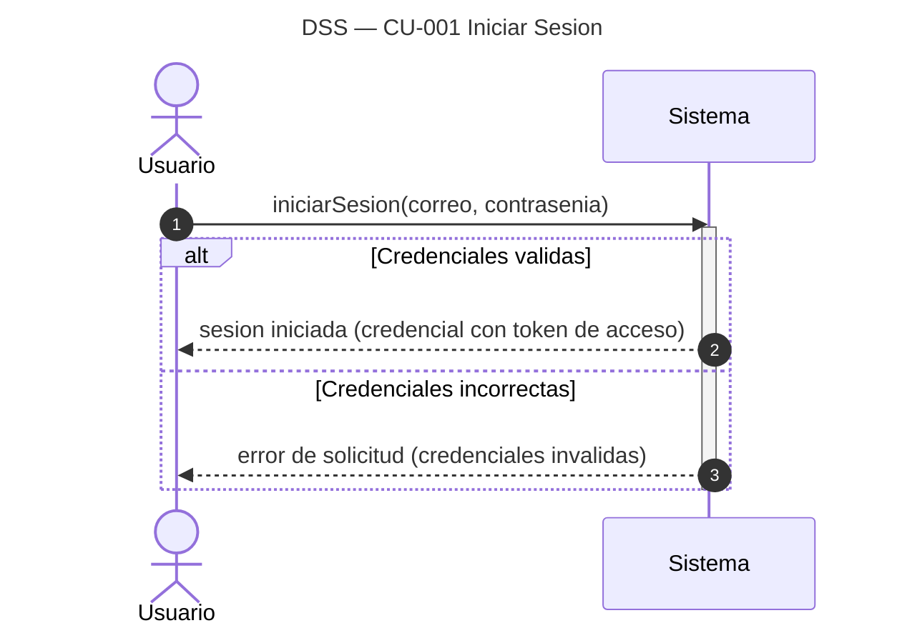
```mermaid
sequenceDiagram
    title DSS — CU-001 Iniciar Sesion
    autonumber
    actor USR as Usuario
    participant SIS as Sistema

    USR->>SIS: iniciarSesion(correo, contrasenia)
    activate SIS
    alt Credenciales validas
        SIS-->>USR: sesion iniciada (credencial con token de acceso)
    else Credenciales incorrectas
        SIS-->>USR: error de solicitud (credenciales invalidas)
    end
    deactivate SIS
```

---

#### DSS — CU-002: Registrarse como Cliente

**Actor:** Cliente
**Operaciones del sistema:** `registrarCliente(nombreCompleto, correo, telefono, contrasena, datosDelCliente)`

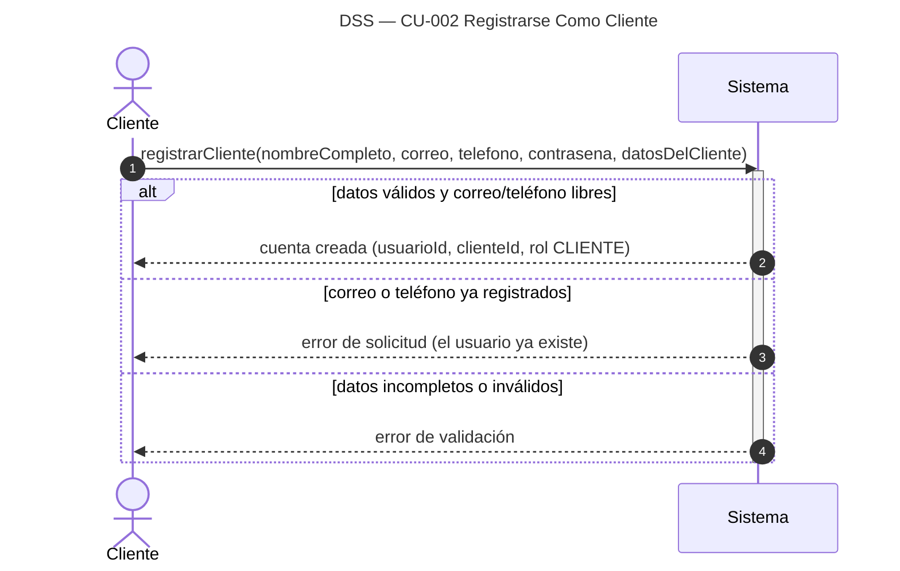
```mermaid
sequenceDiagram
    title DSS — CU-002 Registrarse Como Cliente
    autonumber
    actor CLI as Cliente
    participant SIS as Sistema

    CLI->>SIS: registrarCliente(nombreCompleto, correo, telefono, contrasena, datosDelCliente)
    activate SIS
    alt datos válidos y correo/teléfono libres
        SIS-->>CLI: cuenta creada (usuarioId, clienteId, rol CLIENTE)
    else correo o teléfono ya registrados
        SIS-->>CLI: error de solicitud (el usuario ya existe)
    else datos incompletos o inválidos
        SIS-->>CLI: error de validación
    end
    deactivate SIS
```

---

#### DSS — CU-003: Registrarse como Chofer

**Actor:** Administrador
**Operaciones del sistema:** `registrarChofer(datosPersonales, datosDelChofer, distribuidoraId)`

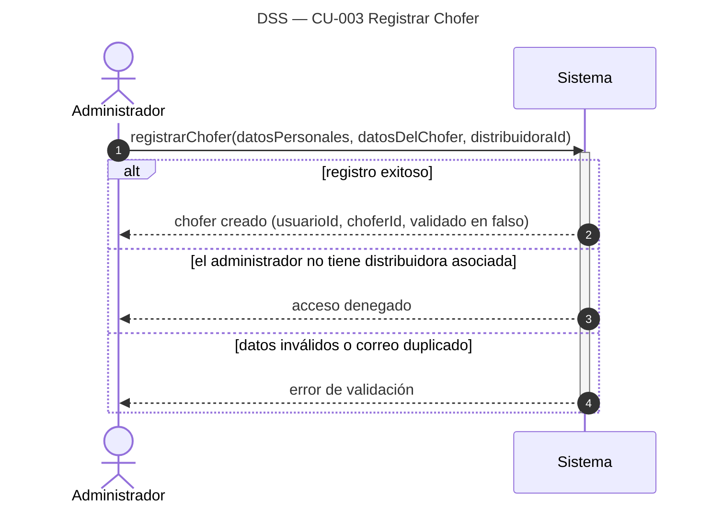
```mermaid
sequenceDiagram
    title DSS — CU-003 Registrar Chofer
    autonumber
    actor ADM as Administrador
    participant SIS as Sistema

    ADM->>SIS: registrarChofer(datosPersonales, datosDelChofer, distribuidoraId)
    activate SIS
    alt registro exitoso
        SIS-->>ADM: chofer creado (usuarioId, choferId, validado en falso)
    else el administrador no tiene distribuidora asociada
        SIS-->>ADM: acceso denegado
    else datos inválidos o correo duplicado
        SIS-->>ADM: error de validación
    end
    deactivate SIS
```

> El chofer nace **no validado**: para poder operar necesita CU-032.

---

#### DSS — CU-004: Gestionar Perfil de Usuario

**Actor:** Usuario autenticado (Cliente, Chofer o Administrador)
**Operaciones del sistema:** `consultarPerfil(usuarioId)`, `actualizarPerfil(usuarioId, datos)`, `consultarPerfilCliente(usuarioId)`, `actualizarPerfilCliente(clienteId, datos)`

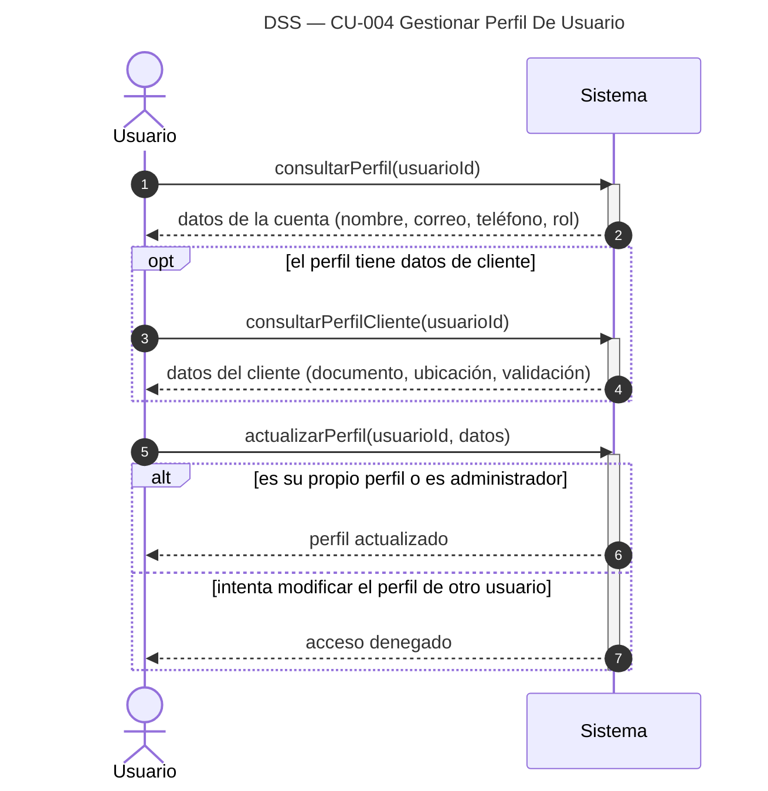
```mermaid
sequenceDiagram
    title DSS — CU-004 Gestionar Perfil De Usuario
    autonumber
    actor CLI as Usuario
    participant SIS as Sistema

    CLI->>SIS: consultarPerfil(usuarioId)
    activate SIS
    SIS-->>CLI: datos de la cuenta (nombre, correo, teléfono, rol)
    deactivate SIS

    opt el perfil tiene datos de cliente
        CLI->>SIS: consultarPerfilCliente(usuarioId)
        activate SIS
        SIS-->>CLI: datos del cliente (documento, ubicación, validación)
        deactivate SIS
    end

    CLI->>SIS: actualizarPerfil(usuarioId, datos)
    activate SIS
    alt es su propio perfil o es administrador
        SIS-->>CLI: perfil actualizado
    else intenta modificar el perfil de otro usuario
        SIS-->>CLI: acceso denegado
    end
    deactivate SIS
```

---

### SS-02 — Gestión de Pedidos

#### Crítico DSS — CU-005: Crear Pedido

**Actor:** Cliente
**Operaciones del sistema:** `crearPedido(items, direccion, franjaHoraria, metodoPago)`

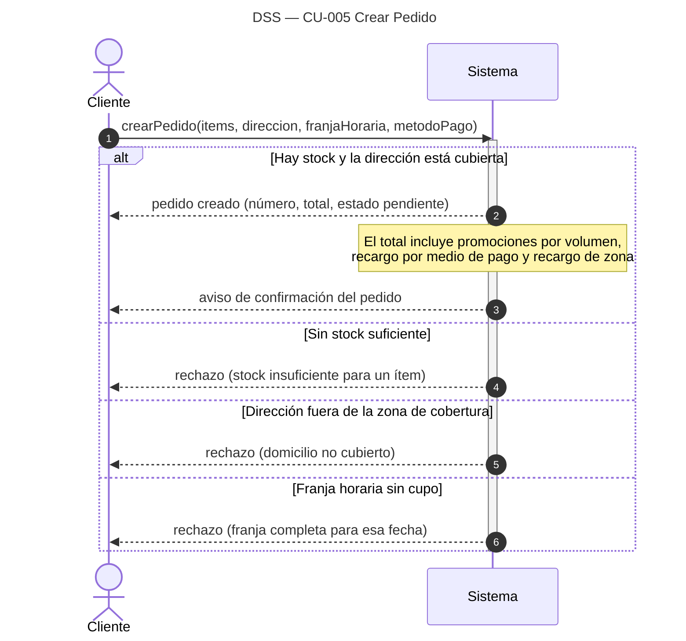
```mermaid
sequenceDiagram
    title DSS — CU-005 Crear Pedido
    autonumber
    actor CLI as Cliente
    participant SIS as Sistema

    CLI->>SIS: crearPedido(items, direccion, franjaHoraria, metodoPago)
    activate SIS
    alt Hay stock y la dirección está cubierta
        SIS-->>CLI: pedido creado (número, total, estado pendiente)
        Note over SIS: El total incluye promociones por volumen,<br/>recargo por medio de pago y recargo de zona
        SIS-->>CLI: aviso de confirmación del pedido
    else Sin stock suficiente
        SIS-->>CLI: rechazo (stock insuficiente para un ítem)
    else Dirección fuera de la zona de cobertura
        SIS-->>CLI: rechazo (domicilio no cubierto)
    else Franja horaria sin cupo
        SIS-->>CLI: rechazo (franja completa para esa fecha)
    end
    deactivate SIS
```

---

#### DSS — CU-006: Consultar Detalle de Pedido

**Actor:** Cliente (también Chofer y Administrador)
**Operaciones del sistema:** `consultarPedido(pedidoId)`

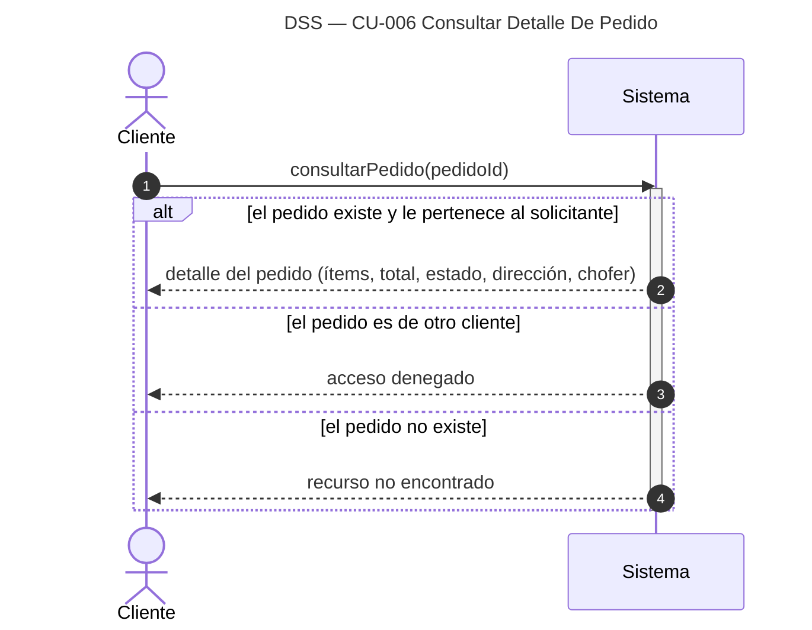
```mermaid
sequenceDiagram
    title DSS — CU-006 Consultar Detalle De Pedido
    autonumber
    actor CLI as Cliente
    participant SIS as Sistema

    CLI->>SIS: consultarPedido(pedidoId)
    activate SIS
    alt el pedido existe y le pertenece al solicitante
        SIS-->>CLI: detalle del pedido (ítems, total, estado, dirección, chofer)
    else el pedido es de otro cliente
        SIS-->>CLI: acceso denegado
    else el pedido no existe
        SIS-->>CLI: recurso no encontrado
    end
    deactivate SIS
```

---

#### DSS — CU-007: Consultar Historial de Pedidos

**Actor:** Cliente
**Operaciones del sistema:** `consultarHistorialDePedidos(clienteId, pagina, limite)`

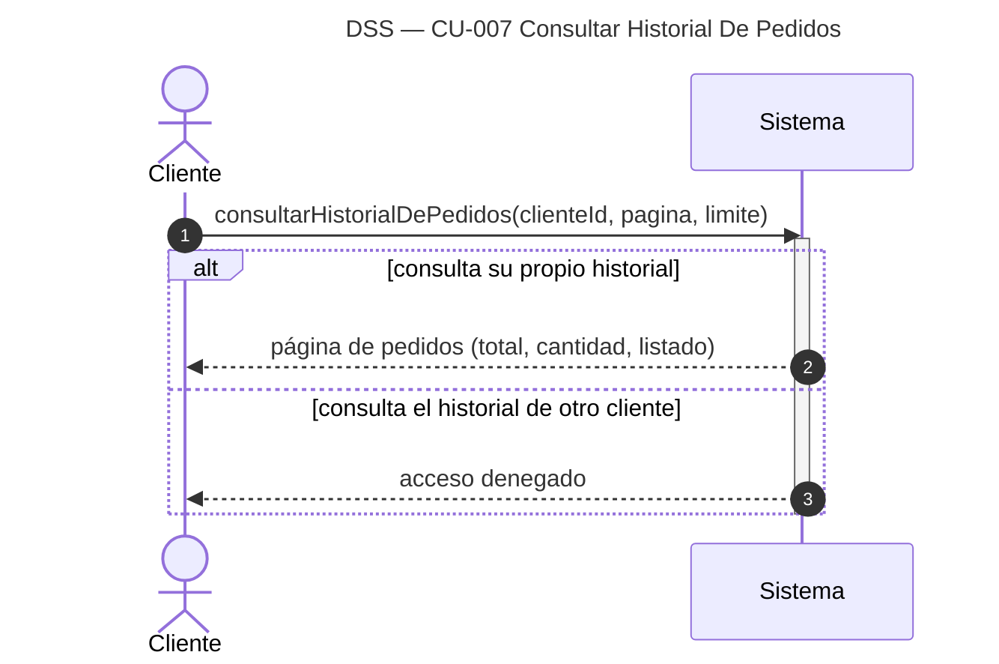
```mermaid
sequenceDiagram
    title DSS — CU-007 Consultar Historial De Pedidos
    autonumber
    actor CLI as Cliente
    participant SIS as Sistema

    CLI->>SIS: consultarHistorialDePedidos(clienteId, pagina, limite)
    activate SIS
    alt consulta su propio historial
        SIS-->>CLI: página de pedidos (total, cantidad, listado)
    else consulta el historial de otro cliente
        SIS-->>CLI: acceso denegado
    end
    deactivate SIS
```

> El cliente ve **todo** su historial aunque haya comprado a varias distribuidoras; el personal solo ve los pedidos de la suya.

---

#### DSS — CU-143: Declarar el Consumo Promedio al Registrarse

**Actor:** Cliente
**Operaciones del sistema:** `declararConsumoPromedio(tipoGarrafa, cantidadPorMes)`

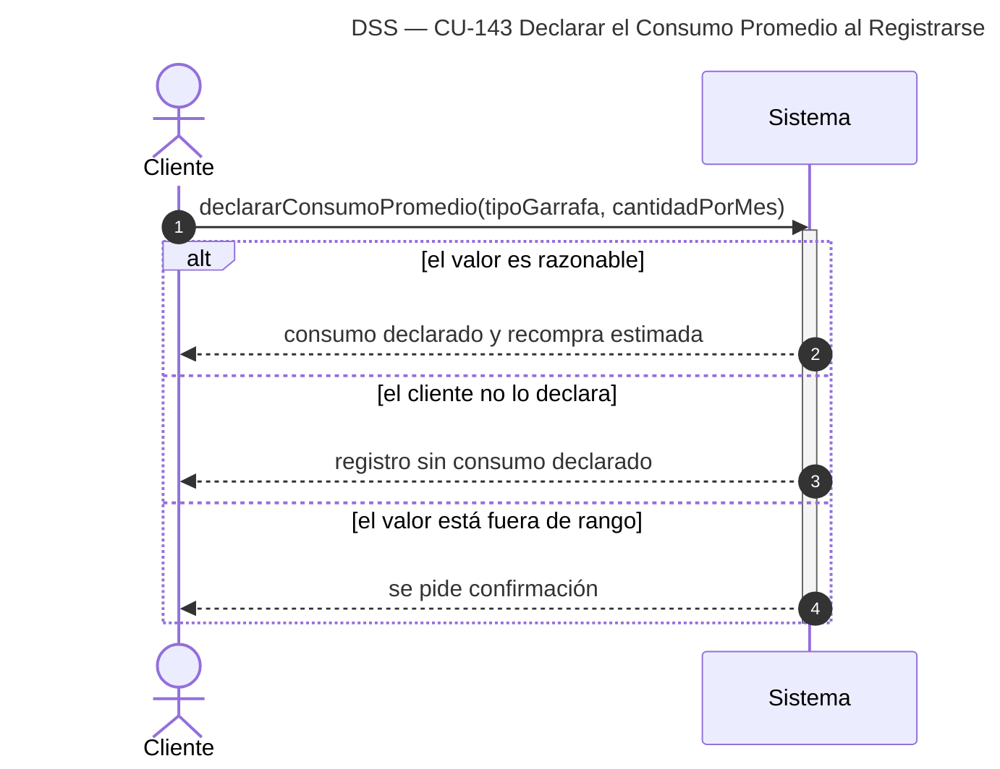
```mermaid
sequenceDiagram
    title DSS — CU-143 Declarar el Consumo Promedio al Registrarse
    autonumber
    actor CLI as Cliente
    participant SIS as Sistema

    CLI->>SIS: declararConsumoPromedio(tipoGarrafa, cantidadPorMes)
    activate SIS
    alt el valor es razonable
        SIS-->>CLI: consumo declarado y recompra estimada
    else el cliente no lo declara
        SIS-->>CLI: registro sin consumo declarado
    else el valor está fuera de rango
        SIS-->>CLI: se pide confirmación
    end
    deactivate SIS
```

---

#### DSS — CU-144: Actualizar el Consumo Promedio Declarado

**Actor:** Cliente
**Operaciones del sistema:** `actualizarConsumoPromedio(cantidadPorMes)`

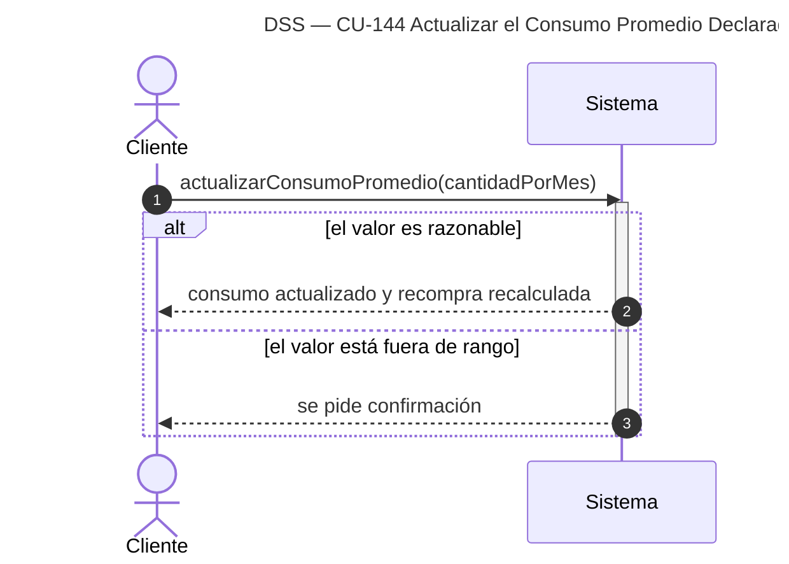
```mermaid
sequenceDiagram
    title DSS — CU-144 Actualizar el Consumo Promedio Declarado
    autonumber
    actor CLI as Cliente
    participant SIS as Sistema

    CLI->>SIS: actualizarConsumoPromedio(cantidadPorMes)
    activate SIS
    alt el valor es razonable
        SIS-->>CLI: consumo actualizado y recompra recalculada
    else el valor está fuera de rango
        SIS-->>CLI: se pide confirmación
    end
    deactivate SIS
```

---

#### DSS — CU-145: Configurar los Días de Aviso Previo a la Recompra

**Actor:** Cliente
**Operaciones del sistema:** `configurarDiasDeAviso(dias)`

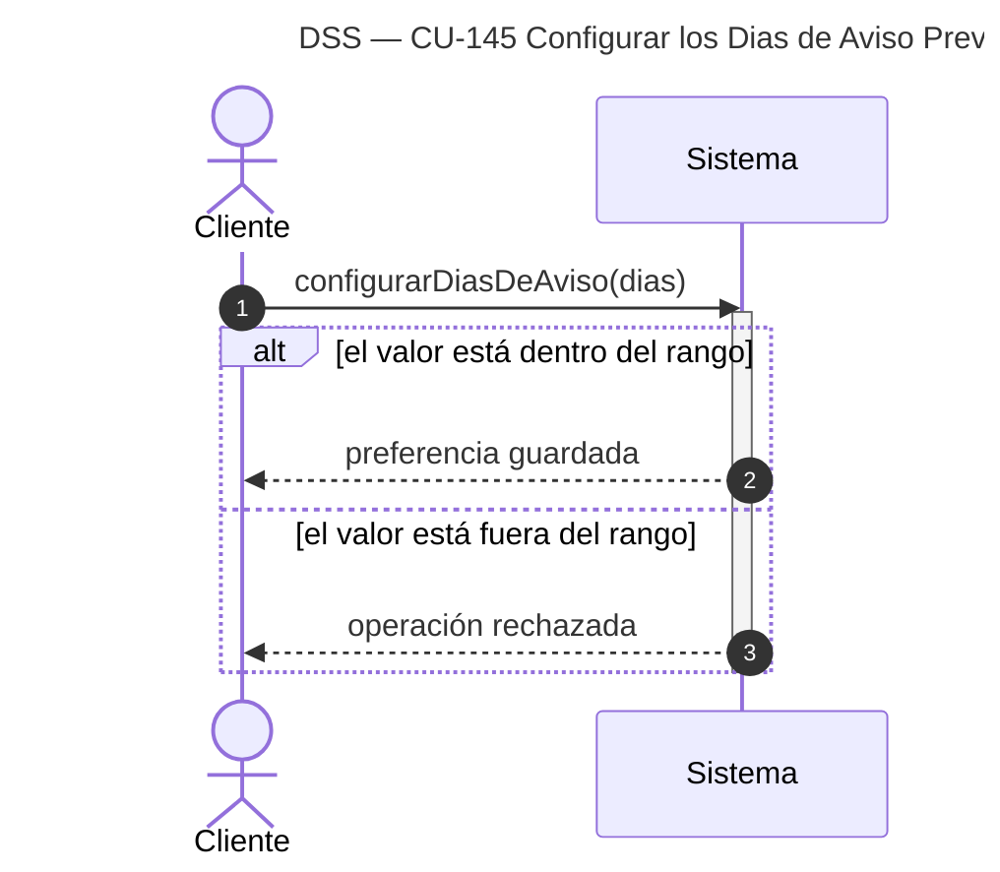
```mermaid
sequenceDiagram
    title DSS — CU-145 Configurar los Dias de Aviso Previo a la Recompra
    autonumber
    actor CLI as Cliente
    participant SIS as Sistema

    CLI->>SIS: configurarDiasDeAviso(dias)
    activate SIS
    alt el valor está dentro del rango
        SIS-->>CLI: preferencia guardada
    else el valor está fuera del rango
        SIS-->>CLI: operación rechazada
    end
    deactivate SIS
```

---

#### DSS — CU-146: Consultar la Fecha Estimada de Recompra

**Actor:** Administrador
**Operaciones del sistema:** `consultarRecomprasEstimadas(dias)`

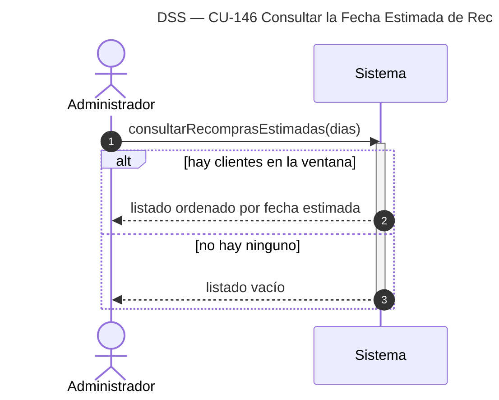
```mermaid
sequenceDiagram
    title DSS — CU-146 Consultar la Fecha Estimada de Recompra
    autonumber
    actor ADM as Administrador
    participant SIS as Sistema

    ADM->>SIS: consultarRecomprasEstimadas(dias)
    activate SIS
    alt hay clientes en la ventana
        SIS-->>ADM: listado ordenado por fecha estimada
    else no hay ninguno
        SIS-->>ADM: listado vacío
    end
    deactivate SIS
```

---

#### DSS — CU-147: Realizar una Compra Express

**Actor:** Cliente
**Operaciones del sistema:** `realizarCompraExpress(tipoGarrafa, medioDePago)`

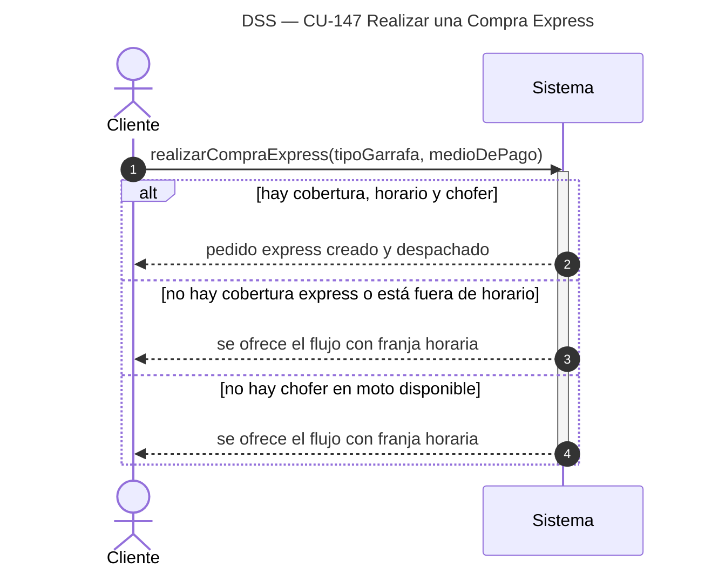
```mermaid
sequenceDiagram
    title DSS — CU-147 Realizar una Compra Express
    autonumber
    actor CLI as Cliente
    participant SIS as Sistema

    CLI->>SIS: realizarCompraExpress(tipoGarrafa, medioDePago)
    activate SIS
    alt hay cobertura, horario y chofer
        SIS-->>CLI: pedido express creado y despachado
    else no hay cobertura express o está fuera de horario
        SIS-->>CLI: se ofrece el flujo con franja horaria
    else no hay chofer en moto disponible
        SIS-->>CLI: se ofrece el flujo con franja horaria
    end
    deactivate SIS
```

---

#### DSS — CU-148: Elegir la Modalidad de Entrega del Pedido

**Actor:** Cliente
**Operaciones del sistema:** `elegirModalidadDeEntrega(pedidoId, modalidad)`

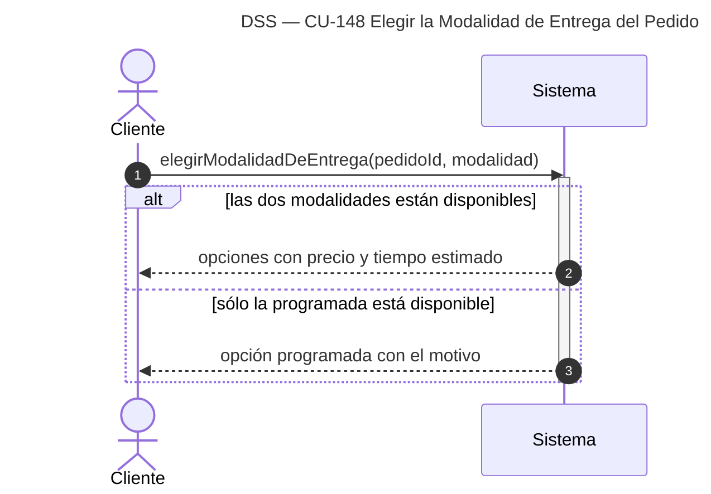
```mermaid
sequenceDiagram
    title DSS — CU-148 Elegir la Modalidad de Entrega del Pedido
    autonumber
    actor CLI as Cliente
    participant SIS as Sistema

    CLI->>SIS: elegirModalidadDeEntrega(pedidoId, modalidad)
    activate SIS
    alt las dos modalidades están disponibles
        SIS-->>CLI: opciones con precio y tiempo estimado
    else sólo la programada está disponible
        SIS-->>CLI: opción programada con el motivo
    end
    deactivate SIS
```

---

#### DSS — CU-008: Cancelar Pedido (Cliente)

**Actor:** Cliente
**Operaciones del sistema:** `cancelarPedido(pedidoId, motivo)`

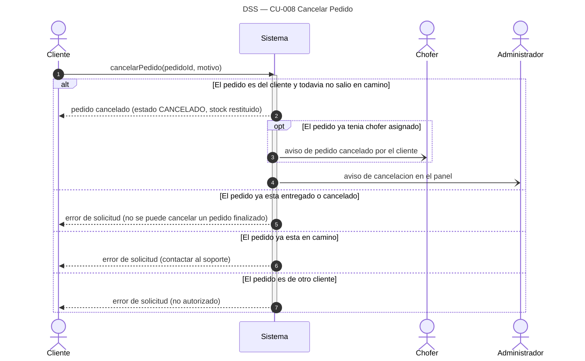
```mermaid
sequenceDiagram
    title DSS — CU-008 Cancelar Pedido
    autonumber
    actor CLI as Cliente
    participant SIS as Sistema
    actor CHO as Chofer
    actor ADM as Administrador

    CLI->>SIS: cancelarPedido(pedidoId, motivo)
    activate SIS
    alt El pedido es del cliente y todavia no salio en camino
        SIS-->>CLI: pedido cancelado (estado CANCELADO, stock restituido)
        opt El pedido ya tenia chofer asignado
            SIS-)CHO: aviso de pedido cancelado por el cliente
        end
        SIS-)ADM: aviso de cancelacion en el panel
    else El pedido ya esta entregado o cancelado
        SIS-->>CLI: error de solicitud (no se puede cancelar un pedido finalizado)
    else El pedido ya esta en camino
        SIS-->>CLI: error de solicitud (contactar al soporte)
    else El pedido es de otro cliente
        SIS-->>CLI: error de solicitud (no autorizado)
    end
    deactivate SIS
```

> La identidad y el rol del cancelador salen **siempre** de la sesión, nunca del cuerpo del mensaje.

---

#### DSS — CU-009: Cancelar Pedido (Chofer)

**Actor:** Chofer
**Operaciones del sistema:** `cancelarPedido(pedidoId, motivo)`

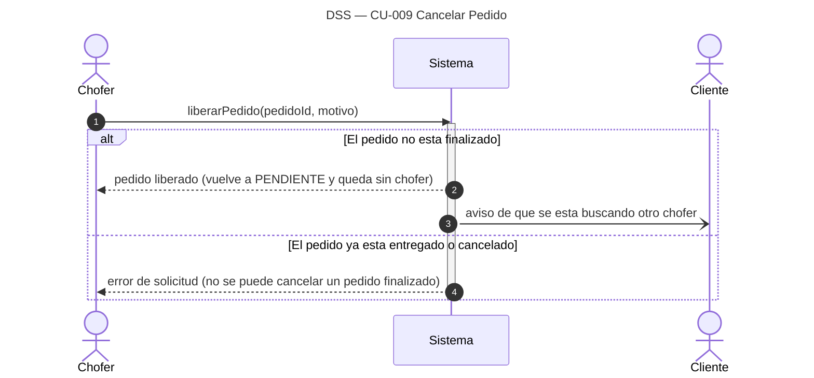
```mermaid
sequenceDiagram
    title DSS — CU-009 Cancelar Pedido
    autonumber
    actor CHO as Chofer
    participant SIS as Sistema
    actor CLI as Cliente

    CHO->>SIS: liberarPedido(pedidoId, motivo)
    activate SIS
    alt El pedido no esta finalizado
        SIS-->>CHO: pedido liberado (vuelve a PENDIENTE y queda sin chofer)
        SIS-)CLI: aviso de que se esta buscando otro chofer
    else El pedido ya esta entregado o cancelado
        SIS-->>CHO: error de solicitud (no se puede cancelar un pedido finalizado)
    end
    deactivate SIS
```

---

#### DSS — CU-010: Cancelar Pedido (Administrador)

**Actor:** Administrador
**Operaciones del sistema:** `cancelarPedido(pedidoId, motivo)`, `cancelarPedidoForzado(pedidoId)`

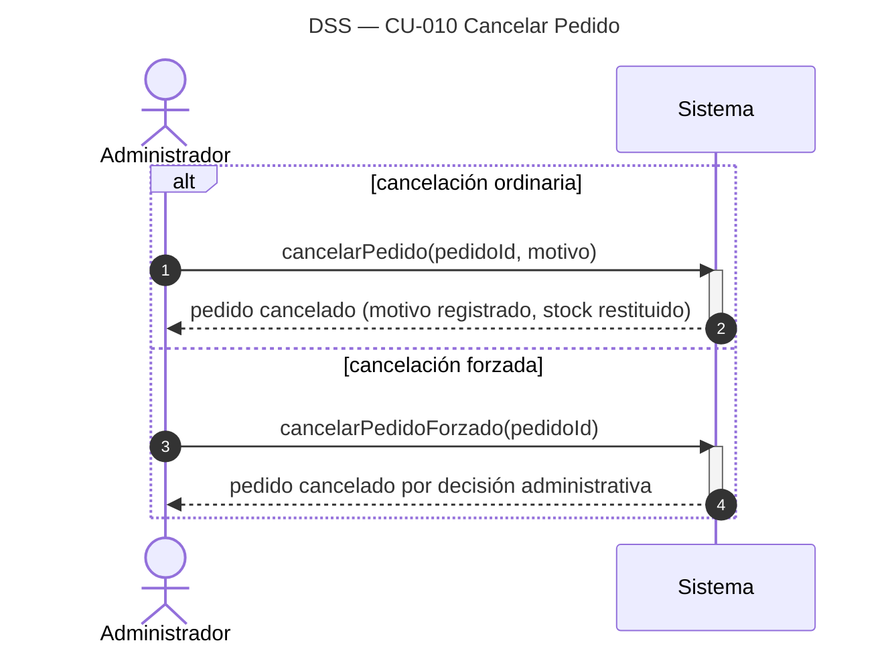
```mermaid
sequenceDiagram
    title DSS — CU-010 Cancelar Pedido
    autonumber
    actor ADM as Administrador
    participant SIS as Sistema

    alt cancelación ordinaria
        ADM->>SIS: cancelarPedido(pedidoId, motivo)
        activate SIS
        SIS-->>ADM: pedido cancelado (motivo registrado, stock restituido)
        deactivate SIS
    else cancelación forzada
        ADM->>SIS: cancelarPedidoForzado(pedidoId)
        activate SIS
        SIS-->>ADM: pedido cancelado por decisión administrativa
        deactivate SIS
    end
```

> El sistema ofrece **dos** vías para el administrador. La documentación previa describía una sola.

---

#### DSS — CU-011: Listar Todos los Pedidos

**Actor:** Administrador
**Operaciones del sistema:** `listarPedidos(pagina, limite)`

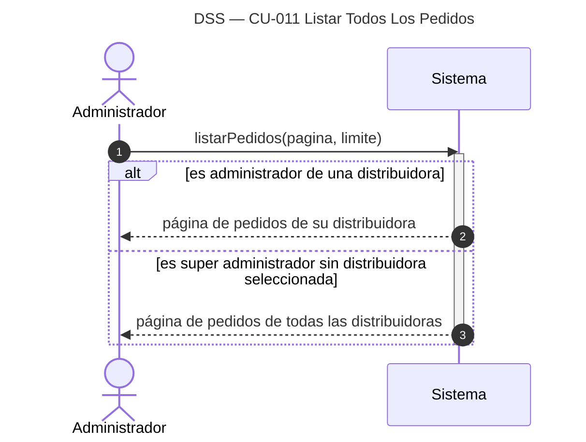
```mermaid
sequenceDiagram
    title DSS — CU-011 Listar Todos Los Pedidos
    autonumber
    actor ADM as Administrador
    participant SIS as Sistema

    ADM->>SIS: listarPedidos(pagina, limite)
    activate SIS
    alt es administrador de una distribuidora
        SIS-->>ADM: página de pedidos de su distribuidora
    else es super administrador sin distribuidora seleccionada
        SIS-->>ADM: página de pedidos de todas las distribuidoras
    end
    deactivate SIS
```

---

### SS-03 — Despacho y Asignación

#### DSS — CU-012: Asignar Chofer Manualmente

**Actor:** Administrador
**Operaciones del sistema:** `asignarChoferAPedido(pedidoId, choferId)`

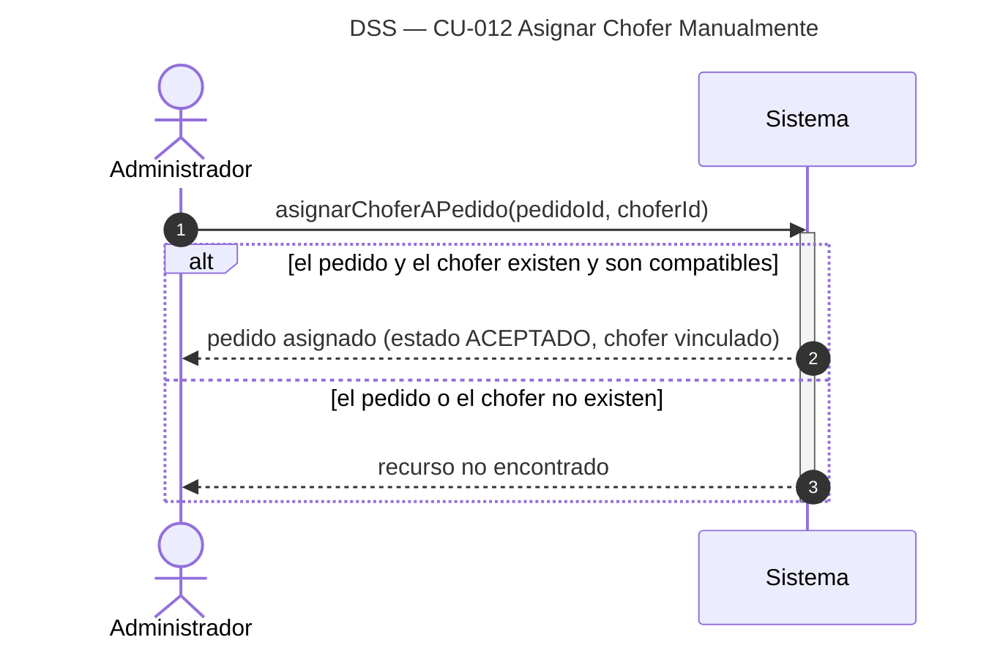
```mermaid
sequenceDiagram
    title DSS — CU-012 Asignar Chofer Manualmente
    autonumber
    actor ADM as Administrador
    participant SIS as Sistema

    ADM->>SIS: asignarChoferAPedido(pedidoId, choferId)
    activate SIS
    alt el pedido y el chofer existen y son compatibles
        SIS-->>ADM: pedido asignado (estado ACEPTADO, chofer vinculado)
    else el pedido o el chofer no existen
        SIS-->>ADM: recurso no encontrado
    end
    deactivate SIS
```

---

#### DSS — CU-149: Despachar un Pedido Express a un Chofer en Moto

**Actor:** Sistema Automático
**Operaciones del sistema:** `despacharPedidoExpress(pedidoId)`

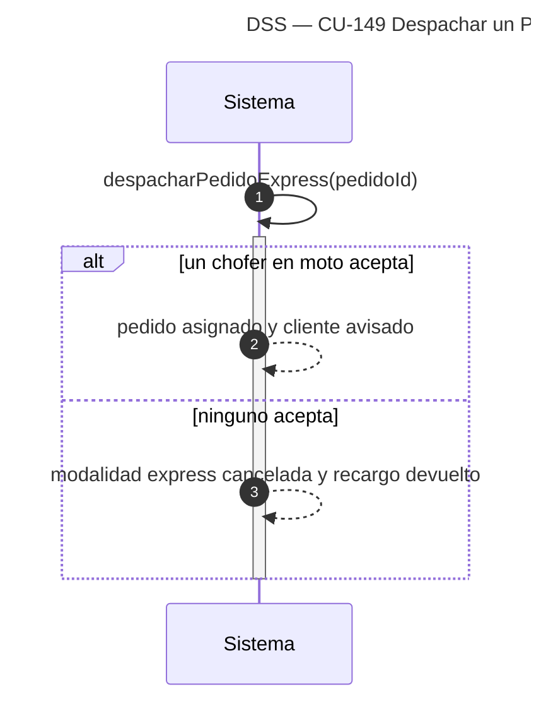
```mermaid
sequenceDiagram
    title DSS — CU-149 Despachar un Pedido Express a un Chofer en Moto
    autonumber
    actor SIS as Sistema Automático
    participant SIS as Sistema

    SIS->>SIS: despacharPedidoExpress(pedidoId)
    activate SIS
    alt un chofer en moto acepta
        SIS-->>SIS: pedido asignado y cliente avisado
    else ninguno acepta
        SIS-->>SIS: modalidad express cancelada y recargo devuelto
    end
    deactivate SIS
```

---

#### Crítico · automático DSS — CU-013: Ofrecer el Pedido al Chofer Más Cercano

**Actor:** Sistema Automático (se dispara al crearse el pedido)
**Operaciones del sistema:** `ofrecerAlSiguienteChofer(pedido)`

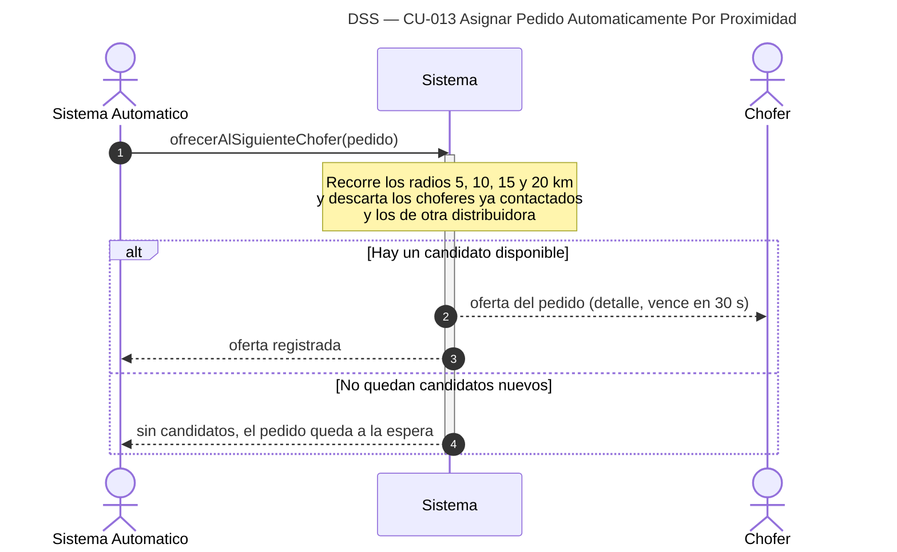
```mermaid
sequenceDiagram
    title DSS — CU-013 Asignar Pedido Automaticamente Por Proximidad
    autonumber
    actor SAU as Sistema Automatico
    participant SIS as Sistema
    actor CHO as Chofer

    SAU->>SIS: ofrecerAlSiguienteChofer(pedido)
    activate SIS
    Note over SIS: Recorre los radios 5, 10, 15 y 20 km<br/>y descarta los choferes ya contactados<br/>y los de otra distribuidora
    alt Hay un candidato disponible
        SIS-->>CHO: oferta del pedido (detalle, vence en 30 s)
        SIS-->>SAU: oferta registrada
    else No quedan candidatos nuevos
        SIS-->>SAU: sin candidatos, el pedido queda a la espera
    end
    deactivate SIS
```

---

#### Crítico · automático DSS — CU-014: Vencer la Oferta y Ofrecer al Siguiente Chofer

**Actor:** Sistema Automático (proceso temporal, cada 15 segundos)
**Operaciones del sistema:** `vencerOfertasExpiradas()`

```mermaid
sequenceDiagram
    title DSS — CU-014 Reintentar Asignacion Con Radio Expandido
    autonumber
    actor SAU as Sistema Automatico
    participant SIS as Sistema

    Note over SAU: Se ejecuta cada 15 segundos
    SAU->>SIS: vencerOfertasExpiradas()
    activate SIS
    loop Por cada oferta cuya vigencia expiró
        SIS->>SIS: marcar la oferta como vencida
        alt El pedido sigue pendiente y sin chofer
            SIS->>SIS: ofrecerAlSiguienteChofer(pedido)
        else El pedido ya fue aceptado o cancelado
            SIS->>SIS: no re-ofrecer
        end
    end
    SIS-->>SAU: ofertas procesadas
    deactivate SIS
```

---

#### Crítico DSS — CU-015: Aceptar Pedido

**Actor:** Chofer
**Operaciones del sistema:** `aceptarPedido(pedido)`

```mermaid
sequenceDiagram
    title DSS — CU-015 Aceptar Pedido
    autonumber
    actor CHO as Chofer
    participant SIS as Sistema
    actor CLI as Cliente

    CHO->>SIS: aceptarPedido(pedido)
    activate SIS
    alt La transicion de estado es valida y el chofer esta activo
        SIS-->>CHO: pedido asignado (datos de entrega y codigo de entrega)
        SIS-)CLI: aviso de que un chofer tomo el pedido
    else El pedido ya esta entregado o cancelado
        SIS-->>CHO: error de solicitud (transicion no permitida)
    else El chofer no existe o esta dado de baja
        SIS-->>CHO: error de solicitud (repartidor no encontrado o inactivo)
    end
    deactivate SIS
```

---

#### DSS — CU-016: Rechazar / Ignorar Pedido

**Actor:** Chofer
**Operaciones del sistema:** `rechazarOferta(pedidoId)`

```mermaid
sequenceDiagram
    title DSS — CU-016 Rechazar Ignorar Pedido
    autonumber
    actor CHO as Chofer
    participant SIS as Sistema
    actor CH2 as Siguiente Chofer

    CHO->>SIS: rechazarOferta(pedidoId)
    activate SIS
    alt El pedido existe
        SIS-->>CHO: rechazo registrado (se cierra la oferta si estaba activa)
        opt El pedido sigue pendiente y sin chofer asignado
            SIS-)CH2: nueva oferta de pedido (pedidoId, total, items, vence en 30 s)
        end
    else El pedido no existe
        SIS-->>CHO: sin efecto (rechazo no registrado)
    end
    deactivate SIS
```

> El rechazo **no** espera el vencimiento de la ventana de 30 segundos: re-ofrece de inmediato al siguiente chofer más cercano.

---

### SS-04 — Seguimiento en Tiempo Real

---

### SS-04 — Seguimiento en Tiempo Real

#### Crítico · automático DSS — CU-017: Actualizar Ubicación GPS del Chofer

**Actor:** Chofer
**Operaciones del sistema:** `actualizarUbicacion(latitud, longitud)`

```mermaid
sequenceDiagram
    title DSS — CU-017 Actualizar Ubicacion Gps Del Chofer
    autonumber
    actor CHO as Chofer
    participant SIS as Sistema
    actor CLI as Cliente
    actor ADM as Administrador

    loop Mientras el chofer esta conectado
        CHO->>SIS: actualizarUbicacion(usuarioId, latitud, longitud)
        activate SIS
        alt Los datos de posicion son validos
            opt El chofer tiene un pedido en curso
                SIS-)CLI: nueva posicion del chofer en el mapa
                SIS-)ADM: nueva posicion del chofer en el panel
            end
        else Faltan el usuario o las coordenadas
            SIS->>SIS: se descarta el envio, no se registra la posicion
        end
        deactivate SIS
    end
```

---

#### DSS — CU-018: Marcar Pedido "En Camino"

**Actor:** Chofer
**Operaciones del sistema:** `actualizarEstadoDePedido(pedidoId, EN_CAMINO)`

```mermaid
sequenceDiagram
    title DSS — CU-018 Marcar Pedido En Camino
    autonumber
    actor CHO as Chofer
    participant SIS as Sistema
    actor CLI as Cliente

    CHO->>SIS: actualizarEstadoDePedido(pedidoId, EN_CAMINO)
    activate SIS
    alt la transición es válida desde el estado actual
        SIS-->>CHO: pedido en camino (estado EN_CAMINO)
        SIS-)CLI: aviso de pedido en camino
    else la transición no está permitida
        SIS-->>CHO: error de solicitud (transición inválida)
    end
    deactivate SIS
```

---

#### DSS — CU-019: Avisar Llegada al Cliente

**Actor:** Chofer
**Operaciones del sistema:** `avisarLlegada(pedidoId)`

```mermaid
sequenceDiagram
    title DSS — CU-019 Avisar Llegada Al Cliente
    autonumber
    actor CHO as Chofer
    participant SIS as Sistema
    actor CLI as Cliente

    CHO->>SIS: avisarLlegada(pedidoId)
    activate SIS
    alt el pedido está en camino
        SIS-)CLI: aviso de que el repartidor llegó al domicilio
        SIS-->>CHO: cliente notificado
    else el pedido no está en camino
        SIS-->>CHO: error de solicitud (el pedido no está en camino)
    end
    deactivate SIS
```

> Este caso de uso **no** cambia el estado del pedido: solo notifica.

---

#### Crítico DSS — CU-020: Confirmar Entrega

**Actor:** Chofer (secuencia normal) · Cliente (secuencia alternativa por código)
**Operaciones del sistema:** `confirmarEntrega(pedido)`, `confirmarEntregaConCodigo(pedido, codigo)`

```mermaid
sequenceDiagram
    title DSS — CU-020 Confirmar Entrega
    autonumber
    actor CHO as Chofer
    participant SIS as Sistema
    actor CLI as Cliente

    alt El chofer declara la entrega
        CHO->>SIS: confirmarEntrega(pedido)
    else El cliente la constata leyendo el código
        CHO->>SIS: obtenerCodigoDeEntrega(pedido)
        SIS-->>CHO: código para mostrar como QR
        CLI->>SIS: confirmarEntregaConCodigo(pedido, codigo)
    end
    activate SIS
    alt El pedido está en camino y los datos son correctos
        SIS-->>CLI: pedido entregado
        Note over SIS: Si el pago es en efectivo,<br/>queda saldado
        SIS-->>CHO: entrega registrada
    else El código no coincide o el pedido no está en camino
        SIS-->>CLI: rechazo (no se puede confirmar la entrega)
    end
    deactivate SIS
```

---

#### Crítico · automático DSS — Reserva y Restitución de Stock (proceso interno)

**Actor:** Sistema Automático (se dispara al confirmarse o cancelarse un pedido)
**Operaciones del sistema:** `reservarStock(items)`, `restituirStock(pedido)`

```mermaid
sequenceDiagram
    autonumber
    actor SAU as Sistema Automatico
    participant SIS as Sistema

    SAU->>SIS: reservarStock(items)
    activate SIS
    alt Hay disponibilidad para todos los ítems
        SIS-->>SAU: stock reservado
    else Algún ítem no tiene stock suficiente
        SIS-->>SAU: reserva rechazada, ninguna unidad queda comprometida
    end
    deactivate SIS

    opt El pedido se cancela más tarde
        SAU->>SIS: restituirStock(pedido)
        activate SIS
        SIS-->>SAU: unidades devueltas al inventario
        deactivate SIS
    end
```

---

#### DSS — CU-021: Recibir Notificaciones en Tiempo Real

**Actor:** Cliente
**Operaciones del sistema:** `suscribirseAlSeguimiento(clienteId)`

```mermaid
sequenceDiagram
    title DSS — CU-021 Recibir Notificaciones En Tiempo Real
    autonumber
    actor CLI as Cliente
    participant SIS as Sistema

    CLI->>SIS: suscribirseAlSeguimiento(clienteId)
    activate SIS
    SIS-->>CLI: suscripción confirmada
    deactivate SIS

    loop mientras el pedido esté en curso
        SIS-)CLI: cambio de estado del pedido (aceptado, en camino, entregado, cancelado)
        SIS-)CLI: posición actual del chofer (latitud, longitud)
    end
```

> El canal se cierra cuando el cliente cierra la aplicación o el pedido alcanza un estado terminal.

---

#### DSS — CU-022: Activar / Desactivar Disponibilidad

**Actor:** Chofer
**Operaciones del sistema:** `cambiarDisponibilidad(usuarioId, disponible)`

```mermaid
sequenceDiagram
    title DSS — CU-022 Activar Desactivar Disponibilidad
    autonumber
    actor CHO as Chofer
    participant SIS as Sistema

    CHO->>SIS: cambiarDisponibilidad(usuarioId, disponible)
    activate SIS
    alt se pone disponible
        SIS-->>CHO: disponible (empieza a recibir ofertas de pedidos)
    else se pone no disponible
        SIS-->>CHO: no disponible (deja de recibir ofertas)
    end
    deactivate SIS
```

> **Observación de análisis:** el sistema almacena esta disponibilidad en el mismo atributo que el alta/baja administrativa (CU-033), por lo que hoy "fuera de turno" y "dado de baja" son indistinguibles.

---

### SS-05 — Reclamos

#### Importante DSS — CU-023: Registrar Reclamo

**Actor:** Cliente
**Operaciones del sistema:** `registrarReclamo(pedido, motivo, evidencia)`

```mermaid
sequenceDiagram
    title DSS — CU-023 Registrar Reclamo
    autonumber
    actor CLI as Cliente
    participant SIS as Sistema
    actor ADM as Administrador

    CLI->>SIS: registrarReclamo(pedido, motivo, evidencia)
    activate SIS
    alt El pedido fue entregado y es del cliente
        SIS-->>CLI: reclamo registrado (número, estado pendiente)
        SIS-->>ADM: nuevo reclamo para gestionar
    else El pedido no está entregado o no le pertenece
        SIS-->>CLI: rechazo (no se puede reclamar este pedido)
    end
    deactivate SIS
```

---

---

#### Ampliación — DSS de los casos de uso incorporados

Los 95 diagramas que siguen completan la cobertura del comportamiento del sistema.
Se agrupan por subsistema y respetan la misma convención de caja negra: solo intervienen
el actor y el sistema, sin detalle interno.

---

#### DSS — CU-024: Listar Reclamos

**Actor:** Administrador
**Operaciones del sistema:** `listarReclamos()`

```mermaid
sequenceDiagram
    title DSS — CU-024 Listar Reclamos
    autonumber
    actor ADM as Administrador
    participant SIS as Sistema

    ADM->>SIS: listarReclamos()
    activate SIS
    SIS-->>ADM: reclamos de su distribuidora (pedido, cliente, motivo, estado)
    deactivate SIS
```

---

#### DSS — CU-025: Resolver Reclamo

**Actor:** Administrador
**Operaciones del sistema:** `resolverReclamo(reclamoId, resolucion, estadoFinal)`

```mermaid
sequenceDiagram
    title DSS — CU-025 Resolver Reclamo
    autonumber
    actor ADM as Administrador
    participant SIS as Sistema

    ADM->>SIS: resolverReclamo(reclamoId, resolucion, estadoFinal)
    activate SIS
    alt el reclamo existe
        SIS-->>ADM: reclamo resuelto (estado y resolución registrados)
    else el reclamo no existe
        SIS-->>ADM: recurso no encontrado
    end
    deactivate SIS
```

---

### SS-06 — Reportes y Dashboard

---

### SS-06 — Reportes y Dashboard

#### DSS — CU-026: Ver Dashboard General

**Actor:** Administrador
**Operaciones del sistema:** `consultarResumenDePedidos()`, `consultarGraficoDeVentas()`

```mermaid
sequenceDiagram
    title DSS — CU-026 Ver Dashboard General
    autonumber
    actor ADM as Administrador
    participant SIS as Sistema

    ADM->>SIS: consultarResumenDePedidos()
    activate SIS
    SIS-->>ADM: totales del día, la semana y el mes (pedidos, facturación, estados)
    deactivate SIS

    ADM->>SIS: consultarGraficoDeVentas()
    activate SIS
    SIS-->>ADM: serie de ventas de los últimos siete días
    deactivate SIS
```

---

#### DSS — CU-027: Ver Reporte de Ventas por Chofer

**Actor:** Administrador
**Operaciones del sistema:** `consultarVentasPorChofer(fechaDesde, fechaHasta)`

```mermaid
sequenceDiagram
    title DSS — CU-027 Ver Reporte De Ventas Por Chofer
    autonumber
    actor ADM as Administrador
    participant SIS as Sistema

    ADM->>SIS: consultarVentasPorChofer(fechaDesde, fechaHasta)
    activate SIS
    SIS-->>ADM: ranking por chofer (pedidos entregados, monto facturado)
    deactivate SIS
```

---

#### DSS — CU-028: Ver Reporte de Ventas por Producto

**Actor:** Administrador
**Operaciones del sistema:** `consultarVentasPorProducto(fechaDesde, fechaHasta)`

```mermaid
sequenceDiagram
    title DSS — CU-028 Ver Reporte De Ventas Por Producto
    autonumber
    actor ADM as Administrador
    participant SIS as Sistema

    ADM->>SIS: consultarVentasPorProducto(fechaDesde, fechaHasta)
    activate SIS
    SIS-->>ADM: ventas por tipo de garrafa (unidades, monto)
    deactivate SIS
```

---

#### DSS — CU-029: Ver Reporte por Método de Pago

**Actor:** Administrador
**Operaciones del sistema:** `consultarVentasPorMetodoDePago(fechaDesde, fechaHasta)`

```mermaid
sequenceDiagram
    title DSS — CU-029 Ver Reporte Por Metodo De Pago
    autonumber
    actor ADM as Administrador
    participant SIS as Sistema

    ADM->>SIS: consultarVentasPorMetodoDePago(fechaDesde, fechaHasta)
    activate SIS
    SIS-->>ADM: distribución entre efectivo y pasarela (cantidad, monto)
    deactivate SIS
```

---

#### DSS — CU-030: Ver Gráfico de Evolución de Ventas

**Actor:** Administrador
**Operaciones del sistema:** `consultarEvolucionDeVentas(fechaDesde, fechaHasta, granularidad)`

```mermaid
sequenceDiagram
    title DSS — CU-030 Ver Grafico De Ventas
    autonumber
    actor ADM as Administrador
    participant SIS as Sistema

    ADM->>SIS: consultarEvolucionDeVentas(fechaDesde, fechaHasta, granularidad)
    activate SIS
    alt granularidad diaria
        SIS-->>ADM: serie por día del rango solicitado
    else granularidad mensual
        SIS-->>ADM: serie por mes del rango solicitado
    end
    deactivate SIS
```

---

### SS-07 — Gestión de Choferes y Vehículos

---

### SS-07 — Gestión de Choferes y Vehículos

#### DSS — CU-031: Registrar Chofer

**Actor:** Administrador
**Operaciones del sistema:** `registrarChofer(datosPersonales, datosDelChofer, distribuidoraId)`

```mermaid
sequenceDiagram
    title DSS — CU-031 Registrar Chofer
    autonumber
    actor ADM as Administrador
    participant SIS as Sistema

    ADM->>SIS: registrarChofer(datosPersonales, datosDelChofer, distribuidoraId)
    activate SIS
    alt el administrador puede dar de alta en esa distribuidora
        SIS-->>ADM: chofer registrado (pendiente de validación)
    else el administrador no pertenece a esa distribuidora
        SIS-->>ADM: acceso denegado
    end
    deactivate SIS
```

> Realiza la misma operación del sistema que CU-003, vista desde el subsistema de gestión de flota.

---

#### DSS — CU-032: Validar / Invalidar Chofer

**Actor:** Administrador
**Operaciones del sistema:** `validarChofer(choferId)`, `invalidarChofer(choferId)`

```mermaid
sequenceDiagram
    title DSS — CU-032 Validar Invalidar Chofer
    autonumber
    actor ADM as Administrador
    participant SIS as Sistema

    alt aprobación de la documentación
        ADM->>SIS: validarChofer(choferId)
        activate SIS
        SIS-->>ADM: chofer validado (habilitado para recibir pedidos)
        deactivate SIS
    else rechazo o revocación
        ADM->>SIS: invalidarChofer(choferId)
        activate SIS
        SIS-->>ADM: chofer invalidado (deja de recibir ofertas)
        deactivate SIS
    end
```

---

#### DSS — CU-033: Activar / Desactivar Chofer (Administrador)

**Actor:** Administrador
**Operaciones del sistema:** `cambiarEstadoDelChofer(choferId, activo)`

```mermaid
sequenceDiagram
    title DSS — CU-033 Activar Desactivar Chofer
    autonumber
    actor ADM as Administrador
    participant SIS as Sistema

    ADM->>SIS: cambiarEstadoDelChofer(choferId, activo)
    activate SIS
    alt el chofer existe
        SIS-->>ADM: estado del chofer actualizado
    else el chofer no existe
        SIS-->>ADM: recurso no encontrado
    end
    deactivate SIS
```

---

#### DSS — CU-034: Registrar Vehículo del Chofer

**Actor:** Administrador
**Operaciones del sistema:** `registrarVehiculo(usuarioId, tipo, capacidad, patente, marca, modelo, anio, color)`

```mermaid
sequenceDiagram
    title DSS — CU-034 Registrar Vehiculo Del Chofer
    autonumber
    actor ADM as Administrador
    participant SIS as Sistema

    ADM->>SIS: registrarVehiculo(usuarioId, tipo, capacidad, patente, marca, modelo, anio, color)
    activate SIS
    alt datos válidos
        SIS-->>ADM: vehículo registrado (vehiculoId)
    else datos inválidos
        SIS-->>ADM: error de validación
    end
    deactivate SIS
```

---

#### DSS — CU-035: Consultar Listado de Choferes

**Actor:** Administrador
**Operaciones del sistema:** `listarChoferes(pagina, limite)`, `listarChoferesActivos(pagina, limite)`, `consultarChofer(choferId)`, `consultarChoferPorUsuario(usuarioId)`

```mermaid
sequenceDiagram
    title DSS — CU-035 Consultar Listado De Choferes
    autonumber
    actor ADM as Administrador
    participant SIS as Sistema

    ADM->>SIS: listarChoferes(pagina, limite)
    activate SIS
    SIS-->>ADM: página de choferes de su distribuidora
    deactivate SIS

    opt vista operativa del día
        ADM->>SIS: listarChoferesActivos(pagina, limite)
        activate SIS
        SIS-->>ADM: choferes activos
        deactivate SIS
    end

    opt ficha individual
        ADM->>SIS: consultarChofer(choferId)
        activate SIS
        alt el chofer existe
            SIS-->>ADM: ficha del chofer (validación, calificación, saldo, vehículo)
        else el chofer no existe
            SIS-->>ADM: recurso no encontrado
        end
        deactivate SIS
    end
```

---

### SS-08 — Gestión de Productos (Catálogo)

#### DSS — CU-036: Crear Producto (Garrafa)

**Actor:** Administrador
**Operaciones del sistema:** `crearProducto(tipo, peso, precio, stockInicial, descripcion, promociones)`

```mermaid
sequenceDiagram
    title DSS — CU-036 Crear Producto
    autonumber
    actor ADM as Administrador
    participant SIS as Sistema

    ADM->>SIS: crearProducto(tipo, peso, precio, stockInicial, descripcion, promociones)
    activate SIS
    alt datos válidos
        SIS-->>ADM: producto creado (productoId, activo)
    else datos inválidos
        SIS-->>ADM: error de validación
    end
    deactivate SIS
```

---

#### DSS — CU-037: Actualizar Precio de Producto

**Actor:** Administrador
**Operaciones del sistema:** `actualizarProducto(productoId, datos)`

```mermaid
sequenceDiagram
    title DSS — CU-037 Actualizar Precio De Producto
    autonumber
    actor ADM as Administrador
    participant SIS as Sistema

    ADM->>SIS: actualizarProducto(productoId, precio)
    activate SIS
    alt el producto pertenece a la distribuidora
        SIS-->>ADM: producto actualizado (precio vigente para los pedidos nuevos)
    else el producto no existe en la distribuidora
        SIS-->>ADM: recurso no encontrado
    end
    deactivate SIS
```

> **Observación de análisis:** no existe una operación exclusiva de precio; el precio se modifica con la actualización general del producto.

---

#### DSS — CU-038: Actualizar Stock de Producto

**Actor:** Administrador
**Operaciones del sistema:** `actualizarStock(productoId, variacion)`

```mermaid
sequenceDiagram
    title DSS — CU-038 Actualizar Stock De Producto
    autonumber
    actor ADM as Administrador
    participant SIS as Sistema

    ADM->>SIS: actualizarStock(productoId, variacion)
    activate SIS
    alt el stock resultante es mayor o igual a cero
        SIS-->>ADM: stock actualizado (nuevo stock disponible)
    else el stock resultante sería negativo
        SIS-->>ADM: error de solicitud (stock insuficiente)
    else el producto no existe
        SIS-->>ADM: recurso no encontrado
    end
    deactivate SIS
```

> El parámetro es una **variación** (positiva o negativa), no un valor absoluto: ingresa mercadería con signo más y la ajusta con signo menos.

---

#### DSS — CU-039: Configurar Promociones por Cantidad

**Actor:** Administrador
**Operaciones del sistema:** `actualizarProducto(productoId, promociones)`

```mermaid
sequenceDiagram
    title DSS — CU-039 Configurar Promociones Por Cantidad
    autonumber
    actor ADM as Administrador
    participant SIS as Sistema

    ADM->>SIS: actualizarProducto(productoId, promociones)
    activate SIS
    alt la tabla de promociones es válida
        SIS-->>ADM: promociones vigentes (cantidad mínima y porcentaje de descuento)
    else la tabla de promociones es inválida
        SIS-->>ADM: error de validación
    end
    deactivate SIS
```

> Al armar un pedido, cuando varias promociones aplican a la misma cantidad, el sistema toma **la más conveniente para el cliente**.

---

#### DSS — CU-040: Activar / Desactivar Producto

**Actor:** Administrador
**Operaciones del sistema:** `desactivarProducto(productoId)`

```mermaid
sequenceDiagram
    title DSS — CU-040 Activar Desactivar Producto
    autonumber
    actor ADM as Administrador
    participant SIS as Sistema

    ADM->>SIS: desactivarProducto(productoId)
    activate SIS
    alt el producto existe en la distribuidora
        SIS-->>ADM: producto desactivado (deja de aparecer en el catálogo)
    else el producto no existe
        SIS-->>ADM: recurso no encontrado
    end
    deactivate SIS
```

> **Realización parcial:** el sistema no ofrece hoy la operación inversa `reactivarProducto(productoId)`. El caso de uso pide un interruptor bidireccional; el sistema solo implementa la desactivación.

---

#### DSS — CU-041: Consultar Catálogo de Productos

**Actor:** Cliente
**Operaciones del sistema:** `consultarCatalogo(pagina, limite, distribuidora)`, `consultarProducto(productoId)`, `consultarProductosPorTipo(tipo)`, `consultarProductosDisponibles(distribuidora)`

```mermaid
sequenceDiagram
    title DSS — CU-041 Consultar Catalogo De Productos
    autonumber
    actor CLI as Cliente
    participant SIS as Sistema

    CLI->>SIS: consultarCatalogo(pagina, limite, distribuidora)
    activate SIS
    SIS-->>CLI: productos activos (tipo, peso, precio, stock, promociones)
    deactivate SIS

    opt vista de compra rápida
        CLI->>SIS: consultarProductosDisponibles(distribuidora)
        activate SIS
        SIS-->>CLI: productos activos con stock disponible
        deactivate SIS
    end

    opt detalle de un producto
        CLI->>SIS: consultarProducto(productoId)
        activate SIS
        alt el producto existe
            SIS-->>CLI: detalle del producto
        else el producto no existe
            SIS-->>CLI: recurso no encontrado
        end
        deactivate SIS
    end
```

---

### SS-09 — Franjas Horarias

---

### SS-09 — Franjas Horarias

#### DSS — CU-042: Crear Franja Horaria

**Actor:** Administrador
**Operaciones del sistema:** `crearFranjaHoraria(nombre, horaInicio, horaFin, capacidad)`

```mermaid
sequenceDiagram
    title DSS — CU-042 Crear Franja Horaria
    autonumber
    actor ADM as Administrador
    participant SIS as Sistema

    ADM->>SIS: crearFranjaHoraria(nombre, horaInicio, horaFin, capacidad)
    activate SIS
    alt el formato horario y la capacidad son válidos
        SIS-->>ADM: franja creada (franjaId, activa)
    else el formato horario es inválido
        SIS-->>ADM: error de validación
    end
    deactivate SIS
```

---

#### Especificado — pendiente de construcción · DSS — CU-043: Modificar Capacidad de Franja Horaria

**Actor:** Administrador
**Operaciones del sistema:** `modificarFranjaHoraria(franja, nombre, horaInicio, horaFin, capacidad)`

> El sistema **todavía no realiza este caso de uso**: no existe operación de modificación
> sobre una franja horaria. El diagrama especifica el comportamiento esperado para cuando
> se construya.

```mermaid
sequenceDiagram
    title DSS — CU-043 Modificar Capacidad De Franja Horaria
    autonumber
    actor ADM as Administrador
    participant SIS as Sistema

    ADM->>SIS: modificarFranjaHoraria(franja, nombre, horaInicio, horaFin, capacidad)
    activate SIS
    alt Los datos son válidos y la franja pertenece a la distribuidora
        SIS-->>ADM: franja actualizada (nombre, rango horario, capacidad)
    else La hora de fin no es posterior a la de inicio
        SIS-->>ADM: rechazo (rango horario inválido)
    else La capacidad nueva es menor que los pedidos ya programados
        SIS-->>ADM: rechazo (hay pedidos comprometidos por encima de la capacidad)
    else La franja pertenece a otra distribuidora
        SIS-->>ADM: rechazo (franja no encontrada)
    end
    deactivate SIS
```

---

#### DSS — CU-044: Seleccionar Franja Horaria al Crear Pedido

**Actor:** Cliente
**Operaciones del sistema:** `consultarDisponibilidadDeFranjas(fecha, distribuidora)`, `crearPedido(items, direccionId, franjaId, fechaAgendada, metodoDePago)`

```mermaid
sequenceDiagram
    title DSS — CU-044 Seleccionar Franja Horaria Al Crear Pedido
    autonumber
    actor CLI as Cliente
    participant SIS as Sistema

    CLI->>SIS: consultarDisponibilidadDeFranjas(fecha, distribuidora)
    activate SIS
    SIS-->>CLI: franjas con capacidad, reservados y cupos libres
    deactivate SIS

    CLI->>SIS: crearPedido(items, direccionId, franjaId, fechaAgendada, metodoDePago)
    activate SIS
    alt la franja está activa y tiene cupo para esa fecha
        SIS-->>CLI: pedido creado con la franja reservada (numero, total, estado)
    else la franja ya está completa
        SIS-->>CLI: error de solicitud (la franja del día está completa)
    else la fecha agendada es anterior a hoy
        SIS-->>CLI: error de solicitud (no se puede agendar en una fecha pasada)
    else la franja no existe o está inactiva
        SIS-->>CLI: error de solicitud (franja inválida o inactiva)
    end
    deactivate SIS
```

> El cupo se toma dentro de la misma transacción que crea el pedido, de modo que dos clientes que eligen la última plaza de la misma franja no la obtienen los dos.

---

#### DSS — CU-045: Consultar Franjas Horarias Disponibles

**Actor:** Cliente (y Administrador para la vista de configuración)
**Operaciones del sistema:** `consultarDisponibilidadDeFranjas(fecha, distribuidora)`, `listarFranjas(distribuidora)`, `consultarFranja(franjaId)`

```mermaid
sequenceDiagram
    title DSS — CU-045 Consultar Franjas Horarias Disponibles
    autonumber
    actor CLI as Cliente
    participant SIS as Sistema

    CLI->>SIS: consultarDisponibilidadDeFranjas(fecha, distribuidora)
    activate SIS
    alt la fecha es válida
        SIS-->>CLI: por cada franja activa (nombre, horario, capacidad, reservados, cupos libres)
    else la fecha es inválida
        SIS-->>CLI: error de validación
    end
    deactivate SIS

    opt vista administrativa
        CLI->>SIS: listarFranjas(distribuidora)
        activate SIS
        SIS-->>CLI: franjas activas de la distribuidora
        deactivate SIS
    end
```

---

### SS-02 — Gestión de Pedidos

#### DSS — CU-046: Consultar Direcciones de Entrega del Cliente

**Actor:** Cliente
**Operaciones del sistema:** `consultarDireccionesDeEntrega(usuarioId)`

```mermaid
sequenceDiagram
    autonumber
    actor CLI as Cliente
    participant SIS as Sistema

    CLI->>SIS: consultarDireccionesDeEntrega(usuarioId)
    activate SIS
    alt el cliente tiene direcciones
        SIS-->>CLI: listado con la predeterminada primero
    else el cliente no tiene ninguna
        SIS-->>CLI: listado vacío
    end
    deactivate SIS
```

---

#### DSS — CU-116: Registrar Dirección de Entrega

**Actor:** Cliente
**Operaciones del sistema:** `registrarDireccionDeEntrega(datos)`

```mermaid
sequenceDiagram
    title DSS — CU-116 Registrar Direccion de Entrega
    autonumber
    actor CLI as Cliente
    participant SIS as Sistema

    CLI->>SIS: registrarDireccionDeEntrega(datos)
    activate SIS
    alt los datos son válidos
        SIS-->>CLI: dirección registrada
    else la cuenta de usuario no existe
        SIS-->>CLI: recurso no encontrado
    end
    deactivate SIS
```

---

#### DSS — CU-117: Consultar Detalle de una Dirección de Entrega

**Actor:** Cliente
**Operaciones del sistema:** `consultarDireccionDeEntrega(direccionId)`

```mermaid
sequenceDiagram
    title DSS — CU-117 Consultar Detalle de una Direccion de Entrega
    autonumber
    actor CLI as Cliente
    participant SIS as Sistema

    CLI->>SIS: consultarDireccionDeEntrega(direccionId)
    activate SIS
    alt la dirección existe y es del cliente
        SIS-->>CLI: datos de la dirección
    else la dirección no existe
        SIS-->>CLI: recurso no encontrado
    else la dirección es de otro cliente
        SIS-->>CLI: acceso denegado
    end
    deactivate SIS
```

---

#### DSS — CU-118: Editar Dirección de Entrega

**Actor:** Cliente
**Operaciones del sistema:** `editarDireccionDeEntrega(direccionId, cambios)`

```mermaid
sequenceDiagram
    title DSS — CU-118 Editar Direccion de Entrega
    autonumber
    actor CLI as Cliente
    participant SIS as Sistema

    CLI->>SIS: editarDireccionDeEntrega(direccionId, cambios)
    activate SIS
    alt la dirección existe y es del cliente
        SIS-->>CLI: dirección actualizada
    else la dirección no existe o es de otro
        SIS-->>CLI: operación rechazada
    end
    deactivate SIS
```

---

#### DSS — CU-119: Eliminar Dirección de Entrega

**Actor:** Cliente
**Operaciones del sistema:** `eliminarDireccionDeEntrega(direccionId)`

```mermaid
sequenceDiagram
    title DSS — CU-119 Eliminar Direccion de Entrega
    autonumber
    actor CLI as Cliente
    participant SIS as Sistema

    CLI->>SIS: eliminarDireccionDeEntrega(direccionId)
    activate SIS
    alt la dirección existe y es del cliente
        SIS-->>CLI: baja confirmada
    else la dirección no existe o es de otro
        SIS-->>CLI: operación rechazada
    end
    deactivate SIS
```

---

#### DSS — CU-120: Marcar una Dirección como Predeterminada

**Actor:** Cliente
**Operaciones del sistema:** `marcarDireccionPredeterminada(direccionId)`

```mermaid
sequenceDiagram
    title DSS — CU-120 Marcar una Direccion como Predeterminada
    autonumber
    actor CLI as Cliente
    participant SIS as Sistema

    CLI->>SIS: marcarDireccionPredeterminada(direccionId)
    activate SIS
    alt la dirección existe y es del cliente
        SIS-->>CLI: dirección marcada como predeterminada
    else la dirección no existe o es de otro
        SIS-->>CLI: operación rechazada
    end
    deactivate SIS
```

---

#### DSS — CU-121: Consultar la Dirección Predeterminada

**Actor:** Cliente
**Operaciones del sistema:** `consultarDireccionPredeterminada(usuarioId)`

```mermaid
sequenceDiagram
    title DSS — CU-121 Consultar la Direccion Predeterminada
    autonumber
    actor CLI as Cliente
    participant SIS as Sistema

    CLI->>SIS: consultarDireccionPredeterminada(usuarioId)
    activate SIS
    alt el cliente tiene una dirección predeterminada
        SIS-->>CLI: datos de la dirección
    else el cliente no tiene ninguna
        SIS-->>CLI: recurso no encontrado
    end
    deactivate SIS
```

---

#### DSS — CU-122: Agregar Ítem al Carrito

**Actor:** Cliente
**Operaciones del sistema:** `agregarItemAlCarrito(garrafaId, cantidad)`

```mermaid
sequenceDiagram
    title DSS — CU-122 Agregar Item al Carrito
    autonumber
    actor CLI as Cliente
    participant SIS as Sistema

    CLI->>SIS: agregarItemAlCarrito(garrafaId, cantidad)
    activate SIS
    alt el tipo de garrafa es válido
        SIS-->>CLI: carrito con el ítem agregado y el total
    else el tipo de garrafa no existe o está de baja
        SIS-->>CLI: operación rechazada
    end
    deactivate SIS
```

---

#### DSS — CU-123: Modificar la Cantidad de un Ítem del Carrito

**Actor:** Cliente
**Operaciones del sistema:** `modificarCantidadDelItem(itemId, cantidad)`

```mermaid
sequenceDiagram
    title DSS — CU-123 Modificar la Cantidad de un Item del Carrito
    autonumber
    actor CLI as Cliente
    participant SIS as Sistema

    CLI->>SIS: modificarCantidadDelItem(itemId, cantidad)
    activate SIS
    alt el ítem es del carrito del cliente
        SIS-->>CLI: carrito con la cantidad actualizada
    else el ítem no es del carrito del cliente
        SIS-->>CLI: operación rechazada
    end
    deactivate SIS
```

---

#### DSS — CU-124: Quitar Ítem del Carrito

**Actor:** Cliente
**Operaciones del sistema:** `quitarItemDelCarrito(itemId)`

```mermaid
sequenceDiagram
    title DSS — CU-124 Quitar Item del Carrito
    autonumber
    actor CLI as Cliente
    participant SIS as Sistema

    CLI->>SIS: quitarItemDelCarrito(itemId)
    activate SIS
    alt el ítem es del carrito del cliente
        SIS-->>CLI: carrito sin el ítem
    else el ítem no es del carrito del cliente
        SIS-->>CLI: operación rechazada
    end
    deactivate SIS
```

---

#### DSS — CU-125: Consultar el Carrito

**Actor:** Cliente
**Operaciones del sistema:** `consultarCarrito()`

```mermaid
sequenceDiagram
    title DSS — CU-125 Consultar el Carrito
    autonumber
    actor CLI as Cliente
    participant SIS as Sistema

    CLI->>SIS: consultarCarrito()
    activate SIS
    alt el cliente tiene carrito
        SIS-->>CLI: detalle del carrito y total
    else el cliente no tiene carrito
        SIS-->>CLI: carrito vacío
    end
    deactivate SIS
```

---

#### DSS — CU-126: Vaciar el Carrito

**Actor:** Cliente
**Operaciones del sistema:** `vaciarCarrito()`

```mermaid
sequenceDiagram
    title DSS — CU-126 Vaciar el Carrito
    autonumber
    actor CLI as Cliente
    participant SIS as Sistema

    CLI->>SIS: vaciarCarrito()
    activate SIS
    alt el cliente tiene carrito
        SIS-->>CLI: carrito vacío
    else el cliente no tiene carrito
        SIS-->>CLI: carrito vacío
    end
    deactivate SIS
```

---

#### DSS — CU-127: Cambiar la Dirección de Entrega del Pedido

**Actor:** Cliente
**Operaciones del sistema:** `cambiarDireccionDeEntrega(pedidoId, direccionId, motivo)`

```mermaid
sequenceDiagram
    title DSS — CU-127 Cambiar la Direccion de Entrega del Pedido
    autonumber
    actor CLI as Cliente
    participant SIS as Sistema

    CLI->>SIS: cambiarDireccionDeEntrega(pedidoId, direccionId, motivo)
    activate SIS
    alt el pedido admite el cambio y la dirección es válida
        SIS-->>CLI: pedido actualizado
    else el pedido ya salió
        SIS-->>CLI: cambio rechazado
    else la dirección está fuera de la zona de cobertura
        SIS-->>CLI: cambio rechazado
    end
    deactivate SIS
```

---

#### DSS — CU-128: Indicar Quién Recibe el Pedido

**Actor:** Cliente
**Operaciones del sistema:** `indicarQuienRecibe(pedidoId, nombre, documento, relacion)`

```mermaid
sequenceDiagram
    title DSS — CU-128 Indicar Quien Recibe el Pedido
    autonumber
    actor CLI as Cliente
    participant SIS as Sistema

    CLI->>SIS: indicarQuienRecibe(pedidoId, nombre, documento, relacion)
    activate SIS
    alt el pedido admite el dato
        SIS-->>CLI: pedido actualizado con quién recibe
    else el pedido ya fue entregado
        SIS-->>CLI: operación rechazada
    end
    deactivate SIS
```

---

### SS-01 — Autenticación y Usuarios

#### DSS — CU-047: Recuperar Contraseña

**Actor:** Usuario
**Operaciones del sistema:** `solicitarRecuperacionDeClave(correo)`, `cambiarCorreo(correoActual, correoNuevo)`

```mermaid
sequenceDiagram
    title DSS — CU-047 Recuperar Contrasena
    autonumber
    actor CLI as Usuario
    participant SIS as Sistema

    CLI->>SIS: solicitarRecuperacionDeClave(correo)
    activate SIS
    alt el correo corresponde a una cuenta
        SIS-->>CLI: solicitud aceptada (se envió el enlace de restablecimiento)
    else el correo no existe
        SIS-->>CLI: solicitud aceptada (respuesta indistinguible por seguridad)
    end
    deactivate SIS

    opt el usuario autenticado quiere cambiar su correo
        CLI->>SIS: cambiarCorreo(correoActual, correoNuevo)
        activate SIS
        SIS-->>CLI: correo actualizado (se envió la verificación al nuevo)
        deactivate SIS
    end
```

---

### SS-14 — Pagos y Conciliación

#### DSS — CU-048: Procesar Pago con MercadoPago

**Actor:** Pasarela de Pago (actor externo). Receptores: Cliente y Chofer
**Operaciones del sistema:** `crearCheckoutDePago(pedidoId, medioDePago)`, `notificarResultadoDePago(tipoDeNotificacion, identificadorDelPago, firma)`

```mermaid
sequenceDiagram
    title DSS — CU-048 Procesar Pago Con Mercadopago
    autonumber
    actor CLI as Cliente
    participant SIS as Sistema
    actor MP as Pasarela de Pago
    actor CHO as Chofer

    CLI->>SIS: crearCheckoutDePago(pedidoId, medioDePago)
    activate SIS
    alt El pedido admite el cobro
        SIS-->>CLI: enlace de pago y plazo de vigencia
    else El pedido ya esta pago, cancelado o entregado
        SIS-->>CLI: rechazo (el pedido no admite un nuevo cobro)
    end
    deactivate SIS

    Note over CLI,MP: El cliente paga en el sitio de la pasarela,<br/>fuera del limite del sistema

    MP->>SIS: notificarResultadoDePago(tipoDeNotificacion, identificadorDelPago, firma)
    activate SIS
    alt La firma no es valida
        SIS-->>MP: notificacion recibida (se descarta sin procesar)
    else Pago aprobado de un pedido pendiente
        SIS-->>MP: notificacion recibida
        SIS-)CLI: aviso de pago acreditado
        SIS-)CHO: oferta del pedido ya pagado
    else Pago aprobado de la sena de una reserva
        SIS-->>MP: notificacion recibida (la sena queda paga, la reserva no se despacha)
    else Pago aprobado de un pedido ya cancelado o entregado
        SIS-->>MP: notificacion recibida (se registra el pago, sin reactivar el pedido)
    else Pago rechazado o cancelado
        SIS-->>MP: notificacion recibida (el pedido queda a la espera)
    end
    deactivate SIS
```

> El sistema responde **siempre** con acuse de recibo, incluso ante una firma inválida, para no revelar si el pedido existe y para que la pasarela no reintente en bucle. El resultado del pago se asienta en un registro contable propio, independiente del estado del pedido.

---

### SS-15 — Reservas Programadas

---

### SS-07 — Gestión de Choferes y Vehículos

#### DSS — CU-049: Consultar Balance / Ganancias del Chofer

**Actor:** Chofer (consulta) y Administrador (ajuste)
**Operaciones del sistema:** `consultarPerfilDelChofer(usuarioId)`, `ajustarSaldoDelChofer(choferId, monto)`

```mermaid
sequenceDiagram
    title DSS — CU-049 Consultar Balance Ganancias Del Chofer
    autonumber
    actor CHO as Chofer
    participant SIS as Sistema
    actor ADM as Administrador

    CHO->>SIS: consultarPerfilDelChofer(usuarioId)
    activate SIS
    SIS-->>CHO: perfil con el saldo acumulado
    deactivate SIS

    opt liquidación o corrección
        ADM->>SIS: ajustarSaldoDelChofer(choferId, monto)
        activate SIS
        SIS-->>ADM: saldo actualizado
        deactivate SIS
    end
```

> **Observación de análisis:** no existe una operación dedicada de consulta de saldo; el chofer lo lee dentro de su propio perfil.

---

### SS-01 — Autenticación y Usuarios

#### DSS — CU-050: Bloquear / Desbloquear Usuario

**Actor:** Administrador
**Operaciones del sistema:** `bloquearUsuario(usuarioId, bloquear)`

```mermaid
sequenceDiagram
    title DSS — CU-050 Bloquear Desbloquear Usuario
    autonumber
    actor ADM as Administrador
    participant SIS as Sistema

    ADM->>SIS: bloquearUsuario(usuarioId, bloquear)
    activate SIS
    alt el usuario existe
        SIS-->>ADM: usuario actualizado (estado de bloqueo vigente)
    else el usuario no existe
        SIS-->>ADM: recurso no encontrado
    end
    deactivate SIS
```

> Es un interruptor bidireccional: el mismo mensaje bloquea y desbloquea según el parámetro `bloquear`.

---

### SS-07 — Gestión de Choferes y Vehículos

#### DSS — CU-051: Consultar Listado de Vehículos

**Actor:** Administrador
**Operaciones del sistema:** `listarVehiculos()`, `consultarVehiculo(vehiculoId)`, `consultarVehiculosDelUsuario(usuarioId)`, `consultarVehiculoPorPatente(patente)`, `actualizarVehiculo(vehiculoId, datos)`, `eliminarVehiculo(vehiculoId)`

```mermaid
sequenceDiagram
    title DSS — CU-051 Gestionar Vehiculos
    autonumber
    actor ADM as Administrador
    participant SIS as Sistema

    ADM->>SIS: listarVehiculos()
    activate SIS
    SIS-->>ADM: vehículos de la distribuidora
    deactivate SIS

    opt búsqueda por patente
        ADM->>SIS: consultarVehiculoPorPatente(patente)
        activate SIS
        alt existe
            SIS-->>ADM: vehículo encontrado
        else no existe
            SIS-->>ADM: recurso no encontrado
        end
        deactivate SIS
    end

    opt modificación
        ADM->>SIS: actualizarVehiculo(vehiculoId, datos)
        activate SIS
        SIS-->>ADM: vehículo actualizado
        deactivate SIS
    end

    opt baja
        ADM->>SIS: eliminarVehiculo(vehiculoId)
        activate SIS
        SIS-->>ADM: vehículo eliminado
        deactivate SIS
    end
```

---

### SS-10 — Multi-Distribuidora

#### DSS — CU-052: Registrar Distribuidora

**Actor:** Super Administrador
**Operaciones del sistema:** `registrarDistribuidora(nombre, identificadorCorto, razonSocial, cuit, correo, telefono, logo, plan)`

```mermaid
sequenceDiagram
    title DSS — CU-052 Registrar Distribuidora
    autonumber
    actor SUP as Super Administrador
    participant SIS as Sistema

    SUP->>SIS: registrarDistribuidora(nombre, identificadorCorto, razonSocial, cuit, correo, telefono, logo, plan)
    activate SIS
    alt el identificador corto está libre
        SIS-->>SUP: distribuidora creada (distribuidoraId, estado inicial)
    else el identificador corto ya está en uso
        SIS-->>SUP: conflicto (identificador duplicado)
    else datos inválidos
        SIS-->>SUP: error de validación
    end
    deactivate SIS
```

> Solo el Super Administrador opera este caso de uso: es una acción de **plataforma**, no de una empresa.

---

#### DSS — CU-053: Consultar Distribuidoras

**Actor:** Super Administrador
**Operaciones del sistema:** `listarDistribuidoras()`, `consultarDistribuidora(distribuidoraId)`

```mermaid
sequenceDiagram
    title DSS — CU-053 Consultar Distribuidoras
    autonumber
    actor SUP as Super Administrador
    participant SIS as Sistema

    SUP->>SIS: listarDistribuidoras()
    activate SIS
    SIS-->>SUP: listado de distribuidoras (nombre, identificador, estado, plan)
    deactivate SIS

    opt ficha de una distribuidora
        SUP->>SIS: consultarDistribuidora(distribuidoraId)
        activate SIS
        alt la distribuidora existe
            SIS-->>SUP: datos de la distribuidora
        else la distribuidora no existe
            SIS-->>SUP: recurso no encontrado
        end
        deactivate SIS
    end
```

---

#### DSS — CU-054: Modificar Datos de la Distribuidora

**Actor:** Super Administrador
**Operaciones del sistema:** `modificarDistribuidora(distribuidoraId, datos)`

```mermaid
sequenceDiagram
    title DSS — CU-054 Modificar Datos De La Distribuidora
    autonumber
    actor SUP as Super Administrador
    participant SIS as Sistema

    SUP->>SIS: modificarDistribuidora(distribuidoraId, datos)
    activate SIS
    alt la distribuidora existe
        SIS-->>SUP: distribuidora actualizada
    else la distribuidora no existe
        SIS-->>SUP: recurso no encontrado
    end
    deactivate SIS
```

---

#### DSS — CU-055: Dar de Baja una Distribuidora

**Actor:** Super Administrador
**Operaciones del sistema:** `darDeBajaDistribuidora(distribuidoraId)`

```mermaid
sequenceDiagram
    title DSS — CU-055 Dar De Baja Una Distribuidora
    autonumber
    actor SUP as Super Administrador
    participant SIS as Sistema

    SUP->>SIS: darDeBajaDistribuidora(distribuidoraId)
    activate SIS
    alt la distribuidora existe
        SIS-->>SUP: distribuidora dada de baja (baja lógica, se conserva su histórico)
    else la distribuidora no existe
        SIS-->>SUP: recurso no encontrado
    end
    deactivate SIS
```

---

### SS-11 — Cobertura Geográfica

---

### SS-11 — Cobertura Geográfica

#### DSS — CU-056: Definir Zona de Cobertura

**Actor:** Administrador
**Operaciones del sistema:** `definirZonaDeCobertura(nombre, poligono, recargo, activa)`

```mermaid
sequenceDiagram
    title DSS — CU-056 Definir Zona De Cobertura
    autonumber
    actor ADM as Administrador
    participant SIS as Sistema

    ADM->>SIS: definirZonaDeCobertura(nombre, poligono, recargo, activa)
    activate SIS
    alt el polígono y el recargo son válidos
        SIS-->>ADM: zona creada (zonaId, recargo asociado)
    else el polígono es inválido
        SIS-->>ADM: error de validación
    end
    deactivate SIS
```

---

#### DSS — CU-057: Consultar Zonas de Cobertura

**Actor:** Administrador
**Operaciones del sistema:** `listarZonasDeCobertura()`

```mermaid
sequenceDiagram
    title DSS — CU-057 Consultar Zonas De Cobertura
    autonumber
    actor ADM as Administrador
    participant SIS as Sistema

    ADM->>SIS: listarZonasDeCobertura()
    activate SIS
    SIS-->>ADM: zonas de la distribuidora (nombre, polígono, recargo, estado)
    deactivate SIS
```

---

#### DSS — CU-058: Validar Cobertura de una Dirección

**Actor:** Cliente
**Operaciones del sistema:** `validarCobertura(latitud, longitud)`

```mermaid
sequenceDiagram
    title DSS — CU-058 Validar Cobertura De Una Direccion
    autonumber
    actor CLI as Cliente
    participant SIS as Sistema

    CLI->>SIS: validarCobertura(latitud, longitud)
    activate SIS
    alt el punto cae dentro de una zona activa
        SIS-->>CLI: cubierta (zonaId, nombre de la zona, recargo aplicable)
    else la distribuidora no tiene zonas cargadas
        SIS-->>CLI: cubierta sin recargo (cobertura irrestricta por omisión)
    else el punto está fuera de toda zona
        SIS-->>CLI: fuera de cobertura
    end
    deactivate SIS
```

> Es la **precondición** de CU-005: la aplicación la invoca antes de dejar confirmar el pedido, y de acá sale el recargo por zona que se suma al total.

---

#### DSS — CU-059: Eliminar Zona de Cobertura

**Actor:** Administrador
**Operaciones del sistema:** `eliminarZonaDeCobertura(zonaId)`

```mermaid
sequenceDiagram
    title DSS — CU-059 Eliminar Zona De Cobertura
    autonumber
    actor ADM as Administrador
    participant SIS as Sistema

    ADM->>SIS: eliminarZonaDeCobertura(zonaId)
    activate SIS
    alt la zona pertenece a la distribuidora
        SIS-->>ADM: zona eliminada
    else la zona no existe en la distribuidora
        SIS-->>ADM: recurso no encontrado
    end
    deactivate SIS
```

---

#### DSS — CU-150: Programar la Vigencia de una Zona de Cobertura

**Actor:** Administrador
**Operaciones del sistema:** `programarVigenciaDeZona(zonaId, vigenteHasta)`

```mermaid
sequenceDiagram
    title DSS — CU-150 Programar La Vigencia De Una Zona De Cobertura
    autonumber
    actor ADM as Administrador
    participant SIS as Sistema

    ADM->>SIS: programarVigenciaDeZona(zonaId, vigenteHasta)
    activate SIS
    alt la zona no existe en la distribuidora
        SIS-->>ADM: recurso no encontrado
    else se indica una fecha ya pasada
        SIS-->>ADM: error de validación, la fecha debe ser futura
    else se indica una fecha futura
        SIS-->>ADM: vigencia programada (zonaId, vigenteHasta)
    else se indica una fecha vacía
        SIS-->>ADM: vigencia quitada, la zona rige sin vencimiento
    end
    deactivate SIS
```

---

#### DSS — CU-151: Desactivar las Zonas de Cobertura Vencidas

**Actor:** Sistema (proceso temporal, sin actor humano)
**Operaciones del sistema:** `desactivarZonasVencidas()`

```mermaid
sequenceDiagram
    title DSS — CU-151 Desactivar Las Zonas De Cobertura Vencidas
    autonumber
    participant TMP as Proceso temporal
    participant SIS as Sistema

    TMP->>SIS: desactivarZonasVencidas()
    activate SIS
    alt otra instancia ya está ejecutando el barrido
        SIS-->>TMP: ejecución salteada
    else hay zonas activas con vigencia vencida
        SIS->>SIS: marcar cada zona como inactiva
        SIS-->>TMP: zonas desactivadas (cantidad, identificadores)
    else no hay zonas vencidas
        SIS-->>TMP: sin cambios
    end
    deactivate SIS
```

---

### SS-12 — Incidencias y Calidad de Servicio

---

### SS-12 — Incidencias y Calidad de Servicio

#### DSS — CU-060: Registrar Incidencia de Entrega

**Actor:** Chofer
**Operaciones del sistema:** `registrarIncidencia(pedidoId, tipo, descripcion, foto)`

```mermaid
sequenceDiagram
    title DSS — CU-060 Registrar Incidencia De Entrega
    autonumber
    actor CHO as Chofer
    participant SIS as Sistema

    CHO->>SIS: registrarIncidencia(pedidoId, tipo, descripcion, foto)
    activate SIS
    alt el pedido existe
        SIS-->>CHO: incidencia registrada (incidenciaId, estado ABIERTA)
    else el pedido no existe
        SIS-->>CHO: recurso no encontrado
    end
    deactivate SIS
```

> Circuito **distinto** al de reclamos (SS-05): el reclamo lo abre el cliente después de la entrega, la incidencia la abre el chofer durante el reparto.

---

#### DSS — CU-061: Listar Incidencias

**Actor:** Administrador
**Operaciones del sistema:** `listarIncidencias()`

```mermaid
sequenceDiagram
    title DSS — CU-061 Listar Incidencias
    autonumber
    actor ADM as Administrador
    participant SIS as Sistema

    ADM->>SIS: listarIncidencias()
    activate SIS
    SIS-->>ADM: incidencias de su distribuidora (pedido, tipo, estado, chofer que la reportó)
    deactivate SIS
```

---

#### DSS — CU-062: Consultar Incidencias de un Pedido

**Actor:** Chofer (también Administrador)
**Operaciones del sistema:** `consultarIncidenciasDelPedido(pedidoId)`

```mermaid
sequenceDiagram
    title DSS — CU-062 Consultar Incidencias De Un Pedido
    autonumber
    actor CHO as Chofer
    participant SIS as Sistema

    CHO->>SIS: consultarIncidenciasDelPedido(pedidoId)
    activate SIS
    SIS-->>CHO: incidencias del pedido (tipo, descripción, estado, resolución)
    deactivate SIS
```

---

#### DSS — CU-063: Resolver Incidencia

**Actor:** Administrador
**Operaciones del sistema:** `resolverIncidencia(incidenciaId, notaDeResolucion)`

```mermaid
sequenceDiagram
    title DSS — CU-063 Resolver Incidencia
    autonumber
    actor ADM as Administrador
    participant SIS as Sistema

    ADM->>SIS: resolverIncidencia(incidenciaId, notaDeResolucion)
    activate SIS
    alt la incidencia existe en la distribuidora
        SIS-->>ADM: incidencia resuelta (estado y nota registrados)
    else la incidencia no existe
        SIS-->>ADM: recurso no encontrado
    end
    deactivate SIS
```

---

#### DSS — CU-064: Calificar Pedido

**Actor:** Cliente o Chofer
**Operaciones del sistema:** `calificarPedido(pedidoId, estrellas, comentario)`

```mermaid
sequenceDiagram
    title DSS — CU-064 Calificar Pedido
    autonumber
    actor CLI as Cliente
    participant SIS as Sistema

    CLI->>SIS: calificarPedido(pedidoId, estrellas, comentario)
    activate SIS
    alt el pedido está entregado y el emisor participó de él
        SIS-->>CLI: calificación registrada (se recalcula el promedio del calificado)
    else el emisor ya calificó ese pedido
        SIS-->>CLI: conflicto (ya calificaste este pedido)
    else el pedido no está entregado o no tiene chofer
        SIS-->>CLI: error de solicitud (solo se califican pedidos entregados)
    else el pedido es de otro cliente o lo entregó otro chofer
        SIS-->>CLI: acceso denegado
    end
    deactivate SIS
```

> La calificación es **bidireccional**: el mismo mensaje lo emite el cliente hacia el chofer o el chofer hacia el cliente. El emisor sale de la sesión y el calificado se deriva del pedido, de modo que hay a lo sumo una calificación por pedido y por lado.

---

#### DSS — CU-065: Consultar Promedio de Calificaciones de un Usuario

**Actor:** Cliente (también Chofer y Administrador)
**Operaciones del sistema:** `consultarResumenDeCalificaciones(usuarioId)`

```mermaid
sequenceDiagram
    title DSS — CU-065 Consultar Promedio De Calificaciones De Un Usuario
    autonumber
    actor CLI as Cliente
    participant SIS as Sistema

    CLI->>SIS: consultarResumenDeCalificaciones(usuarioId)
    activate SIS
    SIS-->>CLI: promedio de estrellas y cantidad de calificaciones recibidas
    deactivate SIS
```

---

#### DSS — CU-066: Consultar Historial de Calificaciones Recibidas

**Actor:** Administrador
**Operaciones del sistema:** `consultarHistorialDeCalificaciones(usuarioId)`

```mermaid
sequenceDiagram
    title DSS — CU-066 Consultar Historial De Calificaciones Recibidas
    autonumber
    actor ADM as Administrador
    participant SIS as Sistema

    ADM->>SIS: consultarHistorialDeCalificaciones(usuarioId)
    activate SIS
    SIS-->>ADM: calificaciones recibidas (pedido, estrellas, comentario, fecha)
    deactivate SIS
```

---

### SS-13 — Trazabilidad de Envases

---

### SS-13 — Trazabilidad de Envases

#### DSS — CU-067: Dar de Alta un Envase Físico

**Actor:** Administrador
**Operaciones del sistema:** `darDeAltaEnvase(numeroDeSerie, tipoDeProducto, deposito)`

```mermaid
sequenceDiagram
    title DSS — CU-067 Dar De Alta Un Envase Fisico
    autonumber
    actor ADM as Administrador
    participant SIS as Sistema

    ADM->>SIS: darDeAltaEnvase(numeroDeSerie, tipoDeProducto, deposito)
    activate SIS
    alt el número de serie está libre en la distribuidora
        SIS-->>ADM: envase creado (envaseId, estado EN_DEPOSITO)
    else el número de serie ya existe en la distribuidora
        SIS-->>ADM: conflicto (serie duplicada)
    end
    deactivate SIS
```

> El número de serie es único **por distribuidora**, no globalmente: dos empresas pueden tener garrafas con la misma numeración de fábrica.

---

#### DSS — CU-068: Asignar Envases a un Pedido

**Actor:** Chofer (también Administrador)
**Operaciones del sistema:** `asignarEnvasesAPedido(pedidoId, numerosDeSerie)`

```mermaid
sequenceDiagram
    title DSS — CU-068 Asignar Envases A Un Pedido
    autonumber
    actor CHO as Chofer
    participant SIS as Sistema

    CHO->>SIS: asignarEnvasesAPedido(pedidoId, numerosDeSerie)
    activate SIS
    alt el pedido existe y todos los envases están llenos
        loop por cada número de serie recibido
            SIS-->>CHO: envase despachado (serie, estado DESPACHADO)
        end
        SIS-->>CHO: asignación completa (cantidad de envases despachados)
    else algún envase no está en estado LLENO
        SIS-->>CHO: error de solicitud (no se puede despachar un envase sin llenar)
    else el pedido o algún envase no existe
        SIS-->>CHO: recurso no encontrado
    end
    deactivate SIS
```

---

#### DSS — CU-069: Consultar el Parque de Envases

**Actor:** Administrador
**Operaciones del sistema:** `listarEnvases(estado)`, `consultarEnvase(envaseId)`

```mermaid
sequenceDiagram
    title DSS — CU-069 Consultar El Parque De Envases
    autonumber
    actor ADM as Administrador
    participant SIS as Sistema

    ADM->>SIS: listarEnvases(estado)
    activate SIS
    SIS-->>ADM: envases de la distribuidora (serie, estado, pedido y cliente actuales)
    deactivate SIS

    opt ficha de un envase
        ADM->>SIS: consultarEnvase(envaseId)
        activate SIS
        alt el envase existe
            SIS-->>ADM: ficha del envase
        else el envase no existe
            SIS-->>ADM: recurso no encontrado
        end
        deactivate SIS
    end
```

---

#### DSS — CU-070: Registrar Movimiento de Envase

**Actor:** Chofer (también Administrador)
**Operaciones del sistema:** `registrarMovimientoDeEnvase(envaseId, estadoDestino, pedidoId, observacion)`

```mermaid
sequenceDiagram
    title DSS — CU-070 Registrar Movimiento De Envase
    autonumber
    actor CHO as Chofer
    participant SIS as Sistema

    CHO->>SIS: registrarMovimientoDeEnvase(envaseId, estadoDestino, pedidoId, observacion)
    activate SIS
    alt la transición es válida desde el estado actual
        SIS-->>CHO: envase en el nuevo estado (movimiento asentado en su historial)
    else la transición no está permitida
        SIS-->>CHO: error de solicitud (transición inválida)
    else el envase no existe en la distribuidora
        SIS-->>CHO: recurso no encontrado
    end
    deactivate SIS
```

> Ciclo de vida del envase: EN_DEPOSITO → LLENO → DESPACHADO → CON_EL_CLIENTE → VACIO_DEVUELTO. Al confirmarse la entrega del pedido (CU-020 / CU-079) el sistema avanza solo los envases despachados a CON_EL_CLIENTE.

---

#### DSS — CU-071: Consultar Historial de Movimientos de un Envase

**Actor:** Administrador
**Operaciones del sistema:** `consultarHistorialDelEnvase(envaseId)`

```mermaid
sequenceDiagram
    title DSS — CU-071 Consultar Historial De Movimientos De Un Envase
    autonumber
    actor ADM as Administrador
    participant SIS as Sistema

    ADM->>SIS: consultarHistorialDelEnvase(envaseId)
    activate SIS
    SIS-->>ADM: movimientos en orden cronológico (estado origen, estado destino, pedido, responsable, fecha)
    deactivate SIS
```

> El historial es de **solo agregado**: los movimientos no se corrigen ni se borran, y por eso sirve como evidencia de trazabilidad.

---

#### DSS — CU-132: Registrar la Revisión Periódica de un Envase

**Actor:** Administrador
**Operaciones del sistema:** `registrarRevisionDeEnvase(envaseId, fecha, resultado, vencimiento)`

```mermaid
sequenceDiagram
    title DSS — CU-132 Registrar la Revision Periodica de un Envase
    autonumber
    actor ADM as Administrador
    participant SIS as Sistema

    ADM->>SIS: registrarRevisionDeEnvase(envaseId, fecha, resultado, vencimiento)
    activate SIS
    alt los datos son válidos
        SIS-->>ADM: revisión registrada y envase actualizado
    else el resultado es de rechazo
        SIS-->>ADM: envase fuera de circulación
    else las fechas no son coherentes
        SIS-->>ADM: operación rechazada
    end
    deactivate SIS
```

---

#### DSS — CU-133: Consultar la Vigencia de un Envase

**Actor:** Administrador
**Operaciones del sistema:** `consultarVigenciaDelEnvase(envaseId)`

```mermaid
sequenceDiagram
    title DSS — CU-133 Consultar la Vigencia de un Envase
    autonumber
    actor ADM as Administrador
    participant SIS as Sistema

    ADM->>SIS: consultarVigenciaDelEnvase(envaseId)
    activate SIS
    alt el envase tiene revisiones
        SIS-->>ADM: vigencia y historial
    else el envase no tiene revisiones
        SIS-->>ADM: vigencia no acreditada
    else el envase no existe
        SIS-->>ADM: recurso no encontrado
    end
    deactivate SIS
```

---

#### DSS — CU-134: Consultar los Envases Próximos a Vencer

**Actor:** Administrador
**Operaciones del sistema:** `consultarEnvasesProximosAVencer(dias)`

```mermaid
sequenceDiagram
    title DSS — CU-134 Consultar los Envases Proximos a Vencer
    autonumber
    actor ADM as Administrador
    participant SIS as Sistema

    ADM->>SIS: consultarEnvasesProximosAVencer(dias)
    activate SIS
    alt hay envases en la ventana
        SIS-->>ADM: listado ordenado por vencimiento
    else no hay ninguno
        SIS-->>ADM: listado vacío
    end
    deactivate SIS
```

---

#### DSS — CU-135: Bloquear el Despacho de un Envase Vencido

**Actor:** Sistema Automático
**Operaciones del sistema:** `verificarVigenciaAlAsignar(pedidoId, envaseId)`

```mermaid
sequenceDiagram
    title DSS — CU-135 Bloquear el Despacho de un Envase Vencido
    autonumber
    actor SIS as Sistema Automático
    participant SIS as Sistema

    SIS->>SIS: verificarVigenciaAlAsignar(pedidoId, envaseId)
    activate SIS
    alt el envase está vigente
        SIS-->>SIS: envase asignado
    else el envase está vencido
        SIS-->>SIS: se descarta y se busca otro
    else no hay envases vigentes
        SIS-->>SIS: aviso al administrador
    end
    deactivate SIS
```

---

### SS-14 — Pagos y Conciliación

---

### SS-15 — Reservas Programadas

#### DSS — CU-072: Crear Reserva Programada con Seña

**Actor:** Cliente
**Operaciones del sistema:** `crearReserva(items, direccionId, fechaAgendada, franjaId, metodoDePago, montoDeLaSenia)`

```mermaid
sequenceDiagram
    title DSS — CU-072 Crear Reserva Programada Con Sena
    autonumber
    actor CLI as Cliente
    participant SIS as Sistema

    CLI->>SIS: crearReserva(items, direccionId, fechaAgendada, franjaId, metodoDePago, montoDeLaSenia)
    activate SIS
    alt hay stock y la franja tiene cupo para esa fecha
        SIS-->>CLI: reserva creada (numero, total, seña, estado RESERVADO)
        opt la seña se paga con la pasarela
            SIS-->>CLI: enlace de pago de la seña
        end
    else no hay stock suficiente
        SIS-->>CLI: error de solicitud (stock insuficiente)
    else la franja está completa o la fecha es pasada
        SIS-->>CLI: error de solicitud (no se puede agendar en esa franja)
    end
    deactivate SIS
```

> La reserva nace en estado **RESERVADO**: reserva stock y cupo desde el momento del alta, pero no se despacha hasta el día agendado (CU-075).

---

#### DSS — CU-073: Listar Reservas y Estado de la Seña

**Actor:** Administrador
**Operaciones del sistema:** `listarReservas()`

```mermaid
sequenceDiagram
    title DSS — CU-073 Listar Reservas Y Estado De La Sena
    autonumber
    actor ADM as Administrador
    participant SIS as Sistema

    ADM->>SIS: listarReservas()
    activate SIS
    SIS-->>ADM: reservas ordenadas por fecha agendada (cliente, total, seña, si está paga, saldo)
    deactivate SIS
```

---

#### DSS — CU-074: Confirmar Seña Cobrada en Efectivo

**Actor:** Administrador
**Operaciones del sistema:** `confirmarSenia(pedidoId)`

```mermaid
sequenceDiagram
    title DSS — CU-074 Confirmar Sena Cobrada En Efectivo
    autonumber
    actor ADM as Administrador
    participant SIS as Sistema

    ADM->>SIS: confirmarSenia(pedidoId)
    activate SIS
    alt el pedido es una reserva pendiente
        SIS-->>ADM: seña confirmada (la reserva queda lista para activarse sola)
    else el pedido no es una reserva pendiente
        SIS-->>ADM: error de solicitud (el pedido no es una reserva pendiente)
    else la reserva no existe
        SIS-->>ADM: recurso no encontrado
    end
    deactivate SIS
```

> Es la **única acción humana** del ciclo de reservas: la seña pagada por la pasarela se confirma sola (CU-048).

---

#### DSS — CU-075: Activar Reservas Vencidas Automáticamente

**Actor:** Sistema Automático
**Operaciones del sistema:** `activarReservasDelDia()`

```mermaid
sequenceDiagram
    title DSS — CU-075 Activar Reservas Vencidas Automaticamente
    autonumber
    actor AUT as Sistema Automático
    participant SIS as Sistema
    actor CHO as Chofer

    Note over AUT: Proceso periódico. Frecuencia real cada 5 minutos
    AUT->>SIS: activarReservasDelDia()
    activate SIS
    alt hay reservas con la seña paga y el día cumplido
        loop por cada reserva vencida (hasta 50 por corrida)
            SIS-)CHO: oferta del pedido activado (pedidoId, total, ítems, distancia)
        end
        SIS-->>AUT: reservas activadas y enviadas a despacho
    else no hay reservas para activar
        SIS-->>AUT: sin trabajo por hacer
    end
    deactivate SIS
```

> Solo se activan las reservas con la seña **efectivamente paga**. Una reserva cuya activación falla se registra y se reintenta en la corrida siguiente.

---

#### DSS — CU-076: Expirar Reservas sin Seña Pagada

**Actor:** Sistema Automático
**Operaciones del sistema:** `expirarReservasSinSenia()`

```mermaid
sequenceDiagram
    title DSS — CU-076 Expirar Reservas Sin Sena Pagada
    autonumber
    actor AUT as Sistema Automático
    participant SIS as Sistema

    Note over AUT: Proceso periódico. Frecuencia real cada 1 hora
    AUT->>SIS: expirarReservasSinSenia()
    activate SIS
    alt hay reservas sin seña más viejas que el plazo configurado
        loop por cada reserva vencida (hasta 50 por corrida)
            SIS-->>AUT: reserva cancelada y stock liberado
        end
    else no hay reservas vencidas
        SIS-->>AUT: sin trabajo por hacer
    end
    deactivate SIS
```

> El plazo de espera de la seña es un parámetro de configuración (valor por omisión, 48 horas). Cada expiración es atómica: si falla, la reserva queda intacta para la corrida siguiente.

---

#### DSS — CU-077: Expirar Pedidos de MercadoPago sin Pagar

**Actor:** Sistema Automático
**Operaciones del sistema:** `expirarPedidosSinPagar()`

```mermaid
sequenceDiagram
    title DSS — CU-077 Expirar Pedidos De Mercadopago Sin Pagar
    autonumber
    actor AUT as Sistema Automático
    participant SIS as Sistema

    Note over AUT: Proceso periódico. Frecuencia real cada 30 minutos
    AUT->>SIS: expirarPedidosSinPagar()
    activate SIS
    alt hay pedidos pendientes con pasarela más viejos que el plazo
        loop por cada pedido vencido (hasta 50 por corrida)
            alt el pago no llegó a acreditarse
                SIS-->>AUT: pedido cancelado por falta de pago y stock liberado
            else el pago se acreditó justo antes de la revisión
                SIS-->>AUT: pedido intacto (gana el pago, no la expiración)
            end
        end
    else no hay pedidos vencidos
        SIS-->>AUT: sin trabajo por hacer
    end
    deactivate SIS
```

> Sin este proceso, el stock que se reserva al crear el pedido —antes de que el cliente pague— quedaría bloqueado para siempre si abandona el pago. El plazo por omisión es de 60 minutos.

---

### SS-16 — Administración de Cuentas y Roles

---

### SS-04 — Seguimiento en Tiempo Real

#### DSS — CU-078: Obtener el Código de Entrega (QR del chofer)

**Actor:** Chofer
**Operaciones del sistema:** `obtenerCodigoDeEntrega(pedidoId)`

```mermaid
sequenceDiagram
    title DSS — CU-078 Obtener El Codigo De Entrega
    autonumber
    actor CHO as Chofer
    participant SIS as Sistema

    CHO->>SIS: obtenerCodigoDeEntrega(pedidoId)
    activate SIS
    alt el pedido está asignado a este chofer y ya fue aceptado
        SIS-->>CHO: código de entrega (para mostrarlo como QR al cliente)
    else el pedido no está asignado a este chofer
        SIS-->>CHO: acceso denegado
    else el pedido todavía no fue aceptado
        SIS-->>CHO: error de solicitud (el pedido aún no tiene código)
    else el pedido no existe
        SIS-->>CHO: recurso no encontrado
    end
    deactivate SIS
```

---

#### DSS — CU-079: Confirmar Entrega Escaneando el QR (cliente)

**Actor:** Cliente
**Operaciones del sistema:** `confirmarEntregaConCodigo(pedidoId, codigoLeido)`

```mermaid
sequenceDiagram
    title DSS — CU-079 Confirmar Entrega Escaneando El Qr
    autonumber
    actor CLI as Cliente
    participant SIS as Sistema

    CLI->>SIS: confirmarEntregaConCodigo(pedidoId, codigoLeido)
    activate SIS
    alt el código coincide y el pedido está en camino
        SIS-->>CLI: entrega confirmada (estado ENTREGADO)
    else el código no coincide
        SIS-->>CLI: error de solicitud (código inválido)
    else el pedido no está en camino
        SIS-->>CLI: error de solicitud (el pedido no está en camino)
    else el pedido es de otro cliente
        SIS-->>CLI: acceso denegado
    end
    deactivate SIS
```

> Es el camino **anti-fraude** que invierte el actor de CU-020: confirma quien recibe, no quien entrega. Es idempotente frente a reintentos de red.

---

### SS-05 — Reclamos

---

### SS-02 — Gestión de Pedidos

#### DSS — CU-080: Consultar el Pool de Pedidos Disponibles

**Actor:** Chofer
**Operaciones del sistema:** `consultarPedidosDisponibles(pagina, limite)`

```mermaid
sequenceDiagram
    title DSS — CU-080 Consultar El Pool De Pedidos Disponibles
    autonumber
    actor CHO as Chofer
    participant SIS as Sistema

    CHO->>SIS: consultarPedidosDisponibles(pagina, limite)
    activate SIS
    SIS-->>CHO: pedidos pendientes sin chofer de su distribuidora (dirección, ítems, total)
    deactivate SIS
```

> Es la vista de respaldo del despacho automático (CU-013): si la oferta por proximidad no llega, el chofer puede consultar el pool.

---

#### DSS — CU-081: Consultar los Pedidos Asignados al Chofer

**Actor:** Chofer
**Operaciones del sistema:** `consultarPedidosAsignados(choferId, pagina, limite)`

```mermaid
sequenceDiagram
    title DSS — CU-081 Consultar Los Pedidos Asignados Al Chofer
    autonumber
    actor CHO as Chofer
    participant SIS as Sistema

    CHO->>SIS: consultarPedidosAsignados(choferId, pagina, limite)
    activate SIS
    SIS-->>CHO: página de pedidos asignados (estado, cliente, dirección, total)
    deactivate SIS
```

---

### SS-03 — Despacho y Asignación

---

### SS-01 — Autenticación y Usuarios

#### DSS — CU-082: Crear Usuario Base

**Actor:** Cliente (aplicación, sin sesión iniciada)
**Operaciones del sistema:** `crearUsuario(nombreCompleto, correo, telefono, contrasena, rolId)`

```mermaid
sequenceDiagram
    title DSS — CU-082 Crear Usuario Base
    autonumber
    actor CLI as Cliente
    participant SIS as Sistema

    CLI->>SIS: crearUsuario(nombreCompleto, correo, telefono, contrasena, rolId)
    activate SIS
    alt datos válidos
        SIS-->>CLI: usuario creado (usuarioId, rol asignado)
    else datos inválidos o correo duplicado
        SIS-->>CLI: error de validación
    end
    deactivate SIS
```

> Es el alta "cruda" de la cuenta, sin perfil asociado. El alta completa del cliente es CU-002.

---

#### DSS — CU-083: Buscar / Listar Usuarios

**Actor:** Administrador
**Operaciones del sistema:** `listarUsuarios(pagina, limite, textoDeBusqueda)`, `buscarUsuarioPorCorreo(correo)`, `buscarUsuarioPorTelefono(telefono)`

```mermaid
sequenceDiagram
    title DSS — CU-083 Buscar Listar Usuarios
    autonumber
    actor ADM as Administrador
    participant SIS as Sistema

    ADM->>SIS: listarUsuarios(pagina, limite, textoDeBusqueda)
    activate SIS
    SIS-->>ADM: página de usuarios (total, cantidad, listado)
    deactivate SIS

    opt búsqueda puntual
        ADM->>SIS: buscarUsuarioPorCorreo(correo)
        activate SIS
        alt existe
            SIS-->>ADM: usuario encontrado
        else no existe
            SIS-->>ADM: recurso no encontrado
        end
        deactivate SIS
    end

    opt búsqueda por teléfono
        ADM->>SIS: buscarUsuarioPorTelefono(telefono)
        activate SIS
        SIS-->>ADM: usuario encontrado
        deactivate SIS
    end
```

---

#### DSS — CU-084: Verificar Existencia de Usuario (pre-registro)

**Actor:** Cliente (aplicación, sin sesión iniciada)
**Operaciones del sistema:** `verificarExistenciaDeUsuario(correo, telefono)`

```mermaid
sequenceDiagram
    title DSS — CU-084 Verificar Existencia De Usuario
    autonumber
    actor CLI as Cliente
    participant SIS as Sistema

    CLI->>SIS: verificarExistenciaDeUsuario(correo, telefono)
    activate SIS
    SIS-->>CLI: resultado (existeCorreo, existeTelefono)
    deactivate SIS
```

> Se invoca **antes** de CU-002 para que la aplicación avise el conflicto sin llegar a intentar el alta.

---

#### DSS — CU-085: Eliminar Usuario (baja lógica)

**Actor:** Administrador
**Operaciones del sistema:** `eliminarUsuario(usuarioId)`

```mermaid
sequenceDiagram
    title DSS — CU-085 Eliminar Usuario
    autonumber
    actor ADM as Administrador
    participant SIS as Sistema

    ADM->>SIS: eliminarUsuario(usuarioId)
    activate SIS
    alt el usuario existe
        SIS-->>ADM: usuario dado de baja (baja lógica, el histórico se conserva)
    else el usuario no existe
        SIS-->>ADM: recurso no encontrado
    end
    deactivate SIS
```

---

### SS-16 — Administración de Cuentas y Roles

#### DSS — CU-086: Registrar Administrador

**Actor:** Administrador (y Super Administrador)
**Operaciones del sistema:** `registrarAdministrador(nombreCompleto, correo, telefono, contrasena, rolId, distribuidoraId)`, `crearAdministradorSobreUsuarioExistente(usuarioId, rolId, distribuidoraId)`

```mermaid
sequenceDiagram
    title DSS — CU-086 Registrar Administrador
    autonumber
    actor ADM as Administrador
    participant SIS as Sistema

    ADM->>SIS: registrarAdministrador(nombreCompleto, correo, telefono, contrasena, rolId, distribuidoraId)
    activate SIS
    alt es super administrador
        SIS-->>ADM: administrador creado en la distribuidora indicada
    else es administrador de empresa y el alta es en su propia distribuidora
        SIS-->>ADM: administrador creado en su distribuidora
    else intenta crear en otra distribuidora o con rol de super administrador
        SIS-->>ADM: acceso denegado
    end
    deactivate SIS
```

> Regla de negocio multi-empresa: un administrador de empresa **nunca** puede crear administradores de otra distribuidora ni escalar a super administrador.

---

#### DSS — CU-087: Crear el Primer Super Administrador

**Actor:** Administrador (puesta en marcha del sistema, sin sesión iniciada)
**Operaciones del sistema:** `crearPrimerSuperAdministrador(nombreCompleto, correo, telefono, contrasena)`

```mermaid
sequenceDiagram
    title DSS — CU-087 Crear El Primer Super Administrador
    autonumber
    actor ADM as Administrador
    participant SIS as Sistema

    ADM->>SIS: crearPrimerSuperAdministrador(nombreCompleto, correo, telefono, contrasena)
    activate SIS
    alt no existe ningún administrador en el sistema
        SIS-->>ADM: super administrador creado (queda habilitado el acceso al panel)
    else ya existen administradores
        SIS-->>ADM: acceso denegado (la operación de arranque ya fue consumida)
    end
    deactivate SIS
```

> Es una operación de **una sola vez**: se autodeshabilita apenas existe el primer administrador.

---

#### DSS — CU-088: Consultar Administradores

**Actor:** Administrador
**Operaciones del sistema:** `listarAdministradores()`, `buscarAdministrador(termino)`

```mermaid
sequenceDiagram
    title DSS — CU-088 Consultar Administradores
    autonumber
    actor ADM as Administrador
    participant SIS as Sistema

    ADM->>SIS: listarAdministradores()
    activate SIS
    SIS-->>ADM: administradores de su distribuidora (nombre, correo, rol)
    deactivate SIS

    opt búsqueda puntual
        ADM->>SIS: buscarAdministrador(termino)
        activate SIS
        alt hay coincidencias
            SIS-->>ADM: administrador encontrado
        else no hay coincidencias
            SIS-->>ADM: recurso no encontrado
        end
        deactivate SIS
    end
```

---

#### DSS — CU-089: Gestionar Roles del Sistema

**Actor:** Super Administrador
**Operaciones del sistema:** `crearRol(nombre, descripcion)`, `listarRoles()`, `consultarRol(rolId)`, `actualizarRol(rolId, datos)`, `eliminarRol(rolId)`

```mermaid
sequenceDiagram
    title DSS — CU-089 Gestionar Roles Del Sistema
    autonumber
    actor SUP as Super Administrador
    participant SIS as Sistema

    SUP->>SIS: listarRoles()
    activate SIS
    SIS-->>SUP: roles definidos en el sistema
    deactivate SIS

    opt alta de un rol
        SUP->>SIS: crearRol(nombre, descripcion)
        activate SIS
        SIS-->>SUP: rol creado (rolId)
        deactivate SIS
    end

    opt modificación
        SUP->>SIS: actualizarRol(rolId, datos)
        activate SIS
        alt el rol existe
            SIS-->>SUP: rol actualizado
        else el rol no existe
            SIS-->>SUP: recurso no encontrado
        end
        deactivate SIS
    end

    opt baja
        SUP->>SIS: eliminarRol(rolId)
        activate SIS
        SIS-->>SUP: rol eliminado
        deactivate SIS
    end
```

---

#### DSS — CU-090: Sembrar los Roles Iniciales

**Actor:** Super Administrador
**Operaciones del sistema:** `sembrarRolesIniciales()`

```mermaid
sequenceDiagram
    title DSS — CU-090 Sembrar Los Roles Iniciales
    autonumber
    actor SUP as Super Administrador
    participant SIS as Sistema

    SUP->>SIS: sembrarRolesIniciales()
    activate SIS
    SIS-->>SUP: roles base disponibles (cliente, chofer, administrador, super administrador)
    deactivate SIS
```

> Operación de puesta en marcha, idempotente: volver a ejecutarla no duplica los roles ya existentes.

---

### SS-01 — Autenticación y Usuarios

#### DSS — CU-091: Validar Vigencia del Token de Sesión

**Actor:** Usuario autenticado
**Operaciones del sistema:** `validarSesion()`

```mermaid
sequenceDiagram
    title DSS — CU-091 Validar Vigencia Del Token De Sesion
    autonumber
    actor CLI as Usuario
    participant SIS as Sistema

    CLI->>SIS: validarSesion()
    activate SIS
    alt La sesion esta vigente
        SIS-->>CLI: sesion valida
    else La sesion vencio o el token es invalido
        SIS-->>CLI: no autorizado
    end
    deactivate SIS
```

---

### SS-02 — Gestión de Pedidos

---

### SS-16 — Administración de Cuentas y Roles

#### DSS — CU-092: Consultar Listado de Clientes

**Actor:** Administrador
**Operaciones del sistema:** `listarClientes(pagina, limite)`

```mermaid
sequenceDiagram
    title DSS — CU-092 Consultar Listado De Clientes
    autonumber
    actor ADM as Administrador
    participant SIS as Sistema

    ADM->>SIS: listarClientes(pagina, limite)
    activate SIS
    SIS-->>ADM: página de clientes (nombre, contacto, validación, ubicación)
    deactivate SIS
```

---

#### DSS — CU-093: Validar / Invalidar Cliente

**Actor:** Administrador
**Operaciones del sistema:** `validarCliente(clienteId)`, `invalidarCliente(clienteId)`

```mermaid
sequenceDiagram
    title DSS — CU-093 Validar Invalidar Cliente
    autonumber
    actor ADM as Administrador
    participant SIS as Sistema

    alt aprobación del cliente
        ADM->>SIS: validarCliente(clienteId)
        activate SIS
        SIS-->>ADM: cliente validado
        deactivate SIS
    else revocación
        ADM->>SIS: invalidarCliente(clienteId)
        activate SIS
        SIS-->>ADM: cliente invalidado
        deactivate SIS
    end
```

---

#### DSS — CU-094: Actualizar Ubicación del Cliente

**Actor:** Cliente (también Administrador desde el panel)
**Operaciones del sistema:** `actualizarUbicacionDelCliente(clienteId, coordenadas, ubicacionDescriptiva)`

```mermaid
sequenceDiagram
    title DSS — CU-094 Actualizar Ubicacion Del Cliente
    autonumber
    actor CLI as Cliente
    participant SIS as Sistema

    CLI->>SIS: actualizarUbicacionDelCliente(clienteId, coordenadas, ubicacionDescriptiva)
    activate SIS
    alt el cliente existe
        SIS-->>CLI: ubicación actualizada
    else el cliente no existe
        SIS-->>CLI: recurso no encontrado
    end
    deactivate SIS
```

---

#### DSS — CU-095: Eliminar Cliente (baja lógica)

**Actor:** Administrador
**Operaciones del sistema:** `eliminarCliente(clienteId)`

```mermaid
sequenceDiagram
    title DSS — CU-095 Eliminar Cliente
    autonumber
    actor ADM as Administrador
    participant SIS as Sistema

    ADM->>SIS: eliminarCliente(clienteId)
    activate SIS
    alt el cliente existe
        SIS-->>ADM: cliente dado de baja (se conserva su histórico de pedidos)
    else el cliente no existe
        SIS-->>ADM: recurso no encontrado
    end
    deactivate SIS
```

---

#### DSS — CU-129: Consultar Detalle del Cliente

**Actor:** Administrador
**Operaciones del sistema:** `consultarDetalleDelCliente(clienteId)`

```mermaid
sequenceDiagram
    title DSS — CU-129 Consultar Detalle del Cliente
    autonumber
    actor ADM as Administrador
    participant SIS as Sistema

    ADM->>SIS: consultarDetalleDelCliente(clienteId)
    activate SIS
    alt el cliente existe
        SIS-->>ADM: ficha del cliente
    else el cliente no existe
        SIS-->>ADM: recurso no encontrado
    end
    deactivate SIS
```

---

#### DSS — CU-130: Buscar Cliente por Usuario

**Actor:** Administrador
**Operaciones del sistema:** `buscarClientePorUsuario(usuarioId)`

```mermaid
sequenceDiagram
    title DSS — CU-130 Buscar Cliente por Usuario
    autonumber
    actor ADM as Administrador
    participant SIS as Sistema

    ADM->>SIS: buscarClientePorUsuario(usuarioId)
    activate SIS
    alt la cuenta tiene ficha de cliente
        SIS-->>ADM: ficha del cliente
    else la cuenta no tiene ficha de cliente
        SIS-->>ADM: recurso no encontrado
    end
    deactivate SIS
```

---

#### DSS — CU-131: Editar Datos del Cliente

**Actor:** Administrador
**Operaciones del sistema:** `editarDatosDelCliente(clienteId, cambios)`

```mermaid
sequenceDiagram
    title DSS — CU-131 Editar Datos del Cliente
    autonumber
    actor ADM as Administrador
    participant SIS as Sistema

    ADM->>SIS: editarDatosDelCliente(clienteId, cambios)
    activate SIS
    alt el cliente existe
        SIS-->>ADM: ficha actualizada
    else el cliente no existe
        SIS-->>ADM: recurso no encontrado
    end
    deactivate SIS
```

---

### SS-17 — Notificaciones y Mensajería

---

### SS-07 — Gestión de Choferes y Vehículos

#### DSS — CU-096: Actualizar Perfil del Chofer

**Actor:** Administrador (también el propio Chofer)
**Operaciones del sistema:** `actualizarPerfilDelChofer(choferId, datos)`

```mermaid
sequenceDiagram
    title DSS — CU-096 Actualizar Perfil Del Chofer
    autonumber
    actor ADM as Administrador
    participant SIS as Sistema

    ADM->>SIS: actualizarPerfilDelChofer(choferId, datos)
    activate SIS
    alt el chofer existe
        SIS-->>ADM: perfil del chofer actualizado
    else el chofer no existe
        SIS-->>ADM: recurso no encontrado
    end
    deactivate SIS
```

---

#### DSS — CU-097: Eliminar Chofer (baja lógica)

**Actor:** Administrador
**Operaciones del sistema:** `eliminarChofer(choferId)`

```mermaid
sequenceDiagram
    title DSS — CU-097 Eliminar Chofer
    autonumber
    actor ADM as Administrador
    participant SIS as Sistema

    ADM->>SIS: eliminarChofer(choferId)
    activate SIS
    alt el chofer existe
        SIS-->>ADM: chofer dado de baja (se conserva el histórico de entregas)
    else el chofer no existe
        SIS-->>ADM: recurso no encontrado
    end
    deactivate SIS
```

---

#### DSS — CU-109: Consultar Detalle del Chofer

**Actor:** Administrador
**Operaciones del sistema:** `consultarDetalleDelChofer(choferId)`

```mermaid
sequenceDiagram
    title DSS — CU-109 Consultar Detalle Del Chofer
    autonumber
    actor ADM as Administrador
    participant SIS as Sistema

    ADM->>SIS: consultarDetalleDelChofer(choferId)
    activate SIS
    alt el chofer existe
        SIS-->>ADM: ficha del chofer con vehículo y estado
    else el chofer no existe
        SIS-->>ADM: recurso no encontrado
    end
    deactivate SIS
```

---

#### DSS — CU-110: Buscar Chofer por Usuario

**Actor:** Administrador
**Operaciones del sistema:** `buscarChoferPorUsuario(usuarioId)`

```mermaid
sequenceDiagram
    title DSS — CU-110 Buscar Chofer Por Usuario
    autonumber
    actor ADM as Administrador
    participant SIS as Sistema

    ADM->>SIS: buscarChoferPorUsuario(usuarioId)
    activate SIS
    alt la cuenta tiene perfil de chofer
        SIS-->>ADM: perfil del chofer
    else la cuenta no tiene perfil
        SIS-->>ADM: recurso no encontrado
    end
    deactivate SIS
```

---

#### DSS — CU-111: Editar Vehículo

**Actor:** Administrador
**Operaciones del sistema:** `editarVehiculo(vehiculoId, datos)`

```mermaid
sequenceDiagram
    title DSS — CU-111 Editar Vehiculo
    autonumber
    actor ADM as Administrador
    participant SIS as Sistema

    ADM->>SIS: editarVehiculo(vehiculoId, datos)
    activate SIS
    alt el vehículo existe y la patente queda libre
        SIS-->>ADM: vehículo actualizado
    else la patente ya pertenece a otro vehículo
        SIS-->>ADM: patente repetida
    else el vehículo no existe
        SIS-->>ADM: recurso no encontrado
    end
    deactivate SIS
```

---

#### DSS — CU-112: Eliminar Vehículo

**Actor:** Administrador
**Operaciones del sistema:** `eliminarVehiculo(vehiculoId)`

```mermaid
sequenceDiagram
    title DSS — CU-112 Eliminar Vehiculo
    autonumber
    actor ADM as Administrador
    participant SIS as Sistema

    ADM->>SIS: eliminarVehiculo(vehiculoId)
    activate SIS
    alt el vehículo existe
        SIS-->>ADM: vehículo eliminado
    else el vehículo no existe
        SIS-->>ADM: recurso no encontrado
    end
    deactivate SIS
```

---

#### DSS — CU-113: Consultar Detalle del Vehículo

**Actor:** Administrador
**Operaciones del sistema:** `consultarDetalleDelVehiculo(vehiculoId)`

```mermaid
sequenceDiagram
    title DSS — CU-113 Consultar Detalle Del Vehiculo
    autonumber
    actor ADM as Administrador
    participant SIS as Sistema

    ADM->>SIS: consultarDetalleDelVehiculo(vehiculoId)
    activate SIS
    alt el vehículo existe
        SIS-->>ADM: ficha del vehículo con su chofer
    else el vehículo no existe
        SIS-->>ADM: recurso no encontrado
    end
    deactivate SIS
```

---

#### DSS — CU-114: Buscar Vehículo por Patente

**Actor:** Administrador
**Operaciones del sistema:** `buscarVehiculoPorPatente(patente)`

```mermaid
sequenceDiagram
    title DSS — CU-114 Buscar Vehiculo Por Patente
    autonumber
    actor ADM as Administrador
    participant SIS as Sistema

    ADM->>SIS: buscarVehiculoPorPatente(patente)
    activate SIS
    alt hay un vehículo con esa patente
        SIS-->>ADM: ficha del vehículo
    else ninguno coincide
        SIS-->>ADM: recurso no encontrado
    end
    deactivate SIS
```

---

#### DSS — CU-115: Consultar Vehículos de un Chofer

**Actor:** Administrador
**Operaciones del sistema:** `consultarVehiculosDelChofer(usuarioId)`

```mermaid
sequenceDiagram
    title DSS — CU-115 Consultar Vehiculos De Un Chofer
    autonumber
    actor ADM as Administrador
    participant SIS as Sistema

    ADM->>SIS: consultarVehiculosDelChofer(usuarioId)
    activate SIS
    alt la cuenta tiene vehículos
        SIS-->>ADM: lista de vehículos
    else la cuenta no tiene ninguno
        SIS-->>ADM: lista vacía
    end
    deactivate SIS
```

---

#### DSS — CU-136: Registrar el Seguro del Vehículo

**Actor:** Administrador
**Operaciones del sistema:** `registrarSeguroDelVehiculo(vehiculoId, compania, poliza, vencimiento)`

```mermaid
sequenceDiagram
    title DSS — CU-136 Registrar el Seguro del Vehiculo
    autonumber
    actor ADM as Administrador
    participant SIS as Sistema

    ADM->>SIS: registrarSeguroDelVehiculo(vehiculoId, compania, poliza, vencimiento)
    activate SIS
    alt el seguro está vigente
        SIS-->>ADM: vehículo habilitado
    else el seguro está vencido
        SIS-->>ADM: dato guardado y vehículo no habilitado
    else el vehículo no existe
        SIS-->>ADM: recurso no encontrado
    end
    deactivate SIS
```

---

#### DSS — CU-137: Registrar la Verificación Técnica Vehicular

**Actor:** Administrador
**Operaciones del sistema:** `registrarVerificacionTecnica(vehiculoId, vencimiento)`

```mermaid
sequenceDiagram
    title DSS — CU-137 Registrar la Verificacion Tecnica Vehicular
    autonumber
    actor ADM as Administrador
    participant SIS as Sistema

    ADM->>SIS: registrarVerificacionTecnica(vehiculoId, vencimiento)
    activate SIS
    alt la verificación está vigente
        SIS-->>ADM: vehículo habilitado
    else la verificación está vencida
        SIS-->>ADM: dato guardado y vehículo no habilitado
    else el vehículo no existe
        SIS-->>ADM: recurso no encontrado
    end
    deactivate SIS
```

---

#### DSS — CU-138: Registrar la Licencia de Conducir del Chofer

**Actor:** Administrador
**Operaciones del sistema:** `registrarLicenciaDelChofer(choferId, numero, categoria, vencimiento)`

```mermaid
sequenceDiagram
    title DSS — CU-138 Registrar la Licencia de Conducir del Chofer
    autonumber
    actor ADM as Administrador
    participant SIS as Sistema

    ADM->>SIS: registrarLicenciaDelChofer(choferId, numero, categoria, vencimiento)
    activate SIS
    alt la licencia es válida y alcanza para el vehículo
        SIS-->>ADM: chofer habilitado
    else la categoría no alcanza
        SIS-->>ADM: dato guardado con aviso de incompatibilidad
    else la licencia está vencida
        SIS-->>ADM: chofer no habilitado
    end
    deactivate SIS
```

---

#### DSS — CU-139: Consultar los Vencimientos de la Flota

**Actor:** Administrador
**Operaciones del sistema:** `consultarVencimientosDeLaFlota(dias)`

```mermaid
sequenceDiagram
    title DSS — CU-139 Consultar los Vencimientos de la Flota
    autonumber
    actor ADM as Administrador
    participant SIS as Sistema

    ADM->>SIS: consultarVencimientosDeLaFlota(dias)
    activate SIS
    alt hay vencimientos en la ventana
        SIS-->>ADM: listado ordenado por fecha
    else no hay ninguno
        SIS-->>ADM: listado vacío
    end
    deactivate SIS
```

---

#### DSS — CU-140: Programar un Mantenimiento de Vehículo

**Actor:** Administrador
**Operaciones del sistema:** `programarMantenimiento(vehiculoId, tipo, fechaPrevista, observacion)`

```mermaid
sequenceDiagram
    title DSS — CU-140 Programar un Mantenimiento de Vehiculo
    autonumber
    actor ADM as Administrador
    participant SIS as Sistema

    ADM->>SIS: programarMantenimiento(vehiculoId, tipo, fechaPrevista, observacion)
    activate SIS
    alt los datos son válidos
        SIS-->>ADM: mantenimiento agendado
    else la fecha es anterior a hoy
        SIS-->>ADM: operación rechazada
    else el vehículo no existe
        SIS-->>ADM: recurso no encontrado
    end
    deactivate SIS
```

---

#### DSS — CU-141: Registrar un Mantenimiento Realizado

**Actor:** Administrador
**Operaciones del sistema:** `registrarMantenimientoRealizado(mantenimientoId, fecha, kilometraje, costo, observacion)`

```mermaid
sequenceDiagram
    title DSS — CU-141 Registrar un Mantenimiento Realizado
    autonumber
    actor ADM as Administrador
    participant SIS as Sistema

    ADM->>SIS: registrarMantenimientoRealizado(mantenimientoId, fecha, kilometraje, costo, observacion)
    activate SIS
    alt los datos son coherentes
        SIS-->>ADM: mantenimiento cerrado
    else el kilometraje retrocede
        SIS-->>ADM: operación rechazada
    else el mantenimiento ya estaba cerrado
        SIS-->>ADM: operación rechazada
    end
    deactivate SIS
```

---

#### DSS — CU-142: Avisar los Vencimientos Próximos de la Flota

**Actor:** Sistema Automático
**Operaciones del sistema:** `revisarVencimientosDeLaFlota()`

```mermaid
sequenceDiagram
    title DSS — CU-142 Avisar los Vencimientos Proximos de la Flota
    autonumber
    actor SIS as Sistema Automático
    participant SIS as Sistema

    SIS->>SIS: revisarVencimientosDeLaFlota()
    activate SIS
    alt hay habilitaciones por vencer sin avisar
        SIS-->>SIS: avisos enviados
    else no hay ninguna
        SIS-->>SIS: el ciclo termina sin avisos
    end
    deactivate SIS
```

---

### SS-08 — Gestión de Productos (Catálogo)

---

### SS-17 — Notificaciones y Mensajería

#### DSS — CU-098: Registrar el Token de Notificaciones del Dispositivo

**Actor:** Cliente (también Chofer)
**Operaciones del sistema:** `registrarTokenDeNotificaciones(usuarioId, token, plataforma)`

```mermaid
sequenceDiagram
    title DSS — CU-098 Registrar El Token De Notificaciones Del Dispositivo
    autonumber
    actor CLI as Cliente
    participant SIS as Sistema

    CLI->>SIS: registrarTokenDeNotificaciones(usuarioId, token, plataforma)
    activate SIS
    alt registra el token de su propio dispositivo o es administrador
        SIS-->>CLI: token registrado (el dispositivo empieza a recibir avisos)
    else intenta registrar un token a nombre de otro usuario
        SIS-->>CLI: acceso denegado
    end
    deactivate SIS
```

> Es la **precondición técnica de CU-021**: sin token registrado no hay avisos al dispositivo.

---

#### DSS — CU-099: Consultar los Tokens de un Usuario

**Actor:** Cliente (también Administrador)
**Operaciones del sistema:** `consultarTokensDelUsuario(usuarioId)`

```mermaid
sequenceDiagram
    title DSS — CU-099 Consultar Los Tokens De Un Usuario
    autonumber
    actor CLI as Cliente
    participant SIS as Sistema

    CLI->>SIS: consultarTokensDelUsuario(usuarioId)
    activate SIS
    alt consulta sus propios dispositivos o es administrador
        SIS-->>CLI: dispositivos registrados (plataforma, fecha de alta)
    else consulta los dispositivos de otro usuario
        SIS-->>CLI: acceso denegado
    end
    deactivate SIS
```

---

#### DSS — CU-100: Enviar Notificación de Prueba

**Actor:** Administrador
**Operaciones del sistema:** `enviarNotificacionDePrueba(usuarioId, titulo, mensaje)`

```mermaid
sequenceDiagram
    title DSS — CU-100 Enviar Notificacion De Prueba
    autonumber
    actor ADM as Administrador
    participant SIS as Sistema
    actor CLI as Usuario Destinatario

    ADM->>SIS: enviarNotificacionDePrueba(usuarioId, titulo, mensaje)
    activate SIS
    alt el usuario tiene al menos un dispositivo registrado
        SIS-)CLI: notificación de prueba
        SIS-->>ADM: notificación enviada
    else el usuario no tiene dispositivos registrados
        SIS-->>ADM: no se pudo enviar (sin dispositivos registrados)
    end
    deactivate SIS
```

---

#### DSS — CU-101: Reenviar Notificación de Confirmación de Pedido

**Actor:** Administrador
**Operaciones del sistema:** `reenviarConfirmacionDePedido(usuarioId, pedidoId)`

```mermaid
sequenceDiagram
    title DSS — CU-101 Reenviar Notificacion De Confirmacion De Pedido
    autonumber
    actor ADM as Administrador
    participant SIS as Sistema
    actor CLI as Cliente

    ADM->>SIS: reenviarConfirmacionDePedido(usuarioId, pedidoId)
    activate SIS
    alt el cliente tiene dispositivos registrados
        SIS-)CLI: confirmación del pedido
        SIS-->>ADM: notificación reenviada
    else el cliente no tiene dispositivos registrados
        SIS-->>ADM: no se pudo enviar
    end
    deactivate SIS
```

> Se usa como acción de soporte cuando el cliente dice no haber recibido el aviso original.

---

#### DSS — CU-102: Probar el Servicio de Correo

**Actor:** Administrador (verificación operativa)
**Operaciones del sistema:** `probarServicioDeCorreo(destinatario)`

```mermaid
sequenceDiagram
    title DSS — CU-102 Probar El Servicio De Correo
    autonumber
    actor ADM as Administrador
    participant SIS as Sistema

    ADM->>SIS: probarServicioDeCorreo(destinatario)
    activate SIS
    alt el servicio de correo responde
        SIS-->>ADM: correo de prueba enviado
    else el servicio de correo falla
        SIS-->>ADM: error del servicio de correo
    end
    deactivate SIS
```

> El propio código marca esta operación como **temporal** y hoy es accesible sin sesión: es una observación a resolver antes de producción, no una funcionalidad del producto.

---

### SS-18 — Observabilidad y Operación

---

### SS-09 — Franjas Horarias

#### DSS — CU-103: Eliminar Franja Horaria

**Actor:** Administrador
**Operaciones del sistema:** `eliminarFranjaHoraria(franjaId)`

```mermaid
sequenceDiagram
    title DSS — CU-103 Eliminar Franja Horaria
    autonumber
    actor ADM as Administrador
    participant SIS as Sistema

    ADM->>SIS: eliminarFranjaHoraria(franjaId)
    activate SIS
    alt la franja pertenece a la distribuidora
        SIS-->>ADM: franja desactivada (deja de ofrecerse para agendar)
    else la franja no existe en la distribuidora
        SIS-->>ADM: recurso no encontrado
    end
    deactivate SIS
```

> **Asimetría detectada:** el sistema permite dar de baja una franja pero **no** modificar su capacidad (CU-043, no implementado). Para cambiar la capacidad hay que eliminar y volver a crear.

---

### SS-10 — Multi-Distribuidora (Multi-Tenancy)

---

### SS-18 — Observabilidad y Operación

#### DSS — CU-104: Verificar la Salud del Sistema

**Actor:** Plataforma de Operación (actor externo: orquestador o balanceador de carga)
**Operaciones del sistema:** `verificarSalud()`, `verificarVida()`, `verificarDisponibilidad()`

```mermaid
sequenceDiagram
    title DSS — CU-104 Verificar La Salud Del Sistema
    autonumber
    actor OPS as Plataforma de Operacion
    participant SIS as Sistema

    Note over OPS: Sondeo periodico durante toda la vida de la instancia

    OPS->>SIS: verificarVida()
    activate SIS
    SIS-->>OPS: la instancia esta viva
    deactivate SIS

    OPS->>SIS: verificarDisponibilidad()
    activate SIS
    alt Las dependencias responden
        SIS-->>OPS: lista para recibir trafico
    else Alguna dependencia no responde
        SIS-->>OPS: no disponible (se le retira el trafico a la instancia)
    end
    deactivate SIS

    opt Diagnostico ampliado
        OPS->>SIS: verificarSalud()
        activate SIS
        SIS-->>OPS: estado de cada verificacion (base de datos, memoria cache, memoria en uso, espacio en disco)
        deactivate SIS
    end
```

> Es el caso de uso que da soporte a los requisitos no funcionales de **disponibilidad** y **escalabilidad**, hoy sin ningún caso de uso asociado en la matriz de rastreabilidad.

---

#### DSS — CU-152: Consultar el Registro de Auditoría

**Actor:** Administrador
**Operaciones del sistema:** `consultarAuditoria(autor, tipoDeRecurso, desde, hasta, resultado, pagina)`

```mermaid
sequenceDiagram
    title DSS — CU-152 Consultar El Registro De Auditoria
    autonumber
    actor ADM as Administrador
    participant SIS as Sistema

    ADM->>SIS: consultarAuditoria(autor, tipoDeRecurso, desde, hasta, resultado, pagina)
    activate SIS
    alt el período indicado es inválido
        SIS-->>ADM: error de validación
    else hay asientos que coinciden
        SIS-->>ADM: asientos (autor, operación, recurso, fecha, origen, resultado) y total
    else ningún asiento coincide
        SIS-->>ADM: lista vacía
    end
    deactivate SIS
```

---

#### DSS — CU-153: Registrar Toda Operación de Escritura

**Actor:** Sistema (sin actor humano: ocurre en el camino de toda petición que modifica datos)
**Operaciones del sistema:** `registrarOperacion(autor, operación, recurso, origen, resultado)`

```mermaid
sequenceDiagram
    title DSS — CU-153 Registrar Toda Operacion De Escritura
    autonumber
    actor USR as Usuario autenticado
    participant SIS as Sistema

    USR->>SIS: operación que modifica datos
    activate SIS
    SIS->>SIS: resolver el autor desde su credencial
    SIS->>SIS: ejecutar la operación
    SIS->>SIS: depurar credenciales del contenido
    alt la operación fue exitosa
        SIS->>SIS: registrarOperacion(autor, operación, recurso, origen, exitosa)
        SIS-->>USR: resultado de la operación
    else la operación fue rechazada
        SIS->>SIS: registrarOperacion(autor, operación, recurso, origen, motivo del rechazo)
        SIS-->>USR: error de la operación
    end
    deactivate SIS
```

---

### CU no modelados y por qué

| CU | Nombre | Motivo |
|---|---|---|
| CU-001 | Iniciar Sesión | Ya modelado en `docs/2-Analisis.md` §2.1. |
| CU-005 | Crear Pedido | Ya modelado en `docs/2-Analisis.md` §2.1. |
| CU-013 | Asignar Pedido Automáticamente por Proximidad | Ya modelado en `docs/2-Analisis.md` §2.1. |
| CU-014 | Reintentar Asignación con Radio Expandido (Cron) | Ya modelado en `docs/2-Analisis.md` §2.1. |
| CU-015 | Aceptar Pedido | Ya modelado en `docs/2-Analisis.md` §2.1. |
| CU-017 | Actualizar Ubicación GPS del Chofer | Ya modelado en `docs/2-Analisis.md` §2.1. |
| CU-020 | Confirmar Entrega | Ya modelado en `docs/2-Analisis.md` §2.1. El camino alternativo por código de entrega sí se modela acá (CU-078 y CU-079). |
| CU-023 | Registrar Reclamo | Ya modelado en `docs/2-Analisis.md` §2.1. |
| — | Reserva y restitución de stock | Ya modelado en `docs/2-Analisis.md` §2.1 como diagrama interno. No es un DSS en sentido estricto: no tiene actor externo. |
| CU-043 | Modificar Capacidad de Franja Horaria | **Sin implementación.** El sistema no expone ninguna operación de modificación de franjas: solo alta, consulta y baja. No hay comportamiento observable que modelar sin inventarlo. Ver `docs/TRAZABILIDAD-CU-CODIGO.md` §4. |

**Observaciones sobre casos de uso modelados con salvedades:**

1. **CU-040 (Activar / Desactivar Producto)** se modela solo en su mitad implementada: la desactivación. El sistema no ofrece la operación de reactivación, y así queda anotado en el diagrama.
2. **CU-049 (Consultar Balance del Chofer)** no tiene una operación de consulta propia: se modela tal como ocurre, como una lectura del perfil del chofer.
3. **Conciliación de pagos:** el registro contable de pagos existe en el sistema pero no tiene una operación del sistema que lo exponga a ningún actor, de modo que no admite un DSS. Se recomienda darle un caso de uso propio en una iteración posterior, tal como sugiere `docs/TRAZABILIDAD-CU-CODIGO.md` §3.16.

---

*Documento generado a partir del código vigente. Ningún archivo del sistema fue modificado.*

---

#### Módulos inteligentes en diseño (CU-105 a CU-108)

Diagramas de los procesos automáticos todavía no construidos.

---

### SS-07 — Gestión de Choferes y Vehículos

#### DSS — CU-105: Planificar el mantenimiento y las habilitaciones de la flota

**Actor:** Sistema Automático (proceso temporal diario), con escalamiento al Administrador
**Operaciones del sistema:** `planificarMantenimientoDeFlota()`, `aceptarVentanaDeMantenimiento(propuestaId)`, `confirmarVentanaDeTaller(tareaId, ventanaElegida, gastoEstimado)`

```mermaid
sequenceDiagram
    title DSS — CU-105 Planificar El Mantenimiento Y Las Habilitaciones De La Flota
    autonumber
    actor SAU as Sistema Automatico
    participant SIS as Sistema
    actor CHO as Chofer
    actor ADM as Administrador

    Note over SAU: Se ejecuta una vez por dia,<br/>a la hora configurada
    SAU->>SIS: planificarMantenimientoDeFlota()
    activate SIS
    Note over SIS: Estima el consumo diario de cada vehiculo,<br/>proyecta los vencimientos y arma las ventanas<br/>que no dejan la zona bajo el minimo

    loop Por cada tarea dentro de la ventana de anticipacion
        loop Por cada ventana alternativa, de mejor a peor
            SIS-->>CHO: propuesta de ventana de taller (vigencia limitada)
            alt El chofer acepta
                CHO->>SIS: aceptarVentanaDeMantenimiento(propuestaId)
                SIS-->>CHO: ventana confirmada y agenda bloqueada
            else Rechaza o vence la vigencia
                SIS->>SIS: cerrar la propuesta y pasar a la siguiente ventana
            end
        end

        alt Se agotaron las ventanas sin acuerdo
            SIS-->>ADM: cuadro de opciones evaluadas y motivo de cada descarte
            ADM->>SIS: confirmarVentanaDeTaller(tareaId, ventanaElegida, gastoEstimado)
            SIS-->>ADM: tarea programada
        else La ventana quedo acordada con el chofer
            SIS->>SIS: registrar la tarea como programada
        end
    end

    alt Hay una habilitacion bloqueante vencida
        SIS->>SIS: dejar el vehiculo fuera de servicio
        SIS-->>ADM: aviso de vehiculo inhabilitado
    end
    SIS-->>SAU: planificacion resuelta
    deactivate SIS
```

---

### SS-02 — Gestión de Pedidos

#### DSS — CU-106: Anticipar la recompra por consumo estimado

**Actor:** Sistema Automático (proceso temporal diario), con el Cliente como destinatario
**Operaciones del sistema:** `anticiparRecompras()`, `aceptarInvitacionDeRecompra(invitacionId)`

```mermaid
sequenceDiagram
    title DSS — CU-106 Anticipar La Recompra Por Consumo Estimado
    autonumber
    actor SAU as Sistema Automatico
    participant SIS as Sistema
    actor CLI as Cliente

    Note over SAU: Se ejecuta una vez por dia
    SAU->>SIS: anticiparRecompras()
    activate SIS
    Note over SIS: Estima el ritmo de consumo de cada cliente<br/>ponderado por kilaje y corregido por estacionalidad,<br/>y proyecta la fecha de agotamiento

    loop Por cada cliente dentro de la ventana de anticipacion
        alt El cliente no tiene pedido activo ni invitacion reciente
            SIS-->>CLI: invitacion a reponer con el pedido precargado (vigencia limitada)
            alt El cliente acepta dentro de la vigencia
                CLI->>SIS: aceptarInvitacionDeRecompra(invitacionId)
                SIS-->>CLI: pedido creado y en busqueda de chofer
            else Rechaza o vence la vigencia
                SIS->>SIS: cerrar la invitacion y registrar la fecha del intervalo minimo
            end
        else El cliente esta excluido
            SIS->>SIS: no emitir invitacion
        end
    end
    SIS-->>SAU: invitaciones emitidas y caducadas procesadas
    deactivate SIS
```

---

### SS-03 — Despacho y Asignación

#### DSS — CU-107: Agrupar pedidos por recorrido

**Actor:** Sistema Automático (proceso temporal periódico), con el Chofer como destinatario
**Operaciones del sistema:** `agruparPedidosPorRecorrido()`, `aceptarRecorrido(recorridoId)`

```mermaid
sequenceDiagram
    title DSS — CU-107 Agrupar Pedidos Por Recorrido
    autonumber
    actor SAU as Sistema Automatico
    participant SIS as Sistema
    actor CHO as Chofer

    Note over SAU: Se ejecuta con la periodicidad configurada
    SAU->>SIS: agruparPedidosPorRecorrido()
    activate SIS
    Note over SIS: Agrupa por zona, proximidad, franja horaria<br/>y capacidad de carga, y ordena las paradas<br/>por secuencia de entrega

    loop Por cada lote armado
        loop Por cada chofer candidato no contactado
            SIS-->>CHO: oferta del recorrido completo (paradas, peso, vigencia)
            alt El chofer acepta dentro de la vigencia
                CHO->>SIS: aceptarRecorrido(recorridoId)
                SIS-->>CHO: pedidos asignados en el orden establecido
            else Rechaza o vence la vigencia
                SIS->>SIS: cerrar la oferta y pasar al candidato siguiente
            end
        end

        alt Ningun chofer tomo el lote
            SIS->>SIS: deshacer el lote y devolver los pedidos al circuito individual
        else El lote quedo asignado
            SIS->>SIS: registrar el recorrido asignado
        end
    end
    SIS-->>SAU: lotes procesados
    deactivate SIS
```

---

### SS-13 — Trazabilidad de Envases

#### DSS — CU-108: Recuperar envases no devueltos

**Actor:** Sistema Automático (proceso temporal periódico), con escalamiento al Administrador
**Operaciones del sistema:** `gestionarEnvasesNoDevueltos()`, `aceptarRetiroEnLaEntrega(ofertaId)`, `resolverCasoDeRecupero(casoId, decision)`

```mermaid
sequenceDiagram
    title DSS — CU-108 Recuperar Envases No Devueltos
    autonumber
    actor SAU as Sistema Automatico
    participant SIS as Sistema
    actor CLI as Cliente
    actor ADM as Administrador

    Note over SAU: Se ejecuta con la periodicidad configurada
    SAU->>SIS: gestionarEnvasesNoDevueltos()
    activate SIS
    Note over SIS: Detecta los envases retenidos por encima<br/>del plazo de tolerancia configurado

    loop Por cada envase retenido
        loop Por cada escalon de la secuencia
            alt El envase ya volvio
                SIS->>SIS: cerrar el caso y liberar el deposito
            else El envase sigue retenido
                SIS-->>CLI: aviso del escalon (recordatorio, deposito comprometido)
                alt Hay una entrega programada al mismo cliente
                    SIS-->>CLI: oferta de devolver el envase en ese viaje (vigencia limitada)
                    alt El cliente acepta el retiro
                        CLI->>SIS: aceptarRetiroEnLaEntrega(ofertaId)
                    else No responde antes de la vigencia
                        SIS->>SIS: vencer la oferta de retiro
                    end
                else No hay entrega programada
                    SIS->>SIS: saltear la oferta de retiro
                end
            end
        end

        alt Se agotaron los escalones y el importe supera el umbral
            SIS-->>ADM: legajo del caso (cliente, historial del envase, importe)
            ADM->>SIS: resolverCasoDeRecupero(casoId, decision)
            Note over ADM,SIS: decision: cobrar el deposito, dar de baja el envase<br/>o cerrar el caso sin cargo
            SIS-->>ADM: resolucion registrada
        else El envase volvio o el importe no llega al umbral
            SIS->>SIS: cerrar el caso segun corresponda
        end
    end
    SIS-->>SAU: casos de recupero procesados
    deactivate SIS
```

---

## 7. Diagramas de Interacción de Diseño

Los diagramas de interacción de cada caso de uso, al nivel del diseño: qué clases
participan y en qué orden se llaman. Son los mismos que figuran en el Documento 3,
sección 4, que es donde la plantilla los pide; acá se reúnen para poder consultar los
cuatro artefactos de un caso sin cambiar de documento.

### 4.1 Crítico DSD — CU-005: Crear pedido con despacho automático

> Representación textual de secuencia (sustituir con diagrama draw.io o PlantUML)

```mermaid
sequenceDiagram
    title DSD — CU-005 Crear Pedido
    autonumber
    actor CLI as App Cliente
    participant CTRL as OrderController
    participant SRV as OrderService
    participant UC as CreateOrderUseCase
    participant DIS as DistributorService
    participant QR as QueryRunner
    participant CZ as CoverageZoneService
    participant TS as TimeSlotService
    participant STK as StockReservationService
    participant PRC as OrderPricingService
    participant ORQ as DispatchOrchestratorService
    participant NOT as NotificationPort
    participant RT as RealtimeDispatchPort
    participant ORD as OrderRepositoryPort

    CLI->>CTRL: POST /orders con el dto del pedido
    activate CTRL
    CTRL->>SRV: create(dto, distributorId del header X-Distributor)
    activate SRV
    SRV->>UC: execute(dto, distributorId)
    activate UC
    opt Sin distributorId explicito
        UC->>DIS: getDefault()
        activate DIS
        DIS-->>UC: distribuidora por defecto
        deactivate DIS
    end
    UC->>QR: connect y startTransaction()
    activate QR
    UC->>CZ: checkCoverage(distributorId, lat, lng)
    activate CZ
    CZ-->>UC: covered y surcharge de zona
    deactivate CZ
    opt Vienen scheduledDate y timeSlotId
        UC->>TS: assertSlotAvailableTx(manager, timeSlotId, scheduledDate, distributorId)
        activate TS
        TS-->>UC: cupo disponible con lock pesimista
        deactivate TS
    end
    loop Por cada item del pedido
        UC->>STK: reserve(manager, gasCylinderId, quantity)
        activate STK
        STK-->>UC: GasCylinder bloqueado y descontado
        deactivate STK
        UC->>PRC: priceItem(price, promotions, quantity)
        activate PRC
        PRC-->>UC: unitPrice y subtotal
        deactivate PRC
    end
    UC->>PRC: applyPaymentSurcharge(total mas recargo de zona, paymentMethod)
    activate PRC
    PRC-->>UC: totalAmount final
    deactivate PRC
    UC->>QR: save(Order con items) y commitTransaction()
    alt paymentMethod MERCADOPAGO
        UC->>UC: createMercadoPagoCheckout(savedOrder, items, customer)
        Note over UC: NO se despacha: espera el webhook, ver DSD 4.11
    else Efectivo o transferencia
        UC->>ORQ: offerToNextDriver(savedOrder), ver DSD 4.4
        activate ORQ
    end
    UC-)NOT: sendOrderConfirmation(customerId, orderId, token)
    activate NOT
    UC-)RT: notifyAdmins(order:created, payload)
    activate RT
    UC->>ORD: findByIdFull(order_id)
    activate ORD
    ORD-->>UC: Order con relaciones
    deactivate ORD
    UC-->>CTRL: order y paymentUrl
    deactivate UC
    CTRL-->>CLI: OrderResponseDto
    deactivate CTRL
    deactivate RT
    deactivate NOT
    deactivate ORQ
    deactivate QR
    deactivate SRV
```

### 4.2 Crítico · automático DSD — CU-013: Despacho por proximidad (vista general)

```mermaid
sequenceDiagram
    title DSD — CU-013 Asignar Pedido Automaticamente Por Proximidad Vista General
    autonumber
    participant ORQ as DispatchOrchestratorService
    participant OFERTAS as DispatchOfferRepositoryPort
    participant RT as RealtimeDispatchPort
    participant REDIS as RedisService
    participant DEL as RepositoryDelivery
    participant DGW as DriversGateway

    ORQ->>OFERTAS: findOfferedDriverIds(order.order_id)
    activate OFERTAS
    OFERTAS-->>ORQ: choferes ya contactados
    deactivate OFERTAS
    loop findNearestAvailable, radiusKm en 5, 10, 15, 20
        ORQ->>RT: findNearbyDrivers(lat, lng, radiusKm)
        activate RT
        RT->>REDIS: getNearbyDrivers(lat, lng, radiusKm)
        activate REDIS
        REDIS-->>RT: GEORADIUS sobre drivers:locations, orden ASC
        deactivate REDIS
        RT-->>ORQ: driverIds por cercania
        deactivate RT
        ORQ->>DEL: find(user_id In driverIds, distributor_id)
        activate DEL
        DEL-->>ORQ: choferes de la misma distribuidora
        deactivate DEL
    end
    alt Hay un candidato aun no contactado
        ORQ->>OFERTAS: create(orderId, candidate, expiresAt, distributorId)
        activate OFERTAS
        OFERTAS-->>ORQ: DispatchOffer en estado OFFERED
        deactivate OFERTAS
        ORQ-)RT: notifyDriverNewOrder(candidate, payload NEW_ORDER)
        activate RT
        RT->>DGW: notifyNewOrder(candidate, payload)
        activate DGW
        DGW-->>ORQ: emit server:new-order-request en la room del chofer
        deactivate DGW
    else Sin candidatos nuevos en ningun radio
        ORQ->>ORQ: logger.debug y devuelve null
    end
    deactivate RT
```

### 4.3 Crítico · automático DSD — CU-017: Actualización de la ubicación del chofer

```mermaid
sequenceDiagram
    title DSD — CU-017 Actualizar Ubicacion Gps Del Chofer
    autonumber
    participant APP as App Chofer
    participant DGW as DriversGateway
    participant REDIS as RedisService
    participant CGW as CustomersGateway
    participant AGW as AdminGateway

    APP->>DGW: emit driver:update-location con userId, lat, lng
    activate DGW
    alt Falta userId o lat o lng
        DGW->>DGW: logger.error y return sin registrar
    else Datos validos
        DGW->>REDIS: updateDriverLocation(userId, lat, lng)
        activate REDIS
        REDIS-->>DGW: GEOADD drivers:locations lng lat userId
        deactivate REDIS
        DGW->>REDIS: getDriverActiveOrder(userId)
        activate REDIS
        REDIS-->>DGW: orderId y customerId, o null
        deactivate REDIS
        opt El chofer tiene un pedido activo
            DGW-)CGW: notifyCustomer(customerId, order:driver-location, payload)
            activate CGW
            DGW-)AGW: notifyAdmins(order:driver-location, payload)
            activate AGW
        end
    end
    deactivate AGW
    deactivate CGW
    deactivate DGW
```

---

---

### Ampliación — Diagramas de interacción de los procesos incorporados

Los 10 diagramas que siguen modelan la colaboración real entre los objetos de diseño
—controladores, servicios de aplicación, puertos, adaptadores y repositorios— de los
procesos que la especificación original no había registrado. A diferencia de los
diagramas de secuencia del Documento 2, aquí el sistema no es una caja negra: los
nombres de clases y de métodos son los del código.

### 4.4 Crítico · automático DSD — CU-013: Ofrecer el pedido al chofer más cercano (M1)

Es el corazón del **Módulo Inteligente M1 — Negociación secuencial de asignación**. El pedido no se difunde a todos los choferes: se ofrece a **uno solo** por vez, el más cercano que todavía no fue contactado, con una ventana de aceptación de 30 segundos.

**Clases participantes:** `CreateOrderUseCase`, `DispatchOrchestratorService`, `DispatchOfferRepositoryPort` (impl. `DispatchOfferTypeormRepository`), `RealtimeDispatchPort` (impl. `RealtimeDispatchAdapter`), `RedisService`, `Repository<Delivery>`, `DriversGateway`, `NotificationsService`, `FcmPort`, entidades `Order`, `DispatchOffer`, `Delivery`.

```mermaid
sequenceDiagram
    title DSD — CU-013 Asignar Pedido Automaticamente Por Proximidad Oferta Al Mas Cercano
    autonumber
    participant UC as CreateOrderUseCase
    participant ORQ as DispatchOrchestratorService
    participant OFERTAS as DispatchOfferRepositoryPort
    participant RT as RealtimeDispatchPort
    participant REDIS as RedisService
    participant DEL as RepositoryDelivery
    participant DGW as DriversGateway
    participant NOT as NotificationsService
    participant FCM as FcmPort

    UC->>ORQ: offerToNextDriver(order)
    activate ORQ
    ORQ->>OFERTAS: findOfferedDriverIds(order.order_id)
    activate OFERTAS
    OFERTAS-->>ORQ: string[] choferes ya contactados
    deactivate OFERTAS

    loop findNearestAvailable, radiusKm en 5, 10, 15, 20
        ORQ->>RT: findNearbyDrivers(lat, lng, radiusKm)
        activate RT
        RT->>REDIS: getNearbyDrivers(lat, lng, radiusKm)
        activate REDIS
        REDIS-->>RT: driverIds ordenados por cercania ASC
        deactivate REDIS
        RT-->>ORQ: driverIds
        deactivate RT
        ORQ->>DEL: find(user_id In driverIds, distributor_id)
        activate DEL
        DEL-->>ORQ: choferes de la misma distribuidora
        deactivate DEL
        ORQ->>ORQ: filterByDistributor + descartar contactados
    end

    alt Hay un candidato nuevo
        ORQ->>OFERTAS: create(orderId, candidate, expiresAt, distributorId)
        activate OFERTAS
        OFERTAS-->>ORQ: DispatchOffer con status OFFERED
        deactivate OFERTAS
        ORQ-)RT: notifyDriverNewOrder(candidate, payload NEW_ORDER)
        activate RT
        RT->>DGW: notifyNewOrder(candidate, payload)
        activate DGW
        DGW-->>ORQ: emit server:new-order-request en room driver_id
        deactivate DGW
        ORQ-)NOT: sendOfferPushToDriver(candidate, orderId)
        activate NOT
        NOT->>FCM: sendToToken(token, data event NEW_ORDER)
        activate FCM
        ORQ-->>UC: candidate driverId
        deactivate ORQ
    else Sin choferes nuevos en ningun radio
        ORQ->>ORQ: logger.debug sin candidatos
        ORQ-->>UC: null
    end
    deactivate FCM
    deactivate NOT
    deactivate RT
```

**Observaciones de diseño**

- El orquestador **no conoce Redis ni Socket.io**: habla contra `RealtimeDispatchPort`; el `RealtimeDispatchAdapter` traduce a `RedisService` (GEO) y a los gateways.
- La oferta es **durable** (fila en `dispatch_offer`, no una clave en memoria): sobrevive reinicios y es multi-instancia.
- El push FCM es **complementario y best-effort** (`void`, no se espera): cubre al chofer con la app en background, donde el socket no llega.
- Multi-tenant: `filterByDistributor` restringe los candidatos a los choferes de la distribuidora del pedido.

---

### 4.5 Crítico · automático DSD — CU-014: Vencimiento de la oferta y re-oferta al siguiente (M1, proceso temporal)

**Clases participantes:** `DispatchService` (cron `@Cron('*/15 * * * * *')`), `RedisService` (lock distribuido), `DispatchOrchestratorService`, `DispatchOfferRepositoryPort`, `OrderRepositoryPort`, `OrderService`.

```mermaid
sequenceDiagram
    title DSD — CU-014 Reintentar Asignacion Con Radio Expandido
    autonumber
    participant CRON as DispatchService
    participant REDIS as RedisService
    participant ORQ as DispatchOrchestratorService
    participant OFERTAS as DispatchOfferRepositoryPort
    participant ORD as OrderRepositoryPort
    participant OSRV as OrderService

    CRON->>REDIS: acquireLock(dispatch:tick, 12000)
    activate REDIS
    alt No se obtuvo el lock, otra instancia esta procesando
        REDIS-->>CRON: null
        deactivate REDIS
        CRON->>CRON: return sin procesar
    else Lock adquirido
        REDIS-->>CRON: Lock
        CRON->>ORQ: handleExpiredOffers()
        activate ORQ
        ORQ->>OFERTAS: findExpired(now)
        activate OFERTAS
        OFERTAS-->>ORQ: DispatchOffer[] vencidas en estado OFFERED
        deactivate OFERTAS
        loop Por cada oferta vencida
            ORQ->>OFERTAS: updateStatus(offer_id, EXPIRED)
            activate OFERTAS
            ORQ->>ORD: findByIdFull(offer.order_id)
            activate ORD
            ORD-->>ORQ: Order o null
            deactivate ORD
            alt isReofferable, status PENDING y sin delivery_id
                ORQ->>ORQ: offerToNextDriver(order), ver DSD A.1
            else Pedido ya aceptado o cancelado
                ORQ->>ORQ: continue, no se re-ofrece
            end
        end

        CRON->>OSRV: findAvailableOrders(limit 50, offset 0)
        activate OSRV
        OSRV-->>CRON: pedidos PENDING sin chofer
        deactivate OSRV
        loop Por cada pedido con antiguedad mayor a MIN_AGE_MS
            CRON->>ORQ: ensureOffered(order)
            ORQ->>OFERTAS: hasActiveOffer(order.order_id)
            OFERTAS-->>ORQ: boolean
            deactivate OFERTAS
            alt No tiene oferta activa
                ORQ->>ORQ: offerToNextDriver(order)
            end
        end
        CRON->>REDIS: lock.release()
        activate REDIS
    end
    deactivate ORQ
    deactivate REDIS
```

**Observaciones de diseño**

- El cron aporta **el reloj y el lock**; la lógica de a-quién-ofrecer vive íntegra en el orquestador (SRP).
- TTL del lock 12 s < período 15 s: si la instancia muere sin liberar, el lock expira antes del tick siguiente.
- `bootstrapPendingWithoutOffer` es la red de seguridad para pedidos creados cuando no había ningún chofer conectado.

---

### 4.6 Crítico DSD — CU-015 / CU-016: Respuesta del chofer a la oferta (aceptar o rechazar)

**Clases participantes:** `OrderController`, `OrderService`, `UpdateOrderStatusUseCase`, `DispatchOrchestratorService`, `DispatchOfferRepositoryPort`, `OrderRepositoryPort`, `Repository<Delivery>`, `transitionOrder` (máquina de estados de dominio), `generateDeliveryCode`, `RealtimeDispatchPort`, `NotificationPort`.

```mermaid
sequenceDiagram
    title DSD — CU-015 / CU-016 Aceptar Pedido
    autonumber
    participant CTRL as OrderController
    participant SRV as OrderService
    participant UCS as UpdateOrderStatusUseCase
    participant ORQ as DispatchOrchestratorService
    participant OFERTAS as DispatchOfferRepositoryPort
    participant ORD as OrderRepositoryPort
    participant DEL as RepositoryDelivery
    participant SM as OrderStatusMachine
    participant RT as RealtimeDispatchPort
    participant NOT as NotificationPort

    alt El chofer ACEPTA, PATCH /orders/:id/status ACCEPTED
        CTRL->>SRV: updateStatus(id, ACCEPTED, deliveryId del token)
        activate SRV
        SRV->>UCS: execute(id, ACCEPTED, deliveryId)
        activate UCS
        UCS->>ORD: findByIdFull(id)
        activate ORD
        ORD-->>UCS: Order
        deactivate ORD
        UCS->>SM: transitionOrder(order, ACCEPTED)
        activate SM
        SM-->>UCS: transicion valida
        deactivate SM
        UCS->>DEL: findOne(delivery_id o user_id)
        activate DEL
        DEL-->>UCS: Delivery con user
        deactivate DEL
        UCS->>UCS: order.delivery_id, order.acceptedAt
        UCS->>UCS: order.deliveryCode = generateDeliveryCode()
        UCS->>ORQ: onDriverAccepted(orderId, delivery.user_id)
        activate ORQ
        ORQ->>OFERTAS: closeActiveOffer(orderId, driverId, ACCEPTED)
        activate OFERTAS
        OFERTAS-->>ORQ: true
        deactivate OFERTAS
        UCS->>ORD: save(order)
        activate ORD
        UCS-)RT: notifyCustomer(customer_id, order:accepted, payload)
        activate RT
        UCS-)RT: notifyAdmins(order:accepted, payload)
        UCS-)NOT: sendOrderConfirmation(customer_id, order_id, token)
        activate NOT
        UCS-->>CTRL: Order actualizado
        deactivate UCS
    else El chofer RECHAZA, POST /orders/:id/reject
        CTRL->>SRV: rejectOffer(id, user.user_id)
        SRV->>ORD: findByIdFull(id)
        ORD-->>SRV: Order
        deactivate ORD
        SRV->>ORQ: onDriverRejected(order, driverId)
        ORQ->>OFERTAS: closeActiveOffer(orderId, driverId, REJECTED)
        activate OFERTAS
        OFERTAS-->>ORQ: true
        deactivate OFERTAS
        alt isReofferable
            ORQ->>ORQ: offerToNextDriver(order), re-oferta inmediata
        end
        SRV-->>CTRL: rejected true
        deactivate SRV
    end
    deactivate NOT
    deactivate RT
    deactivate ORQ
```

**Observaciones de diseño**

- El rechazo explícito **no espera el timeout de 30 s**: cierra la oferta y re-ofrece de inmediato, acortando el tiempo de asignación.
- El **código secreto de entrega** se genera acá, al aceptar, no al entregar: ya queda listo para el QR de CU-078/CU-079.
- El cierre de la oferta al aceptar es *best-effort* (`.catch(() => undefined)`): un fallo de auditoría no debe impedir que el pedido quede asignado.

---

### 4.7 Crítico DSD — CU-072: Crear reserva programada con seña

**Clases participantes:** `OrderController`, `OrderService`, `CreateOrderUseCase`, `DistributorService`, `CoverageZoneService`, `TimeSlotService`, `StockReservationService`, `OrderPricingService`, `PaymentsService`, `PaymentGatewayPort` (impl. `MercadoPagoAdapter`), `OrderRepositoryPort`, `RealtimeDispatchPort`, `NotificationPort`, entidades `Order`, `OrderItem`, `Payment`.

```mermaid
sequenceDiagram
    title DSD — CU-072 Crear Reserva Programada Con Sena
    autonumber
    participant CTRL as OrderController
    participant SRV as OrderService
    participant UC as CreateOrderUseCase
    participant QR as QueryRunner
    participant TS as TimeSlotService
    participant STK as StockReservationService
    participant PRC as OrderPricingService
    participant PAY as PaymentsService
    participant GW as PaymentGatewayPort
    participant ORD as OrderRepositoryPort
    participant RT as RealtimeDispatchPort

    CTRL->>SRV: create(dto con isReservation, scheduledDate, depositAmount)
    activate SRV
    SRV->>UC: execute(dto, distributorId)
    activate UC
    alt isReservation sin scheduledDate
        UC-->>CTRL: BadRequestException, una reserva requiere scheduledDate
        deactivate UC
    else Datos completos
        UC->>QR: startTransaction()
        activate QR
        UC->>TS: assertSlotAvailableTx(manager, timeSlotId, scheduledDate, distributorId)
        activate TS
        TS-->>UC: cupo disponible con lock pesimista
        deactivate TS
        loop Por cada item del pedido
            UC->>STK: reserve(manager, gasCylinderId, quantity)
            activate STK
            STK-->>UC: GasCylinder bloqueado y descontado
            deactivate STK
            UC->>PRC: priceItem(price, promotions, quantity)
            activate PRC
            PRC-->>UC: unitPrice, subtotal
            deactivate PRC
        end
        UC->>PRC: applyPaymentSurcharge(total, paymentMethod)
        activate PRC
        PRC-->>UC: total con recargo
        deactivate PRC
        UC->>QR: save(Order con status RESERVED, deposit_amount, deposit_paid false)
        UC->>QR: commitTransaction()

        alt Sena por MercadoPago
            UC->>PAY: createCheckout(orderId, amount deposit, isDeposit true, items)
            activate PAY
            PAY->>GW: createCheckout(input)
            activate GW
            GW-->>PAY: initPoint, preferenceId
            deactivate GW
            PAY-->>UC: CreateCheckoutResult
            deactivate PAY
        else Sena en efectivo
            UC->>UC: queda deposit_paid false hasta confirmDeposit del admin
        end

        UC-)RT: notifyAdmins(order:created, payload)
        activate RT
        UC->>ORD: findByIdFull(order_id)
        activate ORD
        ORD-->>UC: Order con relaciones
        deactivate ORD
        UC-->>CTRL: order, paymentUrl
    end
    deactivate RT
    deactivate QR
    deactivate SRV
```

**Observaciones de diseño**

- Una reserva **nace en `RESERVED`**, no en `PENDING`: el stock queda comprometido pero el pedido **no se despacha** hasta el día agendado.
- El checkout de la reserva se crea **solo por el monto de la seña**, no por el total del pedido (`isDeposit: true` en el ledger `Payment`).
- La validación del cupo de franja horaria ocurre **dentro de la transacción y con lock pesimista**, para que dos reservas concurrentes no superen la capacidad.

---

### 4.8 Crítico · automático DSD — CU-075 / CU-076 / CU-077: Los tres crons de reservas y pagos pendientes

**Clases participantes:** `ReservationService`, `Repository<Order>`, `DataSource` / `QueryRunner`, `transitionOrder`, `StockReservationService`, `OrderRepositoryPort`, `DispatchOrchestratorService`.

```mermaid
sequenceDiagram
    title DSD — CU-075 / CU-076 / CU-077 Activar Reservas Vencidas Automaticamente
    autonumber
    participant RES as ReservationService
    participant OREP as RepositoryOrder
    participant QR as QueryRunner
    participant SM as OrderStatusMachine
    participant STK as StockReservationService
    participant ORD as OrderRepositoryPort
    participant ORQ as DispatchOrchestratorService

    Note over RES: activateDueReservations, cron cada 5 minutos, CU-075
    RES->>OREP: find(status RESERVED, deposit_paid true, scheduled_date menor o igual a hoy)
    activate OREP
    OREP-->>RES: reservas con dia cumplido
    deactivate OREP
    loop Por cada reserva vencida
        RES->>SM: transitionOrder(order, PENDING)
        activate SM
        RES->>OREP: save(order)
        activate OREP
        RES->>ORD: findByIdFull(order_id)
        activate ORD
        ORD-->>RES: Order completo con coordenadas e items
        deactivate ORD
        RES->>ORQ: offerToNextDriver(full), ver DSD A.1
        activate ORQ
    end

    Note over RES: expireUnpaidReservations, cron cada hora, CU-076
    RES->>OREP: find(status RESERVED, deposit_paid false, createdAt menor a cutoff)
    OREP-->>RES: reservas con sena impaga
    deactivate OREP
    loop Por cada reserva impaga
        RES->>QR: startTransaction()
        activate QR
        RES->>SM: transitionOrder(order, CANCELLED)
        RES->>QR: save(order)
        RES->>STK: restore(manager, items)
        activate STK
        STK-->>RES: stock devuelto con lock pesimista
        deactivate STK
        RES->>QR: commitTransaction()
    end

    Note over RES: expireUnpaidMercadoPagoOrders, cron cada 30 minutos, CU-077
    RES->>OREP: find(PENDING, mercadopago, gatewayPaymentId null, createdAt menor a cutoff)
    activate OREP
    OREP-->>RES: pedidos con checkout abandonado
    deactivate OREP
    loop Por cada pedido abandonado
        RES->>QR: startTransaction()
        RES->>QR: createQueryBuilder Order setLock pessimistic_write
        QR-->>RES: locked
        deactivate QR
        alt Sigue PENDING y sin gatewayPaymentId
            RES->>SM: transitionOrder(locked, CANCELLED)
            RES->>QR: save(locked con cancellationReason)
            activate QR
            RES->>STK: restore(manager, items)
            activate STK
            RES->>QR: commitTransaction()
        else El webhook confirmo el pago un instante antes
            RES->>QR: commitTransaction sin tocar el pedido
        end
    end
    deactivate STK
    deactivate QR
    deactivate ORQ
    deactivate SM
```

**Observaciones de diseño**

- Los tres procesos son del actor **ACT-04 (Sistema Automático)**: ninguno requiere intervención humana.
- CU-077 resuelve la **carrera pago-vs-expiración** releyendo el pedido con lock pesimista dentro de la transacción; el camino inverso (el pago llega después de expirado) lo cubre `ConfirmPaymentUseCase.handleApproved`, que ve el pedido en estado terminal y no lo reactiva.
- Cada iteración abre su **propia transacción**: el fallo de una reserva no arrastra a las demás.

---

### 4.9 Crítico DSD — CU-078 / CU-079: Entrega verificada por QR (prueba anti-fraude)

**Clases participantes:** `OrderController`, `OrderService`, `ConfirmDeliveryUseCase`, `compareDeliveryCode` (dominio puro), `UpdateOrderStatusUseCase`, `OrderRepositoryPort`, `CylinderLifecyclePort`, `RealtimeDispatchPort`, `NotificationPort`, `IdempotencyInterceptor`, `OrderMapper`.

```mermaid
sequenceDiagram
    title DSD — CU-078 / CU-079 Obtener El Codigo De Entrega
    autonumber
    participant CHO as App Chofer
    participant CLI as App Cliente
    participant CTRL as OrderController
    participant SRV as OrderService
    participant UCD as ConfirmDeliveryUseCase
    participant COD as DeliveryCodeUtil
    participant UCS as UpdateOrderStatusUseCase
    participant ORD as OrderRepositoryPort
    participant CYL as CylinderLifecyclePort
    participant RT as RealtimeDispatchPort

    Note over CHO,CTRL: CU-078, el chofer obtiene el codigo y lo muestra como QR
    CHO->>CTRL: GET /orders/:id/delivery-code
    activate CTRL
    CTRL->>SRV: getDeliveryCode(orderId, userId, role)
    activate SRV
    SRV->>ORD: findByIdFull(orderId)
    activate ORD
    ORD-->>SRV: Order
    deactivate ORD
    alt role DELIVERY y el pedido no es suyo
        SRV-->>CHO: ForbiddenException, pedido no asignado a tu usuario
        deactivate SRV
    else Sin deliveryCode, pedido aun no aceptado
        SRV-->>CHO: BadRequestException, todavia no tiene codigo
    else Autorizado
        SRV-->>CHO: orderId, deliveryCode
        CHO->>CLI: muestra el QR en pantalla
        activate CLI
    end

    Note over CLI,CTRL: CU-079, el cliente escanea el QR y confirma
    CLI->>CTRL: POST /orders/:id/confirm-delivery con code e Idempotency-Key
    CTRL->>SRV: confirmDelivery(id, code, userId, role)
    activate SRV
    SRV->>UCD: execute(orderId, code, userId, role)
    activate UCD
    UCD->>ORD: findByIdFull(orderId)
    activate ORD
    ORD-->>UCD: Order
    deactivate ORD
    alt role CUSTOMER y customer_id distinto de userId
        UCD-->>CLI: ForbiddenException
        deactivate UCD
    else Ya esta DELIVERED
        UCD-->>CLI: Order sin reprocesar, idempotente
    else No esta ON_THE_WAY
        UCD-->>CLI: BadRequestException, el pedido no esta en camino
    else Estado valido
        UCD->>COD: compareDeliveryCode(order.deliveryCode, code)
        activate COD
        COD-->>UCD: boolean con timingSafeEqual
        deactivate COD
        alt Codigo invalido
            UCD-->>CLI: BadRequestException, codigo de entrega invalido
        else Codigo correcto
            UCD->>UCS: execute(order_id, DELIVERED)
            activate UCS
            UCS->>UCS: deliveredAt, si CASH entonces paymentStatus PAID
            UCS->>RT: stopTracking(driverUserId)
            activate RT
            UCS->>CYL: onOrderDelivered(order_id, distributor_id)
            activate CYL
            CYL-->>UCS: cantidad de envases avanzados
            deactivate CYL
            UCS->>ORD: save(order)
            activate ORD
            UCS-)RT: notifyCustomer(customer_id, order:delivered, payload)
            UCS-)RT: notifyAdmins(order:delivered, payload)
            UCS-->>UCD: Order DELIVERED
            deactivate UCS
            UCD-->>CLI: OrderMapper.toDto(order)
        end
    end
    deactivate RT
    deactivate CLI
    deactivate ORD
    deactivate SRV
    deactivate CTRL
```

**Observaciones de diseño**

- Se **invierte el actor** respecto de CU-020: quien confirma es el **cliente**, no el chofer. El código lo posee el chofer; que el cliente lo conozca prueba que el chofer estuvo presente.
- `compareDeliveryCode` usa `timingSafeEqual` (comparación de tiempo constante) para no filtrar el secreto por timing.
- La **validación** vive en `ConfirmDeliveryUseCase`; los **efectos** de pasar a `DELIVERED` se delegan en `UpdateOrderStatusUseCase`, el mismo que usa `PATCH :id/status`: cero duplicación de lógica.
- Doble idempotencia: el header `Idempotency-Key` (`IdempotencyInterceptor`) y el chequeo de `status === DELIVERED` dentro del caso de uso.

---

### 4.10 Importante DSD — CU-068 / CU-070: Ciclo de vida del envase físico

**Clases participantes:** `CylinderController`, `CylinderService`, `Repository<Cylinder>`, `Repository<CylinderMovement>`, `Repository<Order>`, `assertTransition` (máquina de estados del envase), `UpdateOrderStatusUseCase`, `CylinderLifecyclePort`, `CylinderLifecycleAdapter`, entidades `Cylinder`, `CylinderMovement`.

```mermaid
sequenceDiagram
    title DSD — CU-068 / CU-070 Asignar Envases A Un Pedido
    autonumber
    participant ADM as Admin o Chofer
    participant CTRL as CylinderController
    participant CS as CylinderService
    participant CREP as RepositoryCylinder
    participant MREP as RepositoryCylinderMovement
    participant OREP as RepositoryOrder
    participant SM as CylinderStateMachine
    participant UCS as UpdateOrderStatusUseCase
    participant ADP as CylinderLifecycleAdapter

    Note over ADM,CS: CU-068, cargar los envases del pedido en el camion
    ADM->>CTRL: POST /cylinders/assign con orderId y serials
    activate CTRL
    CTRL->>CS: assignToOrder(orderId, serials, distributorId, actorUserId)
    activate CS
    CS->>OREP: findOne(order_id)
    activate OREP
    OREP-->>CS: Order o null
    deactivate OREP
    loop Por cada serial
        CS->>CS: findBySerial(serial, distributorId)
        CS->>CS: cylinder.current_order_id = orderId
        CS->>SM: assertTransition(FILLED, DISPATCHED)
        activate SM
        SM-->>CS: transicion valida o InvalidCylinderTransitionError
        deactivate SM
        CS->>CREP: save(cylinder con state DISPATCHED)
        activate CREP
        CS->>MREP: save(CylinderMovement from FILLED to DISPATCHED)
        activate MREP
    end
    CS-->>CTRL: Cylinder[] despachados
    deactivate CS

    Note over ADM,CS: CU-070, transicion manual del envase
    ADM->>CTRL: PATCH /cylinders/:id/transition con toState
    CTRL->>CS: transition(id, dto, distributorId, actorUserId)
    activate CS
    CS->>CREP: findOne(cylinder_id, distributor_id)
    CREP-->>CS: Cylinder
    deactivate CREP
    alt toState WITH_CUSTOMER y viene orderId
        CS->>OREP: findOne(order_id)
        activate OREP
        OREP-->>CS: customer_id del pedido
        deactivate OREP
    end
    CS->>SM: assertTransition(fromState, toState)
    activate SM
    CS->>CS: recordTransition aplica current_customer_id
    CS->>CREP: save(cylinder)
    activate CREP
    CS->>MREP: save(CylinderMovement append-only)
    CS-->>CTRL: Cylinder
    deactivate CS

    Note over UCS,CS: Hook automatico al entregar el pedido
    UCS->>ADP: onOrderDelivered(order_id, distributor_id)
    activate ADP
    ADP->>CS: onOrderDelivered(orderId, distributorId)
    activate CS
    CS->>CREP: find(current_order_id, state DISPATCHED, distributor_id)
    CREP-->>CS: Cylinder[] despachados en ese pedido
    deactivate CREP
    alt No hay envases asignados
        CS-->>UCS: 0, no-op para distribuidoras sin modulo de envases
        deactivate CS
    else Hay envases
        CS->>OREP: findOne(order_id) para el customer_id
        activate OREP
        loop Por cada envase
            CS->>SM: assertTransition(DISPATCHED, WITH_CUSTOMER)
            CS->>CREP: save(cylinder con current_customer_id)
            activate CREP
            CS->>MREP: save(CylinderMovement con nota entregado auto)
        end
        CS-->>UCS: cantidad de envases avanzados
    end
    deactivate ADP
    deactivate MREP
    deactivate CREP
    deactivate SM
    deactivate OREP
    deactivate CTRL
```

**Observaciones de diseño**

- `CylinderMovement` es una bitácora **append-only**: cada transición deja rastro con `from_state`, `to_state`, `order_id`, `actor_user_id` y nota. Es la base de la trazabilidad de envases (SS-13).
- El pedido **no conoce el módulo de envases**: habla contra `CylinderLifecyclePort`, y `CylinderLifecycleAdapter` delega en `CylinderService`.
- El avance automático es **best-effort dentro de un `try/catch`** en `UpdateOrderStatusUseCase`: si falla, se loguea pero la entrega del pedido no se rompe.
- El serial es único **por distribuidora** (índice compuesto): dos empresas pueden tener envases con el mismo serial de fábrica.

---

### 4.11 Crítico DSD — CU-048: Pago con pasarela y confirmación por webhook

**Clases participantes:** `CreateOrderUseCase`, `PaymentsService`, `PaymentGatewayPort` (impl. `MercadoPagoAdapter`), `Repository<Payment>`, `MercadoPagoWebhookController`, `ConfirmPaymentUseCase`, `OrderRepositoryPort`, `DataSource` / `QueryRunner`, `isTerminal`, `DispatchOrchestratorService`, entidades `Payment`, `Order`.

```mermaid
sequenceDiagram
    title DSD — CU-048 Procesar Pago Con Mercadopago
    autonumber
    participant UC as CreateOrderUseCase
    participant PAY as PaymentsService
    participant PREP as RepositoryPayment
    participant GW as PaymentGatewayPort
    participant MP as MercadoPago
    participant WCTRL as MercadoPagoWebhookController
    participant UCP as ConfirmPaymentUseCase
    participant ORD as OrderRepositoryPort
    participant QR as QueryRunner
    participant ORQ as DispatchOrchestratorService

    Note over UC,MP: Creacion del checkout, el pedido NO se despacha todavia
    UC->>PAY: createCheckout(orderId, amount, isDeposit, items, payerEmail)
    activate PAY
    PAY->>PREP: save(Payment con status PENDING, external_reference orderId)
    activate PREP
    PREP-->>PAY: Payment de ledger
    deactivate PREP
    PAY->>GW: createCheckout(orderId, items, payerEmail)
    activate GW
    GW->>MP: Preference.create con external_reference y notification_url
    activate MP
    MP-->>GW: init_point, preference id
    deactivate MP
    GW-->>PAY: initPoint, preferenceId
    deactivate GW
    PAY->>PREP: save(Payment con payment_url y metadata preferenceId)
    activate PREP
    PAY-->>UC: CreateCheckoutResult
    deactivate PAY
    UC-->>UC: devuelve paymentUrl al cliente

    Note over MP,ORQ: Notificacion de la pasarela
    MP->>WCTRL: POST /webhook/mercadopago con type, data.id, x-signature
    activate WCTRL
    WCTRL->>PAY: verifyWebhookSignature(xSignature, xRequestId, dataId)
    activate PAY
    PAY->>GW: verifyWebhookSignature(input)
    activate GW
    GW-->>PAY: boolean con HMAC
    deactivate GW
    alt Firma invalida
        WCTRL-->>MP: 200 received true sin procesar
        deactivate WCTRL
    else Firma valida
        WCTRL->>UCP: execute(type, dataId)
        activate UCP
        UCP->>PAY: confirmFromGateway(type, dataId)
        alt type distinto de payment o sin dataId
            PAY-->>UCP: null
            deactivate PAY
        else Notificacion procesable
            PAY->>GW: getPayment(dataId)
            activate GW
            GW->>MP: Payment.get(id)
            activate MP
            MP-->>GW: status y external_reference reales
            deactivate MP
            GW-->>PAY: GatewayPayment normalizado
            deactivate GW
            PAY->>PREP: updateLedger, match por gateway_payment_id o external_reference
            PREP-->>PAY: is_deposit del registro
            deactivate PREP
            PAY-->>UCP: externalReference, gatewayPaymentId, status, isDeposit
        end
        UCP->>ORD: findByIdFull(externalReference)
        activate ORD
        ORD-->>UCP: Order o null
        deactivate ORD
        alt status approved
            UCP->>QR: startTransaction y setLock pessimistic_write sobre Order
            activate QR
            QR-->>UCP: locked
            deactivate QR
            alt isTerminal(locked.status)
                UCP->>QR: commit sin efectos, pago tardio ignorado
                activate QR
            else Ya tiene gatewayPaymentId
                UCP->>QR: commit sin efectos, reintento del webhook
            else locked.status RESERVED
                UCP->>QR: save(locked con deposit_paid true y gatewayPaymentId)
                UCP->>QR: commit, NO se despacha, lo hara el cron CU-075
            else Pedido normal
                UCP->>QR: save(locked con paymentStatus PAID y gatewayPaymentId)
                UCP->>QR: commitTransaction()
                UCP->>ORQ: offerToNextDriver(order), ver DSD A.1
                activate ORQ
            end
        else status rejected o cancelled
            UCP->>UCP: logger.log sin accion, ver TODO del use-case
        end
        WCTRL-->>MP: 200 received true
    end
    deactivate ORQ
    deactivate QR
    deactivate UCP
```

**Observaciones de diseño**

- El dominio de pedidos **no conoce MercadoPago**: `ConfirmPaymentUseCase` consume el resultado *normalizado* de `PaymentsService`, y solo `MercadoPagoAdapter` toca el SDK. Sumar otra pasarela es agregar un adapter, no tocar `order`.
- El sistema **nunca confía en el payload del webhook**: valida la firma HMAC y después consulta el pago real con `getPayment`.
- Idempotencia por triple guarda: firma, `gateway_payment_id` ya asignado en el ledger, y lock pesimista sobre el `Order` antes de marcar `PAID`. Nunca se despacha dos veces el mismo pedido.
- El webhook **siempre responde 200**, incluso ante firma inválida o error interno, para que MercadoPago no entre en bucle de reintentos con 5xx.
- **⚠️ verificar:** el camino `rejected` / `cancelled` está marcado como `TODO` en `confirm-payment.use-case.ts:74-77`: hoy no libera el stock ni cancela el pedido; queda a cargo del cron CU-077. Documentarlo como limitación conocida del MVP, no como funcionalidad.

---

### 4.12 Crítico DSD — CU-058 / CU-005: Validación de zona de cobertura al crear un pedido

**Clases participantes:** `OrderController`, `OrderService`, `CreateOrderUseCase`, `DistributorService`, `Repository<UserAddress>`, `CoverageZoneService`, `Repository<CoverageZone>` (PostGIS `ST_Contains`), `OrderPricingService`, `StockReservationService`.

```mermaid
sequenceDiagram
    title DSD — CU-058 / CU-005 Validar Cobertura De Una Direccion
    autonumber
    participant CTRL as OrderController
    participant SRV as OrderService
    participant UC as CreateOrderUseCase
    participant DIS as DistributorService
    participant AREP as RepositoryUserAddress
    participant CZ as CoverageZoneService
    participant ZREP as RepositoryCoverageZone
    participant STK as StockReservationService
    participant PRC as OrderPricingService

    CTRL->>SRV: create(dto, distributorId del header X-Distributor)
    activate SRV
    SRV->>UC: execute(dto, distributorId)
    activate UC
    alt Sin distributorId explicito
        UC->>DIS: getDefault()
        activate DIS
        DIS-->>UC: distribuidora por defecto
        deactivate DIS
    end
    UC->>AREP: findOne(address_id, user_id)
    activate AREP
    AREP-->>UC: UserAddress con latitude y longitude
    deactivate AREP
    alt Direccion inexistente o de otro usuario
        UC-->>CTRL: NotFoundException, direccion no encontrada
        deactivate UC
    else Direccion valida
        UC->>CZ: checkCoverage(distributorId, lat, lng)
        activate CZ
        CZ->>ZREP: count(distributor_id, isActive true)
        activate ZREP
        ZREP-->>CZ: total de zonas activas
        deactivate ZREP
        alt La distribuidora no definio zonas
            CZ-->>UC: covered true, surcharge 0, no-op
            deactivate CZ
        else Hay zonas definidas
            CZ->>ZREP: query ST_Contains ordenada por surcharge ASC limit 1
            activate ZREP
            ZREP-->>CZ: zona contenedora o vacio
            deactivate ZREP
            alt Ninguna zona contiene el punto
                CZ-->>UC: covered false, surcharge 0
                UC-->>CTRL: BadRequestException, direccion fuera de la zona de cobertura
            else Zona encontrada
                CZ-->>UC: covered true, zoneId, zoneName, surcharge
            end
        end
        UC->>STK: reserve(manager, gasCylinderId, quantity)
        activate STK
        UC->>PRC: priceItem y applyPaymentSurcharge sobre el total mas el recargo de zona
        activate PRC
        PRC-->>UC: totalAmount final
        deactivate PRC
    end
    deactivate STK
    deactivate SRV
```

**Observaciones de diseño**

- La cobertura se valida **antes de reservar stock**: un pedido fuera de zona no llega a bloquear inventario.
- La zona aporta además un **recargo por lejanía** que se suma al subtotal de los ítems **antes** del recargo por método de pago (+10 % en pagos online).
- Regla de compatibilidad: una distribuidora **sin zonas cargadas** no queda bloqueada — `checkCoverage` devuelve `covered: true, surcharge: 0`.
- La consulta geoespacial es un `ST_Contains` de PostGIS resuelto en la base, no en memoria; se elige la zona de **menor recargo** entre las que contienen el punto.

---

### 4.13 Importante DSD — CU-064 / CU-065: Calificación bidireccional y recálculo del promedio

**Clases participantes:** `RatingController`, `RatingService`, `Repository<Rating>`, `Repository<Order>`, `Repository<Delivery>`, entidades `Rating`, `Order`, `Delivery`.

```mermaid
sequenceDiagram
    title DSD — CU-064 / CU-065 Calificar Pedido
    autonumber
    participant ACT as Cliente o Chofer
    participant CTRL as RatingController
    participant RS as RatingService
    participant OREP as RepositoryOrder
    participant RREP as RepositoryRating
    participant DREP as RepositoryDelivery

    ACT->>CTRL: POST /ratings con orderId, stars, comment
    activate CTRL
    CTRL->>RS: create(dto, user.user_id, user.role)
    activate RS
    RS->>OREP: findOne(order_id, relations delivery)
    activate OREP
    OREP-->>RS: Order con delivery
    deactivate OREP
    alt Pedido inexistente
        RS-->>ACT: NotFoundException, pedido no encontrado
        deactivate RS
    else status distinto de DELIVERED
        RS-->>ACT: BadRequestException, solo se califica un pedido entregado
    else role CUSTOMER
        alt order.customer_id distinto de fromUserId
            RS-->>ACT: ForbiddenException, pedido de otro cliente
        else Sin chofer asignado
            RS-->>ACT: BadRequestException, el pedido no tiene chofer
        else Autorizado
            RS->>RS: fromRole CUSTOMER, toUserId delivery.user_id
        end
    else role DELIVERY
        alt delivery.user_id distinto de fromUserId
            RS-->>ACT: ForbiddenException, no entregaste ese pedido
        else Autorizado
            RS->>RS: fromRole DELIVERY, toUserId order.customer_id
        end
    end

    RS->>RREP: save(Rating con order_id, from_role, to_user_id, stars)
    activate RREP
    alt Violacion de unique order_id mas from_role, codigo 23505
        RREP-->>RS: error de clave duplicada
        deactivate RREP
        RS-->>ACT: ConflictException, ya calificaste este pedido
    else Persistido
        RREP-->>RS: Rating
        alt fromRole CUSTOMER, el cliente califico al chofer
            RS->>RS: refreshDeliveryAverage(toUserId)
            RS->>RREP: getSummaryForUser con AVG stars y COUNT
            activate RREP
            RREP-->>RS: average redondeado a dos decimales
            deactivate RREP
            RS->>DREP: update(user_id, calification average)
            activate DREP
        end
        RS-->>CTRL: Rating
    end

    Note over ACT,RREP: CU-065, lectura del promedio
    ACT->>CTRL: GET /ratings/user/:userId/summary
    CTRL->>RS: getSummaryForUser(userId, distributorId)
    activate RS
    RS->>RREP: queryBuilder AVG stars y COUNT where to_user_id
    activate RREP
    RREP-->>RS: average, count
    deactivate RREP
    RS-->>ACT: average, count
    deactivate RS
    deactivate DREP
    deactivate CTRL
```

**Observaciones de diseño**

- La calificación es **bidireccional y simétrica**: el emisor sale siempre del token y el calificado se **deriva del pedido** — el cliente nunca elige a quién califica.
- La regla "una calificación por pedido y por lado" se garantiza con un **índice único `(order_id, from_role)`** en la base, no con una consulta previa: se captura el `23505` de PostgreSQL. Es la forma correcta bajo concurrencia.
- `Delivery.calification` es un **valor desnormalizado** que se recalcula al vuelo con `refreshDeliveryAverage`, para lecturas rápidas del listado de choferes; la fuente de verdad sigue siendo la tabla `rating`.
- `getSummaryForUser` **no filtra por `from_role`**: filtrarlo por `CUSTOMER` daba promedio 0 para los clientes calificados por choferes.

---

### Sección B — Diagramas de Interacción por Subsistema

---

---

---

### Cobertura completa — diagramas de interacción por subsistema

Los 84 diagramas que siguen completan la cobertura: cada caso de uso implementado
tiene su diagrama de interacción. Se agrupan por subsistema. Los nombres de clase y de
método son los del código; los alias de participante se escriben sin acentos ni símbolos
para que los bloques sean importables en draw.io, Lucidchart y Mermaid Live.

### SS-01 — Autenticación y Usuarios

#### DSD — CU-001: Iniciar Sesión

Hay **dos** puertas de login: la de las apps (`POST /auth/login`) y la del panel
(`POST /auth/login/dashboard`, que además exige ser admin y devuelve cookie httpOnly).
Ambas son `@Public()` con throttle estricto de 8/min, pero `AuthGuard` igual corre: en la
rama sin token valida el header `x-client-source` y que el rol del usuario corresponda a
la app que pide (un cliente no puede loguearse por la app del chofer).

**Clases participantes:** `AuthController`, `AuthGuard`, `AuthService`, `UsersService`, `AdminService`, `FirebaseAuthPort` (impl. `FirebaseAuthAdapter`), función `signInWithEmailAndPassword` del SDK `firebase/auth`, entidad `User`.

```mermaid
sequenceDiagram
    title DSD — CU-001 Iniciar Sesion
    autonumber
    participant GUARD as AuthGuard
    participant CTRL as AuthController
    participant SRV as AuthService
    participant USR as UsersService
    participant SDK as FirebaseAuthClientSDK
    participant FB as FirebaseAuthPort
    participant ADM as AdminService

    GUARD->>GUARD: extractRequestSourceFromHeader(request)
    alt Falta o es invalido x-client-source
        GUARD-->>CTRL: UnauthorizedException
    else Header valido y ruta de login sin token
        GUARD->>USR: findOneByEmail(body.email)
        activate USR
        USR-->>GUARD: User con role
        deactivate USR
        GUARD->>GUARD: validateUserRoleForApp(user, requestSource)
        alt El rol no corresponde a esta app
            GUARD-->>CTRL: UnauthorizedException
        else Rol valido
            GUARD-->>CTRL: true
        end
    end

    alt Login de las apps, POST /auth/login
        CTRL->>SRV: login(dto)
        activate SRV
        SRV->>SDK: signInWithEmailAndPassword(auth, dto.email, dto.password)
        activate SDK
        SDK-->>SRV: UserCredential
        deactivate SDK
        SRV-->>CTRL: UserCredential
        deactivate SRV
    else Login del panel, POST /auth/login/dashboard
        CTRL->>SRV: login(dto, requestSource)
        activate SRV
        SRV->>SDK: signInWithEmailAndPassword(auth, dto.email, dto.password)
        activate SDK
        SDK-->>SRV: UserCredential
        deactivate SDK
        SRV-->>CTRL: UserCredential con stsTokenManager
        deactivate SRV
        CTRL->>SRV: loginDashboard(accessToken)
        activate SRV
        SRV->>SRV: decodeToken(token)
        SRV->>FB: verifyIdToken(token)
        activate FB
        FB-->>SRV: DecodedIdToken
        deactivate FB
        SRV->>ADM: findOneByEmail(user.email)
        activate ADM
        alt No existe un Admin con ese email
            ADM-->>SRV: null
            deactivate ADM
            SRV-->>CTRL: UnauthorizedException Admin not found
            deactivate SRV
        else Es admin
            ADM-->>SRV: Admin
            SRV-->>CTRL: void
            CTRL->>CTRL: res.cookie token httpOnly secure sameSite strict
        end
    end
```

**Observaciones de diseño**

- `AuthService` no conoce `firebase-admin`: verifica tokens contra `FirebaseAuthPort`. Lo
  único que sí usa directo es el SDK **cliente** (`firebase/auth`) para el
  `signInWithEmailAndPassword`, porque el Admin SDK no valida contraseñas.
- La cookie del panel dura 1 h; las apps se quedan con el token del `UserCredential`.

---

#### DSD — CU-002: Registrarse como Cliente

Endpoint `@Public()`. Crea **User + Customer + usuario de Firebase** en una sola unidad de
trabajo; si algo falla, la transacción se revierte y además se compensa el usuario de
Firebase (que vive fuera de la base y no participa del rollback).

**Clases participantes:** `UsersController`, `CustomersService`, `DataSource`, `QueryRunner`, `Repository<User>`, `Repository<Role>`, `Repository<Customer>`, `FirebaseAuthPort` (impl. `FirebaseAuthAdapter`), `EmailService`, entidades `User`, `Customer`, `Role`.

```mermaid
sequenceDiagram
    title DSD — CU-002 Registrarse Como Cliente
    autonumber
    participant CTRL as UsersController
    participant CSRV as CustomersService
    participant QR as QueryRunner
    participant UREP as RepositoryUser
    participant RREP as RepositoryRole
    participant CREP as RepositoryCustomer
    participant FB as FirebaseAuthPort
    participant MAIL as EmailService

    CTRL->>CSRV: registerWithUser(completeRegistrationDto)
    activate CSRV
    CSRV->>QR: connect() y startTransaction()
    activate QR
    CSRV->>UREP: findOne(email)
    activate UREP
    alt Ya existe un usuario con ese email
        UREP-->>CSRV: User
        deactivate UREP
        CSRV->>QR: rollbackTransaction()
        CSRV-->>CTRL: BadRequestException User with this email already exists
        deactivate CSRV
    else Email libre
        UREP-->>CSRV: null
        CSRV->>FB: createUserSafe(email, password, full_name, phone_number)
        activate FB
        FB->>FB: createUser(props)
        FB-->>CSRV: UserRecord con uid
        deactivate FB
        CSRV->>RREP: findOne(type customer)
        activate RREP
        alt No existe el rol customer
            RREP-->>CSRV: null
            deactivate RREP
            CSRV-->>CTRL: InternalServerErrorException Customer role not found
        else Rol encontrado
            RREP-->>CSRV: Role
            CSRV->>UREP: create(email, full_name, phone_number, firebase_uid, role_id)
            activate UREP
            CSRV->>QR: manager.save(user)
            CSRV->>CREP: create(user_id, notification_token, lat_lang, validated false)
            activate CREP
            CSRV->>QR: manager.save(customer)
            CSRV->>QR: commitTransaction()
            CSRV->>MAIL: sendWelcomeEmail(dto.email)
            activate MAIL
            CSRV->>UREP: findOne(user_id, relations customer y role)
            UREP-->>CSRV: User completo
            deactivate UREP
            CSRV-->>CTRL: User con Customer y Role
        end
    end

    opt Cualquier error despues de crear el usuario de Firebase
        CSRV->>QR: rollbackTransaction()
        CSRV->>FB: deleteUserByEmailSafe(dto.email, logger)
        activate FB
        FB->>FB: getUserByEmail(email) y deleteUser(uid)
        CSRV->>CSRV: handleDBExceptions(error)
    end
    CSRV->>QR: release()
    deactivate MAIL
    deactivate CREP
    deactivate FB
    deactivate QR
```

**Observaciones de diseño**

- El email de bienvenida es **best-effort**: si `EmailService.sendWelcomeEmail` falla, el
  registro ya está commiteado y solo queda un `logger.warn`.
- `deleteUserByEmailSafe` es un **rollback de compensación**, no una transacción: nunca
  lanza, porque el peor caso tolerable es un usuario huérfano en Firebase.
- El mapeo de errores de Firebase (`weak-password`, `email-already-exists`, …) está
  centralizado en el puerto (`createUserSafe`), no duplicado en cada service.

---

#### DSD — CU-003: Registrar Chofer

Mismo endpoint que CU-031. A diferencia de CU-002, **no** es público: lo dispara un
administrador, y el chofer nace atado a una distribuidora. La decisión de qué tenant se
usa vive en el controller, no en el service.

**Clases participantes:** `UsersController`, `AuthGuard`, `RolesGuard`, `DeliveryService`, `DataSource`, `QueryRunner`, `Repository<User>`, `Repository<Role>`, `Repository<Delivery>`, `FirebaseAuthPort`, entidades `User`, `Delivery`, `Role`.

```mermaid
sequenceDiagram
    title DSD — CU-003 Registrar Chofer
    autonumber
    participant GUARD as AuthGuard
    participant RG as RolesGuard
    participant CTRL as UsersController
    participant DSRV as DeliveryService
    participant QR as QueryRunner
    participant UREP as RepositoryUser
    participant RREP as RepositoryRole
    participant DREP as RepositoryDelivery
    participant FB as FirebaseAuthPort

    GUARD->>GUARD: canActivate(context)
    GUARD->>GUARD: resolveDistributor(local_user, request)
    GUARD-->>RG: request.user con role y distributor_id
    RG->>RG: canActivate(ctx) contra Roles ADMIN y SUPER_ADMIN
    alt Rol no permitido
        RG-->>CTRL: ForbiddenException Acceso denegado
    else Rol permitido
        RG-->>CTRL: true
        CTRL->>CTRL: resolver targetDistributor segun rol
        alt No es super_admin y no tiene distribuidora
            CTRL-->>CTRL: ForbiddenException Tu usuario no tiene una distribuidora asociada
        else Tenant resuelto
            CTRL->>DSRV: registerWithUser(createDeliveryDto con distributorId)
            activate DSRV
            DSRV->>QR: connect() y startTransaction()
            activate QR
            DSRV->>UREP: findOne(email)
            activate UREP
            alt Email ya usado
                UREP-->>DSRV: User
                deactivate UREP
                DSRV-->>CTRL: BadRequestException User with this email already exists
                deactivate DSRV
            else Email libre
                UREP-->>DSRV: null
                DSRV->>FB: createUserSafe(email, password, full_name, phone_number)
                activate FB
                FB-->>DSRV: UserRecord con uid
                deactivate FB
                DSRV->>RREP: findOne(type delivery)
                activate RREP
                RREP-->>DSRV: Role
                deactivate RREP
                DSRV->>UREP: create(email, full_name, firebase_uid, role_id, selfie)
                activate UREP
                DSRV->>QR: manager.save(user)
                DSRV->>DREP: create(user_id, distributor_id, latLng, validated, isActive, balance 0)
                activate DREP
                DSRV->>QR: manager.save(delivery)
                DSRV->>QR: commitTransaction()
                DSRV->>UREP: findOne(user_id, relations delivery y role)
                UREP-->>DSRV: User completo
                deactivate UREP
                DSRV-->>CTRL: User con Delivery y Role
            end
            opt Error en cualquier paso
                DSRV->>QR: rollbackTransaction()
                DSRV->>FB: deleteUserByEmailSafe(email, logger)
                activate FB
                DSRV->>DSRV: handleDBExceptions(error)
            end
            DSRV->>QR: release()
        end
    end
    deactivate DREP
    deactivate FB
    deactivate QR
```

**Observaciones de diseño**

- Un `admin` de empresa crea al chofer SIEMPRE en su propia distribuidora: el
  `distributorId` del body se ignora. Solo el `super_admin` puede elegirlo.
- El `distributor_id` no es un dato de entrada libre: `AuthGuard.resolveDistributor` lo
  deriva del perfil del staff (server-trusted), así que un admin no puede operar otro tenant.

---

#### DSD — CU-004: Gestionar Perfil de Usuario

El perfil está partido en dos agregados: los datos de identidad viven en `User` y los
datos de cliente en `Customer`. Los dos lados aplican la misma política anti-IDOR: un
no-admin solo lee y escribe lo suyo, y además solo un subconjunto de campos.

**Clases participantes:** `UsersController`, `UsersService`, `CustomersController`, `CustomersService`, `Repository<User>`, `Repository<Customer>`, `DataSource`, `QueryRunner`, entidades `User`, `Customer`.

```mermaid
sequenceDiagram
    title DSD — CU-004 Gestionar Perfil De Usuario
    autonumber
    participant UCTRL as UsersController
    participant USRV as UsersService
    participant UREP as RepositoryUser
    participant QR as QueryRunner
    participant CCTRL as CustomersController
    participant CSRV as CustomersService
    participant CREP as RepositoryCustomer

    alt Lectura del perfil base
        UCTRL->>USRV: findOne(id)
        activate USRV
        USRV->>UREP: findOne(user_id, relations role customer delivery cars addresses)
        activate UREP
        alt No existe
            UREP-->>USRV: null
            deactivate UREP
            USRV-->>UCTRL: NotFoundException User with ID not found
            deactivate USRV
        else Existe
            UREP-->>USRV: User
            USRV-->>UCTRL: User
        end
    else Edicion del perfil base
        UCTRL->>UCTRL: evaluar isAdmin sobre user.role
        alt No es admin y el id no es el propio
            UCTRL-->>UCTRL: ForbiddenException No podes modificar a otro usuario
        else Autorizado
            opt No es admin
                UCTRL->>UCTRL: pickSelfEditableFields(updateUserDto)
            end
            UCTRL->>USRV: update(id, payload)
            activate USRV
            USRV->>UREP: preload(user_id, payload)
            activate UREP
            alt preload devuelve undefined
                UREP-->>USRV: undefined
                deactivate UREP
                USRV-->>UCTRL: NotFoundException User with ID not found
                deactivate USRV
            else Entidad precargada
                UREP-->>USRV: User
                USRV->>QR: connect() y startTransaction()
                activate QR
                USRV->>QR: manager.save(user)
                USRV->>QR: commitTransaction() y release()
                USRV-->>UCTRL: User actualizado
            end
        end
    end

    alt Datos de cliente
        CCTRL->>CCTRL: scope(user)
        CCTRL->>CSRV: findOneByUserId(userId, scope)
        activate CSRV
        CSRV->>CSRV: assertOwnership(userId, requesterUserId)
        CSRV->>CREP: findOne(user_id, relations user role addresses)
        activate CREP
        CREP-->>CSRV: Customer
        deactivate CREP
        CSRV-->>CCTRL: Customer
        deactivate CSRV
        CCTRL->>CSRV: update(id, updateCustomerDto, scope)
        activate CSRV
        CSRV->>CSRV: findOne(id, requesterUserId)
        CSRV->>CREP: preload(customer_id, updateCustomerDto)
        activate CREP
        CSRV->>CREP: save(customer)
        CSRV-->>CCTRL: Customer actualizado
        deactivate CSRV
    end
    deactivate CREP
    deactivate QR
```

**Observaciones de diseño**

- `pickSelfEditableFields` es la whitelist de auto-edición: `full_name`, `phone_number` y
  `selfie`. Los campos sensibles (`blocked`, `role_id`, `email`, flags de verificación,
  `firebase_uid`) quedan reservados a admin aunque vengan en el body.
- El `scope()` del `CustomersController` devuelve `undefined` para admin (salta el check) y
  el `user_id` propio para el resto: la misma función se reusa en `UserAddresController`.

---

#### DSD — CU-047: Recuperar Contraseña

El backend no maneja contraseñas: le pide a Firebase un link firmado *out-of-band* y lo
manda por mail. Rate-limit y cache del link viven en Redis (no en memoria del proceso) para
que el límite sea real con varias instancias corriendo.

**Clases participantes:** `EmailController`, `EmailService`, `RedisService`, `UsersService`, `FirebaseAuthPort`, `EmailTemplateProvider`, `EmailSenderPort` (impl. `ResendEmailAdapter`).

```mermaid
sequenceDiagram
    title DSD — CU-047 Recuperar Contrasena
    autonumber
    participant CTRL as EmailController
    participant SRV as EmailService
    participant REDIS as RedisService
    participant USR as UsersService
    participant FB as FirebaseAuthPort
    participant TPL as EmailTemplateProvider
    participant SEND as EmailSenderPort

    CTRL->>SRV: sendPasswordResetEmail(body.email)
    activate SRV
    SRV->>SRV: checkRateLimit(email, password_reset)
    SRV->>REDIS: incrWithExpire(key, TRACKING_WINDOW_SEC)
    activate REDIS
    REDIS-->>SRV: count
    deactivate REDIS
    alt count mayor a MAX_REQUESTS_PER_WINDOW
        SRV-->>CTRL: BadRequestException Too many attempts
        deactivate SRV
    else Dentro del limite
        SRV->>USR: findOneByEmail(email)
        activate USR
        alt El usuario no existe, error 404
            USR-->>SRV: NotFoundException
            deactivate USR
            SRV-->>CTRL: message If the email exists a password reset link has been sent
        else Usuario existente
            USR-->>SRV: User
            SRV->>SRV: generatePasswordResetLink(email)
            SRV->>REDIS: get(linkCacheKey)
            activate REDIS
            alt Link cacheado
                REDIS-->>SRV: link
                deactivate REDIS
            else Sin cache
                REDIS-->>SRV: null
                SRV->>FB: generatePasswordResetLink(email, actionCodeSettings)
                activate FB
                FB-->>SRV: link firmado
                deactivate FB
                SRV->>REDIS: setex(cacheKey, CACHE_TTL_SEC, link)
                activate REDIS
            end
            SRV->>SRV: sendEmail(to, subject, template password-reset, data)
            SRV->>TPL: render(template, data)
            activate TPL
            TPL-->>SRV: html
            deactivate TPL
            SRV->>SEND: send(to, subject, html)
            activate SEND
            SRV-->>CTRL: message Password reset email sent successfully
        end
    end
    deactivate SEND
    deactivate REDIS
```

**Observaciones de diseño**

- La respuesta ante email inexistente es **igual** a la de éxito: no se filtra qué
  direcciones están registradas.
- `sendEmail` traga los errores del proveedor (`logger.warn`): el flujo que dispara el
  correo nunca se cae por culpa de Resend.
- El mismo controller expone `changeEmail`, que sí exige sesión: verifica el `idToken`,
  chequea que el email nuevo esté libre, llama a `FirebaseAuthPort.updateUser` y
  desmarca `email_verified` vía `UsersService.update`.

---

#### DSD — CU-050: Bloquear / Desbloquear Usuario

Toggle bidireccional real: el mismo endpoint bloquea y desbloquea según el booleano del body.

**Clases participantes:** `UsersController`, `RolesGuard`, `UsersService`, `Repository<User>`, entidad `User`.

```mermaid
sequenceDiagram
    title DSD — CU-050 Bloquear Desbloquear Usuario
    autonumber
    participant RG as RolesGuard
    participant CTRL as UsersController
    participant SRV as UsersService
    participant REP as RepositoryUser

    RG->>RG: canActivate(ctx) contra Roles ADMIN y SUPER_ADMIN
    alt Rol insuficiente
        RG-->>CTRL: ForbiddenException Acceso denegado
    else Autorizado
        RG-->>CTRL: true
        CTRL->>SRV: toggleBlockUser(id, body.block)
        activate SRV
        SRV->>REP: findOne(user_id)
        activate REP
        alt Usuario inexistente
            REP-->>SRV: null
            deactivate REP
            SRV-->>CTRL: NotFoundException Usuario no encontrado
            deactivate SRV
        else Usuario encontrado
            REP-->>SRV: User
            SRV->>SRV: user.blocked igual a shouldBlock
            SRV->>REP: save(user)
            activate REP
            REP-->>SRV: User
            deactivate REP
            SRV-->>CTRL: id, email, isBlocked y mensaje
        end
    end
```

**Observaciones de diseño**

- Bloquear es la alternativa **no destructiva** a CU-085: un usuario con pedidos no se
  puede borrar (FK RESTRICT), pero sí bloquear.

---

#### DSD — CU-082: Crear Usuario Base

Alta mínima de `User` sin perfil asociado (no crea Customer ni Delivery ni usuario de
Firebase). Es la puerta de bajo nivel que usan los helpers de registro.

**Clases participantes:** `UsersController`, `UsersService`, `Repository<User>`, entidad `User`; helpers `validateUniqueness`, `createUserInFirebase`, `createUserInDatabase` de `user-registration.helper.ts`.

```mermaid
sequenceDiagram
    title DSD — CU-082 Crear Usuario Base
    autonumber
    participant CTRL as UsersController
    participant SRV as UsersService
    participant REP as RepositoryUser
    participant HLP as UserRegistrationHelper
    participant FB as FirebaseAuthPort

    CTRL->>SRV: create(createUserDto)
    activate SRV
    SRV->>REP: create(createUserDto)
    activate REP
    REP-->>SRV: User no persistido
    deactivate REP
    SRV->>REP: save(user)
    activate REP
    alt Violacion de unicidad, codigo 23505
        REP-->>SRV: QueryFailedError
        deactivate REP
        SRV->>SRV: handleDBExceptions(error)
        SRV-->>CTRL: BadRequestException Duplicate entry
        deactivate SRV
    else Guardado correcto
        REP-->>SRV: User persistido
        SRV-->>CTRL: User
    end

    opt Camino de los helpers de registro
        HLP->>SRV: checkUserExists(dto.email, dto.phone_number) desde validateUniqueness
        activate SRV
        SRV-->>HLP: exists, email, phoneNumber
        deactivate SRV
        alt Email o telefono ya en uso
            HLP-->>HLP: HttpException CONFLICT Email o telefono ya en uso
        else Libres
            HLP->>SRV: createFirebaseUser(dto) desde createUserInFirebase
            activate SRV
            SRV->>FB: createUserSafe(createUserDto)
            activate FB
            FB-->>SRV: UserRecord
            deactivate FB
            SRV-->>HLP: UserRecord
            deactivate SRV
            HLP->>SRV: create(createUserDto con firebase_uid) desde createUserInDatabase
            activate SRV
            SRV-->>HLP: User
            deactivate SRV
        end
    end
```

**Observaciones de diseño**

- El endpoint es `@Public()`: es una puerta de alta genérica, no la del registro de
  clientes (CU-002), que sí arma el agregado completo en transacción.

---

#### DSD — CU-083: Buscar / Listar Usuarios

Tres consultas distintas conviven bajo el mismo caso de uso: listado paginado con búsqueda
libre (solo admin), y las dos búsquedas puntuales por email y por teléfono.

**Clases participantes:** `UsersController`, `RolesGuard`, `UsersService`, `Repository<User>`, `SelectQueryBuilder<User>`, `Brackets`, `PaginationDto`, entidad `User`.

```mermaid
sequenceDiagram
    title DSD — CU-083 Buscar Listar Usuarios
    autonumber
    participant RG as RolesGuard
    participant CTRL as UsersController
    participant SRV as UsersService
    participant REP as RepositoryUser
    participant QB as SelectQueryBuilderUser

    alt Listado paginado, GET /users
        RG->>RG: canActivate(ctx) contra Roles ADMIN y SUPER_ADMIN
        RG-->>CTRL: true
        CTRL->>SRV: findAll(paginationDto con term)
        activate SRV
        SRV->>REP: createQueryBuilder(user)
        activate REP
        REP-->>SRV: SelectQueryBuilder
        deactivate REP
        SRV->>QB: leftJoinAndSelect role, customer y delivery
        activate QB
        SRV->>QB: take(limit) y skip(offset)
        opt Viene term de busqueda
            SRV->>QB: andWhere(Brackets con email, full_name y phone_number ILIKE)
        end
        SRV->>QB: getManyAndCount()
        QB-->>SRV: users y total
        deactivate QB
        SRV-->>CTRL: users y maxUsers
        deactivate SRV
    else Busqueda por email, GET /users/email/:email
        CTRL->>SRV: findOneByEmail(email)
        activate SRV
        SRV->>REP: findOne(email, relations role customer delivery cars addresses admins)
        activate REP
        alt No encontrado
            REP-->>SRV: null
            deactivate REP
            SRV-->>CTRL: NotFoundException User with email not found
            deactivate SRV
        else Encontrado
            REP-->>SRV: User
            SRV-->>CTRL: User
        end
    else Busqueda por telefono, GET /users/phone/:phoneNumber
        CTRL->>SRV: findOneByPhone(phoneNumber)
        activate SRV
        SRV->>REP: findOne(phone_number, relations role customer delivery cars addresses)
        activate REP
        REP-->>SRV: User o null
        deactivate REP
        SRV-->>CTRL: User o null
        deactivate SRV
    end
```

**Observaciones de diseño**

- Asimetría deliberada del código: `findOneByEmail` lanza 404 si no encuentra (lo usa el
  `AuthGuard`, que necesita el fallo), mientras que `findOneByPhone` devuelve `null`.
- `GET /users/email/:email` es `@Public()`, a diferencia del listado, que exige rol admin.

---

#### DSD — CU-084: Verificar Existencia de Usuario (pre-registro)

Consulta previa al alta, para que la app avise "ese email ya está en uso" antes de mandar
el formulario completo. Construye un `where` con OR entre las condiciones presentes.

**Clases participantes:** `UsersController`, `UsersService`, `Repository<User>`, entidad `User`.

```mermaid
sequenceDiagram
    title DSD — CU-084 Verificar Existencia De Usuario
    autonumber
    participant CTRL as UsersController
    participant SRV as UsersService
    participant REP as RepositoryUser

    CTRL->>SRV: checkUserExists(body.email, body.phoneNumber)
    activate SRV
    SRV->>SRV: armar conditions con email y phone_number
    alt No vino ni email ni telefono
        SRV-->>CTRL: exists false
        deactivate SRV
    else Al menos una condicion
        SRV->>REP: findOne(where conditions en OR)
        activate REP
        alt Sin coincidencias
            REP-->>SRV: null
            deactivate REP
            SRV-->>CTRL: exists false, email false, phoneNumber false
        else Hay coincidencia
            REP-->>SRV: User
            SRV-->>CTRL: exists true con los flags por campo consultado
        end
    end
```

**Observaciones de diseño**

- Endpoint `@Public()` por necesidad (corre antes de que exista sesión). Es una superficie
  de enumeración de usuarios: queda cubierto por el throttle global, no por autenticación.
- Es el mismo método que reusa `validateUniqueness` en el camino de CU-082.

---

#### DSD — CU-085: Eliminar Usuario (baja lógica)

El orden de las operaciones es el punto de diseño: **primero** la base, **después**
Firebase. Si el usuario tiene pedidos, la FK `Order → User` (RESTRICT) hace fallar el
DELETE y no se toca Firebase, evitando dejar el usuario huérfano allá.

**Clases participantes:** `UsersController`, `RolesGuard`, `UsersService`, `Repository<User>`, `FirebaseAuthPort` (impl. `FirebaseAuthAdapter`), entidad `User`.

```mermaid
sequenceDiagram
    title DSD — CU-085 Eliminar Usuario
    autonumber
    participant RG as RolesGuard
    participant CTRL as UsersController
    participant SRV as UsersService
    participant REP as RepositoryUser
    participant FB as FirebaseAuthPort

    RG->>RG: canActivate(ctx) contra Roles ADMIN y SUPER_ADMIN
    alt Rol insuficiente
        RG-->>CTRL: ForbiddenException Acceso denegado
    else Autorizado
        RG-->>CTRL: true
        CTRL->>SRV: remove(id)
        activate SRV
        SRV->>SRV: findOne(id)
        SRV->>REP: findOne(user_id, relations)
        activate REP
        alt No existe
            REP-->>SRV: null
            deactivate REP
            SRV-->>CTRL: NotFoundException User with ID not found
            deactivate SRV
        else Existe
            REP-->>SRV: User
            SRV->>REP: delete(user_id)
            activate REP
            alt Violacion de FK, codigo 23503
                REP-->>SRV: QueryFailedError
                deactivate REP
                SRV-->>CTRL: ConflictException tiene pedidos asociados, bloquealo en lugar de eliminarlo
            else Borrado en base
                REP-->>SRV: DeleteResult
                opt El usuario tiene email
                    SRV->>SRV: cleanupFirebaseUser(user.email)
                    SRV->>FB: deleteUserByEmailSafe(email, logger)
                    activate FB
                    FB->>FB: getUserByEmail(email)
                    FB->>FB: deleteUser(uid)
                end
                SRV-->>CTRL: message Usuario eliminado permanentemente de DB y Firebase
            end
        end
    end
    deactivate FB
```

**Observaciones de diseño**

- `Customer` y `Delivery` cascadean desde `User`, así que un usuario sin pedidos se borra
  con sus perfiles.
- Pese al nombre del CU ("baja lógica"), la implementación es un **borrado físico** de la
  fila; la baja lógica real del sistema es `blocked` (CU-050).

---

#### DSD — CU-091: Validar Vigencia del Token de Sesión

Es el caso de uso más transversal del sistema: `AuthGuard.canActivate` corre en **cada**
request no pública, y `POST /auth` lo expone como endpoint dedicado para que las apps
pregunten "¿mi sesión sigue viva?". El handler es casi vacío a propósito: si el guard dejó
pasar, el token es válido.

**Clases participantes:** `AuthGuard`, `AuthController`, `AuthService`, `FirebaseAuthPort`, `UsersService`, `DistributorService`, `Reflector`, entidad `User`.

```mermaid
sequenceDiagram
    title DSD — CU-091 Validar Vigencia Del Token De Sesion
    autonumber
    participant GUARD as AuthGuard
    participant REFL as Reflector
    participant SRV as AuthService
    participant FB as FirebaseAuthPort
    participant USR as UsersService
    participant DIST as DistributorService
    participant CTRL as AuthController

    GUARD->>REFL: get(isPublic, context.getHandler())
    activate REFL
    alt Ruta publica
        REFL-->>GUARD: true
        deactivate REFL
        GUARD-->>CTRL: true
    else Ruta protegida
        REFL-->>GUARD: undefined
        GUARD->>GUARD: extractTokenFromHeader(request)
        GUARD->>GUARD: extractRequestSourceFromHeader(request)
        alt Falta x-client-source
            GUARD-->>CTRL: UnauthorizedException Invalid or missing X-Client-Source header
        else Header presente
            alt No hay token Bearer
                GUARD-->>CTRL: UnauthorizedException No token provided
            else Hay token
                GUARD->>SRV: decodeToken(token)
                activate SRV
                SRV->>FB: verifyIdToken(token)
                activate FB
                alt Token vencido, revocado o mal firmado
                    FB-->>SRV: error
                    deactivate FB
                    SRV-->>GUARD: UnauthorizedException
                    deactivate SRV
                else Token valido
                    FB-->>SRV: DecodedIdToken
                    SRV-->>GUARD: email, user y sub
                    GUARD->>GUARD: getUser(email, requestSource)
                    GUARD->>USR: findOneByEmail(user_email)
                    activate USR
                    USR-->>GUARD: User con role, delivery y admins
                    deactivate USR
                    GUARD->>GUARD: validateUserRoleForApp(user, requestSource)
                    GUARD->>GUARD: resolveDistributor(local_user, request)
                    alt Rol DELIVERY o ADMIN
                        GUARD->>GUARD: tomar distributor_id del perfil, ignorando el header
                    else Rol CUSTOMER o SUPER_ADMIN con header X-Distributor
                        GUARD->>DIST: assertActive(header) o findBySlug(header)
                        activate DIST
                        DIST-->>GUARD: Distributor
                        deactivate DIST
                    end
                    GUARD->>GUARD: setear request.user y request.distributorId
                    GUARD-->>CTRL: true
                    CTRL->>SRV: checkIfTokenValid()
                    activate SRV
                    SRV-->>CTRL: HttpException token valid
                    deactivate SRV
                end
            end
        end
    end
```

**Observaciones de diseño**

- El tenant efectivo se resuelve **acá**, una sola vez por request, y lo consumen todos los
  controllers vía `@CurrentDistributor()`. Un staff no puede cambiarlo por header.
- `checkIfTokenValid` devuelve un `HttpException` con status `CONTINUE` (100) en vez de un
  DTO: el valor informativo está en que la request haya llegado al handler.

---

### SS-02 — Gestión de Pedidos

#### DSD — CU-006: Consultar Detalle de Pedido

Dos filtros de seguridad encadenados sobre la misma lectura: aislamiento por tenant y
ownership del cliente. Los dos responden **404** (no 403) para no revelar que el pedido existe.

**Clases participantes:** `OrderController`, `OrderService`, `OrderRepositoryPort` (impl. `OrderTypeormRepository`), `OrderMapper`, entidad `Order`, `OrderResponseDto`.

```mermaid
sequenceDiagram
    title DSD — CU-006 Consultar Detalle De Pedido
    autonumber
    participant CTRL as OrderController
    participant SRV as OrderService
    participant ORD as OrderRepositoryPort
    participant MAP as OrderMapper

    CTRL->>CTRL: derivar customerScope segun user.role
    CTRL->>SRV: getOne(id, distributorId, customerScope)
    activate SRV
    SRV->>SRV: findOne(id)
    SRV->>ORD: findByIdFull(id)
    activate ORD
    alt No existe el pedido
        ORD-->>SRV: null
        deactivate ORD
        SRV-->>CTRL: NotFoundException Order with ID not found
        deactivate SRV
    else Pedido encontrado
        ORD-->>SRV: Order con relaciones completas
        alt El pedido es de otra distribuidora
            SRV-->>CTRL: NotFoundException Order with ID not found
        else Tenant correcto
            alt El solicitante es CUSTOMER y no es el dueno del pedido
                SRV-->>CTRL: NotFoundException Order with ID not found
            else Ownership correcto
                SRV->>MAP: toDto(order)
                activate MAP
                MAP-->>SRV: OrderResponseDto
                deactivate MAP
                SRV-->>CTRL: OrderResponseDto
            end
        end
    end
```

**Observaciones de diseño**

- `findByIdFull` trae el pedido con **todas** las relaciones (`customer`, `delivery.user`,
  `items.gasCylinder`, `address`, `timeSlot`): es la lectura que también usan los use-cases
  de escritura, por eso está en el puerto y no en el service.
- `OrderMapper.toDto` es la frontera: la entidad nunca sale del backend tal cual.

---

#### DSD — CU-007: Consultar Historial de Pedidos

El cliente ve **todo** su historial aunque haya pedido a varias distribuidoras; el staff
solo ve lo de su tenant. Esa asimetría se decide en el controller.

**Clases participantes:** `OrderController`, `OrderService`, `OrderRepositoryPort` (impl. `OrderTypeormRepository`), `Repository<Order>`, `OrderMapper`, `PaginationDto`, entidad `Order`.

```mermaid
sequenceDiagram
    title DSD — CU-007 Consultar Historial De Pedidos
    autonumber
    participant CTRL as OrderController
    participant SRV as OrderService
    participant ORD as OrderRepositoryPort
    participant REP as RepositoryOrder
    participant MAP as OrderMapper

    alt Es CUSTOMER y pide el historial de otro
        CTRL-->>CTRL: ForbiddenException No autorizado a ver pedidos de otro cliente
    else Autorizado
        CTRL->>CTRL: scope null si es CUSTOMER, distributorId si es staff
        CTRL->>SRV: findByCustomer(customerId, paginationDto, scope)
        activate SRV
        SRV->>ORD: findByCustomer(customerId, limit, offset, distributorId)
        activate ORD
        ORD->>ORD: scoped(where customer_id, distributorId)
        ORD->>REP: findAndCount(where, take, skip, relations, order createdAt DESC)
        activate REP
        REP-->>ORD: orders y total
        deactivate REP
        ORD-->>SRV: orders, total, limit y offset
        deactivate ORD
        SRV-->>CTRL: PaginatedOrders
        deactivate SRV
        loop Por cada pedido de la pagina
            CTRL->>MAP: toDto(order)
            activate MAP
            MAP-->>CTRL: OrderResponseDto
            deactivate MAP
        end
    end
```

**Observaciones de diseño**

- `scoped()` es un helper privado del adapter: agrega `distributor_id` al `where` **solo**
  si vino tenant. Un `null` no significa "ningún tenant" sino "sin restricción".

---

#### DSD — CU-143: Declarar el Consumo Promedio al Registrarse

**Clases participantes:** `CustomerController`, `CustomerService`, `Repository<Customer>`, entidad `Customer`. Los campos de consumo promedio declarado, garrafa habitual, días de aviso y próxima recompra estimada todavía no existen.

```mermaid
sequenceDiagram
    title DSD — CU-143 Declarar el Consumo Promedio al Registrarse
    autonumber
    participant CTRL as CustomerController
    participant SRV as CustomerService
    participant CREP as RepositoryCustomer

    CTRL->>SRV: declararConsumo(usuarioDeLaSesion, tipoGarrafa, cantidad)
    activate SRV
    SRV->>SRV: aKilosPorMes(cantidad, peso del tipo de garrafa)
    SRV->>CREP: save(cliente con consumo y garrafa habitual)
    activate CREP
    CREP-->>SRV: Customer actualizado
    deactivate CREP
    alt el valor es razonable
        SRV-->>CTRL: Customer con consumo declarado
        deactivate SRV
    else el valor no es razonable
        SRV-->>CTRL: se pide confirmación
    end
```

**Observaciones de diseño**

- El dato se guarda en kilos y no en cantidad de garrafas, para que siga sirviendo si el cliente cambia de tipo.
- El consumo declarado es una estimación del cliente: el módulo M3 lo usa como valor inicial y lo va corrigiendo con las compras reales.

---

#### DSD — CU-144: Actualizar el Consumo Promedio Declarado

**Clases participantes:** `CustomerController`, `CustomerService`, `Repository<Customer>`, entidad `Customer`. Los campos de consumo promedio declarado, garrafa habitual, días de aviso y próxima recompra estimada todavía no existen.

```mermaid
sequenceDiagram
    title DSD — CU-144 Actualizar el Consumo Promedio Declarado
    autonumber
    participant CTRL as CustomerController
    participant SRV as CustomerService
    participant OREP as RepositoryOrder
    participant CREP as RepositoryCustomer

    CTRL->>SRV: actualizarConsumo(usuarioDeLaSesion, cantidad)
    activate SRV
    SRV->>OREP: findOne(último pedido entregado del cliente)
    activate OREP
    OREP-->>SRV: Order o null
    deactivate OREP
    SRV->>SRV: estimarProximaRecompra(última compra, consumo)
    SRV->>CREP: save(cliente con consumo y estimación)
    activate CREP
    CREP-->>SRV: Customer actualizado
    deactivate CREP
    alt el valor es razonable
        SRV-->>CTRL: Customer con la estimación nueva
        deactivate SRV
    else el valor no es razonable
        SRV-->>CTRL: se pide confirmación
    end
```

**Observaciones de diseño**

- La estimación se guarda y no se calcula en cada consulta, porque el proceso que avisa la recompra la necesita para filtrar por rango de fecha sin recorrer todos los clientes.
- Cada compra nueva vuelve a correr la estimación: el campo se mantiene al día desde dos lugares.

---

#### DSD — CU-145: Configurar los Días de Aviso Previo a la Recompra

**Clases participantes:** `CustomerController`, `CustomerService`, `Repository<Customer>`, entidad `Customer`. Los campos de consumo promedio declarado, garrafa habitual, días de aviso y próxima recompra estimada todavía no existen.

```mermaid
sequenceDiagram
    title DSD — CU-145 Configurar los Dias de Aviso Previo a la Recompra
    autonumber
    participant CTRL as CustomerController
    participant SRV as CustomerService
    participant CREP as RepositoryCustomer

    CTRL->>SRV: configurarAviso(usuarioDeLaSesion, dias)
    activate SRV
    SRV->>CREP: save(cliente con los días de aviso)
    activate CREP
    CREP-->>SRV: Customer actualizado
    deactivate CREP
    alt el valor es válido
        SRV-->>CTRL: Customer con la preferencia
        deactivate SRV
    else el valor no es válido
        SRV-->>CTRL: operación rechazada
    end
```

**Observaciones de diseño**

- La preferencia va en la ficha del cliente y no en una tabla de configuración aparte: es un solo número y no justifica una entidad.
- Desactivar el aviso se representa con el valor en cero, para no sumar una bandera más.

---

#### DSD — CU-146: Consultar la Fecha Estimada de Recompra

**Clases participantes:** `CustomerController`, `CustomerService`, `Repository<Customer>`, entidad `Customer`. Los campos de consumo promedio declarado, garrafa habitual, días de aviso y próxima recompra estimada todavía no existen.

```mermaid
sequenceDiagram
    title DSD — CU-146 Consultar la Fecha Estimada de Recompra
    autonumber
    participant CTRL as CustomerController
    participant SRV as CustomerService
    participant CREP as RepositoryCustomer
    participant OREP as RepositoryOrder

    CTRL->>SRV: recomprasEstimadas(dias, distribuidora)
    activate SRV
    SRV->>CREP: find(where distributor_id y estimación en la ventana)
    activate CREP
    CREP-->>SRV: lista de Customer
    deactivate CREP
    SRV->>OREP: find(última compra de cada cliente)
    activate OREP
    OREP-->>SRV: últimos pedidos
    deactivate OREP
    alt hay clientes
        SRV-->>CTRL: listado con consumo y última compra
        deactivate SRV
    else no hay
        SRV-->>CTRL: listado vacío
    end
```

**Observaciones de diseño**

- El listado es información comercial sobre personas: conviene que sólo lo vea el administrador de la distribuidora del cliente, no el Administrador General.
- La fecha estimada tiene que estar indexada, o la consulta recorre la tabla de clientes entera.

---

#### DSD — CU-147: Realizar una Compra Express

**Clases participantes:** `OrderController`, `OrderService`, `Repository<Order>`, entidad `Order`. Los campos de modalidad de entrega todavía no existen.

```mermaid
sequenceDiagram
    title DSD — CU-147 Realizar una Compra Express
    autonumber
    participant CTRL as OrderController
    participant SRV as OrderService
    participant DREP as RepositoryDelivery
    participant GREP as RepositoryGasCylinder
    participant OREP as RepositoryOrder

    CTRL->>SRV: compraExpress(usuarioDeLaSesion, tipoGarrafa, medioDePago)
    activate SRV
    SRV->>SRV: direccionPredeterminada(cliente)
    SRV->>SRV: verificarCoberturaExpress(coordenadas, horario)
    SRV->>DREP: find(choferes en moto disponibles y habilitados)
    activate DREP
    DREP-->>SRV: lista de Delivery
    deactivate DREP
    SRV->>GREP: findOne(tipo de garrafa con precio y stock)
    activate GREP
    GREP-->>SRV: GasCylinder
    deactivate GREP
    SRV->>OREP: save(pedido con modalidad express y sin franja)
    activate OREP
    OREP-->>SRV: Order creada
    deactivate OREP
    alt hay cobertura y chofer
        SRV-->>CTRL: Order express creada
        deactivate SRV
    else no hay
        SRV-->>CTRL: se ofrece el flujo con franja horaria
    end
```

**Observaciones de diseño**

- El pedido express no lleva franja horaria: el campo queda vacío, y todo lo que hoy lo asume tiene que contemplar ese caso.
- La comprobación de chofer disponible se hace antes de cobrar, no después: cobrar y después no tener quién lo lleve es el peor resultado posible.
- La cobertura express puede ser más chica que la de reparto normal, porque la moto tiene otro radio; son dos zonas distintas sobre la misma tabla.

---

#### DSD — CU-148: Elegir la Modalidad de Entrega del Pedido

**Clases participantes:** `OrderController`, `OrderService`, `Repository<Order>`, entidad `Order`. Los campos de modalidad de entrega todavía no existen.

```mermaid
sequenceDiagram
    title DSD — CU-148 Elegir la Modalidad de Entrega del Pedido
    autonumber
    participant CTRL as OrderController
    participant SRV as OrderService
    participant DREP as RepositoryDelivery
    participant OREP as RepositoryOrder

    CTRL->>SRV: modalidadesDisponibles(direccion, distribuidora)
    activate SRV
    SRV->>SRV: verificarCoberturaExpress(coordenadas, horario)
    SRV->>DREP: find(choferes en moto disponibles)
    activate DREP
    DREP-->>SRV: lista de Delivery
    deactivate DREP
    SRV->>OREP: save(pedido con la modalidad elegida)
    activate OREP
    OREP-->>SRV: Order actualizada
    deactivate OREP
    alt hay express disponible
        SRV-->>CTRL: las dos modalidades con precio
        deactivate SRV
    else no hay express
        SRV-->>CTRL: sólo la programada con el motivo
    end
```

**Observaciones de diseño**

- La disponibilidad de la express se evalúa en el momento de mostrar las opciones y otra vez al confirmar: entre una cosa y la otra el último chofer se pudo ocupar.
- El recargo express se toma de la configuración de la distribuidora, no de una constante del programa.

---

#### DSD — CU-008: Cancelar Pedido (Cliente)

Los tres CU de cancelación (008/009/010) comparten un único endpoint; lo que cambia es el
**actor**, que sale siempre del token y nunca del body. Para el cliente la política es:
cancelar de verdad y devolver el stock.

**Clases participantes:** `OrderController`, `IdempotencyInterceptor`, `OrderService`, `CancelOrderUseCase`, `OrderRepositoryPort`, `transitionOrder` (máquina de estados de dominio), `StockReservationService`, `DataSource`, `QueryRunner`, `RealtimeDispatchPort` (impl. `RealtimeDispatchAdapter`), `OrderMapper`, entidad `Order`.

```mermaid
sequenceDiagram
    title DSD — CU-008 Cancelar Pedido
    autonumber
    participant IDEM as IdempotencyInterceptor
    participant CTRL as OrderController
    participant SRV as OrderService
    participant UC as CancelOrderUseCase
    participant ORD as OrderRepositoryPort
    participant FSM as OrderStatusMachine
    participant STK as StockReservationService
    participant QR as QueryRunner
    participant RT as RealtimeDispatchPort

    IDEM->>IDEM: intercept con header Idempotency-Key
    alt Ya hay respuesta cacheada para esa key
        IDEM-->>CTRL: respuesta cacheada, no se re-ejecuta
    else Primera ejecucion
        IDEM-->>CTRL: next.handle()
        CTRL->>CTRL: mapRoleToCancelActor(user.role) devuelve customer
        CTRL->>SRV: cancelOrder(id, user.user_id, customer, body.reason)
        activate SRV
        SRV->>UC: execute(orderId, userId, customer, reason)
        activate UC
        UC->>ORD: findByIdFull(orderId)
        activate ORD
        alt Pedido inexistente
            ORD-->>UC: null
            deactivate ORD
            UC-->>CTRL: NotFoundException Order with ID not found
            deactivate UC
        else Pedido encontrado
            ORD-->>UC: Order
            alt Ya esta DELIVERED o CANCELLED
                UC-->>CTRL: BadRequestException No se puede cancelar un pedido finalizado
            else Cancelable
                UC->>UC: applyCancellationPolicy(order, userId, customer)
                alt El pedido ya esta ON_THE_WAY
                    UC-->>CTRL: BadRequestException El pedido ya esta en camino, contacte al soporte
                else Aun no salio
                    alt order.customer_id distinto del userId autenticado
                        UC-->>CTRL: BadRequestException No autorizado
                    else Es el dueno del pedido
                        UC->>FSM: transitionOrder(order, CANCELLED)
                        activate FSM
                        UC->>UC: setear cancellationReason
                        UC->>UC: restoreStock(order)
                        UC->>QR: connect() y startTransaction()
                        activate QR
                        UC->>STK: restore(queryRunner.manager, order.items)
                        activate STK
                        UC->>QR: commitTransaction() y release()
                        UC->>ORD: save(order)
                        activate ORD
                        UC->>UC: notify(order, customer, previousDriverId)
                        UC-)RT: notifyCustomer(customer_id, order cancelled, payload)
                        activate RT
                        opt El pedido ya tenia chofer asignado
                            UC-)RT: notifyDriverOrderCancelled(previousDriverId, payload)
                        end
                        UC-)RT: notifyAdmins(order cancelled, payload)
                        UC-->>CTRL: Order en estado CANCELLED
                    end
                end
            end
        end
    end
    deactivate RT
    deactivate STK
    deactivate QR
    deactivate FSM
    deactivate ORD
    deactivate SRV
```

**Observaciones de diseño**

- La restitución de stock corre en **su propia transacción** con lock pesimista, separada
  del guardado del pedido: son dos agregados distintos.
- `transitionOrder` es el único punto autorizado para mutar `order.status`; nadie asigna
  el estado a mano.

---

#### DSD — CU-009: Cancelar Pedido (Chofer)

Mismo endpoint, política opuesta: el chofer **no cancela**, libera. El pedido vuelve a
`PENDING` sin chofer, el stock no se toca (el cliente lo sigue queriendo) y el cron de
despacho lo vuelve a ofrecer.

**Clases participantes:** `OrderController`, `OrderService`, `CancelOrderUseCase`, `OrderRepositoryPort`, `transitionOrder`, `RealtimeDispatchPort` (impl. `RealtimeDispatchAdapter`), `CustomersGateway`, entidad `Order`.

```mermaid
sequenceDiagram
    title DSD — CU-009 Cancelar Pedido
    autonumber
    participant CTRL as OrderController
    participant SRV as OrderService
    participant UC as CancelOrderUseCase
    participant ORD as OrderRepositoryPort
    participant FSM as OrderStatusMachine
    participant RT as RealtimeDispatchPort
    participant CGW as CustomersGateway

    CTRL->>CTRL: mapRoleToCancelActor(user.role) devuelve driver
    CTRL->>SRV: cancelOrder(id, user.user_id, driver, body.reason)
    activate SRV
    SRV->>UC: execute(orderId, userId, driver, reason)
    activate UC
    UC->>ORD: findByIdFull(orderId)
    activate ORD
    alt Pedido inexistente
        ORD-->>UC: null
        deactivate ORD
        UC-->>CTRL: NotFoundException Order with ID not found
        deactivate UC
    else Pedido encontrado
        ORD-->>UC: Order con delivery_id
        alt Ya esta DELIVERED o CANCELLED
            UC-->>CTRL: BadRequestException No se puede cancelar un pedido finalizado
        else Cancelable
            UC->>UC: guardar previousDriverId
            UC->>UC: applyCancellationPolicy(order, userId, driver)
            UC->>FSM: transitionOrder(order, PENDING)
            activate FSM
            UC->>UC: delivery_id, acceptedAt y onTheWayAt a null
            UC->>ORD: save(order)
            activate ORD
            UC->>UC: notify(order, driver, previousDriverId)
            UC-)RT: notifyCustomer(customer_id, order searching-driver, payload)
            activate RT
            RT-)CGW: notifyCustomer(customerId, event, payload)
            activate CGW
            UC-->>CTRL: Order de nuevo en PENDING
        end
    end
    deactivate CGW
    deactivate RT
    deactivate FSM
    deactivate ORD
    deactivate SRV
```

**Observaciones de diseño**

- No se avisa a los admins: liberar no es una cancelación, y el panel solo escucha
  `order:cancelled` cuando el estado final es `CANCELLED`.
- Tampoco se le manda `notifyDriverOrderCancelled` al chofer: es él mismo quien soltó el pedido.

---

#### DSD — CU-010: Cancelar Pedido (Administrador)

El admin tiene **dos** puertas: la cancelación normal (`PATCH /orders/:id/cancel`, con
motivo) y la cancelación forzada (`DELETE /orders/:id`, sin motivo). Las dos terminan en el
mismo use-case con actor `admin`, que sí devuelve stock y sí avisa al chofer previo.

**Clases participantes:** `OrderController`, `RolesGuard`, `OrderService`, `CancelOrderUseCase`, `OrderRepositoryPort`, `transitionOrder`, `StockReservationService`, `RealtimeDispatchPort`, `AdminGateway`, `DriversGateway`, `OrderMapper`, entidad `Order`.

```mermaid
sequenceDiagram
    title DSD — CU-010 Cancelar Pedido
    autonumber
    participant RG as RolesGuard
    participant CTRL as OrderController
    participant SRV as OrderService
    participant UC as CancelOrderUseCase
    participant ORD as OrderRepositoryPort
    participant FSM as OrderStatusMachine
    participant STK as StockReservationService
    participant RT as RealtimeDispatchPort
    participant DGW as DriversGateway
    participant AGW as AdminGateway

    RG->>RG: canActivate(ctx) contra Roles ADMIN y SUPER_ADMIN
    alt Rol insuficiente
        RG-->>CTRL: ForbiddenException Acceso denegado
    else Autorizado
        RG-->>CTRL: true
        alt Cancelacion forzada, DELETE /orders/:id
            CTRL->>SRV: cancelOrder(id, user.user_id, admin)
            activate SRV
        else Cancelacion con motivo, PATCH /orders/:id/cancel
            CTRL->>SRV: cancelOrder(id, user.user_id, admin, body.reason)
        end
        SRV->>UC: execute(orderId, userId, admin, reason)
        activate UC
        UC->>ORD: findByIdFull(orderId)
        activate ORD
        alt Pedido inexistente o finalizado
            UC-->>CTRL: NotFoundException o BadRequestException
            deactivate UC
        else Cancelable
            ORD-->>UC: Order
            deactivate ORD
            UC->>UC: guardar previousDriverId
            UC->>FSM: transitionOrder(order, CANCELLED)
            activate FSM
            UC->>UC: cancellationReason igual a reason o Cancelado por admin
            UC->>STK: restore(queryRunner.manager, order.items)
            activate STK
            UC->>ORD: save(order)
            activate ORD
            UC-)RT: notifyCustomer(customer_id, order cancelled, payload)
            activate RT
            opt El pedido tenia chofer asignado
                UC-)RT: notifyDriverOrderCancelled(previousDriverId, payload)
                RT-)DGW: notifyOrderCancelled(driverId, payload)
                activate DGW
            end
            UC-)RT: notifyAdmins(order cancelled, payload)
            RT-)AGW: notifyAdmins(event, payload)
            activate AGW
            UC-->>CTRL: Order en estado CANCELLED
        end
    end
    deactivate AGW
    deactivate DGW
    deactivate RT
    deactivate STK
    deactivate FSM
    deactivate ORD
    deactivate SRV
```

**Observaciones de diseño**

- La identidad del admin sale del token (`user.user_id`), no de un id ficticio: la
  cancelación forzada queda auditable.
- `superadmin` se mapea al mismo actor `admin` en `mapRoleToCancelActor`: la política de
  cancelación no distingue entre los dos.

---

#### DSD — CU-011: Listar Todos los Pedidos

Listado del panel. La dimensión que el CU documentado no menciona es el **scope por
distribuidora**: un admin de empresa solo ve lo suyo; el `super_admin` sin header
`X-Distributor` ve el consolidado.

**Clases participantes:** `OrderController`, `RolesGuard`, `OrderService`, `OrderRepositoryPort` (impl. `OrderTypeormRepository`), `Repository<Order>`, `OrderMapper`, `PaginationDto`, entidad `Order`.

```mermaid
sequenceDiagram
    title DSD — CU-011 Listar Todos Los Pedidos
    autonumber
    participant RG as RolesGuard
    participant CTRL as OrderController
    participant SRV as OrderService
    participant ORD as OrderRepositoryPort
    participant REP as RepositoryOrder
    participant MAP as OrderMapper

    RG->>RG: canActivate(ctx) contra Roles ADMIN y SUPER_ADMIN
    alt Rol insuficiente
        RG-->>CTRL: ForbiddenException Acceso denegado
    else Autorizado
        RG-->>CTRL: true
        CTRL->>SRV: findAll(paginationDto, distributorId)
        activate SRV
        SRV->>ORD: findAllPaginated(limit, offset, distributorId)
        activate ORD
        ORD->>ORD: scoped(where vacio, distributorId)
        ORD->>REP: findAndCount(where, take, skip, FULL_RELATIONS, order createdAt DESC)
        activate REP
        REP-->>ORD: orders y total
        deactivate REP
        ORD-->>SRV: orders, total, limit y offset
        deactivate ORD
        SRV-->>CTRL: PaginatedOrders
        deactivate SRV
        loop Por cada pedido de la pagina
            CTRL->>MAP: toDto(order)
            activate MAP
            MAP-->>CTRL: OrderResponseDto
            deactivate MAP
        end
    end
```

**Observaciones de diseño**

- Es la única lectura que trae `FULL_RELATIONS`: el panel muestra cliente, chofer, ítems,
  dirección y franja horaria en la misma grilla.

---

#### DSD — CU-046: Consultar Direcciones de Entrega del Cliente

**Clases participantes:** `UserAddressController`, `UserAddressService`, `Repository<UserAddress>`, entidad `UserAddress`.

```mermaid
sequenceDiagram
    autonumber
    participant CTRL as UserAddressController
    participant SRV as UserAddressService
    participant AREP as RepositoryUserAddress

    CTRL->>SRV: findByUserId(userId, usuarioDeLaSesion)
    SRV->>SRV: alcance(usuarioDeLaSesion) sobre el userId recibido
    SRV->>AREP: find(where user_id, order isDefault DESC y createdAt DESC)
    AREP-->>SRV: lista de UserAddress
    SRV-->>CTRL: listado ordenado
```

**Observaciones de diseño**

- El orden lo pone la consulta, no el cliente: la dirección predeterminada sale siempre primera, así la aplicación la puede precargar sin recorrer el listado.
- El filtro por usuario de la sesión es lo que impide leer la libreta de otro cliente, y vive en el servicio, no en el controlador.
- CU-005 Crear Pedido consume la dirección predeterminada por CU-121, que es una lectura más directa que recorrer este listado.

---

#### DSD — CU-116: Registrar Dirección de Entrega

**Clases participantes:** `UserAddressController`, `UserAddressService`, `Repository<UserAddress>`, entidad `UserAddress`.

```mermaid
sequenceDiagram
    title DSD — CU-116 Registrar Direccion de Entrega
    autonumber
    participant CTRL as UserAddressController
    participant SRV as UserAddressService
    participant UREP as RepositoryUser
    participant AREP as RepositoryUserAddress

    CTRL->>SRV: create(dto, usuarioDeLaSesion)
    activate SRV
    SRV->>UREP: findOne(where user_id)
    activate UREP
    UREP-->>SRV: User o null
    deactivate UREP
    SRV->>AREP: update(isDefault false en las demás)
    activate AREP
    SRV->>AREP: save(direccion)
    AREP-->>SRV: UserAddress guardada
    deactivate AREP
    alt el usuario existe
        SRV-->>CTRL: UserAddress creada
        deactivate SRV
    else el usuario no existe
        SRV-->>CTRL: NotFoundException User with ID not found
    end
```

**Observaciones de diseño**

- El servicio pisa el titular con el usuario de la sesión antes de tocar la base: la validación de pertenencia no depende del cliente.
- La marca de predeterminada se resuelve en dos escrituras sin transacción explícita; si la segunda falla, el cliente queda sin ninguna dirección predeterminada.

---

#### DSD — CU-117: Consultar Detalle de una Dirección de Entrega

**Clases participantes:** `UserAddressController`, `UserAddressService`, `Repository<UserAddress>`, entidad `UserAddress`.

```mermaid
sequenceDiagram
    title DSD — CU-117 Consultar Detalle de una Direccion de Entrega
    autonumber
    participant CTRL as UserAddressController
    participant SRV as UserAddressService
    participant AREP as RepositoryUserAddress

    CTRL->>SRV: findOne(id, usuarioDeLaSesion)
    activate SRV
    SRV->>AREP: findOne(where address_id, relations user)
    activate AREP
    AREP-->>SRV: UserAddress o null
    deactivate AREP
    SRV->>SRV: assertOwnership(titular, usuarioDeLaSesion)
    alt la dirección existe y es del cliente
        SRV-->>CTRL: UserAddress
        deactivate SRV
    else no existe o es de otro
        SRV-->>CTRL: NotFoundException o acceso denegado
    end
```

**Observaciones de diseño**

- La comprobación de pertenencia se saltea cuando quien pide es administrador: el servicio recibe el usuario de la sesión en nulo.
- Las tres operaciones de escritura reutilizan esta lectura, así que el control de pertenencia se aplica una sola vez y en un solo lugar.

---

#### DSD — CU-118: Editar Dirección de Entrega

**Clases participantes:** `UserAddressController`, `UserAddressService`, `Repository<UserAddress>`, entidad `UserAddress`.

```mermaid
sequenceDiagram
    title DSD — CU-118 Editar Direccion de Entrega
    autonumber
    participant CTRL as UserAddressController
    participant SRV as UserAddressService
    participant AREP as RepositoryUserAddress

    CTRL->>SRV: update(id, dto, usuarioDeLaSesion)
    activate SRV
    SRV->>SRV: findOne(id, usuarioDeLaSesion)
    SRV->>AREP: preload(address_id + cambios)
    activate AREP
    AREP-->>SRV: UserAddress fusionada o null
    deactivate AREP
    SRV->>AREP: save(direccion)
    activate AREP
    AREP-->>SRV: UserAddress actualizada
    deactivate AREP
    alt la dirección existe
        SRV-->>CTRL: UserAddress actualizada
        deactivate SRV
    else la dirección no existe
        SRV-->>CTRL: NotFoundException Address with ID not found
    end
```

**Observaciones de diseño**

- La dirección se lee dos veces: una para el control de pertenencia y otra para fusionar los cambios. Es una lectura de más por cada edición.
- La validación de entrada rechaza todo campo no declarado, así que no se puede cambiar el titular de la dirección por esta vía.

---

#### DSD — CU-119: Eliminar Dirección de Entrega

**Clases participantes:** `UserAddressController`, `UserAddressService`, `Repository<UserAddress>`, entidad `UserAddress`.

```mermaid
sequenceDiagram
    title DSD — CU-119 Eliminar Direccion de Entrega
    autonumber
    participant CTRL as UserAddressController
    participant SRV as UserAddressService
    participant AREP as RepositoryUserAddress

    CTRL->>SRV: remove(id, usuarioDeLaSesion)
    activate SRV
    SRV->>SRV: findOne(id, usuarioDeLaSesion)
    SRV->>AREP: find(otras direcciones del titular)
    activate AREP
    AREP-->>SRV: lista de UserAddress
    deactivate AREP
    SRV->>AREP: save(nueva predeterminada)
    activate AREP
    SRV->>AREP: remove(direccion)
    AREP-->>SRV: confirmación de baja
    deactivate AREP
    alt la dirección existe
        SRV-->>CTRL: mensaje de baja con el identificador
        deactivate SRV
    else la dirección no existe
        SRV-->>CTRL: NotFoundException Address with ID not found
    end
```

**Observaciones de diseño**

- El borrado es físico: el repositorio usa `remove`, no una marca de baja. Es la asimetría que conviene tener presente en la defensa, porque el resto del sistema da de baja lógicamente.
- La promoción de la nueva predeterminada elige por fecha de alta descendente, sin preguntarle al cliente.

---

#### DSD — CU-120: Marcar una Dirección como Predeterminada

**Clases participantes:** `UserAddressController`, `UserAddressService`, `Repository<UserAddress>`, entidad `UserAddress`.

```mermaid
sequenceDiagram
    title DSD — CU-120 Marcar una Direccion como Predeterminada
    autonumber
    participant CTRL as UserAddressController
    participant SRV as UserAddressService
    participant AREP as RepositoryUserAddress

    CTRL->>SRV: setAsDefault(id, usuarioDeLaSesion)
    activate SRV
    SRV->>SRV: findOne(id, usuarioDeLaSesion)
    SRV->>AREP: update(isDefault false en las demás del titular)
    activate AREP
    SRV->>AREP: save(direccion con isDefault true)
    AREP-->>SRV: UserAddress actualizada
    deactivate AREP
    alt la dirección existe
        SRV-->>CTRL: UserAddress predeterminada
        deactivate SRV
    else la dirección no existe
        SRV-->>CTRL: NotFoundException Address with ID not found
    end
```

**Observaciones de diseño**

- Las dos escrituras no van en una transacción: entre desmarcar las otras y marcar ésta hay una ventana en la que el cliente no tiene ninguna predeterminada.
- No hay ninguna restricción en la base que garantice una sola dirección predeterminada por cliente; la invariante la sostiene solamente el servicio.

---

#### DSD — CU-121: Consultar la Dirección Predeterminada

**Clases participantes:** `UserAddressController`, `UserAddressService`, `Repository<UserAddress>`, entidad `UserAddress`.

```mermaid
sequenceDiagram
    title DSD — CU-121 Consultar la Direccion Predeterminada
    autonumber
    participant CTRL as UserAddressController
    participant SRV as UserAddressService
    participant AREP as RepositoryUserAddress

    CTRL->>SRV: findDefaultByUserId(userId, usuarioDeLaSesion)
    activate SRV
    SRV->>AREP: findOne(where user_id e isDefault true)
    activate AREP
    AREP-->>SRV: UserAddress o null
    deactivate AREP
    alt hay dirección predeterminada
        SRV-->>CTRL: UserAddress
        deactivate SRV
    else no hay ninguna
        SRV-->>CTRL: NotFoundException No addresses found for user
    end
```

**Observaciones de diseño**

- Como la invariante de una sola predeterminada no está en la base, esta lectura devuelve la primera que encuentre si por algún camino quedaran dos marcadas.
- El caso lo consume CU-005 Crear Pedido para precargar la dirección.

---

#### DSD — CU-122: Agregar Ítem al Carrito

**Clases participantes:** `CartController`, `CartService`, `Repository<Cart>`, `Repository<CartItem>`, entidades `Cart` y `CartItem`. Ninguna existe todavía: son las clases que el caso exige.

```mermaid
sequenceDiagram
    title DSD — CU-122 Agregar Item al Carrito
    autonumber
    participant CTRL as CartController
    participant SRV as CartService
    participant CREP as RepositoryCart
    participant GREP as RepositoryGasCylinder
    participant IREP as RepositoryCartItem

    CTRL->>SRV: agregarItem(usuarioDeLaSesion, garrafaId, cantidad)
    activate SRV
    SRV->>CREP: findOrCreate(carrito abierto del cliente)
    activate CREP
    CREP-->>SRV: Cart
    deactivate CREP
    SRV->>GREP: findOne(where gas_cylinder_id, isActive y distribuidora)
    activate GREP
    GREP-->>SRV: GasCylinder o null
    deactivate GREP
    SRV->>IREP: upsert(item con cantidad y precio unitario)
    activate IREP
    IREP-->>SRV: CartItem guardado
    deactivate IREP
    alt el tipo de garrafa es válido
        SRV-->>CTRL: Cart con sus ítems y el total
        deactivate SRV
    else el tipo de garrafa no es válido
        SRV-->>CTRL: operación rechazada
    end
```

**Observaciones de diseño**

- El precio unitario se copia al ítem en el momento de agregarlo, igual que hace hoy `order_item`: si el precio del catálogo cambia, el carrito conserva el que vio el cliente.
- La suma de cantidades cuando el tipo de garrafa ya está en el carrito evita ítems repetidos, que es lo que obligaría a resolver el desglose en el momento de crear el pedido.

---

#### DSD — CU-123: Modificar la Cantidad de un Ítem del Carrito

**Clases participantes:** `CartController`, `CartService`, `Repository<Cart>`, `Repository<CartItem>`, entidades `Cart` y `CartItem`. Ninguna existe todavía: son las clases que el caso exige.

```mermaid
sequenceDiagram
    title DSD — CU-123 Modificar la Cantidad de un Item del Carrito
    autonumber
    participant CTRL as CartController
    participant SRV as CartService
    participant IREP as RepositoryCartItem

    CTRL->>SRV: modificarCantidad(usuarioDeLaSesion, itemId, cantidad)
    activate SRV
    SRV->>IREP: findOne(where cart_item_id, relations cart)
    activate IREP
    IREP-->>SRV: CartItem o null
    deactivate IREP
    SRV->>IREP: save(item con la cantidad nueva)
    activate IREP
    IREP-->>SRV: CartItem actualizado
    deactivate IREP
    alt el ítem existe y es del cliente
        SRV-->>CTRL: Cart con el total recalculado
        deactivate SRV
    else el ítem no es del cliente
        SRV-->>CTRL: operación rechazada
    end
```

**Observaciones de diseño**

- El total del carrito se recalcula al vuelo sobre los ítems, no se guarda: así no puede quedar desfasado del detalle.
- La comprobación de pertenencia va contra el carrito del ítem, no contra el identificador que mande la aplicación.

---

#### DSD — CU-124: Quitar Ítem del Carrito

**Clases participantes:** `CartController`, `CartService`, `Repository<Cart>`, `Repository<CartItem>`, entidades `Cart` y `CartItem`. Ninguna existe todavía: son las clases que el caso exige.

```mermaid
sequenceDiagram
    title DSD — CU-124 Quitar Item del Carrito
    autonumber
    participant CTRL as CartController
    participant SRV as CartService
    participant IREP as RepositoryCartItem

    CTRL->>SRV: quitarItem(usuarioDeLaSesion, itemId)
    activate SRV
    SRV->>IREP: findOne(where cart_item_id, relations cart)
    activate IREP
    IREP-->>SRV: CartItem o null
    deactivate IREP
    SRV->>IREP: remove(item)
    activate IREP
    IREP-->>SRV: confirmación de baja
    deactivate IREP
    alt el ítem existe y es del cliente
        SRV-->>CTRL: Cart sin el ítem
        deactivate SRV
    else el ítem no es del cliente
        SRV-->>CTRL: operación rechazada
    end
```

**Observaciones de diseño**

- Quitar el último ítem deja el carrito vacío, no lo borra: el cliente conserva el mismo carrito para seguir comprando.
- A diferencia de la baja de una dirección (CU-119), acá el borrado físico no pierde información de negocio.

---

#### DSD — CU-125: Consultar el Carrito

**Clases participantes:** `CartController`, `CartService`, `Repository<Cart>`, `Repository<CartItem>`, entidades `Cart` y `CartItem`. Ninguna existe todavía: son las clases que el caso exige.

```mermaid
sequenceDiagram
    title DSD — CU-125 Consultar el Carrito
    autonumber
    participant CTRL as CartController
    participant SRV as CartService
    participant CREP as RepositoryCart

    CTRL->>SRV: consultar(usuarioDeLaSesion)
    activate SRV
    SRV->>CREP: findOne(carrito abierto, relations items y items.gasCylinder)
    activate CREP
    CREP-->>SRV: Cart con ítems o null
    deactivate CREP
    alt el cliente tiene carrito
        SRV-->>CTRL: Cart con ítems y total
        deactivate SRV
    else el cliente no tiene carrito
        SRV-->>CTRL: Cart vacío
    end
```

**Observaciones de diseño**

- El total no se guarda en la tabla: se calcula en cada lectura sumando cantidad por precio unitario de cada ítem.
- CU-005 Crear Pedido incluye este caso: los ítems del pedido salen de acá, no de lo que mande la aplicación.

---

#### DSD — CU-126: Vaciar el Carrito

**Clases participantes:** `CartController`, `CartService`, `Repository<Cart>`, `Repository<CartItem>`, entidades `Cart` y `CartItem`. Ninguna existe todavía: son las clases que el caso exige.

```mermaid
sequenceDiagram
    title DSD — CU-126 Vaciar el Carrito
    autonumber
    participant CTRL as CartController
    participant SRV as CartService
    participant CREP as RepositoryCart
    participant IREP as RepositoryCartItem

    CTRL->>SRV: vaciar(usuarioDeLaSesion)
    activate SRV
    SRV->>CREP: findOne(carrito abierto del cliente)
    activate CREP
    CREP-->>SRV: Cart o null
    deactivate CREP
    SRV->>IREP: delete(where cart_id)
    activate IREP
    IREP-->>SRV: confirmación de baja
    deactivate IREP
    alt el cliente tiene carrito
        SRV-->>CTRL: Cart vacío
        deactivate SRV
    else el cliente no tiene carrito
        SRV-->>CTRL: Cart vacío
    end
```

**Observaciones de diseño**

- El vaciado por confirmación de compra tiene que ir en la misma transacción que el alta del pedido: si el pedido se registra y el carrito no se vacía, el cliente vuelve a comprar lo mismo.
- Se borran los ítems y no el carrito, para no cambiar el identificador que la aplicación tiene en mano.

---

#### DSD — CU-127: Cambiar la Dirección de Entrega del Pedido

**Clases participantes:** `OrderController`, `OrderService`, `Repository<Order>`, `Repository<UserAddress>`, entidad `Order`. La entidad `OrderAddressChange` y los campos de quién recibe todavía no existen.

```mermaid
sequenceDiagram
    title DSD — CU-127 Cambiar la Direccion de Entrega del Pedido
    autonumber
    participant CTRL as OrderController
    participant SRV as OrderService
    participant OREP as RepositoryOrder
    participant AREP as RepositoryUserAddress
    participant HREP as RepositoryOrderAddressChange

    CTRL->>SRV: cambiarDireccion(pedidoId, direccionId, motivo, usuarioDeLaSesion)
    activate SRV
    SRV->>OREP: findOne(where order_id, relations customer y delivery)
    activate OREP
    OREP-->>SRV: Order o null
    deactivate OREP
    SRV->>AREP: findOne(where address_id y user_id)
    activate AREP
    AREP-->>SRV: UserAddress o null
    deactivate AREP
    SRV->>SRV: verificarCobertura(coordenadas, distribuidora)
    SRV->>HREP: save(cambio de dirección)
    activate HREP
    SRV->>OREP: save(pedido con la dirección nueva)
    activate OREP
    OREP-->>SRV: Order actualizada
    deactivate OREP
    alt el cambio es admisible
        SRV-->>CTRL: Order con la dirección nueva
        deactivate SRV
    else el cambio no es admisible
        SRV-->>CTRL: operación rechazada
    end
    deactivate HREP
```

**Observaciones de diseño**

- La verificación de cobertura reutiliza la consulta espacial que ya usa el alta del pedido contra `coverage_zone`.
- El aviso al chofer sale por el mismo canal en tiempo real que el resto de los cambios de estado del pedido.
- El historial de cambios es lo que permite defender ante un reclamo por qué se entregó en una dirección distinta de la original.

---

#### DSD — CU-128: Indicar Quién Recibe el Pedido

**Clases participantes:** `OrderController`, `OrderService`, `Repository<Order>`, `Repository<UserAddress>`, entidad `Order`. La entidad `OrderAddressChange` y los campos de quién recibe todavía no existen.

```mermaid
sequenceDiagram
    title DSD — CU-128 Indicar Quien Recibe el Pedido
    autonumber
    participant CTRL as OrderController
    participant SRV as OrderService
    participant OREP as RepositoryOrder

    CTRL->>SRV: indicarQuienRecibe(pedidoId, datos, usuarioDeLaSesion)
    activate SRV
    SRV->>OREP: findOne(where order_id, relations customer)
    activate OREP
    OREP-->>SRV: Order o null
    deactivate OREP
    SRV->>OREP: save(pedido con los datos de quien recibe)
    activate OREP
    OREP-->>SRV: Order actualizada
    deactivate OREP
    alt el pedido no está entregado
        SRV-->>CTRL: Order con quién recibe
        deactivate SRV
    else el pedido ya fue entregado
        SRV-->>CTRL: operación rechazada
    end
```

**Observaciones de diseño**

- Los datos de quien recibe son datos personales de un tercero: conviene guardarlos sólo hasta el cierre del pedido y no arrastrarlos al historial de compras.
- El chofer los ve en la misma pantalla donde escanea el código de entrega, para que el control de identidad y el de entrega ocurran juntos.

---

#### DSD — CU-080: Consultar el Pool de Pedidos Disponibles

Lo que ve el chofer en su pantalla de "pedidos disponibles": `PENDING` **y** sin chofer
asignado, acotado a su distribuidora y ordenado por antigüedad (FIFO). El mismo método es
la fuente del bootstrap del cron de despacho.

**Clases participantes:** `OrderController`, `RolesGuard`, `OrderService`, `OrderRepositoryPort` (impl. `OrderTypeormRepository`), `Repository<Order>`, `OrderMapper`, `DispatchService`, entidad `Order`.

```mermaid
sequenceDiagram
    title DSD — CU-080 Consultar El Pool De Pedidos Disponibles
    autonumber
    participant RG as RolesGuard
    participant CTRL as OrderController
    participant CRON as DispatchService
    participant SRV as OrderService
    participant ORD as OrderRepositoryPort
    participant REP as RepositoryOrder
    participant MAP as OrderMapper

    alt Consulta del chofer, GET /orders/available
        RG->>RG: canActivate(ctx) contra Roles DELIVERY, ADMIN y SUPER_ADMIN
        alt Rol insuficiente
            RG-->>CTRL: ForbiddenException Acceso denegado
        else Autorizado
            RG-->>CTRL: true
            CTRL->>SRV: findAvailableOrders(paginationDto, distributorId)
            activate SRV
        end
    else Bootstrap del cron de despacho
        CRON->>SRV: findAvailableOrders(limit 50, offset 0)
    end
    SRV->>ORD: findAvailable(limit, offset, distributorId)
    activate ORD
    ORD->>ORD: scoped(status PENDING y delivery_id IsNull, distributorId)
    ORD->>REP: findAndCount(where, take, skip, relations, order createdAt ASC)
    activate REP
    REP-->>ORD: orders y total
    deactivate REP
    ORD-->>SRV: orders, total, limit y offset
    deactivate ORD
    SRV-->>CTRL: PaginatedOrders
    deactivate SRV
    loop Por cada pedido del pool
        CTRL->>MAP: toDto(order)
        activate MAP
        MAP-->>CTRL: OrderResponseDto
        deactivate MAP
    end
```

**Observaciones de diseño**

- El orden es `createdAt ASC` (a diferencia de todos los demás listados, que son `DESC`):
  el pedido que más esperó se ofrece primero.
- El pool está **acotado por tenant**: un chofer nunca ve pedidos de otra distribuidora.

---

#### DSD — CU-081: Consultar los Pedidos Asignados al Chofer

**Clases participantes:** `OrderController`, `RolesGuard`, `OrderService`, `OrderRepositoryPort` (impl. `OrderTypeormRepository`), `Repository<Order>`, `OrderMapper`, `PaginationDto`, entidad `Order`.

```mermaid
sequenceDiagram
    title DSD — CU-081 Consultar Los Pedidos Asignados Al Chofer
    autonumber
    participant RG as RolesGuard
    participant CTRL as OrderController
    participant SRV as OrderService
    participant ORD as OrderRepositoryPort
    participant REP as RepositoryOrder
    participant MAP as OrderMapper

    RG->>RG: canActivate(ctx) contra Roles DELIVERY, ADMIN y SUPER_ADMIN
    alt Rol insuficiente
        RG-->>CTRL: ForbiddenException Acceso denegado
    else Autorizado
        RG-->>CTRL: true
        CTRL->>SRV: findByDelivery(deliveryId, paginationDto, distributorId)
        activate SRV
        SRV->>ORD: findByDelivery(deliveryId, limit, offset, distributorId)
        activate ORD
        ORD->>ORD: scoped(where delivery_id, distributorId)
        ORD->>REP: findAndCount(where, take, skip, relations customer e items, order createdAt DESC)
        activate REP
        REP-->>ORD: orders y total
        deactivate REP
        ORD-->>SRV: orders, total, limit y offset
        deactivate ORD
        SRV-->>CTRL: PaginatedOrders
        deactivate SRV
        loop Por cada pedido asignado
            CTRL->>MAP: toDto(order)
            activate MAP
            MAP-->>CTRL: OrderResponseDto
            deactivate MAP
        end
    end
```

**Observaciones de diseño**

- El `deliveryId` de la ruta es el `delivery_id` (PK del perfil de chofer), **no** el
  `user_id`: es la diferencia con `updateStatus`, que resuelve el perfil a partir de la
  identidad autenticada.
- El scope por tenant se aplica igual aunque el `deliveryId` ya sea único: defensa en
  profundidad contra un id de otra empresa.

---

### SS-03 — Despacho

#### DSD — CU-012: Asignar Chofer Manualmente

Es la puerta **manual** al despacho, la que usa el admin cuando el M1 (oferta secuencial
automática) no encontró chofer o cuando hay que forzar una asignación. Salta la negociación
por completo: no crea `DispatchOffer` ni espera aceptación, escribe el `delivery_id` y
transiciona directo a `ACCEPTED`.

**Clases participantes:** `OrderController`, `RolesGuard`, `OrderService`, `OrderRepositoryPort`, `Repository<Delivery>`, `Repository<Order>`, `transitionOrder` (máquina de estados de dominio), `OrderMapper`, entidades `Order`, `Delivery`.

```mermaid
sequenceDiagram
    title DSD — CU-012 Asignar Chofer Manualmente
    autonumber
    participant RG as RolesGuard
    participant CTRL as OrderController
    participant SRV as OrderService
    participant ORD as OrderRepositoryPort
    participant DREP as RepositoryDelivery
    participant FSM as OrderStatusMachine
    participant OREP as RepositoryOrder
    participant MAP as OrderMapper

    RG->>RG: canActivate(ctx) contra Roles ADMIN y SUPER_ADMIN
    alt Rol insuficiente
        RG-->>CTRL: ForbiddenException Acceso denegado
    else Autorizado
        RG-->>CTRL: true
        CTRL->>SRV: assignDelivery(id, deliveryId)
        activate SRV
        SRV->>SRV: findOne(orderId)
        SRV->>ORD: findByIdFull(orderId)
        activate ORD
        alt Pedido inexistente
            ORD-->>SRV: null
            deactivate ORD
            SRV-->>CTRL: NotFoundException Order with ID not found
            deactivate SRV
        else Pedido encontrado
            ORD-->>SRV: Order
            SRV->>DREP: findOne(delivery_id)
            activate DREP
            alt Chofer inexistente
                DREP-->>SRV: null
                deactivate DREP
                SRV-->>CTRL: NotFoundException Repartidor no encontrado
            else Chofer encontrado
                DREP-->>SRV: Delivery
                alt El chofer no esta activo
                    SRV-->>CTRL: BadRequestException El repartidor no esta activo
                else Chofer activo
                    SRV->>SRV: order.delivery_id igual a deliveryId
                    SRV->>FSM: transitionOrder(order, ACCEPTED)
                    activate FSM
                    alt Transicion ilegal desde el estado actual
                        FSM-->>SRV: InvalidOrderTransitionError
                        deactivate FSM
                        SRV-->>CTRL: error 400 via GlobalExceptionFilter
                    else Transicion valida
                        SRV->>SRV: order.acceptedAt igual a new Date
                        SRV->>OREP: save(order)
                        activate OREP
                        OREP-->>SRV: Order
                        deactivate OREP
                        SRV-->>CTRL: Order en estado ACCEPTED
                        CTRL->>MAP: toDto(order)
                        activate MAP
                        MAP-->>CTRL: OrderResponseDto
                        deactivate MAP
                    end
                end
            end
        end
    end
```

**Observaciones de diseño**

- **Gap de diseño detectado:** a diferencia de `UpdateOrderStatusUseCase`, este camino
  **no** genera `deliveryCode`, **no** cierra la oferta de despacho abierta
  (`DispatchOrchestratorService.onDriverAccepted`) y **no** emite `order:accepted` al
  cliente. Un pedido asignado a mano queda sin código para la entrega verificada por QR
  (CU-078/CU-079) y con una `DispatchOffer` posiblemente viva.
- Valida `isActive`, que es el mismo bit que el chofer usa para ponerse offline (CU-022):
  un admin no puede asignarle un pedido a un chofer desconectado.

---

#### DSD — CU-149: Despachar un Pedido Express a un Chofer en Moto

**Clases participantes:** `OrderController`, `OrderService`, `Repository<Order>`, entidad `Order`. Los campos de modalidad de entrega todavía no existen.

```mermaid
sequenceDiagram
    title DSD — CU-149 Despachar un Pedido Express a un Chofer en Moto
    autonumber
    participant SRV as OrderService
    participant OREP as RepositoryOrder
    participant DREP as RepositoryDelivery
    participant NOT as NotificationService

    SRV->>OREP: findOne(pedido express sin chofer)
    activate OREP
    OREP-->>SRV: Order
    deactivate OREP
    SRV->>DREP: find(choferes en moto disponibles dentro del radio, por distancia)
    activate DREP
    DREP-->>SRV: lista de Delivery ordenada
    deactivate DREP
    SRV->>NOT: ofrecer(pedido, chofer más cercano, ventana corta)
    activate NOT
    SRV->>OREP: save(pedido asignado o degradado a programado)
    activate OREP
    OREP-->>SRV: Order actualizada
    deactivate OREP
    alt un chofer acepta
        SRV-->>CTRL: Order asignada al chofer en moto
    else ninguno acepta
        SRV-->>CTRL: Order degradada a modalidad programada
    end
    deactivate NOT
```

**Observaciones de diseño**

- Reutiliza la consulta espacial y el mecanismo de ofertas de CU-013 y CU-014, con otra ventana y otra política de agotamiento.
- La degradación a pedido programado tiene que avisarle al cliente en el momento: descubrirlo cuando la garrafa no llegó en una hora es peor que no haber ofrecido la express.
- La ventana de aceptación y el radio express son parámetros por distribuidora, no constantes del programa: es lo mismo que el documento 3 sección 10 pide para el despacho normal.

---

### SS-04 — Seguimiento

#### DSD — CU-018: Marcar Pedido "En Camino"

Transición `ACCEPTED → ON_THE_WAY`. El efecto de diseño relevante no es el cambio de
estado sino el **encendido del tracking**: se escribe en Redis el mapping
chofer → (pedido, cliente), que es lo que después hace que `DriversGateway` reenvíe cada
posición GPS al cliente correcto (CU-017).

**Clases participantes:** `OrderController`, `IdempotencyInterceptor`, `OrderService`, `UpdateOrderStatusUseCase`, `OrderRepositoryPort`, `transitionOrder`, `Repository<Delivery>`, `Repository<User>`, `RealtimeDispatchPort` (impl. `RealtimeDispatchAdapter`), `RedisService`, `CustomersGateway`, `AdminGateway`, `NotificationPort` (impl. `NotificationAdapter`), `OrderMapper`, entidades `Order`, `Delivery`, `User`.

```mermaid
sequenceDiagram
    title DSD — CU-018 Marcar Pedido En Camino
    autonumber
    participant IDEM as IdempotencyInterceptor
    participant CTRL as OrderController
    participant SRV as OrderService
    participant UC as UpdateOrderStatusUseCase
    participant ORD as OrderRepositoryPort
    participant FSM as OrderStatusMachine
    participant DREP as RepositoryDelivery
    participant RT as RealtimeDispatchPort
    participant REDIS as RedisService
    participant CGW as CustomersGateway
    participant AGW as AdminGateway
    participant NOT as NotificationPort

    IDEM->>IDEM: intercept con header Idempotency-Key
    alt Reintento con la misma key
        IDEM-->>CTRL: respuesta cacheada, no se re-procesa
    else Primera ejecucion
        IDEM-->>CTRL: next.handle()
        CTRL->>CTRL: si es DELIVERY, deliveryId sale del token y se ignora el body
        CTRL->>SRV: updateStatus(id, ON_THE_WAY, deliveryId)
        activate SRV
        SRV->>UC: execute(id, ON_THE_WAY, deliveryId)
        activate UC
        UC->>ORD: findByIdFull(id)
        activate ORD
        alt Pedido inexistente
            ORD-->>UC: null
            deactivate ORD
            UC-->>CTRL: NotFoundException Order with ID not found
            deactivate UC
        else Pedido encontrado
            ORD-->>UC: Order
            UC->>FSM: transitionOrder(order, ON_THE_WAY)
            activate FSM
            alt El pedido no estaba ACCEPTED
                FSM-->>UC: InvalidOrderTransitionError
                deactivate FSM
                UC-->>CTRL: error 400 via GlobalExceptionFilter
            else Transicion valida
                UC->>UC: applyStatusEffects(order, ON_THE_WAY, deliveryId)
                UC->>UC: order.onTheWayAt igual a new Date
                alt El pedido no tiene chofer asignado
                    UC-->>UC: devuelve null sin activar tracking
                else Tiene chofer
                    UC->>DREP: findOne(delivery_id, relations user)
                    activate DREP
                    DREP-->>UC: Delivery con User
                    deactivate DREP
                    UC->>RT: startTracking(user.user_id, order.order_id, order.customer_id)
                    activate RT
                    RT->>REDIS: setDriverActiveOrder(driverUserId, orderId y customerId)
                    activate REDIS
                end
                UC->>ORD: save(order)
                activate ORD
                UC->>UC: emitStatusEvent(order, ON_THE_WAY, deliveryUser)
                UC-)RT: notifyCustomer(customer_id, order on-the-way, payload con driver)
                RT-)CGW: notifyCustomer(customerId, event, payload)
                activate CGW
                UC-)RT: notifyAdmins(order on_the_way, orderId, status y totalAmount)
                RT-)AGW: notifyAdmins(event, payload)
                activate AGW
                UC->>UC: notifyCustomer(order)
                UC-)NOT: sendOrderConfirmation(customer_id, order_id, notification_token)
                activate NOT
                UC-->>CTRL: Order en estado ON_THE_WAY
            end
        end
    end
    deactivate NOT
    deactivate AGW
    deactivate CGW
    deactivate REDIS
    deactivate RT
    deactivate ORD
    deactivate SRV
```

**Observaciones de diseño**

- El evento por estado sale de la tabla `STATUS_EVENT`, no de un `switch` disperso: para
  `ON_THE_WAY` es `order:on-the-way`.
- Tanto el socket como el push son best-effort y están envueltos en `try/catch`: si el
  cliente tiene la app cerrada, el pedido igual avanza.
- Los eventos al panel usan el valor del enum (`order:on_the_way`), que es lo que escucha
  la campana del panel; el evento al cliente usa el slug con guiones. Son deliberadamente
  distintos.

---

#### DSD — CU-019: Avisar Llegada al Cliente

El único caso del ciclo del pedido que **no** cambia el estado: es un aviso puro. Por eso
no pasa por la máquina de estados ni por el use-case de transición.

**Clases participantes:** `OrderController`, `RolesGuard`, `OrderService`, `OrderRepositoryPort`, `RealtimeDispatchPort` (impl. `RealtimeDispatchAdapter`), `CustomersGateway`, entidad `Order`.

```mermaid
sequenceDiagram
    title DSD — CU-019 Avisar Llegada Al Cliente
    autonumber
    participant RG as RolesGuard
    participant CTRL as OrderController
    participant SRV as OrderService
    participant ORD as OrderRepositoryPort
    participant RT as RealtimeDispatchPort
    participant CGW as CustomersGateway

    RG->>RG: canActivate(ctx) contra Roles DELIVERY, ADMIN y SUPER_ADMIN
    alt Rol insuficiente
        RG-->>CTRL: ForbiddenException Acceso denegado
    else Autorizado
        RG-->>CTRL: true
        CTRL->>SRV: notifyDriverArrived(id)
        activate SRV
        SRV->>SRV: findOne(orderId)
        SRV->>ORD: findByIdFull(orderId)
        activate ORD
        alt Pedido inexistente
            ORD-->>SRV: null
            deactivate ORD
            SRV-->>CTRL: NotFoundException Order with ID not found
            deactivate SRV
        else Pedido encontrado
            ORD-->>SRV: Order con delivery y user
            alt El pedido no esta ON_THE_WAY
                SRV-->>CTRL: BadRequestException El pedido debe estar en camino para avisar llegada
            else Pedido en camino
                SRV-)RT: notifyCustomer(customer_id, order arrived, orderId, message y driverName)
                activate RT
                RT->>CGW: notifyCustomer(customerId, event, payload)
                activate CGW
                CGW-->>SRV: emit en la sala customer_ del cliente
                deactivate CGW
                SRV-->>CTRL: message Cliente notificado
            end
        end
    end
    deactivate RT
```

**Observaciones de diseño**

- El `driverName` sale de `order.delivery.user.full_name` con fallback a "El repartidor":
  el payload no depende de que la relación esté cargada.
- **Gap de diseño detectado:** el endpoint no valida que quien avisa sea el chofer asignado
  a *ese* pedido; cualquier `DELIVERY` autenticado puede disparar el aviso de un pedido ajeno.

---

#### DSD — CU-021: Recibir Notificaciones en Tiempo Real

Hay **dos canales complementarios** y este DSD los muestra juntos porque el CU los necesita
a los dos: el WebSocket (app abierta) y el push FCM (app en background). El push depende de
una precondición técnica que el CU documentado no menciona: el token FCM tiene que estar
registrado antes (`POST /notifications/token`).

**Clases participantes:** `NotificationsController`, `NotificationsService`, `Repository<Customer>`, `Repository<Delivery>`, `CustomersGateway`, `AuthService`, `RealtimeDispatchPort` (impl. `RealtimeDispatchAdapter`), `NotificationPort` (impl. `NotificationAdapter`), `FcmPort` (impl. `FcmAdapter`), `Socket`, `Server` de Socket.io.

```mermaid
sequenceDiagram
    title DSD — CU-021 Recibir Notificaciones En Tiempo Real
    autonumber
    participant NCTRL as NotificationsController
    participant NSRV as NotificationsService
    participant CREP as RepositoryCustomer
    participant DREP as RepositoryDelivery
    participant CGW as CustomersGateway
    participant ASRV as AuthService
    participant RT as RealtimeDispatchPort
    participant NOT as NotificationPort
    participant FCM as FcmPort

    NCTRL->>NCTRL: si no es admin, forzar userId al del token
    NCTRL->>NSRV: saveNotificationToken(userId, body.token, body.platform)
    activate NSRV
    NSRV->>CREP: findOne(user_id)
    activate CREP
    alt Es un cliente
        CREP-->>NSRV: Customer
        deactivate CREP
        NSRV->>CREP: save(customer con notification_token)
        activate CREP
        NSRV-->>NCTRL: success true
        deactivate NSRV
    else No es cliente
        CREP-->>NSRV: null
        deactivate CREP
        NSRV->>DREP: findOne(user_id)
        activate DREP
        alt Es un chofer
            DREP-->>NSRV: Delivery
            deactivate DREP
            NSRV->>DREP: save(delivery con notification_token)
            activate DREP
            NSRV-->>NCTRL: success true
        else No existe el perfil
            DREP-->>NSRV: null
            deactivate DREP
            NSRV-->>NCTRL: success false, error User not found
        end
    end

    CGW->>CGW: handleConnection(client)
    alt Handshake sin token
        CGW->>CGW: client.disconnect()
    else Con token
        CGW->>ASRV: decodeToken(token)
        activate ASRV
        alt Token invalido
            ASRV-->>CGW: UnauthorizedException
            deactivate ASRV
            CGW->>CGW: client.disconnect()
        else Token valido
            ASRV-->>CGW: email, user y sub
            CGW->>CGW: handleCustomerJoin(data, client)
            CGW->>CGW: client.join(sala customer_)
            CGW->>CGW: client.emit(server ack)
        end
    end

    opt Cambio de estado del pedido, ver CU-018
        RT-)CGW: notifyCustomer(customerId, event, payload)
        activate CGW
        CGW->>CGW: server.to(roomName).emit(event, payload)
        NOT->>NSRV: sendOrderConfirmation(customerId, orderId, token)
        activate NSRV
        NSRV->>CREP: findOne(user_id, relations user)
        activate CREP
        alt Sin cliente o sin token registrado
            NSRV-->>NOT: success false, error No notification token
            deactivate NSRV
        else Token disponible
            NSRV->>FCM: sendToToken(notificationToken, message)
            activate FCM
            FCM-->>NSRV: messageId
            deactivate FCM
            NSRV-->>NOT: success true y messageId
        end
    end
    deactivate CGW
    deactivate CREP
```

**Observaciones de diseño**

- **Anti-secuestro de token:** un no-admin solo puede registrar *su* token; el `userId` del
  body se ignora. Sin eso, un usuario podría desviarse los push de otro.
- La autenticación del socket es propia del gateway (`handleConnection` + `decodeToken`),
  no del `AuthGuard` HTTP: son dos superficies distintas con el mismo `AuthService`.
- El mismo endpoint `POST /notifications/token` sirve a la app cliente y a la del chofer:
  el service busca primero como `Customer` y después como `Delivery`.
- `NotificationsService.sendOrderConfirmation` **nunca lanza**: devuelve
  `{ success: false, error }` y deja que el use-case siga.

---

#### DSD — CU-022: Activar / Desactivar Disponibilidad

Ponerse offline tiene dos efectos que hay que mantener sincronizados: el bit en la base y
la salida del **radar GEO de Redis**. Si solo se hiciera lo primero, el chofer desconectado
seguiría recibiendo ofertas del despacho.

**Clases participantes:** `DeliveryController`, `DeliveryService`, `Repository<Delivery>`, `RedisService`, `DriversGateway`, entidad `Delivery`.

```mermaid
sequenceDiagram
    title DSD — CU-022 Activar Desactivar Disponibilidad
    autonumber
    participant CTRL as DeliveryController
    participant SRV as DeliveryService
    participant REP as RepositoryDelivery
    participant REDIS as RedisService
    participant DGW as DriversGateway

    CTRL->>SRV: toggleAvailability(userId, body.available)
    activate SRV
    SRV->>REP: findOne(user_id)
    activate REP
    alt No existe perfil de chofer para ese usuario
        REP-->>SRV: null
        deactivate REP
        SRV-->>CTRL: NotFoundException Perfil de repartidor no encontrado para este usuario
        deactivate SRV
    else Perfil encontrado
        REP-->>SRV: Delivery
        SRV->>SRV: delivery.isActive igual a isAvailable
        SRV->>REP: save(delivery)
        activate REP
        alt Se pone offline
            SRV->>REDIS: removeDriver(userId)
            activate REDIS
            REDIS-->>SRV: sacado del radar drivers:locations
            deactivate REDIS
            SRV-->>CTRL: userId, deliveryId, isAvailable false y mensaje Estas desconectado
        else Se pone online
            SRV-->>CTRL: userId, deliveryId, isAvailable true y mensaje Estas en linea
        end
    end

    opt Caida de la conexion en vez de apagado explicito
        DGW->>DGW: handleDisconnect(client)
        DGW->>REDIS: removeDriver(id)
        activate REDIS
        REDIS-->>DGW: chofer fuera del radar
        deactivate REDIS
    end
    deactivate REP
```

**Observaciones de diseño**

- El `member` del set GEO es el **`user_id`**, no el `delivery_id`: lo escribe
  `driver:update-location` vía `updateDriverLocation(userId, ...)`. Sacarlo por
  `delivery_id` era un `ZREM` no-op y dejaba choferes fantasma recibiendo ofertas.
- Ponerse online **no** vuelve a insertar al chofer en el radar: eso pasa recién con el
  primer `driver:update-location` que mande la app.
- **Colisión de semántica conocida:** `isActive` es el mismo campo que usa CU-033
  (alta/baja por el admin). Un chofer offline y un chofer dado de baja son indistinguibles
  en la base, y `assignDelivery` (CU-012) rechaza a los dos por igual.

---

### CU no modelados y por qué

Ninguno. Los 25 casos de uso del alcance (CU-001, CU-002, CU-003, CU-004, CU-006, CU-007,
CU-008, CU-009, CU-010, CU-011, CU-012, CU-018, CU-019, CU-021, CU-022, CU-046, CU-047,
CU-050, CU-080, CU-081, CU-082, CU-083, CU-084, CU-085 y CU-091) tienen implementación
verificable en el código y quedaron modelados.

**Salvedades sobre lo que sí se modeló:**

| CU | Salvedad |
|---|---|
| CU-001 | `AuthService.login` recibe `requestSource` pero **no lo usa**: la validación de rol-por-app la hace `AuthGuard.validateUserRoleForApp`. El parámetro está en la firma y se dibuja como tal. |
| CU-003 | El diagrama es el del endpoint `POST /users/delivery-registration`, que realiza a la vez CU-003 y CU-031. |
| CU-004 | El CU habla de "una pantalla"; el código lo resuelve con **dos** controllers (`UsersController` y `CustomersController`) sobre agregados distintos. Se modelaron los dos lados. |
| CU-012 | Se documenta como observación el gap real: no genera `deliveryCode`, no cierra la `DispatchOffer` y no emite `order:accepted`. No se inventó ninguna llamada que el código no tenga. |
| CU-019 | Falta la validación de que el chofer sea el asignado al pedido. Se señala como gap, no se dibuja como si existiera. |
| CU-085 | El CU dice "baja lógica" pero `UsersService.remove` hace `Repository.delete` (borrado físico). El diagrama refleja el código. |

**Elementos representados con alias normalizado** (el nombre real va siempre en la línea
"Clases participantes"): `RepositoryUser` = `Repository<User>`, `RepositoryCustomer` =
`Repository<Customer>`, `RepositoryDelivery` = `Repository<Delivery>`, `RepositoryOrder` =
`Repository<Order>`, `RepositoryRole` = `Repository<Role>`, `RepositoryUserAddress` =
`Repository<UserAddress>`, `SelectQueryBuilderUser` = `SelectQueryBuilder<User>`,
`OrderStatusMachine` = módulo `order-status.machine.ts` (funciones `transitionOrder` /
`assertTransition`), `UserRegistrationHelper` = módulo `user-registration.helper.ts`,
`FirebaseAuthClientSDK` = SDK `firebase/auth` (función `signInWithEmailAndPassword`).

---

### SS-05 — Reclamos

#### DSD — CU-023: Registrar Reclamo

El controller **fuerza la identidad del reclamante** cuando quien llama es un cliente (anti-impersonación) y el servicio **denormaliza la distribuidora desde el pedido reclamado**: el cliente no elige tenant, lo hereda de la orden.

**Clases participantes:** `ClaimsController`, `ClaimsService`, `OrderService`, `OrderRepositoryPort` (impl. `OrderTypeormRepository`), `Repository<Claim>`, DTO `CreateClaimDto`, entidades `Claim`, `Order`.

```mermaid
sequenceDiagram
    title DSD — CU-023 Registrar Reclamo
    autonumber
    participant CTRL as ClaimsController
    participant SRV as ClaimsService
    participant OSRV as OrderService
    participant OREP as OrderRepositoryPort
    participant CREP as RepositoryClaim

    CTRL->>CTRL: evaluar user.role ADMIN o SUPER_ADMIN
    alt El actor es CUSTOMER
        CTRL->>CTRL: sobrescribir customerId con user.user_id del token
    else El actor es ADMIN o SUPER_ADMIN
        CTRL->>CTRL: usar el createClaimDto tal cual llego
    end
    CTRL->>SRV: create(dto)
    activate SRV
    SRV->>OSRV: findOne(dto.orderId)
    activate OSRV
    OSRV->>OREP: findByIdFull(id)
    activate OREP
    OREP-->>OSRV: Order o null
    deactivate OREP
    alt Orden inexistente
        OSRV-->>SRV: NotFoundException
        deactivate OSRV
        SRV-->>CTRL: NotFoundException Orden no encontrada
        deactivate SRV
    else Orden existente
        OSRV-->>SRV: Order
        alt order.customer_id distinto de dto.customerId
            SRV-->>CTRL: BadRequestException Esta orden no pertenece al cliente indicado
        else El pedido es del cliente
            SRV->>CREP: create(order_id, customer_id, distributor_id de la orden, reason, description, photoUrl)
            activate CREP
            CREP-->>SRV: Claim con status PENDING por defecto
            deactivate CREP
            SRV->>CREP: save(claim)
            activate CREP
            CREP-->>SRV: Claim persistido
            deactivate CREP
            SRV-->>CTRL: Claim
        end
    end
```

**Observaciones de diseño**

- El `distributor_id` del reclamo **no sale del header `X-Distributor`**: se copia de `order.distributor_id`. Un reclamo siempre queda en el tenant del pedido, aunque el cliente esté navegando otra distribuidora.
- `ClaimStatus.PENDING` es el `default` de la columna (`claim.entity.ts`), no lo setea el servicio.
- La validación de pertenencia (`order.customer_id !== dto.customerId`) es redundante para un CUSTOMER (el controller ya forzó el id) pero **necesaria** para el camino ADMIN, donde el body sí manda.

---

#### DSD — CU-024: Listar Reclamos

**Clases participantes:** `ClaimsController`, `ClaimsService`, `Repository<Claim>`, `FindOptionsWhere<Claim>`, entidad `Claim`.

```mermaid
sequenceDiagram
    title DSD — CU-024 Listar Reclamos
    autonumber
    participant CTRL as ClaimsController
    participant SRV as ClaimsService
    participant CREP as RepositoryClaim

    CTRL->>SRV: findAll(distributorId)
    activate SRV
    SRV->>SRV: armar where vacio
    alt Hay distributorId, admin de distribuidora
        SRV->>SRV: where.distributor_id igual distributorId
    end
    SRV->>CREP: find(where, order createdAt DESC, relations order y customer)
    activate CREP
    CREP-->>SRV: Claim[]
    deactivate CREP
    SRV-->>CTRL: Claim[]
    deactivate SRV
```

**Observaciones de diseño**

- El scope multi-tenant es **opcional por diseño**: un `super_admin` sin header `X-Distributor` recibe `null` y ve el consolidado de todas las distribuidoras. El mismo patrón se repite en reportes y catálogo.
- Las relaciones `order` y `customer` se traen con *eager join explícito* para que el panel muestre número de pedido y nombre del cliente sin N+1.

---

#### DSD — CU-025: Resolver Reclamo

**Clases participantes:** `ClaimsController`, `ClaimsService`, `Repository<Claim>`, DTO `ResolveClaimDto`, enum `ClaimStatus`, entidad `Claim`.

```mermaid
sequenceDiagram
    title DSD — CU-025 Resolver Reclamo
    autonumber
    participant CTRL as ClaimsController
    participant SRV as ClaimsService
    participant CREP as RepositoryClaim

    CTRL->>SRV: resolve(id, body.resolution, body.status, distributorId)
    activate SRV
    SRV->>SRV: findOne(id, distributorId)
    SRV->>CREP: findOne(where claim_id y distributor_id)
    activate CREP
    CREP-->>SRV: Claim o null
    deactivate CREP
    alt Reclamo inexistente o de otra distribuidora
        SRV-->>CTRL: NotFoundException Reclamo no encontrado
        deactivate SRV
    else Reclamo del tenant
        CREP-->>SRV: Claim
        SRV->>SRV: claim.resolutionNote igual resolution
        SRV->>SRV: claim.status igual status
        SRV->>CREP: save(claim)
        activate CREP
        CREP-->>SRV: Claim actualizado
        deactivate CREP
        SRV-->>CTRL: Claim
    end
```

**Observaciones de diseño**

- `findOne(id, distributorId)` es el **guardia de tenant**: un admin de otra distribuidora recibe 404 (no 403), para no filtrar la existencia del reclamo.
- El `ResolveClaimDto` valida `status` contra el enum `ClaimStatus` **antes** de llegar al servicio (`@IsEnum`), así que el `save` nunca escribe un estado inválido.

---

### SS-06 — Reportes y Dashboard

#### DSD — CU-026: Ver Dashboard General

Los KPIs se resuelven con **agregados SQL** (`SUM`/`COUNT`), no cargando pedidos a memoria. Las once consultas se lanzan en paralelo con `Promise.all`.

**Clases participantes:** `OrderController`, `OrderService`, `Repository<Order>`, `Repository<Delivery>`, enums `OrderStatus`, `PaymentMethod`, operadores `Between`, `MoreThanOrEqual`.

```mermaid
sequenceDiagram
    title DSD — CU-026 Ver Dashboard General
    autonumber
    participant CTRL as OrderController
    participant SRV as OrderService
    participant OREP as RepositoryOrder
    participant DREP as RepositoryDelivery

    CTRL->>SRV: getOrderStats(distributorId)
    activate SRV
    SRV->>SRV: calcular today, tomorrow, weekStart, weekEnd, monthStart, monthEnd
    SRV->>SRV: delivered(from, to), helper de filtro status DELIVERED mas Between
    SRV->>OREP: sum(totalAmount, delivered hoy)
    activate OREP
    OREP-->>SRV: todaySales
    deactivate OREP
    SRV->>OREP: sum(totalAmount, delivered semana)
    activate OREP
    OREP-->>SRV: weekSales
    deactivate OREP
    SRV->>OREP: sum(totalAmount, delivered mes)
    activate OREP
    OREP-->>SRV: monthSales
    deactivate OREP
    SRV->>OREP: sum(totalAmount, status DELIVERED historico)
    activate OREP
    OREP-->>SRV: totalSales
    deactivate OREP
    SRV->>OREP: count(where delivered hoy)
    activate OREP
    OREP-->>SRV: deliveredToday
    deactivate OREP
    SRV->>OREP: count(where status PENDING)
    activate OREP
    OREP-->>SRV: pending
    deactivate OREP
    SRV->>OREP: count(where status ACCEPTED)
    activate OREP
    OREP-->>SRV: accepted
    deactivate OREP
    SRV->>OREP: count(where status ON_THE_WAY)
    activate OREP
    OREP-->>SRV: onTheWay
    deactivate OREP
    SRV->>DREP: count(where isActive true y validated true)
    activate DREP
    DREP-->>SRV: activeDeliveries
    deactivate DREP
    SRV->>OREP: count(where DELIVERED y paymentMethod CASH del mes)
    activate OREP
    OREP-->>SRV: cash
    deactivate OREP
    SRV->>OREP: count(where DELIVERED y paymentMethod MERCADOPAGO del mes)
    activate OREP
    OREP-->>SRV: mercadopago
    deactivate OREP
    SRV->>SRV: armar ordersSummary, sales, performance y paymentMethods
    SRV-->>CTRL: objeto de KPIs del dashboard
    deactivate SRV
```

**Observaciones de diseño**

- Las once consultas van dentro de **un solo `Promise.all`**: se muestran secuenciales por limitación notacional del diagrama, pero se ejecutan concurrentemente contra el pool.
- El objeto `dist` (`{ distributor_id }` o `{}`) se *spreadea* en cada `where`: es el mismo mecanismo de scope opcional que en CU-024.
- `activeDeliveries` es el único KPI que sale de `Repository<Delivery>`, y exige **`isActive` y `validated`**: un chofer online pero no validado no cuenta como capacidad operativa.
- **Divergencia con el CU documentado:** la ruta real es `GET /orders/stats/summary`, no `GET /stats/overview`.

---

#### DSD — CU-027: Ver Reporte de Ventas por Chofer

**Clases participantes:** `ReportsController`, `ReportsService`, `Repository<Order>`, `Decimal` (decimal.js), operador `Between`, entidades `Order`, `Delivery`, `User`.

```mermaid
sequenceDiagram
    title DSD — CU-027 Ver Reporte De Ventas Por Chofer
    autonumber
    participant CTRL as ReportsController
    participant SRV as ReportsService
    participant OREP as RepositoryOrder
    participant DEC as Decimal

    CTRL->>CTRL: parseDates(from, to)
    alt Fecha invalida
        CTRL-->>CTRL: BadRequestException Invalid date format
    else Rango valido
        CTRL->>SRV: getSalesByDriver(startDate, endDate, distributorId)
        activate SRV
        SRV->>OREP: find(status DELIVERED, deliveredAt Between, distributor_id opcional, relations delivery y delivery.user)
        activate OREP
        OREP-->>SRV: Order[]
        deactivate OREP
        loop Por cada pedido entregado
            alt El pedido no tiene delivery o delivery.user
                SRV->>SRV: continue, se descarta
            else Pedido con chofer asignado
                SRV->>SRV: acumular totalOrders del driverId
                SRV->>DEC: plus(order.totalAmount)
                activate DEC
                DEC-->>SRV: totalSales acumulado
                deactivate DEC
            end
        end
        SRV->>DEC: toNumber() por cada entrada del reporte
        activate DEC
        DEC-->>SRV: totales serializables a JSON
        deactivate DEC
        SRV-->>CTRL: arreglo de driverId, driverName, totalOrders y totalSales
        deactivate SRV
    end
```

**Observaciones de diseño**

- Es el **único reporte que agrega en memoria** (los otros tres usan `QueryBuilder` con `GROUP BY`): necesita `delivery.user.full_name`, y el agrupado se arma sobre `delivery.user_id`.
- La suma de dinero se hace con `Decimal` y recién al final se convierte con `toNumber()` — misma regla de NFR-08 que el pricing del pedido: **nunca coma flotante sobre montos**.
- `parseDates` tiene defaults propios: sin `from` toma hoy a las 00:00, sin `to` toma el instante actual.

---

#### DSD — CU-028: Ver Reporte de Ventas por Producto

**Clases participantes:** `ReportsController`, `ReportsService`, `Repository<Order>`, `SelectQueryBuilder<Order>`, entidades `Order`, `OrderItem`, `GasCylinder`.

```mermaid
sequenceDiagram
    title DSD — CU-028 Ver Reporte De Ventas Por Producto
    autonumber
    participant CTRL as ReportsController
    participant SRV as ReportsService
    participant OREP as RepositoryOrder
    participant QB as SelectQueryBuilderOrder

    CTRL->>CTRL: parseDates(from, to)
    CTRL->>SRV: getSalesByProduct(startDate, endDate, distributorId)
    activate SRV
    SRV->>OREP: createQueryBuilder(order)
    activate OREP
    OREP-->>SRV: SelectQueryBuilder
    deactivate OREP
    SRV->>QB: innerJoinAndSelect(order.items, item)
    activate QB
    SRV->>QB: innerJoinAndSelect(item.gasCylinder, product)
    SRV->>QB: where(order.status igual DELIVERED)
    SRV->>QB: andWhere(order.deliveredAt BETWEEN start AND end)
    alt Hay distributorId
        SRV->>QB: andWhere(order.distributor_id igual distributorId)
    end
    SRV->>QB: select product.type, product.description, SUM item.quantity, SUM item.subtotal
    SRV->>QB: groupBy(product.type) y addGroupBy(product.description)
    SRV->>QB: getRawMany()
    QB-->>SRV: filas crudas
    deactivate QB
    SRV->>SRV: mapear a productType, description, totalQuantity y totalSales con Number
    SRV-->>CTRL: arreglo de ventas por producto
    deactivate SRV
```

**Observaciones de diseño**

- El `innerJoin` (no `leftJoin`) implica que un pedido sin ítems no aparece; correcto para un reporte de producto.
- La agregación ocurre **en PostgreSQL**, y el servicio sólo castea con `Number` — el resultado vuelve como string desde el driver.
- Se agrupa por `type` **y** `description` porque `description` no es funcionalmente dependiente de `type` en el modelo actual y Postgres lo exigiría en el `GROUP BY`.

---

#### DSD — CU-029: Ver Reporte por Método de Pago

**Clases participantes:** `ReportsController`, `ReportsService`, `Repository<Order>`, `SelectQueryBuilder<Order>`, enum `OrderStatus`, entidad `Order`.

```mermaid
sequenceDiagram
    title DSD — CU-029 Ver Reporte Por Metodo De Pago
    autonumber
    participant CTRL as ReportsController
    participant SRV as ReportsService
    participant OREP as RepositoryOrder
    participant QB as SelectQueryBuilderOrder

    CTRL->>CTRL: parseDates(from, to)
    CTRL->>SRV: getSalesByPaymentMethod(startDate, endDate, distributorId)
    activate SRV
    SRV->>OREP: createQueryBuilder(order)
    activate OREP
    OREP-->>SRV: SelectQueryBuilder
    deactivate OREP
    SRV->>QB: select(order.paymentMethod as method)
    activate QB
    SRV->>QB: addSelect(COUNT order.order_id as count)
    SRV->>QB: addSelect(SUM order.totalAmount as total)
    SRV->>QB: where(order.status igual DELIVERED)
    SRV->>QB: andWhere(order.deliveredAt BETWEEN start AND end)
    alt Hay distributorId
        SRV->>QB: andWhere(order.distributor_id igual distributorId)
    end
    SRV->>QB: groupBy(order.paymentMethod)
    SRV->>QB: getRawMany()
    QB-->>SRV: filas por metodo de pago
    deactivate QB
    SRV->>SRV: mapear a method, totalOrders y totalSales con Number
    SRV-->>CTRL: arreglo de ventas por metodo de pago
    deactivate SRV
```

**Observaciones de diseño**

- Es el reporte más barato del módulo: una sola pasada agregada sin joins.
- Sólo cuenta pedidos `DELIVERED`; los pagos aprobados de pedidos cancelados no aparecen acá (para eso está la conciliación de pagos, fuera de este subsistema).

---

#### DSD — CU-030: Ver Gráfico de Ventas

Este caso de uso está implementado **dos veces**, por dos caminos distintos: el reporte parametrizable de `ReportsService` y el gráfico fijo de 7 días del dashboard en `OrderService`. El diagrama muestra ambos.

**Clases participantes:** `ReportsController`, `ReportsService`, `OrderController`, `OrderService`, `Repository<Order>`, `SelectQueryBuilder<Order>`, entidad `Order`.

```mermaid
sequenceDiagram
    title DSD — CU-030 Ver Grafico De Ventas
    autonumber
    participant RCTRL as ReportsController
    participant RSRV as ReportsService
    participant OCTRL as OrderController
    participant OSRV as OrderService
    participant OREP as RepositoryOrder
    participant QB as SelectQueryBuilderOrder

    alt Camino A, reporte parametrizable GET /reports/sales-evolution
        RCTRL->>RCTRL: parseDates(from, to)
        RCTRL->>RCTRL: gran igual month si granularity es month, si no day
        RCTRL->>RSRV: getSalesEvolution(startDate, endDate, gran, distributorId)
        activate RSRV
        RSRV->>OREP: createQueryBuilder(order)
        activate OREP
        OREP-->>RSRV: SelectQueryBuilder
        deactivate OREP
        RSRV->>QB: select date_trunc del periodo sobre order.deliveredAt
        activate QB
        RSRV->>QB: addSelect COUNT y SUM
        RSRV->>QB: where status DELIVERED y deliveredAt BETWEEN start AND end
        RSRV->>QB: groupBy(period) y orderBy(period ASC)
        RSRV->>QB: getRawMany()
        QB-->>RSRV: filas por periodo
        deactivate QB
        RSRV->>RSRV: mapear a period, totalOrders y totalSales
        RSRV-->>RCTRL: serie temporal de ventas
        deactivate RSRV
    else Camino B, grafico fijo del dashboard GET /orders/stats/chart
        OCTRL->>OSRV: getSalesChartData(distributorId)
        activate OSRV
        OSRV->>OSRV: start igual hoy menos 6 dias a las 00:00, end igual hoy 23:59
        OSRV->>OREP: createQueryBuilder(order)
        activate OREP
        OREP-->>OSRV: SelectQueryBuilder
        deactivate OREP
        OSRV->>QB: select date_trunc day sobre order.deliveredAt y SUM totalAmount
        activate QB
        OSRV->>QB: where status DELIVERED y deliveredAt BETWEEN start AND end
        OSRV->>QB: groupBy(day) y getRawMany()
        QB-->>OSRV: filas de los dias con ventas
        deactivate QB
        OSRV->>OSRV: byDay, mapa fecha ISO hacia total
        loop i de 6 hasta 0
            OSRV->>OSRV: push name dia abreviado, date y sales con 0 si no hubo ventas
        end
        OSRV-->>OCTRL: chartData de 7 puntos
        deactivate OSRV
    end
```

**Observaciones de diseño**

- El camino B **rellena los días sin ventas con 0** en el servidor: el gráfico del panel nunca tiene huecos ni desplazamientos de eje.
- Ambos caminos hacen **una sola query agregada** (`date_trunc` + `GROUP BY`), no siete consultas secuenciales.
- El camino A es estrictamente más general (rango libre + granularidad día/mes). El camino B se mantiene porque el dashboard lo consume sin parámetros; es duplicación funcional detectada en la trazabilidad.

---

### SS-07 — Choferes y Vehículos

#### DSD — CU-031: Registrar Chofer

Registro **transaccional a través de dos sistemas**: la base propia (User + Delivery) y Firebase Auth. La compensación del lado de Firebase es explícita porque no participa de la transacción de Postgres.

**Clases participantes:** `UsersController`, `DeliveryService`, `DataSource`, `QueryRunner`, `EntityManager`, `FirebaseAuthPort` (impl. `FirebaseAuthAdapter`), `Repository<User>`, `Repository<Role>`, `Repository<Delivery>`, DTO `CreateDeliveryDto`, entidades `User`, `Role`, `Delivery`.

```mermaid
sequenceDiagram
    title DSD — CU-031 Registrar Chofer
    autonumber
    participant CTRL as UsersController
    participant SRV as DeliveryService
    participant DS as DataSource
    participant QR as QueryRunner
    participant FB as FirebaseAuthPort
    participant UREP as RepositoryUser
    participant RREP as RepositoryRole
    participant DREP as RepositoryDelivery

    CTRL->>CTRL: resolver targetDistributor segun rol del actor
    alt No es SUPER_ADMIN y no tiene distribuidora
        CTRL-->>CTRL: ForbiddenException Tu usuario no tiene una distribuidora asociada
    else Distribuidora resuelta
        CTRL->>SRV: registerWithUser(dto con distributorId)
        activate SRV
        SRV->>DS: createQueryRunner()
        activate DS
        DS-->>SRV: QueryRunner
        deactivate DS
        SRV->>QR: connect() y startTransaction()
        activate QR
        SRV->>UREP: findOne(where email)
        activate UREP
        UREP-->>SRV: User existente o null
        deactivate UREP
        alt Ya existe un usuario con ese email
            SRV->>QR: rollbackTransaction()
            SRV-->>CTRL: BadRequestException User with this email already exists
            deactivate SRV
        else Email libre
            SRV->>FB: createUserSafe(email, password, full_name, phone_number)
            activate FB
            FB-->>SRV: firebaseUser con uid
            deactivate FB
            SRV->>RREP: findOne(where type delivery)
            activate RREP
            RREP-->>SRV: Role o null
            deactivate RREP
            alt No existe el rol delivery
                SRV->>QR: rollbackTransaction()
                SRV->>FB: deleteUserByEmailSafe(email, logger)
                activate FB
                SRV-->>CTRL: InternalServerErrorException Delivery role not found
            else Rol encontrado
                SRV->>UREP: create(email, full_name, phone_number, firebase_uid, role_id, selfie)
                activate UREP
                UREP-->>SRV: User en memoria
                deactivate UREP
                SRV->>QR: manager.save(user)
                QR-->>SRV: savedUser con user_id
                deactivate QR
                SRV->>DREP: create(user_id, distributor_id, calification, latLng, actual_location, validated, isActive, balance 0)
                activate DREP
                DREP-->>SRV: Delivery en memoria
                deactivate DREP
                SRV->>QR: manager.save(delivery)
                activate QR
                SRV->>QR: commitTransaction()
                SRV->>UREP: findOne(user_id, relations delivery y role)
                activate UREP
                UREP-->>SRV: User completo
                deactivate UREP
                SRV-->>CTRL: User con su perfil de chofer
            end
        end
        SRV->>QR: release()
    end
    deactivate FB
    deactivate QR
```

**Observaciones de diseño**

- **Compensación explícita del lado externo:** cualquier fallo posterior al alta en Firebase dispara `rollbackTransaction()` sobre Postgres **y** `deleteUserByEmailSafe(...)` sobre Firebase. Sin eso quedaría un usuario huérfano en el proveedor de identidad.
- El `release()` del `QueryRunner` está en el `finally`: se ejecuta en todos los caminos, incluido el de error.
- La lógica vive en `DeliveryService`, no en `UsersService`: `UsersService` dejó de conocer entidades de otros dominios (refactor P2-3).
- Un admin de empresa **no puede elegir distribuidora**: se ignora el `distributorId` del body y se usa el del header. Sólo el `super_admin` puede targetear otro tenant.
- Es el mismo endpoint que CU-003 (`POST /users/delivery-registration`); no existe un auto-registro de chofer.

---

#### DSD — CU-032: Validar / Invalidar Chofer

**Clases participantes:** `DeliveryController`, `DeliveryService`, `Repository<Delivery>`, entidad `Delivery`.

```mermaid
sequenceDiagram
    title DSD — CU-032 Validar Invalidar Chofer
    autonumber
    participant CTRL as DeliveryController
    participant SRV as DeliveryService
    participant DREP as RepositoryDelivery

    alt Validar, PATCH /delivery/:id/validate
        CTRL->>SRV: validateDelivery(id)
        activate SRV
        SRV->>SRV: findOne(id)
        SRV->>DREP: findOne(where delivery_id, relations user y user.role)
        activate DREP
        DREP-->>SRV: Delivery o null
        deactivate DREP
        alt Chofer inexistente
            SRV-->>CTRL: NotFoundException Delivery with ID not found
            deactivate SRV
        else Chofer encontrado
            SRV->>SRV: delivery.validated igual true
            SRV->>DREP: save(delivery)
            activate DREP
            DREP-->>SRV: Delivery actualizado
            deactivate DREP
            SRV-->>CTRL: Delivery
        end
    else Invalidar, PATCH /delivery/:id/invalidate
        CTRL->>SRV: invalidateDelivery(id)
        activate SRV
        SRV->>SRV: findOne(id)
        SRV->>DREP: findOne(where delivery_id, relations user y user.role)
        activate DREP
        DREP-->>SRV: Delivery
        deactivate DREP
        SRV->>SRV: delivery.validated igual false
        SRV->>DREP: save(delivery)
        activate DREP
        DREP-->>SRV: Delivery actualizado
        deactivate DREP
        SRV-->>CTRL: Delivery
        deactivate SRV
    end
```

**Observaciones de diseño**

- `validated` es **independiente** de `isActive`: un chofer puede estar validado y desactivado, o activo pero sin validar. El dashboard (CU-026) sólo cuenta como capacidad real a los que cumplen **ambas** condiciones.
- Ninguno de los dos métodos verifica pertenencia al tenant (`findOne(id)` no recibe `distributorId`) — asimetría respecto de reclamos, productos y vehículos.

---

#### DSD — CU-033: Activar / Desactivar Chofer (Admin)

**Clases participantes:** `DeliveryController`, `DeliveryService`, `Repository<Delivery>`, entidad `Delivery`.

```mermaid
sequenceDiagram
    title DSD — CU-033 Activar Desactivar Chofer
    autonumber
    participant CTRL as DeliveryController
    participant SRV as DeliveryService
    participant DREP as RepositoryDelivery

    CTRL->>SRV: toggleActiveStatus(id, body.isActive)
    activate SRV
    SRV->>SRV: findOne(id)
    SRV->>DREP: findOne(where delivery_id, relations user y user.role)
    activate DREP
    DREP-->>SRV: Delivery o null
    deactivate DREP
    alt Chofer inexistente
        SRV-->>CTRL: NotFoundException Delivery with ID not found
        deactivate SRV
    else Chofer encontrado
        SRV->>SRV: delivery.isActive igual isActive
        SRV->>DREP: save(delivery)
        activate DREP
        DREP-->>SRV: Delivery actualizado
        deactivate DREP
        SRV-->>CTRL: Delivery
    end
```

**Observaciones de diseño**

- **Colisión de semántica detectada:** `toggleActiveStatus` (este CU, alta/baja administrativa) y `toggleAvailability` (CU-022, el chofer se pone online/offline) escriben **el mismo bit `isActive`**. En la base no se distingue "dado de baja por el admin" de "desconectado ahora mismo".
- Consecuencia práctica: a diferencia de `toggleAvailability`, este camino **no toca Redis**. Un admin que desactiva a un chofer conectado lo deja en el radar geoespacial `drivers:locations` y el chofer puede seguir recibiendo ofertas de despacho hasta que se desconecte por su cuenta.

---

#### DSD — CU-034: Registrar Vehículo del Chofer

**Clases participantes:** `CarController`, `CarService`, `Repository<Car>`, `Repository<User>`, DTO `CreateCarDto`, entidades `Car`, `User`.

```mermaid
sequenceDiagram
    title DSD — CU-034 Registrar Vehiculo Del Chofer
    autonumber
    participant CTRL as CarController
    participant SRV as CarService
    participant UREP as RepositoryUser
    participant CREP as RepositoryCar

    CTRL->>SRV: create(createCarDto, distributorId)
    activate SRV
    SRV->>UREP: findOne(where user_id del dto)
    activate UREP
    UREP-->>SRV: User o null
    deactivate UREP
    alt Usuario inexistente
        SRV-->>CTRL: NotFoundException User with ID not found
        deactivate SRV
    else Usuario encontrado
        alt El dto trae car_patent
            SRV->>CREP: findOne(where car_patent)
            activate CREP
            CREP-->>SRV: Car existente o null
            deactivate CREP
            alt La patente ya esta registrada
                SRV-->>CTRL: BadRequestException La patente del vehiculo ya esta registrada
            end
        end
        SRV->>CREP: create(datos del dto, user_id, distributor_id)
        activate CREP
        CREP-->>SRV: Car en memoria
        deactivate CREP
        SRV->>CREP: save(car)
        activate CREP
        CREP-->>SRV: Car persistido
        deactivate CREP
        SRV-->>CTRL: Car
    end
```

**Observaciones de diseño**

- La unicidad de patente es **global**, no por distribuidora: el `findOne` de verificación no filtra por `distributor_id`. Es la decisión correcta a nivel dominio (una patente es única en el mundo real) y contrasta con la unicidad **por tenant** del `type` de garrafa (CU-036).
- El `distributor_id` del vehículo se toma del header (`@CurrentDistributor({ required: true })`), no del body.

---

#### DSD — CU-035: Consultar Listado de Choferes

Cuatro vistas distintas del mismo agregado, resueltas por el mismo servicio.

**Clases participantes:** `DeliveryController`, `DeliveryService`, `Repository<Delivery>`, DTO `PaginationDto`, entidades `Delivery`, `User`, `Role`.

```mermaid
sequenceDiagram
    title DSD — CU-035 Consultar Listado De Choferes
    autonumber
    participant CTRL as DeliveryController
    participant SRV as DeliveryService
    participant DREP as RepositoryDelivery

    alt Listado paginado, GET /delivery
        CTRL->>SRV: findAll(paginationDto, distributorId)
        activate SRV
        SRV->>SRV: desestructurar limit 10 y offset 0 por defecto
        SRV->>DREP: find(where distributor_id si vino, take, skip, relations user y user.role)
        activate DREP
        DREP-->>SRV: Delivery[]
        deactivate DREP
        SRV-->>CTRL: Delivery[]
        deactivate SRV
    else Solo activos, GET /delivery/active
        CTRL->>SRV: findActiveDeliveries(paginationDto)
        activate SRV
        SRV->>DREP: find(where isActive true, take, skip, relations user y user.role)
        activate DREP
        DREP-->>SRV: Delivery[]
        deactivate DREP
        SRV-->>CTRL: Delivery[]
        deactivate SRV
    else Por delivery_id, GET /delivery/:id
        CTRL->>SRV: findOne(id)
        activate SRV
        SRV->>DREP: findOne(where delivery_id, relations user y user.role)
        activate DREP
        DREP-->>SRV: Delivery o null
        deactivate DREP
        alt No encontrado
            SRV-->>CTRL: NotFoundException Delivery with ID not found
            deactivate SRV
        else Encontrado
            SRV-->>CTRL: Delivery
        end
    else Por user_id, GET /delivery/user/:userId
        CTRL->>SRV: findOneByUserId(userId)
        activate SRV
        SRV->>DREP: findOne(where user_id, relations user y user.role)
        activate DREP
        DREP-->>SRV: Delivery o null
        deactivate DREP
        alt No encontrado
            SRV-->>CTRL: NotFoundException Delivery for user ID not found
            deactivate SRV
        else Encontrado
            SRV-->>CTRL: Delivery
        end
    end
```

**Observaciones de diseño**

- `findActiveDeliveries` es la **única de las cuatro que no filtra por distribuidora**, y su endpoint `GET /delivery/active` tampoco declara `@Roles`: cualquier usuario autenticado ve los choferes activos de todas las empresas. Queda marcado como hallazgo a revisar.
- `findOneByUserId` es la vista que consume la app del chofer para armar su propio perfil (ver CU-049).

---

#### DSD — CU-049: Consultar Balance / Ganancias del Chofer

No existe un endpoint dedicado de **consulta** de balance: el chofer lo lee dentro de su perfil, y el admin lo ajusta con un delta.

**Clases participantes:** `DeliveryController`, `DeliveryService`, `Repository<Delivery>`, entidad `Delivery` (campo `balance`).

```mermaid
sequenceDiagram
    title DSD — CU-049 Consultar Balance Ganancias Del Chofer
    autonumber
    participant CTRL as DeliveryController
    participant SRV as DeliveryService
    participant DREP as RepositoryDelivery

    alt Consulta, el chofer abre su perfil, GET /delivery/user/:userId
        CTRL->>SRV: findOneByUserId(userId)
        activate SRV
        SRV->>DREP: findOne(where user_id, relations user y user.role)
        activate DREP
        DREP-->>SRV: Delivery con el campo balance
        deactivate DREP
        SRV-->>CTRL: Delivery, el balance viaja dentro de la entidad
        deactivate SRV
    else Ajuste por el admin, PATCH /delivery/:id/balance
        CTRL->>SRV: updateBalance(id, body.amount)
        activate SRV
        SRV->>SRV: findOne(id)
        SRV->>DREP: findOne(where delivery_id, relations user y user.role)
        activate DREP
        DREP-->>SRV: Delivery o null
        deactivate DREP
        alt Chofer inexistente
            SRV-->>CTRL: NotFoundException Delivery with ID not found
            deactivate SRV
        else Chofer encontrado
            SRV->>SRV: delivery.balance igual balance actual mas amount
            SRV->>DREP: save(delivery)
            activate DREP
            DREP-->>SRV: Delivery actualizado
            deactivate DREP
            SRV-->>CTRL: Delivery
        end
    end
```

**Observaciones de diseño**

- `updateBalance` recibe un **delta**, no un valor absoluto (`delivery.balance = (delivery.balance || 0) + amount`), igual que el stock de garrafas (CU-038). Un `amount` negativo descuenta.
- A diferencia del stock, **no hay validación de balance negativo**: el saldo puede quedar en rojo, lo cual es semánticamente válido (el chofer debe rendir efectivo).
- El servicio devuelve la **entidad completa**, sin mapper: `balance` queda expuesto a quien pueda leer el perfil. No hay un DTO que lo recorte.

---

#### DSD — CU-051: Consultar Listado de Vehículos

**Clases participantes:** `CarController`, `CarService`, `Repository<Car>`, DTO `UpdateCarDto`, entidad `Car`.

```mermaid
sequenceDiagram
    title DSD — CU-051 Gestionar Vehiculos
    autonumber
    participant CTRL as CarController
    participant SRV as CarService
    participant CREP as RepositoryCar

    alt Consultas del parque, GET /car, /car/:id, /car/user/:userId, /car/patent/:patent
        alt Listado completo
            CTRL->>SRV: findAll(distributorId)
            activate SRV
            SRV->>CREP: find(where distributor_id si vino, relations user y user.delivery)
            activate CREP
            CREP-->>SRV: Car[]
            deactivate CREP
            SRV-->>CTRL: Car[]
            deactivate SRV
        else Por car_id
            CTRL->>SRV: findOne(id, distributorId)
            activate SRV
            SRV->>CREP: findOne(where car_id y distributor_id, relations user y user.delivery)
            activate CREP
            CREP-->>SRV: Car o null
            deactivate CREP
            alt No encontrado o de otro tenant
                SRV-->>CTRL: NotFoundException Car with ID not found
                deactivate SRV
            else Encontrado
                SRV-->>CTRL: Car
            end
        else Por user_id
            CTRL->>SRV: findByUserId(userId, distributorId)
            activate SRV
            SRV->>CREP: find(where user_id y distributor_id, relations user)
            activate CREP
            CREP-->>SRV: Car[]
            deactivate CREP
            SRV-->>CTRL: Car[]
            deactivate SRV
        else Por patente
            CTRL->>SRV: findByPatent(patent, distributorId)
            activate SRV
            SRV->>CREP: findOne(where car_patent y distributor_id, relations user y user.delivery)
            activate CREP
            CREP-->>SRV: Car o null
            deactivate CREP
            SRV-->>CTRL: Car o null sin excepcion
            deactivate SRV
        end
    else Edicion, PATCH /car/:id
        CTRL->>SRV: update(id, updateCarDto, distributorId)
        activate SRV
        SRV->>SRV: findOne(id, distributorId), guardia de tenant
        SRV->>CREP: preload(car_id mas campos del dto)
        activate CREP
        CREP-->>SRV: Car fusionado o undefined
        deactivate CREP
        alt preload no encontro el vehiculo
            SRV-->>CTRL: NotFoundException Car with ID not found
            deactivate SRV
        else Vehiculo cargado
            alt El dto cambia la patente
                SRV->>CREP: findOne(where car_patent nueva)
                activate CREP
                CREP-->>SRV: Car existente o null
                deactivate CREP
                alt La patente pertenece a otro vehiculo
                    SRV-->>CTRL: BadRequestException La patente del vehiculo ya esta registrada
                end
            end
            SRV->>CREP: save(car)
            activate CREP
            CREP-->>SRV: Car actualizado
            deactivate CREP
            SRV-->>CTRL: Car
        end
    else Baja, DELETE /car/:id
        CTRL->>SRV: remove(id, distributorId)
        activate SRV
        SRV->>SRV: findOne(id, distributorId), guardia de tenant
        SRV->>CREP: remove(car)
        activate CREP
        CREP-->>SRV: entidad eliminada
        deactivate CREP
        SRV-->>CTRL: mensaje Car deleted successfully y carId
        deactivate SRV
    end
```

**Observaciones de diseño**

- `findByPatent` **no lanza 404**: devuelve `null`. Es la única consulta del módulo con esa semántica; el resto usa excepción.
- La baja de vehículo es **física** (`carRepository.remove`), no lógica — a diferencia del chofer (CU-097, `softDelete`) y del producto (CU-040, `isActive = false`). Asimetría de política de borrado dentro del mismo subsistema.
- La verificación de patente duplicada en `update` corre **después** del `preload`, por lo que compara contra el objeto ya fusionado; el chequeo `existingCar.car_id !== id` evita el falso positivo de la propia patente.

---

#### DSD — CU-096: Actualizar Perfil del Chofer

**Clases participantes:** `DeliveryController`, `DeliveryService`, `Repository<Delivery>`, DTO `UpdateDeliveryDto`, entidad `Delivery`.

```mermaid
sequenceDiagram
    title DSD — CU-096 Actualizar Perfil Del Chofer
    autonumber
    participant CTRL as DeliveryController
    participant SRV as DeliveryService
    participant DREP as RepositoryDelivery

    CTRL->>SRV: update(id, updateDeliveryDto)
    activate SRV
    SRV->>DREP: preload(delivery_id mas campos del dto)
    activate DREP
    DREP-->>SRV: Delivery fusionado o undefined
    deactivate DREP
    alt preload no encontro el chofer
        SRV-->>CTRL: NotFoundException Delivery with ID not found
        deactivate SRV
    else Chofer cargado
        SRV->>DREP: save(delivery)
        activate DREP
        DREP-->>SRV: Delivery actualizado
        deactivate DREP
        SRV->>SRV: findOne(id)
        SRV->>DREP: findOne(where delivery_id, relations user y user.role)
        activate DREP
        DREP-->>SRV: Delivery con user y role
        deactivate DREP
        SRV-->>CTRL: Delivery completo
    end
```

**Observaciones de diseño**

- El `save` se hace sobre el resultado del `preload`, que es una **fusión parcial**: los campos ausentes del DTO conservan su valor en base. Es el mismo patrón que `GasCylinderService.update` y `CarService.update`.
- El `findOne(id)` posterior no es redundante: recarga las relaciones `user` y `user.role` que el `preload` no trae, para devolverle al panel el perfil completo.
- El endpoint **no declara `@Roles`**: cualquier usuario autenticado puede modificar el perfil de cualquier chofer por `delivery_id`.

---

#### DSD — CU-097: Eliminar Chofer (baja lógica)

**Clases participantes:** `DeliveryController`, `DeliveryService`, `Repository<Delivery>`, entidad `Delivery` (columna `@DeleteDateColumn`).

```mermaid
sequenceDiagram
    title DSD — CU-097 Eliminar Chofer
    autonumber
    participant CTRL as DeliveryController
    participant SRV as DeliveryService
    participant DREP as RepositoryDelivery

    CTRL->>SRV: remove(id)
    activate SRV
    SRV->>SRV: findOne(id)
    SRV->>DREP: findOne(where delivery_id, relations user y user.role)
    activate DREP
    DREP-->>SRV: Delivery o null
    deactivate DREP
    alt Chofer inexistente
        SRV-->>CTRL: NotFoundException Delivery with ID not found
        deactivate SRV
    else Chofer encontrado
        SRV->>DREP: softDelete(where delivery_id)
        activate DREP
        DREP-->>SRV: UpdateResult, se sella deletedAt
        deactivate DREP
        SRV-->>CTRL: mensaje Delivery deleted successfully
    end
```

**Observaciones de diseño**

- Es **baja lógica** (`softDelete`): TypeORM sella la columna de borrado y excluye la fila de todas las consultas siguientes, sin romper las claves foráneas de los pedidos históricos entregados por ese chofer. Es la razón por la que los reportes de CU-027 siguen resolviendo `delivery.user`.
- El `findOne(id)` previo existe **sólo para producir el 404**: `softDelete` sobre un id inexistente sería un no-op silencioso.
- El `User` asociado y su usuario de Firebase **no se tocan**: la baja es del perfil de chofer, no de la identidad.

---

#### DSD — CU-109: Consultar Detalle del Chofer

**Clases participantes:** `DeliveryController`, `DeliveryService`, `Repository<Delivery>`, entidad `Delivery`.

```mermaid
sequenceDiagram
    title DSD — CU-109 Consultar Detalle Del Chofer
    autonumber
    participant CTRL as DeliveryController
    participant SRV as DeliveryService
    participant DREP as RepositoryDelivery

    CTRL->>SRV: findOne(id)
    activate SRV
    SRV->>DREP: findOne(where delivery_id, relations user y user.role)
    activate DREP
    DREP-->>SRV: Delivery con user y role o null
    deactivate DREP
    alt no se encontro el chofer
        SRV-->>CTRL: NotFoundException Delivery with ID not found
        deactivate SRV
    else Chofer encontrado
        SRV-->>CTRL: Delivery completo
    end
```

**Observaciones de diseño**

- La misma lectura la reutilizan la edición (CU-096) y la baja (CU-097) antes de escribir.
- El endpoint no declara `@Roles`: cualquier usuario autenticado puede leer la ficha de cualquier chofer.

---

#### DSD — CU-110: Buscar Chofer por Usuario

**Clases participantes:** `DeliveryController`, `DeliveryService`, `Repository<Delivery>`, entidad `Delivery`.

```mermaid
sequenceDiagram
    title DSD — CU-110 Buscar Chofer Por Usuario
    autonumber
    participant CTRL as DeliveryController
    participant SRV as DeliveryService
    participant DREP as RepositoryDelivery

    CTRL->>SRV: findOneByUserId(userId)
    activate SRV
    SRV->>DREP: findOne(where user user_id, relations user y user.role)
    activate DREP
    DREP-->>SRV: Delivery o null
    deactivate DREP
    alt no hay perfil para esa cuenta
        SRV-->>CTRL: NotFoundException
        deactivate SRV
    else Perfil encontrado
        SRV-->>CTRL: Delivery completo
    end
```

**Observaciones de diseño**

- Es la relación uno a uno entre la cuenta de usuario y el perfil operativo del chofer.
- La incluyen el resto de las operaciones del ABM del chofer, que parten del usuario y no del perfil.

---

#### DSD — CU-111: Editar Vehículo

**Clases participantes:** `CarController`, `CarService`, `Repository<Car>`, DTO `UpdateCarDto`, entidad `Car`.

```mermaid
sequenceDiagram
    title DSD — CU-111 Editar Vehiculo
    autonumber
    participant CTRL as CarController
    participant SRV as CarService
    participant CREP as RepositoryCar

    CTRL->>SRV: update(id, updateCarDto, distributorId)
    activate SRV
    SRV->>SRV: findOne(id, distributorId)
    SRV->>CREP: preload(car_id mas campos del dto)
    activate CREP
    CREP-->>SRV: Car fusionado o undefined
    deactivate CREP
    alt la patente cambio y ya existe
        SRV-->>CTRL: ConflictException patente repetida
        deactivate SRV
    else Patente libre
        SRV-->>CTRL: Car actualizado
    end
```

**Observaciones de diseño**

- El `findOne` previo no es redundante: es el que acota la escritura a la distribuidora del panel.
- El `preload` fusiona: los campos que el DTO no trae conservan su valor en base, igual que en el chofer (CU-096).

---

#### DSD — CU-112: Eliminar Vehículo

**Clases participantes:** `CarController`, `CarService`, `Repository<Car>`, entidad `Car`.

```mermaid
sequenceDiagram
    title DSD — CU-112 Eliminar Vehiculo
    autonumber
    participant CTRL as CarController
    participant SRV as CarService
    participant CREP as RepositoryCar

    CTRL->>SRV: remove(id, distributorId)
    activate SRV
    SRV->>SRV: findOne(id, distributorId)
    SRV->>CREP: remove(car)
    activate CREP
    CREP-->>SRV: Car borrado
    deactivate CREP
    alt el vehiculo no existe
        SRV-->>CTRL: NotFoundException Car with ID not found
        deactivate SRV
    else Vehiculo encontrado
        SRV-->>CTRL: confirmacion de baja
    end
```

**Observaciones de diseño**

- El borrado es físico: no hay `@DeleteDateColumn` en `Car`, así que la fila desaparece.
- Si el vehículo tuvo entregas asociadas, esa historia pierde la referencia. Es lo que hace que la asimetría con el chofer importe.

---

#### DSD — CU-113: Consultar Detalle del Vehículo

**Clases participantes:** `CarController`, `CarService`, `Repository<Car>`, entidad `Car`.

```mermaid
sequenceDiagram
    title DSD — CU-113 Consultar Detalle Del Vehiculo
    autonumber
    participant CTRL as CarController
    participant SRV as CarService
    participant CREP as RepositoryCar

    CTRL->>SRV: findOne(id, distributorId)
    activate SRV
    SRV->>CREP: findOne(where car_id y distribuidora, relations user)
    activate CREP
    CREP-->>SRV: Car con user o null
    deactivate CREP
    alt no se encontro el vehiculo
        SRV-->>CTRL: NotFoundException Car with ID not found
        deactivate SRV
    else Vehiculo encontrado
        SRV-->>CTRL: Car completo
    end
```

**Observaciones de diseño**

- La condición de distribuidora viaja en el `where`: un vehículo de otra distribuidora responde igual que uno inexistente.
- La reutilizan `update` y `remove` antes de escribir.

---

#### DSD — CU-114: Buscar Vehículo por Patente

**Clases participantes:** `CarController`, `CarService`, `Repository<Car>`, entidad `Car`.

```mermaid
sequenceDiagram
    title DSD — CU-114 Buscar Vehiculo Por Patente
    autonumber
    participant CTRL as CarController
    participant SRV as CarService
    participant CREP as RepositoryCar

    CTRL->>SRV: findByPatent(patent, distributorId)
    activate SRV
    SRV->>CREP: findOne(where car_patent y distribuidora, relations user)
    activate CREP
    CREP-->>SRV: Car con user o null
    deactivate CREP
    alt ninguna patente coincide
        SRV-->>CTRL: NotFoundException
        deactivate SRV
    else Patente encontrada
        SRV-->>CTRL: Car completo
    end
```

**Observaciones de diseño**

- Busca por igualdad exacta de patente, no por coincidencia parcial.
- Es el caso que incluyen la edición y la baja del vehículo cuando el operador parte de la patente y no del identificador.

---

#### DSD — CU-115: Consultar Vehículos de un Chofer

**Clases participantes:** `CarController`, `CarService`, `Repository<Car>`, entidad `Car`.

```mermaid
sequenceDiagram
    title DSD — CU-115 Consultar Vehiculos De Un Chofer
    autonumber
    participant CTRL as CarController
    participant SRV as CarService
    participant CREP as RepositoryCar

    CTRL->>SRV: findByUserId(userId, distributorId)
    activate SRV
    SRV->>CREP: find(where user user_id y distribuidora, relations user)
    activate CREP
    CREP-->>SRV: lista de Car
    deactivate CREP
    SRV-->>CTRL: resultado
    deactivate SRV
```

**Observaciones de diseño**

- Devuelve lista, posiblemente vacía: no tener vehículo cargado es un estado válido del chofer.
- Es la consulta que alimenta la ficha del chofer del panel.

---

#### DSD — CU-136: Registrar el Seguro del Vehículo

**Clases participantes:** `CarController`, `CarService`, `Repository<Car>`, entidad `Car`. Los campos de seguro, verificación técnica y licencia, y la entidad `FleetMaintenance`, todavía no existen.

```mermaid
sequenceDiagram
    title DSD — CU-136 Registrar el Seguro del Vehiculo
    autonumber
    participant CTRL as CarController
    participant SRV as CarService
    participant VREP as RepositoryCar

    CTRL->>SRV: registrarSeguro(vehiculoId, datos, distribuidora)
    activate SRV
    SRV->>VREP: findOne(where car_id y distributor_id)
    activate VREP
    VREP-->>SRV: Car o null
    deactivate VREP
    SRV->>VREP: save(vehículo con los datos del seguro)
    activate VREP
    VREP-->>SRV: Car actualizado
    deactivate VREP
    SRV->>SRV: evaluarHabilitacion(seguro, verificación, licencia del chofer)
    alt el vehículo existe
        SRV-->>CTRL: Car con el seguro cargado
        deactivate SRV
    else el vehículo no existe
        SRV-->>CTRL: NotFoundException
    end
```

**Observaciones de diseño**

- La habilitación no se guarda como campo: se deriva de las tres fechas cada vez que se consulta, para que no quede desactualizada cuando una vence sola.
- La póliza es un dato sensible de un tercero: conviene guardar el número y no el documento escaneado.

---

#### DSD — CU-137: Registrar la Verificación Técnica Vehicular

**Clases participantes:** `CarController`, `CarService`, `Repository<Car>`, entidad `Car`. Los campos de seguro, verificación técnica y licencia, y la entidad `FleetMaintenance`, todavía no existen.

```mermaid
sequenceDiagram
    title DSD — CU-137 Registrar la Verificacion Tecnica Vehicular
    autonumber
    participant CTRL as CarController
    participant SRV as CarService
    participant VREP as RepositoryCar

    CTRL->>SRV: registrarVerificacion(vehiculoId, vencimiento, distribuidora)
    activate SRV
    SRV->>VREP: findOne(where car_id y distributor_id)
    activate VREP
    VREP-->>SRV: Car o null
    deactivate VREP
    SRV->>VREP: save(vehículo con el vencimiento)
    activate VREP
    VREP-->>SRV: Car actualizado
    deactivate VREP
    alt el vehículo existe
        SRV-->>CTRL: Car con la verificación cargada
        deactivate SRV
    else el vehículo no existe
        SRV-->>CTRL: NotFoundException
    end
```

**Observaciones de diseño**

- Es una sola fecha y no una entidad aparte: a diferencia de la revisión del envase, acá no hay historial que probar ante una inspección, alcanza con la vigente.
- Comparte la evaluación de habilitación con el seguro (CU-136) y la licencia del chofer (CU-138).

---

#### DSD — CU-138: Registrar la Licencia de Conducir del Chofer

**Clases participantes:** `CarController`, `CarService`, `Repository<Car>`, entidad `Car`. Los campos de seguro, verificación técnica y licencia, y la entidad `FleetMaintenance`, todavía no existen.

```mermaid
sequenceDiagram
    title DSD — CU-138 Registrar la Licencia de Conducir del Chofer
    autonumber
    participant CTRL as CarController
    participant SRV as CarService
    participant DREP as RepositoryDelivery
    participant VREP as RepositoryCar

    CTRL->>SRV: registrarLicencia(choferId, datos, distribuidora)
    activate SRV
    SRV->>DREP: findOne(where delivery_id y distributor_id)
    activate DREP
    DREP-->>SRV: Delivery o null
    deactivate DREP
    SRV->>VREP: find(where user_id del chofer)
    activate VREP
    VREP-->>SRV: vehículos del chofer
    deactivate VREP
    SRV->>DREP: save(chofer con los datos de la licencia)
    activate DREP
    DREP-->>SRV: Delivery actualizado
    deactivate DREP
    alt el chofer existe
        SRV-->>CTRL: Delivery con la licencia cargada
        deactivate SRV
    else el chofer no existe
        SRV-->>CTRL: NotFoundException
    end
```

**Observaciones de diseño**

- La licencia va en la ficha del chofer y no en la del vehículo: es del conductor y lo sigue si cambia de unidad.
- La compatibilidad entre categoría de licencia y tipo de vehículo se evalúa contra una tabla de equivalencias que hay que definir; no está en el alcance de este caso.

---

#### DSD — CU-139: Consultar los Vencimientos de la Flota

**Clases participantes:** `CarController`, `CarService`, `Repository<Car>`, entidad `Car`. Los campos de seguro, verificación técnica y licencia, y la entidad `FleetMaintenance`, todavía no existen.

```mermaid
sequenceDiagram
    title DSD — CU-139 Consultar los Vencimientos de la Flota
    autonumber
    participant CTRL as CarController
    participant SRV as CarService
    participant VREP as RepositoryCar
    participant DREP as RepositoryDelivery

    CTRL->>SRV: vencimientosDeLaFlota(dias, distribuidora)
    activate SRV
    SRV->>VREP: find(where distributor_id y vencimientos en la ventana)
    activate VREP
    VREP-->>SRV: lista de Car
    deactivate VREP
    SRV->>DREP: find(where distributor_id y licencia en la ventana)
    activate DREP
    DREP-->>SRV: lista de Delivery
    deactivate DREP
    alt hay vencimientos
        SRV-->>CTRL: listado unificado y ordenado
        deactivate SRV
    else no hay
        SRV-->>CTRL: listado vacío
    end
```

**Observaciones de diseño**

- El listado alimenta el módulo inteligente M2 (CU-105), que planifica el mantenimiento y las habilitaciones.
- Las tres fechas conviene indexarlas: la consulta filtra por rango sobre cada una.

---

#### DSD — CU-140: Programar un Mantenimiento de Vehículo

**Clases participantes:** `CarController`, `CarService`, `Repository<Car>`, entidad `Car`. Los campos de seguro, verificación técnica y licencia, y la entidad `FleetMaintenance`, todavía no existen.

```mermaid
sequenceDiagram
    title DSD — CU-140 Programar un Mantenimiento de Vehiculo
    autonumber
    participant CTRL as CarController
    participant SRV as CarService
    participant VREP as RepositoryCar
    participant MREP as RepositoryFleetMaintenance
    participant NOT as NotificationService

    CTRL->>SRV: programarMantenimiento(vehiculoId, datos, distribuidora)
    activate SRV
    SRV->>VREP: findOne(where car_id y distributor_id)
    activate VREP
    VREP-->>SRV: Car o null
    deactivate VREP
    SRV->>MREP: save(mantenimiento en estado agendado)
    activate MREP
    MREP-->>SRV: FleetMaintenance guardado
    deactivate MREP
    SRV->>NOT: avisar(chofer del vehículo, mantenimiento agendado)
    activate NOT
    alt el vehículo existe y la fecha es válida
        SRV-->>CTRL: FleetMaintenance agendado
        deactivate SRV
    else los datos no son válidos
        SRV-->>CTRL: operación rechazada
    end
    deactivate NOT
```

**Observaciones de diseño**

- El compromiso del vehículo lo tiene que leer el despacho antes de ofrecer un pedido; ese enlace no está en el alcance de este caso y hay que preverlo.
- El aviso al chofer sale por el mismo canal de notificaciones de SS-17.

---

#### DSD — CU-141: Registrar un Mantenimiento Realizado

**Clases participantes:** `CarController`, `CarService`, `Repository<Car>`, entidad `Car`. Los campos de seguro, verificación técnica y licencia, y la entidad `FleetMaintenance`, todavía no existen.

```mermaid
sequenceDiagram
    title DSD — CU-141 Registrar un Mantenimiento Realizado
    autonumber
    participant CTRL as CarController
    participant SRV as CarService
    participant MREP as RepositoryFleetMaintenance
    participant VREP as RepositoryCar

    CTRL->>SRV: registrarRealizado(mantenimientoId, datos, distribuidora)
    activate SRV
    SRV->>MREP: findOne(where maintenance_id y distributor_id)
    activate MREP
    MREP-->>SRV: FleetMaintenance o null
    deactivate MREP
    SRV->>MREP: findOne(último realizado del vehículo)
    activate MREP
    MREP-->>SRV: FleetMaintenance anterior o null
    deactivate MREP
    SRV->>MREP: save(mantenimiento en estado realizado)
    activate MREP
    SRV->>VREP: save(vehículo con el kilometraje nuevo)
    activate VREP
    VREP-->>SRV: Car actualizado
    deactivate VREP
    alt los datos son coherentes
        SRV-->>CTRL: FleetMaintenance cerrado
        deactivate SRV
    else el kilometraje retrocede
        SRV-->>CTRL: operación rechazada
    end
    deactivate MREP
```

**Observaciones de diseño**

- El kilometraje se guarda en el vehículo además de en el mantenimiento, para no tener que recorrer el historial cada vez que se lo necesita.
- El costo acumulado por vehículo sale de sumar el historial; no se guarda un total, que se desactualizaría con cada corrección.

---

#### DSD — CU-142: Avisar los Vencimientos Próximos de la Flota

**Clases participantes:** `CarController`, `CarService`, `Repository<Car>`, entidad `Car`. Los campos de seguro, verificación técnica y licencia, y la entidad `FleetMaintenance`, todavía no existen.

```mermaid
sequenceDiagram
    title DSD — CU-142 Avisar los Vencimientos Proximos de la Flota
    autonumber
    participant SRV as CarService
    participant VREP as RepositoryCar
    participant DREP as RepositoryDelivery
    participant NOT as NotificationService

    SRV->>VREP: find(vencimientos de vehículos en la ventana)
    activate VREP
    VREP-->>SRV: lista de Car
    deactivate VREP
    SRV->>DREP: find(licencias en la ventana)
    activate DREP
    DREP-->>SRV: lista de Delivery
    deactivate DREP
    SRV->>NOT: avisar(administrador, habilitaciones por vencer)
    activate NOT
    alt hay habilitaciones por vencer
        SRV-->>CTRL: avisos enviados y marcados
    else no hay
        SRV-->>CTRL: ciclo sin avisos
    end
    deactivate NOT
```

**Observaciones de diseño**

- Es una tarea programada más, no un proceso automatizado: no decide, sólo avisa. Como las que ya existen, su frecuencia queda fija en el código, y el documento 3 sección 10 pide que sea configurable.
- El registro de lo avisado tiene que sobrevivir al reinicio del proceso, así que va en la base y no en memoria.

---

### SS-08 — Catálogo de Productos

#### DSD — CU-036: Crear Producto (Garrafa)

**Clases participantes:** `GasCylinderController`, `GasCylinderService`, `Repository<GasCylinder>`, DTO `CreateGasCylinderDto`, entidad `GasCylinder`.

```mermaid
sequenceDiagram
    title DSD — CU-036 Crear Producto
    autonumber
    participant CTRL as GasCylinderController
    participant SRV as GasCylinderService
    participant GREP as RepositoryGasCylinder

    CTRL->>SRV: create(createGasCylinderDto, distributorId)
    activate SRV
    SRV->>GREP: findOne(where type y distributor_id)
    activate GREP
    GREP-->>SRV: GasCylinder existente o null
    deactivate GREP
    alt Ya existe ese tipo en la distribuidora
        SRV-->>CTRL: BadRequestException Ya existe una garrafa con este tipo en tu distribuidora
        deactivate SRV
    else Tipo libre en el tenant
        SRV->>GREP: create(datos del dto mas distributor_id)
        activate GREP
        GREP-->>SRV: GasCylinder en memoria
        deactivate GREP
        SRV->>GREP: save(gasCylinder)
        activate GREP
        alt Error de base
            SRV->>SRV: handleDBExceptions(error)
            SRV-->>CTRL: BadRequestException Duplicate entry o InternalServerErrorException
        else Persistido
            GREP-->>SRV: GasCylinder persistido
            deactivate GREP
            SRV-->>CTRL: GasCylinder
        end
    end
```

**Observaciones de diseño**

- La unicidad de `type` es **por distribuidora**: dos tenants pueden tener cada uno su "Garrafa 10kg". Contrasta con la unicidad global de patente (CU-034).
- `handleDBExceptions` es la red de seguridad para la carrera entre el `findOne` de verificación y el `save`: si dos altas concurrentes pasan el chequeo, la restricción única de la base devuelve `23505` y se traduce a un 400 legible.
- El `distributor_id` viene del header con `{ required: true }`: no hay alta de producto sin tenant explícito.

---

#### DSD — CU-037: Actualizar Precio de Producto

No existe un endpoint dedicado al precio: se usa el `PATCH` general del producto.

**Clases participantes:** `GasCylinderController`, `GasCylinderService`, `Repository<GasCylinder>`, DTO `UpdateGasCylinderDto`, entidad `GasCylinder`.

```mermaid
sequenceDiagram
    title DSD — CU-037 Actualizar Precio De Producto
    autonumber
    participant CTRL as GasCylinderController
    participant SRV as GasCylinderService
    participant GREP as RepositoryGasCylinder

    CTRL->>SRV: update(id, updateGasCylinderDto con price, distributorId)
    activate SRV
    SRV->>SRV: findOne(id, distributorId), guardia de tenant
    SRV->>GREP: findOne(where gas_cylinder_id y distributor_id)
    activate GREP
    GREP-->>SRV: GasCylinder o null
    deactivate GREP
    alt Producto inexistente o de otra distribuidora
        SRV-->>CTRL: NotFoundException Gas cylinder with ID not found
        deactivate SRV
    else Producto del tenant
        SRV->>GREP: preload(gas_cylinder_id mas campos del dto)
        activate GREP
        GREP-->>SRV: GasCylinder fusionado o undefined
        deactivate GREP
        alt preload no encontro el producto
            SRV-->>CTRL: NotFoundException Gas cylinder with ID not found
        else Producto cargado
            SRV->>GREP: save(gasCylinder)
            activate GREP
            GREP-->>SRV: GasCylinder con el precio nuevo
            deactivate GREP
            SRV-->>CTRL: GasCylinder
        end
    end
```

**Observaciones de diseño**

- El cambio de precio **no versiona ni historiza**: se pisa el valor. Los pedidos ya creados no se ven afectados porque el precio unitario se congela en `OrderItem.unitPrice` al momento de crear el pedido (ver CU-039).
- El doble chequeo (`findOne` + `preload`) es deliberado: el primero valida el tenant, el segundo arma la fusión parcial. Sin el primero, un admin podría editar el producto de otra distribuidora.

---

#### DSD — CU-038: Actualizar Stock de Producto

**Clases participantes:** `GasCylinderController`, `GasCylinderService`, `Repository<GasCylinder>`, entidad `GasCylinder`.

```mermaid
sequenceDiagram
    title DSD — CU-038 Actualizar Stock De Producto
    autonumber
    participant CTRL as GasCylinderController
    participant SRV as GasCylinderService
    participant GREP as RepositoryGasCylinder

    CTRL->>SRV: updateStock(id, body.quantity, distributorId)
    activate SRV
    SRV->>SRV: findOne(id, distributorId)
    SRV->>GREP: findOne(where gas_cylinder_id y distributor_id)
    activate GREP
    GREP-->>SRV: GasCylinder o null
    deactivate GREP
    alt Producto inexistente o de otra distribuidora
        SRV-->>CTRL: NotFoundException Gas cylinder with ID not found
        deactivate SRV
    else Producto del tenant
        SRV->>SRV: gasCylinder.stock igual stock actual mas quantity
        alt El stock resultante es negativo
            SRV-->>CTRL: BadRequestException Stock cannot be negative
        else Stock valido
            SRV->>GREP: save(gasCylinder)
            activate GREP
            GREP-->>SRV: GasCylinder con el stock nuevo
            deactivate GREP
            SRV-->>CTRL: GasCylinder
        end
    end
```

**Observaciones de diseño**

- `quantity` es un **delta**, no un valor absoluto: `+20` repone, `-5` descuenta. La firma del DTO inline (`{ quantity: number }`) no lo comunica.
- La validación de negatividad ocurre **en memoria antes del `save`**, sin lock. Es un camino administrativo de baja concurrencia; la reserva de stock del flujo de pedido (`StockReservationService.reserve`) sí usa lock pesimista dentro de la transacción del pedido.
- Este camino y el de la reserva de pedido escriben la misma columna `stock` por vías distintas: un ajuste manual concurrente con una compra podría perder una actualización.

---

#### DSD — CU-039: Configurar Promociones por Cantidad

Dos momentos distintos: la **configuración** (el admin guarda el JSONB) y la **aplicación** (el dominio elige la mejor promo al precificar un ítem del pedido).

**Clases participantes:** `GasCylinderController`, `GasCylinderService`, `Repository<GasCylinder>`, DTO `UpdateGasCylinderDto` (campo `promotions`), `CreateOrderUseCase`, `OrderPricingService`, `Decimal` (decimal.js), interfaz `VolumePromotion`, entidad `GasCylinder` (columna JSONB `promotions`).

```mermaid
sequenceDiagram
    title DSD — CU-039 Configurar Promociones Por Cantidad
    autonumber
    participant CTRL as GasCylinderController
    participant SRV as GasCylinderService
    participant GREP as RepositoryGasCylinder
    participant UC as CreateOrderUseCase
    participant PRC as OrderPricingService
    participant DEC as Decimal

    CTRL->>SRV: update(id, dto con promotions, distributorId)
    activate SRV
    SRV->>SRV: findOne(id, distributorId)
    SRV->>GREP: findOne(where gas_cylinder_id y distributor_id)
    activate GREP
    GREP-->>SRV: GasCylinder o null
    deactivate GREP
    alt Producto inexistente o de otra distribuidora
        SRV-->>CTRL: NotFoundException Gas cylinder with ID not found
        deactivate SRV
    else Producto del tenant
        SRV->>GREP: preload(gas_cylinder_id mas promotions)
        activate GREP
        GREP-->>SRV: GasCylinder fusionado
        deactivate GREP
        SRV->>GREP: save(gasCylinder)
        activate GREP
        GREP-->>SRV: GasCylinder con el JSONB de promociones
        deactivate GREP
        SRV-->>CTRL: GasCylinder
    end

    UC->>PRC: priceItem(gasCylinder.price, gasCylinder.promotions, quantity)
    activate PRC
    PRC->>PRC: bestApplicablePromotion(promotions, quantity)
    alt No hay promociones cargadas
        PRC->>PRC: devolver null, sin descuento
    else Hay promociones
        PRC->>PRC: ordenar por quantity DESC y tomar la primera que quantity alcanza
    end
    alt Se encontro una promocion aplicable
        PRC->>DEC: discountFactor igual 1 menos discountPercentage sobre 100
        activate DEC
        DEC-->>PRC: factor de descuento
        deactivate DEC
        PRC->>DEC: unitPrice.times(discountFactor)
        activate DEC
        DEC-->>PRC: unitPrice con descuento
        deactivate DEC
    end
    PRC->>DEC: unitPrice.times(quantity)
    activate DEC
    DEC-->>PRC: subtotal
    deactivate DEC
    PRC-->>UC: ItemPricing con unitPrice y subtotal
    deactivate PRC
```

**Observaciones de diseño**

- Cuando varias promociones aplican, el código toma la de **mayor umbral alcanzado** (`sort` descendente por `quantity` + `find`), es decir la más favorable al cliente. El CU documentado no definía este criterio de desempate.
- `OrderPricingService` es **dominio puro**: sin I/O, sin repositorios, testeable en aislamiento. Recibe el precio y las promos ya leídos de la fila bloqueada por el `StockReservationService`.
- Todos los montos se calculan en `Decimal` y se convierten con `toNumber()` recién al construir el `OrderItem` — requisito de precisión NFR-08.
- La promoción se aplica **sobre el precio unitario**, no sobre el subtotal, de modo que `OrderItem.unitPrice` queda persistido ya con el descuento: el pedido histórico es autoexplicativo aunque después cambie la promo.

---

#### DSD — CU-040: Activar / Desactivar Producto

> ⚠️ **Implementación parcial.** Sólo existe la **desactivación**, vía `DELETE /gascylinder/:id`. No hay ningún camino de reactivación: `isActive` no está expuesto en `UpdateGasCylinderDto` (ni en `CreateGasCylinderDto`, del que hereda) y el `ValidationPipe` global corre con `whitelist: true` y `forbidNonWhitelisted: true`, por lo que mandar `isActive` en el `PATCH` devuelve 400. El diagrama modela lo que el código hace, no lo que el CU pide.

**Clases participantes:** `GasCylinderController`, `GasCylinderService`, `Repository<GasCylinder>`, entidad `GasCylinder` (campo `isActive`).

```mermaid
sequenceDiagram
    title DSD — CU-040 Activar Desactivar Producto
    autonumber
    participant CTRL as GasCylinderController
    participant SRV as GasCylinderService
    participant GREP as RepositoryGasCylinder

    CTRL->>SRV: remove(id, distributorId)
    activate SRV
    SRV->>SRV: findOne(id, distributorId)
    SRV->>GREP: findOne(where gas_cylinder_id y distributor_id)
    activate GREP
    GREP-->>SRV: GasCylinder o null
    deactivate GREP
    alt Producto inexistente o de otra distribuidora
        SRV-->>CTRL: NotFoundException Gas cylinder with ID not found
        deactivate SRV
    else Producto del tenant
        SRV->>SRV: gasCylinder.isActive igual false
        SRV->>GREP: save(gasCylinder)
        activate GREP
        GREP-->>SRV: GasCylinder desactivado
        deactivate GREP
        SRV-->>CTRL: mensaje Gas cylinder deactivated successfully y gasCylinderId
    end
```

**Observaciones de diseño**

- Es **baja lógica**, no física: la fila sobrevive y los `OrderItem` históricos siguen resolviendo su relación con la garrafa. Coherente con CU-097 (chofer) e incoherente con CU-051 (vehículo, borrado físico).
- El efecto visible es sobre el catálogo: `findAll`, `findByType` y `getAvailableCylinders` filtran por `isActive: true` (CU-041), así que el producto desaparece de la app cliente inmediatamente. `findOne` por id **no** filtra, para que los pedidos históricos sigan siendo consultables.
- **Deuda funcional a cerrar:** exponer `isActive` en el DTO de actualización, o agregar un endpoint `PATCH /gascylinder/:id/activate`, para que el toggle sea bidireccional como pide el CU.

---

#### DSD — CU-041: Consultar Catálogo de Productos

Cuatro vistas del catálogo. Las públicas resuelven el tenant desde el query `?distributor=` porque el guard de distribuidora no corre en rutas `@Public`.

**Clases participantes:** `GasCylinderController`, `GasCylinderService`, `DistributorService`, `Repository<GasCylinder>`, DTO `CatalogQueryDto` (extiende `PaginationDto`), operador `MoreThan`, entidades `GasCylinder`, `Distributor`.

```mermaid
sequenceDiagram
    title DSD — CU-041 Consultar Catalogo De Productos
    autonumber
    participant CTRL as GasCylinderController
    participant SRV as GasCylinderService
    participant DIS as DistributorService
    participant GREP as RepositoryGasCylinder

    alt Listado paginado publico, GET /gascylinder
        CTRL->>SRV: findAll(query, query.distributor)
        activate SRV
        SRV->>SRV: resolveDistributor(slugOrId)
        alt No se paso distribuidora
            SRV->>DIS: getDefault()
            activate DIS
            DIS-->>SRV: Distributor por defecto o null
            deactivate DIS
        else Se paso un uuid
            SRV->>DIS: assertActive(uuid)
            activate DIS
            DIS-->>SRV: Distributor activo
            deactivate DIS
        else Se paso un slug
            SRV->>DIS: findBySlug(slug)
            activate DIS
            DIS-->>SRV: Distributor
            deactivate DIS
        end
        SRV->>GREP: findAndCount(where isActive true y distributor_id, take, skip, order type ASC)
        activate GREP
        GREP-->>SRV: GasCylinder[] y total
        deactivate GREP
        SRV-->>CTRL: gasCylinders, total, limit y offset
        deactivate SRV
    else Por id, GET /gascylinder/:id
        CTRL->>SRV: findOne(id)
        activate SRV
        SRV->>GREP: findOne(where gas_cylinder_id)
        activate GREP
        GREP-->>SRV: GasCylinder o null
        deactivate GREP
        alt No encontrado
            SRV-->>CTRL: NotFoundException Gas cylinder with ID not found
            deactivate SRV
        else Encontrado
            SRV-->>CTRL: GasCylinder
        end
    else Por tipo, GET /gascylinder/type/:type
        CTRL->>SRV: findByType(type, distributorId)
        activate SRV
        SRV->>SRV: resolveDistributor(slugOrId)
        SRV->>GREP: findOne(where type, isActive true y distributor_id)
        activate GREP
        GREP-->>SRV: GasCylinder o null
        deactivate GREP
        alt No encontrado
            SRV-->>CTRL: NotFoundException Gas cylinder type not found
            deactivate SRV
        else Encontrado
            SRV-->>CTRL: GasCylinder
        end
    else Disponibles con stock, GET /gascylinder/available/list
        CTRL->>SRV: getAvailableCylinders(distributor)
        activate SRV
        SRV->>SRV: resolveDistributor(slugOrId)
        SRV->>GREP: find(where isActive true y stock MoreThan 0 y distributor_id, order type ASC)
        activate GREP
        GREP-->>SRV: GasCylinder[]
        deactivate GREP
        SRV-->>CTRL: products y paymentMethods con sus recargos
        deactivate SRV
    end
```

**Observaciones de diseño**

- `resolveDistributor` es el punto de entrada del multi-tenant en las rutas públicas: acepta **slug o uuid** y, si no viene nada, cae a la distribuidora por defecto en vez de mezclar catálogos. Es compatibilidad hacia atrás con la app previa al multi-tenant.
- `findOne` por id es la **única vista que no filtra `isActive`**, deliberadamente: permite consultar un producto dado de baja (CU-040) desde un pedido histórico.
- `getAvailableCylinders` devuelve además los **métodos de pago con su recargo** (Efectivo 0 %, MercadoPago/Transferencia 10 %), para que la app cliente pueda mostrar el total final sin una segunda llamada. Ese 10 % duplica en literal la constante `ONLINE_SURCHARGE_FACTOR` de `OrderPricingService`.

---

### SS-09 — Franjas Horarias

#### DSD — CU-042: Crear Franja Horaria

**Clases participantes:** `TimeSlotController`, `TimeSlotService`, `Repository<TimeSlot>`, DTO `CreateTimeSlotDto`, entidad `TimeSlot`.

```mermaid
sequenceDiagram
    title DSD — CU-042 Crear Franja Horaria
    autonumber
    participant CTRL as TimeSlotController
    participant SRV as TimeSlotService
    participant TREP as RepositoryTimeSlot

    CTRL->>SRV: create(createTimeSlotDto, distributorId)
    activate SRV
    SRV->>TREP: create(datos del dto mas distributor_id)
    activate TREP
    TREP-->>SRV: TimeSlot en memoria
    deactivate TREP
    SRV->>TREP: save(timeSlot)
    activate TREP
    TREP-->>SRV: TimeSlot persistido
    deactivate TREP
    SRV-->>CTRL: TimeSlot
    deactivate SRV
```

**Observaciones de diseño**

- Es el alta más simple del sistema: **sin validaciones de negocio en el servicio**. No se verifica solapamiento de horarios, ni que `startTime` sea anterior a `endTime`, ni unicidad de nombre dentro de la distribuidora. Toda la validación es sintáctica, en el `CreateTimeSlotDto`.
- El `distributor_id` viene del header con `{ required: true }`: no hay franja sin tenant.
- El campo `capacity` se fija **acá y sólo acá**: no existe camino de escritura posterior (ver la sección final, CU-043).

---

#### DSD — CU-044: Seleccionar Franja Horaria al Crear Pedido

La validación de cupo corre **dentro de la transacción del pedido y con lock pesimista sobre la fila de la franja**. Es la pieza que impide sobreventa de cupos bajo concurrencia.

**Clases participantes:** `OrderController`, `OrderService`, `CreateOrderUseCase`, `DataSource`, `QueryRunner`, `EntityManager`, `TimeSlotService`, `StockReservationService`, `OrderPricingService`, entidades `TimeSlot`, `Order`, DTO `CreateOrderDto` (campos `timeSlotId` y `scheduledDate`).

```mermaid
sequenceDiagram
    title DSD — CU-044 Seleccionar Franja Horaria Al Crear Pedido
    autonumber
    participant CTRL as OrderController
    participant SRV as OrderService
    participant UC as CreateOrderUseCase
    participant QR as QueryRunner
    participant EM as EntityManager
    participant TSS as TimeSlotService
    participant STK as StockReservationService
    participant PRC as OrderPricingService

    CTRL->>SRV: create(createOrderDto, distributorId)
    activate SRV
    SRV->>UC: execute(createOrderDto, distributorId)
    activate UC
    alt Es reserva y no trae scheduledDate
        UC-->>CTRL: BadRequestException Una reserva requiere scheduledDate
        deactivate UC
    else Datos coherentes
        UC->>QR: connect() y startTransaction()
        activate QR
        UC->>UC: validar cliente, direccion y zona de cobertura
        alt El dto trae scheduledDate y timeSlotId
            UC->>TSS: assertSlotAvailableTx(queryRunner.manager, timeSlotId, scheduledDate, distributorId)
            activate TSS
            TSS->>EM: findOne(TimeSlot, where time_slot_id, isActive true y distributor_id, lock pessimistic_write)
            activate EM
            EM-->>TSS: TimeSlot bloqueado o null
            deactivate EM
            alt Franja inexistente o inactiva
                TSS-->>UC: BadRequestException Franja horaria invalida o inactiva
                deactivate TSS
            else Franja bloqueada
                alt La fecha agendada es anterior a hoy
                    TSS-->>UC: BadRequestException No se puede agendar en una fecha pasada
                else Fecha valida, se admite same-day
                    TSS->>EM: count(Order, where time_slot_id, scheduled_date y status distinto de CANCELLED)
                    activate EM
                    EM-->>TSS: booked
                    deactivate EM
                    alt booked mayor o igual a slot.capacity
                        TSS-->>UC: BadRequestException La franja esta completa
                    else Queda cupo
                        TSS-->>UC: void, se puede agendar
                    end
                end
            end
        end
        loop Por cada item del pedido
            UC->>STK: reserve(queryRunner.manager, gasCylinderId, quantity)
            activate STK
            STK-->>UC: GasCylinder bloqueado
            deactivate STK
            UC->>PRC: priceItem(price, promotions, quantity)
            activate PRC
            PRC-->>UC: unitPrice y subtotal
            deactivate PRC
        end
        UC->>PRC: applyPaymentSurcharge(totalAmount, paymentMethod)
        activate PRC
        PRC-->>UC: totalAmount final
        deactivate PRC
        UC->>QR: manager.save(order con time_slot_id y scheduled_date)
        QR-->>UC: savedOrder
        deactivate QR
        UC->>QR: commitTransaction(), recien aca se libera el lock de la franja
        activate QR
        UC-->>SRV: CreateOrderResult con order y paymentUrl
        SRV-->>CTRL: CreateOrderResult
        deactivate SRV
    end
    deactivate QR
```

**Observaciones de diseño**

- El lock `pessimistic_write` sobre la fila de `TimeSlot` **serializa las reservas concurrentes de la misma franja y fecha**: la segunda transacción espera al commit de la primera, por lo que su `count` ya ve el pedido recién insertado. Sin el lock el conteo era una condición de carrera clásica *check-then-act* y se podía superar `capacity`.
- Por eso `assertSlotAvailableTx` recibe el `EntityManager` **de la transacción que también inserta el pedido**: si usara el repositorio global, el lock se soltaría antes del `INSERT` y la protección desaparecería.
- Existe además `assertSlotAvailable` (misma lógica, sin transacción ni lock) para validaciones fuera de la unidad de trabajo; el camino de creación de pedido usa **siempre** la variante transaccional.
- Los pedidos `CANCELLED` **no ocupan cupo** (`Not(OrderStatus.CANCELLED)`): cancelar libera el lugar automáticamente, sin un proceso compensatorio.
- La franja se valida **después** de la zona de cobertura y **antes** de reservar stock: los rechazos baratos van primero.

---

#### DSD — CU-045: Consultar Franjas Horarias Disponibles

**Clases participantes:** `TimeSlotController`, `TimeSlotService`, `DistributorService`, `Repository<TimeSlot>`, `Repository<Order>`, interfaz `SlotAvailability`, entidades `TimeSlot`, `Order`, `Distributor`.

```mermaid
sequenceDiagram
    title DSD — CU-045 Consultar Franjas Horarias Disponibles
    autonumber
    participant CTRL as TimeSlotController
    participant SRV as TimeSlotService
    participant DIS as DistributorService
    participant TREP as RepositoryTimeSlot
    participant OREP as RepositoryOrder

    alt Disponibilidad por fecha, GET /time-slot/availability
        CTRL->>SRV: getAvailability(date, distributor)
        activate SRV
        SRV->>SRV: resolveDistributor(slugOrId)
        alt Se paso un uuid
            SRV->>DIS: assertActive(uuid)
            activate DIS
            DIS-->>SRV: Distributor activo
            deactivate DIS
        else Se paso un slug
            SRV->>DIS: findBySlug(slug)
            activate DIS
            DIS-->>SRV: Distributor
            deactivate DIS
        end
        SRV->>TREP: find(where isActive true y distributor_id, order startTime ASC)
        activate TREP
        TREP-->>SRV: TimeSlot[]
        deactivate TREP
        loop Por cada franja activa
            SRV->>SRV: countBooked(time_slot_id, date, distributorId)
            SRV->>OREP: count(where time_slot_id, scheduled_date y status distinto de CANCELLED)
            activate OREP
            OREP-->>SRV: booked
            deactivate OREP
            SRV->>SRV: remaining igual maximo entre 0 y capacity menos booked
        end
        SRV-->>CTRL: SlotAvailability[] con capacity, booked y remaining
        deactivate SRV
    else Listado de franjas activas, GET /time-slot
        CTRL->>SRV: findAll(distributor, distributorId)
        activate SRV
        alt Vino el slug por query
            SRV->>SRV: resolveDistributor(distributorSlug)
        else Se usa el tenant del admin autenticado
            SRV->>SRV: effective igual distributorId
        end
        SRV->>TREP: find(where isActive true y distributor_id, order startTime ASC)
        activate TREP
        TREP-->>SRV: TimeSlot[]
        deactivate TREP
        SRV-->>CTRL: TimeSlot[]
        deactivate SRV
    else Detalle de una franja, GET /time-slot/:id
        CTRL->>SRV: findOne(id, distributorId)
        activate SRV
        SRV->>TREP: findOne(where time_slot_id y distributor_id)
        activate TREP
        TREP-->>SRV: TimeSlot o null
        deactivate TREP
        alt No encontrada o de otra distribuidora
            SRV-->>CTRL: NotFoundException Time slot not found
            deactivate SRV
        else Encontrada
            SRV-->>CTRL: TimeSlot
        end
    end
```

**Observaciones de diseño**

- El conteo de ocupación es **N+1 por diseño**: un `count` por franja dentro del loop. Es aceptable porque el número de franjas activas por distribuidora es de un dígito, pero es el candidato natural a una sola query agregada con `GROUP BY time_slot_id` si el catálogo de franjas crece.
- `remaining` se satura en 0 (`Math.max(0, ...)`): si por un ajuste manual de capacidad hubiera más reservas que cupo, la app cliente ve 0 y no un número negativo.
- La ruta es `@Public`: el cliente puede ver disponibilidad **antes de loguearse**, por eso el tenant llega por query en lugar de por header.
- La misma regla que en CU-044: los pedidos cancelados no ocupan cupo, así que lo que se muestra es la ocupación efectiva.

---

#### DSD — CU-103: Eliminar Franja Horaria

**Clases participantes:** `TimeSlotController`, `TimeSlotService`, `Repository<TimeSlot>`, entidad `TimeSlot` (campo `isActive`).

```mermaid
sequenceDiagram
    title DSD — CU-103 Eliminar Franja Horaria
    autonumber
    participant CTRL as TimeSlotController
    participant SRV as TimeSlotService
    participant TREP as RepositoryTimeSlot

    CTRL->>SRV: remove(id, distributorId)
    activate SRV
    SRV->>SRV: findOne(id, distributorId)
    SRV->>TREP: findOne(where time_slot_id y distributor_id)
    activate TREP
    TREP-->>SRV: TimeSlot o null
    deactivate TREP
    alt Franja inexistente o de otra distribuidora
        SRV-->>CTRL: NotFoundException Time slot not found
        deactivate SRV
    else Franja del tenant
        SRV->>SRV: timeSlot.isActive igual false
        SRV->>TREP: save(timeSlot)
        activate TREP
        TREP-->>SRV: TimeSlot desactivado
        deactivate TREP
        SRV-->>CTRL: TimeSlot
    end
```

**Observaciones de diseño**

- Pese al verbo `DELETE` y al nombre `remove`, es una **desactivación lógica** (`isActive = false`), igual que en el producto (CU-040). Los pedidos ya agendados a esa franja conservan su `time_slot_id`.
- Efecto inmediato: `findAll`, `getAvailability` y `assertSlotAvailableTx` filtran por `isActive: true`, así que la franja desaparece del agendamiento pero los pedidos históricos siguen resolviendo la relación.
- **Asimetría del subsistema:** el código permite *borrar* una franja pero no *modificarla*. Combinado con CU-043 (abajo), la única forma de cambiar la capacidad de una franja es desactivarla y crear una nueva — lo que le hace perder el vínculo con los pedidos ya agendados.

---

### CU no modelados y por qué

| CU | Nombre | Motivo |
|---|---|---|
| **CU-043** | Modificar Capacidad de Franja Horaria | **Sin implementación.** `src/time-slot/time-slot.controller.ts` no contiene ningún `@Patch` ni `@Put`: sus únicas operaciones son `@Post()`, `@Get()`, `@Get('availability')`, `@Get(':id')` y `@Delete(':id')`. El directorio `src/time-slot/dto/` contiene un solo archivo, `create-time-slot.dto.ts` (no existe `update-time-slot.dto.ts`), y `TimeSlotService` no expone ningún método de actualización. El campo `capacity` existe en `TimeSlot` y se lee para el control de cupo (`assertSlotAvailable`, `assertSlotAvailableTx`, `getAvailability`), pero **no tiene camino de escritura posterior al alta**. No se puede dibujar un DSD de mensajes que no existen; hacerlo sería documentar una intención, no un diseño. Es el único CU de CU-001..CU-051 sin código. |

#### Implementaciones parciales que sí se modelaron, con la salvedad anotada

| CU | Nombre | Qué falta en el código |
|---|---|---|
| **CU-040** | Activar / Desactivar Producto | Se modeló **sólo la desactivación** (`DELETE /gascylinder/:id` → `isActive = false`), que es lo único que existe. **No hay reactivación:** `isActive` no está declarado en `UpdateGasCylinderDto` ni en `CreateGasCylinderDto`, del que hereda, y el `ValidationPipe` global (`whitelist: true`, `forbidNonWhitelisted: true`) rechaza con 400 cualquier propiedad no declarada. El toggle bidireccional que pide el CU no es alcanzable por la API. |

#### Notas de verificación

- Los 27 diagramas se construyeron leyendo los archivos fuente, no la documentación previa: cada mensaje corresponde a un método existente con esa firma en `src/`.
- Los nombres de excepción y los textos de error reproducidos en los diagramas son los literales del código.
- Donde el código expone **varios endpoints para un mismo CU** (CU-030, CU-035, CU-041, CU-045, CU-049, CU-051), los caminos se agruparon en un `alt` que representa la elección del actor, no una bifurcación interna del sistema.

---

#### Nota transversal sobre multi-tenancy (SS-10)

En **todas** las rutas no públicas el `AuthGuard` resuelve el tenant efectivo de
la request antes de que el controlador exista, y lo deja en `request.distributorId`
(`src/auth/guards/jwt-auth.guard.ts:75-86`). El decorador de parámetro
`@CurrentDistributor()` sólo **lee** ese valor
(`src/common/decorators/current-distributor.decorator.ts:23-43`); con
`{ required: true }` lanza `BadRequestException` si no hay tenant. La regla de
resolución (`resolveDistributor`, `jwt-auth.guard.ts:100-143`) es:

- **ADMIN / DELIVERY** → el `distributor_id` se **deriva del perfil** (server-trusted); se ignora el header `X-Distributor`, de modo que un staff nunca puede operar otro tenant.
- **CUSTOMER / SUPER_ADMIN** → del header `X-Distributor` (slug o uuid), validado contra una distribuidora activa; sin header devuelve `null` (super_admin cross-tenant).

Para no repetir esta cadena en los 32 diagramas, se modela explícitamente en el
primer diagrama de cada subsistema que la use y se abrevia en los siguientes.

---

### SS-10 — Multi-Distribuidora (Multi-Tenancy)

`DistributorController` es el **único** controlador del sistema que NO usa
`@CurrentDistributor`: administrar tenants es una operación de *plataforma*, no
de tenant. Por eso lleva `@Roles(RoleType.SUPER_ADMIN)` a nivel de clase
(`src/distributor/distributor.controller.ts:31`) y el `RolesGuard` global lo
resuelve leyendo la metadata de la clase con `getAllAndOverride`.

#### C.1 DSD — CU-052: Registrar Distribuidora

**Clases participantes:** `RolesGuard`, `DistributorController`, `DistributorService`, `Repository<Distributor>`, entidad `Distributor`.

```mermaid
sequenceDiagram
    title DSD — CU-052 Registrar Distribuidora
    autonumber
    participant SA as SuperAdmin
    participant GRD as RolesGuard
    participant CTRL as DistributorController
    participant SRV as DistributorService
    participant REPO as RepositoryDistributor

    SA->>GRD: POST /distributor con CreateDistributorDto
    activate GRD
    GRD->>GRD: canActivate(ctx), requiredRoles de la clase, SUPER_ADMIN
    alt El rol del token no es super_admin
        GRD-->>SA: ForbiddenException, acceso denegado
        deactivate GRD
    else Rol autorizado
        GRD->>CTRL: create(dto)
        activate CTRL
        CTRL->>SRV: create(dto)
        activate SRV
        SRV->>REPO: findOne(where slug igual a dto.slug)
        activate REPO
        REPO-->>SRV: Distributor o null
        deactivate REPO
        alt Ya existe una distribuidora con ese slug
            SRV-->>CTRL: ConflictException, slug duplicado
            deactivate SRV
        else Slug libre
            SRV->>REPO: create(dto)
            activate REPO
            REPO-->>SRV: Distributor en memoria
            deactivate REPO
            SRV->>REPO: save(distributor)
            activate REPO
            REPO-->>SRV: Distributor persistido
            deactivate REPO
            SRV-->>CTRL: Distributor
            CTRL-->>SA: 201 Distributor
            deactivate CTRL
        end
    end
```

**Observaciones de diseño**

- El `slug` es la **clave de negocio** del tenant: es lo que después viaja en el header `X-Distributor` y lo que `AuthGuard.resolveDistributor` traduce a `distributor_id`. Por eso su unicidad se valida acá y no se delega sólo al índice de la base.
- La autorización es **declarativa** (`@Roles` en la clase) y la resuelve un guard global registrado como `APP_GUARD`: el controlador no contiene ninguna verificación de rol.

---

#### C.2 DSD — CU-053: Consultar Distribuidoras

**Clases participantes:** `RolesGuard`, `DistributorController`, `DistributorService`, `Repository<Distributor>`.

```mermaid
sequenceDiagram
    title DSD — CU-053 Consultar Distribuidoras
    autonumber
    participant SA as SuperAdmin
    participant GRD as RolesGuard
    participant CTRL as DistributorController
    participant SRV as DistributorService
    participant REPO as RepositoryDistributor

    SA->>GRD: GET /distributor o GET /distributor/:id
    activate GRD
    GRD->>CTRL: rol super_admin verificado
    activate CTRL
    alt Listado completo, GET /distributor
        CTRL->>SRV: findAll()
        activate SRV
        SRV->>REPO: find(order createdAt ASC)
        activate REPO
        REPO-->>SRV: Distributor[]
        deactivate REPO
        SRV-->>CTRL: Distributor[]
        deactivate SRV
        CTRL-->>SA: 200 Distributor[]
        deactivate CTRL
    else Detalle, GET /distributor/:id
        CTRL->>CTRL: ParseUUIDPipe valida el id
        CTRL->>SRV: findOne(id)
        activate SRV
        SRV->>REPO: findOne(where distributor_id igual a id)
        activate REPO
        REPO-->>SRV: Distributor o null
        deactivate REPO
        alt No existe
            SRV-->>CTRL: NotFoundException, distribuidora no encontrada
            deactivate SRV
        else Existe
            SRV-->>CTRL: Distributor
            CTRL-->>SA: 200 Distributor
        end
    end
    deactivate GRD
```

**Observaciones de diseño**

- `findOne` es el **punto único de resolución por id** del servicio: `update` y `remove` lo reutilizan, de modo que el 404 se define una sola vez.
- `DistributorService` expone además `findBySlug`, `getDefault` y `assertActive`, que **no** son endpoints: los consume `AuthGuard` para resolver el tenant y `CreateOrderUseCase` para el fallback single-tenant.

---

#### C.3 DSD — CU-054: Modificar Datos de la Distribuidora

**Clases participantes:** `RolesGuard`, `DistributorController`, `DistributorService`, `Repository<Distributor>`.

```mermaid
sequenceDiagram
    title DSD — CU-054 Modificar Datos De La Distribuidora
    autonumber
    participant SA as SuperAdmin
    participant GRD as RolesGuard
    participant CTRL as DistributorController
    participant SRV as DistributorService
    participant REPO as RepositoryDistributor

    SA->>GRD: PATCH /distributor/:id con UpdateDistributorDto
    activate GRD
    GRD->>CTRL: rol super_admin verificado
    activate CTRL
    CTRL->>SRV: update(id, dto)
    activate SRV
    SRV->>SRV: findOne(id)
    SRV->>REPO: findOne(where distributor_id igual a id)
    activate REPO
    REPO-->>SRV: Distributor o null
    deactivate REPO
    alt No existe
        SRV-->>CTRL: NotFoundException
        deactivate SRV
    else Existe
        SRV->>SRV: Object.assign(distributor, dto)
        SRV->>REPO: save(distributor)
        activate REPO
        REPO-->>SRV: Distributor actualizado
        deactivate REPO
        SRV-->>CTRL: Distributor
        CTRL-->>SA: 200 Distributor
        deactivate CTRL
    end
    deactivate GRD
```

**Observaciones de diseño**

- El `UpdateDistributorDto` es un `PartialType` del DTO de creación: la actualización es **parcial** y `Object.assign` sólo pisa los campos presentes.
- Cambiar `status` a `SUSPENDED` por esta vía tiene un efecto colateral en cascada: `assertActive` empezará a rechazar a los clientes que manden ese tenant en `X-Distributor`, y el `AuthGuard` devolverá `UnauthorizedException`.

---

#### C.4 DSD — CU-055: Dar de Baja una Distribuidora

**Clases participantes:** `RolesGuard`, `DistributorController`, `DistributorService`, `Repository<Distributor>`.

```mermaid
sequenceDiagram
    title DSD — CU-055 Dar De Baja Una Distribuidora
    autonumber
    participant SA as SuperAdmin
    participant GRD as RolesGuard
    participant CTRL as DistributorController
    participant SRV as DistributorService
    participant REPO as RepositoryDistributor

    SA->>GRD: DELETE /distributor/:id
    activate GRD
    GRD->>CTRL: rol super_admin verificado
    activate CTRL
    CTRL->>SRV: remove(id)
    activate SRV
    SRV->>SRV: findOne(id)
    SRV->>REPO: findOne(where distributor_id igual a id)
    activate REPO
    REPO-->>SRV: Distributor o null
    deactivate REPO
    alt No existe
        SRV-->>CTRL: NotFoundException
        deactivate SRV
    else Existe
        SRV->>REPO: softRemove(distributor)
        activate REPO
        REPO-->>SRV: deletedAt seteado, la fila permanece
        deactivate REPO
        SRV-->>CTRL: void
        CTRL-->>SA: 200 sin cuerpo
        deactivate CTRL
    end
    deactivate GRD
```

**Observaciones de diseño**

- Es una **baja lógica** (`softRemove`, no `delete`): los pedidos, envases y calificaciones históricos conservan su `distributor_id` y la trazabilidad no se rompe.
- Después de la baja, `getDefault` deja de poder elegir esa distribuidora como fallback porque el `find` de TypeORM excluye las filas con `deletedAt`.

---

### SS-11 — Cobertura Geográfica

#### C.5 DSD — CU-056: Definir Zona de Cobertura

**Clases participantes:** `AuthGuard`, `@CurrentDistributor()`, `RolesGuard`, `CoverageZoneController`, `CoverageZoneService`, `Repository<CoverageZone>`, entidad `CoverageZone`.

```mermaid
sequenceDiagram
    title DSD — CU-056 Definir Zona De Cobertura
    autonumber
    participant ADM as Admin de la distribuidora
    participant AUTH as AuthGuard
    participant DEC as CurrentDistributorDecorator
    participant CTRL as CoverageZoneController
    participant SRV as CoverageZoneService
    participant REPO as RepositoryCoverageZone

    ADM->>AUTH: POST /coverage-zones con CreateCoverageZoneDto
    activate AUTH
    AUTH->>AUTH: resolveDistributor(user, request)
    AUTH->>AUTH: rol ADMIN, se deriva del perfil, se ignora X-Distributor
    AUTH-->>DEC: request.distributorId asignado
    deactivate AUTH
    DEC->>DEC: opts.required true, hay tenant en contexto
    alt Sin tenant en contexto
        DEC-->>ADM: BadRequestException, falta el header X-Distributor
    else Tenant resuelto
        DEC->>CTRL: create(dto, distributorId)
        activate CTRL
        CTRL->>SRV: create(dto, distributorId)
        activate SRV
        SRV->>SRV: toGeoJsonPolygon(dto.polygon)
        alt Algun vertice no es un par lng lat numerico
            SRV-->>CTRL: BadRequestException, vertice invalido
            deactivate SRV
        else Anillo valido
            SRV->>SRV: cierra el anillo si el primer punto difiere del ultimo
            SRV->>REPO: create(name, distributor_id, area Polygon, surcharge, isActive)
            activate REPO
            REPO-->>SRV: CoverageZone en memoria
            deactivate REPO
            SRV->>REPO: save(zone)
            activate REPO
            REPO-->>SRV: CoverageZone persistida
            deactivate REPO
            SRV-->>CTRL: CoverageZone
            CTRL-->>ADM: 201 CoverageZone
            deactivate CTRL
        end
    end
```

**Observaciones de diseño**

- El `distributor_id` de la zona **nunca viene del body**: lo inyecta el decorador desde el contexto de la request. Un admin no puede crear zonas en otra distribuidora aunque manipule el payload.
- `toGeoJsonPolygon` es una **transformación de dominio** dentro del servicio: normaliza el anillo abierto que manda el cliente al `Polygon` cerrado que exige GeoJSON/PostGIS. La validación de forma ocurre antes de tocar la base.

---

#### C.6 DSD — CU-057: Consultar Zonas de Cobertura

**Clases participantes:** `@CurrentDistributor()`, `CoverageZoneController`, `CoverageZoneService`, `Repository<CoverageZone>`.

```mermaid
sequenceDiagram
    title DSD — CU-057 Consultar Zonas De Cobertura
    autonumber
    participant ADM as Admin de la distribuidora
    participant DEC as CurrentDistributorDecorator
    participant CTRL as CoverageZoneController
    participant SRV as CoverageZoneService
    participant REPO as RepositoryCoverageZone

    ADM->>DEC: GET /coverage-zones
    activate DEC
    DEC->>DEC: lee request.distributorId, required true
    DEC->>CTRL: findAll(distributorId)
    activate CTRL
    CTRL->>SRV: findAll(distributorId)
    activate SRV
    SRV->>REPO: find(where distributor_id, order createdAt ASC)
    activate REPO
    REPO-->>SRV: CoverageZone[] del tenant
    deactivate REPO
    SRV-->>CTRL: CoverageZone[]
    deactivate SRV
    CTRL-->>ADM: 200 CoverageZone[]
    deactivate CTRL
    deactivate DEC
```

**Observaciones de diseño**

- El filtro por `distributor_id` es **obligatorio** en esta consulta (`{ required: true }`): a diferencia de otros listados administrativos, acá no existe la variante cross-tenant para el super_admin sin header.
- Las zonas se devuelven **incluidas las inactivas** (`isActive false`), porque el panel necesita poder reactivarlas; el filtrado por actividad sólo ocurre en `checkCoverage`.

---

#### C.7 DSD — CU-059: Eliminar Zona de Cobertura

**Clases participantes:** `@CurrentDistributor()`, `CoverageZoneController`, `CoverageZoneService`, `Repository<CoverageZone>`.

```mermaid
sequenceDiagram
    title DSD — CU-059 Eliminar Zona De Cobertura
    autonumber
    participant ADM as Admin de la distribuidora
    participant DEC as CurrentDistributorDecorator
    participant CTRL as CoverageZoneController
    participant SRV as CoverageZoneService
    participant REPO as RepositoryCoverageZone

    ADM->>DEC: DELETE /coverage-zones/:id
    activate DEC
    DEC->>CTRL: remove(id, distributorId)
    activate CTRL
    CTRL->>SRV: remove(id, distributorId)
    activate SRV
    SRV->>SRV: findOne(id, distributorId)
    SRV->>REPO: findOne(where coverage_zone_id y distributor_id)
    activate REPO
    REPO-->>SRV: CoverageZone o null
    deactivate REPO
    alt No existe o pertenece a otra distribuidora
        SRV-->>CTRL: NotFoundException, zona no encontrada
        deactivate SRV
    else Zona del tenant
        SRV->>REPO: remove(zone)
        activate REPO
        REPO-->>SRV: fila eliminada
        deactivate REPO
        SRV-->>CTRL: void
        CTRL-->>ADM: 200 sin cuerpo
        deactivate CTRL
    end
    deactivate DEC
```

**Observaciones de diseño**

- La condición de tenant se aplica **en el `WHERE` de la búsqueda**, no como chequeo posterior: una zona de otra distribuidora es indistinguible de una inexistente y devuelve 404, sin filtrar la existencia del recurso ajeno.
- El borrado es **físico** (`remove`, no `softRemove`), a diferencia del de distribuidoras: una zona es un polígono de configuración, no un registro histórico.

---

#### C.8 DSD — CU-060: Registrar Incidencia de Entrega

**Clases participantes:** `@CurrentUser()`, `IncidentController`, `IncidentService`, `Repository<Order>`, `Repository<Incident>`, entidad `Incident`, enum `IncidentStatus`.

```mermaid
sequenceDiagram
    title DSD — CU-060 Registrar Incidencia De Entrega
    autonumber
    participant CHO as Chofer
    participant CTRL as IncidentController
    participant SRV as IncidentService
    participant OREP as RepositoryOrder
    participant IREP as RepositoryIncident

    CHO->>CTRL: POST /incidents con CreateIncidentDto
    activate CTRL
    CTRL->>CTRL: Roles DELIVERY ADMIN SUPER_ADMIN verificados por RolesGuard
    CTRL->>SRV: create(dto, user.user_id)
    activate SRV
    SRV->>OREP: findOne(where order_id igual a dto.orderId)
    activate OREP
    OREP-->>SRV: Order o null
    deactivate OREP
    alt El pedido no existe
        SRV-->>CTRL: NotFoundException, pedido no encontrado
        deactivate SRV
    else Pedido encontrado
        SRV->>SRV: distributor_id se denormaliza de order.distributor_id
        SRV->>IREP: create(order_id, distributor_id, reported_by, type, description, photo_url, status OPEN)
        activate IREP
        IREP-->>SRV: Incident en memoria
        deactivate IREP
        SRV->>IREP: save(incident)
        activate IREP
        IREP-->>SRV: Incident persistida
        deactivate IREP
        SRV-->>CTRL: Incident
        CTRL-->>CHO: 201 Incident
        deactivate CTRL
    end
```

**Observaciones de diseño**

- **El tenant no se toma del contexto de la request sino del pedido**: `incident.distributor_id = order.distributor_id`. Es la decisión correcta porque la incidencia pertenece al pedido, no a quien la reporta; así una incidencia nunca puede quedar colgada de una distribuidora equivocada.
- `reported_by` sale **del token** (`@CurrentUser()`), nunca del body: la autoría de la incidencia no es falsificable.
- La incidencia **nace en `OPEN`** por construcción; no hay forma de crearla ya resuelta.

---

#### C.9 DSD — CU-061: Listar Incidencias

**Clases participantes:** `@CurrentDistributor()`, `IncidentController`, `IncidentService`, `Repository<Incident>`.

```mermaid
sequenceDiagram
    title DSD — CU-061 Listar Incidencias
    autonumber
    participant ADM as Admin o SuperAdmin
    participant DEC as CurrentDistributorDecorator
    participant CTRL as IncidentController
    participant SRV as IncidentService
    participant IREP as RepositoryIncident

    ADM->>DEC: GET /incidents
    activate DEC
    DEC->>DEC: lee request.distributorId, sin required
    DEC->>CTRL: findAll(distributorId)
    activate CTRL
    CTRL->>SRV: findAll(distributorId)
    activate SRV
    alt Hay tenant en contexto, admin de empresa o super_admin con ver como
        SRV->>IREP: find(where distributor_id, relations order y order.customer)
        activate IREP
    else super_admin cross tenant, distributorId null
        SRV->>IREP: find(where vacio, relations order y order.customer)
    end
    IREP-->>SRV: Incident[] ordenadas por createdAt DESC
    deactivate IREP
    SRV-->>CTRL: Incident[]
    deactivate SRV
    CTRL-->>ADM: 200 Incident[]
    deactivate CTRL
    deactivate DEC
```

**Observaciones de diseño**

- El *scoping* se construye con **spread condicional** sobre el `where`: `...(distributorId ? { distributor_id } : {})`. Un solo método sirve a la vista de tenant y a la vista cross-tenant del super_admin, sin ramas duplicadas de consulta.
- Las relaciones `order` y `order.customer` se traen **eager en la consulta** para que el panel muestre a quién afecta cada incidencia sin N+1 llamadas; es aceptable porque el endpoint es admin-only y de bajo volumen.

---

#### C.10 DSD — CU-062: Consultar Incidencias de un Pedido

**Clases participantes:** `@CurrentDistributor()`, `IncidentController`, `IncidentService`, `Repository<Incident>`.

```mermaid
sequenceDiagram
    title DSD — CU-062 Consultar Incidencias De Un Pedido
    autonumber
    participant USR as Chofer o Admin
    participant DEC as CurrentDistributorDecorator
    participant CTRL as IncidentController
    participant SRV as IncidentService
    participant IREP as RepositoryIncident

    USR->>DEC: GET /incidents/order/:orderId
    activate DEC
    DEC->>CTRL: findByOrder(orderId, distributorId)
    activate CTRL
    CTRL->>CTRL: ParseUUIDPipe valida el orderId
    CTRL->>SRV: findByOrder(orderId, distributorId)
    activate SRV
    SRV->>IREP: find(where order_id mas distributor_id si hay tenant, order createdAt DESC)
    activate IREP
    IREP-->>SRV: Incident[] del pedido
    deactivate IREP
    SRV-->>CTRL: Incident[]
    deactivate SRV
    CTRL-->>USR: 200 Incident[]
    deactivate CTRL
    deactivate DEC
```

**Observaciones de diseño**

- El chofer está entre los roles permitidos: necesita releer las incidencias que él mismo cargó durante el reparto. El filtro por tenant lo acota igual a su propia distribuidora, derivada de su perfil por el `AuthGuard`.
- A diferencia de `findAll`, acá **no** se cargan relaciones: el consumidor ya tiene el pedido en pantalla.

---

#### C.11 DSD — CU-063: Resolver Incidencia

**Clases participantes:** `@CurrentDistributor()`, `IncidentController`, `IncidentService`, `Repository<Incident>`, enum `IncidentStatus`.

```mermaid
sequenceDiagram
    title DSD — CU-063 Resolver Incidencia
    autonumber
    participant ADM as Admin de la distribuidora
    participant DEC as CurrentDistributorDecorator
    participant CTRL as IncidentController
    participant SRV as IncidentService
    participant IREP as RepositoryIncident

    ADM->>DEC: PATCH /incidents/:id/resolve con ResolveIncidentDto
    activate DEC
    DEC->>DEC: required true, exige tenant en contexto
    DEC->>CTRL: resolve(id, dto, distributorId)
    activate CTRL
    CTRL->>SRV: resolve(id, dto, distributorId)
    activate SRV
    SRV->>SRV: findOne(id, distributorId)
    SRV->>IREP: findOne(where incident_id y distributor_id)
    activate IREP
    IREP-->>SRV: Incident o null
    deactivate IREP
    alt No existe o es de otra distribuidora
        SRV-->>CTRL: NotFoundException, incidencia no encontrada
        deactivate SRV
    else Incidencia del tenant
        SRV->>SRV: status RESOLVED, resolution_note, resolvedAt igual a new Date
        SRV->>IREP: save(incident)
        activate IREP
        IREP-->>SRV: Incident actualizada
        deactivate IREP
        SRV-->>CTRL: Incident
        CTRL-->>ADM: 200 Incident
        deactivate CTRL
    end
    deactivate DEC
```

**Observaciones de diseño**

- La resolución exige tenant (`{ required: true }`) aunque leer no lo exija: **escribir siempre pertenece a una distribuidora**, mientras que leer admite la vista cross-tenant del super_admin. Es el mismo criterio que en `CoverageZoneController` y `CylinderController`.
- No hay máquina de estados: la transición `OPEN → RESOLVED` es unidireccional y de un solo salto, así que se resuelve con asignación directa. Reabrir una incidencia no está contemplado en el diseño actual.

---

#### C.12 DSD — CU-066: Consultar Historial de Calificaciones Recibidas

**Clases participantes:** `@CurrentDistributor()`, `RatingController`, `RatingService`, `Repository<Rating>`, entidad `Rating`.

```mermaid
sequenceDiagram
    title DSD — CU-066 Consultar Historial De Calificaciones Recibidas
    autonumber
    participant ADM as Admin o SuperAdmin
    participant DEC as CurrentDistributorDecorator
    participant CTRL as RatingController
    participant SRV as RatingService
    participant RREP as RepositoryRating

    ADM->>DEC: GET /ratings/user/:userId
    activate DEC
    DEC->>CTRL: findForUser(userId, distributorId)
    activate CTRL
    CTRL->>CTRL: ParseUUIDPipe valida el userId, Roles ADMIN SUPER_ADMIN
    CTRL->>SRV: findForUser(userId, distributorId)
    activate SRV
    SRV->>RREP: find(where to_user_id mas distributor_id si hay tenant, relations fromUser, order createdAt DESC)
    activate RREP
    RREP-->>SRV: Rating[] recibidas
    deactivate RREP
    SRV-->>CTRL: Rating[]
    deactivate SRV
    CTRL-->>ADM: 200 Rating[]
    deactivate CTRL
    deactivate DEC
```

**Observaciones de diseño**

- La consulta se hace por `to_user_id` y **no** filtra por `from_role`: el historial es simétrico y sirve igual para un chofer (calificado por clientes) que para un cliente (calificado por choferes).
- Se carga la relación `fromUser` para que el panel muestre **quién** calificó; el comentario libre y la identidad del emisor sólo son visibles para roles administrativos, no para el calificado.
- Es el complemento agregado de `getSummaryForUser` (CU-065): uno devuelve el promedio, este el detalle que lo sustenta.

---

### SS-13 — Trazabilidad de Envases

#### C.13 DSD — CU-067: Dar de Alta un Envase Físico

**Clases participantes:** `@CurrentDistributor()`, `CylinderController`, `CylinderService`, `Repository<Cylinder>`, `Repository<CylinderMovement>`, entidades `Cylinder`, `CylinderMovement`, enum `CylinderState`.

```mermaid
sequenceDiagram
    title DSD — CU-067 Dar De Alta Un Envase Fisico
    autonumber
    participant ADM as Admin de la distribuidora
    participant DEC as CurrentDistributorDecorator
    participant CTRL as CylinderController
    participant SRV as CylinderService
    participant CREP as RepositoryCylinder
    participant MREP as RepositoryCylinderMovement

    ADM->>DEC: POST /cylinders con CreateCylinderDto
    activate DEC
    DEC->>DEC: required true, exige tenant
    DEC->>CTRL: create(dto, distributorId)
    activate CTRL
    CTRL->>SRV: create(dto, distributorId)
    activate SRV
    SRV->>CREP: create(distributor_id, serial, gas_cylinder_id, deposit, state IN_DEPOT)
    activate CREP
    CREP-->>SRV: Cylinder en memoria
    deactivate CREP
    SRV->>CREP: save(cylinder)
    activate CREP
    alt Violacion de unicidad, codigo 23505
        CREP-->>SRV: QueryFailedError
        deactivate CREP
        SRV-->>CTRL: ConflictException, el serial ya existe en tu distribuidora
        deactivate SRV
    else Alta exitosa
        CREP-->>SRV: Cylinder persistido
        SRV->>MREP: create(cylinder_id, distributor_id, from_state null, to_state IN_DEPOT)
        activate MREP
        MREP-->>SRV: CylinderMovement en memoria
        deactivate MREP
        SRV->>MREP: save(movement)
        activate MREP
        MREP-->>SRV: movimiento de alta registrado
        deactivate MREP
        SRV-->>CTRL: Cylinder
        CTRL-->>ADM: 201 Cylinder
        deactivate CTRL
    end
    deactivate DEC
```

**Observaciones de diseño**

- El alta **es en sí misma un movimiento**: se registra un `CylinderMovement` con `from_state = null`, de modo que el historial (CU-071) arranca desde el ingreso del envase al parque y no queda un hueco inicial.
- El serial es único **por distribuidora**, no globalmente: el índice es compuesto `(distributor_id, serial)`, porque dos empresas pueden tener envases con el mismo serial de fábrica. El `23505` se traduce a un 409 con mensaje de negocio.
- Este alta **no** pasa por `assertTransition`: no hay estado previo desde el cual transicionar. La máquina de estados sólo gobierna los cambios posteriores (`recordTransition`).

---

#### C.14 DSD — CU-069: Consultar el Parque de Envases

**Clases participantes:** `@CurrentDistributor()`, `CylinderController`, `CylinderService`, `Repository<Cylinder>`, enum `CylinderState`.

```mermaid
sequenceDiagram
    title DSD — CU-069 Consultar El Parque De Envases
    autonumber
    participant USR as Admin o Chofer
    participant DEC as CurrentDistributorDecorator
    participant CTRL as CylinderController
    participant SRV as CylinderService
    participant CREP as RepositoryCylinder

    alt Listado del parque, GET /cylinders
        USR->>DEC: GET /cylinders con query state opcional
        activate DEC
        DEC->>CTRL: findAll(distributorId, state)
        activate CTRL
        CTRL->>SRV: findAll(distributorId, state)
        activate SRV
        SRV->>SRV: arma el where con distributor_id y state si vienen
        SRV->>CREP: find(where, order createdAt DESC)
        activate CREP
        CREP-->>SRV: Cylinder[]
        deactivate CREP
        SRV-->>CTRL: Cylinder[]
        deactivate SRV
        CTRL-->>USR: 200 Cylinder[]
        deactivate CTRL
    else Detalle de un envase, GET /cylinders/:id
        USR->>DEC: GET /cylinders/:id
        DEC->>CTRL: findOne(id, distributorId)
        activate CTRL
        CTRL->>SRV: findOne(id, distributorId)
        activate SRV
        SRV->>CREP: findOne(where cylinder_id mas distributor_id si hay tenant)
        activate CREP
        CREP-->>SRV: Cylinder o null
        deactivate CREP
        alt No existe o es de otra distribuidora
            SRV-->>CTRL: NotFoundException, envase no encontrado
            deactivate SRV
        else Encontrado
            SRV-->>CTRL: Cylinder
            CTRL-->>USR: 200 Cylinder
            deactivate CTRL
        end
    end
    deactivate DEC
```

**Observaciones de diseño**

- El filtro `state` es opcional y se compone con el de tenant en el mismo objeto `where`: es la consulta que alimenta el tablero de inventario por estado (cuántos `IN_DEPOT`, cuántos `WITH_CUSTOMER`, etc.).
- `findOne` admite al rol `DELIVERY` pero `findAll` no: el chofer puede consultar **un** envase concreto (el que tiene en la mano, escaneado), no enumerar el parque completo de la empresa.
- `findOne` es también el guardián de tenant que reutilizan `transition`, `getHistory` y `assignToOrder`: la verificación de pertenencia está escrita una sola vez.

---

#### C.15 DSD — CU-071: Consultar Historial de Movimientos de un Envase

**Clases participantes:** `@CurrentDistributor()`, `CylinderController`, `CylinderService`, `Repository<Cylinder>`, `Repository<CylinderMovement>`, entidad `CylinderMovement`.

```mermaid
sequenceDiagram
    title DSD — CU-071 Consultar Historial De Movimientos De Un Envase
    autonumber
    participant ADM as Admin o SuperAdmin
    participant DEC as CurrentDistributorDecorator
    participant CTRL as CylinderController
    participant SRV as CylinderService
    participant CREP as RepositoryCylinder
    participant MREP as RepositoryCylinderMovement

    ADM->>DEC: GET /cylinders/:id/history
    activate DEC
    DEC->>CTRL: getHistory(id, distributorId)
    activate CTRL
    CTRL->>SRV: getHistory(id, distributorId)
    activate SRV
    SRV->>SRV: findOne(id, distributorId), valida existencia y tenant
    SRV->>CREP: findOne(where cylinder_id mas distributor_id si hay tenant)
    activate CREP
    CREP-->>SRV: Cylinder o null
    deactivate CREP
    alt No existe o es de otra distribuidora
        SRV-->>CTRL: NotFoundException, envase no encontrado
        deactivate SRV
    else Envase valido
        SRV->>MREP: find(where cylinder_id, order createdAt ASC)
        activate MREP
        MREP-->>SRV: CylinderMovement[] append only
        deactivate MREP
        SRV-->>CTRL: CylinderMovement[]
        CTRL-->>ADM: 200 CylinderMovement[]
        deactivate CTRL
    end
    deactivate DEC
```

**Observaciones de diseño**

- La validación de tenant se hace **sobre el envase, antes de listar los movimientos**: la consulta al repositorio de movimientos filtra sólo por `cylinder_id`, pero es inalcanzable si el envase no pertenece al tenant. Evita duplicar el criterio de aislamiento en dos tablas.
- El orden es `createdAt ASC` (cronológico ascendente), al revés que los listados de incidencias y calificaciones: un historial se lee **hacia adelante**, desde el alta hasta el estado actual.
- `CylinderMovement` es una tabla **append-only**: `recordTransition` sólo inserta, nunca actualiza ni borra. Es la evidencia de trazabilidad exigida por el caso de uso.

---

#### DSD — CU-132: Registrar la Revisión Periódica de un Envase

**Clases participantes:** `CylinderController`, `CylinderService`, `Repository<Cylinder>`, entidad `Cylinder`. La entidad `CylinderInspection` y las fechas de fabricación, última revisión y vencimiento todavía no existen.

```mermaid
sequenceDiagram
    title DSD — CU-132 Registrar la Revision Periodica de un Envase
    autonumber
    participant CTRL as CylinderController
    participant SRV as CylinderService
    participant CREP as RepositoryCylinder
    participant IREP as RepositoryCylinderInspection

    CTRL->>SRV: registrarRevision(envaseId, datos, distribuidora)
    activate SRV
    SRV->>CREP: findOne(where cylinder_id y distributor_id)
    activate CREP
    CREP-->>SRV: Cylinder o null
    deactivate CREP
    SRV->>IREP: save(revisión)
    activate IREP
    IREP-->>SRV: CylinderInspection guardada
    deactivate IREP
    SRV->>CREP: save(envase con última revisión y vencimiento)
    activate CREP
    CREP-->>SRV: Cylinder actualizado
    deactivate CREP
    alt el envase existe y las fechas son coherentes
        SRV-->>CTRL: Cylinder con su vigencia
        deactivate SRV
    else el envase no existe o las fechas no cierran
        SRV-->>CTRL: operación rechazada
    end
```

**Observaciones de diseño**

- Las dos fechas se copian del historial a la ficha del envase a propósito: el despacho las consulta en cada pedido y no puede pagar el costo de recorrer el historial.
- El historial se conserva completo aunque la ficha guarde sólo la última revisión: es lo que permite probar ante una inspección que el envase estuvo siempre en regla.
- Las dos escrituras tienen que ir en una transacción, o la ficha puede quedar diciendo una vigencia que el historial no respalda.

---

#### DSD — CU-133: Consultar la Vigencia de un Envase

**Clases participantes:** `CylinderController`, `CylinderService`, `Repository<Cylinder>`, entidad `Cylinder`. La entidad `CylinderInspection` y las fechas de fabricación, última revisión y vencimiento todavía no existen.

```mermaid
sequenceDiagram
    title DSD — CU-133 Consultar la Vigencia de un Envase
    autonumber
    participant CTRL as CylinderController
    participant SRV as CylinderService
    participant CREP as RepositoryCylinder

    CTRL->>SRV: consultarVigencia(envaseId)
    activate SRV
    SRV->>CREP: findOne(where cylinder_id, relations inspections)
    activate CREP
    CREP-->>SRV: Cylinder con revisiones o null
    deactivate CREP
    SRV->>SRV: diasHastaElVencimiento(vencimiento)
    alt el envase existe
        SRV-->>CTRL: vigencia con días restantes
        deactivate SRV
    else el envase no existe
        SRV-->>CTRL: NotFoundException
    end
```

**Observaciones de diseño**

- El cálculo de días restantes se hace en el servicio y no se guarda: guardarlo obligaría a recalcularlo todos los días.
- La consulta por número de serie usa el índice único de serie por distribuidora, que ya existe en la base.

---

#### DSD — CU-134: Consultar los Envases Próximos a Vencer

**Clases participantes:** `CylinderController`, `CylinderService`, `Repository<Cylinder>`, entidad `Cylinder`. La entidad `CylinderInspection` y las fechas de fabricación, última revisión y vencimiento todavía no existen.

```mermaid
sequenceDiagram
    title DSD — CU-134 Consultar los Envases Proximos a Vencer
    autonumber
    participant CTRL as CylinderController
    participant SRV as CylinderService
    participant CREP as RepositoryCylinder

    CTRL->>SRV: proximosAVencer(dias, distribuidora)
    activate SRV
    SRV->>CREP: find(where distributor_id y expires_at entre hoy y hoy más dias)
    activate CREP
    CREP-->>SRV: lista de Cylinder
    deactivate CREP
    SRV->>CREP: find(where expires_at null)
    activate CREP
    CREP-->>SRV: lista de Cylinder sin vigencia
    deactivate CREP
    alt hay envases
        SRV-->>CTRL: listado separado en vencidos, por vencer y sin dato
        deactivate SRV
    else no hay
        SRV-->>CTRL: listados vacíos
    end
```

**Observaciones de diseño**

- Sin un índice sobre la fecha de vencimiento la consulta recorre el parque entero; con 190 envases hoy no se nota, con varios miles sí.
- El listado alimenta el módulo inteligente M2, que planifica el mantenimiento de la flota y las habilitaciones (CU-105).

---

#### DSD — CU-135: Bloquear el Despacho de un Envase Vencido

**Clases participantes:** `CylinderController`, `CylinderService`, `Repository<Cylinder>`, entidad `Cylinder`. La entidad `CylinderInspection` y las fechas de fabricación, última revisión y vencimiento todavía no existen.

```mermaid
sequenceDiagram
    title DSD — CU-135 Bloquear el Despacho de un Envase Vencido
    autonumber
    participant SRV as CylinderService
    participant CREP as RepositoryCylinder
    participant MREP as RepositoryCylinderMovement

    SRV->>CREP: find(envases disponibles del tipo pedido)
    activate CREP
    CREP-->>SRV: lista de Cylinder
    deactivate CREP
    SRV->>SRV: filtrar(expires_at nulo o posterior a hoy)
    SRV->>MREP: save(movimiento de asignación)
    activate MREP
    MREP-->>SRV: CylinderMovement guardado
    deactivate MREP
    alt hay envases vigentes
        SRV-->>CTRL: envases asignados al pedido
    else no hay envases vigentes
        SRV-->>CTRL: aviso al administrador y pedido sin envases
    end
```

**Observaciones de diseño**

- El filtro se aplica en la consulta y no en memoria, para no traer el parque entero.
- El aviso al administrador reutiliza el canal de notificaciones de SS-17, con la misma prioridad que el faltante de stock.

---

### SS-15 — Reservas Programadas

#### C.16 DSD — CU-073: Listar Reservas y Estado de la Seña

**Clases participantes:** `@CurrentDistributor()`, `OrderController`, `ReservationService`, `Repository<Order>`, entidades `Order`, `OrderItem`, `Customer`, `GasCylinder`, enum `OrderStatus`.

```mermaid
sequenceDiagram
    title DSD — CU-073 Listar Reservas Y Estado De La Sena
    autonumber
    participant ADM as Admin de la distribuidora
    participant DEC as CurrentDistributorDecorator
    participant CTRL as OrderController
    participant RES as ReservationService
    participant OREP as RepositoryOrder

    ADM->>DEC: GET /orders/reservations
    activate DEC
    DEC->>CTRL: findReservations(distributorId)
    activate CTRL
    CTRL->>RES: findReservations(distributorId)
    activate RES
    RES->>OREP: find(status RESERVED mas distributor_id si hay tenant, relations customer items items.gasCylinder)
    activate OREP
    OREP-->>RES: Order[] ordenados por scheduled_date ASC y createdAt DESC
    deactivate OREP
    loop Por cada reserva
        RES->>RES: depositAmount igual a Number(order.deposit_amount)
        RES->>RES: remainingBalance igual a total menos la sena si deposit_paid
        RES->>RES: proyecta customerName customerPhone scheduledDate items
    end
    RES-->>CTRL: vista de reservas
    deactivate RES
    CTRL-->>ADM: 200 listado de reservas
    deactivate CTRL
    deactivate DEC
```

**Observaciones de diseño**

- El servicio **no devuelve la entidad `Order`** sino una proyección armada a mano para el panel: el `remainingBalance` es un dato **derivado** (total menos seña sólo si la seña está paga), no una columna. Calcularlo en el servidor evita que dos clientes distintos lo computen de forma divergente.
- El orden por `scheduled_date ASC` pone primero las reservas más próximas a vencer: es la agenda operativa del día, no un listado histórico.
- Es la contracara de lectura de los tres crons documentados en `3-Diseño.md` §4.8: lo que el admin ve acá es exactamente el conjunto sobre el que `activateDueReservations` y `expireUnpaidReservations` van a actuar.

---

#### C.17 DSD — CU-074: Confirmar Seña Cobrada en Efectivo

**Clases participantes:** `@CurrentDistributor()`, `OrderController`, `ReservationService`, `Repository<Order>`, `OrderMapper`, enum `OrderStatus`; aguas abajo, el cron `activateDueReservations`.

```mermaid
sequenceDiagram
    title DSD — CU-074 Confirmar Sena Cobrada En Efectivo
    autonumber
    participant ADM as Admin de la distribuidora
    participant DEC as CurrentDistributorDecorator
    participant CTRL as OrderController
    participant RES as ReservationService
    participant OREP as RepositoryOrder
    participant MAP as OrderMapper

    ADM->>DEC: PATCH /orders/:id/confirm-deposit
    activate DEC
    DEC->>CTRL: confirmDeposit(id, distributorId)
    activate CTRL
    CTRL->>RES: confirmDeposit(id, distributorId)
    activate RES
    RES->>OREP: findOne(where order_id mas distributor_id si hay tenant)
    activate OREP
    OREP-->>RES: Order o null
    deactivate OREP
    alt No existe o es de otra distribuidora
        RES-->>CTRL: NotFoundException, reserva no encontrada
        deactivate RES
    else El pedido no esta en RESERVED
        RES-->>CTRL: BadRequestException, el pedido no es una reserva pendiente
    else Reserva valida
        RES->>RES: order.deposit_paid igual a true
        RES->>OREP: save(order)
        activate OREP
        OREP-->>RES: Order actualizado
        deactivate OREP
        RES-->>CTRL: Order
        CTRL->>MAP: toDto(order)
        activate MAP
        MAP-->>CTRL: OrderDto
        deactivate MAP
        CTRL-->>ADM: 200 OrderDto
        deactivate CTRL
    end
    Note over RES: A partir de aca la reserva es elegible para activateDueReservations, cron cada 5 minutos
    deactivate DEC
```

**Observaciones de diseño**

- Es **la única acción humana** de todo el subsistema de reservas: la seña pagada por MercadoPago la marca sola `ConfirmPaymentUseCase` desde el webhook. Este endpoint existe sólo para el camino en efectivo.
- El efecto es **habilitante, no ejecutivo**: `deposit_paid = true` no despacha nada; sólo hace que la reserva entre en el conjunto que el cron `activateDueReservations` levantará el día agendado (ver `3-Diseño.md` §4.8). El diseño separa deliberadamente la decisión humana del momento de ejecución.
- La guarda `status !== RESERVED` impide confirmar la seña de un pedido ya activado o cancelado, que sería un cobro sin efecto.

---

### SS-16 — Administración de Cuentas y Roles

#### C.18 DSD — CU-086: Registrar Administrador

**Clases participantes:** `@CurrentUser()`, `@CurrentDistributor()`, `AdminController`, `AdminService`, `AdminRegistrationHelper`, `UsersService`, `Repository<Role>`, `Repository<Admin>`, entidades `User`, `Admin`.

```mermaid
sequenceDiagram
    title DSD — CU-086 Registrar Administrador
    autonumber
    participant ACT as SuperAdmin o Admin de empresa
    participant CTRL as AdminController
    participant SRV as AdminService
    participant RREP as RepositoryRole
    participant HLP as AdminRegistrationHelper
    participant USR as UsersService
    participant AREP as RepositoryAdmin

    ACT->>CTRL: POST /admin/register con RegisterAdminDto
    activate CTRL
    alt El solicitante es SUPER_ADMIN
        CTRL->>SRV: registerAdmin(dto con distributorId del body o del contexto)
        activate SRV
    else El solicitante es ADMIN de empresa
        alt El admin no tiene distribuidora asociada
            CTRL-->>ACT: ForbiddenException, tu usuario no tiene una distribuidora asociada
            deactivate CTRL
        else Tiene tenant
            CTRL->>SRV: isSuperAdminRole(dto.role_id)
            SRV->>RREP: findOne(where role_id)
            activate RREP
            RREP-->>SRV: Role o null
            deactivate RREP
            SRV-->>CTRL: boolean
            deactivate SRV
            alt El rol pedido es super_admin
                CTRL-->>ACT: ForbiddenException, no podes crear un super administrador
            else Rol permitido
                CTRL->>SRV: registerAdmin(dto con distributorId forzado al del contexto)
                activate SRV
            end
        end
    end

    SRV->>HLP: validateUniqueness(dto, usersService)
    activate HLP
    HLP->>USR: findOneByEmail(dto.email)
    activate USR
    HLP->>USR: findOneByPhone(dto.phone_number)
    alt Email o telefono ya en uso
        HLP-->>ACT: HttpException 409, email o telefono ya en uso
        deactivate HLP
    else Datos libres
        SRV->>HLP: createUserInFirebase(dto, usersService)
        activate HLP
        HLP->>USR: createFirebaseUser(dto)
        USR-->>HLP: firebaseUser con uid
        deactivate USR
        SRV->>HLP: createUserInDatabase(dto, firebaseUser.uid, usersService)
        HLP->>USR: create(dto mas firebase_uid)
        activate USR
        USR-->>HLP: User local
        deactivate USR
        SRV->>SRV: arma CreateAdminDto con user_id, role_id y distributor_id
        SRV->>AREP: create(adminData)
        activate AREP
        SRV->>AREP: save(admin)
        AREP-->>SRV: Admin persistido
        deactivate AREP
        SRV-->>CTRL: message, admin, user
        deactivate SRV
        CTRL-->>ACT: 201 Admin registrado
    end
    deactivate HLP
```

**Observaciones de diseño**

- La regla multi-tenant vive **en el controlador**, no en el servicio: es una decisión de *autorización* (quién puede crear a quién), no de negocio. El `AdminService.registerAdmin` recibe el `distributorId` ya decidido y no vuelve a cuestionarlo.
- Un admin de empresa tiene **dos barreras** contra la escalada de privilegios: no puede elegir distribuidora (se le pisa el `distributorId` del body con el del contexto) y no puede crear super_admins (`isSuperAdminRole` consulta el tipo real del `role_id`, en lugar de confiar en un nombre del payload).
- El alta es una **transacción distribuida sin transacción**: primero Firebase, después la base local, después la entidad `Admin`. Si falla el paso 2, queda un usuario huérfano en Firebase. Es el punto frágil conocido de este flujo.
- `distributor_id = null` es un valor legítimo y significativo: identifica al super_admin cross-tenant.

---

#### C.19 DSD — CU-087: Crear el Primer Super Administrador (bootstrap)

**Clases participantes:** `@Public()`, `AuthGuard`, `RolesGuard`, `AdminController`, `AdminService`, `Repository<Admin>`, `AdminRegistrationHelper`, `UsersService`.

```mermaid
sequenceDiagram
    title DSD — CU-087 Crear El Primer Super Administrador
    autonumber
    participant OPE as Operador de instalacion
    participant AUTH as AuthGuard
    participant GRD as RolesGuard
    participant CTRL as AdminController
    participant SRV as AdminService
    participant AREP as RepositoryAdmin
    participant HLP as AdminRegistrationHelper
    participant USR as UsersService

    OPE->>AUTH: POST /admin/first-superadmin con RegisterAdminDto, sin token
    activate AUTH
    AUTH->>AUTH: reflector.get isPublic sobre el handler
    AUTH-->>GRD: isPublic true, devuelve true sin validar token
    deactivate AUTH
    GRD->>GRD: canActivate, isPublic true, no exige rol
    GRD->>CTRL: createFirstSuperAdmin(registerAdminDto)
    activate CTRL

    Note over CTRL: Condicion de arranque, la unica autorizacion de esta ruta
    CTRL->>SRV: findAll()
    activate SRV
    SRV->>AREP: find(where vacio, relations user role distributor)
    activate AREP
    AREP-->>SRV: Admin[]
    deactivate AREP
    SRV-->>CTRL: Admin[]
    deactivate SRV
    alt Ya existe al menos un administrador
        CTRL-->>OPE: ForbiddenException 403, ya existen administradores en el sistema
        deactivate CTRL
    else Sistema virgen, cero admins
        CTRL->>SRV: registerAdmin(registerAdminDto)
        activate SRV
        SRV->>HLP: validateUniqueness(dto, usersService)
        activate HLP
        SRV->>HLP: createUserInFirebase(dto, usersService)
        HLP->>USR: createFirebaseUser(dto)
        activate USR
        USR-->>HLP: firebaseUser con uid
        deactivate USR
        SRV->>HLP: createUserInDatabase(dto, firebaseUser.uid, usersService)
        HLP->>USR: create(dto mas firebase_uid)
        activate USR
        USR-->>HLP: User local
        deactivate USR
        SRV->>AREP: create(adminData) y save(admin)
        activate AREP
        AREP-->>SRV: Admin persistido
        deactivate AREP
        SRV-->>CTRL: message, admin, user
        deactivate SRV
        CTRL-->>OPE: 201 primer super administrador creado
    end
    deactivate HLP
```

**Observaciones de diseño**

- Es el **problema del arranque en frío**: para crear el primer administrador haría falta un administrador que lo autorice, y no existe. La solución de diseño es una ruta `@Public()` cuya autorización no es un rol sino un **invariante de estado del sistema**: `findAll().length === 0`.
- La condición es **auto-clausurante**: en cuanto el endpoint tiene éxito una vez, `findAll()` devuelve un elemento y toda llamada posterior falla con 403 permanentemente. La ruta se cierra sola, sin intervención ni feature flag.
- `@Public()` desactiva **los dos guards en cadena**: `AuthGuard` devuelve `true` antes de buscar el `Bearer` y `RolesGuard` respeta el mismo flag con `getAllAndOverride`, de modo que el `@Roles` de otros handlers de la clase no lo alcanza.
- Riesgo residual asumido y documentado en el propio `@ApiOperation` ("development only"): la comprobación es **TOCTOU**, dos requests concurrentes sobre un sistema virgen podrían ambas leer cero admins. No hay lock ni unicidad que lo impida.

---

#### C.20 DSD — CU-088: Consultar Administradores

**Clases participantes:** `@CurrentDistributor()`, `AdminController`, `AdminService`, `Repository<Admin>`.

```mermaid
sequenceDiagram
    title DSD — CU-088 Consultar Administradores
    autonumber
    participant ADM as Admin o SuperAdmin
    participant DEC as CurrentDistributorDecorator
    participant CTRL as AdminController
    participant SRV as AdminService
    participant AREP as RepositoryAdmin

    alt Listado, GET /admin
        ADM->>DEC: GET /admin
        activate DEC
        DEC->>CTRL: findAll(distributorId)
        activate CTRL
        CTRL->>SRV: findAll(distributorId)
        activate SRV
        alt Hay tenant en contexto
            SRV->>AREP: find(where distributor_id, relations user role distributor)
            activate AREP
        else super_admin cross tenant
            SRV->>AREP: find(where vacio, relations user role distributor)
        end
        AREP-->>SRV: Admin[]
        deactivate AREP
        SRV-->>CTRL: Admin[]
        deactivate SRV
        CTRL-->>ADM: 200 Admin[]
        deactivate CTRL
    else Busqueda por termino, GET /admin/term/:term
        ADM->>CTRL: findOneByEmail(term)
        activate CTRL
        CTRL->>SRV: findAdminByTerm(term)
        activate SRV
        SRV->>SRV: isUUID(term)
        alt El termino es un UUID
            SRV->>AREP: createQueryBuilder where admin.admin_id igual al termino
            activate AREP
        else El termino es un email
            SRV->>AREP: createQueryBuilder where user.email igual al termino
        end
        AREP-->>SRV: Admin o null
        deactivate AREP
        alt No encontrado
            SRV-->>CTRL: NotFoundException
            deactivate SRV
        else Encontrado
            SRV->>SRV: proyecta admin_id email displayName fullName rol uid
            SRV-->>CTRL: vista del admin
            CTRL-->>ADM: 200 vista del admin
            deactivate CTRL
        end
    end
    deactivate DEC
```

**Observaciones de diseño**

- `findAdminByTerm` implementa un **buscador polimórfico**: `isUUID(term)` decide contra qué columna se resuelve, evitando dos endpoints casi idénticos. El costo es que el `term` no puede ser un `ParseUUIDPipe` y llega como string crudo.
- La búsqueda por término **no está scopeada por tenant** — a diferencia de `findAll` — pese a estar permitida al rol `ADMIN`. Es una asimetría del diseño actual que conviene señalar: un admin de empresa puede resolver por email a un admin de otra distribuidora.
- La proyección de `findAdminByTerm` aplana `Admin`, `User` y `Role` en un objeto único para el panel, en vez de exponer el grafo de entidades.

---

#### C.21 DSD — CU-089: Gestionar Roles del Sistema

**Clases participantes:** `RolesGuard`, `RoleController`, `RoleService`, `Repository<Role>`, entidad `Role`.

```mermaid
sequenceDiagram
    title DSD — CU-089 Gestionar Roles Del Sistema
    autonumber
    participant SA as SuperAdmin
    participant GRD as RolesGuard
    participant CTRL as RoleController
    participant SRV as RoleService
    participant RREP as RepositoryRole

    SA->>GRD: peticion sobre /role
    activate GRD
    GRD->>GRD: canActivate, Roles SUPER_ADMIN declarado en la clase
    GRD->>CTRL: rol verificado
    activate CTRL

    alt Crear, POST /role
        CTRL->>SRV: create(createRoleDto)
        activate SRV
        SRV->>RREP: create(createRoleDto) y save(role)
        activate RREP
        RREP-->>SRV: Role persistido
        deactivate RREP
        SRV-->>CTRL: Role
        deactivate SRV
    else Listar, GET /role
        CTRL->>SRV: findAll()
        activate SRV
        SRV->>RREP: find()
        activate RREP
        RREP-->>SRV: Role[]
        deactivate RREP
        SRV-->>CTRL: Role[]
        deactivate SRV
    else Detalle, GET /role/:id
        CTRL->>SRV: findOne(id)
        activate SRV
        SRV->>RREP: findOne(where role_id)
        activate RREP
        RREP-->>SRV: Role o null
        deactivate RREP
        alt No existe
            SRV-->>CTRL: NotFoundException
            deactivate SRV
        else Existe
            SRV-->>CTRL: Role
        end
    else Actualizar, PATCH /role/:id
        CTRL->>SRV: update(id, updateRoleDto)
        activate SRV
        SRV->>RREP: preload(role_id mas updateRoleDto)
        activate RREP
        RREP-->>SRV: Role fusionado o undefined
        deactivate RREP
        alt No existe
            SRV-->>CTRL: NotFoundException
            deactivate SRV
        else Existe
            SRV->>RREP: save(role)
            activate RREP
            RREP-->>SRV: Role actualizado
            deactivate RREP
            SRV-->>CTRL: Role
        end
    else Eliminar, DELETE /role/:id
        CTRL->>SRV: remove(id)
        activate SRV
        SRV->>SRV: findOne(id)
        SRV->>RREP: remove(role)
        activate RREP
        RREP-->>SRV: fila eliminada
        deactivate RREP
        SRV-->>CTRL: message Role deleted successfully
        deactivate SRV
    end
    CTRL->>CTRL: RoleMapper.toDto(role) a RoleResponseDto
    CTRL-->>SA: RoleResponseDto, lista o mensaje, segun la operacion
    deactivate CTRL
    deactivate GRD
```

**Observaciones de diseño**

- Es un CRUD **exclusivo de plataforma**: `@Roles(RoleType.SUPER_ADMIN)` está declarado a nivel de clase, así que ningún admin de empresa puede tocar el catálogo de roles. Es coherente con que el `role_id` sea el insumo de la comprobación anti-escalada de CU-086.
- `update` usa `preload` en lugar de `findOne` más `Object.assign`: TypeORM fusiona el DTO parcial con la fila existente y devuelve `undefined` si no existe, lo que colapsa búsqueda y fusión en una sola operación.
- El borrado es **físico**. Borrar un rol en uso rompería la FK de `Admin` y `User`, que es en la práctica lo que protege al catálogo de un borrado accidental.

---

#### C.22 DSD — CU-090: Sembrar los Roles Iniciales

**Clases participantes:** `RolesGuard`, `RoleController`, `RoleService`, `Repository<Role>`.

```mermaid
sequenceDiagram
    title DSD — CU-090 Sembrar Los Roles Iniciales
    autonumber
    participant SA as SuperAdmin
    participant GRD as RolesGuard
    participant CTRL as RoleController
    participant SRV as RoleService
    participant RREP as RepositoryRole

    SA->>GRD: POST /role/seed
    activate GRD
    GRD->>CTRL: rol super_admin verificado
    activate CTRL
    CTRL->>SRV: seedRoles()
    activate SRV
    SRV->>SRV: roles igual a customer delivery admin super_admin
    loop Por cada roleType de la lista
        SRV->>SRV: findByType(roleType)
        SRV->>RREP: findOne(where type)
        activate RREP
        RREP-->>SRV: Role o null
        deactivate RREP
        alt El rol ya existe
            SRV->>SRV: no hace nada, se saltea
        else El rol falta
            SRV->>SRV: create(type roleType)
            SRV->>RREP: create y save
            activate RREP
            RREP-->>SRV: Role creado
            deactivate RREP
        end
    end
    SRV-->>CTRL: message Roles seeded successfully
    deactivate SRV
    CTRL-->>SA: 201 Roles seeded successfully
    deactivate CTRL
    deactivate GRD
```

**Observaciones de diseño**

- La operación es **idempotente por construcción**: el `findByType` previo hace que reejecutarla no duplique filas ni falle. Se puede invocar tantas veces como haga falta durante una instalación.
- Los cuatro tipos están **hardcodeados** en el servicio y espejan el enum `RoleType` (`src/common/constants/role-type.enum.ts`). Es una duplicación deliberada: el enum gobierna las comprobaciones en runtime, la lista gobierna la siembra.
- Junto con CU-087 forma el **par de arranque** del sistema: primero se siembran los roles, después se crea el primer super administrador con uno de esos `role_id`. El orden inverso no funciona.

---

#### C.23 DSD — CU-092: Consultar Listado de Clientes

**Clases participantes:** `@CurrentDistributor()`, `CustomersController`, `CustomersService`, `Repository<Customer>` vía `createQueryBuilder`, entidades `Customer`, `User`, `Order`, `PaginationDto`.

```mermaid
sequenceDiagram
    title DSD — CU-092 Consultar Listado De Clientes
    autonumber
    participant ADM as Admin o SuperAdmin
    participant DEC as CurrentDistributorDecorator
    participant CTRL as CustomersController
    participant SRV as CustomersService
    participant CREP as RepositoryCustomer

    ADM->>DEC: GET /customers con PaginationDto
    activate DEC
    DEC->>CTRL: findAll(paginationDto, distributorId)
    activate CTRL
    CTRL->>SRV: findAll(paginationDto, distributorId)
    activate SRV
    SRV->>CREP: createQueryBuilder customer
    activate CREP
    SRV->>CREP: leftJoinAndSelect customer.user, user.role, user.addresses
    SRV->>CREP: take(limit) y skip(offset)
    alt Hay tenant en contexto
        SRV->>CREP: andWhere EXISTS subquery sobre Order por customer_id y distributor_id
    else super_admin cross tenant
        SRV->>SRV: sin filtro, devuelve todos los clientes
    end
    SRV->>CREP: getMany()
    CREP-->>SRV: Customer[] con user role y addresses
    deactivate CREP
    SRV-->>CTRL: Customer[]
    deactivate SRV
    CTRL-->>ADM: 200 Customer[]
    deactivate CTRL
    deactivate DEC
```

**Observaciones de diseño**

- Es el caso de **scoping multi-tenant más complejo del sistema**: los clientes son entidades **globales** (una misma persona puede pedirle a varias distribuidoras), así que `Customer` no tiene columna `distributor_id`. La pertenencia al tenant no es un atributo sino una **relación**, y se expresa como un `EXISTS` sobre `Order`.
- La consecuencia de diseño es que "cliente de la distribuidora X" significa exactamente "cliente que alguna vez le pidió a X". Un cliente registrado que nunca pidió no aparece en ningún panel de tenant.
- Por eso este endpoint usa `createQueryBuilder` y no el `find` declarativo que usan el resto de los listados del lote: la subconsulta correlacionada no se puede expresar con `FindOptionsWhere`.

---

#### C.24 DSD — CU-093: Validar / Invalidar Cliente

**Clases participantes:** `RolesGuard`, `CustomersController`, `CustomersService`, `Repository<Customer>`, entidad `Customer`.

```mermaid
sequenceDiagram
    title DSD — CU-093 Validar Invalidar Cliente
    autonumber
    participant ADM as Admin o SuperAdmin
    participant CTRL as CustomersController
    participant SRV as CustomersService
    participant CREP as RepositoryCustomer

    alt Validar, PATCH /customers/:id/validate
        ADM->>CTRL: validateCustomer(id)
        activate CTRL
        CTRL->>SRV: validateCustomer(id)
        activate SRV
        SRV->>SRV: findOne(id), sin requesterUserId, es admin
        SRV->>CREP: findOne(where customer_id, relations user user.role user.addresses)
        activate CREP
        CREP-->>SRV: Customer o null
        deactivate CREP
        alt No existe
            SRV-->>CTRL: NotFoundException
            deactivate SRV
        else Existe
            SRV->>SRV: customer.validated igual a true
            SRV->>CREP: save(customer)
            activate CREP
            CREP-->>SRV: Customer actualizado
            deactivate CREP
            SRV-->>CTRL: Customer
        end
    else Invalidar, PATCH /customers/:id/invalidate
        ADM->>CTRL: invalidateCustomer(id)
        CTRL->>SRV: invalidateCustomer(id)
        activate SRV
        SRV->>SRV: findOne(id)
        SRV->>CREP: findOne(where customer_id)
        activate CREP
        CREP-->>SRV: Customer o null
        deactivate CREP
        alt No existe
            SRV-->>CTRL: NotFoundException
            deactivate SRV
        else Existe
            SRV->>SRV: customer.validated igual a false
            SRV->>CREP: save(customer)
            activate CREP
            CREP-->>SRV: Customer actualizado
            deactivate CREP
            SRV-->>CTRL: Customer
        end
    end
    CTRL-->>ADM: 200 Customer
    deactivate CTRL
```

**Observaciones de diseño**

- Los dos métodos son **simétricos y sin ownership**: ambos llaman a `findOne(id)` sin `requesterUserId`, de modo que `assertOwnership` no se dispara. Es correcto porque `@Roles(ADMIN, SUPER_ADMIN)` ya garantiza que el llamante es staff: validar a un cliente es, por definición, una acción sobre datos ajenos.
- `validated` es un `string` `'true'` / `'false'`, no un booleano: es una deuda del modelo heredado que el diseño arrastra y que estos dos métodos son los únicos en escribir.
- **No están scopeados por distribuidora**, a diferencia de `findAll`: un admin de empresa puede validar por id a un cliente que nunca le pidió. Es la asimetría gemela de la señalada en CU-088.

---

#### C.25 DSD — CU-094: Actualizar Ubicación del Cliente

**Clases participantes:** `@CurrentUser()`, función `scope`, `CustomersController`, `CustomersService` (`assertOwnership`), `Repository<Customer>`.

```mermaid
sequenceDiagram
    title DSD — CU-094 Actualizar Ubicacion Del Cliente
    autonumber
    participant CLI as Cliente o Admin
    participant CTRL as CustomersController
    participant SRV as CustomersService
    participant CREP as RepositoryCustomer

    CLI->>CTRL: PATCH /customers/:id/location con latLng
    activate CTRL
    CTRL->>CTRL: scope(user), admin devuelve undefined, cliente devuelve user.user_id
    CTRL->>SRV: updateLocation(id, body.latLng, scope(user))
    activate SRV
    SRV->>SRV: findOne(id, requesterUserId)
    SRV->>CREP: findOne(where customer_id, relations user user.role user.addresses)
    activate CREP
    CREP-->>SRV: Customer o null
    deactivate CREP
    alt No existe
        SRV-->>CTRL: NotFoundException
        deactivate SRV
    else Existe
        SRV->>SRV: assertOwnership(customer.user_id, requesterUserId)
        alt Es un cliente y el customer es de otro usuario
            SRV-->>CTRL: ForbiddenException, no autorizado a acceder a datos de otro cliente
        else Autorizado, dueno o admin
            SRV->>SRV: customer.lat_lang igual a latLng
            SRV->>CREP: save(customer)
            activate CREP
            CREP-->>SRV: Customer actualizado
            deactivate CREP
            SRV-->>CTRL: Customer
            CTRL-->>CLI: 200 Customer
            deactivate CTRL
        end
    end
```

**Observaciones de diseño**

- Es el patrón **anti-IDOR** del subsistema: la función `scope(user)` del controlador traduce el rol a un "sujeto de verificación" (`undefined` para staff, `user_id` para el resto) y `assertOwnership` decide con un único `if`. La regla de propiedad se escribe una vez y la reutilizan `findOne`, `findOneByUserId`, `update` y `updateLocation`.
- La ruta **no** declara `@Roles`: cualquier usuario autenticado puede llamarla, y es el ownership —no el rol— lo que la protege. Es la decisión correcta porque el dueño legítimo del dato es el propio cliente.
- `lat_lang` se guarda como string plano, no como geometría PostGIS: a diferencia de `CoverageZone.area`, esta coordenada no participa de consultas espaciales, sólo se muestra y se pasa al despacho.

---

#### C.26 DSD — CU-095: Eliminar Cliente (baja lógica)

**Clases participantes:** `RolesGuard`, `CustomersController`, `CustomersService`, `Repository<Customer>`.

```mermaid
sequenceDiagram
    title DSD — CU-095 Eliminar Cliente
    autonumber
    participant ADM as Admin o SuperAdmin
    participant CTRL as CustomersController
    participant SRV as CustomersService
    participant CREP as RepositoryCustomer

    ADM->>CTRL: DELETE /customers/:id
    activate CTRL
    CTRL->>CTRL: HttpCode 200, Roles ADMIN SUPER_ADMIN
    CTRL->>SRV: remove(id)
    activate SRV
    SRV->>SRV: findOne(id), sin ownership porque es staff
    SRV->>CREP: findOne(where customer_id, relations user user.role user.addresses)
    activate CREP
    CREP-->>SRV: Customer o null
    deactivate CREP
    alt No existe
        SRV-->>CTRL: NotFoundException
        deactivate SRV
    else Existe
        SRV->>CREP: softDelete(where customer_id)
        activate CREP
        CREP-->>SRV: deletedAt seteado, la fila permanece
        deactivate CREP
        SRV-->>CTRL: message Customer deleted successfully
        CTRL-->>ADM: 200 message
        deactivate CTRL
    end
```

**Observaciones de diseño**

- `softDelete` y no `delete`: los pedidos históricos referencian al cliente por `customer_id` y las calificaciones por `to_user_id`. Un borrado físico rompería la trazabilidad y las FKs.
- Se valida la existencia con `findOne` **antes** de borrar aunque `softDelete` sea idempotente: garantiza el 404 en lugar de un 200 silencioso sobre un id inexistente.
- La entidad `User` asociada **no** se borra ni se desactiva: la baja es del perfil `Customer`, no de la identidad. Un mismo `User` podría conservar otros perfiles.

---

#### DSD — CU-129: Consultar Detalle del Cliente

**Clases participantes:** `CustomerController`, `CustomerService`, `Repository<Customer>`, entidad `Customer`.

```mermaid
sequenceDiagram
    title DSD — CU-129 Consultar Detalle del Cliente
    autonumber
    participant CTRL as CustomerController
    participant SRV as CustomerService
    participant CREP as RepositoryCustomer

    CTRL->>SRV: findOne(id, usuarioDeLaSesion)
    activate SRV
    SRV->>CREP: findOne(where customer_id, relations user)
    activate CREP
    CREP-->>SRV: Customer o null
    deactivate CREP
    alt el cliente existe
        SRV-->>CTRL: Customer con su usuario
        deactivate SRV
    else el cliente no existe
        SRV-->>CTRL: NotFoundException Customer with ID not found
    end
```

**Observaciones de diseño**

- La lectura la reutilizan la edición (CU-131), la validación (CU-093) y la baja (CU-095) antes de escribir.
- El registro dado de baja lógicamente no aparece: el repositorio filtra por la marca de borrado.

---

#### DSD — CU-130: Buscar Cliente por Usuario

**Clases participantes:** `CustomerController`, `CustomerService`, `Repository<Customer>`, entidad `Customer`.

```mermaid
sequenceDiagram
    title DSD — CU-130 Buscar Cliente por Usuario
    autonumber
    participant CTRL as CustomerController
    participant SRV as CustomerService
    participant CREP as RepositoryCustomer

    CTRL->>SRV: findOneByUserId(userId, usuarioDeLaSesion)
    activate SRV
    SRV->>CREP: findOne(where user_id, relations user)
    activate CREP
    CREP-->>SRV: Customer o null
    deactivate CREP
    alt la cuenta tiene ficha
        SRV-->>CTRL: Customer
        deactivate SRV
    else la cuenta no tiene ficha
        SRV-->>CTRL: NotFoundException Customer for user ID not found
    end
```

**Observaciones de diseño**

- Una cuenta de usuario puede existir sin ficha de cliente: es el caso de los choferes y los administradores.
- El identificador de usuario es el que viaja en el token de sesión, así que la aplicación del cliente resuelve su propia ficha por esta misma vía.

---

#### DSD — CU-131: Editar Datos del Cliente

**Clases participantes:** `CustomerController`, `CustomerService`, `Repository<Customer>`, entidad `Customer`.

```mermaid
sequenceDiagram
    title DSD — CU-131 Editar Datos del Cliente
    autonumber
    participant CTRL as CustomerController
    participant SRV as CustomerService
    participant CREP as RepositoryCustomer

    CTRL->>SRV: update(id, dto, usuarioDeLaSesion)
    activate SRV
    SRV->>CREP: preload(customer_id + cambios)
    activate CREP
    CREP-->>SRV: Customer fusionado o null
    deactivate CREP
    SRV->>CREP: save(cliente)
    activate CREP
    CREP-->>SRV: Customer actualizado
    deactivate CREP
    alt el cliente existe
        SRV-->>CTRL: Customer actualizado
        deactivate SRV
    else el cliente no existe
        SRV-->>CTRL: NotFoundException Customer with ID not found
    end
```

**Observaciones de diseño**

- `preload` no trae las relaciones: la ficha que se guarda queda sin el usuario asociado, y el panel tiene que volver a leerla si necesita mostrarlo.
- La marca de validación y la ubicación tienen sus propios endpoints y no se pueden tocar por esta vía, que es lo que mantiene separadas las tres operaciones.

---

### SS-17 — Notificaciones y Mensajería

#### C.27 DSD — CU-098: Registrar el Token de Notificaciones del Dispositivo

**Clases participantes:** `@CurrentUser()`, función `isAdmin`, `NotificationsController`, `NotificationsService`, `Repository<Customer>`, `Repository<Delivery>`.

```mermaid
sequenceDiagram
    title DSD — CU-098 Registrar El Token De Notificaciones Del Dispositivo
    autonumber
    participant APP as App Cliente o App Chofer
    participant CTRL as NotificationsController
    participant SRV as NotificationsService
    participant CREP as RepositoryCustomer
    participant DREP as RepositoryDelivery

    APP->>CTRL: POST /notifications/token con userId token y platform
    activate CTRL
    CTRL->>CTRL: isAdmin(user)
    alt El solicitante es admin
        CTRL->>CTRL: userId igual a body.userId, puede registrar el de otro
    else Cliente o chofer
        CTRL->>CTRL: userId igual a user.user_id, se ignora el del body
    end
    CTRL->>SRV: saveNotificationToken(userId, body.token, body.platform)
    activate SRV
    SRV->>CREP: findOne(where user_id)
    activate CREP
    CREP-->>SRV: Customer o null
    deactivate CREP
    alt Es un cliente
        SRV->>SRV: customer.notification_token igual a token
        SRV->>CREP: save(customer)
        activate CREP
        SRV-->>CTRL: success true
        deactivate SRV
    else No es cliente, se prueba como chofer
        SRV->>DREP: findOne(where user_id)
        activate DREP
        DREP-->>SRV: Delivery o null
        deactivate DREP
        alt Es un chofer
            SRV->>SRV: delivery.notification_token igual a token
            SRV->>DREP: save(delivery)
            activate DREP
            SRV-->>CTRL: success true
        else No existe en ninguno de los dos perfiles
            SRV->>SRV: logger.warn usuario no encontrado para token FCM
            SRV-->>CTRL: success false, error User not found
        end
    end
    CTRL-->>APP: 200 resultado
    deactivate CTRL
    deactivate DREP
    deactivate CREP
```

**Observaciones de diseño**

- El control **anti-secuestro** vive en el controlador: un no-admin no puede registrar el token de otro usuario porque el `userId` del body se descarta y se fuerza el del token. Sin esa línea, un usuario A podría apuntar su dispositivo al perfil de B y quedarse con sus push (o dejar a B sin notificaciones).
- **Un único endpoint sirve a las dos apps.** El servicio resuelve el perfil por descarte: primero `Customer`, después `Delivery`. El precio es una consulta extra para los choferes; el beneficio es que las dos apps Flutter comparten exactamente el mismo cliente HTTP.
- El servicio **nunca lanza**: devuelve `{ success: false, error }`. Registrar un token es una operación auxiliar y su fallo no debe romper el arranque de la app.
- Es la **precondición técnica** de todo el subsistema de push: sin este token, `FcmPort.sendToToken` no tiene destino y CU-100, CU-101 y `sendOfferPushToDriver` (§4.4 de `3-Diseño.md`) son no-ops.

---

#### C.28 DSD — CU-099: Consultar los Tokens de un Usuario

**Clases participantes:** `@CurrentUser()`, función `isAdmin`, `NotificationsController`, `NotificationsService`, `Repository<Customer>`.

```mermaid
sequenceDiagram
    title DSD — CU-099 Consultar Los Tokens De Un Usuario
    autonumber
    participant USR as Usuario autenticado
    participant CTRL as NotificationsController
    participant SRV as NotificationsService
    participant CREP as RepositoryCustomer

    USR->>CTRL: GET /notifications/user/:userId
    activate CTRL
    CTRL->>CTRL: isAdmin(user)
    alt No es admin y el userId no es el suyo
        CTRL-->>USR: ForbiddenException, no autorizado a ver tokens de otro usuario
        deactivate CTRL
    else Es admin o consulta su propio userId
        CTRL->>SRV: getUserNotificationTokens(userId)
        activate SRV
        SRV->>CREP: findOne(where user_id)
        activate CREP
        CREP-->>SRV: Customer o null
        deactivate CREP
        alt No hay perfil de cliente
            SRV-->>CTRL: tokens vacio
            deactivate SRV
        else Hay cliente
            SRV->>SRV: arma el arreglo con notification_token si existe
            SRV-->>CTRL: tokens
        end
        CTRL-->>USR: 200 tokens
    end
```

**Observaciones de diseño**

- Misma guarda de propiedad que CU-098, pero aplicada **a la lectura**: el par de endpoints comparte la función `isAdmin` declarada a nivel de módulo del controlador.
- Asimetría deliberada respecto de CU-098: la **escritura** resuelve `Customer` y `Delivery`, la **lectura** consulta sólo `Customer`. Un chofer que consulte sus propios tokens obtiene `{ tokens: [] }` aunque tenga uno guardado.
- La forma de respuesta es un **arreglo** (`tokens`) aunque el modelo guarde una sola columna `notification_token`: el contrato queda preparado para multi-dispositivo sin cambiar el cliente.

---

#### C.29 DSD — CU-100: Enviar Notificación de Prueba

**Clases participantes:** `RolesGuard`, `NotificationsController`, `NotificationsService`, `FcmPort` (impl. `FirebaseFcmAdapter`).

```mermaid
sequenceDiagram
    title DSD — CU-100 Enviar Notificacion De Prueba
    autonumber
    participant ADM as Admin o SuperAdmin
    participant CTRL as NotificationsController
    participant SRV as NotificationsService
    participant FCM as FcmPort

    ADM->>CTRL: POST /notifications/send-test con token title y body
    activate CTRL
    CTRL->>CTRL: Roles ADMIN SUPER_ADMIN verificados por RolesGuard
    CTRL->>SRV: sendTestNotification(body.token, body.title, body.body)
    activate SRV
    SRV->>SRV: arma message con notification y data type TEST mas timestamp
    SRV->>FCM: sendToToken(token, message)
    activate FCM
    alt El envio falla
        FCM-->>SRV: Error
        deactivate FCM
        SRV->>SRV: logger.error error sending test notification
        SRV-->>CTRL: success false, error
        deactivate SRV
    else Envio exitoso
        FCM-->>SRV: messageId
        SRV->>SRV: logger.log test notification sent
        SRV-->>CTRL: success true, messageId
    end
    CTRL-->>ADM: 200 resultado
    deactivate CTRL
```

**Observaciones de diseño**

- Es un endpoint de **diagnóstico**, no de tráfico de usuario final: el push real de un pedido lo dispara internamente `CreateOrderUseCase` / `UpdateOrderStatusUseCase`. Por eso está restringido a roles administrativos aunque técnicamente cualquiera podría enviarse un push a sí mismo.
- El servicio **captura el error y lo devuelve como dato** (`{ success: false, error }`) en lugar de propagarlo: el resultado del diagnóstico *es* la respuesta, incluido el fallo, y un 500 daría menos información que un 200 con el mensaje de FCM.
- `NotificationsService` depende de `FcmPort`, no del SDK de Firebase: el módulo de notificaciones es testeable con un doble y el proveedor de push es sustituible sin tocar esta clase.

---

#### C.30 DSD — CU-101: Reenviar Notificación de Confirmación de Pedido

**Clases participantes:** `RolesGuard`, `NotificationsController`, `NotificationsService`, `Repository<Customer>`, `FcmPort`.

```mermaid
sequenceDiagram
    title DSD — CU-101 Reenviar Notificacion De Confirmacion De Pedido
    autonumber
    participant ADM as Admin o SuperAdmin
    participant CTRL as NotificationsController
    participant SRV as NotificationsService
    participant CREP as RepositoryCustomer
    participant FCM as FcmPort

    ADM->>CTRL: POST /notifications/order-confirmation con customerId orderId y token opcional
    activate CTRL
    CTRL->>SRV: sendOrderConfirmation(body.customerId, body.orderId, body.token)
    activate SRV
    SRV->>CREP: findOne(where user_id igual a customerId, relations user)
    activate CREP
    CREP-->>SRV: Customer o null
    deactivate CREP
    alt Cliente no encontrado
        SRV->>SRV: logger.warn customer not found
        SRV-->>CTRL: success false, error Customer not found
        deactivate SRV
    else Cliente encontrado
        SRV->>SRV: notificationToken igual al token del body o customer.notification_token
        alt El cliente no tiene token registrado
            SRV->>SRV: logger.warn no notification token
            SRV-->>CTRL: success false, error No notification token
        else Hay token
            SRV->>SRV: arma message con titulo Pedido Confirmado y data type ORDER_CONFIRMATION
            SRV->>FCM: sendToToken(notificationToken, message)
            activate FCM
            alt Falla el envio
                FCM-->>SRV: Error
                deactivate FCM
                SRV-->>CTRL: success false, error
            else Envio exitoso
                FCM-->>SRV: messageId
                SRV-->>CTRL: success true, messageId
            end
        end
    end
    CTRL-->>ADM: 200 resultado
    deactivate CTRL
```

**Observaciones de diseño**

- Es un **reenvío manual de soporte**: el push de confirmación normal lo dispara `CreateOrderUseCase` al crear el pedido. Este endpoint existe para el caso en que el cliente no lo recibió (dispositivo apagado, token vencido, app reinstalada).
- El `token` del body es un **override opcional** que precede al almacenado: permite al soporte probar contra un dispositivo concreto sin pisar el token guardado del cliente.
- Los tres modos de falla (cliente inexistente, sin token, error de FCM) se devuelven como resultado con `success: false`, nunca como excepción, por la misma razón que en CU-100.
- El mismo método lo invoca `UpdateOrderStatusUseCase` cuando el chofer acepta el pedido (ver `3-Diseño.md` §4.6): el endpoint es una **segunda puerta** a una lógica ya usada internamente, no una implementación paralela.

---

#### C.31 DSD — CU-102: Probar el Servicio de Correo

Endpoint marcado **TEMPORAL** en el propio código (`src/email/email.controller.ts:49`, comentario "AGREGAR ESTE ENDPOINT TEMPORAL") y declarado `@Public()` en `:50`. Se modela tal como está, incluida esa condición.

**Clases participantes:** `@Public()`, `AuthGuard`, `EmailController`, `EmailService`, `RedisService`, `FirebaseAuthPort`, `EmailTemplateProvider`, `EmailSenderPort` (impl. `ResendEmailAdapter`).

```mermaid
sequenceDiagram
    title DSD — CU-102 Probar El Servicio De Correo
    autonumber
    participant ANY as Cualquiera, ruta publica
    participant AUTH as AuthGuard
    participant CTRL as EmailController
    participant SRV as EmailService
    participant REDIS as RedisService
    participant FBA as FirebaseAuthPort
    participant TPL as EmailTemplateProvider
    participant SND as EmailSenderPort

    ANY->>AUTH: POST /email/test con TestEmailDto, sin token
    activate AUTH
    AUTH->>AUTH: reflector.get isPublic sobre el handler
    AUTH-->>CTRL: isPublic true, no se valida token ni rol
    deactivate AUTH
    CTRL->>SRV: testEmailService(body.email)
    activate SRV

    Note over SRV,REDIS: Primera generacion, deberia poblar la cache
    SRV->>SRV: generatePasswordResetLink(email)
    SRV->>REDIS: get(email link-cache reset email)
    activate REDIS
    REDIS-->>SRV: null, cache fria
    deactivate REDIS
    SRV->>FBA: generatePasswordResetLink(email, opciones)
    activate FBA
    FBA-->>SRV: link
    deactivate FBA
    SRV->>REDIS: setex(cacheKey, CACHE_TTL_SEC, link)
    activate REDIS

    Note over SRV,REDIS: Segunda generacion, deberia pegarle a la cache
    SRV->>SRV: generatePasswordResetLink(email)
    SRV->>REDIS: get(cacheKey)
    REDIS-->>SRV: link cacheado
    deactivate REDIS
    SRV->>SRV: resetLinksEqual igual a comparar link1 con link2

    SRV->>SRV: sendEmail(to, subject Test Email, template email-verification)
    SRV->>TPL: render(email-verification, displayName Test User)
    activate TPL
    TPL-->>SRV: html
    deactivate TPL
    SRV->>SND: send(to, subject, html)
    activate SND
    alt El envio falla
        SND-->>SRV: Error capturado por sendEmail, best effort
        deactivate SND
        SRV->>SRV: resendStatus failed mas el mensaje
    else Envio exitoso
        SND-->>SRV: void
        SRV->>SRV: emailSent true, resendStatus sent
    end
    SRV-->>CTRL: success, message, emailSent, resendStatus, cacheStats
    deactivate SRV
    CTRL-->>ANY: 200 diagnostico del servicio de correo
```

**Observaciones de diseño**

- **Es un endpoint público y temporal**, y ese es su hallazgo de diseño principal: cualquiera sin autenticar puede disparar un envío de correo hacia una dirección arbitraria del body. A diferencia de `POST /email/password-reset` —también público, pero protegido por `checkRateLimit`—, **este camino no pasa por el rate limit** del servicio.
- La prueba está bien construida como diagnóstico: llama a `generatePasswordResetLink` **dos veces a propósito** y devuelve `resetLinksEqual` en `cacheStats`. Si los dos links son iguales, la cache de Redis funciona; si difieren, no está guardando. Verifica Firebase, Redis, el motor de plantillas y Resend en una sola llamada.
- `sendEmail` es **best-effort por diseño** (captura y sólo loguea): por eso el resultado distingue `emailSent` de `success`. El test puede tener éxito como diagnóstico y reportar a la vez que el envío falló.
- `EmailService` habla con `EmailSenderPort` y `FirebaseAuthPort`, no con los SDKs: es el mismo patrón de puertos y adaptadores que en el resto del backend.

---

### SS-18 — Observabilidad y Operación

#### C.32 DSD — CU-104: Verificar la Salud del Sistema (liveness / readiness)

**Clases participantes:** `@Public()`, `@SkipThrottle()`, `HealthController`, `HealthCheckService`, `TypeOrmHealthIndicator`, `RedisHealthIndicator`, `RedisService`, `MemoryHealthIndicator`, `DiskHealthIndicator`.

```mermaid
sequenceDiagram
    title DSD — CU-104 Verificar La Salud Del Sistema
    autonumber
    participant LB as Load balancer u orquestador
    participant CTRL as HealthController
    participant HCS as HealthCheckService
    participant DB as TypeOrmHealthIndicator
    participant RH as RedisHealthIndicator
    participant REDIS as RedisService
    participant MEM as MemoryHealthIndicator
    participant DISK as DiskHealthIndicator

    alt Chequeo completo, GET /health
        LB->>CTRL: GET /health, Public y SkipThrottle
        activate CTRL
        CTRL->>HCS: check con los cuatro indicadores
        activate HCS
        HCS->>DB: pingCheck(postgres)
        activate DB
        DB-->>HCS: estado de PostgreSQL
        deactivate DB
        HCS->>RH: isHealthy(redis)
        activate RH
        RH->>REDIS: ping()
        activate REDIS
        REDIS-->>RH: true si respondio PONG
        deactivate REDIS
        alt Redis no responde
            RH-->>HCS: HealthCheckError Redis check failed
            deactivate RH
        else Redis sano
            RH-->>HCS: HealthIndicatorResult up
        end
        HCS->>MEM: checkRSS(memory_rss, 300 MB)
        activate MEM
        MEM-->>HCS: heap RSS por debajo del umbral
        deactivate MEM
        HCS->>DISK: checkStorage(storage, path raiz, thresholdPercent 0.9)
        activate DISK
        DISK-->>HCS: uso de disco por debajo del 90 por ciento
        deactivate DISK
        alt Todos los indicadores sanos
            HCS-->>CTRL: status ok
            deactivate HCS
            CTRL-->>LB: 200 status ok
            deactivate CTRL
        else Alguno falla
            HCS-->>CTRL: detalle por componente
            CTRL-->>LB: 503 con el componente caido
        end
    else Liveness, GET /health/live
        LB->>CTRL: GET /health/live
        activate CTRL
        CTRL->>CTRL: no consulta ninguna dependencia
        CTRL-->>LB: 200 status ok mas timestamp
        deactivate CTRL
    else Readiness, GET /health/ready
        LB->>CTRL: GET /health/ready
        activate CTRL
        CTRL->>HCS: check con los dos indicadores criticos
        activate HCS
        HCS->>DB: pingCheck(postgres)
        activate DB
        DB-->>HCS: estado de PostgreSQL
        deactivate DB
        HCS->>RH: isHealthy(redis)
        activate RH
        RH->>REDIS: ping()
        activate REDIS
        REDIS-->>RH: booleano
        deactivate REDIS
        RH-->>HCS: resultado
        deactivate RH
        alt DB y Redis sanos
            HCS-->>CTRL: status ok
            deactivate HCS
            CTRL-->>LB: 200 listo para recibir trafico
            deactivate CTRL
        else Alguna dependencia critica caida
            HCS-->>CTRL: detalle
            CTRL-->>LB: 503 no listo
        end
    end
```

**Observaciones de diseño**

- **Tres rutas, tres semánticas distintas**, y la separación es el aporte de diseño:
  - `/health/live` (**liveness**) no toca ninguna dependencia: sólo prueba que el proceso Node responde. Si fallara, el orquestador debe **reiniciar** el contenedor.
  - `/health/ready` (**readiness**) chequea PostgreSQL y Redis: si falla, el balanceador debe **sacar la instancia de rotación** sin reiniciarla, porque el problema es externo al proceso.
  - `/health` (**completo**) agrega memoria (heap RSS bajo 300 MB) y disco (menos del 90 % de uso) para monitoreo externo y alertas de capacidad.
- Confundir las tres provoca el modo de falla clásico: una base caída reiniciaría en bucle todas las réplicas sanas. El diseño lo evita explícitamente.
- `@SkipThrottle()` a nivel de clase es **necesario, no cosmético**: con el rate limit global de 100 req/min, un balanceador chequeando cada 5 s consumiría una porción significativa de la cuota y podría autobloquear el health check.
- `RedisHealthIndicator` es un indicador **propio** (`src/health/redis.health.ts`) que envuelve `RedisService.ping()` en el contrato de Terminus: `ping()` ya devuelve `false` en lugar de lanzar, así que el indicador traduce ese booleano al `HealthCheckError` que Terminus espera.
- Los cuatro indicadores se pasan como **lambdas** a `HealthCheckService.check`, que los ejecuta y agrega los resultados: agregar un componente nuevo (por ejemplo, el proveedor de pagos) es sumar una línea, sin tocar la lógica de agregación.

---

#### C.33 DSD — CU-150: Programar la Vigencia de una Zona de Cobertura

**Clases participantes:** `AuthGuard`, `@CurrentDistributor()`, `RolesGuard`, `CoverageZoneController`, `CoverageZoneService`, `ProgramarVigenciaDto`, `Repository<CoverageZone>`, entidad `CoverageZone`.

```mermaid
sequenceDiagram
    title DSD — CU-150 Programar La Vigencia De Una Zona De Cobertura
    autonumber
    participant ADM as Admin de la distribuidora
    participant AUTH as AuthGuard
    participant DEC as CurrentDistributorDecorator
    participant CTRL as CoverageZoneController
    participant SRV as CoverageZoneService
    participant REPO as RepositoryCoverageZone

    ADM->>AUTH: PATCH /coverage-zones/:id/vigencia con ProgramarVigenciaDto
    activate AUTH
    AUTH->>AUTH: resolveDistributor(user, request)
    AUTH-->>DEC: request.distributorId asignado
    deactivate AUTH
    DEC->>CTRL: programarVigencia(id, dto, distributorId)
    activate CTRL
    CTRL->>CTRL: ParseUUIDPipe sobre el id
    CTRL->>SRV: programarVigencia(id, dto.vigenteHasta, distributorId)
    activate SRV
    SRV->>REPO: findOne(where coverage_zone_id y distributor_id)
    activate REPO
    REPO-->>SRV: CoverageZone o null
    deactivate REPO
    alt No existe o pertenece a otra distribuidora
        SRV-->>CTRL: NotFoundException, zona no encontrada
    else vigenteHasta es una fecha ya pasada
        SRV-->>CTRL: BadRequestException, la fecha debe ser futura
    else vigenteHasta es nulo
        SRV->>REPO: update(id, validUntil null)
        activate REPO
        REPO-->>SRV: fila actualizada
        deactivate REPO
        SRV-->>CTRL: CoverageZone sin vencimiento
    else vigenteHasta es una fecha futura
        SRV->>REPO: update(id, validUntil)
        activate REPO
        REPO-->>SRV: fila actualizada
        deactivate REPO
        SRV-->>CTRL: CoverageZone con vigencia
    end
    deactivate SRV
    CTRL-->>ADM: 200 CoverageZoneResponseDto
    deactivate CTRL
```

**Observaciones de diseño**

- La condición de tenant viaja **en el `WHERE`**, igual que en CU-059: una zona ajena responde 404 y no revela que existe.
- La validación de "fecha futura" va en el DTO con un validador propio y **se repite en el servicio**. No es redundancia ociosa: el DTO protege la entrada HTTP, y el servicio protege la regla si mañana la vigencia se programa desde otro lugar —una carga masiva, un proceso interno— que no pasa por el controlador.
- Quitar la vigencia es el **mismo endpoint** con la fecha en nulo, no uno aparte: es la misma decisión del administrador sobre el mismo atributo, y partirla en dos rutas obligaría al panel a elegir cuál llamar.
- El endpoint **no desactiva** la zona aunque la fecha ya haya pasado; eso es responsabilidad de CU-151. Mezclarlos haría que un error de tipeo apagara una zona en el acto y sin aviso.

---

#### C.34 DSD — CU-151: Desactivar las Zonas de Cobertura Vencidas

**Clases participantes:** `@Cron` de `@nestjs/schedule`, `CoverageZoneCronService`, `RedisService` (cerrojo distribuido), `Repository<CoverageZone>`, entidad `CoverageZone`.

```mermaid
sequenceDiagram
    title DSD — CU-151 Desactivar Las Zonas De Cobertura Vencidas
    autonumber
    participant CRON as ScheduleRegistry
    participant SRV as CoverageZoneCronService
    participant LOCK as RedisService
    participant REPO as RepositoryCoverageZone

    CRON->>SRV: desactivarZonasVencidas()
    activate SRV
    SRV->>LOCK: adquirirCerrojo(zonas:vencimiento, ttl)
    activate LOCK
    LOCK-->>SRV: tomado o rechazado
    deactivate LOCK
    alt Otra instancia tiene el cerrojo
        SRV-->>CRON: ejecución salteada
    else Cerrojo tomado
        SRV->>REPO: update(where isActive true y validUntil menor a ahora, set isActive false)
        activate REPO
        REPO-->>SRV: cantidad de filas afectadas
        deactivate REPO
        alt Ninguna zona vencida
            SRV-->>CRON: sin cambios
        else Se desactivaron zonas
            SRV->>SRV: registrar en el log cuáles se desactivaron
            SRV-->>CRON: cantidad desactivada
        end
        SRV->>LOCK: liberarCerrojo(zonas:vencimiento)
    end
    deactivate SRV
```

**Observaciones de diseño**

- El barrido es **un solo `UPDATE` condicional**, no leer las zonas y guardarlas una por una: la condición de vencimiento se evalúa en la base, dentro de la misma sentencia que escribe, y así no hay ventana entre leer y escribir.
- El cerrojo se libera en un `finally`, de modo que una ejecución que falle no deje bloqueadas a las siguientes. Su vencimiento es **menor que el intervalo del cron**, por la misma razón que en CU-014: una instancia que caiga sin liberarlo no puede frenar el proceso más de un ciclo.
- La zona se marca inactiva y **no se borra**, a diferencia de CU-059. Los pedidos que se cobraron con ese recargo tienen que poder explicarse después, y una zona borrada no deja a qué remitirse.
- El cron **no** notifica al administrador. Si más adelante se decide avisarle, el aviso va acá y no en CU-150, porque el hecho que se comunica es el vencimiento, no la programación.

---

#### C.35 DSD — CU-152: Consultar el Registro de Auditoría

**Clases participantes:** `AuthGuard`, `@CurrentDistributor()`, `RolesGuard`, `AuditoriaController`, `ConsultarAuditoriaDto`, `AuditoriaService`, `Repository<AsientoDeAuditoria>`.

```mermaid
sequenceDiagram
    title DSD — CU-152 Consultar El Registro De Auditoria
    autonumber
    participant ADM as Admin de la distribuidora
    participant AUTH as AuthGuard
    participant CTRL as AuditoriaController
    participant DTO as ConsultarAuditoriaDto
    participant SRV as AuditoriaService
    participant REPO as RepositoryAsientoDeAuditoria

    ADM->>AUTH: GET /auditoria con filtros
    activate AUTH
    AUTH-->>CTRL: request.distributorId y rol resueltos
    deactivate AUTH
    CTRL->>DTO: validar(filtros)
    activate DTO
    alt desde es posterior a hasta
        DTO-->>ADM: BadRequestException, periodo invalido
        deactivate DTO
    else filtros validos
        CTRL->>SRV: consultar(filtros, distributorId, rol)
        activate SRV
        SRV->>SRV: si el rol no es super_admin, fijar distributor_id en el filtro
        SRV->>REPO: findAndCount(filtros, orden por fecha descendente, paginado)
        activate REPO
        REPO-->>SRV: asientos y total
        deactivate REPO
        SRV-->>CTRL: pagina de asientos
        deactivate SRV
        CTRL-->>ADM: 200 AuditoriaResponseDto
    end
```

**Observaciones de diseño**

- El controlador expone **sólo lectura**. No hay `@Post`, `@Patch` ni `@Delete`: la ausencia de esas rutas es la garantía de inmutabilidad, no una validación que alguien pueda saltear.
- La restricción por distribuidora se aplica **en el filtro de la consulta**, igual que en el resto del sistema: un asiento de otra distribuidora no aparece, en vez de aparecer y ser rechazado después.
- La consulta **no** genera asiento propio: leer no es escribir, y registrarse a sí misma llenaría la tabla de ruido.

---

#### C.36 DSD — CU-153: Registrar Toda Operación de Escritura

**Clases participantes:** `AuditoriaInterceptor` (registrado como `APP_INTERCEPTOR`), `AuditoriaService`, `DepuradorDeCredenciales`, `Repository<AsientoDeAuditoria>`.

```mermaid
sequenceDiagram
    title DSD — CU-153 Registrar Toda Operacion De Escritura
    autonumber
    participant USR as Usuario autenticado
    participant INT as AuditoriaInterceptor
    participant CTRL as Controlador que corresponda
    participant DEP as DepuradorDeCredenciales
    participant SRV as AuditoriaService
    participant REPO as RepositoryAsientoDeAuditoria

    USR->>INT: POST, PATCH, PUT o DELETE
    activate INT
    alt el metodo no modifica datos
        INT->>CTRL: deja pasar sin registrar
    else es una operacion de escritura
        INT->>INT: tomar autor, rol y distribuidora del request
        INT->>CTRL: ejecutar la operacion
        activate CTRL
        alt La operacion respondio bien
            CTRL-->>INT: resultado
            deactivate CTRL
            INT->>DEP: depurar(cuerpo)
            activate DEP
            DEP-->>INT: cuerpo sin contrasenias ni tokens
            deactivate DEP
            INT-)SRV: registrar(asiento con resultado exitoso)
        else La operacion fue rechazada
            INT->>DEP: depurar(cuerpo)
            activate DEP
            DEP-->>INT: cuerpo sin contrasenias ni tokens
            deactivate DEP
            INT-)SRV: registrar(asiento con el motivo del rechazo)
            INT-->>USR: propaga el error original
        end
        activate SRV
        SRV->>REPO: insert(asiento)
        activate REPO
        REPO-->>SRV: asiento persistido
        deactivate REPO
        deactivate SRV
    end
    deactivate INT
```

**Observaciones de diseño**

- Va en un **interceptor global** y no en cada servicio: así alcanza a toda escritura, incluidas las que se agreguen mañana. Una lista de operaciones a auditar se desactualiza apenas alguien se olvida de sumar la suya, y el agujero recién se nota cuando hace falta el registro.
- El autor sale del request ya autenticado, **nunca del cuerpo**: es la misma regla que se aplicó a las salas de tiempo real y a la pertenencia de los pedidos.
- La escritura del asiento **no bloquea** la respuesta al usuario, y su fallo se registra como advertencia sin interrumpir la operación. Que la auditoría falle no puede impedir que se trabaje.
- La depuración de credenciales es un paso propio y obligatorio: el acceso es una operación de escritura y su cuerpo lleva la contraseña. Sin este paso, auditar todo significaría guardar contraseñas en claro, que es exactamente lo contrario de lo que el sistema hace hoy —las valida Firebase y la base no las almacena—.
- Se excluyen las verificaciones de estado y las notificaciones del proveedor de pagos: son tráfico de máquina y ahogarían el registro.

---

### SS-12 — Incidencias y Calidad de Servicio

---

### Resumen del lote

| Subsistema | CU modelados | Diagramas |
|---|---|---|
| SS-10 Multi-Distribuidora | CU-052, CU-053, CU-054, CU-055 | C.1 – C.4 |
| SS-11 Cobertura Geográfica | CU-056, CU-057, CU-059, CU-150, CU-151 | C.5 – C.7, C.33, C.34 |
| SS-12 Incidencias y Calidad | CU-060, CU-061, CU-062, CU-063, CU-066 | C.8 – C.12 |
| SS-13 Trazabilidad de Envases | CU-067, CU-069, CU-071 | C.13 – C.15 |
| SS-15 Reservas Programadas | CU-073, CU-074 | C.16 – C.17 |
| SS-16 Cuentas y Roles | CU-086, CU-087, CU-088, CU-089, CU-090, CU-092, CU-093, CU-094, CU-095 | C.18 – C.26 |
| SS-17 Notificaciones | CU-098, CU-099, CU-100, CU-101, CU-102 | C.27 – C.31 |
| SS-18 Observabilidad | CU-104 | C.32 |
| **Total** | **32 CU** | **32 DSD** |

#### CU no modelados y por qué

Ninguno. Los 32 casos de uso del alcance tienen implementación verificada en el
árbol de código actual y todos quedaron modelados. Se deja constancia, sin
embargo, de los CU **vecinos** que quedaron fuera del alcance de este lote por
estar ya cubiertos en `docs/3-Diseño.md` §4, para que no se los confunda con
omisiones:

| CU | Motivo de exclusión |
|---|---|
| CU-058 (Validar Cobertura de una Dirección) | Ya modelado en `3-Diseño.md` §4.12 (DSD CU-058 / CU-005). |
| CU-064, CU-065 (Calificación y promedio) | Ya modelados en `3-Diseño.md` §4.13. Sólo se agregó acá CU-066, que faltaba. |
| CU-068, CU-070 (Asignar envases, Registrar movimiento) | Ya modelados en `3-Diseño.md` §4.10 (ciclo de vida del envase físico). |
| CU-072, CU-075, CU-076, CU-077 (Crear reserva y los tres crons) | Ya modelados en `3-Diseño.md` §4.7 y §4.8. |
| CU-091 (Validar Vigencia del Token de Sesión) | Fuera del alcance solicitado para este lote; pertenece a SS-16 pero no fue pedido. |
| CU-096, CU-097 (Perfil y baja del chofer) | Fuera del alcance solicitado para este lote. |
| CU-103 (Eliminar Franja Horaria) | Fuera del alcance solicitado para este lote. |

#### Observaciones transversales del lote

Cuatro patrones de diseño se repiten en los 32 diagramas y conviene enunciarlos
una sola vez:

1. **Aislamiento multi-tenant en dos tiempos.** El `AuthGuard` resuelve el tenant una vez por request y lo deja en `request.distributorId`; el decorador `@CurrentDistributor()` sólo lo lee. Ningún servicio deduce el tenant por su cuenta y ningún `distributor_id` llega desde el body del cliente. La única excepción justificada es `IncidentService.create`, que lo denormaliza **del pedido** porque la incidencia pertenece al pedido y no a quien la reporta.

2. **Escribir exige tenant, leer no.** Las escrituras usan `@CurrentDistributor({ required: true })` y fallan con 400 si no hay tenant; las lecturas admiten `null` y construyen el `where` con spread condicional, habilitando la vista cross-tenant del super_admin sin duplicar consultas.

3. **404 en lugar de 403 para recursos de otro tenant.** El filtro por `distributor_id` se aplica dentro del `WHERE`, no como comprobación posterior. Un recurso ajeno es indistinguible de uno inexistente y no se filtra su existencia.

4. **Best-effort explícito en los caminos auxiliares.** Notificaciones y correo devuelven `{ success: false, error }` en vez de lanzar: un push o un mail que no sale nunca debe tumbar el flujo de negocio que lo disparó. Esta decisión es la contracara de la que se toma en pedidos y pagos, donde el fallo sí es terminal.

---

#### Módulos inteligentes en diseño (CU-105 a CU-108)

Colaboración propuesta para los módulos todavía no construidos. Las clases marcadas
como propuestas no existen aún en el código.

##### DSD — CU-105: Planificar el mantenimiento y las habilitaciones de la flota

**Clases participantes (diseño propuesto):** `FleetMaintenancePlannerService` (proceso temporal), `VehicleUsageRepositoryPort`, `MaintenanceTaskRepositoryPort`, `MaintenanceWindowProposalRepositoryPort`, `DemandForecastService`, `FleetCoverageService`, `NotificationsService`, `FleetAvailabilityPort` (el puerto que consume `DispatchOrchestratorService`), y las entidades existentes `Car`, `Delivery`, `Order` y `CoverageZone`.

```mermaid
sequenceDiagram
    title DSD — CU-105 Planificar El Mantenimiento Y Las Habilitaciones De La Flota
    autonumber
    participant CRON as FleetMaintenancePlannerService
    participant USG as VehicleUsageRepositoryPort
    participant TSK as MaintenanceTaskRepositoryPort
    participant DEM as DemandForecastService
    participant COV as FleetCoverageService
    participant PRP as MaintenanceWindowProposalRepositoryPort
    participant NOT as NotificationsService
    participant FIT as FleetAvailabilityPort

    CRON->>USG: findRecentUsage(carId, dias)
    activate USG
    USG-->>CRON: historial de km por dia
    deactivate USG
    CRON->>CRON: estimateDailyKm(carId) con ponderacion y ajuste estacional
    CRON->>TSK: findForecastTasks(carId)
    activate TSK
    TSK-->>CRON: tareas de mantenimiento y habilitacion
    deactivate TSK

    loop Por cada tarea dentro de la ventana de anticipacion
        CRON->>CRON: projectDueDate(task, car)
        CRON->>DEM: forecastDemand(coverageZone, ventanas candidatas)
        activate DEM
        DEM-->>CRON: demanda proyectada por ventana
        deactivate DEM
        CRON->>COV: remainingActiveVehicles(coverageZone, ventana)
        activate COV
        COV-->>CRON: unidades activas restantes
        deactivate COV
        CRON->>CRON: descartar las ventanas que violan el minimo y ordenar por demanda

        loop Por cada ventana alternativa
            CRON->>PRP: create(taskId, ventana, driverId, expiresAt)
            activate PRP
            PRP-->>CRON: propuesta en estado PROPOSED
            deactivate PRP
            CRON->>NOT: sendWindowProposal(propuesta)
            activate NOT
            CRON->>PRP: awaitAnswer(proposalId)
            activate PRP
            PRP-->>CRON: ACCEPTED, REJECTED o EXPIRED
            deactivate PRP
            alt La propuesta fue aceptada
                CRON->>TSK: schedule(taskId, ventana)
                activate TSK
                CRON->>FIT: blockVehicleWindow(carId, ventana)
                activate FIT
            else Rechazada o vencida
                CRON->>CRON: continuar con la ventana siguiente
            end
        end

        alt Se agotaron las ventanas
            CRON->>NOT: escalateToAdmin(task, ventanas evaluadas)
        else La tarea quedo programada
            CRON->>CRON: registrar el resultado de la negociacion
        end
    end

    alt Habilitacion bloqueante vencida
        CRON->>FIT: groundVehicle(carId)
        Note over FIT: DispatchOrchestratorService consulta<br/>isVehicleFit antes de ofrecer un pedido
    end
    deactivate FIT
    deactivate NOT
    deactivate TSK
```

> **Nota sobre este diagrama.** Ninguna de las clases de servicio, puerto o
> repositorio que aparecen existe hoy en el código: `FleetMaintenancePlannerService`,
> `VehicleUsageRepositoryPort`, `MaintenanceTaskRepositoryPort`,
> `MaintenanceWindowProposalRepositoryPort`, `DemandForecastService`,
> `FleetCoverageService` y `FleetAvailabilityPort` son **nombres propuestos**,
> elegidos según la convención del proyecto —servicios de aplicación con sufijo
> `Service`, dependencias externas detrás de un `Port`— para que la
> implementación futura encaje con la arquitectura vigente. Las entidades `Car`,
> `Delivery`, `Order` y `CoverageZone` sí existen; `Car` requiere agregar el
> kilometraje y el estado de flota. `NotificationsService` y
> `DispatchOrchestratorService` también existen: el módulo se acopla a ellos, no
> los reemplaza.

---

---

##### DSD — CU-106: Anticipar la recompra por consumo estimado

**Clases participantes (diseño propuesto):** `RepurchaseForecastService` (proceso temporal), `ConsumptionEstimatorService`, `RepurchaseInvitationRepositoryPort`, `NotificationsService`, `FcmPort`, y las clases existentes `OrderRepositoryPort`, `CreateOrderUseCase` y `DispatchOrchestratorService`, sobre las entidades `Customer`, `Order`, `GasCylinder` y `Notification`.

```mermaid
sequenceDiagram
    title DSD — CU-106 Anticipar La Recompra Por Consumo Estimado
    autonumber
    participant CRON as RepurchaseForecastService
    participant EST as ConsumptionEstimatorService
    participant ORD as OrderRepositoryPort
    participant INV as RepurchaseInvitationRepositoryPort
    participant NOT as NotificationsService
    participant FCM as FcmPort
    participant UC as CreateOrderUseCase
    participant ORQ as DispatchOrchestratorService

    CRON->>ORD: findDeliveredHistory(customerId, minimoConfigurado)
    activate ORD
    ORD-->>CRON: serie de pedidos con fecha y kilaje
    deactivate ORD

    loop Por cada cliente con historial suficiente
        CRON->>EST: estimateRefillDate(serie, mes en curso)
        activate EST
        EST-->>CRON: fecha proyectada de agotamiento
        deactivate EST
        CRON->>ORD: hasActiveOrder(customerId)
        activate ORD
        ORD-->>CRON: boolean
        deactivate ORD
        CRON->>INV: findLastInvitation(customerId)
        activate INV
        INV-->>CRON: fecha de la ultima invitacion
        deactivate INV

        alt Entra en la ventana y no esta excluido
            CRON->>INV: create(customerId, pedido precargado, expiresAt)
            activate INV
            INV-->>CRON: invitacion en estado OFFERED
            deactivate INV
            CRON->>NOT: sendRepurchaseInvitation(invitacion)
            activate NOT
            NOT->>FCM: sendToToken(token, data event REPURCHASE_INVITATION)
            activate FCM
        else Excluido por pedido activo, entrega reciente o enfriamiento
            CRON->>CRON: omitir al cliente en esta corrida
        end
    end

    alt El cliente acepta la invitacion
        INV->>UC: execute(pedido precargado del cliente)
        activate UC
        UC->>ORQ: offerToNextDriver(order)
        activate ORQ
        Note over ORQ: El pedido entra al circuito de M1 (CU-013)
    else Vence la vigencia sin respuesta
        CRON->>INV: expire(invitationId)
        activate INV
        Note over INV: La fecha de caducidad gobierna<br/>el intervalo minimo de reiteracion
    end
    deactivate ORQ
    deactivate UC
    deactivate FCM
    deactivate NOT
    deactivate INV
```

> **Nota sobre este diagrama.** `RepurchaseForecastService`,
> `ConsumptionEstimatorService` y `RepurchaseInvitationRepositoryPort` son
> **nombres propuestos**: no existen en el código y siguen la convención del
> proyecto. `OrderRepositoryPort`, `CreateOrderUseCase`,
> `DispatchOrchestratorService`, `NotificationsService` y `FcmPort` sí existen,
> y el módulo los consume tal como están: la aceptación de la invitación entra
> por el mismo camino que cualquier pedido creado desde la aplicación del
> cliente, de modo que la reserva de stock, el cálculo de promociones y el
> despacho automático no se duplican.

---

---

##### DSD — CU-107: Agrupar pedidos por recorrido

**Clases participantes (diseño propuesto):** `RouteBatchPlannerService` (proceso temporal), `RouteBatchRepositoryPort`, `RouteSequencerService`, `FleetCapacityService`, y las clases existentes `OrderRepositoryPort`, `RealtimeDispatchPort`, `NotificationsService` y `DispatchOrchestratorService`, sobre las entidades `Order`, `Delivery`, `Car` y `CoverageZone`.

```mermaid
sequenceDiagram
    title DSD — CU-107 Agrupar Pedidos Por Recorrido
    autonumber
    participant CRON as RouteBatchPlannerService
    participant ORD as OrderRepositoryPort
    participant CAP as FleetCapacityService
    participant SEQ as RouteSequencerService
    participant BAT as RouteBatchRepositoryPort
    participant RT as RealtimeDispatchPort
    participant NOT as NotificationsService
    participant ORQ as DispatchOrchestratorService

    CRON->>ORD: findPendingAndScheduled(distributorId, coverageZoneId)
    activate ORD
    ORD-->>CRON: pedidos sin chofer asignado
    deactivate ORD
    CRON->>CRON: agrupar por proximidad dentro del radio configurado
    CRON->>CRON: descartar franjas horarias fuera de tolerancia

    loop Por cada lote candidato
        CRON->>CAP: fitsInVehicle(lote, car)
        activate CAP
        CAP-->>CRON: capacidad de carga disponible
        deactivate CAP
        CRON->>SEQ: sequenceStops(lote)
        activate SEQ
        SEQ-->>CRON: paradas ordenadas por secuencia de entrega
        deactivate SEQ
        CRON->>BAT: create(lote, paradas, distributorId)
        activate BAT
        BAT-->>CRON: RouteBatch en estado DRAFT
        deactivate BAT

        loop Por cada chofer candidato
            CRON->>RT: findNearbyDrivers(punto de partida, radio)
            activate RT
            RT-->>CRON: driverIds ordenados por cercania
            deactivate RT
            CRON->>BAT: createOffer(batchId, driverId, expiresAt)
            activate BAT
            CRON-)NOT: sendBatchOffer(driverId, recorrido)
            activate NOT
            CRON->>BAT: awaitAnswer(offerId)
            BAT-->>CRON: ACCEPTED, REJECTED o EXPIRED
            deactivate BAT
            alt El chofer acepta
                CRON->>ORD: assignBatch(batchId, driverId, orden de paradas)
                activate ORD
            else Rechaza o vence
                CRON->>CRON: continuar con el candidato siguiente
            end
        end

        alt Se agotaron los candidatos
            CRON->>BAT: dissolve(batchId)
            activate BAT
            CRON->>ORQ: offerToNextDriver(cada pedido del lote)
            activate ORQ
            Note over ORQ: Los pedidos vuelven al circuito de M1 (CU-013)
        else El lote quedo asignado
            CRON->>BAT: confirm(batchId)
        end
    end
    deactivate ORQ
    deactivate NOT
    deactivate BAT
    deactivate ORD
```

> **Nota sobre este diagrama.** `RouteBatchPlannerService`,
> `RouteBatchRepositoryPort`, `RouteSequencerService` y `FleetCapacityService`
> son **nombres propuestos**: no existen en el código y siguen la convención del
> proyecto. `OrderRepositoryPort`, `RealtimeDispatchPort`,
> `NotificationsService` y `DispatchOrchestratorService` sí existen. La vuelta
> al circuito individual se resuelve llamando al orquestador de M1 tal como
> está: la agrupación se construye por encima del despacho vigente y no lo
> modifica, salvo por la guarda de no ofrecer un pedido que ya está dentro de un
> lote con oferta activa.

---

---

##### DSD — CU-108: Recuperar envases no devueltos

**Clases participantes (diseño propuesto):** `CylinderRecoveryService` (proceso temporal), `RecoveryCaseRepositoryPort`, `DepositLedgerService`, y las clases existentes `CylinderLifecyclePort`, `OrderRepositoryPort`, `NotificationsService` y `FcmPort`, sobre las entidades `Cylinder`, `CylinderMovement`, `Customer`, `Order` y `Notification`.

```mermaid
sequenceDiagram
    title DSD — CU-108 Recuperar Envases No Devueltos
    autonumber
    participant CRON as CylinderRecoveryService
    participant LIF as CylinderLifecyclePort
    participant CASE as RecoveryCaseRepositoryPort
    participant ORD as OrderRepositoryPort
    participant NOT as NotificationsService
    participant FCM as FcmPort
    participant DEP as DepositLedgerService

    CRON->>LIF: findHeldByCustomer(distributorId, plazo de tolerancia)
    activate LIF
    LIF-->>CRON: envases retenidos con su ultimo movimiento
    deactivate LIF

    loop Por cada envase retenido
        CRON->>CASE: findOrCreate(cylinderId, customerId, deposito)
        activate CASE
        CASE-->>CRON: caso de recupero con su escalon actual
        deactivate CASE

        loop Por cada escalon pendiente
            CRON->>LIF: findLastMovement(cylinderId)
            activate LIF
            LIF-->>CRON: ultimo movimiento registrado
            deactivate LIF
            alt El envase ya fue devuelto
                CRON->>CASE: close(caseId, motivo DEVUELTO)
                activate CASE
                CRON->>DEP: releaseDeposit(caseId)
                activate DEP
            else El envase sigue retenido
                CRON->>NOT: sendRecoveryStep(caseId, escalon)
                activate NOT
                NOT->>FCM: sendToToken(token, data event CYLINDER_RECOVERY)
                activate FCM
                CRON->>ORD: findNextScheduledDelivery(customerId)
                activate ORD
                ORD-->>CRON: entrega programada o null
                deactivate ORD
                alt Hay una entrega programada
                    CRON->>CASE: createPickupOffer(caseId, orderId, expiresAt)
                    CRON->>CASE: awaitAnswer(offerId)
                    CASE-->>CRON: ACCEPTED, REJECTED o EXPIRED
                    deactivate CASE
                else No hay entrega programada
                    CRON->>CRON: saltear la oferta de retiro
                end
                CRON->>CASE: advanceStep(caseId)
                activate CASE
            end
        end

        alt Escalones agotados e importe sobre el umbral
            CRON->>CASE: buildDossier(caseId)
            CASE-->>CRON: legajo con historial, avisos e importe
            deactivate CASE
            CRON->>NOT: escalateToAdmin(legajo)
            Note over DEP: El cobro del deposito y la baja del envase<br/>los ejecuta el administrador, nunca el proceso
        else Caso cerrado o importe bajo el umbral
            CRON->>CASE: close(caseId, motivo correspondiente)
            activate CASE
        end
    end
    deactivate FCM
    deactivate NOT
    deactivate DEP
    deactivate CASE
```

> **Nota sobre este diagrama.** `CylinderRecoveryService`,
> `RecoveryCaseRepositoryPort` y `DepositLedgerService` son **nombres
> propuestos**: no existen en el código y siguen la convención del proyecto.
> `CylinderLifecyclePort`, `OrderRepositoryPort`, `NotificationsService` y
> `FcmPort` sí existen. El módulo se apoya en el puerto del ciclo de envase tal
> como está —el mismo que hoy registra los movimientos de despacho y
> devolución—, de modo que la detección del envase retenido no necesita ninguna
> fuente de datos nueva. `DepositLedgerService` no ejecuta ningún cobro por
> iniciativa del proceso: registra la liberación del depósito cuando el envase
> vuelve, y espera la resolución del administrador en cualquier otro caso.

---

## Trazabilidad

| Caso de uso | Módulo | Objetivos | Requisitos de información | Subsistema | Actor principal | Decisión reservada |
|-------------|--------|-----------|---------------------------|------------|-----------------|--------------------|
| CU-105 | M2 | OBJ-02, OBJ-05 | IRQ-02, IRQ-03 | SS-07 | ACT-04 | ACT-03 confirma el gasto del taller |
| CU-106 | M3 | OBJ-01 | IRQ-01, IRQ-02, IRQ-04 | SS-02 | ACT-04 | ACT-01 decide la compra |
| CU-107 | M4 | OBJ-02, OBJ-08 | IRQ-02, IRQ-03, IRQ-05 | SS-03 | ACT-04 | ACT-02 acepta o rechaza el recorrido |
| CU-108 | M5 | OBJ-04, OBJ-05 | IRQ-01, IRQ-02 | SS-13 | ACT-04 | ACT-03 decide el cobro o la baja |

> Los cuatro casos de uso de este documento describen módulos **especificados y
> no implementados**. El estado de cada uno está registrado en la tabla del
> Documento 3 §6 y se repite en el campo *Comentarios* de cada caso de uso
> expandido.

---

##### Especificado — pendiente de construcción · DSD — CU-043: Modificar Capacidad de Franja Horaria

> Colaboración **propuesta**. Las piezas marcadas como propuestas no existen en el código:
> hoy `TimeSlotController` no declara ninguna operación de modificación y no hay
> `UpdateTimeSlotDto`. Las clases `TimeSlotController`, `TimeSlotService` y el repositorio
> de `TimeSlot` sí existen.

**Clases participantes:** `TimeSlotController` (existe), `UpdateTimeSlotDto` (propuesta),
`TimeSlotService.update` (propuesta), `Repository<TimeSlot>` (existe), entidad `TimeSlot` (existe).

```mermaid
sequenceDiagram
    title DSD — CU-043 Modificar Capacidad De Franja Horaria
    autonumber
    participant CTRL as TimeSlotController
    participant DTO as UpdateTimeSlotDto
    participant SRV as TimeSlotService
    participant REPO as RepositoryTimeSlot
    participant ORD as RepositoryOrder

    CTRL->>DTO: validar(payload)
    activate DTO
    alt Datos inválidos
        DTO-->>CTRL: BadRequestException
        deactivate DTO
    else Datos válidos
        CTRL->>SRV: update(id, dto, distributorId)
        activate SRV
        SRV->>REPO: findOne(time_slot_id, distributor_id)
        activate REPO
        alt La franja no existe en la distribuidora
            REPO-->>SRV: null
            deactivate REPO
            SRV-->>CTRL: NotFoundException
            deactivate SRV
        else La franja existe
            REPO-->>SRV: TimeSlot
            SRV->>SRV: validar que endTime sea posterior a startTime
            SRV->>ORD: count(pedidos programados en la franja)
            activate ORD
            ORD-->>SRV: cantidad comprometida
            deactivate ORD
            alt La capacidad nueva es menor que lo comprometido
                SRV-->>CTRL: BadRequestException
            else La capacidad es suficiente
                SRV->>REPO: save(TimeSlot actualizado)
                activate REPO
                REPO-->>SRV: TimeSlot
                deactivate REPO
                SRV-->>CTRL: franja actualizada
            end
        end
    end
```

---

### 4.14 Crítico DSD — CU-020: Confirmar entrega (declaración del chofer)

Camino en el que el propio chofer declara la entrega. La variante verificada por código
QR, en la que confirma el cliente, está en el diagrama 4.9.

**Clases participantes:** `OrderController`, `UpdateOrderStatusUseCase`, `OrderRepositoryPort`,
`RepositoryDelivery`, `OrderStatusMachine`, `RealtimeDispatchPort`, `NotificationsService`, entidad `Order`.

```mermaid
sequenceDiagram
    title DSD — CU-020 Confirmar Entrega
    autonumber
    participant CTRL as OrderController
    participant UC as UpdateOrderStatusUseCase
    participant REPO as OrderRepositoryPort
    participant SM as OrderStatusMachine
    participant RT as RealtimeDispatchPort
    participant NOT as NotificationsService

    CTRL->>UC: execute(orderId, DELIVERED, userId)
    activate UC
    UC->>REPO: findByIdFull(orderId)
    activate REPO
    REPO-->>UC: Order
    deactivate REPO
    UC->>SM: assertTransition(order.status, DELIVERED)
    activate SM
    alt Transicion invalida
        SM-->>UC: InvalidOrderTransitionError
        deactivate SM
        UC-->>CTRL: 400 Bad Request
        deactivate UC
    else Transicion valida
        UC->>UC: order.deliveredAt = new Date()
        opt paymentMethod es CASH
            UC->>UC: order.paymentStatus = PAID
        end
        UC->>REPO: save(order)
        activate REPO
        REPO-->>UC: Order
        deactivate REPO
        UC-)RT: notifyOrderStatusChanged(order)
        activate RT
        UC-)NOT: sendOrderPush(customerId, orderId)
        activate NOT
        UC-->>CTRL: Order actualizada
    end
    deactivate NOT
    deactivate RT
```

> **Observación de diseño.** El caso de uso **no verifica que el chofer que confirma sea
> el asignado al pedido**: no hay comparación entre el usuario autenticado y
> `order.delivery_id`. Cualquier chofer autenticado puede cerrar la entrega de un pedido
> ajeno y, si el pago es en efectivo, darlo por cobrado.

---
