# Documento de Análisis — Fase II
**Proyecto:** SPLG – Sistema de Pedidos y Logística de Garrafas de Gas
**Versión:** 2.0
**Fecha:** 17/11/2026
**Realizado por:** Nahuel Wagner
**Institución:** FCEQyN – UNaM
**Metodología:** Proceso Unificado (PU)

---

## Índice de Figuras

- Figura 1 — Diagrama Conceptual
- Figura 2 — Modelo conceptual: usuarios y cuentas
- Figura 3 — Modelo conceptual: pedidos y pagos
- Figura 4 — Modelo conceptual: despacho y propuestas con vigencia
- Figura 5 — Modelo conceptual: flota y choferes
- Figura 6 — Modelo conceptual: envases y catálogo
- Figura 7 — Modelo conceptual: stock, carga del camión y posventa
- Figura 8 — DSS CU-001: Iniciar Sesión
- Figura 9 — DSS CU-002: Registrarse como Cliente
- Figura 10 — DSS CU-005: Crear un Pedido
- Figura 11 — DSS CU-008: Cancelar un Pedido (Cliente)
- Figura 12 — DSS CU-015: Aceptar un Pedido
- Figura 13 — DSS CU-078: Consultar el Código de Entrega (QR del chofer)
- Figura 14 — DSS CU-079: Confirmar una Entrega Escaneando el QR (cliente)
- Figura 15 — DSS CU-301: Confirmar una Transferencia
- Figura 16 — DSS CU-048: Procesar el Pago con MercadoPago
- Figura 17 — DSS CU-025: Resolver un Reclamo

---

## Lista de Cambios

| Nro | Fecha | Descripción | Autor |
|-----|-------|-------------|-------|
| 0 | 17/04/2026 | Versión inicial. | Nahuel Wagner |
| 1 | 01/11/2026 | Se reduce el análisis a los 21 casos de uso esenciales; se modela el comportamiento de los 10 con interacción del actor. El documento sigue el orden de la plantilla de la cátedra: modelo conceptual, comportamiento del sistema y glosario. | Nahuel Wagner |
| 2 | 17/11/2026 | Revisión final para la entrega. | Nahuel Wagner |

---

## 1. Modelo Conceptual

El modelo conceptual (en Larman, modelo de dominio) representa los conceptos del problema y las relaciones entre ellos, sin operaciones ni detalles de implementación. En este documento cubre los conceptos que intervienen en los 21 casos de uso esenciales definidos en el Documento 1: el circuito completo del pedido, los cinco módulos inteligentes y la consulta de la auditoría.

### 1.1 Lista de Conceptos Candidatos

La lista de categorías es la de Larman (*UML y Patrones*). Cada categoría trae los conceptos que terminaron siendo idóneos (ver «Lista de Conceptos Idóneos»).

| Categoría del Concepto | Ejemplos |
|-----------|----------------------|
| Organizaciones | Distribuidora |
| Personas | Usuario |
| Roles de las personas | Cliente, Chofer, Administrador, Empleado |
| Descripciones o catálogos de especificación | Producto, Rol, TipoAccionAuditoria, PlanMantenimiento |
| Objetos físicos o tangibles | Envase, Vehiculo, UbicacionGPS, Deposito |
| Transacciones | Pedido, Carrito, Pago, CargaDeCamion |
| Líneas de transacción | ItemPedido, ItemCarrito, ItemSugerido, ParadaLote, DetalleAuditoria |
| Registros de transacciones o eventos | MovimientoEnvase, CambioEstadoPedido, AsientoAuditoria, Auditoria, RegistroUsoVehiculo, MovimientoDeStock, SaldoDeStock |
| Lugares | DireccionEntrega, ZonaCobertura, UbicacionDeStock |
| Reglas y políticas | Promocion, ConfiguracionModulo, FranjaHoraria |
| Eventos | Reclamo |
| Procesos que se negocian por propuestas con vigencia | PropuestaConVigencia, OfertaDespacho, OfertaLote, PropuestaVentanaTaller, InvitacionRecompra, AvisoRecupero, CasoRecupero, LoteRecorrido, TareaMantenimiento |
| Otros sistemas externos al sistema | Pasarela de pago (MercadoPago), Firebase (autenticación) — candidatos, no idóneos: actúan desde afuera y no se modelan como concepto propio. |

**Candidatos descartados**, con el motivo:

| Candidato | Descartado porque |
|---|---|
| Garrafa | Ambiguo entre dos idóneos distintos: **Envase** (el botellón físico con número de serie) y **Producto** (el tipo comercializado). Ver la nota sobre Producto y Envase en «Relaciones entre los Conceptos». |
| Entrega | No agrega información propia: es uno de los valores del atributo estado de **Pedido** («en camino», «entregado»). |
| Catálogo | Es el conjunto de **Producto** de una **Distribuidora** en un momento dado; no tiene identidad ni atributos propios. |

---

### 1.2 Lista de Conceptos Idóneos

*Es la lista de conceptos obtenidos de la lista de categoría de conceptos adecuados para incluirlos en la aplicación, la misma esta sujeta a la restricción de los requerimientos.*

El sistema opera para varias distribuidoras a la vez, con los datos de cada una aislados de las demás: el concepto **Distribuidora** encabeza el modelo. Es la lista de conceptos adecuados para incluir en la aplicación, sujeta a los requisitos. El Símbolo repite siempre el nombre del Concepto.

| # | Descripción del Concepto | Símbolo | Intención | Extensión |
|---|----------|---------|-----------|-----------|
| 1 | **Distribuidora** | Distribuidora | Empresa comercializadora de garrafas que opera dentro del sistema. Unidad de aislamiento de los datos. | Cada empresa dada de alta en la plataforma. |
| 2 | **Usuario** | Usuario | Persona registrada en el sistema con un rol asignado. | Todos los clientes, choferes y administradores. |
| 3 | **Rol** | Rol | Conjunto de permisos que determina qué puede hacer un usuario. | Cliente, chofer, administrador y administrador general. |
| 4 | **Administrador** | Administrador | Perfil extendido de un Usuario que gestiona la operación. | Operadores internos con acceso al Panel Web. |
| 5 | **ConfiguracionModulo** | ConfiguracionModulo | Parámetros con que una distribuidora ajusta un proceso automático. | Una por módulo inteligente y distribuidora. |
| 6 | **AsientoAuditoria** | AsientoAuditoria | Constancia inmutable de una operación que modificó datos: quién, qué, cuándo, desde dónde y con qué resultado. | Cada alta, modificación o baja, exitosa o fallida. |
| 7 | **Auditoria** | Auditoria | Constancia inmutable de que un registro de una entidad de negocio se dio de alta, se modificó, se dio de baja o se reactivó: sobre qué registro, quién, cuándo y desde dónde. | Cada registro de negocio afectado por una escritura confirmada. |
| 8 | **DetalleAuditoria** | DetalleAuditoria | Un campo que cambió dentro de una Auditoria, con su valor anterior y el nuevo. | Cada campo modificado en cada auditoría; en un alta, cada campo con valor. |
| 9 | **TipoAccionAuditoria** | TipoAccionAuditoria | Catálogo fijo de las acciones que se auditan: alta, modificación, baja lógica, reactivación y baja física. | Las cinco acciones. |
| 10 | **Cliente** | Cliente | Perfil extendido de un Usuario que realiza pedidos. | Toda persona que se registra en la App Cliente. |
| 11 | **DireccionEntrega** | DireccionEntrega | Domicilio del cliente guardado para futuras entregas, resuelto contra el mapa. | Cada dirección registrada por un cliente. |
| 12 | **InvitacionRecompra** | InvitacionRecompra | Oferta de reposición que el sistema le hace a un cliente antes de que se le acabe el gas, con el pedido armado. | Cada invitación emitida por el módulo de recompra. |
| 13 | **ItemSugerido** | ItemSugerido | Producto y cantidad que el módulo de recompra sugiere dentro de una invitación. | Cada línea del pedido sugerido por una invitación. |
| 14 | **Producto** | Producto | Tipo de garrafa comercializado, con precio, stock y promociones. | Los formatos ofrecidos: 10 kg, 15 kg, 45 kg. |
| 15 | **Promocion** | Promocion | Descuento por volumen aplicable a un producto al superar una cantidad mínima. | Cada regla de descuento configurada. |
| 16 | **Envase** | Envase | Garrafa **física** individual, identificable y rastreable por su número de serie. | Cada botellón que la distribuidora posee o tiene en poder de un cliente. |
| 17 | **MovimientoEnvase** | MovimientoEnvase | Registro inmutable de cada cambio de estado de un envase físico. | La traza completa del ciclo de vida de cada envase. |
| 18 | **CasoRecupero** | CasoRecupero | Gestión escalonada de un envase que un cliente retiene por encima del plazo. | Cada envase retenido en gestión. |
| 19 | **AvisoRecupero** | AvisoRecupero | Recordatorio, oferta de retiro o aviso de depósito enviado dentro de un caso de recupero. | Cada aviso emitido. |
| 20 | **Carrito** | Carrito | Pedido en armado que el cliente deja guardado antes de confirmarlo. | Uno por cliente y distribuidora. |
| 21 | **ItemCarrito** | ItemCarrito | Producto cargado en el carrito, con su cantidad. | Cada línea del carrito. |
| 22 | **Pedido** | Pedido | Solicitud formal de compra realizada por un cliente. Tiene un ciclo de vida de estados. | Cada transacción de compra registrada. |
| 23 | **ItemPedido** | ItemPedido | Línea individual dentro de un pedido: un producto y su cantidad. | Cada garrafa solicitada dentro de un pedido. |
| 24 | **CambioEstadoPedido** | CambioEstadoPedido | Transición del pedido de un estado a otro, con su autor y su motivo. | Cada cambio de estado de cada pedido. |
| 25 | **ZonaCobertura** | ZonaCobertura | Área geográfica dentro de la cual una distribuidora acepta pedidos, con su recargo y su vigencia. | Los polígonos de cobertura definidos por cada distribuidora. |
| 26 | **FranjaHoraria** | FranjaHoraria | Rango de horas del día habilitado para entregas, con capacidad máxima. | Franjas configuradas por cada distribuidora. |
| 27 | **Pago** | Pago | Transacción económica asociada a un pedido, ejecutada por una pasarela. | Cada cobro intentado o concretado. |
| 28 | **PropuestaConVigencia** | PropuestaConVigencia | Algo que el sistema le propone a alguien por un tiempo acotado y que puede ser aceptado, rechazado o vencer. Concepto abstracto. | Se realiza en las cinco propuestas concretas. |
| 29 | **OfertaDespacho** | OfertaDespacho | Propuesta de un pedido a un chofer determinado, con vigencia limitada. | Cada intento de asignación del proceso de despacho. |
| 30 | **LoteRecorrido** | LoteRecorrido | Grupo de pedidos que se entregan en un mismo viaje. | Cada lote armado por el módulo de agrupación. |
| 31 | **ParadaLote** | ParadaLote | Pedido dentro de un lote, en su orden de entrega. | Cada parada de cada lote. |
| 32 | **OfertaLote** | OfertaLote | Propuesta de un lote completo a un chofer. | Cada intento de asignación de un lote. |
| 33 | **Chofer** | Chofer | Perfil extendido de un Usuario que ejecuta las entregas. | Repartidores habilitados por una distribuidora. |
| 34 | **Vehiculo** | Vehiculo | Medio de transporte de la flota de una distribuidora. | Cada unidad de la flota de una distribuidora. |
| 35 | **AsignacionVehiculo** | AsignacionVehiculo | Clase de asociación entre Chofer y Vehiculo: qué chofer tiene en uso un vehículo de la flota en un momento dado, con historial. | Cada período de uso de un vehículo por un chofer. |
| 36 | **PlanMantenimiento** | PlanMantenimiento | Regla que dice qué se controla de un vehículo o chofer, cada cuánto y si inhabilita al vencer. | Seguro, verificación técnica, licencia, servicios. |
| 37 | **TareaMantenimiento** | TareaMantenimiento | Vencimiento concreto que genera un plan: una póliza, una verificación, un service. | Cada vencimiento proyectado, programado o cumplido. |
| 38 | **PropuestaVentanaTaller** | PropuestaVentanaTaller | Ventana de taller ofrecida al chofer para cumplir una tarea. | Cada ventana ofrecida. |
| 39 | **UbicacionGPS** | UbicacionGPS | Posición geográfica del chofer mientras está conectado; es efímera y deja de existir en cuanto se desconecta. | La posición actual de cada chofer conectado. |
| 40 | **RegistroUsoVehiculo** | RegistroUsoVehiculo | Uso diario de un vehículo: kilómetros, pedidos y horas en ruta. | Un registro por vehículo y día. |
| 41 | **Empleado** | Empleado | Persona que trabaja en una distribuidora, con su legajo, su puesto y su vínculo laboral; tenga o no cuenta de acceso. Un chofer es un empleado cuya cuenta tiene el perfil de reparto. | Cada persona con legajo, activa o egresada. |
| 42 | **Reclamo** | Reclamo | Queja formal del cliente sobre un pedido entregado, con evidencia opcional. | Cada reclamo registrado. |
| 43 | **Deposito** | Deposito | Lugar de la distribuidora —depósito o sucursal— donde se guarda el stock físico. | Cada depósito o sucursal dado de alta. |
| 44 | **UbicacionDeStock** | UbicacionDeStock | Lugar donde puede haber stock: un depósito o un camión. Concentra los saldos y los movimientos de ambos. | Una por depósito y una por vehículo que se carga. |
| 45 | **SaldoDeStock** | SaldoDeStock | Cantidad de un tipo de garrafa, en una condición (llena, vacía o defectuosa), dentro de una ubicación. | Un saldo por ubicación, tipo de garrafa y condición. |
| 46 | **MovimientoDeStock** | MovimientoDeStock | Registro inmutable de un cambio de stock entre ubicaciones o con el exterior, con su motivo y el documento que lo originó. | Cada entrada, salida o traslado de garrafas. |
| 47 | **CargaDeCamion** | CargaDeCamion | Hoja de carga: el turno de un camión, desde que sale cargado del depósito hasta que se rinde. | Una por camión y jornada. |
| 48 | **ReintegroDePago** | ReintegroDePago | Devolución de dinero de un pago ya cobrado: el recargo de la compra express o la parte de un pedido que se cancela, con los reintentos hasta que la pasarela la confirma. | Cada devolución pedida por pago y tipo. |

**La propuesta con vigencia.** Cinco conceptos comparten un mismo comportamiento: el sistema le propone algo a alguien por un tiempo acotado —un pedido, un lote, una ventana de taller, una reposición, el retiro de un envase— y espera que lo acepte, lo rechace o lo deje vencer; si no prospera, pasa a la alternativa siguiente. Se modelan como especializaciones de **PropuestaConVigencia**.

---

### 1.3 Relaciones entre los Conceptos

La multiplicidad usa la notación UML (`1`, `0..1`, `0..*`, `1..*`): nunca `N`, que no distingue «cero o más» de «uno o más». El nombre de cada asociación se lee de izquierda a derecha, del Concepto A al Concepto B, en voz activa («Cliente realiza Pedido»), y la multiplicidad se da en el mismo orden.

**Categorías de asociación (Larman).** Las relaciones se agrupan por categoría, con el formato «A es una parte física de B — ejemplo». Un ejemplo por categoría, tomado del modelo:

| Categoría de la relación | Ejemplos |
|---|---|
| A es parte física de B | ParadaLote – LoteRecorrido |
| A es parte lógica de B | ZonaCobertura – Distribuidora |
| A es una línea de transacción de B | ItemPedido – Pedido |
| A es un registro de B | MovimientoEnvase – Envase |
| A es miembro de / empleado de B | Chofer – Distribuidora |
| A usa o gestiona B | Cliente – Producto |
| A es una descripción para B | Producto – Envase |
| A está relacionado con una transacción B | ZonaCobertura – Pedido (el recargo que aplicó) |
| A es propiedad de / está en poder de B | Envase – Cliente |

La tabla completa (89 asociaciones y 8 especializaciones) indica la categoría de cada una en su columna. Chofer y Vehiculo se relacionan de dos maneras distintas: **tiene registrado** es el vehículo que figura a nombre del chofer y es permanente, mientras que **usa** es el uso efectivo en un momento dado y es una asociación con clase de asociación, AsignacionVehiculo, que guarda el período de cada uso.

| Relación | Concepto A | Concepto B | Tipo | Multiplicidad | Categoría (Larman) |
|----------|-----------|-----------|------|---------------|---------------------|
| Es un tipo de | Cliente | Usuario | Especialización | — | — |
| Es un tipo de | Chofer | Usuario | Especialización | — | — |
| Es un tipo de | Administrador | Usuario | Especialización | — | — |
| Es un tipo de | OfertaDespacho | PropuestaConVigencia | Especialización | — | — |
| Es un tipo de | OfertaLote | PropuestaConVigencia | Especialización | — | — |
| Es un tipo de | PropuestaVentanaTaller | PropuestaConVigencia | Especialización | — | — |
| Es un tipo de | InvitacionRecompra | PropuestaConVigencia | Especialización | — | — |
| Es un tipo de | AvisoRecupero | PropuestaConVigencia | Especialización | — | — |
| Tiene asignado | Usuario | Rol | Asociación | 0..* a 0..1 | Descripción para |
| Emplea | Distribuidora | Chofer | Asociación | 1 a 0..* | Es miembro de / empleado de |
| Emplea | Distribuidora | Administrador | Asociación | 0..1 a 0..* | Es miembro de / empleado de |
| Emplea | Distribuidora | Empleado | Asociación | 1 a 0..* | Es miembro de / empleado de |
| Comercializa | Distribuidora | Producto | Asociación | 1 a 0..* | Usa o gestiona |
| Posee | Distribuidora | Envase | Asociación | 1 a 0..* | Es propiedad de |
| Posee | Distribuidora | Vehiculo | Asociación | 1 a 0..* | Es propiedad de |
| Gestiona | Distribuidora | Pedido | Asociación | 1 a 0..* | Usa o gestiona |
| Define | Distribuidora | ZonaCobertura | Composición | 1 a 0..* | Parte lógica de |
| Define | Distribuidora | FranjaHoraria | Composición | 1 a 0..* | Parte lógica de |
| Parametriza | Distribuidora | ConfiguracionModulo | Composición | 1 a 0..* | Descripción para |
| Origina | Usuario | AsientoAuditoria | Asociación | 0..1 a 0..* | Es un registro de |
| Realiza | Usuario | Auditoria | Asociación | 0..1 a 0..* | Es un registro de |
| Delimita | Distribuidora | Auditoria | Asociación | 0..1 a 0..* | Es un registro de |
| Detalla con | Auditoria | DetalleAuditoria | Composición | 1 a 0..* | Es una línea de transacción de |
| Clasifica | TipoAccionAuditoria | Auditoria | Asociación | 1 a 0..* | Descripción para |
| Registra | Cliente | DireccionEntrega | Composición | 1 a 0..* | Parte lógica de |
| Realiza | Cliente | Pedido | Asociación | 1 a 0..* | Está relacionado con una transacción |
| Arma | Cliente | Carrito | Composición | 1 a 0..* | Está relacionado con una transacción |
| Recibe | Cliente | InvitacionRecompra | Asociación | 1 a 0..* | Está relacionado con una transacción |
| Usa habitualmente | Cliente | Producto | Asociación | 0..* a 0..1 | Usa o gestiona |
| Se convierte en | InvitacionRecompra | Pedido | Asociación | 0..1 a 0..1 | Está relacionado con una transacción |
| Sugiere | InvitacionRecompra | ItemSugerido | Composición | 1 a 1..* | Es una línea de transacción de |
| Sugiere entregar en | InvitacionRecompra | DireccionEntrega | Asociación | 0..* a 0..1 | Está relacionado con una transacción |
| Corresponde a | ItemSugerido | Producto | Asociación | 0..* a 1 | Descripción para |
| Contiene | Carrito | ItemCarrito | Composición | 1 a 0..* | Es una línea de transacción de |
| Corresponde a | ItemCarrito | Producto | Asociación | 0..* a 1 | Descripción para |
| Contiene | Pedido | ItemPedido | Composición | 1 a 1..* | Es una línea de transacción de |
| Corresponde a | ItemPedido | Producto | Asociación | 0..* a 1 | Descripción para |
| Se entrega en | Pedido | DireccionEntrega | Asociación | 0..* a 1 | Está relacionado con una transacción |
| Se programa en | Pedido | FranjaHoraria | Asociación | 0..* a 0..1 | Está relacionado con una transacción |
| Aplica el recargo de | Pedido | ZonaCobertura | Asociación | 0..* a 0..1 | Está relacionado con una transacción |
| Se entrega con | Pedido | Vehiculo | Asociación | 0..* a 0..1 | Está relacionado con una transacción |
| Registra | Pedido | CambioEstadoPedido | Composición | 1 a 0..* | Es un registro de |
| Efectúa | Usuario | CambioEstadoPedido | Asociación | 0..1 a 0..* | Está relacionado con una transacción |
| Confirmó el cobro de | Usuario | Pedido | Asociación | 0..1 a 0..* | Está relacionado con una transacción |
| Resolvió el cobro de | Usuario | Pedido | Asociación | 0..1 a 0..* | Está relacionado con una transacción |
| Entrega | Chofer | Pedido | Asociación | 0..1 a 0..* | Está relacionado con una transacción |
| Se salda con | Pedido | Pago | Asociación | 1 a 0..* | Está relacionado con una transacción |
| Se devuelve con | Pago | ReintegroDePago | Asociación | 1 a 0..* | Está relacionado con una transacción |
| Devuelve el cobro de | ReintegroDePago | Pedido | Asociación | 0..* a 1 | Está relacionado con una transacción |
| Genera | Pedido | OfertaDespacho | Composición | 1 a 0..* | Está relacionado con una transacción |
| Se dirige a | OfertaDespacho | Chofer | Asociación | 0..* a 1 | Está relacionado con una transacción |
| Se compone de | LoteRecorrido | ParadaLote | Composición | 1 a 1..* | Parte física de |
| Atiende | ParadaLote | Pedido | Asociación | 0..* a 1 | Está relacionado con una transacción |
| Genera | LoteRecorrido | OfertaLote | Composición | 1 a 0..* | Está relacionado con una transacción |
| Se dirige a | OfertaLote | Chofer | Asociación | 0..* a 1 | Está relacionado con una transacción |
| Acepta | Chofer | LoteRecorrido | Asociación | 0..1 a 0..* | Está relacionado con una transacción |
| Usa | Chofer | Vehiculo | Asociación (clase de asociación AsignacionVehiculo) | 0..* a 0..* | Usa o gestiona |
| Tiene registrado | Chofer | Vehiculo | Asociación | 0..1 a 0..* | Usa o gestiona |
| Se ubica en | Chofer | UbicacionGPS | Asociación | 1 a 0..1 | Descripción para |
| Genera | PlanMantenimiento | TareaMantenimiento | Asociación | 1 a 0..* | Es un registro de |
| Habilita | TareaMantenimiento | Vehiculo | Asociación | 0..* a 0..1 | Está relacionado con una transacción |
| Habilita | TareaMantenimiento | Chofer | Asociación | 0..* a 0..1 | Está relacionado con una transacción |
| Origina | TareaMantenimiento | PropuestaVentanaTaller | Composición | 1 a 0..* | Está relacionado con una transacción |
| Se dirige a | PropuestaVentanaTaller | Chofer | Asociación | 0..* a 1 | Está relacionado con una transacción |
| Acumula | Vehiculo | RegistroUsoVehiculo | Composición | 1 a 0..* | Es un registro de |
| Ofrece | Producto | Promocion | Composición | 1 a 0..* | Descripción para |
| Describe | Producto | Envase | Asociación | 0..1 a 0..* | Descripción para |
| Registra | Envase | MovimientoEnvase | Composición | 1 a 0..* | Es un registro de |
| Origina | Pedido | MovimientoEnvase | Asociación | 0..1 a 0..* | Está relacionado con una transacción |
| Ejecuta | Usuario | MovimientoEnvase | Asociación | 0..1 a 0..* | Está relacionado con una transacción |
| Tiene en su poder | Cliente | Envase | Asociación | 0..1 a 0..* | Es propiedad de / está en poder de |
| Despacha | Pedido | Envase | Asociación | 0..1 a 0..* | Está relacionado con una transacción |
| Motiva | Envase | CasoRecupero | Asociación | 1 a 0..* | Está relacionado con una transacción |
| Se abre contra | CasoRecupero | Cliente | Asociación | 0..* a 1 | Está relacionado con una transacción |
| Resuelve | Usuario | CasoRecupero | Asociación | 0..1 a 0..* | Está relacionado con una transacción |
| Emite | CasoRecupero | AvisoRecupero | Composición | 1 a 0..* | Es un registro de |
| Accede con | Empleado | Usuario | Asociación | 0..1 a 0..1 | Usa o gestiona |
| Habilita | TareaMantenimiento | Empleado | Asociación | 0..* a 0..1 | Está relacionado con una transacción |
| Origina | Pedido | Reclamo | Asociación | 1 a 0..* | Está relacionado con una transacción |
| Presenta | Cliente | Reclamo | Asociación | 1 a 0..* | Está relacionado con una transacción |
| Dispone de | Distribuidora | Deposito | Asociación | 1 a 0..* | Es propiedad de |
| Se registra como {xor} | Deposito | UbicacionDeStock | Asociación | 1 a 0..1 | Descripción para |
| Se registra como {xor} | Vehiculo | UbicacionDeStock | Asociación | 1 a 0..1 | Descripción para |
| Acumula | UbicacionDeStock | SaldoDeStock | Composición | 1 a 0..* | Es un registro de |
| Corresponde a | SaldoDeStock | Producto | Asociación | 0..* a 1 | Descripción para |
| Corresponde a | MovimientoDeStock | Producto | Asociación | 0..* a 1 | Descripción para |
| Sale de | MovimientoDeStock | UbicacionDeStock | Asociación | 0..* a 0..1 | Está relacionado con una transacción |
| Entra en | MovimientoDeStock | UbicacionDeStock | Asociación | 0..* a 0..1 | Está relacionado con una transacción |
| Ejecuta | Usuario | MovimientoDeStock | Asociación | 0..1 a 0..* | Está relacionado con una transacción |
| Corrige a | MovimientoDeStock | MovimientoDeStock | Asociación | 0..1 a 0..1 | Está relacionado con una transacción |
| Transporta | Vehiculo | CargaDeCamion | Asociación | 1 a 0..* | Está relacionado con una transacción |
| Reparte con | Chofer | CargaDeCamion | Asociación | 1 a 0..* | Está relacionado con una transacción |
| Parte de | CargaDeCamion | UbicacionDeStock | Asociación | 0..* a 1 | Está relacionado con una transacción |
| Abre | Usuario | CargaDeCamion | Asociación | 1 a 0..* | Está relacionado con una transacción |
| Cierra | Usuario | CargaDeCamion | Asociación | 0..1 a 0..* | Está relacionado con una transacción |
| Ayuda en | Empleado | CargaDeCamion | Asociación | 0..1 a 0..* | Está relacionado con una transacción |
| Actúa como | Empleado | Chofer | Asociación | 0..1 a 0..1 | Usa o gestiona |

**Nota sobre Producto y Envase.** El modelo distingue dos conceptos que en el lenguaje corriente se confunden. **Producto** es el *tipo* de garrafa que se comercializa —«garrafa de 10 kg», con su precio y su stock—; **Envase** es el *botellón físico* individual, con número de serie, que la distribuidora entrega y espera recuperar. El cliente compra un Producto pero recibe un Envase, y es ese envase concreto el que hay que rastrear y recuperar.

**Nota sobre el mantenimiento de la flota.** El seguro, la verificación técnica, la licencia del chofer y los servicios no son conceptos distintos: son **PlanMantenimiento** con distinto disparo y distinta criticidad, y cada vencimiento concreto es una **TareaMantenimiento**. La licencia es del chofer y no del vehículo, por eso la tarea se asocia a uno o al otro.

---

### 1.4 Descripción de los Atributos

Los atributos derivados —los que se calculan a partir de otros datos y no se piden ni se guardan por separado— llevan `/` adelante, como indica la notación UML.

| Concepto | Atributo – Descripción |
|----------|------------------------|
| **Distribuidora** | nombre: Nombre comercial, el que ve el cliente. |
| **Distribuidora** | razón social: Nombre legal de la empresa comercializadora. |
| **Distribuidora** | CUIT: Identificación tributaria de la empresa. |
| **Distribuidora** | estado: Si la distribuidora puede operar en la plataforma o está suspendida. |
| **Usuario** | nombre: Nombre completo. |
| **Usuario** | correo: Correo único. Identifica al usuario en la autenticación. |
| **Usuario** | teléfono: Teléfono de contacto. |
| **Usuario** | bloqueado: Si la cuenta está suspendida y no puede operar. |
| **Rol** | tipo: Cliente, chofer, administrador o administrador general. |
| **ConfiguracionModulo** | módulo: Proceso automático al que corresponden los parámetros. |
| **ConfiguracionModulo** | parámetros: Valores con que la distribuidora ajusta el proceso. |
| **AsientoAuditoria** | operación: Alta, modificación o baja. |
| **AsientoAuditoria** | recurso: Sobre qué tipo de dato se operó. |
| **AsientoAuditoria** | aplicación: Desde qué aplicación: panel, app de cliente o app de chofer. |
| **AsientoAuditoria** | resultado: Si la operación fue exitosa o fallida. |
| **AsientoAuditoria** | cambios: Qué cambió, con las credenciales depuradas. |
| **AsientoAuditoria** | fecha: Cuándo ocurrió. |
| **Auditoria** | entidad afectada: Nombre de la entidad de dominio cuyo registro cambió, por ejemplo Pedido. |
| **Auditoria** | fecha y hora: Cuándo se confirmó el cambio. |
| **DetalleAuditoria** | campo: Propiedad de la entidad que cambió. |
| **DetalleAuditoria** | valor anterior: Valor antes del cambio; vacío en un alta. |
| **DetalleAuditoria** | valor nuevo: Valor después del cambio; vacío en una baja. |
| **TipoAccionAuditoria** | nombre: Alta, Modificación, Baja lógica, Reactivación o Baja física. |
| **Cliente** | consumo mensual declarado: Kilos de gas por mes que el cliente declara consumir. |
| **Cliente** | días de aviso: Con cuántos días de anticipación quiere que se le avise la recompra. |
| **DireccionEntrega** | calle y altura: Domicilio de entrega. |
| **DireccionEntrega** | piso y departamento: Unidad dentro del edificio, si corresponde. |
| **DireccionEntrega** | punto: Ubicación geográfica resuelta contra el servicio de mapas. |
| **DireccionEntrega** | precisión: Con qué exactitud quedó resuelto el punto: exacta, aproximada o sin resolver. |
| **DireccionEntrega** | predeterminada: Si es la que se propone por defecto al armar un pedido. |
| **InvitacionRecompra** | agotamiento estimado: Cuándo se estima que al cliente se le termina el gas. |
| **ItemSugerido** | cantidad: Unidades sugeridas de ese producto. |
| **Producto** | tipo: Formato comercializado: 10 kg, 15 kg o 45 kg. |
| **Producto** | peso en kilos: Kilos de gas del formato. |
| **Producto** | precio: Precio de venta vigente. |
| **Producto** | stock: Unidades que se pueden vender: lo lleno en depósitos y camiones menos lo reservado por pedidos abiertos. El stock físico por ubicación está en SaldoDeStock. |
| **Producto** | activo: Si está a la venta. |
| **Promocion** | cantidad: Cantidad mínima a partir de la cual se aplica el descuento. |
| **Promocion** | descuento: Porcentaje que se descuenta al alcanzar esa cantidad. |
| **Envase** | número de serie: Número grabado en el botellón. Lo identifica unívocamente. |
| **Envase** | estado: Situación actual: en depósito, lleno, despachado, en poder del cliente o devuelto vacío. |
| **Envase** | monto del depósito: Importe en garantía que representa el envase. |
| **Envase** | /vencimiento: Fecha hasta la que el envase puede despacharse. Se deriva de la fecha de su última revisión aprobada. |
| **MovimientoEnvase** | desde / hacia: Situación anterior y posterior del envase. |
| **MovimientoEnvase** | fecha: Momento en que se produjo el movimiento. |
| **CasoRecupero** | escalón: Paso de la gestión en que está el caso. |
| **CasoRecupero** | depósito comprometido: Importe en juego. |
| **CasoRecupero** | estado: Abierto, devuelto, escalado, depósito cobrado, dado de baja o cerrado sin cargo. |
| **CasoRecupero** | resolución: Lo que decidió el administrador, si llegó a él. |
| **AvisoRecupero** | escalón: Paso de la gestión al que pertenece. |
| **AvisoRecupero** | tipo: Recordatorio, oferta de retiro o aviso de depósito. |
| **AvisoRecupero** | vence: Plazo del escalón. |
| **Carrito** | última modificación: Cuándo se tocó por última vez. |
| **ItemCarrito** | cantidad: Unidades cargadas. |
| **ItemCarrito** | precio unitario: Precio vigente al momento de agregarlo. |
| **Pedido** | estado: Ciclo de vida: reservado, pendiente, aceptado, en camino, entregado, cancelado. |
| **Pedido** | /total: Monto total. Se deriva del subtotal de sus ítems —con sus promociones— y de los recargos de zona, de medio de pago y express que el pedido guardó. |
| **Pedido** | modalidad de entrega: Reparto programado o express. |
| **Pedido** | fecha agendada: Fecha para la que el cliente programó la entrega. |
| **Pedido** | método de pago: Efectivo, MercadoPago o transferencia. |
| **Pedido** | seña: Importe adelantado en una reserva programada. Cero en un pedido normal. |
| **Pedido** | código de entrega: Código secreto de seis dígitos que prueba, al escanearlo o escribirlo, que el chofer estuvo presente en la entrega. |
| **Pedido** | nombre de quien recibe: Si no es el cliente, nombre de la persona que recibe el pedido. |
| **Pedido** | documento de quien recibe: Documento de esa persona. |
| **Pedido** | vínculo con quien recibe: Relación con el cliente: familiar, encargado, vecino. |
| **Pedido** | estado del cobro: Pendiente, pagado, fallido, impago o perdido. Un pedido en efectivo queda pendiente al entregarse y lo cierra el chofer (pagado o impago) o, si quedó impago, el administrador (pagado o perdido). |
| **Pedido** | cobro confirmado el: Momento en que se confirmó el cobro, por el chofer o por el administrador que resolvió el impago como cobrado. |
| **Pedido** | cobro resuelto el: Momento en que el administrador cerró un cobro impago. |
| **Pedido** | nota de resolución del cobro: Motivo con el que el administrador cerró el cobro impago. |
| **Pedido** | subtotal de ítems: Suma de los subtotales de sus ítems, antes de los recargos. |
| **Pedido** | recargo de zona: Importe del recargo de la zona de cobertura que se aplicó al pedir; se guarda aparte para que el total no cambie aunque la zona se edite o se borre. |
| **Pedido** | recargo por medio de pago: Importe del recargo del 10 % por pagar en línea (MercadoPago o transferencia); cero en efectivo. |
| **Pedido** | recargo express: Importe del recargo de la entrega express; cero si el pedido es de reparto programado o pasó al reparto común. |
| **Pedido** | seña pagada: Indica si la seña de una reserva ya se cobró. |
| **Pedido** | aceptado el: Momento en que el chofer aceptó el pedido o el administrador se lo asignó. |
| **Pedido** | nombre de la zona aplicada: Nombre de la zona de cobertura que cubría la dirección cuando se pidió. |
| **Pedido** | patente del vehículo: Patente del vehículo en uso del chofer cuando tomó el pedido. |
| **Pedido** | marca del vehículo: Marca de ese vehículo. |
| **Pedido** | modelo del vehículo: Modelo de ese vehículo. |
| **ItemPedido** | cantidad: Unidades solicitadas. |
| **ItemPedido** | precio unitario: Precio con el que se vendió el renglón, con las promociones por volumen ya aplicadas y redondeado a centavos; se conserva aunque el producto cambie de precio. |
| **ItemPedido** | /subtotal: Cantidad por precio unitario. |
| **CambioEstadoPedido** | desde / hacia: Estado anterior y nuevo. |
| **CambioEstadoPedido** | motivo: Por qué, cuando la transición lo pide. |
| **CambioEstadoPedido** | fecha: Cuándo. |
| **ZonaCobertura** | nombre: Denominación de la zona. |
| **ZonaCobertura** | área: Polígono que delimita el área de cobertura. |
| **ZonaCobertura** | recargo: Valor adicional que se aplica a las entregas dentro de la zona. |
| **ZonaCobertura** | tipo de recargo: Si el recargo es un monto fijo o un porcentaje del pedido. |
| **ZonaCobertura** | prioridad: Desempate entre zonas superpuestas: gana la de mayor prioridad y, a igual prioridad, la de menor área. |
| **ZonaCobertura** | vigente desde: Momento desde el que la zona se aplica. Vacío, desde siempre. |
| **ZonaCobertura** | vigente hasta: Momento en que la zona deja de aplicarse. Vacío, sin vencimiento. |
| **ZonaCobertura** | activa: Si la zona cuenta para la validación de cobertura; una zona inactiva se conserva y se puede volver a activar. |
| **FranjaHoraria** | desde / hasta: Rango horario que abarca la franja. |
| **FranjaHoraria** | cupo: Máximo de pedidos que la franja acepta por día. |
| **FranjaHoraria** | activa: Si se puede elegir al armar un pedido. |
| **Pago** | importe: Importe de la transacción. |
| **Pago** | pasarela: Pasarela que procesa la transacción. |
| **Pago** | estado: Situación del cobro ante la pasarela. |
| **Pago** | es seña: Si este cobro corresponde a la seña de una reserva programada. |
| **Pago** | fecha: Cuándo se intentó el cobro. |
| **ReintegroDePago** | tipo: Si devuelve todo lo que falta devolver del pago (el pedido se canceló) o solo el recargo de la compra express (el pedido pasó al reparto común). |
| **ReintegroDePago** | importe: Dinero que se le devuelve al cliente. |
| **ReintegroDePago** | estado: Pendiente, confirmado por la pasarela o fallido. |
| **ReintegroDePago** | intentos: Cuántas veces se le pidió la devolución a la pasarela. |
| **ReintegroDePago** | reintegrado el: Momento en que la pasarela confirmó la devolución. |
| **ReintegroDePago** | referencia en la pasarela: Identificador con que la pasarela registró la devolución. |
| **ReintegroDePago** | mensaje de error: Motivo con que la pasarela rechazó el último intento. |
| **ReintegroDePago** | devuelto antes del intento: Lo que la pasarela ya había devuelto del pago antes de pedir esta devolución; evita devolver dos veces. |
| **PropuestaConVigencia** | estado: Pendiente, aceptada, rechazada o vencida. |
| **PropuestaConVigencia** | vence: Momento en que la propuesta pierde vigencia. |
| **LoteRecorrido** | estado: En armado, ofrecido, asignado, deshecho o completado. |
| **LoteRecorrido** | /peso total: Suma del peso de los pedidos del lote. |
| **ParadaLote** | orden: Posición del pedido en el recorrido. |
| **Chofer** | disponible: Si está disponible para recibir ofertas en este momento. |
| **Chofer** | habilitado: Si el administrador lo habilitó para recibir pedidos. |
| **Chofer** | validado: Si superó la validación de su documentación al registrarse. |
| **Chofer** | /calificación: Promedio de las valoraciones que recibió de los clientes. |
| **Vehiculo** | patente: Dominio del vehículo. |
| **Vehiculo** | tipo: Moto, utilitario o camión. |
| **Vehiculo** | carga máxima: Kilos que puede llevar, descontada la tara. |
| **Vehiculo** | kilometraje: Última lectura del odómetro. Base de la proyección de mantenimiento. |
| **Vehiculo** | estado en la flota: Activo, en taller o inhabilitado. |
| **Vehiculo** | tipo de combustible: Combustible que usa el vehículo; es el que se propone en cada carga. |
| **Vehiculo** | capacidad del tanque: Litros que entran en el tanque; una carga no puede superarlos en más de un 5 %. |
| **AsignacionVehiculo** | asignado el: Fecha y hora en que el vehículo pasó a estar en uso de ese chofer. |
| **AsignacionVehiculo** | liberado el: Fecha y hora en que dejó de estarlo; vacío mientras sigue en uso. |
| **AsignacionVehiculo** | nota: Observación libre del administrador al asignar o liberar (opcional). |
| **UbicacionGPS** | latitud / longitud: Coordenadas actuales del chofer. |
| **PlanMantenimiento** | nombre: Seguro, verificación técnica, licencia, cambio de aceite... |
| **PlanMantenimiento** | disparo: Por kilómetros, por tiempo o por fecha fija. |
| **PlanMantenimiento** | intervalo: Cada cuántos kilómetros o meses se repite. |
| **PlanMantenimiento** | anticipación: Con cuánta anticipación se empieza a planificar. |
| **PlanMantenimiento** | criticidad: Si al vencer inhabilita al vehículo o al chofer. |
| **PlanMantenimiento** | documento que controla: Qué documento controla el plan (seguro, verificación técnica, licencia, curso, examen, alta en la ART): le dice al panel qué formulario mostrar. |
| **PlanMantenimiento** | aplica a: Categorías de puesto a las que aplica el plan; vacío significa todas. |
| **TareaMantenimiento** | estado: Proyectada, programada, en curso, hecha, vencida o cancelada. |
| **TareaMantenimiento** | vence: Fecha o kilometraje de vencimiento. |
| **TareaMantenimiento** | vencimiento proyectado: Fecha estimada por el planificador. |
| **TareaMantenimiento** | prestador: Aseguradora, taller o ente emisor. |
| **TareaMantenimiento** | número: Póliza, número de licencia u oblea. |
| **TareaMantenimiento** | costo: Importe del trabajo. |
| **TareaMantenimiento** | vigente desde: Inicio de la vigencia de la póliza o de la habilitación; lo usa el prorrateo de la prima. |
| **TareaMantenimiento** | detalle: Detalle de la póliza (cobertura, franquicia, cuotas) o de la habilitación. |
| **PropuestaVentanaTaller** | desde / hasta: Ventana de taller ofrecida. |
| **RegistroUsoVehiculo** | día: Día registrado. |
| **RegistroUsoVehiculo** | kilómetros: Kilómetros recorridos ese día. |
| **RegistroUsoVehiculo** | pedidos: Pedidos entregados ese día. |
| **Empleado** | legajo: Número de legajo, único por distribuidora. |
| **Empleado** | nombre: Nombre de pila. |
| **Empleado** | apellido: Apellido. |
| **Empleado** | documento: Tipo y número de documento, únicos por distribuidora. |
| **Empleado** | CUIL: Código de identificación laboral, con dígito verificador válido. |
| **Empleado** | fecha de nacimiento: Día de nacimiento. |
| **Empleado** | domicilio: Domicilio, localidad y provincia. |
| **Empleado** | teléfono: Teléfono de contacto. |
| **Empleado** | contacto de emergencia: Nombre, teléfono y vínculo de a quién avisar. |
| **Empleado** | fecha de ingreso: Día en que empezó a trabajar. |
| **Empleado** | fecha de egreso: Día en que dejó de trabajar; vacío mientras está activo. |
| **Empleado** | motivo de egreso: Renuncia, despido, fin de contrato, jubilación u otro. |
| **Empleado** | modalidad de contratación: Permanente, a plazo fijo, de jornada parcial o contratista. |
| **Empleado** | estado: Activo o egresado. |
| **Reclamo** | motivo: Motivo del reclamo. |
| **Reclamo** | descripción: Detalle del reclamo. |
| **Reclamo** | estado: Pendiente, en proceso, resuelto o rechazado. |
| **Reclamo** | resolución: Nota del administrador al resolverlo. |
| **Reclamo** | fotografía: Imagen que el cliente adjunta como evidencia del reclamo (opcional). |
| **Deposito** | nombre: Nombre del depósito. |
| **Deposito** | código: Código corto, único entre los depósitos vigentes de la distribuidora. |
| **Deposito** | tipo: Depósito o sucursal. |
| **Deposito** | dirección: Dónde queda. |
| **Deposito** | predeterminado: Si es el que se usa cuando un movimiento no indica otro. Hay uno solo por distribuidora. |
| **Deposito** | activo: Si está en uso. |
| **UbicacionDeStock** | tipo: Si es un depósito o un vehículo. |
| **SaldoDeStock** | condición: Llena, vacía o defectuosa. |
| **SaldoDeStock** | cantidad: Unidades de ese tipo de garrafa en esa condición; nunca negativa. |
| **MovimientoDeStock** | cantidad: Unidades movidas; siempre positiva. |
| **MovimientoDeStock** | condición de origen: Condición de las unidades en la ubicación de origen. |
| **MovimientoDeStock** | condición de destino: Condición de las unidades en la ubicación de destino. |
| **MovimientoDeStock** | motivo: Recepción, traslado, entrega, vacío recolectado, ajuste, merma, carga o regreso del camión, conteo inicial o contraasiento, entre otros. |
| **MovimientoDeStock** | documento de origen: Qué clase de documento lo originó: un pedido, un ajuste, una transferencia, una compra, una carga de camión o el saldo inicial. |
| **MovimientoDeStock** | observación: Nota libre del movimiento; en un contraasiento, el motivo de la corrección. |
| **MovimientoDeStock** | fecha: Cuándo ocurrió. |
| **CargaDeCamion** | número: Número correlativo por distribuidora. |
| **CargaDeCamion** | día: Día de negocio de la jornada. |
| **CargaDeCamion** | estado: Cargando, en ruta, regresó, cerrada, cerrada con diferencia o cancelada. |
| **CargaDeCamion** | abierta el: Cuándo se abrió la hoja. |
| **CargaDeCamion** | salió el: Cuándo salió el camión. |
| **CargaDeCamion** | regresó el: Cuándo regresó. |
| **CargaDeCamion** | cerrada el: Cuándo se cerró la rendición. |
| **CargaDeCamion** | nota de diferencia: Explicación de la diferencia; obligatoria si la hay. |
| **ConfiguracionModulo** | exigir carga de camión abierta: Si la distribuidora exige que un chofer tenga una carga de camión abierta para recibir pedidos; viene apagado. |
| **Producto** | costo promedio: Costo promedio ponderado de la garrafa, que se recalcula con cada recepción de compra y, al anular una recepción, se recalcula de forma exacta repitiendo en orden las recepciones que siguen confirmadas. |
| **Producto** | déficit de reservas: Unidades reservadas por pedidos abiertos que el físico no cubre, cuando una pérdida física deja el vendible en cero; una cancelación o una entrada de llenas cubre primero este déficit y solo el resto sube el vendible. |

**Administrador**, **OfertaDespacho** y **OfertaLote** no tienen atributos propios: el primero hereda los de Usuario y las otras dos los de PropuestaConVigencia.

---

### 1.5 Diagrama Conceptual

El diagrama conceptual está en la notación de Larman: los conceptos llevan atributos pero no operaciones, y cada asociación lleva un nombre en voz activa, con una flecha que indica el sentido de lectura, y su multiplicidad en los dos extremos. La **vista general** muestra los 48 conceptos sin atributos; las **vistas por área** que siguen agregan los atributos, y los conceptos en gris pertenecen a otra vista y se muestran sólo como referencia. La generalización de Usuario es `{overlapping, incomplete}`: una misma persona puede ser Cliente y Chofer a la vez, y existen usuarios que todavía no tienen perfil. La de PropuestaConVigencia es `{disjoint, complete}`: toda propuesta es de exactamente uno de los cinco tipos y el concepto abstracto no se instancia.

**Figura 1 — Diagrama Conceptual**

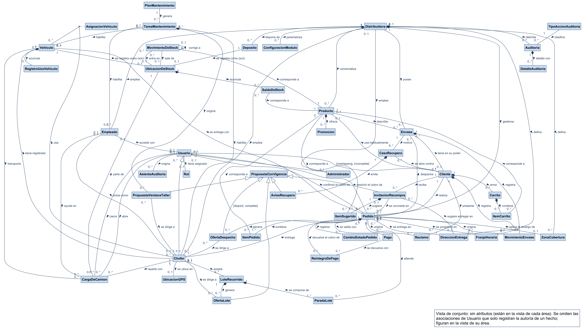

**Figura 2 — Modelo conceptual: usuarios y cuentas**

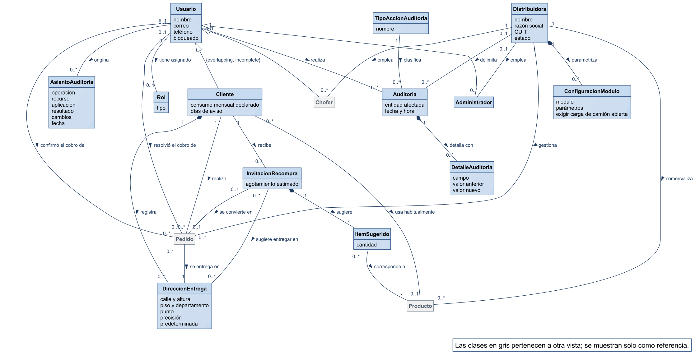

**Figura 3 — Modelo conceptual: pedidos y pagos**

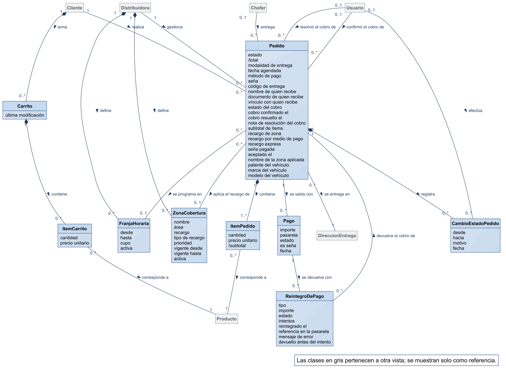

**Figura 4 — Modelo conceptual: despacho y propuestas con vigencia**

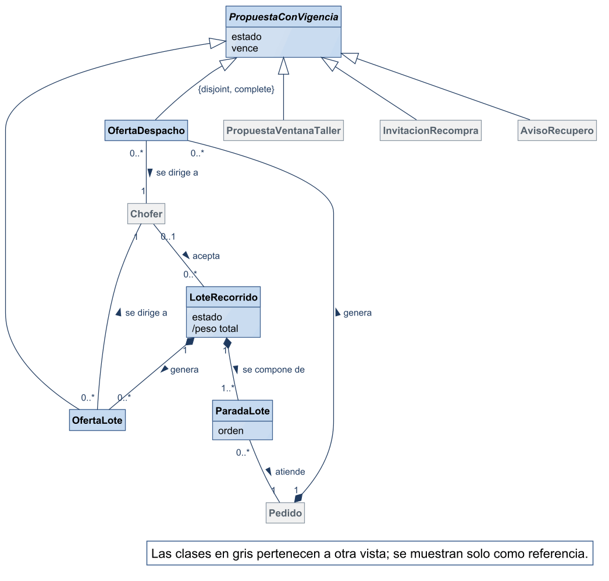

**Figura 5 — Modelo conceptual: flota y choferes**

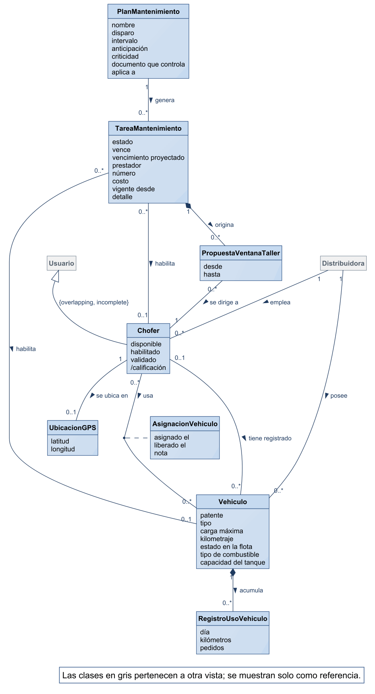

**Figura 6 — Modelo conceptual: envases y catálogo**

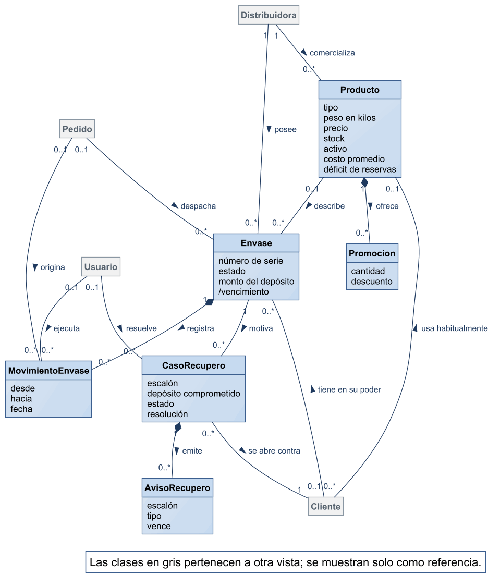

**Figura 7 — Modelo conceptual: stock, carga del camión y posventa**

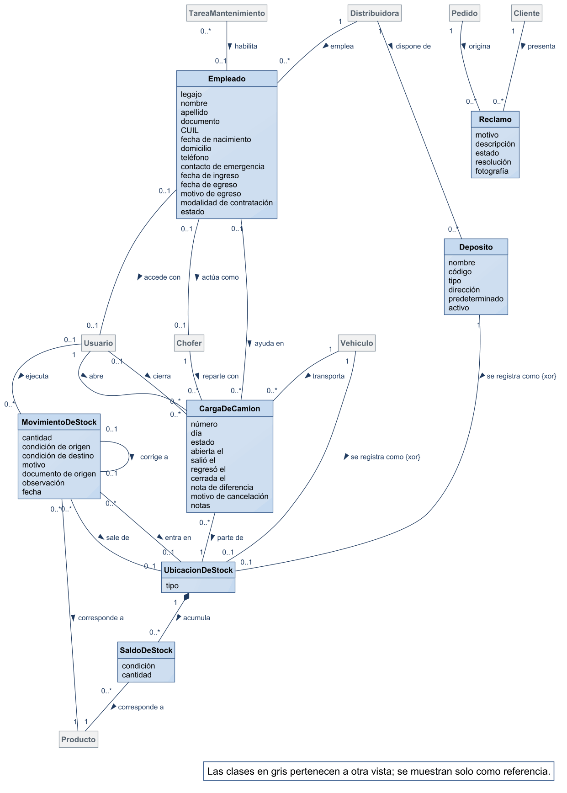

---

## 2. Comportamiento del Sistema

### 2.1 Diagramas de Secuencia a Nivel de Sistema

Los diagramas de secuencia muestran la interacción entre el actor y el sistema tratado como caja negra. El sistema se dibuja como la lifeline `:Sistema` y cada actor lleva el código del catálogo de actores (Cliente (ACT-01), Chofer (ACT-02), Administrador (ACT-03), Administrador General (ACT-05), MercadoPago (ACT-06), Firebase (ACT-07)). Los mensajes del actor al sistema son las operaciones del sistema, con una única firma; el sistema responde con un retorno punteado. Lo que el sistema le envía a un actor sin que lo haya pedido, como un aviso, se dibuja como mensaje asíncrono con nombre (`notificarOferta(pedido)`).

Llevan diagrama los casos con interacción del actor, donde el sistema reacciona de manera distinta según lo que el actor ingresa o decide. Los procesos automáticos, que no tienen eventos del actor, y los comportamientos lineales o estáticos, que resuelve una sola clase, no llevan diagrama de secuencia: se nombran en la tabla siguiente, con su motivo.

#### Casos de uso sin DSS

| Caso de uso | Tipo | Motivo |
|---|---|---|
| CU-022 Activar la Disponibilidad | Lineal | el chofer sólo cambia su disponibilidad: una única secuencia, sin decisiones del actor. |
| CU-292 Confirmar el Cobro en Efectivo | Lineal | el chofer confirma que cobró; la secuencia es única y el sistema no reacciona distinto según lo que ingrese. |
| CU-023 Registrar un Reclamo | Lineal | el cliente completa un formulario y el sistema crea el reclamo; no hay variantes del comportamiento. |
| CU-013 Asignar un Pedido Automáticamente por Proximidad | Automático | lo dispara la creación del pedido, sin eventos del actor. |
| CU-014 Vencer la Oferta y Ofrecer al Siguiente Chofer | Automático | proceso periódico del sistema, sin eventos del actor. |
| CU-017 Modificar la Ubicación GPS del Chofer | Estático | el sistema sólo registra la posición informada por el dispositivo; lo resuelve una sola clase. |
| CU-105 Planificar el Mantenimiento y las Habilitaciones de la Flota | Automático | proceso diario del sistema; las respuestas del chofer y del administrador son decisiones sobre propuestas ya emitidas. |
| CU-106 Anticipar la Recompra por Consumo Estimado | Automático | proceso diario del sistema, sin eventos del actor. |
| CU-107 Agrupar Pedidos por Recorrido | Administrador y automático | el sistema propone las hojas al cierre; el administrador las revisa, ajusta y confirma (o se confirman solas). |
| CU-108 Recuperar Envases No Devueltos | Automático | proceso periódico del sistema, sin eventos del actor. |
| CU-152 Consultar el Registro de Auditoría | Estático | es una consulta que no modifica nada: la resuelve una sola clase. |

#### DSS — CU-001: Iniciar Sesión

**Actor:** Cliente (ACT-01), Chofer (ACT-02), Administrador (ACT-03)  
**Operación del sistema:** `iniciarSesion(correo, contrasena)`

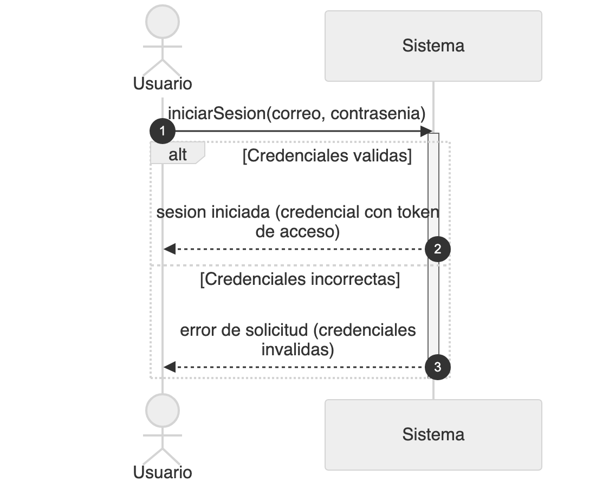

**Figura 8 — DSS CU-001: Iniciar Sesión**

Ver código del diagrama

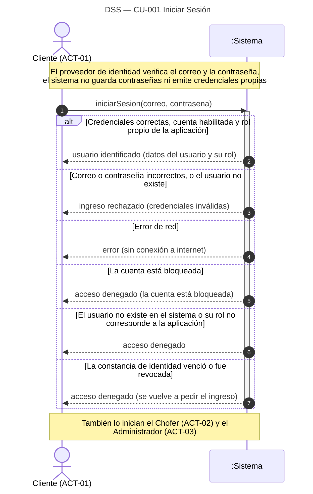
```mermaid
sequenceDiagram
    title DSS — CU-001 Iniciar Sesión
    autonumber
    actor USR as Cliente (ACT-01)
    participant SIS as :Sistema

    Note over USR,SIS: El proveedor de identidad verifica el correo y la contraseña,<br/>el sistema no guarda contraseñas ni emite credenciales propias
    USR->>SIS: iniciarSesion(correo, contrasena)
    activate SIS
    alt Credenciales correctas, cuenta habilitada y rol propio de la aplicación
        SIS-->>USR: usuario identificado (datos del usuario y su rol)
    else Correo o contraseña incorrectos, o el usuario no existe
        SIS-->>USR: ingreso rechazado (credenciales inválidas)
    else Error de red
        SIS-->>USR: error (sin conexión a internet)
    else La cuenta está bloqueada
        SIS-->>USR: acceso denegado (la cuenta está bloqueada)
    else El usuario no existe en el sistema o su rol no corresponde a la aplicación
        SIS-->>USR: acceso denegado
    else La constancia de identidad venció o fue revocada
        SIS-->>USR: acceso denegado (se vuelve a pedir el ingreso)
    end
    deactivate SIS
    Note over USR,SIS: También lo inician el Chofer (ACT-02) y el<br/>Administrador (ACT-03)
```

#### DSS — CU-002: Registrarse como Cliente

**Actor:** Cliente (ACT-01)  
**Operación del sistema:** `registrarse(nombreCompleto, correo, telefono, contrasena, datosDelCliente)`

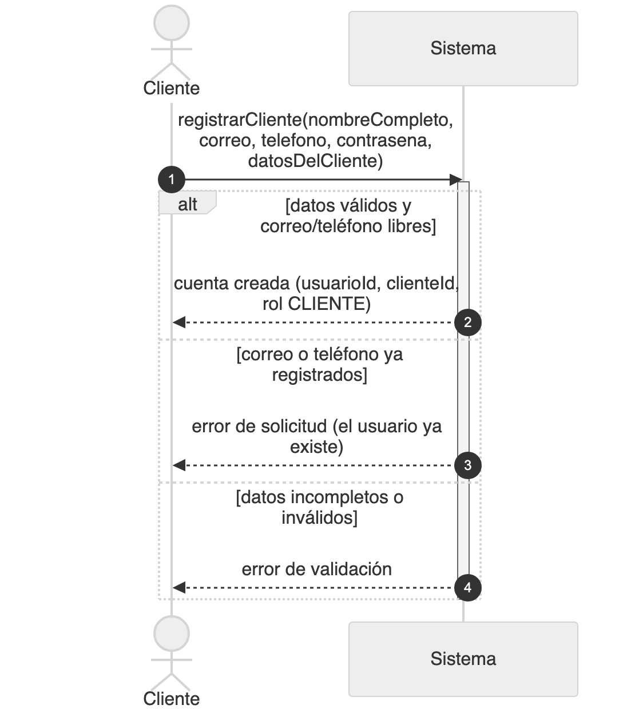

**Figura 9 — DSS CU-002: Registrarse como Cliente**

Ver código del diagrama

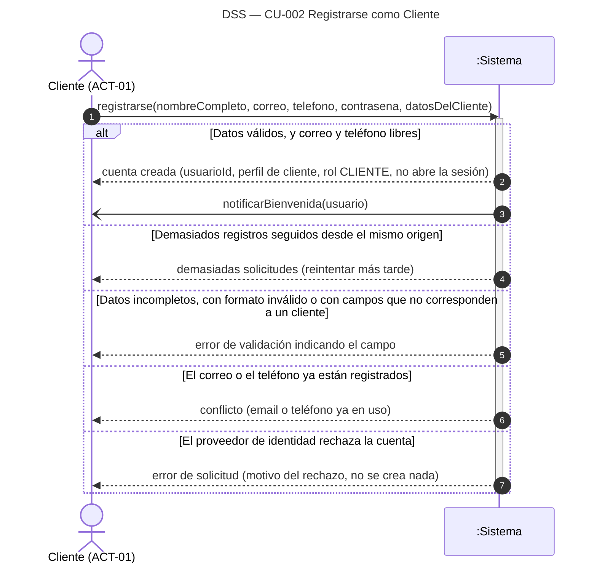
```mermaid
sequenceDiagram
    title DSS — CU-002 Registrarse como Cliente
    autonumber
    actor CLI as Cliente (ACT-01)
    participant SIS as :Sistema

    CLI->>SIS: registrarse(nombreCompleto, correo, telefono, contrasena, datosDelCliente)
    activate SIS
    alt Datos válidos, y correo y teléfono libres
        SIS-->>CLI: cuenta creada (usuarioId, perfil de cliente, rol CLIENTE, no abre la sesión)
        SIS-)CLI: notificarBienvenida(usuario)
    else Demasiados registros seguidos desde el mismo origen
        SIS-->>CLI: demasiadas solicitudes (reintentar más tarde)
    else Datos incompletos, con formato inválido o con campos que no corresponden a un cliente
        SIS-->>CLI: error de validación indicando el campo
    else El correo o el teléfono ya están registrados
        SIS-->>CLI: conflicto (email o teléfono ya en uso)
    else El proveedor de identidad rechaza la cuenta
        SIS-->>CLI: error de solicitud (motivo del rechazo, no se crea nada)
    end
    deactivate SIS
```

#### DSS — CU-005: Crear un Pedido

**Actor:** Cliente (ACT-01), Administrador (ACT-03)  
**Operación del sistema:** `crearPedido(items, direccionId, franjaId, fechaAgendada, metodoDePago)`

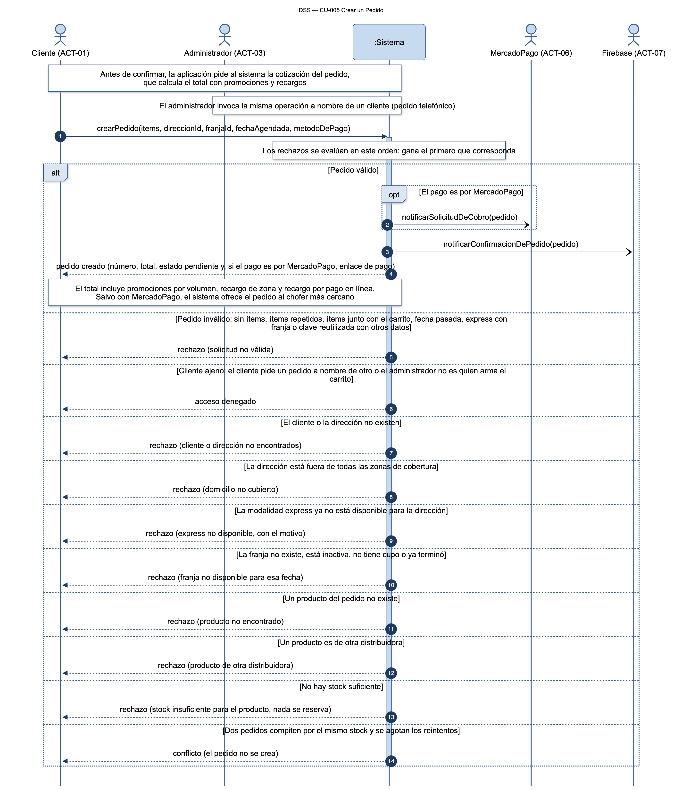

**Figura 10 — DSS CU-005: Crear un Pedido**

Ver código del diagrama

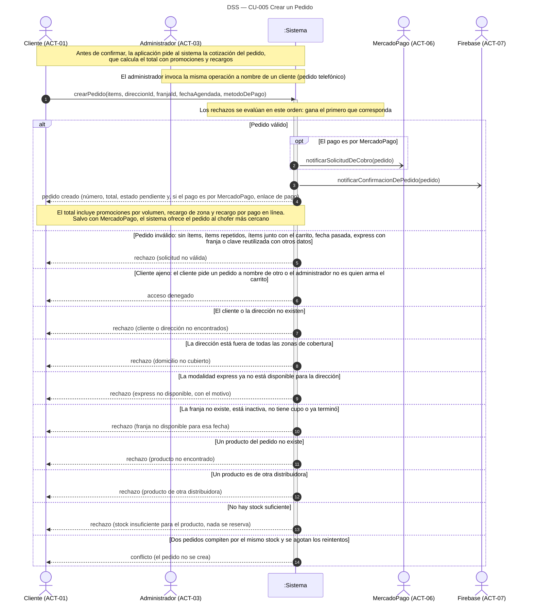
```mermaid
sequenceDiagram
    title DSS — CU-005 Crear un Pedido
    autonumber
    actor CLI as Cliente (ACT-01)
    actor ADM as Administrador (ACT-03)
    participant SIS as :Sistema
    actor MPA as MercadoPago (ACT-06)
    actor FIR as Firebase (ACT-07)

    Note over CLI,SIS: Antes de confirmar, la aplicación pide al sistema la cotización del pedido,<br/>que calcula el total con promociones y recargos
    Note over ADM,SIS: El administrador invoca la misma operación a nombre de un cliente (pedido telefónico)
    CLI->>SIS: crearPedido(items, direccionId, franjaId, fechaAgendada, metodoDePago)
    activate SIS
    Note over SIS: Los rechazos se evalúan en este orden: gana el primero que corresponda
    alt Pedido válido
        opt El pago es por MercadoPago
            SIS-)MPA: notificarSolicitudDeCobro(pedido)
        end
        SIS-)FIR: notificarConfirmacionDePedido(pedido)
        SIS-->>CLI: pedido creado (número, total, estado pendiente y, si el pago es por MercadoPago, enlace de pago)
        Note over CLI,SIS: El total incluye promociones por volumen, recargo de zona y recargo por pago en línea.<br/>Salvo con MercadoPago, el sistema ofrece el pedido al chofer más cercano
    else Pedido inválido: sin ítems, ítems repetidos, ítems junto con el carrito, fecha pasada, express con franja o clave reutilizada con otros datos
        SIS-->>CLI: rechazo (solicitud no válida)
    else Cliente ajeno: el cliente pide un pedido a nombre de otro o el administrador no es quien arma el carrito
        SIS-->>CLI: acceso denegado
    else El cliente o la dirección no existen
        SIS-->>CLI: rechazo (cliente o dirección no encontrados)
    else La dirección está fuera de todas las zonas de cobertura
        SIS-->>CLI: rechazo (domicilio no cubierto)
    else La modalidad express ya no está disponible para la dirección
        SIS-->>CLI: rechazo (express no disponible, con el motivo)
    else La franja no existe, está inactiva, no tiene cupo o ya terminó
        SIS-->>CLI: rechazo (franja no disponible para esa fecha)
    else Un producto del pedido no existe
        SIS-->>CLI: rechazo (producto no encontrado)
    else Un producto es de otra distribuidora
        SIS-->>CLI: rechazo (producto de otra distribuidora)
    else No hay stock suficiente
        SIS-->>CLI: rechazo (stock insuficiente para el producto, nada se reserva)
    else Dos pedidos compiten por el mismo stock y se agotan los reintentos
        SIS-->>CLI: conflicto (el pedido no se crea)
    end
    deactivate SIS
```

#### DSS — CU-008: Cancelar un Pedido (Cliente)

**Actor:** Cliente (ACT-01)  
**Operación del sistema:** `cancelarMiPedido(pedidoId, motivo)`

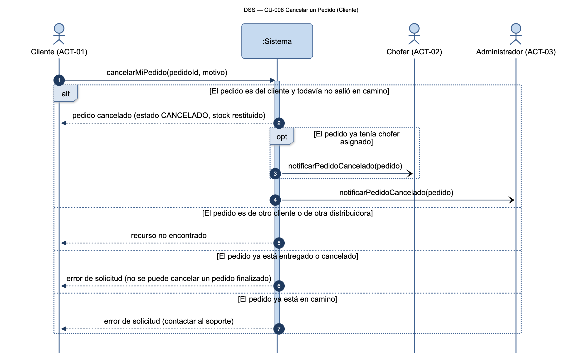

**Figura 11 — DSS CU-008: Cancelar un Pedido (Cliente)**

Ver código del diagrama

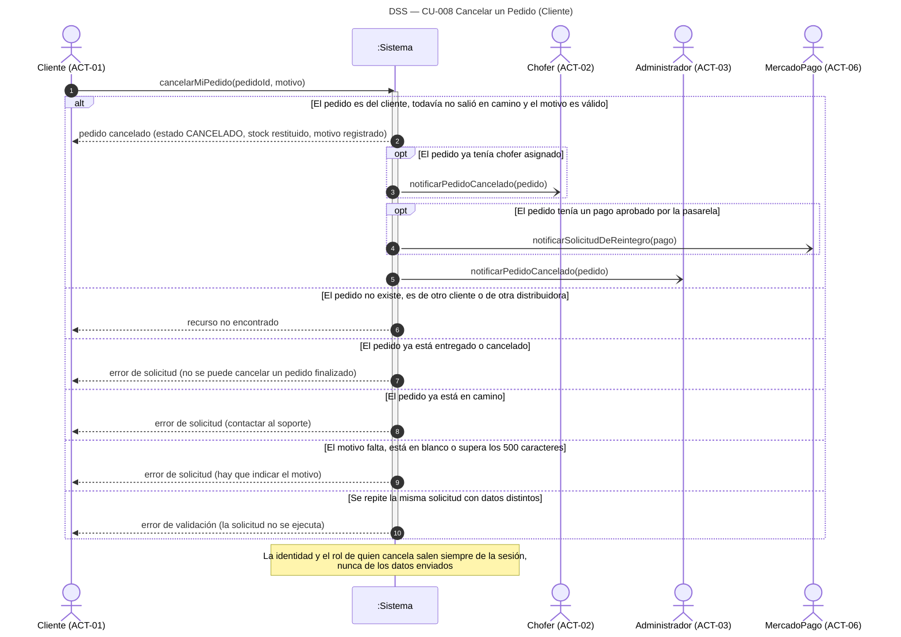
```mermaid
sequenceDiagram
    title DSS — CU-008 Cancelar un Pedido (Cliente)
    autonumber
    actor CLI as Cliente (ACT-01)
    participant SIS as :Sistema
    actor CHO as Chofer (ACT-02)
    actor ADM as Administrador (ACT-03)
    actor MPA as MercadoPago (ACT-06)

    CLI->>SIS: cancelarMiPedido(pedidoId, motivo)
    activate SIS
    alt El pedido es del cliente, todavía no salió en camino y el motivo es válido
        SIS-->>CLI: pedido cancelado (estado CANCELADO, stock restituido, motivo registrado)
        opt El pedido ya tenía chofer asignado
            SIS-)CHO: notificarPedidoCancelado(pedido)
        end
        opt El pedido tenía un pago aprobado por la pasarela
            SIS-)MPA: notificarSolicitudDeReintegro(pago)
        end
        SIS-)ADM: notificarPedidoCancelado(pedido)
    else El pedido no existe, es de otro cliente o de otra distribuidora
        SIS-->>CLI: recurso no encontrado
    else El pedido ya está entregado o cancelado
        SIS-->>CLI: error de solicitud (no se puede cancelar un pedido finalizado)
    else El pedido ya está en camino
        SIS-->>CLI: error de solicitud (contactar al soporte)
    else El motivo falta, está en blanco o supera los 500 caracteres
        SIS-->>CLI: error de solicitud (hay que indicar el motivo)
    else Se repite la misma solicitud con datos distintos
        SIS-->>CLI: error de validación (la solicitud no se ejecuta)
    end
    deactivate SIS
    Note over SIS: La identidad y el rol de quien cancela salen siempre de la sesión,<br/>nunca de los datos enviados
```

#### DSS — CU-015: Aceptar un Pedido

**Actor:** Chofer (ACT-02)  
**Operación del sistema:** `aceptarPedido(pedidoId)`

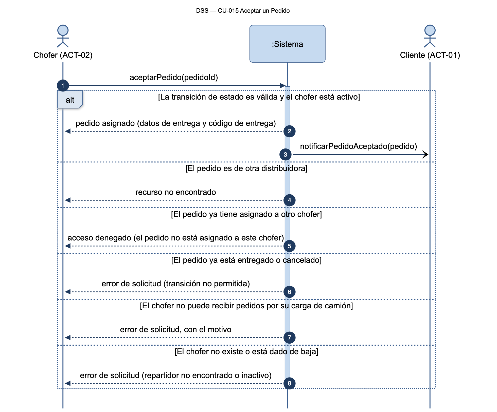

**Figura 12 — DSS CU-015: Aceptar un Pedido**

Ver código del diagrama

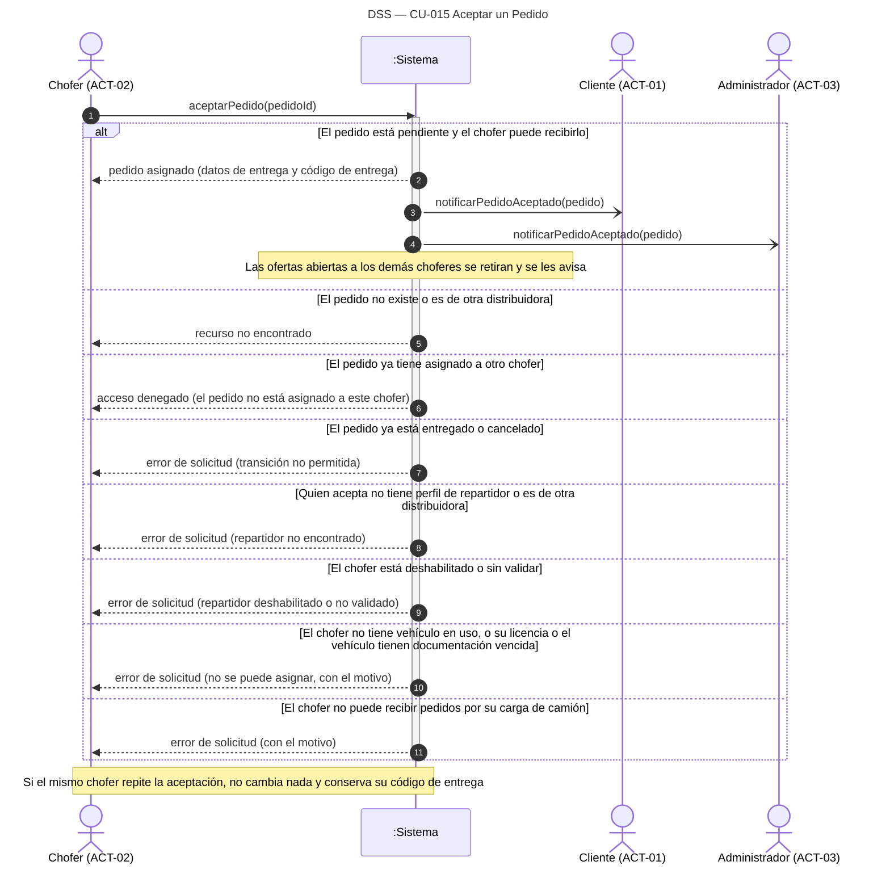
```mermaid
sequenceDiagram
    title DSS — CU-015 Aceptar un Pedido
    autonumber
    actor CHO as Chofer (ACT-02)
    participant SIS as :Sistema
    actor CLI as Cliente (ACT-01)
    actor ADM as Administrador (ACT-03)

    CHO->>SIS: aceptarPedido(pedidoId)
    activate SIS
    alt El pedido está pendiente y el chofer puede recibirlo
        SIS-->>CHO: pedido asignado (datos de entrega y código de entrega)
        SIS-)CLI: notificarPedidoAceptado(pedido)
        SIS-)ADM: notificarPedidoAceptado(pedido)
        Note over SIS: Las ofertas abiertas a los demás choferes se retiran y se les avisa
    else El pedido no existe o es de otra distribuidora
        SIS-->>CHO: recurso no encontrado
    else El pedido ya tiene asignado a otro chofer
        SIS-->>CHO: acceso denegado (el pedido no está asignado a este chofer)
    else El pedido ya está entregado o cancelado
        SIS-->>CHO: error de solicitud (transición no permitida)
    else Quien acepta no tiene perfil de repartidor o es de otra distribuidora
        SIS-->>CHO: error de solicitud (repartidor no encontrado)
    else El chofer está deshabilitado o sin validar
        SIS-->>CHO: error de solicitud (repartidor deshabilitado o no validado)
    else El chofer no tiene vehículo en uso, o su licencia o el vehículo tienen documentación vencida
        SIS-->>CHO: error de solicitud (no se puede asignar, con el motivo)
    else El chofer no puede recibir pedidos por su carga de camión
        SIS-->>CHO: error de solicitud (con el motivo)
    end
    deactivate SIS
    Note over CHO,SIS: Si el mismo chofer repite la aceptación, no cambia nada y conserva su código de entrega
```

#### DSS — CU-078: Consultar el Código de Entrega (QR del chofer)

**Actor:** Chofer (ACT-02), Administrador (ACT-03)  
**Operación del sistema:** `obtenerCodigoDeEntrega(pedidoId)`

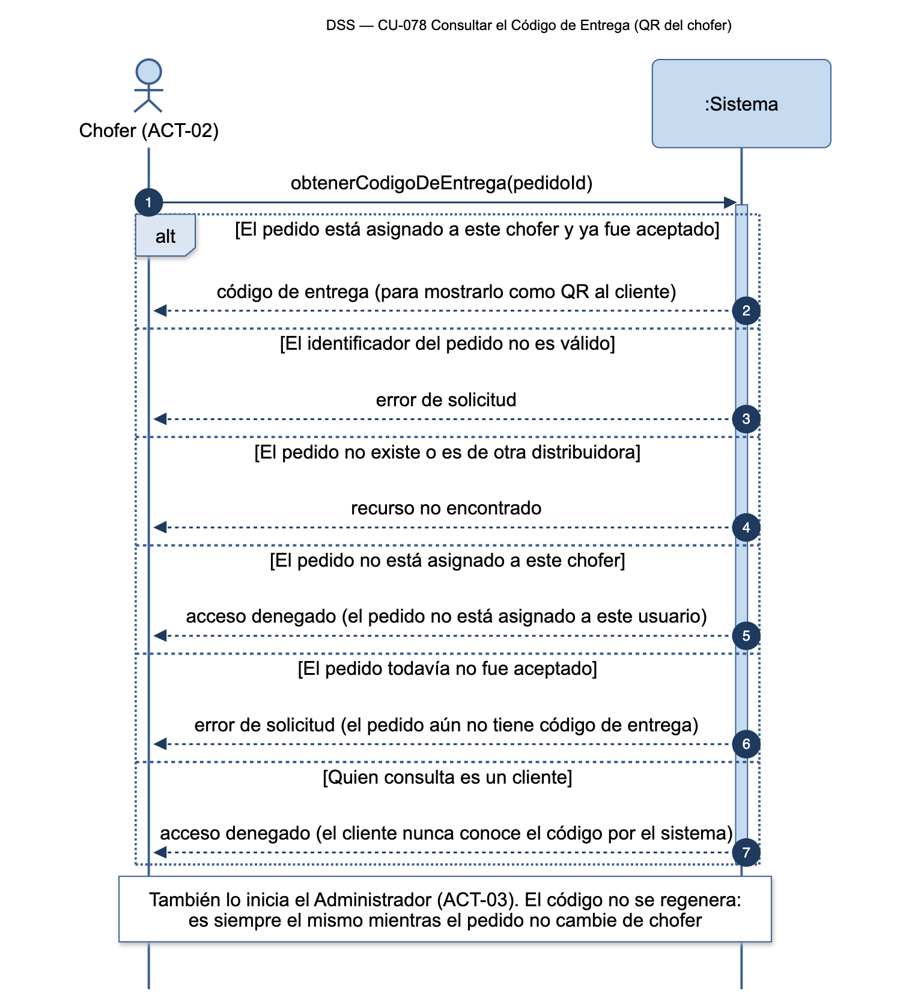

**Figura 13 — DSS CU-078: Consultar el Código de Entrega (QR del chofer)**

Ver código del diagrama

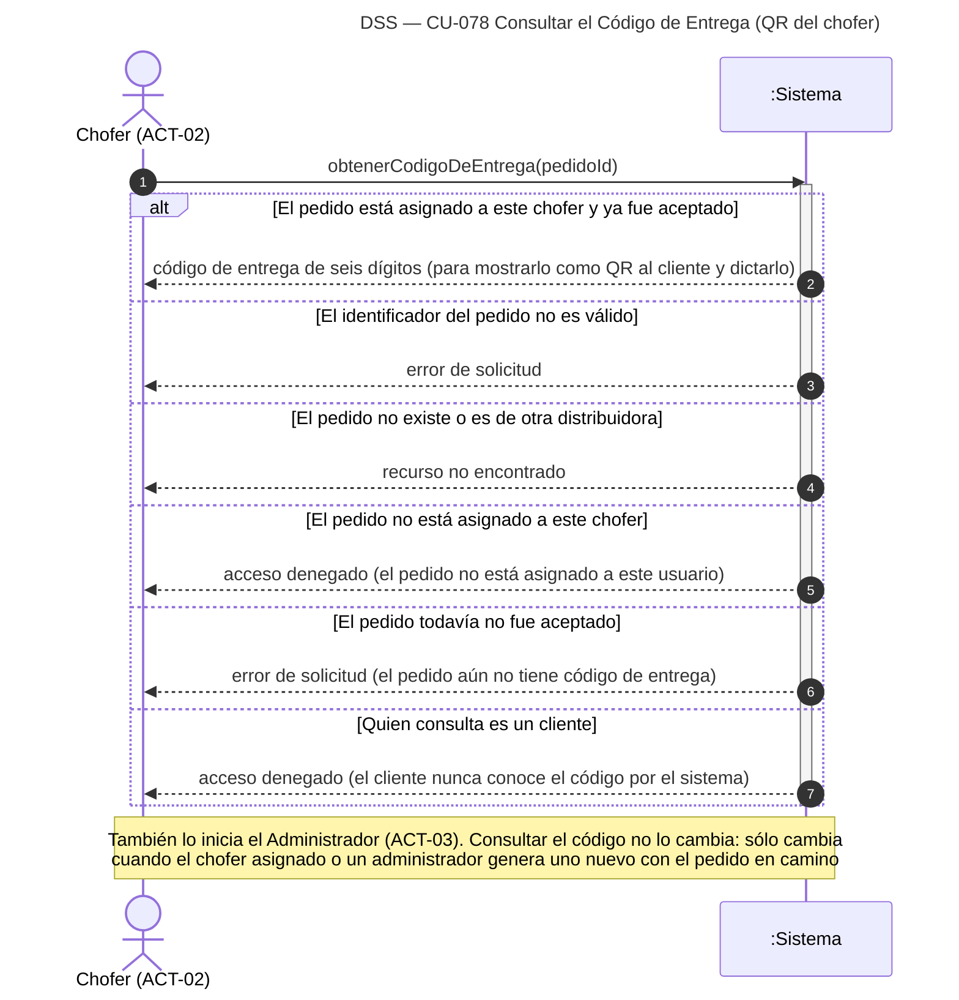
```mermaid
sequenceDiagram
    title DSS — CU-078 Consultar el Código de Entrega (QR del chofer)
    autonumber
    actor CHO as Chofer (ACT-02)
    participant SIS as :Sistema

    CHO->>SIS: obtenerCodigoDeEntrega(pedidoId)
    activate SIS
    alt El pedido está asignado a este chofer y ya fue aceptado
        SIS-->>CHO: código de entrega de seis dígitos (para mostrarlo como QR al cliente y dictarlo)
    else El identificador del pedido no es válido
        SIS-->>CHO: error de solicitud
    else El pedido no existe o es de otra distribuidora
        SIS-->>CHO: recurso no encontrado
    else El pedido no está asignado a este chofer
        SIS-->>CHO: acceso denegado (el pedido no está asignado a este usuario)
    else El pedido todavía no fue aceptado
        SIS-->>CHO: error de solicitud (el pedido aún no tiene código de entrega)
    else Quien consulta es un cliente
        SIS-->>CHO: acceso denegado (el cliente nunca conoce el código por el sistema)
    end
    deactivate SIS
    Note over CHO,SIS: También lo inicia el Administrador (ACT-03). Consultar el código no lo cambia: sólo cambia<br/>cuando el chofer asignado o un administrador genera uno nuevo con el pedido en camino
```

#### DSS — CU-079: Confirmar una Entrega Escaneando el QR (cliente)

**Actor:** Cliente (ACT-01), Administrador (ACT-03)  
**Operación del sistema:** `confirmarEntregaConCodigo(pedidoId, codigo, motivo)`

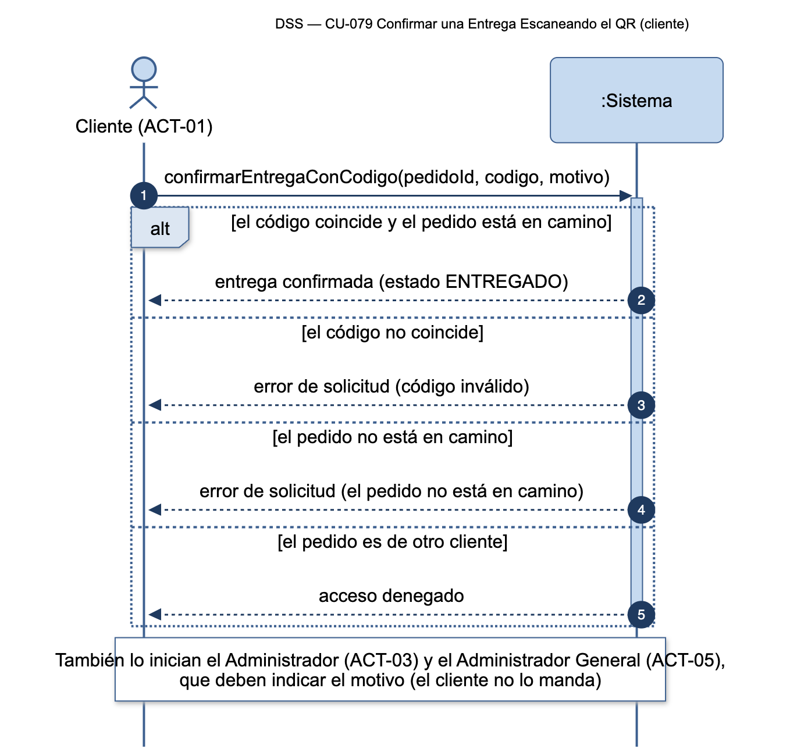

**Figura 14 — DSS CU-079: Confirmar una Entrega Escaneando el QR (cliente)**

Ver código del diagrama

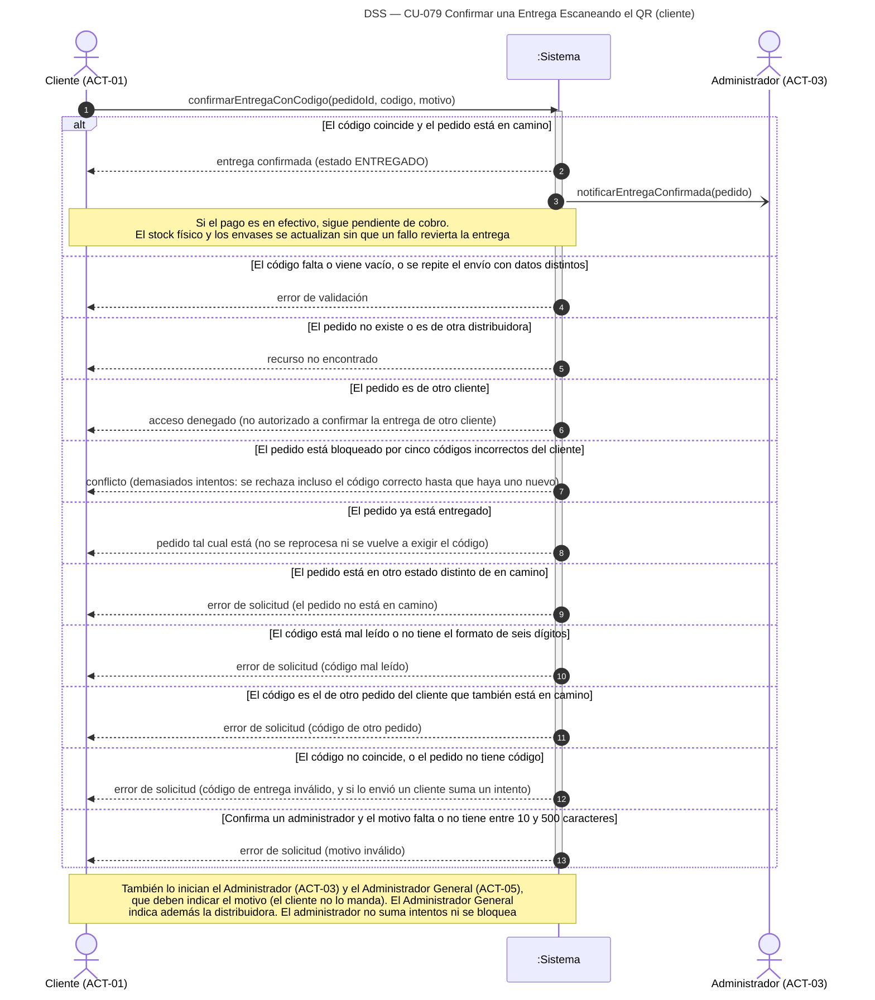
```mermaid
sequenceDiagram
    title DSS — CU-079 Confirmar una Entrega Escaneando el QR (cliente)
    autonumber
    actor CLI as Cliente (ACT-01)
    participant SIS as :Sistema
    actor ADM as Administrador (ACT-03)

    CLI->>SIS: confirmarEntregaConCodigo(pedidoId, codigo, motivo)
    activate SIS
    alt El código coincide y el pedido está en camino
        SIS-->>CLI: entrega confirmada (estado ENTREGADO)
        SIS-)ADM: notificarEntregaConfirmada(pedido)
        Note over CLI,SIS: Si el pago es en efectivo, sigue pendiente de cobro.<br/>El stock físico y los envases se actualizan sin que un fallo revierta la entrega
    else El código falta o viene vacío, o se repite el envío con datos distintos
        SIS-->>CLI: error de validación
    else El pedido no existe o es de otra distribuidora
        SIS-->>CLI: recurso no encontrado
    else El pedido es de otro cliente
        SIS-->>CLI: acceso denegado (no autorizado a confirmar la entrega de otro cliente)
    else El pedido está bloqueado por cinco códigos incorrectos del cliente
        SIS-->>CLI: conflicto (demasiados intentos: se rechaza incluso el código correcto hasta que haya uno nuevo)
    else El pedido ya está entregado
        SIS-->>CLI: pedido tal cual está (no se reprocesa ni se vuelve a exigir el código)
    else El pedido está en otro estado distinto de en camino
        SIS-->>CLI: error de solicitud (el pedido no está en camino)
    else El código está mal leído o no tiene el formato de seis dígitos
        SIS-->>CLI: error de solicitud (código mal leído)
    else El código es el de otro pedido del cliente que también está en camino
        SIS-->>CLI: error de solicitud (código de otro pedido)
    else El código no coincide, o el pedido no tiene código
        SIS-->>CLI: error de solicitud (código de entrega inválido, y si lo envió un cliente suma un intento)
    else Confirma un administrador y el motivo falta o no tiene entre 10 y 500 caracteres
        SIS-->>CLI: error de solicitud (motivo inválido)
    end
    deactivate SIS
    Note over CLI,SIS: También lo inician el Administrador (ACT-03) y el Administrador General (ACT-05),<br/>que deben indicar el motivo (el cliente no lo manda). El Administrador General<br/>indica además la distribuidora. El administrador no suma intentos ni se bloquea
```

#### DSS — CU-301: Confirmar una Transferencia

**Actor:** Administrador (ACT-03)  
**Operación del sistema:** `confirmarTransferencia(pedidoId, recibida, motivo)`

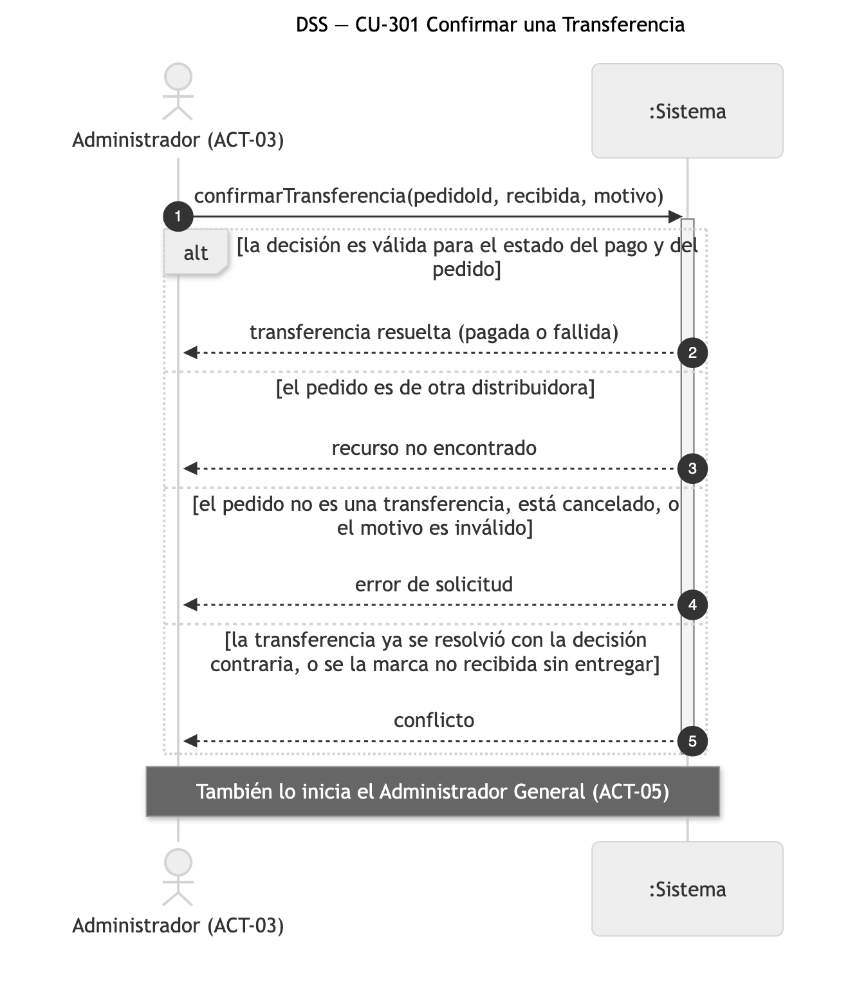

**Figura 15 — DSS CU-301: Confirmar una Transferencia**

Ver código del diagrama

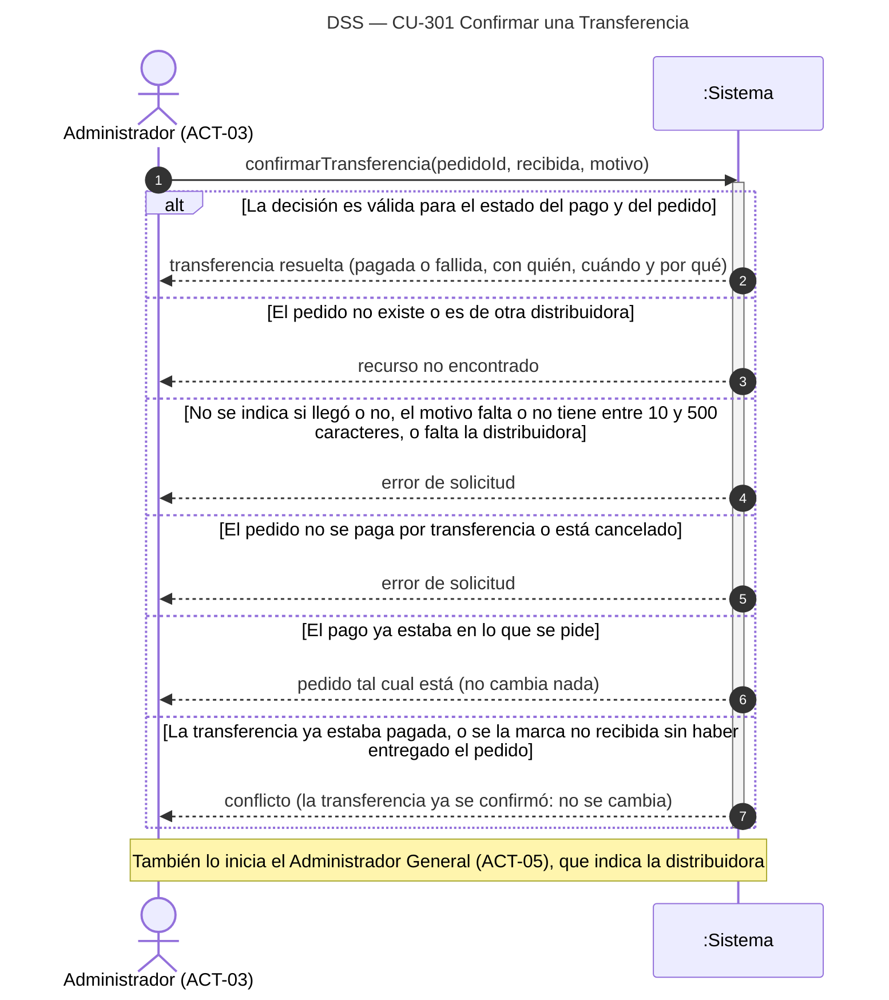
```mermaid
sequenceDiagram
    title DSS — CU-301 Confirmar una Transferencia
    autonumber
    actor ADM as Administrador (ACT-03)
    participant SIS as :Sistema

    ADM->>SIS: confirmarTransferencia(pedidoId, recibida, motivo)
    activate SIS
    alt La decisión es válida para el estado del pago y del pedido
        SIS-->>ADM: transferencia resuelta (pagada o fallida, con quién, cuándo y por qué)
    else El pedido no existe o es de otra distribuidora
        SIS-->>ADM: recurso no encontrado
    else No se indica si llegó o no, el motivo falta o no tiene entre 10 y 500 caracteres, o falta la distribuidora
        SIS-->>ADM: error de solicitud
    else El pedido no se paga por transferencia o está cancelado
        SIS-->>ADM: error de solicitud
    else El pago ya estaba en lo que se pide
        SIS-->>ADM: pedido tal cual está (no cambia nada)
    else La transferencia ya estaba pagada, o se la marca no recibida sin haber entregado el pedido
        SIS-->>ADM: conflicto (la transferencia ya se confirmó: no se cambia)
    end
    deactivate SIS
    Note over ADM,SIS: También lo inicia el Administrador General (ACT-05), que indica la distribuidora
```

#### DSS — CU-048: Procesar el Pago con MercadoPago

**Actor:** MercadoPago (ACT-06)  
**Operación del sistema:** `notificarResultadoDePago(tipoDeNotificacion, identificadorDelPago, firma)`

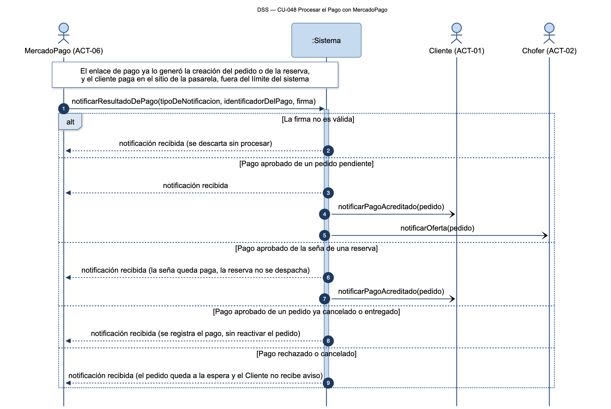

**Figura 16 — DSS CU-048: Procesar el Pago con MercadoPago**

Ver código del diagrama

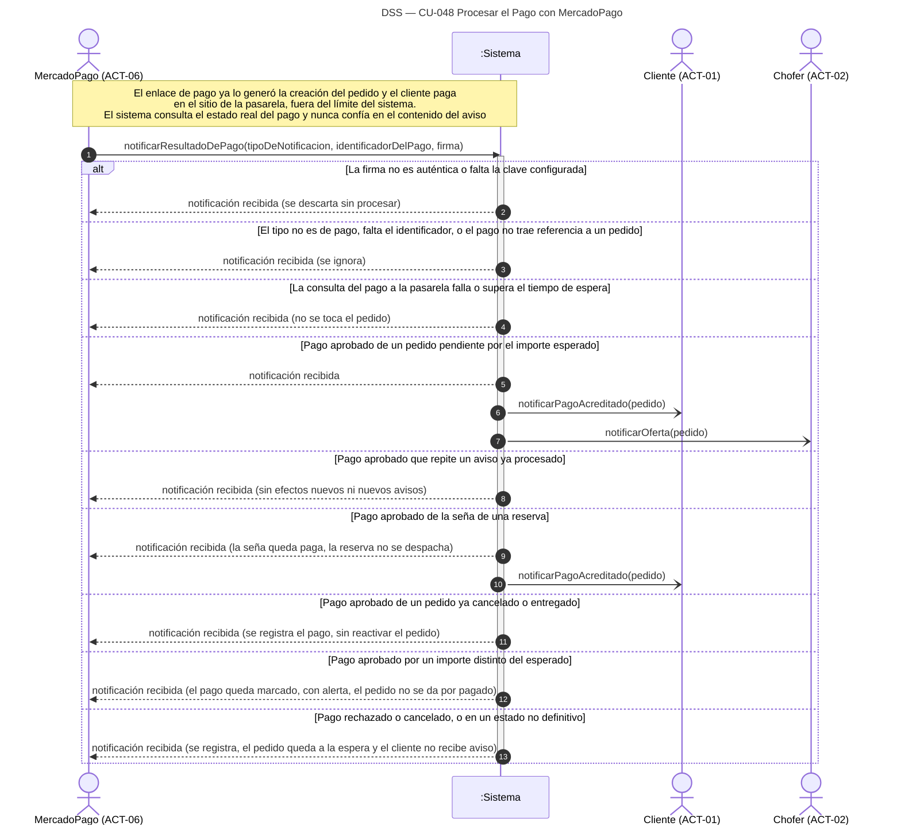
```mermaid
sequenceDiagram
    title DSS — CU-048 Procesar el Pago con MercadoPago
    autonumber
    actor MP as MercadoPago (ACT-06)
    participant SIS as :Sistema
    actor CLI as Cliente (ACT-01)
    actor CHO as Chofer (ACT-02)

    Note over MP,SIS: El enlace de pago ya lo generó la creación del pedido y el cliente paga<br/>en el sitio de la pasarela, fuera del límite del sistema.<br/>El sistema consulta el estado real del pago y nunca confía en el contenido del aviso
    MP->>SIS: notificarResultadoDePago(tipoDeNotificacion, identificadorDelPago, firma)
    activate SIS
    alt La firma no es auténtica o falta la clave configurada
        SIS-->>MP: notificación recibida (se descarta sin procesar)
    else El tipo no es de pago, falta el identificador, o el pago no trae referencia a un pedido
        SIS-->>MP: notificación recibida (se ignora)
    else La consulta del pago a la pasarela falla o supera el tiempo de espera
        SIS-->>MP: notificación recibida (no se toca el pedido)
    else Pago aprobado de un pedido pendiente por el importe esperado
        SIS-->>MP: notificación recibida
        SIS-)CLI: notificarPagoAcreditado(pedido)
        SIS-)CHO: notificarOferta(pedido)
    else Pago aprobado que repite un aviso ya procesado
        SIS-->>MP: notificación recibida (sin efectos nuevos ni nuevos avisos)
    else Pago aprobado de la seña de una reserva
        SIS-->>MP: notificación recibida (la seña queda paga, la reserva no se despacha)
        SIS-)CLI: notificarPagoAcreditado(pedido)
    else Pago aprobado de un pedido ya cancelado o entregado
        SIS-->>MP: notificación recibida (se registra el pago, sin reactivar el pedido)
    else Pago aprobado por un importe distinto del esperado
        SIS-->>MP: notificación recibida (el pago queda marcado, con alerta, el pedido no se da por pagado)
    else Pago rechazado o cancelado, o en un estado no definitivo
        SIS-->>MP: notificación recibida (se registra, el pedido queda a la espera y el cliente no recibe aviso)
    end
    deactivate SIS
```

#### DSS — CU-025: Resolver un Reclamo

**Actor:** Administrador (ACT-03)  
**Operación del sistema:** `resolverReclamo(reclamoId, resolucion, estadoFinal)`

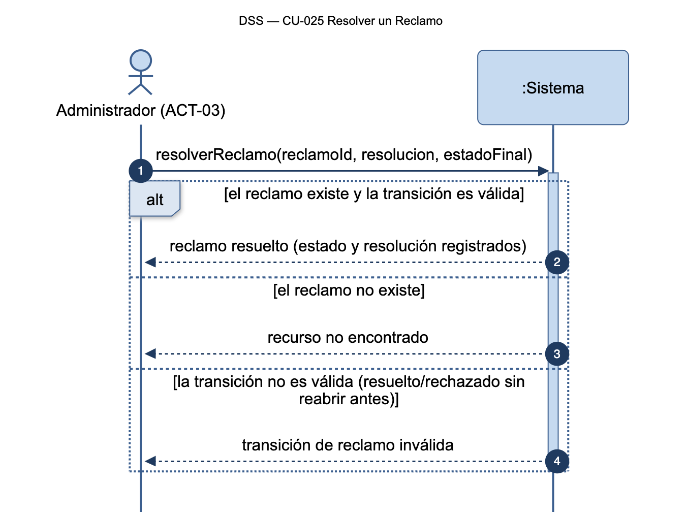

**Figura 17 — DSS CU-025: Resolver un Reclamo**

Ver código del diagrama

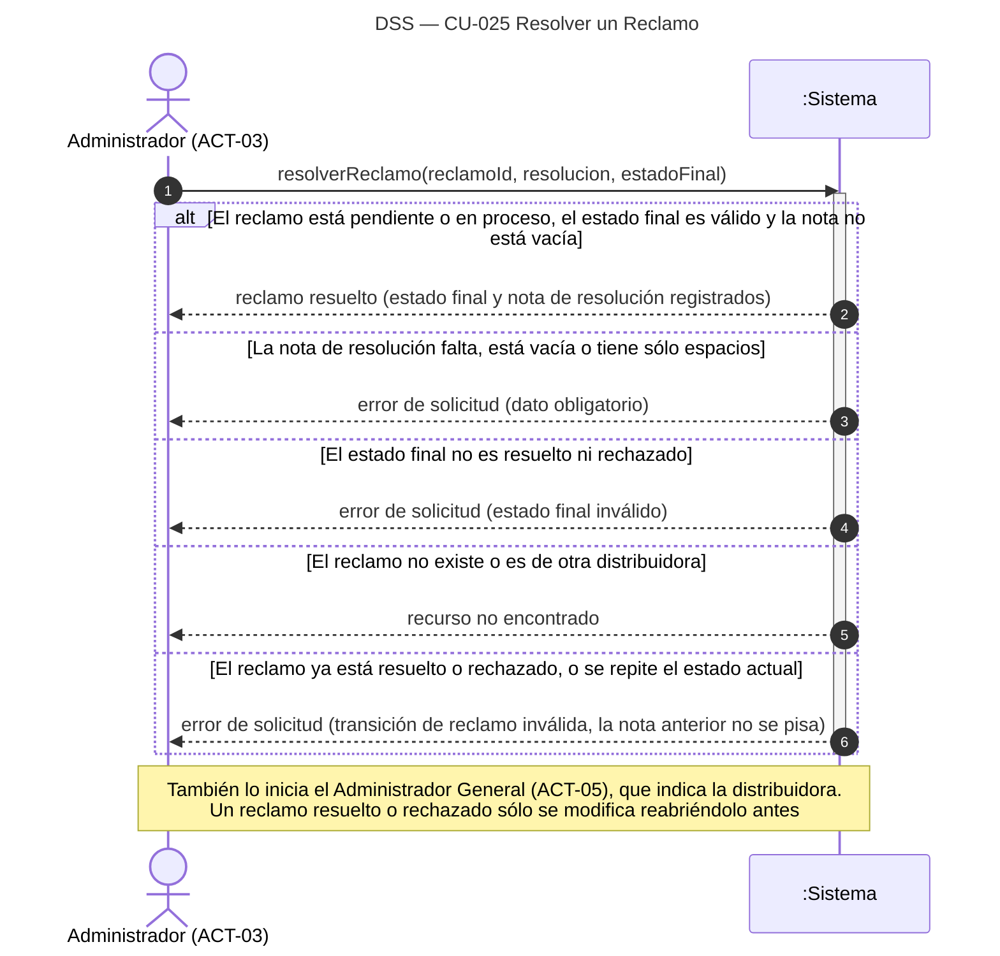
```mermaid
sequenceDiagram
    title DSS — CU-025 Resolver un Reclamo
    autonumber
    actor ADM as Administrador (ACT-03)
    participant SIS as :Sistema

    ADM->>SIS: resolverReclamo(reclamoId, resolucion, estadoFinal)
    activate SIS
    alt El reclamo está pendiente o en proceso, el estado final es válido y la nota no está vacía
        SIS-->>ADM: reclamo resuelto (estado final y nota de resolución registrados)
    else La nota de resolución falta, está vacía o tiene sólo espacios
        SIS-->>ADM: error de solicitud (dato obligatorio)
    else El estado final no es resuelto ni rechazado
        SIS-->>ADM: error de solicitud (estado final inválido)
    else El reclamo no existe o es de otra distribuidora
        SIS-->>ADM: recurso no encontrado
    else El reclamo ya está resuelto o rechazado, o se repite el estado actual
        SIS-->>ADM: error de solicitud (transición de reclamo inválida, la nota anterior no se pisa)
    end
    deactivate SIS
    Note over ADM,SIS: También lo inicia el Administrador General (ACT-05), que indica la distribuidora.<br/>Un reclamo resuelto o rechazado sólo se modifica reabriéndolo antes
```

---

### 2.2 Contratos de Operaciones del Sistema

Un contrato describe el efecto de una operación del sistema sobre el modelo conceptual (ver «Modelo Conceptual»). Sus **postcondiciones** se expresan en esos términos: la instancia que se creó o se eliminó, la asociación que se formó o se rompió, el atributo que se modificó. Hay un contrato por cada operación que cambia el estado del sistema en los diez casos de uso con diagrama de secuencia. Las dos operaciones de consulta, `iniciarSesion` (CU-001) y `obtenerCodigoDeEntrega` (CU-078), no llevan contrato: no crean, eliminan ni modifican nada del modelo conceptual.

#### Crítico Contrato: `registrarse()`

| Campo | Detalle |
|-------|---------|
| **Nombre** | `registrarse(nombreCompleto cadena, correo cadena, telefono cadena, contrasena cadena, datosDelCliente registro)` |
| **Responsabilidades** | Dar de alta a un nuevo Cliente desde su aplicación: crear la cuenta de acceso y el perfil, sin abrir la sesión. |
| **Tipo** | Sistema |
| **Referencias cruzadas** | Casos de uso: CU-002. Funciones: IRQ-01, OBJ-01. |
| **Notas** | Es la única alta pública: siempre crea un Cliente y nunca otro rol, y rechaza cualquier dato que no corresponda al registro de un cliente, como un rol o una distribuidora. Después del registro el cliente inicia sesión por separado. Se le envía un correo de bienvenida; si el envío falla, el registro queda hecho igual. Si el perfil no se puede guardar, se deshace todo y no queda ninguna cuenta a medias. |
| **Excepciones** | Si el origen superó el máximo de registros por minuto → error de límite de solicitudes. Si falta algún dato, no tiene el formato esperado o sobra alguno → error de solicitud con el detalle del campo. Si el correo o el teléfono ya están en uso → conflicto, y no se modifica la cuenta existente. Si el proveedor de identidad rechaza la cuenta → error de solicitud y no se crea nada. |
| **Salida** | Los datos del Usuario creado: identificador, rol, correo y perfil de cliente. |
| **Precondiciones** | El solicitante todavía no tiene sesión iniciada. |
| **Postcondiciones** | Se creó una instancia de Usuario, con el rol Cliente, y una instancia de Cliente asociada a él. |

#### Crítico Contrato: `crearPedido()`

| Campo | Detalle |
|-------|---------|
| **Nombre** | `crearPedido(items lista, direccionId identificador, franjaId identificador, fechaAgendada fecha, metodoDePago cadena)` |
| **Responsabilidades** | Crear un pedido reservando el stock y el cupo de la franja de forma conjunta, calcular el total con promociones y recargos, y ofrecerlo a un chofer salvo que el pago sea por MercadoPago. |
| **Tipo** | Sistema |
| **Referencias cruzadas** | Casos de uso: CU-005. Funciones: IRQ-02, IRQ-04, IRQ-05, IRQ-07, IRQ-08, IRQ-10, OBJ-01, OBJ-02, OBJ-06, OBJ-07. |
| **Notas** | Lo invoca el Cliente con los ítems de su Carrito o el Administrador, por teléfono y a nombre de un Cliente, con los ítems que informa. Los precios, las promociones y los recargos los calcula siempre el sistema, nunca la aplicación. El total incluye las promociones por volumen, el recargo de la zona de cobertura y, si el pago es en línea (MercadoPago o transferencia), un recargo del 10 %. Si el medio de pago es MercadoPago, el sistema registra el intento de cobro y le pide a la pasarela el enlace de pago; el pedido no se ofrece a ningún chofer hasta que la pasarela confirme el cobro. Si el cliente reintenta con la misma clave de solicitud y los mismos datos, no se crea un segundo pedido. Al confirmarse el pedido se avisa al cliente y al panel de administración; si el aviso falla, el pedido queda creado igual. |
| **Excepciones** | Si un Cliente pide un pedido a nombre de otro, o si el pedido sale del Carrito y quien opera no es el Cliente → acceso denegado. Si el pedido sale del Carrito y trae además ítems, no trae ningún ítem, repite una misma garrafa en dos renglones, trae una fecha agendada anterior a hoy, o es express y trae franja o fecha → error de solicitud. Si el cliente o la dirección no existen → recurso no encontrado. Si la dirección está fuera de todas las zonas de cobertura → error de solicitud (domicilio no cubierto), antes de tocar el stock. Si el pedido es express y la modalidad dejó de estar disponible para la dirección → conflicto, con el motivo. Si la franja no existe, está inactiva, no tiene cupo para esa fecha o es de hoy y ya terminó → error de solicitud (franja no disponible). Si un producto no existe → recurso no encontrado. Si un producto no es de la distribuidora → error de solicitud. Si el stock de algún ítem es insuficiente → la operación se revierte por completo, el pedido no se crea y se informa el producto. Si dos pedidos compiten por el mismo stock → la operación se reintenta completa y, agotados los reintentos, se informa un conflicto. Si se reintenta la misma solicitud con datos distintos → la operación no se ejecuta. |
| **Salida** | El pedido creado con sus ítems (número, total y estado pendiente) y, si corresponde, el enlace de pago. |
| **Precondiciones** | El solicitante —el Cliente o el Administrador que carga el pedido a su nombre— está identificado. |
| **Postcondiciones** | Se creó una instancia de Pedido, en estado «pendiente», asociada al Cliente que lo realizó, a la DireccionEntrega elegida y, si se indicó, a la FranjaHoraria. Si la Distribuidora tiene zonas de cobertura y una cubre la dirección, el Pedido quedó asociado a esa ZonaCobertura y guardó una copia de su nombre y de su recargo, de modo que el total queda fijo aunque la zona se edite después. Los atributos subtotal de ítems, recargo de zona y recargo por medio de pago del Pedido tomaron sus valores. Se crearon las instancias de ItemPedido, cada una asociada a su Producto, con el precio unitario —con las promociones por volumen ya aplicadas— y el subtotal. El atributo stock de cada Producto pedido disminuyó en la cantidad pedida. Se creó una instancia de CambioEstadoPedido asociada al Pedido, sin estado de origen y con estado de destino «pendiente». Si los ítems salieron del Carrito, se eliminaron las instancias de ItemCarrito del Cliente. Si el medio de pago es MercadoPago, se creó una instancia de Pago, en estado «pendiente», asociada al Pedido, con el importe del intento y el enlace de pago. Si el medio de pago no es MercadoPago y hubo un Chofer elegible, se creó una instancia de OfertaDespacho asociada al Pedido y dirigida al Chofer disponible más cercano. |

#### Importante Contrato: `cancelarMiPedido()`

| Campo | Detalle |
|-------|---------|
| **Nombre** | `cancelarMiPedido(pedidoId identificador, motivo cadena)` |
| **Responsabilidades** | Cancelar un pedido propio que todavía no salió hacia el domicilio, dejándolo cancelado con su motivo y devolviendo al inventario las unidades reservadas. |
| **Tipo** | Sistema |
| **Referencias cruzadas** | Casos de uso: CU-008. Funciones: IRQ-02, IRQ-04, OBJ-01, OBJ-06. |
| **Notas** | Lo inicia el Cliente sobre un pedido propio. El cambio de estado y la restitución del stock se confirman juntos, con el pedido reservado mientras se opera: dos cancelaciones simultáneas no devuelven el stock dos veces. Si el pedido tenía un pago aprobado por una pasarela, el sistema pide su reintegro. Se avisa al cliente, al panel de administración y, si el pedido tenía un Chofer asociado, a ese Chofer. Si la solicitud se repite por un corte de conexión, no se vuelve a procesar. El motivo es obligatorio y de hasta 500 caracteres. |
| **Excepciones** | Si el pedido no existe, es de otro cliente o es de otra distribuidora → recurso no encontrado, sin revelar que existe. Si el pedido ya está entregado o cancelado → error de solicitud (no se puede cancelar un pedido finalizado). Si el pedido ya está en camino → error de solicitud (contactar al soporte). Si el motivo falta, está en blanco o supera los 500 caracteres → error de solicitud. Si se repite la misma solicitud con datos distintos → la operación no se ejecuta. |
| **Salida** | El pedido con estado cancelado y el motivo registrado. |
| **Precondiciones** | El Cliente está identificado en su aplicación. |
| **Postcondiciones** | El atributo estado de la instancia de Pedido pasó a «cancelado», con el motivo de la cancelación. El cambio quedó registrado en el historial de estados del Pedido. Por cada ItemPedido, el atributo stock del Producto referenciado aumentó en la cantidad reservada. Si el Pedido tenía un pago aprobado por una pasarela, se pidió su reintegro. |

#### Crítico Contrato: `aceptarPedido()`

| Campo | Detalle |
|-------|---------|
| **Nombre** | `aceptarPedido(pedidoId identificador)` |
| **Responsabilidades** | Asignar el pedido ofrecido al chofer que lo acepta, pasarlo a «aceptado», generar su código de entrega y avisar al cliente. |
| **Tipo** | Sistema |
| **Referencias cruzadas** | Casos de uso: CU-015. Funciones: IRQ-02, IRQ-03, OBJ-02, OBJ-03. |
| **Notas** | La identidad del chofer sale de su sesión: se ignora cualquier otro identificador de repartidor que venga en el pedido. Si el pedido ya tiene otro chofer asignado, una aceptación tardía no lo desplaza ni regenera el código. Si acepta el mismo chofer que ya lo tiene, la operación no cambia nada y conserva el código y el momento de aceptación. El pedido guarda una copia de la patente, la marca y el modelo del vehículo del chofer. Se avisa al cliente, con el nombre y el teléfono del chofer, y al panel de administración, y se les avisa a los demás choferes que su oferta ya no está vigente. |
| **Excepciones** | Si el pedido no existe o es de otra distribuidora → recurso no encontrado. Si el pedido ya tiene asignado a otro chofer → acceso denegado. Si el pedido ya está entregado o cancelado → error de solicitud (transición no permitida). Si quien acepta no tiene perfil de repartidor o es de otra distribuidora → error de solicitud (repartidor no encontrado). Si el chofer está deshabilitado o no está validado → error de solicitud. Si el chofer no tiene vehículo en uso, o su licencia o ese vehículo tienen documentación vencida → error de solicitud (no se puede asignar, con el motivo). Si el chofer no puede recibir pedidos por su carga de camión → error de solicitud, con el motivo. |
| **Salida** | El pedido con estado aceptado, los datos de entrega y el código de entrega. |
| **Precondiciones** | El Chofer está identificado en su aplicación y recibió la oferta del Pedido. |
| **Postcondiciones** | Se formó la asociación entre el Pedido y el Chofer que lo aceptó. El atributo estado del Pedido pasó a «aceptado», con el momento de aceptación y un código de entrega. El cambio quedó registrado en el historial de estados del Pedido. El estado de la OfertaDespacho del Chofer pasó a «aceptada». Las OfertaDespacho abiertas a otros Choferes pasaron a «retiradas» y no cuentan como intento. El Pedido guardó una copia de la patente, la marca y el modelo del vehículo en uso del Chofer. |

#### Crítico Contrato: `confirmarEntregaConCodigo()`

| Campo | Detalle |
|-------|---------|
| **Nombre** | `confirmarEntregaConCodigo(pedidoId identificador, codigo cadena, motivo cadena)` |
| **Responsabilidades** | Verificar que el código recibido coincida con el del pedido, como prueba de que el chofer estuvo presente, y dar la entrega por realizada. |
| **Tipo** | Sistema |
| **Referencias cruzadas** | Casos de uso: CU-079. Funciones: IRQ-02, IRQ-08, OBJ-03, OBJ-04, OBJ-07. |
| **Notas** | La confirma el Cliente titular del pedido, que escanea el QR que le muestra el chofer o escribe el código que este le dicta, o un administrador, que debe dejar el motivo por escrito (de 10 a 500 caracteres) y que no tiene la prueba del escaneo; el Administrador General indica además la distribuidora. El código se compara de una forma que no da pistas sobre cuán cerca estuvo el intento. Cada código incorrecto del Cliente suma un intento fallido al Pedido; el Administrador no suma intentos ni se bloquea. Una segunda confirmación sobre un pedido ya entregado no reprocesa nada y muestra el pedido tal cual. Entregar no es cobrar: si el pago es en efectivo, sigue pendiente. El descuento del stock físico y el cambio de estado de los envases no revierten la entrega si fallan: lo pendiente queda para la conciliación. Se avisa al cliente y a los administradores. |
| **Excepciones** | Si el código falta o viene vacío, o se repite el envío con datos distintos → error de validación. Si el pedido no existe o es de otra distribuidora → recurso no encontrado. Si el pedido es de otro cliente → acceso denegado. Si el pedido está en un estado distinto de «en camino» y de «entregado» → error de solicitud. Si el código está mal leído o no tiene el formato de seis dígitos → error de solicitud (código mal leído), y si lo envió un Cliente suma un intento fallido al Pedido. Si el Cliente envía el código de otro pedido suyo que también está en camino → error de solicitud (código de otro pedido), con el mismo intento fallido. Si el código no coincide o el pedido no tiene código → error de solicitud (código de entrega inválido), y si lo envió un Cliente suma un intento fallido al Pedido. Si el Pedido tiene cinco intentos fallidos → conflicto (demasiados intentos), incluso con el código correcto, hasta que se genere uno nuevo. Si confirma un administrador y el motivo falta o no tiene entre 10 y 500 caracteres → error de solicitud; esta comprobación es posterior a la del código. Si el pedido ya está entregado → no es un error: se muestra sin reprocesar. Si el Administrador General no indica la distribuidora → error de solicitud. |
| **Salida** | El pedido con estado entregado. |
| **Precondiciones** | El solicitante está identificado: el Cliente en su aplicación, o un Administrador o el Administrador General en el panel. |
| **Postcondiciones** | El atributo estado del Pedido pasó a «entregado», con el momento de la entrega. Se creó una instancia de CambioEstadoPedido asociada al Pedido y al Usuario que confirmó, con el estado anterior y el nuevo, y con el motivo si lo confirmó un administrador. Cada Envase despachado en el Pedido pasó a estar en poder del Cliente, y se creó su MovimientoEnvase. Se descontó el stock físico de lo entregado: las garrafas llenas salieron de la UbicacionDeStock del camión o del depósito y los envases vacíos recolectados entraron en la misma. |

#### Importante Contrato: `confirmarTransferencia()`

| Campo | Detalle |
|-------|---------|
| **Nombre** | `confirmarTransferencia(pedidoId identificador, recibida booleano, motivo cadena)` |
| **Responsabilidades** | Confirmar que la transferencia de un pedido llegó, o marcarla como no recibida, y dejar asentado el motivo. |
| **Tipo** | Sistema |
| **Referencias cruzadas** | Casos de uso: CU-301. Funciones: IRQ-02, IRQ-08, OBJ-04, OBJ-07. |
| **Notas** | Confirmar vale desde «pendiente» o desde «fallido» (llegó después de marcarla no recibida); marcar como no recibida vale sólo desde «pendiente» y con el pedido entregado. Si la decisión ya estaba tomada, no cambia nada y se muestra el pedido. El motivo, de 10 a 500 caracteres, queda en la nota de resolución y en el historial de estados. Una transferencia sin confirmar no suma a las ventas. Mientras se opera, el pedido queda reservado para que nadie lo cambie a la vez. El Administrador General indica la distribuidora sobre la que opera. |
| **Excepciones** | Si el pedido no existe o es de otra distribuidora → recurso no encontrado. Si el Administrador General no indica la distribuidora, no se indica si llegó o no, el motivo falta o no tiene entre 10 y 500 caracteres, o el pedido no se paga por transferencia o está cancelado → error de solicitud. Si la transferencia ya estaba pagada y se la quiere marcar como no recibida, o se la quiere marcar como no recibida sin haber entregado el pedido → conflicto. Si se repite el mismo envío con datos distintos → la operación no se ejecuta. |
| **Salida** | El pedido con el cobro resuelto. |
| **Precondiciones** | El solicitante es Administrador o Administrador General y está identificado en el panel. |
| **Postcondiciones** | El atributo estado del cobro del Pedido pasó a «pagado» o a «fallido» según la decisión, y sus atributos cobro resuelto el y nota de resolución del cobro tomaron el momento y el motivo; se formó la asociación entre el Pedido y el Usuario administrador (resolvió el cobro de). Si el estado pasó a «pagado», el atributo cobro confirmado el tomó el mismo momento y se formó también la asociación con ese Usuario (confirmó el cobro de). Se creó una instancia de CambioEstadoPedido asociada al Pedido y al Usuario administrador, con el mismo estado de origen y de destino y el motivo. |

#### Crítico Contrato: `notificarResultadoDePago()`

| Campo | Detalle |
|-------|---------|
| **Nombre** | `notificarResultadoDePago(tipoDeNotificacion cadena, identificadorDelPago cadena, firma cadena)` |
| **Responsabilidades** | Recibir el aviso de la pasarela de pago, comprobar su autenticidad, consultar el estado real del pago, actualizar el Pago y aplicar sus efectos sobre el pedido. |
| **Tipo** | Sistema |
| **Referencias cruzadas** | Casos de uso: CU-048. Funciones: IRQ-02, IRQ-08, OBJ-02, OBJ-07. |
| **Notas** | La pasarela recibe siempre una respuesta de recibido, con o sin procesamiento, para que no reintente en bucle. El sistema nunca confía en el contenido del aviso: consulta el pago real a la pasarela, con un tiempo máximo de espera de cinco segundos. Si el mismo aviso llega más de una vez no produce efectos nuevos, y el aviso al cliente sale sólo en la primera confirmación. Si el pedido es una reserva, el pago corresponde a la seña y el pedido no se despacha, porque la reserva la activa el sistema el día agendado. Un pago rechazado o cancelado sólo se registra: el pedido queda pendiente con su stock reservado y el cliente no recibe aviso. |
| **Excepciones** | Si la firma no se puede comprobar, o falta la clave configurada → se descarta sin procesar y no se revela si el pago o el pedido existen. Si el tipo de aviso no es de pago, falta el identificador, o el pago no trae referencia a un pedido → se ignora. Si la consulta del pago a la pasarela falla o supera el tiempo de espera → se aborta sin tocar el pedido. Si la referencia no corresponde a ningún pedido → se registra la advertencia y se corta. Si el pedido ya está cancelado o entregado → se registra el pago y no se reactiva el pedido. Si el pago ya estaba aprobado y llega un aviso atrasado como pendiente, rechazado o cancelado → se ignora: un pago aprobado sólo puede pasar a devuelto. Si la pasarela aprueba un importe distinto del esperado → el pago queda marcado, se deja una alerta y el pedido no se da por pagado ni se despacha. Si falla el aviso al cliente o el despacho → se registra el error y el pago no se revierte. |
| **Salida** | Confirmación de recibido hacia la pasarela. |
| **Precondiciones** | Ninguna: el aviso llega sin sesión, y su autenticidad y el pedido al que se refiere se comprueban dentro de la operación (ver Excepciones). |
| **Postcondiciones** | El atributo estado del Pago tomó el que informó la pasarela (aprobado, rechazado, cancelado, devuelto o pendiente) y se le asignó el identificador de pago de la pasarela. Si el Pago fue aprobado y el Pedido es una reserva, el atributo seña pagada del Pedido pasó a verdadero. Si fue aprobado y el Pedido es un pedido común, el atributo estado del cobro del Pedido pasó a «pagado» y se creó una instancia de OfertaDespacho dirigida al Chofer más cercano. |

#### Importante Contrato: `resolverReclamo()`

| Campo | Detalle |
|-------|---------|
| **Nombre** | `resolverReclamo(reclamoId identificador, resolucion cadena, estadoFinal cadena)` |
| **Responsabilidades** | Resolver o rechazar un reclamo pendiente o en proceso, con una nota de resolución obligatoria. |
| **Tipo** | Sistema |
| **Referencias cruzadas** | Casos de uso: CU-025. Funciones: IRQ-06, OBJ-04, OBJ-05. |
| **Notas** | El cambio de estado se valida contra las reglas del reclamo: pendiente y en proceso admiten resolución directa; uno resuelto o rechazado sólo se modifica reabriéndolo antes, y repetir el estado actual también se rechaza. Dos resoluciones simultáneas se serializan: la segunda se valida contra el estado que dejó la primera. El Reclamo no guarda en sus propios atributos quién ni cuándo lo resolvió: el actor y la fecha del cambio quedan en el registro de auditoría, como todo cambio de datos (NFR-10). El cliente no recibe aviso. El Administrador General indica la distribuidora sobre la que opera. |
| **Excepciones** | Si la nota de resolución falta, está vacía o tiene sólo espacios → error de solicitud (dato obligatorio). Si el estado final no es «resuelto» ni «rechazado» → error de solicitud. Si el reclamo no existe o es de otra distribuidora → recurso no encontrado, sin distinguir los casos. Si el reclamo ya está resuelto o rechazado → error de solicitud (transición de reclamo inválida), y la nota anterior no se pisa. |
| **Salida** | El reclamo con el estado final y la nota de resolución. |
| **Precondiciones** | El solicitante es Administrador o Administrador General y está identificado en el panel. |
| **Postcondiciones** | El atributo estado de la instancia de Reclamo pasó al estado final elegido, «resuelto» o «rechazado», y su atributo nota de resolución tomó el texto indicado. |

---

## 3. Glosario

| Término | Categoría | Definición |
|---------|-----------|------------|
| **SPLG** | Acrónimo | Sistema de Pedidos y Logística de Garrafas de Gas. Nombre formal del proyecto. |
| **PU** | Metodología | Proceso Unificado. Proceso de desarrollo iterativo e incremental adoptado por la cátedra. |
| **Actor** | Concepto UML | Entidad externa al sistema —una persona, otro sistema o el tiempo— que interactúa con él para cumplir un objetivo. |
| **Sistema Automático (ACT-04)** | Concepto UML | Actor que representa el tiempo, según la convención de Larman: dispara los casos de uso programados, como los vencimientos de ofertas y los procesos de los módulos inteligentes. |
| **Caso de uso (CU)** | Artefacto UML | Descripción de una secuencia de interacciones entre un actor y el sistema para alcanzar un objetivo. |
| **Caso de uso esencial** | Concepto PU | Caso de uso que se expande en el Documento 1 y se analiza en este documento: el circuito del pedido, los módulos inteligentes y la consulta de la auditoría. |
| **DSS** | Artefacto UML | Diagrama de Secuencia a nivel de Sistema. Modela el sistema como una caja negra y muestra sólo los mensajes entre el actor y el sistema. |
| **Operación del sistema** | Concepto PU | Mensaje que un actor le envía al sistema y que aparece en un diagrama de secuencia a nivel de sistema. |
| **Contrato de operación** | Artefacto PU | Especificación de una operación del sistema: responsabilidades, precondiciones, postcondiciones, excepciones y salida. |
| **Modelo conceptual** | Artefacto UML | Diagrama de los conceptos del dominio del problema, sin operaciones, con sus atributos y relaciones. |
| **Concepto idóneo** | Concepto PU | Concepto del dominio que se incluye finalmente en el modelo conceptual por ser relevante para los casos de uso. |
| **Distribuidora** | Concepto | Empresa comercializadora de garrafas que opera dentro del sistema. Los datos de cada distribuidora están aislados de los de las demás. |
| **Cliente** | Rol | Persona que se registra en la aplicación del cliente y hace pedidos. |
| **Chofer** | Rol | Repartidor habilitado por una distribuidora que acepta y entrega pedidos. Para recibir pedidos debe estar habilitado, validado y tener un vehículo en uso. |
| **Administrador** | Rol | Operador de una distribuidora que gestiona la operación desde el panel de administración. El Administrador General (ACT-05) puede operar sobre cualquier distribuidora. |
| **Proveedor de identidad** | Sistema externo | Servicio externo que verifica el correo y la contraseña del usuario. El sistema no guarda contraseñas. |
| **Pasarela de pago** | Sistema externo | Servicio externo de cobros en línea (MercadoPago). Avisa al sistema el resultado de cada pago. |
| **Pedido** | Concepto | Solicitud de compra de un cliente. Su estado es «reservado», «pendiente», «aceptado», «en camino», «entregado» o «cancelado». |
| **Pedido reservado** | Estado | Pedido agendado para una fecha futura con una seña en garantía. El stock queda comprometido desde la reserva y el pedido se activa el día agendado. |
| **Pedido cancelado** | Estado | Pedido que dejó de ser válido por decisión del cliente o del administrador, o por un vencimiento automático. Devuelve el stock reservado. |
| **Código de entrega** | Concepto | Código secreto de seis dígitos que se genera al aceptarse el pedido. El chofer lo muestra como QR (y en grande, para dictarlo) y el cliente lo escanea o lo escribe para confirmar la entrega: prueba que el chofer estuvo presente. Tiene un tope de cinco intentos incorrectos del cliente; superado, el pedido queda bloqueado hasta que el chofer asignado o un administrador genere un código nuevo. |
| **Oferta de despacho** | Concepto | Propuesta de un pedido a un chofer determinado, con vigencia limitada. Si no la acepta, pasa al siguiente candidato. |
| **Promoción por volumen** | Concepto | Descuento que se aplica a un producto cuando la cantidad pedida alcanza un mínimo. |
| **Zona de cobertura** | Concepto | Área geográfica dentro de la cual una distribuidora acepta pedidos, con su recargo. |
| **Franja horaria** | Concepto | Rango de horas del día habilitado para entregas, con un cupo máximo. |
| **Envase** | Concepto | Garrafa física individual, identificada por su número de serie y rastreada a lo largo de su ciclo de vida. |
| **Transferencia** | Medio de pago | Pago por transferencia bancaria. Queda pendiente hasta que un administrador confirma que llegó o la marca como no recibida. |
| **Reclamo** | Concepto | Queja formal de un cliente sobre un pedido. Nace pendiente y un administrador lo resuelve o lo rechaza con una nota. |
| **Carga de camión** | Concepto | Hoja de carga de un camión durante una jornada, desde que sale del depósito hasta que se rinde. |
| **Módulo inteligente** | Concepto | Proceso automatizado del sistema que propone decisiones a las personas: asignación de pedidos, mantenimiento de la flota, recompra, agrupación por recorrido y recuperación de envases. |
| **Auditoría** | Concepto | Constancia inmutable de una operación o de un cambio de datos: quién, qué, cuándo y desde dónde. |
